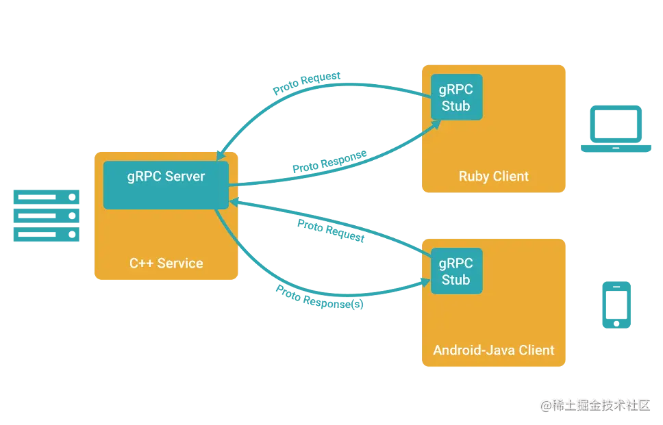

# `golang` `RPC`框架学习与实践

## `RPC`介绍

`RPC`（Remote Procedure Call）是一种计算机通信协议，用于在不同的进程或者计算机之间进行远程过程调用。它让应用程序像调用本地函数一样调用远程函数，隐藏了底层的通信细节，使得远程调用过程更加简单、方便和透明。我们此次主要以`gRPC`框架为例子来介绍：



在 `gRPC` 里*客户端*应用可以像调用本地对象一样直接调用另一台不同的机器上*服务端*应用的方法，使得您能够更容易地创建分布式应用和服务。与许多`RPC`系统类似，`gRPC`也是基于以下理念：定义一个*服务*，指定其能够被远程调用的方法（包含参数和返回类型）。在服务端实现这个接口，并运行一个 `gRPC`服务器来处理客户端调用。在客户端拥有一个*存根*能够像服务端一样的方法。

`gRPC` 客户端和服务端可以在多种环境中运行和交互 - 从 `google` 内部的服务器到你自己的笔记本，并且可以用任何 `gRPC`[支持的语言](https://link.juejin.cn/?target=http%3A%2F%2Fdoc.oschina.net%2Fgrpc%3Ft%3D58008%23quickstart)来编写。所以，你可以很容易地用`Java` 创建一个 `gRPC`服务端，用 `Go`、`Python`、`Ruby` 来创建客户端。此外，`Google` 最新 `API`将有 `gRPC`版本的接口，使你很容易地将 `Google` 的功能集成到你的应用里。

## 工具下载与配置

### `protobuf`工具

（注：笔者为`manjaro`/`linux`环境，其余操作系统可以自行`google`下载配置方法，比如说`windows`可以参考[这个视频](https://link.juejin.cn/?target=https%3A%2F%2Fwww.bilibili.com%2Fvideo%2FBV16Z4y117yz%2F%3Fp%3D3)进行配置）

`protobuf`是`Google`开源的一套成熟的**结构数据序列化机制**（当然也可以使用其他数据格式如`JSON`），并支持跨平台和跨语言的数据交换。与`XML`和`JSON`等文本格式相比，`Protobuf`使用二进制编码，可以减少数据的大小和解析的时间，从而提高了数据传输和处理的效率。

在使用`Protobuf`时，需要先定义数据结构的描述文件（`.proto文件`），然后使用`Protobuf`的编译器生成相应的源代码，以便在程序中使用。`Protobuf`支持多种编程语言，包括C++、Java、Python、Go等，可以在不同语言之间方便地进行数据交换和通信。

**1、下载`protobuf compiler`**

```
复制代码sudo pacman -S protobuf 
```

**2、添加环境变量`GOBIN`**

```javascript
javascript
复制代码export GOBIN=~/go/bin
```

**3、下载`golang`依赖的包**

```go
go
复制代码go get -u github.com/golang/protobuf/protoc-gen-go
```

**4、可能还需要下载一下`protoc-gen-go`插件**

```go
go
复制代码go install google.golang.org/protobuf/cmd/protoc-gen-go
```

然后我们再来测试一下`protobuf`的使用：

- 首先在你的项目目录下新建`./service/user.proto`文件

  ```ini
  ini复制代码// ./service/user.proto
  syntax="proto3";//这是说明使用的protobuf的语法
  
  option go_package="../service";//这是定义的输出go文件的目录
  
  package service;//定义输出文件的包名
  
  //定义传输消息的格式
  message User{
    string username=1;
    int32 age=2;
  }
  ```

- 运行命令`protoc --go_out=./ ./user.proto`，会在指定的目录下生成相应的`pb.go`文件，里面会包含我们定义过的`user`的信息以及一系列的方法。

  ```go
  go复制代码// Code generated by protoc-gen-go. DO NOT EDIT.
  // versions:
  //  protoc-gen-go v1.31.0
  //  protoc        v4.23.4
  // source: user.proto
  
  package service
  
  import (
      protoreflect "google.golang.org/protobuf/reflect/protoreflect"
      protoimpl "google.golang.org/protobuf/runtime/protoimpl"
      reflect "reflect"
      sync "sync"
  )
  
  ......
  
  // define the messege to be transport
  type User struct {
      state         protoimpl.MessageState
      sizeCache     protoimpl.SizeCache
      unknownFields protoimpl.UnknownFields
  
      Username string `protobuf:"bytes,1,opt,name=username,proto3" json:"username,omitempty"`
      Age      int32  `protobuf:"varint,2,opt,name=age,proto3" json:"age,omitempty"`
  }
  
  func (x *User) Reset() {
      *x = User{}
      if protoimpl.UnsafeEnabled {
          mi := &file_user_proto_msgTypes[0]
          ms := protoimpl.X.MessageStateOf(protoimpl.Pointer(x))
          ms.StoreMessageInfo(mi)
      }
  }
  //此处只展示了一部分代码
  ......
  ```

- 然后我们可以在`./main.go`中进行测试了：

  ```go
  go复制代码package main
  
  import (
      "fmt"
      "github.com/golang/protobuf/proto"
      "minitok/service"
  )
  
  func main() {
  
      user3 := &service.User{
          Username: "Nanami",
          Age:      14,
      }//定义一个messege指针
      
      marshal, error := proto.Marshal(user3)//将其序列化
  
      if error != nil {
          panic(error)
      }
  
      newUser := &service.User{}
      err = proto.Unmarshal(marshal, newUser)//解序列化化后赋给newUser
      if err != nil {
          panic(err)
      }
      fmt.Println(marshal)
      fmt.Println(newUser.String())
  }
  
  输出结果如下：
  [10 6 78 97 110 97 109 105 16 14]
  username:"Nanami" age:14
  
  
  ```

  ### `Protobuf`文件解析

  - **首先`Protobuf`文件中的`messege`类型：** 在`Protobuf`文件中，`message`类型是用于描述结构化数据的基本类型。它类似于面向对象编程中的类或结构体，可以包含多个字段，每个字段有一个名称和一个类型。它会在使用`protoc-gen-go`工具之后转化为等价`golang`中的`struct`附加上一堆相应的方法，就像上面所展示的那样。

  除此之外一个`proto`文件可以定义多个`messege`类型，消息还可以嵌套定义。

  - **定义服务`service`类型：**

  在`Protobuf`中，`service`类型用于描述一组可以远程调用的方法。一个`service`类型通常包含多个方法定义，每个方法定义包含一个请求消息类型和一个响应消息类型。

  下面是一个示例，展示了如何定义一个`service`类型：

  ```ini
  ini复制代码syntax = "proto3";
  //实际上定义服务就是相当于定义golang中的接口
  service MyService {
    //rpc+服务名（传入参数类型）returns （返回参数类型）
    rpc GetPerson(MyRequest) returns (MyResponse);
  }
  
  message MyRequest {
    string person_id = 1;
  }
  
  message MyResponse {
    string name = 1;
    int32 age = 2;
    string email = 3;
  }
  ```

  在上面的例子中，`MyService`是一个名为`MyService`的`service`类型，它包含了一个名为`GetPerson`的方法。该方法接受一个`MyRequest`类型的请求消息，并返回一个`MyResponse`类型的响应消息。`MyRequest`和`MyResponse`是两个消息类型，分别用于描述请求和响应的数据结构。

  当编译`Protobuf`文件时，编译器会将`service`类型转换为目标语言的服务类，包括每个方法的定义和相应的请求和响应消息类型。编译器还会生成客户端和服务器端的代码，以便在程序中使用。

  使用`service`类型时，可以在客户端和服务器端分别实现相应的方法，以便进行远程调用。例如，在Java中，可以使用`gRPC`框架来实现`Protobuf`的服务端和客户端。在服务端，需要实现相应的方法，并使用`gRPC`框架来启动服务器。在客户端，需要使用`gRPC`框架来创建一个与服务器通信的客户端，并调用相应的方法。

  - **字段规则**

在`Protobuf`中，每个字段除了有类型和名称之外，还可以指定一个字段规则，用于控制该字段的重复性和可选性。字段规则有三种：

1. `optional`: 表示该字段是可选的，可以出现零次或一次。
2. `required`: 表示该字段是必须的，必须出现一次。如果该字段缺失，反序列化时会抛出异常。不推荐使用该规则，因为它会导致向后兼容性问题。（`proto3`语法可能不支持）
3. `repeated`: 表示该字段是可重复的，可以出现零次、一次或多次。在二进制数据中，可重复的字段会被编码为一个重复值的列表。特别的，在`golang`中会被实现为切片。

```ini
ini复制代码message User{
  string username=1;
  int32 age=2;
  optional string password=3;
  repeated string addresses=4;
}

```

- **字段映射关系**

| .proto Type | C++ Type | Java/Kotlin Type[1] | Python Type[3]                  | Go Type | PHP Type          | Dart Type |
| ----------- | -------- | ------------------- | ------------------------------- | ------- | ----------------- | --------- |
| double      | double   | double              | float                           | float64 | float             | double    |
| float       | float    | float               | float                           | float32 | float             | double    |
| int32       | int32    | int                 | int                             | int32   | integer           | int       |
| int64       | int64    | long                | int/long[4]                     | int64   | integer/string[6] | Int64     |
| uint32      | uint32   | int[2]              | int/long[4]                     | uint32  | integer           | int       |
| uint64      | uint64   | long[2]             | int/long[4]                     | uint64  | integer/string[6] | Int64     |
| sint32      | int32    | int                 | int                             | int32   | integer           | int       |
| sint64      | int64    | long                | int/long[4]                     | int64   | integer/string[6] | Int64     |
| fixed32     | uint32   | int[2]              | int/long[4]                     | uint32  | integer           | int       |
| fixed64     | uint64   | long[2]             | int/long[4]                     | uint64  | integer/string[6] | Int64     |
| sfixed32    | int32    | int                 | int                             | int32   | integer           | int       |
| sfixed64    | int64    | long                | int/long[4]                     | int64   | integer/string[6] | Int64     |
| bool        | bool     | boolean             | bool                            | bool    | boolean           | bool      |
| string      | string   | String              | str/unicode[5]                  | string  | string            | String    |
| bytes       | string   | ByteString          | str (Python 2) bytes (Python 3) | []byte  | string            | List      |

## `gRPC`上手实践

我们不妨来上手写一个小小的`RPC`实例来体验一下整个流程：

首先不妨看一下项目目录结构

```go
go复制代码➜  minitok tree -a ./
./
├── client
│   └── client.go #客户端代码，主要是申请连接端口、调用RPC
├── go.mod
├── go.sum
├── main
│   ├── main.go
│   └── server.go #服务端代码，主要是用于监听端口，绑定服务函数
├── pbfiles
│   └── request.proto #proto文件的存放路径
├── service
    ├── request.pb.go #proto产生的go代码存放处
    └── service.go #服务接口的实现
```

#### 首先我们先来看一下`server.go`

```go
go复制代码package main

import (
	"fmt"
	"google.golang.org/grpc" // 导入 gRPC 库
	"log"
	"minitok/service" // 导入我们自定义的服务处理接口
	"net"
)

func main() {
	// 创建一个新的 gRPC 服务器
	rpcServer := grpc.NewServer()

	// 将服务端和我们自定义的服务处理接口联系起来（接口实现实例写在 /service/service.go 中）
	service.RegisterProductStockLookUpServer(rpcServer, &service.ProServer1)

	// 启动监听在 13233 端口
	listener, err1 := net.Listen("tcp", ":13233")
	if err1 != nil {
		log.Fatal("failed to start listen"+"8090", err1)
	}

	// 在端口处启动服务
	err2 := rpcServer.Serve(listener)
	if err2 != nil {
		log.Fatal("failed to start service")
	} else {
		fmt.Println("start GRPC service successfully")
	}
	fmt.Println("start GRPC service successfully")
}
```

当您使用 `gRPC` 构建服务时，您需要创建一个 gRPC 服务器和一个服务处理接口来处理客户端的请求。在这段代码中，我们创建了一个 `gRPC`服务器并将其绑定到 `13233` 端口，然后将服务处理接口与服务器联系起来，以便在接收到客户端请求时执行相应的操作。

以下是对这段代码的更详细解释：

1. 导入 `gRPC` 库和自定义服务处理接口：

   ```go
   go复制代码import (
       "google.golang.org/grpc"
       "minitok/service"
       "net"
   )
   ```

2. 创建 gRPC 服务器：

   ```css
   css
   复制代码rpcServer := grpc.NewServer()
   ```

   通过调用 `grpc.NewServer()` 函数创建一个新的 gRPC 服务器。

3. 将服务处理接口和服务器联系起来：

   ```scss
   scss
   复制代码service.RegisterProductStockLookUpServer(rpcServer, &service.ProServer1)
   ```

   `RegisterProductStockLookUpServer` 函数将服务处理接口（在 `/service/service.go` 中定义）与服务器联系起来。在这里，我们将 `ProServer1` 的实例与服务器联系起来，以便在接收到客户端请求时调用该实例的方法来处理请求。

4. 启动监听在指定端口：

   ```css
   css
   复制代码listener, err1 := net.Listen("tcp", ":13233")
   ```

   `net.Listen()` 函数用于在指定端口上启动网络监听器。在这里，我们将监听器绑定到 `13233` 端口。

5. 在指定端口处启动服务：

   ```go
   go
   复制代码err2 := rpcServer.Serve(listener)
   ```

   `Serve()` 函数用于在指定的监听器上启动 `gRPC` 服务器。在这里，我们将 `gRPC`服务器绑定到之前创建的监听器上，以便在接收到客户端请求时执行相应的操作。

6. 处理错误并输出日志：

   ```go
   go复制代码if err1 != nil {
       log.Fatal("failed to start listen"+"8090", err1)
   }
   if err2 != nil {
       log.Fatal("failed to start service")
   }
   ```

   如果监听器或服务器启动失败，则会发生错误。在这里，我们使用 `log.Fatal()` 函数记录错误并退出程序。

7. 输出成功信息：

   ```arduino
   arduino
   复制代码fmt.Println("start GRPC service successfully")
   ```

   如果服务器成功启动，则输出成功信息。

#### 然后我们再来看一下处理接口的具体实现`/service/service.go`：

```go
go复制代码//service.go主要是为了实现在server.go中RegisterProductStockLookUpServer函数第二个参数而设计的
package service

import "context"
//定义一个全局实例
var ProServer1 productSer = productSer{}
//实现request_pb.go中定义的接口
type productSer struct {
}

//实现接口中定义的方法，详细可以看下文中的codegen工具生成的request_pb.go代码
func (p *productSer) GetProdc(c context.Context, req *ProductRequest) (*ProductResponse, error) {
	stock := int64(p.GetStockById(req.StockId))
	res := &ProductResponse{StockNum: (&stock)}
	return res, nil
}

func (p *productSer) GetStockById(id *int64) int64 {
	return 114514
}
```

#### 然后是`request.pb.go`文件中的部分代码

```go
go复制代码// ProductStockLookUpServer is the server API for ProductStockLookUp service.
type ProductStockLookUpServer interface {
    GetProdc(context.Context, *ProductRequest) (*ProductResponse, error)
}//这就是我们之前提到的GRPC框架为我们定义的服务接口我们需要自己实现自己具体的业务逻辑

type ProductRequest struct {
	state         protoimpl.MessageState
	sizeCache     protoimpl.SizeCache
	unknownFields protoimpl.UnknownFields

	StockId *int64 `protobuf:"varint,1,opt,name=stock_id,json=stockId,proto3,oneof" json:"stock_id,omitempty"`
}//这是我们在proto文件中定义的messege在codeGEN下生成的代码
```

#### 最后是`client.go`客户端的实现

```go
go复制代码package main

import (
	"context"
	"fmt"
	"google.golang.org/grpc"
	"google.golang.org/grpc/credentials/insecure"
	"log"
	"minitok/service"
)

func main() {
    //通过13233端口与服务断进行连接
	conn, err := grpc.Dial(":13233", grpc.WithTransportCredentials(insecure.NewCredentials()))
	if err != nil {
		log.Fatal("client failed to connect to server")
	} 
    //新建客户端
	prodClient := service.NewProductStockLookUpClient(conn)
	i := int64(111)
	//调用rpc服务
    req := &service.ProductRequest{StockId: &i}
	//输出结果
	stockRes, err2 := prodClient.GetProdc(context.Background(), req)
	if err2 != nil {
		log.Fatal("failed to get response", err2)
	}
	fmt.Println("ok client suc ", stockRes.GetStockNum())
}
```

这段代码是一个`gRPC`客户端，它通过 13233 端口与一个 gRPC 服务器进行连接，并调用了服务处理接口中的一个方法。

以下是这段代码的更详细解释：

1. 导入 `gRPC` 库和自定义服务处理接口：

   ```go
   go复制代码import (
       "context"
       "fmt"
       "google.golang.org/grpc"
       "google.golang.org/grpc/credentials/insecure"
       "log"
       "minitok/service"
   )
   ```

2. 与 `gRPC`服务器建立连接：

   ```css
   css
   复制代码conn, err := grpc.Dial(":13233", grpc.WithTransportCredentials(insecure.NewCredentials()))
   ```

   `grpc.Dial()` 函数用于建立与 gRPC 服务器的连接。在这里，我们使用 `:13233` 作为服务器的地址，`grpc.WithTransportCredentials()` 函数指定使用安全连接，`insecure.NewCredentials()` 函数创建一个不安全的连接凭据。

3. 创建 `gRPC`客户端：

   ```css
   css
   复制代码prodClient := service.NewProductStockLookUpClient(conn)
   ```

   使用 `service.NewProductStockLookUpClient()` 函数创建一个新的 `gRPC` 客户端，该客户端与连接到的`gRPC`服务器相关联。

4. 调用`RPC`服务：

   ```css
   css复制代码req := &service.ProductRequest{StockId: &i}
   stockRes, err2 := prodClient.GetProdc(context.Background(), req)
   ```

   在这里，我们创建了一个 `ProductRequest` 对象，该对象包含一个 `StockId` 字段。然后，我们使用 `prodClient.GetProdc()` 函数调用了服务处理接口中的一个方法，并将 `ProductRequest` 对象作为参数传递给该方法。返回的结果存储在 `stockRes` 变量中。

5. 输出结果：

   ```less
   less
   复制代码fmt.Println("ok client suc ", stockRes.GetStockNum())
   ```

   在这里，我们使用 `stockRes.GetStockNum()` 函数获取 `stockRes` 中的 `StockNum` 字段，并将其输出到控制台。