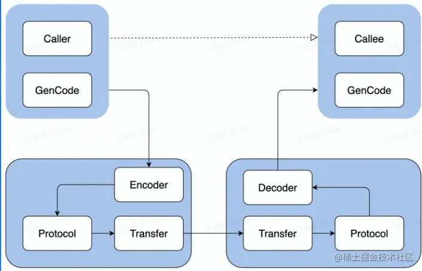
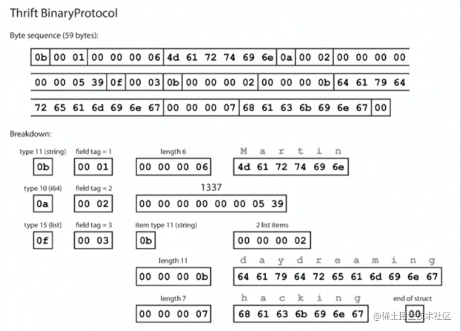

## 目录

- 01基本概念
- 02分层设计
- 03关键指标

## 01基本概念

### 1.1 本地函数调用


调用过程：

1. 将a和b的值压栈
2. 通过函数指针找到calculate函数，进入函数取出栈中的值2和3，将其赋予x和y。
3. 计算x*y，并将结果存在Z。
4. 将Z的值压栈，然后从calculate返回。
5. 从栈中取出Z返回值，并赋值给result。

### 1.2 远程函数调用（RPC-Remote Procedure Calls）

需要解决的问题：

1. 函数映射 需要告诉服务要调用哪个函数，因此函数有自己的ID，在做RPC的时候附上这个ID，并且还要有一个ID和函数的对照关系表。
2. 数据转换成字节流 客户端把参数先转成一个字节流，传给服务端后，再把字节流转成自己能读取的格式。
3. 网络传输 需要保证网络高效稳定地传输数据。

### 1.3 RPC概念模型


```
复制代码①发起本地调用
②数据打包
③数据传送给对端
④数据接收
⑤解压数据
⑥数据处理
⑦结果数据打包
⑧传送返回数据
⑨接收数据
⑩解压数据
⑪数据结果返回
```

1984年Nelson发表了论文《Implementing Remote Procedure Calls》，其中提出了RPC的过程由5个模型组成: User、User Stub、RPC Runtime、Server- Stub、Server。

### 1.4一次RPC的完整过程

- IDL (Interface description language)文件 IDL通过一种中立的方式来描述接口，使得在不同平台上运行的对象和用不同语言编写的程序可以相互通信。（约定调用规范）
- 生成代码 通过编译器工具把IDL文件转换成语言对应的静态库。（具体调用的时候用户代码需要依赖生成代码，所以可以把用户代码和生成代码看做一个整体）
- 编解码 从内存中表示到字节序列的转换称为编码，反之为解码，也常叫做序列化和反序列化。
- 通信协议 规范了数据在网络中的传输内容和格式。除必须的请求/响应数据外，通常还会包含额外的元数据。
- 网络传输 通常基于成熟的网络库走TCP/UDP传输。



### 1.5 RPC的好处

1.单一职责，有利于分工协作和运维开发（开发可以采用不同语言；部署及运维都是独立的） 2.可扩展性强，资源使用率更优（压力过大时可以独立扩充资源，底层基础服务可以复用，达到节省资源的目的） 3.故障隔离（一个模块发生故障，不会影响整体，服务的整体可靠性更高）

### 1.6 RPC带来的问题 -- RPC框架解决

1.服务宕机，对方应该如何处理? 2.在调用过程中发生网络异常，如何保证消息的可达性? 3.请求量突增导致服务无法及时处理，有哪些应对措施?

### 01.小结

1. 本地函数调用和RPC调用的区别：函数映射、数据转成字节流、网络传输
2. RPC的概念模型: User、 User-Stub、 RPC- Runtime、Server Stub、Server
3. 一次PRC的完整过程，并讲解了RPC的基本概念定义
4. RPC带来好处的同时也带来了不少新的问题，将由RPC框架来解决

## 02分层设计

### 2.1分层设计-以Apache Thrift为例


### 2.2编解码层

- 生成代码 依赖同一份IDL文件（同一份约束）生成不同语言的生成代码。
- 数据格式 1.语言特定的格式

许多编程语言都内建了将内存对象编码为字节序列的支持，例如Java有java.io.Serializable （优点：方便，可以用很少的额外代码实现内存对象的保存与恢复。 缺点：这类编码通常与特定的编程语言深度绑定，其他语言很难读取这种数据。有安全和兼容性问题。）

2.文本格式

JSON、XML、CSV等文本格式，具有人类可读性 （缺点：XML和CSV不能区分数字和字符串，JSON不区分整数和浮点数，不能指定精度，数据量大时问题更严重；没有强制模型约束，实际操作中往往只能采用文档方式来进行约定，这可能会给调试带来些不便；JSON在一些语言中的序列化和反序列化需要采用反射机制，编码解码费时间，所以还存在性能较差的问题）

3.二进制编码

具备跨语言和高性能等优点，常见有Thrift 的BinaryProtocol, Protobuf 等（实现有多种，例TLV编码和Varint编码）

- 二进制编码 TLV编码 Tag：标签，可以理解为类型 Lenght：长度 Value：值，Value也可以是个TLV结构

```arduino
arduino复制代码struct Person {
    1: required string       userName,
    2: optional 164          favor iteNumber,
    3: optional list<string> interests
}
```



- 选型 兼容性

支持自动增加新的字段，而不影响老的服务，这将提高系统的灵活度。

通用性

支持跨平台、跨语言（①技术层面，序列化协议要支持跨平台、跨语言。②流行程度，可以判断此协议是否成熟，同时序列化和反序列化需要多方参与，很少人使用的协议往往意味着昂贵的学习成本。）

性能

从空间和时间两个维度来考虑，也就是编码后数据大小和编码耗费时长。

### 2.5 协议层

- 概念 特殊结束符

一个特殊字符作为每个协议单元结束的标示。（缺点：过于简单，对于一个协议单元必须要全部读入才能够进行处理，除此之外必须要防止用户传输的数据不能同结束符相同，否则就会出现紊乱。 HTTP协议头就是以回车(CR)加换行(LF)符号序列结尾。）

变长协议

以定长加不定长的部分组成，其中定长的部分需要描述不定长的内容长度。（一般都是自定义协议，有header和payload组成，使用比较广泛）

- 协议构造： 
  - LENGTH(32bits):数据包大小，不包含自身长度
  - HEADER MAGIC(16bits):标识版本信息，协议解析时
  - 候快速校验
  - SEQUENCE NUMBER(32bits):表示数据包的seqlD,
  - 可用于多路复用，单连接内递增
  - HEADER SIZE(16bits):头部长度，从第14个字节开始计算一直到PAYLOAD前
  - PROTOCOL ID(unit8编码):编解码方式，取值有ProtocollDBinary = 0；ProtocollDCompact = 2两种。
  - NUM TRANSFORMS(uint8编码):表示TRANSFORM个数
  - TRANSFORM ID(unit8编码):压缩方式，如zlib和snappy
  - INFO ID(unit8编码):传递一些定制的meta信息
  - PAYLOAD:消息体
- 协议解析


### 2.3 网络通信层：

- Sockets API 介于通信层和应用层之间  套接字编程中的客户端必须知道两个信息:服务器的IP地址、端口号。

socket函数创建一个套接字， bind将一个套接字绑定到一个地址上。listen 监听进来的连接，backlog指定挂起的连接队列的长度，当客户端连接的时候，服务器可能正在处理其他逻辑而未调用accept接受连接，此时会导致这个连接被挂起，内核维护挂起的连接队列，backlog则指定这个队列的长度，accept函数从队列中取出连接请求并接收它，然后这个连接就从挂起队列移除。

如果队列未满，客户端调用connect马上成功，如果满了可能会阻塞等待队列未满(实际上在Linux中测试并不是这样的结果，还需专门研究)。Linux的backlog默认是128, 通常情况下，我们也指定为128即可。

connect客户端向服务器发起连接，accept 接收一个连接请求，如果没有连接则会直阻塞直到有连接进来。 得到客户端的fd之后，就可以调用read, write函数和客户端通讯，读写方式和其他I/O类似。

read从fd读数据，socket默认是阻塞模式的，如果对方没有写数据，read会一直阻塞着。

write写fd写数据，socket默认是阻塞模式的，如果对方没有写数据，write会一直阻塞着。

socket关闭套接字，当另-端socket关闭后， 这一端读写的情况:

```diff
diff复制代码- 尝试去读会得到一个EOF, 并返回0。
- 尝试去写会触发一个SIGPIPE信号， 并返回-1和ermno=EPIPE， SIGPIPE的默认行为是终止程序，所以通常我们应该忽略这个信号，避免程序终止。
- 如果这一端不去读写，我们可能没有办法知道对端的socket关闭了。
```

- 网络库 提供易用API
  - 封装底层Socket API
  - 连接管理和事件分发 功能
  - 协议支持: tcp、 udp 和uds等
  - 优雅退出、异常处理等

性能

```diff
diff复制代码- 应用层buffer减少copy
- 高性能定时器、对象池等
```

### 02.小结

1. RPC框架主要核心有三层：编解码层、协议层和网络通信层
2. 二进制编解码的实现原理和选型要点
3. 协议的一般构造， 以及框架协议解析的基本流程
4. Socket API的调用流程，以及选型网络库时要考察的核心指标

## 03关键指标

### 3.1 稳定性-保障策略

- 熔断:保护调用方，防止被调用的服务出现问题而影响到整个链路
- 限流:保护被调用方，防止大流量把服务压垮（降级处理/返回限流异常）
- 超时控制:避免浪费资源在不可用节点上（超时主动停掉不太重要的业务） （以上三种都是快速返回，避免资源浪费在不可调用的请求上，也是服务降级的手段）

### 3.2稳定性-请求成功率

- 负载均街
- 重试（会加大直接下游的负载，有放大故障的风险） 防止重试风暴，限制单点重试和限制链路重试。

### 3.3稳定性-长尾请求

长尾请求一般是指明显高于均值的那部分占比较小的请求。业界关于延迟有一个常用的P99标准， P99 单个请求响应耗时从小到大排列，顺序处于99%位置的值即为P99值，那后面这1%就可以认为是长尾请求。在较复杂的系统中，长尾延时总是会存在。造成这个的原因非常多，常见的有网络抖动，GC，系统调度。 

我们预先设定一个阈值 t3 (比超时时间小，通常建议是RPC请求延时的pct99)，当Req1发出去后超过t3时间都没有返回，那我直接发起重试请求Req2，这样相当于同时有两个请求运行。然后等待请求返回，只要Resp1或者Resp2任意一个返回成功的结果， 就可以立即结束这次请求，这样整体的耗时就是t4，它表示从第一个请求发出到第一个成功结果返回之 间的时间，相比于等待超时后再发出请求，这种机制能大大减少整体延时。

### 3.4稳定性-注册中间件

 Kitex Client和Server的创建接口]均采用Option模式，提供了极大的灵活性，很方便就能主入这些稳定性策略

### 3.5易用性

开箱即用： 合理的默认参数选项、丰富的文档

周边工具： 生成代码工具、脚手架工具

Kitex使用Suite来打包自定义的功能，提供「一键配置基础依赖」的体验

```diff
diff复制代码- 生成服务代码脚手架
- 支持protobuf 和thrift
- 内置功能丰富的选项
- 支持自定义的生成代码插件
```

### 3.6扩展性

- Middleware
- Option
- 编解码层
- 协议层
- 网络传输层
- 代码生成工具插件扩展

 一次请求发起首先会经过治理层面， 治理相关的逻辑被封装在middleware中，这些middleware会被构造成一个有序调用链逐个执行，比如服务发现、路由、负载均衡、超时控制等，mw执行后就会进入到remote模块，完成与远端的通信。

### 3.7观测性

Log、Metric、Tracing

内置观测性服务

 除了传统的Log、Metric、Tracing 三件套之外，对于框架来说可能还不够，还有些框架自身状态需要暴露出来，例如当前的环境变量、配置、Client/Server初始化参数、缓存信息等。

### 3.8 高性能

这里分两个维度，高性能意味着高吞吐和低延迟，两者都很重要，甚至大部分场景下低延迟更重要。

多路复用可以大大减少了连接带来的资源消耗，并且提升了服务端性能，我们的测试中服务端吞吐可提升30%。

调用端向服务端的一个节点发送请求，并发场景下，如果是非连接多路复用，每个请求都会持有一个连接， 直到请求结束连接才会被关闭或者放入连接池复用，并发量与连接数是对等的关系。

而使用连接多路复用，所有请求都可以在一个连接上完成，连接资源利用上的差异明显。

### 03.小结

```diff
diff复制代码- 框架通过中间件来注入各种服务治理策略，保障服务的稳定性。
- 通过提供合理的默认配置和方便的命令行I具可以提升框架的易用性。
- 框架应当提供丰富的扩展点，例如核心的传输层和协议层。
- 观测性除了传统的Log、Metric 和Tracing之外，内置状态暴露服务也很有必要。
- 性能可以从多个层面去优化，例如选择高性能的编解码协议和网络库。
```

## 课程总结

- 从本地函数调用引出RPC的基本概念。
- 重点讲解了RPC框架的核心的三层，编解码层、协议层和网络传输层。
- 围绕RPC框架的核心指标，例如稳定性、可扩展性和高性能等，展开讲解相关的知识。

————THE END————


## 企业实践

### 整体架构

1. Kitex Core 核心组件
2. Kitex Byted 与公司内部基础设施集成
3. Kitex Tool 代码生成工具


### 自研网络库

#### 背景

1. 原生库无法感知连接状态 使用连接池时，池中存在失效连接，影响连接池的复用
2. 原生库存在goroutine暴涨的风险 一个连接一个goroutine的模式，由于连接利用率低下，存在大量goroutine占用调度开销，影响性能

#### 自研网络库 Netpoll

1. 解决无法感知连接状态问题 引入epoll主动监听机制，感知连接状态
2. 解决goroutine暴涨的风险 建立goroutine池，复用goroutine
3. 提升性能 引入 NocopyBuffer，向上提供NoCopy的调用接口，编解码层面零拷贝

### 扩展性设计

支持多协议，也支持灵活的自定义协议扩展


### 性能优化

#### 网络库优化

1. 调度优化
   - epoll_wait 在调度上的控制
   - gopool 重用 goroutine 降低同时运行协程数
2. LinkBuffer
   - 读写并行无锁，支持nocopy地流式读写
   - 高效扩缩容
   - NocopyBuffer池化，减少GC
3. Pool
   - 引入内存池和对象池，减少GC开销

#### 编解码优化

1. Codegen
   - 预计算并分配内存，减少内存操作次数，包括内存分配和拷贝
   - Inline减少函数调用次数和避免不必要的反射操作等
   - 自研了Go语言实现的ThriftIDL 解析和代码生成器，支持完善的ThriftIDL语法和语义检查，并支持了插件机制- ThriftGo
2. JIT
   - 使用JIT编译技术改善用户体验的同时带来更强的编解码性能，减轻用户维护生成代码的负担
   - 基于JIT编译1技术的高性能动态Thrift编解码器- Frugal

## 合并部署

微服务过微，传输和序列化开销越来越大

将亲和性强的服务实例尽可能调度到一个物理机，远程RPC调用优化为本地IPC调用

1. 中心化的部署调度和流量控制
2. 基于共享内存的通信协议
3. 定制化的服务发现和连接池实现
4. 定制化的服务启动和监听逻辑


