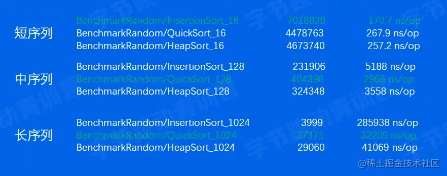
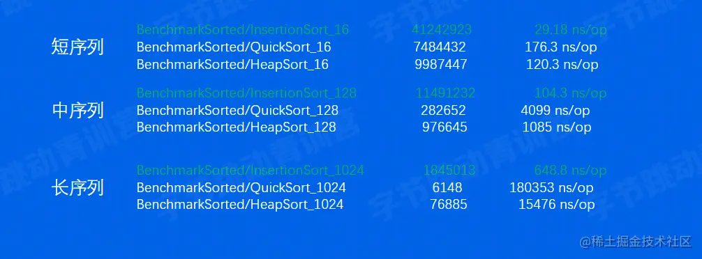
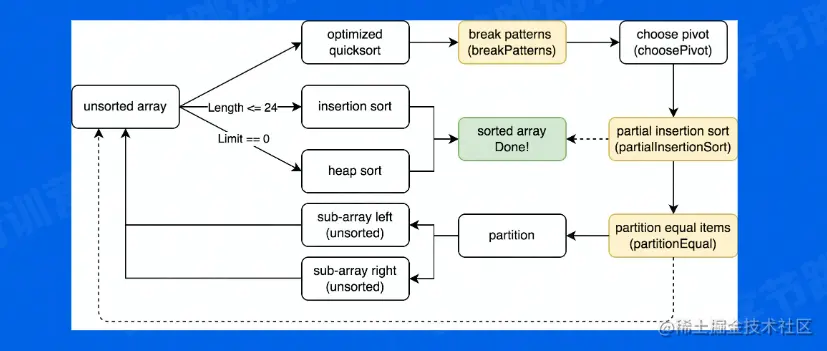

# Go 1.19的排序算法主要使用的基本排序算法

## 插入排序（InsertionSort）

将元素不断插入已排好的序列中

实现： 后续元素插入有序序列中，即不断交换，直到找到第一个比其小的元素

时间复杂度：

| Best | Avg    | Worst  |
| ---- | ------ | ------ |
| O(n) | O(n^2) | O(n^2) |

## 快速排序（QuickSort）

分支思想，不断分割序列直到序列整体有序

实现：

- 选定一个pivot（轴点）

- 使用pivot分割序列，分成元素比pivot大和元素比pivot小的两个序列

  | Best      | Avg       | Worst  |
  | --------- | --------- | ------ |
  | O(n*logn) | O(n*logn) | O(n^2) |

## 堆排序（HeapSort）

利用堆的性质形成的排序算法

- 构造一个大顶堆

- 将根节点（最大元素交换到最后一个位置，调整整个堆），如此反复

  | Best      | Avg       | Worst     |
  | --------- | --------- | --------- |
  | O(n*logn) | O(n*logn) | O(n*logn) |

------

汇总

|               | Best      | Avg       | Worst     |
| ------------- | --------- | --------- | --------- |
| InsertionSort | O(n)      | O(n^2)    | O(n^2)    |
| QuickSort     | O(n*logn) | O(n*logn) | O(n^2)    |
| HeapSort      | O(n*logn) | O(n*logn) | O(n*logn) |

## 三种排序性能对比

Benchmark-random（完全随机的情况） 

- **插入排序在短序列中速度最快**
- **快速排序在其他情况中速度最快**
- **堆排序速度与最快算法差距不大 Benchmark-sorted（序列排好序的情况下**）

 插入排序在序列有序的情况下最快

综合以上特点，打造了pdqsort

# pdqsort（pattern-defeating-quicksort）

一种不稳定的混合排序算法，它的不同版本被应用在C++、Boost、Rust以及Go 1.19中，它对常见的序列类型做了特殊优化，使得在不同条件下都拥有不错的性能

## 思路

- 对于短序列（小于一定长度），使用插入排序
- 其他情况，使用快速排序保证整体性能
- 当快速排序表象不佳，使用堆排序保证最坏情况小时间复杂度仍然为O(n*logn)

tips：

- 这里短序列的具体长度为12~32，在不同语言和场景会有不同，在泛型版本根据测试选定24
- 当最终pivot的位置离序列两端很接近时（距离小于length/8）判定快速排序表现不佳，当这种情况达到limit(即bits.Len(length)),切换到堆排序

## 提速

1. 尽量使得QuickSort的pivot为序列中位数 寻找近似中位数

优化：

- 短序列（<=8），选择固定元素
- 中序列（<=50）,采样三个元素
- 长序列（>=50）,采样九个元素

优化的采样方式使得pdqsort有探知序列当前状态的能力

1） 采样的元素都是逆序排列，序列可能已经逆序 => 翻转整个序列 2） 采样的元素都是顺序序列，序列可能已经有序 => 使用插入排序

注：插入排序实际使用partialInsertSort，即有限次数的插入排序

1. Partition 此优化在Go表现不好，略过

## 应对重复元素很多的情况

采样pivot的时候检测重复度不是很好，因为采样数量有限，不一定能采到相同元素。

解决方案：

如果两次partition生成的pivot相同，即partition进行了无效分割，此时认为pivot的值为重复元素，使用partitionEqual将重复元素排列在一起，减少重复元素对于pivot选择的干扰

## 应对极端情况

当pivot选择策略表现总是不佳，以及一些黑客攻击情况出现，就随机交换元素

|               | Best      | Avg       | Worst     |
| ------------- | --------- | --------- | --------- |
| InsertionSort | O(n)      | O(n^2)    | O(n^2)    |
| QuickSort     | O(n*logn) | O(n*logn) | O(n^2)    |
| HeapSort      | O(n*logn) | O(n*logn) | O(n*logn) |
| pdqsort       | O(n)      | O(n*logn) | O(n*logn) |

流程图：

 经测试pdqsort在序列有序或逆序的情况下提升10X

其他情况下有10%~50%提升

 
