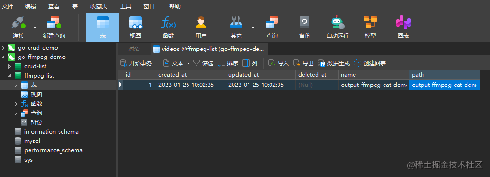

### 定义外键

程序会自动识别定义的外键Author的外键是AuthorId 

```go
type Video struct {
	Id            int64  `json:"id,omitempty"`
	AuthorId      int64  `json:"author_id"` // 外键字段
	Author        User   `json:"author"`  //在Author后加上Id字段即可创建一个外键字段
	PlayUrl       string `json:"play_url" json:"play_url,omitempty"`
	CoverUrl      string `json:"cover_url,omitempty"`
	FavoriteCount int64  `json:"favorite_count,omitempty"`
	CommentCount  int64  `json:"comment_count,omitempty"`
	IsFavorite    bool   `json:"is_favorite,omitempty"`
}
type User struct {
	Id              int64  `json:"id,omitempty"`
	Name            string `json:"name,omitempty"`
	FollowCount     int64  `json:"follow_count,omitempty"`
	FollowerCount   int64  `json:"follower_count,omitempty"`
	Avatar          string `json:"avatar,omitempty"`
	BackgroundImage string `json:"background_image,omitempty"`
	Signature       string `json:"signature,omitempty"`
	TotalFavorited  int64  `json:"total_favorited,omitempty"`
	WorkCount       int64  `json:"work_count,omitempty"`
	FavoriteCount   int64  `json:"favorite_count,omitempty"`
	Token           string `json:"token,omitempty"`
}

```

### Token（加密密码）

```go
"golang.org/x/crypto/bcrypt" //加入包
```

```go
	db := c.MustGet("db").(*gorm.DB)

	// 从参数中获取用户名和密码
	username := c.Query("username")
	password := c.Query("password")

	// 生成用户token
	tokenBytes, err := bcrypt.GenerateFromPassword([]byte(password), bcrypt.DefaultCost)
	if err != nil {
		ReturnError(c, "注册失败，请重试", 2)
		fmt.Printf("Generate token error: %v", err)
		return
	}
	token := string(tokenBytes)
```

这段代码使用了 `bcrypt` 包对给定的密码进行哈希处理，生成一个安全的哈希密码。

`bcrypt.GenerateFromPassword` 函数接收两个参数：第一个参数是要进行哈希处理的原始密码，第二个参数是哈希算法的成本参数。成本参数是一个整数，用于指定哈希算法的计算强度，默认值是 `bcrypt.DefaultCost`。

生成的哈希密码是一个字节数组，表示经过哈希算法处理后的密码。在这段代码中，生成的哈希密码存储在 `tokenBytes` 变量中。

如果生成哈希密码的过程中发生错误，那么 `err` 变量将被赋值为非 `nil` 值。你可以在代码中添加错误处理逻辑来处理可能的错误情况。

简而言之，这段代码使用 `bcrypt` 包来生成给定密码的哈希密码，并将其存储在 `tokenBytes` 变量中。

登录时候对比密码：

```go
    var user User
	result := db.Where(User{Name: username}).First(&user) //搜索数据库
	if result.Error != nil {
		ReturnError(c, "用户不存在", 2)
		return
	}

	// 校验密码
	err := bcrypt.CompareHashAndPassword([]byte(user.Token), []byte(password))//
	if err != nil {
		ReturnError(c, "密码错误", 3)
		return
	}
```

这行代码是在检查提供的密码是否与存储的哈希密码匹配。如果密码不匹配，变量`err`将包含一个错误；如果密码匹配，则为`nil`

###  注册数据库连接中间件

注册的数据库连接中间件需要以下几个步骤：

1. 导入 gin 和数据库库（例如 gorm）：
```go
import (
	"github.com/gin-gonic/gin"
	"gorm.io/gorm"
)
```

2. 创建一个 Gin 实例：
```go
r := gin.Default()
```

3. 注册数据库连接中间件：
```go
r.Use(func(c *gin.Context) {
	c.Set("db", db)
	c.Next()
})
```
这里的 `db` 是数据库连接实例:

4. **定义请求处理函数并在函数中获取数据库连接**：
```go
func getUser(c *gin.Context) {
	db := c.MustGet("db").(*gorm.DB)
	// 在这里可以使用 db 进行数据库操作
	// 例如: db.First(&user, id)
	// 处理完毕后返回响应
	c.JSON(http.StatusOK, gin.H{
		"message": "Get user",
	})
}
```
在这个例子中，`getUser` 函数中的 `db := c.MustGet("db").(*gorm.DB)` 语句获取了之前中间件函数存储在 Gin 上下文中的数据库连接。

在 Gin 框架中，`c.MustGet("key")` 是一个用于在上下文中获取值的方法。它会尝试从上下文中获取指定键（key）对应的值，如果获取失败，则会引发 panic。

具体到你的例子 `db := c.MustGet("db").(*gorm.DB)`，意味着从 Gin 上下文中获取名为 “db” 的值，并将其断言为 `*gorm.DB` 类型。如果获取失败或者值的类型不是 `*gorm.DB`，那么会触发 panic。

> 这种方式适用于在中间件函数中设置的上下文值（如之前所提到的设置了数据库连接的案例）。由于我们确保已经存储了 “db” 键和对应的数据库连接实例，因此使用 `c.MustGet("db").(*gorm.DB)` 可以直接获取到数据库连接对象，无需检查错误或者进行类型转换。但是，请注意这也意味着如果 “db” 键不存在或者值不是 `*gorm.DB` 类型，会触发 panic。

5. 定义路由并将请求处理函数与路由关联起来：
```go
r.GET("/user/:id", getUser)
```

6. 启动 Gin 服务器：
```go
r.Run(":8080")
```

这样，当接收到 `GET` 请求 `/user/:id` 时，中间件函数将会将数据库连接存储在 Gin 上下文中，并调用 `getUser` 函数来处理该请求，而 `getUser` 函数中则可以方便地获取并使用数据库连接。

### 表单

`token := c.PostForm("token")` 是一个在 Gin 框架中获取 POST 请求的表单参数的方式。

根据这个代码片段的调用来看，`c` 是一个 gin.Context 对象，用于处理请求和发送响应。`PostForm` 是一个用于从请求中获取 POST 表单数据的方法，它接收一个参数，该参数表示 POST 表单参数的键（key）。

在这个示例中，`"token"` 是一个特定的键，用于获取表单中名为 “token” 的值。通过调用 `c.PostForm("token")`，可以将表单中 “token” 的值赋给变量 `token`。


`username := c.Query("username")` 是一个在 Gin 框架中获取 URL 查询参数的方式。

根据这个代码片段的调用来看，`c` 是一个 gin.Context 对象，用于处理请求和发送响应。`Query` 是一个用于从 URL 中获取查询参数的方法，它接收一个参数，该参数表示查询参数的键（key）。

在这个示例中，`"username"` 是一个特定的键，用于获取 URL 查询参数中名为 “username” 的值。通过调用 `c.Query("username")`，可以将 URL 查询参数中 “username” 的值赋给变量 `username`。

请注意，这种方式适用于从 URL 中获取查询参数的情况。URL 查询参数是指通过在 URL 后附加 `?key=value` 形式的参数进行传递。例如，如果 URL 是 `http://example.com/?username=john`，那么调用 `c.Query("username")` 将返回 “john”。

### 上传文件

`data, err := c.FormFile("data")` 是在 Gin 框架中获取上传的文件的方式。

根据这段代码，`c` 是一个 gin.Context 对象，用于处理请求和发送响应。

`.FormFile("data")` 是一个方法，用于从请求中获取上传的文件。它接收一个参数，即表示表单字段名的字符串 `"data"`。这里的 `"data"` 是一个示例名称，你需要根据实际情况提供表单字段的名称。

调用 `c.FormFile("data")` 将返回两个值：
1. `data`：表示上传的文件本身。它是一个类型为 `*multipart.FileHeader` 的对象，你可以通过对该对象使用 `.Filename` 和 `.Size` 等方法来获取文件的名称和大小等信息。
2. `err`：表示文件获取的错误。如果文件成功获取，则 `err` 为 `nil`；如果出现了错误，如文件上传失败或字段名不正确等情况，则 `err` 将包含相应的错误信息。

在你的代码中，你可以使用 `data` 和 `err` 进行进一步的处理。例如，你可以对错误进行检查，如果发现错误，则根据具体情况进行相应的处理。而如果没有错误，你可以使用 `data` 对象进行文件处理，比如保存文件到磁盘或进行进一步的操作。

需要注意的是，文件上传需要确保请求的 Content-Type 设置为 `multipart/form-data`，并且表单字段的 `name` 属性与代码中使用的字段名一致。

如果你需要更多关于 Gin 框架中处理文件上传的信息，可以参考 Gin 的官方文档或示例代码。

### 保存位置

`saveFile := filepath.Join("./public/", finalName)` 是将文件路径拼接起来的代码。

根据这段代码，`filepath.Join()` 是一个用于拼接文件路径的函数。它接收多个字符串作为参数，并返回拼接后的路径字符串。

在这里，`"./public/"` 是一个字符串，表示目标文件的存储目录。`finalName` 是另一个字符串，表示文件的最终名称。

调用 `filepath.Join("./public/", finalName)` 将这两个字符串拼接起来，并赋值给 `saveFile` 变量。拼接完成后，`saveFile` 就是最终的文件路径。

可以将该路径用于操作文件，比如保存文件到磁盘或进行其他相关操作。

需要注意的是，`filepath.Join()` 函数会根据当前操作系统的约定来处理路径分隔符，以保证生成的路径是正确的。在 Unix 系统上，路径分隔符是 `/`，而在 Windows 系统上，路径分隔符是 `\`。

如果你对路径的处理有其他需求，可以考虑使用 `path/filepath` 包中的其他函数，例如 `filepath.Dir()` 或 `filepath.Base()`。这些函数可以帮助你从路径中提取目录或文件名等信息。


**文件名**

`filename := filepath.Base(data.Filename)` 是用于提取文件名的代码。

根据这段代码，`filepath.Base()` 是一个函数，用于从给定的文件路径中提取文件名部分。

在这里，`data.Filename` 是一个文件路径的字符串，表示上传文件的原始文件名。

调用 `filepath.Base(data.Filename)` 将提取 `data.Filename` 中的文件名部分，并赋值给 `filename` 变量。`filename` 就是提取出的文件名部分，不包含路径信息。

这个操作可以方便地获取上传文件的文件名，以进行后续的处理，比如重命名文件、记录文件名等。

需要注意的是，`filepath.Base()` 函数会根据当前操作系统的约定来处理路径分隔符，以保证提取到的文件名是正确的。在 Unix 系统上，路径分隔符是 `/`，而在 Windows 系统上，路径分隔符是 `\`。


## Go + FFmpeg交互

[Conqueror712](https://juejin.cn/user/1297878069809725/posts)

2023-01-25 14:147790

#### 零、前言

注：本文未完待续

**主要思路：**

> 使用 Golang 和 FFmpeg 交互可以分为以下几个步骤：
>
> 1. 安装 FFmpeg: 首先需要安装 FFmpeg，可以在终端中输入命令来安装。
> 2. 创建一个Golang项目，并在其中创建一个接收上传视频文件的接口。
> 3. 在接口中接收上传的文件，并使用Golang中的 exec 包来执行 FFmpeg 命令来转码视频。
> 4. 转码后的文件可以保存在本地或上传到云存储服务器。
> 5. 将视频信息存储到 MySQL 数据库中。
> 6. 在Golang中使用GORM或其他ORM库来连接数据库并存储数据。
> 7. 在代码中使用 exec.Command 函数来执行 FFmpeg 命令。该函数需要 ffmpeg 的完整路径和命令行参数，并返回一个 *exec.Cmd 类型的对象。
> 8. 通过使用 .StdoutPipe() 和 .Start() 方法来执行 FFmpeg 命令并获取命令输出。
> 9. 使用 io.Copy() 函数将转码后的视频文件写入本地文件或上传到云存储服务器。
> 10. 使用GORM将上传视频文件的信息存储到数据库中。

------

#### 一、本地IO

以下是一个代码示例，实现**从本地来，到本地去**的功能，**记得改路径和名称！**

```Go
Go复制代码package main

import (
	"fmt"
	"os/exec"
)

func main() {
	// 设置视频源文件路径
	inputFile := "input.mp4"
	// 设置转码后文件路径
	outputFile := "output.mp4"

	// 设置 ffmpeg 命令行参数
	args := []string{"-i", inputFile, "-c", "copy", outputFile}

	// 创建 *exec.Cmd
	cmd := exec.Command("ffmpeg", args...)

	// 运行 ffmpeg 命令
	if err := cmd.Run(); err != nil {
		fmt.Println(err)
		return
	}

	fmt.Println("转码成功")
}
```

如果你没有报错的话，可以看到，有输出文件，但是这一来一回有什么用呢？

事实上目的就是让这个转码后的视频文件是**可以在线播放**的。

------

#### 二、保存到数据库

光从本地来到本地去总是不长久的，我们要打开**数据库**的大门；

首先需要准备好数据库和表，这里我们同样使用Navicat来操作，具体操作步骤如下，不需要的可以跳过：

```rust
rust
复制代码新建连接 -> MySQL -> 连接名随便 -> 密码随便(强烈建议与数据库密码相同否则可能会产生一些错误) -> 双击左侧打开 -> 右键information_schema -> 新建数据库 -> 名称随便 -> 字符集utf8mb4
```

然后执行如下代码即可，**注意修改你的路径、名称、数据库名称等信息**：

```Go
Go复制代码package main

import (
	"fmt"
	"os/exec"

	"github.com/jinzhu/gorm"
	_ "github.com/jinzhu/gorm/dialects/mysql"
)

// 定义 Video struct，用来存储视频信息
type Video struct {
	gorm.Model
	Name string
	Path string
}

func main() {
	// 连接数据库
	db, err := gorm.Open("mysql", "root:password@/database?charset=utf8&parseTime=True&loc=Local")
	if err != nil {
		panic("failed to connect to the database")
	}
	defer db.Close()

	// 创建表
	db.AutoMigrate(&Video{})

	// FFmpeg命令转换视频
	cmd := exec.Command("ffmpeg", "-i", "input.mp4", "-vcodec", "libx264", "-acodec", "aac", "-strict", "-2", "output.mp4")

	err = cmd.Run()
	if err != nil {
		fmt.Println(err)
	}

	// 在数据库里存储视频信息
	video := Video{Name: "output", Path: "output.mp4"}
	db.Create(&video)
}
```

Navicat中效果如下：



几点说明：

- 这个 ffmpeg 示例中的命令是将视频 "input.mp4" 转换为新的视频文件 "output.mp4"。

- 在这个命令中，我们使用了 "-i" 参数来指定输入文件，"-vcodec" 和 "-acodec" 参数来指定视频和音频编码，"-strict" 和 "-2" 参数来指定编码标准。

- 其中 "-vcodec" 指定了视频编码为 libx264，"-acodec" 指定音频编码为 aac ，这两个编码是在线播放视频常用的编码方式，所以这个转码后的视频文件是可以在线播放的。

- 如果你想要转换成其它格式，可以查询ffmpeg的文档和参数来实现。

  #### 挂服务器上通过端口访问

```go
package main

import (
	"fmt"
	"os/exec"

	"net/http"

	"gorm.io/driver/mysql"
	"gorm.io/gorm"
)

// 定义 Video struct，用来存储视频信息
type Video struct {
	gorm.Model
	Name string
	Path string
}

func videoHandler(w http.ResponseWriter, r *http.Request) {
	http.ServeFile(w, r, r.URL.Path[1:])
}

func main() {
	// 连接数据库
	http.HandleFunc("/OutVideo/", videoHandler)

	dsn := "root:@tcp(127.0.0.1:3306)/video?charset=utf8mb4&parseTime=True&loc=Local" // TODO: 从配置文件中读取
	db, err := gorm.Open(mysql.Open(dsn), &gorm.Config{})
	if err != nil {
		panic("Failed to connect to the database: " + err.Error())
	}
	fmt.Println("Connected to the database")

	// 配置连接池
	sqlDB, err := db.DB()
	if err != nil {
		panic("Failed to get underlying sql.DB from GORM: " + err.Error())
	}
	defer sqlDB.Close()

	// 创建表
	db.AutoMigrate(&Video{})

	// 设置视频源文件路径
	inputFile := "videos/hello.mp4"
	// 设置转码后文件路径
	outputFile := "Outvideo/hello.mp4"

	// FFmpeg命令转换视频

	// 设置 ffmpeg 命令行参数
	args := []string{"-i", inputFile, "-c:v", "libx264", "-c:a", "copy", outputFile}

	// 创建 *exec.Cmd
	cmd := exec.Command("ffmpeg", args...)

	// 运行 ffmpeg 命令
	if err := cmd.Run(); err != nil {
		fmt.Println(err)
		return
	}
	fmt.Println("转码成功")

	// 在数据库里存储视频信息
	video := Video{Name: "hello", Path: "Outvideos/hello.mp4"}
	db.Create(&video)
	http.ListenAndServe(":8081", nil)
}
```

#### First和Find的区别

在 GORM（Go中一种流行的数据库ORM库） 中，“Find” 和 “First” 是用于查询数据库的两个常用方法。它们的区别如下：

1. “Find” 方法:

   - 语法：`db.Find(&result, condition)`
   - 功能：返回所有匹配指定条件的记录
   - 例子：`db.Find(&users, "age > ?", 18)` 会返回所有年龄大于 18 岁的用户的记录。
   - 结果：将匹配的记录存储到提供的结果切片中。

   注意：使用 “Find” 方法将返回一个切片，即使只有一条记录匹配条件。

2. “First” 方法:

   - 语法：`db.First(&result, condition)`
   - 功能：返回第一条匹配指定条件的记录
   - 例子：`db.First(&user, "age > ?", 18)` 会返回第一位年龄大于 18 岁的用户的记录。
   - 结果：将匹配的记录存储到提供的结果对象中。

## gin中启动视频流

要在 Gin 中实现访问视频，你可以使用 `gin.File()` 方法来处理视频文件的请求。以下是一个示例代码：

```go
func main() {
	router := gin.Default()
	router.Static("/public", "./public") // 指定静态文件目录

	router.Run(":8080")
}
```

在上述示例中，我们使用 `router.Static()` 方法指定了静态文件目录为 `./public`，并将其映射到 `/public` 路径。这将使所有位于 `./public` 目录下的文件能够通过 `/public` 路径进行访问。

确保在运行服务器时，`./public` 目录中存在视频文件。然后，你可以通过浏览器或其他具有视频播放功能的工具来访问视频文件。

例如，如果你有一个视频文件名为 `video.mp4`，并且它位于 `./public` 目录下，那么你可以通过以下 URL 来访问视频文件：`http://localhost:8080/public/video.mp4`。

在上述示例中，视频文件位于 `./public` 目录下，而服务器监听 `8080` 端口。根据你的实际情况，你可能需要根据自己的需求进行修改和适配。

## 数据库搜索最大值并返还

使用 Gorm 进行数据库操作，可以使用以下方法来搜索 `videos` 表中的最大 ID：

```go
package main

import (
	"fmt"
	"gorm.io/driver/mysql"
	"gorm.io/gorm"
)

type Video struct {
	ID   int
	Name string
	// 其他字段...
}

func main() {
    // 连接数据库
	db, err := gorm.Open(mysql.Open("your-database-connection-string"), &gorm.Config{})
	if err != nil {
		panic("failed to connect database")
	}

    // 声明变量存储最大的 ID
    var maxID int

    // 查询最大的 ID
    result := db.Table("videos").Select("MAX(id)").Scan(&maxID)
	if result.Error != nil {
		panic(result.Error)
	}

    // 输出最大的 ID
	fmt.Println("Max ID:", maxID)
}
```

在上述示例代码中，我们假设你已经连接到了数据库，并使用 Gorm 进行数据库操作。需要使用真实的数据库连接字符串来替换 `your-database-connection-string`。

然后，我们声明一个名为 `maxID` 的变量来存储查询结果。使用 `db.Table("videos").Select("MAX(id)").Scan(&maxID)` 执行查询并将结果存储在 `maxID` 变量中。

最后，我们将最大的 ID 输出到控制台。

请确保修改连接字符串以符合你的数据库配置，并调整表名和字段名以与你的数据库结构相匹配。

## FFmpeg 初学之视频切片

go语言中使用FFmpeg，使用指令的方式完成

```go
cmd := exec.Command("ffmpeg", "-i", inputFile, "-c:v", "libx264", "-c:a", "aac", outputFile)
```

 `` 是 Go 语言中使用 `ffmpeg` 命令行工具执行视频转码的代码。

这段代码使用 `exec.Command()` 函数创建了一个新的命令，命令名称为 `ffmpeg`。所选用的参数是 `-i`（表示输入文件）、`-c:v`（表示视频编码器）、`-c:a`（表示音频编码器），以及输出文件的路径。

具体解释如下：

- `ffmpeg` 是一个流行的开源多媒体处理工具，可以用于音频和视频的转码、剪辑、合并等操作。
- `exec.Command()` 函数用于创建新的命令，可以执行外部程序。参数中的第一个参数是要执行的命令名称，后续参数是命令的具体选项和参数。
- `-i` 是 `ffmpeg` 命令的选项之一，用于指定输入的文件路径。`inputFile` 是一个表示输入文件路径的变量。
- `-c:v` 是 `ffmpeg` 命令的选项之一，用于指定视频编码器。这里使用了 `libx264`，表示使用 x264 编码器进行视频编码。
- `-c:a` 是 `ffmpeg` 命令的选项之一，用于指定音频编码器。这里使用了 `aac`，表示使用 AAC 编码器进行音频编码。
- `outputFile` 是一个表示输出文件路径的变量，用于指定转码后的视频输出路径。

这段代码的意思是执行 `ffmpeg` 命令，将 `inputFile` 指定的输入文件进行编码转换，并将转码后的结果保存为 `outputFile` 指定的输出文件。

```go
 cmd = exec.Command("ffmpeg", "-i", tsFile, "-c", "copy", "-map", "0", "-f", "segment", "-segment_time", "0.1", "-segment_list", "output.m3u8", "-segment_format", "mpegts", "-v", "0", "-reset_timestamps", "1", outputDir+"/output%03d.ts")
```


```go
package main

import (
	"fmt"
	"log"
	"os"
	"os/exec"
	"path/filepath"
	"github.com/gin-gonic/gin"
   
)


func main() {
	router := gin.Default()
    // 输入视频文件路径
    inputFile := "videos/hello.mp4"

    // 检查输入视频文件格式
    ext := filepath.Ext(inputFile)
    if ext != ".mp4" {
        // 使用FFmpeg进行视频转换
        outputFile := "OutVideo/hello.mp4"
        cmd := exec.Command("ffmpeg", "-i", inputFile, "-c:v", "libx264", "-c:a", "aac", outputFile)
        err := cmd.Run()
        if err != nil {
            log.Fatal(err,"22")
        }
        inputFile = outputFile
    }
   fmt.Println("转成mp4成功")
    // 生成.ts文件
    tsFile := "OutVideo/hello.ts"
    cmd := exec.Command("ffmpeg", "-i", inputFile, "-c", "copy", "-bsf:v", "h264_mp4toannexb", "-f", "mpegts", tsFile)
    err := cmd.Run()
    if err != nil {
        log.Fatal(err,"32")
    }
	fmt.Println("转成ts成功")
    // 将.ts文件切片成.m3u8文件
    outputDir := "output_dir"
    cmd = exec.Command("ffmpeg", "-i", tsFile, "-c", "copy", "-map", "0", "-f", "segment", "-segment_time", "0.1", "-segment_list", "output.m3u8", "-segment_format", "mpegts", "-v", "0", "-reset_timestamps", "1", outputDir+"/output%03d.ts")
    err = cmd.Run()
    if err != nil {
        log.Fatal(err,"40")
    }
	fmt.Println("转成m3u8成功")
    // 删除生成的中间文件
    err = os.Remove(tsFile)
    if err != nil {
        log.Fatal(err,"46")
    }
	router.Static("/output_dir", "./output_dir") // 指定静态文件目录
	router.Run(":8080")
}
```

