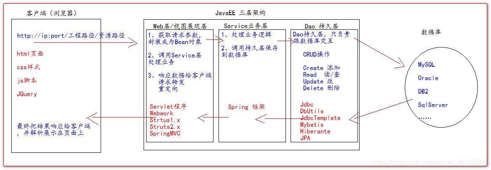

#JDBC-文档
## JDBC文档

## JDBC概述

### JDBC概述

>  
 **Java DataBase Connectivity Java 数据库连接技术** 
 JAVA mysql|oracle|sqlserver; JDBC:连接数据库的桥梁 类库文件; 


### JDBC的作用

>   通过Java语言操作数据库，操作表中的数据 
 oracle公司为**了简化、**统一对数据库的操作，定义了一套Java操作数据库的规范，称之为JDBC 
 连接不同的数据库，需要不同的jar包。 
  


### JDBC的本质

>  
 是官方（Oracle公司）定义的一套操作所有关系型数据库的规则（接口）。各个数据库厂商去实现这套接口，提供数据库驱动jar包。我们可以使用这套接口（JDBC）编程，运行时的代码其实是驱动jar包中的实现类。 


总结：

```
在java中要想访问数据库只能通过JDBC.
JDBC是java访问数据库的基础,其他数据库访问技术都是对JDBC的封装(Hibernate,MyBatis)
JDBC是为了访问不同的数据库,提供了一种统一的访问方式
JDBC本身是java连接数据库的一个标准,是进行数据库连接的抽象层.由java编写的一组类和接口,接口的实现由各大数据库厂商来实现
```

## JDBC 入门案例

### 2.1使用junit测试用例

```java
/**
 * 只有无返回值和没有参数据的情况下才能使用junit，点击方法用右击运行JUnit run 
 * @Desc:
 *      在同一个类中只能有一个main方法，这个main是被jvm所调用
 *      我还想测试main2,没办法去运行这个main2
 *      为了解决多次测试问题？
 *      提供了一个  【测试用例】 junit
 */
public class JdbcDemo1 {<!-- -->
    /*
        使用junit测试用例：
            1：在方法上加@Test
            2: 前提-测试的方法返回值只能是void , 不能参数
            3：注意 类名不能叫 test
     */

    //单元测试
    @Test
    public void test1(){<!-- -->
        System.out.println("aaaa");
    }
    //单元测试
    @Test
    public void test2(){<!-- -->
        System.out.println("bbbb");
    }
}

```

### 2.2 JDBC_CRUD操作

理解：打电话方式，来理解JDBC,操作数据库的步骤；

1.拿起电话；加载驱动,由DriverManager,来符合驱动的管理;

2.拨号；

3.建立通话之后；

4.通话开始
1. 通话 相当于 对数据的操作；1. 挂电话；

  #### 实现步骤

-  加载驱动：一种方式：注册；Calss.forName(“类的完全路径名”)来加载;
  |`static Connection`|`getConnection(String url, String user, String password)` 尝试建立与给定数据库URL的连接。
-  |`Statement`|`createStatement()` 创建一个 `Statement`对象，用于将SQL语句发送到数据库。
- |`Statement`|`createStatement(int resultSetType, int resultSetConcurrency)` 创建一个 `Statement`对象，该对象将生成具有给定类型和并发性的 `ResultSet`对象。
- |`Statement`|`createStatement(int resultSetType, int resultSetConcurrency, int resultSetHoldability)` 创建一个 `Statement`对象，将产生 `ResultSet`对象具有给定类型，并发性和可保存性。


```
1、要连接mysql数据库。有一个mysql的数据库，并且要启动
2、创建一个数据库，创建一个表，把表添加一些数据。
3、找到msyql的驱动，并且拷贝到工程中。build-path
4、书写java代码。
```

准备数据库

```sql
CREATE TABLE `t_user` (
  `id` int(11) NOT NULL AUTO_INCREMENT,
  `username` varchar(25) DEFAULT NULL,
  `passworld` varchar(25) DEFAULT NULL,
  `age` int(11) DEFAULT NULL,
  PRIMARY KEY (`id`)
) ENGINE=InnoDB DEFAULT CHARSET=utf8;
```

创建JavaWeb工程

添加驱动jar包

#### 2.2.1查询操作

```java
    /**
     * 通过jdbc连接数据库步骤
     * 1、加载驱动
     * 2、连接数据库
     * 3、创建statement对象
     * 4、发送sql
     * 5、处理结果集
     * 6、关闭连接
     */
public class JDBC_CRUD {<!-- -->
    /**
     * jdbc实现查询操作
     */
    @Test
    public void TestSelectUser() throws Exception {<!-- -->
        // 1、加载驱动
        Class.forName("com.mysql.jdbc.Driver");

        // 2、连接数据库
        String url="jdbc:mysql://localhost:3306/test";
        String user="root";
        String password ="root";
        Connection conn = DriverManager.getConnection(url, user, password);

        // 3、创建statement对象,这个对象是可以发送sql
        Statement statm = conn.createStatement();

        //4、发送sql
        String sql="select * from t_user";
        ResultSet rs = statm.executeQuery(sql);

        //5、处理结果集
        while (rs.next()){<!-- -->//指针一个一个的去找，如果找到就取出
            int id = rs.getInt("id");
            String username = rs.getString("username");
            String passworld2 = rs.getString("passworld");
            int age = rs.getInt("age");
            System.out.println(id+"-"+username+"-"+passworld2+"-"+age);
        }

        // 6、关闭连接 后打开的先关闭
        rs.close();
        statm.close();
        conn.close();
    }
}
```

int getInt(int 列索引) 这个检索的当前行中指定列的值 ResultSet作为对象 int在Java编程语言。  
int getInt(String 列名) 以Java编程语言中的 int此 ResultSet对象的当前行中指定列的值。 

Class.forName("com.mysql.jdbc.Driver");这行代码用于加载并注册MySQL数据库的驱动程序。在Java中，可以使用`Class.forName()`方法来动态加载并注册一个类。

`Class.forName("com.mysql.jdbc.Driver")` 将加载 `"com.mysql.jdbc.Driver"` 这个类，并执行该类的静态块，用于注册MySQL数据库驱动程序。

请注意，这是旧版的驱动程序加载方法，针对MySQL 5.x版本。如果你使用的是**MySQL 8.x版本或更新的版本，应该使用以下类名来加载驱动程序**：

```java
Class.forName("com.mysql.cj.jdbc.Driver");
```

另外，从Java 6开始，无需显式使用`Class.forName()`加载驱动程序，因为Java支持服务提供者机制（Service Provider Mechanism）。只需确保在类路径中有正确的MySQL驱动程序依赖jar包，并在连接数据库之前正确设置数据库连接URL、用户名和密码，Java将根据URL自动加载适当的驱动程序。

两种取值方式

```java
//5、处理结果集
while (rs.next()){<!-- -->//指针一个一个的去找，如果找到就取出

    /**
     * 取值方式有两种：
     * 1、按字段名来取，比较真观，推荐使用（常用）
     * 2、按列号来取，可以在字段少的情况下使用
     */
    int id = rs.getInt(1);//表示第一列id字段
    String username = rs.getString(2);//表示第二列username字段
    String passworld2 = rs.getString("passworld");
    int age = rs.getInt("age");

    System.out.println(id+"-"+username+"-"+passworld2+"-"+age);
}

```

#### 2.2.2添加操作

```java
/**
 * jdbc实现添加操作
 */
@Test
public void TestAddUser() throws Exception {<!-- -->
    // 1、加载驱动
    Class.forName("com.mysql.jdbc.Driver");

    //2、连接数据库
    String url="jdbc:mysql://127.0.0.1:3306/test";
    String user="root";
    String pwd="root";
    Connection conn = DriverManager.getConnection(url, user, pwd);

    //3、创建statement对象
    Statement stmt = conn.createStatement();

    //4、发送sql  添加，修改，删除 都用executeUpdate()方法
    String sql = "INSERT INTO `test`.`t_user`(`id`, `username`, `passworld`, `age`) VALUES (null, 'rose', '123', 97)";
    int i = stmt.executeUpdate(sql);
    System.out.println(i);//表示的影响的行数

    //5、关闭连接
    stmt.close();
    conn.close();
}

```

#### 2.2.3删除操作

```java
/**
 * jdbc实现删除操作
 */
@Test
public void TestDeleteUser() throws Exception {<!-- -->
    // 1、加载驱动
    Class.forName("com.mysql.jdbc.Driver");

    // 2、连接数据库
    String url="jdbc:mysql://127.0.0.1:3306/test";
    String user="root";
    String pwd="root";
    Connection conn = DriverManager.getConnection(url, user, pwd);

    // 3、创建statement对象
    Statement stmt = conn.createStatement();

    // 4、发送sql
    String sql="delete from t_user";
    int i = stmt.executeUpdate(sql);
    System.out.println(i);

    // 5、关闭连接
    stmt.close();
    conn.close();
}

```

#### 2.2.4修改操作

```java
/**
 * jdbc实现修改操作
 */
@Test
public void TestUpdateUser() throws Exception {<!-- -->
    // 1、加载驱动
    Class.forName("com.mysql.jdbc.Driver");

    // 2、连接数据库
    String url="jdbc:mysql://127.0.0.1:3306/test";
    String user="root";
    String pwd="root";
    Connection conn = DriverManager.getConnection(url, user, pwd);

    // 3、创建statement对象
    Statement stmt = conn.createStatement();

    // 4、发送sql
    String sql="update t_user set username ='张三' where id = 4 ";
    int i = stmt.executeUpdate(sql);
    System.out.println(i);

    // 5、关闭连接
    stmt.close();
    conn.close();
}

```

#### 异常的处理

```java
/**
 * @Desc 异常处理
 */
public class JdbcEx {<!-- -->
    /**
     * jdbc实现查询操作
     */
    @Test
    public void TestSelectUser(){<!-- -->
        // 1、加载驱动
        try {<!-- -->
            Class.forName("com.mysql.jdbc.Driver");
        } catch (ClassNotFoundException e) {<!-- -->
            e.printStackTrace();
        }

        // 2、连接数据库
`	uk        String url="jdbc:mysql://localhost:3306/test";
        String user="root";
        String password ="root";
        Connection conn = null;
        Statement statm = null;
        ResultSet rs = null;
        try {<!-- -->
            conn = DriverManager.getConnection(url, user, password);

            // 3、创建statement对象,这个对象是可以发送sql
            statm = conn.createStatement();

            //4、发送sql
            String sql="select * from t_user";
            rs = statm.executeQuery(sql);

            //5、处理结果集
            while (rs.next()){<!-- -->//批针一个一个的去找，如果找到就取出

                /**
                 * 取值方式有两种：
                 * 1、按字段名来取，比较真观，推荐使用（常用）
                 * 2、按列号来取，可以在字段少的情况下使用
                 */
                int id = rs.getInt(1);//表示第一列id字段
                String username = rs.getString(2);//表示第二列username字段
                String passworld2 = rs.getString("passworld");
                int age = rs.getInt("age");

                System.out.println(id+"-"+username+"-"+passworld2+"-"+age);
            }
        } catch (SQLException e) {<!-- -->
            e.printStackTrace();
        }finally {<!-- -->
            // 6、关闭连接 后打开的先关闭
            try {<!-- -->
                if(rs != null){<!-- -->
                    rs.close();
                    rs =null;//关闭连接，给赋值null,gc垃圾回收回机制会优先处理这些对象
                }
            } catch (SQLException e) {<!-- -->
                e.printStackTrace();
            }
            try {<!-- -->
                if(statm != null){<!-- -->
                    statm.close();
                    statm=null;
                }
            } catch (SQLException e) {<!-- -->
                e.printStackTrace();
            }
            try {<!-- -->
                if(conn != null){<!-- -->
                     conn.close();
                     conn = null;
                }
            } catch (SQLException e) {<!-- -->
                e.printStackTrace();
            }
        }

    }
}

```

### 工具类的抽取

```java
/**

 * @Desc  抽取工具类
 */
public class JDBCUtil {<!-- -->

    //静态代码块,随着类的加载而加载，并且只加载一次
    static {<!-- -->
        try {<!-- -->
            Class.forName("com.mysql.jdbc.Driver");
        } catch (ClassNotFoundException e) {<!-- -->
            e.printStackTrace();
        }
    }

    //获取连接
    public static Connection getConnection(){<!-- -->
        String url="jdbc:mysql://localhost:3306/test";
        String user="root";
        String password ="root";
        Connection conn = null;
        try {<!-- -->
            conn =  DriverManager.getConnection(url, user, password);
        } catch (SQLException e) {<!-- -->
            e.printStackTrace();
        }
        return conn;
    }

    //关闭方法
    public static void close(ResultSet rs , Statement statm, Connection conn){<!-- -->
        try {<!-- -->
            if(rs != null){<!-- -->
                rs.close();
                rs =null;//关闭连接，给赋值null,gc垃圾回收回机制会优先处理这些对象
            }
        } catch (SQLException e) {<!-- -->
            e.printStackTrace();
        }
        try {<!-- -->
            if(statm != null){<!-- -->
                statm.close();
                statm=null;
            }
        } catch (SQLException e) {<!-- -->
            e.printStackTrace();
        }
        try {<!-- -->
            if(conn != null){<!-- -->
                conn.close();
                conn = null;
            }
        } catch (SQLException e) {<!-- -->
            e.printStackTrace();
        }
    }

    //关闭方法
    public static void close( Statement statm, Connection conn){<!-- -->
        try {<!-- -->
            if(statm != null){<!-- -->
                statm.close();
                statm=null;
            }
        } catch (SQLException e) {<!-- -->
            e.printStackTrace();
        }
        try {<!-- -->
            if(conn != null){<!-- -->
                conn.close();
                conn = null;
            }
        } catch (SQLException e) {<!-- -->
            e.printStackTrace();
        }
    }
}

```

#### 工具类的测试

```java
/**

 * @Desc 测试工具类
 */
public class UtilTest {<!-- -->

    /**
     * 测试的修改
     */
    @Test
    public void testUpdate(){<!-- -->
        Connection conn = null;
        Statement stmt = null;
        try {<!-- -->
            conn = JDBCUtil.getConnection();
            stmt = conn.createStatement();
            int i = stmt.executeUpdate("update t_user set username = '江一燕' where id = 4");
            System.out.println(i);
        } catch (SQLException e) {<!-- -->
            e.printStackTrace();
        }finally {<!-- -->
            JDBCUtil.close(stmt,conn);
        }

    }

    /**
     * 测试的查询
     */
    @Test
    public void test(){<!-- -->
        Connection conn = null;
        Statement stmt = null;
        ResultSet rs = null;
        try {<!-- -->
            conn =  JDBCUtil.getConnection();

            stmt = conn.createStatement();

            rs = stmt.executeQuery("select * from t_user");

            while (rs.next()){<!-- -->
                int id = rs.getInt("id");
                String username = rs.getString("username");
                String passworld = rs.getString("passworld");
                int age = rs.getInt("age");
                System.out.println(id);
                System.out.println(username);
                System.out.println(passworld);
                System.out.println(age);
            }

        } catch (SQLException e) {<!-- -->
            e.printStackTrace();
        }finally {<!-- -->
            JDBCUtil.close(rs,stmt,conn);
        }
    }
}

```

#### 工具类的优化

jdbc.properties

```java
ClassforName=com.mysql.jdbc.Driver
url=jdbc:mysql://localhost:3306/test
user=root
password=root

```

```java
/**

 * @Desc  抽取工具类
 */
public class JDBCUtil {<!-- -->
    private static  String classforName;
    private static String url;
    private static  String user;
    private static String password;
    private static Connection conn = null;

    //静态代码块,随着类的加载而加载，并且只加载一次
    static {<!-- -->
        //FileInputStream fis = null;  //获取的配置文件方式一
        Properties pro = null;
        try {<!-- -->
            //fis = new FileInputStream("src/jdbc.properties"); //获取的配置文件方式一，web项目中无法用
            
            //获取的配置文件二（通过类加载器）
            InputStream is=JDBCUtil.class.getClassLoader().getResourceAsStream("jdbc.properties");
            pro = new Properties();
            
            //加载到Properties集合对象中
            pro.load(is);
        } catch (IOException e) {<!-- -->
            e.printStackTrace();
        }finally {<!-- -->
            try {<!-- -->
                is.close();
            } catch (IOException e) {<!-- -->
                e.printStackTrace();
            }
        }

        classforName= pro.getProperty("ClassforName");
        url = pro.getProperty("url");
        user = pro.getProperty("user");
        password = pro.getProperty("password");

	   //加载驱动
        try {<!-- -->
            Class.forName(classforName);
        } catch (ClassNotFoundException e) {<!-- -->
            e.printStackTrace();
        }
        //创建连接
        try {<!-- -->
            conn =  DriverManager.getConnection(url, user, password);
        } catch (SQLException e) {<!-- -->
            e.printStackTrace();
        }
    }

    //获取连接
    public static Connection getConnection(){<!-- -->
        return conn;
    }

    //关闭方法
    public static void close(ResultSet rs , Statement statm, Connection conn){<!-- -->
        try {<!-- -->
            if(rs != null){<!-- -->
                rs.close();
                rs =null;//关闭连接，给赋值null,gc垃圾回收回机制会优先处理这些对象
            }
        } catch (SQLException e) {<!-- -->
            e.printStackTrace();
        }
        try {<!-- -->
            if(statm != null){<!-- -->
                statm.close();
                statm=null;
            }
        } catch (SQLException e) {<!-- -->
            e.printStackTrace();
        }
        try {<!-- -->
            if(conn != null){<!-- -->
                conn.close();
                conn = null;
            }
        } catch (SQLException e) {<!-- -->
            e.printStackTrace();
        }
    }

    //关闭方法
    public static void close( Statement statm, Connection conn){<!-- -->
        try {<!-- -->
            if(statm != null){<!-- -->
                statm.close();
                statm=null;
            }
        } catch (SQLException e) {<!-- -->
            e.printStackTrace();
        }
        try {<!-- -->
            if(conn != null){<!-- -->
                conn.close();
                conn = null;
            }
        } catch (SQLException e) {<!-- -->
            e.printStackTrace();
        }
    }
}

```

#### 封装实体类

```java
    public static void main(String[] args) {<!-- -->
        System.out.println("******************************************");
        System.out.println("*           XXXX信息管理系统               *");
        System.out.println("*           请进行选择您的操作              *");
        System.out.println("*           1.用户登录                    *");
        System.out.println("*           2.用户追加                    *");
        System.out.println("*           3.信息修改                    *");
        System.out.println("*           4.信息删除                    *");
        System.out.println("*           5.信息查询                    *");
        System.out.println("******************************************");

        Scanner sc=new Scanner(System.in);
        int choice=sc.nextInt();
        //作业完善代码；

    }	
/**
     * 追加用户方法
     * @param tUser
     * @return
     */
    static int addTUser(TUser tUser){<!-- -->
        return 0;
    }
    /**
     * 登录方法
     * @param uname
     * @param pwd
     * @return
     */
    public TUser login(String uname,String pwd){<!-- -->
        return null;
    }

```

### MVC三层架

### 案例-登录功能

MVC开始是存在于桌面程序中的，M是指业务[模型](https://baike.baidu.com/item/模型/1741186?fromModule=lemma_inlink)，V是指[用户界面](https://baike.baidu.com/item/用户界面/6582461?fromModule=lemma_inlink)，C则是控制器，使用MVC的目的是将M和V的实现代码分离，从而使同一个程序可以使用不同的表现形式。比如一批[统计数据](https://baike.baidu.com/item/统计数据/9847676?fromModule=lemma_inlink)可以分别用[柱状图](https://baike.baidu.com/item/柱状图/10963683?fromModule=lemma_inlink)、[饼图](https://baike.baidu.com/item/饼图/10816566?fromModule=lemma_inlink)来表示。C存在的目的则是确保M和V的同步，一旦M改变，V应该同步更新。

所用的技术： jdbc mysql 接口 实现类 三层架构 web – service – dao

创建工程： web工程

所需要的jar包： mysql的驱动包



#### 数据库准备

```sql
CREATE TABLE `t_user` (
  `id` int(11) NOT NULL AUTO_INCREMENT,
  `username` varchar(25) DEFAULT NULL,
  `passworld` varchar(25) DEFAULT NULL,
  `age` int(11) DEFAULT NULL,
  PRIMARY KEY (`id`)
) ENGINE=InnoDB AUTO_INCREMENT=5 DEFAULT CHARSET=utf8;

```

#### 实体对象

```java
public class User {
    private int id;
    private String username;
    private String passworld;
    private int age;
	//提供有参无参构造方法
    //提供get set 方法
    //提供 toString 方法
}
```

#### dao层

```java
public interface UserDao {<!-- --> //定义接口
    /**
     * 登录方法
     * @param user
     * @return
     */
    public User login(User user);
}
```

```java
/**

 * @Desc  dao层实现类
 */
public class UserDaoImpl implements UserDao {
    @Override
    public User login(User u) {
        try {
            Class.forName("com.mysql.jdbc.Driver");
        } catch (ClassNotFoundException e) {
            e.printStackTrace();
        }
        //如果你的数据是本地的，并且端口是默认3306，是可以省略
        String url = "jdbc:mysql:///test";
        String user ="root";
        String pwd ="root";
        Connection conn = null;
        Statement stmt = null;
        try {
            conn = DriverManager.getConnection(url, user, pwd);
            stmt =  conn.createStatement();

            String sql ="select * from t_user where username = '"+u.getUsername()+"' and passworld = '"+u.getPassworld()+"' ";
            ResultSet rs = stmt.executeQuery(sql);

            //登录，只有两个结果，查到，查不到
            if(rs.next()){
                String username = rs.getString("username");
                String passworld = rs.getString("passworld");

                //如果有数据封装并返回
                User user1 = new User();
                user1.setUsername(username);
                user1.setPassworld(passworld);

                return user1;
            }

        } catch (SQLException e) {
            e.printStackTrace();
        }//TODO关闭连接
        //如果没有查到用户，整体返回null
        return null;
    }
}

```

**dao单元测试**

```java
/**
 * 测试dao层代码是否正常使用
 */
@Test
public void login() {
    //创建dao层
    UserDao dao = new UserDaoImpl();

    User user = new User();
    user.setUsername("dfdfdf");
    user.setPassworld("123");

    //调用dao方法
    User u = dao.login(user);
    if(u!=null){
        System.out.println("登录成功");
    }else{
        System.out.println("登录失败");
    }
}

```

#### service层

```java
public interface UserService {
    /**
     * 登录
     * @param user
     * @return
     */
    public boolean login(User user);
}

```

```java
/**

 * @Desc  业务层实现类
 */
public class UserServiceImpl implements UserService {
    //创建dao对象
    private UserDao userDao = new UserDaoImpl();

    @Override
    public boolean login(User user) {

        //调用dao层方法
        User res = userDao.login(user);
        if(res != null){
            //不能null表示dao查到数据，登录成功
            return true;
        }
        //否则登录失败
        return false;
    }
}

```

**测试service**

```java
@Test
public void login(){
    //创建对象
    UserService service = new UserServiceImpl();

    User user = new User();
    user.setUsername("rose");
    user.setPassworld("123");

    boolean login = service.login(user);
    if(login){
        System.out.println("登录成功");
    }else{
        System.out.println("登录失败");
    }
}

```

#### web层

```java
/**
 * @Desc web层获取用户提交过来的数据，但我们还没学到，这里做一个测试当作web层
 */
public class UserWeb {<!-- -->
    public static void main(String[] args) {<!-- -->
        //创建对象
        UserService service = new UserServiceImpl();

        User user = new User();
        user.setUsername("jack");
        user.setPassworld("123");

        boolean login = service.login(user);
        if(login){<!-- -->
            System.out.println("登录成功");
        }else{<!-- -->
            System.out.println("登录失败");
        }
    }
}

```

### sql注入问题

```sql
-- 原sql
select * from t_user where username = "jack" and passworld = '123'

-- 什么是sql注入： 通过字符串拼接，篡改sql，这就是sql注入
select * from t_user where username = ''or '1'='1' and passworld = ''or'1'='1'
select * from t_user where 1 = 1
```

#### 解决sql注入问题的思路

```sql
-- 解决sql注入问题？
-- 出现的sql注入原因：字符串拼接，篡改sql
-- 解决思想，就让sql进行拼接
select * from t_user where username = ? and passworld = ?
```

### 3.PreparedStatement解决sql注入

- 预编译语句 对象；

- 编译sql语句；

- 再填充参数；


> 1，执行效率：Statement 采取直接编译 SQL 语句的方式，扔给数据库去执行，而 PreparedStatement 则先将 SQL 语句预编译一遍，再填充参数，这样效率会高一些。SQL 语句被预编译并且存储在 PreparedStatement 对象中，其后可以使用该对象高效地多次执行该语句。
>
> 2，代码可读性：Statement 中 SQL 语句中需要 Java 中的变量，加就得进行字符串的运算，还需要考虑一些引号、单引号的问题，参数变量越多，代码就越难看，而且会被单引号、双引号搞疯掉；
> 而 PreparedStatement，则不需要这样，参数可以采用“?”占位符代替，接下来再进行参数的填充，
> 这样利于代码的可读性，并且符合面向对象的思想。
>
> 3，安全性：Statement 由于可能需要采取字符串与变量的拼接，很容易进行 SQL 注入攻击，而 PreparedStatement 由于是预编译，再填充参数的，不存在 SQL 注入问题。

```java
/**

 * @Desc  dao层实现类
 */
public class UserDaoImpl implements UserDao {<!-- -->
    @Override
    public User login(User u) {<!-- -->
        try {<!-- -->
            Class.forName("com.mysql.jdbc.Driver");
        } catch (ClassNotFoundException e) {<!-- -->
            e.printStackTrace();
        }

        //如果你的数据是本地的，并且端口是默认3306，是可以省略
        String url = "jdbc:mysql:///test";
        String user ="root";
        String pwd ="root";
        Connection conn = null;
        PreparedStatement pstmt = null;
        ResultSet rs = null;
        try {<!-- -->
            conn = DriverManager.getConnection(url, user, pwd);
            /*stmt =  conn.createStatement();
            String sql ="select * from t_user where username = '"+u.getUsername()+"' and passworld = '"+u.getPassworld()+"' ";
            ResultSet rs = stmt.executeQuery(sql);*/

            //预处理，提前把sql进行处理，可以防止sql注入问题
            String sql ="select * from t_user where username = ? and passworld = ?";
            pstmt = conn.prepareStatement(sql);
            pstmt.setString(1,u.getUsername());
            pstmt.setString(2,u.getPassworld());

            //执行，再发送
            rs = pstmt.executeQuery();

            //登录，只有两个结果，查到，查不到
            if(rs.next()){<!-- -->
                String username = rs.getString("username");
                String passworld = rs.getString("passworld");

                //如果有数据封装并返回
                User user1 = new User();
                user1.setUsername(username);
                user1.setPassworld(passworld);

                return user1;
            }

        } catch (SQLException e) {<!-- -->
            e.printStackTrace();
        }//TODO关闭连接

        //如果没有查到用户，整体返回null
        return null;
    }
}

```

PreparedStatement进行了预编译处理，当下次执行相同的sql，sql就不会再编译了，比Statement的效率高。

Statement每执行一次sql进行编译一次

### jdbc批处理-了解

业务场景：当需要向数据库中发送一批sql时，就可以用jdbc的批处理机制，以提升执行效率，避免向数据库一条条的发送

**statement批处理**

```java
 /**
     * statement批处理
     */
    @Test
    public void test1(){
        Connection conn = null;
        Statement statement = null;
        try {
            conn =  JDBCUtil.getConnection();
            statement = conn.createStatement();

            for(int i = 1; i<= 10000; i++){

                String sql ="insert into t_user (id,username, passworld,age) values(null,'"+i+"', '123', 28)";
                statement.addBatch(sql);
                //一次性向数据库中添加了3000条
                if(i % 3000 == 0 ){
                    //执行批次
                    statement.executeBatch();
                    //清空批次
                    statement.clearBatch();
                }
            }
            //执行批次
            statement.executeBatch();
            //清空批次
            statement.clearBatch();
        } catch (SQLException e) {
            e.printStackTrace();
        }finally {
            JDBCUtil.close(statement,conn);
        }

    }

```

**PreparedStatement批处理**

```java
    /**
     * PreparedStatement
     * @throws SQLException
     */
    @Test
    public void test2() throws SQLException {

        Connection conn = JDBCUtil.getConnection();
        String sql ="insert into t_user (username, passworld,age) values(?, ?, ?)";
        PreparedStatement pstmt = conn.prepareStatement(sql);

        for (int i = 1; i <=10000 ; i++) {
            pstmt.setString(1,"u"+i);
            pstmt.setString(2,"p"+i);
            pstmt.setInt(3,i);

            pstmt.addBatch();

            if(i % 3000 == 0){
                pstmt.executeBatch();
                pstmt.clearBatch();
            }
        }

        pstmt.executeBatch();
        pstmt.clearBatch();

        JDBCUtil.close(pstmt,conn);
    }

```

扩展帮助：

##### 一、问题描述

在使用idea编写java程序时，单元测试，需要Scanner从控制台输入数据，但发现无法输入。

##### 二、解决方法

这个需要根据自己使用IDEA的位数来进行修改，保险起见可以两个都修改。 64位： 将idea安装路径bin目录下的idea64.exe.vmoptions文件加一行参数： -Deditable.java.test.console=true 32位： 将idea安装路径bin目录下的idea.exe.vmoptions文件加一行参数： -Deditable.java.test.console=true tement批处理**

```java
    /**
     * PreparedStatement
     * @throws SQLException
     */
    @Test
    public void test2() throws SQLException {<!-- -->

        Connection conn = JDBCUtil.getConnection();
        String sql ="insert into t_user (username, passworld,age) values(?, ?, ?)";
        PreparedStatement pstmt = conn.prepareStatement(sql);

        for (int i = 1; i <=10000 ; i++) {<!-- -->
            pstmt.setString(1,"u"+i);
            pstmt.setString(2,"p"+i);
            pstmt.setInt(3,i);

            pstmt.addBatch();

            if(i % 3000 == 0){<!-- -->
                pstmt.executeBatch();
                pstmt.clearBatch();
            }
        }

        pstmt.executeBatch();
        pstmt.clearBatch();

        JDBCUtil.close(pstmt,conn);
    }

```

扩展帮助：

##### 一、问题描述

在使用idea编写java程序时，单元测试，需要Scanner从控制台输入数据，但发现无法输入。

##### 二、解决方法

这个需要根据自己使用IDEA的位数来进行修改，保险起见可以两个都修改。 64位： 将idea安装路径bin目录下的idea64.exe.vmoptions文件加一行参数： -Deditable.java.test.console=true 32位： 将idea安装路径bin目录下的idea.exe.vmoptions文件加一行参数： -Deditable.java.test.console=true
