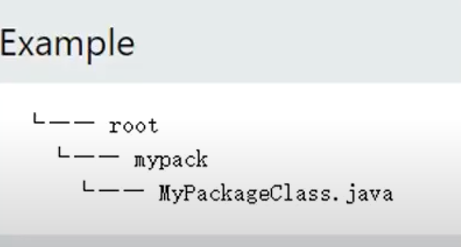

# JAVA基础语法

[JDK21下载+安装+环境配置教程(Windows系统)_jdk20环境变量配置-CSDN博客](https://blog.csdn.net/m0_69750058/article/details/131628553)

[VSCode教程之配置Java环境_vscode配置java开发环境_流泪＆枯萎的博客-CSDN博客](https://blog.csdn.net/yang4123/article/details/129999335)

## helloworld

```java
public class Sample01{
    public static void main(String[] args){
  System.out.println("Hello World");
 }
}
```

定义了一个名为Sample01的一个类，这个类的名字要和文件名相同也就是文件名要是Sample01.java

其中里面定义了一个main函数，传入字符串参数

编译后运行后出现一个class后缀名的文件，这个文件是java编译后的文件

可以直接用终端来编译java文件：

```
javac Sample01.java
```

运行java文件：

```
java Sample01
```

java也是//来单行注释，/*  */

## 变量

JAVA常见的变量类型

| String | int  | float | char | boolean | double |
| ------ | ---- | ----- | ---- | ------- | ------ |

定义变量(和c/c++相似)：

```java
String Name1 = "abc"；
int Name2 = 123；
float Name3 = "5.99f"
char Name4 = 'a'；
boolean Name5 = true；
```

变量Name3被赋值为5.99f，表示它是一个float类型的变量，并且存储了一个值为5.99的浮点数。如果不加"f"后缀，该值将被认为是一个double类型的字面量

```java
final int Name2 = 123；
```

final关键字表示定义的变量为常量，不能被修改

在java中有8种原始数据类型：

| Data Type | Size   |
| --------- | ------ |
| byte      | 1 byte |
| short     | 2 byte |
| int       | 4 byte |
| long      | 8 byte |
| float     | 4 byte |
| double    | 8 byte |
| boolean   | 1 byte |
| char      | 2 byte |

## 运算符

算数运算符：

| +    | -    | *    | /    | ++   | --   |
| ---- | ---- | ---- | ---- | ---- | ---- |

赋值运算符：

| Operator | Example | Same AS  |
| -------- | ------- | -------- |
| =        | x = 5   | x = 5    |
| +=       | x += 5  | x = x+5  |
| -=       | x -= 5  | x = x-5  |
| *=       | x *= 5  | x = x*5  |
| /=       | x /= 5  | x = x/5  |
| %=       | x %= 5  | x = x%5  |
| &=       | x &= 5  | x = x&5  |
| \|=      | x \|= 5 | x \|= 5  |
| ^=       | x ^= 5  | x = x^5  |
| >>=      | x >>= 5 | x = x>>5 |
| <<=      | x <<= 5 | x = x<<5 |

比较运算符：

| ==   | ！=  | >    | <    | >=   | <=   |
| ---- | ---- | ---- | ---- | ---- | ---- |

逻辑运算符：

| &&   | \|\| | ！   |
| ---- | ---- | ---- |

## 字符串

```java
String firstName = "John";
String lastName = "Doe";System.out.println(firstName + " "+ lastName);
System.out.printn(firstName.concat(lastName ));
```

字符串可以相加连接和使用内置函数方法


```java
Stringtxt1 = "we are the so-called \"ikings \" from the north.";
String txt2  "It \'s alright.";
string txt3 = "The character \\ is called backslash.";
```

单斜杠+单引号或双引号输出单或双引号

双斜杠输出单斜杠

## 字符串比较

在 Java 中，使用 `==` 运算符用于比较基本类型的值，例如 `int`、`char` 等。但是，对于对象类型，包括字符串 `String`，应该使用 `equals()` 方法来比较它们的值。

使用 `==` 运算符比较字符串时，实际上比较的是两个对象的引用是否相等，即它们是否指向同一个内存地址。而使用 `equals()` 方法比较的是两个字符串对象的内容是否相等。

下面是一个示例来演示 `==` 运算符和 `equals()` 方法的差别：

```java
String str1 = "Hello";
String str2 = new String("Hello");
String str3 = str1;

// 使用==比较
System.out.println(str1 == str2); // 输出 false，因为str1和str2是不同的对象
System.out.println(str1 == str3); // 输出 true，因为str1和str3引用同一个对象

// 使用equals比较
System.out.println(str1.equals(str2)); // 输出 true，因为str1和str2的内容相等
System.out.println(str1.equals(str3)); // 输出 true，因为str1和str3的内容相等
```

对于字符串比较，推荐始终使用 `equals()` 方法，因为它可以确保比较的是字符串的内容而不是引用。只有在确定要比较的是同一个对象引用时，才可以使用 `==` 运算符。

或者：

```java
Objects.equals(password, repassword)
```


## 算术

```java
System.out.println(Math.max(5,1));//取最大
System.out.println(Math.min(5,10));//取最小
System.out.println(Math.sqrt(64));//开平方
System.out.println(Math.abs(-4.7));//取绝对值
double randomNum = Math.random(); //取随机数
System.out.println(randomNum);
```

## 条件语句

### if语句

```java
if (time < 18) {
    System.out .println("Good day.");
}else{
    System.out.printIn("Good evening.");
}
```

三目运算符：

```java
String result = (time < 18) ? "Good day.":"Good evening."
```

### switch语句

```java
int day = 4;
switch (day) {
case 1:
    System.out.println("Monday");
    break;
case 2:
    System.out.println("Tuesday");
    break;
case 3:
    System.out.println("Wednesday");
    break;
case 4:
    System.out.println("Thursday");
    break;
case 5:
    System.out.println("Friday");
    break;
default:
    System.out.println("default");             
}
```

### while语句

```java
int i=0;
while (i < 5) {
    System.out .println(i);
    i=0;
}
do{
    system.out.println(i);
    i++;
}while (i < 5);
```

### for语句

```java
for (int i=0; 1<5; i++){
System.out.println(i); 
}
for (int i=0; i< 10;i=i+2){
System.out.println(i);
}
string[] cars = {"volvo","BMw","Ford","Mazda"};
for (String i : cars) {
System.out.println(i);
}
```

continue和break

## 数组

```java
String[] cars = { "Volvo","Ford","BMW","Mazda”};
int[] myNum = { 10,20，30，40 };
System.out.printIn(cars[0]);

cars[0] = "Opel";
System.outprintln(cars[0]);

System.out.printIn(cars.length); //得到数组长度
for (int i = 0; i < cars.length; i++) { //输出数组元素
    System.out.printIn(cars[i]);
}
for (String i : cars) {//简易写法
    System.out.println(i);
}
int[][] myNumbers = ( { 1, 2,3,4 }, { 5, 6,7 }};//二维数组
                     
for (int i = 0; i < myNumbers.length; ++i) {
    for (int j=0; j < myNumbers[i].length; ++j) {
        System.out.println(myNumbers[i][j])
     };
```

## 函数

调用函数：

```java
public class Sample18 {
static void myMethod(){
System.out.println("I just got executed!");
}
public static void main(String[] args){
myMethod();
myMethod();
myMethod();
}
```

带参函数：

```java
public class Sample19 {static void myMethod(string fname, int age) {
    System.out.println(fname + " is " + age);
 }
public static void main(String[] args) {
    myMethod("Liam",5);
    myMethod("Jenny",8);
    myMethod("Anja",31);
}
```

有返回值的方法函数：

```java
public class Sample20 {
    static int plusMethod(int x, int y) {
        return x + y;
    }
static double plusMethod(double x, double y) {
    return x | y;
}
public static void main(String[] args) {
    int myNum1 = lusMethod(8,5);
    double myNum2 = plusMethod(4.3,6.26);//根据参数不同调用同名的不同方法
    System.out.printIn("int: " + myNum1);
    System.out.println("double: " + myNum2);
}
```

回调函数：

```java
public static int sum(int k) {
    if(k>0){
        return k + sum(k - 1);
    }else {
        return 0;
    }
}
```

## 类class


```java
public class Sample22 {
    int x= 5;
public static void main(String[] args) {
    Sample22 myobj1 =new Sample22(); // 新建对象0bject 1
    Sample22 myobj2 = new Sample22(); // 0bject 2
    System.out.println(myobj1.x);
    System.out.print1n(myobj2.x);
  }
}
```

因为static关键字所以main不在类里面，不能用类来调用，可以直接调用

```java
public class sample24{
// Create a speed() method and add a parameter
public void speed(int maxSpeed) {
    System.out.printIn("Max speed is:"+ maxSpeed);
}
// Static method
static void myStaticMethod(){
    System.out.println("Static methods can be called without creating objects");
}
// Inside main, call the methods on the myCar object
public static void main(String[] args){
    myStaticMethod(); // 直接调用静态函数
    sample24 myCar = new Sample24(); // Create a myCar object
    methodmyCar.speed(200); // Call the speed() method
  }
}
```

## 构造函数

```java
public class Sample25 {
int modelYear;
String modelName;
public Sample25(int year, String name){ //构造函数，与类名同名
    modelYear = year;
    modeINane name;
}
public static void main(String[] args){
    Sample25 myCar = new Sample25(1969,"Mustang");
    System.out.println(myCar.modelYear +" "+ myCar.modelName);
 }
}
```

## 封装

封装的含义是确保“敏感“数据不被用户发现。

为了实现这一点必须:

- 将类的变量/属性声明为私有的
- 提供公共的get和set方法来访问和更新一个私有变量的值

为什么要进行封装 ?

- 更好地控制类的属性和方法
- 类的属性可以是只读的(如果你只使用get方法)只写的(如果你只使用set方法) 
- 灵活:程序员可以改变代码的一个部分而不影响其他分
- 增加了数据的安全性

```java
public class Sample26{
    private String name; // private  restricted access 封装
// Getter
    public string getName(){
        return name;
    }
// Setter
    public void setName(String newName){
        this.name = newName;
} 
public static void main(String[] args) {
 Sample26 myobj = new Sample26();
 myObj.setName("John"); // Set the value of the name variable to "John'
 System.out.println(myobj.getName());
}
```

## Java包和API

Java中的包是用来分组相关的类。可以把它看作是文件目录中的一个文件夹。我们使用包来避免名称冲突，并写出更好的可维护代码。包被分为两类。

内置包，来自Java API的包

用定义的包，创建你自己的包

### 内置包

Java API是一个预先写好的类库，可以免费使用，包含在Java开发环境中。
该库包含用于管理输入、数据库编程以及更多组件。完整的清单可以在Oracles网站上找到
该库被分为包和类。

这意味着你可以导入一个单独的类(以及它的方法和属性)，或者导入一个包含所有类的整个包。要使用库中的一个类或一个包，你需要使用import关键字。

```java
import java.util.Scanner;//导入一个包中的一个类
import java.util.*;//导入整个包
class Sample27 {
public static void main(String[] args) {
    Scanner myObj = new scanner(System.in); //新建对象传入系统输入变量
    System.out.println("Enter username");
    String userName = myobj.nextLine();//调用输入方法
    System.out.println("Username is: " + userName);
 }
}
```

### 用户定义的包

要创建自己的包，您需要了解 Java 使用文件系统目录来存储它们就像计算机上的文件夹一样:



定义包：

```java
package mypack;//java文件类在的文件夹名称
class MyPackageClass{
public static void main(string[] args) {
    System.outprintln("This is my package!");
}
```

使用import调用包中的类

## Java 继承


在Java中，可以将属性和方法从一个类继承到另一个类。

我们把"继承的概念"分为两类。
子类--从另一个类继承的

类父类--被继承的类
要从一个类中继承，请使用**extends**关键字

protected使得变量可以在父类和子类调用

```java
class Vehicle {
protected String brand = "Ford"; // Vehicle attribute
public void honk() {} // Vehicle method
System.out.println("Tuut, tuut!");
class Car extends Vehicle {
    public string modelName = "Mustang"; // Car attribute
}
class Sample28 {
public static void main(String[] args) {
// Create a myCar object
Car myCar = new Car();
    myCar.honk();
    classSystem.out.println(myCar.briand + ""+ myCar.modelName); //都成功调用
 }
}
```

## java的多态性

多态意味着“多种形式”，它发生在我们有许多通过继承相互关联的类时
就像我们在上一章中指定的那样; 

继承让我们从另一个类继承属性和方法。

多态使用这些方法来执行不同的任务。

这允许我们以不同的方式执行单个操作。
例如，考虑一个名为 Animal的超类，它有一个名为imalSound() 的方法。 Animals 的子类可以是 Pigs、Cats、Birds - 而且它们也有自己的动物声音实现

```java
class Animal{
public void animalsound(){
    System.out.println("The animal makes a sound");
}
class pig extends Animal{ //继承之后自己又重新实现一个不同的方法
    public void animalsound(){
        System.outprintln("The pig says: wee wee");
    }
}
class Dog extends Animal{
    public void animalsound(){
        System.out.println("The dog says: bow wow");
    }
}
```

## 抽象类和方法

数据抽象是隐藏某些细节并仅向用户显示基本信息的过程抽象可以通过抽象类或接口来实现。
**abstract** 关键字是一个修饰符，用于类和方法。

抽象类:是一个受限制的类，不能用于创建对象(要访问它，它必须从另一个类继承)。
抽象方法:只能在抽象类中使用，并且没有主体。主体由子类提继承自)。
抽象类可以同时具有抽象方法和常规方法

```java
abstract class Animal {
// Abstract method (does not have a body)
public abstract void animalsound();// Regular method 抽象的方法就是不实现的方法
public void sleep(){
    System.out.println("Zzz");
}
// Subclass (inherit from Animal)
class Pig extends Animal {
    public void animalsound(){// The body of animalsound() is provided here
    System.out .println("The pig says: wee wee");
    }
}
```

## 接口

在 Java 中实现抽象的另一种方法是使用接口。接口是一个完全“抽象类”，全部是空方法interface关键字是一个修饰符，用于类和方法。

```java
interface Animal { //定义接口
public void animalsound(); // interface method(does not have a body)
public void sleep();
}
// interface method (does not have a body)
// Pig "implements"t Animal linterface
class pig implements Animal { //接口的实现，必须要和implements定义的接口一样
    public void animalsound(){// The body of animalsound() is provided here
    System.out.println("The pig says: wee wee");
public void sleep(){   // The body of sleep() is provided here
    System.out.println("Zzz");
}
    }
```

## 枚举类型

`enum` 是 Java 中的关键字，用于定义枚举类型。

枚举类型是一种特殊的数据类型，它限制变量只能取一组预定义的值，并且这些值在枚举类型中被称为枚举常量。枚举常量可以作为单独的值使用，也可以与其他枚举常量进行比较。

使用 `enum` 关键字可以定义一个枚举类型。以下是定义枚举类型的示例：

```java
enum Day {
  MONDAY,
  TUESDAY,
  WEDNESDAY,
  THURSDAY,
  FRIDAY,
  SATURDAY,
  SUNDAY
}
```

在上面的示例中，定义了一个名为 `Day` 的枚举类型，包含了一周的每一天作为枚举常量。

枚举类型的优势之一是可以使用 `switch` 语句来对枚举常量进行逻辑判断，而不需要使用繁琐的 `if-else` 语句。

除了定义枚举常量外，枚举类型还可以包含字段、方法、构造函数和其他普通类的特性。

以下是定义带有字段和方法的枚举类型的示例：

```java
enum Season {
  SPRING("Springtime", 1),
  SUMMER("Summertime", 2),
  AUTUMN("Autumn", 3),
  WINTER("Winter", 4);

  private String name;
  private int order;

  Season(String name, int order) {
    this.name = name;
    this.order = order;
  }

  public String getName() {
    return name;
  }

  public int getOrder() {
    return order;
  }
}
```

在上面的示例中，定义了一个名为 `Season` 的枚举类型，包含了四个枚举常量：`SPRING`、`SUMMER`、`AUTUMN` 和 `WINTER`。每个枚举常量都有一个对应的名称和顺序。

枚举类型的每个常量都可以访问它们自己的字段和方法。可以通过枚举常量名加点符号来访问它们的成员，例如：`Season.SPRING.getName()`。

总结一下，`enum` 关键字用于定义枚举类型，枚举类型是一种特殊的数据类型，限制变量只能取一组预定义的值。枚举类型可以包含枚举常量、字段、方法和构造函数。使用枚举类型可以简化代码，增加可读性，并提供一种更好的方式来处理特定的值集合。

### 每个枚举常量实际上是其所属的枚举类型的一个实例

每个枚举常量实际上是其所属的枚举类型的一个实例，因此可以说每个枚举常量是等于其所属的枚举类型本身。在 Java 中，枚举常量被编译成枚举类型中的静态常量。

例如，考虑下面这个定义`Day`枚举类型的示例：

```java
enum Day {
  MONDAY,
  TUESDAY,
  WEDNESDAY
}
```


在这个示例中，`MONDAY`、`TUESDAY`和`WEDNESDAY`都是`Day`枚举类型的常量。它们实际上是静态的`Day`类型的实例。因此，可以将每个枚举常量视为其所属的枚举类型的一个实例。

在某些情况下，可以使用`==`操作符将枚举常量与枚举类型本身进行比较。例如，可以使用`==`操作符来比较两个枚举常量是否相等，或者将枚举常量与其所属的枚举类型进行比较。

示例：

```java
Day day1 = Day.MONDAY;
Day day2 = Day.MONDAY;

if (day1 == day2) {
  System.out.println("day1 and day2 are equal");
}

if (day1 == Day.MONDAY) {
  System.out.println("day1 is equal to Day.MONDAY");
}
```


在上面的示例中，`day1` 和 `day2` 都引用同一个 `Day.MONDAY` 的实例，所以它们是相等的。同时，`day1` 和 `Day.MONDAY` 也是相等的。

总的来说，每个枚举常量是其所属枚举类型的一个实例，可以将其看作等于枚举类型本身。可以使用`==`操作符比较枚举常量之间的相等性，或者将枚举常量与枚举类型本身进行比较。

### 输入输出

```java
import java.util.Scanner;
class Sample33 {
public static void main(string[] args) {
Scanner myObj = new Scanner(System.in);
System.out.println("Enter name, age and salary:");
// String input 
String name = myobj.nextline();
// Numerical input
int age  myobj.nextInt();
double salary = myobj.nextDouble();
// Output input by user
System.out.println("Name: " + name); //print就是直接输出没有换行，+ln就是自动回车换行
System.out.println("Age: " + age);
System.out.println("salarybbb: " + salary);
 }
}
```

## Java异常处理


在执行 Java 代码时，可能会发生不同的错误: 程序员的编码错误输入导致的错误或其他不可预见的事情当发生错误时，Java 通常会停止并生成错误消息。

 对此的技术术语是:Java 将抛出异常。

抓取异常：

```java
public class Sample34 {
public static void main(String[] args) (
try {
int[] myNumbers = (1, 2, 3);
System.out.println(myNumbers[10]);
System.out.println("coding man");
}catch (Exception e){ //抓取到异常信息
    System.out.println("something went wrong.");
}finally{ //最终输出
System.out.println("The 'try catch' is finished.");
}
    }
```

手动抛出异常throw：

```java
public class Sample35 {
static void checkAge(int age) { 
if (age < 18)
{
throw new ArithmeticException("Access denied - You must be at least 18 years old."); //任何一个异常都是一个对象所以要new
}
else { 
System.out.println("Access granted - You are old enough!");
}
}
public static void main(string[] args) {
    checkAge(15); // Set age to 15 (which is below 18...)
}
}
```

## 文件操作

创建文件

```java
import java.io.File; // Import the File class
// Import the IOException class to handle errors
import java.io.IOException;
public class Sample36 {

public static void main(string[] args) {  
try { 
File myobj = new File("filename.txt"); //在当前目录创建文件
    if (myobj.createNewFile()){
        System.out.println("File created: " + myobj.getName());//输出文件名
}else{ 
       System.out.println("File already exists.");
}catch (IOException e){  //抓取错误
       System.out.println("An error occurred.");
        e.printstackTrace();//输出错误
    }
}
}
```

写文件：

```java
// Import the Filelriter class
import java.io.Filewriter;
import java.io.IOException;// Import the IOException class to handle errors
public class Sample37 {
public static void main(string[] args) { 
try {fFileWriter mywriter = new Filewriter("filename.txt");
 mywriter.write("Files in Java might be tricky, but it is fun enough!");
 myWriter.close();
  System.out.println("Successfully wrote to the file.");
    }catch (IOException e) {
System.out.println("An error occurred.");
        e.printstackTrace();
    }
    }
}
```

读文件：

```java
import java.io.File; // Import the File class
import java.io.FileNotFoundException; // Import this class to handle errors 找不到文件的错误
import java.util.Scanner; // Import the Scanner class to read text files
public class Sample38 { 

public static void main(string[] args) (
try { 
File myobj = new File("filename.txt");
scanner myReader = new scanner(myobj);
while (myReader.hasNextLine()){ //如果下一行存在数据就继续读取
    String data = myReader.nextLine();
    System.out.println(data);
}
    myReader.close();
}catch (FileNotFoundException e) {
    System.out.println("An error occurred.");
    e.printStackTrace();
}
    File myObj = new File("filename.txt"); //读取文件
    if (myobj.exists()) { //如果文件存在
        System.out.println("File name: " + myobj.getName()); //文件名
        System.out.println("Absolute path: " + myobj.getAbsolutepath());//文件的绝对路径
        System.out.println("writeable: " + myobj.canWrite());//是否可写
        System.outprintln("Readable " + myobj.canRead());//是否可读
        System.out.println("File size in bytes " + myobj.length());//长度,大小
else {
System.out.println("The file does not exist.");
}
    }
```

删除文件：

```java
import java.io.File; // Import the File class
public class Sample39 {
public static void main(String[] args) {
    File myObj = new File("filename.txt");
    if (myobj.delete()) { //调用删除操作
System.out.println("Deleted the file: "+ myObj.getName());
    }else {
System.out.println("Failed to delete the file.");
    }
}
```

# 扩展

## List


目录：  list中添加，获取，删除元素；  list中是否包含某个元素；  list中根据索引将元素数值改变(替换)；  list中查看（判断）元素的索引；  根据元素索引位置进行的判断；  利用list中索引位置重新生成一个新的list（截取集合）；  对比两个list中的所有元素；  判断list是否为空；  返回Iterator集合对象；  将集合转换为字符串；  将集合转换为数组；  集合类型转换；  去重复；

备注：内容中代码具有关联性。

1.list中添加，获取，删除元素；  　

　添加方法是：.add(e)；　　

获取方法是：.get(index)；　　

删除方法是：.remove(index)； 按照索引删除；　

　.remove(Object o)； 按照元素内容删除；

```java
            List&lt;String&gt; person=new ArrayList&lt;&gt;();
            person.add("jackie");   //索引为0  //.add(e)
            person.add("peter");    //索引为1
            person.add("annie");    //索引为2
            person.add("martin");   //索引为3
            person.add("marry");    //索引为4

            person.remove(3);   //.remove(index)
            person.remove("marry");     //.remove(Object o)

            String per="";
            per=person.get(1);
            System.out.println(per);    ////.get(index)

            for (int i = 0; i &lt; person.size(); i++) {
                System.out.println(person.get(i));  //.get(index)
            }

```

2.list中是否包含某个元素；

　　方法：.contains（Object o）； 返回true或者false

```java
            List&lt;String&gt; fruits=new ArrayList&lt;&gt;();
            fruits.add("苹果");
            fruits.add("香蕉");
            fruits.add("桃子");
            //for循环遍历list
            for (int i = 0; i &lt; fruits.size(); i++) {<!-- -->
                System.out.println(fruits.get(i));
            }
            String appleString="苹果";
            //true or false
            System.out.println("fruits中是否包含苹果："+fruits.contains(appleString));

            if (fruits.contains(appleString)) {
                System.out.println("我喜欢吃苹果");
            }else {
                System.out.println("我不开心");
            }

```

3.list中根据索引将元素数值改变(替换)；

　　注意 .set(index, element); 和 .add(index, element); 的不同；

```java
            String a="白龙马", b="沙和尚", c="八戒", d="唐僧", e="悟空";
            List&lt;String&gt; people=new ArrayList&lt;&gt;();
            people.add(a);
            people.add(b);
            people.add(c);
            people.set(0, d);   //.set(index, element);     //将d唐僧放到list中索引为0的位置，替换a白龙马
            people.add(1, e);   //.add(index, element);     //将e悟空放到list中索引为1的位置,原来位置的b沙和尚后移一位

            //增强for循环遍历list
            for(String str:people){
                System.out.println(str);
            }

```

4.list中查看（判断）元素的索引；　　

　　注意：.indexOf（）； 和 lastIndexOf（）的不同；

```java
            List&lt;String&gt; names=new ArrayList&lt;&gt;();
            names.add("刘备");    //索引为0
            names.add("关羽");    //索引为1
            names.add("张飞");    //索引为2
            names.add("刘备");    //索引为3
            names.add("张飞");    //索引为4
            System.out.println(names.indexOf("刘备"));
            System.out.println(names.lastIndexOf("刘备"));
            System.out.println(names.indexOf("张飞"));
            System.out.println(names.lastIndexOf("张飞"));
```

5.根据元素索引位置进行的判断;

```java
if (names.indexOf("刘备")==0) {
    System.out.println("刘备在这里");
}else if (names.lastIndexOf("刘备")==3) {
    System.out.println("刘备在那里");
}else {
    System.out.println("刘备到底在哪里？");
}
```

6.利用list中索引位置重新生成一个新的list（截取集合）；

　　方法： .subList(fromIndex, toIndex)；　　.size() ； 该方法得到list中的元素数的和

```java
            List&lt;String&gt; phone=new ArrayList&lt;&gt;();
            phone.add("三星");    //索引为0
            phone.add("苹果");    //索引为1
            phone.add("锤子");    //索引为2
            phone.add("华为");    //索引为3
            phone.add("小米");    //索引为4
            //原list进行遍历
            for(String pho:phone){
                System.out.println(pho);
            }
            //生成新list
            phone=phone.subList(1, 4);  //.subList(fromIndex, toIndex)      //利用索引1-4的对象重新生成一个list，但是不包含索引为4的元素，4-1=3
            for (int i = 0; i &lt; phone.size(); i++) { // phone.size() 该方法得到list中的元素数的和
                System.out.println("新的list包含的元素是"+phone.get(i));
            }
```

7.对比两个list中的所有元素；

　　//两个相等对象的equals方法一定为true, 但两个hashcode相等的对象不一定是相等的对象

```java
//1.&lt;br&gt;if (person.equals(fruits)) {
    System.out.println("两个list中的所有元素相同");
}else {
    System.out.println("两个list中的所有元素不一样");
}
//2.       
if (person.hashCode()==fruits.hashCode()) {
    System.out.println("我们相同");
}else {
    System.out.println("我们不一样");
}

```

8.判断list是否为空；

　　//空则返回true，非空则返回false

```java
if (person.isEmpty()) {
    System.out.println("空的");
}else {
    System.out.println("不是空的");
}
```

9.返回Iterator集合对象；

```java
System.out.println("返回Iterator集合对象:"+person.iterator());
```

10.将集合转换为字符串；

```java
String liString="";
liString=person.toString();
System.out.println("将集合转换为字符串:"+liString);
```

11.将集合转换为数组；

```java
System.out.println("将集合转换为数组:"+person.toArray());
```

12.集合类型转换；

```java
//1.默认类型
List&lt;Object&gt; listsStrings=new ArrayList&lt;&gt;();
　　for (int i = 0; i &lt; person.size(); i++) {
    listsStrings.add(person.get(i));
}
//2.指定类型
List&lt;StringBuffer&gt; lst=new ArrayList&lt;&gt;();
　　for(String string:person){
　　lst.add(StringBuffer(string));
}
```

13.去重复；

```java
            List&lt;String&gt; lst1=new ArrayList&lt;&gt;();
            lst1.add("aa");
            lst1.add("dd");
            lst1.add("ss");
            lst1.add("aa");
            lst1.add("ss");

                   //方法 1.
            for (int i = 0; i &lt;lst1.size()-1; i++) {<!-- -->
                for (int j = lst1.size()-1; j &gt;i; j--) {<!-- -->
                    if (lst1.get(j).equals(lst1.get(i))) {
                        lst1.remove(j);
                    }
                }
            }
            System.out.println(lst1);

                   //方法 2.
            List&lt;String&gt; lst2=new ArrayList&lt;&gt;();
            for (String s:lst1) {
                if (Collections.frequency(lst2, s)&lt;1) {
                    lst2.add(s);
                }
            }
            System.out.println(lst2);

```

