## 数据库的设计

- 数据表名加前缀
- 统一不加s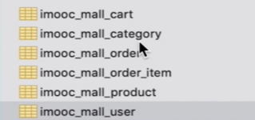
- 关键词不能冲突
- 创建时间可以设置时间为默认值，更新内容时候可以设置自动更改时间

## 技术选型

- 版本考虑稳定性
- 团队技术栈熟悉程度
- 开发效率，生态强大
- 未来前景，社区活跃

## 项目初始化-生成逆向文件

- 新建项目

- mybatis-generator的安装和配置

  ```xml
    <plugin>
          <groupId>org.mybatis.generator</groupId>
          <artifactId>mybatis-generator-maven-plugin</artifactId>
          <version>1.3.7</version>
          <configuration>
            <verbose>true</verbose>
            <overwrite>true</overwrite>
          </configuration>
        </plugin>
  ```

  config.xml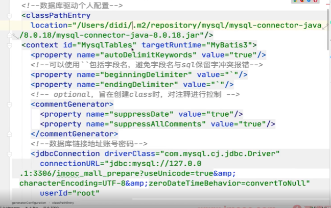

在maven可以找到功能，当数据库中建好表之后就可以根据数据库表自动生成pojo和mapper结构和xml文件方法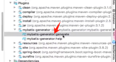

- 自动生成DAO层的文件
- 跑通接口

## 打通数据库链路

properties配置

```properties
spring.datasource.name=imooc_mall_datasource
spring.datasource.url=jdbc:mysql://127.0.0.1:3306/imooc_mall?useUnicode=true&characterEncoding=utf8&autoReconnect=true&useSSL=false&serverTimezone=Asia/Shanghai
spring.datasource.driver-class-name=com.mysql.cj.jdbc.Driver
spring.datasource.username=root
spring.datasource.password=12345678
```

```
@MapperScan(basePackages = "com.imooc.mall.model.dao") //在主启动文件的类头写上mapper文件夹的位置，如果启动文件和mapper处在同一级目录则不用声明
```

## log4j2日志

- 日志级别:error,warn,info(用户信息以及 交易信息等),debug(开发信息相关的信息内容),trace(框架开发者用得多) (级别逐渐下降)
- 排除logback依赖
- 引入Log4j2依赖


springboot组件：

```xml
    <dependency>
      <groupId>org.springframework.boot</groupId>
      <artifactId>spring-boot-starter-log4j2</artifactId>
    </dependency>
```

log4j2.xml配置:

```xml
<?xml version="1.0" encoding="UTF-8"?>
<Configuration status="fatal">
  <Properties>
    <Property name="baseDir" value="${sys:user.home}/logs"/>
  </Properties>

  <Appenders>
    <Console name="Console" target="SYSTEM_OUT">
      <!--控制台只输出level及以上级别的信息（onMatch），其他的直接拒绝（onMismatch） -->
      <ThresholdFilter level="info" onMatch="ACCEPT"
        onMismatch="DENY"/>
      <PatternLayout
        pattern="[%d{MM:dd HH:mm:ss.SSS}] [%level] [%logger{36}] - %msg%n"/>
    </Console>

    <!--debug级别日志文件输出-->
    <RollingFile name="debug_appender" fileName="${baseDir}/debug.log"
      filePattern="${baseDir}/debug_%i.log.%d{yyyy-MM-dd}">
      <!-- 过滤器 -->
      <Filters>
        <!-- 限制日志级别在debug及以上在info以下 -->
        <ThresholdFilter level="debug"/>
        <ThresholdFilter level="info" onMatch="DENY" onMismatch="NEUTRAL"/>
      </Filters>
      <!-- 日志格式 -->
      <PatternLayout pattern="[%d{HH:mm:ss:SSS}] [%p] - %l - %m%n"/>
      <!-- 策略 -->
      <Policies>
        <!-- 每隔一天转存 -->
        <TimeBasedTriggeringPolicy interval="1" modulate="true"/>
        <!-- 文件大小 -->
        <SizeBasedTriggeringPolicy size="100 MB"/>
      </Policies>
    </RollingFile>

    <!-- info级别日志文件输出 -->
    <RollingFile name="info_appender" fileName="${baseDir}/info.log"
      filePattern="${baseDir}/info_%i.log.%d{yyyy-MM-dd}">
      <!-- 过滤器 -->
      <Filters>
        <!-- 限制日志级别在info及以上在error以下 -->
        <ThresholdFilter level="info"/>
        <ThresholdFilter level="error" onMatch="DENY" onMismatch="NEUTRAL"/>
      </Filters>
      <!-- 日志格式 -->
      <PatternLayout pattern="[%d{HH:mm:ss:SSS}] [%p] - %l - %m%n"/>
      <!-- 策略 -->
      <Policies>
        <!-- 每隔一天转存 -->
        <TimeBasedTriggeringPolicy interval="1" modulate="true"/>
        <!-- 文件大小 -->
        <SizeBasedTriggeringPolicy size="100 MB"/>
      </Policies>
    </RollingFile>

    <!-- error级别日志文件输出 -->
    <RollingFile name="error_appender" fileName="${baseDir}/error.log"
      filePattern="${baseDir}/error_%i.log.%d{yyyy-MM-dd}">
      <!-- 过滤器 -->
      <Filters>
        <!-- 限制日志级别在error及以上 -->
        <ThresholdFilter level="error"/>
      </Filters>
      <!-- 日志格式 -->
      <PatternLayout pattern="[%d{HH:mm:ss:SSS}] [%p] - %l - %m%n"/>
      <Policies>
        <!-- 每隔一天转存 -->
        <TimeBasedTriggeringPolicy interval="1" modulate="true"/>
        <!-- 文件大小 -->
        <SizeBasedTriggeringPolicy size="100 MB"/>
      </Policies>
    </RollingFile>
  </Appenders>
  <Loggers>
    <Root level="debug">
      <AppenderRef ref="Console"/>
      <AppenderRef ref="debug_appender"/>
      <AppenderRef ref="info_appender"/>
      <AppenderRef ref="error_appender"/>
    </Root>

  </Loggers>
</Configuration>
```

## 用户模块

- 整体介绍：知识点，功能点
- 接口设计
- 编码阶段

### 用户模块知识点和功能

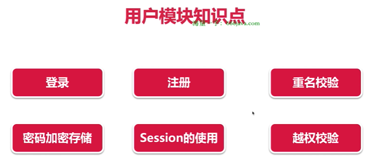

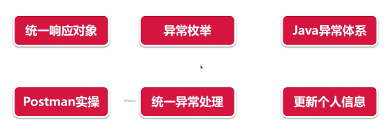

### 接口设计

#### 用户模块

##### 注册新用户

| 请求地址 | /register |
| -------- | --------- |
| 请求方式 | POST      |

参数

| 参数     | 参数含义 | 示例     | 备注 |
| -------- | -------- | -------- | ---- |
| userName | 用户名   | xiaomu   |      |
| password | 密码     | 12345678 |      |

请求示例

```
/register?userName=xiaomu&password=12345678
```

返回示例

```
{

  "status": 10000,

  "msg": "SUCCESS",

  "data": null

}
```

##### 登录

| 请求地址 | /login |
| -------- | ------ |
| 请求方式 | POST   |

参数

| 参数     | 参数含义 | 示例     | 备注 |
| -------- | -------- | -------- | ---- |
| userName | 用户名   | xiaomu   |      |
| password | 密码     | 12345678 |      |

请求示例

```
/login?userName=xiaomu&password=12345678
```

返回示例

```
{

  "status": 10000,

  "msg": "SUCCESS",

  "data": {

    "id": 9,

    "username": "xiaomu2",

    "password": null,

    "personalizedSignature": "祝你今天好心情",

    "role": 2,

    "createTime": "2020-02-09T12:39:47.000+0000",

    "updateTime": "2020-02-10T16:56:02.000+0000"

  }

}
```


##### 更新个性签名 

| 请求地址 | /user/update |
| -------- | ------------ |
| 请求方式 | POST         |

参数

| 参数      | 参数含义       | 示例           | 备注 |
| --------- | -------------- | -------------- | ---- |
| signature | 更新的签名内容 | 更新了我的签名 |      |

请求示例

```
/user/update?signature=更新了我的签名
```

返回示例

```
{

  "status": 10000,

  "msg": "SUCCESS",

  "data": null

}
```

##### 退出登录

| 请求地址 | /user/logout |
| -------- | ------------ |
| 请求方式 | POST         |

参数

| 参数 | 参数含义 | 示例 | 备注 |
| ---- | -------- | ---- | ---- |
| 无   |          |      |      |

请求示例

```
/user/logout
```

返回示例

```
{

  "status": 10000,

  "msg": "SUCCESS",

  "data": null

}
```


##### 管理员登录

| 请求地址 | /adminLogin |
| -------- | ----------- |
| 请求方式 | POST        |

参数

| 参数     | 参数含义 | 示例     | 备注 |
| -------- | -------- | -------- | ---- |
| userName | 用户名   | xiaomu   |      |
| password | 密码     | 12345678 |      |

请求示例

```
/adminLogin?userName=xiaomu&password=12345678
```

返回示例

```
{

  "status": 10000,

  "msg": "SUCCESS",

  "data": {

    "id": 9,

    "username": "xiaomu2",

    "password": null,

    "personalizedSignature": "祝你今天好心情",

    "role": 2,

    "createTime": "2020-02-09T12:39:47.000+0000",

    "updateTime": "2020-02-10T16:56:02.000+0000"

  }

}
```

## API统一返回对象

建立common文件夹存通用返回对象，T是泛型，通用响应对象，不确定数据类型是什么

ApiRestResponse.java

```java
package com.imooc.mall.common;

import com.imooc.mall.exception.ImoocMallExceptionEnum;

/**
 * 描述：     通用返回对象
 */
public class ApiRestResponse<T> {

    private Integer status;

    private String msg;

    private T data;

    private static final int OK_CODE = 10000;

    private static final String OK_MSG = "SUCCESS";

    public ApiRestResponse(Integer status, String msg, T data) {
        this.status = status;
        this.msg = msg;
        this.data = data;
    }

    public ApiRestResponse(Integer status, String msg) {
        this.status = status;
        this.msg = msg;
    }

    public ApiRestResponse() {
        this(OK_CODE, OK_MSG); //this是调用本函数的构造函数
    }
   //ApiRestResponse<T> 表示这个静态方法将返回一个 ApiRestResponse 类型的对象，其中的类型参数 T 与方法声明中的类型参数 <T> 相同，即这个类型参数将在方法调用时根据需求进行实例化。
    //static <T> 是指这个方法是一个静态方法，并且它有一个类型参数 <T>。
    public static <T> ApiRestResponse<T> success() {
        return new ApiRestResponse<>();
    }
   
    public static <T> ApiRestResponse<T> success(T result) {
        ApiRestResponse<T> response = new ApiRestResponse<>();
        response.setData(result);
        return response;
    }

    public static <T> ApiRestResponse<T> error(Integer code, String msg) {
        return new ApiRestResponse<>(code, msg);
    }

    public static <T> ApiRestResponse<T> error(ImoocMallExceptionEnum ex) {
        return new ApiRestResponse<>(ex.getCode(), ex.getMsg());
    }

    @Override
    public String toString() {
        return "ApiRestResponse{" +
                "status=" + status +
                ", msg='" + msg + '\'' +
                ", data=" + data +
                '}';
    }

    public Integer getStatus() {
        return status;
    }

    public void setStatus(Integer status) {
        this.status = status;
    }

    public String getMsg() {
        return msg;
    }

    public void setMsg(String msg) {
        this.msg = msg;
    }

    public T getData() {
        return data;
    }

    public void setData(T data) {
        this.data = data;
    }

    public static int getOkCode() {
        return OK_CODE;
    }

    public static String getOkMsg() {
        return OK_MSG;
    }
}
```

创建exception文件夹用来枚举可能出错的问题

## 统一处理异常

- 为什么要对异常进行统一处理（结构统一和安全目的）
- 抛出异常，直接转化为json的通用APIResponse

使用枚举类来定义异常信息类：

```java
/**
 * 描述：     异常枚举
 */
public enum ImoocMallExceptionEnum {
    NEED_USER_NAME(10001, "用户名不能为空"),
    NEED_PASSWORD(10002, "密码不能为空"),
    PASSWORD_TOO_SHORT(10003, "密码长度不能小于8位"),
    NAME_EXISTED(10004, "不允许重名"),
    INSERT_FAILED(10005, "插入失败，请重试"),
    WRONG_PASSWORD(10006, "密码错误"),
    NEED_LOGIN(10007, "用户未登录"),
    UPDATE_FAILED(10008, "更新失败"),
    NEED_ADMIN(10009, "无管理员权限"),
    PARA_NOT_NULL(10010, "参数不能为空"),
    CREATE_FAILED(10011, "新增失败"),
    REQUEST_PARAM_ERROR(10012, "参数错误"),
    DELETE_FAILED(10013, "删除失败"),
    MKDIR_FAILED(10014, "文件夹创建失败"),
    UPLOAD_FAILED(10015, "图片上传失败"),
    NOT_SALE(10016, "商品状态不可售"),
    NOT_ENOUGH(10017, "商品库存不足"),
    CART_EMPTY(10018, "购物车已勾选的商品为空"),
    NO_ENUM(10019, "未找到对应的枚举"),
    NO_ORDER(10020, "订单不存在"),
    NOT_YOUR_ORDER(10021, "订单不属于你"),
    WRONG_ORDER_STATUS(10022, "订单状态不符"),
    SYSTEM_ERROR(20000, "系统异常，请从控制台或日志中查看具体错误信息");
    /**
     * 异常码
     */
    Integer code;
    /**
     * 异常信息
     */
    String msg;

    ImoocMallExceptionEnum(Integer code, String msg) {
        this.code = code;
        this.msg = msg;
    }

    public Integer getCode() {
        return code;
    }

    public void setCode(Integer code) {
        this.code = code;
    }

    public String getMsg() {
        return msg;
    }

    public void setMsg(String msg) {
        this.msg = msg;
    }
}

```


### @ControllerAdvice

`@ControllerAdvice` 是一个注解，用于在Spring MVC应用程序中定义全局的异常处理、数据绑定和模型属性的处理器。

通过在类上添加 `@ControllerAdvice` 注解，可以将这个类标识为全局的控制器增强，用于处理多个控制器中产生的异常和数据绑定问题。

`@ControllerAdvice` 所标注的类可以包含以下类型的处理方法：

- `@ExceptionHandler`：用于处理特定异常类型的方法。
- `@InitBinder`：用于初始化数据绑定器的方法。
- `@ModelAttribute`：用于为请求添加模型属性的方法。

这些处理方法可以针对整个应用程序中的所有 `@Controller` 或指定的 `@Controller` 进行拦截和处理。

使用 `@ControllerAdvice` 可以实现全局统一的异常处理、数据绑定和模型属性处理逻辑，避免在每个控制器中重复编写相同的处理代码，提高了代码的可维护性和复用性。

```java
@ControllerAdvice
public class GlobalExceptionHandler {

    private final Logger log = LoggerFactory.getLogger(GlobalExceptionHandler.class);

    // 处理所有未捕获的异常
    @ExceptionHandler(Exception.class)
    @ResponseBody
    public Object handleException(Exception e) {
        log.error("Default Exception: ", e);
        return ApiRestResponse.error(ImoocMallExceptionEnum.SYSTEM_ERROR);
    }

    // 处理自定义的业务异常（ImoocMallException）
    @ExceptionHandler(ImoocMallException.class)
    @ResponseBody
    public Object handleImoocMallException(ImoocMallException e) {
        log.error("ImoocMallException: ", e);
        return ApiRestResponse.error(e.getCode(), e.getMessage());
    }

    // 处理方法参数校验异常（MethodArgumentNotValidException）
    @ExceptionHandler(MethodArgumentNotValidException.class)
    @ResponseBody
    public ApiRestResponse handleMethodArgumentNotValidException(
            MethodArgumentNotValidException e) {
        log.error("MethodArgumentNotValidException: ", e);
        return handleBindingResult(e.getBindingResult());
    }

    // 处理 BindingResult 对象，将校验错误信息处理为对外暴露的提示
    private ApiRestResponse handleBindingResult(BindingResult result) {
        List<String> list = new ArrayList<>();
        if (result.hasErrors()) {
            List<ObjectError> allErrors = result.getAllErrors();
            for (ObjectError objectError : allErrors) {
                String message = objectError.getDefaultMessage();
                list.add(message);
            }
        }
        if (list.size() == 0) {
            // 如果没有错误信息，默认返回请求参数错误
            return ApiRestResponse.error(ImoocMallExceptionEnum.REQUEST_PARAM_ERROR);
        }
        // 返回请求参数错误及错误信息
        return ApiRestResponse.error(ImoocMallExceptionEnum.REQUEST_PARAM_ERROR.getCode(), list.toString());
    }
}
```

`Exception.class` 是一个 Java 类型字面量，表示 `java.lang.Exception` 类，它是 Java 中所有异常类的基类。

在异常处理时，可以使用 `@ExceptionHandler` 注解来标记处理特定异常类型的方法。这里使用 `Exception.class` 来指定处理所有类型的异常，即捕获并处理所有未被其他具体异常处理方法捕获的异常。

## Java异常体系

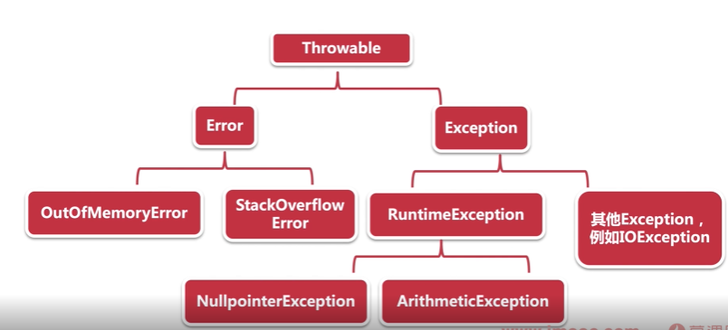

## 对密码进行md5保密

### 我们平常做网站开发，注册用户保存用户的密码一般都是要求加密的，不然数据库数据被窃取，用户的密码丢失是一个很可怕的事情。

###### 常用的加密方式就是MD5了，它可以将任意长度的输入串经过计算得到固定长度的输出，而且只有在明文相同的情况下，才能等到相同的密文，并且这个算法是不可逆的，即便得到了加密以后的密文，也不可能通过解密算法反算出明文。

> **`但是这样做真的就安全了吗？`**

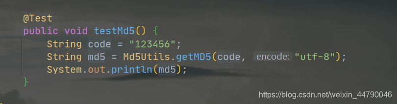

> **`123456` 生成的MD5就是 `e10adc3949ba59abbe56e057f20f883e`这是不会变的**

**这就造成了可以使用暴力破解的窘境，网上在线的破解网站很多，如：**  
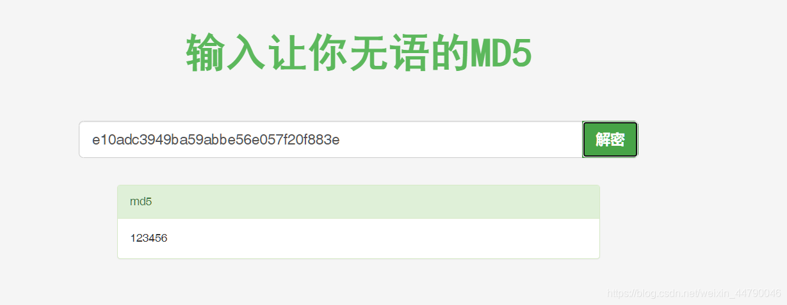

> **`既然这样使用不行有风险，那么就需要使用盐值加密，加入一个随机盐`**

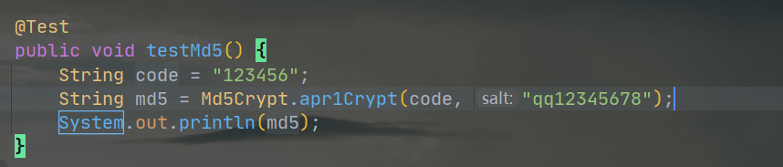

> **`123456` 加上随机盐生成的MD5就是 `$apr1$qq123456$hcsaDXtSzVW4afSMsV6Ea1`**

**再次去在线解密网站尝试解密，结果失败**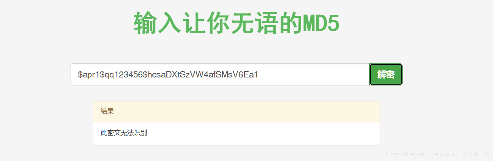  
**只要我们的随机盐不泄露，被解密的风险就大大降低了。**

> **`还是有风险，这个时候就可以使用spring提供的MD5加密了，他每次生成的MD5都是随机的，保证了绝对的安全性`**

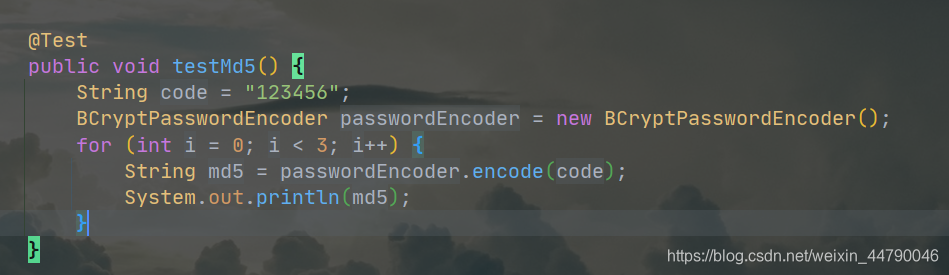  
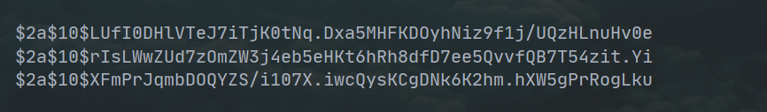  
**使用matches方法可以知道原字符与加密后的密文是否匹配**  
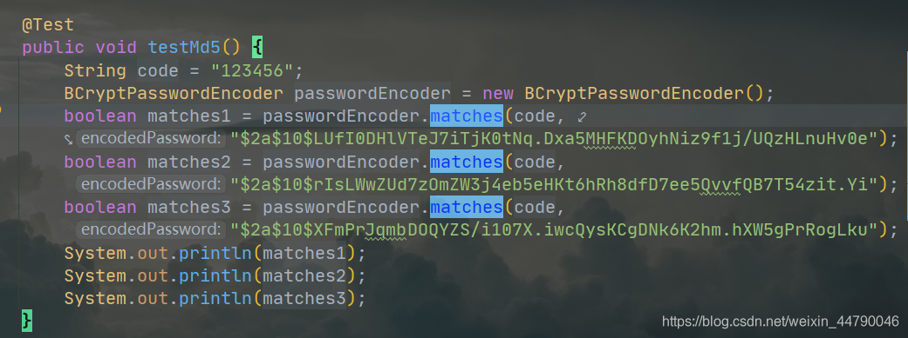  


##  登录功能

- 登录状态保存

- 利用session

- 服务端把用户信息保存到session

  登入储存session

  ```java
  session.setAttribute(Constant.IMOOC_MALL_USER, user);
  ```

  登出清除session

  ```java
   public ApiRestResponse logout(HttpSession session) {
          session.removeAttribute(Constant.IMOOC_MALL_USER);
          return ApiRestResponse.success();
      }
  ```

## 