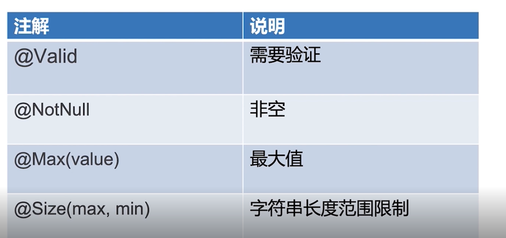
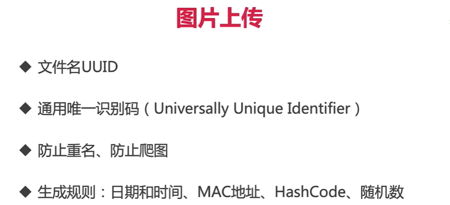

## 商品分类管理模块

商品分类接口模块设计

## 后台管理：

### 增加目录分类

| 请求地址 | /admin/category/add |
| -------- | ------------------- |
| 请求方式 | POST                |

参数

| 参数     | 参数含义   | 示例     | 备注                 |
| -------- | ---------- | -------- | -------------------- |
| name     | 目录名     | 新鲜水果 |                      |
| type     | 目录层级   | 1        | 不超过3级            |
| parentId | 父目录的ID | 2        | 1级目录的parentId为0 |
| orderNum | 排序       | 5        | 同级目录的排序       |

请求示例

/admin/category/add

body：

{"name":"食品","type":1,"parentId":0,"orderNum":1}

返回示例

```
{

  "status": 10000,

  "msg": "SUCCESS",

  "data": null

}
```


### 更新目录分类

| 请求地址 | /admin/category/update |
| -------- | ---------------------- |
| 请求方式 | POST                   |

参数

| 参数     | 参数含义   | 示例     | 备注                 |
| -------- | ---------- | -------- | -------------------- |
| id       | 目录的id   | 4        |                      |
| name     | 目录名     | 新鲜水果 |                      |
| type     | 目录层级   | 1        | 不超过3级            |
| parentId | 父目录的ID | 2        | 1级目录的parentId为0 |
| orderNum | 排序       | 5        | 同级目录的排序       |

请求示例

/admin/category/update

body：

{"id":"1","name":"食品品品品","type":1,"parentId":0,"orderNum":1}

返回示例

```
{

  "status": 10000,

  "msg": "SUCCESS",

  "data": null

}
```


### 删除分类

| 请求地址 | /admin/category/delete |
| -------- | ---------------------- |
| 请求方式 | POST                   |

参数

| 参数 | 参数含义 | 示例 | 备注 |
| ---- | -------- | ---- | ---- |
| id   | 目录的id | 4    |      |

请求示例

/admin/category/delete?id=1

返回示例

```
{

  "status": 10000,

  "msg": "SUCCESS",

  "data": null

}
```


### 分类列表（平铺） 

| 请求地址 | /admin/category/list?pageNum=1&pageSize=10 |
| -------- | ------------------------------------------ |
| 请求方式 | GET                                        |

参数

| 参数     | 参数含义 | 示例 | 备注 |
| -------- | -------- | ---- | ---- |
| pageNum  | 页数     | 1    |      |
| pageSize | 每页条数 | 10   |      |

请求示例

/admin/category/list?pageNum=1&pageSize=10

返回示例

```
{

  "status": 10000,

  "msg": "SUCCESS",

  "data": {

​    "total": 19,

​    "list": [

​      {

​        "id": 3,

​        "name": "新鲜水果",

​        "type": 1,

​        "parentId": 0,

​        "orderNum": 1,

​        "createTime": "2019-12-17T17:17:00.000+0000",

​        "updateTime": "2019-12-28T09:11:26.000+0000"

​      },

​      {

​        "id": 5,

​        "name": "海鲜水产",

​        "type": 1,

​        "parentId": 0,

​        "orderNum": 2,

​        "createTime": "2019-12-17T17:17:00.000+0000",

​        "updateTime": "2019-12-28T08:25:20.000+0000"

​      },

​      {

​        "id": 6,

​        "name": "精选肉类",

​        "type": 1,

​        "parentId": 0,

​        "orderNum": 3,

​        "createTime": "2019-12-17T17:17:00.000+0000",

​        "updateTime": "2019-12-28T08:25:21.000+0000"

​      },

​      {

​        "id": 9,

​        "name": "冷饮冻食",

​        "type": 1,

​        "parentId": 0,

​        "orderNum": 4,

​        "createTime": "2019-12-20T05:45:28.000+0000",

​        "updateTime": "2019-12-28T08:25:22.000+0000"

​      },

​      {

​        "id": 10,

​        "name": "蔬菜蛋品",

​        "type": 1,

​        "parentId": 0,

​        "orderNum": 5,

​        "createTime": "2019-12-20T05:45:28.000+0000",

​        "updateTime": "2019-12-28T08:25:23.000+0000"

​      },

​      {

​        "id": 27,

​        "name": "美味菌菇",

​        "type": 1,

​        "parentId": 0,

​        "orderNum": 7,

​        "createTime": "2019-12-20T05:45:28.000+0000",

​        "updateTime": "2020-02-10T15:20:36.000+0000"

​      },

​      {

​        "id": 4,

​        "name": "橘子橙子",

​        "type": 2,

​        "parentId": 3,

​        "orderNum": 1,

​        "createTime": "2019-12-17T17:17:00.000+0000",

​        "updateTime": "2019-12-28T08:25:10.000+0000"

​      },

​      {

​        "id": 7,

​        "name": "螃蟹",

​        "type": 2,

​        "parentId": 5,

​        "orderNum": 1,

​        "createTime": "2019-12-17T17:17:00.000+0000",

​        "updateTime": "2019-12-28T08:25:15.000+0000"

​      },

​      {

​        "id": 17,

​        "name": "冰淇淋",

​        "type": 2,

​        "parentId": 9,

​        "orderNum": 1,

​        "createTime": "2019-12-17T17:17:00.000+0000",

​        "updateTime": "2019-12-28T08:25:18.000+0000"

​      },

​      {

​        "id": 16,

​        "name": "牛羊肉",

​        "type": 2,

​        "parentId": 6,

​        "orderNum": 1,

​        "createTime": "2019-12-17T17:17:00.000+0000",

​        "updateTime": "2019-12-28T08:25:18.000+0000"

​      }

​    ],

​    "pageNum": 1,

​    "pageSize": 10,

​    "size": 10,

​    "startRow": 1,

​    "endRow": 10,

​    "pages": 2,

​    "prePage": 0,

​    "nextPage": 2,

​    "isFirstPage": true,

​    "isLastPage": false,

​    "hasPreviousPage": false,

​    "hasNextPage": true,

​    "navigatePages": 8,

​    "navigatepageNums": [

​      1,

​      2

​    ],

​    "navigateFirstPage": 1,

​    "navigateLastPage": 2

  }

}
```


## 前台：

### 分类列表（递归） 

| 参数 | 参数含义 | 示例 | 备注 |
| ---- | -------- | ---- | ---- |
| 无   |          |      |      |

请求示例

/category/list

返回示例

```

{

  "status": 10000,

  "msg": "SUCCESS",

  "data": [

​    {

​      "id": 3,

​      "name": "新鲜水果",

​      "type": 1,

​      "parentId": 0,

​      "orderNum": 1,

​      "childCategory": [

​        {

​          "id": 4,

​          "name": "橘子橙子",

​          "type": 2,

​          "parentId": 3,

​          "orderNum": 1,

​          "childCategory": [

​            {

​              "id": 19,

​              "name": "果冻橙",

​              "type": 3,

​              "parentId": 4,

​              "orderNum": 1,

​              "childCategory": []

​            }

​          ]

​        },

​        {

​          "id": 11,

​          "name": "草莓",

​          "type": 2,

​          "parentId": 3,

​          "orderNum": 2,

​          "childCategory": []

​        },

​        {

​          "id": 12,

​          "name": "奇异果",

​          "type": 2,

​          "parentId": 3,

​          "orderNum": 3,

​          "childCategory": []

​        },

​        {

​          "id": 14,

​          "name": "车厘子",

​          "type": 2,

​          "parentId": 3,

​          "orderNum": 4,

​          "childCategory": []

​        },

​        {

​          "id": 28,

​          "name": "其他水果",

​          "type": 2,

​          "parentId": 3,

​          "orderNum": 4,

​          "childCategory": []

​        }

​      ]

​    },

​    {

​      "id": 5,

​      "name": "海鲜水产",

​      "type": 1,

​      "parentId": 0,

​      "orderNum": 2,

​      "childCategory": [

​        {

​          "id": 7,

​          "name": "螃蟹",

​          "type": 2,

​          "parentId": 5,

​          "orderNum": 1,

​          "childCategory": []

​        },

​        {

​          "id": 8,

​          "name": "鱼类",

​          "type": 2,

​          "parentId": 5,

​          "orderNum": 2,

​          "childCategory": []

​        },

​        {

​          "id": 13,

​          "name": "海参",

​          "type": 2,

​          "parentId": 5,

​          "orderNum": 3,

​          "childCategory": []

​        }

​      ]

​    },

​    {

​      "id": 6,

​      "name": "精选肉类",

​      "type": 1,

​      "parentId": 0,

​      "orderNum": 3,

​      "childCategory": [

​        {

​          "id": 16,

​          "name": "牛羊肉",

​          "type": 2,

​          "parentId": 6,

​          "orderNum": 1,

​          "childCategory": []

​        }

​      ]

​    },

​    {

​      "id": 9,

​      "name": "冷饮冻食",

​      "type": 1,

​      "parentId": 0,

​      "orderNum": 4,

​      "childCategory": [

​        {

​          "id": 17,

​          "name": "冰淇淋",

​          "type": 2,

​          "parentId": 9,

​          "orderNum": 1,

​          "childCategory": []

​        }

​      ]

​    },

​    {

​      "id": 10,

​      "name": "蔬菜蛋品",

​      "type": 1,

​      "parentId": 0,

​      "orderNum": 5,

​      "childCategory": [

​        {

​          "id": 18,

​          "name": "蔬菜综合",

​          "type": 2,

​          "parentId": 10,

​          "orderNum": 1,

​          "childCategory": []

​        }

​      ]

​    },

​    {

​      "id": 27,

​      "name": "美味菌菇",

​      "type": 1,

​      "parentId": 0,

​      "orderNum": 7,

​      "childCategory": [

​        {

​          "id": 15,

​          "name": "火锅食材",

​          "type": 2,

​          "parentId": 27,

​          "orderNum": 5,

​          "childCategory": []

​        }

​      ]

​    }

  ]

}
```


## 分类模块的主要功能

- 分类数据的设置
- 分类的父一级目录，递归

> 一个类只能有一个用途存储的类不能和接收的类一起混用

model下面将类分文件夹储存，pojo用于普通的类，request用于工具接收请求

## @vild参数校验



```java
public class AddCategoryReq {

    @Size(min = 2, max = 5)
    @NotNull(message = "name不能为null")
    private String name;

    @NotNull(message = "type不能为null")
    @Max(3)
    private Integer type;

    @NotNull(message = "parentId不能为null")
    private Integer parentId;

    @NotNull(message = "orderNum不能为null")
    private Integer orderNum;

    public String getName() {
        return name;
    }

    public void setName(String name) {
        this.name = name;
    }

    public Integer getType() {
        return type;
    }

    public void setType(Integer type) {
        this.type = type;
    }

    public Integer getParentId() {
        return parentId;
    }

    public void setParentId(Integer parentId) {
        this.parentId = parentId;
    }

    public Integer getOrderNum() {
        return orderNum;
    }

    public void setOrderNum(Integer orderNum) {
        this.orderNum = orderNum;
    }

    @Override
    public String toString() {
        return "AddCategoryReq{" +
                "name='" + name + '\'' +
                ", type=" + type +
                ", parentId=" + parentId +
                ", orderNum=" + orderNum +
                '}';
    }
}

```

message是发到控制台的

在异常抛出类主动抛出这个异常

```java
 @ExceptionHandler(MethodArgumentNotValidException.class)
    @ResponseBody
    public ApiRestResponse handleMethodArgumentNotValidException(
            MethodArgumentNotValidException e) {
        log.error("MethodArgumentNotValidException: ", e);
        return handleBindingResult(e.getBindingResult());
    }
```

## Swagger自动生成API文档

引入：

```xml
    <dependency>
      <groupId>io.springfox</groupId>
      <artifactId>springfox-swagger2</artifactId>
      <version>2.9.2</version>
    </dependency>
 <dependency>
      <groupId>io.springfox</groupId>
      <artifactId>springfox-swagger-ui</artifactId>
      <version>2.9.2</version>
    </dependency>
```

第二个是生成前端界面

然后在启动文件类上加上注解：

```
@EnableSwagger2
```

配置文件SpringFoxConfig：

```java
@Configuration
public class SpringFoxConfig {

    //访问http://localhost:8083/swagger-ui.html可以看到API文档
    @Bean
    public Docket api() {
        return new Docket(DocumentationType.SWAGGER_2)
                .apiInfo(apiInfo())
                .select()
                .apis(RequestHandlerSelectors.any())
                .paths(PathSelectors.any())
                .build();
    }

    private ApiInfo apiInfo() {
        return new ApiInfoBuilder()
                .title("慕慕生鲜")
                .description("")
                .termsOfServiceUrl("")
                .build();
    }
}
```

配置地址映射

```java
import com.imooc.mall.common.Constant;
import org.springframework.context.annotation.Configuration;
import org.springframework.web.servlet.config.annotation.ResourceHandlerRegistry;
import org.springframework.web.servlet.config.annotation.WebMvcConfigurer;

/**
 * 描述：     配置地址映射
 */
@Configuration
public class ImoocMallWebMvcConfig implements WebMvcConfigurer {

    @Override
    public void addResourceHandlers(ResourceHandlerRegistry registry) {
        registry.addResourceHandler("/admin/**").addResourceLocations("classpath:/static/admin/");
        registry.addResourceHandler("/images/**")
                .addResourceLocations("file:" + Constant.FILE_UPLOAD_DIR);
        registry.addResourceHandler("swagger-ui.html").addResourceLocations(
                "classpath:/META-INF/resources/");
        registry.addResourceHandler("/webjars/**").addResourceLocations(
                "classpath:/META-INF/resources/webjars/");
    }
}
```

```
@ApiOperation("购物车列表") //直接加在方法开头注释
```

访问http://localhost:8083/swagger-ui.html可以看到API文档

## 统一校验管理员身份

在filter文件夹中创建AdminFilter.java书写过滤器

```java
/**
 * 描述：管理员校验过滤器
 */
public class AdminFilter implements Filter {

    @Autowired
    UserService userService; // 注入UserService依赖

    @Override
    public void init(FilterConfig filterConfig) throws ServletException {
        // 初始化过滤器，可以在这里进行一些初始化操作
    }

    @Override
    public void doFilter(ServletRequest servletRequest, ServletResponse servletResponse,
            FilterChain filterChain) throws IOException, ServletException {
        HttpServletRequest request = (HttpServletRequest) servletRequest; // 强制类型转换为HttpServletRequest对象
        HttpSession session = request.getSession(); // 获取HttpSession对象
        User currentUser = (User) session.getAttribute(Constant.IMOOC_MALL_USER); // 从Session中获取当前用户信息
        if (currentUser == null) {
            // 如果当前用户为空则返回未登录的错误信息
            PrintWriter out = new HttpServletResponseWrapper(
                    (HttpServletResponse) servletResponse).getWriter();
            out.write("{\n"
                    + "    \"status\": 10007,\n"
                    + "    \"msg\": \"NEED_LOGIN\",\n"
                    + "    \"data\": null\n"
                    + "}");
            out.flush();
            out.close();
            return;
        }
        // 校验是否是管理员
        boolean adminRole = userService.checkAdminRole(currentUser); // 调用userService的checkAdminRole方法检查当前用户是否具有管理员角色
        if (adminRole) {
            // 如果是管理员，则通过过滤链继续处理请求
            filterChain.doFilter(servletRequest, servletResponse);
        } else {
            // 如果不是管理员，则返回需要管理员权限的错误信息
            PrintWriter out = new HttpServletResponseWrapper(
                    (HttpServletResponse) servletResponse).getWriter();
            out.write("{\n"
                    + "    \"status\": 10009,\n"
                    + "    \"msg\": \"NEED_ADMIN\",\n"
                    + "    \"data\": null\n"
                    + "}");
            out.flush();
            out.close();
        }
    }

    @Override
    public void destroy() {
        // 销毁过滤器，可以在这里进行一些清理操作
    }
}
```

在Java中，ServletRequest是Servlet API中的一个接口，HttpServletRequest是继承自ServletRequest的子接口。ServletRequest对象是用来接收客户端的请求信息，HttpServletRequest对象则扩展了ServletRequest，提供了更多的方法来获取和操作HTTP请求的特定信息。

当创建一个Filter时，`doFilter`方法的参数`ServletRequest`和`ServletResponse`是通用的接口类型，不能直接访问到HttpServletRequest和HttpServletResponse对象的方法。因此，为了使用HttpServletRequest对象的方法，需要进行强制类型转换，将ServletRequest对象转换为HttpServletRequest对象。

一旦将ServletRequest对象转换为HttpServletRequest对象，就可以通过HttpServletRequest对象来获取HTTP请求的特定信息，例如获取当前会话（Session）对象。

在代码中，首先将servletRequest强制类型转换为HttpServletRequest对象，然后通过HttpServletRequest对象获取当前的会话（session），即`HttpSession session = request.getSession();`。通过这种方式，我们可以在过滤器中访问和操作当前会话的信息。


在这段代码中，`getWriter()` 方法返回一个 `PrintWriter` 对象，用于向客户端发送响应字符流数据。然后，使用 `write()` 方法将指定的字符串写入输出流，将数据发送给客户端。

具体来说，通过 `getWriter()` 方法获取到 `PrintWriter` 对象后，可以使用它的 `write()` 方法将文本或其他数据写入输出流。在这段代码中，通过 `write()` 方法将一个 JSON 格式的响应信息写入输出流，该信息包括一个名为 `status` 的字段，其值为 `10007`，一个名为 `msg` 的字段，其值为 `"NEED_LOGIN"`，以及一个名为 `data` 的字段，其值为 `null`。

最后，通过调用 `flush()` 方法强制将信息立即发送给客户端，然后调用 `close()` 方法关闭输出流，释放资源。完成后，响应数据将被传送回客户端。这段代码的目的是返回一个 JSON 形式的错误响应信息给客户端，告知客户端需要登录才能访问相应的资源。


config文件夹下配置：

AdminFilterConfig.java

```java
import com.imooc.mall.filter.AdminFilter;
import org.springframework.boot.web.servlet.FilterRegistrationBean;
import org.springframework.context.annotation.Bean;
import org.springframework.context.annotation.Configuration;

/**
 * 描述：     Admin过滤器的配置
 */
@Configuration
public class AdminFilterConfig {

    @Bean
    public AdminFilter adminFilter() {
        return new AdminFilter();
    }

    @Bean(name = "adminFilterConf")
    public FilterRegistrationBean adminFilterConfig() {
        FilterRegistrationBean filterRegistrationBean = new FilterRegistrationBean();
        filterRegistrationBean.setFilter(adminFilter());
        filterRegistrationBean.addUrlPatterns("/admin/category/*");
        filterRegistrationBean.addUrlPatterns("/admin/product/*");
        filterRegistrationBean.addUrlPatterns("/admin/order/*");
        filterRegistrationBean.setName("adminFilterConf");
        return filterRegistrationBean;
    }
}
```

## 分页功能开发

使用pagehelper插件：

```xml
    <dependency>
      <groupId>com.github.pagehelper</groupId>
      <artifactId>pagehelper-spring-boot-starter</artifactId>
      <version>1.2.13</version>
    </dependency>
```

## 利用Redis缓存

配置内容：

```xml
    <dependency>
      <groupId>org.springframework.boot</groupId>
      <artifactId>spring-boot-starter-data-redis</artifactId>
    </dependency>
    <dependency>
      <groupId>org.springframework.boot</groupId>
      <artifactId>spring-boot-starter-cache</artifactId>
    </dependency>
```

```properties
spring.redis.host=localhost
spring.redis.port=6379
spring.redis.password=
```

```
    @Cacheable(value = "listCategoryForCustomer")
```


## UUID介绍



#### 1.[UUID](https://so.csdn.net/so/search?q=UUID&spm=1001.2101.3001.7020) 简介

百度百科：

UUID 是 通用唯一识别码（Universally [Unique](https://so.csdn.net/so/search?q=Unique&spm=1001.2101.3001.7020) Identifier）的缩写，是一种软件建构的标准，亦为[开放软件基金会](https://baike.baidu.com/item/%E5%BC%80%E6%94%BE%E8%BD%AF%E4%BB%B6%E5%9F%BA%E9%87%91%E4%BC%9A/1223731)组织在[分布式计算](https://baike.baidu.com/item/%E5%88%86%E5%B8%83%E5%BC%8F%E8%AE%A1%E7%AE%97/85448)环境领域的一部分。其目的，是让[分布式系统](https://so.csdn.net/so/search?q=%E5%88%86%E5%B8%83%E5%BC%8F%E7%B3%BB%E7%BB%9F&spm=1001.2101.3001.7020)中的所有元素，都能有唯一的辨识信息，而不需要通过中央控制端来做辨识信息的指定。如此一来，每个人都可以创建不与其它人冲突的UUID。在这样的情况下，就不需考虑数据库创建时的名称重复问题。目前最广泛应用的UUID，是[微软公司](https://baike.baidu.com/item/%E5%BE%AE%E8%BD%AF%E5%85%AC%E5%8F%B8/732128)的[全局唯一标识符](https://baike.baidu.com/item/%E5%85%A8%E5%B1%80%E5%94%AF%E4%B8%80%E6%A0%87%E8%AF%86%E7%AC%A6/3352267)（[GUID](https://baike.baidu.com/item/GUID/3352285)），而其他重要的应用，则有Linux ext2/ext3文件系统、LUKS加密分区、GNOME、KDE、Mac OS X等等。另外我们也可以在e2fsprogs包中的UUID库找到实现。

参考博文：[https://www.cnblogs.com/java-class/p/4727698.html](https://www.cnblogs.com/java-class/p/4727698.html)

#### 2.UUID 组成

   UUID保证对在同一时空中的所有机器都是唯一的。通常平台会提供生成的API。

   按照开放软件基金会(OSF)制定的标准计算，用到了以太网卡地址、纳秒级时间、芯片ID码和许多可能的数字。

UUID由以下几部分的组合：

（1）当前日期和时间，UUID的第一个部分与时间有关，如果你在生成一个UUID之后，过几秒又生成一个UUID，则第一个部分不同，其余相同。

（2）时钟序列。

（3）全局唯一的IEEE机器识别号，如果有网卡，从网卡MAC地址获得，没有网卡以其他方式获得。

   UUID的唯一缺陷在于生成的结果串会比较长。关于UUID这个标准使用最普遍的是微软的GUID(Globals Unique Identifiers)。

   标准的UUID格式为：xxxxxxxx-xxxx-xxxx-xxxx-xxxxxxxxxxxx (8-4-4-4-12)。

#### 3.项目实战

    UUID 来作为数据库数据表主键是非常不错的选择，保证每次生成的UUID 是唯一的。  
a.生成 UUID：

```java
public static void main(String[] args) {
        for(int i=0;i<10;i++){
            String uuid = UUID.randomUUID().toString().replaceAll("-", "");
            System.out.println(uuid);
        }
    }
```

b.生成指定数目的 UUID：

```java
/**
     * 获得指定数目的UUID 
     * @param number int 需要获得的UUID数量 
     * @return String[] UUID数组 
     */
    public static String[] getUUID(int number){
        if(number < 1){
            return null;
        }
        String[] retArray = new String[number];
        for(int i=0;i<number;i++){
            retArray[i] = getUUID();
        }
        return retArray;
    }
 
    /**
     * 获得一个UUID 
     * @return String UUID 
     */
    public static String getUUID(){
        String uuid = UUID.randomUUID().toString();
        //去掉“-”符号 
        return uuid.replaceAll("-", "");
    }
```

文章知识点与官方知识档案匹配，可进一步学习相关知识

[Java技能树](https://edu.csdn.net/skill/java/?utm_source=csdn_ai_skill_tree_blog)[首页](https://edu.csdn.net/skill/java/?utm_source=csdn_ai_skill_tree_blog)[概览](https://edu.csdn.net/skill/java/?utm_source=csdn_ai_skill_tree_blog)136489 人正在系统学习中

本文转自 <https://blog.csdn.net/vaingloryss/article/details/89408422>，如有侵权，请联系删除。