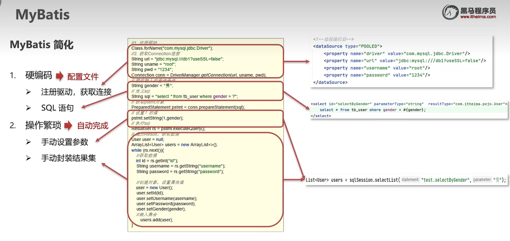
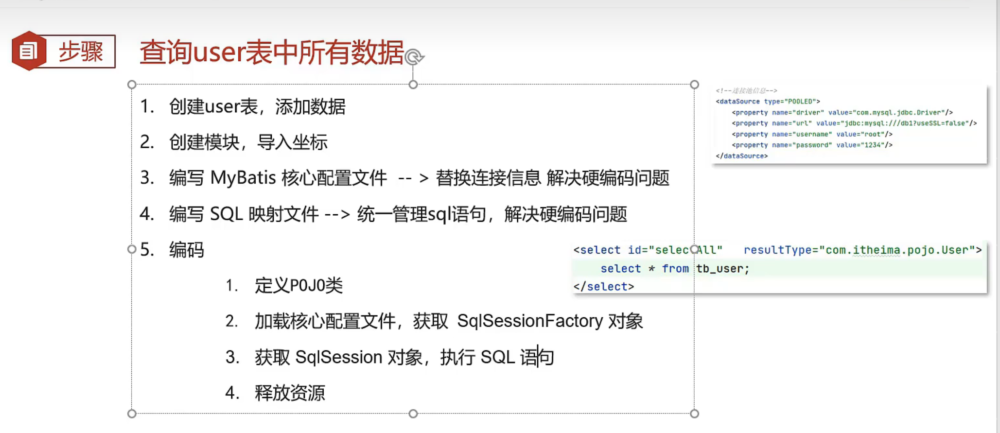
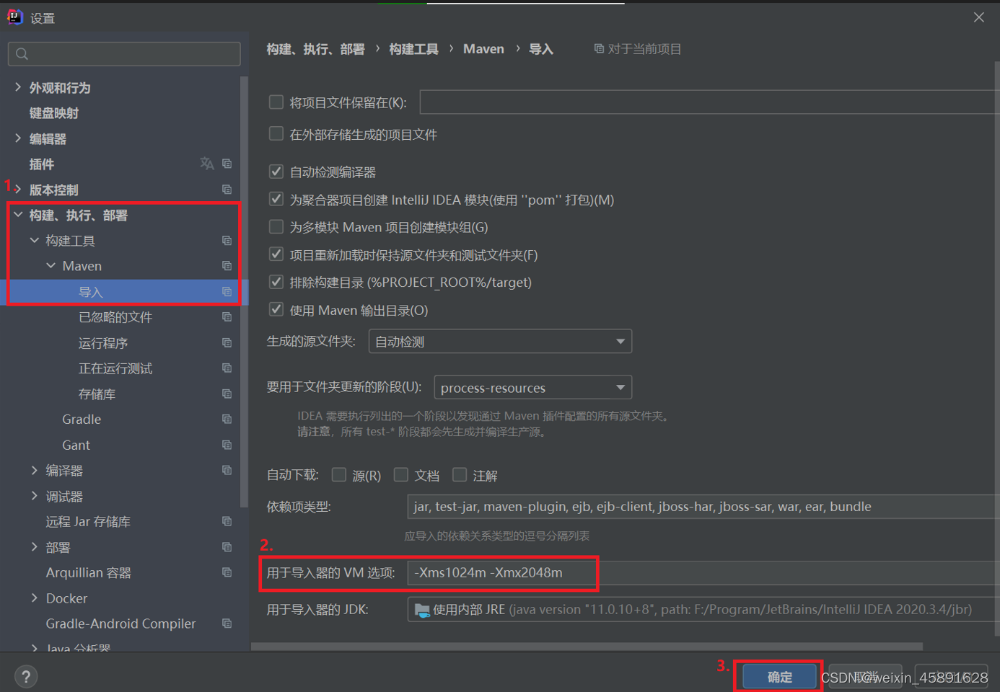
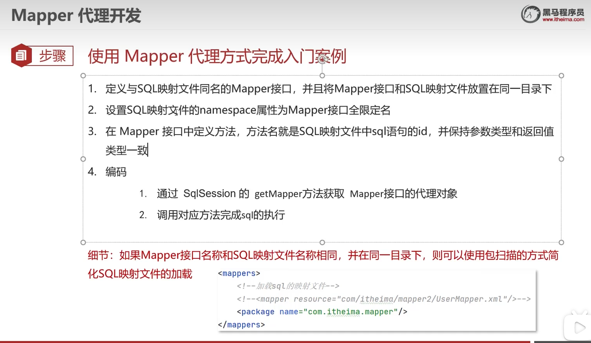
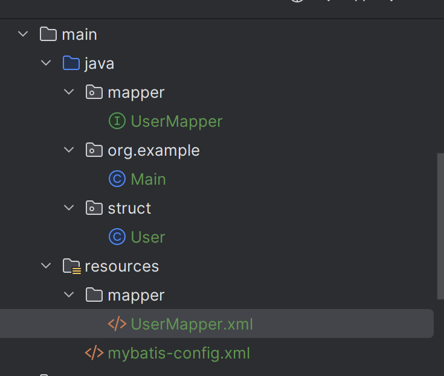
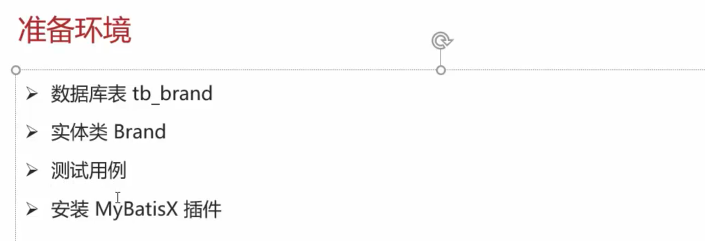
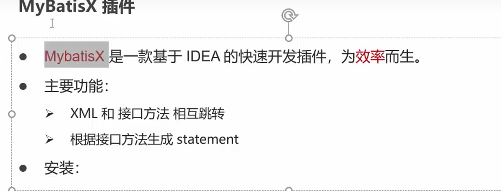

## 简介

[mybatis – MyBatis 3 | 入门](https://mybatis.org/mybatis-3/zh/getting-started.html)

### 什么是 MyBatis？

MyBatis 是一款优秀的持久层框架，它支持自定义 SQL、存储过程以及高级映射。MyBatis 免除了几乎所有的 JDBC 代码以及设置参数和获取结果集的工作。MyBatis 可以通过简单的 XML 或注解来配置和映射原始类型、接口和 Java POJO（Plain Old Java Objects，普通老式 Java 对象）为数据库中的记录。



## 入门

### 安装

要使用 MyBatis， 只需将 [mybatis-x.x.x.jar](https://github.com/mybatis/mybatis-3/releases) 文件置于类路径（classpath）中即可。

如果使用 Maven 来构建项目，则需将下面的依赖代码置于 pom.xml 文件中：

```html
<dependency>
  <groupId>org.mybatis</groupId>
  <artifactId>mybatis</artifactId>
  <version>x.x.x</version>
</dependency>
```

### 使用步骤



### 从 XML 中构建 SqlSessionFactory

先在maven项目的pom.xml中配置mybatis和mysql：

```xml
<?xml version="1.0" encoding="UTF-8"?>
<project xmlns="http://maven.apache.org/POM/4.0.0"
         xmlns:xsi="http://www.w3.org/2001/XMLSchema-instance"
         xsi:schemaLocation="http://maven.apache.org/POM/4.0.0 http://maven.apache.org/xsd/maven-4.0.0.xsd">
    <modelVersion>4.0.0</modelVersion>

    <groupId>org.example</groupId>
    <artifactId>MAVEN_project</artifactId>
    <version>1.0-SNAPSHOT</version>

    <properties>
        <maven.compiler.source>21</maven.compiler.source>
        <maven.compiler.target>21</maven.compiler.target>
        <project.build.sourceEncoding>UTF-8</project.build.sourceEncoding>
    </properties>
<!--需要添加的依赖-->
    <dependencies>
        <dependency>
            <groupId>org.mybatis</groupId>
            <artifactId>mybatis</artifactId>
            <version>3.5.13</version>
        </dependency>
        <dependency>
            <groupId>mysql</groupId>
            <artifactId>mysql-connector-java</artifactId>
            <version>8.0.33</version>
        </dependency>
    </dependencies>

</project>
```

### 依赖没有自动下载

**如果依赖没有自动下载**就在项目中执行命令，就会自动下载依赖：

```cmd
mvn dependency:resolve
```

然后在构建好的maven项目中的Resources文件夹中创建配置mybatis的xml配置文件：

配置需要连接的数据库信息：

```xml
<?xml version="1.0" encoding="UTF-8" ?>
<!DOCTYPE configuration
        PUBLIC "-//mybatis.org//DTD Config 3.0//EN"
        "https://mybatis.org/dtd/mybatis-3-config.dtd">
<configuration>
    <environments default="development">
        <environment id="development">
            <transactionManager type="JDBC"/>
            <dataSource type="POOLED">
                <property name="driver" value="com.mysql.cj.jdbc.Driver"/>
                <property name="url" value="jdbc:mysql://localhost:3306/blog"/>
                <property name="username" value="root"/>
                <property name="password" value="123456"/>
            </dataSource>
        </environment>
    </environments>
    <mappers>
        <!--加载sql的映射文件-->
        <mapper resource="UserMapper.xml"/>
    </mappers>
</configuration>
```

在java/struct文件夹新建查询表类User.java：

```java
package struct;

//alt+鼠标左键整列编辑
public class user {
    public Integer getID() {
        return ID;
    }

    public void setID(Integer ID) {
        this.ID = ID;
    }

    public String getUsername() {
        return username;
    }

    public void setUsername(String username) {
        this.username = username;
    }

    public String getPassword() {
        return password;
    }

    public void setPassword(String password) {
        this.password = password;
    }

    private Integer ID;
    private String username;
    private String password;
}

```

选中里面的变量，然后按alt+ins，（笔记本是alt+fn+12），然后选择构建Getter和Setter就会自动生成调用字句。

然后配置查询语句UserMapper.xml：

```xml
<?xml version="1.0" encoding="UTF-8" ?>
<!DOCTYPE mapper
        PUBLIC "-//mybatis.org//DTD Mapper 3.0//EN"
        "https://mybatis.org/dtd/mybatis-3-mapper.dtd">
<!--namespace是自己起的名字-->
<!--id是这个sql语句的唯一标识,resultType是返回类型指查询表的类结构的java文件(比如struct.user就是struct包下的user.java)-->
<mapper namespace="text">
    <select id="selectALL" resultType="struct.user">
        select * from user
    </select>
</mapper>
```

每个基于 MyBatis 的应用都是以一个 SqlSessionFactory 的实例为核心的。SqlSessionFactory 的实例可以通过 SqlSessionFactoryBuilder 获得。而 SqlSessionFactoryBuilder 则可以从 XML 配置文件或一个预先配置的 Configuration 实例来构建出 SqlSessionFactory 实例。

从 XML 文件中构建 SqlSessionFactory 的实例非常简单，建议使用类路径下的资源文件进行配置。 但也可以使用任意的输入流（InputStream）实例，比如用文件路径字符串或 file:// URL 构造的输入流。MyBatis 包含一个名叫 Resources 的工具类，它包含一些实用方法，使得从类路径或其它位置加载资源文件更加容易。

**简单查询示例：**

```java
public class Main {
    public static void main(String[] args) throws IOException {
        String resource = "mybatis-config.xml";
        //构建sqlSessionFactory实例
        InputStream inputStream = Resources.getResourceAsStream(resource);
        SqlSessionFactory sqlSessionFactory = new SqlSessionFactoryBuilder().build(inputStream);
        //获取SqlSession用它来执行sql
        SqlSession sqlSession = sqlSessionFactory.openSession();
        //执行sql,使用命名空间.查询语句id的方式
        List<User> userList = sqlSession.selectList("text.selectALL");
        //获得对象列表使用内置方法得到里面的数据
        for (User user : userList) {
            System.out.println("ID: " + user.getID());
            System.out.println("Username: " + user.getUsername());
            System.out.println("Password: " + user.getPassword());
            System.out.println("------------------------------------");
        }
        System.out.println(userList);
        sqlSession.close();
      }
}
```

XML 配置文件中包含了对 MyBatis 系统的核心设置，包括获取数据库连接实例的数据源（DataSource）以及决定事务作用域和控制方式的事务管理器（TransactionManager）。后面会再探讨 XML 配置文件的详细内容，这里先给出一个简单的示例：

当然，还有很多可以在 XML 文件中配置的选项，上面的示例仅罗列了最关键的部分。 注意 XML 头部的声明，它用来验证 XML 文档的正确性。**environment 元素体中包含了事务管理和连接池的配**置。mappers 元素则包含了一组**映射器（mapper）用来映射sql数据文件的（要自己创建）**，这些映射器的 XML 映射文件包含了 SQL 代码和映射定义信息。

### IDEA卡在”正在解析Maven依赖项“的解决方法

### 问题描述

在创建新的SpringBoot项目时，始终卡在”正在解析Maven依赖项…“
且已经更改为阿里云镜像

### 解决方案：

> -Xms1024m -Xmx2048m



### 不使用 XML 构建 SqlSessionFactory

如果你更愿意直接从 Java 代码而不是 XML 文件中创建配置，或者想要创建你自己的配置构建器，MyBatis 也提供了完整的配置类，提供了所有与 XML 文件等价的配置项。

```java
DataSource dataSource = BlogDataSourceFactory.getBlogDataSource();
TransactionFactory transactionFactory = new JdbcTransactionFactory();
Environment environment = new Environment("development", transactionFactory, dataSource);
Configuration configuration = new Configuration(environment);
configuration.addMapper(BlogMapper.class);
SqlSessionFactory sqlSessionFactory = new SqlSessionFactoryBuilder().build(configuration);
```

注意该例中，configuration 添加了一个映射器类（mapper class）。映射器类是 Java 类，它们包含 SQL 映射注解从而避免依赖 XML 映射文件。不过，由于 Java 注解的一些限制以及某些 MyBatis 映射的复杂性，要使用大多数高级映射（比如：嵌套联合映射），仍然需要使用 XML 映射文件进行映射。有鉴于此，如果存在一个同名 XML 映射文件，MyBatis 会自动查找并加载它（在这个例子中，基于类路径和 BlogMapper.class 的类名，会加载 BlogMapper.xml）。具体细节稍后讨论。


**提示** **对命名空间的一点补充**

在之前版本的 MyBatis 中，**命名空间（Namespaces）**的作用并不大，是可选的。 但现在，随着命名空间越发重要，你必须指定命名空间。

命名空间的作用有两个，**一个是利用更长的全限定名来将不同的语句隔离开来，同时也实现了你上面见到的接口绑定**。就算你觉得暂时用不到接口绑定，你也应该遵循这里的规定，以防哪天你改变了主意。 长远来看，只要将命名空间置于合适的 Java 包命名空间之中，你的代码会变得更加整洁，也有利于你更方便地使用 MyBatis。

**命名解析：**为了减少输入量，MyBatis 对所有具有名称的配置元素（包括语句，结果映射，缓存等）使用了如下的命名解析规则。

- 全限定名（比如 “com.mypackage.MyMapper.selectAllThings）将被直接用于查找及使用。
- 短名称（比如 “selectAllThings”）如果全局唯一也可以作为一个单独的引用。 如果不唯一，有两个或两个以上的相同名称（比如 “com.foo.selectAllThings” 和 “com.bar.selectAllThings”），那么使用时就会产生“短名称不唯一”的错误，这种情况下就必须使用全限定名。

------

对于像 BlogMapper 这样的映射器类来说，还有另一种方法来完成语句映射。 它们映射的语句可以不用 XML 来配置，而可以使用 Java 注解来配置。比如，上面的 XML 示例可以被替换成如下的配置：

```java
package org.mybatis.example;
public interface BlogMapper {
  @Select("SELECT * FROM blog WHERE id = #{id}")
  Blog selectBlog(int id);
}
```

使用注解来映射简单语句会使代码显得更加简洁，但对于稍微复杂一点的语句，Java 注解不仅力不从心，还会让本就复杂的 SQL 语句更加混乱不堪。 因此，如果你需要做一些很复杂的操作，最好用 XML 来映射语句。

选择何种方式来配置映射，以及是否应该要统一映射语句定义的形式，完全取决于你和你的团队。 换句话说，永远不要拘泥于一种方式，你可以很轻松地在基于注解和 XML 的语句映射方式间自由移植和切换。

### 作用域（Scope）和生命周期

理解我们之前讨论过的不同作用域和生命周期类别是至关重要的，因为错误的使用会导致非常严重的并发问题。

------

**提示** **对象生命周期和依赖注入框架**

依赖注入框架可以创建线程安全的、基于事务的 SqlSession 和映射器，并将它们直接注入到你的 bean 中，因此可以直接忽略它们的生命周期。 如果对如何通过依赖注入框架使用 MyBatis 感兴趣，可以研究一下 MyBatis-Spring 或 MyBatis-Guice 两个子项目。

------

#### SqlSessionFactoryBuilder

这个类可以被实例化、使用和丢弃，一旦创建了 SqlSessionFactory，就不再需要它了。 因此 SqlSessionFactoryBuilder 实例的最佳作用域是方法作用域（也就是局部方法变量）。 你可以重用 SqlSessionFactoryBuilder 来创建多个 SqlSessionFactory 实例，但最好还是不要一直保留着它，以保证所有的 XML 解析资源可以被释放给更重要的事情。

#### SqlSessionFactory

SqlSessionFactory 一旦被创建就应该在应用的运行期间一直存在，没有任何理由丢弃它或重新创建另一个实例。 使用 SqlSessionFactory 的最佳实践是在应用运行期间不要重复创建多次，多次重建 SqlSessionFactory 被视为一种代码“坏习惯”。因此 SqlSessionFactory 的最佳作用域是应用作用域。 有很多方法可以做到，最简单的就是使用单例模式或者静态单例模式。

#### SqlSession

每个线程都应该有它自己的 SqlSession 实例。SqlSession 的实例不是线程安全的，因此是不能被共享的，所以它的最佳的作用域是请求或方法作用域。 绝对不能将 SqlSession 实例的引用放在一个类的静态域，甚至一个类的实例变量也不行。 也绝不能将 SqlSession 实例的引用放在任何类型的托管作用域中，比如 Servlet 框架中的 HttpSession。 如果你现在正在使用一种 Web 框架，考虑将 SqlSession 放在一个和 HTTP 请求相似的作用域中。 换句话说，每次收到 HTTP 请求，就可以打开一个 SqlSession，返回一个响应后，就关闭它。 这个关闭操作很重要，为了确保每次都能执行关闭操作，你应该把这个关闭操作放到 finally 块中。 下面的示例就是一个确保 SqlSession 关闭的标准模式：

```java
try (SqlSession session = sqlSessionFactory.openSession()) {
  // 你的应用逻辑代码
}
```

在所有代码中都遵循这种使用模式，可以保证所有数据库资源都能被正确地关闭。

#### 映射器实例

映射器是一些绑定映射语句的接口。映射器接口的实例是从 SqlSession 中获得的。虽然从技术层面上来讲，任何映射器实例的最大作用域与请求它们的 SqlSession 相同。但方法作用域才是映射器实例的最合适的作用域。 也就是说，映射器实例应该在调用它们的方法中被获取，使用完毕之后即可丢弃。 映射器实例并不需要被显式地关闭。尽管在整个请求作用域保留映射器实例不会有什么问题，但是你很快会发现，在这个作用域上管理太多像 SqlSession 的资源会让你忙不过来。 因此，最好将映射器放在方法作用域内。就像下面的例子一样：

```java
try (SqlSession session = sqlSessionFactory.openSession()) {
  BlogMapper mapper = session.getMapper(BlogMapper.class);
  // 你的应用逻辑代码
}
```

## 解决sql提示警告

用idea和数据库建立连接

## Mapper代理开发




 1.定义sql映射文件同名的mapper接口，并且将mapper接口和sql映射文件防止在同一目录下
    2.设置sql映射文件的namespace属性为mapper接口全限定名（包位置.xml）
    3.在mapper接口中定义方法，方法名就是sql映射文件中的sql语句中的id，并保持参数类型和返回值类型一致
    4.编码
       1.通过SqlSession的getMapper方法获取，Mapper接口的代理对象
       2.调用对应方法完成sql的执行
细节:如果Mapper接口名称和sql映射文件名称相同，并在同意目录下，则就可以使用包扫描的方式简化sql映射文件的加载


UserMapper.xml中：

```java
<?xml version="1.0" encoding="UTF-8" ?>
<!DOCTYPE mapper
        PUBLIC "-//mybatis.org//DTD Mapper 3.0//EN"
        "https://mybatis.org/dtd/mybatis-3-mapper.dtd">
<!--namespace是自己起的名字-->
<!--id是这个sql语句的唯一标识,resultType是返回类型指查询表的类结构的java文件(比如struct.user就是struct包下的user.java)-->
<mapper namespace="mapper.UserMapper">
    <select id="selectALL" resultType="struct.User">
        select * from user
    </select>
</mapper>
```

**命名空间要和resourses中UserMapper的相对定位相同**

UserMapper.java中：

```java
package mapper;

import struct.User;

import java.util.List;

public interface UserMapper {
 List<User> selectALL();
}
```

selectALL()会自动调用xml中id为selectALL的查询语句返回的是User列表

在main.java中使用Mapper代理执行查询：

```java
package org.example;
import mapper.UserMapper;
import struct.User;
import org.apache.ibatis.io.Resources;
import org.apache.ibatis.session.SqlSession;
import org.apache.ibatis.session.SqlSessionFactory;
import org.apache.ibatis.session.SqlSessionFactoryBuilder;
import java.io.IOException;
import java.io.InputStream;
import java.util.List;


// Press Shift twice to open the Search Everywhere dialog and type `show whitespaces`,
// then press Enter. You can now see whitespace characters in your code.
public class Main {
    public static void main(String[] args) throws IOException {
        String resource = "mybatis-config.xml";
        InputStream inputStream = Resources.getResourceAsStream(resource);
        SqlSessionFactory sqlSessionFactory = new SqlSessionFactoryBuilder().build(inputStream);
        //获取SqlSession用它来执行sql
        SqlSession sqlSession = sqlSessionFactory.openSession();
        //UserMapper.java构建之后的文件名UserMapper.class传入getMapper然后传给代理userMapper
        UserMapper userMapper= sqlSession.getMapper(UserMapper.class);
        //使用内置的selectALL()方法（与xml中的id名称要对应）
        List<User> userList = userMapper.selectALL();
        //获得对象列表使用内置方法得到里面的数据
        for (User user : userList) {
            System.out.println("ID: " + user.getID());
            System.out.println("Username: " + user.getUsername());
            System.out.println("Password: " + user.getPassword());
            System.out.println("------------------------------------");
        }
        System.out.println(userList);
        sqlSession.close();
      }

}
```

可以使用扫描包的方式查找：

mybatis-config.xml：

```java
 <mappers>
        <!--加载sql的映射文件-->
        <mapper resource="mapper/UserMapper.xml"/>
        <!--Mapper代理方式,扫描包的方式查找-->
        <package name="mapper.UserMapper"/>
    </mappers>
```

以上两种方法都等同，保留一种即可

## Mybatis核心配置文件

可以配置多个数据库源（mybatis-config.xml）：

```xml
 <!--environments配置数据连接环境信息，可以配置多个environment，通过default切换不同的--> 
<environments default="development">
        <environment id="development">
             <!--transactionManager事务管理方式-->
            <transactionManager type="JDBC"/>
            <dataSource type="POOLED">
                <property name="driver" value="com.mysql.cj.jdbc.Driver"/>
                <property name="url" value="jdbc:mysql://localhost:3306/blog"/>
                <property name="username" value="root"/>
                <property name="password" value="123456"/>
            </dataSource>
        </environment>
    </environments>
```

给包(查询类的包，User.java这种struct包下)配置别名mybatis-config.xml：

```java
    <typeAliases>
        <package name="struct"/>
    </typeAliases>
```

 <typeAliases>要写在<configuration>下面，<environments>的上面，符合xml约束

别名默认使用类的名字（不区分大小写），于是查询返回可以这样写：

```xml
<mapper namespace="mapper.UserMapper">
    <select id="selectALL" resultType="user">
        select * from user
    </select>
</mapper>
```

## 配置文件完成增删改查



