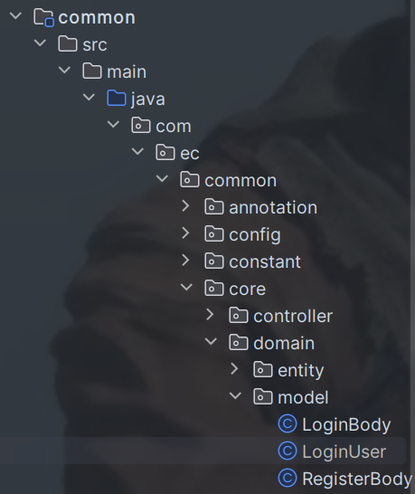
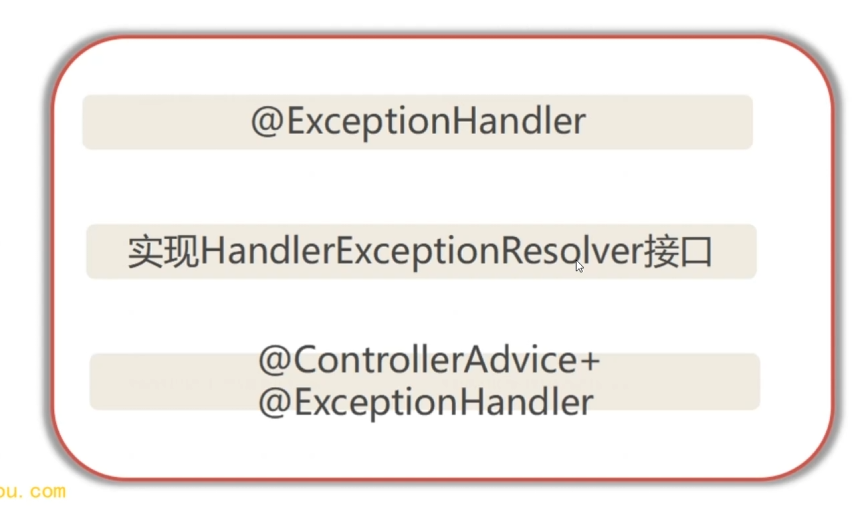

# 导论


## ERP+CRM

 

### 什么是CRM（客户关系管理系统）

CRM又称客户关系管理，旨在借助信息技术及互联网技术协调企业与顾客间的交互关系，吸引新客户、保留老客户并提高客户粘性。CRM的本质是连接企业内部业务及外部的终端客户、经销商、服务商及设备，打通内外部信息壁垒，实现业务的全面化管理。

此外，CRM以数据收集、存储、分析等功能驱动营销、销售和客服三大板块，支撑客户全生命周期管理，为客户打通完整的价值链条，并通过PC、移动等端口实现系统接入及与客户的双向互动，赋能企业数字化运营，助力产业互联时代下业绩的规模化增长。


###  什么是ERP（Enterprise Resource **Planning**）

企业资源计划（Enterprise Resource Planning）系统是一种集成的软件系统，旨在帮助企业管理其资源。它可以协调各种不同的业务流程，例如供应链管理、采购、库存管理、财务和人力资源。通过使用ERP系统，企业可以更加高效地管理其资源，从而提高生产力和效率。此外，ERP系统还可以提供实时数据和分析报告，帮助企业做出更明智的商业决策，实现更好的质量控制、减少错误和浪费、提高客户满意度和增强企业品牌价值。


### CRM与ERP的关系

* ERP是通过提升公司内部资源的计划和控制能力，满足客户、及时交货的同时最大限度地降低企业成本，以效率为中心，通过提高内部运作效率来提升服务客户的质量。
* CRM是以建立、发展和维护客户关系为主要目的的。
* 两者在关注对象上有所不同，ERP主要关注的是企业内部资源计划，CRM更多的是关注市场与客户。
* 所以CRM的作用主要在与客户直接接触的部门，主要针对的是企业的市场营销、销售、服务部门。
* 也就是说， ERP是对企业的全面管理应用，CRM就像ERP的手臂，它的作用延伸到了ERP以前力所不能及的范围。
* 通俗地说，就是CRM要尽量多接单，ERP 要尽量高效率地处理订单，最重要的一点就是它们最终都是要使企业的利益最大化以及长久化。


### 两者是否可以整合


## ERP+CRM一体化系统架构设计方案详解


### 前端架构设计方案


### 后端架构设计方案


### 数据库设计方案


* master作为主数据库，在表的结构上保持一定的稳定性
  * `master_tenant`： 主要用来存储租户的信息
  * `log`：日志系列表
* tenant会随着每一个租户注册我们的系统，都会给每一个租户生成独立的tenant数据库，名称都是随机生成的
  * `system` ：系统基础表
  * `crm` ：CRM系统用到的业务表
  * `erp`： ERP业务功能表基础表


### saas系统设计方案


# ERP+CRM系统数据库开发与Saas化


## ERP+CRM系统数据库开发与Saas化


### 什么是SaaS系统

SaaS即软件即服务（Software as a Service），是一种通过互联网提供软件应用的服务模式。其中第三方供应商提供应用程序的托管和提供给客户，通常通过互联网进行访问。这种模式**消除了客户需要在本地安装和维护软件**的需要，而是将这些职责转移到了第三方提供商。在SaaS模式下，用户不再需要购买和维护软件的整个基础架构，而是通过订阅的方式获得对云端软件的访问权限。SaaS提供商负责软件的部署、维护和安全性等方面的工作，用户只需要通过网络浏览器或专用应用程序就可以方便地访问和使用软件。


### 如何设计SaaS系统


* 租户端：

  基于标准系统，给不同的客户提供在线软件租赁模式，但是在这个基础里面，看不到其他企业的数据，好像只有你在使用一样

* 用户端：

  可以在网页、小程序、H5上面使用

* 管理端：

  管理员用，主要用来管理租户、约束租户，是一个后台管理系统

  


业务代码一般写在应用层里面，应用层和缓存层、数据库交互通过数据访问层来实现，租户识别通过拦截器来实现


### SaaS3大特点：

1. 订阅模式

   该产品基于云平台运行，并集中托管在远程服务器上，无需单机部署甚至物理分发即可交互和使用，用户通过网络使用，只需通过在线登录即可使用该服务，无需安装和手动升级

2. 规模化和复利

   用户不需要购买硬件和中间件，无需更新、运营、实施、管理和维护，通过接入网络即可使用，最大限度降低决策和投资成本，所以SaaS拥有大量用户并形成规模

3. 开放和灵活

   根据不同组织的需求提供多种解决方案，用户在付费前可免费试用开放接口API和其他软件集成以满足客户业务需求

   

### SaaS系统优点

1. 降低成本

2. 减少时间消耗

3. 灵活性

4. 可持续升级

   

### SaaS系统销售模式

1. 自助服务，客户在没有销售人员的干预下，自行完成购买使用

2. 交易性销售，低接触模式，使用免费试用来吸引用户，销售人员通过电话或在线咨询服务，通常采用按月的订阅模式，需要良好的客户支持以确保客户获得成品价值并且付费

3. 顾问式销售，高接触模式，需要大量人力投入，比如投标、参观、提出解决方案、谈判等等，更多采用年付费模式，产品以销售团队为中心

   

### SaaS系统设计规律


产品价值 = （新体验-旧体验） -  转移成本


### SaaS产品架构特点


## 设计SaaS数据库


### 多租户场景下数据库架构设计逻辑和原则


* 性能主要是避免跨库、跨节点操作

* 安全性主要是保护租户之间的数据隔离

* 可管理性主要是支持应用程序的灵活性、业务调整等功能

* 可扩展性要保证支持灵活的弹性扩容


### 多租户设计模式


* 隔离性主要是指性能和数据是否在租户之间隔离的问题，性能主要是指一个租户的负载是否会影响到其他租户，以合理的成本去减少影响
* 扩展性从租户层面开始：随着业务的发展，小租户的业务数据量增加，可以成为大租户，在商业上可以购买更高级别的服务
* 租户成本SaaS本来通过规模效应跟传统的软件相比具有很大的优势，但是还是要根据不同的租户要求来给出对应的解决方案。比如有些客户资金充足，可以涉及一些效率比较高，存储量比较大的解决方案，就比如独立数据库
* 运维复杂性对于新用户进入和老租户退出都需要相应的生命周期管理

结合上述因素，可以在数据库设计模式中设计三种模型：


* DB隔离：租户使用数据库一个实例，统一管理大小租户迁移比较容易，相对容易解决隔离问题，但是成本比较高
* 表隔离：多租户共用数据库，公共数据比如chip-hard？使用相同的表，而每个租户的业务数据分别使用不同的表，业务表的名称通常通过租户ID等等来进行区分，但是成本低一点，运维成本比DB高
* 行隔离：主要是多租户共用一个DB，而且每个租户的企业数据使用相同的表，表里面每一行都有租户ID，每个CRUD都有租户标识，隔离度比较低，特别是当大租户在同一个流量类型里面一起进行读写操作时，会出现一些资源竞争，所以成本相对低，但是隔离性很差


### 租户迁移

* DB隔离模式下，只需要单机一次即可迁移整个库，这是最理想的状况

* 表隔离模式下，需要迁移表

* 行隔离模式下，必须在相应的表上加上过滤条件，比如租户id等于多少来设置

  

### 多租户部署模式

* 单租户单独部署

  通常面向大型的顶层用户，尽可能减少对其他租户的影响，确保数据的隔离性，确保大型顶层用户提供服务不受影响

* 多租户共享部署

  适合中小型企业


## 高效设计SaaS数据库与ER建模


# 搭建ERP+CRM系统common基础模块


## 父子聚合工程的设计和原则


* 独立性是一个相对性的概念，每个子模块都有一定的依赖性，但也有独立的功能
* 明确粒度，每个模块作用的边界是什么，他负责哪块的功能，避免出现两个模块之间有重复的功能，或者设计不合理
* 团队分配，我们要明确哪些模块分配给哪些人，极大的提高配合效率
* 演进，设计这个父子聚合工程，需要考虑后续优化升级的事情，比如说设计了这个版本，要考虑下一个版本如何在当前版本演进和拓展
* 避免循环依赖，两个模块之间出现循环依赖一定要避免


* 伸缩就是拓展性，要考虑后续的优化迭代升级
* 分层就是设计子模块里面也要进行分层，子模块之间有一个层次，子模块内部也有一个自己的层次
* 自动化就是有的功能保证用户在使用的时候他会自动的使用一些功能


父工程：`erp-crm`

七个子模块：

* `common`：底层的模块，比如定义一些常量、基础的工具
* `system`：它的前沿是center，center是面向于前端，前端主要是通过center来进行交互，打包也只打包这一个模块，只需要部署center这一个即可实现多个模块的功能
* `auth`：认证、授权还有一些核心的工具，是核心架构
* `erp`：存放erp业务核心的一些相关代码
* `crm`：存放crm业务核心的一些代码
* `saas`：主要管理saas租户的模块


## Springboot项目的创建和配置及SPI机制等核心原理解析


### Springboot底层原理


* 运行环境时读取的配置文件由`spring.profiles.active`确定

* `EnableAutoConfiguration`注解会在默认情况下帮助spring boot进行自动安装

  

### SpringBoot两大核心

* 自动配置：简化配置核心，基于Configuration和Condition
* `Spring-boot-starter`：脚手架的一个核心，集成各种第三方库、协助工具等等


### SPI机制


### Springboot项目的创建和配置

> 在Maven中，每个项目都应该有一个唯一的groupId和artifactId，但是version可以通过继承来自父项目。
> 因此，使用parent元素可以避免在每个子项目中都重复定义groupId和version。


* **`center`**是面向前端的，主要是给前端提供接口
* **`controller`**中三个模块：
  * **common**是公共模块
  * **`monitor`**是监控模块
  * **system**是系统模块

* **`core.config`**主要是给swagger做基础配置
* **resources**主要存放一些基础的配置文件
* **`ErpCrmApplication`**是启动类，**`EroCrmServletInitializer`**是启动的配置类
* **i18n**是存放国际化的一些配置
* **`init-sql-script`**主要是注册租户的时候创建和初始化数据库执行的一个脚本
* **`META-INF`**存放一些META-Information相关的文件，用来配置应用程序、拓展程序、类加载器等
* **`mybatis`**存放mybatis相关的配置
* **`application.yml`**：主配置文件
* **`application-druid.yml`**：数据库配置文件
* **`banner.txt`**：配置启动的时候springboot启动之后控制台打印的一些图案信息
* **`logback.yml`**：日志的配置


## 统一配置和项目相关配置详解和应用


### @ConfigurationProperties注解原理


### 统一配置和项目相关配置

```properties
# 这个是在META-INF的spring-devtools.properties中的
# 为了开启devtools热加载时配置和热加载使用同一个加载器来正常解析json，否则反而不能解析正确
# 热部署是一种软件开发和部署技术，它允许在不影响应用程序运行的情况下更新代码、配置或资源文件。
restart.include.json=/com.alibaba.fastjson.*.jar
```
Application version是项目版本号

springboot version就是springboot版本号

```tex
Application Version: ${ec.version} 
Spring Boot Version: ${spring-boot.version}
___________                          _________
\_   _____/____________      .__     \_   ___ \_______  _____
 |    __)_\_  __ \____ \   __|  |___ /    \  \/\_  __ \/     \
 |        \|  | \/  |_> > /__    __/ \     \____|  | \/  Y Y  \
/_______  /|__|  |   __/     |__|     \______  /|__|  |__|_|  /
        \/       |__|                        \/             \/
-----------------------------------
//            上天保佑         永无BUG        永不宕机       //
////////////////////////////////////////////////////////////////////

```

获取centor中的相关配置需要在common模块中获取


* `annotation`：是自定义的注解
* `config`：存放一些基础配置
* `constant`：存放常量信息
* `core`：存放一些核心的公共信息
* `enums`：存放一些公共的枚举
* `exception`：存放异常处理相关
* `filter`：存放过滤器
* `utils`：存放工具类
* `xss`：存放自定义注解和实现

config中的ErpCrmConfig.java中

```java
@Component
@ConfigurationProperties(prefix = "ec")
```

* 通过获取application.yml中前缀为ec的相关配置信息，定义的属性需要跟获取到的属性名称保持一致 ，

* servlet中的context-path的含义：[https://blog.csdn.net/u010919402/article/details/125273992](https://blog.csdn.net/u010919402/article/details/125273992)
* 关于yml于properties文件的联系

```json
server:
  port: 8081
  servlet:
    context-path: /hangge
  tomcat:
    uri-encoding: utf-8
```

相当于

```properties
server.port=8081
server.servlet.context-path=/hangge
server.tomcat.uri-encoding=utf-8
```

* 关于spring.profiles的运用

```json

spring:
  #profiles.active表示当前激活的环境参数
  profiles:
    active: druid
```

在该文件中，根据部署场景不同，切换不同的配置文件：配置spring.profiles.active，属性值为${profile}。

1. `spring.profiles.active=dev`：启用application-dev.yml
2. `spring.profiles.active=test`：启用application-test.yml
3. `spring.profiles.active=prod`：启用application-prod.yml


## 常量的定义


* `Constant`：通用常量
* `GenConstants`：生成文件需要的一些常量
* `HttpStatus`：一些http相关的常量
* `ScheduleConstants`：任务调动相关的常量信息
* `TenantConstants`：租户相关的常量信息
* `UserConstants`：用户相关的常量信息
* 


## 提高代码的高可用性及Web层通用数据处理和控制器基类开发


### 如何提高代码高可用性

遵循DRY原则，也就是要始终检查是否有重复代码，有的话可以抽象为公共类


### @InitBinder注解的使用和原理


### Web层通用数据处理和控制器基类开发


* `controller`：存放的是基本的controller
* `domain`：存放的主要是实体类
* `page`：主要存放的是分页相关的一些内容
* `redis`：放redis相关的工具类
* `text`：放一些字符集相关的类


## 企业实战实体编写规范详解及系统Entity开发


### 实体类的规范写法


### 系统基础entity开发


* `SysDept`：系统相关的实体类

  所有的entity都继承自一个entity也就是model目录下的BaseEntity，同时这个BaseEntity实现了序列化接口

  ```java
  private static final long serialVersionUID = 1L;
  ```

  上述语句的作用是在序列化的时候保持版本的兼容性，在版本升级时，反序列化仍保持对象的唯一性

  在SysDept中，在某些方法中，例如`getDeptName`有判空和长度限制的校验

  `getEmail`有检验邮箱格式是否正确的检验

  ```java
  @NotBlank(message = "部门名称不能为空")
  @Size(min = 0, max = 30, message = "部门名称长度不能超过30个字符")
  public String getDeptName() {
      return deptName;
  tt}
  ```

  ```java
  @Email(message = "邮箱格式不正确")
  @Size(min = 0, max = 50, message = "邮箱长度不能超过50个字符")
  public String getEmail() {
     return email;
  }
  ```

* `SysDicData`：字典数据表

  ```java
  @Excel(name = "字典编码", cellType = ColumnType.NUMERIC)
  private Long dictCode;
  
  @Excel(name = "字典标签")
  private String dictLabel;
  
  @Excel(name = "是否默认", readConverterExp = "Y=是,N=否")
  private String isDefault;
  ```

  可以注意到每一个属性上面都有excel的注解，也就是说这些属性在后期会作为excel格式在前端进行导出：

   `cellType = ColumnType.NUMERIC`：代表是个数字类型的（Long）

  String类型的则不需要cellType

  `readConverterExp = "Y=是,N=否"`：添加读写转换表达式的功能，也就是`isDefault`等于Y时代表是，等于N时代表否

* `SysDictType`：字典类型表

* `SysMenu`：菜单权限表

* `SysRole`：角色表

* `SysUser`：用户对象表

  ```java
  @Excel(name = "用户序号", cellType = ColumnType.NUMERIC, prompt = "用户编号")
  private Long userId;
  ```

  `prompt = "用户编号"`是一个提示信息

  ```java
  @Excel(name = "部门编号", type = Type.IMPORT)
  private Long deptId;
  ```

  `type = Type.IMPORT`是一个枚举，有三个元素：ALL、EXPORT、IMPORT，IMPORT相当于一个导入的标识，EXPORT相当于一个导出的标识

  ```java
  @Excels({
      @Excel(name = "部门名称", targetAttr = "deptName", type = Type.EXPORT),
      @Excel(name = "部门负责人", targetAttr = "leader", type = Type.EXPORT)
  })
  private SysDept dept;
  ```

  @EXCELS是自定义的一个注解，它里面的value是一个excel[]数组


## 用户注册和登录model的规范


### 用户登录及注册对象



* LoginBody：用户登录对象

* LoginUser：登录用户身份权限

  里面有几个特殊的方法：

  ```java
  @JSONField(serialize = false)
  @Override
  public String getPassword() {
    return user.getPassword();
  }
  ```

  表面上述属性不会参与序列化，该方法加载在get上是序列化，在set上是反序列化

* RegisterBody：用户注册对象

  完全继承的是LoginBody

`@JsonIgnore` 和 `@JsonProperty` 是 Java 中用于控制 JSON 序列化和反序列化的注解，通常用于与 JSON 数据交互的对象的字段上。

- `@JsonIgnore`: 该注解用于标记在字段上，表示在序列化和反序列化过程中忽略该字段。当对象转换为 JSON 字符串时，被标记为 `@JsonIgnore` 的字段将不会被包含在 JSON 中；同样，当 JSON 字符串反序列化为对象时，忽略 JSON 中对应的字段。
  
  ```java
  public class MyClass {
      private String field1;
      
      @JsonIgnore
      private String field2;
      
      // Getters and setters
  }
  ```

- `@JsonProperty`: 该注解用于标记在字段上，用于指定 JSON 中字段的名称。在序列化和反序列化过程中，对象字段的名称将会被映射到指定的 JSON 字段名称上，而不是默认的 Java 字段名称。

  ```java
  public class MyClass {
      private String field1;
      
      @JsonProperty("customFieldName")
      private String field2;
      
      // Getters and setters
  }
  ```

这两个注解常用于控制对象与 JSON 之间的映射关系，以便更灵活地处理 JSON 数据。


## 统一Web响应处理的开发，实现ERP+CRM系统统一接口返回格式


* AjaxResult：操作消息提醒，给前端返回的一个数据类型


## Treeselect、ErpBase基类开发，掌握后端如何优雅设计树结构表

**下述的实体存放位置参考上面图片**

### 树形结构表3种设计分析


* 邻接表：最常见的设计方式，在没有冗余数据的情况下，正确表达菜单树，但需要在跨级别查询当中进行一个递归的处理，通用的赋id的设计
* 路径枚举：也是通用的赋id及字段添加到设计一的基础上，然后以存储所有的赋id集，其中许多都通过逗号或其他分割符进行分割
* 闭包表：这个设计方式是分层存储的简单且优雅的解决方案，是一种用空间交换时间的方式，但是必须创建一个额外的树路径表，来纪录树中所有节点之间的关系，包含了两列：一个是祖先列，还有一个后代列


### ErpBase基类开发

与BaseEntity基本一样

### Tree基类开发

TreeEntity写了但是暂时里面没有用到，方便后面做二次开发或者更其他系统进行对接可能会用到

### Treeselect树结构实体类

```java
@JsonInclude(JsonInclude.Include.NON_EMPTY)
private List<TreeSelect> children;
```

上述有个属性`JsonInclude.Include.NON_EMPTY`，代表属性为空就不序列化


## 分页及表格数据TableSupport处理，ERP+CRM等企管软件分页分析与设计思想


* PageDomain：分页数据实体

* TableDataInfo：表格分页数据对象

* TableSupport：表格数据处理


## RedisCache自定义和配置，实现Spring boot和Redis整合开发典型应用


### RedisTemplate的基本使用


### redis工具类开发

```java
@Autowired
public RedisTemplate redisTemplate;
```

redisTemplate是操作redis最主要的工具，主要是后续对于各种容器的redis操作都需要用到RedisTemplate的一些内置方法


## 应用字符集工具CharsetKit实现各种字符集编码判断与转换

* 字符集和字符编码


### 字符集常量定义和字符集转换等方法编写


* CharsetKit：字符集工具类

* Convert：类型转换器

  SpringBoot中使用Converter接口实现类型转换器：

  

  

* StrFormatter：字符串格式化


## 公共枚举方法和枚举定义规范，限流类型、数据源等公共enums应用


## Springboot统一自定义异常

* 统一异常处理三种方式




## 跨站脚本（XSS）攻击和过滤处理-原理、类型和实践


* 劫持cookie以获取敏感信息
* 利用flash通过跨域权限设置获得更高的权限或者使用java语言来做类似的事情
* 利用iframe、frame、XMLHttpRequest或flash作为攻击的用户执行管理操作或执行一般操作，比如添加好友
* 利用可被攻击的域收到其他域信任的特点，作为信任源，请求通常不允许的行为，比如不知道的一些投票活动
* 一些访问量大的页面上的xss可能攻击较小的网站，以获得DDOS：分布式拒绝服务攻击（Distributed Denial of Service Attack）的效果


* 编码：对于用户输入的数据进行html编码
* 过滤：把用户上传的DOM属性移除，移除用户上传的各种节点
* 矫正：避免直接对html进行编码，而使用DOM、brace转换矫正不配对的DOM标签


* RepeatableFilter：Repeatable 过滤器

* RepeatedlyRequestWrapper：构建可重复读取inputStream的request

  如果使用原生的HttpServletRequestWrapper只能读取一次。

* XssFilter：防止XSS攻击的过滤器

* XssHttpServletRequestWrapper：XSS过滤处理


## Springboot属性填充、bean初始化、循环依赖等核心原理，如何更好设计Bean工具及对象属性验证？


### Spring Bean的核心原理


* BeanUtils：Bean工具开发
* BeanValidators：bean对象属性验证


## 如何高效率处理文件类型、文件和媒体类型？


* FileTypeUtils：文件类型工具类
* FileUploadUtils：文件上传工具类
* FileUtils：文件处理工具类
* ImageUtils：图片处理工具类
* MineTypeUtils：媒体类型工具类


## 转义和反转义工具箱EscapeUtil开发，及通过HTML过滤器有效去除XSS漏洞隐患


* EscapeUtil：转义和反转义工具箱EscapeUtil开发
* HTMLFilter：HTML过滤器，去除XSS漏洞隐患


## 通用Http工具HttpHelper及发送方法，实现自动解析和链式处理


* HttpHelper：通用http工具类

  主要的作用是通过request经过一些列操作拿到body类型数据

* HttpUtils：通用http发送请求


## 实现计算机底层应用、IP方法、地址处理


* AddressUtils：获取地址类

* IpUtils：获取IP方法

# 实操

## 依赖和基本软件安装


java版本推荐下载JDK 17


Redis 是一个基于内存的数据存储系统，常用于缓存、队列、发布/订阅等场景。以下是几个常用的 Redis 命令以及关于 key 的层级结构：

1. **EXISTS**: 用于检查给定 key 是否存在。
   - 用法：`EXISTS key`

2. **DEL**: 用于删除已存在的 key。
   - 用法：`DEL key [key ...]`

3. **KEYS**: 用于查找所有符合给定模式 pattern 的 key。
   - 用法：`KEYS pattern`
   - 注意：在生产环境中，避免在大型数据库上使用该命令，因为它会阻塞服务器一段时间。

4. **EXPIRE**: 用于设置 key 的过期时间，单位为秒。
   - 用法：`EXPIRE key seconds`
   - 如果 key 在指定的秒数后未被修改，过期时间到达，key 将自动删除。

5. **TTL**: 用于获取 key 的剩余过期时间，以秒为单位。
   - 用法：`TTL key`

Redis 中的 key 是平级的，没有层级结构，但是可以通过一定的命名规范来模拟层级结构。例如，使用命名空间前缀来模拟层级结构：

```plaintext
user:1:name
user:1:email
user:2:name
user:2:email
```

在上述示例中，`user` 是命名空间前缀，`1` 和 `2` 是用户 ID，`name` 和 `email` 是具体的键。通过这种方式，可以组织出类似层级结构的 key。


常用 Maven 插件

1. **maven-jar-plugin**: 用于构建 JAR 文件的插件。它可以配置 JAR 文件的元数据，包括清单文件、构建过程中所包含的文件等。
2. **maven-assembly-plugin**: 用于创建可执行 JAR、ZIP、TAR 等归档文件的插件。它可以将项目的依赖项打包到一起，以创建一个独立的可执行文件或部署包。
3. **maven-war-plugin**: 用于构建 WAR 文件的插件。它可以配置 WAR 文件的元数据，例如 Web 应用程序的部署描述符（web.xml）以及 Web 应用程序所包含的文件。
4. **maven-dependency-plugin**: 用于管理项目依赖项的插件。它可以用于复制依赖项、分析依赖树、解析依赖项等。
5. **maven-jetty-plugin**: 用于在 Jetty Servlet 容器中运行 Web 应用程序的插件。它可以用于快速启动和调试 Web 应用程序，方便开发人员进行调试和测试。

**常用 maven 命令** 

常用打包

1. **mvn clean package**: 执行该命令会先清理项目（删除 target 目录），然后编译项目并打包，生成项目的可执行 JAR、WAR 或其他类型的归档文件，存放在 target 目录下。
2. **mvn clean install**: 该命令与 `mvn clean package` 类似，不过它会在打包之后将生成的项目构件安装到本地 Maven 仓库中。其他项目可以通过 Maven 依赖来使用这些构件。
3. **mvn clean deploy**: 该命令与 `mvn clean install` 类似，但是它会将项目构件部署到远程 Maven 仓库中，通常用于发布项目构件到内部或公共仓库供其他开发者使用。

其他常用命令

1. **mvn -V**: 显示 Maven 的版本信息，包括 Maven 自身和 Java 版本。
2. **mvn compile**: 编译项目的源代码，生成编译后的类文件。
3. **mvn test-compile**: 编译项目的测试源代码，生成编译后的测试类文件。
4. **mvn test**: 运行项目的单元测试。该命令会编译测试代码并执行单元测试。
5. **mvn site**: 生成项目的站点文档，包括各种报告、文档等。
6. **mvn package**: 将项目打包，生成项目的可执行 JAR、WAR 或其他类型的归档文件。
7. **mvn install**: 将项目构建输出的构件安装到本地 Maven 仓库中，以便其他项目可以通过 Maven 依赖来使用。
8. **mvn -Dmaven.test.skip=true**: 跳过测试，该参数用于在构建项目时跳过执行单元测试。
9. **mvn clean**: 清理项目，删除 target 目录及其内容，清除之前构建的文件。

**这里是几个 Maven 常见问题及其解决方案：**

1. **Failed to execute goal org.apache.maven.plugins:maven-surefire-plugin:2.xx.x:test (default-test)**:
   - **问题原因**：通常这个错误是由于项目的单元测试失败所致。
   - **解决方案**：检查项目的单元测试代码，确保代码正确且覆盖了必要的测试用例。另外，确保项目的依赖项正确配置并且能够正确加载。

2. **项目包中有某个类，但是一直引入不了**:
   - **问题原因**：可能是由于 Maven 依赖配置问题、编译错误、或者类路径问题所致。
   - **解决方案**：首先确保依赖项正确配置在项目的 `pom.xml` 文件中，然后尝试重新构建项目 (`mvn clean install`)，以确保所有依赖项都已正确下载和安装。如果还是无法解决，可能需要检查编译错误或类路径配置是否正确。

3. **no main manifest attribute, in xx-xx-xx.jar**:
   - **问题原因**：这个错误通常是由于 JAR 文件的清单文件（manifest）中未指定主类所致。
   - **解决方案**：在打包 JAR 文件时，确保在 `pom.xml` 文件的 `<build>` 部分中配置了 `maven-jar-plugin` 插件，并指定了正确的主类。例如：
     ```xml
     <build>
         <plugins>
             <plugin>
                 <groupId>org.apache.maven.plugins</groupId>
                 <artifactId>maven-jar-plugin</artifactId>
                 <version>3.2.0</version>
                 <configuration>
                     <archive>
                         <manifest>
                             <mainClass>com.example.MainClass</mainClass>
                         </manifest>
                     </archive>
                 </configuration>
             </plugin>
         </plugins>
     </build>
     ```

4. **Failed to execute goal org.apache.maven.plugins:maven-compiler-plugin:3.7.0:compile**:
   - **问题原因**：这个错误通常是由于编译过程中发生了错误所致。
   - **解决方案**：检查项目的源代码以及 `pom.xml` 文件中的编译器配置，确保源代码符合语法规范，并且编译器版本与项目配置匹配。如果有必要，可以尝试更新编译器插件版本，或者调整编译器配置以解决问题。


单元测试


方便找日志


[idea的GsonFormatPlus插件教程_gsonformatplus怎么用-CSDN博客](https://blog.csdn.net/qq_51470789/article/details/132793804)


反编译


代码规范检查工具


代码查找工具


更方便生成代码


