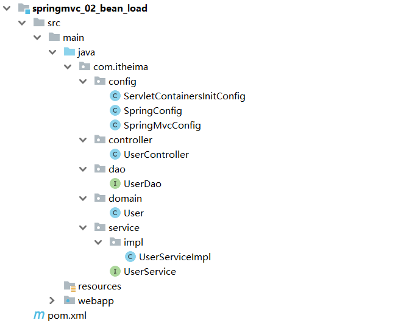
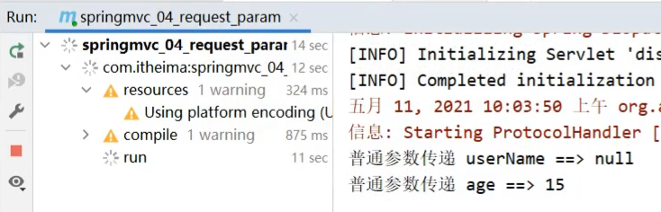
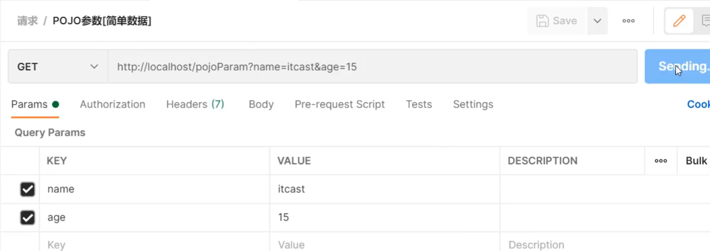
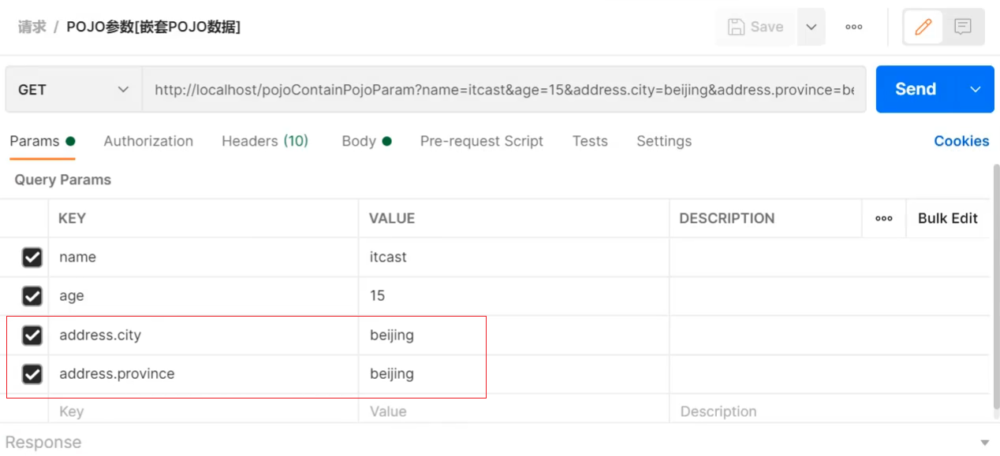
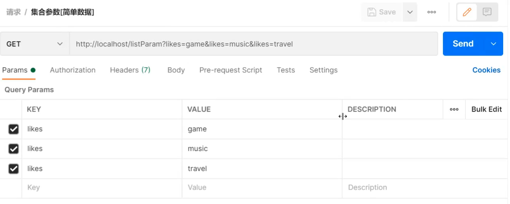
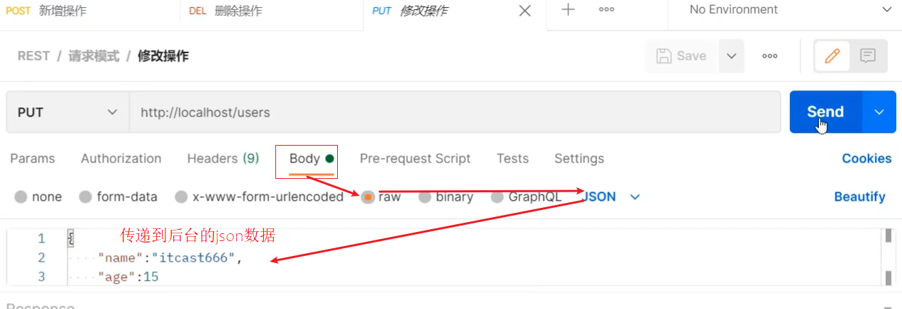
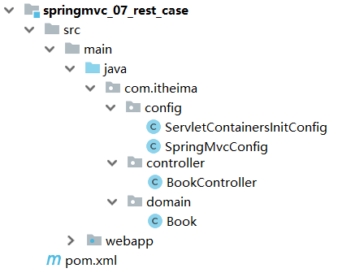
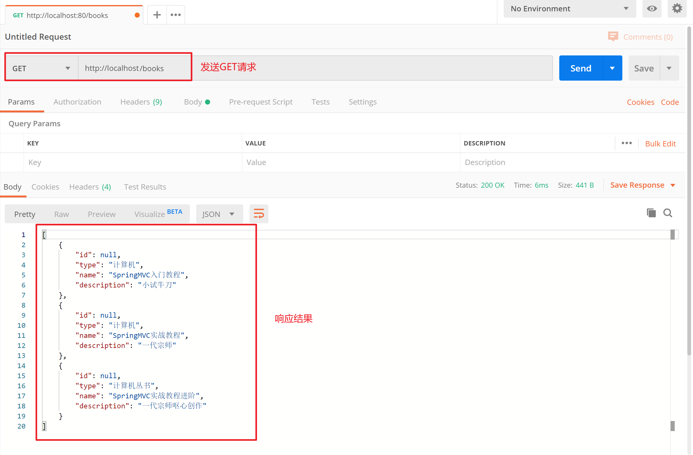
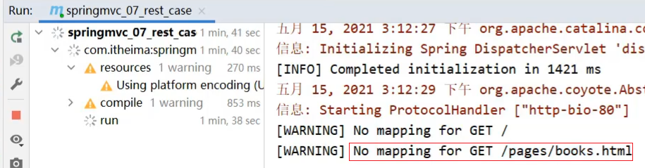

###  bean加载控制

#### 2.5.1 问题分析

入门案例的内容已经做完了，在入门案例中我们创建过一个`SpringMvcConfig`的配置类，再回想前面咱们学习Spring的时候也创建过一个配置类`SpringConfig`。这两个配置类都需要加载资源，那么它们分别都需要加载哪些内容?

我们先来看下目前我们的项目目录结构:


* config目录存入的是配置类,写过的配置类有:

  * ServletContainersInitConfig
  * SpringConfig
  * SpringMvcConfig
  * JdbcConfig
  * MybatisConfig

* controller目录存放的是SpringMVC的controller类

* service目录存放的是service接口和实现类

* dao目录存放的是dao/Mapper接口

* 最终创建好的项目结构如下:

  


# MVC请求部分

### 知识点1：@Controller

| 名称 | @Controller                   |
| ---- | ----------------------------- |
| 类型 | 类注解                        |
| 位置 | SpringMVC控制器类定义上方     |
| 作用 | 设定SpringMVC的核心控制器bean |

### 知识点2：@RequestMapping

| 名称     | @RequestMapping                 |
| -------- | ------------------------------- |
| 类型     | 类注解或方法注解                |
| 位置     | SpringMVC控制器类或方法定义上方 |
| 作用     | 设置当前控制器方法请求访问路径  |
| 相关属性 | value(默认)，请求访问路径       |

### 知识点3：@ResponseBody

| 名称 | @ResponseBody                                    |
| ---- | ------------------------------------------------ |
| 类型 | 类注解或方法注解                                 |
| 位置 | SpringMVC控制器类或方法定义上方                  |
| 作用 | 设置当前控制器方法响应内容为当前返回值，无需解析 |

#### 步骤2:编写模型类

```java
public class Book {
    private Integer id;
    private String type;
    private String name;
    private String description;
    //getter...setter...toString省略
}
```

#### 步骤3:编写Dao接口

```java
public interface BookDao {

//    @Insert("insert into tbl_book values(null,#{type},#{name},#{description})")
    @Insert("insert into tbl_book (type,name,description) values(#{type},#{name},#{description})")
    public void save(Book book);

    @Update("update tbl_book set type = #{type}, name = #{name}, description = #{description} where id = #{id}")
    public void update(Book book);

    @Delete("delete from tbl_book where id = #{id}")
    public void delete(Integer id);

    @Select("select * from tbl_book where id = #{id}")
    public Book getById(Integer id);

    @Select("select * from tbl_book")
    public List<Book> getAll();
}
```

#### 步骤4:编写Service接口和实现类

```java
@Transactional
public interface BookService {
    /**
     * 保存
     * @param book
     * @return
     */
    public boolean save(Book book);

    /**
     * 修改
     * @param book
     * @return
     */
    public boolean update(Book book);

    /**
     * 按id删除
     * @param id
     * @return
     */
    public boolean delete(Integer id);

    /**
     * 按id查询
     * @param id
     * @return
     */
    public Book getById(Integer id);

    /**
     * 查询全部
     * @return
     */
    public List<Book> getAll();
}
```

```java
@Service
public class BookServiceImpl implements BookService {
    @Autowired
    private BookDao bookDao;

    public boolean save(Book book) {
        bookDao.save(book);
        return true;
    }

    public boolean update(Book book) {
        bookDao.update(book);
        return true;
    }

    public boolean delete(Integer id) {
        bookDao.delete(id);
        return true;
    }

    public Book getById(Integer id) {
        return bookDao.getById(id);
    }

    public List<Book> getAll() {
        return bookDao.getAll();
    }
}
```

#### 问题分析

团队多人开发，每人设置不同的请求路径，冲突问题该如何解决?

解决思路:为不同模块设置模块名作为请求路径前置

对于Book模块的save,将其访问路径设置`http://localhost/book/save`

对于User模块的save,将其访问路径设置`http://localhost/user/save`

这样在同一个模块中出现命名冲突的情况就比较少了。

#### 4.1.3 设置映射路径

##### 步骤1:修改Controller

```java
@Controller
public class UserController {

    @RequestMapping("/user/save")
    @ResponseBody
    public String save(){
        System.out.println("user save ...");
        return "{'module':'user save'}";
    }
    
    @RequestMapping("/user/delete")
    @ResponseBody
    public String save(){
        System.out.println("user delete ...");
        return "{'module':'user delete'}";
    }
}

@Controller
public class BookController {

    @RequestMapping("/book/save")
    @ResponseBody
    public String save(){
        System.out.println("book save ...");
        return "{'module':'book save'}";
    }
}
```

问题是解决了，但是每个方法前面都需要进行修改，写起来比较麻烦而且还有很多重复代码，如果/user后期发生变化，所有的方法都需要改，耦合度太高。

##### 步骤2:优化路径配置

优化方案:

```java
@Controller
@RequestMapping("/user")
public class UserController {

    @RequestMapping("/save")
    @ResponseBody
    public String save(){
        System.out.println("user save ...");
        return "{'module':'user save'}";
    }
    
    @RequestMapping("/delete")
    @ResponseBody
    public String save(){
        System.out.println("user delete ...");
        return "{'module':'user delete'}";
    }
}

@Controller
@RequestMapping("/book")
public class BookController {

    @RequestMapping("/save")
    @ResponseBody
    public String save(){
        System.out.println("book save ...");
        return "{'module':'book save'}";
    }
}
```

**注意:**

* 当类上和方法上都添加了`@RequestMapping`注解，前端发送请求的时候，要和两个注解的value值相加匹配才能访问到。
* @RequestMapping注解value属性前面加不加`/`都可以

扩展小知识:

对于PostMan如何觉得字小不好看，可以使用`ctrl+=`调大，`ctrl+-`调小。

### 4.2 请求参数

请求路径设置好后，只要确保页面发送请求地址和后台Controller类中配置的路径一致，就可以接收到前端的请求，接收到请求后，如何接收页面传递的参数?

关于请求参数的传递与接收是和请求方式有关系的，目前比较常见的两种请求方式为：

* GET
* POST

针对于不同的请求前端如何发送，后端如何接收?

#### 参数传递

##### GET发送单个参数

发送请求与参数:

```
http://localhost/commonParam?name=itcast
```


接收参数：

```java
@Controller
public class UserController {

    @RequestMapping("/commonParam")
    @ResponseBody
    public String commonParam(String name){
        System.out.println("普通参数传递 name ==> "+name);
        return "{'module':'commonParam'}";
    }
}
```

##### GET发送多个参数

发送请求与参数:

```
http://localhost/commonParam?name=itcast&age=15
```


接收参数：

```java
@Controller
public class UserController {

    @RequestMapping("/commonParam")
    @ResponseBody
    public String commonParam(String name,int age){
        System.out.println("普通参数传递 name ==> "+name);
        System.out.println("普通参数传递 age ==> "+age);
        return "{'module':'commonParam'}";
    }
}
```

##### GET请求中文乱码

如果我们传递的参数中有中文，你会发现接收到的参数会出现中文乱码问题。

发送请求:`http://localhost/commonParam?name=张三&age=18`

控制台:


出现乱码的原因相信大家都清楚，Tomcat8.5以后的版本已经处理了中文乱码的问题，但是IDEA中的Tomcat插件目前只到Tomcat7，所以需要修改pom.xml来解决GET请求中文乱码问题

```xml
<build>
    <plugins>
      <plugin>
        <groupId>org.apache.tomcat.maven</groupId>
        <artifactId>tomcat7-maven-plugin</artifactId>
        <version>2.1</version>
        <configuration>
          <port>80</port><!--tomcat端口号-->
          <path>/</path> <!--虚拟目录-->
          <uriEncoding>UTF-8</uriEncoding><!--访问路径编解码字符集-->
        </configuration>
      </plugin>
    </plugins>
  </build>
```

##### POST发送参数

发送请求与参数:

接收参数：

和GET一致，不用做任何修改

```java
@Controller
public class UserController {

    @RequestMapping("/commonParam")
    @ResponseBody
    public String commonParam(String name,int age){
        System.out.println("普通参数传递 name ==> "+name);
        System.out.println("普通参数传递 age ==> "+age);
        return "{'module':'commonParam'}";
    }
}
```

##### POST请求中文乱码

发送请求与参数:


接收参数:

控制台打印，会发现有中文乱码问题。


解决方案:配置过滤器

```java
public class ServletContainersInitConfig extends AbstractAnnotationConfigDispatcherServletInitializer {
    protected Class<?>[] getRootConfigClasses() {
        return new Class[0];
    }

    protected Class<?>[] getServletConfigClasses() {
        return new Class[]{SpringMvcConfig.class};
    }

    protected String[] getServletMappings() {
        return new String[]{"/"};
    }

    //乱码处理
    @Override
    protected Filter[] getServletFilters() {
        CharacterEncodingFilter filter = new CharacterEncodingFilter();
        filter.setEncoding("UTF-8");
        return new Filter[]{filter};
    }
}
```

CharacterEncodingFilter是在spring-web包中，所以用之前需要导入对应的jar包。

### 4.3 五种类型参数传递

前面我们已经能够使用GET或POST来发送请求和数据，所携带的数据都是比较简单的数据，接下来在这个基础上，我们来研究一些比较复杂的参数传递，常见的参数种类有:

* 普通参数
* POJO类型参数
* 嵌套POJO类型参数
* 数组类型参数
* 集合类型参数

这些参数如何发送，后台改如何接收?我们一个个来学习。

#### 4.3.1 普通参数

* 普通参数:url地址传参，地址参数名与形参变量名相同，定义形参即可接收参数。


如果形参与地址参数名不一致该如何解决?

发送请求与参数:

```
http://localhost/commonParamDifferentName?name=张三&age=18
```

后台接收参数:

```java
@RequestMapping("/commonParamDifferentName")
@ResponseBody
public String commonParamDifferentName(String userName , int age){
    System.out.println("普通参数传递 userName ==> "+userName);
    System.out.println("普通参数传递 age ==> "+age);
    return "{'module':'common param different name'}";
}
```

因为前端给的是`name`,后台接收使用的是`userName`,两个名称对不上，导致接收数据失败:



解决方案:使用@RequestParam注解

```java
@RequestMapping("/commonParamDifferentName")
    @ResponseBody
    public String commonParamDifferentName(@RequestPaam("name") String userName , int age){
        System.out.println("普通参数传递 userName ==> "+userName);
        System.out.println("普通参数传递 age ==> "+age);
        return "{'module':'common param different name'}";
    }
```

**注意:写上@RequestParam注解框架就不需要自己去解析注入，能提升框架处理性能**

#### 4.3.2 POJO数据类型

简单数据类型一般处理的是参数个数比较少的请求，如果参数比较多，那么后台接收参数的时候就比较复杂，这个时候我们可以考虑使用POJO数据类型。

* POJO参数：请求参数名与形参对象属性名相同，定义POJO类型形参即可接收参数

此时需要使用前面准备好的POJO类，先来看下User

```java
public class User {
    private String name;
    private int age;
    //setter...getter...略
}
```

发送请求和参数:



后台接收参数:

```java
//POJO参数：请求参数与形参对象中的属性对应即可完成参数传递
@RequestMapping("/pojoParam")
@ResponseBody
public String pojoParam(User user){
    System.out.println("pojo参数传递 user ==> "+user);
    return "{'module':'pojo param'}";
}
```

**注意:**

* POJO参数接收，前端GET和POST发送请求数据的方式不变。
* ==请求参数key的名称要和POJO中属性的名称一致，否则无法封装。==

#### 4.3.3 嵌套POJO类型参数

如果POJO对象中嵌套了其他的POJO类，如

```java
public class Address {
    private String province;
    private String city;
    //setter...getter...略
}
public class User {
    private String name;
    private int age;
    private Address address;
    //setter...getter...略
}
```

* 嵌套POJO参数：请求参数名与形参对象属性名相同，按照对象层次结构关系即可接收嵌套POJO属性参数

发送请求和参数:



后台接收参数:

```java
//POJO参数：请求参数与形参对象中的属性对应即可完成参数传递
@RequestMapping("/pojoParam")
@ResponseBody
public String pojoParam(User user){
    System.out.println("pojo参数传递 user ==> "+user);
    return "{'module':'pojo param'}";
}
```

**注意:**

==请求参数key的名称要和POJO中属性的名称一致，否则无法封装==

#### 4.3.4 数组类型参数

举个简单的例子，如果前端需要获取用户的爱好，爱好绝大多数情况下都是多个，如何发送请求数据和接收数据呢?

* 数组参数：请求参数名与形参对象属性名相同且请求参数为多个，定义数组类型即可接收参数

发送请求和参数:


后台接收参数:

```java
  //数组参数：同名请求参数可以直接映射到对应名称的形参数组对象中
    @RequestMapping("/arrayParam")
    @ResponseBody
    public String arrayParam(String[] likes){
        System.out.println("数组参数传递 likes ==> "+ Arrays.toString(likes));
        return "{'module':'array param'}";
    }
```

#### 4.3.5 集合类型参数

数组能接收多个值，那么集合是否也可以实现这个功能呢?

发送请求和参数:



后台接收参数:

```java
//集合参数：同名请求参数可以使用@RequestParam注解映射到对应名称的集合对象中作为数据
@RequestMapping("/listParam")
@ResponseBody
public String listParam(List<String> likes){
    System.out.println("集合参数传递 likes ==> "+ likes);
    return "{'module':'list param'}";
}
```

运行会报错，


错误的原因是:SpringMVC将List看做是一个POJO对象来处理，将其创建一个对象并准备把前端的数据封装到对象中，但是List是一个接口无法创建对象，所以报错。

解决方案是:使用`@RequestParam`注解

```java
//集合参数：同名请求参数可以使用@RequestParam注解映射到对应名称的集合对象中作为数据
@RequestMapping("/listParam")
@ResponseBody
public String listParam(@RequestParam List<String> likes){
    System.out.println("集合参数传递 likes ==> "+ likes);
    return "{'module':'list param'}";
}
```

* 集合保存普通参数：请求参数名与形参集合对象名相同且请求参数为多个，@RequestParam绑定参数关系
* 对于简单数据类型使用数组会比集合更简单些。

### 知识点1：@RequestParam

| 名称     | @RequestParam                                          |
| -------- | ------------------------------------------------------ |
| 类型     | 形参注解                                               |
| 位置     | SpringMVC控制器方法形参定义前面                        |
| 作用     | 绑定请求参数与处理器方法形参间的关系                   |
| 相关参数 | required：是否为必传参数 <br/>defaultValue：参数默认值 |

### 4.4 JSON数据传输参数

前面我们说过，现在比较流行的开发方式为异步调用。前后台以异步方式进行交换，传输的数据使用的是==JSON==,所以前端如果发送的是JSON数据，后端该如何接收?

对于JSON数据类型，我们常见的有三种:

- json普通数组（["value1","value2","value3",...]）
- json对象（{key1:value1,key2:value2,...}）
- json对象数组（[{key1:value1,...},{key2:value2,...}]）

对于上述数据，前端如何发送，后端如何接收?

#### JSON普通数组

###### 步骤1:pom.xml添加依赖

SpringMVC默认使用的是jackson来处理json的转换，所以需要在pom.xml添加jackson依赖

```xml
<dependency>
    <groupId>com.fasterxml.jackson.core</groupId>
    <artifactId>jackson-databind</artifactId>
    <version>2.9.0</version>
</dependency>
```

###### 步骤2:PostMan发送JSON数据


###### 步骤3:开启SpringMVC注解支持

在SpringMVC的配置类中开启SpringMVC的注解支持，这里面就包含了将JSON转换成对象的功能。

```java
@Configuration
@ComponentScan("com.itheima.controller")
//开启json数据类型自动转换
@EnableWebMvc
public class SpringMvcConfig {
}
```

###### 步骤4:参数前添加@RequestBody

```java
//使用@RequestBody注解将外部传递的json数组数据映射到形参的集合对象中作为数据
@RequestMapping("/listParamForJson")
@ResponseBody
public String listParamForJson(@RequestBody List<String> likes){
    System.out.println("list common(json)参数传递 list ==> "+likes);
    return "{'module':'list common for json param'}";
}
```

###### 步骤5:启动运行程序


JSON普通数组的数据就已经传递完成，下面针对JSON对象数据和JSON对象数组的数据该如何传递呢?

#### JSON对象数据

我们会发现，只需要关注请求和数据如何发送?后端数据如何接收?

请求和数据的发送:

```json
{
	"name":"itcast",
	"age":15
}
```


后端接收数据：

```java
@RequestMapping("/pojoParamForJson")
@ResponseBody
public String pojoParamForJson(@RequestBody User user){
    System.out.println("pojo(json)参数传递 user ==> "+user);
    return "{'module':'pojo for json param'}";
}
```

启动程序访问测试


**说明:**

address为null的原因是前端没有传递数据给后端。

如果想要address也有数据，我们需求修改前端传递的数据内容:

```json
{
	"name":"itcast",
	"age":15,
    "address":{
        "province":"beijing",
        "city":"beijing"
    }
}
```

再次发送请求，就能看到address中的数据


#### JSON对象数组

集合中保存多个POJO该如何实现?

请求和数据的发送:

```json
[
    {"name":"itcast","age":15},
    {"name":"itheima","age":12}
]
```

 

后端接收数据:

```java
@RequestMapping("/listPojoParamForJson")
@ResponseBody
public String listPojoParamForJson(@RequestBody List<User> list){
    System.out.println("list pojo(json)参数传递 list ==> "+list);
    return "{'module':'list pojo for json param'}";
}
```

启动程序访问测试


**小结**

SpringMVC接收JSON数据的实现步骤为:

(1)导入jackson包

(2)使用PostMan发送JSON数据

(3)开启SpringMVC注解驱动，在配置类上添加@EnableWebMvc注解

(4)Controller方法的参数前添加@RequestBody注解

#### 知识点1：@EnableWebMvc

| 名称 | @EnableWebMvc             |
| ---- | ------------------------- |
| 类型 | ==配置类注解==            |
| 位置 | SpringMVC配置类定义上方   |
| 作用 | 开启SpringMVC多项辅助功能 |

#### 知识点2：@RequestBody

| 名称 | @RequestBody                                                 |
| ---- | ------------------------------------------------------------ |
| 类型 | ==形参注解==                                                 |
| 位置 | SpringMVC控制器方法形参定义前面                              |
| 作用 | 将请求中请求体所包含的数据传递给请求参数，此注解一个处理器方法只能使用一次 |

#### @RequestBody与@RequestParam区别

* 区别
  * @RequestParam用于接收url地址传参，表单传参【application/x-www-form-urlencoded】
  * @RequestBody用于接收json数据【application/json】

* 应用
  * 后期开发中，发送json格式数据为主，@RequestBody应用较广
  * 如果发送非json格式数据，选用@RequestParam接收请求参数

### 4.5 日期类型参数传递

前面我们处理过简单数据类型、POJO数据类型、数组和集合数据类型以及JSON数据类型，接下来我们还得处理一种开发中比较常见的一种数据类型，`日期类型`

日期类型比较特殊，因为对于日期的格式有N多中输入方式，比如:

* 2088-08-18
* 2088/08/18
* 08/18/2088
* ......

针对这么多日期格式，SpringMVC该如何接收，它能很好的处理日期类型数据么?

#### 步骤1:编写方法接收日期数据

在UserController类中添加方法，把参数设置为日期类型

```java
@RequestMapping("/dataParam")
@ResponseBody
public String dataParam(Date date)
    System.out.println("参数传递 date ==> "+date);
    return "{'module':'data param'}";
}
```

#### 步骤2:启动Tomcat服务器

查看控制台是否报错，如果有错误，先解决错误。

#### 步骤3:使用PostMan发送请求

使用PostMan发送GET请求，并设置date参数

`http://localhost/dataParam?date=2088/08/08`


#### 步骤4:查看控制台


通过打印，我们发现SpringMVC可以接收日期数据类型，并将其打印在控制台。

这个时候，我们就想如果把日期参数的格式改成其他的，SpringMVC还能处理么?

#### 步骤5:更换日期格式

为了能更好的看到程序运行的结果，我们在方法中多添加一个日期参数

```java
@RequestMapping("/dataParam")
@ResponseBody
public String dataParam(Date date,Date date1)
    System.out.println("参数传递 date ==> "+date);
    return "{'module':'data param'}";
}
```

使用PostMan发送请求，携带两个不同的日期格式，

`http://localhost/dataParam?date=2088/08/08&date1=2088-08-08`


发送请求和数据后，页面会报400，控制台会报出一个错误

Resolved [org.springframework.web.method.annotation.==MethodArgumentTypeMismatchException==: Failed to convert value of type 'java.lang.String' to required type 'java.util.Date'; nested exception is org.springframework.core.convert.==ConversionFailedException==: Failed to convert from type [java.lang.String] to type [java.util.Date] for value '2088-08-08'; nested exception is java.lang.IllegalArgumentException]

从错误信息可以看出，错误的原因是在将`2088-08-08`转换成日期类型的时候失败了，原因是SpringMVC默认支持的字符串转日期的格式为`yyyy/MM/dd`,而我们现在传递的不符合其默认格式，SpringMVC就无法进行格式转换，所以报错。

解决方案也比较简单，需要使用`@DateTimeFormat`

```java
@RequestMapping("/dataParam")
@ResponseBody
public String dataParam(Date date,
                        @DateTimeFormat(pattern="yyyy-MM-dd") Date date1)
    System.out.println("参数传递 date ==> "+date);
	System.out.println("参数传递 date1(yyyy-MM-dd) ==> "+date1);
    return "{'module':'data param'}";
}
```

重新启动服务器，重新发送请求测试，SpringMVC就可以正确的进行日期转换了


#### 步骤6:携带时间的日期

接下来我们再来发送一个携带时间的日期，看下SpringMVC该如何处理?

先修改UserController类，添加第三个参数

```java
@RequestMapping("/dataParam")
@ResponseBody
public String dataParam(Date date,
                        @DateTimeFormat(pattern="yyyy-MM-dd") Date date1,
                        @DateTimeFormat(pattern="yyyy/MM/dd HH:mm:ss") Date date2)
    System.out.println("参数传递 date ==> "+date);
	System.out.println("参数传递 date1(yyyy-MM-dd) ==> "+date1);
	System.out.println("参数传递 date2(yyyy/MM/dd HH:mm:ss) ==> "+date2);
    return "{'module':'data param'}";
}
```

使用PostMan发送请求，携带两个不同的日期格式，

`http://localhost/dataParam?date=2088/08/08&date1=2088-08-08&date2=2088/08/08 8:08:08`


重新启动服务器，重新发送请求测试，SpringMVC就可以将日期时间的数据进行转换


#### 知识点1：@DateTimeFormat

| 名称     | @DateTimeFormat                 |
| -------- | ------------------------------- |
| 类型     | ==形参注解==                    |
| 位置     | SpringMVC控制器方法形参前面     |
| 作用     | 设定日期时间型数据格式          |
| 相关属性 | pattern：指定日期时间格式字符串 |

#### 内部实现原理(类型转换)

讲解内部原理之前，我们需要先思考个问题:

* 前端传递字符串，后端使用日期Date接收
* 前端传递JSON数据，后端使用对象接收
* 前端传递字符串，后端使用Integer接收
* 后台需要的数据类型有很多中
* 在数据的传递过程中存在很多类型的转换

问:谁来做这个类型转换?

答:SpringMVC

问:SpringMVC是如何实现类型转换的?

答:SpringMVC中提供了很多类型转换接口和实现类

在框架中，有一些类型转换接口，其中有:

* (1) **Converter接口**

```java
/**
*	S: the source type
*	T: the target type
*/
public interface Converter<S, T> {
    @Nullable
    //该方法就是将从页面上接收的数据(S)转换成我们想要的数据类型(T)返回
    T convert(S source);
}
```

**注意:Converter所属的包为`org.springframework.core.convert.converter`**

Converter接口的实现类


框架中有提供很多对应Converter接口的实现类，用来实现不同数据类型之间的转换,如:

请求参数年龄数据（String→Integer）

日期格式转换（String → Date）

* (2) HttpMessageConverter接口

该接口是实现对象与JSON之间的转换工作

**==注意:SpringMVC的配置类把@EnableWebMvc当做标配配置上去，不要省略==**

### 4.6 响应

SpringMVC接收到请求和数据后，进行一些了的处理，当然这个处理可以是转发给Service，Service层再调用Dao层完成的，不管怎样，处理完以后，都需要将结果告知给用户。

比如:根据用户ID查询用户信息、查询用户列表、新增用户等。

对于响应，主要就包含两部分内容：

* 响应页面
* 响应数据
  * 文本数据
  * json数据

因为异步调用是目前常用的主流方式，所以我们需要更关注的就是如何返回JSON数据，对于其他只需要认识了解即可。

#### 4.6.1 环境准备

- 创建一个Web的Maven项目

- pom.xml添加Spring依赖

  ```xml
  <?xml version="1.0" encoding="UTF-8"?>
  
  <project xmlns="http://maven.apache.org/POM/4.0.0" xmlns:xsi="http://www.w3.org/2001/XMLSchema-instance"
    xsi:schemaLocation="http://maven.apache.org/POM/4.0.0 http://maven.apache.org/xsd/maven-4.0.0.xsd">
    <modelVersion>4.0.0</modelVersion>
  
    <groupId>com.itheima</groupId>
    <artifactId>springmvc_05_response</artifactId>
    <version>1.0-SNAPSHOT</version>
    <packaging>war</packaging>
  
    <dependencies>
      <dependency>
        <groupId>javax.servlet</groupId>
        <artifactId>javax.servlet-api</artifactId>
        <version>3.1.0</version>
        <scope>provided</scope>
      </dependency>
      <dependency>
        <groupId>org.springframework</groupId>
        <artifactId>spring-webmvc</artifactId>
        <version>5.2.10.RELEASE</version>
      </dependency>
      <dependency>
        <groupId>com.fasterxml.jackson.core</groupId>
        <artifactId>jackson-databind</artifactId>
        <version>2.9.0</version>
      </dependency>
    </dependencies>
  
    <build>
      <plugins>
        <plugin>
          <groupId>org.apache.tomcat.maven</groupId>
          <artifactId>tomcat7-maven-plugin</artifactId>
          <version>2.1</version>
          <configuration>
            <port>80</port>
            <path>/</path>
          </configuration>
        </plugin>
      </plugins>
    </build>
  </project>
  
  ```

- 创建对应的配置类

  ```java
  public class ServletContainersInitConfig extends AbstractAnnotationConfigDispatcherServletInitializer {
      protected Class<?>[] getRootConfigClasses() {
          return new Class[0];
      }
  
      protected Class<?>[] getServletConfigClasses() {
          return new Class[]{SpringMvcConfig.class};
      }
  
      protected String[] getServletMappings() {
          return new String[]{"/"};
      }
  
      //乱码处理
      @Override
      protected Filter[] getServletFilters() {
          CharacterEncodingFilter filter = new CharacterEncodingFilter();
          filter.setEncoding("UTF-8");
          return new Filter[]{filter};
      }
  }
  
  @Configuration
  @ComponentScan("com.itheima.controller")
  //开启json数据类型自动转换
  @EnableWebMvc
  public class SpringMvcConfig {
  }
  
  
  ```

- 编写模型类User

  ```java
  public class User {
      private String name;
      private int age;
      //getter...setter...toString省略
  }
  ```

- webapp下创建page.jsp

  ```jsp
  <html>
  <body>
  <h2>Hello Spring MVC!</h2>
  </body>
  </html>
  ```

- 编写UserController

  ```java
  @Controller
  public class UserController {
  
      
  }
  ```

最终创建好的项目结构如下:


#### 4.6.2 响应页面[了解]

##### 步骤1:设置返回页面

```java
@Controller
public class UserController {
    
    @RequestMapping("/toJumpPage")
    //注意
    //1.此处不能添加@ResponseBody,如果加了该注入，会直接将page.jsp当字符串返回前端
    //2.方法需要返回String
    public String toJumpPage(){
        System.out.println("跳转页面");
        return "page.jsp";
    }
    
}
```

##### 步骤2:启动程序测试

此处涉及到页面跳转，所以不适合采用PostMan进行测试，直接打开浏览器，输入

`http://localhost/toJumpPage`


#### 4.6.3 返回文本数据[了解]

##### 步骤1:设置返回文本内容

```java
@Controller
public class UserController {
    
   	@RequestMapping("/toText")
	//注意此处该注解就不能省略，如果省略了,会把response text当前页面名称去查找，如果没有回报404错误
    @ResponseBody
    public String toText(){
        System.out.println("返回纯文本数据");
        return "response text";
    }
    
}
```

##### 步骤2:启动程序测试

此处不涉及到页面跳转，因为我们现在发送的是GET请求，可以使用浏览器也可以使用PostMan进行测试，输入地址`http://localhost/toText`访问


#### 4.6.4 响应JSON数据

##### 响应POJO对象

```java
@Controller
public class UserController {
    
    @RequestMapping("/toJsonPOJO")
    @ResponseBody
    public User toJsonPOJO(){
        System.out.println("返回json对象数据");
        User user = new User();
        user.setName("itcast");
        user.setAge(15);
        return user;
    }
    
}
```

返回值为实体类对象，设置返回值为实体类类型，即可实现返回对应对象的json数据，需要依赖==@ResponseBody==注解和==@EnableWebMvc==注解

重新启动服务器，访问`http://localhost/toJsonPOJO`


##### 响应POJO集合对象

```java
@Controller
public class UserController {
    
    @RequestMapping("/toJsonList")
    @ResponseBody
    public List<User> toJsonList(){
        System.out.println("返回json集合数据");
        User user1 = new User();
        user1.setName("传智播客");
        user1.setAge(15);

        User user2 = new User();
        user2.setName("黑马程序员");
        user2.setAge(12);

        List<User> userList = new ArrayList<User>();
        userList.add(user1);
        userList.add(user2);

        return userList;
    }
    
}

```

重新启动服务器，访问`http://localhost/toJsonList`


#### 知识点1：@ResponseBody

| 名称     | @ResponseBody                                                |
| -------- | ------------------------------------------------------------ |
| 类型     | ==方法\类注解==                                              |
| 位置     | SpringMVC控制器方法定义上方和控制类上                        |
| 作用     | 设置当前控制器返回值作为响应体,<br/>写在类上，该类的所有方法都有该注解功能 |
| 相关属性 | pattern：指定日期时间格式字符串                              |

**说明:**

* 该注解可以写在类上或者方法上
* 写在类上就是该类下的所有方法都有@ReponseBody功能
* 当方法上有@ReponseBody注解后
  * 方法的返回值为字符串，会将其作为文本内容直接响应给前端
  * 方法的返回值为对象，会将对象转换成JSON响应给前端

此处又使用到了类型转换，内部还是通过Converter接口的实现类完成的，所以Converter除了前面所说的功能外，它还可以实现:

* 对象转Json数据(POJO -> json)
* 集合转Json数据(Collection -> json)

## 5，Rest风格

对于Rest风格，我们需要学习的内容包括:

* REST简介
* REST入门案例
* REST快速开发
* 案例:基于RESTful页面数据交互

### 5.1 REST简介

* **==REST==（Representational State Transfer），表现形式状态转换,它是一种软件架构==风格==**

  当我们想表示一个网络资源的时候，可以使用两种方式:

  * 传统风格资源描述形式
    * `http://localhost/user/getById?id=1` 查询id为1的用户信息
    * `http://localhost/user/saveUser` 保存用户信息
  * REST风格描述形式
    * `http://localhost/user/1` 
    * `http://localhost/user`

传统方式一般是一个请求url对应一种操作，这样做不仅麻烦，也不安全，因为会程序的人读取了你的请求url地址，就大概知道该url实现的是一个什么样的操作。

查看REST风格的描述，你会发现请求地址变的简单了，并且光看请求URL并不是很能猜出来该URL的具体功能

所以REST的优点有:

- **隐藏资源的访问行为，无法通过地址得知对资源是何种操**作
- 书写简化

但是我们的问题也随之而来了，一个相同的url地址即可以是新增也可以是修改或者查询，那么到底我们该如何区分该请求到底是什么操作呢?

* 按照REST风格访问资源时使用==行为动作==区分对资源进行了何种操作
  * `http://localhost/users`	查询全部用户信息 GET（查询）
  * `http://localhost/users/1`  查询指定用户信息 GET（查询）
  * `http://localhost/users`    添加用户信息    POST（新增/保存）
  * `http://localhost/users`    修改用户信息    PUT（修改/更新）
  * `http://localhost/users/1`  删除用户信息    DELETE（删除）

请求的方式比较多，但是比较常用的就4种，分别是`GET`,`POST`,`PUT`,`DELETE`。

按照不同的请求方式代表不同的操作类型。

* 发送GET请求是用来做查询
* 发送POST请求是用来做新增
* 发送PUT请求是用来做修改
* 发送DELETE请求是用来做删除

但是==注意==:

* 上述行为是约定方式，约定不是规范，可以打破，所以称REST风格，而不是REST规范
  * REST提供了对应的架构方式，按照这种架构设计项目可以降低开发的复杂性，提高系统的可伸缩性
  * REST中规定GET/POST/PUT/DELETE针对的是查询/新增/修改/删除，但是我们如果非要用GET请求做删除，这点在程序上运行是可以实现的
  * 但是如果绝大多数人都遵循这种风格，你写的代码让别人读起来就有点莫名其妙了。
* 描述模块的名称通常使用复数，也就是加s的格式描述，表示此类资源，而非单个资源，例如:users、books、accounts......

清楚了什么是REST风格后，我们后期会经常提到一个概念叫`RESTful`，那什么又是RESTful呢?

* 根据REST风格对资源进行访问称为==RESTful==。

后期我们在进行开发的过程中，大多是都是遵从REST风格来访问我们的后台服务，所以可以说咱们以后都是基于RESTful来进行开发的。

### 5.2 RESTful入门案例

#### 5.2.1 环境准备

- 创建一个Web的Maven项目

- pom.xml添加Spring依赖

  ```xml
  <?xml version="1.0" encoding="UTF-8"?>
  
  <project xmlns="http://maven.apache.org/POM/4.0.0" xmlns:xsi="http://www.w3.org/2001/XMLSchema-instance"
    xsi:schemaLocation="http://maven.apache.org/POM/4.0.0 http://maven.apache.org/xsd/maven-4.0.0.xsd">
    <modelVersion>4.0.0</modelVersion>
  
    <groupId>com.itheima</groupId>
    <artifactId>springmvc_06_rest</artifactId>
    <version>1.0-SNAPSHOT</version>
    <packaging>war</packaging>
  
    <dependencies>
      <dependency>
        <groupId>javax.servlet</groupId>
        <artifactId>javax.servlet-api</artifactId>
        <version>3.1.0</version>
        <scope>provided</scope>
      </dependency>
      <dependency>
        <groupId>org.springframework</groupId>
        <artifactId>spring-webmvc</artifactId>
        <version>5.2.10.RELEASE</version>
      </dependency>
      <dependency>
        <groupId>com.fasterxml.jackson.core</groupId>
        <artifactId>jackson-databind</artifactId>
        <version>2.9.0</version>
      </dependency>
    </dependencies>
  
    <build>
      <plugins>
        <plugin>
          <groupId>org.apache.tomcat.maven</groupId>
          <artifactId>tomcat7-maven-plugin</artifactId>
          <version>2.1</version>
          <configuration>
            <port>80</port>
            <path>/</path>
          </configuration>
        </plugin>
      </plugins>
    </build>
  </project>
  
  ```

- 创建对应的配置类

  ```java
  public class ServletContainersInitConfig extends AbstractAnnotationConfigDispatcherServletInitializer {
      protected Class<?>[] getRootConfigClasses() {
          return new Class[0];
      }
  
      protected Class<?>[] getServletConfigClasses() {
          return new Class[]{SpringMvcConfig.class};
      }
  
      protected String[] getServletMappings() {
          return new String[]{"/"};
      }
  
      //乱码处理
      @Override
      protected Filter[] getServletFilters() {
          CharacterEncodingFilter filter = new CharacterEncodingFilter();
          filter.setEncoding("UTF-8");
          return new Filter[]{filter};
      }
  }
  
  @Configuration
  @ComponentScan("com.itheima.controller")
  //开启json数据类型自动转换
  @EnableWebMvc
  public class SpringMvcConfig {
  }
  
  
  ```

- 编写模型类User和Book

  ```java
  public class User {
      private String name;
      private int age;
      //getter...setter...toString省略
  }
  
  public class Book {
      private String name;
      private double price;
       //getter...setter...toString省略
  }
  ```

- 编写UserController和BookController

  ```java
  @Controller
  public class UserController {
  	@RequestMapping("/save")
      @ResponseBody
      public String save(@RequestBody User user) {
          System.out.println("user save..."+user);
          return "{'module':'user save'}";
      }
  
      @RequestMapping("/delete")
      @ResponseBody
      public String delete(Integer id) {
          System.out.println("user delete..." + id);
          return "{'module':'user delete'}";
      }
  
      @RequestMapping("/update")
      @ResponseBody
      public String update(@RequestBody User user) {
          System.out.println("user update..." + user);
          return "{'module':'user update'}";
      }
  
      @RequestMapping("/getById")
      @ResponseBody
      public String getById(Integer id) {
          System.out.println("user getById..." + id);
          return "{'module':'user getById'}";
      }
  
      @RequestMapping("/findAll")
      @ResponseBody
      public String getAll() {
          System.out.println("user getAll...");
          return "{'module':'user getAll'}";
      }
  }
  
  
  @Controller
  public class BookController {
      
  	@RequestMapping(value = "/books",method = RequestMethod.POST)
      @ResponseBody
      public String save(@RequestBody Book book){
          System.out.println("book save..." + book);
          return "{'module':'book save'}";
      }
  
      @RequestMapping(value = "/books/{id}",method = RequestMethod.DELETE)
      @ResponseBody
      public String delete(@PathVariable Integer id){
          System.out.println("book delete..." + id);
          return "{'module':'book delete'}";
      }
  
      @RequestMapping(value = "/books",method = RequestMethod.PUT)
      @ResponseBody
      public String update(@RequestBody Book book){
          System.out.println("book update..." + book);
          return "{'module':'book update'}";
      }
  
      @RequestMapping(value = "/books/{id}",method = RequestMethod.GET)
      @ResponseBody
      public String getById(@PathVariable Integer id){
          System.out.println("book getById..." + id);
          return "{'module':'book getById'}";
      }
  
      @RequestMapping(value = "/books",method = RequestMethod.GET)
      @ResponseBody
      public String getAll(){
          System.out.println("book getAll...");
          return "{'module':'book getAll'}";
      }
      
  }
  ```

最终创建好的项目结构如下:


#### 5.2.2 思路分析

> 需求:将之前的增删改查替换成RESTful的开发方式。
>
> 1.之前不同的请求有不同的路径,现在要将其修改为统一的请求路径
>
> 修改前: 新增: /save ,修改: /update,删除 /delete...
>
> 修改后: 增删改查: /users
>
> 2.根据GET查询、POST新增、PUT修改、DELETE删除对方法的请求方式进行限定
>
> 3.发送请求的过程中如何设置请求参数?

#### 5.2.3 修改RESTful风格

##### 新增

```java
@Controller
public class UserController {
	//设置当前请求方法为POST，表示REST风格中的添加操作
    @RequestMapping(value = "/users",method = RequestMethod.POST)
    @ResponseBody
    public String save() {
        System.out.println("user save...");
        return "{'module':'user save'}";
    }
}
```

* 将请求路径更改为`/users`

  * 访问该方法使用 POST: `http://localhost/users`

* 使用method属性限定该方法的访问方式为`POST`

  * 如果发送的不是POST请求，比如发送GET请求，则会报错

    

##### 删除

```java
@Controller
public class UserController {
    //设置当前请求方法为DELETE，表示REST风格中的删除操作
	@RequestMapping(value = "/users",method = RequestMethod.DELETE)
    @ResponseBody
    public String delete(Integer id) {
        System.out.println("user delete..." + id);
        return "{'module':'user delete'}";
    }
}
```

* 将请求路径更改为`/users`
  - 访问该方法使用 DELETE: `http://localhost/users`

访问成功，但是删除方法没有携带所要删除数据的id,所以针对RESTful的开发，如何携带数据参数?

###### 传递路径参数

前端发送请求的时候使用:`http://localhost/users/1`,路径中的`1`就是我们想要传递的参数。

后端获取参数，需要做如下修改:

* 修改@RequestMapping的value属性，将其中修改为`/users/{id}`，目的是和路径匹配
* 在方法的形参前添加@PathVariable注解

```java
@Controller
public class UserController {
    //设置当前请求方法为DELETE，表示REST风格中的删除操作
	@RequestMapping(value = "/users/{id}",method = RequestMethod.DELETE)
    @ResponseBody
    public String delete(@PathVariable Integer id) {
        System.out.println("user delete..." + id);
        return "{'module':'user delete'}";
    }
}
```

**思考如下两个问题:**

(1)如果方法形参的名称和路径`{}`中的值不一致，该怎么办?


(2)如果有多个参数需要传递该如何编写?

前端发送请求的时候使用:`http://localhost/users/1/tom`,路径中的`1`和`tom`就是我们想要传递的两个参数。

后端获取参数，需要做如下修改:

```java
@Controller
public class UserController {
    //设置当前请求方法为DELETE，表示REST风格中的删除操作
	@RequestMapping(value = "/users/{id}/{name}",method = RequestMethod.DELETE)
    @ResponseBody
    public String delete(@PathVariable Integer id,@PathVariable String name) {
        System.out.println("user delete..." + id+","+name);
        return "{'module':'user delete'}";
    }
}
```

##### 修改

```java
@Controller
public class UserController {
    //设置当前请求方法为PUT，表示REST风格中的修改操作
    @RequestMapping(value = "/users",method = RequestMethod.PUT)
    @ResponseBody
    public String update(@RequestBody User user) {
        System.out.println("user update..." + user);
        return "{'module':'user update'}";
    }
}
```

- 将请求路径更改为`/users`

  - 访问该方法使用 PUT: `http://localhost/users`

- 访问并携带参数:

  

##### 根据ID查询

```java
@Controller
public class UserController {
    //设置当前请求方法为GET，表示REST风格中的查询操作
    @RequestMapping(value = "/users/{id}" ,method = RequestMethod.GET)
    @ResponseBody
    public String getById(@PathVariable Integer id){
        System.out.println("user getById..."+id);
        return "{'module':'user getById'}";
    }
}
```

将请求路径更改为`/users`

- 访问该方法使用 GET: `http://localhost/users/666`

##### 查询所有

```java
@Controller
public class UserController {
    //设置当前请求方法为GET，表示REST风格中的查询操作
    @RequestMapping(value = "/users" ,method = RequestMethod.GET)
    @ResponseBody
    public String getAll() {
        System.out.println("user getAll...");
        return "{'module':'user getAll'}";
    }
}
```

将请求路径更改为`/users`

- 访问该方法使用 GET: `http://localhost/users`

**小结**

RESTful入门案例，我们需要学习的内容如下:

(1)设定Http请求动作(动词)

@RequestMapping(value="",==method== = RequestMethod.==POST|GET|PUT|DELETE==)

(2)设定请求参数(路径变量)

@RequestMapping(value="/users/=={id}==",method = RequestMethod.DELETE)

@ReponseBody

public String delete(==@PathVariable== Integer ==id==){

}

#### 知识点1：@PathVariable

| 名称 | @PathVariable                                                |
| ---- | ------------------------------------------------------------ |
| 类型 | ==形参注解==                                                 |
| 位置 | SpringMVC控制器方法形参定义前面                              |
| 作用 | 绑定路径参数与处理器方法形参间的关系，要求路径参数名与形参名一一对应 |

关于接收参数，我们学过三个注解`@RequestBody`、`@RequestParam`、`@PathVariable`,这三个注解之间的区别和应用分别是什么?

* 区别
  * @RequestParam用于接收url地址传参或表单传参
  * @RequestBody用于接收json数据
  * @PathVariable用于接收路径参数，使用{参数名称}描述路径参数
* 应用
  * 后期开发中，发送请求参数超过1个时，以json格式为主，@RequestBody应用较广
  * 如果发送非json格式数据，选用@RequestParam接收请求参数
  * 采用RESTful进行开发，当参数数量较少时，例如1个，可以采用@PathVariable接收请求路径变量，通常用于传递id值

### 5.3 RESTful快速开发

做完了RESTful的开发，你会发现==好麻烦==，麻烦在哪?


问题1：每个方法的@RequestMapping注解中都定义了访问路径/books，重复性太高。

问题2：每个方法的@RequestMapping注解中都要使用method属性定义请求方式，重复性太高。

问题3：每个方法响应json都需要加上@ResponseBody注解，重复性太高。

对于上面所提的这三个问题，具体该如何解决?

```java
@RestController //@Controller + ReponseBody
@RequestMapping("/books")
public class BookController {
    
	//@RequestMapping(method = RequestMethod.POST)
    @PostMapping
    public String save(@RequestBody Book book){
        System.out.println("book save..." + book);
        return "{'module':'book save'}";
    }

    //@RequestMapping(value = "/{id}",method = RequestMethod.DELETE)
    @DeleteMapping("/{id}")
    public String delete(@PathVariable Integer id){
        System.out.println("book delete..." + id);
        return "{'module':'book delete'}";
    }

    //@RequestMapping(method = RequestMethod.PUT)
    @PutMapping
    public String update(@RequestBody Book book){
        System.out.println("book update..." + book);
        return "{'module':'book update'}";
    }

    //@RequestMapping(value = "/{id}",method = RequestMethod.GET)
    @GetMapping("/{id}")
    public String getById(@PathVariable Integer id){
        System.out.println("book getById..." + id);
        return "{'module':'book getById'}";
    }

    //@RequestMapping(method = RequestMethod.GET)
    @GetMapping
    public String getAll(){
        System.out.println("book getAll...");
        return "{'module':'book getAll'}";
    }
    
}
```

**对于刚才的问题，我们都有对应的解决方案：**

问题1：每个方法的@RequestMapping注解中都定义了访问路径/books，重复性太高。

```
将@RequestMapping提到类上面，用来定义所有方法共同的访问路径。
```

问题2：每个方法的@RequestMapping注解中都要使用method属性定义请求方式，重复性太高。

```
使用@GetMapping  @PostMapping  @PutMapping  @DeleteMapping代替
```

问题3：每个方法响应json都需要加上@ResponseBody注解，重复性太高。

```
1.将ResponseBody提到类上面，让所有的方法都有@ResponseBody的功能
2.使用@RestController注解替换@Controller与@ResponseBody注解，简化书写
```

#### 知识点1：@RestController

| 名称 | @RestController                                              |
| ---- | ------------------------------------------------------------ |
| 类型 | ==类注解==                                                   |
| 位置 | 基于SpringMVC的RESTful开发控制器类定义上方                   |
| 作用 | 设置当前控制器类为RESTful风格，<br/>等同于@Controller与@ResponseBody两个注解组合功能 |

#### 知识点2：@GetMapping @PostMapping @PutMapping @DeleteMapping

| 名称     | @GetMapping @PostMapping @PutMapping @DeleteMapping          |
| -------- | ------------------------------------------------------------ |
| 类型     | ==方法注解==                                                 |
| 位置     | 基于SpringMVC的RESTful开发控制器方法定义上方                 |
| 作用     | 设置当前控制器方法请求访问路径与请求动作，每种对应一个请求动作，<br/>例如@GetMapping对应GET请求 |
| 相关属性 | value（默认）：请求访问路径                                  |

### 5.4 RESTful案例

#### 5.4.1 需求分析

需求一:图片列表查询，从后台返回数据，将数据展示在页面上


需求二:新增图片，将新增图书的数据传递到后台，并在控制台打印


**说明:**此次案例的重点是在SpringMVC中如何使用RESTful实现前后台交互，所以本案例并没有和数据库进行交互，所有数据使用`假`数据来完成开发。

步骤分析:

> 1.搭建项目导入jar包
>
> 2.编写Controller类，提供两个方法，一个用来做列表查询，一个用来做新增
>
> 3.在方法上使用RESTful进行路径设置
>
> 4.完成请求、参数的接收和结果的响应
>
> 5.使用PostMan进行测试
>
> 6.将前端页面拷贝到项目中
>
> 7.页面发送ajax请求
>
> 8.完成页面数据的展示

#### 5.4.2 环境准备

- 创建一个Web的Maven项目

- pom.xml添加Spring依赖

  ```xml
  <?xml version="1.0" encoding="UTF-8"?>
  
  <project xmlns="http://maven.apache.org/POM/4.0.0" xmlns:xsi="http://www.w3.org/2001/XMLSchema-instance"
    xsi:schemaLocation="http://maven.apache.org/POM/4.0.0 http://maven.apache.org/xsd/maven-4.0.0.xsd">
    <modelVersion>4.0.0</modelVersion>
  
    <groupId>com.itheima</groupId>
    <artifactId>springmvc_07_rest_case</artifactId>
    <version>1.0-SNAPSHOT</version>
    <packaging>war</packaging>
  
    <dependencies>
      <dependency>
        <groupId>javax.servlet</groupId>
        <artifactId>javax.servlet-api</artifactId>
        <version>3.1.0</version>
        <scope>provided</scope>
      </dependency>
      <dependency>
        <groupId>org.springframework</groupId>
        <artifactId>spring-webmvc</artifactId>
        <version>5.2.10.RELEASE</version>
      </dependency>
      <dependency>
        <groupId>com.fasterxml.jackson.core</groupId>
        <artifactId>jackson-databind</artifactId>
        <version>2.9.0</version>
      </dependency>
    </dependencies>
  
    <build>
      <plugins>
        <plugin>
          <groupId>org.apache.tomcat.maven</groupId>
          <artifactId>tomcat7-maven-plugin</artifactId>
          <version>2.1</version>
          <configuration>
            <port>80</port>
            <path>/</path>
          </configuration>
        </plugin>
      </plugins>
    </build>
  </project>
  
  ```

- 创建对应的配置类

  ```java
  public class ServletContainersInitConfig extends AbstractAnnotationConfigDispatcherServletInitializer {
      protected Class<?>[] getRootConfigClasses() {
          return new Class[0];
      }
  
      protected Class<?>[] getServletConfigClasses() {
          return new Class[]{SpringMvcConfig.class};
      }
  
      protected String[] getServletMappings() {
          return new String[]{"/"};
      }
  
      //乱码处理
      @Override
      protected Filter[] getServletFilters() {
          CharacterEncodingFilter filter = new CharacterEncodingFilter();
          filter.setEncoding("UTF-8");
          return new Filter[]{filter};
      }
  }
  
  @Configuration
  @ComponentScan("com.itheima.controller")
  //开启json数据类型自动转换
  @EnableWebMvc
  public class SpringMvcConfig {
  }
  
  
  ```

- 编写模型类Book

  ```java
  public class Book {
      private Integer id;
      private String type;
      private String name;
      private String description;
      //setter...getter...toString略
  }
  ```

- 编写BookController

  ```java
  @Controller
  public class BookController {
  
      
  }
  ```

最终创建好的项目结构如下:



#### 5.4.2 后台接口开发

##### 步骤1:编写Controller类并使用RESTful进行配置

```java
@RestController
@RequestMapping("/books")
public class BookController {

    @PostMapping
    public String save(@RequestBody Book book){
        System.out.println("book save ==> "+ book);
        return "{'module':'book save success'}";
    }

 	@GetMapping
    public List<Book> getAll(){
        System.out.println("book getAll is running ...");
        List<Book> bookList = new ArrayList<Book>();

        Book book1 = new Book();
        book1.setType("计算机");
        book1.setName("SpringMVC入门教程");
        book1.setDescription("小试牛刀");
        bookList.add(book1);

        Book book2 = new Book();
        book2.setType("计算机");
        book2.setName("SpringMVC实战教程");
        book2.setDescription("一代宗师");
        bookList.add(book2);

        Book book3 = new Book();
        book3.setType("计算机丛书");
        book3.setName("SpringMVC实战教程进阶");
        book3.setDescription("一代宗师呕心创作");
        bookList.add(book3);

        return bookList;
    }

}
```

##### 步骤2：使用PostMan进行测试

测试新增

```json
{
    "type":"计算机丛书",
    "name":"SpringMVC终极开发",
    "description":"这是一本好书"
}
```


测试查询



#### 5.4.3 页面访问处理

##### 步骤1:拷贝静态页面

将`资料\功能页面`下的所有内容拷贝到项目的`webapp`目录下


##### 步骤2:访问pages目录下的books.html

打开浏览器输入`http://localhost/pages/books.html`


(1)出现错误的原因?



SpringMVC拦截了静态资源，根据/pages/books.html去controller找对应的方法，找不到所以会报404的错误。

(2)SpringMVC为什么会拦截静态资源呢?


(3)解决方案?

* SpringMVC需要将静态资源进行放行。

```java
@Configuration
public class SpringMvcSupport extends WebMvcConfigurationSupport {
    //设置静态资源访问过滤，当前类需要设置为配置类，并被扫描加载
    @Override
    protected void addResourceHandlers(ResourceHandlerRegistry registry) {
        //当访问/pages/????时候，从/pages目录下查找内容
        registry.addResourceHandler("/pages/**").addResourceLocations("/pages/");
        registry.addResourceHandler("/js/**").addResourceLocations("/js/");
        registry.addResourceHandler("/css/**").addResourceLocations("/css/");
        registry.addResourceHandler("/plugins/**").addResourceLocations("/plugins/");
    }
}

```

* 该配置类是在config目录下，SpringMVC扫描的是controller包，所以该配置类还未生效，要想生效需要将SpringMvcConfig配置类进行修改

```java
@Configuration
@ComponentScan({"com.itheima.controller","com.itheima.config"})
@EnableWebMvc
public class SpringMvcConfig {
}

或者

@Configuration
@ComponentScan("com.itheima")
@EnableWebMvc
public class SpringMvcConfig {
}
```

##### 步骤3:修改books.html页面

```html
<!DOCTYPE html>

<html>
    <head>
        <!-- 页面meta -->
        <meta charset="utf-8">
        <title>SpringMVC案例</title>
        <!-- 引入样式 -->
        <link rel="stylesheet" href="../plugins/elementui/index.css">
        <link rel="stylesheet" href="../plugins/font-awesome/css/font-awesome.min.css">
        <link rel="stylesheet" href="../css/style.css">
    </head>

    <body class="hold-transition">

        <div id="app">

            <div class="content-header">
                <h1>图书管理</h1>
            </div>

            <div class="app-container">
                <div class="box">
                    <div class="filter-container">
                        <el-input placeholder="图书名称" style="width: 200px;" class="filter-item"></el-input>
                        <el-button class="dalfBut">查询</el-button>
                        <el-button type="primary" class="butT" @click="openSave()">新建</el-button>
                    </div>

                    <el-table size="small" current-row-key="id" :data="dataList" stripe highlight-current-row>
                        <el-table-column type="index" align="center" label="序号"></el-table-column>
                        <el-table-column prop="type" label="图书类别" align="center"></el-table-column>
                        <el-table-column prop="name" label="图书名称" align="center"></el-table-column>
                        <el-table-column prop="description" label="描述" align="center"></el-table-column>
                        <el-table-column label="操作" align="center">
                            <template slot-scope="scope">
                                <el-button type="primary" size="mini">编辑</el-button>
                                <el-button size="mini" type="danger">删除</el-button>
                            </template>
                        </el-table-column>
                    </el-table>

                    <div class="pagination-container">
                        <el-pagination
                            class="pagiantion"
                            @current-change="handleCurrentChange"
                            :current-page="pagination.currentPage"
                            :page-size="pagination.pageSize"
                            layout="total, prev, pager, next, jumper"
                            :total="pagination.total">
                        </el-pagination>
                    </div>

                    <!-- 新增标签弹层 -->
                    <div class="add-form">
                        <el-dialog title="新增图书" :visible.sync="dialogFormVisible">
                            <el-form ref="dataAddForm" :model="formData" :rules="rules" label-position="right" label-width="100px">
                                <el-row>
                                    <el-col :span="12">
                                        <el-form-item label="图书类别" prop="type">
                                            <el-input v-model="formData.type"/>
                                        </el-form-item>
                                    </el-col>
                                    <el-col :span="12">
                                        <el-form-item label="图书名称" prop="name">
                                            <el-input v-model="formData.name"/>
                                        </el-form-item>
                                    </el-col>
                                </el-row>
                                <el-row>
                                    <el-col :span="24">
                                        <el-form-item label="描述">
                                            <el-input v-model="formData.description" type="textarea"></el-input>
                                        </el-form-item>
                                    </el-col>
                                </el-row>
                            </el-form>
                            <div slot="footer" class="dialog-footer">
                                <el-button @click="dialogFormVisible = false">取消</el-button>
                                <el-button type="primary" @click="saveBook()">确定</el-button>
                            </div>
                        </el-dialog>
                    </div>

                </div>
            </div>
        </div>
    </body>

    <!-- 引入组件库 -->
    <script src="../js/vue.js"></script>
    <script src="../plugins/elementui/index.js"></script>
    <script type="text/javascript" src="../js/jquery.min.js"></script>
    <script src="../js/axios-0.18.0.js"></script>

    <script>
        var vue = new Vue({

            el: '#app',

            data:{
				dataList: [],//当前页要展示的分页列表数据
                formData: {},//表单数据
                dialogFormVisible: false,//增加表单是否可见
                dialogFormVisible4Edit:false,//编辑表单是否可见
                pagination: {},//分页模型数据，暂时弃用
            },

            //钩子函数，VUE对象初始化完成后自动执行
            created() {
                this.getAll();
            },

            methods: {
                // 重置表单
                resetForm() {
                    //清空输入框
                    this.formData = {};
                },

                // 弹出添加窗口
                openSave() {
                    this.dialogFormVisible = true;
                    this.resetForm();
                },

                //添加
                saveBook () {
                    axios.post("/books",this.formData).then((res)=>{

                    });
                },

                //主页列表查询
                getAll() {
                    axios.get("/books").then((res)=>{
                        this.dataList = res.data;
                    });
                },

            }
        })
    </script>
</html>
```

###  表现层与前端数据传输协议定义

SSM整合以及功能模块开发完成后，接下来，我们在上述案例的基础上分析下有哪些问题需要我们去解决下。首先第一个问题是:

* 在Controller层增删改返回给前端的是boolean类型数据

  

* 在Controller层查询单个返回给前端的是对象

  

* 在Controller层查询所有返回给前端的是集合对象

  

目前我们就已经有三种数据类型返回给前端，如果随着业务的增长，我们需要返回的数据类型会越来越多。对于前端开发人员在解析数据的时候就比较凌乱了，所以对于前端来说，如果后台能够返回一个统一的数据结果，前端在解析的时候就可以按照一种方式进行解析。开发就会变得更加简单。

所以我们就想能不能将返回结果的数据进行统一，具体如何来做，大体的思路为:

* 为了封装返回的结果数据:==创建结果模型类，封装数据到data属性中==
* 为了封装返回的数据是何种操作及是否操作成功:==封装操作结果到code属性中==
* 操作失败后为了封装返回的错误信息:==封装特殊消息到message(msg)属性中==

# spring

* #### IOC、IOC容器、Bean、DI

  1. IOC(Inversion of Control)控制反转
     - 那什么是控制反转呢？
       - 使用对象时，由主动new产生对象转换为由`外部`提供对象，此过程中对象创建控制权由程序转移到外部，此思想称为控制反转。
       - 业务层要用数据层的类对象，以前是自己`new`的
       - 现在自己不new了，交给`别人[外部]`来创建对象
       - `别人[外部]`就反转控制了数据层对象的创建权
       - 这种思想就是控制反转
       - 别人[外部]指的是什么呢?继续往下看
     - Spring和IOC之间的关系是什么呢?
       - Spring技术对IOC思想进行了实现
       - Spring提供了一个容器，称为`IOC容器`，用来充当IOC思想中的"外部"
       - IOC思想中的`别人[外部]`指的就是Spring的IOC容器
     - IOC容器的作用以及内部存放的是什么?
       - IOC容器负责对象的创建、初始化等一系列工作，其中包含了数据层和业务层的类对象
       - 被创建或被管理的对象在IOC容器中统称为Bean
       - IOC容器中放的就是一个个的Bean对象
     - 当IOC容器中创建好service和dao对象后，程序能正确执行么?
       - 不行，因为service运行需要依赖dao对象
       - IOC容器中虽然有service和dao对象
       - 但是service对象和dao对象没有任何关系
       - 需要把dao对象交给service,也就是说要绑定service和dao对象之间的关系
       - 像这种在容器中建立对象与对象之间的绑定关系就要用到DI(Dependency Injection)依赖注入.
  2. DI(Dependency Injection)依赖注入
     - 什么是依赖注入呢?
       - 在容器中建立bean与bean之间的依赖关系的整个过程，称为依赖注入
         - 业务层要用数据层的类对象，以前是自己`new`的
         - 现在自己不new了，靠`别人[外部其实指的就是IOC容器]`来给注入进来
         - 这种思想就是依赖注入
     - IOC容器中哪些bean之间要建立依赖关系呢?
       - 这个需要程序员根据业务需求提前建立好关系，如业务层需要依赖数据层，service就要和dao建立依赖关系
     - 介绍完Spring的IOC和DI的概念后，我们会发现这两个概念的最终目标就是:充分解耦，具体实现靠:
       - 使用IOC容器管理bean（IOC)
       - 在IOC容器内将有依赖关系的bean进行关系绑定（DI）
       - 最终结果为:使用对象时不仅可以直接从IOC容器中获取，并且获取到的bean已经绑定了所有的依赖关系.

#### 形象理解

- 从前有个人叫小明，小明有三大爱好，逛知乎，打游戏，抢红包

```java
class Ming extends Person
{
    private String name;
    private int age;

    void read(){
        //逛知乎
    }

    void play(){
        //打游戏
    }

    void grab(){
        //抢红包
    }

}
```

但是小明作为一个人类，无法仅靠自己就完成上述功能，他必须`依赖`一部手机，所以他买了一台iPhone6

```java
class iPhone6 extends Iphone
{
    void read(String name) {
        System.out.println(name + "打开了知乎然后编了一个故事");
    }

    void play(String name) {
        System.out.println(name + "打开了Apex并开始白给");
    }

    void grab(String name) {
        System.out.println(name + "开始抢红包却只抢不发");
    }
}
```

小明很珍惜自己买的新手机，每天把它牢牢控制在手心,于是小明变成了这样

```java
class Ming extends Person {
    private String name;
    private int age;

    public Ming(String name, int age) {
        this.name = name;
        this.age = age;
    }

    void read() {
        //逛知乎
        new iPhone6().read(name);
    }

    void play() {
        //打游戏
        new iPhone6().play(name);
    }

    void grab() {
        //抢红包
        new iPhone6().grab(name);
    }
}
```

- 今天是周六，小明不用上班，于是他起床，并依次逛起了知乎，打起了游戏，并抢了个红包。

```java
JAVA
Ming ming = new Ming("小明", 18);  //小明起床
ming.read();
ming.play();
ming.grab();
```

- 这个时候，我们可以在命令行里看到输出如下

> 小明打开了知乎然后编了一个故事
> 小明打开了Apex并开始白给
> 小明开始抢红包却只抢不发

- 这一天，小明过得很充实，他觉得自己是世界上最幸福的人。
- 但随着时间的推移，手机越来越卡顿，电池寿命也越来越短，到了冬天还会冻关机了，小明很难过，他意识到他需要换一部手机了
- 为了获得更好的使用体验，小明一咬牙一跺脚，买了一台iPhone14 Pro Max，但他现在遇到了一个问题，他之前太过依赖那台iPhone6了，他们已经深深的耦合在一起了，如果要换手机，他必须要拿螺丝刀改造自己，将自己体内所有方法中的iPhone6换成iPhone14

```java
JAVA
class Ming extends Person {
    private String name;
    private int age;

    public Ming(String name, int age) {
        this.name = name;
        this.age = age;
    }

    void read() {
        //逛知乎
        new iPhone14().read(name);
    }

    void play() {
        //打游戏
        new iPhone14().play(name);
    }

    void grab() {
        //抢红包
        new iPhone14().grab(name);
    }
}
```

- 虽然过程很辛苦，但小明觉得自己是值得的。随后在晚高峰挤地铁的时候，小明的手机被偷了。为了应急，小明只好重新使用那部刚刚被遗弃的iphone6，但是一想到那漫长的改造过程，小明的心里就说不出的委屈
- 他觉得自己过于依赖手机了，为什么每次手机出什么问题他都要去改造他自己，这不仅仅是过度耦合，简直是本末倒置，他向天空大喊，我不要再控制我的手机了。
- 天空中的造物主，也就是作为程序员的我，听到了他的呐喊，我告诉他，你不用再控制你的手机了，交给我来管理，把控制权交给我。这就叫做控制反转。
- 小明听到了我的话，他既高兴，又有一点害怕，他跪下来磕了几个头，虔诚地说到：“原来您就是传说中的造物主。我听到您刚刚说了 `控制反转` 四个字，就是把手机的控制权从我的手里交给你，但这只是您的想法，是一种思想罢了，要用什么办法才能实现控制反转，又可以让我继续使用手机呢？”
- “呵“，身为造物主的我在表现完不屑以后，扔下了四个大字，“依赖注入！”
- 接下来，伟大的我开始对小明进行惨无人道的改造

```java
class Ming extends Person {
    private String name;
    private int age;
    private Phone phone;

    public Ming(String name, int age, Phone phone) {
        this.name = name;
        this.age = age;
        this.phone = phone;
    }

    void read() {
        //逛知乎
        this.phone.read(name);
    }

    void play() {
        //打游戏
        this.phone.play(name);
    }

    void grab() {
        //抢红包
        this.phone.grab(name);
    }
}
```

- 随后我们来模拟小明的一天

```java
JAVA
Phont phone = new Iphone14();   //创建一个iphone14的实例
if(phone.isBroken() == true){   //如果iphone14不可用，则使用旧版手机
    phone = new Iphone6();
}
Ming ming = new Ming("小明",18,phone);    //小明不用关心是什么手机，他只要玩就行了。
ming.read();
ming.play();
ming.grab();
```

- 我们先看一下iphone14 是否可以使用，如果不可以使用，则直接换成iphone6,然后唤醒小明，并把手机塞到他的手里，换句话说，把他所依赖的手机直接注入到他的身上，他不需要关心自己拿的是什么手机，他只要直接使用就可以了。
- 这就是`依赖注入`。
- 随后小明的生活开始变得简单了起来，而他把省出来的时间都用来写笔记了，他在笔记本上这样写到

我曾经有很强的控制欲，过度依赖于我的手机，导致我和手机之间耦合程度太高，只要手机出现一点点问题，我都要改造我自己，这实在是既浪费时间又容易出问题。自从我把控制权交给了造物主，他每天在唤醒我以前，就已经替我选好了手机，我只要按照平时一样玩手机就可以了，根本不用关心是什么手机。即便手机出了问题，也可以由造物主直接搞定，不需要再改造我自己了，我现在买了七部手机，都交给了造物主，每天换一部，美滋滋！
我也从其中获得了这样的感悟： 如果一个类A 的功能实现需要借助于类B，那么就称类B是类A的依赖，如果在类A的内部去实例化类B，那么两者之间会出现较高的耦合，一旦类B出现了问题，类A也需要进行改造，如果这样的情况较多，每个类之间都有很多依赖，那么就会出现牵一发而动全身的情况，程序会极难维护，并且很容易出现问题。要解决这个问题，就要把A类对B类的控制权抽离出来，交给一个第三方去做，把控制权反转给第三方，就称作控制反转（IOC Inversion Of Control）。控制反转是一种思想，是能够解决问题的一种可能的结果，而依赖注入（Dependency Injection）就是其最典型的实现方法。由第三方（我们称作IOC容器）来控制依赖，把他通过构造函数、属性或者工厂模式等方法，注入到类A内，这样就极大程度的对类A和类B进行了解耦。

#### 2.3.3 核心概念小结

这节比较重要，重点要理解`什么是IOC/DI思想`、`什么是IOC容器`和`什么是Bean`：

(1)什么IOC/DI思想?

* IOC:控制反转，控制反转的是对象的创建权
* DI:依赖注入，绑定对象与对象之间的依赖关系

(2)什么是IOC容器?

Spring创建了一个容器用来存放所创建的对象，这个容器就叫IOC容器

(3)什么是Bean?

容器中所存放的一个个对象就叫Bean或Bean对象

# @Bean

在 Spring Boot 中，`@Bean` 是一个用于标注方法的注解，用于将方法的返回值注册为一个 Bean 对象，并且将其添加到 Spring 应用程序的上下文中以供其他组件使用。

使用 `@Bean` 注解的方法通常位于一个配置类中，该配置类使用 `@Configuration` 注解进行标注。在这个方法中，你可以创建一个对象并返回它，Spring 将使用该方法的返回值作为 Bean 对象添加到应用程序上下文中。

例如，假设你有一个名为 `UserService` 的类，你希望将其创建为一个 Bean 对象。你可以通过以下方式来实现：

```java
@Configuration
public class AppConfig {
    
    @Bean
    public UserService userService() {
        return new UserService();
    }
}
```

在上述示例中，`AppConfig` 类使用 `@Configuration` 注解进行标注，并且 `userService()` 方法使用 `@Bean` 注解进行标注。Spring 将会调用 `userService()` 方法，并将其返回值（即 `UserService` 对象）添加到应用程序上下文中。

有了上述配置，你就可以在其他组件中通过注入的方式来引用 `UserService` 对象。例如，你可以在另一个类中使用 `@Autowired` 注解将 `userService()` 方法返回的对象自动注入进来：

```java
@Service
public class UserServiceImpl implements UserService {

    @Autowired
    private UserService userService;

    // ...
}
```

通过使用 `@Bean` 注解，你可以方便地在 Spring Boot 应用程序中创建和管理 Bean 对象，从而实现组件间的依赖注入和松耦合。

## AOP

# 数据库操作部分

## 注解实现CRUD

使用注解开发会比配置文件开发更加方便。如下就是使用注解进行开发

```java
@Select(value = "select * from tb_user where id = #{id}")
public User select(int id);
```

> ==注意：==
>
> * 注解是用来替换映射配置文件方式配置的，所以使用了注解，就不需要再映射配置文件中书写对应的 `statement`

Mybatis 针对 CURD 操作都提供了对应的注解，已经做到见名知意。如下：

* 查询 ：@Select
* 添加 ：@Insert
* 修改 ：@Update
* 删除 ：@Delete

#{} ：执行SQL时，会将 #{} 占位符替换为？，将来自动设置参数值。从上述例子可以看出使用#{} 底层使用的是 `PreparedStatement`

- 编写Controller，Service，Dao，Domain类


最终创建好的项目结构如下:


## 返回自增id

要让`save`方法返回插入的自增ID，您可以使用`@Options`注解来配置插入语句。

首先，确保您的数据库表 `user` 的 `ID` 字段是自增列。

然后，在`save`方法上添加`@Options`注解，并将`useGeneratedKeys`属性设置为`true`，`keyProperty`属性设置为包含自增ID的属性名。

```java
@Mapper
public interface UserDao {
    @Insert(value = "INSERT INTO user(username, password) VALUES (#{username}, #{password});")
    @Options(useGeneratedKeys = true, keyProperty = "ID")
    public Integer save(domain.User user);
}
```

在这个示例中，`@Options`注解中的`useGeneratedKeys`属性告诉MyBatis使用生成的键，`keyProperty`属性指定了保存自增ID的属性名（在这里是`ID`）。这样，当插入数据时，自增ID值将会被正确地返回。

当 `useGeneratedKeys` 设置为 `true` 时，MyBatis 会执行插入操作，并将自动生成的主键值赋给对应的属性。这样，您的代码就可以在插入操作后，通过返回值获取到新生成的自增主键值。

## 三层模式全写法


### @Component等

| 名称 | @Component/@Controller/@Service/@Repository |
| ---- | ------------------------------------------- |
| 类型 | 类注解                                      |
| 位置 | 类定义上方                                  |
| 作用 | 设置该类为spring管理的bean                  |
| 属性 | value（默认）：定义bean的id                 |

**注册接口的实现**：

**domain:**

结构类的实现：

User：

```java
@Alias("user")
public class User {
   private Integer ID;
   private String username;
   private String password;
    public Integer getID() {
        return ID;
    }

    public void setID(Integer ID) {
        this.ID = ID;
    }

    public String getUsername() {
        return username;
    }

    public void setUsername(String username) {
        this.username = username;
    }

    public String getPassword() {
        return password;
    }

    public void setPassword(String password) {
        this.password = password;
    }
}

```

@Alias("user")是给这个类起别名，数据库表中存放的是user

### dao层：

UserDao.java:

```java
@Mapper
public interface UserDao {
    @Insert(value = "INSERT INTO user(username,password) VALUES(#{username},#{password});")
    @Options(useGeneratedKeys = true,keyProperty = "ID")
    Integer save(User user);

    @Select(value = "SELECT * FROM user WHERE username = #{username} LIMIT 1")
    User SearchUser(String username);
}

```

### Service层：

Service层是业务逻辑的处理层，负责处理复杂的业务规则、数据处理和事务管理等。通常，您需要创建一个实现Service接口的具体类，并在其中实现相应的业务逻辑。下面是一个示例：

创建接口：

```java
public interface UserService {
    Integer saveUser(User user);
    User SearchUser(String username);
}
```

接口实现：

```java
@Service
public class UserServiceImpl implements UserService {
    private final UserDao userDao;
    @Autowired
    public UserServiceImpl(UserDao userDao) {
        this.userDao = userDao;
    }
    @Override
    public Integer saveUser(User user) {
        //可以在这里进行一些业务逻辑操作
        return userDao.save(user);
    }
    @Override
    public User SearchUser(String username){
        return userDao.SearchUser(username);
    }
}
```

在上面的示例中，`UserServiceImpl` 实现了 `UserService` 接口，并使用 `@Service` 注解标识为一个服务组件。通过注入 `UserDao`，可以在 `saveUser` 方法中调用 `userDao.save(user)` 来保存用户数据。您可以在该类中添加其他需要的业务方法。

`@Override` 是 Java 中的一个注解（Annotation），用于标识一个方法覆盖（重写）了父类的方法或实现了接口中的方法。

在 Java 中，当一个子类继承或实现了一个父类或接口，并且具有相同的方法签名（即方法名称、参数列表和返回类型完全相同），那么子类可以通过重写父类方法或实现接口方法来对其进行自定义实现。为了确保重写或实现的正确性和一致性，可以使用 `@Override` 注解来显式地告诉编译器，这个方法是重写父类方法或实现接口方法的。

### Controller层：

Controller层负责处理请求并产生相应的响应。通常，您需要创建一个Controller类，并使用`@Controller`标注。在该类中定义不同的请求处理方法，并使用注解来映射具体的URL和请求方法。下面是一个简单的示例：

```java
@RestController
@RequestMapping("/admin")
public class UserController{
    private final UserService userService;

    @Autowired
    public UserController(UserService userService) {
        this.userService = userService;
    }
    User user = new User();
    @PostMapping("/register")
    public Object register(String username,String password,String repassword) {
        respone respone = new respone();
        if(Objects.equals(password, repassword)){
            User Olduser = userService.SearchUser(username);
            if(Olduser.getUsername() != null){
                respone.setStatus_code("-1");
                respone.setStatus_msg("用户已存在");
                return respone;
            }
            //respone是预构建好的类，专门放返回信息
            respone.setStatus_code("1");
            respone.setStatus_msg("注册成功");
            respone.setToken(password);
            user.setUsername(username);
            user.setPassword(password);
            Integer userID = userService.saveUser(user);
            respone.setUser_id(userID);
            return respone;
        }else{
            respone.setStatus_code("-1");
            respone.setStatus_msg("两次输入的密码不相同");
            return respone;
        }
    }
    // 其他请求处理方法...
}
```

上面的示例定义了一个 `UserController` 类，并使用 `@Controller` 注解标注为一个控制器组件。`@Autowired` 注解用于自动注入 `UserService`，以便在处理请求时调用 `userService.saveUser(user)` 方法来保存用户数据。在 `saveUser` 方法中，可以进行用户数据的验证、处理等操作，并完成相应的重定向或视图渲染。

`UserDao`是用于访问数据库的数据访问对象（DAO）。通过将`UserDao`对象注入到Service类中，可以在Service层中调用`UserDao`的方法来处理与数据库相关的操作，例如保存用户数据、查询用户信息等。

通过将`userDao`声明为`private final`，意味着该字段是私有的且只能在Service类内部赋值一次。使用`final`修饰符可以确保`userDao`在初始化后不能被重新赋值。这样可以增加代码的可靠性和安全性，一旦`userDao`被赋值后就不能修改，防止在Service类执行期间意外地更改`userDao`。

# MVC符号

### @Controller

| 名称 | @Controller                   |
| ---- | ----------------------------- |
| 类型 | 类注解                        |
| 位置 | SpringMVC控制器类定义上方     |
| 作用 | 设定SpringMVC的核心控制器bean |

### @RequestMapping

| 名称     | @RequestMapping                 |
| -------- | ------------------------------- |
| 类型     | 类注解或方法注解                |
| 位置     | SpringMVC控制器类或方法定义上方 |
| 作用     | 设置当前控制器方法请求访问路径  |
| 相关属性 | value(默认)，请求访问路径       |

### @ResponseBody

| 名称 | @ResponseBody                                    |
| ---- | ------------------------------------------------ |
| 类型 | 类注解或方法注解                                 |
| 位置 | SpringMVC控制器类或方法定义上方                  |
| 作用 | 设置当前控制器方法响应内容为当前返回值，无需解析 |

### @ResponseBody

| 名称     | @ResponseBody                                                |
| -------- | ------------------------------------------------------------ |
| 类型     | ==方法\类注解==                                              |
| 位置     | SpringMVC控制器方法定义上方和控制类上                        |
| 作用     | 设置当前控制器返回值作为响应体,<br/>写在类上，该类的所有方法都有该注解功能 |
| 相关属性 | pattern：指定日期时间格式字符串                              |

### @RequestParam

| 名称     | @RequestParam                                          |
| -------- | ------------------------------------------------------ |
| 类型     | 形参注解                                               |
| 位置     | SpringMVC控制器方法形参定义前面                        |
| 作用     | 绑定请求参数与处理器方法形参间的关系                   |
| 相关参数 | required：是否为必传参数 <br/>defaultValue：参数默认值 |

**说明:**

* 该注解可以写在类上或者方法上
* 写在类上就是该类下的所有方法都有@ReponseBody功能
* 当方法上有@ReponseBody注解后
  * 方法的返回值为字符串，会将其作为文本内容直接响应给前端
  * 方法的返回值为对象，会将对象转换成JSON响应给前端

此处又使用到了类型转换，内部还是通过Converter接口的实现类完成的，所以Converter除了前面所说的功能外，它还可以实现:

* 对象转Json数据(POJO -> json)
* 集合转Json数据(Collection -> json)

## 从请求中获取数据的注意点和符号（如果不加上的话跨域请求是读不到数据的） 

### PathVariable

| 名称 | @PathVariable                                                |
| ---- | ------------------------------------------------------------ |
| 类型 | ==形参注解==                                                 |
| 位置 | SpringMVC控制器方法形参定义前面                              |
| 作用 | 绑定路径参数与处理器方法形参间的关系，要求路径参数名与形参名一一对应 |

关于接收参数，我们学过三个注解`@RequestBody`、`@RequestParam`、`@PathVariable`,这三个注解之间的区别和应用分别是什么?

* 区别
  * @RequestParam用于接收url地址传参或表单传参
  * @RequestBody用于接收json数据
  * @PathVariable用于接收路径参数，使用{参数名称}描述路径参数
* 应用
  * 后期开发中，发送请求参数超过1个时，以json格式为主，@RequestBody应用较广
  * 如果发送非json格式数据，选用@RequestParam接收请求参数
  * 采用RESTful进行开发，当参数数量较少时，例如1个，可以采用@PathVariable接收请求路径变量，通常用于传递id值

问题3：每个方法响应json都需要加上@ResponseBody注解，重复性太高。

对于上面所提的这三个问题，具体该如何解决?

```java
@RestController //@Controller + ReponseBody
@RequestMapping("/books")
public class BookController {
    
	//@RequestMapping(method = RequestMethod.POST)
    @PostMapping
    public String save(@RequestBody Book book){
        System.out.println("book save..." + book);
        return "{'module':'book save'}";
    }

    //@RequestMapping(value = "/{id}",method = RequestMethod.DELETE)
    @DeleteMapping("/{id}")
    public String delete(@PathVariable Integer id){
        System.out.println("book delete..." + id);
        return "{'module':'book delete'}";
    }

    //@RequestMapping(method = RequestMethod.PUT)
    @PutMapping
    public String update(@RequestBody Book book){
        System.out.println("book update..." + book);
        return "{'module':'book update'}";
    }

    //@RequestMapping(value = "/{id}",method = RequestMethod.GET)
    @GetMapping("/{id}")
    public String getById(@PathVariable Integer id){
        System.out.println("book getById..." + id);
        return "{'module':'book getById'}";
    }

    //@RequestMapping(method = RequestMethod.GET)
    @GetMapping
    public String getAll(){
        System.out.println("book getAll...");
        return "{'module':'book getAll'}";
    }
    
}
```

**对于刚才的问题，我们都有对应的解决方案：**

问题1：每个方法的@RequestMapping注解中都定义了访问路径/books，重复性太高。

```
将@RequestMapping提到类上面，用来定义所有方法共同的访问路径。
```

问题2：每个方法的@RequestMapping注解中都要使用method属性定义请求方式，重复性太高。

```
使用@GetMapping  @PostMapping  @PutMapping  @DeleteMapping代替
```

问题3：每个方法响应json都需要加上@ResponseBody注解，重复性太高。

```
1.将ResponseBody提到类上面，让所有的方法都有@ResponseBody的功能
2.使用@RestController注解替换@Controller与@ResponseBody注解，简化书写
```

### @RequestBody

如果你希望从请求体中获取数据，你需要使用 `@RequestBody` 注解来映射请求体的内容到方法参数中。

在 `public Object Add_banners(@RequestBody Banners banners)` 方法中，`@RequestBody` 注解告诉 Spring MVC 将请求体的内容映射到 `banners` 参数对象上，以便你可以在方法中使用该对象来获取请求体中的数据。

如果你在方法中没有添加 `@RequestBody` 注解，Spring MVC 将无法将请求体的内容映射到方法参数中，导致无法获取到请求体中的数据。

所以，添加 `@RequestBody` 注解是为了告诉 Spring MVC 该方法需要从请求体中获取数据，并映射到相应的方法参数中。这样才能正确读取到数据。

```java
public Object Update(@RequestBody Banners banners) {
/*实现内容*/
    }
```

## 知识点1：@RestController

| 名称 | @RestController                                              |
| ---- | ------------------------------------------------------------ |
| 类型 | ==类注解==                                                   |
| 位置 | 基于SpringMVC的RESTful开发控制器类定义上方                   |
| 作用 | 设置当前控制器类为RESTful风格，<br/>等同于@Controller与@ResponseBody两个注解组合功能 |

#### 知识点2：@GetMapping @PostMapping @PutMapping @DeleteMapping

| 名称     | @GetMapping @PostMapping @PutMapping @DeleteMapping          |
| -------- | ------------------------------------------------------------ |
| 类型     | ==方法注解==                                                 |
| 位置     | 基于SpringMVC的RESTful开发控制器方法定义上方                 |
| 作用     | 设置当前控制器方法请求访问路径与请求动作，每种对应一个请求动作，<br/>例如@GetMapping对应GET请求 |
| 相关属性 | value（默认）：请求访问路径                                  |

# 使用类返回json，SpringBoot 配置不返回为 null 的属性

前言：
在设计接口返回的时候，有些字段因为没有用到所以会是 null，这些字段直接返回会给前端会造成不必要的麻烦，而且有违程序猿审美，必须隐藏掉；同时还有另一种场景，某些字段在逻辑处理的时候是有用的，但是不能展示给前端，同样也需要隐藏掉。

一、 隐藏指定属性
Spring 注解 @JsonIgnore，只要加在指定属性上即可完成 json 序列化时自动忽略。

```java
public class Data {
private Integer id;
private String info;
@JsonIgnore
private LocalDateTime localDateTime;
}二、隐藏为 null 的字段
```
1. 方式一
bean 类上加注解 

```java
@JsonInclude(JsonInclude.Include.NON_NULL)
public class Data {
private Integer id;
private String info;
private LocalDateTime localDateTime;
}
```

缺陷：所有涉及的 bean 都需要手动添加。

2. 方式二
在配置文件加入全局配置，如下

spring:
  jackson:
    # json 序列化排除值为 null 的属性
    default-property-inclusion: non_null 
    # 配置 Date 类的时间格式，如果不涉及可以不加
    date-format: yyyy-MM-dd HH:mm:ss
    # 配置 Date 类的时区，如果不涉及可以不加
    time-zone: GMT+8  
三、配置失效问题
很大可能出现的问题是上述方式二失效，或者换句话说是配置文件失效，目前这个情况在 springboot2.x 版本中出现的很频繁，这个主要涉及到的是 @EnableWebMvc 注解和 WebMvcConfigurationSupport （拦截器经常使用）类，追根究底是 WebMvcConfigurationSupport 导致自动配置不生效（@EnableWebMvc  注解引入的类继承了WebMvcConfigurationSupport），这块问题可以在网上查看一下解决方案，不想去查的可以参考以下解决方案：

1. 工程里面不要有 @EnableWebMvc 注解

2. 拦截器不要继承 WebMvcConfigurationSupport ，推荐实现 WebMvcConfigurer 接口

WebMvcConfigurationSupport 导致配置不生效可参考一下博客：

[继承WebMvcConfigurationSupport后自动配置不生效的问题及如何配置拦截器_webmvcconfigurer 不生效-CSDN博客](https://blog.csdn.net/qq_36850813/article/details/87859047)

[SpringBoot2继承了WebMvcConfigurationSupport后，WebMvcAutoConfiguration自动配置失效 - 菜鸟_L - 博客园 (cnblogs.com)](https://www.cnblogs.com/mrlliuchao/p/10305409.html)

# Springboot环境下使用xml查询：

在Spring Boot环境中，你可以使用MyBatis框架来配置XML映射文件来实现`SearchUser`方法。首先，你需要创建一个XML映射文件，通常存放在`resources`目录下的`mapper`文件夹中。以下是一个示例XML映射文件，用于执行用户的搜索操作：

```xml
<!-- UserDao.xml -->
<mapper namespace="com.example.dao.UserDao">
    <select id="searchUser" resultType="com.example.model.User">
        SELECT * FROM user
        WHERE username = #{username} AND password = #{password}
    </select>
</mapper>
```

在这个XML映射文件中，我们定义了一个`searchUser`方法，它会执行一个SELECT查询，根据给定的`username`和`password`来查找用户。`resultType`指定了查询结果应该映射到的Java对象类型。

接下来，你需要在Spring Boot的配置文件中配置MyBatis，告诉它去扫描这个XML映射文件，以及其他必要的配置。以下是一个示例的Spring Boot配置：

```properties
# application.properties or application.yml

mybatis.mapper-locations=classpath:mapper/UserDao.xml
mybatis.type-aliases-package=com.example.model
```

这里，`mybatis.mapper-locations`配置了XML映射文件的位置，`mybatis.type-aliases-package`配置了MyBatis类型别名的包。

最后，你可以在你的`UserDao`接口中引用这个XML映射文件中的方法：

```java
@Mapper
public interface UserDao {
    Integer save(User user);

    User searchUser(@Param("username") String username, @Param("password") String password);
}
```

注意事项：
1. `@Param`注解用于给方法参数起别名，以与XML映射文件中的参数名一致。**(一定要加，接收多个参数需要使用 `@Param` 注解)**
2. 方法名需要与XML映射文件中的`id`属性一致，以便`MyBatis`能够正确映射方法和SQL语句。
3. 在实际使用中，你需要根据你的包结构和需求来配置`mybatis.type-aliases-package`和`mybatis.mapper-locations`。

这样，你就可以在Spring Boot环境中使用`MyBatis`执行`SearchUser`方法了。

# 起别名防止库中建表和java类不相同

@Alias("别名")

```java
@Alias("custom_table")
public class Custom {
    private Integer ID;
    private String title;
    private String description;
    private String src;
    private Object DataList;
   /*实现get和set*/
}
```

# 返回给前端的json数据没有大写

使用对set和get都使用@JsonProperty("原名"）：

```java
   @JsonProperty("ID")
    public Integer getID() {
        return ID;
    }

    @JsonProperty("ID")
    public void setID(Integer ID) {
        this.ID = ID;
    }
```

# SpringBoot 接受文件和对象

更改上传文件大小限制：

特别注意：由于SpringBoot默认上传文件大小为1M，所以在配置文件application.properties添加如下代码

```properties
#设置文件上传大小
spring.servlet.multipart.max-file-size=10MB
spring.servlet.multipart.max-request-size=10MB
```


### 一、这个时候，前端就不能`json`格式传送数据了，要用到`multipart/form-data;`这种格式传送数据。

### 二、那么，这个时候，后端应该怎样接受这个参数和文件呢？

### 1.接受`HttpServletRequest`，自己处理request（不推荐）

```java
@PostMapping(value = "/upload")    
@ResponseBody    
public String handleFileUpload(HttpServletRequest request) {<!-- -->    
MultipartHttpServletRequest params=((MultipartHttpServletRequest) request);  
// 获取文件
List&lt;MultipartFile&gt; files = ((MultipartHttpServletRequest) request).getFiles("file");   
// 获取参数
String name=params.getParameter("name");  

```

### 2.接受实体，将文件放到对象属性中（推荐）

```java
public class UserFileReq {<!-- -->
	// 参数
    private String username;
    // 文件
    private MultipartFile file;
    // 省略get\set
}

@PostMapping(value = "/upload")    
@ResponseBody    
public String handleFileUpload(UserFileReq req) {<!-- -->    
// 文件和参数 都在实体中了
}
```

### 3.接受参数，将文件放到接受参数中

##### 这种方法适合接受单个文件参数，多参数还是建议用对象接受，方便扩展

```java
@PostMapping(value = "/upload")    
@ResponseBody    
public String handleFileUpload(MultipartFile file) {<!-- -->    
}

```

### 4.一个坑，使用第二种方法的时候，一定不要加`@RequestBody`，加了这个注解，就会报如下错误。

```java
{<!-- -->
 "timestamp": 1571196217195,
 "status": 415,
 "error": "Unsupported Media Type",
 "exception": "org.springframework.web.HttpMediaTypeNotSupportedException",
 "message": "Content type 'multipart/form-data;boundary=2gOOYeFBpE;charset=UTF-8' not supported",
 "path": "/file/upload"
}
```

## 所以，接受文件，不要使用`@RequestBody`注解

## 但是`@Validated`注解（校验参数的注解）是可以使用的。


# 解决跨域请求的问题

2. 基于`WebMvcConfigurerAdapter`配置加入`Cors`的跨域
    跨域可以在前端通过 JSONP 来解决，但是 JSONP 只可以发送 GET 请求，无法发送其他类型的请求，在 RESTful 风格的应用中，就显得非常鸡肋，因此我们推荐在后端通过 （CORS，Cross-origin resource sharing） 来解决跨域问题。这种解决方案并非 Spring Boot 特有的，在传统的 SSM 框架中，就可以通过 CORS 来解决跨域问题，只不过之前我们是在 XML 文件中配置 CORS ，现在可以通过实现`WebMvcConfigurer`接口然后重写`addCorsMappings`方法解决跨域问题。
3. 在相对于启动java文件目录下创建一个新的包（如果没有的话），例如 `com.example.blog_project`，然后在该包下创建 `CorsConfig` 类。
4. 写入以下代码

```java
@Configuration
public class CorsConfig implements WebMvcConfigurer {
@Override
public void addCorsMappings(CorsRegistry registry) {
    registry.addMapping("/**")
            .allowedOrigins("*")
            .allowCredentials(true)
            .allowedMethods("GET", "POST", "PUT", "DELETE", "OPTIONS")
            .maxAge(3600);
}
}
```

3. controller配置CORS
controller方法的CORS配置，您可以向`@RequestMapping`注解处理程序方法添加一个`@CrossOrigin`注解，以便启用CORS（默认情况下，`@CrossOrigin`允许在`@RequestMapping`注解中指定的所有源和HTTP方法）：

```java
@RestController
@RequestMapping("/account")
public class AccountController {
@CrossOrigin
@GetMapping("/{id}")
public Account retrieve(@PathVariable Long id) {
    // ...
}
 
@DeleteMapping("/{id}")
public void remove(@PathVariable Long id) {
    // ...
}
}其中`@CrossOrigin`中的参数：
```
 `@CrossOrigin` 表示所有的URL均可访问此资源` @CrossOrigin(origins = “http://127.0.0.1:8080”)`//表示只允许这一个url可以跨域访问这个controller 代码说明：`@CrossOrigin`这个注解用起来很方便，这个可以用在方法上，也可以用在类上。如果你不设置他的value属性，或者是origins属性，就默认是可以允许所有的URL/域访问。

- `value`属性可以设置多个URL。
- `origins`属性也可以设置多个URL。
- `maxAge`属性指定了准备响应前的缓存持续的最大时间。就是探测请求的有效期。
- `allowCredentials`属性表示用户是否可以发送、处理 cookie。默认为false
- `allowedHeaders` 属性表示允许的请求头部有哪些。
- `methods` 属性表示允许请求的方法，默认get，post，head。

`@CrossOrigin`不起作用的原因
1、是`springMVC`的版本要在4.2或以上版本才支持`@CrossOrigin`

2、非`@CrossOrigin`没有解决跨域请求问题，而是不正确的请求导致无法得到预期的响应，导致浏览器端提示跨域问题。

3、在Controller注解上方添加`@CrossOrigin`注解后，仍然出现跨域问题，解决方案之一就是：

在`@RequestMapping`注解中没有指定Get、Post方式，具体指定后，问题解决。

类似代码如下：

```java
@CrossOrigin
@RestController
public class person{
@RequestMapping(method = RequestMethod.GET)
public String add() {
    // 若干代码
}
}
```

# 接收前端发来的json数据（非from-data）

如果不想修改后端的话，前端改成：

```js
axios.post('http://'+Url+':5000/ChangeWord',
      {
       ID : props.ID,
       word:formLabelAlign.word,
       mean:formLabelAlign.mean
      },{
  headers: {
    'Content-Type': 'multipart/form-data'
  }
}) 
```

加上 'Content-Type': 'multipart/form-data'就能让后端接收form-data文件了，java中不用加@RequestBody

安装依赖：

```xml
      <dependency>
            <groupId>com.alibaba</groupId>
            <artifactId>fastjson</artifactId>
            <version>1.2.83</version>
        </dependency>
```

**以JSONobject形式接收**
此接收匹配所有的类型，需要前后台传参数对应

```java
@ResponseBody
	@PostMapping("/info")
	public JSONObject merchantForInfo(@RequestBody JSONObject jsonObject) {
Integer type = jsonObject.getInteger("type");
		String bankname = jsonObject.getString("bankname");
		String bankcard = jsonObject.getString("bankcard");
		String idno = jsonObject.getString("idno");
}
```

# 存储文件数据

文件为custom.getFile()

springboot内置UUID包

```java
try {
    // 获取静态资源目录的绝对路径
    String staticFolderPathURL = ResourceUtils.getFile("classpath:static/").getAbsolutePath();
    // 修正 Windows 上的路径分隔符
    String staticFolderPath = staticFolderPathURL.replace("\\", "/");

    // 获取上传文件的原始文件名
    String originalFileName = custom.getFile().getOriginalFilename();
    
    // 文件名安全性检查和生成唯一文件名
    String fileName = UUID.randomUUID().toString() + "_" + originalFileName.replaceAll("[^a-zA-Z0-9.-]", "_");

    // 构造文件的完整路径
    String filePath = staticFolderPath + "/" + fileName;
    // 创建文件路径
    Path targetPath = Paths.get(filePath);
    
    // 将文件字节写入目标路径
    Files.write(targetPath, custom.getFile().getBytes());
    
    // 设置custom对象的src属性为文件的访问URL
    custom.setSrc("http://localhost:5000/" + fileName);
} catch (IOException e) {
    // 处理文件写入异常
    e.printStackTrace();
    // 添加适当的异常处理逻辑，例如设置响应状态码为 500，返回错误信息等
}
```

同时上传文件和表单数据接收方法（formdata）：

```java
public Object Add_custom(@RequestParam("file") MultipartFile file,@RequestParam("title") String title, @RequestParam("description") String description) 
```

如果你的 `MultipartFile file` 参数可以为 `null`，你需要使用 `@RequestParam(value = "file", required = false)` 来指定该参数是可选的。同时，要注意判空的逻辑，因为如果文件为 `null`，`file.isEmpty()` 将会抛出空指针异常

```java
public Object Update(@RequestParam(value = "file", required = false) MultipartFile file,@RequestParam("ID") Integer ID,@RequestParam("title") String title, @RequestParam("description") String description)
```

使用判断file是否为null来判断是不是上传文件了：

```java
  if(file != null){
            custom.setFile(file);
        }
```

使用springboot访问网页：

在Spring Boot中，你可以使用Thymeleaf、FreeMarker、JSP等模板引擎来显示页面。下面以Thymeleaf为例，介绍如何在Spring Boot中显示页面：

1. 首先，在你的Spring Boot项目中添加Thymeleaf的相关依赖。在pom.xml文件中，添加如下依赖配置：

```
<dependency>
    <groupId>org.springframework.boot</groupId>
    <artifactId>spring-boot-starter-thymeleaf</artifactId>
</dependency>
```

1. 在项目的`src/main/resources/templates`目录下创建Thymeleaf模板文件，例如创建一个名为`index.html`的文件，并在文件中编写HTML内容。
2. 创建一个控制器（Controller）类，在类上使用`@Controller`注解进行标记。例如：

```java
import org.springframework.stereotype.Controller;
import org.springframework.web.bind.annotation.RequestMapping;

@Controller
public class PageController {
    @RequestMapping("/")
    public String showHomePage() {
        return "index"; // 返回Thymeleaf模板文件的名称（不包含后缀）
    }
}
```

在上面的代码示例中，我们定义了一个针对"/“路径的请求处理方法，并使用`@RequestMapping`注解将其映射到根页面。方法返回字符串"index”，这个字符串作为Thymeleaf模板文件的名称返回。

1. 运行Spring Boot应用程序，并访问指定的URL（例如：http://localhost:8080/）即可显示Thymeleaf模板文件中的内容。

这是使用Thymeleaf在Spring Boot中显示页面的基本步骤。你可以根据具体需求和使用的模板引擎进行相应调整。同时，还可以在控制器中添加逻辑和数据，将数据传递给模板进行动态渲染。

html页面中使用css，js要将文件放到静态目录static下面，并且以路由的形式访问：

index.html:

```html
<!DOCTYPE html>
<html lang="CN">
  <head>
    <meta charset="UTF-8">
    <link rel="icon" href="./favicon.ico">
    <meta name="viewport" content="width=device-width, initial-scale=1.0">
    <title>Vite App</title>
    <script type="module" crossorigin src="http://localhost:5000/assets/index-896c65d4.js"></script>
    <link rel="stylesheet" href="http://localhost:5000/assets/index-537666b6.css">
  </head>
  <body>
    <div id="app">
    </div>
    
  </body>
  <style>
  html,body { 
    height: 100%;
  }
  #app{
    height:100%;
  }
  </style>
  
</html>
```

# [已解决]springboot打包jar，部署运行jar包时找不到主清单属性

在测试当前环境部署jar包能否正常运行的时候，遇到了jar包找不到主清单属性的报错


这一般就是打包的问题，如果你是springboot项目，直接来到pom文件

看这两个位置：


这两个位置很重要，而导致我错误的就是这个skip

也许是这里太过常识，所以导致我搜了很多博客都没找到有博主讲这里，这个skip是指忽略当前插件！！！这是打包插件，我们必不可能忽略的东西，而它出现在pom文件里的时候默认值就是true，被忽略状态。我们将它改为false，就可以解决问题了。

有可能你在pom文件里没有找到这个plugin，那么你就需要在build下的plugins里添加下面的代码:

```xml
 <plugin>
     <groupId>org.springframework.boot</groupId>
     <artifactId>spring-boot-maven-plugin</artifactId>
     <version>${spring-boot.version}</version>
     <configuration>
          <mainClass>classpath:mainclass</mainClass>
          <skip>false</skip>
     </configuration>
     <executions>
         <execution>
             <id>repackage</id>
             <goals>
                 <goal>repackage</goal>
             </goals>
         </execution>
     </executions>
 </plugin>
```


mainClass里面放的是你的启动类的路径，而下面的executions也很重要，我发现有很多博主就是因为这repackage导致了这个错误。
————————————————
原文链接：https://blog.csdn.net/Bravesk/article/details/132331326
