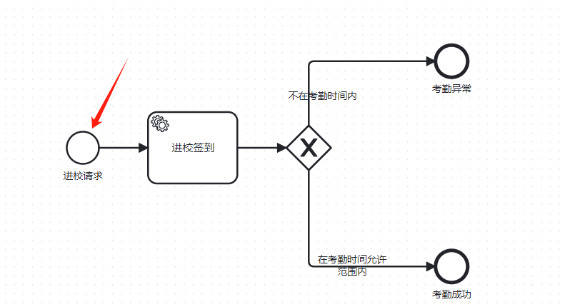
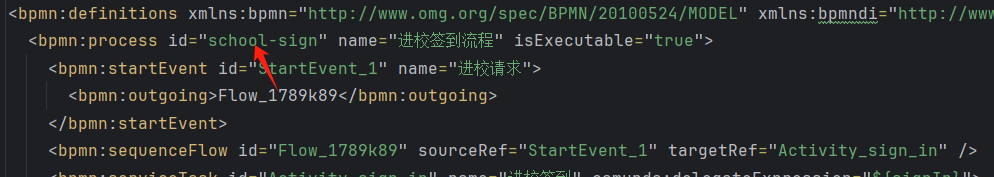
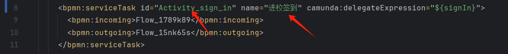

## DelegateExecution上下文

`DelegateExecution` 是 Camunda BPM 引擎提供的一种接口，用于访问和操作流程执行上下文。它是 Camunda BPM 中的核心概念之一，用于在流程执行过程中传递数据和控制信息。在流程执行的过程中，`DelegateExecution` 对象代表了当前的流程实例执行上下文。

### 主要用途

1. **访问流程变量**：
   `DelegateExecution` 提供了访问流程实例中所有变量的方法。这些变量可以在整个流程中传递数据，并且可以在不同的任务和服务任务之间共享数据。

2. **设置流程变量**：
   可以通过 `DelegateExecution` 来设置流程变量，从而改变流程的状态或传递新的数据给后续任务。

3. **控制流程执行**：
   可以通过 `DelegateExecution` 对象来控制流程的执行，例如触发子流程、设置信号量等。

### 常见方法

以下是一些 `DelegateExecution` 接口中常见的方法：

1. **获取变量**：
   ```java
   Object variableValue = execution.getVariable("variableName");
   ```

2. **批量获取变量**：
   ```java
   Map<String, Object> variables = execution.getVariables();
   ```

3. **设置变量**：
   ```java
   execution.setVariable("variableName", variableValue);
   ```

4. **批量设置变量**：
   ```java
   execution.setVariables(variablesMap);
   ```

5. **删除变量**：
   ```java
   execution.removeVariable("variableName");
   ```

6. **批量删除变量**：
   ```java
   execution.removeVariables();
   ```

7. **获取流程实例 ID**：
   ```java
   String processInstanceId = execution.getProcessInstanceId();
   ```

8. **获取活动 ID**：
   ```java
   String activityId = execution.getCurrentActivityId();
   ```

9. **获取活动名称**：
   ```java
   String activityName = execution.getCurrentActivityName();
   ```

10. **获取业务键**：
    ```java
    String businessKey = execution.getBusinessKey();
    ```

### 示例

下面是一个简单的示例，演示如何在 Camunda BPM 的流程中使用 `DelegateExecution`：

```java
import org.camunda.bpm.engine.delegate.DelegateExecution;
import org.camunda.bpm.engine.delegate.JavaDelegate;

public class MyDelegate implements JavaDelegate {

    @Override
    public void execute(DelegateExecution execution) throws Exception {
        // 获取流程变量
        String userName = (String) execution.getVariable("userName");
        
        // 设置新的流程变量
        execution.setVariable("greeting", "Hello, " + userName + "!");
        
        // 获取当前流程实例 ID
        String processInstanceId = execution.getProcessInstanceId();
        
        // 获取当前活动 ID 和名称
        String currentActivityId = execution.getCurrentActivityId();
        String currentActivityName = execution.getCurrentActivityName();
        
        // 输出一些信息
        System.out.println("Process Instance ID: " + processInstanceId);
        System.out.println("Current Activity ID: " + currentActivityId);
        System.out.println("Current Activity Name: " + currentActivityName);
    }
}
```

### 使用场景

`DelegateExecution` 通常用于以下场景：

1. **服务任务**：在流程定义中的服务任务中实现具体的业务逻辑。
2. **监听器**：在流程定义中的开始事件、结束事件、活动等处注册监听器，监听流程执行过程中的特定事件。
3. **消息接收者**：在接收到外部消息时，处理消息并更新流程的状态。

### 总结

`DelegateExecution` 是 Camunda BPM 中用于访问和操作流程执行上下文的核心接口。通过这个接口，开发者可以在流程执行过程中动态地访问和设置流程变量，以及控制流程的执行。这对于实现复杂的业务流程和集成外部系统非常有用。如果你有任何进一步的问题或需要更详细的解释，请随时告知！

## runtimeService

在 Camunda BPMN 引擎中，`runtimeService.startProcessInstanceByKey` 和 `runtimeService.createProcessInstanceByKey` 是两种不同的方法，用于启动流程实例。它们之间的主要区别在于流程实例的创建和启动方式。

### `runtimeService.startProcessInstanceByKey`

这个方法用于直接启动一个流程实例，并立即执行流程定义中的第一个活动。它会直接启动流程，并不会停留在任何特定的活动中。

#### 语法

```java
ProcessInstance processInstance = runtimeService.startProcessInstanceByKey(String processDefinitionKey);
```

#### 参数

- `processDefinitionKey`: 流程定义的 key，即在 BPMN 文件中定义的 `id` 属性。

#### 示例

```java
Map<String, Object> variables = new HashMap<>();
variables.put("creditor", "武松");

ProcessInstance instance = runtimeService.startProcessInstanceByKey("invoice", variables);
```

### `runtimeService.createProcessInstanceByKey`

这个方法用于创建一个流程实例，但并不立即执行它。你可以使用这个方法来设置一些初始条件或变量，并在某些条件下手动执行流程。

#### 语法

```java
ProcessInstanceBuilder builder = runtimeService.createProcessInstanceByKey(String processDefinitionKey);
```

#### 参数

- `processDefinitionKey`: 流程定义的 key。

#### 示例

```java
ProcessInstanceBuilder builder = runtimeService.createProcessInstanceByKey("invoice");
builder.setVariable("creditor", "武松");
ProcessInstance instance = builder.execute();
```

### `createProcessInstanceByKey` 的高级用法

`createProcessInstanceByKey` 提供了更多的灵活性，允许你在创建流程实例时设置更多的属性，如启动特定的活动、设置变量等。

#### `startBeforeActivity`

这个方法允许你在流程实例中指定从哪个活动开始执行。

#### 示例

```java
ProcessInstanceWithVariables instance = runtimeService.createProcessInstanceByKey("invoice")
    .startBeforeActivity("UserTaskOne")
    .setVariable("creditor", "武磊")
    .executeWithVariablesInReturn();
```

### 总结

- **`startProcessInstanceByKey`**：立即启动流程实例，并执行流程定义的第一个活动。
- **`createProcessInstanceByKey`**：创建流程实例，但不立即执行。可以用来设置更多的属性（如变量、启动活动等），然后手动执行。

### 返回变量

当你使用 `executeWithVariablesInReturn` 方法时，它会返回一个 `ProcessInstanceWithVariables` 对象，这个对象包含了流程实例的 ID 和流程变量。

#### 示例

```java
ProcessInstanceWithVariables instanceWithVars = runtimeService.createProcessInstanceByKey("invoice")
    .startBeforeActivity("UserTaskOne")
    .setVariable("creditor", "武磊")
    .executeWithVariablesInReturn();

System.out.println(instanceWithVars.getProcessInstanceId());
System.out.println(instanceWithVars.getVariables());
```

通过这种方式，你可以获取流程实例的 ID 和所有流程变量，这对于后续处理非常有用。

希望这些信息能帮助你更好地理解和使用 Camunda BPMN 引擎中的流程启动和控制机制！如果有更多具体问题或需要进一步的帮助，请随时告知。

在上述示例中，“invoice”代表的是流程定义的键（`processDefinitionKey`）。这是指在 Camunda BPMN 引擎中已经部署并可用的一个流程定义的唯一标识符。

流程定义键通常是 BPMN 流程模型文件中的 `id` 属性值，或者是你部署流程定义时给定的名称。这个键用于在流程引擎中引用具体的流程定义。

### 如何查找流程定义键

如果你不知道流程定义键是什么，可以通过以下几种方式来查找：

1. **查看 BPMN 文件**：
   在 BPMN 文件中 `<bpmn:process>` 标签的 `id` 属性就是流程定义的键。

   ```xml
   <bpmn:process id="invoice" isExecutable="true">
   ```

2. **查询已部署的流程定义**：
   使用 Camunda Engine 的管理界面或者 API 查询已部署的流程定义。

   ```java
   List<ProcessDefinition> processDefinitions = repositoryService.createDeploymentQuery().list();
   for (ProcessDefinition pd : processDefinitions) {
       System.out.println(pd.getKey()); // 输出流程定义的键
   }
   ```

3. **使用 Camunda Cockpit 或 Admin 接口**：
   在 Camunda Cockpit 或者 Admin 接口中，可以看到已部署的所有流程定义及其详细信息，其中包括流程定义的键。

### 示例

假设你有一个名为 `InvoiceProcess.bpmn` 的流程文件，其中的流程定义如下：

```xml
<bpmn:process id="invoice" isExecutable="true">
    <!-- 流程定义细节 -->
</bpmn:process>
```

在这个例子中，“invoice”就是流程定义的键。

### 启动流程实例

当你使用 `startProcessInstanceByKey` 或者 `createProcessInstanceByKey` 方法时，你需要提供这个键来告诉流程引擎你应该启动哪一个流程定义的实例。

```java
// 假设你已经部署了名为 "invoice" 的流程定义
Map<String, Object> variables = new HashMap<>();
variables.put("creditor", "武松");

// 启动名为 "invoice" 的流程定义的实例
ProcessInstance instance = runtimeService.startProcessInstanceByKey("invoice", variables);
```

在这个例子中，流程定义键 “invoice” 被用来启动一个新的流程实例。流程引擎将查找名为 “invoice” 的流程定义，并使用提供的变量来启动流程实例。

## 概念

`businessKey` 参数就是业务键

在流程中处理订单时，可以将订单 ID 作为业务键，也就是说如果学生打卡出校园，也可以将学生学号作为业务键

开启这个业务的键值



processKey 参数就是该bpmn的进程id(实体)

Process Definition Key 就是该bpmn定义的独有id(类)



获取这是活动 ID和活动名称



```java
import org.camunda.bpm.engine.delegate.DelegateExecution;
import org.camunda.bpm.engine.delegate.JavaDelegate;

public class OrderProcessingDelegate implements JavaDelegate {

    @Override
    public void execute(DelegateExecution execution) throws Exception {
        // 获取业务键
        String businessKey = execution.getBusinessKey();
        System.out.println("Business Key: " + businessKey);
        
        // 获取流程定义键
        String processDefinitionKey = execution.getProcessDefinitionKey();
        System.out.println("Process Definition Key: " + processDefinitionKey);
        
        // 获取流程实例 ID
        String processInstanceId = execution.getProcessInstanceId();
        System.out.println("Process Instance ID: " + processInstanceId);
        
        // 获取当前活动 ID
        String currentActivityId = execution.getCurrentActivityId();
        System.out.println("Current Activity ID: " + currentActivityId);
        
        // 获取当前活动名称
        String currentActivityName = execution.getCurrentActivityName();
        System.out.println("Current Activity Name: " + currentActivityName);
    }
}
```

## Camunda工作流程

1.首先创建任务获得任务id

2.有系统自动完成的任务，也有人工完成的任务，系统完成的任务可以在springboot中通过类来直接调用完成一些业务操作，然后人工完成的任务可以通过查询的办法去查询到，然后将任务完成，最终就得到了结果。


## 流程节点

流程节点（Process Node）是 BPMN（Business Process Model and Notation）流程定义中的基本组成部分。在 BPMN 中，流程节点表示流程中的不同步骤或活动，它们可以是开始事件、结束事件、任务、网关等。每个节点都具有特定的功能和语义。

### 流程节点的类型及其意义

1. **开始事件（Start Event）**：
   - **意义**：标志着流程的开始。可以是普通开始事件、定时器开始事件等。
   - **用法**：用于定义流程实例何时启动。例如，当接收到订单时，可以触发订单处理流程的开始事件。

2. **结束事件（End Event）**：
   - **意义**：标志着流程或分支的结束。可以是普通结束事件、取消结束事件等。
   - **用法**：用于定义流程何时终止。例如，当订单处理完毕后，可以触发订单处理流程的结束事件。

3. **任务（Task）**：
   - **意义**：表示需要完成的工作。可以是用户任务、服务任务等。
   - **用法**：用于定义需要执行的具体工作。例如，用户任务可能涉及人工审批，而服务任务则可以调用 Web 服务或执行脚本。

4. **网关（Gateway）**：
   - **独占网关（Exclusive Gateway）**：
     - **意义**：用于选择一条单一路径继续流程。
     - **用法**：根据条件选择下一个活动。例如，根据订单金额决定是否需要额外审批。
   - **并行网关（Parallel Gateway）**：
     - **意义**：允许多条路径同时进行。
     - **用法**：同时执行多个并行任务。例如，同时发送邮件通知客户和更新库存系统。
   - **复杂网关（Complex Gateway）**：
     - **意义**：用于更复杂的路由逻辑。
     - **用法**：处理更复杂的流程分支逻辑。

5. **事件子流程（Event Subprocess）**：
   - **意义**：用于处理特定类型的事件。
   - **用法**：可以嵌套在流程中，等待特定事件的发生再执行。

6. **序列流（Sequence Flow）**：
   - **意义**：连接两个节点，定义流程的流向。
   - **用法**：用于定义节点之间的顺序关系。

### 获取流程节点状态

在处理流程实例时，经常需要查询流程实例的状态，包括当前处于哪个节点，哪些节点已经完成等。Camunda BPM 提供了多种方式来查询流程实例的状态。

### 示例：查询流程实例节点状态

以下是一个示例，展示如何查询流程实例的节点状态：

1. **查询当前活动节点**：

   你可以使用 `RuntimeService` 的 `createExecutionQuery` 方法来查询当前活动节点：

   ```java
   List<String> activeActivityIds = runtimeService.createExecutionQuery()
       .processInstanceId(processInstanceId)
       .activityIdIn(activeActivityIds)
       .list()
       .stream()
       .map(Execution::getActivityId)
       .collect(Collectors.toList());
   ```

2. **查询历史节点状态**：

   如果你想查询历史节点状态，可以使用 `HistoryService`：

   ```java
   List<HistoricActivityInstance> historicActivityInstances = historyService.createHistoricActivityInstanceQuery()
       .processInstanceId(processInstanceId)
       .list();
   ```

   每个 `HistoricActivityInstance` 对象包含了节点 ID (`activityId`)、节点名称 (`activityName`)、开始时间 (`startTime`)、结束时间 (`endTime`) 等信息。

### 示例代码：查询流程实例节点状态

在你的 `ProcessInstanceService` 中，可以实现一个方法来查询流程实例节点状态：

```java
public Map<String, Integer> queryInstanceNodeState(String processInstanceId) {
    // 当前活动节点
    List<String> activeActivityIds = runtimeService.createExecutionQuery()
        .processInstanceId(processInstanceId)
        .list()
        .stream()
        .map(Execution::getActivityId)
        .collect(Collectors.toList());

    // 历史活动节点
    List<HistoricActivityInstance> historicActivityInstances = historyService.createHistoricActivityInstanceQuery()
        .processInstanceId(processInstanceId)
        .list();

    // 构建结果 Map<k:节点id v:状态值>
    Map<String, Integer> nodeStates = new HashMap<>();
    for (HistoricActivityInstance activityInstance : historicActivityInstances) {
        if (activeActivityIds.contains(activityInstance.getActivityId())) {
            // 当前活动节点状态
            nodeStates.put(activityInstance.getActivityId(), 1); // 假设 1 表示活动
        } else {
            // 历史活动节点状态
            nodeStates.put(activityInstance.getActivityId(), 0); // 假设 0 表示已完成
        }
    }

    return nodeStates;
}
```

### 控制层调用

在你的 `ProcessInstanceController` 中，可以提供一个端点来查询流程实例节点状态：

```java
// 查询流程实例节点状态
@GetMapping("/{processInstanceId}/nodes")
@ApiOperation(value = "查询流程实例节点状态")
public BaseResponse<Map<String, Integer>> queryInstanceNodeState(
        @PathVariable String processInstanceId) {
    Map<String, Integer> nodeStates = processInstanceService.queryInstanceNodeState(processInstanceId);
    return ResultUtils.success(nodeStates);
}
```

### 总结

流程节点是流程定义的基本组成部分，用于描述流程的不同阶段或任务。通过查询流程实例的当前活动节点和历史活动节点，你可以了解流程实例的状态和进展。以上提供的代码示例展示了如何在 Camunda BPM 中查询流程实例节点的状态，并通过 RESTful API 提供给客户端。如果有其他具体需求或问题，请随时告知！

## 考勤流程

1.输入学生id，进行打卡

2.系统处理的过程中，出现考勤异常的话，找到学生对应的老师进行处理