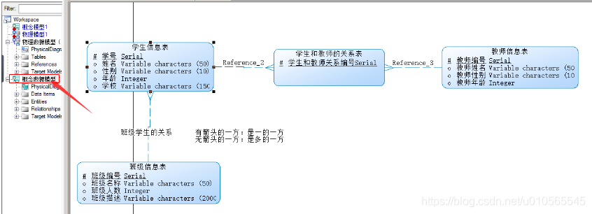

 

**目录**

**[一. 概念数据模型 (CDM Conceptual Data Model)](#t0)**

**[二. 物理数据模型 PDM Physical Data Model](#t1)**

**[三.下面将介绍概念模型转为物理模型和物理模型转换为概念模型](#t2)**

**[四. 物理模型导出SQL语句](#t3)**

* * *

### 一.概念数据模型 (CDM Conceptual Data [Model](https://so.csdn.net/so/search?q=Model&spm=1001.2101.3001.7020))

**1：入门级使用PowerDesigner软件创建数据库（打开软件即是此页面，可选择Create Model,也可以选择Do  Not  Show page Again,自行在打开软件后创建也可以！完全看个人的喜好，在此我在后面的学习中不在显示此页面。）**

**2：首先创建概念数据模型，如图所示**

> *   概念模型(CDM Conceptual Data Model)
> *   物理模型（PDM,Physical Data Model）
> *   面向对象的模型（OOM Objcet Oriented Model）
> *   业务模型（BPM Business Process Model）

**3:点击上面的ok,即可出现下图左边的概念模型1,自己创建概念模型的名字，使用最多的就是如图所示的那两个Entity(实体),Relationship(关系)**

**4:选中右边框中Entity这个功能，即可出现下面这个方框，(需要注意的是书写name的时候，code自行补全，name可以是英文的也可以是中文的，但是code必须是英文的。)**

**5:General中的name和code填好后，就可以点击Attributes（属性）来设置name（名字）,code(在数据库中的字段名)，Data  Type(数据类型) ，length(数据类型的长度)**

> *   **Name: 实体名字一般为中文如论坛用户**
> *   **Code: 实体代号,一般用英文如XXXUser**
> *   **Comment:注释对此实体详细说明。**
> *   **Code属性代号一般用英文UID DataType**
> *   **Domain域表示属性取值范围如可以创建10个字符的地址域** 
> *   **M:Mandatory强制属性，表示该属性必填。不能为空not null**
> *   **P:Primary Identifer是否是主标识符，表示实体店唯一标识符**
> *   **D:Displayed显示出来，默认全部勾选**

**（在此上图说明name和code的起名方法）**

**6：设置的主标识符可以在Identifiers(标识符)这个模块删除or添加主标识符。**

**7：创建好概念数据模型如图所示，但是创建好的字体很小，读者可以按着ctrl键同时滑动鼠标的可滑动按钮即可放大缩写字体，同时也可以看到主标识符有一个\*号的标志，同时也显示出来了，name,Data type和length这些可见的属性**

**8：同理创建一个班级的实体（需要特别注意的是，点击完右边功能的按钮后需要点击鼠标指针状态的按钮或者右击鼠标即可），然后使用Relationship（关系）这个按钮可以连接学生和班级之间的关系，发生一对多（班级对学生）或者多对一（学生对班级）的关系。如图所示**

**（需要注意的是点击Relationship这个按钮，就把班级和学生联系起来了，就是一条线，然后双击这条线进行编辑，在General这块起name和code）**

**（上面的name和code起好后就可以在Cardinalities这块查看班级和学生的关系，可以看到班级的一端是一条线，学生的一端是三条，代表班级对学生是一对多的关系即one对many的关系，点击应用，然后确定即可）**

**9：一对多和多对一练习完还有多对多的练习，如下图操作所示，老师实体和上面介绍的一样，自己将name，data type等等修改成自己需要的即可，满足项目开发需求即可。（comment是注释说明，自己可以写相关的介绍和说明）**

 

**（多对多需要注意的是自己可以手动点击按钮将关系调整称为多对多的关系many对many的关系，然后点击应用和确定即可）**

**综上即可完成最简单的学生，班级，教师这种概念数据模型的设计，需要考虑数据的类型和主标识码，是否为空。关系是一对一还是一对多还是多对多的关系，自己需要先规划好再设计，然后就ok了。**

###  二. **物理数据模型 PDM Physical Data Model**

 二. **物理数据模型，以后经常使用的就是物理数据模型**

**1：打开PowerDesigner，然后点击File-->New  Model然后选择如下图所示的物理数据模型**

**（物理数据模型的名字自己起，然后选择自己所使用的数据库即可）**

**(创建好主页面如图所示，但是右边的按钮和概念模型略有差别，物理模型最常用的三个是table(表)，view（视图），reference(关系))；**

**（鼠标先点击右边table这个按钮然后在新建的物理模型点一下，即可新建一个表，然后双击新建如下图所示，在General的name和code填上自己需要的，点击应用即可），如下图：**

 **（然后点击Columns,如下图设置，需要注意的就是P（primary主键） , F （foreign key外键） , M（mandatory强制性的，代表不可为空not null)）**

**（在此设置学号的自增（MYSQL里面的自增是这个AUTO\_INCREMENT），班级编号同理！）**

**（在下面的这个点上对号即可，就设置好了自增）**

**（全部完成后如下图所示。）**

 **（班级物理模型同理如下图所示创建即可）**

**（完成后如下图所示）**

**上面的设置好如上图所示，然后下面是关键的地方，点击右边按钮Reference这个按钮，因为是班级对学生是一对多的，所以鼠标从学生拉到班级如下图所示，学生表将发生变化，学生表里面增加了一行，这行是班级表的主键作为学生表的外键，将班级表和学生表联系起来。（仔细观察即可看到区别。）**

**（做完上面的操作，就可以双击中间的一条线，显示如下图，修改name和code即可）**

**(但是需要注意的是，修改完毕后显示的结果却如下图所示，并没有办法直接像概念模型那样，修改过后显示在中间的那条线上面，读者自己明白即可，自己也可以使用其他按钮自行添加注释也可。如Text这个按钮也可以添加，方便阅读)**

**（学习了多对一或者一对多的关系，接下来学习多对对的关系，同理自己建好老师表，记得老师编号自增，建好如下图所示）**

**（下面是多对多关系的关键，由于物理模型多对多的关系需要一个中间表来连接，如下图，只设置一个字段，主键，自增）**

**（点击应用，然后设置Columns，只添加一个字段）**

**（这是设置字段递增，前面已经叙述过好几次）**

**（设置好后如下图所示）（需要注意的是有箭头的一方是一，无箭头的一方是多，即一对多的多对一的关系需要搞清楚，学生也可以有很多老师，老师也可以有很多学生，所以学生和老师都可以是主体，即男/女主角）；**

 **（可以看到添加关系以后学生和教师的关系表前后发生的变化）**

### **三.下面将介绍概念模型转为物理模型和物理模型转换为概念模型**

**3.1：如下图所示先打开概念模型图，然后点击Tool,如下图所示**

 **（点开的页面如下所示，name和code我已经从概念模型1改成物理模型1了）**

**(完成后如下图所示，将自行打开修改的物理模型，需要注意的是这些表的数据类型已经自行改变了，而且中间表出现两个主键，即双主键，）**

> **小知识点:**
> 
> **右侧的ToolBox的显示与隐藏,可以在view菜单的下面ToolBox管理**
> 
> **重新打开PowerDesigner如下图，自己右击open即可。**

**3.2：上面介绍了概念模型转物理模型，下面介绍一下物理模型转概念模型（如下图点击操作即可）**

 **（然后出现如下图所示界面，然后将物理修改为概念 ，点击应用确和认即可）**

**（点击确认后将自行打开如下图所示的页面，自己观察有何变化，如果转换为oracle的，数据类型会发生变化，比如Varchar2等等）；**

### **四.物理模型导出SQL语句**

**1：下面介绍一下物理模型导出SQL语句（点击Database按钮的Generate Database或者按ctrl+G）**

**(打开之后如图所示，修改好存在sql语句的位置和生成文件的名称即可)**

**（在Selection中选择需要导出的表，然后点击应用和确认即可）**

**（完成以后出现如下图所示，可以点击Edit或者close按钮）**

**现在就完成了sql语句导出工作，可以到自己指定的位置查看导出的sql语句,尽情使用了;**

文章知识点与官方知识档案匹配，可进一步学习相关知识

[MySQL入门技能树](https://edu.csdn.net/skill/mysql/mysql-753300de6ef94af7be40fb91a05421a6?utm_source=csdn_ai_skill_tree_blog)[SQL高级技巧](https://edu.csdn.net/skill/mysql/mysql-753300de6ef94af7be40fb91a05421a6?utm_source=csdn_ai_skill_tree_blog)[CTE和递归查询](https://edu.csdn.net/skill/mysql/mysql-753300de6ef94af7be40fb91a05421a6?utm_source=csdn_ai_skill_tree_blog)84419 人正在系统学习中

本文转自 <https://blog.csdn.net/u010565545/article/details/105115033>，如有侵权，请联系删除。