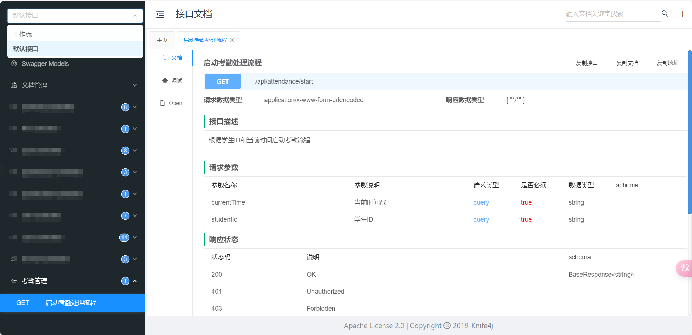

## **springboot整合Swagger，并配置Knife4jConfig实现最简单的多包扫描**

依赖：


```java
        <dependency>
            <groupId>com.github.xiaoymin</groupId>
            <artifactId>knife4j-spring-boot-starter</artifactId>
            <version>3.0.3</version>
        </dependency>
```

配置多包扫描:

有多少个不同控制层的包就有多少个bean，                .groupName("默认接口")定义分组名称

```java
@Configuration
@EnableSwagger2
@Profile({"dev", "test"})
public class Knife4jConfig {
    @Bean
    public Docket defaultApi2() {
        return new Docket(DocumentationType.SWAGGER_2)
                .apiInfo(new ApiInfoBuilder()
                        .title("接口文档")
                        .description("springboot-init")
                        .version("1.0")
                        .build())
                //分组名称
                .groupName("默认接口")
                .select()
                .apis(RequestHandlerSelectors.basePackage("com.yupi.springbootinit.controller"))
                .paths(PathSelectors.any()) //扫描目录下的所有控制层
                .build();
    }
    @Bean
    public Docket defaultApi3() {
        return new Docket(DocumentationType.SWAGGER_2)
                .apiInfo(new ApiInfoBuilder()
                        .title("接口文档")
                        .description("springboot-init")
                        .version("1.0")
                        .build())
                //分组名称
                .groupName("工作流")
                .select()
                .apis(RequestHandlerSelectors.basePackage("com.yupi.springbootinit.workflow.controller"))
                .paths(PathSelectors.any())
                .build();
    }
}
```

使用示例:

```java
@RestController
@RequestMapping("/attendance")
@Api(tags = "考勤管理")
public class AttendanceController {

    @Autowired
    private AttendanceService attendanceService;

    @GetMapping("/start")
    @ApiOperation(value = "启动考勤处理流程", notes = "根据学生ID和当前时间启动考勤流程")
    public BaseResponse<String> startAttendanceHandling(
            @RequestParam @ApiParam(value = "学生ID", required = true) String studentId,
            @RequestParam @ApiParam(value = "当前时间戳", required = true) String currentTime) {
//具体实现

    }
}
```

配置访问路径，默认应该是      地址:端口号/doc.html

效果如图：



启动类记得也要扫描多的包：

```java
@MapperScan({"com.yupi.springbootinit.mapper","com.yupi.springbootinit.workflow.mapper"})
@ComponentScan(basePackages = {"com.yupi.springbootinit", "com.yupi.springbootinit.workflow"})
@EnableScheduling
@EnableAspectJAutoProxy(proxyTargetClass = true, exposeProxy = true)
public class MainApplication {

    public static void main(String[] args) {
        SpringApplication.run(MainApplication.class, args);
    }

}
```

