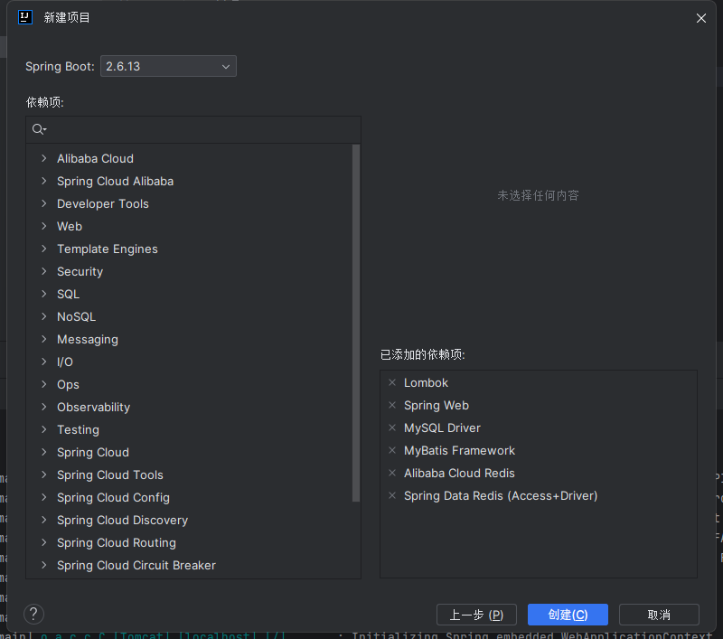

## springboot+Mybatis+Redis项目搭建

## 项目初始化

基础依赖



## 配置mysql和mybatis

项目pom.xml中又两部分依赖导入一部分在上面的dependencies一部分在dependencyManagement(管理性依赖)，一般依赖在上面的dependencies配置

确保项目pom.xml中有以下依赖：

```xml
                <dependency>
            <groupId>com.alibaba</groupId>
            <artifactId>druid-spring-boot-starter</artifactId>
            <version>1.1.10</version>
        </dependency>
        <!--Druid-->
        <dependency>
            <groupId>com.alibaba</groupId>
            <artifactId>druid</artifactId>
            <version>1.1.12</version>
        </dependency>
        <!--log4j-->
        <dependency>
            <groupId>log4j</groupId>
            <artifactId>log4j</artifactId>
            <version>1.2.17</version>
        </dependency>
        <dependency>
            <groupId>org.mybatis.spring.boot</groupId>
            <artifactId>mybatis-spring-boot-starter</artifactId>
            <version>3.0.1</version>
        </dependency>
        <dependency>
            <groupId>mysql</groupId>
            <artifactId>mysql-connector-java</artifactId>
            <version>8.0.33</version>
        </dependency>
```

如果没有依赖开源通过右键的生成选项去搜索添加，注意要看清楚依赖是spring的还是springboot的，出了问题要去查一下

添加完依赖之后重新加载一下maven下载依赖。

编写测试类测试是否正常运行：

config/DruidConfig.java:

```java
@Configuration
public class DruidConfig {
    @ConfigurationProperties(prefix = "spring.datasource")
    @Bean
    public DataSource druidDataSource() {
        return new DruidDataSource();
    }
}
```


写入以下代码，然后运行：

```java
@SpringBootTest
class ApplicationTests {
    @Autowired
    DataSource dataSource;
    @Test
    void contextLoads() throws SQLException {
        System.out.println(dataSource.getClass());
        //获得连接
        Connection connection =   dataSource.getConnection();
        System.out.println(connection);
        DruidDataSource druidDataSource = (DruidDataSource) dataSource;
        System.out.println("druidDataSource 数据源最大连接数：" + druidDataSource.getMaxActive());
        System.out.println("druidDataSource 数据源初始化连接数：" + druidDataSource.getInitialSize());
        //关闭连接
        connection.close();
    }
}
```

如果没有报错就说明没有问题了

### 配置文件application，以及从properties转yml

下载插件


右键文件选择即可转换

application.yml配置：

```yml
server:
    port: 3000
spring:
    data:
        redis:
            database: 0
            host: 127.0.0.1
            password: ''
            port: 6379
            timeout: 1200
    redis:
        pool:
            max-active: 8
            max-idle: 8
            max-wait: -1
            min-idle: 0
    datasource:
        driver-class-name: com.mysql.cj.jdbc.Driver
        url: jdbc:mysql://localhost:3306/saasdatabase?characterEncoding=UTF8&autoReconnect=true&useSSL=false
        username: root
        password: 123456
        type: com.alibaba.druid.pool.DruidDataSource
```

如果连接mysql出现ssl错误就加上useSSL=false

如果遇到编码问题，在springboot设置中找到：


全部修改为UTF-8：


## 分层架构编写程序，以及对应的注释

| 文件分层     | 注释           | 意义                           |
| ------------ | -------------- | ------------------------------ |
| config       | @Configuration | 配置文件项                     |
| controller   | @Controller    | 控制层，接收前端的请求         |
| service/impl | @Service       | 服务层，对接收的前端数据做处理 |
| dao          | @Mapper        | 数据层，对于数据库进行操作     |
| domain       |                | 存放相关的类定义               |


注释是为了能够自动注入bean

一般使用构造注入的方式去注入对应的bean

```java
public class RoleController {
    private final RoleService roleService;

    @Autowired
    public RoleController(RoleService roleService){
        this.roleService = roleService;
    }
    }
```

**注意事项： RoleService roleService，注入的变量名不能跟类型名一样（比如都大写RoleService RoleService）会造成注入不了bean**

如果使用lombok就不需要了构造注入了，前提是要写final注解

```java
@RequiredArgsConstructor
public class RoleController {
    private final RoleService roleService;
}
```

springboot项目中，controller或service层中需要注入多个mapper接口或者另外的service接口，这时候代码中就会有多个@AutoWired注解，使得代码看起来什么的混乱。
lombok提供了一个注解：
@RequiredArgsConstructor(onConstructor =@_(@Autowired))
写在类上面可以代替@AutoWired注解，需要注意的是：在注入的时候需要用final定义，或者使用@notnull

### 分层编写样例方便记录：

### 前置步骤domain

首先需要在domain建立一个数据类,需要生成get和set方法，方便数据更改和查询

Role.java

```java
@Data
public class Role {
        public Integer getRole_id() {
                return role_id;
        }

        public void setRole_id(Integer role_id) {
                this.role_id = role_id;
        }

        public String getCharacter_type() {
                return character_type;
        }

        public void setCharacter_type(String character_type) {
                this.character_type = character_type;
        }

        private Integer role_id;
        private String role;
        private String character_type;

        public String getRole() {
                return role;
        }

        public void setRole(String role) {
                this.role = role;
        }


        public String getDate1() {
                return date1;
        }

        public void setDate1(String date1) {
                this.date1 = date1;
        }

        public String getDate2() {
                return date2;
        }

        public void setDate2(String date2) {
                this.date2 = date2;
        }

        public boolean getState() {
                return state;
        }

        public void setState(boolean state) {
                this.state = state;
        }

        public boolean isSelectAuthority() {
                return selectAuthority;
        }

        public void setSelectAuthority(boolean selectAuthority) {
                this.selectAuthority = selectAuthority;
        }

        private String date1;
        private String date2;
        private boolean state;
        private boolean selectAuthority;
}

```

**注意：因为类是被定为私有的，所以在数据库获取到对应数据的时候，是无法直接通过输出访问到的，必须使用get和set方法**

**使得能够直接访问到数据的办法是给数据类加上Lombok的@Data注释，这个注释能使得返回的结构体和列表能够直接访问到里面的数据(简化书写过程)，否则查数据库返回的结果打印会是这样：[com.example.saasserver.demos.web.domain.Role@71058624, com.example.saasserver.demos.web.domain.Role@34071660, com.example.saasserver.demos.web.domain.Role@2004daf9]**

### 定义消息状态类

定义状态码类HttpStatus.java：

```java
@Data
public class HttpStatus {
    /**
     * 操作成功
     */
    public static final int SUCCESS = 200;

    /**
     * 对象创建成功
     */
    public static final int CREATED = 201;

    /**
     * 请求已经被接受
     */
    public static final int ACCEPTED = 202;

    /**
     * 操作已经执行成功，但是没有返回数据
     */
    public static final int NO_CONTENT = 204;

    /**
     * 资源已被移除
     */
    public static final int MOVED_PERM = 301;

    /**
     * 重定向
     */
    public static final int SEE_OTHER = 303;

    /**
     * 资源没有被修改
     */
    public static final int NOT_MODIFIED = 304;

    /**
     * 参数列表错误（缺少，格式不匹配）
     */
    public static final int BAD_REQUEST = 400;

    /**
     * 未授权
     */
    public static final int UNAUTHORIZED = 401;

    /**
     * 访问受限，授权过期
     */
    public static final int FORBIDDEN = 403;

    /**
     * 资源，服务未找到
     */
    public static final int NOT_FOUND = 404;

    /**
     * 不允许的http方法
     */
    public static final int BAD_METHOD = 405;

    /**
     * 资源冲突，或者资源被锁
     */
    public static final int CONFLICT = 409;

    /**
     * 不支持的数据，媒体类型
     */
    public static final int UNSUPPORTED_TYPE = 415;

    /**
     * 系统内部错误
     */
    public static final int ERROR = 500;

    /**
     * 接口未实现
     */
    public static final int NOT_IMPLEMENTED = 501;
}
```

### 定义响应结构体

```java
@Data
/**
 * 操作消息提醒
 *
 * @author ec
 */
public class AjaxResult extends HashMap<String, Object> {
    /**
     * 状态码
     */
    public static final String CODE_TAG = "code";
    /**
     * 返回内容
     */
    public static final String MSG_TAG = "msg";
    /**
     * 数据对象
     */
    public static final String DATA_TAG = "data";
    private static final long serialVersionUID = 1L;

    /**
     * 初始化一个新创建的 AjaxResult 对象，使其表示一个空消息。
     */
    public AjaxResult() {
    }

    /**
     * 初始化一个新创建的 AjaxResult 对象
     *
     * @param code 状态码
     * @param msg  返回内容
     */
    public AjaxResult(int code, String msg) {
        super.put(CODE_TAG, code);
        super.put(MSG_TAG, msg);
    }

    /**
     * 初始化一个新创建的 AjaxResult 对象
     *
     * @param code 状态码
     * @param msg  返回内容
     * @param data 数据对象
     */
    public AjaxResult(int code, String msg, Object data) {
        super.put(CODE_TAG, code);
        super.put(MSG_TAG, msg);
        if (StringUtils.isNotNull(data)) {
            super.put(DATA_TAG, data);
        }
    }

    /**
     * 返回成功消息
     *
     * @return 成功消息
     */
    public static AjaxResult success() {
        return AjaxResult.success("操作成功");
    }

    /**
     * 返回成功数据
     *
     * @return 成功消息
     */
    public static AjaxResult success(Object data) {
        return AjaxResult.success("操作成功", data);
    }

    /**
     * 返回成功消息
     *
     * @param msg 返回内容
     * @return 成功消息
     */
    public static AjaxResult success(String msg) {
        return AjaxResult.success(msg, null);
    }

    /**
     * 返回成功消息
     *
     * @param msg  返回内容
     * @param data 数据对象
     * @return 成功消息
     */
    public static AjaxResult success(String msg, Object data) {
        return new AjaxResult(HttpStatus.SUCCESS, msg, data);
    }

    /**
     * 返回错误消息
     *
     * @return
     */
    public static AjaxResult error() {
        return AjaxResult.error("操作失败");
    }

    /**
     * 返回错误消息
     *
     * @param msg 返回内容
     * @return 警告消息
     */
    public static AjaxResult error(String msg) {
        return AjaxResult.error(msg, null);
    }

    /**
     * 返回错误消息
     *
     * @param msg  返回内容
     * @param data 数据对象
     * @return 警告消息
     */
    public static AjaxResult error(String msg, Object data) {
        return new AjaxResult(HttpStatus.ERROR, msg, data);
    }

    /**
     * 返回错误消息
     *
     * @param code 状态码
     * @param msg  返回内容
     * @return 警告消息
     */
    public static AjaxResult error(int code, String msg) {
        return new AjaxResult(code, msg, null);
    }

    /**
     * 方便链式调用
     *
     * @param key   键
     * @param value 值
     * @return 数据对象
     */
    @Override
    public AjaxResult put(String key, Object value) {
        super.put(key, value);
        return this;
    }
}
```

使用方法：

```java
// 返回成功消息
AjaxResult successResult = AjaxResult.success();

// 返回带有数据的成功消息
AjaxResult successWithDataResult = AjaxResult.success("操作成功", someData);

// 返回错误消息
AjaxResult errorResult = AjaxResult.error();

// 返回带有数据的错误消息
AjaxResult errorWithDataResult = AjaxResult.error("操作失败", someData);
```

#### 设计概述：

1. **成员变量**：
   - `CODE_TAG`：表示状态码的键名。
   - `MSG_TAG`：表示返回内容的键名。
   - `DATA_TAG`：表示数据对象的键名。
2. **构造方法**：
   - 有多个构造方法，可以根据传入参数的不同创建不同的 AjaxResult 对象。
   - 构造方法可以传入状态码、返回内容和数据对象，构建不同情况下的返回结果。
3. **静态工厂方法**：
   - `success()` 方法用于返回操作成功的结果。
   - `error()` 方法用于返回操作失败的结果。
   - 这些方法提供了一些默认值，如默认的操作成功或失败的提示信息。
4. **链式调用方法**：
   - 重写了 `put` 方法，使得可以进行链式调用，方便在创建对象的同时设置键值对。

同时类继承了 extends HashMap<String, Object>，能够使用super.put存储键对在对象中，最后用this放回，this包含super，一般是同一种东西。[Java中super关键字及super()的使用_java super-CSDN博客](https://blog.csdn.net/pipizhen_/article/details/107165618)

### 数据层Dao

首先定义对应的数据库操作

```java
@Mapper
public interface RoleDao {

    //    @Insert("insert into tbl_book values(null,#{type},#{name},#{description})")
    @Insert("insert into roleinfo (role,character_type,state,date1,date2,selectAuthority) values(#{role},#{character_type},#{state},#{date1},#{date2},#{selectAuthority})")
    public Boolean save(Role RoleData);

    @Update("update roleinfo set role = #{role}, character_type = #{character_type}, date1 = #{date1},date2 = #{date2},selectAuthority = #{selectAuthority} where role_id = #{role_id}")
    public Boolean update(Role RoleData);

    @Delete("delete from roleinfo where role_id = #{role_id}")
    public boolean delete(Integer role_id);

    @Select("select * from roleinfo where role_id = #{role_id}")
    public Role getByid(Integer role_id);

    @Select("select * from roleinfo")
    public List<Role> getAll();
}
```

### 服务层Service

impl：

先定义接口

```java
@Transactional
public interface RoleServiceImpl {
    /**
     * 保存
     *
     * @param roleData
     * @return
     */
    public AjaxResult save(Role roleData);

    /**
     * 修改
     *
     * @param roleData
     * @return
     */
    public AjaxResult update(Role roleData);

    /**
     * 按id删除
     *
     * @param role_id
     * @return
     */
    public AjaxResult delete(Integer role_id);

    /**
     * 按id查询
     *
     * @param role_id
     * @return
     */
    public AjaxResult getByid(Integer role_id);

    /**
     * 查询全部
     *
     * @return
     */
    public AjaxResult getAll();
}

```

具体实现：

```java
@Service
@RequiredArgsConstructor
public class RoleService implements RoleServiceImpl {
    private final RoleDao roleDao; //注入依赖
    

    public AjaxResult save(Role roleData) {
        if(roleData.getRole() == null || roleData.getCharacter_type() == null  || roleData.getDate1() == null || roleData.getDate2() == null){
            return AjaxResult.error("必须项缺填写");
        }
        if(roleDao.save(roleData)){
            return AjaxResult.success("添加成功") ;
        }
        return AjaxResult.error("添加失败");
    }

    public AjaxResult update(Role roleData) {
        if (roleDao.update(roleData)){
          return AjaxResult.success("更改成功");
        }
        return AjaxResult.error("更改失败");
    }

    public AjaxResult delete(Integer role_id) {
        if (roleDao.delete(role_id)){
            return AjaxResult.success("删除成功");
        }
        return AjaxResult.error("删除失败");
    }


    public AjaxResult getByid(Integer role_id) {
        if (roleDao.getByid(role_id).getRole_id() == role_id){
            return AjaxResult.success("获取成功",roleDao.getByid(role_id));
        }
        return AjaxResult.error("获取失败");
    }

    public AjaxResult getAll() {
        return AjaxResult.success(roleDao.getAll());
    }
}
```

@RequiredArgsConstructor 是Lomlok提供的注解，替代了原来的@Autowired 依赖注入，以至于不需要通过构造注入的方式注入数据,能为类下的所有变量依赖注入不需要重复书写。

**需要注意的是：在注入的时候需要用final定义，或者使用@notnull注解**

**对比：**

```java
@Service
@RequiredArgsConstructor
public class RoleService implements RoleServiceImpl {
    private final RoleDao roleDao;
}
```

```java
@Service
public class RoleService implements RoleServiceImpl {
    private final RoleDao roleDao;
    
    @Autowired
    public RoleService(RoleDao roleDao) {
        this.roleDao = roleDao;
    }
}
```

### 控制层Controller

```java
@Controller
@RequestMapping("/role")
@RequiredArgsConstructor
public class RoleController {
    private final RoleService roleService;
    //查
    @RequestMapping(value = "/list",method = RequestMethod.GET)
    @ResponseBody
    public AjaxResult list(){
        return roleService.getAll();
    }
    @RequestMapping("/getbyid")
    @ResponseBody
    public AjaxResult getbyid(Integer role_id){
        return roleService.getByid(role_id);
    }
    //改
    @RequestMapping("/change")
    @ResponseBody
    public AjaxResult change(Role roleData){
        return roleService.update(roleData);
    }
    //增
    @RequestMapping("/add")
    @ResponseBody
    public AjaxResult add(Role roleData){
        return roleService.save(roleData);
    }

    //删
    @RequestMapping("/delete")
    @ResponseBody
    public AjaxResult delete(Integer role_id){
        return roleService.delete(role_id);
    }
}
```

## MVC符号

| 注释                                                    | 作用                                                         | 相关属性                                              |
| ------------------------------------------------------- | ------------------------------------------------------------ | ----------------------------------------------------- |
| **@Controller**                                         | **设定SpringMVC的核心控制器bean**                            |                                                       |
| **@RequestMapping**                                     | **设置当前控制器方法请求访问路径**                           | **value(默认)，请求访问路径**                         |
| **@ResponseBody**                                       | **设置当前控制器方法响应内容为当前返回值，无需解析**         | **pattern：指定日期时间格式字符串**                   |
| **@RequestParam**                                       | **绑定请求参数与处理器方法形参间的关系**                     | **required：是否为必传参数 defaultValue：参数默认值** |
| **@RestController**                                     | **设置当前控制器类为RESTful风格，<br/>等同于@Controller与@ResponseBody两个注解组合功能** |                                                       |
| **@GetMapping @PostMapping @PutMapping @DeleteMapping** | **设置当前控制器方法请求访问路径与请求动作，每种对应一个请求动作，<br/>例如@GetMapping对应GET请求** | **value（默认）：请求访问路径**                       |
| **@PathVariable**                                       | **绑定路径参数与处理器方法形参间的关系，要求路径参数名与形参名一一对应** |                                                       |

**说明:**

* **该注解可以写在类上或者方法上**
* **写在类上就是该类下的所有方法都有@ReponseBody功能**
* **当方法上有@ReponseBody注解后**
  * **方法的返回值为字符串，会将其作为文本内容直接响应给前端**
  * **方法的返回值为对象，会将对象转换成JSON响应给前端**

**此处又使用到了类型转换，内部还是通过Converter接口的实现类完成的，所以Converter除了前面所说的功能外，它还可以实现:**

* **对象转Json数据(POJO -> json)**
* **集合转Json数据(Collection -> json)**

> **从请求中获取数据的注意点和符号（如果不加上的话跨域请求是读不到数据的）** 

**关于接收参数，我们学过三个注解`@RequestBody`、`@RequestParam`、`@PathVariable`,这三个注解之间的区别和应用分别是什么?**

* **区别**
  * **@RequestParam用于接收url地址传参或表单传参**
  * **@RequestBody用于接收json数据**
  * **@PathVariable用于接收路径参数，使用{参数名称}描述路径参数**
* **应用**
  * **后期开发中，发送请求参数超过1个时，以json格式为主，@RequestBody应用较广**
  * **如果发送非json格式数据，选用@RequestParam接收请求参数**
  * **采用RESTful进行开发，当参数数量较少时，例如1个，可以采用@PathVariable接收请求路径变量，通常用于传递id值**

**问题3：每个方法响应json都需要加上@ResponseBody注解，重复性太高。**

**对于上面所提的这三个问题，具体该如何解决?**

**对于刚才的问题，我们都有对应的解决方案：**

**问题1：每个方法的@RequestMapping注解中都定义了访问路径/books，重复性太高。**

```
将@RequestMapping提到类上面，用来定义所有方法共同的访问路径。
```

**问题2：每个方法的@RequestMapping注解中都要使用method属性定义请求方式，重复性太高。**

```
使用@GetMapping  @PostMapping  @PutMapping  @DeleteMapping代替
```

**问题3：每个方法响应json都需要加上@ResponseBody注解，重复性太高。**

```
1.将ResponseBody提到类上面，让所有的方法都有@ResponseBody的功能
2.使用@RestController注解替换@Controller与@ResponseBody注解，简化书写
```

示例：

```java
@RestController //@Controller + ReponseBody
@RequestMapping("/books")
public class BookController {
    
	//@RequestMapping(method = RequestMethod.POST)
    @PostMapping
    public String save(@RequestBody Book book){
        System.out.println("book save..." + book);
        return "{'module':'book save'}";
    }

    //@RequestMapping(value = "/{id}",method = RequestMethod.DELETE)
    @DeleteMapping("/{id}")
    public String delete(@PathVariable Integer id){
        System.out.println("book delete..." + id);
        return "{'module':'book delete'}";
    }

    //@RequestMapping(method = RequestMethod.PUT)
    @PutMapping
    public String update(@RequestBody Book book){
        System.out.println("book update..." + book);
        return "{'module':'book update'}";
    }

    //@RequestMapping(value = "/{id}",method = RequestMethod.GET)
    @GetMapping("/{id}")
    public String getById(@PathVariable Integer id){
        System.out.println("book getById..." + id);
        return "{'module':'book getById'}";
    }

    //@RequestMapping(method = RequestMethod.GET)
    @GetMapping
    public String getAll(){
        System.out.println("book getAll...");
        return "{'module':'book getAll'}";
    }
    
}
```

### **Lomlok打印日志**

**在类中使用 `@Slf4j` 注解**

**在您的Java类中，只需添加 `@Slf4j` 注解，Lombok将自动生成一个名为 `log` 的日志记录器字段。**

```java
import lombok.extern.slf4j.Slf4j;

@Slf4j
public class MyClass {
    public void doSomething() {
        log.debug("Debug message");
        log.info("Info message");
        log.warn("Warning message");
        log.error("Error message");
    }
}
```

**步骤 3：配置日志框架**

**请确保您的项目中包含了一个支持 `@Slf4j` 自动生成的日志记录器的日志框架，如Logback或Log4j。您可以根据项目需求进行相应的配置。**

## 配置Mybatis和注意事项

一般情况可以使用注释的方式来查询数据库，当需要做一些判断操作或者复杂的查询方式的时候将会用到xml的方式

在application.yml配置Mybatis:

```yml
mybatis:
    # 配置XML映射文件中指定的实体类别名路径
    type-aliases-package: com.example.saasserver.demos.web.dao
    # 配置MyBatis的xml配置文件路径
    mapper-locations: classpath*:/Mapper/**/*.xml   //这里是资源路径
    # 开启驼峰uName自动映射到u_name
    map-underscore-to-camel-case: true
```

在启动项记得配置扫描模板dao：

```java
@SpringBootApplication
@MapperScan("com.example.saasserver.demos.web.dao")
public class SaasServerApplication {
    public static void main(String[] args) {
        SpringApplication.run(SaasServerApplication.class, args);
    }
}
```

在资源路径下自己指定的路径下创建xml进行编写：

```xml
<?xml version="1.0" encoding="UTF-8" ?>
<!DOCTYPE mapper PUBLIC "-//mybatis.org//DTD Mapper 3.0//EN" "http://mybatis.org/dtd/mybatis-3-mapper.dtd">
<mapper namespace="com.example.saasserver.demos.web.dao.RoleDao">

    <resultMap id="roleResultMap" type="com.example.saasserver.demos.web.domain.Role">  //这里是dao的位置
        <id column="role_id" property="role_id" />
        <result column="role" property="role" />
        <result column="character_type" property="character_type" />
        <result column="state" property="state" />
        <result column="date1" property="date1" />
        <result column="date2" property="date2" />
    </resultMap>

    <insert id="save" parameterType="com.example.saasserver.demos.web.domain.Role">
        insert into roleinfo (role, character_type, state, date1, date2)
        values (#{role}, #{characterType}, #{state}, #{date1}, #{date2})
    </insert>

    <update id="update" parameterType="com.example.saasserver.demos.web.domain.Role">
        update roleinfo
        set role = #{role}, character_type = #{characterType}, state = #{state},
            date1 = #{date1}, date2 = #{date2}, selectAuthority = #{selectAuthority}
        where role_id = #{role_id}
    </update>

    <delete id="delete" parameterType="int">  //parameterType是指要接收的类型
        delete from roleinfo
        where role_id = #{role_id}
    </delete>

    <select id="getByid" parameterType="int">
        select * from roleinfo
        where role_id = #{role_id}
    </select>

    <select id="getAll" resultType="com.example.saasserver.demos.web.domain.Role"> //resultType是指需要返回的类型 id对应函数名
        select * from roleinfo
    </select>

</mapper>

```

dao的书写：

```java
@Mapper
public interface RoleDao {

    public Boolean save(Role RoleData);

    public Boolean update(Role RoleData);

    public boolean delete(Integer role_id);

    public Role getByid(Integer role_id);

    public List<Role> getAll();
}
```

如果配置路径都没有出现问题的话出现

Invjavascript:void(0);alid bound statement (not found): com.example.saasserver.demos.web.dao.RoleDao.getAll

说明xml有东西写错了，需要注意的是对象类型不能直接作为一个变量进行存储到数据库要经过处理，创建转换器类实现[mybatis](https://so.csdn.net/so/search?q=mybatis&spm=1001.2101.3001.7020)提供的`TypeHandler`接口

## 定义多层级嵌套的数据结构

当前端需要的数据是多层级嵌套或者是树状结构的时候，我们需要对在数据库中取出来的数据进行处理

```json
[
      {
        "path": "/permission",
        "meta": {
          "title": "权限管理",
          "icon": "ep:lollipop",
          "rank": 10,
          "roles": [
            "admin",
            "common"
          ]
        },
        "children": [
          {
            "path": "/permission/page/index",
            "name": "PermissionPage",
            "meta": {
              "title": "页面权限",
              "roles": [
                "admin",
                "common",
                "newUser"
              ]
            }
          },
          {
            "path": "/permission/button/index",
            "name": "PermissionButton",
            "meta": {
              "title": "按钮权限",
              "roles": [
                "admin"
              ],
              "auths": [
                "permission:btn:add",
                "permission:btn:edit",
                "permission:btn:delete"
              ]
            }
          },
          {
            "path": "/permission/menu/index",
            "name": "PermissionMenu",
            "meta": {
              "title": "菜单管理",
              "roles": [
                "admin",
                "common",
                "newUser"
              ]
            }
          },
          {
            "path": "/permission/role/index",
            "name": "PermissionRole",
            "meta": {
              "title": "角色管理",
              "roles": [
                "admin",
                "common"
              ]
            }
          },
          {
            "path": "/permission/user/index",
            "name": "PermissionUser",
            "meta": {
              "title": "用户管理",
              "roles": [
                "admin",
                "common"
              ]
            }
          }
        ]
      }
    ]
```

为了方便，我选择用ts的类型来表达这个结构：

```ts
interface RouterList {
    router_id: number;
    parent_id: number;
    path: string;
    role: string;
    title: string;
    name: string;
    icon?: string | null;
    display_order?: number;
    is_system: boolean;
    created_at: string; // 根据实际情况修改日期时间类型
    updated_at: string; // 根据实际情况修改日期时间类型
}

interface SysRouter{
    path: string;
    name: string;
    meta: Routermeta;
    children?: Array<SysRouter> | null;
}
interface Routermeta{
    title: string;
    roles?: Array<any>;
    icon?: string | null;
    rank?: number;
}
```

RouterList是在数据库中拿出来的单级结构，通过处理之后得到SysRouter的嵌套结构

很明显SysRouter它嵌套者自身又嵌套着meta

在java中如何实现这个结构的传递呢？

先将负责传递数据库信息的类创建处理：

```java
@Data
public class RouterList {
    private int router_id;
    private int parent_id;
    private String path;
    private String role;
    private String title;
    private String name;
    private String icon;
    private Integer display_order;
    private boolean is_system;
    private String created_at;
    private String updated_at;

    // Getters and setters
}
```

然后我们再将附属类都创建出来：

RouterMeta.java

```java
@Data
public class RouterMeta {
    private String title;
    private List<String> roles;
    private String icon;
    private Integer rank;

    // Getters and setters
}
```

然后再创建主类，将附属类也同样添加进去：

 SysRouter.java

```java
@Data
public class SysRouter {
    private String path;
    private String name;
    private RouterMeta meta;
    private List<SysRouter> children;

    // Getters and setters
}

```

在创建好这些类结构之后，我们就在service层对接收到的数据结构进行处理：

```java
    public AjaxResult getSystemRouterTree(){
        return AjaxResult.success("查询成功",buildSysRouterTree(routerDao.getSystemRouter(),0));
    }
//通过创建数组循环和通过条件嵌套来进行结构处理，返回最终结构
public List<SysRouter> buildSysRouterTree(List<RouterList> routerList, int parentId) {
        List<SysRouter> sysRouterList = new ArrayList<>();
        for (RouterList routerItem : routerList) {
            if (routerItem.getParent_id() == parentId) {
                List<RouterList> subData = new ArrayList<>();
                for (RouterList elem : routerList) {
                    if (routerItem.getRouter_id() == elem.getParent_id()) {
                        subData.add(elem);
                    }
                }
                List<String> roles = getRolesByRouterId(routerItem.getRouter_id());
                SysRouter sysRouter = new SysRouter();
                sysRouter.setPath(routerItem.getPath());
                sysRouter.setName(routerItem.getName());
                RouterMeta meta = new RouterMeta();
                meta.setTitle(routerItem.getTitle());
                meta.setRoles(roles);
                meta.setIcon(routerItem.getIcon());
                if (routerItem.getDisplay_order() != null && routerItem.getDisplay_order() != 0) {
                    meta.setRank(routerItem.getDisplay_order());
                }
                sysRouter.setMeta(meta);
                //判断非空才继续嵌套
                if (!subData.isEmpty()) {
                    sysRouter.setChildren(buildSysRouterTree(subData, routerItem.getRouter_id()));
                }
                sysRouterList.add(sysRouter);
            }
        }
        return sysRouterList;
    }
```

**注意：当写结构嵌套的时候一定要在传递参数前判空或做其他条件判断不能一直传递，否则会出现死循环**

## Model层

在软件开发中，DTO（Data Transfer Object）、Entity、Enum 和 VO（Value Object）都是常用的设计模式或概念，它们各自有不同的用途和应用场景。下面是对这些概念的简要介绍和区别：

### 1. DTO (Data Transfer Object)
- **定义**：DTO 通常用于在服务层和服务调用者之间传递数据。它是一种简化了的数据结构，主要用于传输数据，而不包括业务逻辑或行为。
- **用途**：
  - 用于远程调用或跨层调用时的数据传递。
  - 将复杂的业务对象转换为简单的数据载体。
- **例子**：
  ```java
  public class UserDTO {
      private String username;
      private String email;
  
      // Getters and Setters
  }
  ```

### 2. Entity
- **定义**：Entity 代表了系统中的一个实体对象，通常对应于数据库中的表。它包含了持久化相关的属性和行为。
- **用途**：
  - 用于表示持久化的对象，即可以直接映射到数据库表的对象。
  - 包含业务逻辑和持久化逻辑。
- **例子**：
  ```java
  import javax.persistence.Entity;
  import javax.persistence.GeneratedValue;
  import javax.persistence.GenerationType;
  import javax.persistence.Id;
  
  @Entity
  public class User {
      @Id
      @GeneratedValue(strategy = GenerationType.IDENTITY)
      private Long id;
      private String username;
      private String password;
  
      // Getters and Setters
  }
  ```

### 3. Enum (枚举)
- **定义**：Enum 是 Java 中的一种特殊类型，用于表示一组固定的常量值。枚举是一种特殊的类，它可以有构造函数和方法。
- **用途**：
  - 用于表示一组有限的状态或选项。
  - 提供类型安全的方式处理固定集合的值。
- **例子**：
  ```java
  public enum Role {
      ADMIN,
      USER,
      GUEST
  }
  ```

### 4. VO (Value Object)
- **定义**：VO 通常用于表示不可变的数据结构，它强调的是值而不是引用。VO 不应该有状态改变的行为。
- **用途**：
  - 用于表示复杂的数据结构，如地址、货币金额等。
  - 作为方法参数或返回值，用于封装多个值。
- **例子**：
  ```java
  public class AddressVO {
      private String street;
      private String city;
      private String state;
      private String zipCode;
  
      // Constructor
      public AddressVO(String street, String city, String state, String zipCode) {
          this.street = street;
          this.city = city;
          this.state = state;
          this.zipCode = zipCode;
      }
  
      // Getters
  }
  ```

### 总结
- **DTO**：主要用于数据传输，减少业务逻辑之间的耦合。
- **Entity**：用于表示持久化的对象，通常与数据库表对应。
- **Enum**：用于表示一组固定的常量值，提供类型安全的枚举。
- **VO**：用于表示复杂的数据结构，强调不可变性和值相等性。

这些概念在实际开发中可能会有一些重叠，但它们各自有着明确的作用范围和使用场景。理解这些概念及其差异可以帮助更好地设计和实现系统。
