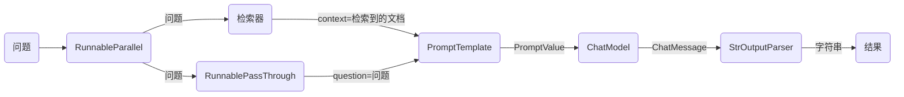

# 快速开始

```
pip install langchain-community
```

## LLMs

LangChain中有两种类型的语言模型，称为:

- LLMs: 这是一个以字符串作为输入并返回字符串的语言模型
- ChatModels: 这是一个以消息列表作为输入并返回消息的语言模型

LLMs的输入/输出简单易懂 - 字符串。但是ChatModels呢？那里的输入是一个`ChatMessage`列表，输出是一个单独的`ChatMessage`。 一个`ChatMessage`具有两个必需的组件:

- `content`: 这是消息的内容。
- `role`: 这是`ChatMessage`来自的实体的角色。

LangChain提供了几个对象，用于方便地区分不同的角色:

- `HumanMessage`: 来自人类/用户的`ChatMessage`。
- `AIMessage`: 来自AI/助手的`ChatMessage`。
- `SystemMessage`: 来自系统的`ChatMessage`。
- `FunctionMessage`: 来自函数调用的`ChatMessage`。

如果这些角色都不合适，还可以使用`ChatMessage`类手动指定角色。有关如何最有效地使用这些不同的消息的更多信息，请参阅我们的提示指南。

LangChain为两者提供了一个标准接口，但了解这种差异以便为给定的语言模型构建提示非常有用。LangChain提供的标准接口有两种方法:

- `predict`: 接受一个字符串，返回一个字符串
- `predict_messages`: 接受一个消息列表，返回一个消息。

让我们看看如何使用这些不同类型的模型和不同类型的输入。首先，让我们导入LLM和ChatModel。

```python
from langchain.llms import OpenAI
from langchain.chat_models import ChatOpenAI

llm = OpenAI()
chat_model = ChatOpenAI()

llm.predict("hi!")
>>> "Hi"

chat_model.predict("hi!")
>>> "Hi"
```

`OpenAI`和`ChatOpenAI`对象基本上只是配置对象。您可以使用诸如`temperature`等参数对其进行初始化，并将其传递给其他对象。

接下来，让我们使用`predict`方法对字符串输入进行处理。

```python
text = "What would be a good company name for a company that makes colorful socks?"

llm.predict(text)
# >> Feetful of Fun

chat_model.predict(text)
# >> Socks O'Color
```

最后，让我们使用`predict_messages`方法对消息列表进行处理。

```python
from langchain.schema import HumanMessage

text = "制造多彩袜子的公司的好名字是什么？"
messages = [HumanMessage(content=text)]

llm.predict_messages(messages)
# >> Feetful of Fun

chat_model.predict_messages(messages)
# >> Socks O'Color
```

对于这两种方法，您还可以将参数作为关键字参数传递。例如，您可以传入`temperature=0`来调整使用的温度，该温度将覆盖对象的配置。在运行时传入的任何值都将始终覆盖对象的配置。

## 提示模板

大多数LLM应用程序不会直接将用户输入传递到LLM中。通常，它们会将用户输入添加到一个更大的文本片段中，称为提示模板，该模板提供了有关特定任务的附加上下文。

在前面的示例中，我们传递给模型的文本包含了生成公司名称的指令。对于我们的应用程序，如果用户只需提供公司/产品的描述而无需担心给出模型指令，那将非常好。

PromptTemplates正是为此而设计的！它们将用户输入转化为完全格式化的提示的所有逻辑绑定在一起。这可以从非常简单的开始 - 例如，产生上述字符串的提示只需是

```python
from langchain.prompts import PromptTemplate

prompt = PromptTemplate.from_template("What is a good name for a company that makes {product}?")
prompt.format(product="colorful socks")
```

```
What is a good name for a company that makes colorful socks?
```

然而，使用这些而不是原始字符串格式化的优势有几个。您可以“部分”出变量 - 例如，您可以一次只格式化某些变量。您可以将它们组合在一起，轻松地将不同的模板组合成一个单独的提示。有关这些功能的说明，请参阅[提示部分](https://python.langchain.com.cn/docs/modules/model_io/prompts)以获取更多详细信息。

PromptTemplates还可以用于生成消息列表。在这种情况下，提示不仅包含有关内容的信息，还包含每个消息（其角色、其在列表中的位置等） 在这里，最常见的是ChatPromptTemplate是ChatMessageTemplate的列表。每个ChatMessageTemplate包含了格式化该ChatMessage的指令 - 其角色，以及其内容。让我们在下面看一下这个:

```python
from langchain.prompts.chat import (
    ChatPromptTemplate,
    SystemMessagePromptTemplate,
    HumanMessagePromptTemplate,
)

# 定义系统消息模板，描述助手的功能
template = "你是一个将 {input_language} 翻译成 {output_language} 的有用助手。"
system_message_prompt = SystemMessagePromptTemplate.from_template(template)

# 定义人类消息模板
human_template = "{text}"
human_message_prompt = HumanMessagePromptTemplate.from_template(human_template)

# 创建聊天提示
chat_prompt = ChatPromptTemplate.from_messages([system_message_prompt, human_message_prompt])

# 格式化消息，传入输入语言、输出语言和文本
formatted_messages = chat_prompt.format_messages(input_language="English", output_language="French", text="I love programming.")
```

```
[
    SystemMessage(content="You are a helpful assistant that translates English to French.", additional_kwargs={}),
    HumanMessage(content="I love programming.")
]
```

除了ChatMessageTemplate之外，ChatPromptTemplates还可以包括其他内容 - 有关更多详细信息，请参阅[提示部分](https://python.langchain.com.cn/docs/modules/model_io/prompts)。

## 输出解析器

OutputParsers将LLM的原始输出转换为可以在下游使用的格式。输出解析器有几种主要类型，包括:

- 将LLM的文本转换为结构化信息（例如JSON）
- 将ChatMessage转换为字符串
- 将除消息之外的其他信息（如OpenAI函数调用）转换为字符串。

有关此方面的详细信息，请参阅[输出解析器部分](https://python.langchain.com.cn/docs/modules/model_io/output_parsers)

在本入门指南中，我们将编写自己的输出解析器 - 将逗号分隔的列表转换为列表。

```python
from langchain.schema import BaseOutputParser

class CommaSeparatedListOutputParser(BaseOutputParser):
    """解析 LLM 调用的输出为逗号分隔的列表。"""

    def parse(self, text: str):
        """解析 LLM 调用的输出。"""
        return text.strip().split(", ")  # 去除首尾空格并按逗号分隔返回列表

# 创建输出解析器实例并解析字符串 "hi, bye"
result = CommaSeparatedListOutputParser().parse("hi, bye")
# >> ['hi', 'bye']  # 返回的结果示例
```

## LLMChain

现在，我们可以将所有这些组合成一个链组件。这个链组件将接收输入变量，将其传递给提示模板以创建提示，将提示传递给LLM，然后通过一个（可选的）输出解析器将输出传递出去。这是一种方便地将模块化逻辑捆绑在一起的方式。让我们看看它的作用！

```python
from langchain.chat_models import ChatOpenAI
from langchain.prompts.chat import (
    ChatPromptTemplate,
    SystemMessagePromptTemplate,
    HumanMessagePromptTemplate,
)
from langchain.chains import LLMChain
from langchain.schema import BaseOutputParser

class CommaSeparatedListOutputParser(BaseOutputParser):
    """解析 LLM 调用的输出为逗号分隔的列表。"""

    def parse(self, text: str):
        """解析 LLM 调用的输出。"""
        return text.strip().split(", ")  # 去除首尾空格并按逗号分隔返回列表

# 定义系统消息模板
template = """你是一个生成逗号分隔列表的助手。
用户将传入一个类别，你应该在该类别中生成 5 个对象，并以逗号分隔的列表返回。
仅返回逗号分隔的列表，其他内容不返回。"""
system_message_prompt = SystemMessagePromptTemplate.from_template(template)

# 定义人类消息模板
human_template = "{text}"
human_message_prompt = HumanMessagePromptTemplate.from_template(human_template)

# 创建聊天提示
chat_prompt = ChatPromptTemplate.from_messages([system_message_prompt, human_message_prompt])

# 创建 LLM 链
chain = LLMChain(
    llm=ChatOpenAI(),  # 使用 ChatOpenAI 模型
    prompt=chat_prompt,  # 使用定义的聊天提示
    output_parser=CommaSeparatedListOutputParser()  # 使用自定义的输出解析器
)

# 运行链，传入类别 "colors"
chain.run("colors")
# >> ['red', 'blue', 'green', 'yellow', 'orange']  # 返回的结果示例
```

# LangChain表达式 起步

LCEL使得从基本组件构建复杂链条变得容易，并且支持诸如流式处理、并行处理和日志记录等开箱即用的功能。

## 基本示例：提示 + 模型 + 输出解析器

最基本和常见的用例是将提示模板和模型链接在一起。为了了解这是如何工作的，让我们创建一个链条，它接受一个主题并生成一个笑话： %pip install --upgrade --quiet langchain-core langchain-community langchain-openai

```python
from langchain_core.output_parsers import StrOutputParser
from langchain_core.prompts import ChatPromptTemplate
from langchain_openai import ChatOpenAI

# 创建聊天提示模板，要求生成关于特定主题的短笑话
prompt = ChatPromptTemplate.from_template("告诉我一个关于 {topic} 的短笑话")

# 初始化 ChatOpenAI 模型，使用 gpt-4
model = ChatOpenAI(model="gpt-4")

# 创建输出解析器，用于解析字符串输出
output_parser = StrOutputParser()

# 创建链，将提示、模型和输出解析器组合在一起
chain = prompt | model | output_parser

# 调用链，传入主题 "ice cream"
result = chain.invoke({"topic": "ice cream"})
```

```
"为什么冰淇淋从不被邀请参加派对？\n\n因为当事情变热时，它们总是滴下来！"
```

请注意这行代码，我们使用LCEL将不同的组件组合成一个单一的链条：

chain = prompt | model | output_parser

`|` 符号类似于 [unix 管道操作符](https://en.wikipedia.org/wiki/Pipeline_(Unix))，它将不同的组件链接在一起，将一个组件的输出作为下一个组件的输入。

在这个链条中，用户输入被传递给提示模板，然后提示模板的输出被传递给模型，然后模型的输出被传递给输出解析器。让我们逐个组件地看一下，以真正理解发生了什么。

### 1. 提示

`prompt` 是一个 `BasePromptTemplate`，这意味着它接受一个模板变量的字典并生成一个 `PromptValue`。`PromptValue` 是一个包装完成的提示的包装器，可以传递给 `LLM`（它以字符串作为输入）或 `ChatModel`（它以消息序列作为输入）。它可以与任何语言模型类型一起使用，因为它定义了生成 `BaseMessage` 和生成字符串的逻辑。

```python
prompt_value = prompt.invoke({"topic": "ice cream"})
prompt_value
```

```
ChatPromptValue(messages=[HumanMessage(content='tell me a short joke about ice cream')])
```

```python
prompt_value.to_messages()
```

```
[HumanMessage(content='tell me a short joke about ice cream')]
```

```python
prompt_value.to_string()
```

```
'Human: tell me a short joke about ice cream'
```

### 2. 模型

然后将 `PromptValue` 传递给 `model`。在这种情况下，我们的 `model` 是一个 `ChatModel`，这意味着它将输出一个 `BaseMessage`。

```python
message = model.invoke(prompt_value)
message
```

```text
AIMessage(content="为什么冰淇淋从不被邀请参加派对？\n\n因为当事情变热时，它们总是滴下来！")
```

如果我们的 `model` 是一个 `LLM`，它将输出一个字符串。

```python
from langchain_openai.llms import OpenAI

llm = OpenAI(model="gpt-3.5-turbo-instruct")
llm.invoke(prompt_value)
```

```text
'\n\nRobot: 冰淇淋车为什么坏了？因为它融化了！'
```

### 3. 输出解析器

最后，我们将 `model` 的输出传递给 `output_parser`，它是一个 `BaseOutputParser`，意味着它可以接受字符串或 `BaseMessage` 作为输入。`StrOutputParser` 简单地将任何输入转换为字符串。

```python
output_parser.invoke(message)
```

```text
"冰淇淋为什么去看心理医生？\n\n因为它有太多的配料，找不到自己的冰淇淋锥自信！"
```

### 4. 整个流程

按照以下步骤进行操作：

1. 我们将用户输入的主题作为 `{"topic": "ice cream"}` 传入。
2. `prompt` 组件接受用户输入，然后使用主题构建提示，生成 `PromptValue`。
3. `model` 组件接受生成的提示，并将其传递给 OpenAI LLM 模型进行评估。模型生成的输出是一个 `ChatMessage` 对象。
4. 最后，`output_parser` 组件接受一个 `ChatMessage`，将其转换为 Python 字符串，并从 `invoke` 方法返回。

```
graph LR
    A(输入：topic=ice cream) --> |字典| B(PromptTemplate)
    B -->|PromptValue| C(ChatModel)    
    C -->|ChatMessage| D(StrOutputParser)
    D --> |字符串| F(结果)
```

info

请注意，如果您对任何组件的输出感到好奇，您可以始终测试链条的较小版本，例如 `prompt` 或 `prompt | model`，以查看中间结果：

```python
input = {"topic": "ice cream"}

prompt.invoke(input)
# > ChatPromptValue(messages=[HumanMessage(content='tell me a short joke about ice cream')])

(prompt | model).invoke(input)
# > AIMessage(content="为什么冰淇淋去看心理医生？\n因为它有太多的配料，找不到自己的冰淇淋锥自信！")
```


## RAG 搜索示例

对于下一个示例，我们想要运行一个检索增强生成链条，在回答问题时添加一些上下文。

```python
# 需要安装：
# pip install langchain docarray tiktoken

from langchain_community.vectorstores import DocArrayInMemorySearch
from langchain_core.output_parsers import StrOutputParser
from langchain_core.prompts import ChatPromptTemplate
from langchain_core.runnables import RunnableParallel, RunnablePassthrough
from langchain_openai.chat_models import ChatOpenAI
from langchain_openai.embeddings import OpenAIEmbeddings

# 创建一个内存中的文档数组搜索向量存储，使用 OpenAI 的嵌入
vectorstore = DocArrayInMemorySearch.from_texts(
    ["harrison worked at kensho", "bears like to eat honey"],
    embedding=OpenAIEmbeddings(),
)

# 将向量存储转换为检索器
retriever = vectorstore.as_retriever()

# 定义提示模板，要求根据上下文回答问题
template = """仅根据以下上下文回答问题：
{context}

问题：{question}
"""
prompt = ChatPromptTemplate.from_template(template)

# 初始化 ChatOpenAI 模型
model = ChatOpenAI()

# 创建输出解析器，用于解析字符串输出
output_parser = StrOutputParser()

# 设置并创建并行运行的任务
setup_and_retrieval = RunnableParallel(
    {"context": retriever, "question": RunnablePassthrough()}
)

# 创建链，将检索、提示、模型和输出解析器组合在一起
chain = setup_and_retrieval | prompt | model | output_parser

# 调用链，传入问题 "where did harrison work?"
result = chain.invoke("where did harrison work?")
```

在这种情况下，组合的链条是：

```python
chain = setup_and_retrieval | prompt | model | output_parser
```

首先，让我们看到上面的提示模板接受 `context` 和 `question` 作为要替换在提示中的值。在构建提示模板之前，我们希望检索相关文档并将其作为上下文的一部分包含在内。

作为预备步骤，我们使用内存存储设置了检索器，它可以根据查询检索文档。这也是一个可链接的可运行组件，但您也可以尝试单独运行它：

```python
retriever.invoke("where did harrison work?")
```

然后，我们使用 `RunnableParallel` 来通过使用检索器进行文档搜索和使用 `RunnablePassthrough` 来传递用户的问题，准备好传递给提示的预期输入：

```python
setup_and_retrieval = RunnableParallel(
    {"context": retriever, "question": RunnablePassthrough()}
)
```

回顾一下，完整的链条是：

```python
setup_and_retrieval = RunnableParallel(
    {"context": retriever, "question": RunnablePassthrough()}
)
chain = setup_and_retrieval | prompt | model | output_parser
```

流程如下：

1. 首先，创建一个 `RunnableParallel` 对象，其中包含两个条目。第一个条目 `context` 将包含检索器检索到的文档结果。第二个条目 `question` 将包含用户的原始问题。为了传递问题，我们使用 `RunnablePassthrough` 来复制该条目。
2. 将上述步骤中的字典提供给 `prompt` 组件。然后，它将用户输入（即 `question`）以及检索到的文档（即 `context`）用于构建提示，并输出 `PromptValue`。
3. `model` 组件接受生成的提示，并将其传递给 OpenAI LLM 模型进行评估。模型生成的输出是一个 `ChatMessage` 对象。
4. 最后，`output_parser` 组件接受一个 `ChatMessage`，将其转换为 Python 字符串，并从 `invoke` 方法返回。

