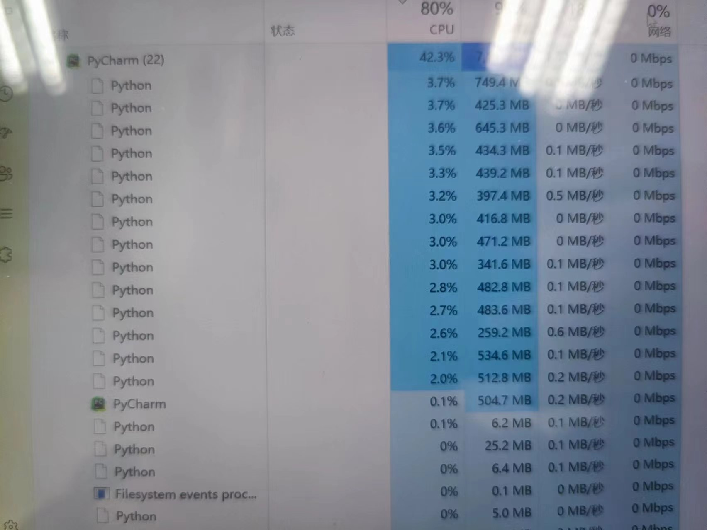

# Python多进程和多线程（跑满CPU）

- ***\*概念\****

任务可以理解为进程（process），如打开一个word就是启动一个word进程。在一个word进程之中不只是进行打字输入，还需要拼写检查、打印等子任务，我们可以把进程中的这些子任务称为线程（thread）。

由于每个进程至少要干一件事，那么一个进程至少有一个线程，有时候有的复杂进程有多个线程，在进程中的多个线程是可以同时执行的。多线程的执行方式和多进程是一样的，也是由操作系统在多个线程之间快速切换，让每个线程都短暂地交替运行，看起来就像同时执行一样。当然，真正地同时执行多线程需要多核CPU才可能实现。

 

总结一下就是，多任务的实现有3种方式：

- **多进程模式；**

启动多个进程，每个进程虽然只有一个线程，但多个进程可以一块执行多个任务。

- **多线程模式**

启动一个进程，在一个进程内启动多个线程，这样，多个线程也可以一块执行多个任务。

- **多进程+****多线程模式。**

 

启动多个进程，每个进程再启动多个线程，这样同时执行的任务就更多了，当然这种模型更复杂，实际很少采用。同时执行多个任务通常各个任务之间并不是没有关联的，而是需要相互通信和协调，有时，任务1必须暂停等待任务2完成后才能继续执行，有时，任务3和任务4又不能同时执行，所以，多进程和多线程的程序的复杂度要远远高于我们前面写的单进程单线程的程序。

 

- ***\*多进程\****

要让Python程序实现多进程（`multiprocessing`），我们先了解操作系统的相关知识。Unix/Linux操作系统提供了一个fork()系统调用，它非常特殊。普通的函数调用，调用一次，返回一次，但是fork()调用一次，返回两次，因为操作系统自动把当前进程（称为父进程）复制了一份（称为子进程），然后，分别在父进程和子进程内返回。

子进程永远返回0，而父进程返回子进程的ID。这样做的理由是，一个父进程可以fork出很多子进程，所以，父进程要记下每个子进程的ID，而子进程只需要调用`getppid()`就可以拿到父进程的ID。由于Python是跨平台的，自然也应该提供一个跨平台的多进程支持。`multiprocessing`模块就是跨平台版本的多进程模块。

`multiprocessing`模块提供了一个`Process`类来代表一个进程对象。

创建子进程时，只需要传入一个执行函数和函数的参数，创建一个Process实例，用start()方法启动，这样创建进程比fork()还要简单。join()方法可以等待子进程结束后再继续往下运行，通常用于进程间的同步。

​     `multiprocessing`模块提供了一个`Pool`进程池的方式批量创建子进程。

```python
from multiprocessing import Manager, Process, freeze_support, Pool

from tqdm import tqdm
import fitz # imports the pymupdf library

from ProcessIMG import processimg
from TextProcess import GetText,OutputToExecl
import asyncio
#是否写入多sheet
moretable = False
#是否开启多线程
threadOpen = True
#输出的文件名称
filename = "output"
# 创建共享的数据结构

def process_image(index, sub_img, textedgeimage,tabledata,success,tablemun):
    filename = "output"
    print(f"索引{index}", flush=True)
    totaltextlist = GetText.getText(textedgeimage, sub_img)
    data = OutputToExecl.write(totaltextlist, moretable, filename,threadOpen)
    tabledata.append(data)
    success.value += 1  # 更新成功处理的表格数量
    # percentage = success.value * 100 / tablemun.value  # 计算百分比
    # print(percentage)
    #print("数据已成功写入 Excel 文件:", filename)

async def process_images(pdf_document):
    #通过Manager给进程传递参数，因为每个进程都是独立的，所有要将参数都初始的时候传进去，global中的数据，进程中是无法获取的
    tabledata = Manager().list()  # 创建一个共享的列表
    success = Manager().Value('i', 1)  # 创建一个共享的整数
    tablemun = Manager().Value('i', 0)  # 创建一个共享的整数
    print("对pdf表格进行切割")
    table = await processimg.getImg(pdf_document)
    print(f"识别的表数量为{len(table)}个")
    tablemun.value = len(table)
        tasks = []
        args_list = []
       
       #设置一次开启进程数为16
        p = Pool(16)
        for index, (sub_img, textedgeimage) in enumerate(table):
            #参数1为要执行多进程的函数，第二个参数则是要传给多进程函数的参数
            p.apply_async(process_image, args=(index, sub_img, textedgeimage,tabledata,success,tablemun))  # 实例化进程对象

        print('等待所有的子进程完成')
        #在进程结束时关闭进程
        p.close()
        #等待所有进程结束
        p.join()
        print('All subprocesses done.')
        OutputToExecl.theardwrite(filename,tabledata)
        print("xlsx数据完全写入完成")

async def run(pdf_document):
    await process_images(pdf_document)

if __name__ == "__main__":
    global success, tabledata, tablemun
    freeze_support()

    pdf_document = fitz.open("input.pdf")  # open a document
    print("开始处理")
    asyncio.run(run(pdf_document))
```

**注意：多进程当中不能有异步（async）操作**

可以任务管理器查看进程数



经过观察，得到的结果似乎就算是开了多进程结果也是按顺序得到

原文地址：https://blog.csdn.net/qq_40317897/article/details/89921083