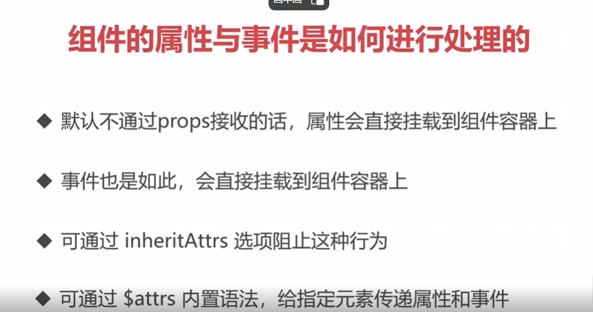
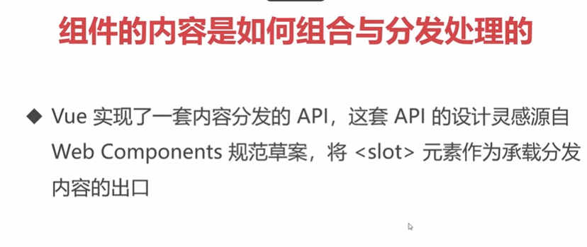
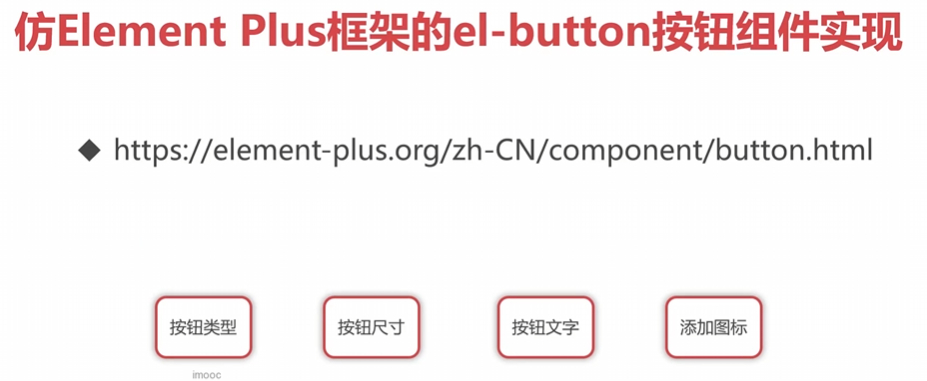
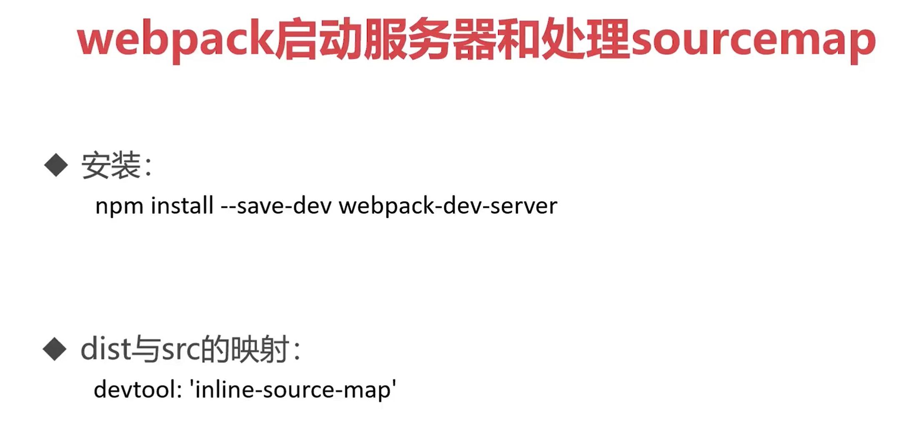

## 组件的属性和事件处理



对于组件的属性和事件处理，在Vue3中有一些变化和新特性。

1. 属性的处理：

   - 默认情况下，Vue3中的组件不再自动将未在props中声明的属性挂载到组件实例上。而是将这些未声明的属性直接传递给组件容器（即组件的根元素）。你可以通过`inheritAttrs`选项来控制该行为，默认值为`true`，如果设置为`false`，未声明的属性将不会被组件接收。
   - 如果你需要访问这些未声明的属性，你可以通过`$attrs`来获取它们。`$attrs`是一个包含了父组件传递给子组件的所有非props属性的对象。

2. 事件的处理：

   - 事件也可以通过`$attrs`传递给子组件。在父组件中使用`v-on`指令绑定的事件，可以直接通过`$attrs`传递给子组件，子组件可以使用`$emit`来触发这些事件。

   - 注意，使用`$emit`触发的事件只会向父组件派发，不会在组件内部冒泡。

   - 下面是一个简单的代码示例，演示了如何使用Vue3中的组件属性和事件处理：

     ```html
     <!-- ParentComponent.vue -->
     <template>
       <div>
         <h1>{{ title }}</h1>
         <ChildComponent :message="message" @custom-event="handleCustomEvent" />
       </div>
     </template>
     
     <script>
     import { ref } from 'vue';
     import ChildComponent from './ChildComponent.vue';
     
     export default {
       components: {
         ChildComponent
       },
       data() {
         return {
           title: 'Parent Component',
           message: 'Hello from Parent!'
         };
       },
       methods: {
         handleCustomEvent(payload) {
           console.log(payload);
           this.message = 'Custom event received: ' + payload;
         }
       }
     };
     </script>
     ```

     ```html
     <!-- ChildComponent.vue -->
     <template>
       <div>
         <p>{{ message }}</p>
         <button @click="emitCustomEvent">Click me!</button>
       </div>
     </template>
     
     <script>
     import { ref } from 'vue';
     
     export default {
       props: ['message'],
       methods: {
         emitCustomEvent() {
           this.$emit('custom-event', 'Custom event payload');
         }
       }
     };
     </script>
     ```

     在这个示例中，父组件`ParentComponent`通过props传递`message`属性给子组件`ChildComponent`，然后在子组件中，通过按钮点击事件，使用`$emit`方法触发了一个名为`custom-event`的自定义事件，并将一个自定义的payload作为参数传递给父组件。父组件通过在父组件模板中使用`v-on`指令来监听并处理这个自定义事件，在`handleCustomEvent`方法中，打印出payload信息，并将payload添加到`message`属性上进行更新，然后再次传递给子组件。

     当你运行这个示例时，父组件会显示一个标题和子组件的内容，子组件会显示父组件传递的`message`属性，并且点击按钮时，会触发自定义事件，并将payload值传递给父组件，父组件会打印payload值，并将其添加到`message`属性上进行更新，从而更新子组件的显示。

### $attrs

在你提供的代码中，你使用了Vue.js的`v-bind`指令来绑定`$attrs`对象到`<h2>`标签上。

`$attrs`是一个特殊变量，包含子组件接收到的所有未声明的属性。通过使用`v-bind`指令，你可以将`$attrs`中的属性传递给`<h2>`标签。

例如，假设父组件传递了以下属性给子组件：

```html
<template>
  <ChildComponent attr1="value1" attr2="value2" />
</template>
```

然后，在子组件中使用`v-bind`指令来绑定`$attrs`：

```html
<template>
  <h2 v-bind="$attrs">logo</h2>
</template>
```

在这种情况下，`$attrs`中的`attr1`和`attr2`属性会被传递给`<h2>`标签。这意味着生成的HTML代码将类似于：

```html
<h2 attr1="value1" attr2="value2">logo</h2>
```

这样，子组件中的`<h2>`标签会带有来自父组件的额外属性。

请注意，要使用`v-bind`指令绑定`$attrs`，你需要确保在子组件中的模板块内使用`v-bind`指令，并将其绑定到接收这些属性的标签上。

假设`$attrs`对象中包含了一个`title`属性，并且它的值是一个字符串。通过使用`v-bind`指令，你可以将`$attrs.title`的值绑定到`<h2>`标签的`title`属性上。

例如，如果父组件传递了以下属性给子组件：

```html
<template>
  <ChildComponent title="Website Logo" />
</template>
```

然后，在子组件中使用`v-bind`指令来绑定`$attrs.title`：

```html
<template>
  <h2 v-bind:title="$attrs.title">logo</h2>
</template>
```

在这种情况下，`$attrs.title`的值 "Website Logo" 会被传递给`<h2>`标签的`title`属性。生成的HTML代码将类似于：

```html
<h2 title="Website Logo">logo</h2>
```

这样，子组件中的`<h2>`标签会有一个标题为"Website Logo"的提示文本。

要注意的是，`v-bind`指令可以用于将动态数据绑定到元素的属性上。在这个例子中，我们使用`v-bind:title`来动态传递`$attrs.title`作为`<h2>`标签的标题。

。

## 组件的内容是如何组合与分发处理的



在Vue中，组件的内容组合和分发是通过使用`<slot>`元素来实现的。

`<slot>`元素可以在组件的模板中使用，作为组件的内容出口。它的作用是将父组件传递给子组件的内容插入到指定的位置。

具体而言，父组件可以在子组件中使用`<slot>`元素来定义一个插槽。插槽可以带有名称，以便父组件可以将具体的内容插入到特定的插槽中。


### 未命名插槽

例如，考虑以下的父组件和子组件：

```html
<!-- 父组件 -->
<template>
  <div>
    <h1>父组件</h1>
    <ChildComponent>
      <p>这是父组件插入的内容</p>
    </ChildComponent>
  </div>
</template>

<!-- 子组件 -->
<template>
  <div>
    <h2>子组件</h2>
    <slot></slot> <!-- 未命名的默认插槽 -->
  </div>
</template>
```

在这个例子中，父组件内插入了一个`<ChildComponent>`标签，其中包含一个`<p>`标签作为插入的内容。

子组件中有一个未命名的默认插槽`<slot></slot>`，它充当了子组件内容的出口。父组件插入的内容会被动态地渲染到子组件的插槽中。

当父组件和子组件进行组合时，最终生成的HTML代码类似于：

```html
<div>
  <h1>父组件</h1>
  <div>
    <h2>子组件</h2>
    <p>这是父组件插入的内容</p>
  </div>
</div>
```

在最终的渲染结果中，父组件插入的内容被正确地分发和组合到子组件的插槽中。

这种方式允许父组件向子组件传递动态的内容，并将其插入到子组件的指定位置。

除了默认的未命名插槽，Vue还支持具名插槽，使得父组件能够将内容插入到子组件中的特定命名插槽中。

### 具名插槽和作用域插槽

具名插槽（Named Slots）是Vue中的一种特性，它允许我们在组件中定义多个具名插槽，并在父组件中灵活地传递内容到这些插槽中。

具名插槽的使用方式与默认插槽类似，但是在模板中使用`<slot>`标签时，需要指定插槽的名称

作用域插槽（Scoped Slots）是Vue中的一个特性，它允许插槽可以访问子组件的数据。

通常情况下，插槽只能访问父组件的数据。但是在某些情况下，我们希望插槽能够访问子组件中的数据，这时就可以使用作用域插槽。

使用作用域插槽需要定义在子组件中的数据，并在父组件中通过插槽的语法接收并使用这些数据。

以下是一个示例代码，演示了作用域插槽的用法：

下面是对示例代码的注释：

```html
<!DOCTYPE html>
<html lang="en">
<head>
  <meta charset="UTF-8">
  <meta http-equiv="X-UA-Compatible" content="IE=edge">
  <meta name="viewport" content="width=device-width, initial-scale=1.0">
  <title>Document</title>
  <script src="../vue.global.js"></script>  <!-- 引入Vue库 -->
</head>
<body>
  <div id="app">
    <my-head>
      <!-- 具名插槽 #title 直接传递内容 -->
      <template #title>
        <p>logo, {{ message }}, {{ count }}</p>
      </template>
      <!-- 命名插槽 #list 传递内容，将子组件传递的list数据属性绑定上 -->
      <template #list="{ list }">
        <ul>
          <li v-for="item in list">{{ item }}</li>
        </ul>
      </template>
    </my-head>
  </div>
  <script>
    let app = Vue.createApp({
      data(){
        return {
          message: 'hello'
        }
      }
    })

    app.component('MyHead', {
      data(){
        return {
          count: 123,
          list: ['首页', '视频', '音乐']
        };
      },
      template: `
        <header>
          <slot name="title"></slot> <!-- 默认内容插槽 -->
          <hr>
          <slot name="list" :list="list"></slot> <!-- 命名插槽，并传递属性list -->
        </header>
      `,
    });
    
    let vm = app.mount('#app');  <!-- 将Vue实例挂载到#app节点上 -->
  </script>
</body>
</html>
```

## 仿Element Plus框架的el-button按钮组件实现



在Vue中，`data`用于定义组件中的数据。它是一个函数或对象，用于存储组件的状态和属性。当数据发生变化时，Vue会根据`data`的定义来更新视图，确保视图与数据保持同步。

```vue
<!DOCTYPE html>
<html lang="en">
<head>
  <meta charset="UTF-8">
  <meta http-equiv="X-UA-Compatible" content="IE=edge">
  <meta name="viewport" content="width=device-width, initial-scale=1.0">
  <title>Document</title>
  <style>
    .el-button{
      display: inline-flex;
      justify-content: center;
      align-items: center;
      line-height: 1;
      height: 32px;
      white-space: nowrap;
      cursor: pointer;
      background-color: #ffffff;
      border: 1px solid #dcdfe6;
      border-color: #dcdfe6;;
      color: #606266;
      -webkit-appearance: none;
      text-align: center;
      box-sizing: border-box;
      outline: none;
      transition: .1s;
      font-weight: 500;
      user-select: none;
      vertical-align: middle;
      padding: 8px 15px;
      font-size: 14px;
      border-radius: 4px;
    }
    .el-button--primary{
      color: white;
      background-color: #409eff; 
    }
    .el-button--success{
      color: white;
      background-color: #67c23a; 
    }
    .el-button--large{
      height: 40px;
      padding: 12px 19px;
      font-size: 14px;
    }
    .el-button--small{
      height: 24px;
      padding: 5px 11px;
      font-size: 12px;
      border-radius: 3px;
    }
  </style>
  <link rel="stylesheet" href="./iconfont/iconfont.css">
  <script src="../vue.global.js"></script>
</head>
<body>
  <div id="app">
    <el-button>default</el-button>
    <el-button type="primary" size="small">Primary</el-button>
    <el-button type="success" size="large">Success</el-button>
    <el-button type="success" size="large">
      <template #icon>
        <i class="iconfont iconfangdajing"></i>
      </template>
      Success
    </el-button>
  </div>
  <script>

    let ElButton = { //定义组件
      data(){
        return {
          buttonClass: {//样式
            'el-button': true,
            [`el-button--${this.type}`]: this.type !== '',  //动态样式
            [`el-button--${this.size}`]: this.size !== '' 
          }
        }
      },
      props: { //传递的参数集合
        type: {
          type: String,
          default: ''
        },
        size: { 
          type: String,
          default: ''
        }
      },
      //整个组件的内容模板
      template: ` 
        <button :class="buttonClass">
          <slot name="icon"></slot>
          <slot></slot>
        </button>
      ` 
    };

    let vm = Vue.createApp({
      data(){
        return {
        }
      },
      components: {
        ElButton //传递组件
      }
    }).mount('#app');
  </script>
</body>
</html>
```


## 单文件组件SFC及Vue CLI脚手架的安装使用


scoped 只在组件内生效


## 脚手架原理之webpack处理html文件和模块打包


package.json

```json
{
  "name": "webpack-study",
  "version": "1.0.0",
  "description": "",
  "main": "index.js",
  "scripts": {
    "test": "echo \"Error: no test specified\" && exit 1",
    "build": "webpack", //调用插件生成
    "serve": "webpack-dev-server" //调用服务插件
  },
  "keywords": [],
  "author": "",
  "license": "ISC",
  "devDependencies": { //安装的插件
    "@vue/compiler-sfc": "^3.2.37",
    "css-loader": "^6.7.1",
    "html-webpack-plugin": "^5.5.0",
    "style-loader": "^3.3.1",
    "vue": "^3.2.37",
    "vue-loader": "^17.0.0",
    "webpack": "^5.73.0",
    "webpack-cli": "^4.10.0",
    "webpack-dev-server": "^4.9.3"
  }
}
```

脚手架通常使用Webpack来处理HTML文件和模块打包。下面是关于Webpack处理HTML文件和使用HtmlWebpackPlugin插件的简要解释：

Webpack是一个模块打包工具，它可以将项目中的各个模块（包括JavaScript、CSS、图片等）打包成一个或多个文件。其中，HTML文件是Web应用的入口文件，它描述了网页的结构、内容和样式。

Webpack通过一系列配置来处理HTML文件。当Webpack执行打包时，它会读取指定的HTML文件，并根据配置项来处理其中引用的其他资源（如CSS、JavaScript文件）。具体的处理过程如下：

1. Webpack扫描项目的入口文件（通常是一个或多个JavaScript文件），然后递归解析其依赖关系，将所有相关的模块打包成一个或多个bundle文件。
2. 在打包过程中，Webpack会根据指定的配置对不同类型的资源文件进行处理，例如使用Babel对ES6+的JavaScript代码进行转译，使用CSS loader处理CSS文件，使用file loader处理图片和其他静态资源。
3. 在处理HTML文件时，Webpack会根据配置模板生成一个新的HTML文件，并将打包生成的bundle文件自动插入到HTML文件中。

HtmlWebpackPlugin插件是一个Webpack插件，它简化了HTML文件的创建和使用。它可以根据一个HTML模板文件生成新的HTML文件，并自动将打包生成的bundle文件注入到HTML文件中。同时，它还提供了一些其他功能，比如自动添加favicon、生成多个HTML文件等。

通过使用HtmlWebpackPlugin插件，你可以轻松创建和管理HTML文件，无需手动编写和维护每个HTML文件，并且可以根据不同入口文件生成多个独立的HTML文件。

总结来说，Webpack通过配置项来处理HTML文件和其他资源，并使用HtmlWebpackPlugin插件简化了HTML文件的创建和使用，使得项目打包和管理更加便捷

webpack.config.js

使用的是node.js的写法进行配置和管理

```js
const HtmlWebpackPlugin = require('html-webpack-plugin');
const { VueLoaderPlugin } = require('vue-loader');

module.exports = {
  entry: { //js的主文件入口
    main: './src/main.js'
  },
  output: { //输出的位置
    path: __dirname + '/dist',//__dirname是node.js自带的方法
    clean: true //清除输出文件夹中的垃圾文件
  },
  devtool: 'inline-source-map', //安装这个插件可以在生产网页中直接找到源文件出错的位置
  module: {//预处理模块
    rules: [
      {
        test: /\.css$/i,
        use: ['style-loader', 'css-loader']//预处理，使用这两个加载器来在js中加载css，加载顺序从右到左
      },
      {//使用内置的图片预处理来在js中调用图片
        test: /\.(png|jpg|gif)$/i,
        type: 'asset/resource'
      },
      {
        test: /\.vue$/i, //使用vue能够被预处理
        use: ['vue-loader'] //安装vue预处理模块
      }
    ]
  },
  plugins: [//将引进的插件进行使用
    new HtmlWebpackPlugin({
      template: './public/index.html',
      title: 'vue-study'
    }),
    new VueLoaderPlugin()
  ],
  mode: 'development'
};
```

插入图片使用


## webpack启动服务器和处理sourcemap



## 脚手架原理之webpack处理单文件组件及loader转换


## 仿Element Plus的el-rate评分组件实现(单文件组件)


在Vue.js中，`:key`是用来给Vue的渲染列表（v-for）中的每个元素设置唯一的标识符。这个唯一的标识符可以帮助Vue更高效地更新和重用DOM元素。

当使用`v-for`指令渲染列表时，Vue会根据每个元素的索引来更新DOM。但是，当列表中的元素发生改变（例如，顺序变化或元素增删）时，Vue可能无法准确地识别哪个DOM元素需要更新、删除或新增。这时，我们可以通过为每个元素添加`:key`来解决这个问题。

`:key`的值应该是唯一的，并且在列表中稳定不变。通常，可以使用每个元素的唯一标识符（例如id）作为`:key`的值。例如：

```vue
<div v-for="item in items" :key="item.id">
  {{ item.name }}
</div>
```


在上面的例子中，`item.id`被用作每个元素的唯一标识符。这样，当列表中的元素发生改变时，Vue可以根据`:key`的值来准确地更新DOM元素。

使用`:key`是Vue中处理列表渲染的常用技巧，它可以提供更好的性能和更准确的DOM更新。

在这个组件中，`$emit('update:modelValue', value)`实际上会触发父组件中监听了`update:modelValue`事件的方法。这样做的目的是为了实现父子组件之间的双向绑定。

父组件中需要监听`update:modelValue`事件，并在事件处理函数中更新父组件中的数据。在你提供的代码中，没有显示父组件的代码，所以无法确定具体的实现位置。

一般而言，父组件会使用`v-model`指令来控制子组件的属性，并在父组件中定义一个与`v-model`指令绑定的属性，同时提供一个事件监听器来更新该属性的值，例如：

```html
<template>
  <div>
    <rating-component v-model="rating"></rating-component>
  </div>
</template>

<script>
import RatingComponent from './RatingComponent.vue';

export default {
  components: {
    RatingComponent
  },
  data() {
    return {
      rating: 3
    };
  }
};
</script>
```

在这个例子中，父组件中使用`v-model="rating"`将父组件的`rating`属性与子组件的`modelValue`属性进行了双向绑定。当子组件触发`$emit('update:modelValue', value)`时，父组件中的`rating`属性会被更新。

请注意，这只是一个示例，实际的父组件代码可能会有所不同。希望这个解释能帮到你！如果还有其他问题，请随时提问。

也就是将value传给modelValue，再传给父组件中的rating


