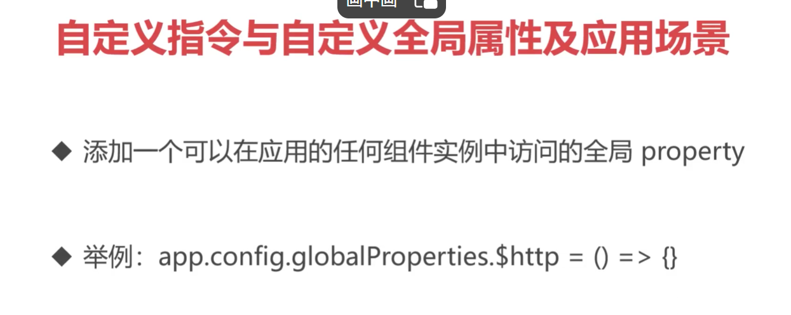
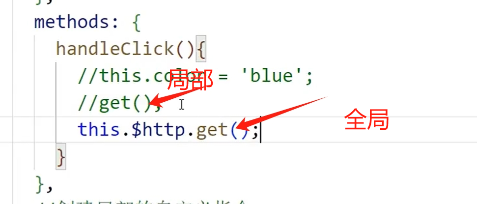

## 总


## ref属性在元素和组件上的分别使用


### ref操作DOM

- ref属性添加到元素身上，可以获取到当前元素的原生DOM
- ref属性添加到组件身上，可以获取到当前组件的vm对象(实例对象)
- 也可以实现间接的父子通信

```vue
<template>
  <div>
    <h2>ref属性</h2>
    <button @click="handleClick">点击</button>
    <div ref="elem">aaaaaaaaa</div>
    <div ref="elem2">bbbbbbbbb</div>
    <my-head ref="elem3"></my-head>
  </div>
</template>

<script>
  import MyHead from '@/2_头部组件.vue' //@代表的是src目录
  export default {
    methods: {
      handleClick(){
        // ref属性添加到元素身上，可以获取到当前元素的原生DOM
        //console.log( this.$refs.elem );
        //console.log( this.$refs.elem2 );
        // ref属性添加到组件身上，可以获取到当前组件的vm对象(实例对象)
        //console.log( this.$refs.elem3 );
        //console.log( this.$refs.elem3.message ); //message是在my-head中定义的变量
        //this.$refs.elem3.handleMessage('根组件的数据'); //handleMessage是在my-head中定义的方法，函数
        //$attrs $refs 也可以实现间接的父子通信
      }
    },
    components: {
      MyHead
    }
  }
</script>

<style scoped>

</style>
```


## 利用nextTick监听DOM更新后的情况


updated生命周期也能拿到更新的DOM

**nextTick案例**

```vue
<template>
  <div>
    <h2>hello nextTick</h2>
    <div ref="elem">{{ message }}</div>
  </div>
</template>

<script>
  export default {
    data(){
      return {
        message: 'hello world'
      }
    },
    mounted(){
      setTimeout(()=>{
        this.message = 'hi vue';
        /* this.$nextTick(()=>{
          console.log( this.$refs.elem.innerHTML ); //如果没有nextTick，视图发生了变化但是数据异步了没有马上追踪到更新
        }) */
        this.$nextTick().then(()=>{ //promise风格写法
          console.log( this.$refs.elem.innerHTML );
        })
      }, 2000) //setTimeout延时触发器，2000毫秒后触发里面的内容
    },
    updated(){ //当DOM发生改变的时候就会触发updated这个生命周期
       //console.log( this.$refs.elem.innerHTML );
    }
  }
</script>

<style scoped>

</style>
```

## 自定义指令与自定义全局属性及应用场景


### 局部自定义指令

```vue
<template>
  <div>
    <h2>自定义指令</h2>
    <div @click="handleClick" v-color="color">aaaaaaa</div>
    <button v-auth="'edit'">编辑</button>
  </div>
</template>

<script>
  //import { get } from '@/5_http.js'
  export default {
    data(){
      return {
        color: 'red'
      }
    },
    methods: {
      handleClick(){
        //this.color = 'blue';
        //get();
        this.$http.get();
      }
    },  
    //创建局部的自定义指令
    directives: {
      /* color: {
        mounted(el, binding){//el是DOM颜色，binding是指令元素
          el.style.background = binding.value //将原生的背景颜色替换成red
        },
        updated(el, binding){  //DOM被修改的时候触发
          el.style.background = binding.value
        }
      } */
      color: (el, binding) => { //回调函数的作用和上面的两个方法是一样的
        el.style.background = binding.value 
      },
      // auth: (el, binding) => {
      //   let auths = ['edit','delete']; //设置编辑和删除权限
      //   let ret = auths.includes(binding.value); //判断auths数组中是否包含binding.value
      //   if(!ret){
      //     el.style.display = 'none'; //如果没有就代表没有这个权限，所以就为none，不显示
      //   }
      // }
    }
  }
</script>

<style scoped>

</style>
```

### 添加全局自定义指令

在app.vue中:


### Property(全局方法属性)



5_https.js:

```js
function get(){
  console.log('get request');
}

export {
  get
}
```


引进app.vue作为全局属性可以被所有组件调用，又或者可以在组件中引入，来局部调用


**组件内调用:**



## 复用组件功能之Mixin混入


在js中定义混入的内容：

```js

const myMixin = {
  data(){
    return {
      message: '复用的数据'
    }
  },
  computed: {
    message2(){
      return '复用的数据2'
    }
  }
};

export {
  myMixin
}
```

在组件中调用混用的内容：

```vue
<template>
  <div>
    <h2>mixin混入</h2>
    <div>{{ message }}</div>
    <div>{{ message2 }}</div>
  </div>
</template>

<script>
  import { myMixin } from '@/7_mymixin.js'
  export default {
    mixins: [myMixin]  //引用
  }
</script>

<style scoped>

</style>
```

## 插件的概念及插件的实现


写一个js插件：

```js
import * as http from '@/5_http.js'

export default {
  install(app, options){ //app就是app.vue中的app对象，options是use注册的时候传递的参数
    console.log(options);

    app.config.globalProperties.$http = http;

    app.directive('auth', (el, binding) => {
      let auths = ['edit', 'delete'];
      let ret = auths.includes(binding.value);
      if(!ret){
        el.style.display = 'none';
      }
    });

    app.component('my-head', {  //注册全局组件
      template: `<div>hello myhead</div>` //使用template的模板方式，要在config中设置开启
    })
  }
}
```

设置开启可以使用模板创建组件


app.vue中配置使用插件：


## Element Plus框架的安装与使用


## transition动画与过渡的实现


## 动态组件与keep-alive组件缓存


### 组件缓存


切换回来的时候就会在缓存中取出内容，上一步操作的内容会被保留

## 异步组件与Suspense一起使用

使得服务器需要的适合才加载内容(也就是用户显示出来的内容才进行动态加载，还没显示出来的就先不加载)


这样改就会异步加载了，也就是需要被显示出来的时候才会被加载


### suspense

suspence在加载组件的过程中添加一个加载的效果


## 跨组件间通信方案 Provide / Inject

跨过中间层进行通信传递


**父 ** inject接收跨组件传来的内容

```vue
<template>
  <div>
    hello inject, {{ message }}, {{ count }}
  </div>
</template>

<script>
  export default {
    inject: ['message', 'getInfo', 'count'],
    mounted(){
      this.getInfo('hello inject');
    }
  }
</script>

<style scoped>

</style>
```

**子**

```vue
<template>
  <div>
    hello middle
    <my-inject></my-inject>
  </div>
</template>

<script>
import Inject from '@/19_Inject.vue'
  export default {
    components: {
      'my-inject': Inject
    }
  }
</script>

<style scoped>

</style>
```

**孙 provide传数据**

```vue
<template>
  <div>
    hello provide
    <my-middle></my-middle>
  </div>
</template>

<script>
import Middle from '@/18_Middle.vue'
  export default {
    data(){
      return {
        count: 123
      }
    },
    components: {
      'my-middle': Middle
    },
    // provide: {
    //   message: 'hello provide',
    //   count: this.count, //这种写法支持响应式数据
    //   getInfo(data){
    //     console.log(data);
    //   }
    // }
    provide(){
      return {
        message: 'hello provide',
        count: this.count, //回调函数的provide的写法支持响应式数据
        getInfo(data){
          console.log(data);
        }
      }
    }
  }
</script>

<style scoped>

</style>
```

## Teleport实现传送门功能


```vue
<template>
  <div>
    <button @click=" isShow = true ">点击</button>
    <teleport to="body"> //将下面内容传送到body进行显示
      <div v-if="isShow">模态框</div>
    </teleport>
  </div>
</template>

<script>
  export default {
    data(){
      return {
        isShow: false
      }
    }
  }
</script>

<style scoped>

</style>
```

## 虚拟DOM与render函数及Diff算法

把普通字符串转换成js对象的过程


### render函数

```vue
<!-- <template>
  <div>
    <h2>render</h2>
  </div>
</template> -->

<script>
  import { h } from 'vue';//h是创建虚拟节点的函数
  export default {
    render(){
      return h('div', h('h2', 'render2')) //当返回h的时候，render就会形成真实得到DOM
      //  h('标签','子项'(或者是'标签中包含的内容'))
    }  
  }
</script>

<style scoped>

</style>
```

****

