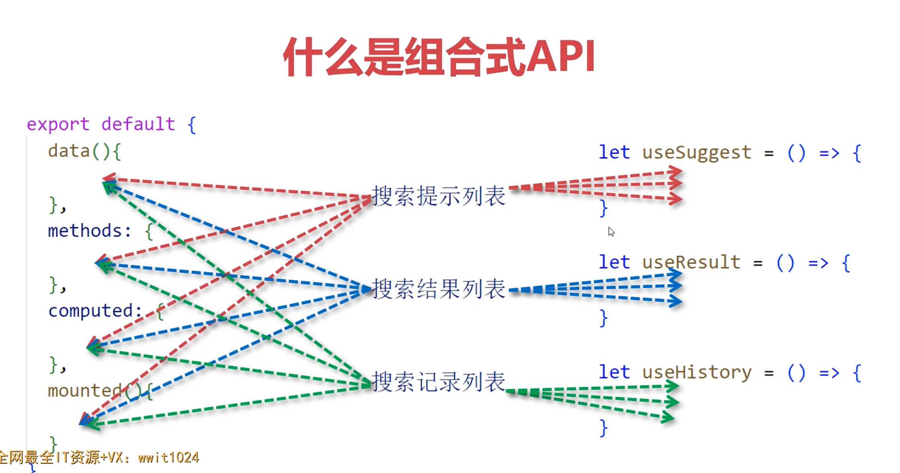

## setup方法与script setup及ref响应式

### **setup方法**

```vue
<template>
  <div>
    <h2>setup方法</h2>
    {{ count }}
  </div>
</template>

<script>
export default {
  setup () {
    let count = 0;

    return {
      count
    }
  }
}
</script>

<style lang="scss" scoped>

</style>
```

### setup属性


```vue
<template>
  <div>
    <h2 ref="elem">setup属性方式</h2>
    {{ count }}
  </div>
</template>

<script setup>

/* let count = 0;

setTimeout(()=>{
  count += 1;
}, 1000)
 */

import { ref } from 'vue';

let count = ref(0);   // count -> { value: 0 }
let elem = ref();

setTimeout(()=>{
  //count += 1;   //✖
  count.value += 1;   // ✔
  
  console.log( elem.value );   //拿到对应的原生DOM元素
}, 1000)

</script>

<style lang="scss" scoped>

</style>

<script>

/* let a = 1;
let b = a;
b += 3;
a  ->  1 

let c = [1,2,3];
let d = c;
d.push(4);
c -> [1,2,3,4] */


</script>
```

## 事件方法 计算属性 reactive toRefs


```vue
<template>
  <div>
    <button @click="handleChange">点击</button>
    {{ count }}, {{ doubleCount }}
  </div>
</template>

<script setup>
import { computed, ref } from 'vue';

let count = ref(0);
let doubleCount = computed(()=> count.value * 2) //计算机属性同步响应式更新数据

let handleChange = () => { 
  count.value += 1;
};
</script>

<style lang="scss" scoped>

</style>
```

### reactive ，toRefs 响应式对象转换和普通对象的转换


对象，数组

```vue
<template>
  <div>
    <h2>reactive</h2>
    {{ state.count }}, {{ count }}
  </div>
</template>

<script setup>
//import { reactive, toRefs, toRef } from 'vue';
import { reactive, toRef } from 'vue';


let state = reactive({ //对象，数组
  count: 0,
  message: 'hi vue'
})

//let { count } = toRefs(state);   //  let count = ref(0) 将reactive转成ref，同时被结构出来的count的响应也是和state绑定在一起的
let count = toRef(state, 'count'); // 不同的解构法

setTimeout(() => {
  //state.count += 1;
  count.value += 1;
}, 1000)

</script>

<style lang="scss" scoped>

</style>

```

