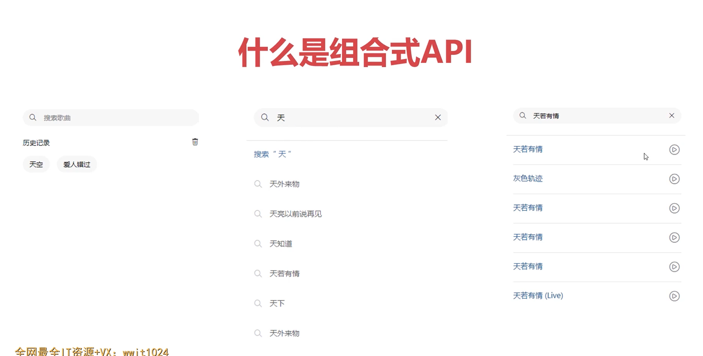
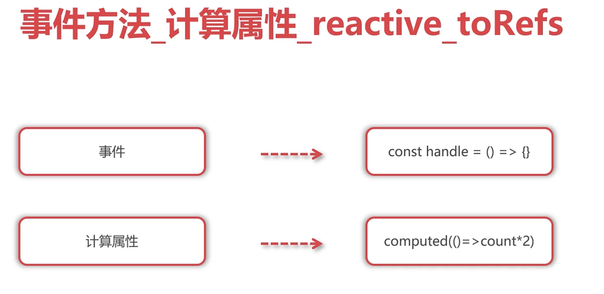
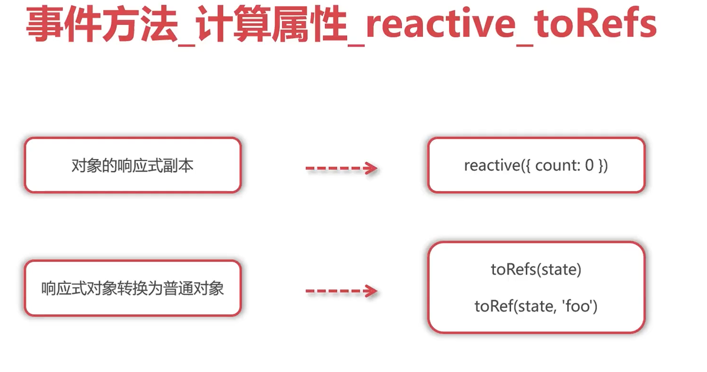

## setup方法与script setup及ref响应式

### **setup方法**

```vue
<template>
  <div>
    <h2>setup方法</h2>
    {{ count }}
  </div>
</template>

<script>
export default {
  setup () {
    let count = 0;

    return {
      count
    }
  }
}
</script>

<style lang="scss" scoped>

</style>
```

### setup属性


```vue
<template>
  <div>
    <h2 ref="elem">setup属性方式</h2>
    {{ count }}
  </div>
</template>

<script setup>

/* let count = 0;

setTimeout(()=>{
  count += 1;
}, 1000)
 */

import { ref } from 'vue';

let count = ref(0);   // count -> { value: 0 }
let elem = ref();

setTimeout(()=>{
  //count += 1;   //✖
  count.value += 1;   // ✔
  
  console.log( elem.value );   //拿到对应的原生DOM元素
}, 1000)

</script>

<style lang="scss" scoped>

</style>

<script>

/* let a = 1;
let b = a;
b += 3;
a  ->  1 

let c = [1,2,3];
let d = c;
d.push(4);
c -> [1,2,3,4] */


</script>
```

## 事件方法 计算属性 reactive toRefs



```vue
<template>
  <div>
    <button @click="handleChange">点击</button>
    {{ count }}, {{ doubleCount }}
  </div>
</template>

<script setup>
import { computed, ref } from 'vue';

let count = ref(0);
let doubleCount = computed(()=> count.value * 2) //计算机属性同步响应式更新数据

let handleChange = () => { 
  count.value += 1;
};
</script>

<style lang="scss" scoped>

</style>
```

### reactive ，toRefs 响应式对象转换和普通对象的转换



对象，数组

```vue
<template>
  <div>
    <h2>reactive</h2>
    {{ state.count }}, {{ count }}
  </div>
</template>

<script setup>
//import { reactive, toRefs, toRef } from 'vue';
import { reactive, toRef } from 'vue';


let state = reactive({ //对象，数组
  count: 0,
  message: 'hi vue'
})

//let { count } = toRefs(state);   //  let count = ref(0) 将reactive转成ref，同时被结构出来的count的响应也是和state绑定在一起的
let count = toRef(state, 'count'); // 不同的解构法

setTimeout(() => {
  //state.count += 1;
  count.value += 1;
}, 1000)

</script>

<style lang="scss" scoped>

</style>

```

## 生命周期 watch watchEffect

### 生命周期


多了on

**实例演示：**

- onBeforeMount在DOM完成之前触发，也就是获取到的DOM还没被定义
- onMount在DOM完成后触发，才能够获得DOM的值
- 同一个生命周期可以多拆分来写

```vue
<template>
  <div>
    <h2>生命周期</h2>
    <div ref="elem">{{ count }}</div>
  </div>
</template>

<script setup>
/* import { onBeforeMount, onMounted, ref } from 'vue';

let count = ref(0);
let elem = ref();

onBeforeMount(()=>{
  console.log( count.value );
  console.log( elem.value );
});

onMounted(()=>{
  console.log( count.value );
  console.log( elem.value );
});
 */

import { onMounted, ref } from 'vue';

let count = ref(0);
let elem = ref();

onMounted(()=>{
  console.log( count.value );
});

onMounted(()=>{
  console.log( count.value );
});

onMounted(()=>{
  console.log( count.value );
});

</script>

<style lang="scss" scoped>

</style>
```

### watch watchEffect


主要目的是监听响应式函数的变化，重新应用副作用就是自己定义的函数

#### watchEffect

**示例代码：**

```vue
<template>
  <div>
    <h2>watchEffect</h2>
    <div ref="elem">{{ count }}</div>
  </div>
</template>

<script setup>
import { ref, watchEffect } from 'vue';


let count = ref(0);
let elem = ref();

//1. 一开始会初始触发一次，然后所依赖的数据发生改变的时候，才会再次触发
//2. 触发的时机是数据响应后，DOM更新前，通过flush: 'post' 修改成DOM更新后的时机进行触发
//3. 返回结果是一个stop方法，可以停止watchEffect的监听
//4. 提供一个形参，形参主要就是用于清除上一次的行为
// const stop = watchEffect(()=>{
//   console.log(count.value);
// }, {
//   flush: 'post'
// })

// setTimeout(()=>{
//   stop();
// }, 1000)

// setTimeout(()=>{
//   count.value += 1;
// }, 2000)


watchEffect((cb)=>{
  console.log(count.value);
  cb(()=>{
    //更新前触发和卸载前触发，目的：清除上一次的行为(停止上一次的ajax，清除上一次的定时器)
    console.log('before update');
  })
})

setTimeout(()=>{
  count.value += 1;
}, 2000)
</script>

<style lang="scss" scoped>

</style>
```

#### watch

- 只希望改变的时候触发就用watch
- 更具体地说明什么状态应该触发侦听器重新运行
- 访问侦听状态变化前后的值

```vue
<template>
  <div>
    <h2>watch</h2>
  </div>
</template>

<script setup>
import { ref, watch } from 'vue';


let count = ref(0);

watch(count, (newVal, oldVal) => {
  console.log(newVal, oldVal);
})

setTimeout(()=>{
  count.value = 1;
}, 2000)
</script>

<style lang="scss" scoped>

</style>
```

## 跨组件通信方案provide inject（推荐用于注册全局属性）


:api-key="key"  :的意思是绑定动态信息

provide和inject都能双向修改数据，但不推荐那么干,最好是在传递出去的组件触发修改

可以使用函数进行修改更符合开发

也可以直接指定传递的参数是只读的 readonly(count)

如果想要全局都能接收到：

```js
// main.js
import { createApp } from 'vue'
import App from './App.vue'

// 创建应用实例
const app = createApp(App)

// 应用向根组件 App 中注入一个 property
app.provide('user', 'administrator')
```

provide：

```vue
<template>
  <div>
    <my-inject></my-inject>
  </div>
</template>

<script setup>

import MyInject from '@/9_inject.vue'
import { provide, ref, readonly } from 'vue'

//provide('count', 0)

//传递响应式数据

let count = ref(0);

let changeCount = () => {
  count.value = 1;
}

provide('count', readonly(count))
provide('changeCount', changeCount)

/* setTimeout(()=>{
  count.value = 1;
}, 2000) */


</script>

<style lang="scss" scoped>

</style>
```

inject：

```vue
<template>
  <div>
    <h2>hello inject</h2>
    <div>{{ count }}</div>
  </div>
</template>

<script setup>

import { inject } from 'vue'

let count = inject('count')
let changeCount = inject('changeCount')
/* setTimeout(()=>{
  count.value = 1;
}, 2000) */

setTimeout(()=>{
  changeCount();
}, 2000);

</script>

<style lang="scss" scoped>

</style>
```

## 复用组件功能之use函数

为了更好的组合代码，可以创建统一规范的use函数，从而抽象可复用的代码逻辑

js： 将函数装成模块

```js
import { computed, ref } from 'vue';
function useCounter(num){ //统一规范use开头的就是对组合式api的复用,同时也可以接收传参
  let count = ref(num);
  let doubleCount = computed(()=> count.value * 2 ); 
  return { //返回回去作为值
    count,
    doubleCount
  }
}

export default useCounter;
```

vue：

```vue
<template>
  <div>
    <h2>use函数</h2>
    <div>{{ count }}, {{ doubleCount }}</div>
  </div>
</template>

<script setup>

import useCounter from '@/compotables/useCounter.js'

let { count, doubleCount } = useCounter(123);

setTimeout(()=>{
  count.value += 1;
}, 2000);
</script>

<style lang="scss" scoped>

</style>
```

## 利用defineProps与defineEmits进行组件通信

**父:**

```vue
<template>
  <div>
    <h2>父子通信</h2>
    <my-child :count="0" message="hello world" @custom-click="handleClick"></my-child>
  </div>
</template>

<script setup>
import MyChild from '@/12_child.vue'

let handleClick = (data) => {
  console.log(data);
};
</script>

<style lang="scss" scoped>

</style>
```

**子:**

```vue
<template>
  <div>
    <h2>hi child, {{ count }}, {{ message }}</h2>
  </div>
</template>

<script setup>

import { defineProps, defineEmits } from 'vue'
//接收传递过来的参数
const state = defineProps({   // defineProps -> 底层 -> reactive响应式处理的
  count: {
    type: Number
  },
  message: {
    type: String
  }
});                          

console.log( state.count, state.message ); //可以这样直接获得他们的值,因为defineProp的底层是reactive响应式处理的

const emit = defineEmits(['custom-click']);

setTimeout(()=>{
  emit('custom-click', '子组件的数据'); //触发事件和传递参数
}, 2000)

</script>

<style lang="scss" scoped>

</style>
```

## 利用组合式API开发复杂的搜索功能


解决前后端跨域问题，配置跨域信息（反向代理）：

vue.config.js:

```js
const { defineConfig } = require('@vue/cli-service')
module.exports = defineConfig({
  transpileDependencies: true,
  runtimeCompiler: true,
  devServer: {
    proxy: {
      '/api': { //反向代理信息
        target: 'http://localhost:3000',
        changeOrigin: true,   
        pathRewrite: {
          '^/api': ''
        }
      }
    }
  }
})
```

**注释:**

```javascript
// devServer配置项用于配置开发服务器
devServer: {
  proxy: {
    '/api': { // 反向代理信息，匹配以/api开头的请求
      target: 'http://localhost:3000', // 目标服务器的URL
      changeOrigin: true,  // 是否改变请求的源地址
      pathRewrite: {
        '^/api': '' // 路径重写，将请求路径中的/api替换为空
      }
    }
  }
}
```

这段注释是针对`devServer`配置项中的反向代理设置的解释。它说明了以下几个主要配置项的作用：

- `proxy`：配置反向代理规则的对象。
- `/api`：匹配以/api开头的请求路径。
- `target`：目标服务器的URL，即将请求转发到的后端服务器的地址。
- `changeOrigin`：是否改变请求的源地址，在开发环境中通常设置为`true`，用于解决跨域问题。
- `pathRewrite`：路径重写规则，将请求路径中的/api替换为空，以适应目标服务器的路由规则。

通过配置这些选项，开发服务器将会拦截以/api开头的请求，并将它们转发到http://localhost:3000，同时也会改变请求的源地址为开发服务器的地址。另外，路径重写规则可用于适应后端服务器的路由规则。

### 代码实现

字符串拼接： axios.get(`/api/search?keywords=${searchWord.value}`)

v-model双向绑定

一个事件调用两个方法：`@keydown.enter="handleToResult($event), handleAddHistory($event)"`

```vue
<template>
  <div class="search-input">
    <i class="iconfont iconsearch"></i>
    <input type="text" placeholder="搜索歌曲" v-model="searchWord" @input="handleToSuggest" @keydown.enter="handleToResult($event), handleAddHistory($event)"> <-- v-model 对输入的文本内容进行绑定 @keydown.enter回车的时候触发事件 -->
    <i v-if="searchWord" @click="handleToClose" class="iconfont iconguanbi"></i>
  </div>
  <template v-if="searchType == 1">
    <div class="search-history">
      <div class="search-history-head">
        <span>历史记录</span>
        <i class="iconfont iconlajitong" @click="handleToClear"></i>
      </div>
      <div class="search-history-list">
        <div v-for="item in historyList" :key="item" @click="handleItemResult(item)">{{ item }}</div>
      </div>
    </div>
  </template>
  <template v-else-if="searchType == 2">
    <div class="search-result">
      <div class="search-result-item" v-for="item in resultList" :key="item.id">
        <div class="search-result-word">
          <div>{{ item.name }}</div>
        </div>
        <i class="iconfont iconbofang"></i>
      </div>
    </div>
  </template>
  <template v-else-if="searchType == 3">
    <div class="search-suggest">
      <div class="search-suggest-head">搜索“ {{ searchWord }} ”</div>
      <div class="search-suggest-item" v-for="item in suggestList" :key="item.id" @click="handleItemResult(item.name), handleAddHistory(item.name)">
        <i class="iconfont iconsearch"></i>{{ item.name }}
      </div>
    </div>
  </template>
</template>

<script setup>
import { ref } from 'vue';
import axios from 'axios';
import '@/assets/iconfont/iconfont.css';

function useSearch(){
  let searchType = ref(1);
  let searchWord = ref('');
  let handleToClose = () => {
    searchWord.value = '';
    searchType.value = 1;
  };
  return {
    searchType,
    searchWord,
    handleToClose
  }
}

function useSuggest(){
  let suggestList = ref([]);
  let handleToSuggest = () => {
    if(searchWord.value){
      searchType.value = 3;
      axios.get(`/api/search/suggest?keywords=${searchWord.value}`).then((res)=>{
        let result = res.data.result;
        if(!result.order){
          return;
        }
        let tmp = [];
        for(let i=0;i<result.order.length;i++){
          tmp.push(...result[result.order[i]]);
        }
        suggestList.value = tmp;
      })
    }
    else{
      searchType.value = 1;
    }
  };
  return {
    suggestList,
    handleToSuggest
  }
}

function useResult(){
  let resultList = ref([]);
  let handleToResult = () => {
    if(!searchWord.value){
      return;
    }
    axios.get(`/api/search?keywords=${searchWord.value}`).then((res)=>{
      let result = res.data.result;
      if(!result.songs){
        return;
      }
      searchType.value = 2;
      resultList.value = result.songs;
    })
  };
  let handleItemResult = (name) => {
    searchWord.value = name;
    handleToResult();
  };
  return {
    resultList,
    handleToResult,
    handleItemResult
  }
}

function useHistory(){
  let key = 'searchHistory';
  let getSearchHistory = () => {
    return JSON.parse(localStorage.getItem(key) || '[]');
  };
  let setSearchHistory = (list) => {
    localStorage.setItem(key, JSON.stringify(list));
  };
  let clearSearchHistory = () => {
    localStorage.removeItem(key);
  };
  let historyList = ref(getSearchHistory());
  let handleAddHistory = (arg) => {
    if(!searchWord.value){
      return;
    }
    if(typeof arg === 'string'){
      searchWord.value = arg;
    }
    historyList.value.unshift(searchWord.value);
    historyList.value = [...new Set(historyList.value)];
    setSearchHistory(historyList.value);
  };
  let handleToClear = () => {
    clearSearchHistory();
    historyList.value = [];
  };
  return {
    historyList,
    handleAddHistory,
    handleToClear
  };
}

let { searchType, searchWord, handleToClose } = useSearch();
let { suggestList, handleToSuggest } = useSuggest();
let { resultList, handleToResult, handleItemResult } = useResult();
let { historyList, handleAddHistory, handleToClear } = useHistory();

</script>

<style>
.search-input{ display: flex; align-items: center; height:35px; margin:35px 15px 25px 15px; background:#f7f7f7; border-radius: 25px;}
.search-input i{ margin:0 13px;}
.search-input input{ flex:1; font-size:14px; border:none; background:#f7f7f7; outline: none;}

.search-history{ margin:0 15px 25px 15px; font-size:14px;}
.search-history-head{ display: flex; justify-content: space-between; margin-bottom:18px;}
.search-history-list{ display: flex; flex-wrap: wrap;}
.search-history-list div{ padding:8px 14px; border-radius: 20px; margin-right:15px; margin-bottom: 15px; background:#f7f7f7;}

.search-result{ border-top:1px #e4e4e4 solid; padding:15px;}
.search-result-item{ display: flex; justify-content: space-between; align-items: center; padding-bottom: 15px; margin-bottom: 15px; border-bottom:1px #e4e4e4 solid;}
.search-result-word div:nth-child(1){ font-size:16px; color:#235790; margin-bottom: 6px;}
.search-result-word div:nth-child(2){ font-size:14px; color:#898989;}
.search-result-item i{ font-size:30px; color:#878787;}

.search-suggest{ border-top:1px #e4e4e4 solid; padding:15px; font-size:14px;}
.search-suggest-head{ color:#4574a5; margin-bottom:37px;}
.search-suggest-item{ color:#5d5d5d; margin-bottom:37px;}
.search-suggest-item i{ color:#bdbdbd; margin-right:14px; position: relative; top:1px;}
</style>
```

实际上，`$event` 是一个传递给事件处理方法的数据对象，它提供了一系列属性和方法，你可以根据需要来使用。对于键盘事件来说，常用的属性包括：

- `key`：按下的键对应的字符值
- `keyCode` 或 `code`：按下的键的编码
- `target`：触发事件的 DOM 元素

例如，在 `handleToResult` 和 `handleAddHistory` 方法中，你可以使用 `$event.key` 或 `$event.code` 来获取按下的键的字符值或编码。

`<i>` 标签是 HTML 中的内联元素，用于表示斜体文本。它通常用于强调或着重某个词语或短语。在 HTML 中，`<i>` 标签的内容会以斜体样式显示，但实际的样式取决于浏览器和 CSS 的设置。

虽然 `<i>` 标签在过去常被用于表示斜体文本，但根据 HTML5 规范的更新，`<i>` 标签的语义已经改变。现在，`<i>` 标签被视为一个“无语义”的标签

所以经常可以拿来内嵌图片

### template嵌套

在 Vue.js 中，可以使用 `<template>` 标签来嵌套模板代码块。 `<template>` 标签是一个虚拟的容器，它不会被渲染到 DOM 中，只用于包裹和组织代码。

在你提供的代码中，使用了三个 `<template>` 标签来进行条件渲染。这样可以根据不同的条件来展示不同的内容。在 Vue 组件中，使用 `v-if` 或 `v-else-if` 指令来根据条件进行模板的渲染和显示。

具体来说，在你的代码中：
- 第一个 `<template v-if="searchType == 1">` 标签表示如果 `searchType` 的值等于 1，就会渲染出历史记录相关的模板内容。
- 第二个 `<template v-else-if="searchType == 2">` 标签表示如果 `searchType` 值等于 2，就会渲染出搜索结果相关的模板内容。
- 第三个 `<template v-else-if="searchType == 3">` 标签表示如果 `searchType` 值等于 3，就会渲染出搜索建议相关的模板内容。

使用 `<template>` 标签嵌套的主要目的是提高代码的可读性和组织性，同时也可以在某些情况下避免使用多个根节点的限制。在 `<template>` 标签内部，可以编写任何合法的 HTML 代码，并且可以绑定 Vue.js 的指令和表达式。

希望这个解答对你有帮助！如有任何其他问题，请随时提问。在 Vue.js 中，可以使用 `<template>` 标签来嵌套模板代码块。 `<template>` 标签是一个虚拟的容器，它不会被渲染到 DOM 中，只用于包裹和组织代码。

在你提供的代码中，使用了三个 `<template>` 标签来进行条件渲染。这样可以根据不同的条件来展示不同的内容。在 Vue 组件中，使用 `v-if` 或 `v-else-if` 指令来根据条件进行模板的渲染和显示。

具体来说，在你的代码中：
- 第一个 `<template v-if="searchType == 1">` 标签表示如果 `searchType` 的值等于 1，就会渲染出历史记录相关的模板内容。
- 第二个 `<template v-else-if="searchType == 2">` 标签表示如果 `searchType` 值等于 2，就会渲染出搜索结果相关的模板内容。
- 第三个 `<template v-else-if="searchType == 3">` 标签表示如果 `searchType` 值等于 3，就会渲染出搜索建议相关的模板内容。

使用 `<template>` 标签嵌套的主要目的是提高代码的可读性和组织性，同时也可以在某些情况下避免使用多个根节点的限制。在 `<template>` 标签内部，可以编写任何合法的 HTML 代码，并且可以绑定 Vue.js 的指令和表达式。


