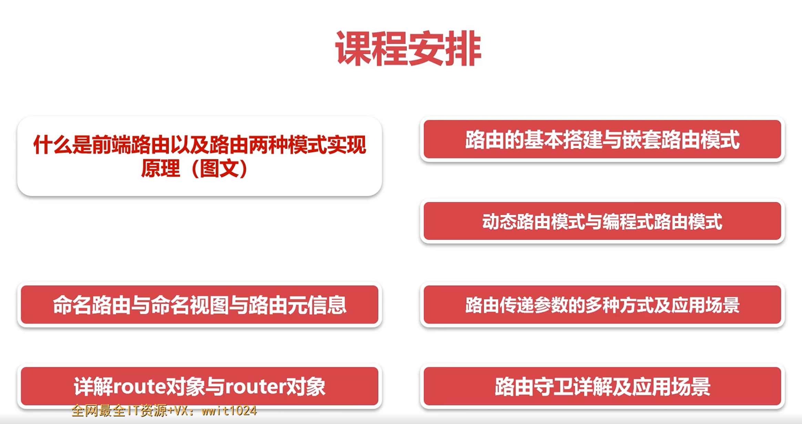

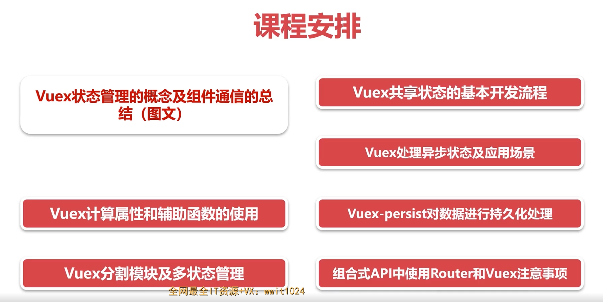

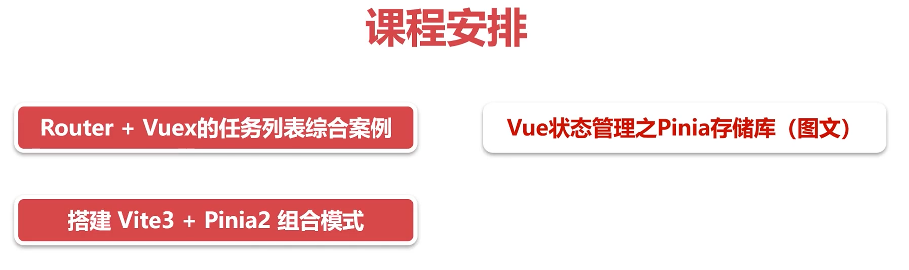

## 什么是前端路由以及路由两种模式实现原理

路由的概念来源于服务端，在服务端中路由描述的是 URL 与处理函数之间的映射关系，当然也会处理不同的URL来展示不同的视图界面。

随着Ajax的盛行，无刷新交互成为了当下的主流，我们更希望在无刷新的情况下完成不同URL来展示不同的视图界面，即在一个页面中完成路由的切换（俗称：单页面应用开发SPA），这就是前端路由。

那么如何做到在一个页面中完成URL与UI的映射关系呢？一般我们有两种实现方案：

1. hash模式
2. history模式

### hash模式

hash 是 URL 中 hash (#) 及后面的那部分，常用作锚点在页面内进行导航，改变 URL 中的 hash 部分不会引起页面刷新。我们通过 hashchange 事件来监听 hash 值的改变，这样就可以显示不同的UI内容，示例代码如下：

```html 
<body>
  <ul>
    <!-- 定义路由 -->
    <li><a href="#/home">home</a></li>
    <li><a href="#/about">about</a></li>
    <!-- 渲染路由对应的 UI -->
    <div id="routerView"></div>
  </ul>
</body>
<script>
window.addEventListener('hashchange', onHashChange)
onHashChange()
function onHashChange () {
  switch (location.hash) {
    case '#/home':
      routerView.innerHTML = 'Home'
      break;
    case '#/about':
      routerView.innerHTML = 'About'
      break;
  }
}
</script>
```

### history模式

history对象提供了pushState方法和popstate事件，pushState方法可以让URL发生改变但并不会引起页面的刷新，而popstate事件则用来监听URL改变的值，这样就可以显示不同的UI内容，示例代码如下：

```html
<body>
  <ul>
    <!-- 定义路由 -->
    <li><a href="/home">home</a></li>
    <li><a href="/about">about</a></li>
    <!-- 渲染路由对应的 UI -->
    <div id="routerView"></div>
  </ul>
</body>
<script>
let linkList = document.querySelectorAll('a[href]')
for(let i=0;i<linkList.length;i++){
    linkList[i].addEventListener('click', function(e){
      e.preventDefault()
      history.pushState(null, '', this.getAttribute('href'))
      onPopState()
    })
}
window.addEventListener('popstate', onPopState)
onPopState()
function onPopState () {
  switch (location.pathname) {
    case '/home':
      routerView.innerHTML = 'Home'
      break;
    case '/about':
      routerView.innerHTML = 'About'
      break;
  }
}
</script>
```

注意：以上代码要在服务器环境下运行，才会生效。

这种history模式存在一个问题，那就是当刷新页面的时候就会出现找不到页面的情况，即：`Cannot GET /home`。这主要是因为history模式的URL地址跟普通的URL地址没有任何区别，刷新的时候服务器会去找相关的资源，我们在服务器上根本就没有这个资源，就会出现找不到的现象。

解决这个问题，你需要做的就是在你的服务器上添加一个简单的回退路由。如果 URL 不匹配任何静态资源，它应提供与你的应用程序中的 `index.html` 相同的页面。漂亮依旧!

下面是nginx服务器实现的示例：

```ng
location / {
  try_files $uri $uri/ /index.html;
}
```

Vue框架给我们提供了一个第三方的路由框架，即：`vue-router`，官网地址：https://router.vuejs.org/zh/index.html。`vue-router`提供了两种路由模式，可自由选择，而且在开发阶段，脚手架还帮我们处理了history找不到页面的情况。

## 路由的基本搭建与嵌套路由模式

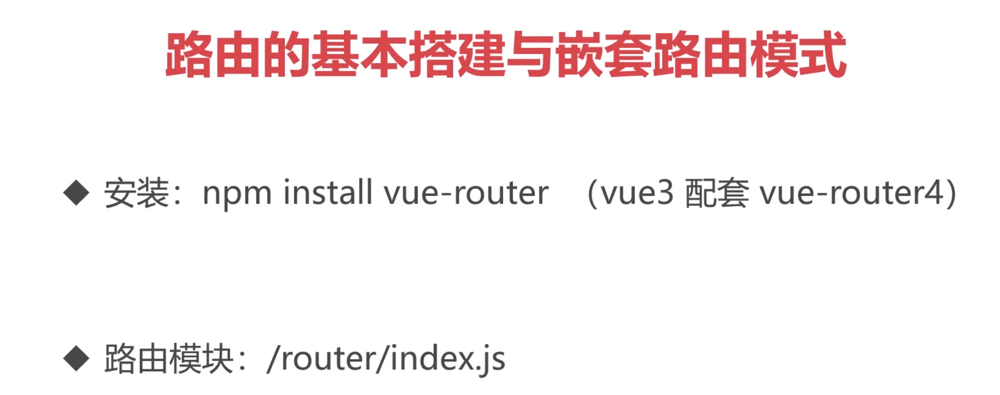

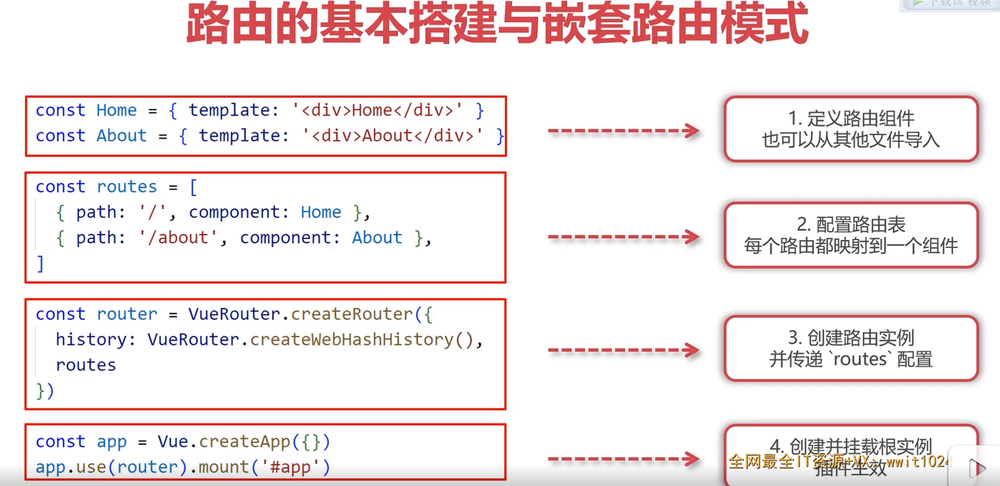

### router-Link，router-view 和多级路由

使用router-link进行页面跳转

  <router-link to="/">首页</router-link> | 

  <router-link to="/about">关于</router-link>

 使用<router-view></router-view>对页面进行显示，可以嵌套在任意组件中

```js

import Home from '@/views/Home.vue'
import About from '@/views/About.vue'
import Foo from '@/views/Foo.vue'
import Bar from '@/views/Bar.vue'
import Baz from '@/views/Baz.vue'
import { createRouter, createWebHistory } from 'vue-router';

const routes = [
  {
    path: '/',
    component: Home
  },
  {
    path: '/about',  //加了/就是绝对路径
    component: About,
    children: [
      {
        path: 'foo/:id', 
        name: 'foo', 
        component: Foo,
        meta: { auth: true },
        /* beforeEnter(to, from, next){
          if(to.meta.auth){
            next('/');
          }
          else{
            next();
          }
        } */
      },
      {
        path: 'bar', //没有加/就是相对于父路径的路径，也就是/about/bar，如果加了/，就是/bar
        name: 'bar',
        components: {
          default: Bar,
          baz: Baz
        },
        meta: { auth: false },
        /* beforeEnter(to, from, next){
          if(to.meta.auth){
            next('/');
          }
          else{
            next();
          }
        } */
      }
    ]
  }
];

const router = createRouter({
  history: createWebHistory(),
  routes
})

/* router.beforeEach((to, from, next)=>{
  //console.log(to, from);
  if(to.meta.auth){
    next('/');
  }
  else{
    next();
  }
}) */

export default router;
```

## 动态路由模式与编程式路由模式

### 动态式路由


改成动态路由：

```js
   {
        path: 'foo/:id',  //改成动态路由
        name: 'foo', 
        component: Foo,
        meta: { auth: true },
        /* beforeEnter(to, from, next){
          if(to.meta.auth){
            next('/');
          }
          else{
            next();
          }
        } */
      }
```

在对应跳转的组件中能拿到动态的id：

```vue
<template>
<div>
about foo {{ $route.params.id }}</div>
</template>
```

#### router-link插槽

```vue
  <div>
      <router-link to="/about/foo/123" custom v-slot="{navigate}"> <-- navigate关联跳转功能，还有更多的用法可以看官网 -->
        <button @click="navigate">Foo 123</button> <!-- 使用点击事件关联跳转 -->
      </router-link> | 
      <router-link to="/about/foo/456" custom v-slot="{navigate}">
        <button @click="navigate">Foo 456</button>
      </router-link>
    </div>
```


### 编程式路由

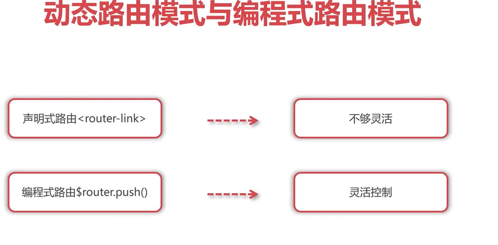

需要在js中实现路由跳转的时候使用

```vue
<template>
<button @click="handleToBar">Bar</button> 
</template>
<script setup>
import { useRouter } from 'vue-router';

const handleToBar = () => {
  const router = useRouter();
  router.push('/about/bar');
};
</script>
```

## 命名路由与命名视图与路由元信息

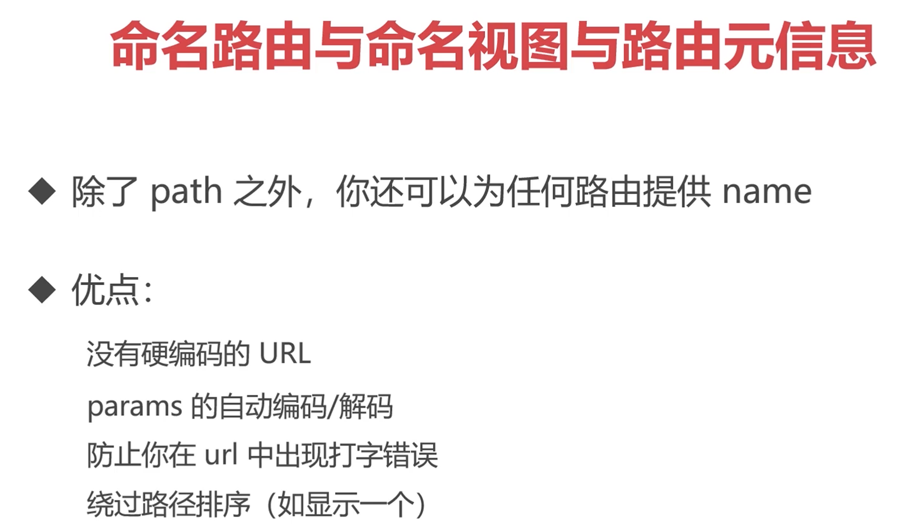

### 命名路由

使得可以直接通过路由名进行跳转

给路由命名：

```js
{
        path: 'bar',
        name: 'bar',
        components: {
          default: Bar,
          baz: Baz
        },
```

跳转：

```vue
  <router-link :to="{name:'bar'}">bar</router-link>
```

使用动态id的方式：

```vue
  <router-link :to="{ name: 'bar', params:{ id: 123 }}">bar</router-link>
```

### 命名视图

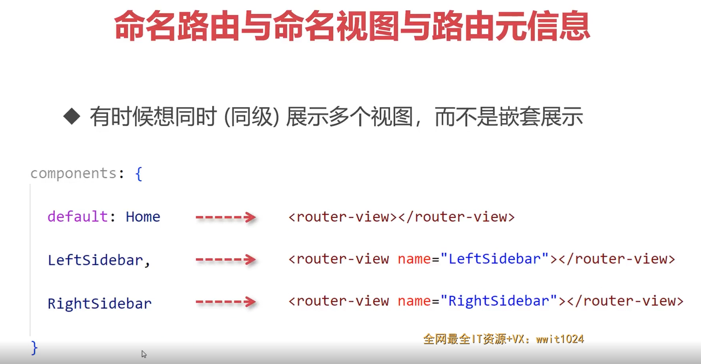

### 路由元信息

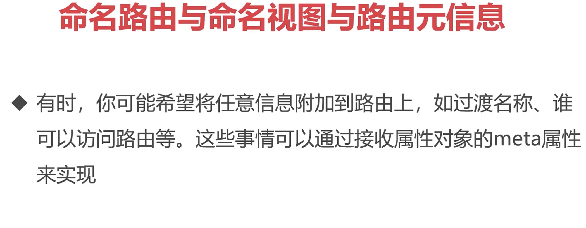

可以定义权限之类的信息

```js
 {
        path: 'foo/:id',
        name: 'foo',
        component: Foo,
        meta: { auth: true },
      },
      {
        path: 'bar',
        name: 'bar',
        components: {
          default: Bar,
          baz: Baz
        },
        meta: { auth: false },
      }
    ]
  }
```

拿到传递的信息权限


## 路由传递参数的多种方式及应用场景

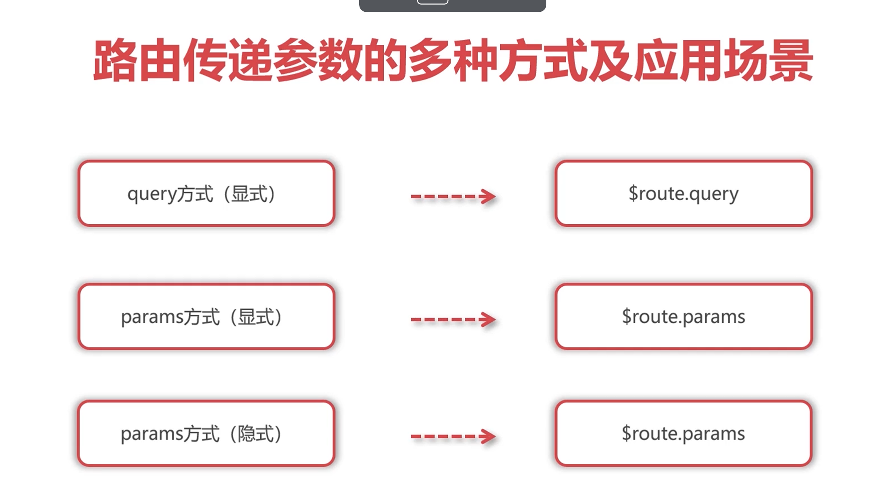

query开发，params动态显示，也可以混合使用

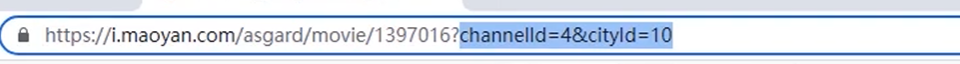

既有quer又有params

**示例**

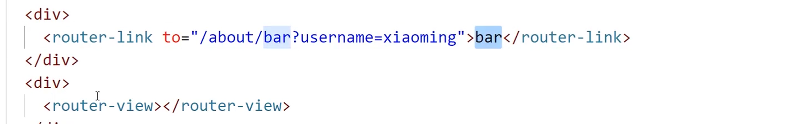

**拿到query数据**

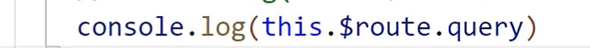

**有name的传递方式**

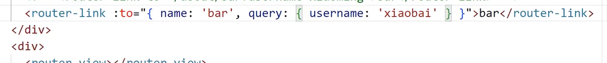

**隐式params传递方式**

缺点：一刷新就拿不到数据了

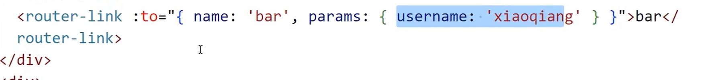

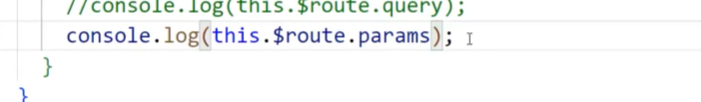

## 详解route对象与router对象

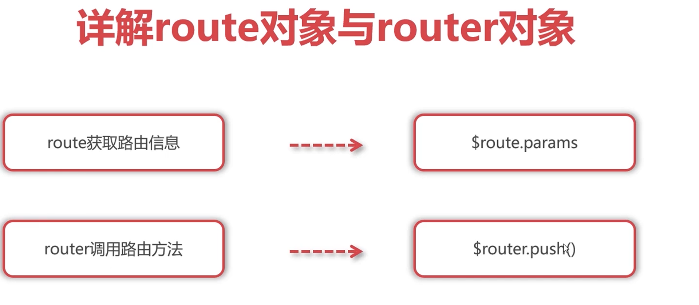

## 路由守卫详解及应用场景

就是为了判断用户权限

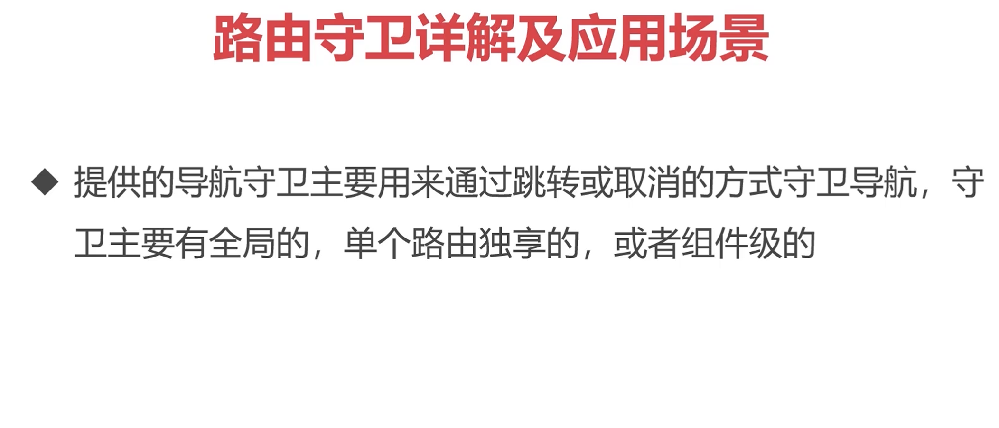

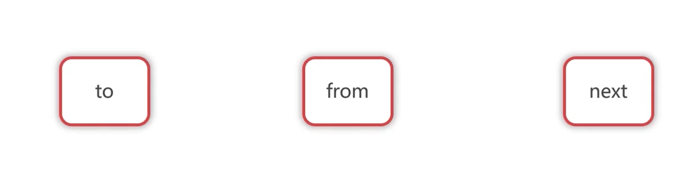

to：去哪里  from:从哪里来 next：下一步是直接进入到页面还是说跳转到哪里

### 全局守卫示例

index.js

```js
 router.beforeEach((to, from, next)=>{
  //console.log(to, from);//to和from都是一个route对象
  if(to.meta.auth){
    next('/'); //指定的跳转
  }
  else{
    next(); //默认的跳转
  }
}) 
```

### 指定的路由守卫

```js
  {
        path: 'foo/:id',
        name: 'foo',
        component: Foo,
        meta: { auth: true },
         beforeEnter(to, from, next){ //进入前的路由守卫
          if(to.meta.auth){
            next('/');
          }
          else{
            next();
          }
        } 
      },
```

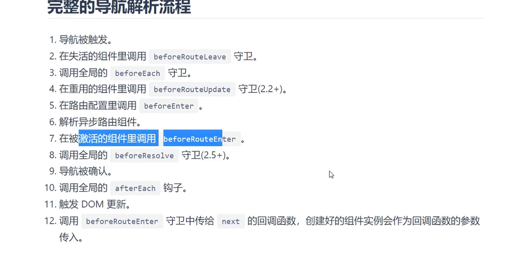

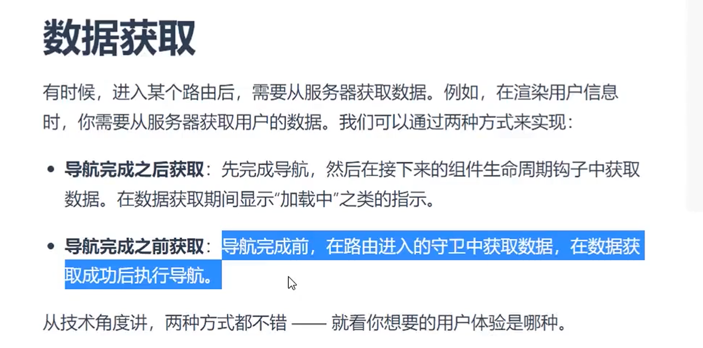

## Vuex共享状态的基本开发流程

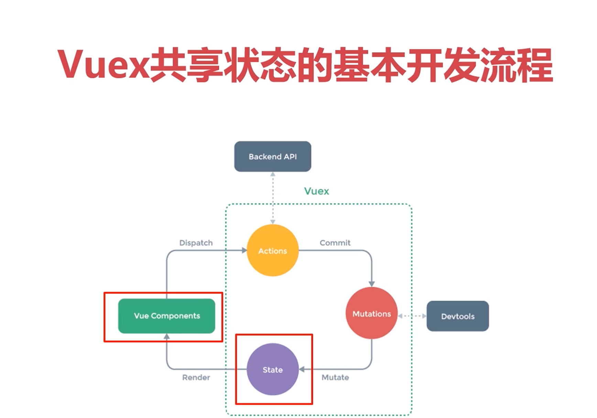

![img](http://bjbgp01.baidupcs.com/file/b41766866hbce1ac9b262cee272b43f0?bkt=en-2a4ba40c42c88fab185ed357d5eabff7e323a5d1ec46589081696f0998cd4332a60c5a40596dff9ff86d1297a35b172f7dcac51eefe5b26f0996c49456ce2554&fid=1918744029-250528-1047452418230017&time=1707621826&sign=FDTAXUVbGERQlBHSKfWqi-DCb740ccc5511e5e8fedcff06b081203-Yv3LjXUu1bgAfwAzDgw%2FpDGdlOo%3D&to=14&size=403757&sta_dx=403757&sta_cs=0&sta_ft=png&sta_ct=6&sta_mt=4&fm2=MH%2CBaoding%2CAnywhere%2C%2C%E5%B9%BF%E4%B8%9C%2Cany&ctime=1681714685&mtime=1706260076&resv0=-1&resv1=0&resv2=rlim&resv3=5&resv4=403757&vuk=1918744029&iv=2&htype=&randtype=&tkbind_id=0&newver=1&newfm=1&secfm=1&flow_ver=3&pkey=en-e90896f89b3ec2d326011d8680760fe6526d19b54f7a747ebf0fe3612d6451665660111899960b738d24bbc90d904b6c2f3370a8dc0305a5305a5e1275657320&expires=8h&rt=pr&r=488652991&vbdid=3927424499&fin=6-9+Vuex%E7%8A%B6%E6%80%81%E7%AE%A1%E7%90%86%E7%9A%84%E6%A6%82%E5%BF%B5%E5%8F%8A%E7%BB%84%E4%BB%B6%E9%80%9A%E4%BF%A1%E7%9A%84%E6%80%BB%E7%BB%93_%E5%85%A8%E7%BD%91%E6%9C%80%E5%85%A8IT%E8%B5%84%E6%BA%90%2BVX%EF%BC%9Awwit1024.png&rtype=1&dp-logid=2873025335933015518&dp-callid=0.1&tsl=0&csl=0&fsl=-1&csign=wP8tNWsTsSq5YS0KwyJweFDzcbY%3D&so=1&ut=1&uter=0&serv=0&uc=1559654663&ti=c77e04c9862927e5853ee79ced824577eedf5ca184f0950f305a5e1275657320&hflag=30&from_type=3&adg=a_740fc7ddcab07d101c322d244693e45a&reqlabel=25571201_f_e8402644c58167f038b7a978f23738d5_-1_9ccbc4e5c25ff5e9fd5cb6002cf86fa2&chkv=3&fpath=%E7%AC%AC6%E7%AB%A0+VueRouter%E8%B7%AF%E7%94%B1%E4%B8%8EVuex%E7%8A%B6%E6%80%81%E7%AE%A1%E7%90%86+-+%E7%BB%84%E7%BB%87%E4%B8%8E%E6%9E%B6%E6%9E%84%E5%BA%94%E7%94%A8&by=themis)

初始化Vuex

index.js

```js
import { createstore }from "vuex"
const store = createstore({
});
export default store; 
```

然后在app.vue用use引入

具体写法和使用：

```js
import { createStore } from "vuex";
import VuexPersistence from 'vuex-persist';
import message from '@/store/modules/message'

// 创建一个 Vuex 持久化实例，用于将状态持久化到本地存储中
const vuexLocal = new VuexPersistence({
  storage: window.localStorage, // 使用浏览器本地存储作为存储方式
  reducer: (state) => ({count: state.count}) // 只持久化 count 状态
})

// 创建 Vuex store 实例
const store = createStore({
  state: {
    count: 0 // 初始状态为 0
  },
  actions: {
    // 异步操作，通过 context 对象与 mutations 进行通信
    change(context, payload){
      setTimeout(()=>{
        context.commit('change', payload) // 提交一个名为 'change' 的 mutation，并传递 payload 参数
      }, 1000) // 延迟 1 秒执行，异步
    }
  },
  mutations: {
    // 修改状态的同步操作
    change(state, payload){
      /* setTimeout(()=>{ //这里不能做异步，异步用actions，因为这里数据跟踪不上
        state.count++;
      }, 1000) */
      state.count += payload; // 将传递的 payload 加到 count 状态上
    }
  },
  getters: {
    // 计算属性，返回 state 中 count 值的两倍
    doubleCount(state){
      return state.count * 2;
    }
  },
  plugins: [vuexLocal.plugin], // 将持久化插件添加到 Vuex 中，以实现状态持久化
  modules: {
    message // 引入名为 message 的模块
  }
});

export default store; // 导出 Vuex store 实例供其他模块使用
```

使用：

```vue
<template>
  <div>
    <!-- 点击按钮并触发 change 方法，参数为 5 -->
    <button @click="change(5)">点击</button>
    <!-- 显示 count 和 doubleCount 的值 -->
    hello home, {{ count }}, {{ doubleCount }}
  </div>
</template>

<script>
  import { mapState, mapGetters, mapActions } from 'vuex';
  export default {
    name: 'HomeView',
    methods: {
      /**
      * 处理点击事件的方法
      */
      handleClick(){
        // 调用 Vuex 的 mutation 方法 change 来更改 state 的值
        this.$store.commit('change');
        // 调用 Vuex 的 action 方法 change 来异步更改 state 的值
        this.$store.dispatch('change', 5);
      },
      /**
      * 使用 mapActions 辅助函数将 change 方法映射到组件的 methods 中
      */
      ...mapActions(['change'])
    },
    computed: {
      /**
      * 使用 mapState 辅助函数将 count 属性映射到组件的 computed 中
      */
      count(){
        // 返回 Vuex 中的 state 的 count 值
        return this.$store.state.count
      },
      /**
      * 使用 mapGetters 辅助函数将 doubleCount 属性映射到组件的 computed 中
      */
      doubleCount(){
        // 返回 Vuex 中的 getter 的 doubleCount 值
        return this.$store.getters.doubleCount;
      },
      /**
      * 使用 mapState 辅助函数将 count 属性映射到组件的 computed 中
      */
      ...mapState(['count']),
      /**
      * 使用 mapGetters 辅助函数将 doubleCount 属性映射到组件的 computed 中
      */
      ...mapGetters(['doubleCount'])
    }
  }
</script>

<style scoped>
  /* 组件的样式 */
</style>
```

## Vuex处理异步状态及应用场景

```js
  actions: {
    // 异步操作，通过 context 对象与 mutations 进行通信
    change(context, payload){
      setTimeout(()=>{
        context.commit('change', payload) // 提交一个名为 'change' 的 mutation，并传递 payload 参数
      }, 1000) // 延迟 1 秒执行，异步
    }
  },
```

## Vuex计算属性和辅助函数的使用

计算属性:
getters

```js
  getters: {
    // 计算属性，返回 state 中 count 值的两倍
    doubleCount(state){
      return state.count * 2;
    }
  },
```

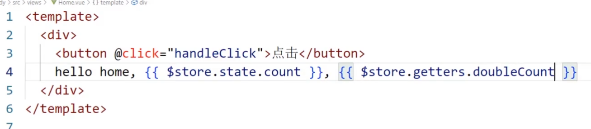
辅助函数:
mapState、mapGetters、mapMutations、mapActions

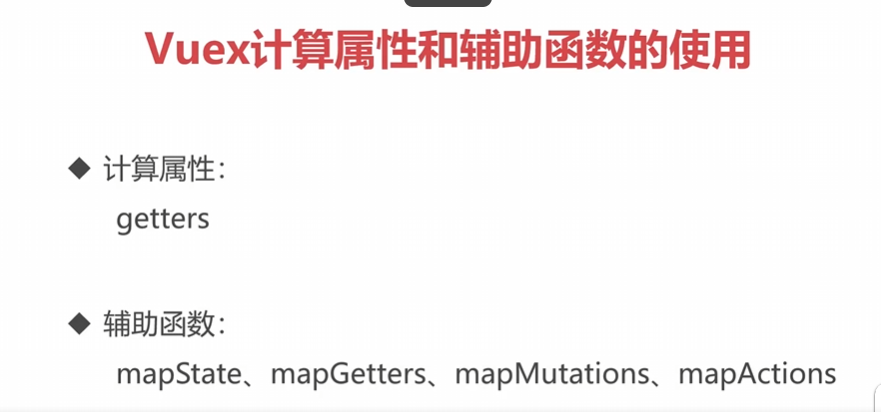

## Vuex-persist对数据进行持久化处理

网页刷新，数据也能够持久化保留

[championswimmer/vuex-persist：一个用于持久化商店的 Vuex 插件。（完全启用 Typescript） (github.com)](https://github.com/championswimmer/vuex-persist)

### Vue CLI 构建设置（使用 Webpack 或一些打包器）

```
npm install --save vuex-persist
```

或

```
yarn add vuex-persist
```

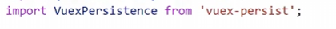

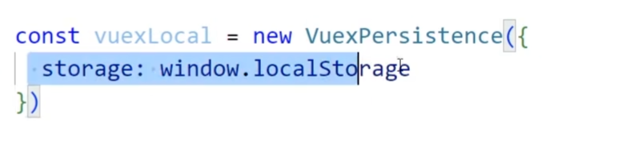

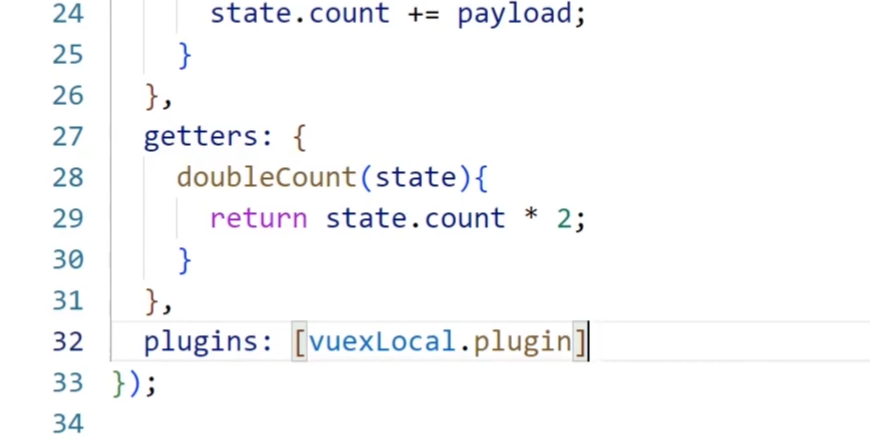

只存储一项：

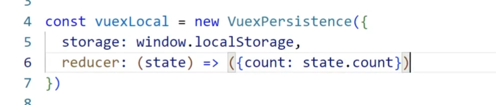

## Vuex分割模块及多状态管理

> 由于使用单一状态树，应用的所有状态会集中到一个比较大的对象。当应用变得非常复杂时，store 对象就有可能变得相当臃肿

将分类的模块写到store/modules当中：

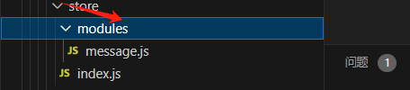

```javascript
// 定义模块的状态
const state = {
  msg: 'hello'
};

// 定义模块的 getter
const getters = {
  upperMsg(state) {
    // 将 state 中的 msg 属性转换为大写并返回
    return state.msg.toUpperCase();
  }
};

// 定义模块的 action
const actions = {};

// 定义模块的 mutation
const mutations = {
  // change 方法用于改变 state 中的 msg 值
  // 接受两个参数：state 和 payload（负荷，即传入的参数）
  change(state, payload) {
    // 将 state 中的 msg 属性更新为 payload
    state.msg = payload;
  }
};

export default {
  // 开启命名空间，避免命名冲突
  namespaced: true,
  // 导出模块的 state、getters、actions、mutations
  state,
  getters,
  actions,
  mutations
};
```

以上是一个 Vuex 模块的代码，模块名为默认导出（export default）的对象。该模块包含了状态（state）、getter、action 和 mutation 四部分。

- 状态（state）包含一个 msg 属性，初始值为 'hello'。
- Getter 中定义了一个 upperMsg 方法，用于将 msg 属性的值转换为大写。
- Action 和 Mutation 部分暂未定义具体的方法。
- 最后通过 export default 将模块对象导出，其中开启了命名空间（namespaced: true），确保模块的名称不会与全局命名冲突。。

命名空间+/调用

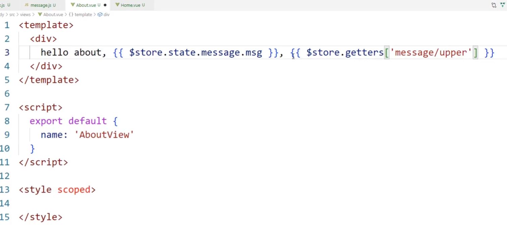

## 组合式API中使用Router和Vuex注意事项

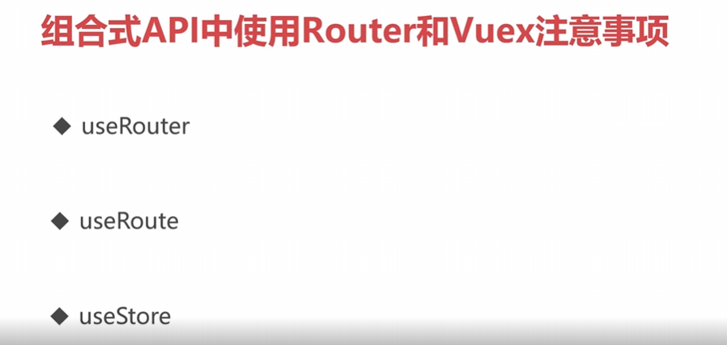

```vue
<template>
  <div>
    <!-- 该组件的模板内容 -->
  </div>
</template>

<script setup>
// 引入需要使用的库和函数
import { defineComponent } from 'vue';
import { useRoute, useRouter } from 'vue-router';
import { useStore } from 'vuex';

// 定义组件
defineComponent({
  // 指定组件的名称
  name: 'CompositionView'
});

// 使用 useRoute 获取当前路由信息
const route = useRoute();
// 使用 useRouter 获取路由实例
const router = useRouter();
// 使用 useStore 获取 Vuex 的 store 实例
const store = useStore();

// 打印当前路由的元信息
console.log(route.meta);
// 打印所有注册的路由
console.log(router.getRoutes());

// 打印 store 中的 count 属性
console.log(store.state.count);
// 打印 store 中的 message 模块下的 msg 属性
console.log(store.state.message.msg);
</script>

<style lang="scss" scoped>
  /* 这里放置组件的样式，使用了 scss 作为预处理器，且样式仅在该组件中生效 */
</style>
```

上述代码是一个 Vue 组件，包含了一个模板、一个 script 和一个样式部分。

- 模板部分定义了一个 `<div>` 标签作为组件的根元素。您可以在其中编写组件的内容。
- script 部分使用了 `script setup` 语法，它是 Vue 3 中的新特性，可以简化组件的代码编写。其中使用了 `import` 语句引入了 `defineComponent`（用于定义组件）、`useRoute`（用于获取当前路由信息）、`useRouter`（用于获取路由实例）和 `useStore`（用于获取 Vuex 的 store 实例）这几个函数。

  - 在 `defineComponent` 中通过 `name` 属性定义了组件的名称为 "CompositionView"。
  - 使用 `useRoute()` 获取当前路由信息，将结果赋值给 `route` 变量。
  - 使用 `useRouter()` 获取路由实例，将结果赋值给 `router` 变量。
  - 使用 `useStore()` 获取 Vuex 的 store 实例，将结果赋值给 `store` 变量。
  - 之后打印了一些信息，比如当前路由的元信息、所有注册的路由、store 中的 `count` 属性和 `message` 模块下的 `msg` 属性。

- 样式部分使用了 `lang="scss"` 指定了样式预处理器为 `scss`，并添加了 `scoped` 属性，使样式仅对当前组件生效。

注：上述代码中的 `console.log` 可能不能正常输出结果，因为在组件的 setup 部分使用 `console.log` 可能会导致作用域不一致的问题。如果需要输出结果，请在具体的方法中使用 `console.log`。

## Router + Vuex的任务列表综合案例

todo.vue

```vue
<template>
  <div>
    <ul>
      <!-- 使用v-for指令遍历todoList中的每个项目 -->
      <li v-for="item in todoList" :key="item.id" :class="{ through: item.isChecked }">
        <!-- 使用v-model指令将复选框的选中状态绑定到item.isChecked -->
        <input type="checkbox" v-model="item.isChecked"> {{ item.task }}
      </li>
    </ul>
  </div>
</template>

<script setup>
import { computed, defineComponent } from 'vue';
import { useStore } from 'vuex';

defineComponent({
  name: 'TodoView'
});

// 使用useStore函数访问vuex store
const store = useStore();

// 定义一个计算属性 "todoList"，它返回store中的状态 "todoList"
const todoList = computed(()=> store.state.todoList)

</script>

<style scoped>
/* 这个作用域内没有提供任何样式 */
</style>
```

给路由加样式：

```vue
<template>
  <h2>任务列表</h2>
  <div>
    <!-- 使用v-model指令将输入框的值绑定到msg变量 -->
    <input v-model="msg" type="text"><button @click="handleAdd">添加</button>
  </div>
  <!-- 使用router-link组件创建导航链接 -->
  <router-link to="/todo">所有任务</router-link> | 
  <router-link to="/complete">已完成任务</router-link> |
  <router-link to="/incomplete">未完成任务</router-link> 
  <!-- 使用router-view组件来渲染对应的路由组件 -->
  <router-view></router-view>
</template>

<script setup>
import { ref } from 'vue';
import { useStore } from 'vuex';

// 使用useStore函数访问vuex store
let store = useStore();
// 使用ref函数创建一个响应式的变量msg，初始值为空字符串
let msg = ref('');

// 定义一个函数handleAdd，用于处理添加任务的操作
let handleAdd = () => {
  // 调用store的commit方法，触发名为'add'的mutation，并传递msg.value作为参数
  store.commit('add', msg.value)
  // 将msg的值重置为空字符串
  msg.value = '';
}

</script>

<style>
/* 使用样式选择器.router-link-active来设置选中导航链接的样式 */
.router-link-active{
  background: red;
  color: white;
}

/* 使用样式选择器.through来设置已完成任务的样式 */
.through{
  text-decoration: line-through;
}
</style>
```

## 搭建 Vite3 + Pinia2 组合模式

##  pinia 的使用

### 1.1 pinia 是什么

在 vue 2.x 中，*vuex* 是官方的状态管理库，并且 vue 3 中也有对应的 *vuex* 版本。但 vue 作者尤大神看了 *pinia* 后，强势推荐使用 *pinia* 作为状态管理库。下图是 vue 官网 “生态系统”，*pinia* 是 vue 生态之一。

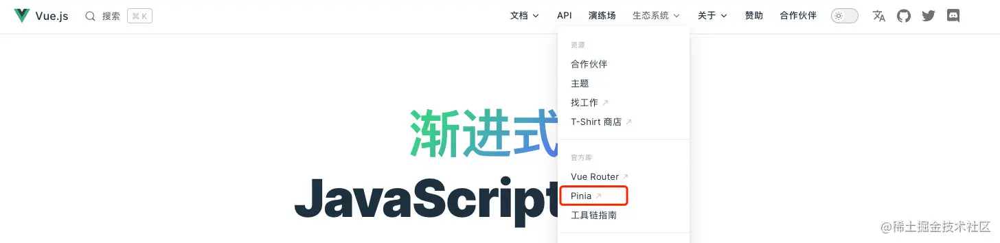

### 1.2 pinia 的特点

1. 支持 vue2 和 vue3，两者都可以使用 *pinia*；
2. 语法简洁，支持 vue3 中 *setup* 的写法，不必像 *vuex* 那样定义 *state*、*mutations*、*actions*、*getters* 等，可以按照 *setup* *Composition API*  的方式返回状态和改变状态的方法，实现代码的扁平化；
3. 支持 vuex 中 *state*、*actions*、*getters* 形式的写法，丢弃了 *mutations*，开发时候不用根据同步异步来决定使用 *mutations* 或 *actions*，pinia 中只有 *actions*；
4. 对 *TypeScript* 支持非常友好。

```
npm create vite@latest vite pinia-study
```

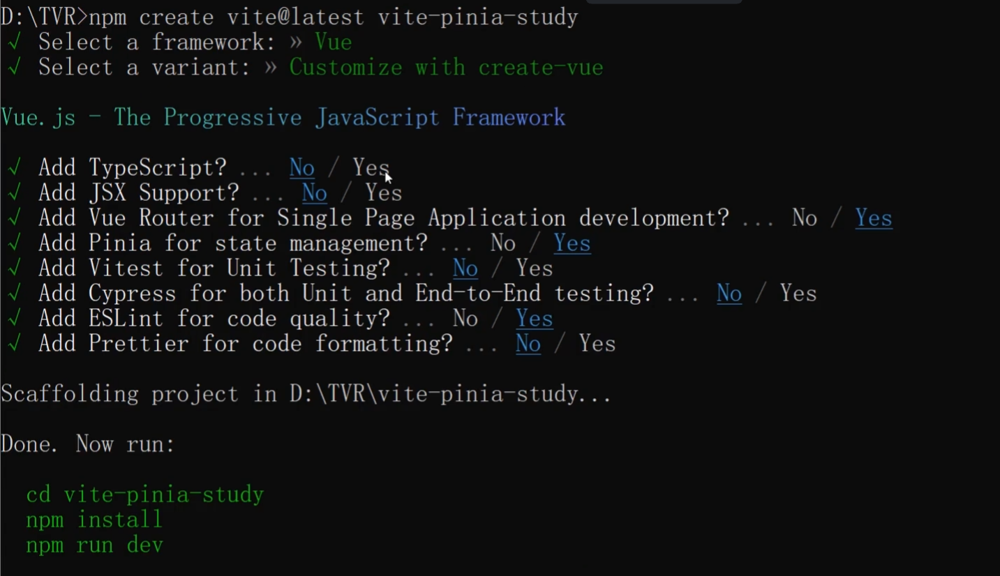

只需要在stores建模块就行了

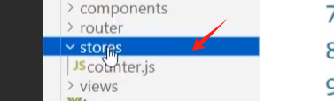

### 挂载Pinia

```javascript
import { createApp } from 'vue'
import { createPinia } from 'pinia'

import App from './App.vue'
import router from './router'

import './assets/main.css'

// 创建Vue应用程序实例
const app = createApp(App)

// 在应用程序中使用Pinia
app.use(createPinia())

// 在应用程序中使用Vue Router
app.use(router)

// 将应用程序挂载到具有id为'app'的DOM元素上
app.mount('#app')
```

这段代码使用Vue 3和Pinia库创建了一个Vue应用程序，并将Pinia和Vue Router集成到应用程序中。详细注释如下：

```javascript
import { createApp } from 'vue'
import { createPinia } from 'pinia'

import App from './App.vue' // 导入根组件App
import router from './router' // 导入路由配置

import './assets/main.css' // 导入样式

// 创建Vue应用程序实例
const app = createApp(App)

// 在应用程序中使用Pinia
app.use(createPinia())

// 在应用程序中使用Vue Router
app.use(router)

// 将应用程序挂载到具有id为'app'的DOM元素上
app.mount('#app')
```

### 使用Pinia

counter.js:

```js
import { ref, computed } from 'vue'
import { defineStore } from 'pinia'

// 使用 defineStore 函数定义名为 "counter" 的 store
export const useCounterStore = defineStore('counter', () => {
  // 创建名为 count 的响应式变量
  const count = ref(0)

  // 创建一个计算属性 doubleCount，它是 count 的两倍
  const doubleCount = computed(() => count.value * 2)

  // 定义增加 count 的方法
  function increment() {
    // 两秒后增加 count
    setTimeout(() => {
      count.value++
    }, 2000)
  }

  // 返回 count、doubleCount 和 increment 方法，使它们可以在组件中使用
  return { count, doubleCount, increment }
})
```

message.js

```js
import { ref, computed } from 'vue'
import { defineStore } from 'pinia'

export const useMessageStore = defineStore('message', () => {
  const msg = ref('hello')
  const upperMsg = computed(() => msg.value.toUpperCase())
  function change(payload) {
    msg.value = payload;
  }

  return { msg, upperMsg, change }
})

```

使用：

```vue
<script setup>
// 导入Vue Router中的RouterLink和RouterView
import { RouterLink, RouterView } from 'vue-router'
// 导入HelloWorld组件
import HelloWorld from './components/HelloWorld.vue'

// 导入counter和message store相关的钩子函数
import { useCounterStore } from './stores/counter';
import { useMessageStore } from './stores/message';
// storeToRefs函数用于将store转换为响应式对象
import { storeToRefs } from 'pinia';

// 使用counter store和message store的钩子函数来创建对应的存储对象
const counterStore = useCounterStore();
const messageStore = useMessageStore();

// 使用storeToRefs将counterStore和messageStore中的属性转换为响应式对象
const { count, doubleCount } = storeToRefs(counterStore);
const { msg, upperMsg } = storeToRefs(messageStore);

// handleClick函数用于处理点击事件
const handleClick = () => {
  // 调用counterStore中的increment方法
  counterStore.increment();
  // 调用messageStore中的change方法，并传入'hi'作为参数
  messageStore.change('hi');
};
</script>

<template>
  <!-- 页面头部 -->
  <header>
    <!-- 点击按钮，绑定handleClick函数 -->
    <button @click="handleClick">点击</button>
    <!-- 显示count、doubleCount、msg和upperMsg -->
    {{ count }}, {{ doubleCount }}, {{ msg }}, {{ upperMsg }}

    <!-- Vue logo图片 -->
    

    <!-- 包裹HelloWorld组件和导航链接的wrapper -->
    <div class="wrapper">
      <HelloWorld msg="You did it!" />

      <!-- 导航链接 -->
      <nav>
        <RouterLink to="/">Home</RouterLink>
        <RouterLink to="/about">About</RouterLink>
      </nav>
    </div>
  </header>

  <!-- 渲染对应的路由组件 -->
  <RouterView />
</template>

<style scoped>
/* scoped样式只作用于当前组件 */

/* 页面头部样式 */
header {
  line-height: 1.5;
  max-height: 100vh;
}

/* logo样式 */
.logo {
  display: block;
  margin: 0 auto 2rem;
}

/* 导航样式 */
nav {
  width: 100%;
  font-size: 12px;
  text-align: center;
  margin-top: 2rem;
}

/* 激活状态导航链接样式 */
nav a.router-link-exact-active {
  color: var(--color-text);
}

nav a.router-link-exact-active:hover {
  background-color: transparent;
}

/* 导航链接样式 */
nav a {
  display: inline-block;
  padding: 0 1rem;
  border-left: 1px solid var(--color-border);
}

nav a:first-of-type {
  border: 0;
}

/* 媒体查询样式 */
@media (min-width: 1024px) {
  header {
    display: flex;
    place-items: center;
    padding-right: calc(var(--section-gap) / 2);
  }

  .logo {
    margin: 0 2rem 0 0;
  }

  header .wrapper {
    display: flex;
    place-items: flex-start;
    flex-wrap: wrap;
  }

  nav {
    text-align: left;
    margin-left: -1rem;
    font-size: 1rem;

    padding: 1rem 0;
    margin-top: 1rem;
  }
}
</style>
```

