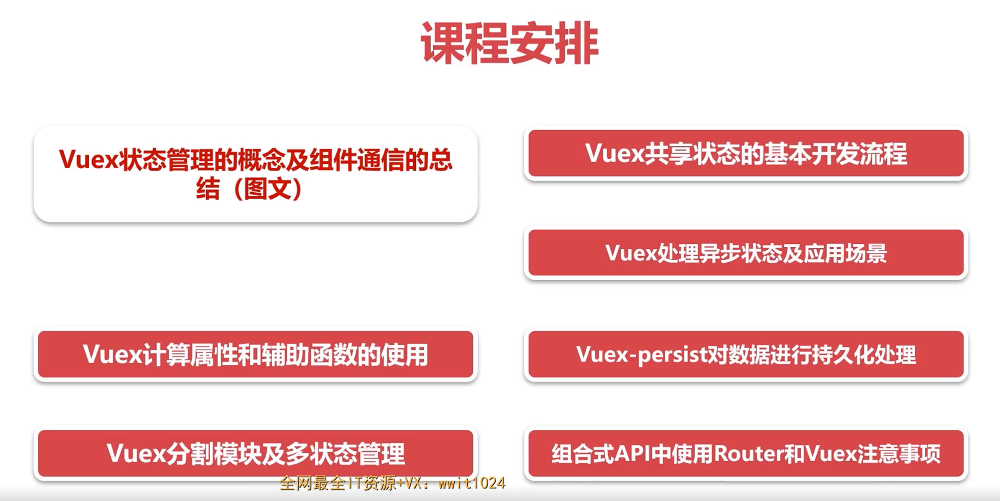
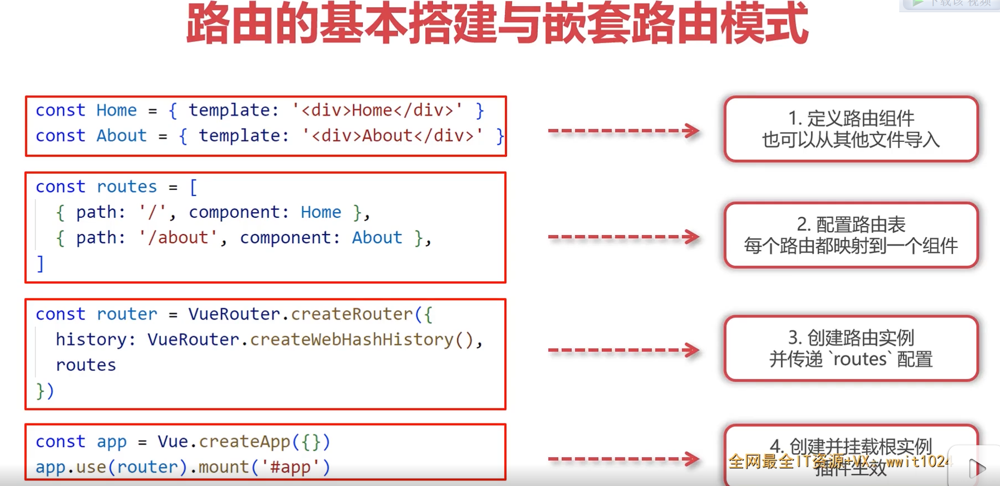
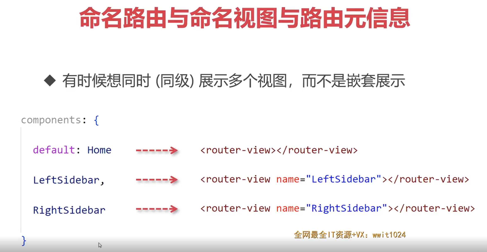
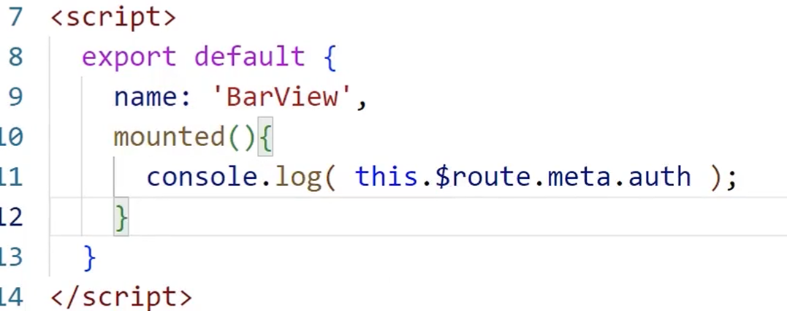
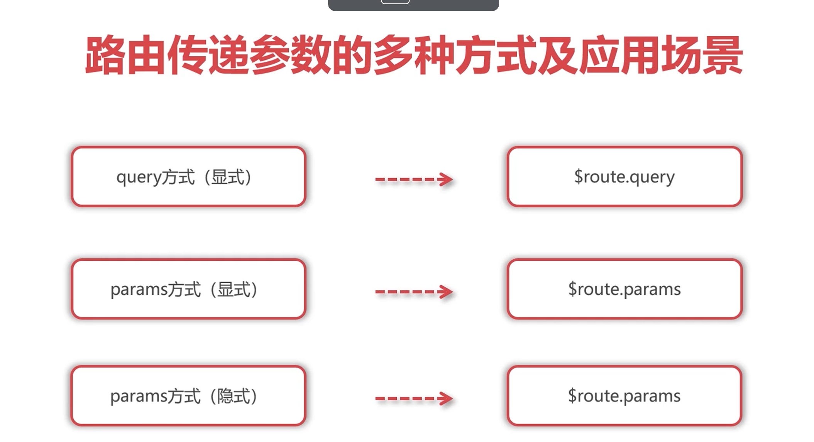
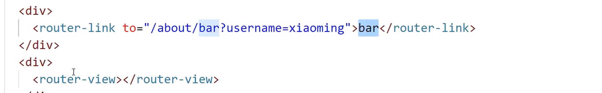
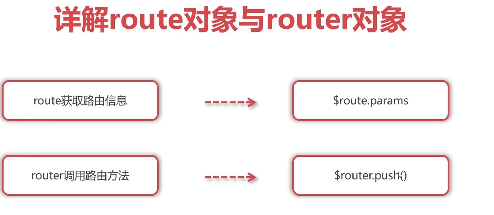
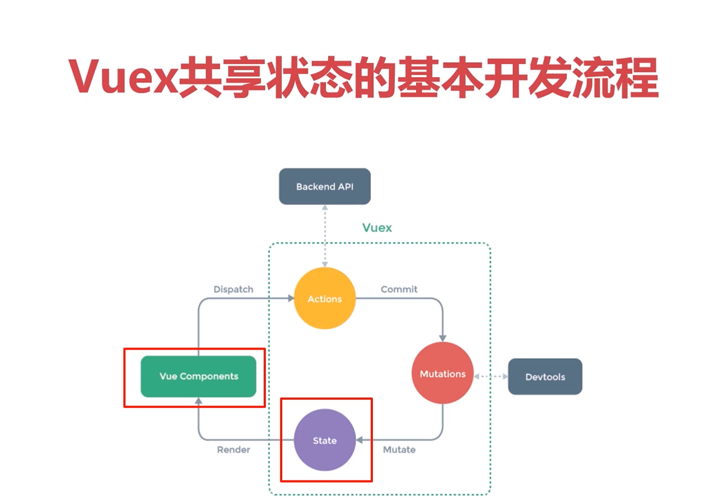

## 什么是前端路由以及路由两种模式实现原理

路由的概念来源于服务端，在服务端中路由描述的是 URL 与处理函数之间的映射关系，当然也会处理不同的URL来展示不同的视图界面。

随着Ajax的盛行，无刷新交互成为了当下的主流，我们更希望在无刷新的情况下完成不同URL来展示不同的视图界面，即在一个页面中完成路由的切换（俗称：单页面应用开发SPA），这就是前端路由。

那么如何做到在一个页面中完成URL与UI的映射关系呢？一般我们有两种实现方案：

1. hash模式
2. history模式

### hash模式

hash 是 URL 中 hash (#) 及后面的那部分，常用作锚点在页面内进行导航，改变 URL 中的 hash 部分不会引起页面刷新。我们通过 hashchange 事件来监听 hash 值的改变，这样就可以显示不同的UI内容，示例代码如下：

```html 
<body>
  <ul>
    <!-- 定义路由 -->
    <li><a href="#/home">home</a></li>
    <li><a href="#/about">about</a></li>
    <!-- 渲染路由对应的 UI -->
    <div id="routerView"></div>
  </ul>
</body>
<script>
window.addEventListener('hashchange', onHashChange)
onHashChange()
function onHashChange () {
  switch (location.hash) {
    case '#/home':
      routerView.innerHTML = 'Home'
      break;
    case '#/about':
      routerView.innerHTML = 'About'
      break;
  }
}
</script>
```

### history模式

history对象提供了pushState方法和popstate事件，pushState方法可以让URL发生改变但并不会引起页面的刷新，而popstate事件则用来监听URL改变的值，这样就可以显示不同的UI内容，示例代码如下：

```html
<body>
  <ul>
    <!-- 定义路由 -->
    <li><a href="/home">home</a></li>
    <li><a href="/about">about</a></li>
    <!-- 渲染路由对应的 UI -->
    <div id="routerView"></div>
  </ul>
</body>
<script>
let linkList = document.querySelectorAll('a[href]')
for(let i=0;i<linkList.length;i++){
    linkList[i].addEventListener('click', function(e){
      e.preventDefault()
      history.pushState(null, '', this.getAttribute('href'))
      onPopState()
    })
}
window.addEventListener('popstate', onPopState)
onPopState()
function onPopState () {
  switch (location.pathname) {
    case '/home':
      routerView.innerHTML = 'Home'
      break;
    case '/about':
      routerView.innerHTML = 'About'
      break;
  }
}
</script>
```

注意：以上代码要在服务器环境下运行，才会生效。

这种history模式存在一个问题，那就是当刷新页面的时候就会出现找不到页面的情况，即：`Cannot GET /home`。这主要是因为history模式的URL地址跟普通的URL地址没有任何区别，刷新的时候服务器会去找相关的资源，我们在服务器上根本就没有这个资源，就会出现找不到的现象。

解决这个问题，你需要做的就是在你的服务器上添加一个简单的回退路由。如果 URL 不匹配任何静态资源，它应提供与你的应用程序中的 `index.html` 相同的页面。漂亮依旧!

下面是nginx服务器实现的示例：

```ng
location / {
  try_files $uri $uri/ /index.html;
}
```

Vue框架给我们提供了一个第三方的路由框架，即：`vue-router`，官网地址：https://router.vuejs.org/zh/index.html。`vue-router`提供了两种路由模式，可自由选择，而且在开发阶段，脚手架还帮我们处理了history找不到页面的情况。

## 路由的基本搭建与嵌套路由模式




### router-Link，router-view 和多级路由

使用router-link进行页面跳转

  <router-link to="/">首页</router-link> | 

  <router-link to="/about">关于</router-link>

 使用<router-view></router-view>对页面进行显示，可以嵌套在任意组件中

```js

import Home from '@/views/Home.vue'
import About from '@/views/About.vue'
import Foo from '@/views/Foo.vue'
import Bar from '@/views/Bar.vue'
import Baz from '@/views/Baz.vue'
import { createRouter, createWebHistory } from 'vue-router';

const routes = [
  {
    path: '/',
    component: Home
  },
  {
    path: '/about',  //加了/就是绝对路径
    component: About,
    children: [
      {
        path: 'foo/:id', 
        name: 'foo', 
        component: Foo,
        meta: { auth: true },
        /* beforeEnter(to, from, next){
          if(to.meta.auth){
            next('/');
          }
          else{
            next();
          }
        } */
      },
      {
        path: 'bar', //没有加/就是相对于父路径的路径，也就是/about/bar，如果加了/，就是/bar
        name: 'bar',
        components: {
          default: Bar,
          baz: Baz
        },
        meta: { auth: false },
        /* beforeEnter(to, from, next){
          if(to.meta.auth){
            next('/');
          }
          else{
            next();
          }
        } */
      }
    ]
  }
];

const router = createRouter({
  history: createWebHistory(),
  routes
})

/* router.beforeEach((to, from, next)=>{
  //console.log(to, from);
  if(to.meta.auth){
    next('/');
  }
  else{
    next();
  }
}) */

export default router;
```

## 动态路由模式与编程式路由模式

### 动态式路由


改成动态路由：

```js
   {
        path: 'foo/:id',  //改成动态路由
        name: 'foo', 
        component: Foo,
        meta: { auth: true },
        /* beforeEnter(to, from, next){
          if(to.meta.auth){
            next('/');
          }
          else{
            next();
          }
        } */
      }
```

在对应跳转的组件中能拿到动态的id：

```vue
<template>
<div>
about foo {{ $route.params.id }}</div>
</template>
```

#### router-link插槽

```vue
  <div>
      <router-link to="/about/foo/123" custom v-slot="{navigate}"> <-- navigate关联跳转功能，还有更多的用法可以看官网 -->
        <button @click="navigate">Foo 123</button> <!-- 使用点击事件关联跳转 -->
      </router-link> | 
      <router-link to="/about/foo/456" custom v-slot="{navigate}">
        <button @click="navigate">Foo 456</button>
      </router-link>
    </div>
```


### 编程式路由


需要在js中实现路由跳转的时候使用

```vue
<template>
<button @click="handleToBar">Bar</button> 
</template>
<script setup>
import { useRouter } from 'vue-router';

const handleToBar = () => {
  const router = useRouter();
  router.push('/about/bar');
};
</script>
```

## 命名路由与命名视图与路由元信息


### 命名路由

使得可以直接通过路由名进行跳转

给路由命名：

```js
{
        path: 'bar',
        name: 'bar',
        components: {
          default: Bar,
          baz: Baz
        },
```

跳转：

```vue
  <router-link :to="{name:'bar'}">bar</router-link>
```

使用动态id的方式：

```vue
  <router-link :to="{ name: 'bar', params:{ id: 123 }}">bar</router-link>
```

### 命名视图



### 路由元信息


可以定义权限之类的信息

```js
 {
        path: 'foo/:id',
        name: 'foo',
        component: Foo,
        meta: { auth: true },
      },
      {
        path: 'bar',
        name: 'bar',
        components: {
          default: Bar,
          baz: Baz
        },
        meta: { auth: false },
      }
    ]
  }
```

拿到传递的信息权限



## 路由传递参数的多种方式及应用场景



query开发，params动态显示，也可以混合使用


既有quer又有params

**示例**



**拿到query数据**


**有name的传递方式**


**隐式params传递方式**

缺点：一刷新就拿不到数据了


## 详解route对象与router对象



## 路由守卫详解及应用场景

就是为了判断用户权限


to：去哪里  from:从哪里来 next：下一步是直接进入到页面还是说跳转到哪里

### 全局守卫示例

index.js

```js
 router.beforeEach((to, from, next)=>{
  //console.log(to, from);//to和from都是一个route对象
  if(to.meta.auth){
    next('/'); //指定的跳转
  }
  else{
    next(); //默认的跳转
  }
}) 
```

### 指定的路由守卫

```js
  {
        path: 'foo/:id',
        name: 'foo',
        component: Foo,
        meta: { auth: true },
         beforeEnter(to, from, next){ //进入前的路由守卫
          if(to.meta.auth){
            next('/');
          }
          else{
            next();
          }
        } 
      },
```


## Vuex共享状态的基本开发流程



初始化Vuex

index.js

```js
import { createstore }from "vuex"
const store = createstore({
});
export default store; 
```

然后在app.vue用use引入

具体写法和使用：

```js
import { createStore } from "vuex";
import VuexPersistence from 'vuex-persist';
import message from '@/store/modules/message'

const vuexLocal = new VuexPersistence({
  storage: window.localStorage,
  reducer: (state) => ({count: state.count})
})

const store = createStore({
  state: {
    count: 0
  },
  actions: {
    change(context, payload){
      setTimeout(()=>{
        context.commit('change', payload)
      }, 1000)
    }
  },
  mutations: {
    change(state, payload){
      /* setTimeout(()=>{
        state.count++;
      }, 1000) */
      state.count += payload;
    }
  },
  getters: {
    doubleCount(state){
      return state.count * 2;
    }
  },
  plugins: [vuexLocal.plugin],
  modules: {
    message
  }
});

export default store;
```

