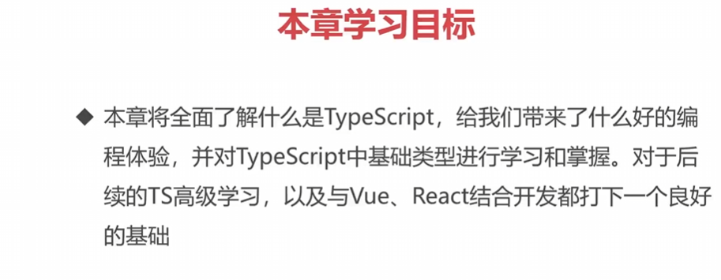
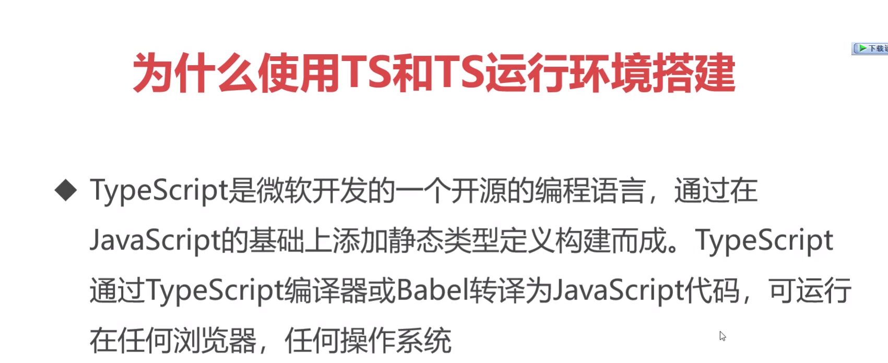
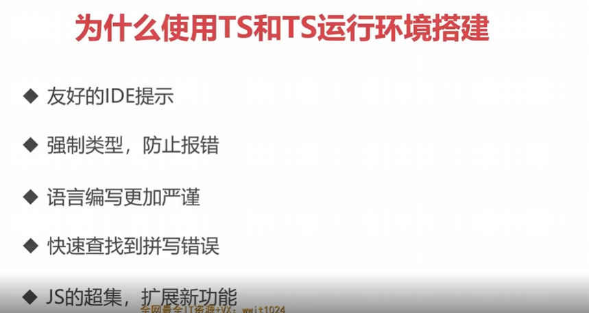
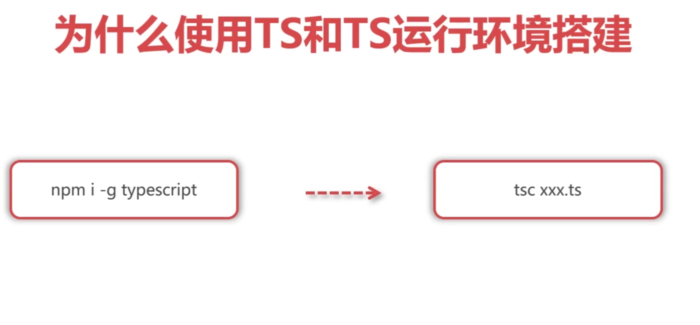
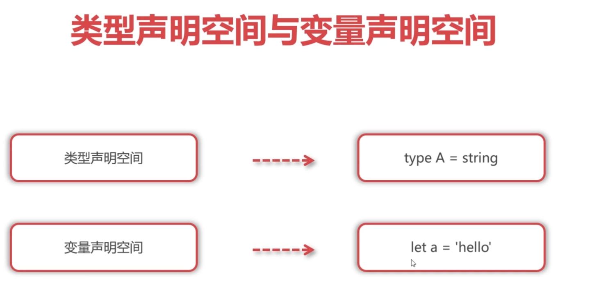
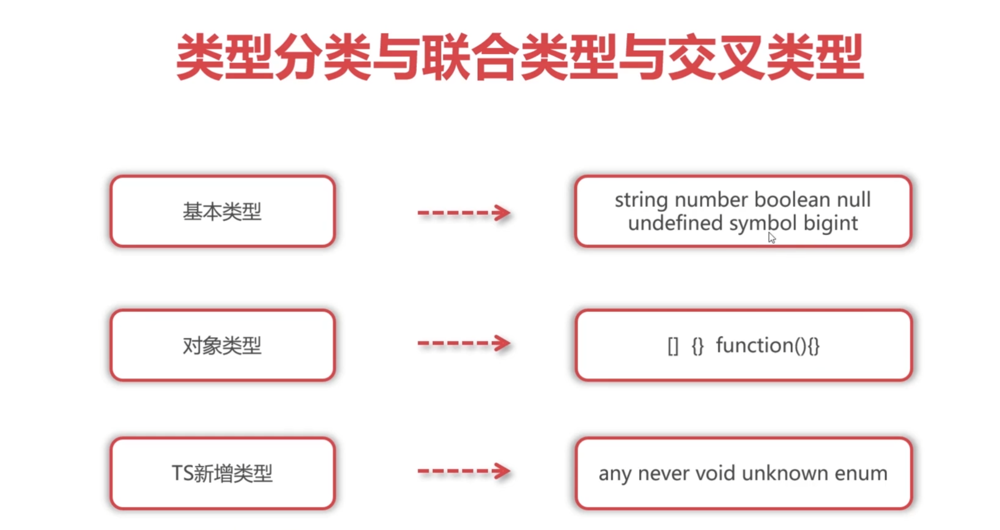
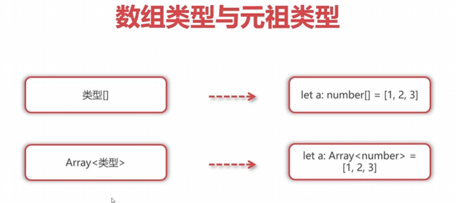
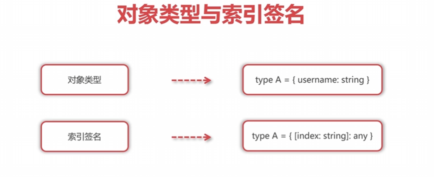
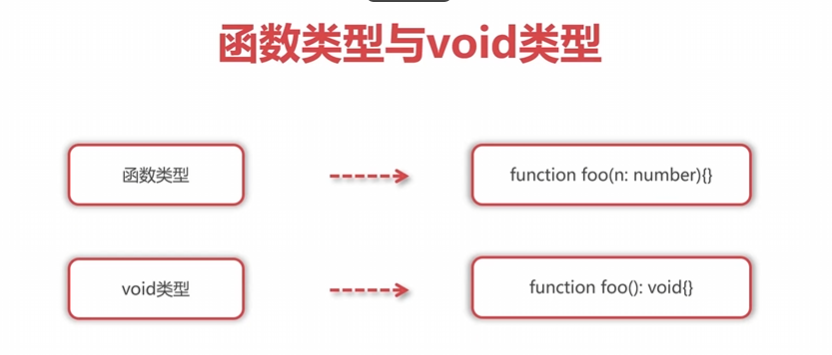

## 为什么使用TS和TS运行环境搭建







2_demo.ts:

```ts
//TS默认是全局环境(就是可以读取目录上的所有文件)，只要文件使用模块化操作那么就会变成局部环境

// 从3_demo模块中导入bar变量
import { bar } from './3_demo'

// 声明一个名为foo的变量，并赋值为321
let foo = 321;

// 打印foo和bar的和
console.log(foo + bar);

// 声明一个变量a并赋值为123
let a = 123;

// 尝试在数值上调用map方法，会导致 TypeScript 报错，因为数字类型没有map方法
a.map(() => {});

// 重新声明变量a并将其赋值为字符串'hello'，会导致 TypeScript 报错，因为变量a已经声明过
let a = 123;
a = 'hello';

// 声明变量a并将其赋值为1
let a = 1;

// 如果条件，但是a不可能既等于1又等于2，该条件永远不会成立,ts会报错
if (a === 1 && a === 2) {}

// 重新声明变量foo会导致 TypeScript 报错，因为变量foo已经声明过
let foo = 123;

// 声明变量a并赋值为一个包含username和age属性的对象
let a = {
  username: 'xiaoming',
  age: 20
}

// 在对象a中访问usename属性，应该是username，将导致 TypeScript 报错
a.usename

// 使用export {}; 将此文件视为模块，以避免变量名称的冲突（模块化）
export {};
```

3_demo.ts:

```ts

以下是您提供的 TypeScript 代码，并为每一行添加了详细的注释：

// 声明一个名为 bar 的变量，并赋值为 123
let bar = 123;

// 导出变量 bar
export {
  bar
};
```

配置文件：


这是一个 TypeScript 配置文件（`tsconfig.json`），它用于指定 TypeScript 编译器的行为和设置。以下是对您提供的配置选项的注释：

```json
{
  "compilerOptions": {
    "skipLibCheck": true,   /* 跳过检查所有 .d.ts 文件的类型。 */
  },
  "include": ["*"]
}
```

- `skipLibCheck`: 将其设置为 `true` 时，TypeScript 编译器将跳过对 `.d.ts` 文件（类型声明文件）的类型检查。通常，这些文件是用于描述在编译过程中使用的外部库的类型。通过设置这个选项为 `true`，编译过程将忽略对这些文件的类型检查，从而可以加快编译速度。请注意，这可能会引入潜在的类型错误，因此需要谨慎使用。

- `include`: 这个配置选项指定要包含在编译过程中的文件或文件夹。在这种情况下，`["*"]` 表示将包含所有源代码文件。

希望这些注释对您理解 TypeScript 配置文件有所帮助。如果您还有其他问题，请随时提问！

## 类型声明空间与变量声明空间



```ts
let a = 'hello';
let b = a;

type A = string;
type B = A;

let c: A = 'hello'; // 修改为c: A来声明变量c的类型为A
type D = typeof c;  // 使用typeof来获取变量c的类型，修改为typeof c

type A = string; // 修改为type B = A来声明一个名为B的类型是A
let a: B = 'hello'; // 修改为let a: B来声明变量a的类型为B

type A = string; // 错误，无法重新声明类型A
let a: A = 'hello'; // 错误，无法重新声明变量a

class Foo {}  // 类在TS中既是变量声明空间，也是类型声明空间
let a: typeof Foo = Foo; // 使用typeof来获取类Foo的类型，同时声明变量a的类型为Foo
type A = typeof Foo; // 使用typeof来获取类Foo的类型，声明类型A是Foo
```

## 类型注解与类型推断

TypeScript中的类型注解和类型推断可以在代码中协同工作，确保变量和值之间的匹配。下面是您提供的代码片段，并附带有相应的注释：

```typescript
// 类型注解
type A = string
let a: A = 'hello'

// 类型注解
let b: string = 'hello'

// 类型注解
type C = string;
let c: C = 'hello'

c = 'hi' // 正确，'c' 的值为字符串
c = true // 错误，'c' 的类型为字符串，不能赋值为布尔值

// 类型推断：TS自动完成类型注解的过程
let d = 'hello'
d = 123; // 错误，'d' 被推断为字符串类型，不能赋值为数值
```

在以上代码中，我们展示了类型注解和类型推断的使用。类型注解是显式地指定变量的类型，而类型推断则是 TypeScript 根据变量的初始值自动推断其类型。在代码中，有助于让开发者清晰地了解变量的预期类型，并在一定程度上提高代码的可读性和稳健性。

## 类型分类与联合类型与交叉类型



```typescript
let a: string = 'hello'; // 声明变量 'a' 的类型为字符串，并赋值为 'hello'
let b: bigint = 1n; // 声明变量 'b' 的类型为 bigint，并赋值为 1n

let c: object = []; // 声明变量 'c' 的类型为对象，并赋值为数组
c = function(){}; // 正确，因为函数也是对象

// 联合类型：类型之间进行或的操作
let d: string | number | boolean = 'hello'; // 声明变量 'd' 的类型为联合类型，可以为 string、number 或 boolean
d = 123; // 正确，'d' 的类型为联合类型，可以赋值为数值类型

// 交叉类型：类型之间进行与的操作
type A = {
  username: string
}
type B = {
  age: number
}

//let e: A | B = { username: 'xiaoming' } // 使用联合类型声明变量 'e'，可以是 A 类型或 B 类型的对象
let e: A & B = { username: 'xiaoming', age: 20 } // 使用交叉类型声明变量 'e'，必须具有 A 类型和 B 类型的属性

```

`bigint` 是 TypeScript 中的一种数字类型，它可以表示非常大的整数。与常规的 `number` 类型不同，`bigint` 可以表示比 `Number.MAX_SAFE_INTEGER` 更大的整数值。

要创建一个 `bigint` 类型的变量，可以使用后缀 `n` 将一个整数字面量标记为 `bigint`。例如：

```typescript
let a: bigint = 123n;
```

在这个例子中，变量 `a` 的类型被指定为 `bigint`，并且赋值为 `123n`。这表示 `a` 是一个 `bigint` 类型的变量，并且保存了一个大整数 `123`。

需要注意的是，`bigint` 类型是 ECMAScript 2020 中引入的，因此可能不是所有的 JavaScript 运行环境都支持它。但在支持 `bigint` 的环境中，您可以使用它来进行更大范围的整数计算。

## never类型与any类型与unknown类型

好的，下面是对您提供的代码进行更详细注释的版本：

```typescript
let a: number & string = 123; 

// 错误，交叉类型 '&', 不能将类型 'number' 分配给类型 'number & string'
// 这是因为交叉类型要求同时具备 number 和 string 类型，而单独的 number 类型无法满足这个要求
//所以number & string在这里为never类型
function foo(n: 1 | 2 | 3) {
  switch (n) {
    case 1:
      break
    case 2:
      break
    case 3:
      break
    default:
        let m: never = n;  // 检测 n 是否可以走到这里，看所有值是否全部被使用到，如果不走到这里则不会报错
      break
  }
}

foo(1)
// 正确，传入值为 1，匹配到 case 1，无需进行额外的操作

// any 类型 --------------------

let a: any = 'hello';
a = 123;
a = true;
a.map(()=>{})
// 任何类型的值都可以赋值给 any 类型的变量，因为 any 类型不进行类型检查，可以调用任何方法和访问任何属性

// unknown 类型 --------------------

let a: unknown = 'hello';
a = 123;
// 可以将任何类型的值赋值给 unknown 类型的变量，但在使用时，TypeScript 默认会对 unknown 进行类型检查

a.map(()=>{})
// 错误，因为 a 的类型为 unknown，需要进行类型检查后才能调用 map 方法

```

## 类型断言与非空断言


```typescript
let a: unknown = 'hello';
a = 123;
(a as []).map(()=>{})
// 使用类型断言将 a 的类型从 unknown 断言为空数组类型 []
// 然后调用 map 方法进行操作
// 注意，这里的类型断言是强制类型断言，因此需要确保变量 a 的实际类型是 []，否则可能在运行时出错

let b: string|undefined = undefined;
// 定义一个变量 b，类型为 string 或 undefined

b!.length
// 使用非空断言操作符 !，告诉 TypeScript 编译器 b 不会是 undefined 或 null
// 当然，这样的断言是需要开发者自行负责确保变量不会为 null 或 undefined
// 此处调用 length 属性，如果 b 不为 undefined，则正常返回字符串的长度；否则会在运行时抛出异常

```

## 数组类型与元组类型





```typescript
let arr1: (number|string)[] = [1, 2, 3, 'hello'];
// 定义一个数组 arr1，其中的元素可以是 number 类型或 string 类型
// 初始化数组时，指定元素为 1、2、3 和 'hello'

let arr2: Array<number> = [1, 2, 3];
// 定义一个数组 arr2，其中的元素类型只能是 number 类型
// 初始化数组时，指定元素为 1、2 和 3

let arr3: [number, string] = [1, 'hello'];
// 定义一个元组 arr3，其中的第一个元素为 number 类型，第二个元素为 string 类型
// 初始化元组时，指定第一个元素为 1，第二个元素为 'hello'

arr3[2] = 2;
// 错误，元组的长度为 2，无法给索引为 2 的位置赋值
// 因为元组的类型已经定义为 [number, string]，索引只能是 0 或 1

```

## 对象类型与索引签名



```typescript
type A = {
  username: string
  age: number
}
// 定义一个类型 A，包含两个属性：username 是字符串类型，age 是数字类型

let a: A = {
  username: 'xiaoming',
  age: 20
}
// 定义一个变量 a，类型为 A，即含有 username 和 age 属性的对象
// 初始化这个对象，其中 username 的值为 'xiaoming'，age 的值为 20

type A = {
  username: string
  // age 是可选项
  age?: number
}
// 更新类型 A，将 age 属性设为可选项

let a: A = {
  username: 'xiaoming'
}
// 更新变量 a，根据更新后的类型 A，age 属性现在是可选的，可以不赋值

type A = {
  username: string
  // age 是可选项
  age?: number,
  // 索引签名
  [index: string]: any
}
// 更新类型 A，添加了索引签名，可以接受任意属性名但值的类型是 any

let a: A = {
  username: 'xiaoming',
  age: 20,
  gender: 'male',
  job: 'it'
}
// 更新变量 a，根据更新后的类型 A，可以拥有任意属性名和对应的属性值

type A = {
  [index: number]: any   
}
// 定义一个类型 A，索引签名指定属性名为数字类型，属性值为任意类型

let a: A = [1, 2, 3, true, 'hello'];
// 定义一个变量 a，类型为 A 数组，初始化数组时指定元素为数字、布尔值和字符串

let arr: number[] = [];
// 定义一个数字类型的数组 arr，初始化为空数组

type Obj = {username: string}
let obj = {} as Obj;
// 定义一个类型 Obj，包含一个属性 username 是字符串类型
// 使用类型断言将一个空对象强制断定为类型 Obj

obj.age = 20;
// 错误，obj 的类型 Obj 并未定义 age 属性，无法给其赋值

let json: {username: string, age: number}[] = [];
// 定义一个对象数组 json，数组中每个对象包含 username 和 age 两个属性

```

下面是对您提供的代码进行更详细注释的版本：

```typescript
type A = {
  username: string
  age: number
}
// 定义一个类型 A，包含两个属性：username 是字符串类型，age 是数字类型

let a: A = {
  username: 'xiaoming',
  age: 20
}
// 定义一个变量 a，类型为 A，即含有 username 和 age 属性的对象
// 初始化这个对象，其中 username 的值为 'xiaoming'，age 的值为 20

type A = {
  username: string
  // age 是可选项
  age?: number
}
// 更新类型 A，将 age 属性设为可选项

let a: A = {
  username: 'xiaoming'
}
// 更新变量 a，根据更新后的类型 A，age 属性现在是可选的，可以不赋值

type A = {
  username: string
  // age 是可选项
  age?: number,
  // 索引签名
  [index: string]: any
}
// 更新类型 A，添加了索引签名，可以接受任意属性名但值的类型是 any

let a: A = {
  username: 'xiaoming',
  age: 20,
  gender: 'male',
  job: 'it'
}
// 更新变量 a，根据更新后的类型 A，可以拥有任意属性名和对应的属性值

type A = {
  [index: number]: any   
}
// 定义一个类型 A，索引签名指定属性名为数字类型，属性值为任意类型

let a: A = [1, 2, 3, true, 'hello'];
// 定义一个变量 a，类型为 A 数组，初始化数组时指定元素为数字、布尔值和字符串

let arr: number[] = [];
// 定义一个数字类型的数组 arr，初始化为空数组

type Obj = {username: string}
let obj = {} as Obj;
// 定义一个类型 Obj，包含一个属性 username 是字符串类型
// 使用类型断言将一个空对象强制断定为类型 Obj

obj.age = 20;
// 错误，obj 的类型 Obj 并未定义 age 属性，无法给其赋值

let json: {username: string, age: number}[] = [];
// 定义一个对象数组 json，数组中每个对象包含 username 和 age 两个属性

```

## 函数类型与void类型



```typescript
// TS中要求：实参的个数跟形参的个数必须相同
function foo(n: number, m?: string): number{
  return 123;
}
// 定义了一个函数 foo，它接受一个必需参数 n（数字类型），一个可选参数 m（字符串类型），返回值为数字类型
// 函数具体的实现逻辑中不涉及参数的使用，直接返回 123

foo(123, 'hello');
// 调用函数 foo，并传入两个实参 123 和 'hello'

foo(123);
// 调用函数 foo，并只传入一个实参 123，m 参数被视为可选的，可以不提供

let foo: (n: number, m: string) => number = function(n, m){
  return 123;
}
// 定义一个变量 foo，它的类型是一个函数类型，该函数接受一个参数 n（数字类型），一个参数 m（字符串类型），返回值为数字类型
// 将一个匿名函数赋值给 foo 变量，函数内部与之前的 foo 函数逻辑相同

//void类型：表示函数没有任何返回值的类型
let foo = function(){   // void
}
// 定义一个变量 foo，它是一个函数类型，该函数没有参数，且没有返回值

let foo = function(): void{   // void
  return;
}
// 定义一个变量 foo，它是一个函数类型，该函数没有参数，返回值类型为 void
// 函数体内使用 return 语句，但没有返回值，符合 void 类型的定义

let foo = function(): undefined{   // undefined
}  // error
// 定义一个变量 foo，它是一个函数类型，该函数没有参数，返回值类型为 undefined
// 不允许没有 return 语句的函数返回 undefined 类型，会报错

```

## 函数重载与可调用注解


```typescript
function foo(n1: number): any
function foo(n1: number, n2: number): any
function foo(n1: number, n2: number, n3: number, n4: number): any
function foo(n1: number, n2?: number, n3?: number, n4?: number){
}
// 定义了一个函数 foo，它有多个重载形式
// 第一个重载形式接受一个参数 n1（数字类型），没有可选参数，没有返回值
// 第二个重载形式接受两个参数 n1（数字类型）和 n2（数字类型），没有可选参数，没有返回值
// 第三个重载形式接受四个参数 n1（数字类型），n2（数字类型），n3（数字类型），n4（数字类型），没有可选参数，没有返回值
// 最后一个实现形式为默认形参实现，接受一个参数 n1（数字类型），一个可选参数 n2（数字类型），一个可选参数 n3（数字类型），一个可选参数 n4（数字类型），没有返回值

foo(1);
// 调用 foo 函数，传入一个参数 1，根据重载规则，匹配第一个重载形式

foo(1, 2);
// 调用 foo 函数，传入两个参数 1 和 2，根据重载规则，匹配第二个重载形式

foo(1, 2, 3);
// 调用 foo 函数，传入三个参数 1、2 和 3，根据重载规则，没有匹配的重载形式，会进入默认形参实现

foo(1, 2, 3, 4);
// 调用 foo 函数，传入四个参数 1、2、3 和 4，根据重载规则，匹配第三个重载形式

function foo(n: number, m: number): any
function foo(n: string, m: string): any
function foo(n: number|string, m: number|string){

}
// 定义了一个函数 foo，它有两个重载形式
// 第一个重载形式接受两个参数 n（数字类型）和 m（数字类型），没有可选参数，没有返回值
// 第二个重载形式接受两个参数 n（字符串类型）和 m（字符串类型），没有可选参数，没有返回值
// 最后一个实现形式为默认形参实现，接受两个参数 n（数字类型或字符串类型）和 m（数字类型或字符串类型），没有返回值

foo(1, 2);
// 调用 foo 函数，传入两个数字参数 1 和 2，根据重载规则，匹配第一个重载形式

foo('a', 'b');
// 调用 foo 函数，传入两个字符串参数 'a' 和 'b'，根据重载规则，匹配第二个重载形式

foo(3, 'c');
// 调用 foo 函数，传入一个数字参数 3 和一个字符串参数 'c'，根据重载规则，没有匹配的重载形式，会进入默认形参实现

//可调用注解

type A = () => void;
type A = {
  (): void
}
let a: A = () => {};
// 定义了一个类型别名 A，它表示一个没有参数并且没有返回值的函数类型
// 将一个匿名函数赋值给类型为 A 的变量 a

type A = {
  (n: number, m: number): any
  (n: string, m: string): any
}
// 定义了一个类型别名 A，它表示一个可以根据参数类型不同具有不同实现的函数类型
// 第一个实现形式接受两个数字参数 n（数字类型）和 m（数字类型），没有可选参数，没有返回值
// 第二个实现形式接受两个字符串参数 n（字符串类型）和 m（字符串类型），没有可选参数，没有返回值

function foo(n: number, m: number): any
function foo(n: string, m: string): any
function foo(n: number|string, m: number|string){

}
// 重新定义了一个函数 foo，即上面类型别名 A 中定义的函数类型的实现
// 第一个实现形式与之前的函数类型 A 中定义的第一个实现形式相同
// 第二个实现形式与之前的函数类型 A 中定义的第二个实现形式相同

let a: A = foo;
// 将函数 foo 赋值给类型为 A 的变量 a，满足了类型别名 A 的函数类型定义

const colors = {
  red: 'red',
  blue: 'blue'
};

type Colors = typeof colors;
// 使用 typeof 操作符，获取 colors 对象的类型，并将其赋值给类型别名 Colors
// Colors 类型表示与 colors 对象结构相同的类型
```

## 枚举类型与const枚举


枚举（Enum）是一种在 TypeScript 中定义一组命名常量集合的方式。枚举可以包含数字或字符串成员，并且可以具有初始值。

在给定的代码片段中，定义了一个名为 Roles 的枚举。枚举成员可以按照以下几种方式定义：

- 默认情况下，枚举成员的初始值从 0 开始递增。
- 如果为枚举成员指定了初始值，则后续成员会在指定的值基础上递增。在代码片段中，ADMIN 的初始值为 3，USER 的初始值为 4，因为前一个成员的初始值是 3。
- 枚举成员可以通过索引访问。例如，`Roles[0]` 将返回 "SUPER_ADMIN"。
- 使用枚举成员作为类型时，可以限制变量只能取枚举中定义的值。例如，`let a: Roles.ADMIN = Roles.ADMIN`。

在代码片段中还演示了一些其他的用法和特性：

- 枚举成员的值可以是字符串，不仅限于数字。
- 枚举可以作为值和类型使用。
- 使用 `const enum` 可以创建只读的枚举，这样枚举在编译后将会被移除，且不能被索引访问。

需要注意的是，枚举的成员是只读的，不能被重新赋值。

```typescript
enum Roles {
  SUPER_ADMIN,
  ADMIN = 3,
  USER
}

console.log( Roles.SUPER_ADMIN ); // 输出 0
console.log( Roles.ADMIN ); // 输出 3
console.log( Roles.USER ); // 输出 4
```
在这部分代码中，定义了一个名为 Roles 的枚举。 `SUPER_ADMIN` 的初始值为 0，`ADMIN` 的初始值为 3，`USER` 的初始值为 4。因为没有为 `SUPER_ADMIN` 的初始值指定值，所以它默认为 0。

```typescript
enum Roles {
  SUPER_ADMIN,
  ADMIN = 3,
  USER
}

console.log( Roles[0] ); // 输出 "SUPER_ADMIN"
console.log( Roles[3] ); // 输出 "ADMIN"
console.log( Roles[4] ); // 输出 "USER"
console.log( Roles ); // 输出整个枚举对象 { '0': 'SUPER_ADMIN', '3': 'ADMIN', '4': 'USER', SUPER_ADMIN: 0, ADMIN: 3, USER: 4 }
```
在这部分代码中，通过索引访问枚举的成员。`Roles[0]` 返回 "SUPER_ADMIN"，`Roles[3]` 返回 "ADMIN"，`Roles[4]` 返回 "USER"。`Roles` 输出整个枚举对象，包括成员的索引和名称。

```typescript
enum Roles {
  SUPER_ADMIN,
  ADMIN = 3,
  USER
}

if(role === Roles.SUPER_ADMIN){
  // 执行一些代码
}
```
在这部分代码中，使用枚举的成员作为条件进行判断。如果变量 `role` 的值等于 `Roles.SUPER_ADMIN`，则执行相应代码块。这可以用于根据角色来执行不同的逻辑。

```typescript
enum Roles {
  SUPER_ADMIN = 'super_admin',
  ADMIN = 'admin',
  USER = 'user'
}

//枚举既可以作为值，也可以作为类型
enum Roles {
  SUPER_ADMIN = 'super_admin',
  ADMIN = 'admin',
  USER = 'user'
}

let a: Roles.ADMIN = Roles.ADMIN
```
在这部分代码中，定义了一个带有字符串值的枚举。`SUPER_ADMIN` 的值为 'super_admin'，`ADMIN` 的值为 'admin'，`USER` 的值为 'user'。这里展示了枚举既可以用作值也可以用作类型的用法。变量 `a` 的类型被指定为 `Roles.ADMIN`，其值被设置为 `Roles.ADMIN`。

```typescript
const enum Roles {
  SUPER_ADMIN = 'super_admin',
  ADMIN = 'admin',
  USER = 'user'
}

console.log( Roles.ADMIN );
```
在这部分代码中，使用 `const enum` 定义了一个只读的枚举。 `const enum` 在编译时会被移除，只留下枚举的值。所以 `console.log( Roles.ADMIN )` 直接输出 'admin'，而不是 `Roles.ADMIN`。

```typescript
enum Roles {
  SUPER_ADMIN = 'super_admin',
  ADMIN = 'admin',
  USER = 'user'
}
Roles.ADMIN = 'ad';  // error 枚举是只读
```
在这部分代码中，试图修改枚举成员的值，但会导致错误。枚举的成员是只读的，不能被重新赋值。

