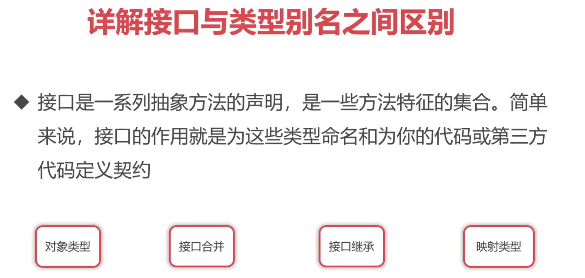

## TS4类型系统之进阶使用


## 详解接口与类型别名之间区别




```typescript
// 定义一个接口A
interface A {
  username: string; // 属性：用户名，类型为字符串
  age: number; // 属性：年龄，类型为数字
}

// 声明一个变量a，类型为接口A的实现对象
let a: A = {
  username: 'xiaoming',
  age: 20
}

// 声明一个新的接口A，使用索引签名，使其成为一个可索引类型
// 索引类型的索引签名定义了用于索引访问的键和对应的值的类型
interface A {
  [index: number]: number; // 索引类型：键为数字，值为数字
}

// 声明一个新的变量a，类型为数字数组，符合接口A的定义
let a: A = [1, 2, 3];

// 声明一个新的接口A，定义一个函数类型
// 这个接口表示函数没有参数，返回类型为void
interface A {
  (): void; // 函数类型
}

// 声明一个新的变量a，类型为函数，符合接口A的定义
let a: A = () => {}

// 声明一个新的接口A，添加了readonly修饰符来定义只读属性username
// 同时age属性为可选属性
interface A {
  readonly username: string; // 只读属性：用户名，类型为字符串
  age?: number; // 可选属性：年龄，类型为数字
}

// 声明一个新的变量a，类型为接口A的实现对象，符合接口A的定义
// 由于username是只读属性，所以无法修改它的值
let a: A = {
  username: 'xiaoming'
}

a.username = 'xiaobai' // 错误！无法修改只读属性

//---------------------------------------与类型别名的区别

// 使用类型别名A，类型为字符串
type A = string;
let a: A = 'hello';

// 使用接口B
interface B {

};

// 类型别名不支持类型合并，所以无法在同名的类型别名中声明新的属性或方法

// 定义一个接口A，包含属性username
interface A {
  username: string;
}

// 在同名的接口A中添加属性age
interface A {
  age: number;
}

// 声明一个新的变量a，类型为接口A的实现对象，符合接口A的定义
// 包含属性username和age
let a: A = {
  username: 'xiaoming',
  age: 20
}

// 定义一个类型别名A，包含属性username
type A = {
  username: string;
}

// 在同名的类型别名A中添加属性age
type A = {
  age: number;
}

// 声明一个新的变量a，类型为类型别名A的实现对象，符合类型别名A的定义
// 包含属性username和age
let a: A = {
  username: 'xiaoming',
  age: 20
}

// 定义一个接口A，包含属性username
interface A {
  username: string;
}

// 定义一个接口B，继承自接口A，并添加属性age
interface B extends A {
  age: number;
}

// 声明一个新的变量b，类型为接口B的实现对象，符合接口B的定义
// 包含属性username和age
let b: B = {
  username: 'xiaoming',
  age: 20
}

// 定义一个类型A，使用映射类型来创建新的属性或方法
// 属性P在联合类型 'username'|'age' 中，值为字符串类型
type A = {
  [P in 'username'|'age']: string;
}

// 定义一个接口A，使用映射类型来创建新的属性或方法
// 属性P在联合类型 'username'|'age' 中，值为字符串类型
interface A {
  [P in 'username'|'age']: string;
}
```

## 字面量类型和keyof关键字

在TS中可以把字面量作为具体的类型来使用，当使用字面量作为具体类型时,该类型的取值就必须是该字面量的值


```typescript
// 定义一个类型别名A，并赋值为1
type A = 1;
// 声明一个变量a，类型为A，并赋值为1
let a: A = 1;

// 定义一个类型别名A，类型为字符串字面量类型 'linear' 或 'swing'
type A = 'linear' | 'swing';
// 声明一个变量a，类型为A，并赋值为 'ease'（不符合A的定义，会报错）
let a: A = 'ease';

// 定义一个接口A，包含属性username和age
interface A {
  username: string;
  age: number;
}

// keyof A 返回接口A所有属性名的联合类型，即 'username' | 'age'
keyof A; // -> 'username' | 'age'

// 声明一个变量a，类型为 'username' | 'age'，并赋值为 'username'
let a: keyof A = 'username';

// 声明一个变量a，赋值为 'hello'
let a = 'hello';
// typeof a 返回变量a的类型，即 string
type A = typeof a; // -> string

// 声明一个对象obj，包含属性username和age，且属性值分别为字符串 'xiaoming' 和数字 20
let obj: {
  username: 'xiaoming',
  age: 20
};

// 声明一个变量a，类型为 'username' | 'age'，并赋值为 'username'
let a: keyof typeof obj = 'username';

```

好的，下面是带有注释的代码：

```typescript
// 定义一个类型别名A，并赋值为1
type A = 1;
// 声明一个变量a，类型为A，并赋值为1
let a: A = 1;

// 定义一个类型别名A，类型为字符串字面量类型 'linear' 或 'swing'
type A = 'linear' | 'swing';
// 声明一个变量a，类型为A，并赋值为 'ease'（不符合A的定义，会报错）
let a: A = 'ease';

// 定义一个接口A，包含属性username和age
interface A {
  username: string;
  age: number;
}

// keyof A 返回接口A所有属性名的联合类型，即 'username' | 'age'
keyof A; // -> 'username' | 'age'

// 声明一个变量a，类型为 'username' | 'age'，并赋值为 'username'
let a: keyof A = 'username';

// 声明一个变量a，赋值为 'hello'
let a = 'hello';
// typeof a 返回变量a的类型，即 string
type A = typeof a; // -> string

// 声明一个对象obj，包含属性username和age，且属性值分别为字符串 'xiaoming' 和数字 20
let obj: {
  username: 'xiaoming',
  age: 20
};

// 声明一个变量a，类型为 'username' | 'age'，并赋值为 'username'
let a: keyof typeof obj = 'username';

```

## 类型保护与自定义类型保护


```typescript
// 定义一个函数foo，参数n的类型为string或number
function foo(n: string|number){

  // 将n断言为string类型，以便可以访问length属性
  (n as string).length

}


// 定义一个函数foo，参数n的类型为string或number
function foo(n: string|number){

  // 使用typeof来判断n的类型是否为string
  if(typeof n === 'string'){
    // 当n的类型为string时，可以直接访问length属性
    n.length
  }

}


// 定义一个函数foo，参数n的类型为包含username属性的对象或包含age属性的对象
function foo(n: { username: string } | { age: number }){
  // 使用in操作符来判断n是否具有username属性
  if( 'username' in n ){
    // 当n具有username属性时，可以直接访问username属性
    n.username
  }
}

// 定义一个类Foo，含有属性username
class Foo {
  username = 'xiaoming'
}

// 定义一个类Bar，含有属性age
class Bar {
  age = 20
}

// 定义一个函数baz，参数n的类型为Foo类的实例或Bar类的实例
function baz(n: Foo|Bar){
  // 使用instanceof关键字来判断n的实例是否为Foo类的实例
  if( n instanceof Foo ){
    // 当n是Foo类的实例时，可以直接访问username属性
    n.username
  }
}


// 定义一个函数foo，参数n的类型为字符串字面量类型 'username' 或数字字面量类型123
function foo(n: 'username'|123){

  // 使用 === 运算符判断n是否为 'username'
  if( n === 'username' ){
    // 当n的值为 'username' 时，可以访问length属性
    n.length
  }

}

// 定义一个自定义的类型谓词isString，用来判断参数是否为string类型
function isString(n: any): n is string{
  return typeof n === 'string';
}

// 定义一个函数foo，参数n的类型为string或number
function foo(n: string|number){

  // 使用isString函数来判断n是否为string类型
  if( isString(n) ){
    // 当n的类型为string时，可以访问length属性
    n.length
  }

}
```

## 定义泛型和泛型常见操作


```typescript
// 定义一个名为foo的函数，接受两个参数n1和n2，两个参数的类型都是number
function foo(n1: number, n2: number) {
}

// 调用foo函数，传入参数1和100
foo(1, 100);

// 调用foo函数，传入参数5和26
foo(5, 26);

// 定义一个泛型类型A，接受两个类型参数T和U，可以是T或U类型
type A<T, U> = T | U;

// 定义一个泛型类型A，接受一个类型参数T，默认值为string
type A<T = string> = T;

// 声明变量a为类型A，类型为string，赋值为'hello'
let a: A = 'hello';

// 声明变量b为类型A，类型为number，赋值为123
let b: A<number> = 123;

// 声明变量c为类型A，类型为boolean，赋值为true
let c: A<boolean> = true;

// 定义一个泛型类型MyArray，接受一个类型参数T，表示一个T类型的数组
type MyArray<T> = T[];

// 声明变量d为类型MyArray，类型为number的数组，赋值为[1, 2, 3]
let d: MyArray<number> = [1, 2, 3];

// 声明变量e为number类型的数组，赋值为[1, 2, 3]
let e: number[] = [1, 2, 3];

// 定义一个泛型函数foo，接受一个类型参数T
function foo<T>(n: T) {
}

// 调用foo函数，传入类型参数为string，参数为'hello'
foo<string>('hello');

// 调用foo函数，参数类型为number，参数为123
foo(123);

// 定义一个接口A，接受一个类型参数T，表示一个可选参数为T类型的函数
interface A<T> {
  (n?: T): void;
  default?: T;
}

// 声明变量foo，类型为A<string>，赋值为一个匿名函数
let foo: A<string> = (n) => {};

// 声明变量foo2，类型为A<number>，赋值为一个匿名函数
let foo2: A<number> = (n) => {};

// 调用foo函数，传入参数类型为string，参数为'hello'
foo('hello');

// 设置foo的default属性为'hi'
foo.default = 'hi';

// 调用foo2函数，参数类型为number，参数为123
foo2(123);

// 设置foo2的default属性为123
foo2.default = 123;

// 定义一个泛型类Foo，接受一个类型参数T，声明一个成员变量username类型为T
class Foo<T> {
  username!: T;
}

// 创建一个类型为Foo<string>的实例f
let f = new Foo<string>();

// 设置f的username属性为'hello'
f.username = 'hello';

// 定义一个泛型类Foo，接受一个类型参数T，声明一个成员变量username类型为T
class Foo<T> {
  username!: T;
}

// 定义类Baz继承自泛型类Foo，类型参数为string
class Baz extends Foo<string> {}

// 创建一个Baz类的实例f
let f = new Baz();

// 设置f的username属性为'hello'
f.username = 'hello';

// 定义一个类型A，包含一个length属性，类型为number
type A = {
  length: number;
};

// 定义一个泛型函数foo，接受一个类型参数T，该类型参数必须满足A类型的约束
function foo<T extends A>(n: T) {}

// 调用foo函数，传入参数类型为number，参数为123
foo(123);

// 调用foo函数，传入参数类型为string，参数为'hello'
foo('hello');
```

## 类型兼容性详解

```ts
let a: number = 123;  // 声明一个变量 a，类型为 number，赋值为 123
let b: number = 456;  // 声明一个变量 b，类型为 number，赋值为 456

b = a;  // 将 b 的值赋为 a 的值，此时 b 的值变成了 123

let a: number = 123;  
let b: string = 'hello';  // 声明一个变量 b，类型为 string，赋值为 'hello'

b = a;  // 报错，由于 b 的类型为 string，无法将 a 的值赋给 b

let a: number = 123;  
let b: string | number = 'hello';  // 声明一个变量 b，类型为 string 或 number，赋值为 'hello'
b = a;  // 将 b 的值赋为 a 的值，此时 b 的值变成了 123
a = b;  // 报错，由于 a 的类型为 number，无法将 b 的值赋给 a

let a: {username: string} = { username: 'xiaoming' };  // 声明一个变量 a，类型为包含 username 属性的对象，赋值为 { username: 'xiaoming' }
let b: {username: string; age: number} = { username: 'xiaoming', age: 20 };  // 声明一个变量 b，类型为包含 username 和 age 属性的对象，赋值为 { username: 'xiaoming', age: 20 }
a = b;  // 将 a 的值赋为 b 的值，此时 a 的值变成了 { username: 'xiaoming', age: 20 }
b = a;  // 报错，由于 b 的类型包含了额外的 age 属性，无法将 a 的值赋给 b

function foo(n: {username: string}) {}  // 定义一个名为 foo 的函数，接受一个参数 n，其类型为包含 username 属性的对象
foo({username: 'xiaoming'})  // 调用函数 foo，并传入参数 { username: 'xiaoming' }，成功执行
foo({username: 'xiaoming', age: 20})  // 报错，参数类型不符合函数定义的要求，应该只包含 username 属性
let a = { username: 'xiaoming', age: 20 }  // 声明一个变量 a，赋值为 { username: 'xiaoming', age: 20 }
foo(a)  // 将变量 a 作为参数传入函数 foo，成功执行
```

## 映射类型与内置工具类型

```typescript
type A = {
  username: string; // 定义属性 username 的类型为 string
  age: number; // 定义属性 age 的类型为 number
}

// 映射类型只能用别名实现，不能用接口来实现

// 定义泛型别名 B，参数类型为 T，返回类型为将 T 中每个属性都设为只读的新类型
type B<T> = {
  readonly [P in keyof T]: T[P];
}

type C = B<A>; // 将类型 A 中的所有属性都设为只读，得到新类型 C

//Partial、Readonly、Pick、Record、Required、Omit、Exclude、Extract、NonNullable、Parameters、ReturnType …

type A = {
  username: string; // 定义属性 username 的类型为 string
  age: number; // 定义属性 age 的类型为 number
  gender: string; // 定义属性 gender 的类型为 string
}

type B = Readonly<A>; // 将类型 A 中的所有属性都设为只读，得到新类型 B

type C = Partial<A>; // 将类型 A 中的所有属性都设为可选，得到新类型 C

type D = Pick<A, 'username'|'age'>; // 从类型 A 中选择 'username' 和 'age' 属性，得到新类型 D

type E = Record<keyof A, string>; // 以类型 A 的属性作为键，将每个键的类型设为 string，得到新类型 E

type A = {
  username?: string; // 定义属性 username 的类型为可选的 string
  age?: number; // 定义属性 age 的类型为可选的 number
  readonly gender: string; // 定义属性 gender 的类型为只读的 string
}

type B = Required<A>; // 将类型 A 中所有可选属性都设为必选，得到新类型 B

type A = {
  username: string; // 定义属性 username 的类型为 string
  age: number; // 定义属性 age 的类型为 number
  gender: string; // 定义属性 gender 的类型为 string
}

type B = Pick<A, 'username'|'age'>; // 从类型 A 中选择 'username' 和 'age' 属性，得到新类型 B

type Omit<T, K extends keyof any> = Pick<T, Exclude<keyof T, K>>; // 定义泛型别名 Omit，从类型 T 中选择除去 K 属性以外的所有属性，得到新类型

type C = Omit<A, 'username'|'age'>; // 从类型 A 中选择除去 'username' 和 'age' 属性以外的所有属性，得到新类型 C

type Exclude<T, U> = T extends U ? never : T; // 定义泛型别名 Exclude，从类型 T 中排除类型 U，得到新类型

type A = Exclude<string | number | boolean, string | boolean>; // 从联合类型 string | number | boolean 中排除类型 string 和 boolean，得到新类型 A
```

## 条件类型和infer关键字

```typescript
type A = string
type B = number | string
type C = A extends B ? {} : []  // 如果A是B的子类型，则返回{}，否则返回[]

type Exclude<T, U> = T extends U ? never : T
type A = Exclude<string | number | boolean, string>  // 从联合类型中排除指定类型，这里排除了string类型，因此返回number | boolean

type Extract<T, U> = T extends U ? T : never
type A = Extract<string | number | boolean, string>  // 从联合类型中提取指定类型，这里提取了string类型，因此返回string

type NonNullable<T> = T extends null | undefined ? never : T;
type A = NonNullable<string|null|undefined>  // 从联合类型中排除null和undefined类型，因此返回string类型

type Foo = (n: number, m: string) => string

type Parameters<T extends (...args: any) => any> = T extends (...args: infer P) => any ? P : never;
type A = Parameters<Foo>  // 获取函数类型的参数类型并将其转换为元组类型，这里返回[number, string]

let a: A = [1, 'hello']

type ReturnType<T extends (...args: any) => any> = T extends (...args: any) => infer R ? R : any;
type A = ReturnType<Foo>  // 获取函数类型的返回值类型，这里返回string

type A<T> = T extends Array<infer U> ? U : T

type B = A<Array<number>>  // 获取数组类型的元素类型，这里返回number
type C = A<string>  // 非数组类型，直接返回string
```

## 类中使用类型


```ts
class Foo {} // 定义了一个空的类 Foo
```

```ts
let a: Foo = 123; // 尝试将数字类型赋值给类型为 Foo 的变量 a（不兼容）
a = 'hello'; // 尝试将字符串类型赋值给类型为 Foo 的变量 a（不兼容）
```

```ts
class Foo {
  username!: string; // 使用感叹号来告诉编译器，我们将在运行时初始化此属性
}
let f: Foo = new Foo(); // 实例化 Foo 类并将其赋值给变量 f
f.username = 'hello'; // 为 f 的 username 属性赋值
```

```ts
class Foo {
  // username: string = 'xiaoming'; // 初始化属性 username 为字符串 "xiaoming"

  // username: string; // 定义属性 username，不初始化
  // constructor(){
  //   this.username = 'xiaoming'; // 在构造函数中为属性 username 赋值
  // }

  username: string;
  constructor(username: string){
    this.username = username; // 使用构造函数参数为属性 username 赋值
  }
  showAge = (n: number): number => {
    return n; // 返回参数 n
  }
}
let f = new Foo('hello'); // 实例化 Foo 类，并将字符串 'hello' 传递给构造函数作为参数
f.showAge(20); // 调用 f 的 showAge 方法，并传递数字 20 作为参数
```

```ts
class Foo {
  username;
  constructor(){
    this.username = 'xiaoming' // 构造函数中为属性 username 赋值
  }
}
```

```ts
interface A {
  username: string
  age: number
  showName(n: string): string
}
class Foo implements A {
  username: string = 'xiaoming' // 实现接口时给属性 username 初始化
  age: number = 20 // 实现接口时给属性 age 初始化
  gender: string = 'male' // 可以在类中定义接口中没有的属性
  showName = (n: string): string => {
    return n // 实现接口中的 showName 方法
  }
}
```

```ts
class Foo<T> {
  username: T;
  constructor(username: T){
    this.username = username; // 构造函数中给类型参数 T 的属性 username 赋值
  }
}
new Foo<string>('xiaoming'); // 创建一个类型参数为 string 的 Foo 类的实例，并将字符串 'xiaoming' 传递给构造函数作为参数
```

```ts
class Foo<T> {
  username: T;
  constructor(username: T){
    this.username = username; // 构造函数中给类型参数 T 的属性 username 赋值
  }
}
class Bar extends Foo<string> {

}
new Bar('xiaoming'); // 创建一个 Bar 类的实例，并将字符串 'xiaoming' 传递给构造函数作为参数
```

```ts
interface A<T> {
  username: T
  age: number
  showName(n: T): T
}
class Foo implements A<string> {
  username: string = 'xiaoming' // 实现接口时给属性 username 初始化
  age: number = 20 // 实现接口时给属性 age 初始化
  gender: string = 'male' // 可以在类中定义接口中没有的属性
  showName = (n: string): string => {
    return n // 实现接口中的 showName 方法
  }
}
```

