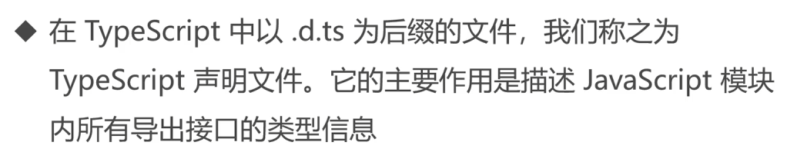
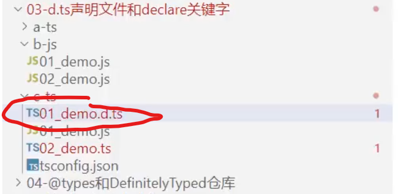

## 模块系统与命名空间


```typescript
// 导入类型 A 
import type { A } from './2_demo'

// 声明变量 a 并赋值为 'hello'
let a: A = 'hello'

// 导入默认导出的模块，给其命名为 A
import A from './2_demo'

// 声明变量 a 并赋值为 'hello'
let a: A = 'hello'

// 使用 require 导入模块，给其命名为 A
import A = require('./2_demo')

// 2秒后执行以下操作
setTimeout(() => {
  // 导入模块的 a，注意这里会报错，因为直接导入 a 是不允许的
  // import { a } from "./2_demo"  // error

  // 动态导入模块，然后使用其中的 a
  import('./2_demo').then(({ a }) => {
    console.log(a)
  })
}, 2000)

// 导入模块中的 Foo
import { Foo } from './2_demo'

// 打印模块中 Foo 的属性 a
console.log(Foo.a)
```

2_demo.ts

```typescript
// 导出类型 A 为 string
export type A = string

// 默认导出类型 A
export default A

// 定义类型 A 为 string，然后使用 export = 导出
type A = string
export = A

// 导出变量 a 为 123
export let a = 123

// 定义命名空间 Foo，并导出变量 a 为 123
namespace Foo {
  export let a = 123
}

// 定义命名空间 Bar，并导出变量 a 为 456
namespace Bar {
  export let a = 456
}

// 打印命名空间 Foo 中的变量 a
console.log(Foo.a)

// 打印命名空间 Bar 中的变量 a
console.log(Bar.a)

// 导出命名空间 Foo
export namespace Foo {
  // 在 Foo 中导出变量 a 为 123
  export let a = 123

  // 在 Foo 中导出类型 A 为 string
  export type A = string

  // 在 Foo 中导出函数 foo
  export function foo() {}

  // 在 Foo 中导出类 B
  export class B {}
}
```

## d.ts声明文件和declare关键字





```typescript
// 01_demo.d.ts
// 作用就是让js文件可以引用ts文件定义的方法内容
export declare function foo(n:number) :void
```

* 自动生成d.ts文件只需要在tsconfig.js文件中将declaration：true这个注释去掉让其运行即可


## @types和DefinitelyTyped仓库


> 安装第三方库：
>
> npm i moment

```typescript
import moment from 'moment'

moment().format('YYYY')
moment().aaa()
```

> npm i jquery

* 上述指令下载完后引用会报错


* 使用提示的命令行进行下载则ok

```typescript
import $ from 'jquery'
```

* 也就是说如果要下载的第三方的库不带d.ts文件，就需要手动的通过@types来下载才能进行引用


## lib.d.ts和global.d.ts


```typescript
let body:HTMLBodyElement | null = document.querySelector('body')

let date:Date = new Date();
```

* global.d.ts定义的全局的类型在其他文件都可以用，无需引入
* 需要扩展就在global.d.ts文件里扩展，内置的文件不需要碰


## 详解tsconfig.json配置文件


> 如果在初始化vue项目中没有✔ts语法，则使用tsc --init来引进tsconfig.json即可
>
> 如果是vite初始化自带的json文件中是只有files和references选项的，而init创造的是中只有compilerOptions的

* init命令创建的


* vue初始化自带的


## Vue选项式API中如何使用TS


```typescript
<template>
    <div>
        <h2>hello 01</h2>
        <button @click="handleClick(5)">点击</button>
        {{ count }},{{ doubleCount }}
    </div>
</template>

<script lang="ts">
// definecomponent对类型进行自动判断
import { defineComponent } from 'vue'

type Count = number | string;
interface List{
    username:string
    age:number
}

export default defineComponent({
    data(){
        return{
            count:0 as Count,
            list:[] as List[]
        }
    },
    mounted(){
        this.count = 2,
        this.list.push({
            username:'xiaoming',
            age:20
        })
    },
    computed:{
        doubleCount():number|string{
            if(typeof this.count == 'number'){
                return this.count * 2
            }
            else{
                return this.count;
            }
        }
    },
    methods:{
        handleClick(n:number){
            if(typeof this.count == 'number'){
                return this.count += n;
            }
            else{
                return this.count;
            }
        }
    }
});
</script>

<style scoped>

</style>
```


## Vue选项式API中组件通信使用TS


```vue
<!--02_选项式APi与TS的组件通信.vue-->
<template>
    <div>
        <h2>hello 02</h2>
        <my-head :count="count" :list="list" @get-data="getData"></my-head>
    </div>
</template>

<script lang="ts">
// definecomponent对类型进行自动判断
import { defineComponent } from 'vue'
import MyHead from './03_MyHead.vue'

export default defineComponent({
    data(){
        return{
            count:0 ,
            list:[
                {username:'xiaoming',age:20}
            ]
        }
    },
    components:{
        MyHead
    },
    methods:{
        getData(payload:string){
            console.log(payload);
        }
    }
});
</script>

<style scoped>

</style>
```

```vue
<!--MyHead.vue-->
<template>
    <div>
        Head Component
    </div>
</template>

<script lang="ts">
import { defineComponent } from 'vue'
import type { PropType } from 'vue';

interface List{
    username:string,
    age:number
}


export default defineComponent({
    props:{
        count:[Number,String],
        list:Object as PropType<List[]>
    },
    // emits:['get-data'],
    emits:{
        'get-data'(payload:string){return payload.length > 0}
    },
    mounted(){
        this.$emit('get-data','hello');
    }
})
</script>

<style scoped>

</style>
```


## Vue组合式API中如何使用TS


```vue
<template>
    <div>
        <h2>hello 03</h2>
        <button @click="handleClick(5)">点击</button>
        {{ count }},{{ doubleCount }}
    </div>
</template>

<script setup lang="ts">
import { computed, ref } from "vue";

let count = ref<number|string>(0);
count.value = 'hello';

interface List{
    username:string
    age:number
}

let list = ref<List[]>([]);

list.value.push({
    username:'xiaoming',
    age:20
})

let count2 = ref(0);
let doubleCount = computed(()=> count2.value * 2);
let handleClick = (n:number) => {
    count2.value += n;
}

</script>

<style scoped>

</style>
```


## Vue组合式API中组件通信使用TS


```vue
<!--06_组合式APi与TS的组件通信.vue-->
<template>
    <div>
      <h2>Hello 05</h2>
      <my-head :count="count" :list="list" @get-data="getData"></my-head>
    </div>
  </template>
  
  <script setup lang="ts">
  import { ref } from 'vue';
  import MyHead from './06_MyHead.vue'
  
  let count = ref('0');
  let list = ref([{username: 'xiaoming', age: 20}]);
  let getData = (payload: string) => {
    console.log( payload );
  }
  
  </script>
  
  <style scoped>
  
  </style>
```

```vue
<!--06_MyHead.vue-->
<template>
    <div>
      Head Component
    </div>
  </template>
  
  <script setup lang="ts">
  import { defineProps, defineEmits } from 'vue'
  
  // 1. 
  // defineProps({
  //   count: [Number, String]
  // });
  
  //2. 
  interface Props {
    count: number|string
    list: {username: string; age: number}[]
  }
  
  interface Emits {
    (e: 'get-data', payload: string): void
  }
  
  defineProps<Props>();
  
  let emit = defineEmits<Emits>();
  
  emit('get-data', 'hello');
  </script>
  
  <style scoped>
  
  </style>
```


## VueRouter路由如何使用TS


```typescript
// router目录下的index.ts
import { createRouter, createWebHistory } from 'vue-router'
import type { RouteRecordRaw } from 'vue-router'}
import HomeView from '../views/HomeView.vue'

const router = createRouter({
  history: createWebHistory(import.meta.env.BASE_URL),
  routes: [
    {
      path: '/',
      name: 'home',
      component: HomeView,
      meta:{ requiresAuth:true }
    },
    {
      path: '/about',
      name: 'about',
      // route level code-splitting
      // this generates a separate chunk (About.[hash].js) for this route
      // which is lazy-loaded when the route is visited.
      component: () => import('../views/AboutView.vue')
    }
  ]
})

router.beforeEach((to,from,next)=>{
  
});

export default router

```

```vue
<!-- 07_路由.vue -->
<template>
    <div>
        <h2>hello router</h2>
    </div>
</template>

<script setup lang="ts">

import { useRoute,useRouter } from 'vue-router';

const route = useRoute();
const router = useRouter();

route.hash
router.push('/login')

</script>

<style scoped>

</style>
```


## Vuex状态管理如何使用TS


