#### @vue/cli 3.0 + [axios](https://so.csdn.net/so/search?q=axios&spm=1001.2101.3001.7020) + json-server

*   [一、创建vue项目](#vue_11)
*   [二、json-server相关](#jsonserver_23)
*   *   [2.1 安装json-server](#21_jsonserver_24)
    *   [2.2 创建.json文件](#22_json_34)
    *   [2.3 配置启动命令](#23__65)
*   [三、axios请求](#axios_86)
*   *   [3.1 安装axios](#31_axios_89)
    *   [3.2 二次封装axios](#32_axios_97)
    *   *   [3.2.1 创建 utils/http.js](#321__utilshttpjs_99)
        *   [3.2.2 编写http.js](#322_httpjs_102)
    *   [3.3 项目使用axios](#33_axios_121)
    *   *   [3.3.1 配置代理](#331__122)
        *   [3.3.2 发送axios请求](#332_axios_147)
    *   [3.4 不进行二次封装，进行axios请求](#34_axios_182)


vue是前后端分离的架构，那么在后端还没有给数据接口的时候，前端改如何使用模拟数据。  
关于模拟数据，适应较多的有 `Mock.js`和 `json-server`，在此进行 `json-server`的使用讲解，关于另一个可查看官网 → [Mockjs官网](http://mockjs.com/)

* * *

更新该流程  
[vue-cli + axios + element + (mockjs | json-server)](https://blog.csdn.net/Dark_programmer/article/details/114304910)

* * *

一、创建vue项目
---------

此处不再进行项目的创建演示，不会创建项目的可跳转传送门，进行学习 **传送门 →** [创建vue项目](https://blog.csdn.net/Dark_programmer/article/details/104446760)

使用脚手架创建好项目之后，效果会如下图：  
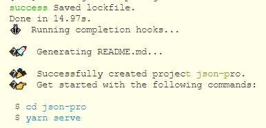  
依照提示进行项目的启动

> cd json-pro  
> yarn serve

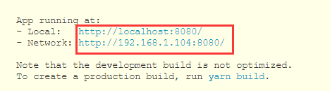  
使用 `ctrl + 鼠标左击`即可，项目暂时告一段落，要注意的是项目的`端口号为 8080`

二、json-server相关
---------------

### 2.1 安装json-server

参考地址： [【npm josn-server】](https://www.npmjs.com/package/json-server)

此时在你创建的项目文件处打开终端，执行安装命令

> npm i json-server  
> or  
> yarn add json-server

如图：  
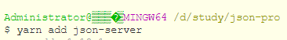

### 2.2 创建.json文件

安装完成之后，在项目根目录下创建一个`***.json`的文件，文件名看个人随便起  
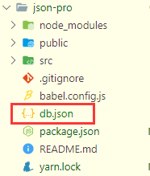  
db.json

```javascript
{
  "infomation": [
    {
      "id": 1,
      "title": "json-server 的第1条数据",
      "desc": "奥特曼不想打小怪兽，明明可以做好朋友的",
      "author": "被奥特曼打了很久的怪兽"
    },
    {
      "id": 2,
      "title": "json-server 的第2条数据",
      "desc": "葫芦娃不想去救爷爷，一个一个的去送不好",
      "author": "种出七个葫芦的爷爷"
    },
    {
      "id": 1,
      "title": "json-server 的第一条数据",
      "desc": "王者荣耀其实不是很好玩，这并不是我内心的真话",
      "author": "想玩游戏的我"
    }
  ]
}

```

### 2.3 配置启动命令

打开 `package.json`，在 `script`里加一条语句

```javascript
 "json": "json-server --watch db.json --port 3000"
```

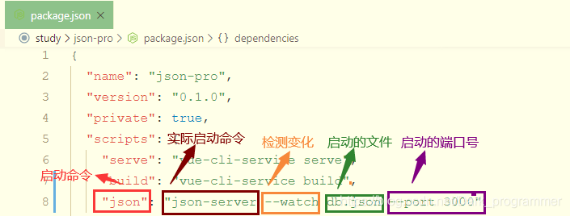

当配置好启动命令之后，启动 `json-server`

> yarn json  
> or  
> npm run json

启动完成，就会出现如图：  
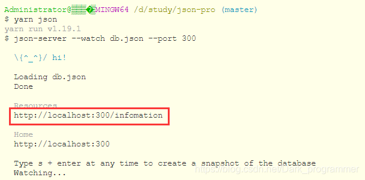  
`点击红色框里的链接`，或者`复制到浏览器地址栏`即可看到数据  
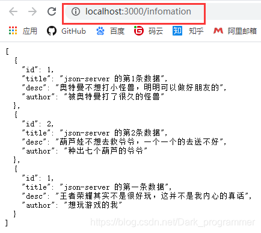

json-server 暂时告一段落，要注意的是 json-server的`端口号是3000`

三、axios请求
---------

参考文献： [【axios 官方网站】](http://www.axios-js.com/docs/)

### 3.1 安装axios

> yarn add axios  
> or  
> npm install axios

打开终端，输入安装指令  
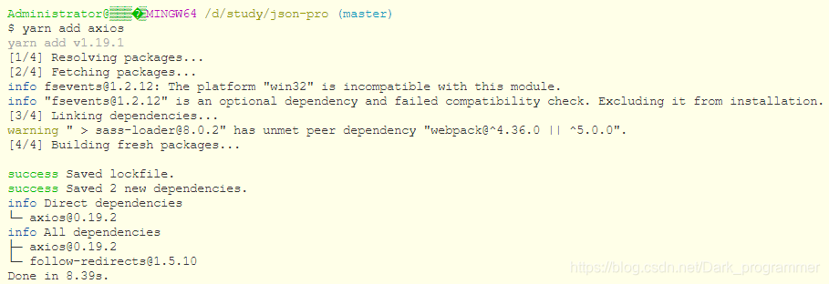  
如图所示为 安装完成

### 3.2 二次封装axios

在实际的项目中，我们一般不会直接将安装好的axios进行使用，而是进行二次封装，接下来我们来简单的封装

#### 3.2.1 创建 utils/http.js

在src文件在下创建utils文件夹，**在utils里创建 http.js文件**  
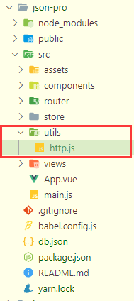

#### 3.2.2 编写http.js

http.js

```javascript
//引入安装好的axios插件
import axios from "axios";

const get = (url, params) => {
  return axios.get(url, { params });
};

const post = (url, data) => {
  return axios.post(url, data);
};

//将二次封装好的axios导出
export { get, post };

```

### 3.3 项目使用axios

#### 3.3.1 配置代理

上文也提到过，`项目的端口为8080`,然后json文件的`端口为3000`，这样就会涉及到跨域，解决跨域的方式很多种，此处讲解一下`配置proxy代理`  
在根目录下创建文件`vue.config.js`，覆盖webpack的一些内容。  
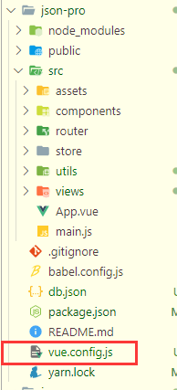  
vue.config.js

```javascript
module.exports = {
  devServer: {
    proxy: {
      "/api": {
        // 此处的写法，目的是为了 将/api 替换成 http://localhost:3000
        target: "http://localhost:3000",
        //是否跨域
        changeOrigin: true,
        //路径重写 下面示例为 将 /api 替换成空
        pathRewrite: {
          "^/api": "",
        },
      },
    },
  },
};

```

#### 3.3.2 发送axios请求

此示例是随便找一个文件进行数据的请求  
在views文件夹下面的`about.vue`文件里重新写一下  
about.vue

```javascript
<template>
  <div class="about">
    <h1>This is an about page</h1>
    <button @click="sendRequest">click me</button>
  </div>
</template>
<script>
import { get, post } from "../utils/http";
export default {
  methods: {
    async sendRequest() {
      let res = await get("/api/infomation");
      console.log("res", res);
    },
  },
};
</script>

```

添加一个按钮`click me`,当点击按钮时会执行`sendRequest`。引入二次封装的axios文件，因为`axios的返回值是一个Promise`，所以需要使用`async await`解决异步问题。

样式如图：  
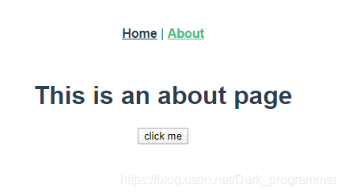  
当点击之后，获取到的数据如图：  
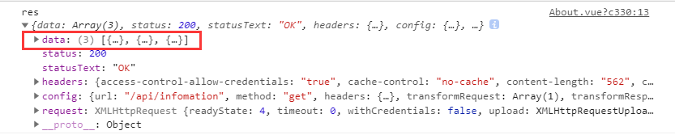  
数据其实在当前数据的data里，根据个人需要进行操作即可。

**切记：如果点击按钮出现 404 的错误，此时只许重新启动。先启动json文件，然后启动项目即可**

### 3.4 不进行二次封装，进行axios请求

将之前创建的 `utils/http.js文件`删除掉  
重新修改文件  
about.vue

```javascript
<template>
  <div class="about">
    <h1>This is an about page</h1>
    <button @click="sendRequest">click me</button>
  </div>
</template>
<script>
import axios from "axios";
export default {
  methods: {
    sendRequest() {
      axios
        .get("http://localhost:3000/infomation")
        .then((response) => {
          console.log("数据请求成功,获取到的数据为:", response);
        })
        .catch((error) => {
          console.log("数据请求出错,错误为:", error);
        });
    },
  },
};
</script>

```

效果如下：  
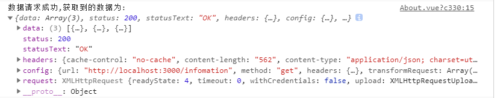  
依然可以获取到数据，然后根据需要操作即可

 

文章知识点与官方知识档案匹配，可进一步学习相关知识

[Vue入门技能树](https://edu.csdn.net/skill/vue/vue-a10eb688e16c4a02950b28fac1ce5ecb?utm_source=csdn_ai_skill_tree_blog)[Vue-cli](https://edu.csdn.net/skill/vue/vue-a10eb688e16c4a02950b28fac1ce5ecb?utm_source=csdn_ai_skill_tree_blog)[vue-cli脚手架安装](https://edu.csdn.net/skill/vue/vue-a10eb688e16c4a02950b28fac1ce5ecb?utm_source=csdn_ai_skill_tree_blog)41591 人正在系统学习中

本文转自 <https://blog.csdn.net/Dark_programmer/article/details/105685216>，如有侵权，请联系删除。

# 增删改查

> 一个在前端本地运行，可以存储json数据的server。我们在前端开发时，可以模拟服务端接口数据，在本地搭建一个JSON服务，自己产生测试数据。

1. 使用npm全局安装json-server ：`npm install -g json-server`
2. 可以通过查看版本号，来测试是否安装成功：`json-server -v`
3. 创建json数据——db.json

> 在任意一个文件夹下（此处假设我创建了一个server文件夹），进入到该文件夹里面，执行代码 `json-server --watch db.json`

1. 此时文件夹下多出一个db.json文件

[](https://cdn.nlark.com/yuque/0/2022/png/22455608/1671615059466-1e0c34f6-d654-4ea6-aea1-63000821110e.png#averageHue=%2320201f&clientId=ub37d29cb-26cc-4&crop=0&crop=0&crop=1&crop=1&from=paste&height=494&id=u153d8449&margin=[object Object]&name=image.png&originHeight=618&originWidth=1218&originalType=binary&ratio=1&rotation=0&showTitle=false&size=63595&status=done&style=none&taskId=uc9950aec-6a59-434a-80e2-91f9b960a39&title=&width=974.4)
访问 http://localhost:3000/
[](https://cdn.nlark.com/yuque/0/2022/png/22455608/1671615113817-a1db3469-7bdc-484f-92d0-96bd321e781b.png#averageHue=%23fefefe&clientId=ub37d29cb-26cc-4&crop=0&crop=0&crop=1&crop=1&from=paste&height=706&id=uac2a7e8e&margin=[object Object]&name=image.png&originHeight=882&originWidth=1782&originalType=binary&ratio=1&rotation=0&showTitle=false&size=44643&status=done&style=none&taskId=u93775388-5181-4c2f-8535-232739a826a&title=&width=1425.6)

> 分别点击/posts /comments /profile /db链接，我们可以看到访问不同地址时不同的json数据。其中 /db返回的是整个json文件的数据。

[](https://cdn.nlark.com/yuque/0/2022/png/22455608/1671615312763-8d9ba1ef-aa54-4bb5-b1a6-07c7081db36d.png#averageHue=%23fdfdfc&clientId=ub37d29cb-26cc-4&crop=0&crop=0&crop=1&crop=1&from=paste&height=422&id=uccff41f4&margin=[object Object]&name=image.png&originHeight=527&originWidth=783&originalType=binary&ratio=1&rotation=0&showTitle=false&size=24707&status=done&style=none&taskId=ua04143ae-c163-4ff8-b764-ea4f424b90f&title=&width=626.4)

#### 修改端口号

> json-server 默认是 3000 端口，我们也可以自己指定端口，指令如下：


highlighter- code-theme-dark Lua

```
json-server --watch db.json --port 3004
```

如果不想每次用这么长的指令,可以在db.json同级文件夹新建一个package.json，在script配置添加运行命令：


javascript

```javascript
{
    "scripts": {
        "mock": "json-server db.json --port 3004"
    }
}
```

运行的时候, 直接在当前文件夹下执行 `npm run mock`

#### 操作数据

> json-server 支持 restful 风格的api，可以通过不同的请求方式，对数据进行增删改查等不同的操作。

先修改db.json文件：


json

```json
{
  "users": [
    {
      "id": 1,
      "name": "liaoyi",
      "phone": "13246566776",
      "age": 22,
      "classId": "1002"
    },
    {
      "name": "林更新",
      "age": "44",
      "id": 4,
      "classId": "1003"
    },
    {
      "name": "李响",
      "phone": "18779756778",
      "age": "26",
      "id": 5,
      "classId": "1003"
    },
    {
      "name": "陈温柔",
      "phone": "18779756000",
      "age": "22",
      "id": 6,
      "sex": "0",
      "classId": "1004"
    },
    {
      "name": "夏琪",
      "phone": "13246579999",
      "age": "22",
      "id": 7,
      "classId": "1004"
    }
  ],
  "class": [
    {
      "id": "1",
      "title": "前端",
      "staff": [
        "1002",
        "1004"
      ]
    },
    {
      "id": "2",
      "title": "后端",
      "staff": [
        "1003"
      ]
    }
  ],
  "fruits": [
    {
      "id": 1,
      "name": "苹果",
      "price": 1.28
    },
    {
      "id": 2,
      "name": "橘子",
      "price": 3.88
    },
    {
      "id": 3,
      "name": "宁夏西瓜",
      "price": 1.98
    },
    {
      "id": 4,
      "name": "麒麟西瓜",
      "price": 3.98
    },
    {
      "id": 5,
      "name": "红蛇果",
      "price": 2.5
    },
    {
      "id": 6,
      "name": "黑皮西瓜",
      "price": 0.98
    },
    {
      "id": 7,
      "name": "红心火龙果",
      "price": 2.69
    },
    {
      "id": 8,
      "name": "国产火龙果",
      "price": 1.69
    },
    {
      "id": 9,
      "name": "海南荔枝",
      "price": 9.9
    },
    {
      "id": 10,
      "name": "陕西冬枣",
      "price": 5.39
    },
    {
      "id": 11,
      "name": "软籽石榴",
      "price": 2.39
    },
    {
      "id": 12,
      "name": "蜜橘",
      "price": 1.99
    },
    {
      "id": 13,
      "name": "海南香蕉",
      "price": 1.45
    }
  ],
  "person": [
    {
      "name": {
        "firstname": "liao",
        "lastname": "yi"
      },
      "pwd": "qwerst54"
    },
    {
      "name": {
        "firstname": "wang",
        "lastname": "wu"
      },
      "pwd": "adasff11"
    }
  ]
}
```

#### get 获取数据

> 浏览器可以直接访问GET请求，我们可以直接在浏览器访问就能看到返回的json数据。

获取所有用户数据（对象数组）： `[http://localhost:3004/users](http://localhost:3004/users)`
获取所有水果数据：`http://localhost:3004/fruits`

##### 获取数据

根据 `id` 获取 users 数据：`http://localhost:3004/users/1`
[](https://cdn.nlark.com/yuque/0/2022/png/22455608/1671617455921-cfac87e1-6d35-4a97-b225-1a7d7d0f80fa.png#averageHue=%23fefefd&clientId=ub37d29cb-26cc-4&crop=0&crop=0&crop=1&crop=1&from=paste&height=255&id=u43649fd3&margin=[object Object]&name=image.png&originHeight=319&originWidth=735&originalType=binary&ratio=1&rotation=0&showTitle=false&size=8909&status=done&style=none&taskId=ua0c0c3e0-cb38-4048-9800-609bbaebf3c&title=&width=588)
上面的请求写法还可以通过get请求的query参数通过？方式来写：


json

```json
http://localhost:3004/users?id=1
```

以此类推，我们可以传入不同的条件：


highlighter- code-theme-dark TypeScript

```
// 查找名字为 'liaoyi' 的用户

http://localhost:3004/users?name=liaoyi
```

##### 多个条件

也可以指定多个条件，用&符号连接：


highlighter- code-theme-dark TypeScript

```
http://localhost:3004/fruits?name=橘子&price=3.88
```

甚至还可以使用对象取属性值 obj.key 的方式：


highlighter- code-theme-dark TypeScript

```
 http://localhost:3004/person?name.firstname=liao
```

[](https://cdn.nlark.com/yuque/0/2022/png/22455608/1671618993495-d3bf5564-6cf0-4a28-9630-7d15336c91e0.png#averageHue=%23fefefd&clientId=ub37d29cb-26cc-4&crop=0&crop=0&crop=1&crop=1&from=paste&height=257&id=u4f59eff8&margin=[object Object]&name=image.png&originHeight=321&originWidth=951&originalType=binary&ratio=1&rotation=0&showTitle=false&size=11091&status=done&style=none&taskId=u4a1e6b43-0e34-46d4-b3db-c74cb447eee&title=&width=760.8)

##### 分页

> 分页采用 `_page` 来设置页码， `_limit` 来控制每页显示条数。如果没有指定 _limit ，默认每页显示10条。

我们可以依次输入地址查看下面接口中返回不同的结果：


json

```json
http://localhost:3004/fruits?_page=1&_limit=5
http://localhost:3004/fruits?_page=1&_limit=10
http://localhost:3004/fruits?_page=2&_limit=5
```

##### 排序

> 排序采用`_sort`来指定要排序的字段，` _order` 来指定排序是正排序还是逆排序（asc | desc ，默认是asc）。


json

```json
http://localhost:3004/fruits?_sort=price
http://localhost:3004/fruits?_sort=price&_order=desc
```

##### 获取局部数据

> 采用 `_start` 来指定开始位置， `_end` 来指定结束位置、或者是用_limit来指定从开始位置起往后取几个数据。和 Array.slice() 方法类似。


json

```json
# 使用 _end
http://localhost:3004/fruits?_start=2&_end=4

# 使用 _limit
http://localhost:3004/fruits?_start=2&_limit=4
```

##### 获取符合某个范围的数据

1. 使用 `_gte` 和 `_lte` 来设置一个取值范围 :


json

```json
http://localhost:3004/fruits?id_gte=4&id_lte=6
```

1. 使用 `_ne` 来获取不包含某个值的数据


json

```json
http://localhost:3004/fruits?id_ne=1&id_ne=10
```

1. 采用 `_like` 来设置匹配某个字符串（或正则表达式）


json

```json
http://localhost:3004/fruits?name_like=果
```

##### 搜索功能

采用`q`来设置搜索内容：


json

```json
http://localhost:3004/fruits?q=瓜
```

> 除get请求外，其他请求方式需要我们通过 api 调试工具或者代码的方式来使用。

#### post 新增数据


vue

```vue
<template>
  <el-button @click="add"> 发送请求 </el-button>
</template>

<script setup>
  import axios from 'axios'
  const url = 'http://localhost:3004/users'
  const add = async () => {
    const data = {
      name: '林更新',
      phone: '18779756000',
      age: '22'
    }
    const { data: res } = await axios({ method: 'post', url, data })
    console.log('res', res)
  }
</script>
```

当然你也可以使用 api 调试工具来测试接口，这里我使用 apifox：
[](https://cdn.nlark.com/yuque/0/2022/png/22455608/1671622083058-c49e2b64-d293-4301-bad7-d9a29e1390d2.png#averageHue=%232e2e2e&clientId=ub37d29cb-26cc-4&crop=0&crop=0&crop=1&crop=1&from=paste&height=694&id=u8f6a6132&margin=[object Object]&name=image.png&originHeight=868&originWidth=1815&originalType=binary&ratio=1&rotation=0&showTitle=false&size=93460&status=done&style=none&taskId=u6dfb0c6b-c445-4017-af57-c5dddd15427&title=&width=1452)

#### delete 删除数据

通过id删除users里id为3的用户数据：


vue

```vue
<template>
  <el-button @click="deleteUser"> 删除用户 </el-button>
</template>

<script setup>
import axios from 'axios'

const userId = 3
const url = `http://localhost:3004/users/${userId}`
const deleteUser = async () => {
  const res = await axios({ method: 'delete', url })
  console.log('res', res)
}
</script>
```

#### put 修改数据 （替换）

> PUT方法会更新整个资源对象，前端没有给出的字段，会自动清空。


vue

```vue
<template>
  <el-button @click="reviseUser"> put 修改用户 </el-button>
</template>

<script setup>
import axios from 'axios'

const userId = 4
const url = `http://localhost:3004/users/${userId}`
const reviseUser = async () => {
  const data = {
    "name": "林更新",
    "age": "44"
  }
  const res = await axios({ method: 'put', url, data })
  console.log('res', res)
}
</script>
```

但是使用put修改后会有一个问题，只会保留提交的字段，没有提交的字段在json中将会被删除，如下图，我们更改了id为4的用户，只提交了name和age，原来的json文件中，phone字段被删除了：
[](https://cdn.nlark.com/yuque/0/2022/png/22455608/1671623204358-b003e65e-b352-4962-aa1e-5103317b69ae.png#averageHue=%23201f1f&clientId=ub37d29cb-26cc-4&crop=0&crop=0&crop=1&crop=1&from=paste&height=502&id=u770367e4&margin=[object Object]&name=image.png&originHeight=628&originWidth=1314&originalType=binary&ratio=1&rotation=0&showTitle=false&size=63134&status=done&style=none&taskId=u82aa025b-26ff-4a10-a174-8446b396d16&title=&width=1051.2)
这时候我们就要用到 patch 请求了：

#### patch 修改数据

只修改请求的字段，没有请求的字段将会被保留。


vue

```vue
<template>
  <el-button @click="reviseUser"> patch修改用户 </el-button>
</template>

<script setup>
import axios from 'axios'

const userId = 8
const url = `http://localhost:3004/users/${userId}`
const reviseUser = async () => {
  const data = {
    name: "陈温柔",
    age: "22",
    sex: "0"
}
  const res = await axios({ method: 'patch', url, data })
  console.log('res', res)
}
</script>
```

#### 关联检索

##### 通过 `_expand` 方式检索关联父级数据:

这里的 _expand=class 匹配的其实是为了和 users 对象中的 classId做关联，但是已经存在classId字段了，我们需要写出 class, 比如检索的是 repaId 我们旧写成 repa：


json

```json
# class 是一个别名
http://localhost:3004/users?_expand=class
```

得到的数据:


json

```json
[
    {
        "id": 1,
        "name": "liaoyi",
        "phone": "13246566776",
        "age": 22,
        "classId": "1",
        "class": {
            "id": "1",
            "title": "前端",
            "staff": [
                "7",
                "6",
                "1"
            ]
        }
    },
    {
        "name": "林更新",
        "age": "44",
        "id": 4,
        "classId": "2",
        "class": {
            "id": "2",
            "title": "后端",
            "staff": [
                "4",
                "5"
            ]
        }
    },
    {
        "name": "李响",
        "phone": "18779756778",
        "age": "26",
        "id": 5,
        "classId": "2",
        "class": {
            "id": "2",
            "title": "后端",
            "staff": [
                "4",
                "5"
            ]
        }
    },
    {
        "name": "陈温柔",
        "phone": "18779756000",
        "age": "22",
        "id": 6,
        "sex": "0",
        "classId": "1",
        "class": {
            "id": "1",
            "title": "前端",
            "staff": [
                "7",
                "6",
                "1"
            ]
        }
    },
    {
        "name": "夏琪",
        "phone": "13246579999",
        "age": "22",
        "id": 7,
        "classId": "1",
        "class": {
            "id": "1",
            "title": "前端",
            "staff": [
                "7",
                "6",
                "1"
            ]
        }
    }
]
```

##### 通过 `_embed` 方式检索关联子级数据:

> 注意: 这里_embed 需要和子表名 (要关联的子集属性名) 匹配。


json

```json
http://localhost:3004/classes?_embed=users
```

得到的数据:


json

```json
[
  {
    "id": "1",
    "title": "前端",
    "staffIds": [
      "1001",
      "1004",
      "1005"
    ],
    "users": [
      {
        "id": "1001",
        "name": "liaoyi",
        "phone": "13246566776",
        "age": 22,
        "classId": "1"
      },
      {
        "name": "陈温柔",
        "phone": "18779756000",
        "age": "22",
        "id": "1004",
        "sex": "0",
        "classId": "1"
      },
      {
        "name": "夏琪",
        "phone": "13246579999",
        "age": "22",
        "id": "1005",
        "classId": "1"
      }
    ]
  },
  {
    "id": "2",
    "title": "后端",
    "staffIds": [
      "1002",
      "1003"
    ],
    "users": [
      {
        "name": "林更新",
        "age": "44",
        "id": "1002",
        "classId": "2"
      },
      {
        "name": "李响",
        "phone": "18779756778",
        "age": "26",
        "id": "1003",
        "classId": "2"
      }
    ]
  }
]
```

[起步](https://www.cnblogs.com/liao-yi/articles/17007240.html#起步)[修改端口号](https://www.cnblogs.com/liao-yi/articles/17007240.html#修改端口号)[操作数据](https://www.cnblogs.com/liao-yi/articles/17007240.html#操作数据)[get 获取数据](https://www.cnblogs.com/liao-yi/articles/17007240.html#get-获取数据)[  获取数据](https://www.cnblogs.com/liao-yi/articles/17007240.html#获取数据)[  多个条件](https://www.cnblogs.com/liao-yi/articles/17007240.html#多个条件)[  分页](https://www.cnblogs.com/liao-yi/articles/17007240.html#分页)[  排序](https://www.cnblogs.com/liao-yi/articles/17007240.html#排序)[  获取局部数据](https://www.cnblogs.com/liao-yi/articles/17007240.html#获取局部数据)[  获取符合某个范围的数据](https://www.cnblogs.com/liao-yi/articles/17007240.html#获取符合某个范围的数据)[  搜索功能](https://www.cnblogs.com/liao-yi/articles/17007240.html#搜索功能)[post 新增数据](https://www.cnblogs.com/liao-yi/articles/17007240.html#post-新增数据)[delete 删除数据](https://www.cnblogs.com/liao-yi/articles/17007240.html#delete-删除数据)[put 修改数据 （替换）](https://www.cnblogs.com/liao-yi/articles/17007240.html#put-修改数据-替换)[patch 修改数据](https://www.cnblogs.com/liao-yi/articles/17007240.html#patch-修改数据)[关联检索](https://www.cnblogs.com/liao-yi/articles/17007240.html#关联检索)[  通过 _expand 方式检索关联父级数据:](https://www.cnblogs.com/liao-yi/articles/17007240.html#通过-_expand-方式检索关联父级数据)[  通过 _embed 方式检索关联子级数据:](