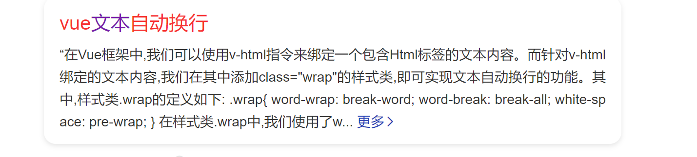

[vue中ref引用操作DOM元素_vue ref获取dom-CSDN博客](https://blog.csdn.net/zxdznyy/article/details/127078632)

[Vue3 ref 模拟触发点击事件 此次用于模拟点击el upload 的上传_vue3模拟点击_Formula！的博客-CSDN博客](https://blog.csdn.net/qq_39581137/article/details/130246842)

[Vue中响应式数据失效&Dom操作无效问题-CSDN博客](https://blog.csdn.net/weixin_34064653/article/details/88748005)

[通过 ref 获取 DOM元素【Vue3 Composition API】_哔哩哔哩_bilibili](https://www.bilibili.com/video/BV1Uq4y1L7oj/?spm_id_from=333.999.top_right_bar_window_custom_collection.content.click)

https://blog.csdn.net/zxdznyy/article/details/127078632

笔记等待完成



[vue中input的type属性为file时，获取上传的文件名_还没想好叫啥~的博客-CSDN博客](https://blog.csdn.net/weixin_52613927/article/details/122985931)

```vue
<div class="" style="display: flex;flex-direction: row;margin:15px 6%;">
	<p style="color: #666;margin: 5px 10px 0px 0px;">上传文件:</p>
	<input ref="input" type="file" id="uploader" @change="handleFiles">
</div>
 <script>
//data数据
data:{
	files:''
},

//方法
methods:{
	handleFiles(event){
		this.files = event.target.files[0].name
		console.log(this.files);
	}
}
  </script>
```

ref是怎么操作dom的，dom为什么没有响应

## 使用ref操作标签的dom

在标签中使用ref绑定名为uploadRef的变量

```html
<button type="submit" ref="uploadRef" style="display: none;">隐藏按钮</button>
```

在 <script>中定义uploadRef并且在onMounted中预加载dom到uploadRef中，开放uploadRef

```js
 setup(){
          const uploadRef =ref(null);
          onMounted (()=>{
            console.log(uploadRef.value);
          })
          return {
            uploadRef
          }
        }
```

在nextTick中等待dom刷新后操作dom，否则提交的表单没有数据：

```js
this.$nextTick(()=>{
        this.$refs.uploadRef.click(); //操纵dom中的click()行为，提交行为使用submit()
      })
```

**怎么修改上传按钮的样式：**

隐藏原来的上传按钮，用按钮操作dom来操作上传按钮