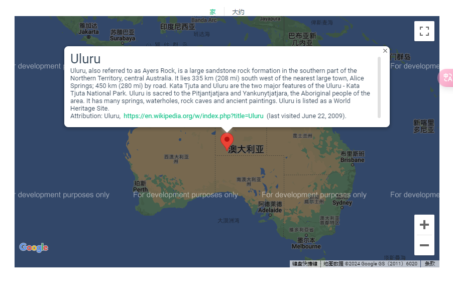
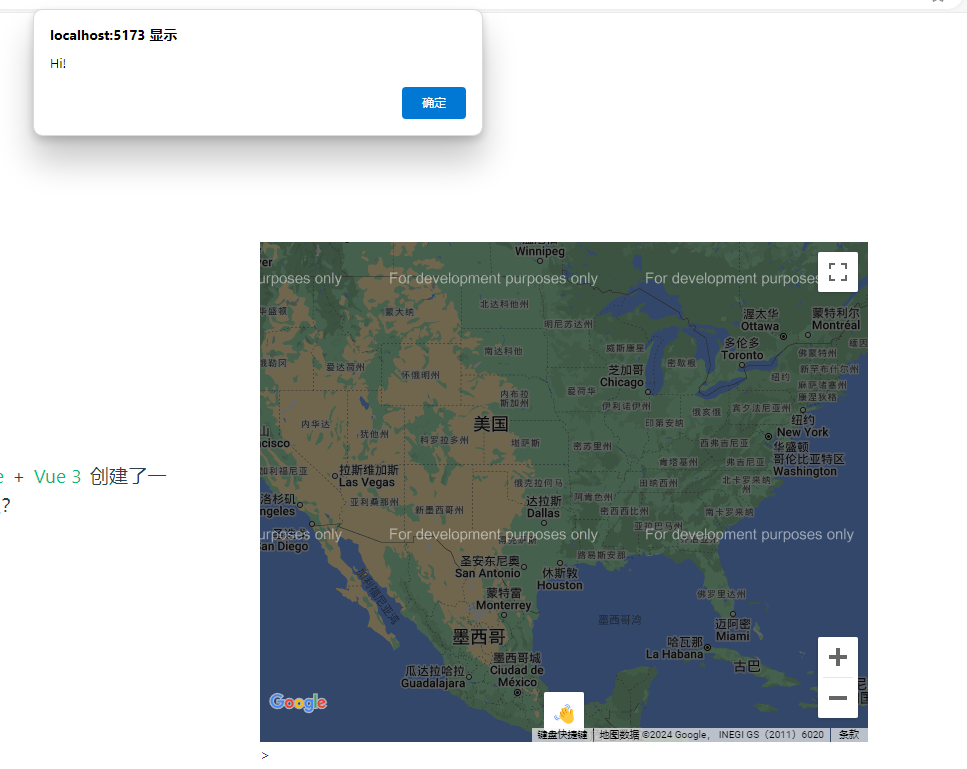
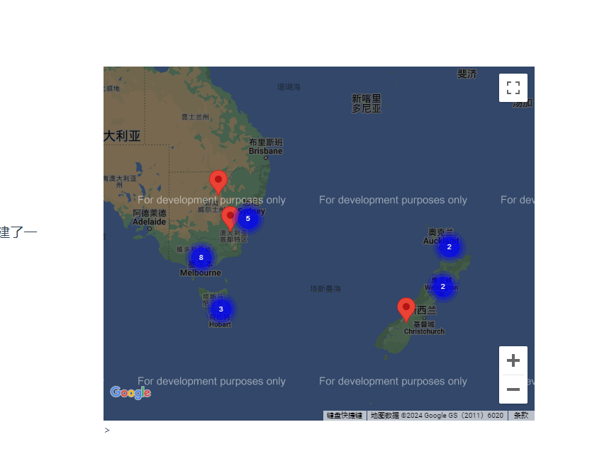
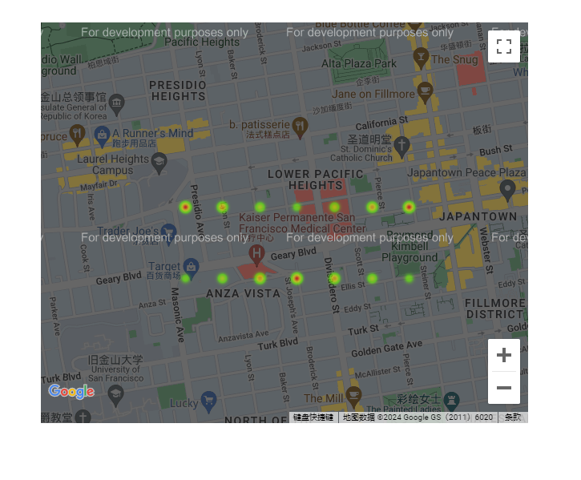

## 开始

[Marker  | Maps JavaScript API  | Google for Developers](https://developers.google.com/maps/documentation/javascript/reference/marker?hl=zh-cn#Marker-Events) 具体api文档地址，需要魔法上网

### 安装

#### NPM

```
npm install vue3-google-map
# OR
pnpm add vue3-google-map
```

#### CDN

在 Vue 3 的全局构建之后包含以下 script 标签（确保将其包含在 Vue 3 的全局构建之后）。`index.html`

```
<script src="https://unpkg.com/vue3-google-map"></script>
```

所有映射组件都可以在全局变量上使用。`Vue3GoogleMap`

[Codepen 演示](https://codepen.io/husamibrahim/pen/poQXZbR)

### 您的第一张地图

要构建地图，您需要使用基本组件来接收您的 [Google Maps API 密钥](https://developers.google.com/maps/documentation/javascript/get-api-key)、样式（例如设置宽度和高度）以及任何 [MapOptions](https://developers.google.com/maps/documentation/javascript/reference/map#MapOptions) 来配置您的地图（[请参阅此处](https://github.com/inocan-group/vue3-google-map/blob/develop/src/components/GoogleMap.vue#L57-L218)了解所有支持的 ）。 通过将地图子组件（[Marker](https://www.npmjs.com/package/vue3-google-map?activeTab=readme#marker)、[Polyline、Polygon](https://www.npmjs.com/package/vue3-google-map?activeTab=readme#polyline)、[Rectangle](https://www.npmjs.com/package/vue3-google-map?activeTab=readme#rectangle)、[Circle](https://www.npmjs.com/package/vue3-google-map?activeTab=readme#circle)、[InfoWindow](https://www.npmjs.com/package/vue3-google-map?activeTab=readme#info-window)、[CustomMarker、CustomControl 或 MarkerCluster](https://www.npmjs.com/package/vue3-google-map?activeTab=readme#custom-marker)）传递到组件的默认插槽，可以将其他地图要素添加到地图中。 `vue3-google-map``GoogleMap``MapOptions``GoogleMap`

```vue
<template>
  <GoogleMap api-key="YOUR_GOOGLE_MAPS_API_KEY" style="width: 100%; height: 500px" :center="center" :zoom="15">
    <Marker :options="{ position: center }" />
  </GoogleMap>
</template>

<script>
import { defineComponent } from "vue";
import { GoogleMap, Marker } from "vue3-google-map";

export default defineComponent({
  components: { GoogleMap, Marker },
  setup() {
    const center = { lat: 40.689247, lng: -74.044502 };

    return { center };
  },
});
</script>
```

1. `GoogleMap` 组件：用于显示 Google 地图。它接受以下数据结构和讲解：
   - `api-key` (必需)：您的 Google 地图 API 密钥，用于授权访问 Google 地图服务。
   - `style`：用于设置地图的样式，比如宽度和高度。
   - `center`：地图的中心点坐标，使用 `lat` 和 `lng` 属性来指定纬度和经度。
   - `zoom`：地图的缩放级别。
2. `Marker` 组件：用于在地图上放置标记（指示某个位置）。它接受以下数据结构和讲解：
   - `options`：用于配置标记的选项，包括位置；在示例中，位置与地图的中心点相同。

> 在地图上显示一个标记（Marker），并将该标记设置在地图的中心点位置。将代码中的 `YOUR_GOOGLE_MAPS_API_KEY` 替换为自己的 Google 地图 API 密钥。

## 组件

该库旨在以*可组合*的方式使用，因此您会发现自己使用嵌套组件来构建地图，而不仅仅是复杂的*内联*格式。

主要的映射组件是 ，但是可以使用以下组件：`GoogleMap`

- [标记](https://www.npmjs.com/package/vue3-google-map?activeTab=readme#marker)
- [折线](https://www.npmjs.com/package/vue3-google-map?activeTab=readme#polyline)
- [多边形](https://www.npmjs.com/package/vue3-google-map?activeTab=readme#polygon)
- [矩形](https://www.npmjs.com/package/vue3-google-map?activeTab=readme#rectangle)
- [圈](https://www.npmjs.com/package/vue3-google-map?activeTab=readme#circle)
- [信息窗口](https://www.npmjs.com/package/vue3-google-map?activeTab=readme#info-window)
- [自定义标记](https://www.npmjs.com/package/vue3-google-map?activeTab=readme#custom-marker)
- [自定义控件](https://www.npmjs.com/package/vue3-google-map?activeTab=readme#custom-control)
- [MarkerCluster（标记集群）](https://www.npmjs.com/package/vue3-google-map?activeTab=readme#marker-cluster)

### 标记MarkerOptions

使用该组件在地图上绘制标记、放置图钉或任何自定义图标。`Marker`

#### 选项

您可以将 [MarkerOptions](https://developers.google.com/maps/documentation/javascript/reference/marker#MarkerOptions) 对象传递给 prop 来配置标记。`options`

```vue
<template>
  <GoogleMap api-key="YOUR_GOOGLE_MAPS_API_KEY" style="width: 100%; height: 500px" :center="center" :zoom="15">
    <Marker :options="markerOptions" />
  </GoogleMap>
</template>

<script>
import { defineComponent } from "vue";
import { GoogleMap, Marker } from "vue3-google-map";

export default defineComponent({
  components: { GoogleMap, Marker },
  setup() {
    const center = { lat: 40.689247, lng: -74.044502 };
    const markerOptions = { position: center, label: "L", title: "LADY LIBERTY" };

    return { center, markerOptions };
  },
});
</script>
```

#### 事件

您可以在组件上侦听[以下事件](https://developers.google.com/maps/documentation/javascript/reference/marker#Marker-Events)。`Marker`

[Marker  | Maps JavaScript API  | Google for Developers](https://developers.google.com/maps/documentation/javascript/reference/marker?hl=zh-cn#Marker-Events) 具体api文档地址，需要魔法上网

### 折线Polyline

使用该组件在地图上绘制路径和任意形状。`Polyline`

#### 选项

您可以将 [PolylineOptions](https://developers.google.com/maps/documentation/javascript/reference/polygon#PolylineOptions) 对象传递给 prop 以配置多段线。`options`

```vue
<template>
  <!-- 创建一个 GoogleMap 组件，并传入 Google Maps API 密钥以及样式和中心点等属性 -->
  <GoogleMap api-key="YOUR_GOOGLE_MAPS_API_KEY" style="width: 100%; height: 500px" :center="center" :zoom="3">
    <!-- 在 GoogleMap 组件内部，创建一个 Polyline 组件，并传入 options 属性进行配置 -->
    <Polyline :options="flightPath" />
  </GoogleMap>
</template>

<script>
import { defineComponent } from "vue";
import { GoogleMap, Polyline } from "vue3-google-map";

export default defineComponent({
  components: { GoogleMap, Polyline },
  setup() {
    // 设置地图的中心点
    const center = { lat: 0, lng: -180 };

    // 设置多段线的坐标点
    const flightPlanCoordinates = [
      { lat: 37.772, lng: -122.214 },
      { lat: 21.291, lng: -157.821 },
      { lat: -18.142, lng: 178.431 },
      { lat: -27.467, lng: 153.027 },
    ];

    // 配置多段线的属性
    const flightPath = {
      path: flightPlanCoordinates, // 设置多段线的坐标点
      geodesic: true, // 是否使用大地测量
      strokeColor: "#FF0000", // 多段线的颜色
      strokeOpacity: 1.0, // 多段线的透明度
      strokeWeight: 2, // 多段线的宽度
    };

    return { center, flightPath }; // 返回必要的数据供组件使用
  },
});
</script>
```

#### 事件

您可以在组件上侦听[以下事件](https://developers.google.com/maps/documentation/javascript/reference/polygon#Polyline-Events)。`Polyline`

### 多边形Polygon

使用该组件在地图上绘制多边形（任意数量的边）。`Polygon`

#### 选项

您可以将 [PolylgonOptions](https://developers.google.com/maps/documentation/javascript/reference/polygon#PolygonOptions) 对象传递给 prop 来配置折线。`options`

```vue
<template>
  <!-- Google 地图组件 -->
  <GoogleMap api-key="YOUR_GOOGLE_MAPS_API_KEY" style="width: 100%; height: 500px" :center="center" :zoom="5">
    <!-- 多边形组件 -->
    <Polygon :options="bermudaTriangle" />
  </GoogleMap>
</template>

<script>
import { defineComponent } from "vue";
import { GoogleMap, Polygon } from "vue3-google-map";

export default defineComponent({
  components: { GoogleMap, Polygon },
  setup() {
    // 地图中心点的经纬度
    const center = { lat: 24.886, lng: -70.268 };

    // 三角形的坐标点数组
    const triangleCoords = [
      { lat: 25.774, lng: -80.19 },   // 第一个坐标点的经纬度
      { lat: 18.466, lng: -66.118 },  // 第二个坐标点的经纬度
      { lat: 32.321, lng: -64.757 },  // 第三个坐标点的经纬度
      { lat: 25.774, lng: -80.19 },   // 第四个坐标点的经纬度（与第一个坐标点重合，形成封闭图形）
    ];

    // 三角形的样式选项
    const bermudaTriangle = {
      paths: triangleCoords,         // 设置三角形的坐标点数组
      strokeColor: "#FF0000",        // 设置边框颜色为红色
      strokeOpacity: 0.8,            // 设置边框透明度为0.8
      strokeWeight: 2,               // 设置边框宽度为2个像素
      fillColor: "#FF0000",          // 设置填充颜色为红色
      fillOpacity: 0.35,             // 设置填充透明度为0.35
    };

    // 返回数据供模板使用
    return { center, bermudaTriangle };
  },
});
</script>
```

#### 事件

您可以在组件上侦听[以下事件](https://developers.google.com/maps/documentation/javascript/reference/polygon#Polygon-Events)。`Polygon`

### 矩形Rectangle

使用该组件在地图上绘制简单的矩形。`Rectangle`

#### 选项

您可以将 [RectangleOptions](https://developers.google.com/maps/documentation/javascript/reference/polygon#RectangleOptions) 对象传递给 prop 来配置矩形。`options`

```vue
<template>
  <!-- Google 地图组件 -->
  <GoogleMap
    api-key="YOUR_GOOGLE_MAPS_API_KEY"  // 替换成你自己的 Google Maps API 密钥
    style="width: 100%; height: 500px"
    mapTypeId="terrain"                 // 设置地图类型为地形图
    :center="center"                    // 地图中心点的经纬度
    :zoom="11"                          // 地图的缩放级别
  >
    <!-- 矩形组件 -->
    <Rectangle :options="rectangle" />
  </GoogleMap>
</template>

<script>
import { defineComponent } from "vue";
import { GoogleMap, Rectangle } from "vue3-google-map";

export default defineComponent({
  components: { GoogleMap, Rectangle },
  setup() {
    // 地图中心点的经纬度
    const center = { lat: 33.678, lng: -116.243 };

    // 矩形的样式选项
    const rectangle = {
      strokeColor: "#FF0000",   // 设置边框颜色为红色
      strokeOpacity: 0.8,       // 设置边框透明度为0.8
      strokeWeight: 2,          // 设置边框宽度为2个像素
      fillColor: "#FF0000",     // 设置填充颜色为红色
      fillOpacity: 0.35,        // 设置填充透明度为0.35
      bounds: {
        north: 33.685,          // 设置矩形的北边界纬度
        south: 33.671,          // 设置矩形的南边界纬度
        east: -116.234,         // 设置矩形的东边界经度
        west: -116.251,         // 设置矩形的西边界经度
      },
    };

    // 返回数据供模板使用
    return { center, rectangle };
  },
});
</script>
```

#### 事件

您可以在组件上侦听[以下事件](https://developers.google.com/maps/documentation/javascript/reference/polygon#Rectangle-Events)。`Rectangle`

### 圈

使用该组件在地图上绘制圆圈。`Circle`

#### 选项

您可以将 [CircleOptions](https://developers.google.com/maps/documentation/javascript/reference/polygon#CircleOptions) 对象传递给 prop 来配置您的圆圈。`options`

```vue
<template>
  <GoogleMap
    api-key="YOUR_GOOGLE_MAPS_API_KEY"
    style="width: 100%; height: 500px"
    mapTypeId="terrain"
    :center="center"
    :zoom="4"
  >
    <Circle v-for="circle in circles" :options="circle" />
  </GoogleMap>
</template>

<script>
import { defineComponent } from "vue";
import { GoogleMap, Circle } from "vue3-google-map";

export default defineComponent({
  components: { GoogleMap, Circle },
  setup() {
    const center = { lat: 37.09, lng: -95.712 };
    const cities = {
      chicago: {
        center: { lat: 41.878, lng: -87.629 },
        population: 2714856,
      },
      newyork: {
        center: { lat: 40.714, lng: -74.005 },
        population: 8405837,
      },
      losangeles: {
        center: { lat: 34.052, lng: -118.243 },
        population: 3857799,
      },
      vancouver: {
        center: { lat: 49.25, lng: -123.1 },
        population: 603502,
      },
    };

    const circles = {};

    for (const key in cities) {
      circles[key] = {
        center: cities[key].center,
        radius: Math.sqrt(cities[key].population) * 100,
        strokeColor: "#FF0000",
        strokeOpacity: 0.8,
        strokeWeight: 2,
        fillColor: "#FF0000",
        fillOpacity: 0.35,
      };
    }

    return { center, circles };
  },
});
</script>
```

#### 事件

您可以在组件上侦听[以下事件](https://developers.google.com/maps/documentation/javascript/reference/polygon#Circle-Events)。`Circle`

### 信息窗口

使用该组件在地图上方给定位置的弹出窗口中显示内容。`InfoWindow`



#### 选项

您可以将 [InfoWindowOptions](https://developers.google.com/maps/documentation/javascript/reference#InfoWindowOptions) 对象传递给 prop 来配置信息窗口。请注意，您可以选择将内容传递到组件的默认槽。`options``InfoWindow`

```python
<template>
  <GoogleMap api-key="YOUR_GOOGLE_MAPS_API_KEY" style="width: 100%; height: 500px" :center="center" :zoom="10">
    <InfoWindow :options="{ position: center, content: 'Hello World!' }" />
    <InfoWindow :options="{ position: { lat: center.lat, lng: 150.8 } }"> Content passed through slot </InfoWindow>
  </GoogleMap>
</template>

<script>
import { defineComponent } from "vue";
import { GoogleMap, InfoWindow } from "vue3-google-map";

export default defineComponent({
  components: { GoogleMap, InfoWindow },
  setup() {
    const center = { lat: -33.9, lng: 151.1 };

    return { center };
  },
});
</script>
```

#### 与标记一起使用

您可以将组件嵌套在组件内，以便在单击标记时显示信息窗口。`InfoWindow``Marker`

```python
<template>
  <GoogleMap api-key="YOUR_GOOGLE_MAPS_API_KEY" style="width: 100%; height: 500px" :center="center" :zoom="4">
    <Marker :options="{ position: center }">
      <InfoWindow>
        <div id="content">
          <div id="siteNotice"></div>
          <h1 id="firstHeading" class="firstHeading">Uluru</h1>
          <div id="bodyContent">
            <p>
              <b>Uluru</b>, also referred to as <b>Ayers Rock</b>, is a large sandstone rock formation in the southern
              part of the Northern Territory, central Australia. It lies 335&#160;km (208&#160;mi) south west of the
              nearest large town, Alice Springs; 450&#160;km (280&#160;mi) by road. Kata Tjuta and Uluru are the two
              major features of the Uluru - Kata Tjuta National Park. Uluru is sacred to the Pitjantjatjara and
              Yankunytjatjara, the Aboriginal people of the area. It has many springs, waterholes, rock caves and
              ancient paintings. Uluru is listed as a World Heritage Site.
            </p>
            <p>
              Attribution: Uluru,
              <a href="https://en.wikipedia.org/w/index.php?title=Uluru&oldid=297882194">
                https://en.wikipedia.org/w/index.php?title=Uluru</a
              >
              (last visited June 22, 2009).
            </p>
          </div>
        </div>
      </InfoWindow>
    </Marker>
  </GoogleMap>
</template>

<script>
import { defineComponent } from "vue";
import { GoogleMap, Marker, InfoWindow } from "vue3-google-map";

export default defineComponent({
  components: { GoogleMap, Marker, InfoWindow },
  setup() {
    const center = { lat: -25.363, lng: 131.044 };

    return { center };
  },
});
</script>
```

#### 打开和关闭信息窗口(有问题，用不了)

您可以使用以编程方式管理信息窗口的状态，或者了解它是打开还是关闭`v-model`

```vue
<template>
  <GoogleMap api-key="YOUR_GOOGLE_MAPS_API_KEY" style="width: 100%; height: 500px" :center="center" :zoom="4">
    <Marker :options="{ position: center }">
      <InfoWindow v-model="infowindow">
        <div id="content">
          This is the infowindow content
        </div>
      </InfoWindow>
    </Marker>
  </GoogleMap>
</template>

<script>
import { defineComponent } from "vue";
import { GoogleMap, Marker, InfoWindow } from "vue3-google-map";

export default defineComponent({
  components: { GoogleMap, Marker, InfoWindow },
  setup() {
    const center = { lat: -25.363, lng: 131.044 };
    const infowindow = ref(true); // Will be opened when mounted

    return { center, infowindow };
  },
  watch: {
    infowindow(v) {
      alert('infowindow has been ' + (v ? 'opened' : 'closed'))
    }  
  }
});
</script>
```

#### 事件

您可以在组件上侦听[以下事件](https://developers.google.com/maps/documentation/javascript/reference/info-window#InfoWindow-Events)。`InfoWindow`

### 自定义标记

常规标记可以大量自定义，但如果需要，您可以使用该组件并通过其插槽提供自己的自定义标记。`CustomMarker``default`

#### 选项

| 参数          | 类型                                                         | 描述                                                        |
| ------------- | ------------------------------------------------------------ | ----------------------------------------------------------- |
| `position`    | `{ lat: number, lng: number}`                                | 设置标记位置。                                              |
| `anchorPoint` | `'CENTER' | 'TOP_CENTER' |'BOTTOM_CENTER' | 'LEFT_CENTER' | 'RIGHT_CENTER' | 'TOP_LEFT' | 'TOP_RIGHT' | 'BOTTOM_LEFT' | 'BOTTOM_RIGHT'` | 设置标记相对于其点的定位方式。缺省值为 。`position``CENTER` |
| `offsetX`     | `number`                                                     | 与点的水平偏移。`position`                                  |
| `offsetY`     | `number`                                                     | 与点的垂直偏移。`position`                                  |
| `zIndex`      | `number`                                                     | `z-index`标记的值。                                         |

```
<template>
  <GoogleMap
    api-key="YOUR_GOOGLE_MAPS_API_KEY"
    style="width: 100%; height: 500px"
    :center="center"
    :zoom="15"
  >
    <CustomMarker :options="{ position: center, anchorPoint: 'BOTTOM_CENTER' }">
      <div style="text-align: center">
        <div style="font-size: 1.125rem">Vuejs Amsterdam</div>
        
      </div>
    </CustomMarker>
  </GoogleMap>
</template>

<script>
import { defineComponent } from 'vue'
import { GoogleMap, CustomMarker } from 'vue3-google-map'

export default defineComponent({
  components: { GoogleMap, CustomMarker },
  setup() {
    const center = { lat: 52.36834, lng: 4.88635 }

    return { center }
  },
})
</script>
```

### 自定义控件

使用该组件将自定义按钮/控件添加到地图中。`CustomControl`

#### 用法

您可以在组件的插槽中定义自定义控件的标记。组件本身需要两个道具：`default``CustomControl`

- `position`：定义自定义控件在地图上的位置。其值必须是 [ControlPosition](https://developers.google.com/maps/documentation/javascript/reference/control#ControlPosition) 常量之一。
- `index`（可选）：控制占据相同位置的自定义控件的放置顺序。

请参阅 [Google 地图文档](https://developers.google.com/maps/documentation/javascript/controls#CustomControls)，了解如何自定义控件定位。

```vue
<template>
  <GoogleMap api-key="YOUR_GOOGLE_MAPS_API_KEY" style="width: 100%; height: 500px" :center="center" :zoom="13">
    <CustomControl position="BOTTOM_CENTER">
      <button class="custom-btn" @click="sayHi">👋</button>
    </CustomControl>
  </GoogleMap>
</template>

<script>
import { defineComponent } from "vue";
import { GoogleMap, CustomControl } from "vue3-google-map";

export default defineComponent({
  components: { GoogleMap, CustomControl },
  setup() {
    const center = { lat: 35, lng: -95 };
    const sayHi = () => alert("Hi!");

    return { center, sayHi };
  },
});
</script>

<style scoped>
.custom-btn {
  box-sizing: border-box;
  background: white;
  height: 40px;
  width: 40px;
  border-radius: 2px;
  border: 0px;
  margin: 10px;
  padding: 0px;
  font-size: 1.25rem;
  text-transform: none;
  appearance: none;
  cursor: pointer;
  user-select: none;
  box-shadow: rgba(0, 0, 0, 0.3) 0px 1px 4px -1px;
  overflow: hidden;
}
</style>
```



### 标记簇

使用该组件可在地图上显示大量标记。它将近距离标记组合成聚类，并简化标记在地图上的显示。可与 or 组件一起使用。`MarkerCluster``Marker``CustomMarker`



#### 用法

只需将 /（s） 传递到组件的插槽中即可。`Marker``CustomMarker``default``MarkerCluster`

```vue
<template>
  <GoogleMap
    api-key="YOUR_GOOGLE_MAPS_API_KEY"
    style="width: 100%; height: 500px"
    :center="center"
    :zoom="3"
  >
    <MarkerCluster>
      <Marker v-for="(location, i) in locations" :options="{ position: location }" :key="i" />
    </MarkerCluster>
  </GoogleMap>
</template>

<script>
import { defineComponent } from 'vue'
import { GoogleMap, Marker, MarkerCluster } from 'vue3-google-map'

export default defineComponent({
  components: { GoogleMap, Marker, MarkerCluster },
  setup() {
    const center = { lat: -28.024, lng: 140.887 }

    const locations = [
      { lat: -31.56391, lng: 147.154312 },
      { lat: -33.718234, lng: 150.363181 },
      { lat: -33.727111, lng: 150.371124 },
      { lat: -33.848588, lng: 151.209834 },
      { lat: -33.851702, lng: 151.216968 },
      { lat: -34.671264, lng: 150.863657 },
      { lat: -35.304724, lng: 148.662905 },
      { lat: -36.817685, lng: 175.699196 },
      { lat: -36.828611, lng: 175.790222 },
      { lat: -37.75, lng: 145.116667 },
      { lat: -37.759859, lng: 145.128708 },
      { lat: -37.765015, lng: 145.133858 },
      { lat: -37.770104, lng: 145.143299 },
      { lat: -37.7737, lng: 145.145187 },
      { lat: -37.774785, lng: 145.137978 },
      { lat: -37.819616, lng: 144.968119 },
      { lat: -38.330766, lng: 144.695692 },
      { lat: -39.927193, lng: 175.053218 },
      { lat: -41.330162, lng: 174.865694 },
      { lat: -42.734358, lng: 147.439506 },
      { lat: -42.734358, lng: 147.501315 },
      { lat: -42.735258, lng: 147.438 },
      { lat: -43.999792, lng: 170.463352 },
    ]

    return { center, locations }
  },
})
</script>
```


#### 选项

MarkerCluster`接受一个 prop（一个对象），您可以在其中配置 、 和 以及 从 [MarkerClustererOptions](https://googlemaps.github.io/js-markerclusterer/interfaces/MarkerClustererOptions.html) 接口。请注意，所有这些选项都是完全可选的，但不是被动的。`options``algorithm``onClusterClick``renderer

#### 事件

您可以在组件上侦听[以下事件](https://googlemaps.github.io/js-markerclusterer/enums/MarkerClustererEvents.html)。`MarkerCluster`

### 热图图层

使用该组件描绘地图上地理点的数据强度。确保将库包含在组件的 prop 中。`HeatmapLayer``visualization``libraries``GoogleMap`



#### 选项

您可以将 [HeatmapLayerOptions](https://developers.google.com/maps/documentation/javascript/reference/visualization#HeatmapLayerOptions) 对象传递给 prop 以配置热图图层。请注意，为方便起见，如果需要位置，可以使用 [LatLngLiteral](https://developers.google.com/maps/documentation/javascript/reference/coordinates#LatLngLiteral)s。`options`

```vue
<template>
  <GoogleMap
    api-key="YOUR_GOOGLE_MAPS_API_KEY"
    :libraries="['visualization']"
    style="width: 100%; height: 500px"
    :center="sanFrancisco"
    :zoom="13"
  >
    <HeatmapLayer :options="{ data: heatmapData }" />
  </GoogleMap>
</template>

<script>
import { defineComponent } from "vue";
import { GoogleMap, HeatmapLayer } from "vue3-google-map";

export default defineComponent({
  components: { GoogleMap, HeatmapLayer },
  setup() {
    const sanFrancisco = { lat: 37.774546, lng: -122.433523 }

    const heatmapData = [
      { location: { lat: 37.782, lng: -122.447 }, weight: 0.5 },
      { lat: 37.782, lng: -122.445 },
      { location: { lat: 37.782, lng: -122.443 }, weight: 2 },
      { location: { lat: 37.782, lng: -122.441 }, weight: 3 },
      { location: { lat: 37.782, lng: -122.439 }, weight: 2 },
      { lat: 37.782, lng: -122.437 },
      { location: { lat: 37.782, lng: -122.435 }, weight: 0.5 },

      { location: { lat: 37.785, lng: -122.447 }, weight: 3 },
      { location: { lat: 37.785, lng: -122.445 }, weight: 2 },
      { lat: 37.785, lng: -122.443 },
      { location: { lat: 37.785, lng: -122.441 }, weight: 0.5 },
      { lat: 37.785, lng: -122.439 },
      { location: { lat: 37.785, lng: -122.437 }, weight: 2 },
      { location: { lat: 37.785, lng: -122.435 }, weight: 3 },
    ];

    return {
      sanFrancisco,
      heatmapData,
    }
  },
});
</script>
```

## 高级用法

提供的基本组件是完全反应性的，可以让你走得很远。但是，如果您需要访问 Google Maps API，该组件会公开以下内容：`vue3-google-map``GoogleMaps`

- `ready`：一个布尔值，指示 Google 地图脚本的加载时间。此时，地图实例已创建完毕，API 已准备就绪，并且已在地图上设置了事件侦听器。
- `map`：[Map](https://developers.google.com/maps/documentation/javascript/reference/map#Map) 类实例。
- `api`：[Google Maps API](https://developers.google.com/maps/documentation/javascript/reference)。
- `mapTilesLoaded`：指示地图图块何时完全加载的布尔值。

一些使用模式：

```vue
<template>
  <GoogleMap ref="mapRef">
    <template #default="{ ready, api, map, mapTilesLoaded }">
      <!-- First pattern: Here you have access to the API and map instance.
      "ready" is a boolean that indicates when the Google Maps script
      has been loaded and the api and map instance are ready to be used -->
    </template>
  </GoogleMap>
</template>

<script>
import { defineComponent, ref, computed, watch } from 'vue'
import { GoogleMap } from 'vue3-google-map'

export default defineComponent({
  components: { GoogleMap },
  setup() {
    const mapRef = ref(null)

    // Second pattern: compute some value using the API or map instance when "ready"
    const markerIcon = computed(() => mapRef.value?.ready
      ? {
        url: /* icon image url */,
        scaledSize: new mapRef.value.api.Size(20, 20)
      }
      : null)

    // Third pattern: watch for "ready" then do something with the API or map instance
    watch(() => mapRef.value?.ready, (ready) => {
      if (!ready) return

      // do something with the api using `mapRef.value.api`
      // or with the map instance using `mapRef.value.map`
    })

    return { mapRef }
  },
})
</script>
```

例：

```vue
<template>
  <GoogleMap ref="mapRef" api-key="YOUR_GOOGLE_MAPS_API_KEY" class="map" :center="center" :zoom="2" />
  <label for="lng">Longitude</label>
  <input v-model.number="lng" id="lng" type="number" min="-180" max="180" step="10" />
</template>

<script>
import { defineComponent, ref, computed, watch } from "vue";
import { GoogleMap } from "vue3-google-map";

export default defineComponent({
  components: { GoogleMap },
  setup() {
    const mapRef = ref(null);
    const center = { lat: 0, lng: 0 };

    const _lng = ref(0);
    const lng = computed({
      get: () => _lng.value,
      set: (v) => {
        if (!Number.isFinite(v)) {
          _lng.value = 0;
        } else if (v > 180) {
          _lng.value = 180;
        } else if (v < -180) {
          _lng.value = -180;
        } else {
          _lng.value = v;
        }
      },
    });

    watch(lng, () => {
      if (mapRef.value?.ready) {
        mapRef.value.map.panTo({ lat: 0, lng: lng.value });
      }
    });

    return { mapRef, center, lng };
  },
});
</script>

<style scoped>
.map {
  position: relative;
  width: 100%;
  height: 500px;
}

.map::after {
  position: absolute;
  content: "";
  width: 1px;
  height: 100%;
  top: 0;
  left: 50%;
  background: red;
}

input[type="number"] {
  width: 200px;
  margin-top: 20px;
  margin-left: 10px;
}
</style>
```

此外，如果需要，大多数子组件都会公开其实例：

- `Marker`expose（一个 [Marker](https://developers.google.com/maps/documentation/javascript/reference/marker#Marker) 类实例）。`marker`
- `Polyline`expose（一个 [Polyline](https://developers.google.com/maps/documentation/javascript/reference/polygon#Polyline) 类实例）。`polyline`
- `Polygon`expose（一个 [Polygon](https://developers.google.com/maps/documentation/javascript/reference/polygon#Polygon) 类实例）。`polygon`
- `Rectangle`expose（一个 [Rectangle](https://developers.google.com/maps/documentation/javascript/reference/polygon#Rectangle) 类实例）。`rectangle`
- `Circle`expose（一个 [Circle](https://developers.google.com/maps/documentation/javascript/reference/polygon#Circle) 类实例）。`circle`
- `InfoWindow`expose（一个 [InfoWindow](https://developers.google.com/maps/documentation/javascript/reference/info-window#InfoWindow) 类实例）。`infoWindow`
- `MarkerCluster`expose（[一个 MarkerClusterer](https://googlemaps.github.io/js-markerclusterer/classes/MarkerClusterer.html) 类实例）。`markerCluster`

