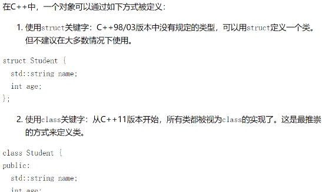

## 如何在前端vue3中处理markdown并使用样式

因为想要在前端实现实时渲染markdown，发现找不到对应的处理。搜了很久，终于找到了需要的方法，在这里分享一下

最终效果展示：


## 在前端vue3中处理markdown

读取markdown为string文本，然后通过最后markdown-it包转成markdown文件。

[markdown-it | markdown-it 中文文档 (docschina.org)](https://markdown-it.docschina.org/#安装)

安装依赖：

```
npm install markdown-it --save
```

用法：script setup中

```js
import MarkdownIt from 'markdown-it'

md = new MarkdownIt();
var result = md.render('# markdown-it rulezz!'); //传入文本
```

template中直接用v-html绑定：

```html
  <div v-html="result"></div>
```

最终在页面显示：



此时会发现如果有代码的话，代码框没有样式，也没有高亮

导入一些其他的样式应该也是可以的，只需要看文件是怎么用引入的就行

### 给markdown添加样式

[sindresorhus/github-markdown-css：复制 GitHub Markdown 样式的最小 CSS 数量](https://github.com/sindresorhus/github-markdown-css?tab=readme-ov-file)

可以添加GitHub的markdown样式

```
npm install github-markdown-css
```

引入依赖：

```js
import 'github-markdown-css';
```

在生成显示markdown的标签加上对应的class：

```vue
  <div v-html="item.content" class="markdown-body" style="font-size: small"></div>
```

可以根据需求引入官方这个：

```css
<style>
	.markdown-body {
		box-sizing: border-box;
		min-width: 200px;
		max-width: 980px;
		margin: 0 auto;
		padding: 45px;
	}

	@media (max-width: 767px) {
		.markdown-body {
			padding: 15px;
		}
	}
</style>
```

然后发现有样式了，但是没有代码高亮

所以还需要加一点东西

[wooorm/starry-night: Syntax highlighting, like GitHub](https://github.com/wooorm/starry-night?tab=readme-ov-file#example-integrating-with-markdown-it)

starry-night会生成基于代码高亮的html的hast 树或者css样式，以及自定义语法，具体可以看官方文档。

[syntax-tree/hast-util-to-html：将 hast 序列化为 HTML 的实用程序 (github.com)](https://github.com/syntax-tree/hast-util-to-html)

 hast-util-to-html将html的hast 树转成HTML的工具。

两者的结合可以生成高亮的代码html文本

安装依赖：

```
npm install @wooorm/starry-night
```

```
npm install hast-util-to-html
```

官方示例：

```js
import fs from 'node:fs/promises'
import {common, createStarryNight} from '@wooorm/starry-night'
import {toHtml} from 'hast-util-to-html'
import markdownIt from 'markdown-it'

const file = await fs.readFile('example.md')
const starryNight = await createStarryNight(common)

const markdownItInstance = markdownIt({
  highlight(value, lang) {
    const scope = starryNight.flagToScope(lang)

    return toHtml({
      type: 'element',
      tagName: 'pre',
      properties: {
        className: scope
          ? [
              'highlight',
              'highlight-' + scope.replace(/^source\./, '').replace(/\./g, '-')
            ]
          : undefined
      },
      children: scope
        ? /** @type {Array<ElementContent>} */ (
            starryNight.highlight(value, scope).children
          )
        : [{type: 'text', value}]
    })
  }
})

const html = markdownItInstance.render(String(file))

console.log(html)
```

在代码中使用上就有一开始所介绍的效果了。

