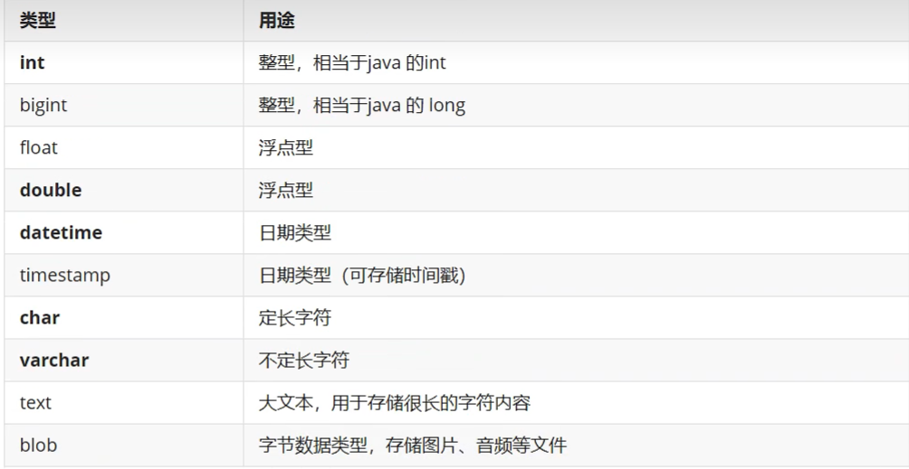
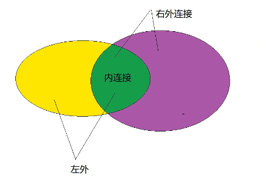
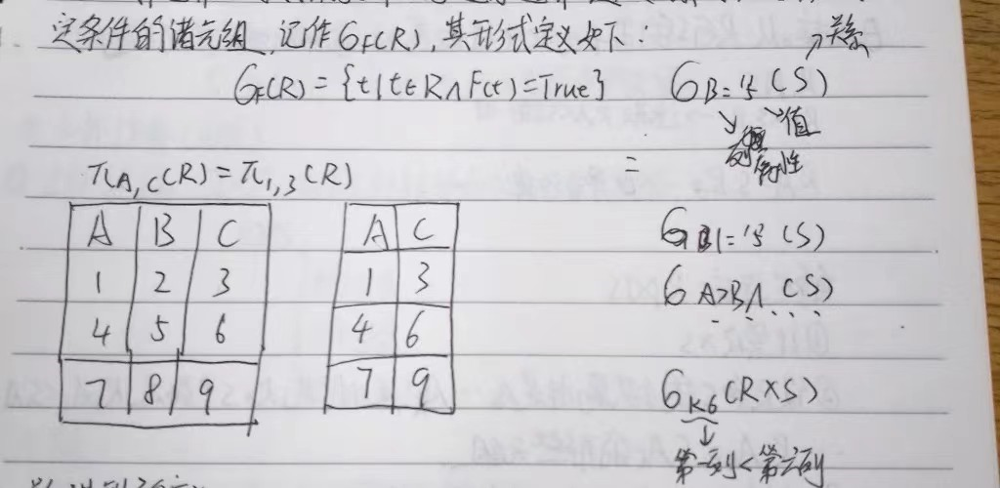

# MySQL 案例实战教程

### 案例1：MySQL的安装



### MySQL数据类型

int/bigint(java的long)

float/double

datetime/timestamp(可储存时间戳)

char(定长字符)/varchar(不定长字符)/text(大文本不限制长度)

blob(字节数据类型，存储图片，音频等文件)

语法

### --建表

```sql
create table 表名（

    字段名 类型 约束（主键，非空，唯一，默认值），
    
    字段名 类型 约束（主键，非空，唯一，默认值），

）编码，存储引擎
```

### 约束和插入数据

- **NOT NULL**:规定某一列不能存储null值
- **UNIQUE**：保证某列的每行都有唯一的值
- **PRIMARY KEY**：NOT NULL和UNIQUE的组合
- **FOREIGN KEY**（尽量少用）：保证一个表中的数据匹配另一个表中的值的参照完全性
- **CHECK**：保证列中的值符合条件
- **DEFAULT**：规定没有列赋值时的默认值
- **AUTO_INCREMENT** 实现自动递增的 ID （**PRIMARY KEY**） INT型

```sql
DROP TABLE IF EXISTS `websites`;
CREATE TABLE `websites`(
    id int(11) NOT NULL AUTO_INCREMENT,
    name char(20) NOT NULL DEFAULT'' COMMENT'站点名称', /*COMMENT 添加 '站点名称'这个注释*/
    url varchar(255) NOT NULL DEFAULT '',/*代表网站的表*/
    alexa int(11) NOT NULL DEFAULT '0' COMMENT'Alexa排名',
    sal double COMMENT'广告收入',
    country char(10) NOT NULL DEFAULT'' COMMENT'国家',
    PRIMARY KEY(id)
)ENGINE=INNODB DEFAULT CHARSET=utf8;
插入

INSERT INTO websites(name,url,alexa,sal,country) VALUES("腾讯","https://www.qq.com",18,1000,'CN');
```


### 外键约束


数据库中的外键（Foreign Key）是用于建立表与表之间关系的一种机制。外键定义了两个表之间的引用关系，它指向另一个表中的主键，用于确保数据的完整性和一致性。

外键通常用于实现表与表之间的关联，常见的关联包括一对一、一对多和多对多关系。

举个例子，我们有两张表：订单表和客户表。其中订单表中有一个外键字段 `customer_id`，它引用了客户表的主键字段 `id`。这个外键可以确保每个订单都必须与一个现有的客户关联。

通过定义外键关系，数据库可以在执行插入、更新和删除操作时自动处理关系的一致性。例如，如果试图在订单表中插入一个未存在于客户表中的客户ID，数据库会拒绝插入操作，从而维护了表之间的关联性。

在创建表时，可以使用类似下面的 SQL 语句添加外键关系：

```sql
CREATE TABLE customers (
  id INT PRIMARY KEY,
  name VARCHAR(100)
);

CREATE TABLE orders (
  id INT PRIMARY KEY,
  order_number VARCHAR(20),
  customer_id INT,
  FOREIGN KEY (customer_id) REFERENCES customers(id)
);
```


在这个例子中，`customers` 表中的 `id` 字段是主键，`orders` 表中的 `customer_id` 字段是外键，引用了 `customers` 表的 `id` 字段。

通过引入外键关系，数据库可以提供数据的完整性和约束，确保关联的数据一致性，并提供便利的查询操作和数据管理。

### 删除

```sql
DELETE FROM websites WHERE id = 5;
```

### 更新

```sql
UPDATE websites SET sal = 2000 WHERE id = 3;
```

### 注释

```sql
-- 单行注释
-- UPDATE websites SET sal = 2000 WHERE id = 3;
/*多行注释*/
```

### 查询

```sql
DROP TABLE IF EXISTS `websites`;
CREATE TABLE `websites`(
    id int(11) NOT NULL AUTO_INCREMENT,
    name char(20) NOT NULL DEFAULT'' COMMENT'站点名称',
    url varchar(255) NOT NULL DEFAULT '',
    alexa int(11) NOT NULL DEFAULT '0' COMMENT'Alexa排名',
    sal double COMMENT'广告收入',
    country char(10) NOT NULL DEFAULT'' COMMENT'国家',
    PRIMARY KEY(id)
)ENGINE=INNODB DEFAULT CHARSET=utf8;

INSERT INTO `websites` VALUES
    (1,'Google', 'https://www.google.com/', '1',2000 , 'USA '),
    (2,'淘宝','https://www.taobao.com/','13',2050,'CN'),
    (3,'菜鸟教程', 'http://www.runoob.com/', '4689' ,0.0001,'CN'),
    (4,'微博', 'http://weibo.com/','20',50,'CN'),
    (5,'Facebook','https://www.facebook.com/','3',500, 'USA');
CREATE TABLE IF NOT EXISTS `access_log`(
    `aid` int(11) NOT NULL AUTO_INCREMENT,
    `site_id` int(11) NOT NULL DEFAULT '0' COMMENT '网站id',
    `count` int(11) NOT NULL DEFAULT '0' COMMENT '访问次数',
    `date` date NOT NULL,
    PRIMARY KEY (`aid`)
) ENGINE=InnoDB DEFAULT CHARSET=utf8;
INSERT INTO `access_log` (`aid`,`site_id`,
`count`,`date`) VALUES
(1,1,45,'2016-05-10'),
(2,3,100,'2016-05-13'),
(3,1,230,'2016-05-14'),
(4,2,10,'2016-05-14'),
(5,5,205,'2016-05-14'),
(6,4,13,'2016-05-15'),
(7,3,220,'2016-05-15'),
(8,5,545,'2016-05-16'),
(9,3,201,'2016-05-17'),
(10,88,9999,'2016-09-09');
```

### 查询语句

实际开发中尽量不要使用*作为查询

```sql
select * from websites

select id,name,url,alexa from websites
```

### 分页查询

```sql
select id,name,url,alexa from websites limit 2,3
-- 从第二条开始查，查三条，0，1，2下标
select * from video order by upload_time desc limit 30 
-- 以upload_time倒序查，限制最多查30条
```

### distinct去重

```sql
select distinct country from websites
```

### where语句

```sql
运算符> < >= <= <> != = 
is null    is not null
like in
```

> 在sql语句中 null值和任何东西比较 都为false，包括null
>

```sql
SELECT * FROM websites WHERE sal IS NOT NULL 
```

### 逻辑条件:and or

```sql
select * from websites where sal<=0 and sal>=2000;/*收入在0到2000之间*/
select * from websites where sal between 2000 and 0;/*和上面效果一样*/
select * from websites where sal<5 or sal is null; /*收入小于5或者没有收入*/
```

### 排序 order by

~~~sql
select * from websites order by sal asc,alexa desc;-- 先按sal升序，再按alexa降序
~~~

### like 通配符

```sql
select * from websites where name like '%O%'
select * from websites where name like '_O%'-- 匹配一个字符
```


### in 匹配多个条件

```sql
select * from websites where country in ('USA','鸟国','CN');
```

### 别名

```sql
select tt.name '网站名字' from websites tt -- tt是表的别名
```

### group by 分组查询

~~~sql

select avg(sal) '平均值' ,country from websites group by country;


select avg(sal) '平均值' ,country from websites group by country HAVING 平均值 > 1200;-- 分了组后，不能用where，只能用having;
~~~

> 子查询
>

> 把查询结果当做一个表来使用
>

### COUNT(*) AS 

COUNT(*) AS 是一种在数据库查询中用于计算满足条件的行数的方法，并将结果以指定的别名展示。

在使用 COUNT(*) AS 时，COUNT(*) 表示计算满足条件的行数，而 AS 关键字用于给结果指定一个别名。

以下是一个示例：

```
SELECT COUNT(*) AS total_count FROM table_name WHERE condition;
```

在上述示例中，table_name 是要查询的表名，condition 是满足条件的过滤条件。COUNT(*) 会计算满足条件的行数，并将结果以别名 total_count 返回。

通过为 COUNT(*) 设置别名，可以更好地理解查询结果。别名可以根据具体需求进行命名，以便在后续的数据处理或展示中使用。

需要注意的是，COUNT(*) 会计算包含 NULL 值的行，因此可能会得到不包括 NULL 值的期望结果时，可以使用 COUNT(column_name) 来计算特定列中非 NULL 值的行数。

查询：

```sql
SELECT TOP 3 WITH TIES 商品类别, COUNT(*) AS 商品数量
FROM 商品表
GROUP BY 商品类别
ORDER BY COUNT(*) DESC;
```

在上述查询语句中，我们使用了以下步骤：

1. 选择要查询的列：选择了 “商品类别” 列和计算的 “商品数量” 列。
2. 指定数据来源：使用 “FROM” 关键字指定了数据来源的表名为 “商品表”。
3. 分组：使用 “GROUP BY” 关键字将结果按 “商品类别” 进行分组。
4. 计算行数：通过使用 “COUNT(*)” 计算每个商品类别的行数，并将结果命名为 “商品数量”。
5. 排序：使用 “ORDER BY” 关键字将结果按照 “商品数量” 进行降序排序。
6. 保留并列出并列的行：通过使用 “TOP 3 WITH TIES”，我们保留了数量前三的行，并且如果有与前三行相同数量的行，则一同列出。

### 连接查询



```sql
/*过时写法*/
/*不加where的话会随意乱连*/
/*内连接*/
select name,a.count,a.date from websites w,access_log a where w.id=a.site_id
```

```sql
/*outer可以省*/
/*左外连接*/
select * from websites w left outer join access_log a
on w.id=a.site_id
union/*实现全连接*/
select * from websites w right join access_log a
on w.id=a.site_id
if null

select name,ifnull(count,0),ifnull(a.date,'无日期') from websites w left outer join access_log a
on w.id=a.site_id
```

### 练习题

```sql
CREATE TABLE dept(
    deptno        INT,
    dname        varchar(14),
    loc        varchar(13)
);
INSERT INTO dept values(10, 'ACCOUNTING', 'NEW YORK');
INSERT INTO dept values(20, 'RESEARCH', 'DALLAS');
INSERT INTO dept values(30, 'SALES', 'CHICAGO');
INSERT INTO dept values(40, 'OPERATIONS', 'BOSTON');

CREATE TABLE emp(
    empno INT,
    ename VARCHAR(50),
    job VARCHAR(50),
    mgr    INT,
    hiredate DATE,
    sal    DECIMAL(7,2),
    comm DECIMAL(7,2),
    deptno INT
) ;
INSERT INTO emp values(7369,'SMITH','CLERK',7902,'1980-12-17',800,NULL,20);
INSERT INTO emp values(7499,'ALLEN','SALESMAN',7698,'1981-02-20',1600,300,30);
INSERT INTO emp values(7521,'WARD','SALESMAN',7698,'1981-02-22',1250,500,30);
INSERT INTO emp values(7566,'JONES','MANAGER',7839,'1981-04-02',2975,NULL,20);
INSERT INTO emp values(7654,'MARTIN','SALESMAN',7698,'1981-09-28',1250,1400,30);
INSERT INTO emp values(7698,'BLAKE','MANAGER',7839,'1981-05-01',2850,NULL,30);
INSERT INTO emp values(7782,'CLARK','MANAGER',7839,'1981-06-09',2450,NULL,10);
INSERT INTO emp values(7788,'SCOTT','ANALYST',7566,'1987-04-19',3000,NULL,20);
INSERT INTO emp values(7839,'KING','PRESIDENT',NULL,'1981-11-17',5000,NULL,10);
INSERT INTO emp values(7844,'TURNER','SALESMAN',7698,'1981-09-08',1500,0,30);
INSERT INTO emp values(7876,'ADAMS','CLERK',7788,'1987-05-23',1100,NULL,20);
INSERT INTO emp values(7900,'JAMES','CLERK',7698,'1981-12-03',950,NULL,30);
INSERT INTO emp values(7902,'FORD','ANALYST',7566,'1981-12-03',3000,NULL,20);
INSERT INTO emp values(7934,'MILLER','CLERK',7782,'1982-01-23',1300,NULL,10);
INSERT INTO emp values(7981,'MILLER','CLERK',7788,'1992-01-23',2600,500,20);
```

### 建立查询索引

在 MySQL 中，建立索引可以提高数据库的查询性能。索引可以加快数据的查找速度，特别是在大型数据表中。以下是建立索引的一般步骤：

1. 选择合适的列：首先，确定需要为哪些列创建索引。选择常用于查询的列或经常用于连接（Join）操作的列。

2. 创建索引：使用 `CREATE INDEX` 语句来创建索引。以下是创建索引的一般语法：

   ```sql
   CREATE INDEX index_name ON table_name (column1, column2, ...);
   ```

   

   - `index_name` 是索引的名称，可以根据你的需求任意指定。
   - `table_name` 是要在其上创建索引的表名。
   - `(column1, column2, ...)` 是要为其创建索引的列名。

   示例：

   ```sql
   CREATE INDEX idx_name ON customers (last_name, first_name);
   ```

   

   上述示例创建了一个名为 `idx_name` 的索引，用于 `customers` 表的 `last_name` 和 `first_name` 两列。

3. 查看索引信息：可以使用 `SHOW INDEX` 语句来查看表的索引信息。例如：

   ```sql
   SHOW INDEX FROM table_name;
   ```

   这将显示 `table_name` 表的索引信息，包括索引名称、列名、唯一性等。

值得注意的是，索引的创建也会对插入、更新和删除操作产生一定的性能影响，因为每次对表进行更改时，MySQL 需要维护索引的一致性。因此，在设计索引时要平衡查询性能和数据更改性能之间的权衡，并选择适合特定场景的索引策略。

此外，还可以考虑使用 `EXPLAIN` 来分析查询语句的执行计划，以进一步优化查询性能和索引选择。

### check和触发器约束

“CHECK” 约束和触发器都是用于强制实施数据完整性和业务规则的两种方法。下面我将对它们进行简要说明：

1. CHECK 约束：

   - CHECK 约束是在创建表时定义的条件，用于限制列中的值。它可以确保插入或更新的数据满足特定的条件。

   - CHECK 约束可以应用于单个列或多个列，可以使用逻辑运算符（如 AND、OR）和比较操作符（如 =、<>、>、< 等）来定义条件。

   - 当违反 CHECK 约束时，对表的插入或更新操作将失败，并返回错误信息。

   - 示例：

     ```sql
     CREATE TABLE products (
       id INT,
       price DECIMAL(10,2),
       quantity INT,
       CONSTRAINT chk_price CHECK (price > 0),
       CONSTRAINT chk_quantity CHECK (quantity >= 0)
     );
     ```

     

     上述示例中，定义了两个 CHECK 约束，确保 “price” 列的值大于 0，“quantity” 列的值大于或等于 0。

2. 触发器 (Triggers)：

   - 触发器是在表上定义的特殊存储过程，当特定的事件（如 INSERT、UPDATE、DELETE）发生时自动触发执行。

   - 触发器可以在表上定义 BEFORE 或 AFTER 事件触发的时间点。

   - 触发器通常用于实现复杂的业务规则、数据验证和数据引用完整性。

   - 示例：

     ```sql
     CREATE TRIGGER trig_employee_insert
     BEFORE INSERT ON employees
     FOR EACH ROW
     BEGIN
       IF NEW.age < 18 THEN
         SIGNAL SQLSTATE '45000' SET MESSAGE_TEXT = 'Employees must be at least 18 years old';
       END IF;
     END;
     ```

     

     上述示例中，定义了一个 BEFORE INSERT 触发器，当在 “employees” 表中进行插入操作时，如果插入的年龄 “age” 小于 18，则触发器会抛出一个错误。

无论是 CHECK 约束还是触发器，都可以帮助确保数据库中的数据完整性和业务规则的一致性。具体使用哪种方法要根据具体需求和情况来决定。CHECK 约束适用于简单的列级约束，而触发器适用于更复杂的逻辑和跨多个表的约束。

### DENY 限制

“DENY” 是一种用于权限管理的数据库操作。它用于拒绝或阻止用户或角色对数据库对象执行特定的操作或访问权限。

在数据库中，DENY 可以应用于不同级别的权限，如表、列、存储过程、视图等。当 DENY 被应用于一个对象时，具有该对象的 DENY 权限的用户或角色将被禁止执行相应的操作。

以下是 DENY 的一些常见使用场景：

1. 对于表操作：使用 DENY 可以阻止用户或角色对表的特定操作，如 SELECT、INSERT、UPDATE、DELETE 或者对表的具体列执行操作。
2. 对于存储过程和函数：DENY 可以阻止用户或角色执行特定的存储过程或函数。
3. 对于视图操作：DENY 可以限制用户或角色对视图的访问，确保只有具有相应权限的用户可以查看或修改视图的数据。
4. 对于模式或数据库级别的操作：DENY 可以拒绝用户或角色对整个模式或数据库执行操作的权限。

需要注意的是，DENY 是一种较为强制的权限设置，它会覆盖其他的权限授予。即使用户拥有其他对象的权限，如果对该对象应用了 DENY，则用户仍然无法执行相应的操作。


要使用 DENY 权限来限制用户或角色对数据库对象的访问和操作，可以按照以下步骤进行操作：

1. 确定对象和权限：首先，确定需要应用 DENY 权限的数据库对象和所需的操作。这可以是表、列、存储过程、视图等。确定想要禁止的操作，如 SELECT、INSERT、UPDATE、DELETE 等。

2. 检查当前权限：使用适当的数据库管理工具或查询语句，检查被授予的权限和当前用户或角色的访问级别。确保在应用 DENY 之前理解当前状态和权限情况。

3. 应用 DENY 权限：根据对象类型和所需的操作，使用相应的权限管理语句来应用 DENY。以下是一些示例：

   - 对于表或列级别的权限：

     ```sql
     DENY SELECT, INSERT, UPDATE ON table_name TO user_or_role;
     ```

     

   - 对于存储过程或函数的权限：

     ```sql
     DENY EXECUTE ON procedure_name TO user_or_role;
     ```

     

   - 对于视图的权限：

     ```sql
     DENY SELECT ON view_name TO user_or_role;
     ```

     

   - 对于模式或数据库级别的权限：

     ```sql
     DENY CREATE TABLE, CREATE PROCEDURE ON schema_name TO user_or_role;
     ```

     

   在以上示例中，`table_name`、`procedure_name`、`view_name` 和 `schema_name` 是要应用 DENY 权限的具体对象的名称，`user_or_role` 是要限制的用户或角色名称。

   **注意**：当权限冲突的时候优先执行DENY

# 数据库理论知识

## 数据模型

**数据模型分类:**

1. 从信息世界中抽象的数据模型称为概念数据模型
2. 从计算机世界中抽象出的DBMS支持的数据模型称为结构数据

**概念数据模型**:一般采用实体-联系方式（E-R方法）表示

**实体**:客观存在并可以互相区别的事物称为实体

**属性**:描述实体的特性称为属性

**码**:唯一标识实体的属性称为码

**域**:属性的取值范围称为该属性的域，性别域（男，女）

**联系**:实体（型）之间的对应关系称为联系

1:1 班与班之间是一对一联系
1:n 班与学生之间是一对多联系
m:n 课程和学生之间是多对多联系

**实体-联系方式**:E-R图
实体型用矩型表示，属性用椭圆形表示并用无向边将其与相应的实体联系起来；联系用菱形表示

**结构数据模型**
        结构数据模型是直接面向数据库的逻辑结构
 （2）**层次模型**
       **层次模型是用“树结构”来表示数据之间的联系**，是数据库系统最早使用的一种模型，它的数据结构是一棵“有向树”。
     **层次模型的特征**:1.仅有一个结点没有父结点，它就是根结点。
2.其他结点有且仅有一个父结点
（4）**关系模型**
       关系模型是一种用二维表格结构开表示实体与实体之间联系的数据模型。

## 三级模式和两级映像

不同数据的产品有很多，数据的存储结构也各不相同，但**体系结构**基本上都**具有相同的特征**，采用“**三级模式和两级映像”**。

**三级模式:外模式，概念模式，内模式。**
**对应:视图，基本表，储存文件**
**两级映像    模式=概念模式**

（1）模式/内模式映像  **物理独立性**
（2）外模式/模式映像 **逻辑独立性**

**关系**:一个关系就是一张二维表，每个关系有一个关系名。

**元组**:表中的一行即为一个元组，对应储存文件中的一个记录值。

**关系模式**:关系名（属性名1，属性名2，……属性名n）

**候选码**（或候选键）:属性或属性组合，其值能够唯一地标识一个元组

**主码**:在一个关系中可能有多个候选码，从中选择几个作为主码。

**外码或外键**:如果一个关系中的属性或属性组并非该关系的码，但它们是另外一个关系的码，则称为该关系的外码
     但它们是另外一个关系的码，则称为该关系的外码

## 2.1.2关系的数字定义

本节用集合代数给出二维表的关系定义。
    **1.笛卡尔积**
设D1,D2......Dn为任意集合，定义D1,D2......Dn的笛卡尔积为:D1xD2x......Dn={（d1,d2,......,dn）| di属于Di,i=1,......,n}
其中每个元素:{（d1,d2,......,dn）}叫做一个n元组。
D1={0,1},D2={a,b,c} D1的元素要与D2所有元素对齐
D1xD2={(0,a),(0,b),(0,c),(1,a),(1,b),(1,c)}
**4.投影**
     投影运算是从关系的垂直方向进行运算，在关系中选出若干属性列A组成新的关系记为πA（R）。
**5.选择**
    选择运算是从关系的水平方向进行运算，是从关系R中选择满足给定关系的诸元组，记作6f（R），其形式定义如下:   



## 关系模型的定义

​    **关系的描述为关系模式，可以表示为R（U，D , dom , F ）**
​       简记为R(U)  R为关系名，U为属性名集合
U为属性名集合，D为属性的域，dom为属性向域的映像集合，F为属性间的依赖关系集合
​        关系模型由**数据结构**，**关系操作集合**和**关系完整性约束**三部分组成

​       (1)**关系模型中关系数据结构**

​       (3)**关系模型中的关系完整性约束**

​                 实体完整性：关系中主码的值不能为空或部分为空，也就是说，主码中属性即主属性不能取空值。

​                 参照完整性：如果关系R2的外码与关系R1的主码相对应，则外码X（每个值必须在关系R1中的主码的值中找到或者空值）的用户定义的完整性：指用户对某一具体数据指定的约束条件进行检验。

## 连接

从R与S的笛卡尔积中选取属性间满足一定条件的元组


5.外连接

​    外连接运算是连接运算的扩展，可以处理由于运算而缺失的信息。外连接运算有3种即左外连接，右外连接和全外连接

## 自然连接


## **除法运算**

在关系型数据库中，“除法运算”是指在两个关系之间执行一种特殊的查询操作，用于找出符合某种条件的组合。

假设我们有两个关系 R(A, B) 和 S(B, C)，其中 R 中的**属性 A 是主键**，S 中的属性 B 是**外键引用 R 的主键 A**。

除法运算的目标是找出符合条件的组合，也就是在 R 和 S 中，所有在 R 中的每个元组 A 在 S 中都可以找到对应的元组 B。换句话说，对于 R 中的每个元组 A，如果存在一个或多个 S 中的元组 B，使得 B 的 B 值与 A 的 A 值相等，则将这些组合作为结果返回。

SQL 中并没有直接支持除法运算的操作符，但可以使用其他查询操作来实现除法运算。下面是一个使用 SQL 查询实现关系除法的示例：

```sql
SELECT R.A
FROM R
WHERE NOT EXISTS (
  SELECT *
  FROM S
  WHERE S.B NOT IN (SELECT B FROM S WHERE S.B = R.A)
)
```


在这个例子中，我们使用子查询和 NOT EXISTS 条件来实现除法运算。首先，在外层查询中选择 R 表的主键 A。然后，在子查询中，我们检查 S 表中是否存在与 R 表中的 A 值相匹配的元组。如果找不到匹配的元组 B，则将 R 表中的 A 返回。

需要注意的是，除法运算在实际应用中相对较少使用，通常需要考虑性能和数据特征。在某些情况下，可能会使用其他查询操作或关系代数运算符来替代除法运算。

```vue
<template>
  <div id="menu" style="height:100%;">
    <MNG_Menu>
        <div style="width: auto;
        display: grid;
        grid-template-columns: 3fr 7fr;
        ">
    <div style="display: flex; justify-content: center; align-items: center; width: 100%; margin: 0px;">
     <div style="display: grid; gap: 10px; width: 100%;"> 
      <h1 style="display: flex; justify-content: center; align-items: center;">用户评论</h1>
      <n-input placeholder="标题" v-model:value="custom_title" :disabled="change_open">
      <template #prefix>
      </template>
    </n-input>
    <n-input placeholder="描述" v-model:value="custom_description" :disabled="change_open">
      <template #prefix>
      </template>
    </n-input>
              <form  action="http://127.0.0.1:5000/admin/custom/img"  target="result-frame" method="post" enctype="multipart/form-data">
              <input type="text" name="id"   v-model="custom_ID" style="display: none;"/>
                <input type="file" name="file" style="display: none;" ref="uploadimg"/>
                <button type="submit" ref="uploadRef" style="display: none;">隐藏按钮</button>
          </form>
          <n-button type="primary"  @click="updateFile" :disabled="change_open" >
     上传文件
    </n-button>
          <n-button type="primary"  @click="update_action" :disabled="change_open" >
     添加
    </n-button>
    <n-button type="primary"  @click="change_open = true" :disabled="change_open" >
     修改
    </n-button>
          <iframe  name="result-frame" style="display: none;"></iframe>
     </div>
    </div>
           <n-loading-bar-provider>
      <n-message-provider>
        <n-notification-provider>
          <n-dialog-provider>
            <custom_Data :addBannersChange="addBannersChange"/>
          </n-dialog-provider>
        </n-notification-provider>
      </n-message-provider>
    </n-loading-bar-provider>
        </div>
    </MNG_Menu>
  </div>
    <Teleport to="#menu">
  <Transition name="slide-fade">
  <div v-if="change_open" class="demo modal-demo" style="width: 350px;">
    <div style="display: flex; justify-content: center; align-items: center; width: 100%; margin: 0px;">
     <div style="display: grid; gap: 10px; width: 100%;"> 
      <h1 style="display: flex; justify-content: center; align-items: center;">用户评论</h1>
      <n-input placeholder="ID" v-model:value="change_custom_ID">
      <template #prefix>
      </template>
    </n-input>
      <n-input placeholder="标题" v-model:value="change_custom_title">
      <template #prefix>
      </template>
    </n-input>
    <n-input placeholder="描述" v-model:value="change_custom_description">
      <template #prefix>
      </template>
    </n-input>
              <form  action="http://127.0.0.1:5000/admin/custom/img"  target="result-frame" method="post" enctype="multipart/form-data">
              <input type="text" name="id"   v-model="change_custom_ID" style="display: none;"/>
                <input type="file" name="file" style="display: none;" ref="uploadimg"/>
                <button type="submit" ref="change_uploadRef" style="display: none;">隐藏按钮</button>
          </form>
          <n-button type="primary"  @click="updateFile" >
     上传文件
    </n-button>
          <n-button type="primary"  @click="change_action" >
     修改
    </n-button>
    <n-button type="primary"  @click="change_open = false" >
     返回
    </n-button>
          <iframe  name="result-frame" style="display: none;"></iframe>
     </div>
    </div>
  </div>
</Transition>
</Teleport>
      </template>
      
      <script>
      import custom_Data from "./custom_Data.vue";
      import { defineComponent,ref,onMounted,nextTick, watch} from 'vue';
      import { useMessage } from 'naive-ui'
      import axios from "axios";

      export default defineComponent({
        data(){
        return{
          custom_ID: '',
          custom_title:'',
          custom_description:'',
          change_custom_ID: '',
          change_custom_title:'',
          change_custom_description:'',
          addBannersChange: true,
          message: useMessage(),
          change_open: false
        }
        },
        components:{
          custom_Data
        },
        methods:{
        update_action(){
          nextTick();
          //进行提交操作
          console.log("提交");
          axios.post('http://127.0.0.1:5000/admin/custom',{
    title: this.custom_title,
    description: this.custom_description
}) .then( (response)=> {
    if(response.data.status_code != 0){
      this.message.warning(response.data.status_msg);
    }else{
      //取得id提交表单
      this.custom_ID = ref(response.data.img_id);
      this.$nextTick(()=>{
        console.log("dom执行了");
        this.$refs.uploadRef.click();
        //刷新页面操作,使得监听器知道改变了状态
        this.addBannersChange = !this.addBannersChange
      })
      this.custom_ID='';
      this.custom_title='';
      this.custom_description='';
      this.message.success(response.data.status_msg);
    }
  })
  .catch(function (error) {
    this.message.warning(error);
  });
        },
        updateFile(){
          this.$nextTick(()=>{
            this.$refs.uploadimg.click();
          })
        },
        //修改操作
        change_action(){
          nextTick()
          axios.post('http://127.0.0.1:5000/admin/custom/change',{
    id: this.change_custom_ID,
    title: this.change_custom_title,
    description: this.change_custom_description
})
  .then( (response)=> {
    if(response.data.status_code != 0){
      this.message.warning(response.data.status_msg);
    }else{
      //提交图片并且刷新页面
      this.$nextTick(()=>{
        this.$refs.change_uploadRef.click();
        //刷新页面操作,使得监听器知道改变了状态
        this.addBannersChange = !this.addBannersChange
      })
      window.location.reload();
      this.change_custom_ID='';
      this.change_custom_title='';
      this.change_custom_description='';
      this.message.success(response.data.status_msg);
    }
  })
  .catch(function (error) {
    this.message.warning(error);
  });
        }
        },
        setup(){
          const change_uploadRef = ref(null)
          const uploadRef =ref(null);
          const uploadimg =ref(null);
          onMounted (()=>{
            console.log(change_uploadRef.value);
            console.log(uploadRef.value);
            console.log(uploadimg.value);
          })
          return {
            uploadRef,
            uploadimg,
            change_uploadRef
          }
        }
      });
      </script>
      <style>
      .demo {
          padding: 22px 24px;
          border-radius: 8px;
          box-shadow: var(--vt-shadow-2);
          margin-bottom: 1.2em;
          transition: background-color .5s ease;
      }
      .modal-demo {
          position: fixed;
          z-index: 999;
          top: 20%;
          left: 50%;
          width: auto;
          margin-left: -150px;
          background-color:rgb(255, 255, 255);
          padding: 30px;
          border-radius: 8px;
          box-shadow: 0 4px 16px #00000026;
      }
      .slide-fade-enter-active {
        transition: all 0.3s ease-out;
      }
      
      .slide-fade-leave-active {
        transition: all 0.5s cubic-bezier(1, 0.5, 0.8, 1);
      }
      
      .slide-fade-enter-from,
      .slide-fade-leave-to {
        transform: translateX(20px);
        opacity: 0;
      }
      </style>
```

