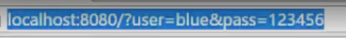

# 一、列表标签

目标：能够使用==无序列表、有序列表、自定义列表==标签，实现网页中列表结构的搭建

学习路径：

## 列表的应用场景

1. 场景：在网页中按照行展示关联性的内容，如：新闻列表、排行榜、账单等
2. 特点：按照行的方式，整齐显示内容
3. 种类：无序列表、有序列表、自定义列表

## 无序列表

1. 场景：在网页中表示一组无顺序之分的列表，如：新闻列表

2. 标签组成：

   | 标签名 | 说明                                       |
   | ------ | ------------------------------------------ |
   | ul     | 表示无序列表的整体，用于包裹li标签         |
   | li     | 表示无序列表的每一项，用于包含每一行的内容 |

3. 显示特点：列表的每一项前默认显示圆点标识

4. 注意点：

   - ul标签中只允许包含li标签
   - li标签可以包含任意内容

5. 使用方法：

   ```html
   <ul>
   	<li>第一项</li>
   	<li>第二项</li>
   	<li>第三项</li>
   </ul>
   ```

   

## 有序列表

1. 场景：在网页中表示一组有顺序之分的列表，如：排行榜。

2. 标签组成：

   | 标签名 | 说明                                       |
   | ------ | ------------------------------------------ |
   | ol     | 表示有序列表的整体，用于包裹li标签         |
   | li     | 表示有序列表的每一项，用于包含每一行的内容 |

3. 显示特点：列表的每一项前默认显示序号标识

4. 注意点：

   - ol标签中只允许包含li标签
   - li标签可以包含任意内容

5. 使用方法：

   ```html
   <ol>
       <li>第一项</li>
       <li>第二项</li>
       <li>第三项</li>
   </ol>
   ```

   

## 自定义列表

1. 场景：在网页的地步导航中通常会使用自定义列表实现

2. 标签组成：

   | 标签名 | 说明                                    |
   | ------ | --------------------------------------- |
   | dl     | 表示自定义列表的整体，用于包裹dt/dd标签 |
   | dt     | 表示自定义列表的主题                    |
   | dd     | 表示自定义列表的针对主题的每一项内容    |

3. 显示特点：dd前会默认显示缩进效果

4. 注意点

   - dl标签中只允许包含dt/dd标签
   - dt/dd标签可以包含任意内容

5. 使用方法：

   ```html
   <dl>
       <dt>列表主题</dt>
       <dd>第一项</dd>
       <dd>第二项</dd>
   </dl>
   ```

# 二、表格标签

目标：能够使用==表格相关标签和属性==，实现网页中表格结构的搭建

学习路径：

## 表格的基本标签

1. 场景：在网页中以行+列的单元格的方式整齐展示数据，如：学生成绩表

2. 基本标签：

   | 标签名 | 说明                       |
   | ------ | -------------------------- |
   | table  | 表格整体，可用于包裹多个tr |
   | tr     | 表格每行，可用于包裹td     |
   | td     | 表格单元格，可用于包裹内容 |

3. 注意点：标签的嵌套关系：table > tr > td

4. 使用方法：

   ```html
   <table>
       <tr><!--第一行-->
       	<td>第一格</td>
           <td>第二格</td>
       </tr>
       <tr><!--第二行-->
       	<td>第一格</td>
           <td>第二格</td>
       </tr>
   </table>
   ```

   

## 表格相关属性

1. 场景：设置表格基本展示效果

2. 常见相关属性：

   | 属性名 | 属性值 | 效果     |
   | ------ | ------ | -------- |
   | border | 数字   | 边框宽度 |
   | width  | 数字   | 表格宽度 |
   | height | 数字   | 表格高度 |

3. 注意点：实际开发时针对样式效果==推荐用CSS设置==

4. 使用方法：

   ```html
   <table border="1" width="500" height="300">
       <tr><!--第一行-->
       	<td>第一格</td>
           <td>第二格</td>
       </tr>
       <tr><!--第二行-->
       	<td>第一格</td>
           <td>第二格</td>
       </tr>
   </table>
   ```

   

## 表格标题和表头单元格标签

1. 场景：在表格中表示整体大标题和一列小标题

2. 其他标签：

   | 标签名  | 名称       | 说明                                                         |
   | ------- | ---------- | ------------------------------------------------------------ |
   | caption | 表格大标题 | 表示表格整体大标题，默认在表格整体顶部居中位置显示           |
   | th      | 表头单元格 | 表示一列小标题，通常用于表格第一行，默认内部文字加粗并居中显示 |

3. 注意点：

   - caption标签书写在table标签内部
   - th标签书写在tr标签内部（用于替换td标签）

4. 使用方法：

   ```html
   <table border="1" width="500" height="300">
       <caption>表格标题</caption>
       <tr><!--第一行小标题-->
       	<th>第一格</th>
           <th>第二格</th>
       </tr>
       <tr><!--第二行-->
       	<td>第一格</td>
           <td>第二格</td>
       </tr>
   </table>
   ```

   

## 表格的结构标签（了解）

1. 场景：让表格的内容结构分组。突出表格的不同部分（头部、主题、底部），使语义更加清晰

2. 结构标签：

   | 标签名 | 名称     |
   | ------ | -------- |
   | thead  | 表格头部 |
   | tbody  | 表格主体 |
   | tfoot  | 表格底部 |

3. 注意点：

   - ==表格结构标签内部用于包裹tr标签==
   - 表格的结构标签可以省略

4. 使用方法：

   ```html
   <table border="1" width="500" height="300">
       <caption>表格标题</caption>
       <thead><!--表格头部-->
           <tr><!--第一行小标题-->
               <th>第一格</th>
               <th>第二格</th>
           </tr>
       </thead>
       <tbody><!--表格主体-->
           <tr><!--主体第一行-->
               <td>第一格</td>
               <td>第二格</td>
           </tr>
           <tr><!--主体第二行-->
               <td>第一格</td>
               <td>第二格</td>
           </tr>
       </tbody>
       <tfoot><!--表格底部-->
       	<tr><!--底部第一行-->
       		<td>第一格</td>
           	<td>第二格</td>
      	 	</tr>
       </tfoot>
   </table>
   ```

   

## 合并单元格

1. 场景：使==水平或垂直==对个单元格==合并成一个单元格==

2. 通过左上原则，确定保留谁删除谁

   - 上下合并只保留最上的，删除其他
   - 左右合并只保留最左的，删除其他

3. 给保留的单元格设置：跨行合并（rowspan）或者跨列合并（colspan）

   | 属性名  | 属性值           | 说明                             |
   | ------- | ---------------- | -------------------------------- |
   | rowspan | 合并单元格的个数 | 跨行合并，将多行的单元格垂直合并 |
   | colspan | 合并单元格的个数 | 跨列合并，将多列的单元格水平合并 |

4. 注意点：只有同一个结构标签中的单元格才能合并，不能跨结构标签合并

5. 使用方法：

   ```html
   <table border="1" width="500" height="300">
       <caption>表格标题</caption>
       <thead><!--表格头部-->
           <tr><!--第一行小标题-->
               <th>第一格</th>
               <th>第二格</th>
           </tr>
       </thead>
       <tbody><!--表格主体-->
           <tr><!--主体第一行-->
               <td>第一格</td>
               <td rowspan="2">第二格</td>
           </tr>
           <tr><!--主体第二行-->
               <td>第一格</td>
           </tr>
       </tbody>
       <tfoot><!--表格底部-->
       	<tr><!--底部第一行-->
       		<td colspan="2">第一格</td>
      	 	</tr>
       </tfoot>
   </table>
   ```

   

# 三、表单标签

目标：能够使用==表单相关标签和属性==，实现网页中表单类网页结构搭建

学习路径：

## input系列标签

### input系列标签的基本介绍

1. 场景：在网页中显示手机用户信息的表单效果，如：登录页、注册页

2. 标签名：input

   - input标签可以通过==type属性值的不同==，展示不同效果

3. type属性值：

   | 标签名 | type属性值 | 说明                                     |
   | ------ | ---------- | ---------------------------------------- |
   | input  | text       | 文本框，用于输入单行文本                 |
   | input  | password   | 密码框，用于输入密码                     |
   | input  | radio      | 单选框，用于多选一                       |
   | input  | checkbox   | 多选框，用于多选多                       |
   | input  | file       | 文件选择，用于之后上传文件               |
   | input  | submit     | 提交按钮，用于提交                       |
   | input  | reset      | 重置按钮，用于重置                       |
   | input  | button     | 普通按钮，默认无功能，之后配合js添加功能 |
   
   ```html
   <input type="type属性值">
   ```
   
   

### input系列标签-文本框

1. 场景：在网页中显示输入单行文本的表单控件

2. type属性值：text或password

3. 常用属性：

   | 属性名      | 说明                           |
   | ----------- | ------------------------------ |
   | placeholder | 占位符，提示用户输入内容的文本 |

4. 使用方法：

   ```html
   <input type="text" placeholder="占位符内容">
   <input type="password" placeholder="占位符内容">
   ```


### input系列标签-单选框

1. 场景：在网页中显示多选一的单选表单控件

2. type属性值：radio

3. 常用属性：

   | 属性名  | 说明                                                         |
   | ------- | ------------------------------------------------------------ |
   | name    | 分组。有相同name属性值的单选框为一组，一组中同时只能有一个被选中 |
   | checked | 默认选中                                                     |

4. 注意点：

   - name属性对于单选框有分组功能
   - 有相同name属性值的单选框为一组，一组中同时只能有一个被选中

5. 使用方法：

   ```html
   <input type="radio" name="1" checked>内容
   <input type="radio" name="1">内容
   ```

   

### input系列标签-文件选择

1. 场景：在网页中显示==文件选择的==表单控件

2. type属性值：file

3. 常用属性：

   | 属性名   | 说明       |
   | -------- | ---------- |
   | multiple | 多文件选择 |

4. 使用方法：

   ```html
   <input type="file" multiple>
   ```

   

### input系列标签-按钮

1. 场景：在网页中显示==不同功能的按钮==表单控件

2. type属性值：

   | 标签名 | type属性值 | 说明                                     |
   | ------ | ---------- | ---------------------------------------- |
   | input  | submit     | 提交按钮。点击之后提交数据给后端服务器   |
   | input  | reset      | 重置按钮。点击之后恢复表单默认值         |
   | input  | button     | 普通按钮。默认无功能，之后配合js添加功能 |

3. 注意点：

   - 如果需要实现以上按钮功能，需要配合form标签使用
   - form使用方法：用form标签把表单标签一起包裹起来即可

4. 使用方法：

   ```html
   <form action="目标地址">
       <input type="submit">
       <input type="reset">
       <input type="button" value="按钮">
   </form>
   ```

### input系列标签-上传文件

1. 场景：在网页中需要上传文件
2. type属性值：file

当使用标签的type属性设置为"file"时，可以实现文件上传功能。以下是一个简单的HTML示例：

```html
<!DOCTYPE html>
<html>
<head>
  <title>文件上传</title>
</head>
<body>

  <h2>请选择要上传的文件:</h2>

  <form action="/upload" method="post" enctype="multipart/form-data">
    <input type="file" id="myFile" name="myFile"><br><br>
    <input type="submit" value="上传文件">
  </form>

</body>
</html>
```

上面的示例中，form标签的action属性指定了上传文件的目标URL，method属性指定了使用POST方法进行提交。enctype属性设置为"multipart/form-data"以支持文件上传，后端node.js需要用到multer中间件来处理该文件。

在这个简单的表单中，输入框的type属性设置为"file"，id属性为"myFile"，name属性为"myFile"，这个name属性值会在上传时用于标识上传的文件（后端用来确定接受哪一个文件的标识）。

当用户点击"上传文件"按钮时，表单将会提交到指定的URL，然后服务器端会处理文件并返回响应。


## Form向后端提交表单数据方法

```html
 <form action="http://localhost:8080/" method="get">
		用户: <input type="text" name="user" value=""><br>
        密码: <input type="password" name="pass" value=""><br>
              <input type="submit" value="提交">
        </form> 
```

**当点击提交的时候，就会自动提交表单给后端**

action里面填入的是提交到的地址



## button按钮标签

1. 场景：在网页中显示用户点击的按钮

2. 标签名：button

3. type属性值（同input的按钮系列）：
   | 标签名 | type属性值 | 说明                                     |
   | ------ | ---------- | ---------------------------------------- |
   | button | submit     | 提交按钮。点击之后提交数据给后端服务器   |
   | button | reset      | 重置按钮。点击之后恢复表单默认值         |
   | button | button     | 普通按钮。默认无功能，之后配合js添加功能 |

4. 注意点：

   - 谷歌浏览器中button默认是提交按钮
   - button标签是双标签，更便于包裹其他内容：文字、图片等

5. 使用方法：

   ```html
   <button>我是按钮</button>
   <button type="submit">提交</button>
   <button type="reset">重置</button>
   <button type="button">无功能按钮</button>
   ```

   

## select下拉菜单标签

1. 场景：在网页中提供多个选择项的下拉菜单表单控件

2. 标签组成：

   - select标签：下拉菜单的整体
   - option标签：下拉菜单的每一项

3. 常见属性：selected：下拉菜单的默认选中

4. 使用方法：

   ```html
   <select>
       <option>第一项</option>
       <option>第二项</option>
       <option>第三项</option>
   </select>
   ```

   

## textarea文本域标签

1. 场景：在网页中提供可输入多行文本的表单控件

2. 标签名：textarea

3. 常见属性：

   | 属性名 | 说明                   |
   | ------ | ---------------------- |
   | cols   | 规定了文本域内可见宽度 |
   | rows   | 规定了文本域内可见行数 |

4. 注意点：

   - 右下角可以拖拽改变大小
   - 实际开发时针对于样式效果==推荐用CSS设置==

5. 使用方法：

   ```html
   <textarea cols="宽度" rows="高度"></textarea>
   ```

   

## label标签

1. 场景：常用于绑定内容与表单标签的关系

2. 标签名：Label

3. 使用方法：

   1. 方法一：

      ```html
      <input type="radio" id="属性1"> <label for="属性1">内容</label>
      ```

      - 使用label标签把内容（如：文本）包裹起来

      - 在表单标签上添加id属性
      - 在label标签的for属性中设置对应的id属性值

   2. 方法二：

      ```html
      <label><input type="redio"> 内容 </label>
      ```

      - 直接使用label标签把内容（如：文本）和表单标签一起包裹起来
      - 需要把label标签的for属性删除即可

# 四、语义化标签

目标：能够认识开发中常用的==没有语义布局标签（div、span）==和有语义的布局标签

学习路径：

## 没有语义的布局标签

1. 场景：实际开发网页时会大量频繁的使用到div和span这两个没语义的布局标签

2. 特点：

   - div标签：一行只显示一个（独占一行）
   - span标签：一行可以显示多个

3. 使用方法：

   ```html
   普通文字<!--效果和div标签一样-->
   <div>这是div标签</div>
   <span>这是span标签</span><span>这是span标签</span><!--两个标签在同一行-->
   ```

   

## 有语义的布局标签（了解）

1. 场景：在html5新版本中，推出了一些有语义的布局标签供开发者使用

2. 标签：

   | 标签名  | 语义       |
   | ------- | ---------- |
   | header  | 网页头部   |
   | nav     | 网页导航   |
   | footer  | 网页底部   |
   | aside   | 网页侧边栏 |
   | section | 网页区块   |
   | article | 网页文章   |

   

3. 注意点：

   - 以上标签显示特点和div一致，但是比div多了不同的语义

   - 用于手机网页开发

4. 使用方法：

   ```html
   <header>网页头部</header>
   <nav>网页导航</nav>
   <footer>网页底部</footer>
   <aside>侧边栏</aside>
   <section>网页区块</section>
   <article>网页文章</article>
   ```

   # 字符实体

   目标：能通过==字符实体==在网页中显示特殊符号

   学习路径：

   ## html中的空格合并现象

   - 输入多个空格会被合并导致只会识别出一个空格
   - 通过==&nbsp==实现输入空格

   ## 常见字符实体

   1. 场景：在网页中展示特殊符号效果时，需要使用字符实体替代

   2. 结构：&英文

   3. 常见字符实体(实体名称后需加==分号 ;== )

      | 显示结果 | 描述              | 实体名称         |
      | -------- | ----------------- | ---------------- |
      |          | ==空格==          | ==&nbsp==（重要) |
      | <        | 小于号            | &It              |
      | >        | 大于号            | &gt              |
      | &        | 和号              | &amp             |
      | "        | 双引号            | &quot            |
      | '        | 单引号            | &apos(IE不支持)  |
      | ￠       | 分（cent）        | &cent            |
      | £        | 镑（pound）       | &pound           |
      | ¥        | 原（yen）         | &yen             |
      | €        | 欧元（euro）      | &euro            |
      | §        | 小节              | &sect            |
      | ©        | 版权（copyright） | &copy            |

      