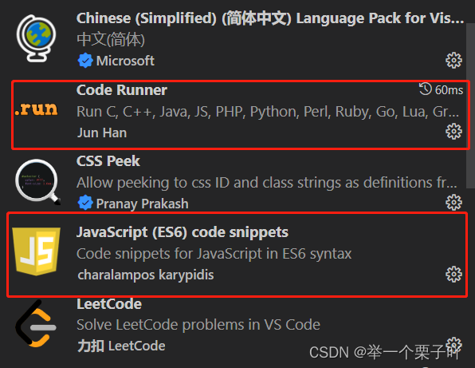
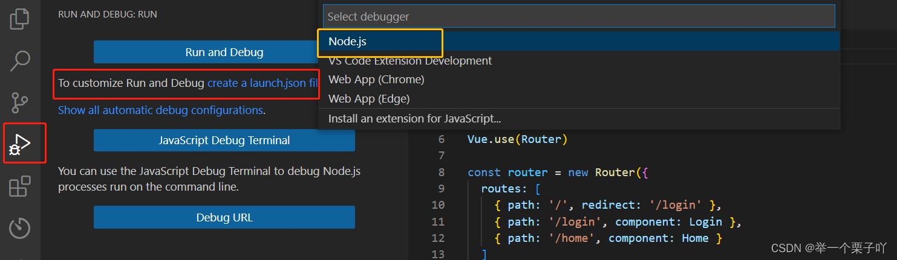
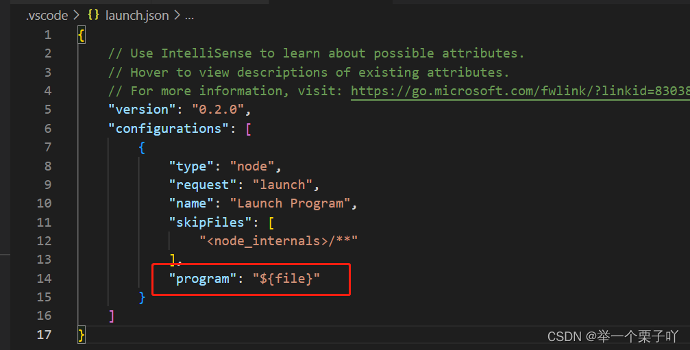

** <center>*邓理戈*</center>**


# <font color= " #FF0000"><center>第一章 基础部分</center> </font>

---
## <font color= "#0000dd">1.第一节 绪论</font>

### 1.1 NodeJS的优势

* **性能特别高**
  
| 编程语言 |  nodejs  |  php |
| :---: | :---: | :---: |
| 反馈时间  |  1s |  1min30s |
| 所需服务器  |  3台  |  200台 |
| 投入资金  |  6w  |  400w |

*  **跟前台的JS配合方便**  
*  **便于前端学习**

### 1.2 NodeJs在终端的操作
* **切换盘符：d: / e: / c:**

* **改变目录：cd 目录名.js**

* **执行程序：node xxx.js**

  

---

## VSCode配置（识别node.js语法）

1. 先在VSCode里面安装两个插件，一个是负责运行的Code Runner，一个是JS的语法提示JavaScript(ES6) code snippets。

   
   
   2. 创建配置文件，打开代码文件夹，先创建一个test.js，随便写几句测试代码。然后点击左边侧边栏的调试工具，选择创建launch.json文件。选择node.js调试环境。
   
      



3.此时配置文件会自动生成，注意重点要修改一个地方，这里不要写死。将program属性改成${file}，这样可以识别当前调试的文件，不需要每次都在这里更换文件名，调试哪个文件直接F5就OK。



```
代码运行： node 文件名.js
```

## <font color= "#0000dd">2.第二节 NodeJS搭建服务器</font>


<div align="center">  </div>

1. **request**  请求    输入-请求的信息
2. **response** 响应    输出-输出给浏览器的东西

### 2.1 http协议

```js {.line-numbers}  
const http=require('http');//require引用模块
var server=http.createServer(function(req,res) //创建一个服务器 res回应客户端
{
    switch(req.url){//得到请求 
        case '/1.html':
            res.write("111111"); //向前端页面写入
            break;
        case '/2.html':
            res.write("222222");
            break;
        default:            
            res.write("404");
            break;
    }
res.end();//结束请求
});

// 监听-类比前台等着客人来并招呼
// 端口-通过数字来区分，数字可以自己来创造（也有可能已经被占用）端口共存和端口转发后面会提到
server.listen(8080);
```

**上述代码缺点:**
1. 使用switch开关如果应对大量的访问代码就会很麻烦
2. 只能反馈文字内容，图片、视频等二进制内容不能使用上面代码实现
3. 修改内容后服务器必须重新启动

---

## <font color= "#0000dd">3.第三节 文件操作</font>

| 异步操作 | 同步操作 |
| :---: | :---: |
| 多个操作同时进行 | 一次只能进行一个操作 |

* 文件操作是异步操作

<div align="center">  </div>


### 3.1 读写文件代码
```js {.line-numbers}  
const fs=require('fs');
const fs=require('http');
fs.readFile('aaa.txt',function(err,data)//读取文件，二进制
{
   if(err){
    console.log('读取失败');
   }
   else{
    console.log(data.toString()); // 读取文字内容
   }
});
fs.writeFile('bbb.txt',"efffsfdf",function(err)
{
    console.log(err);
});
```

### 3.2 读取本地网页代码

**客户端读取本地网页**

**<font color= "FF0000">注意下方res.end()的位置</font>**
```js {.line-numbers}  
const http=require('http');
const fs=require('fs');
var server=http.createServer(function(req,res)
{
    // req.url => '/index.html'
    // 读取 => './www/index.html' 这里是文件存放的地址
    //  './www'+req.url
    var file_name='./www'+req.url;
    fs.readFile(file_name,function(err,data){
        if(err){
            res.write('404');
        }
        else{
            res.write(data); //将页面以二进制的方式  写入到客户端
        }
        res.end();//没读完文件前不许截止
    });
    //res.end();//如果写在这里，可能会提前截止，因为是异步操作
});
server.listen(8080)
```

---

## <font color= "#0000dd">4.第四节 GET方法</font>
* 数据请求：
    1. 前台 -> form,ajax,jsonp
    2. 后台 -> 都一样
    3. 前台< - http协议 - >后台
* 请求方式:
    1. **GET：数据在url中**
    2. **POST：数据不在url中**
* GET数据解析：
    1. 自己切
    2. queryString
    3. urllib

**form表单代码**
```html {.line-numbers} 
<!DOCTYPE html>
<html>
	<!-- <head> -->
        <meta charset="utf-8">
		<title></title>
	</head>
	<body>
        <form action="http://localhost:8080/" method="get">
		用户: <input type="text" name="user" value=""><br>
        密码: <input type="password" name="pass" value=""><br>
              <input type="submit" value="提交">
        </form> 
	</body>
</html>
```
### 4.1 get接收数据请求方法1(麻烦)
```js {.line-numbers}  
const http=require('http');
http.createServer(function(req,res){
    var GET={user:'blue',pass:'123456'};//用来存放读取的数据，类似字典
   if(req.url.indexOf('?')!=-1)
   {//加判断，不然可能会去判断favicon.ico而导致出错
    var arr=req.url.split('?');
    //split切开'?'之前的为arr[0]，后面的为arr[1]，'?'不保留
    // arr[0] => 地址'/aaa'
    // arr[1] => 'user=blue&pass=123456'

    var url=arr[0];
    //记录一下地址，虽然目前没什么用
   
    //下面可以用GET =querystring.parse(arr[1])代替.当然开头要加const querystring=require('querystring');
    var arr2=arr[1].split('&');
    //再切一遍
    for(var i=0;i<arr2.length;i++){
        var arr3=arr2[i].split('=');
        // arr3[0] => 名字 'user'
        // arr3[1] => 数据 'blue'
        GET[arr3[0]]=arr3[1];
        //这个类似字典，比如user:'sy'
    }
    
   } 
   else{
    var url=req.url;
    //没有'?'说明没有数据读入，那就保留个地址吧
   }
   console.log(url,GET);
   // req获取前台数据
   res.write('wokao');
   res.end();
}).listen(8080)

```

### 4.2 get接收数据请求方法2(简易)

引用url中间件将url解析成结构体，并借取得到query数据

 var GET=obj.query;//query  user=blue&pass=123456&age=18 表单数据存放在query中

```js {.line-numbers} 
const http=require('http');
const urllib=require('url');//引入这个包
http.createServer(function(req,res){
   var obj=urllib.parse(req.url,true);//如果是true就会自动解析query，让query里的数据成为json数据

   var url=obj.pathname;//路径
   var GET=obj.query;//query  user=blue&pass=123456&age=18

   console.log(url,GET);

   // req获取前台请求数据
   res.write('wokao');
   res.end();
}).listen(8080)
 
```

---

### **querystring将query表单数据转成json结构体**

```js
const querystring = require('querystring')

var json = querystring.parse("user=blue&pass=123456&age=18");
 
console.log(json);
```

[Object: null prototype] { user: 'blue', pass: '123456', age: '18' }

## <font color= "#0000dd">5.第五节 POST方法</font>

* **POST数据接收——POST数据比GET大得多**
* **POST很大——需要分段处理**
    * **data —— 有一段数据到达**
    * **end ——数据全部到达**
### 5.1 POST接收数据请求方法
```js {.line-numbers} 
const http=require('http');

const querystring =require('querystring');
http.createServer(function(req,res){
    // POST-req

    var str='';  //用来接受数据
    
    //data-有一段数据到达（多次）
    var i = 0;
    req.on('data',function(data){ 
        console.log('第${i++}次收到数据')
        str+=data;
    });
    // 发生data事件时，执行回调函数
    // end-数据全部到达后（一次）
    req.on('end',function(){
        var POST=querystring.parse(str);
        console.log(POST);
    });
}).listen(8080);
```

### 5.2 HTTP请求的两种基本方法汇总

<div align="center">  </div>

- [x] GET方法
- [x] POST方法
```js {.line-numbers} 
const http=require('http');
const fs=require('fs');
const querystring=require('querystring');
const urllib=require('url');

var server=http.createServer(function(req,res){
    // GET
    var obj=urllib.parse(req.url,true);
    
    var url=obj.pathname;
    const GET=obj.query;
    
    // POST
    var str='';
    req.on('data',function(data){
        str+=data;
    });
    req.on('end',function(){
        const POST=querystring.parse(str);
        console.log(url,GET,POST);
        //文件请求：读取本地中的网页文件
        var file_name='./www'+url;
        fs.readFile(file_name,function(err,data){
            if(err){
                res.write('404');
            }
            else{
                res.write(data);
            }
            res.end();
        });
    });
})
server.listen(8080);
```

---

## <font color= "#0000dd">6.第六节 简单的用户注册、登录</font>
### 6.1 用户注册与登录的前端代码
``` html {.line-numbers} 
<!DOCTYPE html>
<html>
	<!-- <head> -->
        <meta charset="utf-8">
		<title></title>
        <script src="ajax.js" charset="utf-8"></script>
        <script type="text/javascript">
            window.onload = function(){
                var oTxUser = document.getElementById('user');
                var oTxPass = document.getElementById('pass');
                var oBtnReg = document.getElementById('reg_btn');
                var oBtnLogin = document.getElementById('login_btn');
            
                oBtnLogin.onclick=function(){
                    ajax({
                        url:'user',
                        data:{act:'reg',user:oTxUser.value,pass:oTxPass.value},
                        type:'get',
                        success:function(){
                            var json = eval('('+str+')');
                            
                            if(json.ok){
                                alert('登录成功');
                            }else{
                                alert('登录失败'+json.msg);
                            }
                        },
                        error:function(){
                            alert("通信失败")
                        }
                    });
                };
                
                oBtnReg.onclick = function(){
                    ajax({
                        url:'/user',
                        data:{act:'reg',user:oTxUser.value,pass:oTxPass.value},
                        type:'get',
                        success:function(str){
                            var json = eval('('+str+')');

                            if(json.ok){
                                alert('注册成功');
                            }else{
                                alert('注册失败'+json.msg);
                            }
                        },
                        error:function(){
                            alert("通信错误");
                        }
                    })
                }
            }
        </script>
	</head>
	<body>
        <form action="http://localhost:8080/" method="post">
		用户: <input type="text" name="user" value=""><br>
        密码: <input type="password" name="pass" value=""><br>
        <input type="button" value="注册" id ="reg_btn">
        <input type="button" value="登录" id ="login_btn">
        </form> 
	</body>
</html>  
```
### 6.2 用户注册与登录的后端代码

``` js {.line-numbers}
 const http=require('http');
const fs=require('fs');
const querystring=require('querystring');
const urlLib=require('url');
var users={}; //格式类似为{"hello": "6666", "zhhh": "123456"}

var server=http.createServer(function(req,res){
    // 解析数据
    var str='';
    req.on('data',function(data){
        str+=data;
    });
    req.on('end',function(){
        var obj=urlLib.parse(req.url,true);
          
        const url=obj.pathname;
        const GET=obj.query;
        const POST=querystring.parse(str);

        // 区分接口和文件
        if(url=='/user'){ // 访问接口
            switch(GET.act){//假设接口定义为act
                case 'reg'://注册接口
                    // 1.检查用户名是否已经存在
                    if(users[GET.user]){
                        res.write('{"ok":false,"msg":"此用户已存在"}');
                    }
                    // 2.插入users  
                    else{  
                        users[GET.user]=GET.pass;//密码对应到用户上
                        res.write('{"ok":true,"msg":"注册成功"}');
                    }
                break;
                case 'login'://登录接口
                    // 1.检查用户是否存在
                    if(users[GET.user]==null){
                        res.write('{"ok":false,"msg":"此用户不存在"}');
                    }
                    // 2.检查用户密码
                    else if(users[GET.user]!=GET.pass){ 
                        res.write('{"ok":false,"msg":"用户名或密码有误"}');
                    }
                    else{
                        res.write('{"ok":true,"msg":"登录成功"}');
                    }
                    break;
                default:
                    res.write('{"ok":false,"msg":"未知的act"}');
            }
            res.end();
        }
        else{  // 文件
            // 读取文件
            var file_name='./www'+url;
            fs.readFile(file_name,function(err,data){
                if(err){
                    res.write('404');
                }
                else{
                    res.write(data);
                }
                res.end();
            });
        }
    });
});
server.listen(8080);
```

# <font color= " #FF0000"><center>第二章 模块化</center> </font>

---

## <font color= "#0000dd">1.第一节 初步认识NodeJS的模块</font>
* 已经学习过的系统模块
    1. http
    2. querystring
    3. url
* 自定义模块
* 包管理器
* 还未学习的系统模块
    1. 断言：程序内绝对应该出现的情况
    2. crypto 加密
    3. events 事件
    4. net 网络操作
    5. os 操作系统信息
    6. path 处理文件路径
    7. stream 流操作
    8. timers 定时器
    9. zlib 压缩存储，压缩传输

## <font color= "#0000dd">2.第二节 自定义模块</font>
* 模块组成：
    * 引入自己的模块：**./**
    * 引入其他模块：**require**
        1. 如果有'./',从当前目录找
        2. 如果没有'./'
            1. 从系统模块去找（优先度高）
            2. 从node_modules找
    * 对外输出东西：必须加**exports**（能够控制变量的输出数量 nodejs没有全局变量）
    * 批量输出：**module**  

示例：

mod.js:

```js
//var a = 'helloworld' 不显示
exports.a = 'helloworld'
```

index.js引入mod.js:

```js
const mod1 = require("./mod.js");

console.log(mod1.a); //helloworld
```


```js {.line-numbers} 

//单个输出
exports.a=12;
//批量输出：
module.exports={
    a:1,
    b:2,
    c:2};
```

* npm：NodeJS Package Manager(NodeJS包管理器) 
    1. 统一下载路径（存放在node_modules）
    2. 自动下载依赖（npm install xxx）

* 发布自己的模块： 
* 登录[npm官网](https://www.npmjs.com/)并发布
  

# <font color= " #FF0000"><center>第三章 框架应用</center> </font>

---

## <font color= "#0000dd">1.第一节 express框架</font>

<div align="center">  </div>

* express依赖中间件

* express接收请求：
    * get/post/use
    * get('/地址',function(req,res){}); 
    
* express保留了原生的功能，添加了一些方法（send），增强原有的功能（write、read）

* static用法:
  * const static = require('express-static');
  
  * server.use(static('./www'));
  
    

安装express:

```cmd
npm install express
```

### 1.1 express的一个简短流程  
```js {.line-numbers} 
// 1.创建服务
var server = express();
// 2.监听
server.listen(8080);
// 3.处理请求
server.use('地址',function(req,res){
    res.send({a:12，b:5 }) //原本的write不能发送js，json，而send可以
})
```
**express保留了原来的方法增强了功能**

在Express中，你可以使用`res.json(data)`和`res.send(data)`来发送JSON数据给客户端。

`res.json(data)`方法会自动将数据转换成JSON格式，并设置正确的`Content-Type`头部为`application/json`。它还会发送适当的HTTP状态码，默认情况下是200。

示例：

```js
const data = { name: "John", age: 30 };
res.json(data); // 发送JSON响应
```

`res.send(data)`方法发送的是普通文本响应，它会根据数据类型自动设置`Content-Type`头部。当发送的数据是一个对象，它会将其转换为字符串，然后设置`Content-Type`头部为`text/html;charset=utf-8`。如果发送的数据是一个数组，它会将其转换为数组的字符串形式。

示例：

```js
const data = { name: "John", age: 30 };
res.send(data); // 发送普通文本响应，自动设置Content-Type头部
```

总结来说，`res.json(data)`将数据发送为JSON格式响应，适用于API接口，`res.send(data)`可以发送任意类型的响应，适用于发送普通文本、HTML等。如果你仅需要发送JSON响应，建议使用`res.json(data)`，它会自动设置正确的`Content-Type`头部。


### 1.2 express的use方法

**html**

```html {.line-numbers} 
<!DOCTYPE html>
<html>
	<!-- <head> -->
        <meta charset="utf-8">
		<title></title>
	</head>
	<body>
        <form action="http://localhost:8080" method="get">
		用户: <input type="text" name="user" />
              <input type="submit" value="提交"/>
        </form> 
	</body>
</html>
```

**js** **3种请求方式Get,Post,Use，其中Get和Post都走Use方式**

```js {.line-numbers} 
const express = require('express');

var server = express();
/*
server.get('/',function(){
    console.log('有get');
})
server.post('/',function(){
    console.log('有post');
})
*/
server.use('/',function(){
    console.log('use了');
})
// use不管html中的method中是get还是post都兼容使用
```

### 1.3 express使用中间件

**express本身功能并不多但有许多中间件（也是插件）**

**express-static**

传输文件安装express-static:

### **1.4 帮忙处理静态文件**

```
npm install express-static
```

**使用方法**：

```js
const express = require('express');
const serve   = require('express-static');
 
const app = express();
 
app.use(serve(__dirname + '/public'));//__dirname为文件位置,网址中输入..../端口/public/文件名 来读取文件
 
const server = app.listen(3000, function(){
  console.log('server is running at %s', server.address().port);
});
```

**在npm官网中搜索express有很多好用的中间件可以下载，搜索到想要的中间件的时候可以点进去了解中间件的用法并下载：**

[npm (npmjs.com)](https://www.npmjs.com/)

### 1.5 基于express的登录以及访问本地的html以及js代码

```html {.line-numbers}
<!DOCTYPE html>
<html>
	<head>
        <meta charset="utf-8">
		<title></title>
		<script src="ajax.js" charset="utf-8"></script>
		<script type="text/javascript">
			window.onload = function(){
				var oUser=document.getElementById('user');
				var oPass=document.getElementById('pass');
				var oBtm=document.getElementById('btn1');

				oBtn.onclick = function(){
					ajax({ //ajax是一个在ajax.js的自定义函数
						url:'/login',
						data:{user:oUser.value,pass:oPass.value},
						success:function(str){
							var json = eval('('+str+')');
							if(json.ok){
								alert('登陆成功');
							}else{
								alert('登录失败'+json.msg);
							}
						},
						error:function(){
							alert('通信失败');
						}
					});
				};
			};
		</script>
	</head>
	<body> 
		用户: <input type="text" id="user" /><br>
		密码: <input type="password" id="pass" /><br>
        <input type="button" value="登录" id="btn1"/> 
	</body>
</html> 
```
```js {.line-numbers}
const express = require('express');
const expressStatic = require('express-static');

var server = express();
server.listen(8080);

// 用户数据
var users = {
    'blue':'123456',
    'zhangshan':'654321',   
    'lisa':'456789'
};

server.get('/login',function(req,res){
    var user = req.query['user'];
    var pass = req.query['pass'];

    if(users[user] == null){
        res.send({ok:false,msg:'此用户不存在'});
    }else{
        if(users[user] != pass){
            res.send({ok:false,msg:'密码错了'});
        }else{
            res.send({ok:true,msg:'成功'});
        }
    }
});
server.use(expressStatic('./www')); 
```

---

## <font color= "#0000dd">2.第二节 express中间件</font>

<div align="center">  </div>

* GET-无需中间件：req.query
* POST-需要body-parser
```js {.line-numbers}
server.use(bodyParser,urlencoded({
        extended:true,  // 扩展模式
        limit: 2*1021*1024  //  限制-2M
    }));
   server.use(function(){
    req.body
    }); 
```
### 2.1 链式操作(<font color= " #FF0000">注意next</font>)

安装body-parser：

```
npm install body-parser
```

**res.query** 存储的是Get数据

**res.body** 存储的是Post数据

GET-无需中间件 req.query
POST-需要"body-parser

```js
server.use(bodyParser.urlencoded({
   extended :true //扩展模式                  //有两个参数
   limit : 2*1024*1024     //限制,默认100k，这里是限制2M
})); //先解析

server.use(function (req){
   req.body //才能使用Post
}
```

**使用多次use可以进行链式操作,需要监听同一个地址****

**使用next选择是否连接下一个链**

```js {.line-numbers}
const express = require('express');
const bodyParser = require('body-parser'); 

var server = express();
server.listen(8080);

server.use('/a.html',function(req,res,next){
    console.log('a');

    next();
});
server.use('/b.html',function(req,res,next){
    console.log('b');
})
server.use(function(req,res,next){//这样写是对访问的所以路径都有反应
    console.log('c');
})
```
### 2.2 自己写中间件
* 自己写的中间件
```js {.line-numbers}
const quertstring = require('querystring');
module.exports = function(req,res,next){
    var str = '';
    req.on('data',function(data){
    str += data;
    });
    req.on('end',function(){
    req.body = JSON.stringify(str);
    req.body=JSON.parse(req.body);
    next();
});
}
```
* 调用上面的中间件
```js {.line-numbers}
const express = require('express'); 
const bodyParser2 = require('./libs/my-body-parses');

var server = express();
server.listen(8080);

server.use(bodyParser2);

server.use('/',function(req,res){
    console.log(req.body);
})
```

---

## <font color= "#0000dd">3.第三节 cookie和session </font>

<div align="center">  </div>

* http是无状态的，两次访问无法识别为同一个访问
* session不能独立存在，是基于cookie实现的
* cookie中会有一个session的ID，服务器利用sessionID找到session文件、读取、写入
* 隐患：session劫持

|   |  cookie  |  session |
| :---: | :---: | :---: |
| 数据保存  |  浏览器  |  服务端 |
| 存储数据大小 |  有限（4k） |  无限 |
| 权限 |  可自行修改  |  不可自行修改 |
| 安全性 |  不安全 |  安全 |

### 3.1 cookie的读取和发送

**安装cookie-parser**

```cmd
npm install cookie-parser
```


```js {.line-numbers}
const express =require('express');
const cookieParser = require('cookie-parser');

var server = express();

// 读取cookie
server.use(cookieParser('wesfdg45d')); //签名校验

server.use('/',function(req,res){
    // 给cookie签名 如果值被修改后面的密钥会发生改变 并不能加密
    req.secret = 'wesfdg45d'; //设置密钥（就是签名）

    // 发送cookie
    res.cookie('user','blue',{signed:true}); //同时也发送签名

    // cookie空间非常小 需要省着用 所以不能给所有的都签名
    // 所以使用的时候需要精打细算，同时要检验cookie是否被篡改过
    console.log('签名cookie：',req.signedCookies);
    console.log('无签名cookie：',req.Cookies);

    res.send('ok');

    // 删除cookie
    // res.clearCookie('user');
    // 加密cookie
    // res.encrypter('user');
    // 上面的意义不大
});

server.listen(8080);
```

**cookie-encrypter**加密cookie（中间件）

### 3.2 session
```js {.line-numbers}
const express =require('express');
const cookieParser = require('cookie-parser');
const cookieSession = require('cookie-session');

var server = express();

var arr=[];

// 十万个随机的密码，安全性大大地提高
for(var i = 0; i < 10000; i++)
{
    arr.push('sig'+Math.random());
}


server.use(cookieParser());
server.use(cookieSession({
    name:'sess',
    // 必须给session加上密钥，防止session被劫持
    keys:arr,
    // 时间越长，用户体验时间越好；时间越短，安全性高
    maxAge:24*3600*1000
}));

server.use('/',function(req,res){
    if(req.session['count'] == null){
        req.session['count']=1;
    }else{
        req.session['count']++;
    }

    console.log(req.session['count']);

    res.send('ok');
});

server.listen(8080);
```

---

## <font color= "#0000dd">4.第四节 模板引擎 </font>
* 模板引擎：生成页面
* 主流引擎
  
| jade | ejs |
| :---: | :---: |
|  破环式、侵入式引擎 |温和、非侵入式引擎 |
| 与其他模板引擎不能共存 | 与其他模板引擎可以共存 |
|  强依赖引擎 | 弱依赖引擎 |
* jade文件书写规则
  * **根据缩进，规定层级**
  * **属性放在()里面，逗号分隔** 
  * **需要输入内容的话要空个格**
  * 

### 4.1 jade基本操作

```cmd
npm install jade
```


```js {.line-numbers}
const jade = require('jade');
const fs = require('fs');

// 要复制该文件的相对路径，具体看实际情况来处理
var str = jade.renderFile('./day3/part4/views/1.jade',{pretty:true});//{pretty:true}美化选项

fs.writeFile('./day3/part4/build/2.html',str,function(err){
    if(err)
        console.log('写入失败');
    else
        console.log('写入成功');
})
```

---

## <font color= "#0000dd">5.第五节 jade的补充 </font>

* 识别单双标签
* **|**：可以表示原样输出（）变量，scripts    
* **.**：代表它下一级的内容都是原样输出
* **include xxx.js** 代表了引入xxx.js文件的内容
* **renderFile(),{}**中**{}**里面可以输入变量的值，然后渲染jade文件里面会出现对应变量的内容
* **-**：后面的内容让js识别出来是一段代码
* 注入式攻击：利用代码特性写留言攻击服务器
* switch在jade文件里面的写法不同
  
### 5.1 jade文件
```js {.line-numbers}
div 
    head 
        script 
         |window.onload=function(){
         | var oBtn=document.getElementById('btn1');
         | oBtn.onclick=function(){
         |  alert('aaaa');   
         | };
         |};
        script.
            window.onload=function(){
                var oBtn=document.getElementById('btn1');
                oBtn.onclick=function(){
                    alert('aaaa');   
                };
            };
    body 
        | abc 
        | ddd 
        | 123
        -for(var i = 0; i < arr.length; i++)
            div=arr[i]
        div!=content
        -var a=1;
        case a
            when 0
                div aaa 
            when 1
                div bbb 
            when 2
                div ccc 
            default 
                不靠谱  
```

### 5.2 js文件
```js {.line-numbers}
const jade = require('jade');
const fs = require('fs');

var str = jade.renderFile('./day3/part5/views/1.jade',{pretty:true,
    arr:['aaa','sfdg','4567'],
    content:"<h2>你好</h2><p>别说画</p>",
});

fs.writeFile('./day3/part5/views/index.html',function(err){
    if(err)
        console.log('失败');
    else
        console.log('成功');
});
```

---

## <font color= "#0000dd">6.第六节 ejs </font>
* ejs跟jade上面的操作差不多一致0
* 视频中在els使用include引入文件的操作无法使用，从网上查出一种用法如下：
```html {.line-numbers}
<%- include ("a.txt") %>
```

### 6.1 js使用ejs渲染
```js {.line-numbers}
const ejs=require('ejs');
/*ejs.renderFile('./1.ejs',{name:'sy'},function(err,data){
    console.log(data);
});*/
ejs.renderFile('./1.ejs',{json:{arr:[
    {user:'sy',pass:'123456'},
    {user:'who',pass:'password'},
]}},function(err,data){
    console.log(data);
});
```

---

## <font color= "#0000dd">7.第七节 multer-上传文件 </font>

| body-parser | multer |
| :---: | :---: |
|  解析post数据 | 解析post文件 |
| application/x-www-form-urlencoded | multipart/form-data |
|  server.use{bodyParse.urlencoded()}; | var obj =multer({dest:'upload/'});<br>server.use(obj.any());<br>server.use(function(req,res){<br>req.files[0].originalname<br>req.files[0].path})<br>var newName=file.path+pathLib.parse(file.originalName).ext;<br>fs.rename(老名,新名,function(err){});|

### 7.1 multer的基本操作

**安装multer:**

```cmd
npm install multer
```


```js {.line-numbers}
const express = require('express');
const bodyParser = require('body-parser');
const multer = require('multer');
const fs = require('fs');
const pathLib = require('path');

var objMulter = multer({dest:'./day3/part7/www/upload'}); //dest的内容是文件上传到的地址

var server = express();

// 错误
// server.use(bodyParser.urlencoded({extended:false}));
server.use(objMulter.any()); //.single("f1") 接收name为f1的上传文件 .any()任何文件都接收

server.post('/',function(req,res){
    //files代码上传的文件，是一个数组结构体元素  
    console.log(req.files[0].originalname); // 取得原始文件名，带扩展名

    // 新文件名 
        // './day3/part7/www/upload/sfjodfjdiofhjoef65ds8'+'png' 带路径的文件名，不带扩展名+扩展名   pathLib.parse解析文件路径,ext是获取其中的扩展名
        var newName = req.files[0].path + pathLib.parse(req.files[0].originalname).ext;
         //使用fs的rename函数来重命名上传上来的乱码函数
        fs.rename(req.files[0].path,newName,function(err){
            if(err)
            res.send('上传失败');
            else
            res.send('成功');
        })
    // 1.获取原始文件扩展名

    // 2.重命名临时文件
});

server.listen(8080);
```

---

### path中间件

`.parse()`是一个Node.js中的路径解析方法，用于解析文件路径。它接受一个文件路径作为输入，并返回一个包含解析结果的对象。

下面是一个使用`pathLib.parse()`方法的示例：

```js
const pathLib = require('path');

const filePath = '/path/to/myfile.txt';
const parsedPath = pathLib.parse(filePath);

console.log(parsedPath);
```


输出结果：

```js
{
  root: '/',
  dir: '/path/to',
  base: 'myfile.txt',
  ext: '.txt',
  name: 'myfile'
}
```


`pathLib.parse()`方法返回的对象具有以下属性：

- `root`: 文件路径的根目录
- `dir`: 文件路径中的目录部分
- `base`: 文件路径中的文件名部分（包括扩展名）
- `ext`: 文件的扩展名部分（包括`.`符号）
- `name`: 文件的名称部分（不包括扩展名）

通过使用`pathLib.parse()`方法，你可以方便地提取文件路径中的各个部分，以便进行后续的操作，比如对文件进行重命名、获取文件名或文件扩展名等。

## <font color= "#0000dd">8.第八节 consolidate-适配模板引擎和路由route </font>

### 8.1 consolidate的基本操作

**  **

```cmd
npm install consolidate
```

**consolidate是模板引擎整合库**

模板文件一般放在views文件夹下

```js {.line-numbers}
const consolidate = require('consolidate');
// 4.配置模板引擎
// 输出什么东西
server.set('view engine','html');//view engine视图引擎，输出html
// 模板文件放在哪
server.set('views','./day3/part7/views');
// 使用哪种模板引擎 
server.engine('html',consolidate.ejs);


// 接收用户请求
server.get('/index',function(req,res){
    res.render('1.ejs',{name:'blue'}); // 向用户输出渲染后的内容 render渲染
});
```

### 8.2 route-路由
* **express内置模块，无需npm install**
* **把不同的目录，对应到不同的模块**
* router——迷你server server的方法都能用
* Router——子服务
```js {.line-numbers}
const express = require('express');

var server = express();

// 目录1:/user/
// 1.创建router
var routeUser = express.Router();

// 2.把router添加到server的/user组里面
server.use('/user',routeUser);

// 3.router内部
routeUser.get('/1.html',function(req,res){
    res.send('user1');
});
routeUser.get('/2.html',function(req,res){
    res.send('user2222')
});

// 目录2:/article/
var articleRouter = express.Router();
server.use('/article',articleRouter);//将这个目录地址绑定到路由来进行访问
//访问.8080/article/

articleRouter.get('/10001.html',function(req,res){
    res.send('sfsdffdfsf');
})

server.listen(8080);
```

---

将实现路由的函数分为不同js文件封装：

实现登录注册功能：

user.js:

```js
function Register(req, res) {
    // 处理注册逻辑
    res.send('用户注册成功');
  }
  
function login(req,res){
    res.send('用户登录成功')
}
  module.exports = { //将函数声明出去
    Register: Register,
    login :login
  };
```

index.js:

```js
const express = require("express");
const User = require("./controller/user")
var Server = express();

var routeUser = express.Router();

Server.use('/douyin',routeUser) //添加路由组

routeUser.post('/user/register/',User.Register) //将User声明出去的函数拿出来使用
routeUser.post('/user/login/',User.login)
Server.listen(8080);
```


## <font color= "#0000dd">9.第九节 数据库</font>

<div align="center">  </div>

<div align="center"> </div>

### <font color= " #FF0000"><center>客户端数据库    服务端数据库</center> </font>

<br>
<div align="center"> </div>

---

## <font color= "#0000dd">10.第十节 SQL</font>

* NodeJS不支持MySQL 需要连接的代码如下：
```js {.line-numbers}
const mysql = require('mysql');

// 1.连接
// creatConnection(哪台服务器,用户名,密码,库)
var db = mysql.createConnection({host:'localhost',user:'root',password:'123456',database:'db1'});

// 2.查询
// query(SQL语句,回调函数)
db.query("select * from db1",(err,data)=>{
    if(err)
        console.log('出错了',err);
    else
        console.log('成功了',data);
});
```
### 将MySQL连接池绑定到中间件

果你想在 Express 的路由中保持 MySQL 连接并随时使用，你可以使用中间件将连接对象绑定到请求的 `locals` 对象上。这样，在每个路由处理程序中都能够方便地访问到数据库连接。

以下是一个示例代码：

```js
const express = require('express');
const mysql = require('mysql');

const app = express();
const port = 3000;

// 创建MySQL连接池
const pool = mysql.createPool({
  host: 'localhost',
  user: 'root',
  password: 'password',
  database: 'your_database_name'
});

// 中间件：将MySQL连接对象保存到locals中
app.use((req, res, next) => {
  res.locals.connection = pool; //绑定到locals对象中
  next();
});

// 示例路由
app.get('/', (req, res) => {
  const connection = res.locals.connection; //取出locals中的MySQL连接池

  // 从数据库查询数据
  connection.query('SELECT * FROM your_table_name', (error, results) => {
    if (error) {
      throw error;
    }
    // 处理查询结果
    res.json(results);
  });
});

// 启动服务器
app.listen(port, () => {
  console.log(`服务器运行在 http://localhost:${port}`);
});
```


在这个示例中，我们使用 `app.use()` 注册了一个中间件函数。这个函数将数据库连接对象赋值给 `res.locals.connection` 属性，从而将连接对象保存到请求的 `locals` 对象中。之后，在每个路由处理程序中，我们可以通过 `res.locals.connection` 访问到数据库连接对象。

这样，你可以在任何路由处理程序中直接使用 `connection` 变量进行数据库查询和操作。

请记得根据你的实际情况修改数据库配置，并根据需要进行适当的错误处理和异常处理。


* SQL 4大查询语句
1. **增-INSERT**
```sql
INSERT INTO 表（字段列表）VALUES （值列表）
```
2. **删-DELETE**
```sql
DELETE FROM 表 WHERE 条件
```
3. **改-UPDATE**
```sql
UPDATE 表 SET 字段=值,字段=值,... WHERE 条件
```
4. **查-SELECT**
```sql
 SELECT * FROM 表 WHERE 条件
```
* 子句
1. **WHERAE** 条件
```sql {.line-numbers}
WHERE name='blue'
WHERE age>18
WHERE age<=18
WHERE age>=18 AND score<60
WHERE cach>100 OR score>10000
```
2. **ORDER** 排序
```sql {.line-numbers}
ORDER BY age ASC/DESC
    ASC-升序（从小到大）
    DESC-降序（从大到小）
ORDER BY price ASC sales DESC
    price升序排序，如果价格相同，再按销量（sales）降序排序
```
3. **GROUP** 聚类
```sql 
SELECT * FROM student_table; 
```
>ID	class	name  
"1"	"1"	"小明"  
"2"	"2"	"小红"   
"3"	"1"	"小刚"  
"4"	"2"	"小华"  
"5"	"3"	"小强"  
"6"	"3"	"小四"  
"7"	"1"	"小刘"  
"8"	"1"	"小花"  
```sql
SELECT * FROM student_table GROUP BY class;  
```
>ID	class	name  
"1"	"1"	"小明"  
&"2"	"2"	"小红"  
"5"	"3"	"小强"  
```sql
SELECT class FROM student_table GROUP BY class;  
```
>class  
"1"  
"2"  
"3"  
```sql
SELECT class,COUNT(class) FROM student_table GROUP BY class;  
class	COUNT(class)  
```
>1	4  
2	2  
3	2 

---

## <font color= "#0000dd">11.第十一节 数据字典</font>

以下是实例的需求

* 1.banner(banner_table)  
   * ID  
   * title		标题		varchar(32)  
   * sub_title	副标题		varchar(16)  
    * src		图片地址	varchar(64)  
* 2.文章(article_table)  
    * ID  
    * author		作者		varchar(16)  
    * author_src	作者头像	varchar(64)  
    * title		标题		varchar(32)  
    * post_time	发布时间(s)	int  
    * content		内容		text  
    * n_like		赞		int  
* 3.用户(user_table) 
    * ID  
    * username	用户名		varchar(32)  
    * password	密码		varchar(32)  
    * src		头像		varchar(64)

然后就可以在navicat中制表
<br>
<div align="center"> </div>

---

## <font color= "#0000dd">12.第十二节 简单的博客页面设计</font>
* nodejs代码如下
```js {.line-numbers}
const express = require('express');
const static = require('express-static');
const cookieParser = require('cookie-parser');
const cookieSession = require('cookie-session');
const bodyParser = require('body-parser');
const multer = require('multer');
const consolidate = require('consolidate');
const mysql = require('mysql');
const common = require('./libs/common');

//连接池
var db=mysql.createPool({host: 'localhost', user: 'root', password: '1234', database: 'blog'});

var server = express();

server.listen(8080);

// 1.解析cookie
server.use(cookieParser('sd45dff57sdf'));

// 2.使用session
var arr = [];
for(var i = 0; i < 100000; i++){
    arr.push('keys_'+Math.random());
}
server.use(cookieSession({name:'zns_sess_id',keys:arr,maxAge:20*3600*1000}));

// 3.post数据
server.use(bodyParser.urlencoded({extended:false}));
server.use(multer({dest:'./day3/part12/www/upload'}).any());

// 4.配置模板引擎
// 输出什么东西
server.set('view engine','html'); 
// 模板文件放在哪
server.set('views','./day3/part12/template');
// 哪种模板引擎 
server.engine('html',consolidate.ejs);

// 5.接受用户请求
server.get('/',(req,res,next)=>{
    // 查询banner的东西
    db.query('SELECT * FROM banner_table',(err,data)=>{
    if(err){
        console.log(err);
        res.status(500).send('database error').end();
    }else{
        console.log(data);

        res.banners = data;

        next();
    }
   });
});

server.get('/',(req,res,next)=>{
   // 查询news列表
   db.query('SELECT ID,title,summary FROM article_table',(err,data) => {
    if(err){
        res.status(500).send('database error').end();
    }else{
        res.articles = data;

        next();
    }
   });
});

server.get('/',(req,res) => {
    res.render('index.ejs',{banners:res.banners,articles:
        res.articles});
})

// '/article'说明只有网页进入到./article时才需要执行下面的操作
server.get('/article',(req,res) =>{  
    if(req.query.id){
        if(req.query.act == 'like'){
            // 增加一个赞
            db.query(`UPDATE article_table SET n_like=n_like +1 WHERE ID=${req.query.id}`,(err,data)=>{
                if(err){
                    res.status(500).send('数据库有小问题').end();
                    console.error(err);
                }else{
                     // 显示文章
                    // 注意下面的sql语句要用到``而不是'' 不然的话识别不出来req.query.id
                    db.query(`SELECT * FROM article_table WHERE ID=${req.query.id}`,(err,data)=>{
                        if(err){
                            res.status(500).send('数据有问题').end();
                        }else{
                            if(data.length == 0){
                                res.status(404).send('你请求的文章找不到').end();  
                            }else{
                                var articleData = data[0];
        
                                articleData.sDate = common.time2date(articleData.post_time);
                                articleData.content = articleData.content.replace(/^/gm,'<p>').replace(/$/gm,'<p>');

                                res.render('conText.ejs',{
                                    article_data:articleData
                                });
                            }
                        }
                })
                };
            });
        }
        else{
              // 显示文章
                    // 注意下面的sql语句要用到``而不是'' 不然的话识别不出来req.query.id
                    db.query(`SELECT * FROM article_table WHERE ID=${req.query.id}`,(err,data)=>{
                        if(err){
                            res.status(500).send('数据有问题').end();
                        }else{
                            if(data.length == 0){
                                res.status(404).send('你请求的文章找不到').end();  
                            }else{
                                var articleData = data[0];
        
                                articleData.sDate = common.time2date(articleData.post_time);
                                articleData.content = articleData.content.replace(/^/gm,'<p>').replace(/$/gm,'<p>');

                                res.render('conText.ejs',{
                                    article_data:articleData
                                });
                            }
                        }
                })    
        }
    }
    else{
            res.status(404).send('你请求的文章找不到').end();
        }
});

// 6.static数据
server.use(static('./day3/part12/www'));
```
* 重要的ejs代码如下
```js {.line-numbers}
<% for(var i=0;i<banners.length;i++){ %>
        <li>
          
          <div class="text-box">
            <h2><%= banners[i].title %></h2>
            <p><%= banners[i].sub_title %></p>
          </div>
        </li>
        <% } %>
```
```js {.line-numbers}
<div class="content">
	<div class="header clear"><h2></h2><p><%= article_data.author%></p></div>
    <div class="cont">
    	<h3>智能社</h3>
        <div class="time"><p><%= article_data.sDate %> <span></span></p></div>
        <div class="text-box">
            <%-article_data.content%> 
        </div>
    </div> 
</div>
```
```js {.line-numbers}
<li class="zan"><a href="/article?id=<%= article_data.ID%>&act=like">
        	<i></i><span><%= article_data.n_like%></span>
        </a></li>
```
> 感想：这个项目的if-else特别的多，而且嵌套太深，代码的可读性和扩展性很差，以致于在查找错误修改的时候变得很麻烦，心态不好的时候不建议写，后续应该可以更好的优化


# <font color= " #FF0000"><center>第四章 数据库</center> </font>

---

## <font color= "#0000dd">1.第一节 group合并</font>

- **AVG：统计平均数值**
```sql
// 统计平均分：
SELECT class,AVG(score) FROM student_table GROUP BY class;  
```
>class	score  
1	54.25  
2	98.5  
3	56.5  

- **MAX：求最大值、MIN：求最小值**  
```sql
// 每个班级的最高最低分：
SELECT class,MAX(score),MIN(score) FROM student_table GROUP BY class;  
```
>ID	class	name	score  
1	1	小明	34  
2	2	小红	98  
3	1	小刚	26  
4	2	小华	99  
5	3	小强	18  
6	3	小四	95  
7	1	小刘	57  
8	1	小花	100  
- **SUM：求和**
```sql {.line-numbers}
SELECT name,SUM(price) FROM sales_table GROUP BY name;-- 按名字将消费分别求和
SELECT name,SUM(price) FROM sales_table GROUP BY name ORDER BY SUM(price) DESC;-- 加个降序排列
SELECT name,SUM(price) FROM sales_table GROUP BY name ORDER BY SUM(price) ASC;-- 加个升序排列
```

---

## <font color= "#0000dd">2.第二节 LIMIT-限制输出</font>

* 分页：
    1. 所有数据给前端
    2. 后台只给一丁点数据
```sql {.line-numbers}
LIMIT 10; // 前10条
LIMIT 5,8; //从5开始，要8个（包括第五条）
```

* 子句如果放在一起使用 他们之间是有顺序的的
    1. WHERE 筛选
    2. GROUP 合并
    3. ORDER 排序
    4. LIMIT 限制

>最后那个项目后续再看看再写写