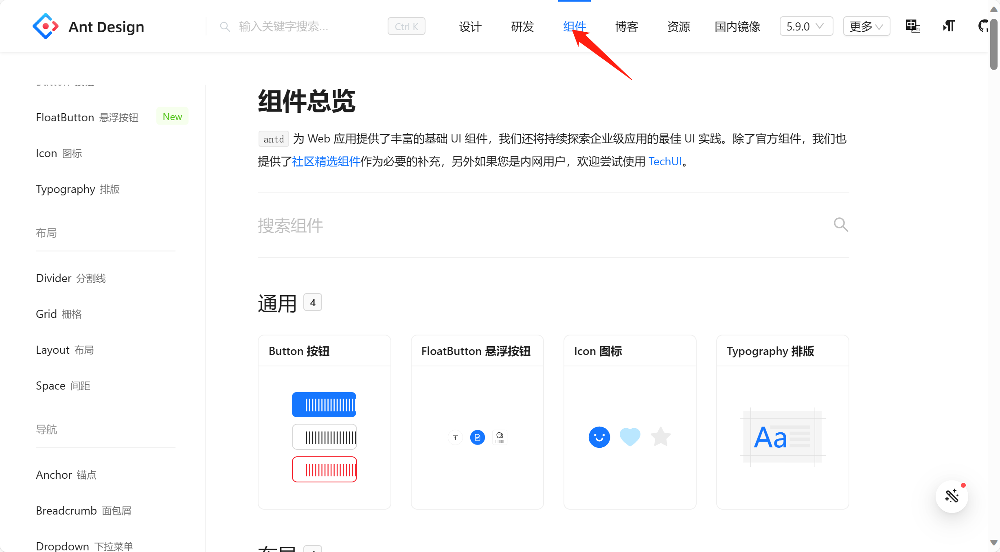
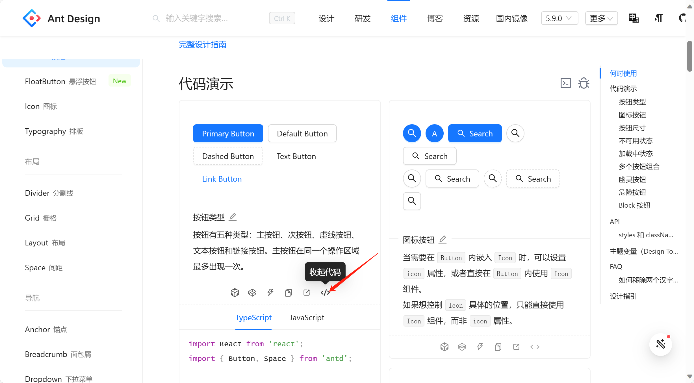
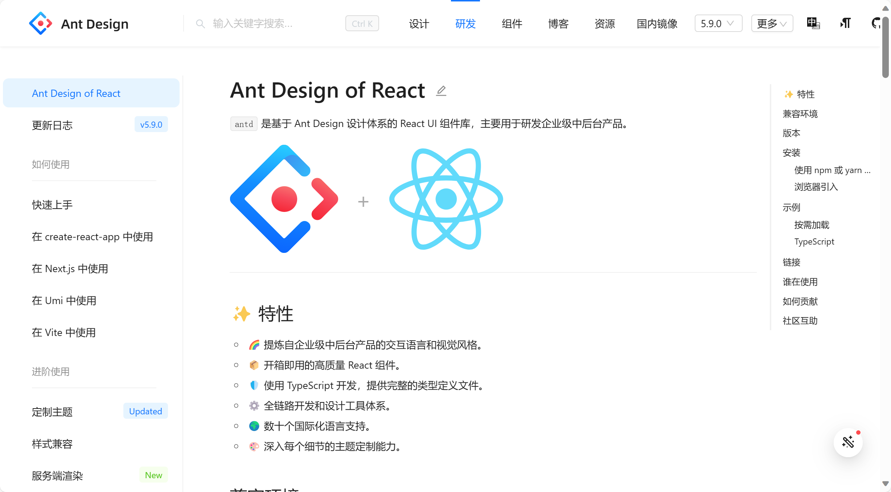
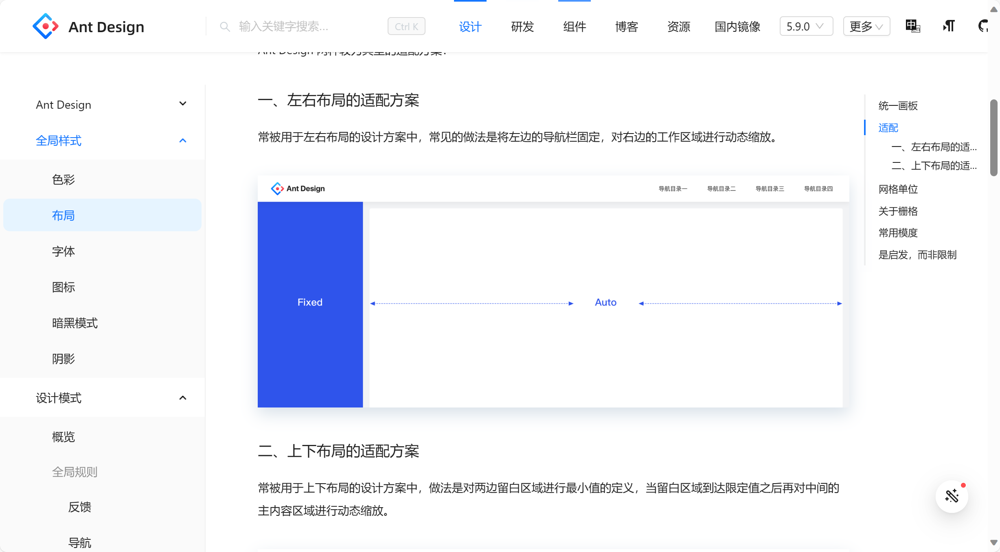

# antd

**中文官网：**

[按钮 Button - Ant Design (antgroup.com)](https://ant-design.antgroup.com/components/button-cn)

**查看组件代码**

先进入官网，点击导航栏的组件选项



然后选择一个组件在下方有很多选项，其中一个是展开查看代码：



在研发选项中写了如何引用antd的方法：



**在导航栏的设计选项中可以查看设计方案**



**antd安装**：

```cmd
npm i antd
```

## antd的使用

安装react或者vue进行使用

使用按钮：

```react
import React from 'react';
import { Button, Space } from 'antd';
const App = () => (
  <Space wrap>
    <Button type="primary">Primary Button</Button>
    <Button>Default Button</Button>
    <Button type="dashed">Dashed Button</Button>
    <Button type="text">Text Button</Button>
    <Button type="link">Link Button</Button>
  </Space>
);
export default App;
```

### 修改主题变量

通过 `theme` 中的 `token` 属性，可以修改一些主题变量。部分主题变量会引起其他主题变量的变化，我们把这些主题变量成为 Seed Token。

```react
import { Button, ConfigProvider, Space } from 'antd';
import React from 'react';

const App: React.FC = () => (
  <ConfigProvider
    theme={{
      token: {
        // Seed Token，影响范围大
        colorPrimary: '#00b96b',
        borderRadius: 1,

        // 派生变量，影响范围小
        colorBgContainer: '#f6ffed',
      },
    }}
  >
    <Space>
      <Button type="primary">Primary</Button>
      <Button>Default</Button>
    </Space>
  </ConfigProvider>
);

export default App;
```

