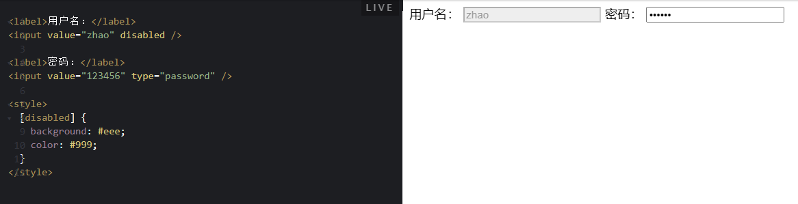
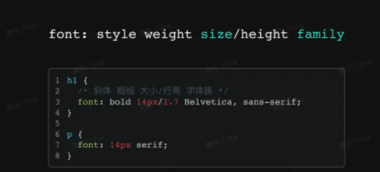
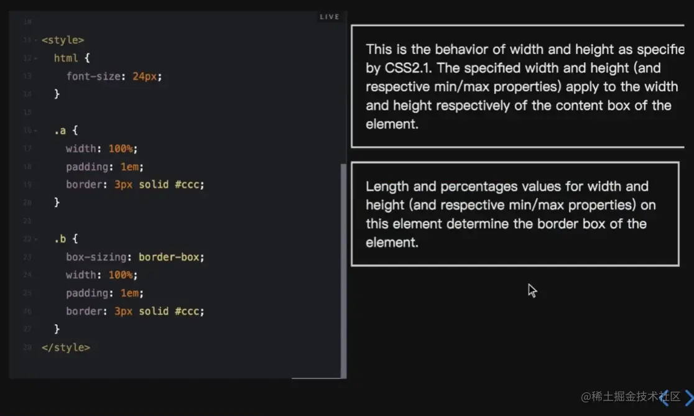
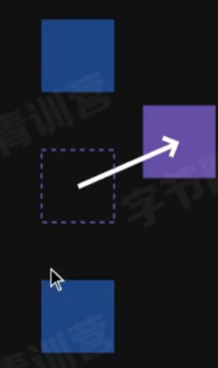

# 走进前端技术栈 - CSS｜ 青训营笔记

## 1.CSS简介

### CSS是什么？

Cascadling Style Sheets（层叠样式表）

- 设置字体和眼色
- 设置位置和大小
- 添加动画效果

### CSS基础的代码构成

如下图所示，选择器（Selector去选一个HTML标签定义样式）+属性（property,选择要修改的属性）+属性值(对属性的定义)
属性与属性值共同构成了一个声明（declaration）


## 2.CSS的使用方法

### 在页面中使用CSS的三种方式

1. 外链(用link标签去使用CSS文件进行渲染)
2. 嵌入(用style标签直接写CSS的代码渲染)[CodePen Embed - 青训营/CSS/最简Demo](https://link.juejin.cn/?target=https%3A%2F%2Fcodepen.io%2Fwebzhao%2Fembed%2FmdBGZMe%3Fdefault-tab%3Dhtml%2Cresult%26editable%3Dtrue%26theme-id%3D40116)
3. 内联（HTML有全局属性syle,我们可以直接在HTML标签中直接用style来写CSS代码） 不推荐使用内联！！！

 现在通常使用组件式的开发，使用Vue写在一个单文件里面，也可以做到样式与内容的分离，也做到关注点分离。

### CSS是如何工作的？


## 3.CSS的选择器

### 选择器（selector）的作用

- 找出页面中的元素，以便给他们设置样式（name,id）
- 使用多种方式去选择元素

1. 按照标签名，类名或者ID
2. 按照属性
3. 按照DOM树中的位置
4. 


### 通配选择器

*{} *指代所有标签
[CodePen Embed - 青训营/CSS/统配选择器](https://link.juejin.cn/?target=https%3A%2F%2Fcodepen.io%2Fwebzhao%2Fembed%2FeYGLqPN%3Fdefault-tab%3Dhtml%2Cresult%26editable%3Dtrue%26theme-id%3D40116)


### 标签选择器

p/h1....标签指定样式
[CodePen Embed - 青训营/CSS/标签选择器](https://link.juejin.cn/?target=https%3A%2F%2Fcodepen.io%2Fwebzhao%2Fembed%2FrNGZXoO%3Fdefault-tab%3Dhtml%2Cresult%26editable%3Dtrue%26theme-id%3D40116)


### id选择器

id作为全局属性，可以给任一标签设定id来使用style直接引用id设定样式（id要唯一） [CodePen Embed - 青训营/CSS/ID选择器](https://link.juejin.cn/?target=https%3A%2F%2Fcodepen.io%2Fwebzhao%2Fembed%2FrNGqBBL%3Fdefault-tab%3Dhtml%2Cresult%26editable%3Dtrue%26theme-id%3D40116)


### 类选择器

给同一类型的HTML标签设定样式的时候，可以给这些同一类型设定全局属性class来方便设定这一类的统一样式（同样使用style来实现） class可以出现多次，比较常用
[CodePen Embed - 青训营/CSS/类选择器](https://link.juejin.cn/?target=https%3A%2F%2Fcodepen.io%2Fwebzhao%2Fembed%2FYzrJKyL%3Fdefault-tab%3Dhtml%2Cresult%26editable%3Dtrue%26theme-id%3D40116)


### 属性选择器

通过一些标签的属性去选择标签设定样式，例如input的disable就可以使用style的[disable]去选中标签设定样式，表示有disable这个属性就可以去选中它
[CodePen Embed - 青训营/CSS/属性选择器](https://link.juejin.cn/?target=https%3A%2F%2Fcodepen.io%2Fwebzhao%2Fembed%2FgOGBYMZ%3Fdefault-tab%3Dhtml%2Cresult%26editable%3Dtrue%26theme-id%3D40116)

如果想让选定属性是一个特定的值时再选中进行样式显示的话，我们可以写成如下 [CodePen Embed - 青训营/CSS/属性选择器2](https://link.juejin.cn/?target=https%3A%2F%2Fcodepen.io%2Fwebzhao%2Fembed%2FjOGeNGb%3Fdefault-tab%3Dhtml%2Cresult%26editable%3Dtrue%26theme-id%3D40116)

也可以对属性值做一些匹配
a[href^="#"]，表示这个href的属性值以#号开头的话就可以匹配的上
a[href$=".jpg"]，表示href的属性值以.jpg结尾就可以匹配上
[CodePen Embed - 青训营/CSS/属性选择器3](https://link.juejin.cn/?target=https%3A%2F%2Fcodepen.io%2Fwebzhao%2Fembed%2FKKXGKwm%3Fdefault-tab%3Dhtml%2Cresult%26editable%3Dtrue%26theme-id%3D40116)


### 伪类（pseudo-classes）选择器 状态 结构性 

还可以不通过属性选择属性，我们通过伪类（pseudo-classes）这种去选择标签元素

- 不基于标签和属性定位元素
- 分为状态伪类和结构性伪类

#### 状态伪类

状态型的伪类不是说具体指某个元素，这个元素还要处与某种特定的状态下，才会被选中
举例子，链接分为访问过的链接（跟非访问的颜色不一样）和非访问过的链接，鼠标选中链接（一般移到链接上面会变黄），和没有选中的不同状态都可以使用伪类进行修改样式

- a:link默认样式
- a:visited访问过的样式
- a:hover鼠标移上去之后显示的样式
- a:active鼠标按下去之后的显示样式

除了链接之外，其他标签也有多种状态，比如输入框input
默认状态，没点过、点击文字框之后可以输入文字的focus状态
:focus{outline:2px solid orange} outline是选定边框的属性，当被选中时，设定2像素橘色边框，值得注意是链接在按下去之后，也是focus状态。

[CodePen Embed - 青训营/CSS/状态伪类](https://link.juejin.cn/?target=https%3A%2F%2Fcodepen.io%2Fwebzhao%2Fembed%2FPoJyozZ%3Fdefault-tab%3Dhtml%2Cresult%26editable%3Dtrue%26theme-id%3D40116)

#### 结构性伪类

根据dom结点在dom树中出现的相对位置来决定是否选中这个标签（来改变样式）

1. 阿凡达
2. 泰坦尼克号
3. 星球大战：原力觉醒
4. 复仇者联盟 3
5. 侏罗纪世界

对于这样的有序列表来说，我们想给排名第一的列表项目加样式，其他排名就不动，这么做呢?
使用li:first-child来选中它，也可以用li:last-child来选中排名最后一名的列表项目， border-bottom:none;表示没有下边框的意思

[CodePen Embed - 青训营/CSS/结构性伪类](https://link.juejin.cn/?target=https%3A%2F%2Fcodepen.io%2Fwebzhao%2Fembed%2FgOGBORr%3Fdefault-tab%3Dhtml%2Cresult%26editable%3Dtrue%26theme-id%3D40116)

## 4.组合

### 组合简介

对于前面的讲到的属性，类，我们可以组合的方式把他们放一块来调整样式
在下面例子中，<input>设定了class=error,<span>标签也设定了class=error
在下面的<style>中，.error可以对input标签的输入框改成红色,也可以对后面span的字体改成红色，
如果我们用input.error表示既要是input又要是error二个条件都满足才显示红色
[CodePen Embed - 青训营/CSS/组合器](https://link.juejin.cn/?target=https%3A%2F%2Fcodepen.io%2Fwebzhao%2Fembed%2FbGomGYW%3Fdefault-tab%3Dhtml%2Cresult%26editable%3Dtrue%26theme-id%3D40116)

### 组合类型

那么组合有哪些类型呢？如下图所示


使用例子：
article p{}表示article下的所有p标签
article >p表示article下直接的p标签（article嵌套里面遇到的第一个p标签）
h2+p表示h2后紧跟着的p标签
[CodePen Embed - 青训营/CSS/组合器](https://link.juejin.cn/?target=https%3A%2F%2Fcodepen.io%2Fwebzhao%2Fembed%2FGRMYRLr%3Fdefault-tab%3Dhtml%2Cresult%26editable%3Dtrue%26theme-id%3D40116)

  

### 选择器组

有些时候想同时设定多个选择器，可以用,分隔


## 5.颜色

### RGB的组成

都是0即是黑色
都是255即是白色
具体怎么写颜色的值呢？rgb(红0-255,绿0-255,蓝0-255)
或者#红红绿绿蓝蓝（每个颜色都是2个16进制字符（转化成10进制还是0-255的范围），#8fac87,不区分大小写）
[CodePen - 青训营/CSS/RGB (cdpn.io)](https://link.juejin.cn/?target=https%3A%2F%2Fcdpn.io%2Fwebzhao%2Fdebug%2FbGomNLx)

### 颜色-HSL

H代表Hue（色相），色彩的基本属性，取值0-360
S代表Saturation（饱和度）,色彩的鲜艳程度，越高越鲜艳，0-100%
L代表Lightness(亮度),色彩的明亮程度，越高颜色越亮，范围0-100%
即通过Hsl来设定颜色，更加直观的可以调整hsl(Hue,Saturation,Lightness)

调整按钮颜色的话，点击变色的效果，用hsl该后面二个颜色的参数就更方便一些

还可以指定元素的名字（值），但是不常用，因为一般记不住，只能记很纯的颜色 [CodePen - 青训营/CSS/HSL (cdpn.io)](https://link.juejin.cn/?target=https%3A%2F%2Fcdpn.io%2Fwebzhao%2Fdebug%2FMWEPYMY)
[CodePen - 青训营/CSS/颜色关键字 (cdpn.io)](https://link.juejin.cn/?target=https%3A%2F%2Fcdpn.io%2Fwebzhao%2Fdebug%2FvYeVJaJ)

### 颜色-透明度

alpha(透明度)可以理解成不透明度，因为调低是透明（0透明），调高不透明（1不透明）
表现方式#ff0000ff
rgba(255,0,0,1)
hsla(0,100%,50%,1)
a可以省略实际生（新版浏览器）
[CodePen - 青训营/CSS/alpha (cdpn.io)](https://link.juejin.cn/?target=https%3A%2F%2Fcdpn.io%2Fwebzhao%2Fdebug%2FWNZaZNW)

## 6.字体

### 字体的使用 font-family

通过font-family来设置字体
[CodePen Embed - RwLeLWy](https://link.juejin.cn/?target=https%3A%2F%2Fcodepen.io%2Fwebzhao%2Fembed%2FRwLeLWy%3Fdefault-tab%3Dhtml%2Cresult%26editable%3Dtrue%26theme-id%3D40116)
为什么要设置多个字体？因为要在不同的设备上面使用，不同的设备可以有的字体是有限的，所以我们可以指定多个字体，多个字体从前到后设备有的就用，没有就往后面换
sans-serif不是具体的字体，实际上是一个通用的字体组，CSS有5种的通用的字体组，如下图所示


- serif线条不均一，有钩示
- sans-serif线条均匀，简洁
- Monospace等宽字体一般编程用，所有字体的宽度一样 组  tips:每次设置字体的时候，最好在最后设置通用的字体组，因为这样你设置的字体设备中万一都没有的时候，浏览器会去设备中找一个通用的来显示，至少不容易出错

在中英文混排的时候，最好英文字体写在中文字体前面，实际浏览器渲染会按逐个的字符去找对应的这个字符有没有我所指定的字体，如果中文字体（微软雅黑）放在英文字体（comic sans MS)前面，所有的英文都会用中文字体显示，如果英文放前面，中文放后面的话（一些英文字体里面没有中文字，这样遇到英文会用英文字体，中文会跳过英文字体，用中文字体来显示）

### Wed-fonts的使用

如果实在是想显示效果，我们可以把字体文件放在服务器上面（**Wed-fonts**）

@font-face{
font-family:"Megrm";
src:url(字体链接)}
只不过会有性能上的开销
[CodePen Embed - 青训营/CSS/WebFonts](https://link.juejin.cn/?target=https%3A%2F%2Fcodepen.io%2Fwebzhao%2Fembed%2FZEXqXeO%3Fdefault-tab%3Dhtml%2Cresult%26editable%3Dtrue%26theme-id%3D40116)
**中文字体也可以使用wed-fonts**
[CodePen Embed - 青训营/CSS/中文WebFonts](https://link.juejin.cn/?target=https%3A%2F%2Fcodepen.io%2Fwebzhao%2Fembed%2FKKXGXXd%3Fdefault-tab%3Dhtml%2Cresult%26editable%3Dtrue%26theme-id%3D40116)
注意：中文的字体包比较大，对性能消耗大，可以对字体进行拆解，用到的就放浏览器加载，不用的直接丢了

### font-size属性

[CodePen Embed - 青训营/CSS/font-size](https://link.juejin.cn/?target=https%3A%2F%2Fcodepen.io%2Fwebzhao%2Fembed%2FoNGaGoq%3Fdefault-tab%3Dhtml%2Cresult%26editable%3Dtrue%26theme-id%3D40116)


- 关键字：small,medium,large
- 长度:px,em
- 百分数：相对于父元素字体的大小

section将其中全部的字体大小设置为20像素
section h1的2em是相对的概念，即20*2=40像素的字体大小（与父元素字体大小相×）
section .note将类为note的字体大小设置为父级大小的80%

### front-style属性

[CodePen Embed - 青训营/CSS/斜体](https://link.juejin.cn/?target=https%3A%2F%2Fcodepen.io%2Fwebzhao%2Fembed%2FWNZaZdN%3Fdefault-tab%3Dhtml%2Cresult%26editable%3Dtrue%26theme-id%3D40116)

可以给字体效果,font-style:italic（表示斜体） normal（正常)

### front-weight属性

[CodePen Embed - 青训营/CSS/字重](https://link.juejin.cn/?target=https%3A%2F%2Fcodepen.io%2Fwebzhao%2Fembed%2FOJxBxzY%3Fdefault-tab%3Dhtml%2Cresult%26editable%3Dtrue%26theme-id%3D40116)

front-weight属性(从100-900)字重的意思
用来设置字体的粗细 正常normal表示400
粗体bold表示700
设置无效，可能是字体本身就没设计出这么多字重在字体库里面

### line-height(行高)

二行文字的基准线之间的距离
行高一般表示字体大小的多少倍，h1大小30,行高45，即1.5倍的行高


**前面的所有属性都可以变成一个属性(即font) 在font里面这些属性都可以写进去**



### 空格处理

HTML对连续的多个空格会合成一个
怎么处理？

- normal吃空格，多个只显示一个空格
- nowrap强制不换行
- pre保留所有的格式
- pre-wrap一行显示不下，会自动换行，同时保留空格
- pre-line需要合并空格，但是保留换行（你怎么换就怎么显示）

 

## 7.调试CSS

**浏览器快捷键F12和cttrl+shift+I看下面的样式就可以看CSS代码了**

了。

# 深入理解CSS | 青训营


# 深入CSS

CSS（Cascading Style Sheets）是一种用于控制网页样式和布局的标记语言，它为网页添加了丰富的视觉效果，使网页呈现出更加美观和专业的外观。本文将深入探讨CSS的一些重要概念和高级技巧，帮助读者更好地掌握CSS，并在前端开发中运用自如。


## 1. CSS选择器

在CSS中，选择器用于定位HTML文档中的元素，从而为它们应用样式。CSS选择器的类型有很多，例如：

### 1.1 类选择器

类选择器以`.`开头，后面跟类名，用于选择HTML元素中带有指定类名的元素。示例代码如下：

```html
html复制代码<!DOCTYPE html>
<html>
<head>
  <link rel="stylesheet" href="styles.css">
</head>
<body>

  <div class="container">
    <p>这是一个带有类名container的div元素。</p>
  </div>

</body>
</html>
css复制代码/* styles.css */
.container {
  background-color: lightblue;
  padding: 20px;
}
```

在上述示例中，带有类名"container"的div元素将被设置背景色为淡蓝色，并添加20像素的内边距。

### 1.2 ID选择器

ID选择器以`#`开头，后面跟ID名，用于选择HTML元素中带有指定ID的元素。ID在整个HTML文档中应该是唯一的。示例代码如下：

```html
html复制代码<!DOCTYPE html>
<html>
<head>
  <link rel="stylesheet" href="styles.css">
</head>
<body>

  <div id="header">
    <h1>这是一个带有ID名header的标题。</h1>
  </div>

</body>
</html>
css复制代码/* styles.css */
#header {
  background-color: darkblue;
  color: white;
  padding: 10px;
}
```

在上述示例中，带有ID名"header"的div元素将被设置背景色为深蓝色，文字颜色为白色，并添加10像素的内边距。

### 1.3 后代选择器

后代选择器用于选择某个元素的后代元素。它使用空格来连接不同层级的元素。示例代码如下：

```html
html复制代码<!DOCTYPE html>
<html>
<head>
  <link rel="stylesheet" href="styles.css">
</head>
<body>

  <div class="container">
    <p>这是一个带有类名container的div元素。</p>
    <ul>
      <li>列表项1</li>
      <li>列表项2</li>
    </ul>
  </div>

</body>
</html>
css复制代码/* styles.css */
.container li {
  color: green;
}
```

在上述示例中，后代选择器`.container li`会选中所有在类名为"container"的div元素下的li元素，并将它们的文字颜色设置为绿色。

### 1.4 伪类和伪元素选择器

伪类和伪元素选择器用于选择处于特定状态或位置的元素。比如，`:hover`用于选择鼠标悬停的元素，`::before`用于在元素前插入内容等。示例代码如下：

```html
html复制代码<!DOCTYPE html>
<html>
<head>
  <link rel="stylesheet" href="styles.css">
</head>
<body>

  <button>悬停在我上面</button>

</body>
</html>
css复制代码/* styles.css */
button:hover {
  background-color: yellow;
}

button::before {
  content: "点击我：";
  font-weight: bold;
}
```

在上述示例中，当鼠标悬停在按钮上时，按钮的背景色会变成黄色。同时，按钮前会显示"点击我："的加粗文字。

### 1.5兄弟选择器


在给定的 CSS 代码中，使用了 “+” 相邻兄弟选择器，根据选择器的规则，当 `#modeCheckBook` 被选中（即勾选）时，下一个兄弟元素 `.contect` 将会被选择并应用相应的样式。

你可以在这个代码块中添加你想要的样式属性，例如：

```css
#modeCheckBook:checked + .contect {
  background-color: red;
  color: white;
  font-size: 16px;
}
```


上述代码中，当 `#modeCheckBook` 被勾选时，`.contect` 元素的背景色将变为红色，字体颜色为白色，字号为16像素。

请注意，这只是个示例。你可以根据需要在这个 CSS 规则中添加任意样式属性。

## 2. CSS盒模型

CSS盒模型是CSS布局的基础，它将每个HTML元素看作是一个矩形的盒子，包含内容、内边距、边框和外边距。理解盒模型对于控制页面布局和样式非常重要。

### 2.1 盒模型示意图

下图展示了一个典型的CSS盒模型：


- Content（内容区）：显示元素的实际内容，如文字、图片等。
- Padding（内边距）：位于内容区和边框之间，用于增加元素内部的空白区域。
- Border（边框）：围绕在内容区和内边距外部，显示元素的边界。
- Margin（外边距）：位于边框以外，用于控制元素与其他元素之间的间距。

### 2.2 盒模型的宽度和高度计算

当设置元素的宽度和高度时，需要考虑到不同盒模型的计算方式。

#### 2.2.1 标准盒模型

标准盒模型的宽度和高度仅包含内容区的大小，不包括内边距、边框和外边距。示例代码如下：

```html
html复制代码<!DOCTYPE html>
<html>
<head>
  <link rel="stylesheet" href="styles.css">
</head>
<body>

  <div class="box-standard"></div>

</body>
</html>
css复制代码/* styles.css */
.box-standard {
  width: 200px;
  height: 100px;
  padding: 20px;
  border: 2px solid black;
  margin: 10px;
}
```

在上述示例中，元素的实际宽度计算为：200px (内容宽度) + 2 * 20px (左右内边距) + 2 * 2px (左右边框) + 2 * 10px (左右外边距) = 254px

元素的实际高度计算为：100px (内容高度) + 2 * 20px (上下内边距) + 2 * 2px (上下边框) + 2 * 10px (上下外边距) = 154px

#### 2.2.2 怪异盒模型

怪异盒模型的宽度和高度包含了内容区、内边距和边框，不包括外边距。可以通过设置`box-sizing`属性为`border-box`来使用怪异盒模型。示例代码如下：

```css
css复制代码/* styles.css */
.box-border-box {
  width: 200px;
  height: 100px;
  padding: 20px;
  border: 2px solid black;
  margin: 10px;
  box-sizing: border-box;
}
```

在上述示例中，元素的实际宽度计算为：200px (内容宽度) + 2 * 20px (左右内边距) = 240px

元素的实际高度计算为：100px (内容高度) + 2 * 20px (上下内边距) = 140px

通过使用怪异盒模型，我们可以更方便地设置元素的大小，因为它会考虑到内边距和边框，使得设置的宽度和高度更加直观。

## 3. 布局技巧

在实际前端开发中，CSS的布局是最常用的技巧之一。以下是一些常见的CSS布局技巧：

### 3.1 居中一个元素

居中一个元素是前端开发中常见的需求。可以使用以下方法实现水平和垂直居中。

#### 3.1.1 水平居中

可以使用`margin: 0 auto;`将元素水平居中。例如：

```css
css复制代码/* styles.css */
.container {
  width: 300px;
  margin: 0 auto;
}
```

上述代码中，设置了容器的宽度为300px，并使用`margin: 0 auto;`将容器水平居中。

#### 3.1.2 垂直居中

可以使用CSS的`flexbox`或`grid`布局来实现垂直居中。例如，使用`flexbox`布局：

```css
css复制代码/* styles.css */
.container {
  display: flex;
  justify-content: center;
  align-items: center;
  height: 300px;
}
```

上述代码中，将容器设置为`flex`布局，通过`justify-content: center;`和`align-items: center;`将内容在容器中垂直居中。

### 3.2 响应式布局

响应式布局是指网页能够根据不同设备的屏幕大小和分辨率自动调整布局，以适应不同的屏幕。这样可以使网页在手机、平板和电脑等多种设备上都能良好地显示。

可以使用CSS的`@media`查询来设置不同的样式规则。例如，当屏幕宽度小于等于768px时，设置元素的宽度为100%：

```css
css复制代码/* styles.css */
.container {
  width: 80%;
}

@media (max-width: 768px) {
  .container {
    width: 100%;
  }
}
```

上述代码中，当屏幕宽度小于等于768px时，容器的宽度将被设置为100%。

# 深入CSS

### 一、选择器的优先级

CSS中可以写很多选择器，可以根据id更改内容的样式，也可以改整个标签内容的样式。当多个选择器作用在同一个元素的时候，元素样式将根据选择器特异度变化。这里特异度指的是越特殊的选择器，优先级越高。


上图中，id、伪类、标签数量越多，特异度越高。

举例： 利用选择器的优先级，可以很好地实现按钮复用（只需更改样式，便能区分两个相同的按钮）


### 二、继承

某些属性会自动继承其父元素的计算值，除非显式指定一个值


说明：strong标签继承了p标签的颜色。与文字相关的属性都是可以继承的，与盒模型（宽度）相关的属性不可继承。

显式继承：关键字inherit，**可以让原本不可继承的属性变成可继承的**


说明：*是通配符，表示所有标签。**box-sizing属性用于定义盒子的宽度值和高度值是否包含元素的内边距和边框**。

content-box：**浏览器对盒模型的解释遵从W3C标准，当定义width和height时，它的参数值不包括border和padding。**

 border-box：**当定义width和height时，border和padding的参数值被包含在width和height之内。**

### 三、初始值

- CSS中，每个属性都有一个初始值

  background-color的初始值为transparent

  margin-left的初始值为0

- 可以使用initial关键字显式重置为初始值

  background-color：initial

### 四、CSS求值过程


### 五、布局（Layout）是什么？

- 确定内容的大小和位置的算法

- 依据元素、容器、兄弟节点和内容等信息来计算

  

#### 布局相关技术

- 常规流

  行级、块级、表格布局、FlexBox、Grid布局

- 浮动

- 绝对定位


说明：width 指定content box宽度，取值为长度、百分数、auto，aotu由浏览器根据其他属性确定，百分数相对于容器的content box宽度。容器有指定的高度时，百分数才生效。


说明：padding 指定元素四个方向的内边距，百分数相对于容器宽度（顺时针）。 border 指定容器边框样式、粗细和颜色

 当四条边框颜色不同时可以显示出一个三角形。

margin：auto水平居中

margin collapse 外边距叠加，上下两div(上定义有margin-bottom, 下有margin-top): 叠加取较大的margin值margin在垂直方向上有边界的合并。


区别：box-sizing：border-box；



文字超出部分可以用overflow  -visible -hidden -scroll

### 六、行级vs块级

- **块级不和其他盒子并列摆放，适用所有的盒模型属性**
- **行级和其他盒子一起放在一行或拆开成多行，盒模型中的width、height不适用**

#### display属性

- block 块级盒子
- inline 行级盒子
- inline-block 本身是行级，可以放在行盒中；可以设置宽高；作为一个整体不会被拆散成多行
- flex 弹性盒子布局
- none 排版时完全被忽略
- 


#### 行级排版上下文

简称IFC 只包含行级盒子的容器会创建一个IFC IFC内的排版规则：盒子在一行内水平摆放，一行放不下会换行，text-align决定一行盒子内的水平对齐，vertical-align垂直对齐，会避开浮动元素。


overflow-wrap ： break-word 一个单词超出容器长度就会换行

#### 块级排版上下文

 

简称BFC BFC内的排版规则：盒子从上到下摆放，垂直margin合并，BFC内盒子的margin不会与外面的合并，BFC不会和浮动元素重叠 

span是行级元素。

### 七、FlexBox是什么？

一种新的排版上下文，它可以控制子级盒子的摆放流向、摆放顺序、盒子的宽度和高度、水平和垂直方向的对齐、是否允许折行


#### 对齐

flex根据内容确定宽度高度，摆放从左至右

分为主轴与侧轴


justify-content   主轴     justify 使齐行 

```css
justify-content: center /*方块内内容主轴居中（横向）*/
```


align-items 侧轴     align 排整齐

```css
align-items: center /*方块内内容侧轴居中（竖向向）*/
```

**space-around** - 每个项目两侧的间隔相等。所以，项目之间的间隔比项目与容器边框的间隔大一倍

**space-between** - 项目与项目的间隔相等，项目与容器边框之间没有间隔

**space-evenly** - 项目与项目的间隔相等，项目与容器边框之间也是同样长度的间隔

**stretch** - 项目大小没有指定时，拉伸占据整个网格容器

#### 伸展收缩

一维

Flexiblity属性可以伸展和收缩


flex-grow  -basis -shrink


同行写法是等价的

#### Grid布局

二维


display：grid使元素生成一个块级的Grid容器


**grid-template-columns 属性设置列数和列宽，grid-template-rows 属性设置行数和行高，数值个数代表列或行数，数值大小代表列宽或者行高**

```css
grid-template-columns: 100px 100px 200px /*三列，列宽*/
grid-template-row: 100px 100px /*两行，行宽*/
```


使用grid-template相关属性将容器划分为网格

1、 **repeat() 函数**：可以简化重复的值，例：repeat(3,1fr) //3行或列，都设置为1fr的宽度（1fr 1fr 1fr）

2、**auto-fill 关键字**：表示自动填充，让一行（或者一列）中尽可能的容纳更多的单元格。例如：

grid-template-columns: repeat(auto-fill, 200px);

3、**fr 关键字**（比例）：Grid
布局还引入了一个另外的长度单位来帮助我们创建灵活的网格轨道。fr
单位代表网格容器中可用空间的一等份。grid-template-columns: 200px 1fr 2fr 表示第一个列宽设置为200px，后面剩余的宽度分为两部分，宽度分别为剩余宽度的 1/3 和 2/3。 例如：grid-template-columns:
200px 1fr 2fr;

4、**minmax() 函数**：我们有时候想给网格元素一个最小和最大的尺寸，minmax() 函数产生一个长度范围，表示长度就在这个范围之中都可以应用到网格项目中。它接受两个参数，分别为最小值和最大值。grid-template-columns: 1fr 1fr minmax(300px, 2fr) 的意思是，第三个列宽最少也是要 300px，但是最大不能大于第一第二列宽的两倍。

5、**auto 关键字**：由浏览器决定长度。通过 auto 关键字，我们可以轻易实现三列或者两列布局。grid-template-columns: 100px auto 100px 表示第一第三列为 100px，中间由浏览器决定长度
      6. **百分比**

##### 网格间距（Column Gap）

**网格间距（Column Gap）指的是两个网格单元之间的网格横向间距或网格纵向间距**

可以使用以下属性来调整间隙大小：

- grid-column-gap

- grid-row-gap

- grid-gap

  

按行列划分网格

##### **grid line网格线**（空隙）

[CSS 网格布局 | 菜鸟教程 (runoob.com)](https://www.runoob.com/css3/css-grid.html)


**grid line合并**


one为2合并，注释掉3：

```css
/*该单元格跨越两列*/
grid-column: span 2;
```

two为4，8，12合并注释掉8，12：

```css
/*该单元格跨越三行*/
grid-row: span 2;
```

three为5，6，9，10合并注释掉6，9，10：

```css
/*该单元格跨越两行两列（网格区域）span 行数/span 列数*/ 
grid-area: span 2/ span 2;
```

**auto-fill关键字 minmax设置最小值最大值**

```css
 /* 自动填充行数,设置最小值最大值,随着界面的大小而不断变化*/
 grid-template-columns: repeat(auto-fill,minmax(150px,1fr));
```


##### 用线的方式来指定项目的位置

**grid-column-start 属性、grid-column-end 属性、grid-row-start 属性以及grid-row-end 属性**
可以指定网格项目所在的四个边框，分别定位在哪根网格线，用线的方式来指定项目的位置：


grid-column-start 属性：左边框所在的垂直网格线号

grid-column-end 属性：右边框所在的垂直网格线号

grid-row-start 属性：上边框所在的水平网格线号

grid-row-end 属性：下边框所在的水平网格线号

代码 "grid-row-start: 1; grid-column-start: 1; grid-row-end: 3; grid-column-end: 3;" 定义了一个网格项在网格容器中的位置。具体的意思如下：

- "grid-row-start: 1;" 表示网格项的起始行为第一行线。
- "grid-column-start: 1;" 表示网格项的起始列为第一列线。
- "grid-row-end: 3;" 表示网格项的结束行为第三行线。
- "grid-column-end: 3;" 表示网格项的结束列为第三列线。

综上所述，"grid-row-start: 1; grid-column-start: 1; grid-row-end: 3; grid-column-end: 3;" 表示网格项从**第一行第一列开始**，跨越到第三行第三列，占据一个区域，即两行两列的空间。


可以使用grid-column和grid-row简写，grid-column: 1/3  //1号线开始，3号线结束

更简便的方法：
使用grid-area对每个块进行标记，再使用grid-template-area对标记的块进行排版

[13分钟彻底弄懂CSS Grid基础布局 / CSS Grid 入门教程_哔哩哔哩_bilibili](https://www.bilibili.com/video/BV1w84y1r7X8/?spm_id_from=333.337.search-card.all.click&vd_source=a0e678f0a699f40cb533e1a6673f35fa)


#### 浮动

实现文字环绕图片效果

float:left


#### 绝对定位

**position属性：**

- static 默认值，非定位元素

- relative相对于原本位置偏离

- absolute找父级定位，非本身

- fixed总是相对于窗口定位


**position: relative**

- 在常规流里面布局
- 相对于自己本应该在的位置进行偏移
- 使用 top、left、bottom、right 设置偏移长度
- 流内其它元素当它没有偏移一样布局



**position: absolute**

- 脱离常规流
- 相对于**最近的非 static 祖先(容器)**定位
- 不会对流内元素布局造成影响


**position: fixed**

相对于屏幕固定，不会随滚动变化


nav为自定义标签


### CSS过渡动画

创建 CSS 过渡动画，你可以使用 CSS 的 `transition` 属性和其他相关属性来定义过渡效果。

下面是一个简单的例子，展示如何使用 CSS 过渡动画来淡入一个元素：

HTML:

```html
<div id="myElement">Hello, world!</div>
```


CSS:

```css
#myElement {
  opacity: 0; /* 设置初始透明度为 0 */
  transition: opacity 0.5s; /* 使用 transition 属性定义过渡效果 */
}

#myElement.fade-in {
  opacity: 1; /* 过渡结束时的透明度为 1 */
}
```


JavaScript:

```js
const element = document.getElementById("myElement");
element.classList.add("fade-in"); // 添加 CSS 类，触发过渡效果
```


在上述代码中，我们先为 `myElement` 元素设置了初始的透明度为 0，并定义了过渡效果。然后，通过 JavaScript，我们给元素添加了一个名为 `fade-in` 的 CSS 类，这将触发过渡效果并使元素淡入。

你可以根据需要来调整过渡的属性（如 `transition-duration`，`transition-property` 等），以及定义其他的过渡效果（如平移、旋转、缩放等），具体取决于你的设计需求。

请记住，CSS 过渡动画主要通过使用 CSS 的 `transition` 属性和添加、移除 CSS 类来实现，这样可以让浏览器自动应用过渡效果。使用 JavaScript 来操作 CSS 类可以在需要时触发过渡动画。

### label

**HTML `<label>` 元素**（标签）表示用户界面中某个元素的说明。

[ - HTML（超文本标记语言） | MDN (mozilla.org)](https://developer.mozilla.org/zh-CN/docs/Web/HTML/Element/label)


当你点击label中的文本的时候，就相当于点击for中绑定的imput
