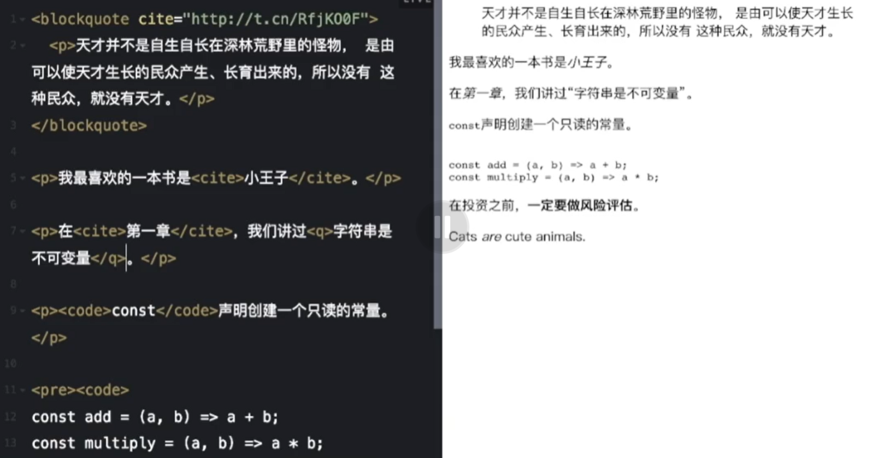

## 前端与HTML

#### 1. **什么是前端？**

- 使用web技术栈解决多端图形界面下人机交互的问题。

#### 2. **前端技术栈**

- 前端技术栈分为分别是HTML、CSS、JavaScript。HTML、CSS、JavaScript都运行在浏览器里，浏览器通过HTTP协议与服务器通信，完成页面渲染或将用户信息提交到服务器中。运作方式如下图。


- Html在实际前端中，就是图片链接，输入框和按钮等一些组成一个页面的基本元素，即页面的结构。
- Css在实际前端中就是给每个页面元素加上样式，包括大小，颜色，位置，形状等，即视觉效果。
- Js给组件添加需要的动态效。

#### 3. **HTML作用解析**

- HTML全称为：*HyperText Markup Language*，*HyperText*是超文本，即呈现内容除了文本外，还可以是图片、链接、表格等；*Markup Language*是标记语言，用来表示超文本。
- 标记语言的标签上可以设置属性。
- HTML代码会被浏览器解析成DOM树渲染页面，HTML解析后的DOM树如下所示：


#### 4. **HTML语法及语义化**


### 语法

- 标签和属性不区分大小写，使用原生组件推荐使用小写，使用自定义组件推荐大写。
- 空标签可以不闭合，如input、meta。
- 属性值推荐用双引号包裹。
- 某些属性值可以省略，如required、readonly。

#### 语义化

- HTML中的元素、属性及属性值都拥有某些含义，即要表现什么样的内容就用对应的标签才能把代码格式写规范。
- 开发者应该遵循语义来编写HTML。
- 如：有序列表用ol;无序列表用ul;lang属性表示内容所使用的语言。

#### 1. **标题标签应用**

html中提供了六级标题，h1到h6,其中h1字号最大，h6字号最小。实践练习例子如下：

```css
css复制代码<h1>字节青训营</h1>
<h2>字节青训营</h2>
<h3>字节青训营</h3>
<h4>字节青训营</h4>
<h5>字节青训营</h5>
<h6>字节青训营</h6>
```

运行结果如下所示：


#### 2. **列表标签应用**

html中提供了三类列表标签。

- 第一类是有序列表标签，用[ol]表示，实践练习例子如下：

```css
css复制代码<h2>字节青训营</h2>
<ol>
  <li>阅读文章</li>
  <li>记笔记</li>
  <li>观看视频</li>
</ol>
```

运行结果如下所示：


- 第二类是无序列表标签，用[ul]表示，实践练习例子如下：

```css
css复制代码<h2>字节青训营</h2>
<ul>
  <li>阅读文章</li>
  <li>记笔记</li>
  <li>观看视频</li>
</ul>
```

运行结果如下所示：


- 第三类是自定义列表标签，用[dl]表示，[dt]是小标题，[dd]是标题下内容。实践练习例子如下：

```css
css复制代码<h2>字节青训营</h2>
<dl>
  <dt>每日任务</dt>
  <dd>阅读文章</dd>
  <dd>记笔记</dd>
  <dd>观看视频</dd>
  
  <dt>长期任务</dt>
  <dd>完成大项目</dd>
</dl>
```

运行结果如下所示：


lang属性表示内容所使用的语言

#### 3. **链接标签应用**

链接标签用[a]表示。[a]标签一个重要属性是[href]表示需要跳转页面的地址。实践练习例子如下：

```ini
ini复制代码<a href="https://www.bytedance.com/">字节跳动官网</a>

<a href="https://www.bytedance.com/" target="_blank">字节跳动官网</a>
```

运行结果如下所示：


上述代码中，点击第一个链接无法跳转，如下所示：


上述代码中，点击第二个链接可以跳转，原因是[target]属性选择新开一个页面跳转。跳转结果如下所示：


#### 4. **多媒体标签应用**

- 图片标签用[img]表示，属性[src]表示图片存放路径。
- 音频标签用[audio]表示，属性[src]表示音频存放路径。
- 视频标签用[video]表示，属性[src]表示视频存放路径。实践例子如下：

```css
css复制代码<video
 src="/assets/video.mp4"
 controls 
></video>
```

运行结果如下：


#### 5. **文本输入框标签应用**

文本输入框标签用[input]表示。实践例子如下：

```ini
ini
复制代码<input placeholder="请输入用户名">
```

运行结果如下：


#### 6.input和label，select，datalist标签


#### blockquote，p,cite,code，pre，strong，em标签

blockquote引用标签

p文本标签

cite斜体字

code 代码

pre多行格式编写

strong 粗体字

em 斜体



<section> 标签定义了文档的某个区域。比如章节、头部、底部或者文档的其他区域。