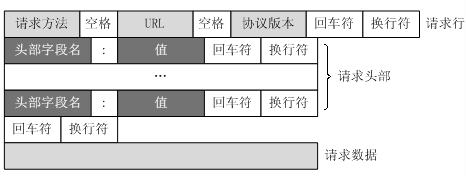

## [HTTP协议详解](https://www.cnblogs.com/jiqianqian/p/7453354.html)

**HTTP简介**

1. HTTP协议是用于从**服务器传输超文本到本地浏览器**的传送协议。

2. HTTP基于**TCP/IP通信协议**进行传送输数据（HTML文件、图片文件、查询结果等）。

3. HTTP是一个属于**应用层**的面向对象的协议，由于其简捷、快速的方式，适用于分布式超媒体信息系统。

4. HTTP协议工作于**客户端-服务器架构**之上。浏览器作为HTTP客户端通过URL向HTTP服务器端即WEB服务器发送请求。WEB服务器根据接收到的请求，向客户端发送响应消息。

 

**HTTP特点**

1. HTTP支持**B/S以及C/S**模式。

2. 简单快速：客户向服务器请求服务时，只需传送请求方法和路径即可。请求方法包括GET、POST、PUT、HEAD等。

3. 灵活：HTTP允许传输任意类型的数据对象。

4. 无连接：限制每次连接只处理一个请求。服务器处理完客户的请求并收到客户的应答后，立即断开。可以节省传输时间。

5. 无状态：协议对于事务处理没有记忆能力，意味着如果后续吹了需要前面的信息，它必须重传，这样可能导致每次连接传送的数据量增大。但如果服务器不需要先前信息时它的应答就比较快。

 

**HTTP之URL**

HTTP使用**URI（统一资源标识符）**来传输数据和建立连接。

**URL**是一种特殊类型的URI，包含了用于查找某个资源的足够信息。以一个URL为例

URL主要包括以下几部分：

　　1. 协议部分：“http:”，在HTTP后面的“//”为分隔符

　　2. 域名部分：“www.aspxfans.com”

　　3. 端口部分：跟在域名后面的是端口，8080，域名和端口之间使用“：”作为分隔符。

　　4. 虚拟目录部分：从域名后的第一个“/”开始到最后一个“/”为止。“/news/”

　　5. 文件名部分：从域名后的最后一个“/”开始到“？”为止。“index.asp”

　　6. 锚部分：从“#”开始到最后。"name"

　　7. 参数部分：从“？”开始到“#”为止之间的部分为参数部分

 

**HTTP之请求消息Request**

客户端发送一个HTTP请求到服务器的请求消息包括：**请求行、请求头部、空行、请求数据**

 

**HTTP之响应消息Response**

服务器接收并处理客户端发过来的请求后会返回一个HTTP的响应消息包括：**状态行、消息报头、空行和响应正文**

 

**HTTP之状态码**

\1. **1****：信息，服务器收到请求，需要请求者继续执行操作

\2. **2****：成功，操作被成功接收并处理

\3. **3****：重定向，需要进一步的操作以完成请求

\4. **4****：客户端错误，请求包含语法错误或无法完成请求

\5. **5****：服务器错误，服务器在处理请求的过程中发生了错误

**常见的状态码**

**200**，请求成功

**201**，已创建，成功请求并创建了新的资源

**202**，已接受，已接受请求，但未处理完成

**301**，永久重定向，请求的资源被永久移到新URL，今后任何新的请求都应使用新的URL代替

**302**，暂时重定向，资源只是临时被移动，客户端仍使用原有的URL

**400**，客户端请求的语法错误，服务器无法理解

**401**，请求要求用户的身份认证

**403**，服务器理解客户端的请求，但是拒绝执行的请求

**404**，服务器无法根据客户端的请求找到资源

**500**，服务器内部错误，无法完成请求

**501**，服务器不支持请求的功能，无法完成请求

**503**，由于超载或系统维护，服务器暂时无法处理客户端的请求

 

**HTTP工作原理**

在浏览器地址键入URL，工作流程：

1. 浏览器向DNS服务器请求**解析该URL中的域名**所对应的IP地址

2. 解析出IP地址后，根据该IP地址和默认端口号80，**与服务器建立TCP连接**

3. 浏览器**发出HTTP请求**给服务器

4.服务器对浏览器请求**做出响应**，并把对应的html文本发送给浏览器

5. **释放TCP连接**

6. 浏览器将该html文本**显示**出来