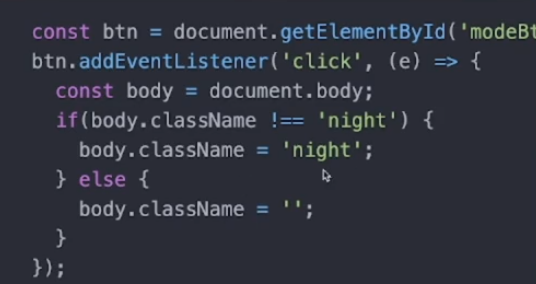

## JavaScript基础语法

### 变量

let设置变量：

```js
let myName = "hello world" //string
let age = 'I say:'
let word = age + myName //连接
console.log(myName)

let score = 100 //number 数字类型 无论是整数还是小数都是数字类型
// + - * / %
console.log(score + 200) //数值运算

let isFake = false //bool类型
console.log(isFake)

let bag = undefined //等于没有东西
console.log(bag)

let bag2 = null    //也是空的意思但并不相等
console.log(bag2) 

//var let const let能取代var使用


let a1 ="aaa"
console.log(a1)
a1 ="bbb" //修改
console.log(a1)

//const常数
const b1 = "不可以被修改的"
```

#### 对象赋值设置方式：

```js
const item = {
  time: "09:00",
  data: "Some data"
};

const { time, data } = item;

console.log(time); // 输出 "09:00"
console.log(data); // 输出 "Some data"
```

在这个例子中，我们创建了一个名为 `item` 的对象，它有一个名为 `time` 的属性和一个名为 `data` 的属性。然后，我们使用解构赋值的语法，将 `item` 对象的 `time` 和 `data` 属性的值分别赋值给 `time` 和 `data` 变量。最后，我们使用 `console.log` 打印出 `time` 和 `data` 变量的值，分别输出了 “09:00” 和 “Some data”。


### 阵列（数组）和物件 Object（对象）


```js
//物件 Array
let c1 = '小明'
//......
let c30 = '小白'

let classA = ['小明','小白','小红'] //声明阵列
console.log(classA)//['小明','小白','小红']

classA.push('小黄')//从右往左添加一个元素到阵列
console.log(classA) //['小明','小白','小红','小黄']

let igPhotos = [
'https://..../a1.png',
'https://..../a2.png',
'https://..../a3.png'
]
console.log('gPhotos',igPhotos) //输出图片
console.log('第一张',igPhotos[0]) //输出图片
console.log('第二张',igPhotos[1]) //输出图片
console.log('第三张',igPhotos[2]) //输出图片

console.log(classA.length)//输出阵列的长度


//物件 Object（对象） 
const card = {
    name : '苏梦仙',
    addres : '新加坡xxxxxx' ,
    age : 18 ,
}
console.log(card.name)//拿出物件的东西

const post = {
    Image : 'https://xx.img.com/a1.png',
    desc:'这是一张图片',
    date : '2022/02/02',
    comment : ['好漂亮','我也要去']
}
const post2 = {
    Image : 'https://xx.img.com/a1.png',
    desc:'这是一张图片',
    date : '2022/02/03',
    comment : ['好漂亮','我也要去']
}

//创建阵列
const wall = [
    post,post2,card,'小红' //阵列可以存放不同类型数据
]

console.log(wall)
```

#### **数组元素的输出**和遍历索引：

```js
const dataList = [];
dataList.forEach(function(item){
     console.log('item',item); //item是数组中的元素
    })
const array = [1, 2, 3, 4, 5];

array.forEach(function(element, index) {
  console.log(index); // 索引值
});

```

#### **数组元素弹出**：

使用pop( )弹出数组最右端一个元素

使用shift( )弹出数组最左端一个元素

**从左侧插入元素使用unshift，右侧插入为push**


#### 数列map方法

JavaScript中的map()方法是数组的一个高阶函数，它用于在每个数组元素上执行一个指定的操作，并返回一个新的数组。下面是map()方法的使用方法：

1. 首先，确保有一个数组需要进行遍历和转换。
2. 调用数组的map()方法，接收一个**回调函数**作为参数。回调函数可以接收三个参数**：当前元素、当前索引和原始数组。**
3. 在回调函数中，对每个数组元素进行操作或转换，并返回一个新的值。
4. map()方法会遍历数组的每个元素，并将对应的操作结果存储在新的数组中。
5. 最后，map()方法返回一个新的数组，其中包含经过操作的每个元素的结果。

下面是一个例子：

```js
const arr = [1, 2, 3, 4]; 
const newArr = arr.map((item, index, array) => {    // 对每个元素进行操作或转换   
    return item * 2;
}); 
    
console.log(newArr); // 输出: [2, 4, 6, 8]
```

在上述示例中，我们使用map()方法遍历了数组arr，并将每个元素乘以2，然后将结果存储在新的数组newArr中。

注意：map()方法不会修改原始数组，而是返回一个新的数组。

**arr.map(item => )为简写写法**，和上面效果一样

```js
const newArr = arr.map(item => item * 2);
```

#### ES6：filter删除指定元素

`filter` 是 JavaScript 中数组的一个方法，它用于创建一个新数组，其中包含通过指定函数筛选的元素。

使用方法如下：

```js
array.filter(callback(element[, index[, array]])[, thisArg])
```

其中，

- `array`：必需，要操作的数组。

- ```
  callback
  ```

  ：必需，为每个元素执行的函数，接受三个参数：

  - `element`：当前正在处理的元素。
  - `index`：可选，元素的索引。
  - `array`：可选，调用 `filter` 方法的数组。

- `thisArg`：可选，执行回调函数时使用的 `this` 值。

`filter` 方法会遍历数组中的每个元素，对每个元素执行回调函数。回调函数返回 `true` 则将该元素包含在新数组中，返回 `false` 则将该元素过滤掉。

**以下是一个示例，展示如何使用 `filter` 方法过滤数组中的元素：**

```js
const numbers = [1, 2, 3, 4, 5];

const filteredNumbers = numbers.filter((number) => number % 2 === 0);

console.log(filteredNumbers); // 输出 [2, 4]
```

在上述示例中，原数组 `numbers` 中的元素经过过滤器函数 `(number) => number % 2 === 0`，只有满足条件的偶数元素被包含在新数组 `filteredNumbers` 中。


#### **数组可以和单独或和对象进行返回成新的数组**

**item为数组**

```react
  function addItem(){
    add(function(item){
      return [...item,note]
    })
  }
```

**传进多个新的数值**

```react
 function addItem(){
    add(function(item){
      return [...item,{note,data,time}]
    })
  }
```

`...preData`表示将`preData`数组中的所有元素进行展开。这是ES6中的“展开运算符”，它允许我们在数组或对象字面量中展开已有的数组或对象。

通过使用`...preData`，可以将`preData`中的所有元素展开，并将其插入到新数组的位置

在 JavaScript 中，您可以使用 `push()` 方法将一个数组中的元素一次性添加到另一个数组中。`push()` 方法将传递给它的参数作为元素添加到数组的末尾。以下是一个示例代码：

```js
const array1 = [1, 2, 3];
const array2 = [4, 5, 6];

// 使用 push() 方法将 array2 中的元素一次性添加到 array1 中
array1.push(...array2);

console.log(array1);  // 输出: [1, 2, 3, 4, 5, 6]
```

在上述示例中，我们使用了扩展运算符 `...` 来展开 `array2` 数组的元素，并将它们作为参数传递给 `push()` 方法。这样可以将 `array2` 数组中的元素一次性添加到 `array1` 数组的末尾。

需要注意的是，`push()` 方法会修改原始的数组，而不是创建一个新的数组。

#### Set去除数组中的重复元素

以下是一个纯 JavaScript 的示例来演示如何移除数组中的重复元素：

```javascript
let historyList = ['A', 'B', 'A', 'C', 'B', 'D'];

// 使用 Set 数据结构来移除重复元素
historyList = [...new Set(historyList)];

console.log(historyList);
// 输出: ['A', 'B', 'C', 'D']
```

在上面的示例中，我们创建一个名为 `historyList` 的数组，其中包含一些重复的元素。然后，我们使用 Set 数据结构来移除重复元素的步骤如下：

1. 通过 `new Set(historyList)` 创建一个新的 Set 对象。
2. 使用扩展运算符 `...` 将 Set 对象展开为一个新的数组。
3. 将结果赋值给 `historyList`，覆盖原来的数组。

通过打印 `historyList`，你将看到移除了重复元素的结果。

请注意，Set 是一种数据结构，它的特点是元素值的唯一性。利用 Set 数据结构的特性可以帮助我们去除数组中的重复元素。

### index() 字符串查找

`indexOf()` 是一个字符串方法，可以用于在字符串中查找指定子字符串（在这里就是问号 “?”）。如果找到了该子字符串，`indexOf()` 方法将返回子字符串的索引值（即首次出现的位置），否则返回 -1。

在 JavaScript 中，你可以使用 `indexOf` 方法来判断一个字符串中是否包含空格。 `indexOf` 方法返回指定字符或子字符串在字符串中首次出现的位置索引，如果找不到，则返回 -1。

下面是一个示例代码：

```js
function hasWhiteSpace(str) {
  return str.indexOf(' ') !== -1;
}

// 示例用法
console.log(hasWhiteSpace('Hello World')); // true
console.log(hasWhiteSpace('HelloWorld'));  // false
```


在上述示例中，`hasWhiteSpace` 函数接收一个字符串作为参数，并使用 `indexOf` 方法查找空格字符。如果结果不等于 -1，表示字符串中存在空格，返回 `true`；否则，表示字符串中不存在空格，返回 `false`。

请注意，此方法仅检查空格字符，如果你需要检查其他空白字符（如制表符、换行符等），可以相应地调整判断条件。

### if else  switch case


```js
// true or false
let condition = 100 < 50
console.log('condition',condition) //condition false

// + - * / 算数运算子
//&& || ！ 逻辑运算子
// === 比对是否相等，返回true or false
//> < >= <= === !==
if (condition){
    console.log(true)
}else{
    console.log(false)
}

//switch case 
let key = 999
switch (key) {
    case value:
        
        break;
    
    case value:
        
    break;

    case value:
        
    break;

    default:
        break;
}
```

### for while

```js
//For循环

//i++ => i = i +1
for(let i = 0 ; i < 10 ; i++){
    console.log("i:",i)
}
while(){
}
```

### 函数

#### **函数宣告和执行方式**

```js
//宣告
function hello(){
    console.log('你好')
   }
   
hello() //执行函数
```

#### **有参数的函数**

```js
 function addMoney(price1,price2,discount){
       console.log('price1',price1);
       console.log('price2',price2);
       console.log('discount',discount)
       console.log(price1 + price2 - discount);
   }
   
   // // 结账页面
   addMoney(2000,100,50)
   
   // // 购物车页面
   addMoney(3000,200,100)
```

#### **有回传值的函数**

```js
   //有回传值的fuction(return)
   function NewaddMoney(price1,price2,discount){
    let result = price1 + price2 - discount;
   
    return result
   }
   
   let total = NewAddMoney(5000,5000,1000)
   console.log('total',total);
```

#### **构造函数**

```js
   //构造函数 function
   function createCard(initname){
    this.cardName =initname   //this是指函数本身，或者当下执行函数的函数
   }

   //new 建立或建造
   const a1 = new createCard('小明')
   console.log(a1); //createCard{name:"小明"
```

#### **不同的宣告函数方式**

```js
   //不同宣告函数的方式
   function hello(){} 

   let hello = function(){}
   
   let hello = () => {} //简写 箭头
```

### 类别Class

**语法糖**：

举个例子：在 C 语言里用 a[i] 表示 *(a+i)，用 a[i] [j]表示 *(*(a+i)+j)，由此可见语法糖不是“现代语言”独有，这种写法简洁明了，易于理解。

Class就也相当于js的语法糖

#### class的基本操作

```js
//  //构造函数 function
//  function createCard(initname){
//     this.cardName =initname   //this是指函数本身，或者当下执行函数的函数
//    }

class card{
    constructor(initname){//构造函数
        this.name = initname
    }
}
const c1 = new Card("布鲁斯")
console.log('c1',c1) //跟function一样
console.log(c1.name);
```

#### This

this是谁取决于你执行当下的环境是谁

```js
//this
class Card{
    constructor(initname){//构造函数
        this.name = initname
    } 
    hello(){ //hello写在class里面就是class的函数function
      console.log("hello",this.name) //this代表c1
    }
}
const c1 = new Card("布鲁斯")
console.log('c1',c1) //跟function一样
c1.hello()

const a = { name : 'AA' }

a.hellooooo = c1.hello

//当下的执行环境是a
a.hellooooo()// AA 
```

下面两种方法是等价的：

输出Card的时候hello都不会出现在实体里面

```js
//方式一
class Card{
    constructor(initname){//构造函数
        this.name = initname
    } 
    hello(){ //hello写在class里面就是class的函数function
      console.log("hello",this.name) //this代表c1
    }
}


方式二
function class Card(){
   this.name = initname
}
Card.prototype.hello = function name(){
    console.log("hello",this.name) //this代表c1
}
```

#### bind绑定this在固定函数

```js
class Card{
    constructor(initname){//构造函数
        this.name = initname
        this.helllooo = this.hello.bind(this)
    } 
    hello(){ //hello写在class里面就是class的函数function
      console.log("hello",this.name) //this代表c1
    }
}
```

#### 用箭头宣告函数的方法，this永远会跟着原来的方法

跟bind的效果一样

```js
class Card{
    constructor(initname){//构造函数
        this.name = initname
        this.helllooo = this.hello.bind(this)
    } 
    hello = ()=> { //hello写在class里面就是class的函数function
      console.log("hello",this.name) //this代表c1
    }
}
```

#### 继承

**extends继承关键字** **super父类关键字** 

```js
class Car {
    constructor(initName){
        this.name = initName
    }
    start(){
        console.log('车子启动')
    }
}
//继承Car
class Porshe extends Car{
    constructor(namePorshe){
       super(namePorshe)
    }
    start2(){
        super.start()
        console.log('车子排气')
    }
    start(){ //如果子类有相同的function会覆盖掉父类的function
        console.log('Porshe车子启动') 
    }
}
p1.start2()//车子启动  车子排气

const p1 = new Porshe("苏梦仙")

p1.start() //车子启动或者Porshe车子启动（如果子类存在）

console.log('name',p1.name) // 苏梦仙
```


### HTML DOM操作

window代表整个浏览器的一些操作 

document能够拿到档案上的一些标签，比如查询html的id，或者插入一些css

#### addEventListener事件监听

**利用事件监听器中的function来执行行为**

```js
window.alert("")//弹窗

//callback 回呼函数   addEventListener事件监听 ，当页面载入完成后执行
window.addEventListener('load',function(){
   //TODO del
   console.log('load')
})

//
```

#### Document通过ID取得元素

HTML

```html
<!DOCTYPE html>
<html lang="en">
<head>
    <meta charset="UTF-8">
    <meta name="viewport" content="width=device-width, initial-scale=1.0">
    <title>Document</title>
</head>
<body>
    <p id="title">苏梦仙前端</p>
    <script src="./index.js"></script> /*习惯要写在p下面*/
</body>
</html>
```

拿到p元素**document.getElementById**：

```js
   //通过id取得p并存入到p1中
   const p1 = document.getElementById('title') 
   console.log(p1)//<p id="title">苏梦仙前端</p>
 
```

#### 修改HTML标签中的内容

修改HTML标签中的内容**innerText**：

```js
  const p1 = document.getElementById('title')
   console.log(p1)
   p1.innerText = "苏梦仙被修改" //修改p标签的内容
```

#### Document通过ID修改样式

要通过 Document 对象的 `getElementById()` 方法获取元素，并修改其样式，可以使用以下代码：

```js
const element = document.getElementById("elementId");
element.style.property = "value";
```

在上述代码中，“elementId” 是要获取的元素的 id 属性的值。通过 `getElementById()` 方法获取到对应的元素对象后，可以使用 `style` 属性来修改其样式。`property` 是要修改的样式属性，可以是任何有效的 CSS 属性，比如 `backgroundColor`、`fontSize` 等。`value` 则是要给属性赋予的值。

**例如，如果要将具有 id “myElement” 的元素的背景颜色设置为红色，可以使用以下代码：**

```js
const element = document.getElementById("myElement");
element.style.backgroundColor = "red";
```

**这将把元素的背景颜色更改为红色。**

需要注意的是，通过修改元素的样式，只是在当前的 JavaScript 运行环境中更改了样式，并没有真正修改元素的 CSS 类或行内样式。如果需要在样式表中保持修改的样式，应该使用适当的 CSS 类或修改元素的 `className` 属性。

**想要更改样式更方便的方法是修改标签的id或者class进行样式切换**




#### 监听按钮操作

HTML：

```html
<button id="btn">按我</button>
```

JS:

可以上w3s查找更多click行为的使用方式

```js
   //抓取按钮
   const b1 = document.getElementById("btn")
   //监听按钮被按下去(click行为)
   b1.addEventListener('click',function(){
    console.log('点下去')
   })
```

#### JS插入HTML标签

HTML：

```html
<div id="box"></div>
```

JS：

在ID为box的div中插入<p>Test</p> HTMl标签

```js
const box1 = document.getElementById('box')
   box1.innerHTML = '<p>Test</p>'
```

##### **使用模板语法**``

```js
     htmlStr = htmlStr + `
     <div><pre>      <p>内容:${item.content} </p></pre></div>
     <div><pre>      <p>时间:${item.date} ${item.time}</p></pre></div>
     `
    })
    box1.innerHTML = htmlStr
```

##### HTML**中插入变量和模板**

```html
  <p>{note}</p>
      <p>{`${date} ${time}`}</p>
```


#### 取得输入框input中的数据

HTML：

```html
 <input id="input1" type="text">
```

JS：

```js
   const in1 = document.getElementById('input1')
   //keyup监听键盘敲击动作,当键入的时候，都会传入一个对象KeyboardEvent，用e代表输入的对象
   in1.addEventListener('keyup',function(e){
    console.log('e',e.target.value) //e.target.value取出当前框内的值
   })
```

#### **通过点击按钮获取表单中填写的内容**

HTML

```html
 <pre style="font-size: 20px;"><strong>    记事</strong></pre>
                   <div><pre>      <input type="text" class = 'input1' id="content"></pre></div>
                   <pre style="font-size: 20px;" ><strong>    日期</strong></pre>
                   <div><pre>      <input type="month" class = 'input1' id="date"></pre></div>
                   <pre style="font-size: 20px;"><strong>    时间</strong></pre>
                   <div><pre>      <input type="time" class = 'input1' id="time"></pre></div>
                   <div><pre>      <button type="submit" class = 'submit1' id="btn1">新增</pre></div>
                   <div><pre>      <button type="submit" class = 'submit2' id="btn2">删掉最后一个</pre></div>
```

JS

```js
const con = document.getElementById('content')
const date = document.getElementById('date')
const time = document.getElementById('time')
const btn1 = document.getElementById('btn1')
const btn2 = document.getElementById('btn2')
//点击事件
btn1.addEventListener('click',function () {
   console.log(con.value)
   console.log(date.value)
   console.log(time.value)
})
```

#### 阻止默认操作（在没写后端的时候防止数据刷新）

点击submit按钮后会自动提交表单，刷新页面，导致临时数组的数据丢失，所以要使用到preventDefault()来阻止默认操作

阻止的是浏览器的默认事件（刷新事件）

当HTML中的按钮有type="submit"时，就会出现这种清空

defaultprevented() 回傳一個布林值，表示事件的預設行為是否被取消，也就是事件物件是否曾執行 preventDefault（） 方法。

```js
const con = document.getElementById('content')
const date = document.getElementById('date')
const time = document.getElementById('time')
const btn1 = document.getElementById('btn1')
const btn2 = document.getElementById('btn2')
const box1 = document.getElementById('box')
const dataList = [];//储存数据的数组

btn1.addEventListener('click',function (e) {
    let data = {
        content : con.value,
        date : date.value,
        time : time.value
    }
    dataList.push(data)
    console.log(dataList);
    dataList.forEach(function(item){
     console.log('item',item);
    })
    e.preventDefault() //当点击按钮时候，页面不会进行刷新，数组的数据不会被清空
})
```


### 异步函数async关键字

异步函数：异步函数则是非阻塞的，它们允许代码在等待异步操作完成的同时继续执行后续的语句。当遇到 `await` 关键字时，异步函数会暂时挂起执行，等待 `await` 后面的异步操作完成，然后再继续执行后续的代码。**(就是将异步的请求变成同步的请求，等待异步的请求完成之后再进行下一步操作)**

要使用该异步函数，你可以按照以下步骤进行操作：

1. 在使用 `fetchData` 函数的地方，使用 `await` 关键字调用该函数，以等待异步操作的完成。

```js
async function someFunction() {
  // 调用 fetchData 函数并等待结果
  await fetchData();
  // 异步操作完成后，执行后续的代码
  console.log('异步操作已完成');
}

someFunction();
```


1. 在 `fetchData` 函数体内，添加异步操作的实现，例如调用网络接口获取数据。

```js
async function fetchData() {
  try {
    const response = await fetch('https://api.example.com/data');
    const data = await response.json();
    console.log(data);
  } catch (error) {
    console.error('发生错误:', error);
  }
}
```


在这个示例中，`fetchData` 函数使用 `fetch` 函数从 `'https://api.example.com/data'` 获取数据，并使用 `await` 等待网络请求的结果。成功获取数据后，它将数据打印到控制台。如果发生错误，它将错误信息打印到控制台。

记住，你需要在包含 `fetchData` 函数的作用域内使用 `async` 关键字声明该函数为异步函数，以便使用 `await` 关键字。并且，调用异步函数的函数也必须是异步函数或者返回一个 Promise 对象。


## JS向后端发起请求

### **使用fetch发起请求**

`fetch`是用于发起HTTP请求的现代浏览器内置函数，它提供了一种更简洁、基于Promise的方式来进行网络请求。下面是一个基本的`fetch`用法示例：

```js
fetch(url)
  .then(response => response.json()) //response是返回的对象数据，可以自己定义名称
  .then(data => {  //解析成的response.json()会传给data，data就相当于response.json()
    // 在这里处理返回的数据
  })
  .catch(error => {
    // 在这里处理请求错误
  });
```


在这个示例中，我们调用了`fetch`函数并传入一个URL作为参数来发起GET请求。然后使用`.then()`方法处理返回的`response`对象，通过`.json()`方法将响应体解析为JSON格式数据，并在第二个`.then()`方法中处理解析后的数据。如果请求过程中发生错误，可以使用`.catch()`方法来捕获错误并进行处理。

`fetch`函数还可以接受一个可选的第二个参数，用于配置请求的选项，如请求方法、请求头等。下面是一个包含配置选项的示例：

```js
const requestOptions = {
  method: 'POST', //指定请求方式
  headers: {
    'Content-Type': 'application/json',
  },
  body: JSON.stringify({ username: 'exampleUser', password: 'examplePass' }),//请求体
};

fetch(url, requestOptions)
  .then(response => response.json()) //将返回的response对象通过.json()的方法将响应体解析成json格式数据
  .then(data => {
    // 在这里处理返回的数据
  })
  .catch(error => {
    // 在这里处理请求错误
  });
```

**请求体（Request Body）**是在HTTP请求中包含的数据，用于向服务器发送数据。通常在POST、PUT、PATCH等请求中使用请求体来**传递数据**。

**请求体数据**可以是各种不同的格式，如**JSON、表单数据（FormData）、XML**等。它的作用是让客户端可以向服务器发送需要处理或存储的数据，比如用户注册信息、提交表单数据、上传文件等。

body通过将数据对象使用`JSON.stringify()`方法转换为**JSON字符串**，并将其作为请求体的内容发送给服务器。服务器可以根据你的请求体中的数据进行相应的处理，例如将数据存储到数据库中。


在这个示例中，我们通过配置选项指定了请求方法为POST，并设置了请求头和请求体。

需要注意的是，`fetch`函数默认只对网络错误（比如请求无法到达）返回`reject`，对HTTP错误码（比如404、500）不会返回`reject`。如果你希望在HTTP错误码时也返回`reject`，可以使用`response.ok`属性进行判断，或者自己处理特定的HTTP错误码。

以上是`fetch`函数的基本用法，你可以根据需要使用`fetch`来进行不同的HTTP请求，并根据返回的`response`对象处理响应数据和错误

## 写入文件保存

### Typeof和JSON.stringify(value)

Typeof用于检测数据的类型，JSON.stringify将对象转换成json

```js
/**
 * 存储数据
 */
export const setItem = (key, value) => {
  // 将数组、对象类型的数据转化为 JSON 字符串进行存储
  if (typeof value === 'object') {
    value = JSON.stringify(value)
  }
    //将数据存入localStorage
  window.localStorage.setItem(key, value)
}

/**
 * 获取数据
 */
export const getItem = key => {
  const data = window.localStorage.getItem(key)
  try {
    return JSON.parse(data)
  } catch (err) {
    return data
  }
}

/**
 * 删除数据
 */
export const removeItem = key => {
  window.localStorage.removeItem(key)
}

/**
 * 删除所有数据
 */
export const removeAllItem = key => {
  window.localStorage.clear()
}
```

### 存入数据到本地

```js
    //将数据存入localStorage
  window.localStorage.setItem(key, value)
```

## 其他补充

### path

#### path.resolve()

`path.resolve()` 是 Node.js 中用于将路径或路径片段转换为绝对路径的方法。它接受任意数量的路径作为参数，并将它们拼接到一起，并返回一个新的绝对路径字符串。在使用 `path.resolve()` 转换路径时，如果路径的绝对路径已知，则可以快速创建正确的路径。如果返回的路径是目录，则目录末尾会有一个斜杠。

`path.resolve()` 可以接受多个参数，每个参数都可输入相对路径、绝对路径或 URL，然后通过将每个路径依次解析为绝对路径来将这些路径组合在一起，实现路径的拼接。如果最终结果不是绝对路径，则将根据当前工作目录将其转换为绝对路径。

下面是一个简单的例子，演示了如何使用 `path.resolve()`：

```
const path = require('path');

const dirPath = 'src';
const fullPath = path.resolve('/home/user/project', dirPath);

console.log(fullPath); // /home/user/project/src
```


在上面的例子中，我们传递了两个参数，第一个参数是绝对路径 `/home/user/project`，第二个参数是相对路径 `src`。path.resolve() 将这两个路径拼接在一起，并返回一个绝对路径 `/home/user/project/src`。

需要注意的是，`path.resolve()` 方法返回的路径是一个字符串，即使提供的参数是数组或对象。所以，如果您需要使用数组或对象来组合路径，则需要使用其他方法（例如 `path.join()`）或手动拼接路径字符串。

### js切片split()

`split()` 方法是 JavaScript 字符串对象的一个函数，用于将字符串拆分为一个字符串数组，根据指定的分隔符将字符串分割为多个子字符串。

`split()` 方法的语法如下：

```js
string.split(separator, limit)
```

参数说明：

- `separator`：被用作分隔符的字符串或正则表达式。该参数可以是一个普通字符串或正则表达式。如果省略该参数，则返回包含整个字符串的数组。
- `limit`（可选）：一个整数，用于限制返回的数组的长度。如果提供了此参数，则拆分的子字符串数量不会超过该限制。

`split()` 方法返回拆分后的子字符串数组。

下面是一些示例：

```js
const str = 'Hello,World,How,Are,You';

// 使用逗号进行字符串拆分
const arr1 = str.split(',');
console.log(arr1);
// 输出：["Hello", "World", "How", "Are", "You"]

// 使用空格进行字符串拆分
const arr2 = str.split(' ');
console.log(arr2);
// 输出：["Hello,World,How,Are,You"]

// 使用正则表达式进行字符串拆分
const arr3 = str.split(/,| /);
console.log(arr3);
// 输出：["Hello", "World", "How", "Are", "You"]

// 限制返回的数组长度为3
const arr4 = str.split(',', 3);
console.log(arr4);
// 输出：["Hello", "World", "How"]
```

在上述示例中，我们演示了不同的分隔符（逗号和空格）以及如何使用正则表达式进行字符串拆分。我们还使用了可选的 `limit` 参数来限制返回的数组的长度。

请注意，`split()` 方法不会改变原始字符串，而是返回一个新的数组。

要将类似字符串 “116.38505796846,39.9558690232;116.38519711598,39.955741262754;116.38542555507,39.955464931573;116.38544540763,39.955445228156;116.38548511273,39.955335856804;116.38549490426,39.955115938272;116.38549481443,39.955095958213;116.38550460596,39.954876038903;116.38551439749,39.954726153219” 的值按照分号进行拆分，并将子字符串存入一个数组中，您可以使用 JavaScript 的 `split()` 函数。

示例代码如下所示：

```js
const str = "116.38505796846,39.9558690232;116.38519711598,39.955741262754;116.38542555507,39.955464931573;116.38544540763,39.955445228156;116.38548511273,39.955335856804;116.38549490426,39.955115938272;116.38549481443,39.955095958213;116.38550460596,39.954876038903;116.38551439749,39.954726153219";
const array = str.split(";");

console.log(array);
```

运行上述代码后，您将获得一个由子字符串组成的数组，每个子字符串都是通过分号拆分的：

```js
[
  "116.38505796846,39.9558690232",
  "116.38519711598,39.955741262754",
  "116.38542555507,39.955464931573",
  "116.38544540763,39.955445228156",
  "116.38548511273,39.955335856804",
  "116.38549490426,39.955115938272",
  "116.38549481443,39.955095958213",
  "116.38550460596,39.954876038903",
  "116.38551439749,39.954726153219"
]
```

现在，每个子字符串都被存储在数组中，您可以对该数组进行进一步的处理或使用其中的值。

