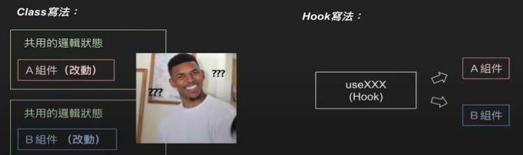
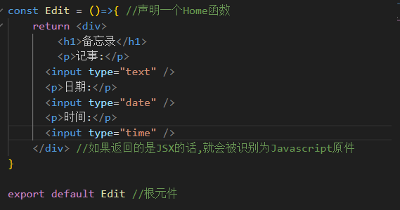
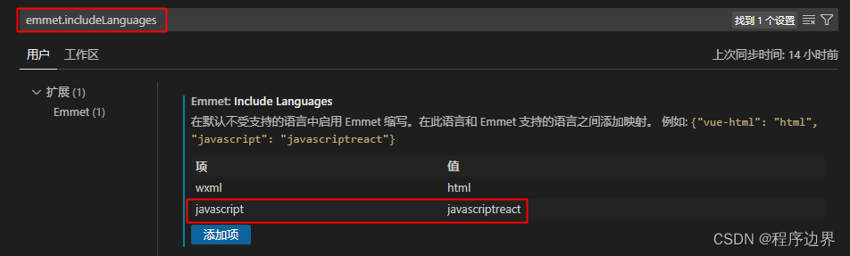
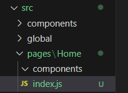
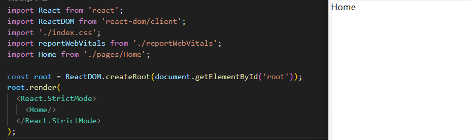
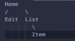

# React基础

## 介绍

什么是React?

- Javascript的UI库。
- 如同Vue、Angular，他也被JS的 框架。
- 简单说，就是用来Web应用程式的工具(SPA、SSR)。

SPA：单页的应用程序 - Single PAge Application

SSR: 伺服器渲染的应用程式 - Server Side Render


为什么需要React?

- 让前端方案得更容易管理.

- 页面组件化，比如一个Header同时出现在多个页面，当作一个元件重复使用。

- 使用率高的前端框架。

- 除了Web，也可以App。

  

需要先具备哪些JS能力?

- 熟悉JS基础。
- 熟悉基本流程控制，if else、for while等。
- 理解JS ES6语法，箭头function，.map() .forEach等
- 理解非同步操作，Promise Await Async等。
- Call API，Fetch API使用等等

React Hook


什么是Hook ?

- 2019年由React Team发表，用来简化Class的写法
- 目前没有计划删除Class写法，但Hook是未来。
- 布鲁斯在Yahoo、17Live、Binance、Tiktok参加的前端，大多都以Hook为主


为什么需要Hook?

**理由一：**
共用Class组件的状态逻辑，需要抽离然后包来包去....很麻烦。




**理由二：**
难以理解的生命周期，我要在哪里设定事件，然后又要在哪里清除。。。


**理由三：**

this到底在哪


### **State Hook & Effect Hook** （状态Hook和效果Hook）

#### 

- useState ， useEffect
- 用Hook赋予元件状熊] 、[效果] ，例如:状态显示码表的时间。
- 简单说:元件有了状态(State hook)后，而有了什么样的效果(Effect hook)。

1. 元件 : 码表的界面。
2. 状态    : 变动的秒数。
3. 效果 : 因为秒数变动了，所以显示出减少的样子，或者做其他的事情等等...


**在这之后**


-学会React-Router （路由）

-学会React Context （上下文 ，元件）

-理解为什么需要Redux

-学会Class写法

## React语法

### 推荐的 Toolchain

React 團隊主要推薦以下的方案：

- 如果你正在**学习 React** 或**建立全新的 single-page 应用程式**，請使用 [Create React App](https://zh-hant.legacy.reactjs.org/docs/create-a-new-react-app.html#create-react-app)。
- 如果你正在建立一个**使用 Node.js 的 server-render网页**，請使用 [Next.js](https://zh-hant.legacy.reactjs.org/docs/create-a-new-react-app.html#nextjs)。
- 如果你正在建立一个**静态内容的网页**，请使用 [Gatsby](https://zh-hant.legacy.reactjs.org/docs/create-a-new-react-app.html#gatsby)。
- 如果你正在建立一个 **component 函式库**或**与现存程式码仓库进行接轨**，請使用[更灵活的 Toolchain](https://zh-hant.legacy.reactjs.org/docs/create-a-new-react-app.html#more-flexible-toolchains)。

### Create React App

[Create React App](https://github.com/facebookincubator/create-react-app) 是一个适合**学习 React** 的环境，而且也是使用 React 建立一个**全新的 [single-page](https://zh-hant.legacy.reactjs.org/docs/glossary.html#single-page-application) 应用程序**的最佳方法。

它会为你设定好开发环境，以便你能够使用最新的 JavaScript 特性，提供良好的开发者体验，并且为线上环境最佳化你的应用程式。你需要在你的机器上安装 [Node >= 14.0.0 and npm >= 5.6](https://nodejs.org/en/)。要建立项目，请执行：

```cmd
npx create-react-app my-app
cd my-app
npm start
```


### JSX

JSX是一种JavaScript的语法扩展，首先运用于[React](https://baike.baidu.com/item/React/18077599?fromModule=lemma_inlink)中，其格式比较像是模版语言，但事实上完全是在[JavaScript](https://baike.baidu.com/item/JavaScript/321142?fromModule=lemma_inlink)内部实现的。元素是构成React应用的最小单位，JSX就是用来声明React当中的元素。React主要使用JSX来描述用户界面，但React并不强制要求使用JSX [1] ，而JSX也在React之外的框架得到了广泛的支持，包括[Vue.js](https://baike.baidu.com/item/Vue.js/19884851?fromModule=lemma_inlink) [3] ，[Solid](https://baike.baidu.com/item/Solid/9662803?fromModule=lemma_inlink) [2] 等。


### 开始

React可以将HTML模块化

将不同页面元素封装成一个模块，只需要导入放置即可

写出一个页面模块



在主文件中导入该模块 <Edit/>并赋予样式

```react
import Edit from './components/Edit'//导入Edit模块
import './index.css'
const Home = ()=>{ //声明一个Home函数

    return <div className='app'>
        <Edit/>   //使用Edit模块中的HTML
    </div> //如果返回的是JSX的话,就会被识别为Javascript原件
}

export default Home //根元件
```

### **VSC中JS文件中使用html语法补全设置**

在设置中搜索并添加：




### 导入模块

文件结构图：



index.js

```react
const Home = ()=>{ //声明一个Home函数
    return <div>Home</div> //如果返回的是JSX的话,就会被识别为Javascript原件
}

export default Home //根元件
```

`export default Home` 是一个 JavaScript 中的语法，用于导出一个名为 `Home` 的根元件。这样其他模块（元件）可以通过导入 `Home` 来使用它。

**然后在根目录的index.js导入Home模块（元件）:**

```js
import Home from './pages/Home';
```

在根目录的index.js的 <React.StrictMode>下放入<Home/>,便可以使用Home中index.js里面的函数



components 元件（模块）

页面模块组成：


​       Home

​    /           \

Edit(编辑)         List(列表)

​                  \

​                   Item（项目）

相当于实现不同功能的模块，函数单独存储

### 模块使用css方式布局注意点

需要将模块包含在div方块中才会顺应排版

### 在Home的index.js中引用模块components

```react
import Edit from './components/Edit'

const Home = ()=>{ //声明一个Home函数
    return <div>
        <Edit/>
    </div> //如果返回的是JSX的话,就会被识别为Javascript原件
}

export default Home //根元件
```

### 使用对象来给index.js中的元件加上css样式


```react
import Edit from './components/Edit'
import List from './components/List'

const Home = ()=>{ //声明一个Home函数
    const app = { //对象
        color : 'red' 
    }
    //将app这个样式对象放入到style
    return <div style={app}> 
        <Edit/>
        <List/>
    </div> //如果返回的是JSX的话,就会被识别为Javascript原件
}

export default Home //根元件
```


### 外联CSS

import导入CSS文件，通过className传入对应class名字的CSS样式

react

```react
import Edit from './components/Edit'
import List from './components/List'
import './index.css' //导入CSS
const Home = ()=>{ //声明一个Home函数

    return <div className="app"> //选择class名字为app的样式
        <Edit/>
        <List/>
    </div> //如果返回的是JSX的话,就会被识别为Javascript原件
}

export default Home //根元件
```

### 使用阵列map函数多次调用模块


```react
import Item from "./Item"

const arr = [1,2,3]

const List = ()=>{
    return <div className="list">
        {
            //回调map函数根据引索循环返回3次<div>{item}</div>，这种写法是缩写
            arr.map(item => <div>{item}</div>) //item是指数组中的元素，想要在html里面写js必须加上{}
        }
        {/* <Item/>
        <Item/>
        <Item/> */} //和上面效果是一样的
    </div> 
}
```

{}中写入变量就可以在HTML中显示

### State和props

​       Home （State）

​    /           \   (props 传入概念)

Edit()         List()

​                  \

​                   Item（）

**useState的使用**

useState是react自带的一个hook函数，它的作用是用来声明状态变量。

Hooks 是 [React](https://so.csdn.net/so/search?q=React&spm=1001.2101.3001.7020) 16 中的特性，解决函数组件想使用类组件的一些特性。

useState 可以寫成物件或陣列不一定要重複宣告

**导入useState**:

```react
import { useState } from 'react' 
```

因为ReactDom的渲染原因，并不能直接用事件来改变变量数值所以要用到useState


#### 按钮中的onClick点击事件和变量改变显示

实现点击按钮触发plus函数执行，利用useState改变变量的数值并显示出来

```react
import { useState } from 'react'  //导入useState

import Edit from './components/Edit'
import List from './components/List'
import './index.css'
const Home = ()=>{ //声明一个Home函数
   //let a = 100
   const [a,SetA] = useState(100) //用useState监听a的变化，100为a变量的初始值
   function plus() {
  SetA(200) //替换a的值
}
    return <div className='app'>
        {a}
        <button onClick={plus}>加法</button>
        <Edit/>
        <List/>
    </div> //如果返回的是JSX的话,就会被识别为Javascript原件
}

export default Home //根元件
```

**使用function修改**

```react
   const [a,SetA] = useState(100) //用useState监听a的变化，100为a变量的初始值
   function plus() {
  SetA(function(prev){ //prev上一次的值
return prev + 200}) //更改a的值
}
```

**item为数组**

```react
  function addItem(){
    add(function(item){
      return [...item,note]
    })
  }
```

**传进多个新的数值**

```react
 function addItem(){
    add(function(item){
      return [...item,{note,data,time}]
    })
  }
```

#### **数组可以和单独或和对象进行返回成新的数组**

**注意：**对象数组不能直接用{}渲染在HTML中，这样写会报错


#### 将运算出来的变量传给其他组件

上一级数据传给下一级

​    Home （State） data

​    /           \   (props 传入概念)

Edit()         List()

​                  \

​                   Item（）

**index.js:**

将data和SetData分别往下级元件List，Edit传递：

**重点：**下级元件通过修改上级元件传下来的函数，可以间接影响另一个下级元件

```react
import { useState } from 'react' 

const Home = ()=>{ //声明一个Home函数
   //let a = 100
   const [data,SetData] = useState([1,2,3]) //用useSate监听a的变化
   function plus() {
  SetData(200) //更改a的值 
}
    return <div className='app'>
        {data}
        <button onClick={plus}>加法</button>
        <Edit add={SetData}/>     //SetData函数也可以进行传递
        <List ListData={data}/>   //将Data赋值给ListData进行传递
    </div>
}

export default Home //根元件
```

Listdata和data相等

List组件使用该阵列

**List.js:**

```react
const List = ({ListData})=>{ //{ListData}是被传入的数据
    return <div className="list">
        {
            ListData.map(item => <Item/>) //item是指数组中的元素，想要在html里面写js必须加上{}
        }

    </div> //如果返回的是JSX的话,就会被识别为Javascript原件
}
```

#### **双向绑定**

以下是实现note读取文本中变化的数值通过useState传到note当中，note记录在value当中：

```react
import { useState } from "react"
const Edit = ({add})=>{ 
  function addItem(){
    add([1,2,3])
  }
  const [note,setNote] =  useState("")
  function notechange(e){ //e是从键盘中读取到的内容的对象
     setNote(e.target.value)
  }

    return <div>
      <input type="text" value={note} onChange={notechange}/>
    </div> 
}

export default Edit //根元件
```

#### 使用filter删除元素

filter函数返回正确判断条件的数值

```react
 function deleteItem(){
    deleteData(function(prev){
      return prev.filter(item => item.id !== id) //返回与给的id不相等的元素
    })
  }
```


#### 使用pretter包美化代码

**安装pretter包：**

```cmd
npm i prettier
```

**输入命令使用：**

```cmd
npm run prettier
```

**代码就自动被美化了**

#### 安装UUID给对象设定一个独特的ID

UUID 是 通用唯一识别码（Universally Unique Identifier）的缩写

[UUID - npm (npmjs.com)](https://www.npmjs.com/package/uuid)

```cmd
npm install uuid
```

**打开package.json文件：**

在"scripts"下添加：

```
"prettier": "prettier -w src/" 
```

src/是指需要更新的文件位置

**使用模块：**

更多的模块在官网查阅

```js
import { v4 } from "uuid"
```

给id赋值上独一无二的识别码

```react
 const key = {
      id :v4(),
      note : note,
      date : date,
      time : time
    }
```


### **useEffect跟useRef**


**导入useState和useEffect**:

```react
import { useState,useEffect } from "react";
```

**在React中，`useEffect`是一个用于处理副作用的Hook函数。副作用是指那些不直接与组件渲染相关的操作，比如数据获取、订阅事件、手动修改DOM等。`useEffect`函数接受两个参数：一个是回调函数，用于定义要执行的副作用操作，另一个是依赖数组，用于指定副作用操作的依赖项。**

当组件首次渲染或依赖项发生变化时，`useEffect`中的回调函数将会被执行。你可以在回调函数内部执行副作用操作，比如订阅事件或发送网络请求。同时，你也可以返回一个清除函数，用于清理副作用操作，比如取消订阅或清除定时器。

使用`useEffect`时需要注意以下几点：

> 1. 依赖项数组可以为空，表示副作用不依赖于任何变量，只在组件首次渲染时执行一次。
> 2. 当依赖项数组为空时，清除函数将不会被调用。
> 3. 如果依赖项数组缺省或不传递，则每次组件更新时都会执行副作用操作。
> 4. 如果依赖项数组中的值不发生变化，则副作用操作不会被触发。
> 5. 如果依赖项数组中的值发生变化，则清除函数会在下次执行副作用操作之前被调用。

`useEffect`可以让我们在函数组件中处理副作用，提供了一种优雅的方式来管理生命周期。

```react
import { useState,useEffect } from "react";

import Edit from "./components/Edit";
import List from "./components/List";
import "./index.css";
const Home = () => {
  //声明一个Home函数
  //let a = 100
  const [data, SetData] = useState([]); //用useSate监听a的变化

  //想要有效果先绑定依赖关系
useEffect(() => {
    //页面渲染的时候就会执行一遍
  window.alert("新增成功")
     //渲染结束后，到下一次渲染前要做的事情
    //绑定的事情
    return ()=>{
        //取消绑定
    }
},[data]) //跟data绑定，useState变化之后，执行操作
};

export default Home; //根元件
```

#### 安装json-server模拟后端

**安装json-server：**

```cmd
npm i json-server
```

在根目录建立一个文件（db.json）档案

在package.json文件中的scripts中写入：

```cmd
"server" : "json-server --watch db.json"
```

**运行server：**

```cmd
npm run server
```

**重启react**

在db.json按照一下格式输入数据：

```react
{
  "posts": [
    {
      "id": 1,
      "data": [],
      "author": "typicode"
    }
  ]
}
```

通过访问[localhost:3000/posts/1](http://localhost:3000/posts/1)便可以访问posts数组中的对象数据（posts数组中的第一个数据）


#### “export” 关键字

“export” 关键字用于指定代码模块中可被外部访问的成员。通过使用 “export” 关键字，你可以将**变量、函数、类或模块**标记为可以在其他模块中导入和使用的**公共接口**。

**constants.js:**

```js
export const API_HOST = "http://localhost:3000"
export const API_GET_DATA = `${API_HOST}/posts/1`
```

**index.js引用：**

```js
import { API_HOST,API_GET_DATA } from "../../global/contants"
```


### UseRef

**可以用于用户不小心刷新界面，信息消失**：

**设置bool值**，默认为false不触发更新指令，当用户更新数据的时候再进行数据更新

```js
const submittingStatus= useRef(false); //设置useRef
  //想要有效果先绑定依赖关系
  useEffect(()=>{
    if(!submittingStatus.current){
      return
    }
    fetchSetData(data)
    .then(data => submittingStatus.current = false)
  },[data])
```

**绑定按钮函数：**

```js
function addItem() {
    submittingStatus.current = true //先更新为ture
    const key = {
      id: v4(),
      note: note,
      date: date,
      time: time,
    };
    add(function (preData) {
      return [key,...preData];
    });
  }
```


`useRef` 是 React 提供的一个 Hook，用于创建一个可变的引用对象。

使用 `useRef` 可以在函数组件中维持一个可变的值，并且不触发组件重新渲染。 `useRef` 返回一个包含 `current` 属性的对象，该属性可以存储和访问当前引用的值。

常见的用法有以下几种：

1. 获取 DOM 元素的引用：

   ```
   const myRef = useRef();
   ...
   <div ref={myRef}></div>
   ```

   

   通过将 `myRef` 赋值给组件中的 DOM 元素的 `ref` 属性，可以获取该 DOM 元素的引用，并在需要时读取或修改 DOM 元素的属性或执行操作。

2. 保存组件之间共享的值：

   ```
   const sharedValueRef = useRef(initialValue);
   ```

   

   在多个组件之间共享一个可变的值时，可以使用 `useRef` 创建一个引用对象来保存共享的值，而不用触发组件重新渲染。该值可以通过 `sharedValueRef.current` 进行读取或修改。

3. 保存之前的状态：

   ```js
   const prevDataRef = useRef();
   ...
   useEffect(() => {
     prevDataRef.current = data;
     // 在下一次渲染前保存当前的 data 值
   });
   ```

   

   在 `useEffect` 中使用 `useRef`，可以保存之前组件渲染时的某个状态值，以便在下一次渲染时进行比较或其他操作。

需要注意的是，与状态钩子（如 `useState`）不同，`useRef` 修改 `current` 属性的值不会触发组件重新渲染。因此，`useRef` 更适合用于存储和访问不会引起组件重新渲染的数据。

总结来说，`useRef` 是一个用于在函数组件中维持可变引用的 Hook。它可以用于获取 DOM 元素的引用、保存组件之间共享的值或之前的状态。使用 `useRef` 返回的引用对象的 `current` 属性来访问或修改值。
