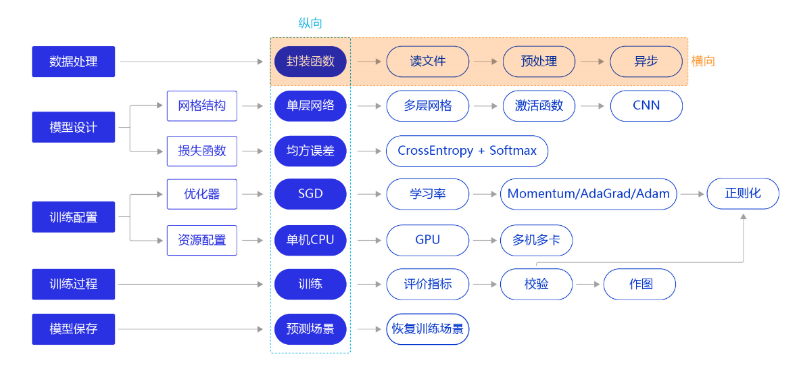
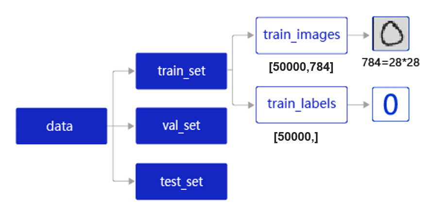

# 概述

上一节我们使用“横纵式”教学法中的纵向极简方案快速完成手写数字识别任务的建模，但模型测试效果并未达成预期。我们换个思路，从横向展开，如 **图1** 所示，逐个环节优化，以达到最优训练效果。本节主要介绍手写数字识别模型中，数据处理的优化方法。




图1：“横纵式”教学法 — 数据处理优化


上一节，我们通过调用飞桨提供的[paddle.vision.datasets.MNIST](https://www.paddlepaddle.org.cn/documentation/docs/zh/2.0-rc1/api/paddle/vision/datasets/mnist/MNIST_cn.html) API加载MNIST数据集。但在工业实践中，我们面临的任务和数据环境千差万别，通常需要自己编写适合当前任务的数据处理程序，一般涉及如下五个环节：

- 读入数据
- 划分数据集
- 生成批次数据
- 训练样本集乱序
- 校验数据有效性


### 前提条件

在数据读取与处理前，首先要加载飞桨平台和数据处理库，代码如下。

```
#数据处理部分之前的代码，加入部分数据处理的库
import paddle
from paddle.nn import Linear
import paddle.nn.functional as F
import os
import gzip
import json
import random
import numpy as np
```


# 读入数据并划分数据集

在实际应用中，保存到本地的数据存储格式多种多样，如MNIST数据集以json格式存储在本地，其数据存储结构如 **图2** 所示。




图2：MNIST数据集的存储结构

**data**包含三个元素的列表：train_set、val_set、 test_set，包括50 000条训练样本、10 000条验证样本、10 000条测试样本。每个样本包含手写数字图片和对应的标签。

- **train_set（训练集）**：用于确定模型参数。
- **val_set（验证集）**：用于调节模型超参数（如多个网络结构、正则化权重的最优选择）。
- **test_set（测试集）**：用于估计应用效果（没有在模型中应用过的数据，更贴近模型在真实场景应用的效果）。

**train_set**包含两个元素的列表：train_images、train_labels。

- **train_images**：[50 000, 784]的二维列表，包含50 000张图片。每张图片用一个长度为784的向量表示，内容是28*28尺寸的像素灰度值（黑白图片）。
- **train_labels**：[50 000, ]的列表，表示这些图片对应的分类标签，即0~9之间的一个数字。

在本地`./work/`目录下读取文件名称为`mnist.json.gz`的MNIST数据，并拆分成训练集、验证集和测试集，实现方法如下所示。

```python
# 声明数据集文件位置
datafile = './work/mnist.json.gz'
print('loading mnist dataset from {} ......'.format(datafile))
# 加载json数据文件
data = json.load(gzip.open(datafile))
print('mnist dataset load done')
# 读取到的数据区分训练集，验证集，测试集
train_set, val_set, eval_set = data

# 观察训练集数据
imgs, labels = train_set[0], train_set[1]
print("训练数据集数量: ", len(imgs))

# 观察验证集数量
imgs, labels = val_set[0], val_set[1]
print("验证数据集数量: ", len(imgs))

# 观察测试集数量
imgs, labels = val= eval_set[0], eval_set[1]
print("测试数据集数量: ", len(imgs))
```

```
loading mnist dataset from ./work/mnist.json.gz ......
mnist dataset load done
训练数据集数量:  50000
验证数据集数量:  10000
测试数据集数量:  10000
```

[机器学习中的batch_size是什么？_batch size-CSDN博客](https://blog.csdn.net/u011699626/article/details/120352398)