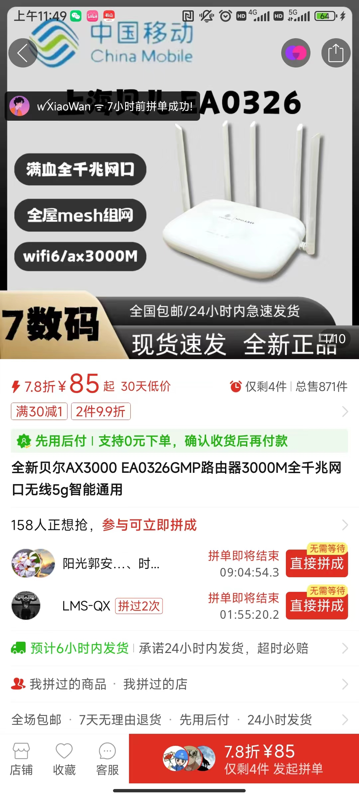
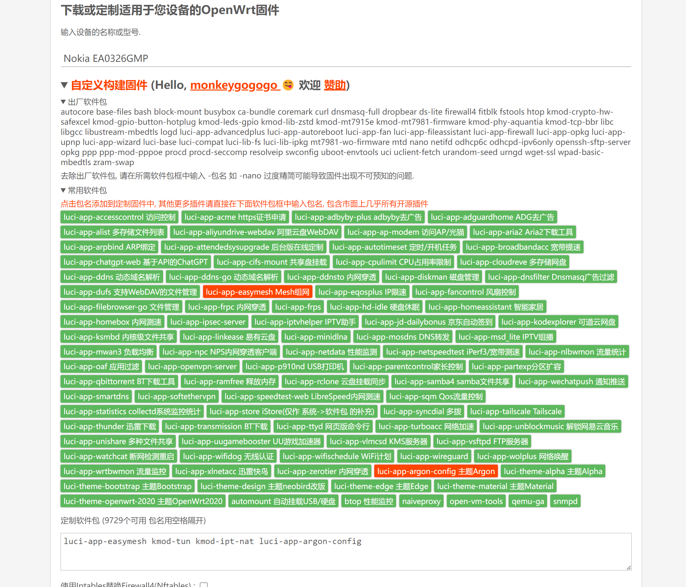
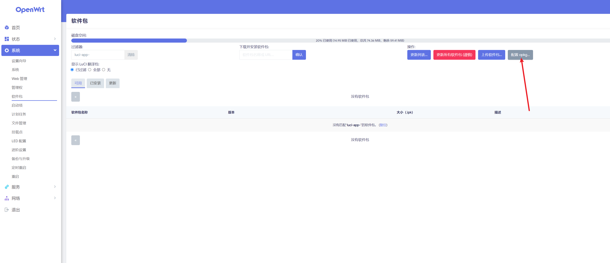
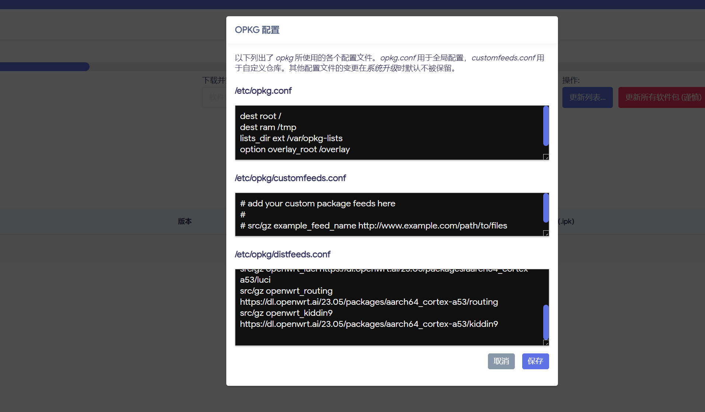
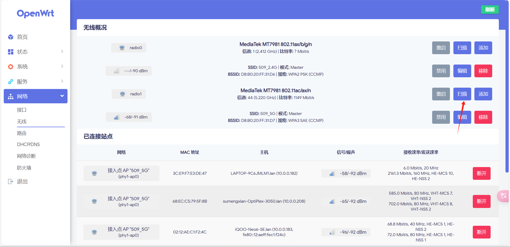
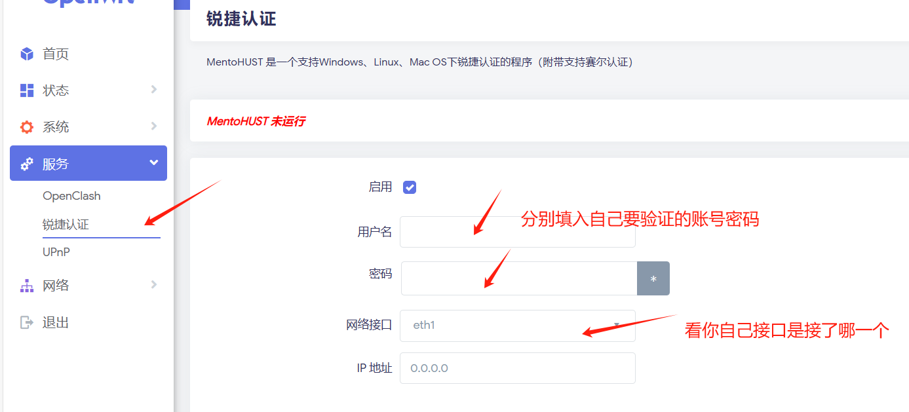
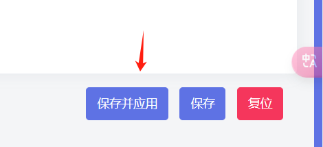

### 网页认证(锐捷认证)校园网解除设备限制,路由器选型和解决方案 openwrt

我们学校校园网一个账号只能登录两台设备，多了直接就退出联网状态，然后校园网是基于锐捷认证进行认证的，然后通过mentohust来达到解除设备限制的目的，通过本教程希望能够帮到大学生更方便使用校园网。

### 路由器选型

#### 1. 极路由

极路由曾以其官方固件支持校园网认证而受到用户的青睐，并且网络上可以找到丰富的教程资源。然而，由于该公司已停止运营多年，目前市面上流通的产品大多为二手或经过二次改装的版本。这些设备的质量难以保证，在使用极路由4并刷入OpenWRT固件后，会可能不定时断连或设备自动重启的现象。

#### 2. 诺基亚贝尔EA0326GMP

诺基亚贝尔EA0326GMP是一款近期推出的新品路由器，在市场上主要是全新产品。社区热度很高，被誉为性价比较高的Wi-Fi 6路由器。相较于Wi-Fi 5，Wi-Fi 6延迟也要低一些。这款路由器在拼多多平台上大概是80元上下。也仅需要一根网线和电脑就能完成刷固件操作，也有较高的可玩度，接下来就以诺基亚贝尔EA0326GMP为基础进行教学。



### 路由器刷机

## 前置准备

- 准备一台电脑，并安装好 `git`

- 把本仓库克隆到本地，`git clone https://github.com/easy-programming-guide/NOKIA-EA0326GMP.git`

- 如果没有git或者连不上github 的话可以用百度网盘下载

  链接：https://pan.baidu.com/s/1NWZHo73JwaFe_G5FKQxprg 
  提取码：530j 

- 一根网线

- 一台 NOKIA EA0326GMP 路由器

### 1.打开 SSH - 如果你的路由器从未打开过 SSH，请一定操作这一步

请按照如下步骤，先基于出厂的官方原版固件打开 SSH 就可以，然后就可以先刷入 uboot

- git clone 本项目到本地（或者是百度网盘下载之后的压缩包解压）
- 用网线连接电脑和路由器的 LAN 口
- 在浏览器输入 192.168.10.1 打开路由器的管理界面，密码就是你路由器
- 在-系统管理-备份和恢复-选择文件-找到本项目(解压后文件夹)中的 `EA0326GMP_SSH.tar.gz` 文件，点击恢复
- 导入后设备会重启，大概3分钟左右后设备重启完成，可以通过ssh工具进入路由器后台

### 2. 安装 uboot 上传到路由器

#### 如果你是第一次安装 uboot

- 打开 WinSCP 工具，在左边栏选择 `Scp` 协议，在右边栏输入路由器的 IP 地址，用户名 root，密码是空
- 从 https://drive.wrt.moe/uboot/mediatek 下载最新版的 `mt7981-nokia-ea0326gmp-fip-expand.bin`，本项目(解压后文件夹)里面也有一个备份，但是这个备份的版本可能不是最新的，建议下载最新版，理论上不会有问题
- 把 `mt7981-nokia-ea0326gmp-fip-expand.bin` 上传到路由器的 `/tmp/` 目录

查看现有分区，执行 `cat /proc/mtd`，你大概会看到如下内容：

```
cat /proc/mtd

dev:    size   erasesize  name
mtd0: 00100000 00020000 "bl2"
mtd1: 00080000 00020000 "u-boot-env"
mtd2: 00200000 00020000 "factory"
mtd3: 00200000 00020000 "fip"
mtd4: 00200000 00020000 "config"
mtd5: 00200000 00020000 "config2"
mtd6: 07680000 00020000 "ubi"
```

肉眼找到 `fip` 或者 `FIP` 分区，执行如下命令：

```
mtd write /tmp/mt7981-nokia-ea0326gmp-fip-expand.bin fip 
# 这里的 fip 大小写一定要跟你刚才肉眼看到的分区名字大小写一定要一致，否则后果自负
```

#### 如果你已经安装过别的版本的 uboot(第一次刷机的不用管)

##### 解锁分区

查看现有分区，执行 `cat /proc/mtd`，你大概会看到如下内容：

```
cat /proc/mtd

dev:    size   erasesize  name
mtd0: 00100000 00020000 "bl2"
mtd1: 00080000 00020000 "u-boot-env"
mtd2: 00200000 00020000 "factory"
mtd3: 00200000 00020000 "fip"
mtd4: 00200000 00020000 "config"
mtd5: 00200000 00020000 "config2"
mtd6: 07680000 00020000 "ubi"
```

肉眼找到 `fip` 或者 `FIP` 分区，然后安装 `kmod-mtd-rw` 工具，执行如下命令：

```
opkg install kmod-mtd-rw
```

接着执行解锁

```
insmod mtd-rw i_want_a_brick=1
```

再用 WinScp 把 uboot 拖入 /tmp/ 目录，执行

```
mtd erase u-boot-env
mtd write /tmp/mt7981-nokia-ea0326gmp-fip-expand.bin fip
# 这里的 fip 大小写一定要跟你刚才肉眼看到的分区名字大小写一定要一致，否则后果自负
```

**所以这是一个互相操作的方法，你如果哪天想用回官方原版的固件，你也可以把 immortalwrt 和 openwrt 的 uboot 用这种方式刷回来，这就可以实现 uboot 自由切换了。**

### 编译固件（懒的可以不做）

如果想要自己自定义固件，可以看一下，如果懒得弄的直接用文件夹 中的`openwrt-07.23.2024-mediatek-filogic-nokia_ea0326gmp-squashfs-sysupgrade.bin`的固件。

首先请注册 https://openwrt.ai/ 账号，然后按照如下步骤编译固件

[](https://github.com/easy-programming-guide/NOKIA-EA0326GMP/blob/main/assets/openwrt-ai-build-firmware.png)

建议把

- kmod-tun
- kmod-ipt-nat

这俩是必须安装的，否则 OpenClash 无法正常工作，我尝试过很多次，最后发现这俩是，他们是依赖内核的版本而 OpenClash 又依赖他们俩，所以是必须安装的。

然后下面的互联网选项也要把 OpenClash 勾选上，其他选项默认就好，Nokia EA0326GMP 的内存只有 256 mb 而且硬盘存储更小，切勿贪多。

然后就可以编译固件了。

## 进入 uboot 界面

从`mt7981-nokia-ea0326gmp-fip-expand.bin` 的 uboot 进入方式如下

- 关机拔掉电源
- 用牙签顶住黑色的 reset 键，然后插上电源，然后开机
- 等待 5 秒后，电源灯会闪烁三下，第三下闪烁之后，松开 reset 键，按住时间太长或者太短都无法进入 uboot，请注意观察电源灯闪烁
- 回到电脑输入 192.168.1.1，就可以看见 uboot 的界面了。

### 刷机

选择固件`openwrt-07.23.2024-mediatek-filogic-nokia_ea0326gmp-squashfs-sysupgrade.bin`，点击 upgrade 即可。

## 初始化路由器

等待路由器第一次刷完，重启之后，浏览器进入 10.0.0.1，账号 root，密码 root

### 第一步：修改默认的软件源

在系统->软件包->配置opkg

[](https://github.com/easy-programming-guide/NOKIA-EA0326GMP/blob/main/assets/edit-software-repo-button.png)

将下面文本复制进去替换:

```
src/gz openwrt_base https://mirror-03.infra.openwrt.org/releases/23.05.4/packages/aarch64_cortex-a53/base
src/gz openwrt_packages https://mirror-03.infra.openwrt.org/releases/23.05.4/packages/aarch64_cortex-a53/packages
src/gz openwrt_luci https://mirror-03.infra.openwrt.org/releases/23.05.4/packages/aarch64_cortex-a53/luci
src/gz openwrt_routing https://mirror-03.infra.openwrt.org/releases/23.05.4/packages/aarch64_cortex-a53/routing
src/gz openwrt_telephony https://mirror-03.infra.openwrt.org/releases/23.05.4/packages/aarch64_cortex-a53/telephony
```

> 注意：这里有个小bug，直接复制粘贴进去进行更新软件包可能会出现报错，解决方案是先复制粘贴到随便一个文本框再进行复制，再粘贴进来即可解决。



### 第二步：让 NOKIA EA0326GMP 连上互联网

在如图所示的界面radio旁边点扫描，先让路由器连上手机热点， 成功后会出现一个模式client的联机，路由器就能上网了，修改之后点击保存,后面路由器能够上网了就可以移除client的那个选项。



### 第三步：安装mentohust实现校园网认证

连上网后在软件包里点更新列表，更新成功后搜索luci-app-mentohust，点击确认然后安装即可，如果更新列表失败的就点配置opkg，把最后一框框的东西复制到别的地方再重新粘贴回去就可以。

如果发现怎么样更新都找不到这个包，可以在[Releases · sbwml/luci-app-mentohust (github.com)](https://github.com/sbwml/luci-app-mentohust/releases)

找到`luci-app-mentohust_1.0.0_all.ipk`和`luci-i18n-mentohust-zh-cn_git-23.048.32480-2d20a52_all.ipk`进行下载

如果打不开链接，可以直接用百度网盘下载:

链接：https://pan.baidu.com/s/1qYHOrE9kRfb4nVDkZj8yNw 
提取码：n4mm 

按照顺序是`luci-app-mentohust_1.0.0_all.ipk`再安装`luci-i18n-mentohust-zh-cn_git-23.048.32480-2d20a52_all.ipk`（这个相当于中文补丁）

安装好之后在服务->锐捷认证(有可能显示的是MentoHUST)进行操作



然后其他不用管，点保存应用就可以了:



保存并应用后插上wan口，重启路由器，然后连上wifi后输入网址10.10.12.13(一般不用手动输，连上wifi就会弹)，然后就会进入运营商认证界面，输入校园卡手机号和办理宽带时的密码就可以认证成功了。


**参考:**
[【图片】大二的ldx来教新生怎么整路由器了【广州航海学院吧】_百度贴吧 (baidu.com)](https://tieba.baidu.com/p/9127474143?share=9105&fr=sharewise&share_from=post&sfc=weixin&client_type=2&client_version=12.68.1.0&st=1725858194&is_video=false&unique=C6785A0D9760C83AD3994AB72ED5ED63&source=12_16_sharecard_a)

[GitHub - easy-programming-guide/NOKIA-EA0326GMP: NOKIA EA0326GMP OpenWRT](https://github.com/easy-programming-guide/NOKIA-EA0326GMP?tab=readme-ov-file)