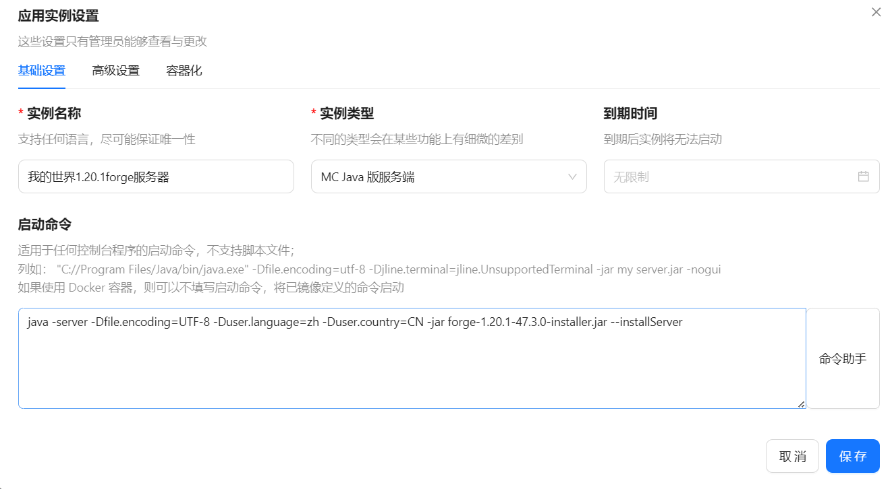

# 本地ubuntu主机搭建我的世界forge服务器并免费开启公网映射 结合MESM面板 chmlfrp

这是一篇很完成的从ssh命令->配置java环境->安装MCS->部署服务器->开启公网映射的我的世界保姆级开服教程,可以慢慢食用ଘ(੭ˊ꒳ˋ)੭ 。

**为什么选择forge服务器进行开服？**

[Minecraft我的世界服务端核心介绍 - MC开服教程1 - 哔哩哔哩 (bilibili.com)](https://www.bilibili.com/read/cv12671374/)

## 第1步：安装SSH服务器

首先，你需要在Ubuntu系统上安装SSH服务器软件包。打开终端（可以使用快捷键Ctrl + Alt + T）并输入以下命令来安装openssh-server：

```
sudo apt update
sudo apt install openssh-server
```

安装完成后，SSH服务会自动启动。你可以使用以下命令来检查SSH服务的状态：

```shell
sudo systemctl status ssh
```

修改配置文件，允许用root访问：

```shell
sudo nano /etc/ssh/sshd_config
```

如果没有下面字段请在文件直接添加，前面不要加井号:

```shell
PermitRootLogin yes 
```

没有nano就安装nano:

```
apt install nano
```

保存文件并退出编辑器后，重启SSH服务使更改生效：

```shell
sudo systemctl restart ssh
```

在windows电脑可以在终端用ssh进行连接，或者说用vsc的ssh插件进行连接(**推荐**)，或者其他的ssh方式。

```shell
ssh root@ip地址
```

**问题**

vsc远程连接造成的rg进程占满服务器资源。


解决方案为：打开设置，搜索 `search.followSymlinks`，将`远程`和`工作区`对应设置置为 `False` 即可。


## 第2步：配置java环境

### 第一种方法（推荐）

第一种方法通过系统包进行配置（推荐，测试环境为ubuntu24.04）

**安装java8和Java17**

通过ubuntu的java管理工具，这两个环境可以随时切换：

```shell
sudo apt install openjdk-8-jdk
sudo apt install openjdk-17-jdk
```

安装好之后：

```shell
root@sumengxian-OptiPlex-3050:~# java --version
openjdk 17.0.12 2024-07-16
OpenJDK Runtime Environment (build 17.0.12+7-Ubuntu-1ubuntu224.04)
OpenJDK 64-Bit Server VM (build 17.0.12+7-Ubuntu-1ubuntu224.04, mixed mode, sharing)
```

通过命令切换java环境:

```shell
root@sumengxian-OptiPlex-3050:~# sudo update-alternatives --config java
有 2 个候选项可用于替换 java (提供 /usr/bin/java)。

  选择       路径                                          优先级  状态
------------------------------------------------------------
* 0            /usr/lib/jvm/java-17-openjdk-amd64/bin/java      1711      自动模式
  1            /usr/lib/jvm/java-17-openjdk-amd64/bin/java      1711      手动模式
  2            /usr/lib/jvm/java-8-openjdk-amd64/jre/bin/java   1081      手动模式

要维持当前值[*]请按<回车键>，或者键入选择的编号：
```

可以看到，这里不仅可以选择环境，还返回了java的位置，之后可以更加方便指定java版本来启动游戏。

### 第二种方法

通过从官网下载java包来进行环境配置，下面以java17为例子:

```shell
cd /usr/local	#跳转到 /usr/local 目录
mkdir java		#创建名为 java 的目录
  
# 下载 java17 压缩包
wget https://download.oracle.com/java/17/latest/jdk-17_linux-x64_bin.tar.gz
# 解压
tar -xzvf jdk-17_linux-x64_bin.tar.gz -C /usr/local/java/

```

> 注：如果输入某条指令时显示 command not found，则说明未安装该指令所需的程序，需要自行安装。
>
> 如输入 wget 指令时报如上错误，则说明没有安装 wget（不过这种基础指令一般都会随系统一同安装）

**解压后，配置环境变量:**

```bash
nano /etc/profile	# 编辑 profile 文件
```

**在文件的最后新增如下几行:**

```shell
 # 注意！下面指令中，你的文件夹名不一定是jdk-17.0.9，把它替换为你解压出来的文件夹的实际名称
 export JAVA_HOME=/usr/local/java/jdk-17.0.9		
 export CLASSPATH=.:$JAVA_HOME/lib/
 export PATH=.:$JAVA_HOME/bin:$PATH
```

1. **然后输入以下命令，重载该文件：**

   ```shell
   source /etc/profile
   ```

2. **最后检查 Java 是否安装成功：**

   ```shell
   java -version
   ```

   如果出现类似响应，则说明安装成功：

   ```shell
   openjdk 17.0.12 2024-07-16
   OpenJDK Runtime Environment (build 17.0.12+7-Ubuntu-1ubuntu224.04)
   OpenJDK 64-Bit Server VM (build 17.0.12+7-Ubuntu-1ubuntu224.04, mixed mode, sharing)
   ```

   

## 第3步安装MCSManager 面板

官网地址：[MCSManager | 开源免费，分布式，一键部署，支持 Minecraft 和 Steam游戏服务器的控制面板](https://mcsmanager.com/)

输入MCSManager 面板的安装命令:

```shell
wget -qO- https://gitee.com/mcsmanager/script/raw/master/setup_cn.sh | bash
```

耐心等待，安装完成后如下图：


可以看到连接端口是23333，在http://ip地址:23333 可以访问到登录页面。

设置开机启动:

```shell
systemctl enable mcsm-{daemon,web}.service
```

启动面板:

```shell
systemctl start mcsm-{daemon,web}.service
```

停止面板:

```shell
systemctl stop mcsm-{daemon,web}.service
```

重启面板:

```shell
systemctl restart mcsm-{daemon,web}.service
```


## 第4步 部署我的世界服务器

#### 1.下载 Forge

进入官网：https://files.minecraftforge.net/net/minecraftforge/forge/


下载自己对应想要的服务器核心

#### 2.上传服务器核心并运行


将以下代码复制进去，并上传服务器核心:

```bash
java -server -Dfile.encoding=UTF-8 -Duser.language=zh -Duser.country=CN -jar ${ProgramName} --installServer
```



上传完成之后进入到控制台，应用实例设置->高级设置，复制工作路径：


在终端输入命令进入到对应的文件夹:

```shell
cd /opt/mcsmanager/daemon/data/InstanceData/35d13bef7aa940bba204fea21e9ea3c3
```

再执行刚刚复制的命令:

```shell
java -server -Dfile.encoding=UTF-8 -Duser.language=zh -Duser.country=CN -jar forge-1.20.1-47.3.0-installer.jar --installServer
```

执行完成之后，如果是低版本的服务器核心的话，启动命令应该是：

```java
java -server -Xms1024M -Xmx4096M -jar forge-server.jar nogui
```

xms为最小内存，xmx是允许使用的最大内存

而在高版本中，执行安装完成之后会自动生成run.sh和run.bat，所以启动命令应该为:

```shell
bash run.sh
```


如果要服务器允许的内存占用大小，可以修改我的世界服务端根目录下的user_jvm_args.txt文件:

```shell
# Xmx and Xms set the maximum and minimum RAM usage, respectively.
# They can take any number, followed by an M or a G.
# M means Megabyte, G means Gigabyte.
# For example, to set the maximum to 3GB: -Xmx3G
# To set the minimum to 2.5GB: -Xms2500M

# A good default for a modded server is 4GB.
# Uncomment the next line to set it.
-Xms1024M	# 最小占用内存，这里我设为1024M
-Xmx7168M	# 最大占用内存，这里我设为7168M
```

run.sh 启动命令应该类似于这样，我加了nogui:

```shell
#!/usr/bin/env sh
# Forge requires a configured set of both JVM and program arguments.
# Add custom JVM arguments to the user_jvm_args.txt
# Add custom program arguments {such as nogui} to this file in the next line before the "$@" or
#  pass them to this script directly
java @user_jvm_args.txt @libraries/net/minecraftforge/forge/1.20.1-47.3.0/unix_args.txt nogui "$@"
```

此时就可以点击开始启动我的世界服务器了:


启动之后发现停止了，是因为我们要修改一个文件,服务端配置->eula.txt->编辑设置为是 之后点保存:


此时再启动服务器就启动成功了，访问端口号默认是25565，可以自行修改。

#### 3.设置定期任务

为了防止服务器崩溃，我们可以设定一些定期计划来重启服务器和清除一些实体，下面是参考:


#### 4.mod安装

可以在这个我的世界网站中寻找资源:[模组检索 - MC百科|最大的Minecraft中文MOD百科 (mcmod.cn)](https://www.mcmod.cn/modlist.html)

其中有些mod没有提供下载，可以到对应的mod官网进行下载:


## 第5步 配置公网映射，使得服务器能够从外网访问

#### 1.配置隧道

[ChmlFrp | Panel v2 - 免费,高速,稳定,不限流量的端口映射工具。](https://panel.chmlfrp.cn/tunnelm/manage)

ChmlFrp是一款不限流量,免费高速目稳定的端口映射工具,为您提供免费的内网穿透功能。可以用于MC联机，远程桌面，远程共享，游戏联机等任何需要用到公网IP的地方。

这个端口映射的方法优点是直接可以通过公网ip来访问服务器，缺点是免费的端口比较少，最多可以开五个我的世界服务器（其实也蛮多了）。至于为什么不选择zeroiter方案，是因为我学校的校园网无法设置路由器为全锥形nat，导致隧道无法打通。

首先在官网中创建自己的账号，在隧道列表中选择自己合适的节点进行配置:


比如说这样配置就可以从公网61687端口访问到我们的服务器：


#### 2.安装frp

找到自己的对应的安装包进行下载:

```shell
wget https://www.chmlfrp.cn/dw/ChmlFrp-0.51.2_240715_linux_amd64.tar.gz
```


下载之后进行解压:

```shell
tar -xzvf ChmlFrp-0.51.2_240715_linux_amd64.tar.gz
```

解压之后打开里面的frpc.ini进行配置,在网页->配置文件中生成的文本复制替换掉原来的文本:


保存frpc.ini之后,为了让端口映射，每次开机都会自动启动，所以我们要配置一下开机自启动

**创建文件,并编辑文件:**

```shell
nano /lib/systemd/system/frpc.service
```

填入以下内容:

```shell
[Unit]
#服务描述
Description=frpc service
After=network.target syslog.target
Wants=network.target

[Service]
Type=simple
#执行命令 这里对应是你自己的文件地址,不要搞错
ExecStart=/home/frpc/frpc -c /home/frpc/frpc.ini

[Install]
WantedBy=multi-user.target
```

编辑完，保存了之后,开启frpc:

```shell
sudo systemctl start frpc
```

设置开机自启动:

```shell
sudo systemctl enable frpc
```

当修改配置文件的时候，需要重启服务:

```shell
sudo systemctl restart frpc
```

查看服务是否启动成功:

```shell
root@sumengxian-OptiPlex-3050:/# sudo systemctl status frpc
● frpc.service - frpc service
     Loaded: loaded (/usr/lib/systemd/system/frpc.service; enabled; preset: enabled)
     Active: active (running) since Fri 2024-10-11 16:35:48 CST; 8h ago
   Main PID: 5958 (frpc)
      Tasks: 7 (limit: 9306)
     Memory: 18.2M (peak: 20.5M)
        CPU: 6.714s
     CGroup: /system.slice/frpc.service
             └─5958 /home/frpc/frpc -c /home/frpc/frpc.ini

```

此时就可以在刚刚配置好的公网ip和端口来访问自己的我的世界服务器了。

参考文章:

[Linux下开机自动启动FRP - 爱吃猪的罐头鱼 - 博客园 (cnblogs.com)](https://www.cnblogs.com/JenniePiggy/p/14828117.html)

[Minecraft 1.20.1 Forge服务器保姆级搭建教程 (使用mcsm面板 | 两种启动方式)_mcsmanager panel怎么加mod-CSDN博客](https://blog.csdn.net/weixin_44576836/article/details/134117045)

[Ubuntu中安装和配置SSH的完全指南_ubuntu ssh配置-CSDN博客](https://blog.csdn.net/sangyongqi/article/details/139411844)