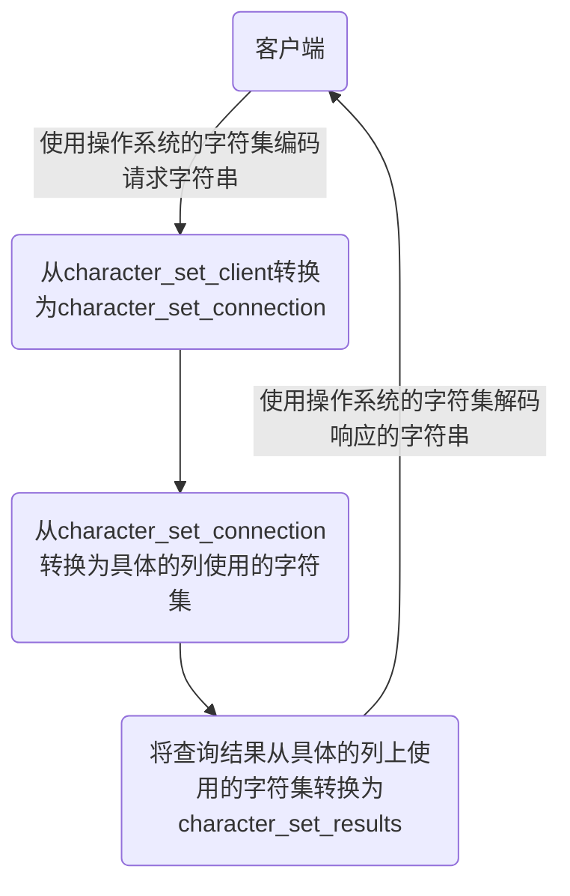

# 第01章 Linux下MySQL的安装与使用

[](https://wwads.cn/)

[万维广告是一个高品质的垂直广告网络联盟，一键购买此流量资源的广告位](https://wwads.cn/)[广告](https://wwads.cn/?utm_source=property-0&utm_medium=footer)


配套视频参考：[MySQL数据库天花板--康师傅(opens new window)](https://www.bilibili.com/video/BV1iq4y1u7vj?p=1&vd_source=cea816a08805c218ac4390ae9b61ae31)

#### [#](https://gaoziman.gitee.io/blogs/pages/80d360/#_1-安装前说明)**1.** **安装前说明**

##### [#](https://gaoziman.gitee.io/blogs/pages/80d360/#_1-1-查看是否安装过mysql)**1.1** **查看是否安装过MySQL**

- 如果你是用rpm安装, 检查一下RPM PACKAGE：

```shell
rpm -qa | grep -i mysql # -i 忽略大小写
```

- 检查mysql service：

```shell
systemctl status mysqld.service
```

##### [#](https://gaoziman.gitee.io/blogs/pages/80d360/#_1-2-mysql的卸载)**1.2 MySQL的卸载**

**1.** **关闭** **mysql** **服务**

```shell
systemctl stop mysqld.service
```

**2.** **查看当前** **mysql** **安装状况**

```shell
rpm -qa | grep -i mysql
# 或
yum list installed | grep mysql
```

**3.** **卸载上述命令查询出的已安装程序**

```shell
yum remove mysql-xxx mysql-xxx mysql-xxx mysqk-xxxx
```

务必卸载干净，反复执行`rpm -qa | grep -i mysql`确认是否有卸载残留

**4.** **删除** **mysql** **相关文件**

- 查找相关文件

```shell
find / -name mysql
```

- 删除上述命令查找出的相关文件

```shell
rm -rf xxx
```

**5.删除 my.cnf**

```shell
rm -rf /etc/my.cnf
```

#### [#](https://gaoziman.gitee.io/blogs/pages/80d360/#_2-mysql的linux版安装)**2. MySQL的Linux版安装**

##### [#](https://gaoziman.gitee.io/blogs/pages/80d360/#_2-1-centos7下检查mysql依赖)**2.1 CentOS7下检查MySQL依赖**

**1.** **检查/tmp临时目录权限（必不可少）**

由于mysql安装过程中，会通过mysql用户在/tmp目录下新建tmp_db文件，所以请给/tmp较大的权限。执行 ：

```shell
chmod -R 777 /tmp
```

**2.** **安装前，检查依赖**

```shell
rpm -qa|grep libaio
rpm -qa|grep net-tools
```

##### [#](https://gaoziman.gitee.io/blogs/pages/80d360/#_2-2-centos7下mysql安装过程)**2.2 CentOS7下MySQL安装过程**

**1.** **将安装程序拷贝到/opt目录下**

在mysql的安装文件目录下执行：（必须按照顺序执行）

```shell
rpm -ivh mysql-community-common-8.0.25-1.el7.x86_64.rpm 
rpm -ivh mysql-community-client-plugins-8.0.25-1.el7.x86_64.rpm 
rpm -ivh mysql-community-libs-8.0.25-1.el7.x86_64.rpm 
rpm -ivh mysql-community-client-8.0.25-1.el7.x86_64.rpm 
rpm -ivh mysql-community-server-8.0.25-1.el7.x86_64.rpm
```

- `rpm`是Redhat Package Manage缩写，通过RPM的管理，用户可以把源代码包装成以rpm为扩展名的文件形式，易于安装。
- `-i`, --install 安装软件包
- `-v`, --verbose 提供更多的详细信息输出
- `-h`, --hash 软件包安装的时候列出哈希标记 (和 -v 一起使用效果更好)，展示进度条

> 若存在mariadb-libs问题，则执行**yum remove mysql-libs**即可

##### [#](https://gaoziman.gitee.io/blogs/pages/80d360/#_2-3-查看mysql版本)**2.3** **查看MySQL版本**

```shell
mysql --version 
#或
mysqladmin --version
```

##### [#](https://gaoziman.gitee.io/blogs/pages/80d360/#_2-4-服务的初始化)**2.4** **服务的初始化**

为了保证数据库目录与文件的所有者为 mysql 登录用户，如果你是以 root 身份运行 mysql 服务，需要执行下面的命令初始化：

```shell
mysqld --initialize --user=mysql
```

说明： --initialize 选项默认以“安全”模式来初始化，则会为 root 用户生成一个密码并将`该密码标记为过期`，登录后你需要设置一个新的密码。生成的`临时密码`会往日志中记录一份。

查看密码：

```shell
cat /var/log/mysqld.log
```

root@localhost: 后面就是初始化的密码

##### [#](https://gaoziman.gitee.io/blogs/pages/80d360/#_2-5-启动mysql-查看状态)**2.5** **启动MySQL，查看状态**

```shell
#加不加.service后缀都可以 
启动：systemctl start mysqld.service 
关闭：systemctl stop mysqld.service 
重启：systemctl restart mysqld.service 
查看状态：systemctl status mysqld.service
```

##### [#](https://gaoziman.gitee.io/blogs/pages/80d360/#_2-6-查看mysql服务是否自启动)**2.6** **查看MySQL服务是否自启动**

```shell
systemctl list-unit-files|grep mysqld.service
```

- 如不是enabled可以运行如下命令设置自启动

```shell
systemctl enable mysqld.service
```

- 如果希望不进行自启动，运行如下命令设置

```shell
systemctl disable mysqld.service
```

#### [#](https://gaoziman.gitee.io/blogs/pages/80d360/#_3-mysql登录)**3. MySQL登录**

##### [#](https://gaoziman.gitee.io/blogs/pages/80d360/#_3-1-首次登录)**3.1** **首次登录**

通过`mysql -hlocalhost -P3306 -uroot -p`进行登录，在Enter password：录入初始化密码

##### [#](https://gaoziman.gitee.io/blogs/pages/80d360/#_3-2-修改密码)**3.2** **修改密码**

```text
ALTER USER 'root'@'localhost' IDENTIFIED BY 'new_password';
```

##### [#](https://gaoziman.gitee.io/blogs/pages/80d360/#_3-3-设置远程登录)**3.3** **设置远程登录**

**1.** **确认网络**

1.在远程机器上使用ping ip地址`保证网络畅通`

2.在远程机器上使用telnet命令`保证端口号开放`访问

**2.** **关闭防火墙或开放端口**

**方式一：关闭防火墙**

- CentOS6 ：

```shell
service iptables stop
```

- CentOS7：

```shell
#开启防火墙
systemctl start firewalld.service
#查看防火墙状态
systemctl status firewalld.service
#关闭防火墙
systemctl stop firewalld.service
#设置开机启用防火墙 
systemctl enable firewalld.service 
#设置开机禁用防火墙 
systemctl disable firewalld.service
```

**方式二：开放端口**

- 查看开放的端口号

```shell
firewall-cmd --list-all
```

- 设置开放的端口号

```shell
firewall-cmd --add-service=http --permanent
firewall-cmd --add-port=3306/tcp --permanent
```

- 重启防火墙

```shell
firewall-cmd --reload
```

#### [#](https://gaoziman.gitee.io/blogs/pages/80d360/#_4-linux下修改配置)**4. Linux下修改配置**

- 修改允许远程登陆

```text
use mysql;
select Host,User from user;
update user set host = '%' where user ='root';
flush privileges;
```

> `%`是个 通配符 ，如果Host=192.168.1.%，那么就表示只要是IP地址前缀为“192.168.1.”的客户端都可以连接。如果`Host=%`，表示所有IP都有连接权限。
>
> 注意：在生产环境下不能为了省事将host设置为%，这样做会存在安全问题，具体的设置可以根据生产环境的IP进行设置。

配置新连接报错：错误号码 2058，分析是 mysql 密码加密方法变了。

**解决方法一：**升级远程连接工具版本

**解决方法二：**

```text
ALTER USER 'root'@'%' IDENTIFIED WITH mysql_native_password BY 'abc123';
```

#### [#](https://gaoziman.gitee.io/blogs/pages/80d360/#_5-字符集的相关操作)**5.** **字符集的相关操作**

##### [#](https://gaoziman.gitee.io/blogs/pages/80d360/#_5-1-各级别的字符集)**5.1** **各级别的字符集**

```text
show variables like 'character%';
```

- character_set_server：服务器级别的字符集
- character_set_database：当前数据库的字符集
- character_set_client：服务器解码请求时使用的字符集
- character_set_connection：服务器处理请求时会把请求字符串从character_set_client转为character_set_connection
- character_set_results：服务器向客户端返回数据时使用的字符集

**小结**

- 如果`创建或修改列`时没有显式的指定字符集和比较规则，则该列`默认用表的`字符集和比较规则
- 如果`创建表时`没有显式的指定字符集和比较规则，则该表`默认用数据库的`字符集和比较规则
- 如果`创建数据库时`没有显式的指定字符集和比较规则，则该数据库`默认用服务器的`字符集和比较规则

##### [#](https://gaoziman.gitee.io/blogs/pages/80d360/#_5-2-请求到响应过程中字符集的变化)**5.2** **请求到响应过程中字符集的变化**



# 第02章 MySQL的数据目录

[](https://wwads.cn/)

[万维广告是一个高品质的垂直广告网络联盟，一键购买此流量资源的广告位](https://wwads.cn/)[广告](https://wwads.cn/?utm_source=property-0&utm_medium=footer)


配套视频参考：[MySQL数据库天花板--康师傅(opens new window)](https://www.bilibili.com/video/BV1iq4y1u7vj?p=1&vd_source=cea816a08805c218ac4390ae9b61ae31)

#### [#](https://gaoziman.gitee.io/blogs/pages/f532a4/#_1-mysql8的主要目录结构)**1. MySQL8的主要目录结构**

```shell
find / -name mysql
```

##### [#](https://gaoziman.gitee.io/blogs/pages/f532a4/#_1-1-数据库文件的存放路径)**1.1** **数据库文件的存放路径**

```text
show variables like 'datadir'; # /var/lib/mysql/
```

##### [#](https://gaoziman.gitee.io/blogs/pages/f532a4/#_1-2-相关命令目录)**1.2** **相关命令目录**

**相关命令目录：/usr/bin 和/usr/sbin。**

##### [#](https://gaoziman.gitee.io/blogs/pages/f532a4/#_1-3-配置文件目录)**1.3** **配置文件目录**

**配置文件目录：/usr/share/mysql-8.0（命令及配置文件），/etc/mysql（如my.cnf）**

#### [#](https://gaoziman.gitee.io/blogs/pages/f532a4/#_2-数据库和文件系统的关系)**2.** **数据库和文件系统的关系**

##### [#](https://gaoziman.gitee.io/blogs/pages/f532a4/#_2-1-表在文件系统中的表示)**2.1** **表在文件系统中的表示**

###### [#](https://gaoziman.gitee.io/blogs/pages/f532a4/#_2-3-1-innodb存储引擎模式)**2.3.1 InnoDB存储引擎模式**

**1.** **表结构**

为了保存表结构，`InnoDB`在`数据目录`下对应的数据库子目录下创建了一个专门用于`描述表结构的文件`

```text
表名.frm
```

**2.** **表中数据和索引**

**① 系统表空间（system tablespace）**

默认情况下，InnoDB会在数据目录下创建一个名为`ibdata1`、大小为`12M`的`自拓展`文件，这个文件就是对应的`系统表空间`在文件系统上的表示。

**② 独立表空间(file-per-table tablespace)**

在MySQL5.6.6以及之后的版本中，InnoDB并不会默认的把各个表的数据存储到系统表空间中，而是为`每一个表建立一个独立表空间`，也就是说我们创建了多少个表，就有多少个独立表空间。使用`独立表空间`来存储表数据的话，会在该表所属数据库对应的子目录下创建一个表示该独立表空间的文件，文件名和表名相同。

```text
表名.ibd
```

> MySQL8.0中不再单独提供`表名.frm`，而是合并在`表名.ibd`文件中。

**③ 系统表空间与独立表空间的设置**

我们可以自己指定使用`系统表空间`还是`独立表空间`来存储数据，这个功能由启动参数`innodb_file_per_table`控制

```ini
[server] 
innodb_file_per_table=0 # 0：代表使用系统表空间； 1：代表使用独立表空间
```

**④ 其他类型的表空间**

随着MySQL的发展，除了上述两种老牌表空间之外，现在还新提出了一些不同类型的表空间，比如通用表空间（general tablespace）、临时表空间（temporary tablespace）等。

###### [#](https://gaoziman.gitee.io/blogs/pages/f532a4/#_2-3-2-myisam存储引擎模式)**2.3.2 MyISAM存储引擎模式**

**1.** **表结构**

在存储表结构方面， MyISAM 和 InnoDB 一样，也是在`数据目录`下对应的数据库子目录下创建了一个专门用于描述表结构的文件

```text
表名.frm
```

**2.** **表中数据和索引**

在MyISAM中的索引全部都是`二级索引`，该存储引擎的`数据和索引是分开存放`的。所以在文件系统中也是使用不同的文件来存储数据文件和索引文件，同时表数据都存放在对应的数据库子目录下。

```text
test.frm 存储表结构 #MySQL8.0 改为了 b.xxx.sdi
test.MYD 存储数据 (MYData) 
test.MYI 存储索引 (MYIndex
```

# 第03章 用户与权限管理

[](https://wwads.cn/)

[万维广告是一个高品质的垂直广告网络联盟，一键购买此流量资源的广告位](https://wwads.cn/)[广告](https://wwads.cn/?utm_source=property-0&utm_medium=footer)


配套视频参考：[MySQL数据库天花板--康师傅(opens new window)](https://www.bilibili.com/video/BV1iq4y1u7vj?p=1&vd_source=cea816a08805c218ac4390ae9b61ae31)

#### [#](https://gaoziman.gitee.io/blogs/pages/a5fa3c/#_1-用户管理)**1.** **用户管理**

##### [#](https://gaoziman.gitee.io/blogs/pages/a5fa3c/#_1-1-登录mysql服务器)**1.1** **登录MySQL服务器**

启动MySQL服务后，可以通过mysql命令来登录MySQL服务器，命令如下：

```text
mysql –h hostname|hostIP –P port –u username –p DatabaseName –e "SQL语句"
```

- `-h参数`后面接主机名或者主机IP，hostname为主机，hostIP为主机IP。
- `-P参数`后面接MySQL服务的端口，通过该参数连接到指定的端口。MySQL服务的默认端口是3306，不使用该参数时自动连接到3306端口，port为连接的端口号。
- `-u参数`后面接用户名，username为用户名。
- `-p参数`会提示输入密码。
- `DatabaseName参数`指明登录到哪一个数据库中。如果没有该参数，就会直接登录到MySQL数据库中，然后可以使用USE命令来选择数据库。
- `-e参数`后面可以直接加SQL语句。登录MySQL服务器以后即可执行这个SQL语句，然后退出MySQL服务器。

```text
mysql -uroot -p -hlocalhost -P3306 mysql -e "select host,user from user"
```

##### [#](https://gaoziman.gitee.io/blogs/pages/a5fa3c/#_1-2-创建用户)**1.2** **创建用户**

```text
CREATE USER 用户名 [IDENTIFIED BY '密码'][,用户名 [IDENTIFIED BY '密码']];
```

举例：

```text
CREATE USER zhang3 IDENTIFIED BY '123123'; # 默认host是 %
CREATE USER 'kangshifu'@'localhost' IDENTIFIED BY '123456';
```

##### [#](https://gaoziman.gitee.io/blogs/pages/a5fa3c/#_1-3-修改用户)**1.3** **修改用户**

```text
UPDATE mysql.user SET USER='li4' WHERE USER='wang5'; 
FLUSH PRIVILEGES;
```

##### [#](https://gaoziman.gitee.io/blogs/pages/a5fa3c/#_1-4-删除用户)**1.4** **删除用户**

**方式1：使用DROP方式删除（推荐）**

```text
DROP USER user[,user]…;
```

举例：

```text
DROP USER li4 ; # 默认删除host为%的用户
DROP USER 'kangshifu'@'localhost';
```

**方式2：使用DELETE方式删除（不推荐，有残留信息）**

```text
DELETE FROM mysql.user WHERE Host=’hostname’ AND User=’username’;
FLUSH PRIVILEGES;
```

##### [#](https://gaoziman.gitee.io/blogs/pages/a5fa3c/#_1-5-设置当前用户密码)**1.5** **设置当前用户密码**

**1.** **使用ALTER USER命令来修改当前用户密码**

```text
ALTER USER USER() IDENTIFIED BY 'new_password';
```

**2.** **使用SET语句来修改当前用户密码**

```text
SET PASSWORD='new_password';
```

##### [#](https://gaoziman.gitee.io/blogs/pages/a5fa3c/#_1-6-修改其它用户密码)**1.6** **修改其它用户密码**

**1.** **使用ALTER语句来修改普通用户的密码**

```text
ALTER USER user [IDENTIFIED BY '新密码'] 
[,user[IDENTIFIED BY '新密码']]…;
```

**2.** **使用SET命令来修改普通用户的密码**

```text
SET PASSWORD FOR 'username'@'hostname'='new_password';
```

#### [#](https://gaoziman.gitee.io/blogs/pages/a5fa3c/#_2-权限管理)**2.** **权限管理**

##### [#](https://gaoziman.gitee.io/blogs/pages/a5fa3c/#_2-1-权限列表)**2.1** **权限列表**

```text
show privileges;
```

- `CREATE和DROP权限`，可以创建新的数据库和表，或删除（移掉）已有的数据库和表。如果将MySQL数据库中的DROP权限授予某用户，用户就可以删除MySQL访问权限保存的数据库。
- `SELECT、INSERT、UPDATE和DELETE权限`允许在一个数据库现有的表上实施操作。
- `SELECT权限`只有在它们真正从一个表中检索行时才被用到。
- `INDEX权限`允许创建或删除索引，INDEX适用于已有的表。如果具有某个表的CREATE权限，就可以在CREATE TABLE语句中包括索引定义。
- `ALTER权限`可以使用ALTER TABLE来更改表的结构和重新命名表。
- `CREATE ROUTINE权限`用来创建保存的程序（函数和程序），`ALTER ROUTINE权限`用来更改和删除保存的程序，`EXECUTE权限`用来执行保存的程序。
- `GRANT权限`允许授权给其他用户，可用于数据库、表和保存的程序。
- `FILE权限`使用户可以使用LOAD DATA INFILE和SELECT ... INTO OUTFILE语句读或写服务器上的文件，任何被授予FILE权限的用户都能读或写MySQL服务器上的任何文件（说明用户可以读任何数据库目录下的文件，因为服务器可以访问这些文件）。

##### [#](https://gaoziman.gitee.io/blogs/pages/a5fa3c/#_2-2-授予权限的原则)**2.2** **授予权限的原则**

权限控制主要是出于安全因素，因此需要遵循以下几个`经验原则`：

1、只授予能`满足需要的最小权限`，防止用户干坏事。比如用户只是需要查询，那就只给select权限就可以了，不要给用户赋予update、insert或者delete权限。

2、创建用户的时候`限制用户的登录主机`，一般是限制成指定IP或者内网IP段。

3、为每个用户`设置满足密码复杂度的密码`。

4、`定期清理不需要的用户`，回收权限或者删除用户。

##### [#](https://gaoziman.gitee.io/blogs/pages/a5fa3c/#_2-3-授予权限)**2.3** **授予权限**

```text
GRANT 权限1,权限2,…权限n ON 数据库名称.表名称 TO 用户名@用户地址 [IDENTIFIED BY ‘密码口令’];
```

- 该权限如果发现没有该用户，则会直接新建一个用户。
- 给li4用户用本地命令行方式，授予atguigudb这个库下的所有表的插删改查的权限。

```text
GRANT SELECT,INSERT,DELETE,UPDATE ON atguigudb.* TO li4@localhost;
```

- 授予通过网络方式登录的joe用户 ，对所有库所有表的全部权限，密码设为123。注意这里唯独不包括grant的权限

```text
GRANT ALL PRIVILEGES ON *.* TO joe@'%' IDENTIFIED BY '123';
```

##### [#](https://gaoziman.gitee.io/blogs/pages/a5fa3c/#_2-4-查看权限)**2.4** **查看权限**

- 查看当前用户权限

```text
SHOW GRANTS; 
# 或 
SHOW GRANTS FOR CURRENT_USER; 
# 或 
SHOW GRANTS FOR CURRENT_USER();
```

- 查看某用户的全局权限

```text
SHOW GRANTS FOR 'user'@'主机地址';
```

##### [#](https://gaoziman.gitee.io/blogs/pages/a5fa3c/#_2-5-收回权限)**2.5** **收回权限**

**注意：在将用户账户从user表删除之前，应该收回相应用户的所有权限。**

- 收回权限命令

```text
REVOKE 权限1,权限2,…权限n ON 数据库名称.表名称 FROM 用户名@用户地址;
```

- 举例

```text
#收回全库全表的所有权限 
REVOKE ALL PRIVILEGES ON *.* FROM joe@'%'; 
#收回mysql库下的所有表的插删改查权限 
REVOKE SELECT,INSERT,UPDATE,DELETE ON mysql.* FROM joe@localhost;
```

- 注意：`须用户重新登录后才能生效`

#### [#](https://gaoziman.gitee.io/blogs/pages/a5fa3c/#_3-角色管理)**3.** **角色管理**

##### [#](https://gaoziman.gitee.io/blogs/pages/a5fa3c/#_3-1-创建角色)**3.1** **创建角色**

```text
CREATE ROLE 'role_name'[@'host_name'] [,'role_name'[@'host_name']]...
```

角色名称的命名规则和用户名类似。如果`host_name省略，默认为%`，`role_name不可省略`，不可为空。

##### [#](https://gaoziman.gitee.io/blogs/pages/a5fa3c/#_3-2-给角色赋予权限)**3.2** **给角色赋予权限**

```text
GRANT privileges ON table_name TO 'role_name'[@'host_name'];
```

上述语句中privileges代表权限的名称，多个权限以逗号隔开。可使用SHOW语句查询权限名称

```text
SHOW PRIVILEGES\G
```

##### [#](https://gaoziman.gitee.io/blogs/pages/a5fa3c/#_3-3-查看角色的权限)**3.3** **查看角色的权限**

```text
SHOW GRANTS FOR 'role_name';
```

只要你创建了一个角色，系统就会自动给你一个“`USAGE`”权限，意思是`连接登录数据库的权限`。

##### [#](https://gaoziman.gitee.io/blogs/pages/a5fa3c/#_3-4-回收角色的权限)**3.4** **回收角色的权限**

```text
REVOKE privileges ON tablename FROM 'rolename';
```

##### [#](https://gaoziman.gitee.io/blogs/pages/a5fa3c/#_3-5-删除角色)**3.5** **删除角色**

```text
DROP ROLE role [,role2]...
```

注意，`如果你删除了角色，那么用户也就失去了通过这个角色所获得的所有权限`。

##### [#](https://gaoziman.gitee.io/blogs/pages/a5fa3c/#_3-6-给用户赋予角色)**3.6** **给用户赋予角色**

角色创建并授权后，要赋给用户并处于`激活状态`才能发挥作用。

```text
GRANT role [,role2,...] TO user [,user2,...];
```

查询当前已激活的角色

```text
SELECT CURRENT_ROLE();
```

##### [#](https://gaoziman.gitee.io/blogs/pages/a5fa3c/#_3-7-激活角色)**3.7** **激活角色**

**方式1：使用set default role 命令激活角色**

```text
SET DEFAULT ROLE ALL TO 'kangshifu'@'localhost';
```

**方式2：将activate_all_roles_on_login设置为ON**

```text
SET GLOBAL activate_all_roles_on_login=ON;
```

这条 SQL 语句的意思是，对`所有角色永久激活`。

##### [#](https://gaoziman.gitee.io/blogs/pages/a5fa3c/#_3-8-撤销用户的角色)**3.8** **撤销用户的角色**

```text
REVOKE role FROM user;
```

##### [#](https://gaoziman.gitee.io/blogs/pages/a5fa3c/#_3-9-设置强制角色-mandatory-role)**3.9** **设置强制角色(mandatory role)**

方式1：服务启动前设置

```ini
[mysqld] 
mandatory_roles='role1,role2@localhost,r3@%.atguigu.com'
```

方式2：运行时设置

```text
SET PERSIST mandatory_roles = 'role1,role2@localhost,r3@%.example.com'; #系统重启后仍然有效
SET GLOBAL mandatory_roles = 'role1,role2@localhost,r3@%.example.com'; #系统重启后失效
```

# 第04章_逻辑架构

[](https://wwads.cn/)

[万维广告是一个高品质的垂直广告网络联盟，一键购买此流量资源的广告位](https://wwads.cn/)[广告](https://wwads.cn/?utm_source=property-0&utm_medium=footer)


配套视频参考：[MySQL数据库天花板--康师傅(opens new window)](https://www.bilibili.com/video/BV1iq4y1u7vj?p=1&vd_source=cea816a08805c218ac4390ae9b61ae31)

## [#](https://gaoziman.gitee.io/blogs/pages/b462b5/#_1-逻辑架构剖析)1. 逻辑架构剖析

### [#](https://gaoziman.gitee.io/blogs/pages/b462b5/#_1-1-服务器处理客户端请求)1.1 服务器处理客户端请求

首先MySQL是典型的C/S架构，即`Clinet/Server 架构`，服务端程序使用的mysqld。

不论客户端进程和服务器进程是采用哪种方式进行通信，最后实现的效果是：**客户端进程向服务器进程发送一段文本（SQL语句），服务器进程处理后再向客户端进程发送一段文本（处理结果）**。

那服务器进程对客户端进程发送的请求做了什么处理，才能产生最后的处理结果呢？这里以查询请求为 例展示：


下面具体展开如下：


### [#](https://gaoziman.gitee.io/blogs/pages/b462b5/#_1-2-connectors)1.2 Connectors

Connectors, 指的是不同语言中与SQL的交互。MySQL首先是一个网络程序，在TCP之上定义了自己的应用层协议。所以要使用MySQL，我们可以编写代码，跟MySQL Server `建立TCP连接`，之后按照其定义好的协议进行交互。或者比较方便的方法是调用SDK，比如Native C API、JDBC、PHP等各语言MySQL Connecotr,或者通过ODBC。但**通过SDK来访问MySQL，本质上还是在TCP连接上通过MySQL协议跟MySQL进行交互**

**接下来的MySQL Server结构可以分为如下三层：**

### [#](https://gaoziman.gitee.io/blogs/pages/b462b5/#_1-3-第一层-连接层)1.3 第一层：连接层

系统（客户端）访问 MySQL 服务器前，做的第一件事就是建立 TCP 连接。 经过三次握手建立连接成功后， MySQL 服务器对 TCP 传输过来的账号密码做身份认证、权限获取。

- 用户名或密码不对，会收到一个Access denied for user错误，客户端程序结束执行
- 用户名密码认证通过，会从权限表查出账号拥有的权限与连接关联，之后的权限判断逻辑，都将依赖于此时读到的权限

TCP 连接收到请求后，必须要分配给一个线程专门与这个客户端的交互。所以还会有个线程池，去走后面的流程。每一个连接从线程池中获取线程，省去了创建和销毁线程的开销。

所以**连接管理**的职责是负责认证、管理连接、获取权限信息。

### [#](https://gaoziman.gitee.io/blogs/pages/b462b5/#_1-4-第二层-服务层)1.4 第二层：服务层

第二层架构主要完成大多数的核心服务功能，如SQL接口，并完成`缓存的查询`，SQL的分析和优化及部分内置函数的执行。所有跨存储引擎的功能也在这一层实现，如过程、函数等。

在该层，服务器会`解析查询`并创建相应的内部`解析树`，并对其完成相应的`优化`：如确定查询表的顺序，是否利用索引等，最后生成相应的执行操作。

如果是SELECT语句，服务器还会`查询内部的缓存`。如果缓存空间足够大，这样在解决大量读操作的环境中能够很好的提升系统的性能。

- SQL Interface: SQL接口

  - 接收用户的SQL命令，并且返回用户需要查询的结果。比如SELECT ... FROM就是调用SQL Interface
  - MySQL支持DML（数据操作语言）、DDL（数据定义语言）、存储过程、视图、触发器、自定 义函数等多种SQL语言接口

- Parser: 解析器

  - 在解析器中对 SQL 语句进行语法分析、语义分析。将SQL语句分解成数据结构，并将这个结构 传递到后续步骤，以后SQL语句的传递和处理就是基于这个结构的。如果在分解构成中遇到错 误，那么就说明这个SQL语句是不合理的。
  - 在SQL命令传递到解析器的时候会被解析器验证和解析，并为其创建 语法树 ，并根据数据字 典丰富查询语法树，会 验证该客户端是否具有执行该查询的权限 。创建好语法树后，MySQL还 会对SQl查询进行语法上的优化，进行查询重写。

- Optimizer: 查询优化器

  - SQL语句在语法解析之后、查询之前会使用查询优化器确定 SQL 语句的执行路径，生成一个 执行计划 。
  - 这个执行计划表明应该 使用哪些索引 进行查询（全表检索还是使用索引检索），表之间的连 接顺序如何，最后会按照执行计划中的步骤调用存储引擎提供的方法来真正的执行查询，并将 查询结果返回给用户。
  - 它使用“ 选取-投影-连接 ”策略进行查询。例如：

  ```text
  SELECT id,name FROM student WHERE gender = '女';
  ```

  这个SELECT查询先根据WHERE语句进行 选取 ，而不是将表全部查询出来以后再进行gender过 滤。 这个SELECT查询先根据id和name进行属性 投影 ，而不是将属性全部取出以后再进行过 滤，将这两个查询条件 连接 起来生成最终查询结果。

- Caches & Buffers： 查询缓存组件

  - MySQL内部维持着一些Cache和Buffer，比如Query Cache用来缓存一条SELECT语句的执行结 果，如果能够在其中找到对应的查询结果，那么就不必再进行查询解析、优化和执行的整个过 程了，直接将结果反馈给客户端。
  - 这个缓存机制是由一系列小缓存组成的。比如表缓存，记录缓存，key缓存，权限缓存等 。 这个查询缓存可以在 不同客户端之间共享 。
  - 从MySQL 5.7.20开始，不推荐使用查询缓存，并在 MySQL 8.0中删除 。

### [#](https://gaoziman.gitee.io/blogs/pages/b462b5/#_1-5-第三层-引擎层)1.5 第三层：引擎层

插件式存储引擎层（ Storage Engines），**真正的负责了MySQL中数据的存储和提取，对物理服务器级别维护的底层数据执行操作**，服务器通过API与存储引擎进行通信。不同的存储引擎具有的功能不同，这样 我们可以根据自己的实际需要进行选取。

MySQL 8.0.25默认支持的存储引擎如下：


### [#](https://gaoziman.gitee.io/blogs/pages/b462b5/#_1-6-存储层)1.6 存储层

所有的数据，数据库、表的定义，表的每一行的内容，索引，都是存在文件系统 上，以`文件`的方式存在的，并完成与存储引擎的交互。当然有些存储引擎比如InnoDB，也支持不使用文件系统直接管理裸设备，但现代文件系统的实现使得这样做没有必要了。在文件系统之下，可以使用本地磁盘，可以使用 DAS、NAS、SAN等各种存储系统。

### [#](https://gaoziman.gitee.io/blogs/pages/b462b5/#_1-7-小结)1.7 小结

MySQL架构图本节开篇所示。下面为了熟悉SQL执行流程方便，我们可以简化如下：


简化为三层结构：

1. 连接层：客户端和服务器端建立连接，客户端发送 SQL 至服务器端；
2. SQL 层（服务层）：对 SQL 语句进行查询处理；与数据库文件的存储方式无关；
3. 存储引擎层：与数据库文件打交道，负责数据的存储和读取。

## [#](https://gaoziman.gitee.io/blogs/pages/b462b5/#_2-sql执行流程)2. SQL执行流程

### [#](https://gaoziman.gitee.io/blogs/pages/b462b5/#_2-1-mysql中的sql执行流程)2.1 MySQL中的SQL执行流程


MySQL的查询流程：

1. **查询缓存**：Server 如果在查询缓存中发现了这条 SQL 语句，就会直接将结果返回给客户端；如果没 有，就进入到解析器阶段。需要说明的是，因为查询缓存往往效率不高，所以在 MySQL8.0 之后就抛弃了这个功能。

**总之，因为查询缓存往往弊大于利，查询缓存的失效非常频繁。**

一般建议大家在静态表里使用查询缓存，什么叫`静态表`呢？就是一般我们极少更新的表。比如，一个系统配置表、字典表，这张表上的查询才适合使用查询缓存。好在MySQL也提供了这种“`按需使用`”的方式。你可以将 my.cnf 参数 query_cache_type 设置成 DEMAND，代表当 sql 语句中有 SQL_CACHE关键字时才缓存。比如：

```text
# query_cache_type 有3个值。 0代表关闭查询缓存OFF，1代表开启ON，2代表(DEMAND)
query_cache_type=2
```

这样对于默认的SQL语句都不使用查询缓存。而对于你确定要使用查询缓存的语句，可以供SQL_CACHE显示指定，像下面这个语句一样：

```text
SELECT SQl_CACHE * FROM test WHERE ID=5;
```

查看当前 mysql 实例是否开启缓存机制

```text
# MySQL5.7中：
show global variables like "%query_cache_type%";
```

监控查询缓存的命中率：

```text
show status like '%Qcache%';
```


运行结果解析：

`Qcache_free_blocks`: 表示查询缓存中海油多少剩余的blocks，如果该值显示较大，则说明查询缓存中的`内部碎片`过多了，可能在一定的时间进行整理。

`Qcache_free_memory`: 查询缓存的内存大小，通过这个参数可以很清晰的知道当前系统的查询内存是否够用，DBA可以根据实际情况做出调整。

`Qcache_hits`: 表示有 `多少次命中缓存`。我们主要可以通过该值来验证我们的查询缓存的效果。数字越大，缓存效果越理想。

`Qcache_inserts`: 表示`多少次未命中然后插入`，意思是新来的SQL请求在缓存中未找到，不得不执行查询处理，执行查询处理后把结果insert到查询缓存中。这样的情况的次数越多，表示查询缓存应用到的比较少，效果也就不理想。当然系统刚启动后，查询缓存是空的，这也正常。

`Qcache_lowmem_prunes`: 该参数记录有`多少条查询因为内存不足而被移除`出查询缓存。通过这个值，用户可以适当的调整缓存大小。

`Qcache_not_cached`: 表示因为query_cache_type的设置而没有被缓存的查询数量。

`Qcache_queries_in_cache`: 当前缓存中`缓存的查询数量`。

`Qcache_total_blocks`: 当前缓存的block数量。

1. **解析器**：在解析器中对 SQL 语句进行语法分析、语义分析。


如果没有命中查询缓存，就要开始真正执行语句了。首先，MySQL需要知道你要做什么，因此需要对SQL语句做解析。SQL语句的分析分为词法分析与语法分析。

分析器先做“ `词法分析` ”。你输入的是由多个字符串和空格组成的一条 SQL 语句，MySQL 需要识别出里面 的字符串分别是什么，代表什么。

MySQL 从你输入的"select"这个关键字识别出来，这是一个查询语 句。它也要把字符串“T”识别成“表名 T”，把字符串“ID”识别成“列 ID”。

接着，要做“ `语法分析` ”。根据词法分析的结果，语法分析器（比如：Bison）会根据语法规则，判断你输 入的这个 SQL 语句是否 `满足 MySQL 语法` 。

select department_id,job_id, avg(salary) from employees group by department_id;

如果SQL语句正确，则会生成一个这样的语法树：


下图是SQL分词分析的过程步骤:


至此解析器的工作任务也基本圆满了。

1. **优化器**：在优化器中会确定 SQL 语句的执行路径，比如是根据 `全表检索` ，还是根据 `索引检索` 等。

   经过解释器，MySQL就知道你要做什么了。在开始执行之前，还要先经过优化器的处理。**一条查询可以有很多种执行方式，最后都返回相同的结果。优化器的作用就是找到这其中最好的执行计划**。

   比如：优化器是在表里面有多个索引的时候，决定使用哪个索引；或者在一个语句有多表关联 (join) 的时候，决定各个表的连接顺序，还有表达式简化、子查询转为连接、外连接转为内连接等。

   举例：如下语句是执行两个表的 join：

```text
select * from test1 join test2 using(ID)
where test1.name='zhangwei' and test2.name='mysql高级课程';
方案1：可以先从表 test1 里面取出 name='zhangwei'的记录的 ID 值，再根据 ID 值关联到表 test2，再判
断 test2 里面 name的值是否等于 'mysql高级课程'。

方案2：可以先从表 test2 里面取出 name='mysql高级课程' 的记录的 ID 值，再根据 ID 值关联到 test1，
再判断 test1 里面 name的值是否等于 zhangwei。

这两种执行方法的逻辑结果是一样的，但是执行的效率会有不同，而优化器的作用就是决定选择使用哪一个方案。优化
器阶段完成后，这个语句的执行方案就确定下来了，然后进入执行器阶段。
如果你还有一些疑问，比如优化器是怎么选择索引的，有没有可能选择错等。后面讲到索引我们再谈。
```

在查询优化器中，可以分为 `逻辑查询` 优化阶段和 `物理查询` 优化阶段。

逻辑查询优化就是通过改变SQL语句的内容来使得SQL查询更高效，同时为物理查询优化提供更多的候选执行计划。通常采用的方式是对SQL语句进行`等价变换`，对查询进行`重写`，而查询重写的数学基础就是关系代数。对条件表达式进行等价谓词重写、条件简化，对视图进行重写，对子查询进行优化，对连接语义进行了外连接消除、嵌套连接消除等。

物理查询优化是基于关系代数进行的查询重写，而关系代数的每一步都对应着物理计算，这些物理计算往往存在多种算法，因此需要计算各种物理路径的代价，从中选择代价最小的作为执行计划。在这个阶段里，对于单表和多表连接的操作，需要高效地`使用索引`，提升查询效率。

1. **执行器**：

截止到现在，还没有真正去读写真实的表，仅仅只是产出了一个执行计划。于是就进入了执行器阶段 。


在执行之前需要判断该用户是否 `具备权限` 。如果没有，就会返回权限错误。如果具备权限，就执行 SQL 查询并返回结果。在 MySQL8.0 以下的版本，如果设置了查询缓存，这时会将查询结果进行缓存。

```text
select * from test where id=1;
```

比如：表 test 中，ID 字段没有索引，那么执行器的执行流程是这样的：

```text
调用 InnoDB 引擎接口取这个表的第一行，判断 ID 值是不是1，如果不是则跳过，如果是则将这行存在结果集中；
调用引擎接口取“下一行”，重复相同的判断逻辑，直到取到这个表的最后一行。
执行器将上述遍历过程中所有满足条件的行组成的记录集作为结果集返回给客户端。
```

至此，这个语句就执行完成了。对于有索引的表，执行的逻辑也差不多。

SQL 语句在 MySQL 中的流程是： `SQL语句`→`查询缓存`→`解析器`→`优化器`→`执行器` 。


### [#](https://gaoziman.gitee.io/blogs/pages/b462b5/#_2-2-mysql8中sql执行原理)2.2 MySQL8中SQL执行原理

#### [#](https://gaoziman.gitee.io/blogs/pages/b462b5/#_1-确认profiling是否开启)1) 确认profiling是否开启

了解查询语句底层执行的过程：`select @profiling` 或者 `show variables like '%profiling'` 查看是否开启计划。开启它可以让MySQL收集在SQL

执行时所使用的资源情况，命令如下：

```text
mysql> select @@profiling;
mysql> show variables like 'profiling';
```

profiling=0 代表关闭，我们需要把 profiling 打开，即设置为 1：

```text
mysql> set profiling=1;
```

#### [#](https://gaoziman.gitee.io/blogs/pages/b462b5/#_2-多次执行相同sql查询)2) 多次执行相同SQL查询

然后我们执行一个 SQL 查询（你可以执行任何一个 SQL 查询）：

```text
mysql> select * from employees;
```

#### [#](https://gaoziman.gitee.io/blogs/pages/b462b5/#_3-查看profiles)3) 查看profiles

查看当前会话所产生的所有 profiles：

```text
mysql> show profiles; # 显示最近的几次查询
```

#### [#](https://gaoziman.gitee.io/blogs/pages/b462b5/#_4-查看profile)4) 查看profile

显示执行计划，查看程序的执行步骤：

```text
mysql> show profile;
```


当然你也可以查询指定的 Query ID，比如：

```text
mysql> show profile for query 7;
```

查询 SQL 的执行时间结果和上面是一样的。

此外，还可以查询更丰富的内容：

```text
mysql> show profile cpu,block io for query 6;
```


继续：

```text
mysql> show profile cpu,block io for query 7;
```


1、除了查看cpu、io阻塞等参数情况，还可以查询下列参数的利用情况。

```text
Syntax:
SHOW PROFILE [type [, type] ... ]
	[FOR QUERY n]
	[LIMIT row_count [OFFSET offset]]

type: {
	| ALL -- 显示所有参数的开销信息
	| BLOCK IO -- 显示IO的相关开销
	| CONTEXT SWITCHES -- 上下文切换相关开销
	| CPU -- 显示CPU相关开销信息
	| IPC -- 显示发送和接收相关开销信息
	| MEMORY -- 显示内存相关开销信息
	| PAGE FAULTS -- 显示页面错误相关开销信息
	| SOURCE -- 显示和Source_function,Source_file,Source_line 相关的开销信息
	| SWAPS -- 显示交换次数相关的开销信息
}
```

2、发现两次查询当前情况都一致，说明没有缓存。

`在 8.0 版本之后，MySQL 不再支持缓存的查询`。一旦数据表有更新，缓存都将清空，因此只有数据表是静态的时候，或者数据表很少发生变化时，使用缓存查询才有价值，否则如果数据表经常更新，反而增加了 SQL 的查询时间。

### [#](https://gaoziman.gitee.io/blogs/pages/b462b5/#_2-3-mysql5-7中sql执行原理)2.3 MySQL5.7中SQL执行原理

上述操作在MySQL5.7中测试，发现前后两次相同的sql语句，执行的查询过程仍然是相同的。不是会使用 缓存吗？这里我们需要 显式开启查询缓存模式 。在MySQL5.7中如下设置：

#### [#](https://gaoziman.gitee.io/blogs/pages/b462b5/#_1-配置文件中开启查询缓存)1) 配置文件中开启查询缓存

在 /etc/my.cnf 中新增一行：

```text
query_cache_type=1
```

#### [#](https://gaoziman.gitee.io/blogs/pages/b462b5/#_2-重启mysql服务)2) 重启mysql服务

```text
systemctl restart mysqld
```

#### [#](https://gaoziman.gitee.io/blogs/pages/b462b5/#_3-开启查询执行计划)3) 开启查询执行计划

由于重启过服务，需要重新执行如下指令，开启profiling。

```text
mysql> set profiling=1;
```

#### [#](https://gaoziman.gitee.io/blogs/pages/b462b5/#_4-执行语句两次)4) 执行语句两次：

```text
mysql> select * from locations;
```

#### [#](https://gaoziman.gitee.io/blogs/pages/b462b5/#_5-查看profiles)5) 查看profiles


#### [#](https://gaoziman.gitee.io/blogs/pages/b462b5/#_6-查看profile)6) 查看profile

显示执行计划，查看程序的执行步骤：

```text
mysql> show profile for query 1;
```


```text
mysql> show profile for query 2;
```


结论不言而喻。执行编号2时，比执行编号1时少了很多信息，从截图中可以看出查询语句直接从缓存中 获取数据。

### [#](https://gaoziman.gitee.io/blogs/pages/b462b5/#_2-4-sql语法顺序)2.4 SQL语法顺序

随着Mysql版本的更新换代，其优化器也在不断的升级，优化器会分析不同执行顺序产生的性能消耗不同 而动态调整执行顺序。

## [#](https://gaoziman.gitee.io/blogs/pages/b462b5/#_3-数据库缓冲池-buffer-pool)3. 数据库缓冲池（buffer pool）

`InnoDB` 存储引擎是以页为单位来管理存储空间的，我们进行的增删改查操作其实本质上都是在访问页面（包括读页面、写页面、创建新页面等操作）。而磁盘 I/O 需要消耗的时间很多，而在内存中进行操作，效率则会高很多，为了能让数据表或者索引中的数据随时被我们所用，DBMS 会申请`占用内存来作为数据缓冲池` ，在真正访问页面之前，需要把在磁盘上的页缓存到内存中的 Buffer Pool 之后才可以访问。

这样做的好处是可以让磁盘活动最小化，从而 `减少与磁盘直接进行 I/O 的时间`。要知道，这种策略对提升 SQL 语句的查询性能来说至关重要。如果索引的数据在缓冲池里，那么访问的成本就会降低很多。

### [#](https://gaoziman.gitee.io/blogs/pages/b462b5/#_3-1-缓冲池-vs-查询缓存)3.1 缓冲池 vs 查询缓存

缓冲池和查询缓存是一个东西吗？不是。

#### [#](https://gaoziman.gitee.io/blogs/pages/b462b5/#_1-缓冲池-buffer-pool)1) 缓冲池（Buffer Pool）

首先我们需要了解在 InnoDB 存储引擎中，缓冲池都包括了哪些。

在 InnoDB 存储引擎中有一部分数据会放到内存中，缓冲池则占了这部分内存的大部分，它用来存储各种数据的缓存，如下图所示：


从图中，你能看到 InnoDB 缓冲池包括了数据页、索引页、插入缓冲、锁信息、自适应 Hash 和数据字典信息等。

**缓存池的重要性：**

**缓存原则：**

“ `位置 * 频次` ”这个原则，可以帮我们对 I/O 访问效率进行优化。

首先，位置决定效率，提供缓冲池就是为了在内存中可以直接访问数据。

其次，频次决定优先级顺序。因为缓冲池的大小是有限的，比如磁盘有 200G，但是内存只有 16G，缓冲池大小只有 1G，就无法将所有数据都加载到缓冲池里，这时就涉及到优先级顺序，会`优先对使用频次高的热数据进行加载`。

**缓冲池的预读特性:**

缓冲池的作用就是提升 I/O 效率，而我们进行读取数据的时候存在一个“局部性原理”，也就是说我们使用了一些数据，**大概率还会使用它周围的一些数据**，因此采用“预读”的机制提前加载，可以减少未来可能的磁盘 I/O 操作。

#### [#](https://gaoziman.gitee.io/blogs/pages/b462b5/#_2-查询缓存)2) 查询缓存

那么什么是查询缓存呢？

查询缓存是提前把 查询结果缓存起来，这样下次不需要执行就可以直接拿到结果。需要说明的是，在 MySQL 中的查询缓存，不是缓存查询计划，而是查询对应的结果。因为命中条件苛刻，而且只要数据表 发生变化，查询缓存就会失效，因此命中率低。

### [#](https://gaoziman.gitee.io/blogs/pages/b462b5/#_3-2-缓冲池如何读取数据)3.2 缓冲池如何读取数据

缓冲池管理器会尽量将经常使用的数据保存起来，在数据库进行页面读操作的时候，首先会判断该页面 是否在缓冲池中，如果存在就直接读取，如果不存在，就会通过内存或磁盘将页面存放到缓冲池中再进行读取。

缓存在数据库中的结构和作用如下图所示：


**如果我们执行 SQL 语句的时候更新了缓存池中的数据，那么这些数据会马上同步到磁盘上吗？**

实际上，当我们对数据库中的记录进行修改的时候，首先会修改缓冲池中页里面的记录信息，然后数据库会`以一定的频率刷新`到磁盘中。注意并不是每次发生更新操作，都会立即进行磁盘回写。缓冲池会采用一种叫做 `checkpoint 的机制` 将数据回写到磁盘上，这样做的好处就是提升了数据库的整体性能。

比如，当`缓冲池不够用`时，需要释放掉一些不常用的页，此时就可以强行采用checkpoint的方式，将不常用的脏页回写到磁盘上，然后再从缓存池中将这些页释放掉。这里的脏页 (dirty page) 指的是缓冲池中被修改过的页，与磁盘上的数据页不一致。

### [#](https://gaoziman.gitee.io/blogs/pages/b462b5/#_3-3-查看-设置缓冲池的大小)3.3 查看/设置缓冲池的大小

如果你使用的是 MySQL MyISAM 存储引擎，它只缓存索引，不缓存数据，对应的键缓存参数为`key_buffer_size`，你可以用它进行查看。

如果你使用的是 InnoDB 存储引擎，可以通过查看 innodb_buffer_pool_size 变量来查看缓冲池的大小。命令如下：

```text
show variables like 'innodb_buffer_pool_size';
```


你能看到此时 InnoDB 的缓冲池大小只有 134217728/1024/1024=128MB。我们可以修改缓冲池大小，比如改为256MB，方法如下：

```text
set global innodb_buffer_pool_size = 268435456;
```

或者：

```text
[server]
innodb_buffer_pool_size = 268435456
```

### [#](https://gaoziman.gitee.io/blogs/pages/b462b5/#_3-4-多个buffer-pool实例)3.4 多个Buffer Pool实例

```text
[server]
innodb_buffer_pool_instances = 2
```

这样就表明我们要创建2个 `Buffer Pool` 实例。

我们看下如何查看缓冲池的个数，使用命令：

```text
show variables like 'innodb_buffer_pool_instances';
```

那每个 Buffer Pool 实例实际占多少内存空间呢？其实使用这个公式算出来的：

```text
innodb_buffer_pool_size/innodb_buffer_pool_instances
```

也就是总共的大小除以实例的个数，结果就是每个 Buffer Pool 实例占用的大小。

不过也不是说 Buffer Pool 实例创建的越多越好，分别管理各个 Buffer Pool 也是需要性能开销的，InnDB规定：当innodb_buffer_pool_size的值小于1G的时候设置多个实例是无效的，InnoDB会默认把innodb_buffer_pool_instances的值修改为1。而我们鼓励在 Buffer Pool 大于等于 1G 的时候设置多个 Buffer Pool 实例。

### [#](https://gaoziman.gitee.io/blogs/pages/b462b5/#_3-5-引申问题)3.5 引申问题

Buffer Pool是MySQL内存结构中十分核心的一个组成，你可以先把它想象成一个黑盒子。

黑盒下的更新数据流程

当我们查询数据的时候，会先去 Buffer Pool 中查询。如果 Buffer Pool 中不存在，存储引擎会先将数据从磁盘加载到 Buffer Pool 中，然后将数据返回给客户端；同理，当我们更新某个数据的时候，如果这个数据不存在于 Buffer Pool，同样会先数据加载进来，然后修改内存的数据。被修改的数据会在之后统一刷入磁盘。


我更新到一半突然发生错误了，想要回滚到更新之前的版本，该怎么办？连数据持久化的保证、事务回滚都做不到还谈什么崩溃恢复？

# 05章_存储引擎

[](https://wwads.cn/)

[万维广告是一个高品质的垂直广告网络联盟，一键购买此流量资源的广告位](https://wwads.cn/)[广告](https://wwads.cn/?utm_source=property-0&utm_medium=footer)


配套视频参考：[MySQL数据库天花板--康师傅(opens new window)](https://www.bilibili.com/video/BV1iq4y1u7vj?p=1&vd_source=cea816a08805c218ac4390ae9b61ae31)

## [#](https://gaoziman.gitee.io/blogs/pages/a5b6cd/#_1-查看存储引擎)1. 查看存储引擎

- 查看mysql提供什么存储引擎

```text
show engines;
```


## [#](https://gaoziman.gitee.io/blogs/pages/a5b6cd/#_2-设置系统默认的存储引擎)2. 设置系统默认的存储引擎

- 查看默认的存储引擎

```text
show variables like '%storage_engine%';
#或
SELECT @@default_storage_engine;
```


- 修改默认的存储引擎

如果在创建表的语句中没有显式指定表的存储引擎的话，那就会默认使用 InnoDB 作为表的存储引擎。 如果我们想改变表的默认存储引擎的话，可以这样写启动服务器的命令行：

```text
SET DEFAULT_STORAGE_ENGINE=MyISAM;
```

或者修改 my.cnf 文件：

```text
default-storage-engine=MyISAM
# 重启服务
systemctl restart mysqld.service
```

## [#](https://gaoziman.gitee.io/blogs/pages/a5b6cd/#_3-设置表的存储引擎)3. 设置表的存储引擎

存储引擎是负责对表中的数据进行提取和写入工作的，我们可以为 不同的表设置不同的存储引擎 ，也就是 说不同的表可以有不同的物理存储结构，不同的提取和写入方式。

### [#](https://gaoziman.gitee.io/blogs/pages/a5b6cd/#_3-1-创建表时指定存储引擎)3.1 创建表时指定存储引擎

我们之前创建表的语句都没有指定表的存储引擎，那就会使用默认的存储引擎 InnoDB 。如果我们想显 式的指定一下表的存储引擎，那可以这么写：

```text
CREATE TABLE 表名(
建表语句;
) ENGINE = 存储引擎名称;
```

### [#](https://gaoziman.gitee.io/blogs/pages/a5b6cd/#_3-2-修改表的存储引擎)3.2 修改表的存储引擎

如果表已经建好了，我们也可以使用下边这个语句来修改表的存储引擎：

```text
ALTER TABLE 表名 ENGINE = 存储引擎名称;
```

比如我们修改一下 engine_demo_table 表的存储引擎：

```text
mysql> ALTER TABLE engine_demo_table ENGINE = InnoDB;
```

这时我们再查看一下 engine_demo_table 的表结构：

```text
mysql> SHOW CREATE TABLE engine_demo_table\G
*************************** 1. row ***************************
Table: engine_demo_table
Create Table: CREATE TABLE `engine_demo_table` (
`i` int(11) DEFAULT NULL
) ENGINE=InnoDB DEFAULT CHARSET=utf8
1 row in set (0.01 sec)
```

## [#](https://gaoziman.gitee.io/blogs/pages/a5b6cd/#_4-引擎介绍)4. 引擎介绍

### [#](https://gaoziman.gitee.io/blogs/pages/a5b6cd/#_4-1-innodb-引擎-具备外键支持功能的事务存储引擎)4.1 InnoDB 引擎：具备外键支持功能的事务存储引擎

- MySQL从3.23.34a开始就包含InnoDB存储引擎。 `大于等于5.5之后，默认采用InnoDB引擎` 。
- InnoDB是MySQL的 默认事务型引擎 ，它被设计用来处理大量的短期(short-lived)事务。可以确保事务的完整提交(Commit)和回滚(Rollback)。
- 除了增加和查询外，还需要更新、删除操作，那么，应优先选择InnoDB存储引擎。 除非有非常特别的原因需要使用其他的存储引擎，否则应该优先考虑InnoDB引擎。
- 数据文件结构：（在《第02章_MySQL数据目录》章节已讲）
  - 表名.frm 存储表结构（MySQL8.0时，合并在表名.ibd中）
  - 表名.ibd 存储数据和索引
- InnoDB是 为处理巨大数据量的最大性能设计 。
  - 在以前的版本中，字典数据以元数据文件、非事务表等来存储。现在这些元数据文件被删除 了。比如： .frm ， .par ， .trn ， .isl ， .db.opt 等都在MySQL8.0中不存在了。
- 对比MyISAM的存储引擎， InnoDB写的处理效率差一些 ，并且会占用更多的磁盘空间以保存数据和索引。
- MyISAM只缓存索引，不缓存真实数据；InnoDB不仅缓存索引还要缓存真实数据， 对内存要求较 高 ，而且内存大小对性能有决定性的影响。

### [#](https://gaoziman.gitee.io/blogs/pages/a5b6cd/#_4-2-myisam-引擎-主要的非事务处理存储引擎)4.2 MyISAM 引擎：主要的非事务处理存储引擎

- MyISAM提供了大量的特性，包括全文索引、压缩、空间函数(GIS)等，但MyISAM不支持事务、行级 锁、外键 ，有一个毫无疑问的缺陷就是崩溃后无法安全恢复 。
- 5.5之前默认的存储引擎
- 优势是访问的速度快 ，对事务完整性没有要求或者以SELECT、INSERT为主的应用
- 针对数据统计有额外的常数存储。故而 count(*) 的查询效率很高 数据文件结构：（在《第02章_MySQL数据目录》章节已讲）
  - 表名.frm 存储表结构
  - 表名.MYD 存储数据 (MYData)
  - 表名.MYI 存储索引 (MYIndex)
- 应用场景：只读应用或者以读为主的业务

### [#](https://gaoziman.gitee.io/blogs/pages/a5b6cd/#_4-3-archive-引擎-用于数据存档)4.3 Archive 引擎：用于数据存档

- 下表展示了ARCHIVE 存储引擎功能


### [#](https://gaoziman.gitee.io/blogs/pages/a5b6cd/#_4-4-blackhole-引擎-丢弃写操作-读操作会返回空内容)4.4 Blackhole 引擎：丢弃写操作，读操作会返回空内容

### [#](https://gaoziman.gitee.io/blogs/pages/a5b6cd/#_4-5-csv-引擎-存储数据时-以逗号分隔各个数据项)4.5 CSV 引擎：存储数据时，以逗号分隔各个数据项

使用案例如下

```text
mysql> CREATE TABLE test (i INT NOT NULL, c CHAR(10) NOT NULL) ENGINE = CSV;
Query OK, 0 rows affected (0.06 sec)
mysql> INSERT INTO test VALUES(1,'record one'),(2,'record two');
Query OK, 2 rows affected (0.05 sec)
Records: 2 Duplicates: 0 Warnings: 0
mysql> SELECT * FROM test;
+---+------------+
| i |      c     |
+---+------------+
| 1 | record one |
| 2 | record two |
+---+------------+
2 rows in set (0.00 sec)
```

创建CSV表还会创建相应的元文件 ，用于 存储表的状态 和 表中存在的行数 。此文件的名称与表的名称相 同，后缀为 CSM 。如图所示


如果检查 test.CSV 通过执行上述语句创建的数据库目录中的文件，其内容使用Notepad++打开如下：

```text
"1","record one"
"2","record two"
```

这种格式可以被 Microsoft Excel 等电子表格应用程序读取，甚至写入。使用Microsoft Excel打开如图所示


### [#](https://gaoziman.gitee.io/blogs/pages/a5b6cd/#_4-6-memory-引擎-置于内存的表)4.6 Memory 引擎：置于内存的表

**概述：**

Memory采用的逻辑介质是内存 ，响应速度很快 ，但是当mysqld守护进程崩溃的时候数据会丢失 。另外，要求存储的数据是数据长度不变的格式，比如，Blob和Text类型的数据不可用(长度不固定的)。

**主要特征：**

- Memory同时 支持哈希（HASH）索引 和 B+树索引 。
- Memory表至少比MyISAM表要快一个数量级 。
- MEMORY 表的大小是受到限制 的。表的大小主要取决于两个参数，分别是 max_rows 和 max_heap_table_size 。其中，max_rows可以在创建表时指定；max_heap_table_size的大小默 认为16MB，可以按需要进行扩大。
- 数据文件与索引文件分开存储。
- 缺点：其数据易丢失，生命周期短。基于这个缺陷，选择MEMORY存储引擎时需要特别小心。

**使用Memory存储引擎的场景：**

1. 目标数据比较小 ，而且非常频繁的进行访问 ，在内存中存放数据，如果太大的数据会造成内存溢出 。可以通过参数 max_heap_table_size 控制Memory表的大小，限制Memory表的最大的大小。
2. 如果数据是临时的 ，而且必须立即可用得到，那么就可以放在内存中。
3. 存储在Memory表中的数据如果突然间丢失的话也没有太大的关系 。

### [#](https://gaoziman.gitee.io/blogs/pages/a5b6cd/#_4-7-federated-引擎-访问远程表)4.7 Federated 引擎：访问远程表

**Federated引擎是访问其他MySQL服务器的一个 代理 ，尽管该引擎看起来提供了一种很好的 跨服务 器的灵活性 ，但也经常带来问题，因此 默认是禁用的 。**

### [#](https://gaoziman.gitee.io/blogs/pages/a5b6cd/#_4-8-merge引擎-管理多个myisam表构成的表集合)4.8 Merge引擎：管理多个MyISAM表构成的表集合

### [#](https://gaoziman.gitee.io/blogs/pages/a5b6cd/#_4-9-ndb引擎-mysql集群专用存储引擎)4.9 NDB引擎：MySQL集群专用存储引擎

也叫做 NDB Cluster 存储引擎，主要用于 MySQL Cluster 分布式集群 环境，类似于 Oracle 的 RAC 集 群。

### [#](https://gaoziman.gitee.io/blogs/pages/a5b6cd/#_4-10-引擎对比)4.10 引擎对比

MySQL中同一个数据库，不同的表可以选择不同的存储引擎。如下表对常用存储引擎做出了对比。


其实这些东西大家没必要立即就给记住，列出来的目的就是想让大家明白不同的存储引擎支持不同的功能。

其实我们最常用的就是 InnoDB 和 MyISAM ，有时会提一下 Memory 。其中 InnoDB 是 MySQL 默认的存储引擎。

## [#](https://gaoziman.gitee.io/blogs/pages/a5b6cd/#_5-myisam和innodb)5. MyISAM和InnoDB

很多人对 InnoDB 和 MyISAM 的取舍存在疑问，到底选择哪个比较好呢？

MySQL5.5之前的默认存储引擎是MyISAM，5.5之后改为了InnoDB。

# 第06章_索引的数据结构

[](https://wwads.cn/)

[万维广告是一个高品质的垂直广告网络联盟，一键购买此流量资源的广告位](https://wwads.cn/)[广告](https://wwads.cn/?utm_source=property-0&utm_medium=footer)


配套视频参考：[MySQL数据库天花板--康师傅 (opens new window)](https://www.bilibili.com/video/BV1iq4y1u7vj?p=1&vd_source=cea816a08805c218ac4390ae9b61ae31)http://www.atguigu.com/)

## [#](https://gaoziman.gitee.io/blogs/pages/4eb165/#_1-为什么使用索引)1. 为什么使用索引

索引是存储引擎用于快速找到数据记录的一种数据结构，就好比一本教科书的目录部分，通过目录中找到对应文章的页码，便可快速定位到需要的文章。MySQL中也是一样的道理，进行数据查找时，首先查看查询条件是否命中某条索引，符合则`通过索引查找`相关数据，如果不符合则需要`全表扫描`，即需要一条一条地查找记录，直到找到与条件符合的记录。


如上图所示，数据库没有索引的情况下，数据`分布在硬盘不同的位置上面`，读取数据时，摆臂需要前后摆动查询数据，这样操作非常消耗时间。如果`数据顺序摆放`，那么也需要从1到6行按顺序读取，这样就相当于进行了6次IO操作，`依旧非常耗时`。如果我们不借助任何索引结构帮助我们快速定位数据的话，我们查找 Col 2 = 89 这条记录，就要逐行去查找、去比较。从Col 2 = 34 开始，进行比较，发现不是，继续下一行。我们当前的表只有不到10行数据，但如果表很大的话，有`上千万条数据`，就意味着要做`很多很多次硬盘I/0`才能找到。现在要查找 Col 2 = 89 这条记录。CPU必须先去磁盘查找这条记录，找到之后加载到内存，再对数据进行处理。这个过程最耗时间就是磁盘I/O（涉及到磁盘的旋转时间（速度较快），磁头的寻道时间(速度慢、费时)）

假如给数据使用 `二叉树` 这样的数据结构进行存储，如下图所示


对字段 Col 2 添加了索引，就相当于在硬盘上为 Col 2 维护了一个索引的数据结构，即这个 `二叉搜索树`。二叉搜索树的每个结点存储的是 `(K, V) 结构`，key 是 Col 2，value 是该 key 所在行的文件指针（地址）。比如：该二叉搜索树的根节点就是：`(34, 0x07)`。现在对 Col 2 添加了索引，这时再去查找 Col 2 = 89 这条记录的时候会先去查找该二叉搜索树（二叉树的遍历查找）。读 34 到内存，89 > 34; 继续右侧数据，读 89 到内存，89==89；找到数据返回。找到之后就根据当前结点的 value 快速定位到要查找的记录对应的地址。我们可以发现，只需要 `查找两次` 就可以定位到记录的地址，查询速度就提高了。

这就是我们为什么要建索引，目的就是为了 `减少磁盘I/O的次数`，加快查询速率。

## [#](https://gaoziman.gitee.io/blogs/pages/4eb165/#_2-索引及其优缺点)2. 索引及其优缺点

### [#](https://gaoziman.gitee.io/blogs/pages/4eb165/#_2-1-索引概述)2.1 索引概述

MySQL官方对索引的定义为：索引（Index）是帮助MySQL高效获取数据的数据结构。

**索引的本质**：索引是数据结构。你可以简单理解为“排好序的快速查找数据结构”，满足特定查找算法。 这些数据结构以某种方式指向数据， 这样就可以在这些数据结构的基础上实现 `高级查找算法` 。

`索引是在存储引擎中实现的`，因此每种存储引擎的索引不一定完全相同，并且每种存储引擎不一定支持所有索引类型。同时，存储引擎可以定义每个表的 `最大索引数`和 `最大索引长度`。所有存储引擎支持每个表至少16个索引，总索引长度至少为256字节。有些存储引擎支持更多的索引数和更大的索引长度。

### [#](https://gaoziman.gitee.io/blogs/pages/4eb165/#_2-2-优点)2.2 优点

（1）类似大学图书馆建书目索引，提高数据检索的效率，降低 **数据库的IO成本** ，这也是创建索引最主 要的原因。

（2）通过创建唯一索引，可以保证数据库表中每一行 **数据的唯一性** 。

（3）在实现数据的 参考完整性方面，可以 **加速表和表之间的连接** 。换句话说，对于有依赖关系的子表和父表联合查询时， 可以提高查询速度。

（4）在使用分组和排序子句进行数据查询时，可以显著 **减少查询中分组和排序的时间** ，降低了CPU的消耗。

### [#](https://gaoziman.gitee.io/blogs/pages/4eb165/#_2-3-缺点)2.3 缺点

增加索引也有许多不利的方面，主要表现在如下几个方面：

（1）创建索引和维护索引要 **耗费时间** ，并 且随着数据量的增加，所耗费的时间也会增加。

（2）索引需要占 **磁盘空间** ，除了数据表占数据空间之 外，每一个索引还要占一定的物理空间， 存储在磁盘上 ，如果有大量的索引，索引文件就可能比数据文 件更快达到最大文件尺寸。

（3）虽然索引大大提高了查询速度，同时却会 **降低更新表的速度** 。当对表 中的数据进行增加、删除和修改的时候，索引也要动态地维护，这样就降低了数据的维护速度。 因此，选择使用索引时，需要综合考虑索引的优点和缺点。

因此，选择使用索引时，需要综合考虑索引的优点和缺点。

> 提示：
>
> 索引可以提高查询的速度，但是会影响插入记录的速度。这种情况下，最好的办法是先删除表中的索引，然后插入数据，插入完成后再创建索引。

## [#](https://gaoziman.gitee.io/blogs/pages/4eb165/#_3-innodb中索引的推演)3. InnoDB中索引的推演

### [#](https://gaoziman.gitee.io/blogs/pages/4eb165/#_3-1-索引之前的查找)3.1 索引之前的查找

先来看一个精确匹配的例子：

```text
SELECT [列名列表] FROM 表名 WHERE 列名 = xxx;
```

#### [#](https://gaoziman.gitee.io/blogs/pages/4eb165/#_1-在一个页中的查找)1. 在一个页中的查找

假设目前表中的记录比较少，所有的记录都可以被存放到一个页中，在查找记录的时候可以根据搜索条件的不同分为两种情况：

- 以主键为搜索条件

  可以在页目录中使用 `二分法` 快速定位到对应的槽，然后再遍历该槽对用分组中的记录即可快速找到指定记录。

- 以其他列作为搜索条件

  因为在数据页中并没有对非主键列简历所谓的页目录，所以我们无法通过二分法快速定位相应的槽。这种情况下只能从 `最小记录` 开始 `依次遍历单链表中的每条记录`， 然后对比每条记录是不是符合搜索条件。很显然，这种查找的效率是非常低的。

#### [#](https://gaoziman.gitee.io/blogs/pages/4eb165/#_2-在很多页中查找)2. 在很多页中查找

在很多页中查找记录的活动可以分为两个步骤：

1. 定位到记录所在的页。
2. 从所在的页内中查找相应的记录。

在没有索引的情况下，不论是根据主键列或者其他列的值进行查找，由于我们并不能快速的定位到记录所在的页，所以只能 从第一个页沿着双向链表 一直往下找，在每一个页中根据我们上面的查找方式去查 找指定的记录。因为要遍历所有的数据页，所以这种方式显然是 超级耗时 的。如果一个表有一亿条记录呢？此时 索引 应运而生。

### [#](https://gaoziman.gitee.io/blogs/pages/4eb165/#_3-2-设计索引)3.2 设计索引

建一个表：

```text
mysql> CREATE TABLE index_demo(
-> c1 INT,
-> c2 INT,
-> c3 CHAR(1),
-> PRIMARY KEY(c1)
-> ) ROW_FORMAT = Compact;
```

这个新建的 **index_demo** 表中有2个INT类型的列，1个CHAR(1)类型的列，而且我们规定了c1列为主键， 这个表使用 **Compact** 行格式来实际存储记录的。这里我们简化了index_demo表的行格式示意图：


我们只在示意图里展示记录的这几个部分：

- record_type ：记录头信息的一项属性，表示记录的类型， 0 表示普通记录、 2 表示最小记 录、 3 表示最大记录、 1 暂时还没用过，下面讲。
- mysql> CREATE TABLE index_demo( -> c1 INT, -> c2 INT, -> c3 CHAR(1), -> PRIMARY KEY(c1) -> ) ROW_FORMAT = Compact; next_record ：记录头信息的一项属性，表示下一条地址相对于本条记录的地址偏移量，我们用 箭头来表明下一条记录是谁。
- 各个列的值 ：这里只记录在 index_demo 表中的三个列，分别是 c1 、 c2 和 c3 。
- 其他信息 ：除了上述3种信息以外的所有信息，包括其他隐藏列的值以及记录的额外信息。

将记录格式示意图的其他信息项暂时去掉并把它竖起来的效果就是这样：


把一些记录放到页里的示意图就是：


#### [#](https://gaoziman.gitee.io/blogs/pages/4eb165/#_1-一个简单的索引设计方案)1. 一个简单的索引设计方案

我们在根据某个搜索条件查找一些记录时为什么要遍历所有的数据页呢？因为各个页中的记录并没有规律，我们并不知道我们的搜索条件匹配哪些页中的记录，所以不得不依次遍历所有的数据页。所以如果我们 **想快速的定位到需要查找的记录在哪些数据页** 中该咋办？我们可以为快速定位记录所在的数据页而建立一个目录 ，建这个目录必须完成下边这些事：

- **下一个数据页中用户记录的主键值必须大于上一个页中用户记录的主键值。**

  假设：每个数据结构最多能存放3条记录（实际上一个数据页非常大，可以存放下好多记录）。

  ```text
  INSERT INTO index_demo VALUES(1, 4, 'u'), (3, 9, 'd'), (5, 3, 'y');
  ```

 那么这些记录以及按照主键值的大小串联成一个单向链表了，如图所示：


 从图中可以看出来， index_demo 表中的3条记录都被插入到了编号为10的数据页中了。此时我们再来插入一条记录

```text
INSERT INTO index_demo VALUES(4, 4, 'a');
```

因为 **页10** 最多只能放3条记录，所以我们不得不再分配一个新页：


注意：新分配的 **数据页编号可能并不是连续的**。它们只是通过维护者上一个页和下一个页的编号而建立了 **链表** 关系。另外，**页10**中用户记录最大的主键值是5，而**页28**中有一条记录的主键值是4，因为5>4，所以这就不符合下一个数据页中用户记录的主键值必须大于上一个页中用户记录的主键值的要求，所以在插入主键值为4的记录的时候需要伴随着一次 **记录移动**，也就是把主键值为5的记录移动到页28中，然后再把主键值为4的记录插入到页10中，这个过程的示意图如下：


这个过程表明了在对页中的记录进行增删改查操作的过程中，我们必须通过一些诸如 **记录移动** 的操作来始终保证这个状态一直成立：下一个数据页中用户记录的主键值必须大于上一个页中用户记录的主键值。这个过程称为 **页分裂**。

- **给所有的页建立一个目录项。**

由于数据页的 **编号可能是不连续** 的，所以在向 index_demo 表中插入许多条记录后，可能是这样的效果：


我们需要给它们做个 **目录**，每个页对应一个目录项，每个目录项包括下边两个部分：

1）页的用户记录中最小的主键值，我们用 **key** 来表示。

2）页号，我们用 **page_on** 表示。


以 页28 为例，它对应 目录项2 ，这个目录项中包含着该页的页号 28 以及该页中用户记录的最小主 键值 5 。我们只需要把几个目录项在物理存储器上连续存储（比如：数组），就可以实现根据主键 值快速查找某条记录的功能了。比如：查找主键值为 20 的记录，具体查找过程分两步：

1. 先从目录项中根据 二分法 快速确定出主键值为 20 的记录在 目录项3 中（因为 12 < 20 < 209 ），它对应的页是 页9 。
2. 再根据前边说的在页中查找记录的方式去 页9 中定位具体的记录。

至此，针对数据页做的简易目录就搞定了。这个目录有一个别名，称为 **索引** 。

#### [#](https://gaoziman.gitee.io/blogs/pages/4eb165/#_2-innodb中的索引方案)2. InnoDB中的索引方案

##### [#](https://gaoziman.gitee.io/blogs/pages/4eb165/#_1-迭代1次-目录项纪录的页)① 迭代1次：目录项纪录的页

InnoDB怎么区分一条记录是普通的 **用户记录** 还是 **目录项记录** 呢？使用记录头信息里的 **record_type** 属性，它的各自取值代表的意思如下：

- 0：普通的用户记录
- 1：目录项记录
- 2：最小记录
- 3：最大记录

我们把前边使用到的目录项放到数据页中的样子就是这样：


从图中可以看出来，我们新分配了一个编号为30的页来专门存储目录项记录。这里再次强调 **目录项记录** 和普通的 **用户记录** 的不同点：

- **目录项记录** 的 record_type 值是1，而 **普通用户记录** 的 record_type 值是0。
- 目录项记录只有 **主键值和页的编号** 两个列，而普通的用户记录的列是用户自己定义的，可能包含 **很多列** ，另外还有InnoDB自己添加的隐藏列。
- 了解：记录头信息里还有一个叫 **min_rec_mask** 的属性，只有在存储 **目录项记录** 的页中的主键值最小的 **目录项记录** 的 **min_rec_mask** 值为 **1** ，其他别的记录的 **min_rec_mask** 值都是 **0** 。

**相同点**：两者用的是一样的数据页，都会为主键值生成 **Page Directory （页目录）**，从而在按照主键值进行查找时可以使用 **二分法** 来加快查询速度。

现在以查找主键为 20 的记录为例，根据某个主键值去查找记录的步骤就可以大致拆分成下边两步：

1. 先到存储 目录项记录 的页，也就是页30中通过 二分法 快速定位到对应目录项，因为 12 < 20 < 209 ，所以定位到对应的记录所在的页就是页9。
2. 再到存储用户记录的页9中根据 二分法 快速定位到主键值为 20 的用户记录。

##### [#](https://gaoziman.gitee.io/blogs/pages/4eb165/#_2-迭代2次-多个目录项纪录的页)② 迭代2次：多个目录项纪录的页


从图中可以看出，我们插入了一条主键值为320的用户记录之后需要两个新的数据页：

- 为存储该用户记录而新生成了 页31 。
- 因为原先存储目录项记录的 页30的容量已满 （我们前边假设只能存储4条目录项记录），所以不得 不需要一个新的 页32 来存放 页31 对应的目录项。

现在因为存储目录项记录的页不止一个，所以如果我们想根据主键值查找一条用户记录大致需要3个步骤，以查找主键值为 20 的记录为例：

1. 确定 目录项记录页 我们现在的存储目录项记录的页有两个，即 页30 和 页32 ，又因为页30表示的目录项的主键值的 范围是 [1, 320) ，页32表示的目录项的主键值不小于 320 ，所以主键值为 20 的记录对应的目 录项记录在 页30 中。
2. 通过目录项记录页 确定用户记录真实所在的页 。 在一个存储 目录项记录 的页中通过主键值定位一条目录项记录的方式说过了。
3. 在真实存储用户记录的页中定位到具体的记录。

##### [#](https://gaoziman.gitee.io/blogs/pages/4eb165/#_3-迭代3次-目录项记录页的目录页)③ 迭代3次：目录项记录页的目录页

如果我们表中的数据非常多则会`产生很多存储目录项记录的页`，那我们怎么根据主键值快速定位一个存储目录项记录的页呢？那就为这些存储目录项记录的页再生成一个`更高级的目录`，就像是一个多级目录一样，`大目录里嵌套小目录`，小目录里才是实际的数据，所以现在各个页的示意图就是这样子：


如图，我们生成了一个存储更高级目录项的 页33 ，这个页中的两条记录分别代表页30和页32，如果用 户记录的主键值在 [1, 320) 之间，则到页30中查找更详细的目录项记录，如果主键值 不小于320 的 话，就到页32中查找更详细的目录项记录。

我们可以用下边这个图来描述它：


这个数据结构，它的名称是 B+树 。

##### [#](https://gaoziman.gitee.io/blogs/pages/4eb165/#_4-b-tree)④ B+Tree

一个B+树的节点其实可以分成好多层，规定最下边的那层，也就是存放我们用户记录的那层为第 0 层， 之后依次往上加。之前我们做了一个非常极端的假设：存放用户记录的页 最多存放3条记录 ，存放目录项 记录的页 最多存放4条记录 。其实真实环境中一个页存放的记录数量是非常大的，假设所有存放用户记录 的叶子节点代表的数据页可以存放 100条用户记录 ，所有存放目录项记录的内节点代表的数据页可以存 放 1000条目录项记录 ，那么：

- 如果B+树只有1层，也就是只有1个用于存放用户记录的节点，最多能存放 100 条记录。
- 如果B+树有2层，最多能存放 1000×100=10,0000 条记录。
- 如果B+树有3层，最多能存放 1000×1000×100=1,0000,0000 条记录。
- 如果B+树有4层，最多能存放 1000×1000×1000×100=1000,0000,0000 条记录。相当多的记录！

你的表里能存放 **100000000000** 条记录吗？所以一般情况下，我们用到的 **B+树都不会超过4层** ，那我们通过主键值去查找某条记录最多只需要做4个页面内的查找（查找3个目录项页和一个用户记录页），又因为在每个页面内有所谓的 **Page Directory** （页目录），所以在页面内也可以通过 **二分法** 实现快速 定位记录。

### [#](https://gaoziman.gitee.io/blogs/pages/4eb165/#_3-3-常见索引概念)3.3 常见索引概念

索引按照物理实现方式，索引可以分为 2 种：聚簇（聚集）和非聚簇（非聚集）索引。我们也把非聚集 索引称为二级索引或者辅助索引。

#### [#](https://gaoziman.gitee.io/blogs/pages/4eb165/#_1-聚簇索引)1. 聚簇索引

聚簇索引并不是一种单独的索引类型，而是**一种数据存储方式**（所有的用户记录都存储在了叶子结点），也就是所谓的 `索引即数据，数据即索引`。

> 术语"聚簇"表示当前数据行和相邻的键值聚簇的存储在一起

**特点：**

- 使用记录主键值的大小进行记录和页的排序，这包括三个方面的含义：

  - `页内` 的记录是按照主键的大小顺序排成一个 `单向链表` 。
  - 各个存放 `用户记录的页` 也是根据页中用户记录的主键大小顺序排成一个 `双向链表` 。
  - 存放 `目录项记录的页` 分为不同的层次，在同一层次中的页也是根据页中目录项记录的主键大小顺序排成一个 `双向链表` 。

- B+树的 叶子节点 存储的是完整的用户记录。

  所谓完整的用户记录，就是指这个记录中存储了所有列的值（包括隐藏列）。

我们把具有这两种特性的B+树称为聚簇索引，所有完整的用户记录都存放在这个`聚簇索引`的叶子节点处。这种聚簇索引并不需要我们在MySQL语句中显式的使用INDEX 语句去创建， `InnDB` 存储引擎会 `自动` 的为我们创建聚簇索引。

**优点：**

- `数据访问更快` ，因为聚簇索引将索引和数据保存在同一个B+树中，因此从聚簇索引中获取数据比非聚簇索引更快
- 聚簇索引对于主键的 `排序查找` 和 `范围查找` 速度非常快
- 按照聚簇索引排列顺序，查询显示一定范围数据的时候，由于数据都是紧密相连，数据库不用从多 个数据块中提取数据，所以 `节省了大量的io操作` 。

**缺点：**

- `插入速度严重依赖于插入顺序` ，按照主键的顺序插入是最快的方式，否则将会出现页分裂，严重影响性能。因此，对于InnoDB表，我们一般都会定义一个`自增的ID列为主键`
- `更新主键的代价很高` ，因为将会导致被更新的行移动。因此，对于InnoDB表，我们一般定义**主键为不可更新**
- `二级索引访问需要两次索引查找` ，第一次找到主键值，第二次根据主键值找到行数据

#### [#](https://gaoziman.gitee.io/blogs/pages/4eb165/#_2-二级索引-辅助索引、非聚簇索引)2. 二级索引（辅助索引、非聚簇索引）

如果我们想以别的列作为搜索条件该怎么办？肯定不能是从头到尾沿着链表依次遍历记录一遍。

答案：我们可以`多建几颗B+树`，不同的B+树中的数据采用不同的排列规则。比方说我们用`c2`列的大小作为数据页、页中记录的排序规则，再建一课B+树，效果如下图所示：


这个B+树与上边介绍的聚簇索引有几处不同：


**概念：回表 **

我们根据这个以c2列大小排序的B+树只能确定我们要查找记录的主键值，所以如果我们想根 据c2列的值查找到完整的用户记录的话，仍然需要到 聚簇索引 中再查一遍，这个过程称为 回表 。也就 是根据c2列的值查询一条完整的用户记录需要使用到 2 棵B+树！

**问题**：为什么我们还需要一次 回表 操作呢？直接把完整的用户记录放到叶子节点不OK吗？

**回答**：

如果把完整的用户记录放到叶子结点是可以不用回表。但是`太占地方`了，相当于每建立一课B+树都需要把所有的用户记录再都拷贝一遍，这就有点太浪费存储空间了。

因为这种按照`非主键列`建立的B+树需要一次回表操作才可以定位到完整的用户记录，所以这种B+树也被称为`二级索引`，或者辅助索引。由于使用的是c2列的大小作为B+树的排序规则，所以我们也称这个B+树为c2列简历的索引。

非聚簇索引的存在不影响数据在聚簇索引中的组织，所以一张表可以有多个非聚簇索引。


小结：聚簇索引与非聚簇索引的原理不同，在使用上也有一些区别：

1. 聚簇索引的`叶子节点`存储的就是我们的`数据记录`, 非聚簇索引的叶子节点存储的是`数据位置`。非聚簇索引不会影响数据表的物理存储顺序。
2. 一个表`只能有一个聚簇索引`，因为只能有一种排序存储的方式，但可以有`多个非聚簇索引`，也就是多个索引目录提供数据检索。
3. 使用聚簇索引的时候，数据的`查询效率高`，但如果对数据进行插入，删除，更新等操作，效率会比非聚簇索引低。

#### [#](https://gaoziman.gitee.io/blogs/pages/4eb165/#_3-联合索引)3.联合索引

我们也可以同时以多个列的大小作为排序规则，也就是同时为多个列建立索引，比方说我们想让B+树按 照 c2和c3列 的大小进行排序，这个包含两层含义：

- 先把各个记录和页按照c2列进行排序。
- 在记录的c2列相同的情况下，采用c3列进行排序

为c2和c3建立的索引的示意图如下：


如图所示，我们需要注意以下几点：

- 每条目录项都有c2、c3、页号这三个部分组成，各条记录先按照c2列的值进行排序，如果记录的c2列相同，则按照c3列的值进行排序
- B+树叶子节点处的用户记录由c2、c3和主键c1列组成

注意一点，以c2和c3列的大小为排序规则建立的B+树称为 联合索引 ，本质上也是一个二级索引。它的意 思与分别为c2和c3列分别建立索引的表述是不同的，不同点如下：

- 建立 联合索引 只会建立如上图一样的1棵B+树。
- 为c2和c3列分别建立索引会分别以c2和c3列的大小为排序规则建立2棵B+树。

### [#](https://gaoziman.gitee.io/blogs/pages/4eb165/#_3-4-innodb的b-树索引的注意事项)3.4 InnoDB的B+树索引的注意事项

#### [#](https://gaoziman.gitee.io/blogs/pages/4eb165/#_1-根页面位置万年不动)1. 根页面位置万年不动

实际上B+树的形成过程是这样的：

- 每当为某个表创建一个B+树索引（聚簇索引不是人为创建的，默认就有）的时候，都会为这个索引创建一个 `根结点` 页面。最开始表中没有数据的时候，每个B+树索引对应的 `根结点` 中即没有用户记录，也没有目录项记录。
- 随后向表中插入用户记录时，先把用户记录存储到这个`根节点` 中。
- 当根节点中的可用 `空间用完时` 继续插入记录，此时会将根节点中的所有记录复制到一个新分配的页，比如 `页a` 中，然后对这个新页进行 `页分裂` 的操作，得到另一个新页，比如`页b` 。这时新插入的记录根据键值（也就是聚簇索引中的主键值，二级索引中对应的索引列的值）的大小就会被分配到 `页a` 或者 `页b` 中，而 `根节点` 便升级为存储目录项记录的页。

这个过程特别注意的是：一个B+树索引的根节点自诞生之日起，便不会再移动。这样只要我们对某个表建议一个索引，那么它的根节点的页号便会被记录到某个地方。然后凡是 `InnoDB` 存储引擎需要用到这个索引的时候，都会从哪个固定的地方取出根节点的页号，从而来访问这个索引。

#### [#](https://gaoziman.gitee.io/blogs/pages/4eb165/#_2-内节点中目录项记录的唯一性)2. 内节点中目录项记录的唯一性

我们知道B+树索引的内节点中目录项记录的内容是 `索引列 + 页号` 的搭配，但是这个搭配对于二级索引来说有点不严谨。还拿 index_demo 表为例，假设这个表中的数据是这样的：


如果二级索引中目录项记录的内容只是 `索引列 + 页号` 的搭配的话，那么为 `c2` 列简历索引后的B+树应该长这样：


如果我们想新插入一行记录，其中 `c1` 、`c2` 、`c3` 的值分别是: `9`、`1`、`c`, 那么在修改这个为 c2 列建立的二级索引对应的 B+ 树时便碰到了个大问题：由于 `页3` 中存储的目录项记录是由 `c2列 + 页号` 的值构成的，`页3` 中的两条目录项记录对应的 c2 列的值都是1，而我们 `新插入的这条记录` 的 c2 列的值也是 `1`，那我们这条新插入的记录到底应该放在 `页4` 中，还是应该放在 `页5` 中？答案：对不起，懵了

为了让新插入记录找到自己在那个页面，我们需要**保证在B+树的同一层页节点的目录项记录除页号这个字段以外是唯一的**。所以对于二级索引的内节点的目录项记录的内容实际上是由三个部分构成的：

- 索引列的值
- 主键值
- 页号

也就是我们把`主键值`也添加到二级索引内节点中的目录项记录，这样就能保住 B+ 树每一层节点中各条目录项记录除页号这个字段外是唯一的，所以我们为c2建立二级索引后的示意图实际上应该是这样子的：


这样我们再插入记录`(9, 1, 'c')` 时，由于 `页3` 中存储的目录项记录是由 `c2列 + 主键 + 页号` 的值构成的，可以先把新纪录的 `c2` 列的值和 `页3` 中各目录项记录的 `c2` 列的值作比较，如果 `c2` 列的值相同的话，可以接着比较主键值，因为B+树同一层中不同目录项记录的 `c2列 + 主键`的值肯定是不一样的，所以最后肯定能定位唯一的一条目录项记录，在本例中最后确定新纪录应该被插入到 `页5` 中。

#### [#](https://gaoziman.gitee.io/blogs/pages/4eb165/#_3-一个页面最少存储-2-条记录)3. 一个页面最少存储 2 条记录

一个B+树只需要很少的层级就可以轻松存储数亿条记录，查询速度相当不错！这是因为B+树本质上就是一个大的多层级目录，每经过一个目录时都会过滤掉许多无效的子目录，直到最后访问到存储真实数据的目录。那如果一个大的目录中只存放一个子目录是个啥效果呢？那就是目录层级非常非常多，而且最后的那个存放真实数据的目录中只存放一条数据。所以 **InnoDB 的一个数据页至少可以存放两条记录**。

## [#](https://gaoziman.gitee.io/blogs/pages/4eb165/#_4-myisam中的索引方案)4. MyISAM中的索引方案

B树索引使用存储引擎如表所示：

| 索引 / 存储引擎 | MyISAM | InnoDB | Memory |
| --------------- | ------ | ------ | ------ |
| B-Tree索引      | 支持   | 支持   | 支持   |

即使多个存储引擎支持同一种类型的索引，但是他们的实现原理也是不同的。Innodb和MyISAM默认的索 引是Btree索引；而Memory默认的索引是Hash索引。

MyISAM引擎使用 B+Tree 作为索引结构，叶子节点的data域存放的是 数据记录的地址 。

### [#](https://gaoziman.gitee.io/blogs/pages/4eb165/#_4-1-myisam索引的原理)4.1 MyISAM索引的原理


### [#](https://gaoziman.gitee.io/blogs/pages/4eb165/#_4-2-myisam-与-innodb对比)4.2 MyISAM 与 InnoDB对比

**MyISAM的索引方式都是“非聚簇”的，与InnoDB包含1个聚簇索引是不同的。小结两种引擎中索引的区别：**

① 在InnoDB存储引擎中，我们只需要根据主键值对 聚簇索引 进行一次查找就能找到对应的记录，而在 MyISAM 中却需要进行一次 回表 操作，意味着MyISAM中建立的索引相当于全部都是 二级索引 。

② InnoDB的数据文件本身就是索引文件，而MyISAM索引文件和数据文件是 分离的 ，索引文件仅保存数 据记录的地址。

③ InnoDB的非聚簇索引data域存储相应记录 主键的值 ，而MyISAM索引记录的是 地址 。换句话说， InnoDB的所有非聚簇索引都引用主键作为data域。

④ MyISAM的回表操作是十分 快速 的，因为是拿着地址偏移量直接到文件中取数据的，反观InnoDB是通 过获取主键之后再去聚簇索引里找记录，虽然说也不慢，但还是比不上直接用地址去访问。

⑤ InnoDB要求表 必须有主键 （ MyISAM可以没有 ）。如果没有显式指定，则MySQL系统会自动选择一个 可以非空且唯一标识数据记录的列作为主键。如果不存在这种列，则MySQL自动为InnoDB表生成一个隐 含字段作为主键，这个字段长度为6个字节，类型为长整型。

**小结：**


## [#](https://gaoziman.gitee.io/blogs/pages/4eb165/#_5-索引的代价)5. 索引的代价

索引是个好东西，可不能乱建，它在空间和时间上都会有消耗：

- 空间上的代价

  每建立一个索引都要为它建立一棵B+树，每一棵B+树的每一个节点都是一个数据页，一个页默认会 占用 16KB 的存储空间，一棵很大的B+树由许多数据页组成，那就是很大的一片存储空间。

- 时间上的代价

  每次对表中的数据进行 增、删、改 操作时，都需要去修改各个B+树索引。而且我们讲过，B+树每 层节点都是按照索引列的值 从小到大的顺序排序 而组成了 双向链表 。不论是叶子节点中的记录，还 是内节点中的记录（也就是不论是用户记录还是目录项记录）都是按照索引列的值从小到大的顺序 而形成了一个单向链表。而增、删、改操作可能会对节点和记录的排序造成破坏，所以存储引擎需 要额外的时间进行一些 记录移位 ， 页面分裂 、 页面回收 等操作来维护好节点和记录的排序。如果 我们建了许多索引，每个索引对应的B+树都要进行相关的维护操作，会给性能拖后腿。

> 一个表上索引建的越多，就会占用越多的存储空间，在增删改记录的时候性能就越差。为了能建立又好又少的索引，我们得学学这些索引在哪些条件下起作用的。

## [#](https://gaoziman.gitee.io/blogs/pages/4eb165/#_6-mysql数据结构选择的合理性)6. MySQL数据结构选择的合理性


### [#](https://gaoziman.gitee.io/blogs/pages/4eb165/#_6-1-全表查询)6.1 全表查询

这里都懒得说了。

### [#](https://gaoziman.gitee.io/blogs/pages/4eb165/#_6-2-hash查询)6.2 Hash查询


**加快查找速度的数据结构，常见的有两类：**

(1) 树，例如平衡二叉搜索树，查询/插入/修改/删除的平均时间复杂度都是 `O(log2N)`;

(2)哈希，例如HashMap，查询/插入/修改/删除的平均时间复杂度都是 `O(1)`; (key, value)


上图中哈希函数h有可能将两个不同的关键字映射到相同的位置，这叫做 碰撞 ，在数据库中一般采用 链 接法 来解决。在链接法中，将散列到同一槽位的元素放在一个链表中，如下图所示：


实验：体会数组和hash表的查找方面的效率区别

```text
// 算法复杂度为 O(n)
@Test
public void test1(){
    int[] arr = new int[100000];
    for(int i = 0;i < arr.length;i++){
        arr[i] = i + 1;
    }
    long start = System.currentTimeMillis();
    for(int j = 1; j<=100000;j++){
        int temp = j;
        for(int i = 0;i < arr.length;i++){
            if(temp == arr[i]){
                break;
            }
        }
    }
    long end = System.currentTimeMillis();
    System.out.println("time： " + (end - start)); //time： 823
}
// 算法复杂度为 O(1)
@Test
public void test2(){
    HashSet<Integer> set = new HashSet<>(100000);
    for(int i = 0;i < 100000;i++){
    	set.add(i + 1);
    }
    long start = System.currentTimeMillis();
    for(int j = 1; j<=100000;j++) {
        int temp = j;
        boolean contains = set.contains(temp);
    }
    long end = System.currentTimeMillis();
    System.out.println("time： " + (end - start)); //time： 5
}
```

**Hash结构效率高，那为什么索引结构要设计成树型呢？**


**Hash索引适用存储引擎如表所示：**

| 索引 / 存储引擎 | MyISAM | InnoDB | Memory |
| --------------- | ------ | ------ | ------ |
| HASH索引        | 不支持 | 不支持 | 支持   |

**Hash索引的适用性：**


采用自适应 Hash 索引目的是方便根据 SQL 的查询条件加速定位到叶子节点，特别是当 B+ 树比较深的时 候，通过自适应 Hash 索引可以明显提高数据的检索效率。

我们可以通过 innodb_adaptive_hash_index 变量来查看是否开启了自适应 Hash，比如：

```text
mysql> show variables like '%adaptive_hash_index';
```

### [#](https://gaoziman.gitee.io/blogs/pages/4eb165/#_6-3-二叉搜索树)6.3 二叉搜索树

如果我们利用二叉树作为索引结构，那么磁盘的IO次数和索引树的高度是相关的。

**1. 二叉搜索树的特点**

- 一个节点只能有两个子节点，也就是一个节点度不能超过2
- 左子节点 < 本节点; 右子节点 >= 本节点，比我大的向右，比我小的向左

**2. 查找规则**


但是特殊情况，就是有时候二叉树的深度非常大，比如：


为了提高查询效率，就需要 减少磁盘IO数 。为了减少磁盘IO的次数，就需要尽量 降低树的高度 ，需要把 原来“瘦高”的树结构变的“矮胖”，树的每层的分叉越多越好。

### [#](https://gaoziman.gitee.io/blogs/pages/4eb165/#_6-4-avl树)6.4 AVL树


`每访问一次节点就需要进行一次磁盘 I/O 操作，对于上面的树来说，我们需要进行 5次 I/O 操作。虽然平衡二叉树的效率高，但是树的深度也同样高，这就意味着磁盘 I/O 操作次数多，会影响整体数据查询的效率。

针对同样的数据，如果我们把二叉树改成 M 叉树 （M>2）呢？当 M=3 时，同样的 31 个节点可以由下面 的三叉树来进行存储：


你能看到此时树的高度降低了，当数据量 N 大的时候，以及树的分叉树 M 大的时候，M叉树的高度会远小于二叉树的高度 (M > 2)。所以，我们需要把 `树从“瘦高” 变 “矮胖”。

### [#](https://gaoziman.gitee.io/blogs/pages/4eb165/#_6-5-b-tree)6.5 B-Tree

B 树的英文是 Balance Tree，也就是 `多路平衡查找树`。简写为 B-Tree。它的高度远小于平衡二叉树的高度。

B 树的结构如下图所示：


一个 M 阶的 B 树（M>2）有以下的特性：

1. 根节点的儿子数的范围是 [2,M]。
2. 每个中间节点包含 k-1 个关键字和 k 个孩子，孩子的数量 = 关键字的数量 +1，k 的取值范围为 [ceil(M/2), M]。
3. 叶子节点包括 k-1 个关键字（叶子节点没有孩子），k 的取值范围为 [ceil(M/2), M]。
4. 假设中间节点节点的关键字为：Key[1], Key[2], …, Key[k-1]，且关键字按照升序排序，即 Key[i]<Key[i+1]。此时 k-1 个关键字相当于划分了 k 个范围，也就是对应着 k 个指针，即为：P[1], P[2], …, P[k]，其中 P[1] 指向关键字小于 Key[1] 的子树，P[i] 指向关键字属于 (Key[i-1], Key[i]) 的子树，P[k] 指向关键字大于 Key[k-1] 的子树。
5. 所有叶子节点位于同一层。

上面那张图所表示的 B 树就是一棵 3 阶的 B 树。我们可以看下磁盘块 2，里面的关键字为（8，12），它 有 3 个孩子 (3，5)，(9，10) 和 (13，15)，你能看到 (3，5) 小于 8，(9，10) 在 8 和 12 之间，而 (13，15) 大于 12，刚好符合刚才我们给出的特征。

然后我们来看下如何用 B 树进行查找。假设我们想要 查找的关键字是 9 ，那么步骤可以分为以下几步：

1. 我们与根节点的关键字 (17，35）进行比较，9 小于 17 那么得到指针 P1；
2. 按照指针 P1 找到磁盘块 2，关键字为（8，12），因为 9 在 8 和 12 之间，所以我们得到指针 P2；
3. 按照指针 P2 找到磁盘块 6，关键字为（9，10），然后我们找到了关键字 9。

你能看出来在 B 树的搜索过程中，我们比较的次数并不少，但如果把数据读取出来然后在内存中进行比 较，这个时间就是可以忽略不计的。而读取磁盘块本身需要进行 I/O 操作，消耗的时间比在内存中进行 比较所需要的时间要多，是数据查找用时的重要因素。 B 树相比于平衡二叉树来说磁盘 I/O 操作要少 ， 在数据查询中比平衡二叉树效率要高。所以 只要树的高度足够低，IO次数足够少，就可以提高查询性能 。


**再举例1：**


### [#](https://gaoziman.gitee.io/blogs/pages/4eb165/#_6-6-b-tree)6.6 B+Tree


- MySQL官网说明：


**B+ 树和 B 树的差异在于以下几点：**

1. 有 k 个孩子的节点就有 k 个关键字。也就是孩子数量 = 关键字数，而 B 树中，孩子数量 = 关键字数 +1。
2. 非叶子节点的关键字也会同时存在在子节点中，并且是在子节点中所有关键字的最大（或最 小）。
3. 非叶子节点仅用于索引，不保存数据记录，跟记录有关的信息都放在叶子节点中。而 B 树中， 非 叶子节点既保存索引，也保存数据记录 。
4. 所有关键字都在叶子节点出现，叶子节点构成一个有序链表，而且叶子节点本身按照关键字的大 小从小到大顺序链接。


> B 树和 B+ 树都可以作为索引的数据结构，在 MySQL 中采用的是 B+ 树。 但B树和B+树各有自己的应用场景，不能说B+树完全比B树好，反之亦然。

**思考题：为了减少IO，索引树会一次性加载吗？**


**思考题：B+树的存储能力如何？为何说一般查找行记录，最多只需1~3次磁盘IO**


**思考题：为什么说B+树比B-树更适合实际应用中操作系统的文件索引和数据库索引？**


**思考题：Hash 索引与 B+ 树索引的区别**


**思考题：Hash 索引与 B+ 树索引是在建索引的时候手动指定的吗？**


### [#](https://gaoziman.gitee.io/blogs/pages/4eb165/#_6-7-r树)6.7 R树

R-Tree在MySQL很少使用，仅支持 geometry数据类型 ，支持该类型的存储引擎只有myisam、bdb、 innodb、ndb、archive几种。举个R树在现实领域中能够解决的例子：查找20英里以内所有的餐厅。如果 没有R树你会怎么解决？一般情况下我们会把餐厅的坐标(x,y)分为两个字段存放在数据库中，一个字段记 录经度，另一个字段记录纬度。这样的话我们就需要遍历所有的餐厅获取其位置信息，然后计算是否满 足要求。如果一个地区有100家餐厅的话，我们就要进行100次位置计算操作了，如果应用到谷歌、百度 地图这种超大数据库中，这种方法便必定不可行了。R树就很好的 解决了这种高维空间搜索问题 。它把B 树的思想很好的扩展到了多维空间，采用了B树分割空间的思想，并在添加、删除操作时采用合并、分解 结点的方法，保证树的平衡性。因此，R树就是一棵用来 存储高维数据的平衡树 。相对于B-Tree，R-Tree 的优势在于范围查找。

| 索引 / 存储引擎 | MyISAM | InnoDB | Memory |
| --------------- | ------ | ------ | ------ |
| R-Tree索引      | 支持   | 支持   | 不支持 |

### [#](https://gaoziman.gitee.io/blogs/pages/4eb165/#_6-8-小结)6.8 小结


### [#](https://gaoziman.gitee.io/blogs/pages/4eb165/#附录-算法的时间复杂度)附录：算法的时间复杂度

同一问题可用不同算法解决，而一个算法的质量优劣将影响到算法乃至程序的效率。算法分析的目的在 于选择合适算法和改进算法。


# 第7章_InnoDB数据存储结构

[](https://wwads.cn/)

[万维广告是一个高品质的垂直广告网络联盟，一键购买此流量资源的广告位](https://wwads.cn/)[广告](https://wwads.cn/?utm_source=property-0&utm_medium=footer)


配套视频参考：[MySQL数据库天花板--康师傅 (opens new window)](https://www.bilibili.com/video/BV1iq4y1u7vj?p=1&vd_source=cea816a08805c218ac4390ae9b61ae31)http://www.atguigu.com/)

## [#](https://gaoziman.gitee.io/blogs/pages/85a02c/#_1-数据库的存储结构-页)1. 数据库的存储结构：页


### [#](https://gaoziman.gitee.io/blogs/pages/85a02c/#_1-1-磁盘与内存交互基本单位-页)1.1 磁盘与内存交互基本单位：页


### [#](https://gaoziman.gitee.io/blogs/pages/85a02c/#_1-2-页结构概述)1.2 页结构概述


### [#](https://gaoziman.gitee.io/blogs/pages/85a02c/#_1-3-页的大小)1.3 页的大小

不同的数据库管理系统（简称DBMS）的页大小不同。比如在 MySQL 的 InnoDB 存储引擎中，默认页的大小是 `16KB`，我们可以通过下面的命令来进行查看：

```text
show variables like '%innodb_page_size%'
```

SQL Server 中页的大小为 `8KB`，而在 Oracle 中我们用术语 "`块`" （Block）来表示 "页"，Oracle 支持的快大小为2KB, 4KB, 8KB, 16KB, 32KB 和 64KB。

### [#](https://gaoziman.gitee.io/blogs/pages/85a02c/#_1-4-页的上层结构)1.4 页的上层结构

另外在数据库中，还存在着区（Extent）、段（Segment）和表空间（Tablespace）的概念。行、页、区、段、表空间的关系如下图所示：


## [#](https://gaoziman.gitee.io/blogs/pages/85a02c/#_2-页的内部结构)2. 页的内部结构

页如果按类型划分的话，常见的有 `数据页（保存B+树节点）、系统表、Undo 页 和 事务数据页` 等。数据页是我们最常使用的页。

数据页的 `16KB` 大小的存储空间被划分为七个部分，分别是文件头（File Header）、页头（Page Header）、最大最小记录（Infimum + supremum）、用户记录（User Records）、空闲空间（Free Space）、页目录（Page Directory）和文件尾（File Tailer）。

页结构的示意图如下所示：


如下表所示：


我们可以把这7个结构分为3个部分。

### [#](https://gaoziman.gitee.io/blogs/pages/85a02c/#第一部分-file-header-文件头部-和-file-trailer-文件尾部)第一部分：File Header (文件头部) 和 File Trailer (文件尾部)

见文件InnoDB数据库存储结构.mmap

### [#](https://gaoziman.gitee.io/blogs/pages/85a02c/#第二部分-user-records-用户记录-、最大最小记录、free-space-空闲空间)第二部分：User Records (用户记录)、最大最小记录、Free Space (空闲空间)

见文件InnoDB数据库存储结构.mmap

### [#](https://gaoziman.gitee.io/blogs/pages/85a02c/#第三部分-page-directory-页目录-和-page-header-页面头部)第三部分：Page Directory (页目录) 和 Page Header (页面头部)

见文件InnoDB数据库存储结构.mmap

### [#](https://gaoziman.gitee.io/blogs/pages/85a02c/#_2-3-从数据库页的角度看b-树如何查询)2.3 从数据库页的角度看B+树如何查询

一颗B+树按照字节类型可以分为两部分：

1. 叶子节点，B+ 树最底层的节点，节点的高度为0，存储行记录。
2. 非叶子节点，节点的高度大于0，存储索引键和页面指针，并不存储行记录本身。


当我们从页结构来理解 B+ 树的结构的时候，可以帮我们理解一些通过索引进行检索的原理：


## [#](https://gaoziman.gitee.io/blogs/pages/85a02c/#_3-innodb行格式-或记录格式)3. InnoDB行格式 (或记录格式)

见文件InnoDB数据库存储结构.mmap

## [#](https://gaoziman.gitee.io/blogs/pages/85a02c/#_4-区、段与碎片区)4. 区、段与碎片区

### [#](https://gaoziman.gitee.io/blogs/pages/85a02c/#_4-1-为什么要有区)4.1 为什么要有区？


### [#](https://gaoziman.gitee.io/blogs/pages/85a02c/#_4-2-为什么要有段)4.2 为什么要有段？


### [#](https://gaoziman.gitee.io/blogs/pages/85a02c/#_4-3-为什么要有碎片区)4.3 为什么要有碎片区？


### [#](https://gaoziman.gitee.io/blogs/pages/85a02c/#_4-4-区的分类)4.4 区的分类

区大体上可以分为4种类型：

- 空闲的区 (FREE) : 现在还没有用到这个区中的任何页面。
- 有剩余空间的碎片区 (FREE_FRAG)：表示碎片区中还有可用的页面。
- 没有剩余空间的碎片区 (FULL_FRAG)：表示碎片区中的所有页面都被使用，没有空闲页面。
- 附属于某个段的区 (FSEG)：每一个索引都可以分为叶子节点段和非叶子节点段。

处于FREE、FREE_FRAG 以及 FULL_FRAG 这三种状态的区都是独立的，直属于表空间。而处于 FSEG 状态的区是附属于某个段的。

> 如果把表空间比作是一个集团军，段就相当于师，区就相当于团。一般的团都是隶属于某个师的，就像是处于 FSEG 的区全部隶属于某个段，而处于 FREE、FREE_FRAG 以及 FULL_FRAG 这三种状态的区却直接隶属于表空间，就像独立团直接听命于军部一样。

## [#](https://gaoziman.gitee.io/blogs/pages/85a02c/#_5-表空间)5. 表空间


### [#](https://gaoziman.gitee.io/blogs/pages/85a02c/#_5-1-独立表空间)5.1 独立表空间

独立表空间，即每张表有一个独立的表空间，也就是数据和索引信息都会保存在自己的表空间中。独立的表空间 (即：单表) 可以在不同的数据库之间进行 `迁移`。

空间可以回收 (DROP TABLE 操作可自动回收表空间；其他情况，表空间不能自己回收) 。如果对于统计分析或是日志表，删除大量数据后可以通过：alter table TableName engine=innodb; 回收不用的空间。对于使用独立表空间的表，不管怎么删除，表空间的碎片不会太严重的影响性能，而且还有机会处理。

**独立表空间结构**

独立表空间由段、区、页组成。

**真实表空间对应的文件大小**

我们到数据目录里看，会发现一个新建的表对应的 .ibd 文件只占用了 96K，才6个页面大小 (MySQL5.7中)，这是因为一开始表空间占用的空间很小，因为表里边都没有数据。不过别忘了这些 .ibd 文件是自扩展的，随着表中数据的增多，表空间对应的文件也逐渐增大。

**查看 InnoDB 的表空间类型：**

```text
show variables like 'innodb_file_per_table'
```

你能看到 innodb_file_per_table=ON, 这就意味着每张表都会单词保存一个 .ibd 文件。

### [#](https://gaoziman.gitee.io/blogs/pages/85a02c/#_5-2-系统表空间)5.2 系统表空间

系统表空间的结构和独立表空间基本类似，只不过由于整个MySQL进程只有一个系统表空间，在系统表空间中会额外记录一些有关整个系统信息的页面，这部分是独立表空间中没有的。

**InnoDB数据字典**


删除这些数据并不是我们使用 INSERT 语句插入的用户数据，实际上是为了更好的管理我们这些用户数据而不得以引入的一些额外数据，这些数据页称为 元数据。InnoDB 存储引擎特意定义了一些列的 内部系统表 (internal system table) 来记录这些元数据：


这些系统表也称为 `数据字典`，它们都是以 B+ 树的形式保存在系统表空间的某个页面中。其中 `SYS_TABLES、SYS_COLUMNS、SYS_INDEXES、SYS_FIELDS` 这四个表尤其重要，称之为基本系统表 (basic system tables) ，我们先看看这4个表的结构：


注意：用户不能直接访问 InnoDB 的这些内部系统表，除非你直接去解析系统表空间对应文件系统上的文件。不过考虑到查看这些表的内容可能有助于大家分析问题，所以在系统数据库 `information_schema` 中提供了一些以 `innodb_sys` 开头的表:

```text
USE information_schema;
SHOW TABLES LIKE 'innodb_sys%';
```

在 `information_scheme` 数据库中的这些以 `INNODB_SYS` 开头的表并不是真正的内部系统表 (内部系统表就是我们上边以 `SYS` 开头的那些表)，而是在存储引擎启动时读取这些以 `SYS` 开头的系统表，然后填充到这些以 `INNODB_SYS` 开头的表中。以 `INNODB_SYS` 开头的表和以 `SYS` 开头的表中的字段并不完全一样，但仅供大家参考已经足矣。

## [#](https://gaoziman.gitee.io/blogs/pages/85a02c/#附录-数据页加载的三种方式)附录：数据页加载的三种方式

InnoDB从磁盘中读取数据 `最小单位` 是数据页。而你想得到的 id = xxx 的数据，就是这个数据页众多行中的一行。

对于MySQL存放的数据，逻辑概念上我们称之为表，在磁盘等物理层面而言是按 `数据页` 形式进行存放的，当其加载到 MySQL 中我们称之为 `缓存页`。

如果缓冲池没有该页数据，那么缓冲池有以下三种读取数据的方式，每种方式的读取速率是不同的：

**1. 内存读取**

如果该数据存在于内存中，基本上执行时间在 1ms 左右，效率还是很高的。


**2. 随机读取**


**3. 顺序读取**


# 第8章_索引的创建与设计原则

[](https://wwads.cn/)

[万维广告是一个高品质的垂直广告网络联盟，一键购买此流量资源的广告位](https://wwads.cn/)[广告](https://wwads.cn/?utm_source=property-0&utm_medium=footer)


配套视频参考：[MySQL数据库天花板--康师傅 (opens new window)](https://www.bilibili.com/video/BV1iq4y1u7vj?p=1&vd_source=cea816a08805c218ac4390ae9b61ae31)http://www.atguigu.com/)

## [#](https://gaoziman.gitee.io/blogs/pages/badf0e/#_1-索引的声明与使用)1. 索引的声明与使用

### [#](https://gaoziman.gitee.io/blogs/pages/badf0e/#_1-1-索引的分类)1.1 索引的分类

MySQL的索引包括普通索引、唯一性索引、全文索引、单列索引、多列索引和空间索引等。

从 功能逻辑 上说，索引主要有 4 种，分别是普通索引、唯一索引、主键索引、全文索引。

按照 物理实现方式 ，索引可以分为 2 种：聚簇索引和非聚簇索引。

按照 作用字段个数 进行划分，分成单列索引和联合索引。

**1. 普通索引**


**2. 唯一性索引**


**3. 主键索引**


**4. 单列索引**


**5. 多列 (组合、联合) 索引**


**6. 全文检索**


**7. 补充：空间索引**


**小结：不同的存储引擎支持的索引类型也不一样 **

InnoDB ：支持 B-tree、Full-text 等索引，不支持 Hash 索引；

MyISAM ： 支持 B-tree、Full-text 等索引，不支持 Hash 索引；

Memory ：支持 B-tree、Hash 等 索引，不支持 Full-text 索引；

NDB ：支持 Hash 索引，不支持 B-tree、Full-text 等索引；

Archive ：不支 持 B-tree、Hash、Full-text 等索引；

### [#](https://gaoziman.gitee.io/blogs/pages/badf0e/#_1-2-创建索引)1.2 创建索引

MySQL支持多种方法在单个或多个列上创建索引：在创建表的定义语句 CREATE TABLE 中指定索引列，使用 ALTER TABLE 语句在存在的表上创建索引，或者使用 CREATE INDEX 语句在已存在的表上添加索引。

#### [#](https://gaoziman.gitee.io/blogs/pages/badf0e/#_1-创建表的时候创建索引)1. 创建表的时候创建索引

使用CREATE TABLE创建表时，除了可以定义列的数据类型外，还可以定义主键约束、外键约束或者唯一性约束，而不论创建哪种约束，在定义约束的同时相当于在指定列上创建了一个索引。

举例：

```text
CREATE TABLE dept(
dept_id INT PRIMARY KEY AUTO_INCREMENT,
dept_name VARCHAR(20)
);

CREATE TABLE emp(
emp_id INT PRIMARY KEY AUTO_INCREMENT,
emp_name VARCHAR(20) UNIQUE,
dept_id INT,
CONSTRAINT emp_dept_id_fk FOREIGN KEY(dept_id) REFERENCES dept(dept_id)
)
```

但是，如果显式创建表时创建索引的话，基本语法格式如下：

```text
CREATE TABLE table_name [col_name data_type]
[UNIQUE | FULLTEXT | SPATIAL] [INDEX | KEY] [index_name] (col_name [length]) [ASC |
DESC]
```

- UNIQUE 、 FULLTEXT 和 SPATIAL 为可选参数，分别表示唯一索引、全文索引和空间索引；
- INDEX 与 KEY 为同义词，两者的作用相同，用来指定创建索引；
- index_name 指定索引的名称，为可选参数，如果不指定，那么MySQL默认col_name为索引名；
- col_name 为需要创建索引的字段列，该列必须从数据表中定义的多个列中选择；
- length 为可选参数，表示索引的长度，只有字符串类型的字段才能指定索引长度；
- ASC 或 DESC 指定升序或者降序的索引值存储。

**1. 创建普通索引**

在book表中的year_publication字段上建立普通索引，SQL语句如下：

```text
CREATE TABLE book(
book_id INT ,
book_name VARCHAR(100),
authors VARCHAR(100),
info VARCHAR(100) ,
comment VARCHAR(100),
year_publication YEAR,
INDEX(year_publication)
);
```

**2. 创建唯一索引**

```text
CREATE TABLE test1(
id INT NOT NULL,
name varchar(30) NOT NULL,
UNIQUE INDEX uk_idx_id(id)
);
```

该语句执行完毕之后，使用SHOW CREATE TABLE查看表结构：

```text
SHOW INDEX FROM test1 \G
```

**3. 主键索引**

设定为主键后数据库会自动建立索引，innodb为聚簇索引，语法：

- 随表一起建索引：

```text
CREATE TABLE student (
id INT(10) UNSIGNED AUTO_INCREMENT ,
student_no VARCHAR(200),
student_name VARCHAR(200),
PRIMARY KEY(id)
);
```

- 删除主键索引：

```text
ALTER TABLE student
drop PRIMARY KEY;
```

- 修改主键索引：必须先删除掉(drop)原索引，再新建(add)索引

**4. 创建单列索引**

引举:

```text
CREATE TABLE test2(
id INT NOT NULL,
name CHAR(50) NULL,
INDEX single_idx_name(name(20))
);
```

该语句执行完毕之后，使用SHOW CREATE TABLE查看表结构：

```text
SHOW INDEX FROM test2 \G
```

**5. 创建组合索引**

举例：创建表test3，在表中的id、name和age字段上建立组合索引，SQL语句如下：

```text
CREATE TABLE test3(
id INT(11) NOT NULL,
name CHAR(30) NOT NULL,
age INT(11) NOT NULL,
info VARCHAR(255),
INDEX multi_idx(id,name,age)
);
```

该语句执行完毕之后，使用SHOW INDEX 查看：

```text
SHOW INDEX FROM test3 \G
```

在test3表中，查询id和name字段，使用EXPLAIN语句查看索引的使用情况：

```text
EXPLAIN SELECT * FROM test3 WHERE id=1 AND name='songhongkang' \G
```

可以看到，查询id和name字段时，使用了名称为MultiIdx的索引，如果查询 (name, age) 组合或者单独查询name和age字段，会发现结果中possible_keys和key值为NULL, 并没有使用在t3表中创建的索引进行查询。

**6. 创建全文索引**

FULLTEXT全文索引可以用于全文检索，并且只为 `CHAR` 、`VARCHAR` 和 `TEXT` 列创建索引。索引总是对整个列进行，不支持局部 (前缀) 索引。

举例1：创建表test4，在表中的info字段上建立全文索引，SQL语句如下：

```text
CREATE TABLE test4(
id INT NOT NULL,
name CHAR(30) NOT NULL,
age INT NOT NULL,
info VARCHAR(255),
FULLTEXT INDEX futxt_idx_info(info)
) ENGINE=MyISAM;
```

> 在MySQL5.7及之后版本中可以不指定最后的ENGINE了，因为在此版本中InnoDB支持全文索引。

语句执行完毕之后，使用SHOW CREATE TABLE查看表结构：

```text
SHOW INDEX FROM test4 \G
```

由结果可以看到，info字段上已经成功建立了一个名为futxt_idx_info的FULLTEXT索引。

举例2：

```text
CREATE TABLE articles (
id INT UNSIGNED AUTO_INCREMENT PRIMARY KEY,
title VARCHAR (200),
body TEXT,
FULLTEXT index (title, body)
) ENGINE = INNODB;
```

创建了一个给title和body字段添加全文索引的表。

举例3：

```text
CREATE TABLE `papers` (
`id` int(10) unsigned NOT NULL AUTO_INCREMENT,
`title` varchar(200) DEFAULT NULL,
`content` text,
PRIMARY KEY (`id`),
FULLTEXT KEY `title` (`title`,`content`)
) ENGINE=MyISAM DEFAULT CHARSET=utf8;
```

不同于like方式的的查询：

```text
SELECT * FROM papers WHERE content LIKE ‘%查询字符串%’;
```

全文索引用match+against方式查询：

```text
SELECT * FROM papers WHERE MATCH(title,content) AGAINST (‘查询字符串’);
```

明显的提高查询效率。

> 注意点
>
> 1. 使用全文索引前，搞清楚版本支持情况；
> 2. 全文索引比 like + % 快 N 倍，但是可能存在精度问题；
> 3. 如果需要全文索引的是大量数据，建议先添加数据，再创建索引。

**7. 创建空间索引**

空间索引创建中，要求空间类型的字段必须为 非空 。

举例：创建表test5，在空间类型为GEOMETRY的字段上创建空间索引，SQL语句如下：

```text
CREATE TABLE test5(
geo GEOMETRY NOT NULL,
SPATIAL INDEX spa_idx_geo(geo)
) ENGINE=MyISAM;
```

该语句执行完毕之后，使用SHOW CREATE TABLE查看表结构：

```text
SHOW INDEX FROM test5 \G
```

可以看到，test5表的geo字段上创建了名称为spa_idx_geo的空间索引。注意创建时指定空间类型字段值的非空约束，并且表的存储引擎为MyISAM。

#### [#](https://gaoziman.gitee.io/blogs/pages/badf0e/#_2-在已经存在的表上创建索引)2. 在已经存在的表上创建索引

在已经存在的表中创建索引可以使用ALTER TABLE语句或者CREATE INDEX语句。

**1. 使用ALTER TABLE语句创建索引** ALTER TABLE语句创建索引的基本语法如下：

```text
ALTER TABLE table_name ADD [UNIQUE | FULLTEXT | SPATIAL] [INDEX | KEY]
[index_name] (col_name[length],...) [ASC | DESC]
```

**2. 使用CREATE INDEX创建索引** CREATE INDEX语句可以在已经存在的表上添加索引，在MySQL中， CREATE INDEX被映射到一个ALTER TABLE语句上，基本语法结构为：

```text
CREATE [UNIQUE | FULLTEXT | SPATIAL] INDEX index_name
ON table_name (col_name[length],...) [ASC | DESC]
```

### [#](https://gaoziman.gitee.io/blogs/pages/badf0e/#_1-3-删除索引)1.3 删除索引

**1. 使用ALTER TABLE删除索引** ALTER TABLE删除索引的基本语法格式如下：

```text
ALTER TABLE table_name DROP INDEX index_name;
```

**2. 使用DROP INDEX语句删除索引** DROP INDEX删除索引的基本语法格式如下：

```text
DROP INDEX index_name ON table_name;
```

> 提示: 删除表中的列时，如果要删除的列为索引的组成部分，则该列也会从索引中删除。如果组成索引的所有列都被删除，则整个索引将被删除。

## [#](https://gaoziman.gitee.io/blogs/pages/badf0e/#_2-mysql8-0索引新特性)2. MySQL8.0索引新特性

### [#](https://gaoziman.gitee.io/blogs/pages/badf0e/#_2-1-支持降序索引)2.1 支持降序索引

降序索引以降序存储键值。虽然在语法上，从MySQL 4版本开始就已经支持降序索引的语法了，但实际上DESC定义是被忽略的，直到MySQL 8.x版本才开始真正支持降序索引 (仅限于InnoDBc存储引擎)。

MySQL在8.0版本之前创建的仍然是升序索引，使用时进行反向扫描，这大大降低了数据库的效率。在某些场景下，降序索引意义重大。例如，如果一个查询，需要对多个列进行排序，且顺序要求不一致，那么使用降序索引将会避免数据库使用额外的文件排序操作，从而提高性能。

举例：分别在MySQL 5.7版本和MySQL 8.0版本中创建数据表ts1，结果如下：

```text
CREATE TABLE ts1(a int,b int,index idx_a_b(a,b desc));
```

在MySQL 5.7版本中查看数据表ts1的结构，结果如下:


从结果可以看出，索引仍然是默认的升序

在MySQL 8.0版本中查看数据表ts1的结构，结果如下：


从结果可以看出，索引已经是降序了。下面继续测试降序索引在执行计划中的表现。

分别在MySQL 5.7版本和MySQL 8.0版本的数据表ts1中插入800条随机数据，执行语句如下：

```text
DELIMITER //
CREATE PROCEDURE ts_insert()
BEGIN
	DECLARE i INT DEFAULT 1;
	WHILE i < 800
	DO
		insert into ts1 select rand()*80000, rand()*80000;
		SET i = i+1;
	END WHILE;
	commit;
END //
DELIMITER;

# 调用
CALL ts_insert();
```

在MySQL 5.7版本中查看数据表ts1的执行计划，结果如下:

```text
EXPLAIN SELECT * FROM ts1 ORDER BY a, b DESC LIMIT 5;
```

在MySQL 8.0版本中查看数据表 ts1 的执行计划。

从结果可以看出，修改后MySQL 5.7 的执行计划要明显好于MySQL 8.0。

### [#](https://gaoziman.gitee.io/blogs/pages/badf0e/#_2-2-隐藏索引)2.2 隐藏索引

在MySQL 5.7版本及之前，只能通过显式的方式删除索引。此时，如果发展删除索引后出现错误，又只能通过显式创建索引的方式将删除的索引创建回来。如果数据表中的数据量非常大，或者数据表本身比较 大，这种操作就会消耗系统过多的资源，操作成本非常高。

从MySQL 8.x开始支持 隐藏索引（invisible indexes） ，只需要将待删除的索引设置为隐藏索引，使 查询优化器不再使用这个索引（即使使用force index（强制使用索引），优化器也不会使用该索引）， 确认将索引设置为隐藏索引后系统不受任何响应，就可以彻底删除索引。 这种通过先将索引设置为隐藏索 引，再删除索引的方式就是软删除。

同时，如果你想验证某个索引删除之后的 `查询性能影响`，就可以暂时先隐藏该索引。

> 注意：
>
> 主键不能被设置为隐藏索引。当表中没有显式主键时，表中第一个唯一非空索引会成为隐式主键，也不能设置为隐藏索引。

索引默认是可见的，在使用CREATE TABLE, CREATE INDEX 或者 ALTER TABLE 等语句时可以通过 `VISIBLE` 或者 `INVISIBLE` 关键词设置索引的可见性。

**1. 创建表时直接创建**

在MySQL中创建隐藏索引通过SQL语句INVISIBLE来实现，其语法形式如下：

```text
CREATE TABLE tablename(
propname1 type1[CONSTRAINT1],
propname2 type2[CONSTRAINT2],
……
propnamen typen,
INDEX [indexname](propname1 [(length)]) INVISIBLE
);
```

上述语句比普通索引多了一个关键字INVISIBLE，用来标记索引为不可见索引。

**2. 在已经存在的表上创建**

可以为已经存在的表设置隐藏索引，其语法形式如下：

```text
CREATE INDEX indexname
ON tablename(propname[(length)]) INVISIBLE;
```

**3. 通过ALTER TABLE语句创建**

语法形式如下：

```text
ALTER TABLE tablename
ADD INDEX indexname (propname [(length)]) INVISIBLE;
```

**4. 切换索引可见状态**

已存在的索引可通过如下语句切换可见状态：

```text
ALTER TABLE tablename ALTER INDEX index_name INVISIBLE; #切换成隐藏索引
ALTER TABLE tablename ALTER INDEX index_name VISIBLE; #切换成非隐藏索引
```

如果将index_cname索引切换成可见状态，通过explain查看执行计划，发现优化器选择了index_cname索引。

> 注意 当索引被隐藏时，它的内容仍然是和正常索引一样实时更新的。如果一个索引需要长期被隐藏，那么可以将其删除，因为索引的存在会影响插入、更新和删除的性能。

通过设置隐藏索引的可见性可以查看索引对调优的帮助。

**5. 使隐藏索引对查询优化器可见**

在MySQL 8.x版本中，为索引提供了一种新的测试方式，可以通过查询优化器的一个开关 (use_invisible_indexes) 来打开某个设置，使隐藏索引对查询优化器可见。如果use_invisible_indexes 设置为off (默认)，优化器会忽略隐藏索引。如果设置为on，即使隐藏索引不可见，优化器在生成执行计 划时仍会考虑使用隐藏索引。

（1）在MySQL命令行执行如下命令查看查询优化器的开关设置。

```text
mysql> select @@optimizer_switch \G
```

在输出的结果信息中找到如下属性配置。

```text
use_invisible_indexes=off
```

此属性配置值为off，说明隐藏索引默认对查询优化器不可见。

（2）使隐藏索引对查询优化器可见，需要在MySQL命令行执行如下命令：

```text
mysql> set session optimizer_switch="use_invisible_indexes=on";
Query OK, 0 rows affected (0.00 sec)
```

SQL语句执行成功，再次查看查询优化器的开关设置。

```text
mysql> select @@optimizer_switch \G
*************************** 1. row ***************************
@@optimizer_switch:
index_merge=on,index_merge_union=on,index_merge_sort_union=on,index_merge_
intersection=on,engine_condition_pushdown=on,index_condition_pushdown=on,mrr=on,mrr_co
st_based=on,block_nested_loop=on,batched_key_access=off,materialization=on,semijoin=on
,loosescan=on,firstmatch=on,duplicateweedout=on,subquery_materialization_cost_based=on
,use_index_extensions=on,condition_fanout_filter=on,derived_merge=on,use_invisible_ind
exes=on,skip_scan=on,hash_join=on
1 row in set (0.00 sec)
```

此时，在输出结果中可以看到如下属性配置。

```text
use_invisible_indexes=on
```

use_invisible_indexes属性的值为on，说明此时隐藏索引对查询优化器可见。

（3）使用EXPLAIN查看以字段invisible_column作为查询条件时的索引使用情况。

```text
explain select * from classes where cname = '高一2班';
```

查询优化器会使用隐藏索引来查询数据。

（4）如果需要使隐藏索引对查询优化器不可见，则只需要执行如下命令即可。

```text
mysql> set session optimizer_switch="use_invisible_indexes=off";
Query OK, 0 rows affected (0.00 sec)
```

再次查看查询优化器的开关设置。

```text
mysql> select @@optimizer_switch \G
```

此时，use_invisible_indexes属性的值已经被设置为“off”。

## [#](https://gaoziman.gitee.io/blogs/pages/badf0e/#_3-索引的设计原则)3. 索引的设计原则

为了使索引的使用效率更高，在创建索引时，必须考虑在哪些字段上创建索引和创建什么类型的索引。**索引设计不合理或者缺少索引都会对数据库和应用程序的性能造成障碍。**高效的索引对于获得良好的性能非常重要。设计索引时，应该考虑相应准则。

### [#](https://gaoziman.gitee.io/blogs/pages/badf0e/#_3-1-数据准备)3.1 数据准备

**第1步：创建数据库、创建表**

```text
CREATE DATABASE atguigudb1;
USE atguigudb1;
#1.创建学生表和课程表
CREATE TABLE `student_info` (
`id` INT(11) NOT NULL AUTO_INCREMENT,
`student_id` INT NOT NULL ,
`name` VARCHAR(20) DEFAULT NULL,
`course_id` INT NOT NULL ,
`class_id` INT(11) DEFAULT NULL,
`create_time` DATETIME DEFAULT CURRENT_TIMESTAMP ON UPDATE CURRENT_TIMESTAMP,
PRIMARY KEY (`id`)
) ENGINE=INNODB AUTO_INCREMENT=1 DEFAULT CHARSET=utf8;

CREATE TABLE `course` (
`id` INT(11) NOT NULL AUTO_INCREMENT,
`course_id` INT NOT NULL ,
`course_name` VARCHAR(40) DEFAULT NULL,
PRIMARY KEY (`id`)
) ENGINE=INNODB AUTO_INCREMENT=1 DEFAULT CHARSET=utf8;
```

**第2步：创建模拟数据必需的存储函数**

```text
#函数1：创建随机产生字符串函数
DELIMITER //
CREATE FUNCTION rand_string(n INT)
	RETURNS VARCHAR(255) #该函数会返回一个字符串
BEGIN
	DECLARE chars_str VARCHAR(100) DEFAULT
'abcdefghijklmnopqrstuvwxyzABCDEFJHIJKLMNOPQRSTUVWXYZ';
	DECLARE return_str VARCHAR(255) DEFAULT '';
    DECLARE i INT DEFAULT 0;
    WHILE i < n DO
    	SET return_str =CONCAT(return_str,SUBSTRING(chars_str,FLOOR(1+RAND()*52),1));
    	SET i = i + 1;
    END WHILE;
    RETURN return_str;
END //
DELIMITER ;
#函数2：创建随机数函数
DELIMITER //
CREATE FUNCTION rand_num (from_num INT ,to_num INT) RETURNS INT(11)
BEGIN
DECLARE i INT DEFAULT 0;
SET i = FLOOR(from_num +RAND()*(to_num - from_num+1)) ;
RETURN i;
END //
DELIMITER ;
```

创建函数，假如报错：

```text
This function has none of DETERMINISTIC......
```

由于开启过慢查询日志bin-log, 我们就必须为我们的function指定一个参数。

主从复制，主机会将写操作记录在bin-log日志中。从机读取bin-log日志，执行语句来同步数据。如果使 用函数来操作数据，会导致从机和主键操作时间不一致。所以，默认情况下，mysql不开启创建函数设置。

- 查看mysql是否允许创建函数：

```text
show variables like 'log_bin_trust_function_creators';
```

- 命令开启：允许创建函数设置：

```text
set global log_bin_trust_function_creators=1; # 不加global只是当前窗口有效。
```

- mysqld重启，上述参数又会消失。永久方法：

  - windows下：my.ini[mysqld]加上：

    ```text
    log_bin_trust_function_creators=1
    ```

  - linux下：/etc/my.cnf下my.cnf[mysqld]加上：

    ```text
    log_bin_trust_function_creators=1
    ```

**第3步：创建插入模拟数据的存储过程**

```text
# 存储过程1：创建插入课程表存储过程
DELIMITER //
CREATE PROCEDURE insert_course( max_num INT )
BEGIN
DECLARE i INT DEFAULT 0;
SET autocommit = 0; #设置手动提交事务
REPEAT #循环
SET i = i + 1; #赋值
INSERT INTO course (course_id, course_name ) VALUES
(rand_num(10000,10100),rand_string(6));
UNTIL i = max_num
END REPEAT;
COMMIT; #提交事务
END //
DELIMITER ;
# 存储过程2：创建插入学生信息表存储过程
DELIMITER //
CREATE PROCEDURE insert_stu( max_num INT )
BEGIN
DECLARE i INT DEFAULT 0;
SET autocommit = 0; #设置手动提交事务
REPEAT #循环
SET i = i + 1; #赋值
INSERT INTO student_info (course_id, class_id ,student_id ,NAME ) VALUES
(rand_num(10000,10100),rand_num(10000,10200),rand_num(1,200000),rand_string(6));
UNTIL i = max_num
END REPEAT;
COMMIT; #提交事务
END //
DELIMITER ;
```

**第4步：调用存储过程**

```text
CALL insert_course(100);
CALL insert_stu(1000000);
```

### [#](https://gaoziman.gitee.io/blogs/pages/badf0e/#_3-2-哪些情况适合创建索引)3.2 哪些情况适合创建索引

#### [#](https://gaoziman.gitee.io/blogs/pages/badf0e/#_1-字段的数值有唯一性的限制)1. 字段的数值有唯一性的限制


> 业务上具有唯一特性的字段，即使是组合字段，也必须建成唯一索引。（来源：Alibaba） 说明：不要以为唯一索引影响了 insert 速度，这个速度损耗可以忽略，但提高查找速度是明显的。

#### [#](https://gaoziman.gitee.io/blogs/pages/badf0e/#_2-频繁作为-where-查询条件的字段)2. 频繁作为 WHERE 查询条件的字段

某个字段在SELECT语句的 WHERE 条件中经常被使用到，那么就需要给这个字段创建索引了。尤其是在 数据量大的情况下，创建普通索引就可以大幅提升数据查询的效率。

比如student_info数据表（含100万条数据），假设我们想要查询 student_id=123110 的用户信息。

#### [#](https://gaoziman.gitee.io/blogs/pages/badf0e/#_3-经常-group-by-和-order-by-的列)3. 经常 GROUP BY 和 ORDER BY 的列

索引就是让数据按照某种顺序进行存储或检索，因此当我们使用 GROUP BY 对数据进行分组查询，或者使用 ORDER BY 对数据进行排序的时候，就需要对分组或者排序的字段进行索引 。如果待排序的列有多个，那么可以在这些列上建立组合索引 。

#### [#](https://gaoziman.gitee.io/blogs/pages/badf0e/#_4-update、delete-的-where-条件列)4. UPDATE、DELETE 的 WHERE 条件列

对数据按照某个条件进行查询后再进行 UPDATE 或 DELETE 的操作，如果对 WHERE 字段创建了索引，就能大幅提升效率。原理是因为我们需要先根据 WHERE 条件列检索出来这条记录，然后再对它进行更新或删除。**如果进行更新的时候，更新的字段是非索引字段，提升的效率会更明显，这是因为非索引字段更新不需要对索引进行维护。**

#### [#](https://gaoziman.gitee.io/blogs/pages/badf0e/#_5-distinct-字段需要创建索引)5.DISTINCT 字段需要创建索引

有时候我们需要对某个字段进行去重，使用 DISTINCT，那么对这个字段创建索引，也会提升查询效率。

比如，我们想要查询课程表中不同的 student_id 都有哪些，如果我们没有对 student_id 创建索引，执行 SQL 语句：

```text
SELECT DISTINCT(student_id) FROM `student_info`;
```

运行结果（600637 条记录，运行时间 0.683s ）

如果我们对 student_id 创建索引，再执行 SQL 语句：

```text
SELECT DISTINCT(student_id) FROM `student_info`;
```

运行结果（600637 条记录，运行时间 0.010s ）

你能看到 SQL 查询效率有了提升，同时显示出来的 student_id 还是按照递增的顺序 进行展示的。这是因为索引会对数据按照某种顺序进行排序，所以在去重的时候也会快很多。

#### [#](https://gaoziman.gitee.io/blogs/pages/badf0e/#_6-多表-join-连接操作时-创建索引注意事项)6. 多表 JOIN 连接操作时，创建索引注意事项

首先， `连接表的数量尽量不要超过 3 张` ，因为每增加一张表就相当于增加了一次嵌套的循环，数量级增 长会非常快，严重影响查询的效率。

其次， `对 WHERE 条件创建索引` ，因为 WHERE 才是对数据条件的过滤。如果在数据量非常大的情况下， 没有 WHERE 条件过滤是非常可怕的。

最后， `对用于连接的字段创建索引` ，并且该字段在多张表中的 类型必须一致 。比如 course_id 在 student_info 表和 course 表中都为 int(11) 类型，而不能一个为 int 另一个为 varchar 类型。

举个例子，如果我们只对 student_id 创建索引，执行 SQL 语句：

```text
SELECT s.course_id, name, s.student_id, c.course_name
FROM student_info s JOIN course c
ON s.course_id = c.course_id
WHERE name = '462eed7ac6e791292a79';
```

运行结果（1 条数据，运行时间 0.189s ）

这里我们对 name 创建索引，再执行上面的 SQL 语句，运行时间为 0.002s 。

#### [#](https://gaoziman.gitee.io/blogs/pages/badf0e/#_7-使用列的类型小的创建索引)7. 使用列的类型小的创建索引


#### [#](https://gaoziman.gitee.io/blogs/pages/badf0e/#_8-使用字符串前缀创建索引)8. 使用字符串前缀创建索引


创建一张商户表，因为地址字段比较长，在地址字段上建立前缀索引

```text
create table shop(address varchar(120) not null);
alter table shop add index(address(12));
```

问题是，截取多少呢？截取得多了，达不到节省索引存储空间的目的；截取得少了，重复内容太多，字 段的散列度(选择性)会降低。怎么计算不同的长度的选择性呢？

先看一下字段在全部数据中的选择度：

```text
select count(distinct address) / count(*) from shop
```

通过不同长度去计算，与全表的选择性对比：

公式：

```text
count(distinct left(列名, 索引长度))/count(*)
```

例如：

```text
select count(distinct left(address,10)) / count(*) as sub10, -- 截取前10个字符的选择度
count(distinct left(address,15)) / count(*) as sub11, -- 截取前15个字符的选择度
count(distinct left(address,20)) / count(*) as sub12, -- 截取前20个字符的选择度
count(distinct left(address,25)) / count(*) as sub13 -- 截取前25个字符的选择度
from shop;
```

> 越接近于1越好，说明越有区分度

**引申另一个问题：索引列前缀对排序的影响**

如果使用了索引列前缀，比方说前边只把address列的 `前12个字符` 放到了二级索引中，下边这个查询可能就有点尴尬了：

```text
SELECT * FROM shop
ORDER BY address
LIMIT 12;
```

因为二级索引中不包含完整的address列信息，所以无法对前12个字符相同，后边的字符不同的记录进行排序，也就是使用索引列前缀的方式 `无法支持使用索引排序` ，只能使用文件排序。

**拓展：Alibaba《Java开发手册》**

【 强制 】在 varchar 字段上建立索引时，必须指定索引长度，没必要对全字段建立索引，根据实际文本 区分度决定索引长度。

说明：索引的长度与区分度是一对矛盾体，一般对字符串类型数据，长度为 20 的索引，区分度会高达 90% 以上 ，可以使用 count(distinct left(列名, 索引长度))/count(*)的区分度来确定。

#### [#](https://gaoziman.gitee.io/blogs/pages/badf0e/#_9-区分度高-散列性高-的列适合作为索引)9. 区分度高(散列性高)的列适合作为索引

`列的基数` 指的是某一列中不重复数据的个数，比方说某个列包含值 `2, 5, 8, 2, 5, 8, 2, 5, 8`，虽然有`9`条记录，但该列的基数却是3。也就是说**在记录行数一定的情况下，列的基数越大，该列中的值越分散；列的基数越小，该列中的值越集中。**这个列的基数指标非常重要，直接影响我们是否能有效的利用索引。最好为列的基数大的列简历索引，为基数太小的列的简历索引效果可能不好。

可以使用公式`select count(distinct a) / count(*) from t1` 计算区分度，越接近1越好，一般超过33%就算比较高效的索引了。

扩展：联合索引把区分度搞(散列性高)的列放在前面。

#### [#](https://gaoziman.gitee.io/blogs/pages/badf0e/#_10-使用最频繁的列放到联合索引的左侧)10. 使用最频繁的列放到联合索引的左侧

这样也可以较少的建立一些索引。同时，由于"最左前缀原则"，可以增加联合索引的使用率。

#### [#](https://gaoziman.gitee.io/blogs/pages/badf0e/#_11-在多个字段都要创建索引的情况下-联合索引优于单值索引)11. 在多个字段都要创建索引的情况下，联合索引优于单值索引

### [#](https://gaoziman.gitee.io/blogs/pages/badf0e/#_3-3-限制索引的数目)3.3 限制索引的数目


### [#](https://gaoziman.gitee.io/blogs/pages/badf0e/#_3-4-哪些情况不适合创建索引)3.4 哪些情况不适合创建索引

#### [#](https://gaoziman.gitee.io/blogs/pages/badf0e/#_1-在where中使用不到的字段-不要设置索引)1. 在where中使用不到的字段，不要设置索引

WHERE条件 (包括 GROUP BY、ORDER BY) 里用不到的字段不需要创建索引，索引的价值是快速定位，如果起不到定位的字段通常是不需要创建索引的。举个例子：

```text
SELECT course_id, student_id, create_time
FROM student_info
WHERE student_id = 41251;
```

因为我们是按照 student_id 来进行检索的，所以不需要对其他字段创建索引，即使这些字段出现在SELECT字段中。

#### [#](https://gaoziman.gitee.io/blogs/pages/badf0e/#_2-数据量小的表最好不要使用索引)2. 数据量小的表最好不要使用索引

如果表记录太少，比如少于1000个，那么是不需要创建索引的。表记录太少，是否创建索引 `对查询效率的影响并不大`。甚至说，查询花费的时间可能比遍历索引的时间还要短，索引可能不会产生优化效果。

举例：创建表1：

```text
CREATE TABLE t_without_index(
a INT PRIMARY KEY AUTO_INCREMENT,
b INT
);
```

提供存储过程1：

```text
#创建存储过程
DELIMITER //
CREATE PROCEDURE t_wout_insert()
BEGIN
    DECLARE i INT DEFAULT 1;
    WHILE i <= 900
    DO
        INSERT INTO t_without_index(b) SELECT RAND()*10000;
        SET i = i + 1;
    END WHILE;
    COMMIT;
END //
DELIMITER ;

#调用
CALL t_wout_insert()
```

创建表2：

```text
CREATE TABLE t_with_index(
a INT PRIMARY KEY AUTO_INCREMENT,
b INT,
INDEX idx_b(b)
);
```

创建存储过程2：

```text
#创建存储过程
DELIMITER //
CREATE PROCEDURE t_with_insert()
BEGIN
    DECLARE i INT DEFAULT 1;
    WHILE i <= 900
    DO
        INSERT INTO t_with_index(b) SELECT RAND()*10000;
        SET i = i + 1;
    END WHILE;
    COMMIT;
END //
DELIMITER ;

#调用
CALL t_with_insert();
```

查询对比：

```text
mysql> select * from t_without_index where b = 9879;
+------+------+
| a | b |
+------+------+
| 1242 | 9879 |
+------+------+
1 row in set (0.00 sec)

mysql> select * from t_with_index where b = 9879;
+-----+------+
| a | b |
+-----+------+
| 112 | 9879 |
+-----+------+
1 row in set (0.00 sec)
```

你能看到运行结果相同，但是在数据量不大的情况下，索引就发挥不出作用了。

> 结论：在数据表中的数据行数比较少的情况下，比如不到 1000 行，是不需要创建索引的。

#### [#](https://gaoziman.gitee.io/blogs/pages/badf0e/#_3-有大量重复数据的列上不要建立索引)3. 有大量重复数据的列上不要建立索引

在条件表达式中经常用到的不同值较多的列上建立索引，但字段中如果有大量重复数据，也不用创建索引。比如在学生表的"性别"字段上只有“男”与“女”两个不同值，因此无须建立索引。如果建立索引，不但不会提高查询效率，反而会`严重降低数据更新速度`。

举例1：要在 100 万行数据中查找其中的 50 万行（比如性别为男的数据），一旦创建了索引，你需要先 访问 50 万次索引，然后再访问 50 万次数据表，这样加起来的开销比不使用索引可能还要大。

举例2：假设有一个学生表，学生总数为 100 万人，男性只有 10 个人，也就是占总人口的 10 万分之 1。

学生表 student_gender 结构如下。其中数据表中的 student_gender 字段取值为 0 或 1，0 代表女性，1 代表男性。

```text
CREATE TABLE student_gender(
    student_id INT(11) NOT NULL,
    student_name VARCHAR(50) NOT NULL,
    student_gender TINYINT(1) NOT NULL,
    PRIMARY KEY(student_id)
)ENGINE = INNODB;
```

如果我们要筛选出这个学生表中的男性，可以使用：

```text
SELECT * FROM student_gender WHERE student_gender = 1;
```

> 结论：当数据重复度大，比如 高于 10% 的时候，也不需要对这个字段使用索引。

#### [#](https://gaoziman.gitee.io/blogs/pages/badf0e/#_4-避免对经常更新的表创建过多的索引)4. 避免对经常更新的表创建过多的索引

第一层含义：频繁更新的字段不一定要创建索引。因为更新数据的时候，也需要更新索引，如果索引太多，在更新索引的时候也会造成负担，从而影响效率。

第二层含义：避免对经常更新的表创建过多的索引，并且索引中的列尽可能少。此时，虽然提高了查询速度，同时却降低更新表的速度。

#### [#](https://gaoziman.gitee.io/blogs/pages/badf0e/#_5-不建议用无序的值作为索引)5. 不建议用无序的值作为索引

例如身份证、UUID(在索引比较时需要转为ASCII，并且插入时可能造成页分裂)、MD5、HASH、无序长字 符串等。

#### [#](https://gaoziman.gitee.io/blogs/pages/badf0e/#_6-删除不再使用或者很少使用的索引)6. 删除不再使用或者很少使用的索引

表中的数据被大量更新，或者数据的使用方式被改变后，原有的一些索引可能不再需要。数据库管理员应当定期找出这些索引，将它们删除，从而减少索引对更新操作的影响。

#### [#](https://gaoziman.gitee.io/blogs/pages/badf0e/#_7-不要定义夯余或重复的索引)7. 不要定义夯余或重复的索引

① 冗余索引

举例：建表语句如下

```text
CREATE TABLE person_info(
    id INT UNSIGNED NOT NULL AUTO_INCREMENT,
    name VARCHAR(100) NOT NULL,
    birthday DATE NOT NULL,
    phone_number CHAR(11) NOT NULL,
    country varchar(100) NOT NULL,
    PRIMARY KEY (id),
    KEY idx_name_birthday_phone_number (name(10), birthday, phone_number),
    KEY idx_name (name(10))
);
```

我们知道，通过 idx_name_birthday_phone_number 索引就可以对 name 列进行快速搜索，再创建一 个专门针对 name 列的索引就算是一个 冗余索引 ，维护这个索引只会增加维护的成本，并不会对搜索有 什么好处。

② 重复索引

另一种情况，我们可能会对某个列 重复建立索引 ，比方说这样：

```text
CREATE TABLE repeat_index_demo (
col1 INT PRIMARY KEY,
col2 INT,
UNIQUE uk_idx_c1 (col1),
INDEX idx_c1 (col1)
);
```

我们看到，col1 既是主键、又给它定义为一个唯一索引，还给它定义了一个普通索引，可是主键本身就 会生成聚簇索引，所以定义的唯一索引和普通索引是重复的，这种情况要避免。

# 第09章_性能分析工具的使用

[](https://wwads.cn/)

[万维广告是一个高品质的垂直广告网络联盟，一键购买此流量资源的广告位](https://wwads.cn/)[广告](https://wwads.cn/?utm_source=property-0&utm_medium=footer)


配套视频参考：[MySQL数据库天花板--康师傅 (opens new window)](https://www.bilibili.com/video/BV1iq4y1u7vj?p=1&vd_source=cea816a08805c218ac4390ae9b61ae31)http://www.atguigu.com/)

在数据库调优中，我们的目标是 `响应时间更快, 吞吐量更大` 。利用宏观的监控工具和微观的日志分析可以帮我们快速找到调优的思路和方式。

## [#](https://gaoziman.gitee.io/blogs/pages/0e9cf5/#_1-数据库服务器的优化步骤)1. 数据库服务器的优化步骤

当我们遇到数据库调优问题的时候，该如何思考呢？这里把思考的流程整理成下面这张图。

整个流程划分成了 `观察（Show status）` 和 `行动（Action）` 两个部分。字母 S 的部分代表观察（会使 用相应的分析工具），字母 A 代表的部分是行动（对应分析可以采取的行动）。


我们可以通过观察了解数据库整体的运行状态，通过性能分析工具可以让我们了解执行慢的SQL都有哪些，查看具体的SQL执行计划，甚至是SQL执行中的每一步的成本代价，这样才能定位问题所在，找到了问题，再采取相应的行动。

**详细解释一下这张图：**


## [#](https://gaoziman.gitee.io/blogs/pages/0e9cf5/#_2-查看系统性能参数)2. 查看系统性能参数

在MySQL中，可以使用 `SHOW STATUS` 语句查询一些MySQL数据库服务器的`性能参数、执行频率`。

SHOW STATUS语句语法如下：

```text
SHOW [GLOBAL|SESSION] STATUS LIKE '参数';
```

一些常用的性能参数如下：

- Connections：连接MySQL服务器的次数。
- Uptime：MySQL服务器的上线时间。
- Slow_queries：慢查询的次数。
- Innodb_rows_read：Select查询返回的行数
- Innodb_rows_inserted：执行INSERT操作插入的行数
- Innodb_rows_updated：执行UPDATE操作更新的 行数
- Innodb_rows_deleted：执行DELETE操作删除的行数
- Com_select：查询操作的次数。
- Com_insert：插入操作的次数。对于批量插入的 INSERT 操作，只累加一次。
- Com_update：更新操作 的次数。
- Com_delete：删除操作的次数。

若查询MySQL服务器的连接次数，则可以执行如下语句:

```text
SHOW STATUS LIKE 'Connections';
```

若查询服务器工作时间，则可以执行如下语句:

```text
SHOW STATUS LIKE 'Uptime';
```

若查询MySQL服务器的慢查询次数，则可以执行如下语句:

```text
SHOW STATUS LIKE 'Slow_queries';
```

慢查询次数参数可以结合慢查询日志找出慢查询语句，然后针对慢查询语句进行`表结构优化`或者`查询语句优化`。

再比如，如下的指令可以查看相关的指令情况：

```text
SHOW STATUS LIKE 'Innodb_rows_%';
```

## [#](https://gaoziman.gitee.io/blogs/pages/0e9cf5/#_3-统计sql的查询成本-last-query-cost)3. 统计SQL的查询成本: last_query_cost

一条SQL查询语句在执行前需要查询执行计划，如果存在多种执行计划的话，MySQL会计算每个执行计划所需要的成本，从中选择`成本最小`的一个作为最终执行的执行计划。

如果我们想要查看某条SQL语句的查询成本，可以在执行完这条SQL语句之后，通过查看当前会话中的`last_query_cost`变量值来得到当前查询的成本。它通常也是我们`评价一个查询的执行效率`的一个常用指标。这个查询成本对应的是`SQL 语句所需要读取的读页的数量`。

我们依然使用第8章的 student_info 表为例：

```text
CREATE TABLE `student_info` (
    `id` INT(11) NOT NULL AUTO_INCREMENT,
    `student_id` INT NOT NULL ,
    `name` VARCHAR(20) DEFAULT NULL,
    `course_id` INT NOT NULL ,
    `class_id` INT(11) DEFAULT NULL,
    `create_time` DATETIME DEFAULT CURRENT_TIMESTAMP ON UPDATE CURRENT_TIMESTAMP,
    PRIMARY KEY (`id`)
) ENGINE=INNODB AUTO_INCREMENT=1 DEFAULT CHARSET=utf8;
```

如果我们想要查询 id=900001 的记录，然后看下查询成本，我们可以直接在聚簇索引上进行查找：

```text
SELECT student_id, class_id, NAME, create_time FROM student_info WHERE id = 900001;
```

运行结果（1 条记录，运行时间为 0.042s ）

然后再看下查询优化器的成本，实际上我们只需要检索一个页即可：

```text
mysql> SHOW STATUS LIKE 'last_query_cost';
+-----------------+----------+
| Variable_name   |   Value  |
+-----------------+----------+
| Last_query_cost | 1.000000 |
+-----------------+----------+
```

如果我们想要查询 id 在 900001 到 9000100 之间的学生记录呢？

```text
SELECT student_id, class_id, NAME, create_time FROM student_info WHERE id BETWEEN 900001 AND 900100;
```

运行结果（100 条记录，运行时间为 0.046s ）：

然后再看下查询优化器的成本，这时我们大概需要进行 20 个页的查询。

```text
mysql> SHOW STATUS LIKE 'last_query_cost';
+-----------------+-----------+
| Variable_name   |   Value   |
+-----------------+-----------+
| Last_query_cost | 21.134453 |
+-----------------+-----------+
```

你能看到页的数量是刚才的 20 倍，但是查询的效率并没有明显的变化，实际上这两个 SQL 查询的时间 基本上一样，就是因为采用了顺序读取的方式将页面一次性加载到缓冲池中，然后再进行查找。虽然 页 数量（last_query_cost）增加了不少 ，但是通过缓冲池的机制，并 没有增加多少查询时间 。

**使用场景：**它对于比较开销是非常有用的，特别是我们有好几种查询方式可选的时候。

> SQL查询时一个动态的过程，从页加载的角度来看，我们可以得到以下两点结论：
>
> 1. `位置决定效率`。如果页就在数据库 `缓冲池` 中，那么效率是最高的，否则还需要从 `内存` 或者 `磁盘` 中进行读取，当然针对单个页的读取来说，如果页存在于内存中，会比在磁盘中读取效率高很多。
> 2. `批量决定效率`。如果我们从磁盘中对单一页进行随机读，那么效率是很低的(差不多10ms)，而采用顺序读取的方式，批量对页进行读取，平均一页的读取效率就会提升很多，甚至要快于单个页面在内存中的随机读取。
>
> 所以说，遇到I/O并不用担心，方法找对了，效率还是很高的。我们首先要考虑数据存放的位置，如果是进程使用的数据就要尽量放到`缓冲池`中，其次我们可以充分利用磁盘的吞吐能力，一次性批量读取数据，这样单个页的读取效率也就得到了提升。

## [#](https://gaoziman.gitee.io/blogs/pages/0e9cf5/#_4-定位执行慢的-sql-慢查询日志)4. 定位执行慢的 SQL：慢查询日志


### [#](https://gaoziman.gitee.io/blogs/pages/0e9cf5/#_4-1-开启慢查询日志参数)4.1 开启慢查询日志参数

**1. 开启 slow_query_log**

在使用前，我们需要先查下慢查询是否已经开启，使用下面这条命令即可：

```text
mysql > show variables like '%slow_query_log';
```


我们可以看到 `slow_query_log=OFF`，我们可以把慢查询日志打开，注意设置变量值的时候需要使用 global，否则会报错：

```text
mysql > set global slow_query_log='ON';
```

然后我们再来查看下慢查询日志是否开启，以及慢查询日志文件的位置：


你能看到这时慢查询分析已经开启，同时文件保存在 `/var/lib/mysql/atguigu02-slow.log` 文件 中。

**2. 修改 long_query_time 阈值**

接下来我们来看下慢查询的时间阈值设置，使用如下命令：

```text
mysql > show variables like '%long_query_time%';
```


这里如果我们想把时间缩短，比如设置为 1 秒，可以这样设置：

```text
#测试发现：设置global的方式对当前session的long_query_time失效。对新连接的客户端有效。所以可以一并
执行下述语句
mysql > set global long_query_time = 1;
mysql> show global variables like '%long_query_time%';

mysql> set long_query_time=1;
mysql> show variables like '%long_query_time%';
```


**补充：配置文件中一并设置参数**

如下的方式相较于前面的命令行方式，可以看做是永久设置的方式。

修改 `my.cnf` 文件，[mysqld] 下增加或修改参数 `long_query_time、slow_query_log` 和 `slow_query_log_file` 后，然后重启 MySQL 服务器。

```properties
[mysqld]
slow_query_log=ON  # 开启慢查询日志开关
slow_query_log_file=/var/lib/mysql/atguigu-low.log  # 慢查询日志的目录和文件名信息
long_query_time=3  # 设置慢查询的阈值为3秒，超出此设定值的SQL即被记录到慢查询日志
log_output=FILE
```

如果不指定存储路径，慢查询日志默认存储到MySQL数据库的数据文件夹下。如果不指定文件名，默认文件名为hostname_slow.log。

### [#](https://gaoziman.gitee.io/blogs/pages/0e9cf5/#_4-2-查看慢查询数目)4.2 查看慢查询数目

查询当前系统中有多少条慢查询记录

```text
SHOW GLOBAL STATUS LIKE '%Slow_queries%';
```

### [#](https://gaoziman.gitee.io/blogs/pages/0e9cf5/#_4-3-案例演示)4.3 案例演示

**步骤1. 建表**

```text
CREATE TABLE `student` (
    `id` INT(11) NOT NULL AUTO_INCREMENT,
    `stuno` INT NOT NULL ,
    `name` VARCHAR(20) DEFAULT NULL,
    `age` INT(3) DEFAULT NULL,
    `classId` INT(11) DEFAULT NULL,
    PRIMARY KEY (`id`)
) ENGINE=INNODB AUTO_INCREMENT=1 DEFAULT CHARSET=utf8;
```

**步骤2：设置参数 log_bin_trust_function_creators**

创建函数，假如报错：

```text
This function has none of DETERMINISTIC......
```

- 命令开启：允许创建函数设置：

```text
set global log_bin_trust_function_creators=1; # 不加global只是当前窗口有效。
```

**步骤3：创建函数**

随机产生字符串：（同上一章）

```text
DELIMITER //
CREATE FUNCTION rand_string(n INT)
	RETURNS VARCHAR(255) #该函数会返回一个字符串
BEGIN
	DECLARE chars_str VARCHAR(100) DEFAULT
'abcdefghijklmnopqrstuvwxyzABCDEFJHIJKLMNOPQRSTUVWXYZ';
	DECLARE return_str VARCHAR(255) DEFAULT '';
    DECLARE i INT DEFAULT 0;
    WHILE i < n DO
    	SET return_str =CONCAT(return_str,SUBSTRING(chars_str,FLOOR(1+RAND()*52),1));
    	SET i = i + 1;
    END WHILE;
    RETURN return_str;
END //
DELIMITER ;

# 测试
SELECT rand_string(10);
```

产生随机数值：（同上一章）

```text
DELIMITER //
CREATE FUNCTION rand_num (from_num INT ,to_num INT) RETURNS INT(11)
BEGIN
    DECLARE i INT DEFAULT 0;
    SET i = FLOOR(from_num +RAND()*(to_num - from_num+1)) ;
    RETURN i;
END //
DELIMITER ;

#测试：
SELECT rand_num(10,100);
```

**步骤4：创建存储过程**

```text
DELIMITER //
CREATE PROCEDURE insert_stu1( START INT , max_num INT )
BEGIN
DECLARE i INT DEFAULT 0;
    SET autocommit = 0; #设置手动提交事务
    REPEAT #循环
    SET i = i + 1; #赋值
    INSERT INTO student (stuno, NAME ,age ,classId ) VALUES
    ((START+i),rand_string(6),rand_num(10,100),rand_num(10,1000));
    UNTIL i = max_num
    END REPEAT;
    COMMIT; #提交事务
END //
DELIMITER ;
```

**步骤5：调用存储过程**

```text
#调用刚刚写好的函数, 4000000条记录,从100001号开始

CALL insert_stu1(100001,4000000);
```

### [#](https://gaoziman.gitee.io/blogs/pages/0e9cf5/#_4-4-测试及分析)4.4 测试及分析

**1. 测试**

```text
mysql> SELECT * FROM student WHERE stuno = 3455655;
+---------+---------+--------+------+---------+
|   id    |  stuno  |  name  | age  | classId |
+---------+---------+--------+------+---------+
| 3523633 | 3455655 | oQmLUr |  19  |    39   |
+---------+---------+--------+------+---------+
1 row in set (2.09 sec)

mysql> SELECT * FROM student WHERE name = 'oQmLUr';
+---------+---------+--------+------+---------+
|   id    |  stuno  |  name  |  age | classId |
+---------+---------+--------+------+---------+
| 1154002 | 1243200 | OQMlUR | 266  |   28    |
| 1405708 | 1437740 | OQMlUR | 245  |   439   |
| 1748070 | 1680092 | OQMlUR | 240  |   414   |
| 2119892 | 2051914 | oQmLUr | 17   |   32    |
| 2893154 | 2825176 | OQMlUR | 245  |   435   |
| 3523633 | 3455655 | oQmLUr | 19   |   39    |
+---------+---------+--------+------+---------+
6 rows in set (2.39 sec)
```

从上面的结果可以看出来，查询学生编号为“3455655”的学生信息花费时间为2.09秒。查询学生姓名为 “oQmLUr”的学生信息花费时间为2.39秒。已经达到了秒的数量级，说明目前查询效率是比较低的，下面 的小节我们分析一下原因。

**2. 分析**

```text
show status like 'slow_queries';
```


### [#](https://gaoziman.gitee.io/blogs/pages/0e9cf5/#_4-5-慢查询日志分析工具-mysqldumpslow)4.5 慢查询日志分析工具：mysqldumpslow

在生产环境中，如果要手工分析日志，查找、分析SQL，显然是个体力活，MySQL提供了日志分析工具 `mysqldumpslow` 。

查看mysqldumpslow的帮助信息

```properties
mysqldumpslow --help
```


mysqldumpslow 命令的具体参数如下：

- -a: 不将数字抽象成N，字符串抽象成S
- -s: 是表示按照何种方式排序：
  - c: 访问次数
  - l: 锁定时间
  - r: 返回记录
  - t: 查询时间
  - al:平均锁定时间
  - ar:平均返回记录数
  - at:平均查询时间 （默认方式）
  - ac:平均查询次数
- -t: 即为返回前面多少条的数据；
- -g: 后边搭配一个正则匹配模式，大小写不敏感的；

举例：我们想要按照查询时间排序，查看前五条 SQL 语句，这样写即可：

```properties
mysqldumpslow -s t -t 5 /var/lib/mysql/atguigu01-slow.log
[root@bogon ~]# mysqldumpslow -s t -t 5 /var/lib/mysql/atguigu01-slow.log

Reading mysql slow query log from /var/lib/mysql/atguigu01-slow.log
Count: 1 Time=2.39s (2s) Lock=0.00s (0s) Rows=13.0 (13), root[root]@localhost
SELECT * FROM student WHERE name = 'S'

Count: 1 Time=2.09s (2s) Lock=0.00s (0s) Rows=2.0 (2), root[root]@localhost
SELECT * FROM student WHERE stuno = N

Died at /usr/bin/mysqldumpslow line 162, <> chunk 2.
```

**工作常用参考：**

```properties
#得到返回记录集最多的10个SQL
mysqldumpslow -s r -t 10 /var/lib/mysql/atguigu-slow.log

#得到访问次数最多的10个SQL
mysqldumpslow -s c -t 10 /var/lib/mysql/atguigu-slow.log

#得到按照时间排序的前10条里面含有左连接的查询语句
mysqldumpslow -s t -t 10 -g "left join" /var/lib/mysql/atguigu-slow.log

#另外建议在使用这些命令时结合 | 和more 使用 ，否则有可能出现爆屏情况
mysqldumpslow -s r -t 10 /var/lib/mysql/atguigu-slow.log | more
```

### [#](https://gaoziman.gitee.io/blogs/pages/0e9cf5/#_4-6-关闭慢查询日志)4.6 关闭慢查询日志

MySQL服务器停止慢查询日志功能有两种方法：

**方式1：永久性方式**

```properties
[mysqld]
slow_query_log=OFF
```

或者，把slow_query_log一项注释掉 或 删除

```properties
[mysqld]
#slow_query_log =OFF
```

重启MySQL服务，执行如下语句查询慢日志功能。

```text
SHOW VARIABLES LIKE '%slow%'; #查询慢查询日志所在目录
SHOW VARIABLES LIKE '%long_query_time%'; #查询超时时长
```

**方式2：临时性方式**

使用SET语句来设置。

（1）停止MySQL慢查询日志功能，具体SQL语句如下。

```text
SET GLOBAL slow_query_log=off;
```

（2）**重启MySQL服务**，使用SHOW语句查询慢查询日志功能信息，具体SQL语句如下。

```text
SHOW VARIABLES LIKE '%slow%';
#以及
SHOW VARIABLES LIKE '%long_query_time%';
```

### [#](https://gaoziman.gitee.io/blogs/pages/0e9cf5/#_4-7-删除慢查询日志)4.7 删除慢查询日志

使用SHOW语句显示慢查询日志信息，具体SQL语句如下。

```text
SHOW VARIABLES LIKE `slow_query_log%`;
```


从执行结果可以看出，慢查询日志的目录默认为MySQL的数据目录，在该目录下 `手动删除慢查询日志文件` 即可。

使用命令 `mysqladmin flush-logs` 来重新生成查询日志文件，具体命令如下，执行完毕会在数据目录下重新生成慢查询日志文件。

```properties
mysqladmin -uroot -p flush-logs slow
```

> 提示
>
> 慢查询日志都是使用mysqladmin flush-logs命令来删除重建的。使用时一定要注意，一旦执行了这个命令，慢查询日志都只存在新的日志文件中，如果需要旧的查询日志，就必须事先备份。

## [#](https://gaoziman.gitee.io/blogs/pages/0e9cf5/#_5-查看-sql-执行成本-show-profile)5. 查看 SQL 执行成本：SHOW PROFILE

show profile 在《逻辑架构》章节中讲过，这里作为复习。

show profile 是 MySQL 提供的可以用来分析当前会话中 SQL 都做了什么、执行的资源消耗工具的情况，可用于 sql 调优的测量。`默认情况下处于关闭状态`，并保存最近15次的运行结果。

我们可以在会话级别开启这个功能。

```text
mysql > show variables like 'profiling';
```


通过设置 profiling='ON' 来开启 show profile:

```text
mysql > set profiling = 'ON';
```


然后执行相关的查询语句。接着看下当前会话都有哪些 profiles，使用下面这条命令：

```text
mysql > show profiles;
```


你能看到当前会话一共有 2 个查询。如果我们想要查看最近一次查询的开销，可以使用：

```text
mysql > show profile;
```


```text
mysql> show profile cpu,block io for query 2
```


**show profile的常用查询参数： **

① ALL：显示所有的开销信息。

② BLOCK IO：显示块IO开销。

③ CONTEXT SWITCHES：上下文切换开销。

④ CPU：显示CPU开销信息。

⑤ IPC：显示发送和接收开销信息。

⑥ MEMORY：显示内存开销信 息。

⑦ PAGE FAULTS：显示页面错误开销信息。

⑧ SOURCE：显示和Source_function，Source_file， Source_line相关的开销信息。

⑨ SWAPS：显示交换次数开销信息。

**日常开发需注意的结论：**

① `converting HEAP to MyISAM`: 查询结果太大，内存不够，数据往磁盘上搬了。

② `Creating tmp table`：创建临时表。先拷贝数据到临时表，用完后再删除临时表。

③ `Copying to tmp table on disk`：把内存中临时表复制到磁盘上，警惕！

④ `locked`。

如果在show profile诊断结果中出现了以上4条结果中的任何一条，则sql语句需要优化。

**注意：**

不过SHOW PROFILE命令将被启用，我们可以从 information_schema 中的 profiling 数据表进行查看。

## [#](https://gaoziman.gitee.io/blogs/pages/0e9cf5/#_6-分析查询语句-explain)6. 分析查询语句：EXPLAIN

### [#](https://gaoziman.gitee.io/blogs/pages/0e9cf5/#_6-1-概述)6.1 概述


**1. 能做什么？**

- 表的读取顺序
- 数据读取操作的操作类型
- 哪些索引可以使用
- 哪些索引被实际使用
- 表之间的引用
- 每张表有多少行被优化器查询

**2. 官网介绍**

https://dev.mysql.com/doc/refman/5.7/en/explain-output.html

https://dev.mysql.com/doc/refman/8.0/en/explain-output.html


**3. 版本情况**

- MySQL 5.6.3以前只能 EXPLAIN SELECT ；MYSQL 5.6.3以后就可以 EXPLAIN SELECT，UPDATE， DELETE
- 在5.7以前的版本中，想要显示 partitions 需要使用 explain partitions 命令；想要显示 filtered 需要使用 explain extended 命令。在5.7版本后，默认explain直接显示partitions和 filtered中的信息。


### [#](https://gaoziman.gitee.io/blogs/pages/0e9cf5/#_6-2-基本语法)6.2 基本语法

EXPLAIN 或 DESCRIBE语句的语法形式如下：

```text
EXPLAIN SELECT select_options
或者
DESCRIBE SELECT select_options
```

如果我们想看看某个查询的执行计划的话，可以在具体的查询语句前边加一个 EXPLAIN ，就像这样：

```text
mysql> EXPLAIN SELECT 1;
```


EXPLAIN 语句输出的各个列的作用如下：


在这里把它们都列出来知识为了描述一个轮廓，让大家有一个大致的印象。

### [#](https://gaoziman.gitee.io/blogs/pages/0e9cf5/#_6-3-数据准备)6.3 数据准备

**1. 建表**

```text
CREATE TABLE s1 (
    id INT AUTO_INCREMENT,
    key1 VARCHAR(100),
    key2 INT,
    key3 VARCHAR(100),
    key_part1 VARCHAR(100),
    key_part2 VARCHAR(100),
    key_part3 VARCHAR(100),
    common_field VARCHAR(100),
    PRIMARY KEY (id),
    INDEX idx_key1 (key1),
    UNIQUE INDEX idx_key2 (key2),
    INDEX idx_key3 (key3),
    INDEX idx_key_part(key_part1, key_part2, key_part3)
) ENGINE=INNODB CHARSET=utf8;
CREATE TABLE s2 (
    id INT AUTO_INCREMENT,
    key1 VARCHAR(100),
    key2 INT,
    key3 VARCHAR(100),
    key_part1 VARCHAR(100),
    key_part2 VARCHAR(100),
    key_part3 VARCHAR(100),
    common_field VARCHAR(100),
    PRIMARY KEY (id),
    INDEX idx_key1 (key1),
    UNIQUE INDEX idx_key2 (key2),
    INDEX idx_key3 (key3),
    INDEX idx_key_part(key_part1, key_part2, key_part3)
) ENGINE=INNODB CHARSET=utf8;
```

**2. 设置参数 log_bin_trust_function_creators**

创建函数，假如报错，需开启如下命令：允许创建函数设置：

```text
set global log_bin_trust_function_creators=1; # 不加global只是当前窗口有效。
```

**3. 创建函数**

```text
DELIMITER //
CREATE FUNCTION rand_string1(n INT)
	RETURNS VARCHAR(255) #该函数会返回一个字符串
BEGIN
	DECLARE chars_str VARCHAR(100) DEFAULT
'abcdefghijklmnopqrstuvwxyzABCDEFJHIJKLMNOPQRSTUVWXYZ';
    DECLARE return_str VARCHAR(255) DEFAULT '';
    DECLARE i INT DEFAULT 0;
    WHILE i < n DO
        SET return_str =CONCAT(return_str,SUBSTRING(chars_str,FLOOR(1+RAND()*52),1));
        SET i = i + 1;
    END WHILE;
    RETURN return_str;
END //
DELIMITER ;
```

**4. 创建存储过程**

创建往s1表中插入数据的存储过程：

```text
DELIMITER //
CREATE PROCEDURE insert_s1 (IN min_num INT (10),IN max_num INT (10))
BEGIN
    DECLARE i INT DEFAULT 0;
    SET autocommit = 0;
    REPEAT
    SET i = i + 1;
    INSERT INTO s1 VALUES(
        (min_num + i),
        rand_string1(6),
        (min_num + 30 * i + 5),
        rand_string1(6),
        rand_string1(10),
        rand_string1(5),
        rand_string1(10),
        rand_string1(10));
    UNTIL i = max_num
    END REPEAT;
    COMMIT;
END //
DELIMITER ;
```

创建往s2表中插入数据的存储过程：

```text
DELIMITER //
CREATE PROCEDURE insert_s2 (IN min_num INT (10),IN max_num INT (10))
BEGIN
    DECLARE i INT DEFAULT 0;
    SET autocommit = 0;
    REPEAT
    SET i = i + 1;
    INSERT INTO s2 VALUES(
        (min_num + i),
        rand_string1(6),
        (min_num + 30 * i + 5),
        rand_string1(6),
        rand_string1(10),
        rand_string1(5),
        rand_string1(10),
        rand_string1(10));
    UNTIL i = max_num
    END REPEAT;
    COMMIT;
END //
DELIMITER ;
```

**5. 调用存储过程**

s1表数据的添加：加入1万条记录：

```text
CALL insert_s1(10001,10000);
```

s2表数据的添加：加入1万条记录：

```text
CALL insert_s2(10001,10000);
```

### [#](https://gaoziman.gitee.io/blogs/pages/0e9cf5/#_6-4-explain各列作用)6.4 EXPLAIN各列作用

为了让大家有比较好的体验，我们调整了下 `EXPLAIN` 输出列的顺序。

#### [#](https://gaoziman.gitee.io/blogs/pages/0e9cf5/#_1-table)1. table

不论我们的查询语句有多复杂，里边儿 包含了多少个表 ，到最后也是需要对每个表进行 单表访问 的，所 以MySQL规定EXPLAIN语句输出的每条记录都对应着某个单表的访问方法，该条记录的table列代表着该 表的表名（有时不是真实的表名字，可能是简称）。

```text
mysql > EXPLAIN SELECT * FROM s1;
```


这个查询语句只涉及对s1表的单表查询，所以 `EXPLAIN` 输出中只有一条记录，其中的table列的值为s1，表明这条记录是用来说明对s1表的单表访问方法的。

下边我们看一个连接查询的执行计划

```text
mysql > EXPLAIN SELECT * FROM s1 INNER JOIN s2;
```


可以看出这个连接查询的执行计划中有两条记录，这两条记录的table列分别是s1和s2，这两条记录用来分别说明对s1表和s2表的访问方法是什么。

#### [#](https://gaoziman.gitee.io/blogs/pages/0e9cf5/#_2-id)2. id

我们写的查询语句一般都以 SELECT 关键字开头，比较简单的查询语句里只有一个 SELECT 关键字，比 如下边这个查询语句：

```text
SELECT * FROM s1 WHERE key1 = 'a';
```

稍微复杂一点的连接查询中也只有一个 SELECT 关键字，比如：

```text
SELECT * FROM s1 INNER JOIN s2
ON s1.key1 = s2.key1
WHERE s1.common_field = 'a';
```

但是下边两种情况下在一条查询语句中会出现多个SELECT关键字：


```text
mysql > EXPLAIN SELECT * FROM s1 WHERE key1 = 'a';
```


对于连接查询来说，一个SELECT关键字后边的FROM字句中可以跟随多个表，所以在连接查询的执行计划中，每个表都会对应一条记录，但是这些记录的id值都是相同的，比如：

```text
mysql> EXPLAIN SELECT * FROM s1 INNER JOIN s2;
```


可以看到，上述连接查询中参与连接的s1和s2表分别对应一条记录，但是这两条记录对应的`id`都是1。这里需要大家记住的是，**在连接查询的执行计划中，每个表都会对应一条记录，这些记录的id列的值是相同的**，出现在前边的表表示`驱动表`，出现在后面的表表示`被驱动表`。所以从上边的EXPLAIN输出中我们可以看到，查询优化器准备让s1表作为驱动表，让s2表作为被驱动表来执行查询。

对于包含子查询的查询语句来说，就可能涉及多个`SELECT`关键字，所以在**包含子查询的查询语句的执行计划中，每个`SELECT`关键字都会对应一个唯一的id值，比如这样：

```text
mysql> EXPLAIN SELECT * FROM s1 WHERE key1 IN (SELECT key1 FROM s2) OR key3 = 'a';
```


```text
# 查询优化器可能对涉及子查询的查询语句进行重写，转变为多表查询的操作。  
mysql> EXPLAIN SELECT * FROM s1 WHERE key1 IN (SELECT key2 FROM s2 WHERE common_field = 'a');
```


可以看到，虽然我们的查询语句是一个子查询，但是执行计划中s1和s2表对应的记录的`id`值全部是1，这就表明`查询优化器将子查询转换为了连接查询`。

对于包含`UNION`子句的查询语句来说，每个`SELECT`关键字对应一个`id`值也是没错的，不过还是有点儿特别的东西，比方说下边的查询：

```text
# Union去重
mysql> EXPLAIN SELECT * FROM s1 UNION SELECT * FROM s2;
```


```text
mysql> EXPLAIN SELECT * FROM s1 UNION ALL SELECT * FROM s2;
```


**小结:**

- id如果相同，可以认为是一组，从上往下顺序执行
- 在所有组中，id值越大，优先级越高，越先执行
- 关注点：id号每个号码，表示一趟独立的查询, 一个sql的查询趟数越少越好

#### [#](https://gaoziman.gitee.io/blogs/pages/0e9cf5/#_3-select-type)3. select_type


具体分析如下：

- SIMPLE

  查询语句中不包含`UNION`或者子查询的查询都算作是`SIMPLE`类型，比方说下边这个单表查询`select_type`的值就是`SIMPLE`:

  ```text
  mysql> EXPLAIN SELECT * FROM s1;
  ```


 当然，连接查询也算是 SIMPLE 类型，比如：

```text
mysql> EXPLAIN SELECT * FROM s1 INNER JOIN s2;
```


- PRIMARY

  对于包含`UNION、UNION ALL`或者子查询的大查询来说，它是由几个小查询组成的，其中最左边的那个查询的`select_type`的值就是`PRIMARY`,比方说：

  ```text
  mysql> EXPLAIN SELECT * FROM s1 UNION SELECT * FROM s2;
  ```

  

  从结果中可以看到，最左边的小查询`SELECT * FROM s1`对应的是执行计划中的第一条记录，它的`select_type`的值就是`PRIMARY`。

- UNION

  对于包含`UNION`或者`UNION ALL`的大查询来说，它是由几个小查询组成的，其中除了最左边的那个小查询意外，其余的小查询的`select_type`值就是UNION，可以对比上一个例子的效果。

- UNION RESULT

  MySQL 选择使用临时表来完成`UNION`查询的去重工作，针对该临时表的查询的`select_type`就是`UNION RESULT`, 例子上边有。

- SUBQUERY

  如果包含子查询的查询语句不能够转为对应的`semi-join`的形式，并且该子查询是不相关子查询，并且查询优化器决定采用将该子查询物化的方案来执行该子查询时，该子查询的第一个`SELECT`关键字代表的那个查询的`select_type`就是`SUBQUERY`，比如下边这个查询：

  ```text
  mysql> EXPLAIN SELECT * FROM s1 WHERE key1 IN (SELECT key1 FROM s2) OR key3 = 'a';
  ```

  

- DEPENDENT SUBQUERY

  ```text
  mysql> EXPLAIN SELECT * FROM s1 WHERE key1 IN (SELECT key1 FROM s2 WHERE s1.key2 = s2.key2) OR key3 = 'a';
  ```

  

- DEPENDENT UNION

  ```text
  mysql> EXPLAIN SELECT * FROM s1 WHERE key1 IN (SELECT key1 FROM s2 WHERE key1 = 'a' UNION SELECT key1 FROM s1 WHERE key1 = 'b');
  ```

  

- DERIVED

  ```text
  mysql> EXPLAIN SELECT * FROM (SELECT key1, count(*) as c FROM s1 GROUP BY key1) AS derived_s1 where c > 1;
  ```

  

  从执行计划中可以看出，id为2的记录就代表子查询的执行方式，它的select_type是DERIVED, 说明该子查询是以物化的方式执行的。id为1的记录代表外层查询，大家注意看它的table列显示的是derived2，表示该查询时针对将派生表物化之后的表进行查询的。

- MATERIALIZED

  当查询优化器在执行包含子查询的语句时，选择将子查询物化之后的外层查询进行连接查询时，该子查询对应的`select_type`属性就是DERIVED，比如下边这个查询：

  ```text
  mysql> EXPLAIN SELECT * FROM s1 WHERE key1 IN (SELECT key1 FROM s2);
  ```

  

- UNCACHEABLE SUBQUERY

  不常用，就不多说了。

- UNCACHEABLE UNION

  不常用，就不多说了。

#### [#](https://gaoziman.gitee.io/blogs/pages/0e9cf5/#_4-partitions-可略)4. partitions (可略)

- 代表分区表中的命中情况，非分区表，该项为`NULL`。一般情况下我们的额查询语句的执行计划的`partitions`列的值为`NULL`。
- https://dev.mysql.com/doc/refman/5.7/en/alter-table-partition-operations.html
- 如果想详细了解，可以如下方式测试。创建分区表：

```text
-- 创建分区表，
-- 按照id分区，id<100 p0分区，其他p1分区
CREATE TABLE user_partitions (id INT auto_increment,
NAME VARCHAR(12),PRIMARY KEY(id))
PARTITION BY RANGE(id)(
PARTITION p0 VALUES less than(100),
PARTITION p1 VALUES less than MAXVALUE
);
```


```text
DESC SELECT * FROM user_partitions WHERE id>200;
```

查询id大于200（200>100，p1分区）的记录，查看执行计划，partitions是p1，符合我们的分区规则


#### [#](https://gaoziman.gitee.io/blogs/pages/0e9cf5/#_5-type-☆)5. type ☆

执行计划的一条记录就代表着MySQL对某个表的 `执行查询时的访问方法` , 又称“访问类型”，其中的 `type` 列就表明了这个访问方法是啥，是较为重要的一个指标。比如，看到`type`列的值是`ref`，表明`MySQL`即将使用`ref`访问方法来执行对`s1`表的查询。

完整的访问方法如下： `system ， const ， eq_ref ， ref ， fulltext ， ref_or_null ， index_merge ， unique_subquery ， index_subquery ， range ， index ， ALL` 。

我们详细解释一下：

- `system`

  当表中`只有一条记录`并且该表使用的存储引擎的统计数据是精确的，比如MyISAM、Memory，那么对该表的访问方法就是`system`。比方说我们新建一个`MyISAM`表，并为其插入一条记录：

  ```text
  mysql> CREATE TABLE t(i int) Engine=MyISAM;
  Query OK, 0 rows affected (0.05 sec)
  
  mysql> INSERT INTO t VALUES(1);
  Query OK, 1 row affected (0.01 sec)
  ```

  然后我们看一下查询这个表的执行计划：

  ```text
  mysql> EXPLAIN SELECT * FROM t;
  ```

  

  可以看到`type`列的值就是`system`了，

  > 测试，可以把表改成使用InnoDB存储引擎，试试看执行计划的`type`列是什么。ALL

- `const`

  当我们根据主键或者唯一二级索引列与常数进行等值匹配时，对单表的访问方法就是`const`, 比如：

  ```text
  mysql> EXPLAIN SELECT * FROM s1 WHERE id = 10005;
  ```

  

- `eq_ref`

  在连接查询时，如果被驱动表是通过主键或者唯一二级索引列等值匹配的方式进行访问的（如果该主键或者唯一二级索引是联合索引的话，所有的索引列都必须进行等值比较）。则对该被驱动表的访问方法就是`eq_ref`，比方说：

  ```text
  mysql> EXPLAIN SELECT * FROM s1 INNER JOIN s2 ON s1.id = s2.id;
  ```

  

  从执行计划的结果中可以看出，MySQL打算将s2作为驱动表，s1作为被驱动表，重点关注s1的访问 方法是 `eq_ref` ，表明在访问s1表的时候可以 `通过主键的等值匹配` 来进行访问。

- `ref`

  当通过普通的二级索引列与常量进行等值匹配时来查询某个表，那么对该表的访问方法就可能是`ref`，比方说下边这个查询：

  ```text
  mysql> EXPLAIN SELECT * FROM s1 WHERE key1 = 'a';
  ```

  

- `fulltext`

  全文索引

- `ref_or_null`

  当对普通二级索引进行等值匹配查询，该索引列的值也可以是`NULL`值时，那么对该表的访问方法就可能是`ref_or_null`，比如说：

  ```text
  mysql> EXPLAIN SELECT * FROM s1 WHERE key1 = 'a' OR key1 IS NULL;
  ```

  

- `index_merge`

  一般情况下对于某个表的查询只能使用到一个索引，但单表访问方法时在某些场景下可以使用`Interseation、union、Sort-Union`这三种索引合并的方式来执行查询。我们看一下执行计划中是怎么体现MySQL使用索引合并的方式来对某个表执行查询的：

  ```text
  mysql> EXPLAIN SELECT * FROM s1 WHERE key1 = 'a' OR key3 = 'a';
  ```

  

  从执行计划的 `type` 列的值是 `index_merge` 就可以看出，MySQL 打算使用索引合并的方式来执行 对 s1 表的查询。

- `unique_subquery`

  类似于两表连接中被驱动表的`eq_ref`访问方法，`unique_subquery`是针对在一些包含`IN`子查询的查询语句中，如果查询优化器决定将`IN`子查询转换为`EXISTS`子查询，而且子查询可以使用到主键进行等值匹配的话，那么该子查询执行计划的`type`列的值就是`unique_subquery`，比如下边的这个查询语句：

  ```text
  mysql> EXPLAIN SELECT * FROM s1 WHERE key2 IN (SELECT id FROM s2 where s1.key1 = s2.key1) OR key3 = 'a';
  ```

  

- `index_subquery`

  `index_subquery` 与 `unique_subquery` 类似，只不过访问子查询中的表时使用的是普通的索引，比如这样：

  ```text
  mysql> EXPLAIN SELECT * FROM s1 WHERE common_field IN (SELECT key3 FROM s2 where s1.key1 = s2.key1) OR key3 = 'a';
  ```


- `range`

  ```text
  mysql> EXPLAIN SELECT * FROM s1 WHERE key1 IN ('a', 'b', 'c');
  ```

  

  或者：

  ```text
  mysql> EXPLAIN SELECT * FROM s1 WHERE key1 > 'a' AND key1 < 'b';
  ```

  

- `index`

  当我们可以使用索引覆盖，但需要扫描全部的索引记录时，该表的访问方法就是`index`，比如这样：

  ```text
  mysql> EXPLAIN SELECT key_part2 FROM s1 WHERE key_part3 = 'a';
  ```

  

  上述查询中的所有列表中只有key_part2 一个列，而且搜索条件中也只有 key_part3 一个列，这两个列又恰好包含在idx_key_part这个索引中，可是搜索条件key_part3不能直接使用该索引进行`ref`和`range`方式的访问，只能扫描整个`idx_key_part`索引的记录，所以查询计划的`type`列的值就是`index`。

  > 再一次强调，对于使用InnoDB存储引擎的表来说，二级索引的记录只包含索引列和主键列的值，而聚簇索引中包含用户定义的全部列以及一些隐藏列，所以扫描二级索引的代价比直接全表扫描，也就是扫描聚簇索引的代价更低一些。

- `ALL`

  最熟悉的全表扫描，就不多说了，直接看例子：

  ```text
  mysql> EXPLAIN SELECT * FROM s1;
  ```

  

**小结: **

**结果值从最好到最坏依次是： **

**system > const > eq_ref > ref** > fulltext > ref_or_null > index_merge > unique_subquery > index_subquery > range > index > ALL

**其中比较重要的几个提取出来（见上图中的粗体）。SQL 性能优化的目标：至少要达到 range 级别，要求是 ref 级别，最好是 consts级别。（阿里巴巴 开发手册要求）**

#### [#](https://gaoziman.gitee.io/blogs/pages/0e9cf5/#_6-possible-keys和key)6. possible_keys和key

在EXPLAIN语句输出的执行计划中，`possible_keys`列表示在某个查询语句中，对某个列执行`单表查询时可能用到的索引`有哪些。一般查询涉及到的字段上若存在索引，则该索引将被列出，但不一定被查询使用。`key`列表示`实际用到的索引`有哪些，如果为NULL，则没有使用索引。比方说下面这个查询：

```text
mysql> EXPLAIN SELECT * FROM s1 WHERE key1 > 'z' AND key3 = 'a';
```


上述执行计划的`possible_keys`列的值是`idx_key1, idx_key3`，表示该查询可能使用到`idx_key1, idx_key3`两个索引，然后`key`列的值是`idx_key3`，表示经过查询优化器计算使用不同索引的成本后，最后决定采用`idx_key3`。

#### [#](https://gaoziman.gitee.io/blogs/pages/0e9cf5/#_7-key-len-☆)7. key_len ☆

实际使用到的索引长度 (即：字节数)

帮你检查`是否充分的利用了索引`，`值越大越好`，主要针对于联合索引，有一定的参考意义。

```text
mysql> EXPLAIN SELECT * FROM s1 WHERE id = 10005;
```


> int 占用 4 个字节

```text
mysql> EXPLAIN SELECT * FROM s1 WHERE key2 = 10126;
```


> key2上有一个唯一性约束，是否为NULL占用一个字节，那么就是5个字节

```text
mysql> EXPLAIN SELECT * FROM s1 WHERE key1 = 'a';
```


> key1 VARCHAR(100) 一个字符占3个字节，100*3，是否为NULL占用一个字节，varchar的长度信息占两个字节。

```text
mysql> EXPLAIN SELECT * FROM s1 WHERE key_part1 = 'a';
```


```text
mysql> EXPLAIN SELECT * FROM s1 WHERE key_part1 = 'a' AND key_part2 = 'b';
```


> 联合索引中可以比较，key_len=606的好于key_len=303

**练习： **

key_len的长度计算公式：

```text
varchar(10)变长字段且允许NULL = 10 * ( character set：utf8=3,gbk=2,latin1=1)+1(NULL)+2(变长字段)

varchar(10)变长字段且不允许NULL = 10 * ( character set：utf8=3,gbk=2,latin1=1)+2(变长字段)

char(10)固定字段且允许NULL = 10 * ( character set：utf8=3,gbk=2,latin1=1)+1(NULL)

char(10)固定字段且不允许NULL = 10 * ( character set：utf8=3,gbk=2,latin1=1)
```

#### [#](https://gaoziman.gitee.io/blogs/pages/0e9cf5/#_8-ref)8. ref


```text
mysql> EXPLAIN SELECT * FROM s1 WHERE key1 = 'a';
```


可以看到`ref`列的值是`const`，表明在使用`idx_key1`索引执行查询时，与`key1`列作等值匹配的对象是一个常数，当然有时候更复杂一点:

```text
mysql> EXPLAIN SELECT * FROM s1 INNER JOIN s2 ON s1.id = s2.id;
```


```text
mysql> EXPLAIN SELECT * FROM s1 INNER JOIN s2 ON s2.key1 = UPPER(s1.key1);
```


#### [#](https://gaoziman.gitee.io/blogs/pages/0e9cf5/#_9-rows-☆)9. rows ☆

预估的需要读取的记录条数，`值越小越好`。

```text
mysql> EXPLAIN SELECT * FROM s1 WHERE key1 > 'z';
```


#### [#](https://gaoziman.gitee.io/blogs/pages/0e9cf5/#_10-filtered)10. filtered

某个表经过搜索条件过滤后剩余记录条数的百分比

如果使用的是索引执行的单表扫描，那么计算时需要估计出满足除使用到对应索引的搜索条件外的其他搜索条件的记录有多少条。

```text
mysql> EXPLAIN SELECT * FROM s1 WHERE key1 > 'z' AND common_field = 'a';
```


对于单表查询来说，这个filtered的值没有什么意义，我们`更关注在连接查询中驱动表对应的执行计划记录的filtered值`，它决定了被驱动表要执行的次数 (即: rows * filtered)

```text
mysql> EXPLAIN SELECT * FROM s1 INNER JOIN s2 ON s1.key1 = s2.key1 WHERE s1.common_field = 'a';
```


从执行计划中可以看出来，查询优化器打算把`s1`作为驱动表，`s2`当做被驱动表。我们可以看到驱动表`s1`表的执行计划的`rows`列为`9688`，filtered列为`10.00`，这意味着驱动表`s1`的扇出值就是`9688 x 10.00% = 968.8`，这说明还要对被驱动表执行大约`968`次查询。

#### [#](https://gaoziman.gitee.io/blogs/pages/0e9cf5/#_11-extra-☆)11. Extra ☆

顾名思义，`Extra`列是用来说明一些额外信息的，包含不适合在其他列中显示但十分重要的额外信息。我们可以通过这些额外信息来`更准确的理解MySQL到底将如何执行给定的查询语句`。MySQL提供的额外信息有好几十个，我们就不一个一个介绍了，所以我们只挑选比较重要的额外信息介绍给大家。

- `No tables used`

  当查询语句没有`FROM`子句时将会提示该额外信息，比如：

  ```text
  mysql> EXPLAIN SELECT 1;
  ```

  

- `Impossible WHERE`

  当查询语句的`WHERE`子句永远为`FALSE`时将会提示该额外信息

  ```text
  mysql> EXPLAIN SELECT * FROM s1 WHERE 1 != 1;
  ```

  

- `Using where`

  

  ```text
  mysql> EXPLAIN SELECT * FROM s1 WHERE common_field = 'a';
  ```

  

  

  ```text
  mysql> EXPLAIN SELECT * FROM s1 WHERE key1 = 'a' AND common_field = 'a';
  ```

  

- `No matching min/max row`

  当查询列表处有`MIN`或者`MAX`聚合函数，但是并没有符合`WHERE`子句中的搜索条件的记录时。

  ```text
  mysql> EXPLAIN SELECT MIN(key1) FROM s1 WHERE key1 = 'abcdefg';
  ```

  

- `Using index`

  当我们的查询列表以及搜索条件中只包含属于某个索引的列，也就是在可以使用覆盖索引的情况下，在`Extra`列将会提示该额外信息。比方说下边这个查询中只需要用到`idx_key1`而不需要回表操作:

  ```text
  mysql> EXPLAIN SELECT key1 FROM s1 WHERE key1 = 'a';
  ```

  

- `Using index condition`

  有些搜索条件中虽然出现了索引列，但却不能使用到索引，比如下边这个查询：

  ```text
  SELECT * FROM s1 WHERE key1 > 'z' AND key1 LIKE '%a';
  ```

  

  

  ```text
  mysql> EXPLAIN SELECT * FROM s1 WHERE key1 > 'z' AND key1 LIKE '%b';
  ```

  

- `Using join buffer (Block Nested Loop)`

  在连接查询执行过程中，当被驱动表不能有效的利用索引加快访问速度，MySQL一般会为其分配一块名叫`join buffer`的内存块来加快查询速度，也就是我们所讲的`基于块的嵌套循环算法`。

  ```text
  mysql> EXPLAIN SELECT * FROM s1 INNER JOIN s2 ON s1.common_field = s2.common_field;
  ```

  

- `Not exists`

  当我们使用左(外)连接时，如果`WHERE`子句中包含要求被驱动表的某个列等于`NULL`值的搜索条件，而且那个列是不允许存储`NULL`值的，那么在该表的执行计划的Extra列就会提示这个信息：

  ```text
  mysql> EXPLAIN SELECT * FROM s1 LEFT JOIN s2 ON s1.key1 = s2.key1 WHERE s2.id IS NULL;
  ```

  

- `Using intersect(...) 、 Using union(...) 和 Using sort_union(...)`

  如果执行计划的`Extra`列出现了`Using intersect(...)`提示，说明准备使用`Intersect`索引合并的方式执行查询，括号中的`...`表示需要进行索引合并的索引名称；

  如果出现`Using union(...)`提示，说明准备使用`Union`索引合并的方式执行查询;

  如果出现`Using sort_union(...)`提示，说明准备使用`Sort-Union`索引合并的方式执行查询。

  ```text
  mysql> EXPLAIN SELECT * FROM s1 WHERE key1 = 'a' OR key3 = 'a';
  ```

  

- `Zero limit`

  当我们的`LIMIT`子句的参数为`0`时，表示压根儿不打算从表中读取任何记录，将会提示该额外信息

  ```text
  mysql> EXPLAIN SELECT * FROM s1 LIMIT 0;
  ```

  

- `Using filesort`

  有一些情况下对结果集中的记录进行排序是可以使用到索引的。

  ```text
  mysql> EXPLAIN SELECT * FROM s1 ORDER BY key1 LIMIT 10;
  ```

  

  

  ```text
  mysql> EXPLAIN SELECT * FROM s1 ORDER BY common_field LIMIT 10;
  ```

  

  需要注意的是，如果查询中需要使用`filesort`的方式进行排序的记录非常多，那么这个过程是很耗费性能的，我们最好想办法`将使用文件排序的执行方式改为索引进行排序`。

- `Using temporary`

  

  ```text
  mysql> EXPLAIN SELECT DISTINCT common_field FROM s1;
  ```

  

  再比如：

  ```text
  mysql> EXPLAIN SELECT common_field, COUNT(*) AS amount FROM s1 GROUP BY common_field;
  ```

  

  执行计划中出现`Using temporary`并不是一个好的征兆，因为建立与维护临时表要付出很大的成本的，所以我们`最好能使用索引来替代掉使用临时表`，比方说下边这个包含`GROUP BY`子句的查询就不需要使用临时表：

  ```text
  mysql> EXPLAIN SELECT key1, COUNT(*) AS amount FROM s1 GROUP BY key1;
  ```

  

  从 `Extra` 的 `Using index` 的提示里我们可以看出，上述查询只需要扫描 `idx_key1` 索引就可以搞 定了，不再需要临时表了。

- 其他

  其它特殊情况这里省略。

#### [#](https://gaoziman.gitee.io/blogs/pages/0e9cf5/#_12-小结)12. 小结

- EXPLAIN不考虑各种Cache
- EXPLAIN不能显示MySQL在执行查询时所作的优化工作
- EXPLAIN不会告诉你关于触发器、存储过程的信息或用户自定义函数对查询的影响情况
- 部分统计信息是估算的，并非精确值

## [#](https://gaoziman.gitee.io/blogs/pages/0e9cf5/#_7-explain的进一步使用)7. EXPLAIN的进一步使用

### [#](https://gaoziman.gitee.io/blogs/pages/0e9cf5/#_7-1-explain四种输出格式)7.1 EXPLAIN四种输出格式

这里谈谈EXPLAIN的输出格式。EXPLAIN可以输出四种格式： `传统格式` ，`JSON格式` ， `TREE格式` 以及 `可视化输出` 。用户可以根据需要选择适用于自己的格式。

#### [#](https://gaoziman.gitee.io/blogs/pages/0e9cf5/#_1-传统格式)1. 传统格式

传统格式简单明了，输出是一个表格形式，概要说明查询计划。

```text
mysql> EXPLAIN SELECT s1.key1, s2.key1 FROM s1 LEFT JOIN s2 ON s1.key1 = s2.key1 WHERE s2.common_field IS NOT NULL;
```


#### [#](https://gaoziman.gitee.io/blogs/pages/0e9cf5/#_2-json格式)2. JSON格式

第1种格式中介绍的`EXPLAIN`语句输出中缺少了一个衡量执行好坏的重要属性 —— `成本`。而JSON格式是四种格式里面输出`信息最详尽`的格式，里面包含了执行的成本信息。

- JSON格式：在EXPLAIN单词和真正的查询语句中间加上 FORMAT=JSON 。

```text
EXPLAIN FORMAT=JSON SELECT ....
```

- EXPLAIN的Column与JSON的对应关系：(来源于MySQL 5.7文档)


这样我们就可以得到一个json格式的执行计划，里面包含该计划花费的成本。比如这样：

```text
mysql> EXPLAIN FORMAT=JSON SELECT * FROM s1 INNER JOIN s2 ON s1.key1 = s2.key2 WHERE s1.common_field = 'a'\G
```


我们使用 # 后边跟随注释的形式为大家解释了 `EXPLAIN FORMAT=JSON` 语句的输出内容，但是大家可能 有疑问 "`cost_info`" 里边的成本看着怪怪的，它们是怎么计算出来的？先看 s1 表的 "`cost_info`" 部 分：

```text
"cost_info": {
    "read_cost": "1840.84",
    "eval_cost": "193.76",
    "prefix_cost": "2034.60",
    "data_read_per_join": "1M"
}
```

- `read_cost` 是由下边这两部分组成的：

  - IO 成本
  - 检测 rows × (1 - filter) 条记录的 CPU 成本

  > 小贴士： rows和filter都是我们前边介绍执行计划的输出列，在JSON格式的执行计划中，rows 相当于rows_examined_per_scan，filtered名称不变。

- `eval_cost` 是这样计算的：

  检测 rows × filter 条记录的成本。

- `prefix_cost` 就是单独查询 s1 表的成本，也就是：

  `read_cost + eval_cost`

- `data_read_per_join` 表示在此次查询中需要读取的数据量。

对于 `s2` 表的 "`cost_info`" 部分是这样的：

```text
"cost_info": {
    "read_cost": "968.80",
    "eval_cost": "193.76",
    "prefix_cost": "3197.16",
    "data_read_per_join": "1M"
}
```

由于 `s2` 表是被驱动表，所以可能被读取多次，这里的`read_cost` 和 `eval_cost` 是访问多次 `s2` 表后累加起来的值，大家主要关注里边儿的 `prefix_cost` 的值代表的是整个连接查询预计的成本，也就是单次查询 `s1` 表和多次查询 `s2` 表后的成本的和，也就是：

```text
968.80 + 193.76 + 2034.60 = 3197.16
```

#### [#](https://gaoziman.gitee.io/blogs/pages/0e9cf5/#_3-tree格式)3. TREE格式

TREE格式是8.0.16版本之后引入的新格式，主要根据查询的 `各个部分之间的关系` 和 `各部分的执行顺序` 来描述如何查询。

```text
mysql> EXPLAIN FORMAT=tree SELECT * FROM s1 INNER JOIN s2 ON s1.key1 = s2.key2 WHERE
s1.common_field = 'a'\G
*************************** 1. row ***************************
EXPLAIN: -> Nested loop inner join (cost=1360.08 rows=990)
-> Filter: ((s1.common_field = 'a') and (s1.key1 is not null)) (cost=1013.75
rows=990)
-> Table scan on s1 (cost=1013.75 rows=9895)
-> Single-row index lookup on s2 using idx_key2 (key2=s1.key1), with index
condition: (cast(s1.key1 as double) = cast(s2.key2 as double)) (cost=0.25 rows=1)
1 row in set, 1 warning (0.00 sec)
```

#### [#](https://gaoziman.gitee.io/blogs/pages/0e9cf5/#_4-可视化输出)4. 可视化输出

可视化输出，可以通过MySQL Workbench可视化查看MySQL的执行计划。通过点击Workbench的放大镜图标，即可生成可视化的查询计划。


上图按从左到右的连接顺序显示表。红色框表示 `全表扫描` ，而绿色框表示使用 `索引查找` 。对于每个表， 显示使用的索引。还要注意的是，每个表格的框上方是每个表访问所发现的行数的估计值以及访问该表的成本。

### [#](https://gaoziman.gitee.io/blogs/pages/0e9cf5/#_7-2-show-warnings的使用)7.2 SHOW WARNINGS的使用

在我们使用`EXPLAIN`语句查看了某个查询的执行计划后，紧接着还可以使用`SHOW WARNINGS`语句查看与这个查询的执行计划有关的一些扩展信息，比如这样：

```text
mysql> EXPLAIN SELECT s1.key1, s2.key1 FROM s1 LEFT JOIN s2 ON s1.key1 = s2.key1 WHERE s2.common_field IS NOT NULL;
```


```text
mysql> SHOW WARNINGS\G
*************************** 1. row ***************************
    Level: Note
     Code: 1003
Message: /* select#1 */ select `atguigu`.`s1`.`key1` AS `key1`,`atguigu`.`s2`.`key1`
AS `key1` from `atguigu`.`s1` join `atguigu`.`s2` where ((`atguigu`.`s1`.`key1` =
`atguigu`.`s2`.`key1`) and (`atguigu`.`s2`.`common_field` is not null))
1 row in set (0.00 sec)
```

大家可以看到`SHOW WARNINGS`展示出来的信息有三个字段，分别是`Level、Code、Message`。我们最常见的就是Code为1003的信息，当Code值为1003时，`Message`字段展示的信息类似于查询优化器将我们的查询语句重写后的语句。比如我们上边的查询本来是一个左(外)连接查询，但是有一个s2.common_field IS NOT NULL的条件，这就会导致查询优化器把左(外)连接查询优化为内连接查询，从`SHOW WARNINGS`的`Message`字段也可以看出来，原本的LEFE JOIN已经变成了JOIN。

但是大家一定要注意，我们说`Message`字段展示的信息类似于查询优化器将我们的查询语句`重写后的语句`，并不是等价于，也就是说`Message`字段展示的信息并不是标准的查询语句，在很多情况下并不能直接拿到黑框框中运行，它只能作为帮助我们理解MySQL将如何执行查询语句的一个参考依据而已。

## [#](https://gaoziman.gitee.io/blogs/pages/0e9cf5/#_8-分析优化器执行计划-trace)8. 分析优化器执行计划：trace


```text
SET optimizer_trace="enabled=on",end_markers_in_json=on;
set optimizer_trace_max_mem_size=1000000;
```

开启后，可分析如下语句：

- SELECT
- INSERT
- REPLACE
- UPDATE
- DELETE
- EXPLAIN
- SET
- DECLARE
- CASE
- IF
- RETURN
- CALL

测试：执行如下SQL语句

```text
select * from student where id < 10;
```

最后， 查询 information_schema.optimizer_trace 就可以知道MySQL是如何执行SQL的 ：

```text
select * from information_schema.optimizer_trace\G
*************************** 1. row ***************************
//第1部分：查询语句
QUERY: select * from student where id < 10
//第2部分：QUERY字段对应语句的跟踪信息
TRACE: {
"steps": [
{
    "join_preparation": { //预备工作
        "select#": 1,
        "steps": [
            {
            "expanded_query": "/* select#1 */ select `student`.`id` AS
            `id`,`student`.`stuno` AS `stuno`,`student`.`name` AS `name`,`student`.`age` AS
            `age`,`student`.`classId` AS `classId` from `student` where (`student`.`id` < 10)"
            }
        ] /* steps */
    } /* join_preparation */
},
{
    "join_optimization": { //进行优化
    "select#": 1,
    "steps": [
        {
        "condition_processing": { //条件处理
        "condition": "WHERE",
        "original_condition": "(`student`.`id` < 10)",
        "steps": [
        {
            "transformation": "equality_propagation",
            "resulting_condition": "(`student`.`id` < 10)"
        },
        {
            "transformation": "constant_propagation",
            "resulting_condition": "(`student`.`id` < 10)"
        },
        {
            "transformation": "trivial_condition_removal",
            "resulting_condition": "(`student`.`id` < 10)"
        }
        ] /* steps */
    } /* condition_processing */
    },
    {
        "substitute_generated_columns": { //替换生成的列
        } /* substitute_generated_columns */
    },
    {
        "table_dependencies": [ //表的依赖关系
        {
            "table": "`student`",
            "row_may_be_null": false,
            "map_bit": 0,
            "depends_on_map_bits": [
            ] /* depends_on_map_bits */
        }
    ] /* table_dependencies */
    },
    {
    "ref_optimizer_key_uses": [ //使用键
        ] /* ref_optimizer_key_uses */
        },
    {
        "rows_estimation": [ //行判断
        {
            "table": "`student`",
            "range_analysis": {
                "table_scan": {
                    "rows": 3973767,
                    "cost": 408558
            } /* table_scan */, //扫描表
            "potential_range_indexes": [ //潜在的范围索引
                {
                    "index": "PRIMARY",
                    "usable": true,
                    "key_parts": [
                    "id"
                    ] /* key_parts */
                }
            ] /* potential_range_indexes */,
        "setup_range_conditions": [ //设置范围条件
        ] /* setup_range_conditions */,
        "group_index_range": {
            "chosen": false,
            "cause": "not_group_by_or_distinct"
        } /* group_index_range */,
            "skip_scan_range": {
                "potential_skip_scan_indexes": [
                    {
                        "index": "PRIMARY",
                        "usable": false,
                        "cause": "query_references_nonkey_column"
                    }
                ] /* potential_skip_scan_indexes */
            } /* skip_scan_range */,
        "analyzing_range_alternatives": { //分析范围选项
            "range_scan_alternatives": [
                {
                "index": "PRIMARY",
                    "ranges": [
                        "id < 10"
                    ] /* ranges */,
                "index_dives_for_eq_ranges": true,
                "rowid_ordered": true,
                "using_mrr": false,
                "index_only": false,
                "rows": 9,
                "cost": 1.91986,
                "chosen": true
                }
            ] /* range_scan_alternatives */,
        "analyzing_roworder_intersect": {
            "usable": false,
            "cause": "too_few_roworder_scans"
        	} /* analyzing_roworder_intersect */
        } /* analyzing_range_alternatives */,
        "chosen_range_access_summary": { //选择范围访问摘要
            "range_access_plan": {
                "type": "range_scan",
                "index": "PRIMARY",
                "rows": 9,
                "ranges": [
                "id < 10"
                ] /* ranges */
                } /* range_access_plan */,
                "rows_for_plan": 9,
                "cost_for_plan": 1.91986,
                "chosen": true
                } /* chosen_range_access_summary */
                } /* range_analysis */
            }
        ] /* rows_estimation */
    },
    {
    "considered_execution_plans": [ //考虑执行计划
    {
    "plan_prefix": [
    ] /* plan_prefix */,
        "table": "`student`",
        "best_access_path": { //最佳访问路径
        "considered_access_paths": [
        {
            "rows_to_scan": 9,
            "access_type": "range",
            "range_details": {
            "used_index": "PRIMARY"
        } /* range_details */,
        "resulting_rows": 9,
        "cost": 2.81986,
        "chosen": true
    }
    ] /* considered_access_paths */
    } /* best_access_path */,
        "condition_filtering_pct": 100, //行过滤百分比
        "rows_for_plan": 9,
        "cost_for_plan": 2.81986,
        "chosen": true
    }
    ] /* considered_execution_plans */
    },
    {
        "attaching_conditions_to_tables": { //将条件附加到表上
        "original_condition": "(`student`.`id` < 10)",
        "attached_conditions_computation": [
        ] /* attached_conditions_computation */,
        "attached_conditions_summary": [ //附加条件概要
    {
        "table": "`student`",
        "attached": "(`student`.`id` < 10)"
    }
    ] /* attached_conditions_summary */
    } /* attaching_conditions_to_tables */
    },
    {
    "finalizing_table_conditions": [
    {
        "table": "`student`",
        "original_table_condition": "(`student`.`id` < 10)",
        "final_table_condition ": "(`student`.`id` < 10)"
    }
    ] /* finalizing_table_conditions */
    },
    {
    "refine_plan": [ //精简计划
    {
    	"table": "`student`"
    }
    ] /* refine_plan */
    }
    ] /* steps */
    } /* join_optimization */
},
	{
        "join_execution": { //执行
            "select#": 1,
            "steps": [
            ] /* steps */
        	} /* join_execution */
        }
    ] /* steps */
}
//第3部分：跟踪信息过长时，被截断的跟踪信息的字节数。
MISSING_BYTES_BEYOND_MAX_MEM_SIZE: 0 //丢失的超出最大容量的字节
//第4部分：执行跟踪语句的用户是否有查看对象的权限。当不具有权限时，该列信息为1且TRACE字段为空，一般在
调用带有SQL SECURITY DEFINER的视图或者是存储过程的情况下，会出现此问题。
INSUFFICIENT_PRIVILEGES: 0 //缺失权限
1 row in set (0.00 sec)
```

## [#](https://gaoziman.gitee.io/blogs/pages/0e9cf5/#_9-mysql监控分析视图-sys-schema)9. MySQL监控分析视图-sys schema


### [#](https://gaoziman.gitee.io/blogs/pages/0e9cf5/#_9-1-sys-schema视图摘要)9.1 Sys schema视图摘要

1. **主机相关**：以host_summary开头，主要汇总了IO延迟的信息。
2. **Innodb相关**：以innodb开头，汇总了innodb buffer信息和事务等待innodb锁的信息。
3. **I/o相关**：以io开头，汇总了等待I/O、I/O使用量情况。
4. **内存使用情况**：以memory开头，从主机、线程、事件等角度展示内存的使用情况
5. **连接与会话信息**：processlist和session相关视图，总结了会话相关信息。
6. **表相关**：以schema_table开头的视图，展示了表的统计信息。
7. **索引信息**：统计了索引的使用情况，包含冗余索引和未使用的索引情况。
8. **语句相关**：以statement开头，包含执行全表扫描、使用临时表、排序等的语句信息。
9. **用户相关**：以user开头的视图，统计了用户使用的文件I/O、执行语句统计信息。
10. **等待事件相关信息**：以wait开头，展示等待事件的延迟情况。

### [#](https://gaoziman.gitee.io/blogs/pages/0e9cf5/#_9-2-sys-schema视图使用场景)9.2 Sys schema视图使用场景

索引情况

```text
#1. 查询冗余索引
select * from sys.schema_redundant_indexes;
#2. 查询未使用过的索引
select * from sys.schema_unused_indexes;
#3. 查询索引的使用情况
select index_name,rows_selected,rows_inserted,rows_updated,rows_deleted
from sys.schema_index_statistics where table_schema='dbname';
```

表相关

```text
# 1. 查询表的访问量
select table_schema,table_name,sum(io_read_requests+io_write_requests) as io from
sys.schema_table_statistics group by table_schema,table_name order by io desc;
# 2. 查询占用bufferpool较多的表
select object_schema,object_name,allocated,data
from sys.innodb_buffer_stats_by_table order by allocated limit 10;
# 3. 查看表的全表扫描情况
select * from sys.statements_with_full_table_scans where db='dbname';
```

语句相关

```text
#1. 监控SQL执行的频率
select db,exec_count,query from sys.statement_analysis
order by exec_count desc;
#2. 监控使用了排序的SQL
select db,exec_count,first_seen,last_seen,query
from sys.statements_with_sorting limit 1;
#3. 监控使用了临时表或者磁盘临时表的SQL
select db,exec_count,tmp_tables,tmp_disk_tables,query
from sys.statement_analysis where tmp_tables>0 or tmp_disk_tables >0
order by (tmp_tables+tmp_disk_tables) desc;
```

IO相关

```text
#1. 查看消耗磁盘IO的文件
select file,avg_read,avg_write,avg_read+avg_write as avg_io
from sys.io_global_by_file_by_bytes order by avg_read limit 10;
```

Innodb 相关

```text
#1. 行锁阻塞情况
select * from sys.innodb_lock_waits;
```


## [#](https://gaoziman.gitee.io/blogs/pages/0e9cf5/#_10-小结)10. 小结

查询是数据库中最频繁的操作，提高查询速度可以有效地提高MySQL数据库的性能。通过对查询语句的分析可以了解查询语句的执行情况，找出查询语句执行的瓶颈，从而优化查询语句。

# 第10章_索引优化与查询优化

[](https://wwads.cn/)

[万维广告是一个高品质的垂直广告网络联盟，一键购买此流量资源的广告位](https://wwads.cn/)[广告](https://wwads.cn/?utm_source=property-0&utm_medium=footer)


配套视频参考：[MySQL数据库天花板--康师傅 (opens new window)](https://www.bilibili.com/video/BV1iq4y1u7vj?p=1&vd_source=cea816a08805c218ac4390ae9b61ae31)http://www.atguigu.com/)

都有哪些维度可以进行数据库调优？简言之：

- 索引失效、没有充分利用到索引——建立索引
- 关联查询太多JOIN（设计缺陷或不得已的需求）——SQL优化
- 服务器调优及各个参数设置（缓冲、线程数等）——调整my.cnf
- 数据过多——分库分表

关于数据库调优的知识非常分散。不同的DBMS，不同的公司，不同的职位，不同的项目遇到的问题都不尽相同。这里我们分为三个章节进行细致讲解。

虽然SQL查询优化的技术有很多，但是大方向上完全可以分成`物理查询优化`和`逻辑查询优化`两大块。

- 物理查询优化是通过`索引`和`表连接方式`等技术来进行优化，这里重点需要掌握索引的使用。
- 逻辑查询优化就是通过SQL`等价变换`提升查询效率，直白一点就是说，换一种查询写法效率可能更高。

## [#](https://gaoziman.gitee.io/blogs/pages/baf28a/#_1-数据准备)1. 数据准备

`学员表` 插 `50万` 条，`班级表` 插 `1万` 条。

```text
CREATE DATABASE atguigudb2;
USE atguigudb2;
```

**步骤1：建表**

```text
CREATE TABLE `class` (
    `id` INT(11) NOT NULL AUTO_INCREMENT,
    `className` VARCHAR(30) DEFAULT NULL,
    `address` VARCHAR(40) DEFAULT NULL,
    `monitor` INT NULL ,
    PRIMARY KEY (`id`)
) ENGINE=INNODB AUTO_INCREMENT=1 DEFAULT CHARSET=utf8;

CREATE TABLE `student` (
    `id` INT(11) NOT NULL AUTO_INCREMENT,
    `stuno` INT NOT NULL ,
    `name` VARCHAR(20) DEFAULT NULL,
    `age` INT(3) DEFAULT NULL,
    `classId` INT(11) DEFAULT NULL,
    PRIMARY KEY (`id`)
    #CONSTRAINT `fk_class_id` FOREIGN KEY (`classId`) REFERENCES `t_class` (`id`)
) ENGINE=INNODB AUTO_INCREMENT=1 DEFAULT CHARSET=utf8;
```

**步骤2：设置参数**

- 命令开启：允许创建函数设置：

```text
set global log_bin_trust_function_creators=1; # 不加global只是当前窗口有效。
```

**步骤3：创建函数**

保证每条数据都不同。

```text
#随机产生字符串
DELIMITER //
CREATE FUNCTION rand_string(n INT) RETURNS VARCHAR(255)
BEGIN
DECLARE chars_str VARCHAR(100) DEFAULT
'abcdefghijklmnopqrstuvwxyzABCDEFJHIJKLMNOPQRSTUVWXYZ';
DECLARE return_str VARCHAR(255) DEFAULT '';
DECLARE i INT DEFAULT 0;
WHILE i < n DO
SET return_str =CONCAT(return_str,SUBSTRING(chars_str,FLOOR(1+RAND()*52),1));
SET i = i + 1;
END WHILE;
RETURN return_str;
END //
DELIMITER ;
#假如要删除
#drop function rand_string;
```

随机产生班级编号

```text
#用于随机产生多少到多少的编号
DELIMITER //
CREATE FUNCTION rand_num (from_num INT ,to_num INT) RETURNS INT(11)
BEGIN
DECLARE i INT DEFAULT 0;
SET i = FLOOR(from_num +RAND()*(to_num - from_num+1)) ;
RETURN i;
END //
DELIMITER ;
#假如要删除
#drop function rand_num;
```

**步骤4：创建存储过程**

```text
#创建往stu表中插入数据的存储过程
DELIMITER //
CREATE PROCEDURE insert_stu( START INT , max_num INT )
BEGIN
DECLARE i INT DEFAULT 0;
SET autocommit = 0; #设置手动提交事务
REPEAT #循环
SET i = i + 1; #赋值
INSERT INTO student (stuno, name ,age ,classId ) VALUES
((START+i),rand_string(6),rand_num(1,50),rand_num(1,1000));
UNTIL i = max_num
END REPEAT;
COMMIT; #提交事务
END //
DELIMITER ;
#假如要删除
#drop PROCEDURE insert_stu;
```

创建往class表中插入数据的存储过程

```text
#执行存储过程，往class表添加随机数据
DELIMITER //
CREATE PROCEDURE `insert_class`( max_num INT )
BEGIN
DECLARE i INT DEFAULT 0;
SET autocommit = 0;
REPEAT
SET i = i + 1;
INSERT INTO class ( classname,address,monitor ) VALUES
(rand_string(8),rand_string(10),rand_num(1,100000));
UNTIL i = max_num
END REPEAT;
COMMIT;
END //
DELIMITER ;
#假如要删除
#drop PROCEDURE insert_class;
```

**步骤5：调用存储过程**

class

```text
#执行存储过程，往class表添加1万条数据
CALL insert_class(10000);
```

stu

```text
#执行存储过程，往stu表添加50万条数据
CALL insert_stu(100000,500000);
```

**步骤6：删除某表上的索引**

创建存储过程

```text
DELIMITER //
CREATE PROCEDURE `proc_drop_index`(dbname VARCHAR(200),tablename VARCHAR(200))
BEGIN
        DECLARE done INT DEFAULT 0;
        DECLARE ct INT DEFAULT 0;
        DECLARE _index VARCHAR(200) DEFAULT '';
        DECLARE _cur CURSOR FOR SELECT index_name FROM
information_schema.STATISTICS WHERE table_schema=dbname AND table_name=tablename AND
seq_in_index=1 AND index_name <>'PRIMARY' ;
#每个游标必须使用不同的declare continue handler for not found set done=1来控制游标的结束
		DECLARE CONTINUE HANDLER FOR NOT FOUND set done=2 ;
#若没有数据返回,程序继续,并将变量done设为2
        OPEN _cur;
        FETCH _cur INTO _index;
        WHILE _index<>'' DO
            SET @str = CONCAT("drop index " , _index , " on " , tablename );
            PREPARE sql_str FROM @str ;
            EXECUTE sql_str;
            DEALLOCATE PREPARE sql_str;
            SET _index='';
            FETCH _cur INTO _index;
        END WHILE;
    CLOSE _cur;
END //
DELIMITER ;
```

执行存储过程

```text
CALL proc_drop_index("dbname","tablename");
```

## [#](https://gaoziman.gitee.io/blogs/pages/baf28a/#_2-索引失效案例)2. 索引失效案例


### [#](https://gaoziman.gitee.io/blogs/pages/baf28a/#_2-1-全值匹配我最爱)2.1 全值匹配我最爱

系统中经常出现的sql语句如下：

```text
EXPLAIN SELECT SQL_NO_CACHE * FROM student WHERE age=30;
EXPLAIN SELECT SQL_NO_CACHE * FROM student WHERE age=30 AND classId=4;
EXPLAIN SELECT SQL_NO_CACHE * FROM student WHERE age=30 AND classId=4 AND name = 'abcd';
```

建立索引前执行：（关注执行时间）

```text
mysql> SELECT SQL_NO_CACHE * FROM student WHERE age=30 AND classId=4 AND name = 'abcd';
Empty set, 1 warning (0.28 sec)
```

**建立索引**

```text
CREATE INDEX idx_age ON student(age);
CREATE INDEX idx_age_classid ON student(age,classId);
CREATE INDEX idx_age_classid_name ON student(age,classId,name);
```

建立索引后执行：

```text
mysql> SELECT SQL_NO_CACHE * FROM student WHERE age=30 AND classId=4 AND name = 'abcd';
Empty set, 1 warning (0.01 sec)
```


### [#](https://gaoziman.gitee.io/blogs/pages/baf28a/#_2-2-最佳左前缀法则)2.2 最佳左前缀法则

在MySQL建立联合索引时会遵守最佳左前缀原则，即最左优先，在检索数据时从联合索引的最左边开始匹配。

举例1：

```text
EXPLAIN SELECT SQL_NO_CACHE * FROM student WHERE student.age=30 AND student.name = 'abcd';
```

举例2：

```text
EXPLAIN SELECT SQL_NO_CACHE * FROM student WHERE student.classId=1 AND student.name = 'abcd';
```

举例3：索引`idx_age_classid_name`还能否正常使用？

```text
EXPLAIN SELECT SQL_NO_CACHE * FROM student WHERE student.classId=4 AND student.age=30 AND student.name = 'abcd';
```

如果索引了多列，要遵守最左前缀法则。指的是查询从索引的最左前列开始并且不跳过索引中的列。

```text
mysql> EXPLAIN SELECT SQL_NO_CACHE * FROM student WHERE student.age=30 AND student.name = 'abcd';
```


虽然可以正常使用，但是只有部分被使用到了。

```text
mysql> EXPLAIN SELECT SQL_NO_CACHE * FROM student WHERE student.classId=1 AND student.name = 'abcd';
```


完全没有使用上索引。

结论：MySQL可以为多个字段创建索引，一个索引可以包含16个字段。对于多列索引，**过滤条件要使用索引必须按照索引建立时的顺序，依次满足，一旦跳过某个字段，索引后面的字段都无法被使用**。如果查询条件中没有用这些字段中第一个字段时，多列（或联合）索引不会被使用。

> 拓展：Alibaba《Java开发手册》
>
> 索引文件具有 B-Tree 的最左前缀匹配特性，如果左边的值未确定，那么无法使用此索引。

### [#](https://gaoziman.gitee.io/blogs/pages/baf28a/#_2-3-主键插入顺序)2.3 主键插入顺序


如果此时再插入一条主键值为 9 的记录，那它插入的位置就如下图：


可这个数据页已经满了，再插进来咋办呢？我们需要把当前 `页面分裂` 成两个页面，把本页中的一些记录移动到新创建的这个页中。页面分裂和记录移位意味着什么？意味着： `性能损耗` ！所以如果我们想尽量避免这样无谓的性能损耗，最好让插入的记录的 `主键值依次递增` ，这样就不会发生这样的性能损耗了。 所以我们建议：让主键具有 `AUTO_INCREMENT` ，让存储引擎自己为表生成主键，而不是我们手动插入 ， 比如： `person_info` 表：

```text
CREATE TABLE person_info(
    id INT UNSIGNED NOT NULL AUTO_INCREMENT,
    name VARCHAR(100) NOT NULL,
    birthday DATE NOT NULL,
    phone_number CHAR(11) NOT NULL,
    country varchar(100) NOT NULL,
    PRIMARY KEY (id),
    KEY idx_name_birthday_phone_number (name(10), birthday, phone_number)
);
```

我们自定义的主键列 `id` 拥有 `AUTO_INCREMENT` 属性，在插入记录时存储引擎会自动为我们填入自增的主键值。这样的主键占用空间小，顺序写入，减少页分裂。

### [#](https://gaoziman.gitee.io/blogs/pages/baf28a/#_2-4-计算、函数、类型转换-自动或手动-导致索引失效)2.4 计算、函数、类型转换(自动或手动)导致索引失效

1. 这两条sql哪种写法更好

   ```text
   EXPLAIN SELECT SQL_NO_CACHE * FROM student WHERE student.name LIKE 'abc%';
   ```

   ```text
   EXPLAIN SELECT SQL_NO_CACHE * FROM student WHERE LEFT(student.name,3) = 'abc';
   ```

2. 创建索引

   ```text
   CREATE INDEX idx_name ON student(NAME);
   ```

3. 第一种：索引优化生效

   ```text
   mysql> EXPLAIN SELECT SQL_NO_CACHE * FROM student WHERE student.name LIKE 'abc%';
   ```

   ```text
   mysql> SELECT SQL_NO_CACHE * FROM student WHERE student.name LIKE 'abc%';
   +---------+---------+--------+------+---------+
   | id | stuno | name | age | classId |
   +---------+---------+--------+------+---------+
   | 5301379 | 1233401 | AbCHEa | 164 | 259 |
   | 7170042 | 3102064 | ABcHeB | 199 | 161 |
   | 1901614 | 1833636 | ABcHeC | 226 | 275 |
   | 5195021 | 1127043 | abchEC | 486 | 72 |
   | 4047089 | 3810031 | AbCHFd | 268 | 210 |
   | 4917074 | 849096 | ABcHfD | 264 | 442 |
   | 1540859 | 141979 | abchFF | 119 | 140 |
   | 5121801 | 1053823 | AbCHFg | 412 | 327 |
   | 2441254 | 2373276 | abchFJ | 170 | 362 |
   | 7039146 | 2971168 | ABcHgI | 502 | 465 |
   | 1636826 | 1580286 | ABcHgK | 71 | 262 |
   | 374344 | 474345 | abchHL | 367 | 212 |
   | 1596534 | 169191 | AbCHHl | 102 | 146 |
   ...
   | 5266837 | 1198859 | abclXe | 292 | 298 |
   | 8126968 | 4058990 | aBClxE | 316 | 150 |
   | 4298305 | 399962 | AbCLXF | 72 | 423 |
   | 5813628 | 1745650 | aBClxF | 356 | 323 |
   | 6980448 | 2912470 | AbCLXF | 107 | 78 |
   | 7881979 | 3814001 | AbCLXF | 89 | 497 |
   | 4955576 | 887598 | ABcLxg | 121 | 385 |
   | 3653460 | 3585482 | AbCLXJ | 130 | 174 |
   | 1231990 | 1283439 | AbCLYH | 189 | 429 |
   | 6110615 | 2042637 | ABcLyh | 157 | 40 |
   +---------+---------+--------+------+---------+
   401 rows in set, 1 warning (0.01 sec)
   ```

4. 第二种：索引优化失效

   ```text
   mysql> EXPLAIN SELECT SQL_NO_CACHE * FROM student WHERE LEFT(student.name,3) = 'abc';
   ```

   

   ```text
   mysql> SELECT SQL_NO_CACHE * FROM student WHERE LEFT(student.name,3) = 'abc';
   +---------+---------+--------+------+---------+
   | id | stuno | name | age | classId |
   +---------+---------+--------+------+---------+
   | 5301379 | 1233401 | AbCHEa | 164 | 259 |
   | 7170042 | 3102064 | ABcHeB | 199 | 161 |
   | 1901614 | 1833636 | ABcHeC | 226 | 275 |
   | 5195021 | 1127043 | abchEC | 486 | 72 |
   | 4047089 | 3810031 | AbCHFd | 268 | 210 |
   | 4917074 | 849096 | ABcHfD | 264 | 442 |
   | 1540859 | 141979 | abchFF | 119 | 140 |
   | 5121801 | 1053823 | AbCHFg | 412 | 327 |
   | 2441254 | 2373276 | abchFJ | 170 | 362 |
   | 7039146 | 2971168 | ABcHgI | 502 | 465 |
   | 1636826 | 1580286 | ABcHgK | 71 | 262 |
   | 374344 | 474345 | abchHL | 367 | 212 |
   | 1596534 | 169191 | AbCHHl | 102 | 146 |
   ...
   | 5266837 | 1198859 | abclXe | 292 | 298 |
   | 8126968 | 4058990 | aBClxE | 316 | 150 |
   | 4298305 | 399962 | AbCLXF | 72 | 423 |
   | 5813628 | 1745650 | aBClxF | 356 | 323 |
   | 6980448 | 2912470 | AbCLXF | 107 | 78 |
   | 7881979 | 3814001 | AbCLXF | 89 | 497 |
   | 4955576 | 887598 | ABcLxg | 121 | 385 |
   | 3653460 | 3585482 | AbCLXJ | 130 | 174 |
   | 1231990 | 1283439 | AbCLYH | 189 | 429 |
   | 6110615 | 2042637 | ABcLyh | 157 | 40 |
   +---------+---------+--------+------+---------+
   401 rows in set, 1 warning (3.62 sec)
   ```

   type为“ALL”，表示没有使用到索引，查询时间为 3.62 秒，查询效率较之前低很多。

**再举例：**

- student表的字段stuno上设置有索引

  ```text
  CREATE INDEX idx_sno ON student(stuno);
  ```

- 索引优化失效：（假设：student表的字段stuno上设置有索引）

  ```text
  EXPLAIN SELECT SQL_NO_CACHE id, stuno, NAME FROM student WHERE stuno+1 = 900001;
  ```

运行结果：


- 索引优化生效：

  ```text
  EXPLAIN SELECT SQL_NO_CACHE id, stuno, NAME FROM student WHERE stuno = 900000;
  ```

**再举例：**

- student表的字段name上设置有索引

  ```text
  CREATE INDEX idx_name ON student(NAME);
  ```

  ```text
  EXPLAIN SELECT id, stuno, name FROM student WHERE SUBSTRING(name, 1,3)='abc';
  ```

  

- 索引优化生效

  ```text
  EXPLAIN SELECT id, stuno, NAME FROM student WHERE NAME LIKE 'abc%';
  ```

  

### [#](https://gaoziman.gitee.io/blogs/pages/baf28a/#_2-5-类型转换导致索引失效)2.5 类型转换导致索引失效

下列哪个sql语句可以用到索引。（假设name字段上设置有索引）

```text
# 未使用到索引
EXPLAIN SELECT SQL_NO_CACHE * FROM student WHERE name=123;
```


```text
# 使用到索引
EXPLAIN SELECT SQL_NO_CACHE * FROM student WHERE name='123';
```


name=123发生类型转换，索引失效。

### [#](https://gaoziman.gitee.io/blogs/pages/baf28a/#_2-6-范围条件右边的列索引失效)2.6 范围条件右边的列索引失效

1. 系统经常出现的sql如下：

```text
ALTER TABLE student DROP INDEX idx_name;
ALTER TABLE student DROP INDEX idx_age;
ALTER TABLE student DROP INDEX idx_age_classid;

EXPLAIN SELECT SQL_NO_CACHE * FROM student
WHERE student.age=30 AND student.classId>20 AND student.name = 'abc' ;
```


1. 那么索引 idx_age_classId_name 这个索引还能正常使用么？

- 不能，范围右边的列不能使用。比如：(<) (<=) (>) (>=) 和 between 等
- 如果这种sql出现较多，应该建立：

```text
create index idx_age_name_classId on student(age,name,classId);
```

- 将范围查询条件放置语句最后：

```text
EXPLAIN SELECT SQL_NO_CACHE * FROM student WHERE student.age=30 AND student.name = 'abc' AND student.classId>20;
```

> 应用开发中范围查询，例如：金额查询，日期查询往往都是范围查询。应将查询条件放置where语句最后。（创建的联合索引中，务必把范围涉及到的字段写在最后）

1. 效果


### [#](https://gaoziman.gitee.io/blogs/pages/baf28a/#_2-7-不等于-或者-索引失效)2.7 不等于(!= 或者<>)索引失效

- 为name字段创建索引

```text
CREATE INDEX idx_name ON student(NAME);
```

- 查看索引是否失效

```text
EXPLAIN SELECT SQL_NO_CACHE * FROM student WHERE student.name <> 'abc';
```


或者

```text
EXPLAIN SELECT SQL_NO_CACHE * FROM student WHERE student.name != 'abc';
```


场景举例：用户提出需求，将财务数据，产品利润金额不等于0的都统计出来。

### [#](https://gaoziman.gitee.io/blogs/pages/baf28a/#_2-8-is-null可以使用索引-is-not-null无法使用索引)2.8 is null可以使用索引，is not null无法使用索引

- IS NULL: 可以触发索引

```text
EXPLAIN SELECT SQL_NO_CACHE * FROM student WHERE age IS NULL;
```

- IS NOT NULL: 无法触发索引

```text
EXPLAIN SELECT SQL_NO_CACHE * FROM student WHERE age IS NOT NULL;
```


> 结论：最好在设计数据库的时候就将`字段设置为 NOT NULL 约束`，比如你可以将 INT 类型的字段，默认值设置为0。将字符类型的默认值设置为空字符串('')。
>
> 扩展：同理，在查询中使用`not like`也无法使用索引，导致全表扫描。

### [#](https://gaoziman.gitee.io/blogs/pages/baf28a/#_2-9-like以通配符-开头索引失效)2.9 like以通配符%开头索引失效

在使用LIKE关键字进行查询的查询语句中，如果匹配字符串的第一个字符为'%'，索引就不会起作用。只有'%'不在第一个位置，索引才会起作用。

- 使用到索引

```text
EXPLAIN SELECT SQL_NO_CACHE * FROM student WHERE name LIKE 'ab%';
```


- 未使用到索引

```text
EXPLAIN SELECT SQL_NO_CACHE * FROM student WHERE name LIKE '%ab%';
```


> 拓展：Alibaba《Java开发手册》
>
> 【强制】页面搜索严禁左模糊或者全模糊，如果需要请走搜索引擎来解决。

### [#](https://gaoziman.gitee.io/blogs/pages/baf28a/#_2-10-or-前后存在非索引的列-索引失效)2.10 OR 前后存在非索引的列，索引失效

在WHERE子句中，如果在OR前的条件列进行了索引，而在OR后的条件列没有进行索引，那么索引会失效。也就是说，**OR前后的两个条件中的列都是索引时，查询中才使用索引。**

因为OR的含义就是两个只要满足一个即可，因此`只有一个条件列进行了索引是没有意义的`，只要有条件列没有进行索引，就会进行`全表扫描`，因此所以的条件列也会失效。

查询语句使用OR关键字的情况：

```text
# 未使用到索引
EXPLAIN SELECT SQL_NO_CACHE * FROM student WHERE age = 10 OR classid = 100;
```


因为classId字段上没有索引，所以上述查询语句没有使用索引。

```text
#使用到索引
EXPLAIN SELECT SQL_NO_CACHE * FROM student WHERE age = 10 OR name = 'Abel';
```


因为age字段和name字段上都有索引，所以查询中使用了索引。你能看到这里使用到了`index_merge`，简单来说index_merge就是对age和name分别进行了扫描，然后将这两个结果集进行了合并。这样做的好处就是`避免了全表扫描`。

### [#](https://gaoziman.gitee.io/blogs/pages/baf28a/#_2-11-数据库和表的字符集统一使用utf8mb4)2.11 数据库和表的字符集统一使用utf8mb4

统一使用utf8mb4( 5.5.3版本以上支持)兼容性更好，统一字符集可以避免由于字符集转换产生的乱码。不 同的 `字符集` 进行比较前需要进行 `转换` 会造成索引失效。

### [#](https://gaoziman.gitee.io/blogs/pages/baf28a/#_2-12-练习及一般性建议)2.12 练习及一般性建议

**练习：**假设：index(a,b,c)


**一般性建议**

- 对于单列索引，尽量选择针对当前query过滤性更好的索引
- 在选择组合索引的时候，当前query中过滤性最好的字段在索引字段顺序中，位置越靠前越好。
- 在选择组合索引的时候，尽量选择能够当前query中where子句中更多的索引。
- 在选择组合索引的时候，如果某个字段可能出现范围查询时，尽量把这个字段放在索引次序的最后面。

**总之，书写SQL语句时，尽量避免造成索引失效的情况**

## [#](https://gaoziman.gitee.io/blogs/pages/baf28a/#_3-关联查询优化)3. 关联查询优化

### [#](https://gaoziman.gitee.io/blogs/pages/baf28a/#_3-1-数据准备)3.1 数据准备

```text
# 分类
CREATE TABLE IF NOT EXISTS `type` (
`id` INT(10) UNSIGNED NOT NULL AUTO_INCREMENT,
`card` INT(10) UNSIGNED NOT NULL,
PRIMARY KEY (`id`)
);
#图书
CREATE TABLE IF NOT EXISTS `book` (
`bookid` INT(10) UNSIGNED NOT NULL AUTO_INCREMENT,
`card` INT(10) UNSIGNED NOT NULL,
PRIMARY KEY (`bookid`)
);

#向分类表中添加20条记录
INSERT INTO `type`(card) VALUES(FLOOR(1 + (RAND() * 20)));
INSERT INTO `type`(card) VALUES(FLOOR(1 + (RAND() * 20)));
INSERT INTO `type`(card) VALUES(FLOOR(1 + (RAND() * 20)));
INSERT INTO `type`(card) VALUES(FLOOR(1 + (RAND() * 20)));
INSERT INTO `type`(card) VALUES(FLOOR(1 + (RAND() * 20)));
INSERT INTO `type`(card) VALUES(FLOOR(1 + (RAND() * 20)));
INSERT INTO `type`(card) VALUES(FLOOR(1 + (RAND() * 20)));
INSERT INTO `type`(card) VALUES(FLOOR(1 + (RAND() * 20)));
INSERT INTO `type`(card) VALUES(FLOOR(1 + (RAND() * 20)));
INSERT INTO `type`(card) VALUES(FLOOR(1 + (RAND() * 20)));
INSERT INTO `type`(card) VALUES(FLOOR(1 + (RAND() * 20)));
INSERT INTO `type`(card) VALUES(FLOOR(1 + (RAND() * 20)));
INSERT INTO `type`(card) VALUES(FLOOR(1 + (RAND() * 20)));
INSERT INTO `type`(card) VALUES(FLOOR(1 + (RAND() * 20)));
INSERT INTO `type`(card) VALUES(FLOOR(1 + (RAND() * 20)));
INSERT INTO `type`(card) VALUES(FLOOR(1 + (RAND() * 20)));
INSERT INTO `type`(card) VALUES(FLOOR(1 + (RAND() * 20)));
INSERT INTO `type`(card) VALUES(FLOOR(1 + (RAND() * 20)));
INSERT INTO `type`(card) VALUES(FLOOR(1 + (RAND() * 20)));
INSERT INTO `type`(card) VALUES(FLOOR(1 + (RAND() * 20)));

#向图书表中添加20条记录
INSERT INTO book(card) VALUES(FLOOR(1 + (RAND() * 20)));
INSERT INTO book(card) VALUES(FLOOR(1 + (RAND() * 20)));
INSERT INTO book(card) VALUES(FLOOR(1 + (RAND() * 20)));
INSERT INTO book(card) VALUES(FLOOR(1 + (RAND() * 20)));
INSERT INTO book(card) VALUES(FLOOR(1 + (RAND() * 20)));
INSERT INTO book(card) VALUES(FLOOR(1 + (RAND() * 20)));
INSERT INTO book(card) VALUES(FLOOR(1 + (RAND() * 20)));
INSERT INTO book(card) VALUES(FLOOR(1 + (RAND() * 20)));
INSERT INTO book(card) VALUES(FLOOR(1 + (RAND() * 20)));
INSERT INTO book(card) VALUES(FLOOR(1 + (RAND() * 20)));
INSERT INTO book(card) VALUES(FLOOR(1 + (RAND() * 20)));
INSERT INTO book(card) VALUES(FLOOR(1 + (RAND() * 20)));
INSERT INTO book(card) VALUES(FLOOR(1 + (RAND() * 20)));
INSERT INTO book(card) VALUES(FLOOR(1 + (RAND() * 20)));
INSERT INTO book(card) VALUES(FLOOR(1 + (RAND() * 20)));
INSERT INTO book(card) VALUES(FLOOR(1 + (RAND() * 20)));
INSERT INTO book(card) VALUES(FLOOR(1 + (RAND() * 20)));
INSERT INTO book(card) VALUES(FLOOR(1 + (RAND() * 20)));
INSERT INTO book(card) VALUES(FLOOR(1 + (RAND() * 20)));
INSERT INTO book(card) VALUES(FLOOR(1 + (RAND() * 20)));
```

### [#](https://gaoziman.gitee.io/blogs/pages/baf28a/#_3-2-采用左外连接)3.2 采用左外连接

下面开始 EXPLAIN 分析

```text
EXPLAIN SELECT SQL_NO_CACHE * FROM `type` LEFT JOIN book ON type.card = book.card;
```


结论：type 有All

添加索引优化

```text
ALTER TABLE book ADD INDEX Y ( card); #【被驱动表】，可以避免全表扫描
EXPLAIN SELECT SQL_NO_CACHE * FROM `type` LEFT JOIN book ON type.card = book.card;
```


可以看到第二行的 type 变为了 ref，rows 也变成了优化比较明显。这是由左连接特性决定的。LEFT JOIN 条件用于确定如何从右表搜索行，左边一定都有，所以 `右边是我们的关键点,一定需要建立索引` 。

```text
ALTER TABLE `type` ADD INDEX X (card); #【驱动表】，无法避免全表扫描
EXPLAIN SELECT SQL_NO_CACHE * FROM `type` LEFT JOIN book ON type.card = book.card;
```


接着：

```text
DROP INDEX Y ON book;
EXPLAIN SELECT SQL_NO_CACHE * FROM `type` LEFT JOIN book ON type.card = book.card;
```


### [#](https://gaoziman.gitee.io/blogs/pages/baf28a/#_3-3-采用内连接)3.3 采用内连接

```text
drop index X on type;
drop index Y on book;（如果已经删除了可以不用再执行该操作）
```

换成 inner join（MySQL自动选择驱动表）

```text
EXPLAIN SELECT SQL_NO_CACHE * FROM type INNER JOIN book ON type.card=book.card;
```


添加索引优化

```text
ALTER TABLE book ADD INDEX Y (card);
EXPLAIN SELECT SQL_NO_CACHE * FROM type INNER JOIN book ON type.card=book.card;
```


```text
ALTER TABLE type ADD INDEX X (card);
EXPLAIN SELECT SQL_NO_CACHE * FROM type INNER JOIN book ON type.card=book.card;
```


对于内连接来说，查询优化器可以决定谁作为驱动表，谁作为被驱动表出现的

接着：

```text
DROP INDEX X ON `type`;
EXPLAIN SELECT SQL_NO_CACHE * FROM TYPE INNER JOIN book ON type.card=book.card;
```


接着：

```text
ALTER TABLE `type` ADD INDEX X (card);
EXPLAIN SELECT SQL_NO_CACHE * FROM `type` INNER JOIN book ON type.card=book.card;
```


接着：

```text
#向图书表中添加20条记录
INSERT INTO book(card) VALUES(FLOOR(1 + (RAND() * 20)));
INSERT INTO book(card) VALUES(FLOOR(1 + (RAND() * 20)));
INSERT INTO book(card) VALUES(FLOOR(1 + (RAND() * 20)));
INSERT INTO book(card) VALUES(FLOOR(1 + (RAND() * 20)));
INSERT INTO book(card) VALUES(FLOOR(1 + (RAND() * 20)));
INSERT INTO book(card) VALUES(FLOOR(1 + (RAND() * 20)));
INSERT INTO book(card) VALUES(FLOOR(1 + (RAND() * 20)));
INSERT INTO book(card) VALUES(FLOOR(1 + (RAND() * 20)));
INSERT INTO book(card) VALUES(FLOOR(1 + (RAND() * 20)));
INSERT INTO book(card) VALUES(FLOOR(1 + (RAND() * 20)));
INSERT INTO book(card) VALUES(FLOOR(1 + (RAND() * 20)));
INSERT INTO book(card) VALUES(FLOOR(1 + (RAND() * 20)));
INSERT INTO book(card) VALUES(FLOOR(1 + (RAND() * 20)));
INSERT INTO book(card) VALUES(FLOOR(1 + (RAND() * 20)));
INSERT INTO book(card) VALUES(FLOOR(1 + (RAND() * 20)));
INSERT INTO book(card) VALUES(FLOOR(1 + (RAND() * 20)));
INSERT INTO book(card) VALUES(FLOOR(1 + (RAND() * 20)));
INSERT INTO book(card) VALUES(FLOOR(1 + (RAND() * 20)));
INSERT INTO book(card) VALUES(FLOOR(1 + (RAND() * 20)));
INSERT INTO book(card) VALUES(FLOOR(1 + (RAND() * 20)));

ALTER TABLE book ADD INDEX Y (card);
EXPLAIN SELECT SQL_NO_CACHE * FROM `type` INNER JOIN book ON `type`.card = book.card;
```


图中发现，由于type表数据大于book表数据，MySQL选择将type作为被驱动表。

### [#](https://gaoziman.gitee.io/blogs/pages/baf28a/#_3-4-join语句原理)3.4 join语句原理

join方式连接多个表，本质就是各个表之间数据的循环匹配。MySQL5.5版本之前，MySQL只支持一种表间关联方式，就是嵌套循环(Nested Loop Join)。如果关联表的数据量很大，则join关联的执行时间会很长。在MySQL5.5以后的版本中，MySQL通过引入BNLJ算法来优化嵌套执行。

#### [#](https://gaoziman.gitee.io/blogs/pages/baf28a/#_1-驱动表和被驱动表)1. 驱动表和被驱动表

驱动表就是主表，被驱动表就是从表、非驱动表。

- 对于内连接来说：

```text
SELECT * FROM A JOIN B ON ...
```

A一定是驱动表吗？不一定，优化器会根据你查询语句做优化，决定先查哪张表。先查询的那张表就是驱动表，反之就是被驱动表。通过explain关键字可以查看。

- 对于外连接来说：

```text
SELECT * FROM A LEFT JOIN B ON ...
# 或
SELECT * FROM B RIGHT JOIN A ON ... 
```

通常，大家会认为A就是驱动表，B就是被驱动表。但也未必。测试如下：

```text
CREATE TABLE a(f1 INT, f2 INT, INDEX(f1)) ENGINE=INNODB;
CREATE TABLE b(f1 INT, f2 INT) ENGINE=INNODB;

INSERT INTO a VALUES(1,1),(2,2),(3,3),(4,4),(5,5),(6,6);
INSERT INTO b VALUES(3,3),(4,4),(5,5),(6,6),(7,7),(8,8);

SELECT * FROM b;

# 测试1
EXPLAIN SELECT * FROM a LEFT JOIN b ON(a.f1=b.f1) WHERE (a.f2=b.f2);

# 测试2
EXPLAIN SELECT * FROM a LEFT JOIN b ON(a.f1=b.f1) AND (a.f2=b.f2);
```

#### [#](https://gaoziman.gitee.io/blogs/pages/baf28a/#_2-simple-nested-loop-join-简单嵌套循环连接)2. Simple Nested-Loop Join (简单嵌套循环连接)

算法相当简单，从表A中取出一条数据1，遍历表B，将匹配到的数据放到result.. 以此类推，驱动表A中的每一条记录与被驱动表B的记录进行判断：


可以看到这种方式效率是非常低的，以上述表A数据100条，表B数据1000条计算，则A*B=10万次。开销统计如下:


当然mysql肯定不会这么粗暴的去进行表的连接，所以就出现了后面的两种对Nested-Loop Join优化算法。

#### [#](https://gaoziman.gitee.io/blogs/pages/baf28a/#_3-index-nested-loop-join-索引嵌套循环连接)3. Index Nested-Loop Join （索引嵌套循环连接）

Index Nested-Loop Join其优化的思路主要是为了`减少内存表数据的匹配次数`，所以要求被驱动表上必须`有索引`才行。通过外层表匹配条件直接与内层表索引进行匹配，避免和内存表的每条记录去进行比较，这样极大的减少了对内存表的匹配次数。


驱动表中的每条记录通过被驱动表的索引进行访问，因为索引查询的成本是比较固定的，故mysql优化器都倾向于使用记录数少的表作为驱动表（外表）。


如果被驱动表加索引，效率是非常高的，但如果索引不是主键索引，所以还得进行一次回表查询。相比，被驱动表的索引是主键索引，效率会更高。

#### [#](https://gaoziman.gitee.io/blogs/pages/baf28a/#_4-block-nested-loop-join-块嵌套循环连接)4. Block Nested-Loop Join（块嵌套循环连接）


> 注意：
>
> 这里缓存的不只是关联表的列，select后面的列也会缓存起来。
>
> 在一个有N个join关联的sql中会分配N-1个join buffer。所以查询的时候尽量减少不必要的字段，可以让join buffer中可以存放更多的列。


参数设置：

- block_nested_loop

通过`show variables like '%optimizer_switch%` 查看 `block_nested_loop`状态。默认是开启的。

- join_buffer_size

驱动表能不能一次加载完，要看join buffer能不能存储所有的数据，默认情况下`join_buffer_size=256k`。

```text
mysql> show variables like '%join_buffer%';
```

join_buffer_size的最大值在32位操作系统可以申请4G，而在64位操作系统下可以申请大于4G的Join Buffer空间（64位Windows除外，其大值会被截断为4GB并发出警告）。

#### [#](https://gaoziman.gitee.io/blogs/pages/baf28a/#_5-join小结)5. Join小结

1、**整体效率比较：INLJ > BNLJ > SNLJ**

2、永远用小结果集驱动大结果集（其本质就是减少外层循环的数据数量）（小的度量单位指的是表行数 * 每行大小）

```text
select t1.b,t2.* from t1 straight_join t2 on (t1.b=t2.b) where t2.id<=100; # 推荐
select t1.b,t2.* from t2 straight_join t1 on (t1.b=t2.b) where t2.id<=100; # 不推荐
```

3、为被驱动表匹配的条件增加索引(减少内存表的循环匹配次数)

4、增大join buffer size的大小（一次索引的数据越多，那么内层包的扫描次数就越少）

5、减少驱动表不必要的字段查询（字段越少，join buffer所缓存的数据就越多）

#### [#](https://gaoziman.gitee.io/blogs/pages/baf28a/#_6-hash-join)6. Hash Join

**从MySQL的8.0.20版本开始将废弃BNLJ，因为从MySQL8.0.18版本开始就加入了hash join默认都会使用hash join**

- Nested Loop:

  对于被连接的数据子集较小的情况，Nested Loop是个较好的选择。

- Hash Join是做`大数据集连接`时的常用方式，优化器使用两个表中较小（相对较小）的表利用Join Key在内存中建立`散列表`，然后扫描较大的表并探测散列表，找出与Hash表匹配的行。

  - 这种方式适合于较小的表完全可以放于内存中的情况，这样总成本就是访问两个表的成本之和。
  - 在表很大的情况下并不能完全放入内存，这时优化器会将它分割成`若干不同的分区`，不能放入内存的部分就把该分区写入磁盘的临时段，此时要求有较大的临时段从而尽量提高I/O的性能。
  - 它能够很好的工作于没有索引的大表和并行查询的环境中，并提供最好的性能。大多数人都说它是Join的重型升降机。Hash Join只能应用于等值连接（如WHERE A.COL1 = B.COL2），这是由Hash的特点决定的。


### [#](https://gaoziman.gitee.io/blogs/pages/baf28a/#_3-5-小结)3.5 小结

- 保证被驱动表的JOIN字段已经创建了索引
- 需要JOIN 的字段，数据类型保持绝对一致。
- LEFT JOIN 时，选择小表作为驱动表， 大表作为被驱动表 。减少外层循环的次数。
- INNER JOIN 时，MySQL会自动将 小结果集的表选为驱动表 。选择相信MySQL优化策略。
- 能够直接多表关联的尽量直接关联，不用子查询。(减少查询的趟数)
- 不建议使用子查询，建议将子查询SQL拆开结合程序多次查询，或使用 JOIN 来代替子查询。
- 衍生表建不了索引

## [#](https://gaoziman.gitee.io/blogs/pages/baf28a/#_4-子查询优化)4. 子查询优化

MySQL从4.1版本开始支持子查询，使用子查询可以进行SELECT语句的嵌套查询，即一个SELECT查询的结 果作为另一个SELECT语句的条件。 `子查询可以一次性完成很多逻辑上需要多个步骤才能完成的SQL操作` 。

**子查询是 MySQL 的一项重要的功能，可以帮助我们通过一个 SQL 语句实现比较复杂的查询。但是，子 查询的执行效率不高。**原因：

① 执行子查询时，MySQL需要为内层查询语句的查询结果 建立一个临时表 ，然后外层查询语句从临时表 中查询记录。查询完毕后，再 撤销这些临时表 。这样会消耗过多的CPU和IO资源，产生大量的慢查询。

② 子查询的结果集存储的临时表，不论是内存临时表还是磁盘临时表都 不会存在索引 ，所以查询性能会 受到一定的影响。

③ 对于返回结果集比较大的子查询，其对查询性能的影响也就越大。

**在MySQL中，可以使用连接（JOIN）查询来替代子查询。**连接查询 `不需要建立临时表` ，其 `速度比子查询` 要快 ，如果查询中使用索引的话，性能就会更好。

举例1：查询学生表中是班长的学生信息

- 使用子查询

```text
# 创建班级表中班长的索引
CREATE INDEX idx_monitor ON class(monitor);

EXPLAIN SELECT * FROM student stu1
WHERE stu1.`stuno` IN (
SELECT monitor
FROM class c
WHERE monitor IS NOT NULL
)
```

- 推荐使用多表查询

```text
EXPLAIN SELECT stu1.* FROM student stu1 JOIN class c
ON stu1.`stuno` = c.`monitor`
WHERE c.`monitor` is NOT NULL;
```

举例2：取所有不为班长的同学

- 不推荐

```text
EXPLAIN SELECT SQL_NO_CACHE a.*
FROM student a
WHERE a.stuno NOT IN (
	SELECT monitor FROM class b
    WHERE monitor IS NOT NULL
);
```

执行结果如下：


- 推荐：

```text
EXPLAIN SELECT SQL_NO_CACHE a.*
FROM student a LEFT OUTER JOIN class b
ON a.stuno = b.monitor
WHERE b.monitor IS NULL;
```


> 结论：尽量不要使用NOT IN或者NOT EXISTS，用LEFT JOIN xxx ON xx WHERE xx IS NULL替代

## [#](https://gaoziman.gitee.io/blogs/pages/baf28a/#_5-排序优化)5. 排序优化

### [#](https://gaoziman.gitee.io/blogs/pages/baf28a/#_5-1-排序优化)5.1 排序优化

**问题**：在 WHERE 条件字段上加索引，但是为什么在 ORDER BY 字段上还要加索引呢？

**回答：**

在MySQL中，支持两种排序方式，分别是 `FileSort` 和 `Index` 排序。

- Index 排序中，索引可以保证数据的有序性，不需要再进行排序，`效率更高`。
- FileSort 排序则一般在 `内存中` 进行排序，占用`CPU较多`。如果待排结果较大，会产生临时文件 I/O 到磁盘进行排序的情况，效率较低。

**优化建议：**

1. SQL 中，可以在 WHERE 子句和 ORDER BY 子句中使用索引，目的是在 WHERE 子句中 `避免全表扫描` ，在 ORDER BY 子句 `避免使用 FileSort 排序` 。当然，某些情况下全表扫描，或者 FileSort 排序不一定比索引慢。但总的来说，我们还是要避免，以提高查询效率。
2. 尽量使用 Index 完成 ORDER BY 排序。如果 WHERE 和 ORDER BY 后面是相同的列就使用单索引列； 如果不同就使用联合索引。
3. 无法使用 Index 时，需要对 FileSort 方式进行调优。

### [#](https://gaoziman.gitee.io/blogs/pages/baf28a/#_5-2-测试)5.2 测试

删除student表和class表中已创建的索引。

```text
# 方式1
DROP INDEX idx_monitor ON class;
DROP INDEX idx_cid ON student;
DROP INDEX idx_age ON student;
DROP INDEX idx_name ON student;
DROP INDEX idx_age_name_classId ON student;
DROP INDEX idx_age_classId_name ON student;

# 方式2
call proc_drop_index('atguigudb2','student';)
```

以下是否能使用到索引，`能否去掉using filesort`

**过程一：**


**过程二： order by 时不limit,索引失效**


**过程三：order by 时顺序错误，索引失效**


**过程四：order by 时规则不一致，索引失效（顺序错，不索引；方向反，不索引）**


> 结论：ORDER BY 子句，尽量使用 Index 方式排序，避免使用 FileSort 方式排序

**过程五：无过滤，不索引**


**小结**

```text
INDEX a_b_c(a,b,c)
order by 能使用索引最左前缀
- ORDER BY a
- ORDER BY a,b
- ORDER BY a,b,c
- ORDER BY a DESC,b DESC,c DESC
如果WHERE使用索引的最左前缀定义为常量，则order by 能使用索引
- WHERE a = const ORDER BY b,c
- WHERE a = const AND b = const ORDER BY c
- WHERE a = const ORDER BY b,c
- WHERE a = const AND b > const ORDER BY b,c
不能使用索引进行排序
- ORDER BY a ASC,b DESC,c DESC /* 排序不一致 */
- WHERE g = const ORDER BY b,c /*丢失a索引*/
- WHERE a = const ORDER BY c /*丢失b索引*/
- WHERE a = const ORDER BY a,d /*d不是索引的一部分*/
- WHERE a in (...) ORDER BY b,c /*对于排序来说，多个相等条件也是范围查询*/
```

### [#](https://gaoziman.gitee.io/blogs/pages/baf28a/#_5-3-案例实战)5.3 案例实战

ORDER BY子句，尽量使用Index方式排序，避免使用FileSort方式排序。

执行案例前先清除student上的索引，只留主键：

```text
DROP INDEX idx_age ON student;
DROP INDEX idx_age_classid_stuno ON student;
DROP INDEX idx_age_classid_name ON student;

#或者
call proc_drop_index('atguigudb2','student');
```

**场景:查询年龄为30岁的，且学生编号小于101000的学生，按用户名称排序**

```text
EXPLAIN SELECT SQL_NO_CACHE * FROM student WHERE age = 30 AND stuno <101000 ORDER BY NAME ;
```


查询结果如下：

```text
mysql> SELECT SQL_NO_CACHE * FROM student WHERE age = 30 AND stuno <101000 ORDER BY NAME;
+---------+--------+--------+------+---------+
| id      | stuno  |  name  | age  | classId |
+---------+--------+--------+------+---------+
| 922     | 100923 | elTLXD | 30   | 249     |
| 3723263 | 100412 | hKcjLb | 30   | 59      |
| 3724152 | 100827 | iHLJmh | 30   | 387     |
| 3724030 | 100776 | LgxWoD | 30   | 253     |
| 30      | 100031 | LZMOIa | 30   | 97      |
| 3722887 | 100237 | QzbJdx | 30   | 440     |
| 609     | 100610 | vbRimN | 30   | 481     |
| 139     | 100140 | ZqFbuR | 30   | 351     |
+---------+--------+--------+------+---------+
8 rows in set, 1 warning (3.16 sec)
```

> 结论：type 是 ALL，即最坏的情况。Extra 里还出现了 Using filesort,也是最坏的情况。优化是必须的。

**方案一: 为了去掉filesort我们可以把索引建成**

```text
#创建新索引
CREATE INDEX idx_age_name ON student(age,NAME);
EXPLAIN SELECT SQL_NO_CACHE * FROM student WHERE age = 30 AND stuno <101000 ORDER BY NAME;
```


这样我们优化掉了 using filesort

查询结果如下：


**方案二：尽量让where的过滤条件和排序使用上索引**

建一个三个字段的组合索引：

```text
DROP INDEX idx_age_name ON student;
CREATE INDEX idx_age_stuno_name ON student (age,stuno,NAME);
EXPLAIN SELECT SQL_NO_CACHE * FROM student WHERE age = 30 AND stuno <101000 ORDER BY NAME;
```


我们发现using filesort依然存在，所以name并没有用到索引，而且type还是range光看名字其实并不美好。原因是，因为`stuno是一个范围过滤`，所以索引后面的字段不会在使用索引了 。

结果如下：

```text
mysql> SELECT SQL_NO_CACHE * FROM student
-> WHERE age = 30 AND stuno <101000 ORDER BY NAME ;
+-----+--------+--------+------+---------+
| id | stuno | name | age | classId |
+-----+--------+--------+------+---------+
| 167 | 100168 | AClxEF | 30 | 319 |
| 323 | 100324 | bwbTpQ | 30 | 654 |
| 651 | 100652 | DRwIac | 30 | 997 |
| 517 | 100518 | HNSYqJ | 30 | 256 |
| 344 | 100345 | JuepiX | 30 | 329 |
| 905 | 100906 | JuWALd | 30 | 892 |
| 574 | 100575 | kbyqjX | 30 | 260 |
| 703 | 100704 | KJbprS | 30 | 594 |
| 723 | 100724 | OTdJkY | 30 | 236 |
| 656 | 100657 | Pfgqmj | 30 | 600 |
| 982 | 100983 | qywLqw | 30 | 837 |
| 468 | 100469 | sLEKQW | 30 | 346 |
| 988 | 100989 | UBYqJl | 30 | 457 |
| 173 | 100174 | UltkTN | 30 | 830 |
| 332 | 100333 | YjWiZw | 30 | 824 |
+-----+--------+--------+------+---------+
15 rows in set, 1 warning (0.00 sec)
```

结果竟然有 filesort的 sql 运行速度， 超过了已经优化掉 filesort的 sql ，而且快了很多，几乎一瞬间就出现了结果。

原因：


> 结论：
>
> 1. 两个索引同时存在，mysql自动选择最优的方案。（对于这个例子，mysql选择 idx_age_stuno_name）。但是， `随着数据量的变化，选择的索引也会随之变化的`。
> 2. **当【范围条件】和【group by 或者 order by】的字段出现二选一时，优先观察条件字段的过 滤数量，如果过滤的数据足够多，而需要排序的数据并不多时，优先把索引放在范围字段上。反之，亦然。**

思考：这里我们使用如下索引，是否可行？

```text
DROP INDEX idx_age_stuno_name ON student;

CREATE INDEX idx_age_stuno ON student(age,stuno);
```

当然可以。

### [#](https://gaoziman.gitee.io/blogs/pages/baf28a/#_5-4-filesort算法-双路排序和单路排序)5.4 filesort算法：双路排序和单路排序

排序的字段若不在索引列上，则filesort会有两种算法：双路排序和单路排序

**双路排序 （慢）**

- MySQL 4.1之前是使用双路排序 ，字面意思就是两次扫描磁盘，最终得到数据， 读取行指针和 order by列 ，对他们进行排序，然后扫描已经排序好的列表，按照列表中的值重新从列表中读取对应的数据输出
- 从磁盘取排序字段，在buffer进行排序，再从磁盘取其他字段 。

取一批数据，要对磁盘进行两次扫描，众所周知，IO是很耗时的，所以在mysql4.1之后，出现了第二种 改进的算法，就是单路排序。

**单路排序 （快）**

从磁盘读取查询需要的 所有列 ，按照order by列在buffer对它们进行排序，然后扫描排序后的列表进行输出， 它的效率更快一些，避免了第二次读取数据。并且把随机IO变成了顺序IO，但是它会使用更多的空间， 因为它把每一行都保存在内存中了。

**结论及引申出的问题**

- 由于单路是后出的，总体而言好过双路
- 但是用单路有问题
  - 在sort_buffer中，单路要比多路多占用很多空间，因为单路是把所有字段都取出，所以有可能取出的数据的总大小超出了`sort_buffer`的容量，导致每次只能取`sort_buffer`容量大小的数据，进行排序（创建tmp文件，多路合并），排完再取sort_buffer容量大小，再排...从而多次I/O。
  - 单路本来想省一次I/O操作，反而导致了大量的I/O操作，反而得不偿失。

**优化策略**

**1. 尝试提高 sort_buffer_size**


**2. 尝试提高 max_length_for_sort_data**


**3. Order by 时select \* 是一个大忌。最好只Query需要的字段。**


## [#](https://gaoziman.gitee.io/blogs/pages/baf28a/#_6-group-by优化)6. GROUP BY优化

- group by 使用索引的原则几乎跟order by一致 ，group by 即使没有过滤条件用到索引，也可以直接使用索引。
- group by 先排序再分组，遵照索引建的最佳左前缀法则
- 当无法使用索引列，增大 max_length_for_sort_data 和 sort_buffer_size 参数的设置
- where效率高于having，能写在where限定的条件就不要写在having中了
- 减少使用order by，和业务沟通能不排序就不排序，或将排序放到程序端去做。Order by、group by、distinct这些语句较为耗费CPU，数据库的CPU资源是极其宝贵的。
- 包含了order by、group by、distinct这些查询的语句，where条件过滤出来的结果集请保持在1000行 以内，否则SQL会很慢。

## [#](https://gaoziman.gitee.io/blogs/pages/baf28a/#_7-优化分页查询)7. 优化分页查询


**优化思路一**

在索引上完成排序分页操作，最后根据主键关联回原表查询所需要的其他列内容。

```text
EXPLAIN SELECT * FROM student t,(SELECT id FROM student ORDER BY id LIMIT 2000000,10) a WHERE t.id = a.id;
```


**优化思路二**

该方案适用于主键自增的表，可以把Limit 查询转换成某个位置的查询 。

```text
EXPLAIN SELECT * FROM student WHERE id > 2000000 LIMIT 10;
```


## [#](https://gaoziman.gitee.io/blogs/pages/baf28a/#_8-优先考虑覆盖索引)8. 优先考虑覆盖索引

### [#](https://gaoziman.gitee.io/blogs/pages/baf28a/#_8-1-什么是覆盖索引)8.1 什么是覆盖索引？

**理解方式一**：索引是高效找到行的一个方法，但是一般数据库也能使用索引找到一个列的数据，因此它不必读取整个行。毕竟索引叶子节点存储了它们索引的数据；当能通过读取索引就可以得到想要的数据，那就不需要读取行了。**一个索引包含了满足查询结果的数据就叫做覆盖索引**。

**理解方式二**：非聚簇复合索引的一种形式，它包括在查询里的SELECT、JOIN和WHERE子句用到的所有列 （即建索引的字段正好是覆盖查询条件中所涉及的字段）。

简单说就是， `索引列+主键` 包含 `SELECT 到 FROM之间查询的列` 。

**举例一：**

```text
# 删除之前的索引
DROP INDEX idx_age_stuno ON student;
CREATE INDEX idx_age_name ON student(age, NAME);
EXPLAIN SELECT * FROM student WHERE age <> 20;
```


**举例二：**

```text
EXPLAIN SELECT * FROM student WHERE NAME LIKE '%abc';
```


```text
CREATE INDEX idx_age_name ON student(age, NAME);
EXPLAIN SELECT id,age,NAME FROM student WHERE NAME LIKE '%abc';
```


上述都使用到了声明的索引，下面的情况则不然，查询列依然多了classId,结果是未使用到索引：

```text
EXPLAIN SELECT id,age,NAME,classId FROM student WHERE NAME LIKE '%abc';
```


### [#](https://gaoziman.gitee.io/blogs/pages/baf28a/#_8-2-覆盖索引的利弊)8.2 覆盖索引的利弊


## [#](https://gaoziman.gitee.io/blogs/pages/baf28a/#_9-如何给字符串添加索引)9. 如何给字符串添加索引

有一张教师表，表定义如下：

```text
create table teacher(
ID bigint unsigned primary key,
email varchar(64),
...
)engine=innodb;
```

讲师要使用邮箱登录，所以业务代码中一定会出现类似于这样的语句：

```text
mysql> select col1, col2 from teacher where email='xxx';
```

如果email这个字段上没有索引，那么这个语句就只能做 `全表扫描` 。

### [#](https://gaoziman.gitee.io/blogs/pages/baf28a/#_9-1-前缀索引)9.1 前缀索引

MySQL是支持前缀索引的。默认地，如果你创建索引的语句不指定前缀长度，那么索引就会包含整个字 符串。

```text
mysql> alter table teacher add index index1(email);
#或
mysql> alter table teacher add index index2(email(6));
```

这两种不同的定义在数据结构和存储上有什么区别呢？下图就是这两个索引的示意图。


以及


**如果使用的是index1**（即email整个字符串的索引结构），执行顺序是这样的：

1. 从index1索引树找到满足索引值是’ zhangssxyz@xxx.com’的这条记录，取得ID2的值；
2. 到主键上查到主键值是ID2的行，判断email的值是正确的，将这行记录加入结果集；
3. 取index1索引树上刚刚查到的位置的下一条记录，发现已经不满足email=' zhangssxyz@xxx.com ’的 条件了，循环结束。

这个过程中，只需要回主键索引取一次数据，所以系统认为只扫描了一行。

**如果使用的是index2**（即email(6)索引结构），执行顺序是这样的：

1. 从index2索引树找到满足索引值是’zhangs’的记录，找到的第一个是ID1；
2. 到主键上查到主键值是ID1的行，判断出email的值不是’ zhangssxyz@xxx.com ’，这行记录丢弃；
3. 取index2上刚刚查到的位置的下一条记录，发现仍然是’zhangs’，取出ID2，再到ID索引上取整行然 后判断，这次值对了，将这行记录加入结果集；
4. 重复上一步，直到在idxe2上取到的值不是’zhangs’时，循环结束。

也就是说**使用前缀索引，定义好长度，就可以做到既节省空间，又不用额外增加太多的查询成本。**前面 已经讲过区分度，区分度越高越好。因为区分度越高，意味着重复的键值越少。

### [#](https://gaoziman.gitee.io/blogs/pages/baf28a/#_9-2-前缀索引对覆盖索引的影响)9.2 前缀索引对覆盖索引的影响

> 结论： 使用前缀索引就用不上覆盖索引对查询性能的优化了，这也是你在选择是否使用前缀索引时需要考虑的一个因素。

## [#](https://gaoziman.gitee.io/blogs/pages/baf28a/#_10-索引下推)10. 索引下推

### [#](https://gaoziman.gitee.io/blogs/pages/baf28a/#_10-1-使用前后对比)10.1 使用前后对比

Index Condition Pushdown(ICP)是MySQL 5.6中新特性，是一种在存储引擎层使用索引过滤数据的一种优化方式。


### [#](https://gaoziman.gitee.io/blogs/pages/baf28a/#_10-2-icp的开启-关闭)10.2 ICP的开启/关闭

- 默认情况下启动索引条件下推。可以通过设置系统变量`optimizer_switch`控制：`index_condition_pushdown`

```text
# 打开索引下推
SET optimizer_switch = 'index_condition_pushdown=on';

# 关闭索引下推
SET optimizer_switch = 'index_condition_pushdown=off';
```

- 当使用索引条件下推是，`EXPLAIN`语句输出结果中`Extra`列内容显示为`Using index condition`。

### [#](https://gaoziman.gitee.io/blogs/pages/baf28a/#_10-3-icp使用案例)10.3 ICP使用案例


- 主键索引 (简图)


二级索引zip_last_first (简图，这里省略了数据页等信息)


### [#](https://gaoziman.gitee.io/blogs/pages/baf28a/#_10-4-开启和关闭icp性能对比)10.4 开启和关闭ICP性能对比


### [#](https://gaoziman.gitee.io/blogs/pages/baf28a/#_10-5-icp的使用条件)10.5 ICP的使用条件

1. 如果表的访问类型为 range 、 ref 、 eq_ref 或者 ref_or_null 可以使用ICP。
2. ICP可以使用`InnDB`和`MyISAM`表，包括分区表`InnoDB`和`MyISAM`表
3. 对于`InnoDB`表，ICP仅用于`二级索引`。ICP的目标是减少全行读取次数，从而减少I/O操作。
4. 当SQL使用覆盖索引时，不支持ICP优化方法。因为这种情况下使用ICP不会减少I/O。
5. 相关子查询的条件不能使用ICP

## [#](https://gaoziman.gitee.io/blogs/pages/baf28a/#_11-普通索引-vs-唯一索引)11. 普通索引 vs 唯一索引

从性能的角度考虑，你选择唯一索引还是普通索引呢？选择的依据是什么呢？

假设，我们有一个主键列为ID的表，表中有字段k，并且在k上有索引，假设字段 k 上的值都不重复。

这个表的建表语句是：

```text
mysql> create table test(
id int primary key,
k int not null,
name varchar(16),
index (k)
)engine=InnoDB;
```

表中R1~R5的(ID,k)值分别为(100,1)、(200,2)、(300,3)、(500,5)和(600,6)。

### [#](https://gaoziman.gitee.io/blogs/pages/baf28a/#_11-1-查询过程)11.1 查询过程

假设，执行查询的语句是 select id from test where k=5。

- 对于普通索引来说，查找到满足条件的第一个记录(5,500)后，需要查找下一个记录，直到碰到第一 个不满足k=5条件的记录。
- 对于唯一索引来说，由于索引定义了唯一性，查找到第一个满足条件的记录后，就会停止继续检 索。

那么，这个不同带来的性能差距会有多少呢？答案是， 微乎其微 。

### [#](https://gaoziman.gitee.io/blogs/pages/baf28a/#_11-2-更新过程)11.2 更新过程

为了说明普通索引和唯一索引对更新语句性能的影响这个问题，介绍一下change buffer。

当需要更新一个数据页时，如果数据页在内存中就直接更新，而如果这个数据页还没有在内存中的话， 在不影响数据一致性的前提下， `InooDB会将这些更新操作缓存在change buffer中` ，这样就不需要从磁盘中读入这个数据页了。在下次查询需要访问这个数据页的时候，将数据页读入内存，然后执行change buffer中与这个页有关的操作。通过这种方式就能保证这个数据逻辑的正确性。

将change buffer中的操作应用到原数据页，得到最新结果的过程称为 merge 。除了 `访问这个数据页` 会触 发merge外，系统有 `后台线程会定期` merge。在 `数据库正常关闭（shutdown）` 的过程中，也会执行merge 操作。

如果能够将更新操作先记录在change buffer， `减少读磁盘` ，语句的执行速度会得到明显的提升。而且， 数据读入内存是需要占用 buffer pool 的，所以这种方式还能够 `避免占用内存`，提高内存利用率。

`唯一索引的更新就不能使用change buffer` ，实际上也只有普通索引可以使用。

如果要在这张表中插入一个新记录(4,400)的话，InnoDB的处理流程是怎样的？

### [#](https://gaoziman.gitee.io/blogs/pages/baf28a/#_11-3-change-buffer的使用场景)11.3 change buffer的使用场景

1. 普通索引和唯一索引应该怎么选择？其实，这两类索引在查询能力上是没差别的，主要考虑的是 对 更新性能 的影响。所以，建议你 尽量选择普通索引 。
2. 在实际使用中会发现， 普通索引 和 change buffer 的配合使用，对于 数据量大 的表的更新优化 还是很明显的。
3. 如果所有的更新后面，都马上 伴随着对这个记录的查询 ，那么你应该 关闭change buffer 。而在 其他情况下，change buffer都能提升更新性能。
4. 由于唯一索引用不上change buffer的优化机制，因此如果 业务可以接受 ，从性能角度出发建议优 先考虑非唯一索引。但是如果"业务可能无法确保"的情况下，怎么处理呢？
   - 首先， 业务正确性优先 。我们的前提是“业务代码已经保证不会写入重复数据”的情况下，讨论性能 问题。如果业务不能保证，或者业务就是要求数据库来做约束，那么没得选，必须创建唯一索引。 这种情况下，本节的意义在于，如果碰上了大量插入数据慢、内存命中率低的时候，给你多提供一 个排查思路。
   - 然后，在一些“ 归档库 ”的场景，你是可以考虑使用唯一索引的。比如，线上数据只需要保留半年， 然后历史数据保存在归档库。这时候，归档数据已经是确保没有唯一键冲突了。要提高归档效率， 可以考虑把表里面的唯一索引改成普通索引。

## [#](https://gaoziman.gitee.io/blogs/pages/baf28a/#_12-其它查询优化策略)12. 其它查询优化策略

### [#](https://gaoziman.gitee.io/blogs/pages/baf28a/#_12-1-exists-和-in-的区分)12.1 EXISTS 和 IN 的区分

**问题：**

不太理解哪种情况下应该使用 EXISTS，哪种情况应该用 IN。选择的标准是看能否使用表的索引吗？

**回答：**


### [#](https://gaoziman.gitee.io/blogs/pages/baf28a/#_12-2-count-与count-具体字段-效率)12.2 COUNT(*)与COUNT(具体字段)效率

问：在 MySQL 中统计数据表的行数，可以使用三种方式： SELECT COUNT(*) 、 SELECT COUNT(1) 和 SELECT COUNT(具体字段) ，使用这三者之间的查询效率是怎样的？

答：


### [#](https://gaoziman.gitee.io/blogs/pages/baf28a/#_12-3-关于select)12.3 关于SELECT(*)

在表查询中，建议明确字段，不要使用 * 作为查询的字段列表，推荐使用SELECT <字段列表> 查询。原因：

① MySQL 在解析的过程中，会通过查询数据字典 将"*"按序转换成所有列名，这会大大的耗费资源和时间。

② 无法使用 覆盖索引

### [#](https://gaoziman.gitee.io/blogs/pages/baf28a/#_12-4-limit-1-对优化的影响)12.4 LIMIT 1 对优化的影响

针对的是会扫描全表的 SQL 语句，如果你可以确定结果集只有一条，那么加上 LIMIT 1 的时候，当找到一条结果的时候就不会继续扫描了，这样会加快查询速度。

如果数据表已经对字段建立了唯一索引，那么可以通过索引进行查询，不会全表扫描的话，就不需要加上 LIMIT 1 了。

### [#](https://gaoziman.gitee.io/blogs/pages/baf28a/#_12-5-多使用commit)12.5 多使用COMMIT

只要有可能，在程序中尽量多使用 COMMIT，这样程序的性能得到提高，需求也会因为 COMMIT 所释放 的资源而减少。

COMMIT 所释放的资源：

- 回滚段上用于恢复数据的信息
- 被程序语句获得的锁
- redo / undo log buffer 中的空间
- 管理上述 3 种资源中的内部花费

## [#](https://gaoziman.gitee.io/blogs/pages/baf28a/#_13-淘宝数据库-主键如何设计的)13. 淘宝数据库，主键如何设计的？

聊一个实际问题：淘宝的数据库，主键是如何设计的？

某些错的离谱的答案还在网上年复一年的流传着，甚至还成为了所谓的MySQL军规。其中，一个最明显的错误就是关于MySQL的主键设计。

大部分人的回答如此自信：用8字节的 BIGINT 做主键，而不要用INT。 `错`！

这样的回答，只站在了数据库这一层，而没有 `从业务的角度` 思考主键。主键就是一个自增ID吗？站在 2022年的新年档口，用自增做主键，架构设计上可能 `连及格都拿不到` 。

### [#](https://gaoziman.gitee.io/blogs/pages/baf28a/#_13-1-自增id的问题)13.1 自增ID的问题

自增ID做主键，简单易懂，几乎所有数据库都支持自增类型，只是实现上各自有所不同而已。自增ID除 了简单，其他都是缺点，总体来看存在以下几方面的问题：

1. **可靠性不高**

   存在自增ID回溯的问题，这个问题直到最新版本的MySQL 8.0才修复。

2. **安全性不高 **

   对外暴露的接口可以非常容易猜测对应的信息。比如：/User/1/这样的接口，可以非常容易猜测用户ID的 值为多少，总用户数量有多少，也可以非常容易地通过接口进行数据的爬取。

3. **性能差**

   自增ID的性能较差，需要在数据库服务器端生成。

4. **交互多**

   业务还需要额外执行一次类似 last_insert_id() 的函数才能知道刚才插入的自增值，这需要多一次的 网络交互。在海量并发的系统中，多1条SQL，就多一次性能上的开销。

5. **局部唯一性 **

   最重要的一点，自增ID是局部唯一，只在当前数据库实例中唯一，而不是全局唯一，在任意服务器间都 是唯一的。对于目前分布式系统来说，这简直就是噩梦。

### [#](https://gaoziman.gitee.io/blogs/pages/baf28a/#_13-2-业务字段做主键)13.2 业务字段做主键

为了能够唯一地标识一个会员的信息，需要为 会员信息表 设置一个主键。那么，怎么为这个表设置主 键，才能达到我们理想的目标呢？ 这里我们考虑业务字段做主键。

表数据如下：


在这个表里，哪个字段比较合适呢？

- **选择卡号（cardno）**

会员卡号（cardno）看起来比较合适，因为会员卡号不能为空，而且有唯一性，可以用来 标识一条会员 记录。

```text
mysql> CREATE TABLE demo.membermaster
-> (
-> cardno CHAR(8) PRIMARY KEY, -- 会员卡号为主键
-> membername TEXT,
-> memberphone TEXT,
-> memberpid TEXT,
-> memberaddress TEXT,
-> sex TEXT,
-> birthday DATETIME
-> );
Query OK, 0 rows affected (0.06 sec)
```

不同的会员卡号对应不同的会员，字段“cardno”唯一地标识某一个会员。如果都是这样，会员卡号与会 员一一对应，系统是可以正常运行的。

但实际情况是， 会员卡号可能存在重复使用 的情况。比如，张三因为工作变动搬离了原来的地址，不再 到商家的门店消费了 （退还了会员卡），于是张三就不再是这个商家门店的会员了。但是，商家不想让 这个会 员卡空着，就把卡号是“10000001”的会员卡发给了王五。

从系统设计的角度看，这个变化只是修改了会员信息表中的卡号是“10000001”这个会员 信息，并不会影 响到数据一致性。也就是说，修改会员卡号是“10000001”的会员信息， 系统的各个模块，都会获取到修 改后的会员信息，不会出现“有的模块获取到修改之前的会员信息，有的模块获取到修改后的会员信息， 而导致系统内部数据不一致”的情况。因此，从 信息系统层面 上看是没问题的。

但是从使用 系统的业务层面 来看，就有很大的问题 了，会对商家造成影响。

比如，我们有一个销售流水表（trans），记录了所有的销售流水明细。2020 年 12 月 01 日，张三在门店 购买了一本书，消费了 89 元。那么，系统中就有了张三买书的流水记录，如下所示：


接着，我们查询一下 2020 年 12 月 01 日的会员销售记录：

```text
mysql> SELECT b.membername,c.goodsname,a.quantity,a.salesvalue,a.transdate
-> FROM demo.trans AS a
-> JOIN demo.membermaster AS b
-> JOIN demo.goodsmaster AS c
-> ON (a.cardno = b.cardno AND a.itemnumber=c.itemnumber);
+------------+-----------+----------+------------+---------------------+
| membername | goodsname | quantity | salesvalue | transdate |
+------------+-----------+----------+------------+---------------------+
|     张三   | 书         | 1.000    | 89.00      | 2020-12-01 00:00:00 |
+------------+-----------+----------+------------+---------------------+
1 row in set (0.00 sec)
```

如果会员卡“10000001”又发给了王五，我们会更改会员信息表。导致查询时：

```text
mysql> SELECT b.membername,c.goodsname,a.quantity,a.salesvalue,a.transdate
-> FROM demo.trans AS a
-> JOIN demo.membermaster AS b
-> JOIN demo.goodsmaster AS c
-> ON (a.cardno = b.cardno AND a.itemnumber=c.itemnumber);
+------------+-----------+----------+------------+---------------------+
| membername | goodsname | quantity | salesvalue | transdate |
+------------+-----------+----------+------------+---------------------+
| 王五        | 书        | 1.000    | 89.00      | 2020-12-01 00:00:00 |
+------------+-----------+----------+------------+---------------------+
1 row in set (0.01 sec)
```

这次得到的结果是：王五在 2020 年 12 月 01 日，买了一本书，消费 89 元。显然是错误的！结论：千万 不能把会员卡号当做主键。

- **选择会员电话 或 身份证号**

会员电话可以做主键吗？不行的。在实际操作中，手机号也存在 被运营商收回 ，重新发给别人用的情况。

那身份证号行不行呢？好像可以。因为身份证决不会重复，身份证号与一个人存在一一对 应的关系。可 问题是，身份证号属于 个人隐私 ，顾客不一定愿意给你。要是强制要求会员必须登记身份证号，会把很 多客人赶跑的。其实，客户电话也有这个问题，这也是我们在设计会员信息表的时候，允许身份证号和 电话都为空的原因。

**所以，建议尽量不要用跟业务有关的字段做主键。毕竟，作为项目设计的技术人员，我们谁也无法预测 在项目的整个生命周期中，哪个业务字段会因为项目的业务需求而有重复，或者重用之类的情况出现。**

> 经验： 刚开始使用 MySQL 时，很多人都很容易犯的错误是喜欢用业务字段做主键，想当然地认为了解业 务需求，但实际情况往往出乎意料，而更改主键设置的成本非常高。

### [#](https://gaoziman.gitee.io/blogs/pages/baf28a/#_13-3-淘宝的主键设计)13.3 淘宝的主键设计

在淘宝的电商业务中，订单服务是一个核心业务。请问， 订单表的主键 淘宝是如何设计的呢？是自增ID 吗？

打开淘宝，看一下订单信息：


从上图可以发现，订单号不是自增ID！我们详细看下上述4个订单号：

```text
1550672064762308113
1481195847180308113
1431156171142308113
1431146631521308113
```

订单号是19位的长度，且订单的最后5位都是一样的，都是08113。且订单号的前面14位部分是单调递增的。

大胆猜测，淘宝的订单ID设计应该是：

```text
订单ID = 时间 + 去重字段 + 用户ID后6位尾号
```

这样的设计能做到全局唯一，且对分布式系统查询及其友好。

### [#](https://gaoziman.gitee.io/blogs/pages/baf28a/#_13-4-推荐的主键设计)13.4 推荐的主键设计

**非核心业务** ：对应表的主键自增ID，如告警、日志、监控等信息。

**核心业务** ：`主键设计至少应该是全局唯一且是单调递增`。全局唯一保证在各系统之间都是唯一的，单调 递增是希望插入时不影响数据库性能。

这里推荐最简单的一种主键设计：UUID。

**UUID的特点：**

全局唯一，占用36字节，数据无序，插入性能差。

**认识UUID：**

- 为什么UUID是全局唯一的？
- 为什么UUID占用36个字节？
- 为什么UUID是无序的？

MySQL数据库的UUID组成如下所示：

```text
UUID = 时间+UUID版本（16字节）- 时钟序列（4字节） - MAC地址（12字节）
```

我们以UUID值e0ea12d4-6473-11eb-943c-00155dbaa39d举例：


```
为什么UUID是全局唯一的？
```

在UUID中时间部分占用60位，存储的类似TIMESTAMP的时间戳，但表示的是从1582-10-15 00：00：00.00 到现在的100ns的计数。可以看到UUID存储的时间精度比TIMESTAMPE更高，时间维度发生重复的概率降 低到1/100ns。

时钟序列是为了避免时钟被回拨导致产生时间重复的可能性。MAC地址用于全局唯一。

```
为什么UUID占用36个字节？
```

UUID根据字符串进行存储，设计时还带有无用"-"字符串，因此总共需要36个字节。

```
为什么UUID是随机无序的呢？
```

因为UUID的设计中，将时间低位放在最前面，而这部分的数据是一直在变化的，并且是无序。

**改造UUID**

若将时间高低位互换，则时间就是单调递增的了，也就变得单调递增了。MySQL 8.0可以更换时间低位和时间高位的存储方式，这样UUID就是有序的UUID了。

MySQL 8.0还解决了UUID存在的空间占用的问题，除去了UUID字符串中无意义的"-"字符串，并且将字符串用二进制类型保存，这样存储空间降低为了16字节。

可以通过MySQL8.0提供的uuid_to_bin函数实现上述功能，同样的，MySQL也提供了bin_to_uuid函数进行转化：

```text
SET @uuid = UUID();
SELECT @uuid,uuid_to_bin(@uuid),uuid_to_bin(@uuid,TRUE);
```


**通过函数uuid_to_bin(@uuid,true)将UUID转化为有序UUID了**。全局唯一 + 单调递增，这不就是我们想要的主键！

**有序UUID性能测试**

16字节的有序UUID，相比之前8字节的自增ID，性能和存储空间对比究竟如何呢？

我们来做一个测试，插入1亿条数据，每条数据占用500字节，含有3个二级索引，最终的结果如下所示：


从上图可以看到插入1亿条数据有序UUID是最快的，而且在实际业务使用中有序UUID在 `业务端就可以生成` 。还可以进一步减少SQL的交互次数。

另外，虽然有序UUID相比自增ID多了8个字节，但实际只增大了3G的存储空间，还可以接受。

> 在当今的互联网环境中，非常不推荐自增ID作为主键的数据库设计。更推荐类似有序UUID的全局 唯一的实现。
>
> 另外在真实的业务系统中，主键还可以加入业务和系统属性，如用户的尾号，机房的信息等。这样 的主键设计就更为考验架构师的水平了。

**如果不是MySQL8.0 肿么办？**

手动赋值字段做主键！

比如，设计各个分店的会员表的主键，因为如果每台机器各自产生的数据需要合并，就可能会出现主键重复的问题。

可以在总部 MySQL 数据库中，有一个管理信息表，在这个表中添加一个字段，专门用来记录当前会员编号的最大值。

门店在添加会员的时候，先到总部 MySQL 数据库中获取这个最大值，在这个基础上加 1，然后用这个值 作为新会员的“id”，同时，更新总部 MySQL 数据库管理信息表中的当前会员编号的最大值。

这样一来，各个门店添加会员的时候，都对同一个总部 MySQL 数据库中的数据表字段进行操作，就解 决了各门店添加会员时会员编号冲突的问题。

# 第11章_数据库的设计规范

[](https://wwads.cn/)

[万维广告是一个高品质的垂直广告网络联盟，一键购买此流量资源的广告位](https://wwads.cn/)[广告](https://wwads.cn/?utm_source=property-0&utm_medium=footer)


配套视频参考：[MySQL数据库天花板--康师傅 (opens new window)](https://www.bilibili.com/video/BV1iq4y1u7vj?p=1&vd_source=cea816a08805c218ac4390ae9b61ae31)http://www.atguigu.com/)

## [#](https://gaoziman.gitee.io/blogs/pages/a30800/#_1-为什么需要数据库设计)1. 为什么需要数据库设计


## [#](https://gaoziman.gitee.io/blogs/pages/a30800/#_2-范-式)2. 范 式

### [#](https://gaoziman.gitee.io/blogs/pages/a30800/#_2-1-范式简介)2.1 范式简介

在关系型数据库中，关于数据表设计的基本原则、规则就称为范式。可以理解为，一张数据表的设计结 构需要满足的某种设计标准的 级别 。要想设计一个结构合理的关系型数据库，必须满足一定的范式。

### [#](https://gaoziman.gitee.io/blogs/pages/a30800/#_2-2-范式都包括哪些)2.2 范式都包括哪些

目前关系型数据库有六种常见范式，按照范式级别，从低到高分别是：第一范式（1NF）、第二范式 （2NF）、第三范式（3NF）、巴斯-科德范式（BCNF）、第四范式(4NF）和第五范式（5NF，又称完美范式）。

数据库的范式设计越高阶，夯余度就越低，同时高阶的范式一定符合低阶范式的要求，满足最低要求的范式是第一范式（1NF）。在第一范式的基础上进一步满足更多规范的要求称为第二范式（2NF），其余范式以此类推。

一般来说，在关系型数据库设计中，最高也就遵循到`BCNF`, 普遍还是`3NF`。但也不绝对，有时候为了提高某些查询性能，我们还需要破坏范式规则，也就是`反规范化`。


### [#](https://gaoziman.gitee.io/blogs/pages/a30800/#_2-3-键和相关属性的概念)2.3 键和相关属性的概念


**举例:**

这里有两个表：

`球员表(player)` ：球员编号 | 姓名 | 身份证号 | 年龄 | 球队编号

`球队表(team)`：球队编号 | 主教练 | 球队所在地

- 超键 ：对于球员表来说，超键就是包括球员编号或者身份证号的任意组合，比如（球员编号） （球员编号，姓名）（身份证号，年龄）等。
- 候选键 ：就是最小的超键，对于球员表来说，候选键就是（球员编号）或者（身份证号）。
- 主键 ：我们自己选定，也就是从候选键中选择一个，比如（球员编号）。
- 外键 ：球员表中的球队编号。
- 主属性 、 非主属性 ：在球员表中，主属性是（球员编号）（身份证号），其他的属性（姓名） （年龄）（球队编号）都是非主属性。

### [#](https://gaoziman.gitee.io/blogs/pages/a30800/#_2-4-第一范式-1st-nf)2.4 第一范式(1st NF)

第一范式主要确保数据库中每个字段的值必须具有`原子性`，也就是说数据表中每个字段的值为`不可再次拆分`的最小数据单元。

我们在设计某个字段的时候，对于字段X来说，不能把字段X拆分成字段X-1和字段X-2。事实上，任何的DBMS都会满足第一范式的要求，不会将字段进行拆分。

**举例1：**

假设一家公司要存储员工的姓名和联系方式。它创建一个如下表：


该表不符合 1NF ，因为规则说“表的每个属性必须具有原子（单个）值”，lisi和zhaoliu员工的 emp_mobile 值违反了该规则。为了使表符合 1NF ，我们应该有如下表数据：


**举例2：**

user 表的设计不符合第一范式


其中，user_info字段为用户信息，可以进一步拆分成更小粒度的字段，不符合数据库设计对第一范式的 要求。将user_info拆分后如下：


**举例3：**

属性的原子性是 主观的 。例如，Employees关系中雇员姓名应当使用1个（fullname）、2个（firstname 和lastname）还是3个（firstname、middlename和lastname）属性表示呢？答案取决于应用程序。如果应 用程序需要分别处理雇员的姓名部分（如：用于搜索目的），则有必要把它们分开。否则，不需要。

表1：


表2：


### [#](https://gaoziman.gitee.io/blogs/pages/a30800/#_2-5-第二范式-2nd-nf)2.5 第二范式(2nd NF)

第二范式要求，在满足第一范式的基础上，还要**满足数据库里的每一条数据记录，都是可唯一标识的。而且所有非主键字段，都必须完全依赖主键，不能只依赖主键的一部分**。如果知道主键的所有属性的值，就可以检索到任何元组（行）的任何属性的任何值。（要求中的主键，其实可以扩展替换为候选键）。

**举例1：**

`成绩表` （学号，课程号，成绩）关系中，（学号，课程号）可以决定成绩，但是学号不能决定成绩，课 程号也不能决定成绩，所以“（学号，课程号）→成绩”就是 `完全依赖关系` 。

**举例2：**

`比赛表 player_game` ，里面包含球员编号、姓名、年龄、比赛编号、比赛时间和比赛场地等属性，这 里候选键和主键都为（球员编号，比赛编号），我们可以通过候选键（或主键）来决定如下的关系：

```text
(球员编号, 比赛编号) → (姓名, 年龄, 比赛时间, 比赛场地，得分)
```

但是这个数据表不满足第二范式，因为数据表中的字段之间还存在着如下的对应关系：

```text
(球员编号) → (姓名，年龄)

(比赛编号) → (比赛时间, 比赛场地)
```

对于非主属性来说，并非完全依赖候选键。这样会产生怎样的问题呢？

1. `数据冗余` ：如果一个球员可以参加 m 场比赛，那么球员的姓名和年龄就重复了 m-1 次。一个比赛 也可能会有 n 个球员参加，比赛的时间和地点就重复了 n-1 次。
2. `插入异常` ：如果我们想要添加一场新的比赛，但是这时还没有确定参加的球员都有谁，那么就没法插入。
3. `删除异常` ：如果我要删除某个球员编号，如果没有单独保存比赛表的话，就会同时把比赛信息删 除掉。
4. `更新异常` ：如果我们调整了某个比赛的时间，那么数据表中所有这个比赛的时间都需要进行调 整，否则就会出现一场比赛时间不同的情况。

为了避免出现上述的情况，我们可以把球员比赛表设计为下面的三张表。


这样的话，每张数据表都符合第二范式，也就避免了异常情况的发生。

> 1NF 告诉我们字段属性需要是原子性的，而 2NF 告诉我们一张表就是一个独立的对象，一张表只表达一个意思。

**举例3：**

定义了一个名为 Orders 的关系，表示订单和订单行的信息：


违反了第二范式，因为有非主键属性仅依赖于候选键（或主键）的一部分。例如，可以仅通过orderid找 到订单的 orderdate，以及 customerid 和 companyname，而没有必要再去使用productid。

修改：

Orders表和OrderDetails表如下，此时符合第二范式。


> 小结：第二范式（2NF）要求实体的属性完全依赖主关键字。如果存在不完全依赖，那么这个属性和主关键字的这一部分应该分离出来形成一个新的实体，新实体与元实体之间是一对多的关系。

### [#](https://gaoziman.gitee.io/blogs/pages/a30800/#_2-6-第三范式-3rd-nf)2.6 第三范式(3rd NF)

第三范式是在第二范式的基础上，确保数据表中的每一个非主键字段都和主键字段直接相关，也就是说，**要求数据表中的所有非主键字段不能依赖于其他非主键字段**。（即，不能存在非主属性A依赖于非主属性B，非主属性B依赖于主键C的情况，即存在“A->B->C"的决定关系）通俗地讲，该规则的意思是所有`非主键属性`之间不能由依赖关系，必须`相互独立`。

这里的主键可以扩展为候选键。

**举例1：**

`部门信息表` ：每个部门有部门编号（dept_id）、部门名称、部门简介等信息。

`员工信息表`：每个员工有员工编号、姓名、部门编号。列出部门编号后就不能再将部门名称、部门简介 等与部门有关的信息再加入员工信息表中。

如果不存在部门信息表，则根据第三范式（3NF）也应该构建它，否则就会有大量的数据冗余。

**举例2：**


商品类别名称依赖于商品类别编号，不符合第三范式。

修改：

表1：符合第三范式的 `商品类别表` 的设计


表2：符合第三范式的 `商品表` 的设计


商品表goods通过商品类别id字段（category_id）与商品类别表goods_category进行关联。

**举例3：**

`球员player表` ：球员编号、姓名、球队名称和球队主教练。现在，我们把属性之间的依赖关系画出来，如下图所示:


你能看到球员编号决定了球队名称，同时球队名称决定了球队主教练，非主属性球队主教练就会传递依 赖于球员编号，因此不符合 3NF 的要求。

如果要达到 3NF 的要求，需要把数据表拆成下面这样：


**举例4：**

修改第二范式中的举例3。

此时的Orders关系包含 orderid、orderdate、customerid 和 companyname 属性，主键定义为 orderid。 customerid 和companyname均依赖于主键——orderid。例如，你需要通过orderid主键来查找代表订单中 客户的customerid，同样，你需要通过 orderid 主键查找订单中客户的公司名称（companyname）。然 而， customerid和companyname也是互相依靠的。为满足第三范式，可以改写如下：


> 符合3NF后的数据模型通俗地讲，2NF和3NF通常以这句话概括：“每个非键属性依赖于键，依赖于 整个键，并且除了键别无他物”。

### [#](https://gaoziman.gitee.io/blogs/pages/a30800/#_2-7-小结)2.7 小结


## [#](https://gaoziman.gitee.io/blogs/pages/a30800/#_3-反范式化)3. 反范式化

### [#](https://gaoziman.gitee.io/blogs/pages/a30800/#_3-1-概述)3.1 概述


**规范化 vs 性能**

> 1. 为满足某种商业目标 , 数据库性能比规范化数据库更重要
> 2. 在数据规范化的同时 , 要综合考虑数据库的性能
> 3. 通过在给定的表中添加额外的字段，以大量减少需要从中搜索信息所需的时间
> 4. 通过在给定的表中插入计算列，以方便查询

### [#](https://gaoziman.gitee.io/blogs/pages/a30800/#_3-2-应用举例)3.2 应用举例

**举例1：**

员工的信息存储在 `employees 表` 中，部门信息存储在 `departments 表` 中。通过 employees 表中的 department_id字段与 departments 表建立关联关系。如果要查询一个员工所在部门的名称：

```text
select employee_id,department_name
from employees e join departments d
on e.department_id = d.department_id;
```

如果经常需要进行这个操作，连接查询就会浪费很多时间。可以在 employees 表中增加一个冗余字段 department_name，这样就不用每次都进行连接操作了。

**举例2：**

反范式化的 `goods商品信息表` 设计如下：


**举例3：**

我们有 2 个表，分别是 `商品流水表（atguigu.trans ）`和 `商品信息表 （atguigu.goodsinfo）` 。商品流水表里有 400 万条流水记录，商品信息表里有 2000 条商品记录。

商品流水表：


商品信息表：


新的商品流水表如下所示：


**举例4：**

`课程评论表 class_comment` ，对应的字段名称及含义如下：


`学生表 student` ，对应的字段名称及含义如下：


在实际应用中，我们在显示课程评论的时候，通常会显示这个学生的昵称，而不是学生 ID，因此当我们 想要查询某个课程的前 1000 条评论时，需要关联 class_comment 和 student这两张表来进行查询。

**实验数据：模拟两张百万量级的数据表**

为了更好地进行 SQL 优化实验，我们需要给学生表和课程评论表随机模拟出百万量级的数据。我们可以 通过存储过程来实现模拟数据。

**反范式优化实验对比**

如果我们想要查询课程 ID 为 10001 的前 1000 条评论，需要写成下面这样：

```text
SELECT p.comment_text, p.comment_time, stu.stu_name
FROM class_comment AS p LEFT JOIN student AS stu
ON p.stu_id = stu.stu_id
WHERE p.class_id = 10001
ORDER BY p.comment_id DESC
LIMIT 1000;
```

运行结果（1000 条数据行）：


运行时长为 0.395 秒，对于网站的响应来说，这已经很慢了，用户体验会非常差。

如果我们想要提升查询的效率，可以允许适当的数据冗余，也就是在商品评论表中增加用户昵称字段， 在 class_comment 数据表的基础上增加 stu_name 字段，就得到了 class_comment2 数据表。

这样一来，只需单表查询就可以得到数据集结果：

```text
SELECT comment_text, comment_time, stu_name
FROM class_comment2
WHERE class_id = 10001
ORDER BY class_id DESC LIMIT 1000;
```

运行结果（1000 条数据）：


优化之后只需要扫描一次聚集索引即可，运行时间为 0.039 秒，查询时间是之前的 1/10。 你能看到， 在数据量大的情况下，查询效率会有显著的提升。

### [#](https://gaoziman.gitee.io/blogs/pages/a30800/#_3-3-反范式的新问题)3.3 反范式的新问题

- 存储 空间变大了
- 一个表中字段做了修改，另一个表中冗余的字段也需要做同步修改，否则 数据不一致
- 若采用存储过程来支持数据的更新、删除等额外操作，如果更新频繁，会非常 消耗系统资源
- 在 数据量小 的情况下，反范式不能体现性能的优势，可能还会让数据库的设计更加复杂

### [#](https://gaoziman.gitee.io/blogs/pages/a30800/#_3-4-反范式的适用场景)3.4 反范式的适用场景

当冗余信息有价值或者能 `大幅度提高查询效率` 的时候，我们才会采取反范式的优化。

#### [#](https://gaoziman.gitee.io/blogs/pages/a30800/#_1-增加冗余字段的建议)1. 增加冗余字段的建议

增加冗余字段一定要符合如下两个条件。只要满足这两个条件，才可以考虑增加夯余字段。

1）这个冗余字段`不需要经常进行修改`。

2）这个冗余字段`查询的时候不可或缺`。

#### [#](https://gaoziman.gitee.io/blogs/pages/a30800/#_2-历史快照、历史数据的需要)2. 历史快照、历史数据的需要

在现实生活中，我们经常需要一些冗余信息，比如订单中的收货人信息，包括姓名、电话和地址等。每 次发生的 `订单收货信息` 都属于 `历史快照` ，需要进行保存，但用户可以随时修改自己的信息，这时保存这 些冗余信息是非常有必要的。

反范式优化也常用在 `数据仓库` 的设计中，因为数据仓库通常`存储历史数据` ，对增删改的实时性要求不 强，对历史数据的分析需求强。这时适当允许数据的冗余度，更方便进行数据分析。

我简单总结下数据仓库和数据库在使用上的区别：

1. 数据库设计的目的在于`捕捉数据`，而数据仓库设计的目的在于`分析数据`。
2. 数据库对数据的`增删改实时性`要求强，需要存储在线的用户数据，而数据仓库存储的一般是`历史数据`。
3. 数据库设计需要`尽量避免冗余`，但为了提高查询效率也允许一定的`冗余度`，而数据仓库在设计上更偏向采用反范式设计，

## [#](https://gaoziman.gitee.io/blogs/pages/a30800/#_4-bcnf-巴斯范式)4. BCNF(巴斯范式)

人们在3NF的基础上进行了改进，提出了巴斯范式（BCNF），页脚巴斯 - 科德范式（Boyce - Codd Normal Form）。BCNF被认为没有新的设计规范加入，只是对第三范式中设计规范要求更强，使得数据库冗余度更小。所以，称为是`修正的第三范式`，或`扩充的第三范式`，BCNF不被称为第四范式。

若一个关系达到了第三范式，并且它只有一个候选键，或者它的每个候选键都是单属性，则该关系自然达到BC范式。

一般来说，一个数据库设符合3NF或者BCNF就可以了。

**1. 案例**

我们分析如下表的范式情况：


在这个表中，一个仓库只有一个管理员，同时一个管理员也只管理一个仓库。我们先来梳理下这些属性之间的依赖关系。

仓库名决定了管理员，管理员也决定了仓库名，同时（仓库名，物品名）的属性集合可以决定数量这个 属性。这样，我们就可以找到数据表的候选键。

`候选键`：是（管理员，物品名）和（仓库名，物品名），然后我们从候选键中选择一个作为主键 ，比 如（仓库名，物品名）。

`主属性` ：包含在任一候选键中的属性，也就是仓库名，管理员和物品名。

`非主属性` ：数量这个属性。

**2. 是否符合三范式**

如何判断一张表的范式呢？我们需要根据范式的等级，从低到高来进行判断。

首先，数据表每个属性都是原子性的，符合 1NF 的要求；

其次，数据表中非主属性”数量“都与候选键全部依赖，（仓库名，物品名）决定数量，（管理员，物品 名）决定数量。因此，数据表符合 2NF 的要求；

最后，数据表中的非主属性，不传递依赖于候选键。因此符合 3NF 的要求。

**3. 存在的问题**

既然数据表已经符合了 3NF 的要求，是不是就不存在问题了呢？我们来看下面的情况：

1. 增加一个仓库，但是还没有存放任何物品。根据数据表实体完整性的要求，主键不能有空值，因 此会出现 插入异常 ；
2. 如果仓库更换了管理员，我们就可能会修改数据表中的多条记录 ；
3. 如果仓库里的商品都卖空了，那么此时仓库名称和相应的管理员名称也会随之被删除。

你能看到，即便数据表符合 3NF 的要求，同样可能存在插入，更新和删除数据的异常情况。

**4. 问题解决**

首先我们需要确认造成异常的原因：主属性仓库名对于候选键（管理员，物品名）是部分依赖的关系， 这样就有可能导致上面的异常情况。因此引入BCNF，**它在 3NF 的基础上消除了主属性对候选键的部分依赖或者传递依赖关系**。

- 如果在关系R中，U为主键，A属性是主键的一个属性，若存在A->Y，Y为主属性，则该关系不属于 BCNF。

根据 BCNF 的要求，我们需要把仓库管理关系 warehouse_keeper 表拆分成下面这样：

`仓库表` ：（仓库名，管理员）

`库存表`：（仓库名，物品名，数量）

这样就不存在主属性对于候选键的部分依赖或传递依赖，上面数据表的设计就符合 BCNF。

再举例：

有一个 `学生导师表` ，其中包含字段：学生ID，专业，导师，专业GPA，这其中学生ID和专业是联合主键。


这个表的设计满足三范式，但是这里存在另一个依赖关系，“专业”依赖于“导师”，也就是说每个导师只做一个专业方面的导师，只要知道了是哪个导师，我们自然就知道是哪个专业的了。

所以这个表的部分主键Major依赖于非主键属性Advisor，那么我们可以进行以下的调整，拆分成2个表：

学生导师表：


导师表：


## [#](https://gaoziman.gitee.io/blogs/pages/a30800/#_5-第四范式)5. 第四范式

多值依赖的概念：

- `多值依赖`即属性之间的一对多关系，记为K—>—>A。
- `函数依赖`事实上是单值依赖，所以不能表达属性值之间的一对多关系。
- `平凡的多值依赖`：全集U=K+A，一个K可以对应于多个A，即K—>—>A。此时整个表就是一组一对多关系。
- `非平凡的多值依赖`：全集U=K+A+B，一个K可以对应于多个A，也可以对应于多个B，A与B相互独立，即K—>—>A，K—>—>B。整个表有多组一对多关系，且有："一"部分是相同的属性集合，“多”部分是相互独立的属性集合。

第四范式即在满足巴斯 - 科德范式（BCNF）的基础上，消除非平凡且非函数依赖的多值依赖（即把同一表的多对多关系删除）。

**举例1：**职工表(职工编号，职工孩子姓名，职工选修课程)。

在这个表中，同一个职工可能会有多个职工孩子姓名。同样，同一个职工也可能会有多个职工选修课程，即这里存在着多值事实，不符合第四范式。

如果要符合第四范式，只需要将上表分为两个表，使它们只有一个多值事实，例如： `职工表一` (职工编 号，职工孩子姓名)， `职工表二`(职工编号，职工选修课程)，两个表都只有一个多值事实，所以符合第四范式。

**举例2：**

比如我们建立课程、教师、教材的模型。我们规定，每门课程有对应的一组教师，每门课程也有对应的一组教材，一门课程使用的教材和教师没有关系。我们建立的关系表如下：

课程ID，教师ID，教材ID；这三列作为联合主键。

为了表述方便，我们用Name代替ID，这样更容易看懂：


这个表除了主键，就没有其他字段了，所以肯定满足BC范式，但是却存在 `多值依赖` 导致的异常。

假如我们下学期想采用一本新的英版高数教材，但是还没确定具体哪个老师来教，那么我们就无法在这 个表中维护Course高数和Book英版高数教材的的关系。

解决办法是我们把这个多值依赖的表拆解成2个表，分别建立关系。这是我们拆分后的表：


以及


## [#](https://gaoziman.gitee.io/blogs/pages/a30800/#_6-第五范式、域键范式)6. 第五范式、域键范式

除了第四范式外，我们还有更高级的第五范式（又称完美范式）和域键范式（DKNF）。

在满足第四范式（4NF）的基础上，消除不是由候选键所蕴含的连接依赖。**如果关系模式R中的每一个连 接依赖均由R的候选键所隐含**，则称此关系模式符合第五范式。

函数依赖是多值依赖的一种特殊的情况，而多值依赖实际上是连接依赖的一种特殊情况。但连接依赖不 像函数依赖和多值依赖可以由 `语义直接导出` ，而是在 `关系连接运算` 时才反映出来。存在连接依赖的关系 模式仍可能遇到数据冗余及插入、修改、删除异常等问题。

第五范式处理的是 `无损连接问题` ，这个范式基本 `没有实际意义` ，因为无损连接很少出现，而且难以察觉。而域键范式试图定义一个 `终极范式` ，该范式考虑所有的依赖和约束类型，但是实用价值也是最小的，只存在理论研究中。

## [#](https://gaoziman.gitee.io/blogs/pages/a30800/#_7-实战案例)7. 实战案例

商超进货系统中的`进货单表`进行剖析：

进货单表：


这个表中的字段很多，表里的数据量也很惊人。大量重复导致表变得庞大，效率极低。如何改造？

> 在实际工作场景中，这种由于数据表结构设计不合理，而导致的数据重复的现象并不少见。往往是系统虽然能够运行，承载能力却很差，稍微有点流量，就会出现内存不足、CPU使用率飙升的情况，甚至会导致整个项目失败。

### [#](https://gaoziman.gitee.io/blogs/pages/a30800/#_7-1-迭代1次-考虑1nf)7.1 迭代1次：考虑1NF

第一范式要求：**所有的字段都是基本数据类型，不可进行拆分**。这里需要确认，所有的列中，每个字段只包含一种数据。

这张表里，我们把“property"这一字段，拆分成”specification (规格)" 和 "unit (单位)"，这两个字段如下：


### [#](https://gaoziman.gitee.io/blogs/pages/a30800/#_7-2-迭代2次-考虑2nf)7.2 迭代2次：考虑2NF

第二范式要求，在满足第一范式的基础上，**还要满足数据表里的每一条数据记录，都是可唯一标识的。而且所有字段，都必须完全依赖主键，不能只依赖主键的一部分**。

第1步，就是要确定这个表的主键。通过观察发现，字段“listnumber（单号）"+"barcode（条码）"可以唯一标识每一条记录，可以作为主键。

第2步，确定好了主键以后，判断哪些字段完全依赖主键，哪些字段只依赖于主键的一部分。把只依赖于主键一部分的字段拆出去，形成新的数据表。

首先，进货单明细表里面的"goodsname(名称)""specification(规格)""unit(单位)"这些信息是商品的属性，只依赖于"batcode(条码)"，不完全依赖主键，可以拆分出去。我们把这3个字段加上它们所依赖的字段"barcode(条码)"，拆分形成新的数据表"商品信息表"。

这样一来，原来的数据表就被拆分成了两个表。

商品信息表：


进货单表：


此外，字段"supplierid(供应商编号)""suppliername(供应商名称)""stock(仓库)“只依赖于"listnumber(单号)"，不完全依赖于主键，所以，我们可以把"supplierid""suppliername""stock"这3个字段拆出去，再加上它们依赖的字段"listnumber(单号)"，就形成了一个新的表"进货单头表"。剩下的字段，会组成新的表，我们叫它"进货单明细表"。

原来的数据表就拆分成了3个表。

进货单头表：


进货单明细表：


商品信息表：


现在，我们再来分析一下拆分后的3个表，保证这3个表都满足第二范式的要求。

第3步，在“商品信息表”中，字段“barcode"是有`可能存在重复`的，比如，用户门店可能有散装称重商品和自产商品，会存在条码共用的情况。所以，所有的字段都不能唯一标识表里的记录。这个时候，我们必须给这个表加上一个主键，比如说是`自增字段"itemnumber"`。

### [#](https://gaoziman.gitee.io/blogs/pages/a30800/#_7-3-迭代3次-考虑3nf)7.3 迭代3次：考虑3NF

我们的进货单头表，还有数据冗余的可能。因为"suppliername"依赖"supplierid"，那么就可以按照第三范式的原则进行拆分了。我们就进一步拆分进货单头表，把它拆解陈供货商表和进货单头表。

供货商表：


进货单头表：


这2个表都满足第三范式的要求了。

### [#](https://gaoziman.gitee.io/blogs/pages/a30800/#_7-4-反范式化-业务优先的原则)7.4 反范式化：业务优先的原则


因此，最后我们可以把进货单表拆分成下面的4个表：

供货商表：


进货单头表：


进货单明细表：


商品信息表：


这样一来，我们就避免了冗余数据，而且还能够满足业务的需求，这样的数据库设计，才是合格的设计。

## [#](https://gaoziman.gitee.io/blogs/pages/a30800/#_8-er模型)8. ER模型


### [#](https://gaoziman.gitee.io/blogs/pages/a30800/#_8-1-er模型包括哪些要素)8.1 ER模型包括哪些要素？

**ER 模型中有三个要素，分别是实体、属性和关系。**

`实体` ，可以看做是数据对象，往往对应于现实生活中的真实存在的个体。在 ER 模型中，用 矩形 来表 示。实体分为两类，分别是 强实体 和 弱实体 。强实体是指不依赖于其他实体的实体；弱实体是指对另 一个实体有很强的依赖关系的实体。

`属性` ，则是指实体的特性。比如超市的地址、联系电话、员工数等。在 ER 模型中用 椭圆形 来表示。

`关系` ，则是指实体之间的联系。比如超市把商品卖给顾客，就是一种超市与顾客之间的联系。在 ER 模 型中用 菱形 来表示。

注意：实体和属性不容易区分。这里提供一个原则：我们要从系统整体的角度出发去看，**可以独立存在的是实体，不可再分的是属性**。也就是说，属性不能包含其他属性。

### [#](https://gaoziman.gitee.io/blogs/pages/a30800/#_8-2-关系的类型)8.2 关系的类型

在 ER 模型的 3 个要素中，关系又可以分为 3 种类型，分别是 一对一、一对多、多对多。

`一对一` ：指实体之间的关系是一一对应的，比如个人与身份证信息之间的关系就是一对一的关系。一个人只能有一个身份证信息，一个身份证信息也只属于一个人。

`一对多` ：指一边的实体通过关系，可以对应多个另外一边的实体。相反，另外一边的实体通过这个关系，则只能对应唯一的一边的实体。比如说，我们新建一个班级表，而每个班级都有多个学生，每个学 生则对应一个班级，班级对学生就是一对多的关系。

`多对多` ：指关系两边的实体都可以通过关系对应多个对方的实体。比如在进货模块中，供货商与超市之 间的关系就是多对多的关系，一个供货商可以给多个超市供货，一个超市也可以从多个供货商那里采购 商品。再比如一个选课表，有许多科目，每个科目有很多学生选，而每个学生又可以选择多个科目，这 就是多对多的关系。

### [#](https://gaoziman.gitee.io/blogs/pages/a30800/#_8-3-建模分析)8.3 建模分析

ER 模型看起来比较麻烦，但是对我们把控项目整体非常重要。如果你只是开发一个小应用，或许简单设 计几个表够用了，一旦要设计有一定规模的应用，在项目的初始阶段，建立完整的 ER 模型就非常关键 了。开发应用项目的实质，其实就是 建模 。

我们设计的案例是 电商业务 ，由于电商业务太过庞大且复杂，所以我们做了业务简化，比如针对 SKU（StockKeepingUnit，库存量单位）和SPU（Standard Product Unit，标准化产品单元）的含义上，我 们直接使用了SKU，并没有提及SPU的概念。本次电商业务设计总共有8个实体，如下所示。

- 地址实体
- 用户实体
- 购物车实体
- 评论实体
- 商品实体
- 商品分类实体
- 订单实体
- 订单详情实体

其中， 用户 和 商品分类 是强实体，因为它们不需要依赖其他任何实体。而其他属于弱实体，因为它们 虽然都可以独立存在，但是它们都依赖用户这个实体，因此都是弱实体。知道了这些要素，我们就可以 给电商业务创建 ER 模型了，如图：


在这个图中，地址和用户之间的添加关系，是一对多的关系，而商品和商品详情示一对1的关系，商品和 订单是多对多的关系。 这个 ER 模型，包括了 8个实体之间的 8种关系。

（1）用户可以在电商平台添加多个地址；

（2）用户只能拥有一个购物车；

（3）用户可以生成多个订单；

（4）用户可以发表多条评论；

（5）一件商品可以有多条评论；

（6）每一个商品分类包含多种商品；

（7）一个订单可以包含多个商品，一个商品可以在多个订单里。

（8）订单中又包含多个订单详情，因为一个订单中可能包含不同种类的商品

### [#](https://gaoziman.gitee.io/blogs/pages/a30800/#_8-4-er-模型的细化)8.4 ER 模型的细化

有了这个 ER 模型，我们就可以从整体上 理解 电商的业务了。刚刚的 ER 模型展示了电商业务的框架， 但是只包括了订单，地址，用户，购物车，评论，商品，商品分类和订单详情这八个实体，以及它们之 间的关系，还不能对应到具体的表，以及表与表之间的关联。我们需要把 属性加上 ，用 椭圆 来表示， 这样我们得到的 ER 模型就更加完整了。

因此，我们需要进一步去设计一下这个 ER 模型的各个局部，也就是细化下电商的具体业务流程，然后把 它们综合到一起，形成一个完整的 ER 模型。这样可以帮助我们理清数据库的设计思路。

接下来，我们再分析一下各个实体都有哪些属性，如下所示。

（1） `地址实体` 包括用户编号、省、市、地区、收件人、联系电话、是否是默认地址。

（2） `用户实体` 包括用户编号、用户名称、昵称、用户密码、手机号、邮箱、头像、用户级别。

（3） `购物车实体` 包括购物车编号、用户编号、商品编号、商品数量、图片文件url。

（4） `订单实体` 包括订单编号、收货人、收件人电话、总金额、用户编号、付款方式、送货地址、下单 时间。

（5） `订单详情实体` 包括订单详情编号、订单编号、商品名称、商品编号、商品数量。

（6） `商品实体` 包括商品编号、价格、商品名称、分类编号、是否销售，规格、颜色。

（7） `评论实体` 包括评论id、评论内容、评论时间、用户编号、商品编号

（8） `商品分类实体` 包括类别编号、类别名称、父类别编号

这样细分之后，我们就可以重新设计电商业务了，ER 模型如图：


### [#](https://gaoziman.gitee.io/blogs/pages/a30800/#_8-5-er-模型图转换成数据表)8.5 ER 模型图转换成数据表

通过绘制 ER 模型，我们已经理清了业务逻辑，现在，我们就要进行非常重要的一步了：把绘制好的 ER 模型，转换成具体的数据表，下面介绍下转换的原则：

（1）一个 实体 通常转换成一个 数据表 ；

（2）一个 多对多的关系 ，通常也转换成一个 数据表 ；

（3）一个 1 对 1 ，或者 1 对多 的关系，往往通过表的 外键 来表达，而不是设计一个新的数据表；

（4） 属性 转换成表的 字段 。

下面结合前面的ER模型，具体讲解一下怎么运用这些转换的原则，把 ER 模型转换成具体的数据表，从 而把抽象出来的数据模型，落实到具体的数据库设计当中。

#### [#](https://gaoziman.gitee.io/blogs/pages/a30800/#_1-一个实体转换成一个数据库)1. 一个实体转换成一个数据库

**先来看一下强实体转换成数据表:**

`用户实体`转换成用户表(user_info)的代码如下所示。


**下面我们再把弱实体转换成数据表：**


#### [#](https://gaoziman.gitee.io/blogs/pages/a30800/#_2-一个多对多的关系转换成一个数据表)2. 一个多对多的关系转换成一个数据表


#### [#](https://gaoziman.gitee.io/blogs/pages/a30800/#_3-通过外键来表达1对多的关系)3. 通过外键来表达1对多的关系


#### [#](https://gaoziman.gitee.io/blogs/pages/a30800/#_4-把属性转换成表的字段)4. 把属性转换成表的字段


## [#](https://gaoziman.gitee.io/blogs/pages/a30800/#_9-数据表的设计原则)9. 数据表的设计原则

综合以上内容，总结出数据表设计的一般原则："三少一多"

**1. 数据表的个数越少越好**


**2. 数据表中的字段个数越少越好**


**3. 数据表中联合主键的字段个数越少越好**


**4. 使用主键和外键越多越好**


## [#](https://gaoziman.gitee.io/blogs/pages/a30800/#_10-数据库对象编写建议)10. 数据库对象编写建议

### [#](https://gaoziman.gitee.io/blogs/pages/a30800/#_10-1-关于库)10.1 关于库

1. 【强制】库的名称必须控制在32个字符以内，只能使用英文字母、数字和下划线，建议以英文字 母开头。
2. 【强制】库名中英文 一律小写 ，不同单词采用 下划线 分割。须见名知意。
3. 【强制】库的名称格式：业务系统名称_子系统名。
4. 【强制】库名禁止使用关键字（如type,order等）。
5. 【强制】创建数据库时必须 显式指定字符集 ，并且字符集只能是utf8或者utf8mb4。 创建数据库SQL举例：CREATE DATABASE crm_fund DEFAULT CHARACTER SET 'utf8' ;
6. 【建议】对于程序连接数据库账号，遵循 权限最小原则 使用数据库账号只能在一个DB下使用，不准跨库。程序使用的账号 原则上不准有drop权限 。
7. 【建议】临时库以 tmp_ 为前缀，并以日期为后缀； 备份库以 bak_ 为前缀，并以日期为后缀。

### [#](https://gaoziman.gitee.io/blogs/pages/a30800/#_10-2-关于表、列)10.2 关于表、列

1. 【强制】表和列的名称必须控制在32个字符以内，表名只能使用英文字母、数字和下划线，建议 以 英文字母开头 。

2. 【强制】 表名、列名一律小写 ，不同单词采用下划线分割。须见名知意。

3. 【强制】表名要求有模块名强相关，同一模块的表名尽量使用 统一前缀 。比如：crm_fund_item

4. 【强制】创建表时必须 显式指定字符集 为utf8或utf8mb4。

5. 【强制】表名、列名禁止使用关键字（如type,order等）。

6. 【强制】创建表时必须 显式指定表存储引擎 类型。如无特殊需求，一律为InnoDB。

7. 【强制】建表必须有comment。

8. 【强制】字段命名应尽可能使用表达实际含义的英文单词或 缩写 。如：公司 ID，不要使用 corporation_id, 而用corp_id 即可。

9. 【强制】布尔值类型的字段命名为 is_描述 。如member表上表示是否为enabled的会员的字段命 名为 is_enabled。

10. 【强制】禁止在数据库中存储图片、文件等大的二进制数据 通常文件很大，短时间内造成数据量快速增长，数据库进行数据库读取时，通常会进行大量的随 机IO操作，文件很大时，IO操作很耗时。通常存储于文件服务器，数据库只存储文件地址信息。

11. 【建议】建表时关于主键： 表必须有主键

    (1)强制要求主键为id，类型为int或bigint，且为 auto_increment 建议使用unsigned无符号型。

    (2)标识表里每一行主体的字段不要设为主键，建议 设为其他字段如user_id，order_id等，并建立unique key索引。因为如果设为主键且主键值为随机 插入，则会导致innodb内部页分裂和大量随机I/O，性能下降。

12. 【建议】核心表（如用户表）必须有行数据的 创建时间字段 （create_time）和 最后更新时间字段 （update_time），便于查问题。

13. 【建议】表中所有字段尽量都是 NOT NULL 属性，业务可以根据需要定义 DEFAULT值 。 因为使用 NULL值会存在每一行都会占用额外存储空间、数据迁移容易出错、聚合函数计算结果偏差等问 题。

14. 【建议】所有存储相同数据的 列名和列类型必须一致 （一般作为关联列，如果查询时关联列类型 不一致会自动进行数据类型隐式转换，会造成列上的索引失效，导致查询效率降低）。

15. 【建议】中间表（或临时表）用于保留中间结果集，名称以 tmp_ 开头。 备份表用于备份或抓取源表快照，名称以 bak_ 开头。中间表和备份表定期清理。 1

16. 【示范】一个较为规范的建表语句：

```text
CREATE TABLE user_info (
`id` int unsigned NOT NULL AUTO_INCREMENT COMMENT '自增主键',
`user_id` bigint(11) NOT NULL COMMENT '用户id',
`username` varchar(45) NOT NULL COMMENT '真实姓名',
`email` varchar(30) NOT NULL COMMENT '用户邮箱',
`nickname` varchar(45) NOT NULL COMMENT '昵称',
`birthday` date NOT NULL COMMENT '生日',
`sex` tinyint(4) DEFAULT '0' COMMENT '性别',
`short_introduce` varchar(150) DEFAULT NULL COMMENT '一句话介绍自己，最多50个汉字',
`user_resume` varchar(300) NOT NULL COMMENT '用户提交的简历存放地址',
`user_register_ip` int NOT NULL COMMENT '用户注册时的源ip',
`create_time` timestamp NOT NULL DEFAULT CURRENT_TIMESTAMP COMMENT '创建时间',
`update_time` timestamp NOT NULL DEFAULT CURRENT_TIMESTAMP ON UPDATE
CURRENT_TIMESTAMP COMMENT '修改时间',
`user_review_status` tinyint NOT NULL COMMENT '用户资料审核状态，1为通过，2为审核中，3为未
通过，4为还未提交审核',
PRIMARY KEY (`id`),
UNIQUE KEY `uniq_user_id` (`user_id`),
KEY `idx_username`(`username`),
KEY `idx_create_time_status`(`create_time`,`user_review_status`)
) ENGINE=InnoDB DEFAULT CHARSET=utf8 COMMENT='网站用户基本信息
```

1. 【建议】创建表时，可以使用可视化工具。这样可以确保表、字段相关的约定都能设置上。

实际上，我们通常很少自己写 DDL 语句，可以使用一些可视化工具来创建和操作数据库和数据表。

可视化工具除了方便，还能直接帮我们将数据库的结构定义转化成 SQL 语言，方便数据库和数据表结构的导出和导入。

### [#](https://gaoziman.gitee.io/blogs/pages/a30800/#_10-3-关于索引)10.3 关于索引

1. 【强制】InnoDB表必须主键为id int/bigint auto_increment，且主键值 禁止被更新 。
2. 【强制】InnoDB和MyISAM存储引擎表，索引类型必须为 BTREE 。
3. 【建议】主键的名称以 pk_ 开头，唯一键以 uni_ 或 uk_ 开头，普通索引以 idx_ 开头，一律使用小写格式，以字段的名称或缩写作为后缀。
4. 【建议】多单词组成的columnname，取前几个单词首字母，加末单词组成column_name。如: sample 表 member_id 上的索引：idx_sample_mid。
5. 【建议】单个表上的索引个数 不能超过6个 。
6. 【建议】在建立索引时，多考虑建立 联合索引 ，并把区分度最高的字段放在最前面。
7. 【建议】在多表 JOIN 的SQL里，保证被驱动表的连接列上有索引，这样JOIN 执行效率最高。
8. 【建议】建表或加索引时，保证表里互相不存在 冗余索引 。 比如：如果表里已经存在key(a,b)， 则key(a)为冗余索引，需要删除。

### [#](https://gaoziman.gitee.io/blogs/pages/a30800/#_10-4-sql编写)10.4 SQL编写

1. 【强制】程序端SELECT语句必须指定具体字段名称，禁止写成 *。
2. 【建议】程序端insert语句指定具体字段名称，不要写成INSERT INTO t1 VALUES(…)。
3. 【建议】除静态表或小表（100行以内），DML语句必须有WHERE条件，且使用索引查找。
4. 【建议】INSERT INTO…VALUES(XX),(XX),(XX).. 这里XX的值不要超过5000个。 值过多虽然上线很 快，但会引起主从同步延迟。
5. 【建议】SELECT语句不要使用UNION，推荐使用UNION ALL，并且UNION子句个数限制在5个以 内。
6. 【建议】线上环境，多表 JOIN 不要超过5个表。
7. 【建议】减少使用ORDER BY，和业务沟通能不排序就不排序，或将排序放到程序端去做。ORDER BY、GROUP BY、DISTINCT 这些语句较为耗费CPU，数据库的CPU资源是极其宝贵的。
8. 【建议】包含了ORDER BY、GROUP BY、DISTINCT 这些查询的语句，WHERE 条件过滤出来的结果 集请保持在1000行以内，否则SQL会很慢。
9. 【建议】对单表的多次alter操作必须合并为一次 对于超过100W行的大表进行alter table，必须经过DBA审核，并在业务低峰期执行，多个alter需整 合在一起。 因为alter table会产生 表锁 ，期间阻塞对于该表的所有写入，对于业务可能会产生极 大影响。
10. 【建议】批量操作数据时，需要控制事务处理间隔时间，进行必要的sleep。
11. 【建议】事务里包含SQL不超过5个。 因为过长的事务会导致锁数据较久，MySQL内部缓存、连接消耗过多等问题。
12. 【建议】事务里更新语句尽量基于主键或UNIQUE KEY，如UPDATE… WHERE id=XX; 否则会产生间隙锁，内部扩大锁定范围，导致系统性能下降，产生死锁。

## [#](https://gaoziman.gitee.io/blogs/pages/a30800/#_11-powerdesigner的使用)11. PowerDesigner的使用

PowerDesigner是一款开发人员常用的数据库建模工具，用户利用该软件可以方便地制作 `数据流程图` 、 `概念数据模型` 、 `物理数据模型` ，它几乎包括了数据库模型设计的全过程，是Sybase公司为企业建模和设 计提供的一套完整的集成化企业级建模解决方案。

### [#](https://gaoziman.gitee.io/blogs/pages/a30800/#_11-1-开始界面)11.1 开始界面

当前使用的PowerDesigner版本是16.5的。打开软件即是此页面，可选择Create Model,也可以选择Do Not Show page Again,自行在打开软件后创建也可以！完全看个人的喜好，在此我在后面的学习中不在显示此页面。


“Create Model”的作用类似于普通的一个文件，该文件可以单独存放也可以归类存放。

“Create Project”的作用类似于文件夹，负责把有关联关系的文件集中归类存放。

### [#](https://gaoziman.gitee.io/blogs/pages/a30800/#_11-2-概念数据模型)11.2 概念数据模型

常用的模型有4种，分别是 `概念模型(CDM Conceptual Data Model)` ， `物理模型（PDM,Physical Data Model）` ， `面向对象的模型（OOM Objcet Oriented Model）` 和 `业务模型（BPM Business Process Model）` ，我们先创建概念数据模型。


点击上面的ok，即可出现下图左边的概念模型1，可以自定义概念模型的名字，在概念模型中使用最多的 就是如图所示的Entity(实体),Relationship(关系)


**Entity实体**

选中右边框中Entity这个功能，即可出现下面这个方框，需要注意的是书写name的时候，code自行补全，name可以是英文的也可以是中文的，但是code必须是英文的。


**填充实体字段**

General中的name和code填好后，就可以点击Attributes（属性）来设置name（名字），code(在数据库中 的字段名)，Data Type(数据类型) ，length(数据类型的长度)

- Name: 实体名字一般为中文，如论坛用户
- Code: 实体代号，一般用英文，如XXXUser
- Comment:注释，对此实体详细说明
- Code属性：代号，一般用英文UID DataType
- Domain域，表示属性取值范围如可以创建10个字符的地址域
- M:Mandatory强制属性，表示该属性必填。不能为空
- P:Primary Identifer是否是主标识符，表示实体唯一标识符
- D:Displayed显示出来，默认全部勾选


在此上图说明name和code的起名方法


**设置主标识符**

如果不希望系统自动生成标识符而是手动设置的话，那么切换到Identifiers选项卡，添加一行Identifier， 然后单击左上角的“属性”按钮，然后弹出的标识属性设置对话框中单击“添加行”按钮，选择该标识中使用的属性。例如将学号设置为学生实体的标识。


**放大模型**

创建好概念数据模型如图所示，但是创建好的字体很小，读者可以按着ctrl键同时滑动鼠标的可滑动按钮 即可放大缩写字体，同时也可以看到主标识符有一个*号的标志，同时也显示出来了，name,Data type和 length这些可见的属性


**实体关系**

同理创建一个班级的实体（需要特别注意的是，点击完右边功能的按钮后需要点击鼠标指针状态的按钮 或者右击鼠标即可，不然很容易乱操作，这点注意一下就可以了），然后使用Relationship（关系）这个 按钮可以连接学生和班级之间的关系，发生一对多（班级对学生）或者多对一（学生对班级）的关系。

如图所示


需要注意的是点击Relationship这个按钮，就把班级和学生联系起来了，就是一条线，然后双击这条线进 行编辑，在General这块起name和code


上面的name和code起好后就可以在Cardinalities这块查看班级和学生的关系，可以看到班级的一端是一 条线，学生的一端是三条，代表班级对学生是一对多的关系即one对many的关系，点击应用，然后确定 即可


一对多和多对一练习完还有多对多的练习，如下图操作所示，老师实体和上面介绍的一样，自己将 name，data type等等修改成自己需要的即可，满足项目开发需求即可。（comment是解释说明，自己可以写相关的介绍和说明）


多对多需要注意的是自己可以手动点击按钮将关系调整称为多对多的关系many对many的关系，然后点击应用和确定即可


综上即可完成最简单的学生，班级，教师这种概念数据模型的设计，需要考虑数据的类型和主标识码， 是否为空。关系是一对一还是一对多还是多对多的关系，自己需要先规划好再设计，然后就ok了。


### [#](https://gaoziman.gitee.io/blogs/pages/a30800/#_11-3-物理数据模型)11.3 物理数据模型

上面是概念数据模型，下面介绍一下物理数据模型，以后 经常使用 的就是物理数据模型。打开 PowerDesigner，然后点击File-->New Model然后选择如下图所示的物理数据模型，物理数据模型的名字自己起，然后选择自己所使用的数据库即可。


创建好主页面如图所示，但是右边的按钮和概念模型略有差别，物理模型最常用的三个是 `table(表)` ， `view(视图)`， `reference(关系)`；


鼠标先点击右边table这个按钮然后在新建的物理模型点一下，即可新建一个表，然后双击新建如下图所示，在General的name和code填上自己需要的，点击应用即可），如下图：


然后点击Columns,如下图设置，非常简单，需要注意的就是P（primary主键） , F （foreign key外键） , M（mandatory强制性的，代表不可为空） 这三个。


在此设置学号的自增（MYSQL里面的自增是这个AUTO_INCREMENT），班级编号同理，不多赘述！


在下面的这个点上对号即可，就设置好了自增


全部完成后如下图所示。


班级物理模型同理如下图所示创建即可


完成后如下图所示


上面的设置好如上图所示，然后下面是关键的地方，点击右边按钮Reference这个按钮，因为是班级对学 生是一对多的，所以鼠标从学生拉到班级如下图所示，学生表将发生变化，学生表里面增加了一行，这 行是班级表的主键作为学生表的外键，将班级表和学生表联系起来。（仔细观察即可看到区别。）


做完上面的操作，就可以双击中间的一条线，显示如下图，修改name和code即可


但是需要注意的是，修改完毕后显示的结果却如下图所示，并没有办法直接像概念模型那样，修改过后 显示在中间的那条线上面，自己明白即可。


学习了多对一或者一对多的关系，接下来学习多对对的关系，同理自己建好老师表，这里不在叙述，记得老师编号自增，建好如下图所示


下面是多对多关系的关键，由于物理模型多对多的关系需要一个中间表来连接，如下图，只设置一个字 段，主键，自增


点击应用，然后设置Columns，只添加一个字段


这是设置字段递增，前面已经叙述过好几次


设置好后如下图所示，需要注意的是有箭头的一方是一，无箭头的一方是多，即一对多的多对一的关系 需要搞清楚，学生也可以有很多老师，老师也可以有很多学生，所以学生和老师都可以是主体；


可以看到添加关系以后学生和教师的关系表前后发生的变化


### [#](https://gaoziman.gitee.io/blogs/pages/a30800/#_11-4-概念模型转为物理模型)11.4 概念模型转为物理模型

1：如下图所示先打开概念模型图，然后点击Tool,如下图所示


点开的页面如下所示，name和code已经从概念模型1改成物理模型1了


完成后如下图所示，将自行打开修改的物理模型，需要注意的是这些表的数据类型已经自行改变了，而 且中间表出现两个主键，即双主键


### [#](https://gaoziman.gitee.io/blogs/pages/a30800/#_11-5-物理模型转为概念模型)11.5 物理模型转为概念模型

上面介绍了概念模型转物理模型，下面介绍一下物理模型转概念模型（如下图点击操作即可）


然后出现如下图所示界面，然后将物理修改为概念 ，点击应用确认即可


点击确认后将自行打开如下图所示的页面，自己观察有何变化，如果转换为oracle的，数据类型会发生变 化，比如Varchar2等等）；


### [#](https://gaoziman.gitee.io/blogs/pages/a30800/#_11-6-物理模型导出sql语句)11.6 物理模型导出SQL语句


打开之后如图所示，修改好存在sql语句的位置和生成文件的名称即可


在Selection中选择需要导出的表，然后点击应用和确认即可


完成以后出现如下图所示，可以点击Edit或者close按钮


自此，就完成了导出sql语句，就可以到自己指定的位置查看导出的sql语句了；PowerDesigner在以后在 项目开发过程中用来做需求分析和数据库的设计非常的方便和快捷。

# 第12章_数据库其它调优策略

[](https://wwads.cn/)

[万维广告是一个高品质的垂直广告网络联盟，一键购买此流量资源的广告位](https://wwads.cn/)[广告](https://wwads.cn/?utm_source=property-0&utm_medium=footer)


配套视频参考：[MySQL数据库天花板--康师傅 (opens new window)](https://www.bilibili.com/video/BV1iq4y1u7vj?p=1&vd_source=cea816a08805c218ac4390ae9b61ae31)http://www.atguigu.com/)

## [#](https://gaoziman.gitee.io/blogs/pages/453178/#_1-数据库调优的措施)1. 数据库调优的措施

### [#](https://gaoziman.gitee.io/blogs/pages/453178/#_1-1-调优的目标)1.1 调优的目标

- 尽可能节省系统资源 ，以便系统可以提供更大负荷的服务。（吞吐量更大）
- 合理的结构设计和参数调整，以提高用户操作响应的速度 。（响应速度更快）
- 减少系统的瓶颈，提高MySQL数据库整体的性能。

### [#](https://gaoziman.gitee.io/blogs/pages/453178/#_1-2-如何定位调优问题)1.2 如何定位调优问题


如何确定呢？一般情况下，有如下几种方式：


### [#](https://gaoziman.gitee.io/blogs/pages/453178/#_1-3-调优的维度和步骤)1.3 调优的维度和步骤

我们需要调优的对象是整个数据库管理系统，它不仅包括 SQL 查询，还包括数据库的部署配置、架构 等。从这个角度来说，我们思考的维度就不仅仅局限在 SQL 优化上了。通过如下的步骤我们进行梳理：

#### [#](https://gaoziman.gitee.io/blogs/pages/453178/#第1步-选择适合的-dbms)第1步：选择适合的 DBMS


#### [#](https://gaoziman.gitee.io/blogs/pages/453178/#第2步-优化表设计)第2步：优化表设计


#### [#](https://gaoziman.gitee.io/blogs/pages/453178/#第3步-优化逻辑查询)第3步：优化逻辑查询


#### [#](https://gaoziman.gitee.io/blogs/pages/453178/#第4步-优化物理查询)第4步：优化物理查询

物理查询优化是在确定了逻辑查询优化之后，采用物理优化技术（比如索引等），通过计算代价模型对 各种可能的访问路径进行估算，从而找到执行方式中代价最小的作为执行计划。**在这个部分中，我们需要掌握的重点是对索引的创建和使用。**


#### [#](https://gaoziman.gitee.io/blogs/pages/453178/#第5步-使用-redis-或-memcached-作为缓存)第5步：使用 Redis 或 Memcached 作为缓存

除了可以对 SQL 本身进行优化以外，我们还可以请外援提升查询的效率。

因为数据都是存放到数据库中，我们需要从数据库层中取出数据放到内存中进行业务逻辑的操作，当用 户量增大的时候，如果频繁地进行数据查询，会消耗数据库的很多资源。如果我们将常用的数据直接放 到内存中，就会大幅提升查询的效率。

键值存储数据库可以帮我们解决这个问题。

常用的键值存储数据库有 Redis 和 Memcached，它们都可以将数据存放到内存中。


#### [#](https://gaoziman.gitee.io/blogs/pages/453178/#第6步-库级优化)第6步：库级优化


> 但需要注意的是，分拆在提升数据库性能的同时，也会增加维护和使用成本。

## [#](https://gaoziman.gitee.io/blogs/pages/453178/#_2-优化mysql服务器)2. 优化MySQL服务器


### [#](https://gaoziman.gitee.io/blogs/pages/453178/#_2-1-优化服务器硬件)2.1 优化服务器硬件

服务器的硬件性能直接决定着MySQL数据库的性能。硬件的性能瓶颈直接决定MySQL数据库的运行速度 和效率。针对性能瓶颈提高硬件配置，可以提高MySQL数据库查询、更新的速度。

（1） `配置较大的内存` 。足够大的显存是提高MySQL数据库性能的方法之一。内存的速度比磁盘I/O快得多，可以通过增加系统的`缓冲区容量`使数据在内存中停留的时间更长，以`减少磁盘I/O`。

（2） `配置高速磁盘系统`，以减少读盘的等待时间，提高响应速度。磁盘的I/O能力，也就是它的寻道能力，目前的SCSI高速旋转的是7200转/分钟，这样的速度，一旦访问的用户量上去，磁盘的压力就会过大，如果是每天的网站pv (page view) 在150w，这样的一般的配置就无法满足这样的需求了。现在SSD盛行，在SSD上随机访问和顺序访问性能差不多，使用SSD可以减少随机IO带来的性能损耗。

（3） `合理分布磁盘I/O`，把磁盘I/O分散在多个设备，以减少资源竞争，提高冰箱操作能力。

（4） `配置多处理器`, MySQL是多线程的数据库，多处理器可同时执行多个线程。

### [#](https://gaoziman.gitee.io/blogs/pages/453178/#_2-2-优化mysql的参数)2.2 优化MySQL的参数


- innodb_buffer_pool_size ：这个参数是Mysql数据库最重要的参数之一，表示InnoDB类型的 表 和索引的最大缓存 。它不仅仅缓存 索引数据 ，还会缓存 表的数据 。这个值越大，查询的速度就会越 快。但是这个值太大会影响操作系统的性能。

- key_buffer_size ：表示 索引缓冲区的大小 。索引缓冲区是所有的 线程共享 。增加索引缓冲区可 以得到更好处理的索引（对所有读和多重写）。当然，这个值不是越大越好，它的大小取决于内存 的大小。如果这个值太大，就会导致操作系统频繁换页，也会降低系统性能。对于内存在 4GB 左右 的服务器该参数可设置为 256M 或 384M 。

- table_cache ：表示 同时打开的表的个数 。这个值越大，能够同时打开的表的个数越多。物理内 存越大，设置就越大。默认为2402，调到512-1024最佳。这个值不是越大越好，因为同时打开的表 太多会影响操作系统的性能。

- query_cache_size ：表示 查询缓冲区的大小 。可以通过在MySQL控制台观察，如果 Qcache_lowmem_prunes的值非常大，则表明经常出现缓冲不够的情况，就要增加Query_cache_size 的值；如果Qcache_hits的值非常大，则表明查询缓冲使用非常频繁，如果该值较小反而会影响效 率，那么可以考虑不用查询缓存；Qcache_free_blocks，如果该值非常大，则表明缓冲区中碎片很 多。MySQL8.0之后失效。该参数需要和query_cache_type配合使用。

- query_cache_type 的值是0时，所有的查询都不使用查询缓存区。但是query_cache_type=0并不 会导致MySQL释放query_cache_size所配置的缓存区内存。

  - 当query_cache_type=1时，所有的查询都将使用查询缓存区，除非在查询语句中指定 SQL_NO_CACHE ，如SELECT SQL_NO_CACHE * FROM tbl_name。
  - 当query_cache_type=2时，只有在查询语句中使用 SQL_CACHE 关键字，查询才会使用查询缓 存区。使用查询缓存区可以提高查询的速度，这种方式只适用于修改操作少且经常执行相同的 查询操作的情况。

- sort_buffer_size ：表示每个 需要进行排序的线程分配的缓冲区的大小 。增加这个参数的值可以 提高 ORDER BY 或 GROUP BY 操作的速度。默认数值是2 097 144字节（约2MB）。对于内存在4GB 左右的服务器推荐设置为6-8M，如果有100个连接，那么实际分配的总共排序缓冲区大小为100 × 6 ＝ 600MB。

- join_buffer_size = 8M ：表示 联合查询操作所能使用的缓冲区大小 ，和sort_buffer_size一样， 该参数对应的分配内存也是每个连接独享。

- read_buffer_size ：表示 每个线程连续扫描时为扫描的每个表分配的缓冲区的大小（字节） 。当线 程从表中连续读取记录时需要用到这个缓冲区。SET SESSION read_buffer_size=n可以临时设置该参 数的值。默认为64K，可以设置为4M。

- innodb_flush_log_at_trx_commit ：表示 何时将缓冲区的数据写入日志文件 ，并且将日志文件 写入磁盘中。该参数对于innoDB引擎非常重要。该参数有3个值，分别为0、1和2。该参数的默认值 为1。

  - 值为 0 时，表示 每秒1次 的频率将数据写入日志文件并将日志文件写入磁盘。每个事务的 commit并不会触发前面的任何操作。该模式速度最快，但不太安全，mysqld进程的崩溃会导 致上一秒钟所有事务数据的丢失。
  - 值为 1 时，表示 每次提交事务时 将数据写入日志文件并将日志文件写入磁盘进行同步。该模 式是最安全的，但也是最慢的一种方式。因为每次事务提交或事务外的指令都需要把日志写入 （flush）硬盘。
  - 值为 2 时，表示 每次提交事务时 将数据写入日志文件， 每隔1秒 将日志文件写入磁盘。该模 式速度较快，也比0安全，只有在操作系统崩溃或者系统断电的情况下，上一秒钟所有事务数 据才可能丢失。

- innodb_log_buffer_size ：这是 InnoDB 存储引擎的 事务日志所使用的缓冲区 。为了提高性能， 也是先将信息写入 Innodb Log Buffer 中，当满足 innodb_flush_log_trx_commit 参数所设置的相应条 件（或者日志缓冲区写满）之后，才会将日志写到文件（或者同步到磁盘）中。

- max_connections ：表示 允许连接到MySQL数据库的最大数量 ，默认值是 151 。如果状态变量 connection_errors_max_connections 不为零，并且一直增长，则说明不断有连接请求因数据库连接 数已达到允许最大值而失败，这是可以考虑增大max_connections 的值。在Linux 平台下，性能好的 服务器，支持 500-1000 个连接不是难事，需要根据服务器性能进行评估设定。这个连接数 不是越大 越好 ，因为这些连接会浪费内存的资源。过多的连接可能会导致MySQL服务器僵死。

- back_log ：用于 控制MySQL监听TCP端口时设置的积压请求栈大小 。如果MySql的连接数达到 max_connections时，新来的请求将会被存在堆栈中，以等待某一连接释放资源，该堆栈的数量即 back_log，如果等待连接的数量超过back_log，将不被授予连接资源，将会报错。5.6.6 版本之前默 认值为 50 ， 之后的版本默认为 50 + （max_connections / 5）， 对于Linux系统推荐设置为小于512 的整数，但最大不超过900。

  如果需要数据库在较短的时间内处理大量连接请求， 可以考虑适当增大back_log 的值。

- thread_cache_size ： 线程池缓存线程数量的大小 ，当客户端断开连接后将当前线程缓存起来， 当在接到新的连接请求时快速响应无需创建新的线程 。这尤其对那些使用短连接的应用程序来说可 以极大的提高创建连接的效率。那么为了提高性能可以增大该参数的值。默认为60，可以设置为 120。

  可以通过如下几个MySQL状态值来适当调整线程池的大小：

  ```text
  mysql> show global status like 'Thread%';
  +-------------------+-------+
  | Variable_name | Value |
  +-------------------+-------+
  | Threads_cached | 2 |
  | Threads_connected | 1 |
  | Threads_created | 3 |
  | Threads_running | 2 |
  +-------------------+-------+
  4 rows in set (0.01 sec)
  ```

  当 Threads_cached 越来越少，但 Threads_connected 始终不降，且 Threads_created 持续升高，可 适当增加 thread_cache_size 的大小。

- wait_timeout ：指定 一个请求的最大连接时间 ，对于4GB左右内存的服务器可以设置为5-10。

- interactive_timeout ：表示服务器在关闭连接前等待行动的秒数。

这里给出一份my.cnf的参考配置：

```text
mysqld]
port = 3306 
serverid = 1 
socket = /tmp/mysql.sock 
skip-locking #避免MySQL的外部锁定，减少出错几率增强稳定性。 
skip-name-resolve #禁止MySQL对外部连接进行DNS解析，使用这一选项可以消除MySQL进行DNS解析的时间。但需要注意，如果开启该选项，则所有远程主机连接授权都要使用IP地址方式，否则MySQL将无法正常处理连接请求！ 
back_log = 384
key_buffer_size = 256M 
max_allowed_packet = 4M 
thread_stack = 256K
table_cache = 128K 
sort_buffer_size = 6M 
read_buffer_size = 4M
read_rnd_buffer_size=16M 
join_buffer_size = 8M 
myisam_sort_buffer_size =64M 
table_cache = 512 
thread_cache_size = 64 
query_cache_size = 64M
tmp_table_size = 256M 
max_connections = 768 
max_connect_errors = 10000000
wait_timeout = 10 
thread_concurrency = 8 #该参数取值为服务器逻辑CPU数量*2，在本例中，服务器有2颗物理CPU，而每颗物理CPU又支持H.T超线程，所以实际取值为4*2=8
skip-networking #开启该选项可以彻底关闭MySQL的TCP/IP连接方式，如果WEB服务器是以远程连接的方式访问MySQL数据库服务器则不要开启该选项！否则将无法正常连接！ 
table_cache=1024
innodb_additional_mem_pool_size=4M #默认为2M 
innodb_flush_log_at_trx_commit=1
innodb_log_buffer_size=2M #默认为1M 
innodb_thread_concurrency=8 #你的服务器CPU有几个就设置为几。建议用默认一般为8 
tmp_table_size=64M #默认为16M，调到64-256最挂
thread_cache_size=120 
query_cache_size=32M
```

很多情况还需要具体情况具体分析！

**举例：**


**(1) 调整系统参数 InnoDB_flush_log_at_trx_commit**


**(2) 调整系统参数 InnoDB_buffer_pool_size**


**(3) 调整系统参数 InnoDB_buffer_pool_instances**


## [#](https://gaoziman.gitee.io/blogs/pages/453178/#_3-优化数据库结构)3. 优化数据库结构


### [#](https://gaoziman.gitee.io/blogs/pages/453178/#_3-1-拆分表-冷热数据分离)3.1 拆分表：冷热数据分离


**举例1：** `会员members表` 存储会员登录认证信息，该表中有很多字段，如id、姓名、密码、地址、电 话、个人描述字段。其中地址、电话、个人描述等字段并不常用，可以将这些不常用的字段分解出另一 个表。将这个表取名叫members_detail，表中有member_id、address、telephone、description等字段。 这样就把会员表分成了两个表，分别为 `members表` 和 `members_detail表` 。

创建这两个表的SQL语句如下：

```text
CREATE TABLE members (
    id int(11) NOT NULL AUTO_INCREMENT,
    username varchar(50) DEFAULT NULL,
    password varchar(50) DEFAULT NULL,
    last_login_time datetime DEFAULT NULL,
    last_login_ip varchar(100) DEFAULT NULL,
    PRIMARY KEY(Id)
);
CREATE TABLE members_detail (
    Member_id int(11) NOT NULL DEFAULT 0,
    address varchar(255) DEFAULT NULL,
    telephone varchar(255) DEFAULT NULL,
    description text
);
```

如果需要查询会员的基本信息或详细信息，那么可以用会员的id来查询。如果需要将会员的基本信息和 详细信息同时显示，那么可以将members表和members_detail表进行联合查询，查询语句如下：

```text
SELECT * FROM members LEFT JOIN members_detail on members.id =
members_detail.member_id;
```

通过这种分解可以提高表的查询效率。对于字段很多且有些字段使用不频繁的表，可以通过这种分解的方式来优化数据库的性能。

### [#](https://gaoziman.gitee.io/blogs/pages/453178/#_3-2-增加中间表)3.2 增加中间表


举例1： 学生信息表 和 班级表 的SQL语句如下：

```text
CREATE TABLE `class` (
`id` INT(11) NOT NULL AUTO_INCREMENT,
`className` VARCHAR(30) DEFAULT NULL,
`address` VARCHAR(40) DEFAULT NULL,
`monitor` INT NULL ,
PRIMARY KEY (`id`)
) ENGINE=INNODB AUTO_INCREMENT=1 DEFAULT CHARSET=utf8;

CREATE TABLE `student` (
`id` INT(11) NOT NULL AUTO_INCREMENT,
`stuno` INT NOT NULL ,
`name` VARCHAR(20) DEFAULT NULL,
`age` INT(3) DEFAULT NULL,
`classId` INT(11) DEFAULT NULL,
PRIMARY KEY (`id`)
) ENGINE=INNODB AUTO_INCREMENT=1 DEFAULT CHARSET=utf8;
```

现在有一个模块需要经常查询带有学生名称（name）、学生所在班级名称（className）、学生班级班 长（monitor）的学生信息。根据这种情况可以创建一个 temp_student 表。temp_student表中存储学生名称（stu_name）、学生所在班级名称（className）和学生班级班长（monitor）信息。创建表的语句如下：

```text
CREATE TABLE `temp_student` (
`id` INT(11) NOT NULL AUTO_INCREMENT,
`stu_name` INT NOT NULL ,
`className` VARCHAR(20) DEFAULT NULL,
`monitor` INT(3) DEFAULT NULL,
PRIMARY KEY (`id`)
) ENGINE=INNODB AUTO_INCREMENT=1 DEFAULT CHARSET=utf8;
```

接下来，从学生信息表和班级表中查询相关信息存储到临时表中：

```text
insert into temp_student(stu_name,className,monitor)
            select s.name,c.className,c.monitor
            from student as s,class as c
            where s.classId = c.id
```

以后，可以直接从temp_student表中查询学生名称、班级名称和班级班长，而不用每次都进行联合查 询。这样可以提高数据库的查询速度。

### [#](https://gaoziman.gitee.io/blogs/pages/453178/#_3-3-增加冗余字段)3.3 增加冗余字段

设计数据库表时应尽量遵循范式理论的规约，尽可能减少冗余字段，让数据库设计看起来精致、优雅。 但是，合理地加入冗余字段可以提高查询速度。

表的规范化程度越高，表与表之间的关系就越多，需要连接查询的情况也就越多。尤其在数据量大，而 且需要频繁进行连接的时候，为了提升效率，我们也可以考虑增加冗余字段来减少连接。

这部分内容在《第11章_数据库的设计规范》章节中 反范式化小节 中具体展开讲解了。这里省略。

### [#](https://gaoziman.gitee.io/blogs/pages/453178/#_3-4-优化数据类型)3.4 优化数据类型


**情况1：对整数类型数据进行优化。**

遇到整数类型的字段可以用 INT 型 。这样做的理由是，INT 型数据有足够大的取值范围，不用担心数 据超出取值范围的问题。刚开始做项目的时候，首先要保证系统的稳定性，这样设计字段类型是可以 的。但在数据量很大的时候，数据类型的定义，在很大程度上会影响到系统整体的执行效率。

对于 非负型 的数据（如自增ID、整型IP）来说，要优先使用无符号整型 UNSIGNED 来存储。因为无符号 相对于有符号，同样的字节数，存储的数值范围更大。如tinyint有符号为-128-127，无符号为0-255，多 出一倍的存储空间。

**情况2：既可以使用文本类型也可以使用整数类型的字段，要选择使用整数类型。**

跟文本类型数据相比，大整数往往占用更少的存储空间 ，因此，在存取和比对的时候，可以占用更少的 内存空间。所以，在二者皆可用的情况下，尽量使用整数类型，这样可以提高查询的效率。如：将IP地 址转换成整型数据。

**情况3：避免使用TEXT、BLOB数据类型**


**情况4：避免使用ENUM类型**

修改ENUM值需要使用ALTER语句。

ENUM类型的ORDER BY 操作效率低，需要额外操作。使用TINYINT来代替ENUM类型。

**情况5：使用TIMESTAMP存储时间**

TIMESTAMP存储的时间范围1970-01-01 00:00:01 ~ 2038-01_19-03:14:07。TIMESTAMP使用4字节，DATETIME使用8个字节，同时TIMESTAMP具有自动赋值以及自动更新的特性。

**情况6：用DECIMAL代替FLOAT和DOUBLE存储精确浮点数**

1. 非精准浮点： float, double
2. 精准浮点：decimal

Decimal类型为精准浮点数，在计算时不会丢失精度，尤其是财务相关的金融类数据。占用空间由定义的宽度决定，每4个字节可以存储9位数字，并且小数点要占用一个字节。可用于存储比bigint更大的整型数据。

**总之，遇到数据量大的项目时，一定要在充分了解业务需求的前提下，合理优化数据类型，这样才能充 分发挥资源的效率，使系统达到最优。**

### [#](https://gaoziman.gitee.io/blogs/pages/453178/#_3-5-优化插入记录的速度)3.5 优化插入记录的速度

插入记录时，影响插入速度的主要是索引、唯一性校验、一次插入记录条数等。根据这些情况可以分别进行优化。这里我们分为MyISAM引擎和InnoDB引擎来讲。

**1. MyISAM引擎的表：**

**① 禁用索引**


**② 禁用唯一性检查**


**③ 使用批量插入**

插入多条记录时，可以使用一条INSERT语句插入一条数据，也可以使用一条INSERT语句插入多条数据。插入一条记录的INSERT语句情形如下：

```text
insert into student values(1,'zhangsan',18,1);
insert into student values(2,'lisi',17,1);
insert into student values(3,'wangwu',17,1);
insert into student values(4,'zhaoliu',19,1);
```

使用一条INSERT语句插入多条记录的情形如下：

```text
insert into student values
(1,'zhangsan',18,1),
(2,'lisi',17,1),
(3,'wangwu',17,1),
(4,'zhaoliu',19,1);
```

第2种情形的插入速度要比第1种情形快。

**④ 使用LOAD DATA INFILE 批量导入**

当需要批量导入数据时，如果能用LOAD DATA INFILE语句，就尽量使用。因为LOAD DATA INFILE语句导入数据的速度比INSERT语句块。

**2. InnoDB引擎的表：**

**① 禁用唯一性检查**

插入数据之前执行`set unique_checks=0`来禁止对唯一索引的检查，数据导入完成之后再运行`set unique_check=1`。这个和MyISAM引擎的使用方法一样。

**② 禁用外键检查**


**③ 禁止自动提交**


### [#](https://gaoziman.gitee.io/blogs/pages/453178/#_3-6-使用非空约束)3.6 使用非空约束


### [#](https://gaoziman.gitee.io/blogs/pages/453178/#_3-7-分析表、检查表与优化表)3.7 分析表、检查表与优化表

MySQL提供了分析表、检查表和优化表的语句。`分析表`主要是分析关键字的分布，`检查表`主要是检查表是否存在错误，`优化表`主要是消除删除或者更新造成的空间浪费。

#### [#](https://gaoziman.gitee.io/blogs/pages/453178/#_1-分析表)1. 分析表

MySQL中提供了ANALYZE TABLE语句分析表，ANALYZE TABLE语句的基本语法如下：

```text
ANALYZE [LOCAL | NO_WRITE_TO_BINLOG] TABLE tbl_name[,tbl_name]…
```

默认的，MySQL服务会将 ANALYZE TABLE语句写到binlog中，以便在主从架构中，从服务能够同步数据。 可以添加参数LOCAL 或者 NO_WRITE_TO_BINLOG取消将语句写到binlog中。

使用 `ANALYZE TABLE` 分析表的过程中，数据库系统会自动对表加一个 `只读锁` 。在分析期间，只能读取 表中的记录，不能更新和插入记录。ANALYZE TABLE语句能够分析InnoDB和MyISAM类型的表，但是不能作用于视图。

ANALYZE TABLE分析后的统计结果会反应到 `cardinality` 的值，该值统计了表中某一键所在的列不重复 的值的个数。**该值越接近表中的总行数，则在表连接查询或者索引查询时，就越优先被优化器选择使用**。也就是索引列的cardinality的值与表中数据的总条数差距越大，即使查询的时候使用了该索引作为查 询条件，存储引擎实际查询的时候使用的概率就越小。下面通过例子来验证下。cardinality可以通过 SHOW INDEX FROM 表名查看。

```text
mysql> ANALYZE TABLE user;
+--------------+---------+----------+---------+
| Table        | Op      | Msg_type |Msg_text |
+--------------+---------+----------+---------+
| atguigu.user | analyze | status   | Ok      |
+--------------+----------+---------+---------+
```

上面结果显示的信息说明如下：

- Table: 表示分析的表的名称。
- Op: 表示执行的操作。analyze表示进行分析操作。
- Msg_type: 表示信息类型，其值通常是状态 (status) 、信息 (info) 、注意 (note) 、警告 (warning) 和 错误 (error) 之一。
- Msg_text: 显示信息。

#### [#](https://gaoziman.gitee.io/blogs/pages/453178/#_2-检查表)2. 检查表

MySQL中可以使用 `CHECK TABLE` 语句来检查表。CHECK TABLE语句能够检查InnoDB和MyISAM类型的表 是否存在错误。CHECK TABLE语句在执行过程中也会给表加上 `只读锁` 。

对于MyISAM类型的表，CHECK TABLE语句还会更新关键字统计数据。而且，CHECK TABLE也可以检查视 图是否有错误，比如在视图定义中被引用的表已不存在。该语句的基本语法如下：

```text
CHECK TABLE tbl_name [, tbl_name] ... [option] ...
option = {QUICK | FAST | MEDIUM | EXTENDED | CHANGED}
```

其中，tbl_name是表名；option参数有5个取值，分别是QUICK、FAST、MEDIUM、EXTENDED和 CHANGED。各个选项的意义分别是：

- QUICK ：不扫描行，不检查错误的连接。
- FAST ：只检查没有被正确关闭的表。
- CHANGED ：只检查上次检查后被更改的表和没有被正确关闭的表。
- MEDIUM ：扫描行，以验证被删除的连接是有效的。也可以计算各行的关键字校验和，并使用计算出的校验和验证这一点。
- EXTENDED ：对每行的所有关键字进行一个全面的关键字查找。这可以确保表是100%一致的，但 是花的时间较长。

option只对MyISAM类型的表有效，对InnoDB类型的表无效。比如：


该语句对于检查的表可能会产生多行信息。最后一行有一个状态的 Msg_type 值，Msg_text 通常为 OK。 如果得到的不是 OK，通常要对其进行修复；是 OK 说明表已经是最新的了。表已经是最新的，意味着存 储引擎对这张表不必进行检查。

#### [#](https://gaoziman.gitee.io/blogs/pages/453178/#_3-优化表)3. 优化表

**方式1：OPTIMIZE TABLE**

MySQL中使用 `OPTIMIZE TABLE` 语句来优化表。但是，OPTILMIZE TABLE语句只能优化表中的 `VARCHAR` 、 `BLOB` 或 `TEXT` 类型的字段。一个表使用了这些字段的数据类型，若已经 `删除` 了表的一大部 分数据，或者已经对含有可变长度行的表（含有VARCHAR、BLOB或TEXT列的表）进行了很多 `更新` ，则 应使用OPTIMIZE TABLE来重新利用未使用的空间，并整理数据文件的 `碎片` 。

OPTIMIZE TABLE 语句对InnoDB和MyISAM类型的表都有效。该语句在执行过程中也会给表加上 `只读锁` 。

OPTILMIZE TABLE语句的基本语法如下：

```text
OPTIMIZE [LOCAL | NO_WRITE_TO_BINLOG] TABLE tbl_name [, tbl_name] ...
```

LOCAL | NO_WRITE_TO_BINLOG关键字的意义和分析表相同，都是指定不写入二进制日志。


执行完毕，Msg_text显示

> ‘numysql.SYS_APP_USER’, ‘optimize’, ‘note’, ‘Table does not support optimize, doing recreate + analyze instead’

原因是我服务器上的MySQL是InnoDB存储引擎。

到底优化了没有呢？看官网！

[MySQL :: MySQL 8.0 Reference Manual :: 13.7.3.4 OPTIMIZE TABLE Statement(opens new window)](https://dev.mysql.com/doc/refman/8.0/en/optimize-table.html)

在MyISAM中，是先分析这张表，然后会整理相关的MySQL datafile，之后回收未使用的空间；在InnoDB 中，回收空间是简单通过Alter table进行整理空间。在优化期间，MySQL会创建一个临时表，优化完成之 后会删除原始表，然后会将临时表rename成为原始表。

> 说明： 在多数的设置中，根本不需要运行OPTIMIZE TABLE。即使对可变长度的行进行了大量的更 新，也不需要经常运行，`每周一次` 或 `每月一次` 即可，并且只需要对 `特定的表` 运行。


**方式二：使用mysqlcheck命令**


#### [#](https://gaoziman.gitee.io/blogs/pages/453178/#_3-8-小结)3.8 小结

上述这些方法都是有利有弊的。比如：

- 修改数据类型，节省存储空间的同时，你要考虑到数据不能超过取值范围；
- 增加冗余字段的时候，不要忘了确保数据一致性；
- 把大表拆分，也意味着你的查询会增加新的连接，从而增加额外的开销和运维的成本。

因此，你一定要结合实际的业务需求进行权衡。

## [#](https://gaoziman.gitee.io/blogs/pages/453178/#_4-大表优化)4. 大表优化

当MySQL单表记录数过大时，数据库的CRUD性能会明显下降，一些常见的优化措施如下：

### [#](https://gaoziman.gitee.io/blogs/pages/453178/#_4-1-限定查询的范围)4.1 限定查询的范围

禁止不带任何限制数据范围条件的查询语句。比如：我们当用户在查询订单历史的时候，我们可以控制 在一个月的范围内；

### [#](https://gaoziman.gitee.io/blogs/pages/453178/#_4-2-读-写分离)4.2 读/写分离

经典的数据库拆分方案，主库负责写，从库负责读。

- 一主一从模式：


- 双主双从模式：


### [#](https://gaoziman.gitee.io/blogs/pages/453178/#_4-3-垂直拆分)4.3 垂直拆分

当数据量级达到 `千万级` 以上时，有时候我们需要把一个数据库切成多份，放到不同的数据库服务器上， 减少对单一数据库服务器的访问压力。


- 如果数据库的数据表过多，可以采用`垂直分库`的方式，将关联的数据库部署在同一个数据库上。
- 如果数据库中的列过多，可以采用`垂直分表`的方式，将一张数据表分拆成多张数据表，把经常一起使用的列放在同一张表里。


`垂直拆分的优点`： 可以使得列数据变小，在查询时减少读取的Block数，减少I/O次数。此外，垂直分区可以简化表的结构，易于维护。

`垂直拆分的缺点`： 主键会出现冗余，需要管理冗余列，并会引起 JOIN 操作。此外，垂直拆分会让事务变得更加复杂。

### [#](https://gaoziman.gitee.io/blogs/pages/453178/#_4-4-水平拆分)4.4 水平拆分


下面补充一下数据库分片的两种常见方案：

- **客户端代理： 分片逻辑在应用端，封装在jar包中，通过修改或者封装JDBC层来实现。** 当当网的 Sharding-JDBC 、阿里的TDDL是两种比较常用的实现。
- **中间件代理： 在应用和数据中间加了一个代理层。分片逻辑统一维护在中间件服务中。**我们现在 谈的 Mycat 、360的Atlas、网易的DDB等等都是这种架构的实现。

## [#](https://gaoziman.gitee.io/blogs/pages/453178/#_5-其它调优策略)5. 其它调优策略

### [#](https://gaoziman.gitee.io/blogs/pages/453178/#_5-1-服务器语句超时处理)5.1 服务器语句超时处理

在MySQL 8.0中可以设置 服务器语句超时的限制 ，单位可以达到 毫秒级别 。当中断的执行语句超过设置的 毫秒数后，服务器将终止查询影响不大的事务或连接，然后将错误报给客户端。

设置服务器语句超时的限制，可以通过设置系统变量 MAX_EXECUTION_TIME 来实现。默认情况下， MAX_EXECUTION_TIME的值为0，代表没有时间限制。 例如：

```text
SET GLOBAL MAX_EXECUTION_TIME=2000;
SET SESSION MAX_EXECUTION_TIME=2000; #指定该会话中SELECT语句的超时时间
```

### [#](https://gaoziman.gitee.io/blogs/pages/453178/#_5-2-创建全局通用表空间)5.2 创建全局通用表空间


### [#](https://gaoziman.gitee.io/blogs/pages/453178/#_5-3-mysql-8-0新特性-隐藏索引对调优的帮助)5.3 MySQL 8.0新特性：隐藏索引对调优的帮助


# 第13章_事务基础知识

[](https://wwads.cn/)

[万维广告是一个高品质的垂直广告网络联盟，一键购买此流量资源的广告位](https://wwads.cn/)[广告](https://wwads.cn/?utm_source=property-0&utm_medium=footer)


配套视频参考：[MySQL数据库天花板--康师傅(opens new window)](https://www.bilibili.com/video/BV1iq4y1u7vj?p=1&vd_source=cea816a08805c218ac4390ae9b61ae31)

## [#](https://gaoziman.gitee.io/blogs/pages/2f2499/#_1-数据库事务概述)1. 数据库事务概述

### [#](https://gaoziman.gitee.io/blogs/pages/2f2499/#_1-1-存储引擎支持情况)1.1 存储引擎支持情况

`SHOW ENGINES` 命令来查看当前 MySQL 支持的存储引擎都有哪些，以及这些存储引擎是否支持事务。


能看出在 MySQL 中，只有InnoDB 是支持事务的。

### [#](https://gaoziman.gitee.io/blogs/pages/2f2499/#_1-2-基本概念)1.2 基本概念

**事务：**一组逻辑操作单元，使数据从一种状态变换到另一种状态。

**事务处理的原则：**保证所有事务都作为 `一个工作单元` 来执行，即使出现了故障，都不能改变这种执行方 式。当在一个事务中执行多个操作时，要么所有的事务都被提交( `commit` )，那么这些修改就 `永久` 地保 `存下来`；要么数据库管理系统将 `放弃` 所作的所有 `修改` ，整个事务回滚( rollback )到最初状态。

```text
# 案例：AA用户给BB用户转账100
update account set money = money - 100 where name = 'AA';
# 服务器宕机
update account set money = money + 100 where name = 'BB';
```

### [#](https://gaoziman.gitee.io/blogs/pages/2f2499/#_1-3-事务的acid特性)1.3 事务的ACID特性

- **原子性（atomicity）：**

原子性是指事务是一个不可分割的工作单位，要么全部提交，要么全部失败回滚。即要么转账成功，要么转账失败，是不存在中间的状态。如果无法保证原子性会怎么样？就会出现数据不一致的情形，A账户减去100元，而B账户增加100元操作失败，系统将无故丢失100元。

- **一致性（consistency）：**

（国内很多网站上对一致性的阐述有误，具体你可以参考 Wikipedia 对Consistency的阐述）

根据定义，一致性是指事务执行前后，数据从一个 `合法性状态` 变换到另外一个 `合法性状态` 。这种状态是 `语义上` 的而不是语法上的，跟具体的业务有关。

那什么是合法的数据状态呢？满足 `预定的约束` 的状态就叫做合法的状态。通俗一点，这状态是由你自己来定义的（比如满足现实世界中的约束）。满足这个状态，数据就是一致的，不满足这个状态，数据就 是不一致的！如果事务中的某个操作失败了，系统就会自动撤销当前正在执行的事务，返回到事务操作 之前的状态。

**举例1：**A账户有200元，转账300元出去，此时A账户余额为-100元。你自然就发现此时数据是不一致的，为什么呢？因为你定义了一个状态，余额这列必须>=0。

**举例2：**A账户有200元，转账50元给B账户，A账户的钱扣了，但是B账户因为各种意外，余额并没有增加。你也知道此时的数据是不一致的，为什么呢？因为你定义了一个状态，要求A+B的总余额必须不变。

**举例3：**在数据表中我们将`姓名`字段设置为`唯一性约束`，这时当事务进行提交或者事务发生回滚的时候，如果数据表的姓名不唯一，就破坏了事务的一致性要求。

- **隔离型（isolation）：**

事务的隔离性是指一个事务的执行`不能被其他事务干扰`，即一个事务内部的操作及使用的数据对`并发`的其他事务是隔离的，并发执行的各个事务之间不能相互干扰。

如果无法保证隔离性会怎么样？假设A账户有200元，B账户0元。A账户往B账户转账两次，每次金额为50 元，分别在两个事务中执行。如果无法保证隔离性，会出现下面的情形：

```text
UPDATE accounts SET money = money - 50 WHERE NAME = 'AA';
UPDATE accounts SET money = money + 50 WHERE NAME = 'BB';
```


**持久性（durability）：**

持久性是指一个事务一旦被提交，它对数据库中数据的改变就是 永久性的 ，接下来的其他操作和数据库 故障不应该对其有任何影响。

持久性是通过 `事务日志` 来保证的。日志包括了 `重做日志` 和 `回滚日志` 。当我们通过事务对数据进行修改 的时候，首先会将数据库的变化信息记录到重做日志中，然后再对数据库中对应的行进行修改。这样做 的好处是，即使数据库系统崩溃，数据库重启后也能找到没有更新到数据库系统中的重做日志，重新执 行，从而使事务具有持久性。

> 总结
>
> ACID是事务的四大特征，在这四个特性中，原子性是基础，隔离性是手段，一致性是约束条件， 而持久性是我们的目的。
>
> 数据库事务，其实就是数据库设计者为了方便起见，把需要保证`原子性`、`隔离性`、`一致性`和`持久性`的一个或多个数据库操作称为一个事务。

### [#](https://gaoziman.gitee.io/blogs/pages/2f2499/#_1-4-事务的状态)1.4 事务的状态

我们现在知道 `事务` 是一个抽象的概念，它其实对应着一个或多个数据库操作，MySQL根据这些操作所执 行的不同阶段把 `事务` 大致划分成几个状态：

- **活动的（active）**

  事务对应的数据库操作正在执行过程中时，我们就说该事务处在 `活动的` 状态。

- **部分提交的（partially committed）**

  当事务中的最后一个操作执行完成，但由于操作都在内存中执行，所造成的影响并 `没有刷新到磁盘` 时，我们就说该事务处在 `部分提交的` 状态。

- **失败的（failed）**

  当事务处在 `活动的` 或者 部分提交的 状态时，可能遇到了某些错误（数据库自身的错误、操作系统 错误或者直接断电等）而无法继续执行，或者人为的停止当前事务的执行，我们就说该事务处在 失 败的 状态。

- **中止的（aborted）**

  如果事务执行了一部分而变为 `失败的` 状态，那么就需要把已经修改的事务中的操作还原到事务执 行前的状态。换句话说，就是要撤销失败事务对当前数据库造成的影响。我们把这个撤销的过程称之为 `回滚` 。当 `回滚` 操作执行完毕时，也就是数据库恢复到了执行事务之前的状态，我们就说该事 务处在了 `中止的` 状态。

  举例：

  ```text
  UPDATE accounts SET money = money - 50 WHERE NAME = 'AA';
  
  UPDATE accounts SET money = money + 50 WHERE NAME = 'BB';
  ```

- **提交的（committed）**

  当一个处在 `部分提交的` 状态的事务将修改过的数据都 `同步到磁盘` 上之后，我们就可以说该事务处在了 `提交的` 状态。

  一个基本的状态转换图如下所示：

  

  图中可见，只有当事务处于`提交的`或者`中止的`状态时，一个事务的生命周期才算是结束了。对于已经提交的事务来说，该事务对数据库所做的修改将永久生效，对于处于中止状态的事务，该事务对数据库所做的所有修改都会被回滚到没执行该事务之前的状态。

## [#](https://gaoziman.gitee.io/blogs/pages/2f2499/#_2-如何使用事务)2. 如何使用事务

使用事务有两种方式，分别为 `显式事务` 和 `隐式事务` 。

### [#](https://gaoziman.gitee.io/blogs/pages/2f2499/#_2-1-显式事务)2.1 显式事务

**步骤1：** START TRANSACTION 或者 BEGIN ，作用是显式开启一个事务。

```text
mysql> BEGIN;
#或者
mysql> START TRANSACTION;
```

`START TRANSACTION` 语句相较于 `BEGIN` 特别之处在于，后边能跟随几个 `修饰符` ：

① `READ ONLY` ：标识当前事务是一个 `只读事务` ，也就是属于该事务的数据库操作只能读取数据，而不能修改数据。

> 补充：只读事务中只是不允许修改那些其他事务也能访问到的表中的数据，对于临时表来说（我们使用 CREATE TMEPORARY TABLE 创建的表），由于它们只能再当前会话中可见，所有只读事务其实也是可以对临时表进行增、删、改操作的。

② `READ WRITE` ：标识当前事务是一个 `读写事务` ，也就是属于该事务的数据库操作既可以读取数据， 也可以修改数据。

③ `WITH CONSISTENT SNAPSHOT` ：启动一致性读。

比如：

```text
START TRANSACTION READ ONLY; # 开启一个只读事务
START TRANSACTION READ ONLY, WITH CONSISTENT SNAPSHOT # 开启只读事务和一致性读
START TRANSACTION READ WRITE, WITH CONSISTENT SNAPSHOT # 开启读写事务和一致性读
```

注意：

- `READ ONLY`和`READ WRITE`是用来设置所谓的事务`访问模式`的，就是以只读还是读写的方式来访问数据库中的数据，一个事务的访问模式不能同时即设置为`只读`的也设置为`读写`的，所以不能同时把`READ ONLY`和`READ WRITE`放到`START TRANSACTION`语句后边。
- 如果我们不显式指定事务的访问模式，那么该事务的访问模式就是`读写`模式

**步骤2：**一系列事务中的操作（主要是DML，不含DDL）

**步骤3：**提交事务 或 中止事务（即回滚事务）

```text
# 提交事务。当提交事务后，对数据库的修改是永久性的。
mysql> COMMIT;
# 回滚事务。即撤销正在进行的所有没有提交的修改
mysql> ROLLBACK;

# 将事务回滚到某个保存点。
mysql> ROLLBACK TO [SAVEPOINT]
```

其中关于SAVEPOINT相关操作有：

```text
# 在事务中创建保存点，方便后续针对保存点进行回滚。一个事务中可以存在多个保存点。
SAVEPOINT 保存点名称;
# 删除某个保存点
RELEASE SAVEPOINT 保存点名称;
```

### [#](https://gaoziman.gitee.io/blogs/pages/2f2499/#_2-2-隐式事务)2.2 隐式事务

MySQL中有一个系统变量 `autocommit` ：

```text
mysql> SHOW VARIABLES LIKE 'autocommit';
+---------------+-------+
| Variable_name | Value |
+---------------+-------+
| autocommit    |  ON   |
+---------------+-------+
1 row in set (0.01 sec)
```

当然，如果我们想关闭这种 `自动提交` 的功能，可以使用下边两种方法之一：

- 显式的的使用 `START TRANSACTION` 或者 `BEGIN` 语句开启一个事务。这样在本次事务提交或者回滚前会暂时关闭掉自动提交的功能。

- 把系统变量 `autocommit` 的值设置为 `OFF` ，就像这样：

  ```text
  SET autocommit = OFF;
  #或
  SET autocommit = 0;
  ```

### [#](https://gaoziman.gitee.io/blogs/pages/2f2499/#_2-3-隐式提交数据的情况)2.3 隐式提交数据的情况

- 数据定义语言（Data definition language，缩写为：DDL）

  数据库对象，指的就是`数据库、表、视图、存储过程`等结构。当我们`CREATE、ALTER、DROP`等语句去修改数据库对象时，就会隐式的提交前边语句所属于的事务。即：

  ```text
  BEGIN;
  
  SELECT ... # 事务中的一条语句
  UPDATE ... # 事务中的一条语句
  ... # 事务中的其他语句
  
  CREATE TABLE ... # 此语句会隐式的提交前边语句所属于的事务
  ```

- 隐式使用或修改mysql数据库中的表

  当我们使用`ALTER USER`、`CREATE USER`、`DROP USER`、`GRANT`、`RENAME USER`、`REVOKE`、`SET PASSWORD`等语句时也会隐式的提交前边语句所属于的事务。

- 事务控制或关于锁定的语句

  ① 当我们在一个事务还没提交或者回滚时就又使用 START TRANSACTION 或者 BEGIN 语句开启了另一个事务时，会隐式的提交上一个事务。即：

  ```text
  BEGIN;
  
  SELECT ... # 事务中的一条语句
  UPDATE ... # 事务中的一条语句
  ... # 事务中的其他语句
  
  BEGIN; # 此语句会隐式的提交前边语句所属于的事务
  ```

  ② 当前的 autocommit 系统变量的值为 OFF ，我们手动把它调为 ON 时，也会 隐式的提交前边语句所属的事务。

  ③ 使用 LOCK TABLES 、 UNLOCK TABLES 等关于锁定的语句也会 隐式的提交 前边语句所属的事务。

- 加载数据的语句

  使用`LOAD DATA`语句来批量往数据库中导入数据时，也会`隐式的提交`前边语句所属的事务。

- 关于MySQL复制的一些语句

  使用`START SLAVE、STOP SLAVE、RESET SLAVE、CHANGE MASTER TO`等语句会隐式的提交前边语句所属的事务

- 其他的一些语句

  使用`ANALYZE TABLE、CACHE INDEX、CAECK TABLE、FLUSH、LOAD INDEX INTO CACHE、OPTIMIZE TABLE、REPAIR TABLE、RESET`等语句也会隐式的提交前边语句所属的事务。

### [#](https://gaoziman.gitee.io/blogs/pages/2f2499/#_2-4-使用举例1-提交与回滚)2.4 使用举例1：提交与回滚

我们看下在 MySQL 的默认状态下，下面这个事务最后的处理结果是什么。

**情况1：**

```text
CREATE TABLE user(name varchar(20), PRIMARY KEY (name)) ENGINE=InnoDB;

BEGIN;
INSERT INTO user SELECT '张三';
COMMIT;

BEGIN;
INSERT INTO user SELECT '李四';
INSERT INTO user SELECT '李四';
ROLLBACK;

SELECT * FROM user;
```

运行结果（1 行数据）：

```text
mysql> commit;
Query OK, 0 rows affected (0.00 秒)

mysql> BEGIN;
Query OK, 0 rows affected (0.00 秒)

mysql> INSERT INTO user SELECT '李四';
Query OK, 1 rows affected (0.00 秒)

mysql> INSERT INTO user SELECT '李四';
Duplicate entry '李四' for key 'user.PRIMARY'
mysql> ROLLBACK;
Query OK, 0 rows affected (0.01 秒)

mysql> select * from user;
+--------+
| name   |
+--------+
| 张三    |
+--------+
1 行于数据集 (0.01 秒)
```

**情况2：**

```text
CREATE TABLE user (name varchar(20), PRIMARY KEY (name)) ENGINE=InnoDB;

BEGIN;
INSERT INTO user SELECT '张三';
COMMIT;

INSERT INTO user SELECT '李四';
INSERT INTO user SELECT '李四';
ROLLBACK;
```

运行结果（2 行数据）：

```text
mysql> SELECT * FROM user;
+--------+
| name   |
+--------+
| 张三    |
| 李四    |
+--------+
2 行于数据集 (0.01 秒)
```

**情况3：**

```text
CREATE TABLE user(name varchar(255), PRIMARY KEY (name)) ENGINE=InnoDB;

SET @@completion_type = 1;
BEGIN;
INSERT INTO user SELECT '张三';
COMMIT;

INSERT INTO user SELECT '李四';
INSERT INTO user SELECT '李四';
ROLLBACK;

SELECT * FROM user;
```

运行结果（1 行数据）：

```text
mysql> SELECT * FROM user;
+--------+
| name   |
+--------+
| 张三    |
+--------+
1 行于数据集 (0.01 秒)
```


> 当我们设置 autocommit=0 时，不论是否采用 START TRANSACTION 或者 BEGIN 的方式来开启事 务，都需要用 COMMIT 进行提交，让事务生效，使用 ROLLBACK 对事务进行回滚。
>
> 当我们设置 autocommit=1 时，每条 SQL 语句都会自动进行提交。 不过这时，如果你采用 START TRANSACTION 或者 BEGIN 的方式来显式地开启事务，那么这个事务只有在 COMMIT 时才会生效， 在 ROLLBACK 时才会回滚。

### [#](https://gaoziman.gitee.io/blogs/pages/2f2499/#_2-5-使用举例2-测试不支持事务的engine)2.5 使用举例2：测试不支持事务的engine

```text
CREATE TABLE test1(i INT) ENGINE=InnoDB;

CREATE TABLE test2(i INT) ENGINE=MYISAM;
```

针对于InnoDB表

```text
BEGIN;
INSERT INTO test1 VALUES(1);
ROLLBACK;

SELECT * FROM test1;
```

结果：没有数据

针对于MYISAM表：

```text
BEGIN;
INSERT INTO test1 VALUES(1);
ROLLBACK;

SELECT * FROM test2;
```

结果：有一条数据

### [#](https://gaoziman.gitee.io/blogs/pages/2f2499/#_2-6-使用举例3-savepoint)2.6 使用举例3：SAVEPOINT

创建表并添加数据：

```text
CREATE TABLE account(
id INT PRIMARY KEY AUTO_INCREMENT,
NAME VARCHAR(15),
balance DECIMAL(10,2)
);

INSERT INTO account(NAME,balance)
VALUES
('张三',1000),
('李四',1000);
BEGIN;
UPDATE account SET balance = balance - 100 WHERE NAME = '张三';
UPDATE account SET balance = balance - 100 WHERE NAME = '张三';
SAVEPOINT s1; # 设置保存点
UPDATE account SET balance = balance + 1 WHERE NAME = '张三';
ROLLBACK TO s1; # 回滚到保存点
```

结果：张三：800.00

```text
ROLLBACK;
```

结果：张三：1000.00

## [#](https://gaoziman.gitee.io/blogs/pages/2f2499/#_3-事务隔离级别)3. 事务隔离级别

MySQL是一个 `客户端／服务器` 架构的软件，对于同一个服务器来说，可以有若干个客户端与之连接，每 个客户端与服务器连接上之后，就可以称为一个会话（ `Session` ）。每个客户端都可以在自己的会话中 向服务器发出请求语句，一个请求语句可能是某个事务的一部分，也就是对于服务器来说可能同时处理多个事务。事务有 `隔离性` 的特性，理论上在某个事务 `对某个数据进行访问` 时，其他事务应该进行`排队` ，当该事务提交之后，其他事务才可以继续访问这个数据。但是这样对 `性能影响太大` ，我们既想保持事务的隔离性，又想让服务器在处理访问同一数据的多个事务时 `性能尽量高些` ，那就看二者如何权衡取 舍了。

### [#](https://gaoziman.gitee.io/blogs/pages/2f2499/#_3-1-数据准备)3.1 数据准备

```text
CREATE TABLE student (
    studentno INT,
    name VARCHAR(20),
    class varchar(20),
    PRIMARY KEY (studentno)
) Engine=InnoDB CHARSET=utf8;
```

然后向这个表里插入一条数据：

```text
INSERT INTO student VALUES(1, '小谷', '1班');
```

现在表里的数据就是这样的：

```text
mysql> select * from student;
+-----------+--------+-------+
| studentno | name   | class |
+-----------+--------+-------+
|      1    |   小谷  | 1班   |
+-----------+--------+-------+
1 row in set (0.00 sec)
```

### [#](https://gaoziman.gitee.io/blogs/pages/2f2499/#_3-2-数据并发问题)3.2 数据并发问题

针对事务的隔离性和并发性，我们怎么做取舍呢？先看一下访问相同数据的事务在 不保证串行执行 （也 就是执行完一个再执行另一个）的情况下可能会出现哪些问题：

**1. 脏写（ Dirty Write ）**

对于两个事务 Session A、Session B，如果事务Session A `修改了` 另一个 `未提交` 事务Session B `修改过` 的数据，那就意味着发生了 `脏写`，示意图如下：


Session A 和 Session B 各开启了一个事务，Sesssion B 中的事务先将studentno列为1的记录的name列更新为'李四'，然后Session A中的事务接着又把这条studentno列为1的记录的name列更新为'张三'。如果之后Session B中的事务进行了回滚，那么Session A中的更新也将不复存在，这种现象称之为脏写。这时Session A中的事务就没有效果了，明明把数据更新了，最后也提交事务了，最后看到的数据什么变化也没有。这里大家对事务的隔离性比较了解的话，会发现默认隔离级别下，上面Session A中的更新语句会处于等待状态，这里只是跟大家说明一下会出现这样的现象。

**2. 脏读（ Dirty Read ）**

对于两个事务 Session A、Session B，Session A `读取` 了已经被 Session B `更新` 但还 `没有被提交` 的字段。 之后若 Session B `回滚` ，Session A `读取`的内容就是 `临时且无效` 的。


Session A和Session B各开启了一个事务，Session B中的事务先将studentno列为1的记录的name列更新 为'张三'，然后Session A中的事务再去查询这条studentno为1的记录，如果读到列name的值为'张三'，而 Session B中的事务稍后进行了回滚，那么Session A中的事务相当于读到了一个不存在的数据，这种现象就称之为 `脏读` 。

**3. 不可重复读（ Non-Repeatable Read ）**

对于两个事务Session A、Session B，Session A `读取`了一个字段，然后 Session B `更新`了该字段。 之后 Session A `再次读取` 同一个字段， `值就不同` 了。那就意味着发生了不可重复读。


我们在Session B中提交了几个 `隐式事务` （注意是隐式事务，意味着语句结束事务就提交了），这些事务 都修改了studentno列为1的记录的列name的值，每次事务提交之后，如果Session A中的事务都可以查看到最新的值，这种现象也被称之为 `不可重复读`。

**4. 幻读（ Phantom ）**

对于两个事务Session A、Session B, Session A 从一个表中 `读取` 了一个字段, 然后 Session B 在该表中 插 入 了一些新的行。 之后, 如果 Session A `再次读取` 同一个表, 就会多出几行。那就意味着发生了`幻读`。


Session A中的事务先根据条件 studentno > 0这个条件查询表student，得到了name列值为'张三'的记录； 之后Session B中提交了一个 `隐式事务` ，该事务向表student中插入了一条新记录；之后Session A中的事务 再根据相同的条件 studentno > 0查询表student，得到的结果集中包含Session B中的事务新插入的那条记 录，这种现象也被称之为 幻读 。我们把新插入的那些记录称之为 `幻影记录` 。


### [#](https://gaoziman.gitee.io/blogs/pages/2f2499/#_3-3-sql中的四种隔离级别)3.3 SQL中的四种隔离级别

上面介绍了几种并发事务执行过程中可能遇到的一些问题，这些问题有轻重缓急之分，我们给这些问题 按照严重性来排一下序：

```text
脏写 > 脏读 > 不可重复读 > 幻读
```

我们愿意舍弃一部分隔离性来换取一部分性能在这里就体现在：设立一些隔离级别，隔离级别越低，并发问题发生的就越多。 `SQL标准` 中设立了4个 `隔离级别` ：

- `READ UNCOMMITTED` ：读未提交，在该隔离级别，所有事务都可以看到其他未提交事务的执行结 果。不能避免脏读、不可重复读、幻读。
- `READ COMMITTED` ：读已提交，它满足了隔离的简单定义：一个事务只能看见已经提交事务所做 的改变。这是大多数数据库系统的默认隔离级别（但不是MySQL默认的）。可以避免脏读，但不可 重复读、幻读问题仍然存在。
- `REPEATABLE READ` ：可重复读，事务A在读到一条数据之后，此时事务B对该数据进行了修改并提 交，那么事务A再读该数据，读到的还是原来的内容。可以避免脏读、不可重复读，但幻读问题仍 然存在。这是MySQL的默认隔离级别。
- `SERIALIZABLE` ：可串行化，确保事务可以从一个表中读取相同的行。在这个事务持续期间，禁止 其他事务对该表执行插入、更新和删除操作。所有的并发问题都可以避免，但性能十分低下。能避 免脏读、不可重复读和幻读。

`SQL标准` 中规定，针对不同的隔离级别，并发事务可以发生不同严重程度的问题，具体情况如下：


`脏写`怎么没涉及到？因为脏写这个问题太严重了，不论是哪种隔离级别，都不允许脏写的情况发生。

不同的隔离级别有不同的现象，并有不同的锁和并发机制，隔离级别越高，数据库的并发性能就越差，4 种事务隔离级别与并发性能的关系如下：


### [#](https://gaoziman.gitee.io/blogs/pages/2f2499/#_3-4-mysql支持的四种隔离级别)3.4 MySQL支持的四种隔离级别


MySQL的默认隔离级别为REPEATABLE READ，我们可以手动修改一下事务的隔离级别。

```text
# 查看隔离级别，MySQL 5.7.20的版本之前：
mysql> SHOW VARIABLES LIKE 'tx_isolation';
+---------------+-----------------+
| Variable_name | Value           |
+---------------+-----------------+
| tx_isolation  | REPEATABLE-READ |
+---------------+-----------------+
1 row in set (0.00 sec)
# MySQL 5.7.20版本之后，引入transaction_isolation来替换tx_isolation

# 查看隔离级别，MySQL 5.7.20的版本及之后：
mysql> SHOW VARIABLES LIKE 'transaction_isolation';
+-----------------------+-----------------+
| Variable_name         | Value           |
+-----------------------+-----------------+
| transaction_isolation | REPEATABLE-READ |
+-----------------------+-----------------+
1 row in set (0.02 sec)

#或者不同MySQL版本中都可以使用的：
SELECT @@transaction_isolation;
```

### [#](https://gaoziman.gitee.io/blogs/pages/2f2499/#_3-5-如何设置事务的隔离级别)3.5 如何设置事务的隔离级别

**通过下面的语句修改事务的隔离级别：**

```text
SET [GLOBAL|SESSION] TRANSACTION ISOLATION LEVEL 隔离级别;
#其中，隔离级别格式：
> READ UNCOMMITTED
> READ COMMITTED
> REPEATABLE READ
> SERIALIZABLE
```

或者：

```text
SET [GLOBAL|SESSION] TRANSACTION_ISOLATION = '隔离级别'
#其中，隔离级别格式：
> READ-UNCOMMITTED
> READ-COMMITTED
> REPEATABLE-READ
> SERIALIZABLE
```

**关于设置时使用GLOBAL或SESSION的影响：**

- 使用 GLOBAL 关键字（在全局范围影响）：

  ```text
  SET GLOBAL TRANSACTION ISOLATION LEVEL SERIALIZABLE;
  #或
  SET GLOBAL TRANSACTION_ISOLATION = 'SERIALIZABLE';
  ```

  则：

  - 当前已经存在的会话无效
  - 只对执行完该语句之后产生的会话起作用

- 使用 `SESSION` 关键字（在会话范围影响）：

  ```text
  SET SESSION TRANSACTION ISOLATION LEVEL SERIALIZABLE;
  #或
  SET SESSION TRANSACTION_ISOLATION = 'SERIALIZABLE';
  ```

  则：

  - 对当前会话的所有后续的事务有效
  - 如果在事务之间执行，则对后续的事务有效
  - 该语句可以在已经开启的事务中间执行，但不会影响当前正在执行的事务

如果在服务器启动时想改变事务的默认隔离级别，可以修改启动参数`transaction_isolation`的值。比如，在启动服务器时指定了`transaction_isolation=SERIALIZABLE`，那么事务的默认隔离界别就从原来的`REPEATABLE-READ`变成了`SERIALIZABLE`。

> 小结：
>
> 数据库规定了多种事务隔离级别，不同隔离级别对应不同的干扰程度，隔离级别越高，数据一致性就越好，但并发性越弱。

### [#](https://gaoziman.gitee.io/blogs/pages/2f2499/#_3-6-不同隔离级别举例)3.6 不同隔离级别举例

初始化数据：

```text
TRUNCATE TABLE account;
INSERT INTO account VALUES (1,'张三','100'), (2,'李四','0');
```


**演示1. 读未提交之脏读**

设置隔离级别为未提交读：


脏读就是指当前事务就在访问数据，并且对数据进行了修改，而这种修改还没有提交到数据库中，这时，另外一个事务也访问了这个数据，然后使用了这个数据。

**演示2：读已提交**


**演示3. 不可重复读**

设置隔离级别为可重复读，事务的执行流程如下：


当我们将当前会话的隔离级别设置为可重复读的时候，当前会话可以重复读，就是每次读取的结果集都相同，而不管其他事务有没有提交。但是在可重复读的隔离级别上会出现幻读的问题。

**演示4：幻读**


## [#](https://gaoziman.gitee.io/blogs/pages/2f2499/#_4-事务的常见分类)4. 事务的常见分类

从事务理论的角度来看，可以把事务分为以下几种类型：

- 扁平事务（Flat Transactions）
- 带有保存点的扁平事务（Flat Transactions with Savepoints）
- 链事务（Chained Transactions）
- 嵌套事务（Nested Transactions）
- 分布式事务（Distributed Transactions）

# 第14章_MySQL事务日志

[](https://wwads.cn/)

[万维广告是一个高品质的垂直广告网络联盟，一键购买此流量资源的广告位](https://wwads.cn/)[广告](https://wwads.cn/?utm_source=property-0&utm_medium=footer)


配套视频参考：[MySQL数据库天花板--康师傅(opens new window)](https://www.bilibili.com/video/BV1iq4y1u7vj?p=1&vd_source=cea816a08805c218ac4390ae9b61ae31)

事务有4种特性：原子性、一致性、隔离性和持久性。那么事务的四种特性到底是基于什么机制实现呢？

- 事务的隔离性由 `锁机制` 实现。
- 而事务的原子性、一致性和持久性由事务的 redo 日志和undo 日志来保证。
  - REDO LOG 称为 `重做日志`，提供再写入操作，恢复提交事务修改的页操作，用来保证事务的持久性。
  - UNDO LOG 称为 `回滚日志` ，回滚行记录到某个特定版本，用来保证事务的原子性、一致性。

有的DBA或许会认为 UNDO 是 REDO 的逆过程，其实不然。REDO 和 UNDO都可以视为是一种 `恢复操作`，但是：

- redo log: 是存储引擎层 (innodb) 生成的日志，记录的是`"物理级别"`上的页修改操作，比如页号xxx，偏移量yyy写入了'zzz'数据。主要为了保证数据的可靠性。
- undo log: 是存储引擎层 (innodb) 生成的日志，记录的是 `逻辑操作` 日志，比如对某一行数据进行了INSERT语句操作，那么undo log就记录一条与之相反的DELETE操作。主要用于 `事务的回滚` (undo log 记录的是每个修改操作的 `逆操作`) 和 `一致性非锁定读` (undo log 回滚行记录到某种特定的版本——MVCC，即多版本并发控制)。

## [#](https://gaoziman.gitee.io/blogs/pages/e14c2c/#_1-redo日志)1. redo日志

InnoDB存储引擎是以`页为单位`来管理存储空间的。在真正访问页面之前，需要把在`磁盘上`的页缓存到内存中的`Buffer Pool`之后才可以访问。所有的变更都必须`先更新缓冲池`中的数据，然后缓冲池中的`脏页`会以一定的频率被刷入磁盘 (`checkPoint`机制)，通过缓冲池来优化CPU和磁盘之间的鸿沟，这样就可以保证整体的性能不会下降太快。

### [#](https://gaoziman.gitee.io/blogs/pages/e14c2c/#_1-1-为什么需要redo日志)1.1 为什么需要REDO日志

一方面，缓冲池可以帮助我们消除CPU和磁盘之间的鸿沟，checkpoint机制可以保证数据的最终落盘，然 而由于checkpoint `并不是每次变更的时候就触发` 的，而是master线程隔一段时间去处理的。所以最坏的情 况就是事务提交后，刚写完缓冲池，数据库宕机了，那么这段数据就是丢失的，无法恢复。

另一方面，事务包含 `持久性` 的特性，就是说对于一个已经提交的事务，在事务提交后即使系统发生了崩溃，这个事务对数据库中所做的更改也不能丢失。

那么如何保证这个持久性呢？ `一个简单的做法` ：在事务提交完成之前把该事务所修改的所有页面都刷新 到磁盘，但是这个简单粗暴的做法有些问题:

- **修改量与刷新磁盘工作量严重不成比例**

  有时候我们仅仅修改了某个页面中的一个字节，但是我们知道在InnoDB中是以页为单位来进行磁盘IO的，也就是说我们在该事务提交时不得不将一个完整的页面从内存中刷新到磁盘，我们又知道一个默认页面时16KB大小，只修改一个字节就要刷新16KB的数据到磁盘上显然是小题大做了。

- **随机IO刷新较慢**

  一个事务可能包含很多语句，即使是一条语句也可能修改许多页面，假如该事务修改的这些页面可能并不相邻，这就意味着在将某个事务修改的Buffer Pool中的页面`刷新到磁盘`时，需要进行很多的`随机IO`，随机IO比顺序IO要慢，尤其对于传统的机械硬盘来说。

`另一个解决的思路` ：我们只是想让已经提交了的事务对数据库中数据所做的修改永久生效，即使后来系 统崩溃，在重启后也能把这种修改恢复出来。所以我们其实没有必要在每次事务提交时就把该事务在内 存中修改过的全部页面刷新到磁盘，只需要把 修改 了哪些东西 记录一下 就好。比如，某个事务将系统 表空间中 第10号 页面中偏移量为 100 处的那个字节的值 1 改成 2 。我们只需要记录一下：将第0号表 空间的10号页面的偏移量为100处的值更新为 2

InnoDB引擎的事务采用了WAL技术 (`Write-Ahead Logging`)，这种技术的思想就是先写日志，再写磁盘，只有日志写入成功，才算事务提交成功，这里的日志就是redo log。当发生宕机且数据未刷到磁盘的时候，可以通过redo log来恢复，保证ACID中的D，这就是redo log的作用。


### [#](https://gaoziman.gitee.io/blogs/pages/e14c2c/#_1-2-redo日志的好处、特点)1.2 REDO日志的好处、特点

#### [#](https://gaoziman.gitee.io/blogs/pages/e14c2c/#_1-好处)1. 好处

- redo日志降低了刷盘频率
- redo日志占用的空间非常小

存储表空间ID、页号、偏移量以及需要更新的值，所需的存储空间是很小的，刷盘快。

#### [#](https://gaoziman.gitee.io/blogs/pages/e14c2c/#_2-特点)2. 特点

- **redo日志是顺序写入磁盘的**

  在执行事务的过程中，每执行一条语句，就可能产生若干条redo日志，这些日志是按照`产生的顺序写入磁盘的`，也就是使用顺序ID，效率比随机IO快。

- **事务执行过程中，redo log不断记录**

  redo log跟bin log的区别，redo log是`存储引擎层`产生的，而bin log是`数据库层`产生的。假设一个事务，对表做10万行的记录插入，在这个过程中，一直不断的往redo log顺序记录，而bin log不会记录，直到这个事务提交，才会一次写入到bin log文件中。

### [#](https://gaoziman.gitee.io/blogs/pages/e14c2c/#_1-3-redo的组成)1.3 redo的组成

Redo log可以简单分为以下两个部分：

- `重做日志的缓冲 (redo log buffer)` ，保存在内存中，是易失的。

在服务器启动时就会向操作系统申请了一大片称之为 redo log buffer 的 `连续内存` 空间，翻译成中文就是redo日志缓冲区。这片内存空间被划分为若干个连续的`redo log block`。一个redo log block占用`512字节`大小。


**参数设置：innodb_log_buffer_size：**

redo log buffer 大小，默认 `16M` ，最大值是4096M，最小值为1M。

```text
mysql> show variables like '%innodb_log_buffer_size%';
+------------------------+----------+
| Variable_name          | Value    |
+------------------------+----------+
| innodb_log_buffer_size | 16777216 |
+------------------------+----------+
```

- `重做日志文件 (redo log file)`，保存在硬盘中，是持久的。

REDO日志文件如图所示，其中`ib_logfile0`和`ib_logfile1`即为REDO日志。


### [#](https://gaoziman.gitee.io/blogs/pages/e14c2c/#_1-4-redo的整体流程)1.4 redo的整体流程

以一个更新事务为例，redo log 流转过程，如下图所示：


```text
第1步：先将原始数据从磁盘中读入内存中来，修改数据的内存拷贝
第2步：生成一条重做日志并写入redo log buffer，记录的是数据被修改后的值
第3步：当事务commit时，将redo log buffer中的内容刷新到 redo log file，对 redo log file采用追加写的方式
第4步：定期将内存中修改的数据刷新到磁盘中
```

> 体会： Write-Ahead Log(预先日志持久化)：在持久化一个数据页之前，先将内存中相应的日志页持久化。

### [#](https://gaoziman.gitee.io/blogs/pages/e14c2c/#_1-5-redo-log的刷盘策略)1.5 redo log的刷盘策略

redo log的写入并不是直接写入磁盘的，InnoDB引擎会在写redo log的时候先写redo log buffer，之后以`一 定的频率`刷入到真正的redo log file 中。这里的一定频率怎么看待呢？这就是我们要说的刷盘策略。


注意，redo log buffer刷盘到redo log file的过程并不是真正的刷到磁盘中去，只是刷入到 `文件系统缓存 （page cache）`中去（这是现代操作系统为了提高文件写入效率做的一个优化），真正的写入会交给系统自己来决定（比如page cache足够大了）。那么对于InnoDB来说就存在一个问题，如果交给系统来同 步，同样如果系统宕机，那么数据也丢失了（虽然整个系统宕机的概率还是比较小的）。

针对这种情况，InnoDB给出 `innodb_flush_log_at_trx_commit` 参数，该参数控制 commit提交事务 时，如何将 redo log buffer 中的日志刷新到 redo log file 中。它支持三种策略：

- `设置为0` ：表示每次事务提交时不进行刷盘操作。（系统默认master thread每隔1s进行一次重做日 志的同步） 第1步：先将原始数据从磁盘中读入内存中来，修改数据的内存拷贝 第2步：生成一条重做日志并写入redo log buffer，记录的是数据被修改后的值 第3步：当事务commit时，将redo log buffer中的内容刷新到 redo log file，对 redo log file采用追加 写的方式 第4步：定期将内存中修改的数据刷新到磁盘中
- `设置为1` ：表示每次事务提交时都将进行同步，刷盘操作（ 默认值 ）
- `设置为2` ：表示每次事务提交时都只把 redo log buffer 内容写入 page cache，不进行同步。由os自 己决定什么时候同步到磁盘文件。


另外，InnoDB存储引擎有一个后台线程，每隔`1秒`，就会把`redo log buffer`中的内容写到文件系统缓存(`page cache`)，然后调用刷盘操作。


也就是说，一个没有提交事务的`redo log`记录，也可能会刷盘。因为在事务执行过程 redo log 记录是会写入 `redo log buffer`中，这些redo log 记录会被`后台线程`刷盘。


除了后台线程每秒`1次`的轮询操作，还有一种情况，当`redo log buffer`占用的空间即将达到`innodb_log_buffer_size`（这个参数默认是16M）的一半的时候，后台线程会主动刷盘。

### [#](https://gaoziman.gitee.io/blogs/pages/e14c2c/#_1-6-不同刷盘策略演示)1.6 不同刷盘策略演示

#### [#](https://gaoziman.gitee.io/blogs/pages/e14c2c/#_1-流程图)1. 流程图


#### [#](https://gaoziman.gitee.io/blogs/pages/e14c2c/#_2-举例)2. 举例

比较innodb_flush_log_at_trx_commit对事务的影响。

```text
CREATE TABLE test_load(
a INT,
b CHAR(80)
)ENGINE=INNODB;
DELIMITER//
CREATE PROCEDURE p_load(COUNT INT UNSIGNED)
BEGIN
DECLARE s INT UNSIGNED DEFAULT 1;
DECLARE c CHAR(80) DEFAULT REPEAT('a',80);
WHILE s<=COUNT DO
INSERT INTO test_load SELECT NULL, c;
COMMIT;
SET s=s+1;
END WHILE;
END //
DELIMITER;
```


```text
mysql> CALL p_load(30000);
Query OK, 0 rows affected(1 min 23 sec)
```

`1 min 23 sec`的时间显然是不能接受的。而造成时间比较长的原因就在于fsync操作所需要的时间。

修改参数innodb_flush_log_at_trx_commit，设置为0：

```text
mysql> set global innodb_flush_log_at_trx_commit = 0;
mysql> CALL p_load(30000);
Query OK, 0 rows affected(38 sec)
```

修改参数innodb_flush_log_at_trx_commit，设置为2：

```text
mysql> set global innodb_flush_log_at_trx_commit = 2;
mysql> CALL p_load(30000);
Query OK, 0 rows affected(46 sec)
```


### [#](https://gaoziman.gitee.io/blogs/pages/e14c2c/#_1-7-写入redo-log-buffer-过程)1.7 写入redo log buffer 过程

#### [#](https://gaoziman.gitee.io/blogs/pages/e14c2c/#_1-补充概念-mini-transaction)1. 补充概念：Mini-Transaction

MySQL把对底层页面中的一次原子访问过程称之为一个`Mini-Transaction`，简称`mtr`，比如，向某个索引对应的B+树中插入一条记录的过程就是一个`Mini-Transaction`。一个所谓的`mtr`可以包含一组redo日志，在进行崩溃恢复时这一组`redo`日志可以作为一个不可分割的整体。

一个事务可以包含若干条语句，每一条语句其实是由若干个 `mtr` 组成，每一个 `mtr` 又可以包含若干条 redo日志，画个图表示它们的关系就是这样：


#### [#](https://gaoziman.gitee.io/blogs/pages/e14c2c/#_2-redo-日志写入log-buffer)2. redo 日志写入log buffer


不同的事务可能是 `并发` 执行的，所以 T1 、 T2 之间的 mtr 可能是 `交替执行` 的。没当一个mtr执行完成时，伴随该mtr生成的一组redo日志就需要被复制到log buffer中，也就是说不同事务的mtr可能是交替写入log buffer的，我们画个示意图（为了美观，我们把一个mtr中产生的所有redo日志当做一个整体来画）：


有的mtr产生的redo日志量非常大，比如`mtr_t1_2`产生的redo日志占用空间比较大，占用了3个block来存储。

#### [#](https://gaoziman.gitee.io/blogs/pages/e14c2c/#_3-redo-log-block的结构图)3. redo log block的结构图

一个redo log block是由`日志头、日志体、日志尾`组成。日志头占用12字节，日志尾占用8字节，所以一个block真正能存储的数据是512-12-8=492字节。


真正的redo日志都是存储到占用`496`字节大小的`log block body`中，图中的`log block header`和`log block trailer`存储的是一些管理信息。我们来看看这些所谓`管理信息`都有什么。


### [#](https://gaoziman.gitee.io/blogs/pages/e14c2c/#_1-8-redo-log-file)1.8 redo log file

#### [#](https://gaoziman.gitee.io/blogs/pages/e14c2c/#_1-相关参数设置)1. 相关参数设置

- `innodb_log_group_home_dir` ：指定 redo log 文件组所在的路径，默认值为 `./` ，表示在数据库 的数据目录下。MySQL的默认数据目录（ `var/lib/mysql`）下默认有两个名为 `ib_logfile0` 和 `ib_logfile1` 的文件，log buffer中的日志默认情况下就是刷新到这两个磁盘文件中。此redo日志 文件位置还可以修改。

- `innodb_log_files_in_group`：指明redo log file的个数，命名方式如：ib_logfile0，iblogfile1... iblogfilen。默认2个，最大100个。

  ```text
  mysql> show variables like 'innodb_log_files_in_group';
  +---------------------------+-------+
  | Variable_name             | Value |
  +---------------------------+-------+
  | innodb_log_files_in_group | 2     |
  +---------------------------+-------+
  #ib_logfile0
  #ib_logfile1
  ```

- `innodb_flush_log_at_trx_commit`：控制 redo log 刷新到磁盘的策略，默认为1。

- `innodb_log_file_size`：单个 redo log 文件设置大小，默认值为 `48M` 。最大值为512G，注意最大值 指的是整个 redo log 系列文件之和，即（innodb_log_files_in_group * innodb_log_file_size ）不能大 于最大值512G。

  ```text
  mysql> show variables like 'innodb_log_file_size';
  +----------------------+----------+
  | Variable_name        | Value    |
  +----------------------+----------+
  | innodb_log_file_size | 50331648 |
  +----------------------+----------+
  ```

根据业务修改其大小，以便容纳较大的事务。编辑my.cnf文件并重启数据库生效，如下所示

```text
[root@localhost ~]# vim /etc/my.cnf
innodb_log_file_size=200M
```

> 在数据库实例更新比较频繁的情况下，可以适当加大 redo log 数组和大小。但也不推荐 redo log 设置过大，在MySQL崩溃时会重新执行REDO日志中的记录。

#### [#](https://gaoziman.gitee.io/blogs/pages/e14c2c/#_2-日志文件组)2. 日志文件组


总共的redo日志文件大小其实就是： `innodb_log_file_size × innodb_log_files_in_group` 。

采用循环使用的方式向redo日志文件组里写数据的话，会导致后写入的redo日志覆盖掉前边写的redo日志？当然！所以InnoDB的设计者提出了checkpoint的概念。

#### [#](https://gaoziman.gitee.io/blogs/pages/e14c2c/#_3-checkpoint)3. checkpoint

在整个日志文件组中还有两个重要的属性，分别是 write pos、checkpoint

- `write pos`是当前记录的位置，一边写一边后移
- `checkpoint`是当前要擦除的位置，也是往后推移

每次刷盘 redo log 记录到日志文件组中，write pos 位置就会后移更新。每次MySQL加载日志文件组恢复数据时，会清空加载过的 redo log 记录，并把check point后移更新。write pos 和 checkpoint 之间的还空着的部分可以用来写入新的 redo log 记录。


如果 write pos 追上 checkpoint ，表示`日志文件组`满了，这时候不能再写入新的 redo log记录，MySQL 得 停下来，清空一些记录，把 checkpoint 推进一下。


### [#](https://gaoziman.gitee.io/blogs/pages/e14c2c/#_1-9-redo-log-小结)1.9 redo log 小结


## [#](https://gaoziman.gitee.io/blogs/pages/e14c2c/#_2-undo日志)2. Undo日志

redo log是事务持久性的保证，undo log是事务原子性的保证。在事务中 `更新数据` 的 `前置操作` 其实是要先写入一个 `undo log` 。

### [#](https://gaoziman.gitee.io/blogs/pages/e14c2c/#_2-1-如何理解undo日志)2.1 如何理解Undo日志

事务需要保证 `原子性`，也就是事务中的操作要么全部完成，要么什么也不做。但有时候事务执行到一半会出现一些情况，比如：

- 情况一：事务执行过程中可能遇到各种错误，比如`服务器本身的错误` ， `操作系统错误` ，甚至是突然 `断电` 导致的错误。
- 情况二：程序员可以在事务执行过程中手动输入 `ROLLBACK` 语句结束当前事务的执行。

以上情况出现，我们需要把数据改回原先的样子，这个过程称之为 `回滚` ，这样就可以造成一个假象：这 个事务看起来什么都没做，所以符合 `原子性` 要求。


### [#](https://gaoziman.gitee.io/blogs/pages/e14c2c/#_2-2-undo日志的作用)2.2 Undo日志的作用

- **作用1：回滚数据**


- **作用2：MVCC**

undo的另一个作用是MVCC，即在InnoDB存储引擎中MVCC的实现是通过undo来完成。当用户读取一行记录时，若该记录以及被其他事务占用，当前事务可以通过undo读取之前的行版本信息，以此实现非锁定读取。

### [#](https://gaoziman.gitee.io/blogs/pages/e14c2c/#_2-3-undo的存储结构)2.3 undo的存储结构

#### [#](https://gaoziman.gitee.io/blogs/pages/e14c2c/#_1-回滚段与undo页)1. 回滚段与undo页

InnoDB对undo log的管理采用段的方式，也就是 `回滚段（rollback segment）` 。每个回滚段记录了 `1024` 个 `undo log segment` ，而在每个undo log segment段中进行 `undo页` 的申请。

- 在`InnoDB1.1版本之前` （不包括1.1版本），只有一个rollback segment，因此支持同时在线的事务限制为 `1024` 。虽然对绝大多数的应用来说都已经够用。
- 从1.1版本开始InnoDB支持最大 `128个rollback segment` ，故其支持同时在线的事务限制提高到 了 `128*1024` 。

```text
mysql> show variables like 'innodb_undo_logs';
+------------------+-------+
| Variable_name    | Value |
+------------------+-------+
| innodb_undo_logs | 128   |
+------------------+-------+
```


#### [#](https://gaoziman.gitee.io/blogs/pages/e14c2c/#_2-回滚段与事务)2. 回滚段与事务

1. 每个事务只会使用一个回滚段，一个回滚段在同一时刻可能会服务于多个事务。

2. 当一个事务开始的时候，会制定一个回滚段，在事务进行的过程中，当数据被修改时，原始的数 据会被复制到回滚段。

3. 在回滚段中，事务会不断填充盘区，直到事务结束或所有的空间被用完。如果当前的盘区不够 用，事务会在段中请求扩展下一个盘区，如果所有已分配的盘区都被用完，事务会覆盖最初的盘 区或者在回滚段允许的情况下扩展新的盘区来使用。

4. 回滚段存在于undo表空间中，在数据库中可以存在多个undo表空间，但同一时刻只能使用一个 undo表空间。

   ```text
   mysql> show variables like 'innodb_undo_tablespaces';
   +-------------------------+-------+
   | Variable_name           | Value |
   +-------------------------+-------+
   | innodb_undo_tablespaces | 2     |
   +-------------------------+-------+
   # undo log的数量，最少为2. undo log的truncate操作有purge协调线程发起。在truncate某个undo log表空间的过程中，保证有一个可用的undo log可用。
   ```

5. 当事务提交时，InnoDB存储引擎会做以下两件事情：

   - 将undo log放入列表中，以供之后的purge操作
   - 判断undo log所在的页是否可以重用，若可以分配给下个事务使用

#### [#](https://gaoziman.gitee.io/blogs/pages/e14c2c/#_3-回滚段中的数据分类)3. 回滚段中的数据分类

1. `未提交的回滚数据(uncommitted undo information)`：该数据所关联的事务并未提交，用于实现读一致性，所以该数据不能被其他事务的数据覆盖。
2. `已经提交但未过期的回滚数据(committed undo information)`：该数据关联的事务已经提交，但是仍受到undo retention参数的保持时间的影响。
3. `事务已经提交并过期的数据(expired undo information)`：事务已经提交，而且数据保存时间已经超过 undo retention参数指定的时间，属于已经过期的数据。当回滚段满了之后，就优先覆盖“事务已经提交并过期的数据"。

事务提交后不能马上删除undo log及undo log所在的页。这是因为可能还有其他事务需要通过undo log来得到行记录之前的版本。故事务提交时将undo log放入一个链表中，是否可以最终删除undo log以undo log所在页由purge线程来判断。

### [#](https://gaoziman.gitee.io/blogs/pages/e14c2c/#_2-4-undo的类型)2.4 undo的类型

在InnoDB存储引擎中，undo log分为：

- insert undo log

  insert undo log是指insert操作中产生的undo log。因为insert操作的记录，只对事务本身可见，对其他事务不可见（这是事务隔离性的要求），故该undo log可以在事务提交后直接删除。不需要进行purge操作。

- update undo log

  update undo log记录的是对delete和update操作产生的undo log。该undo log可能需要提供MVCC机制，因此不能在事务提交时就进行删除。提交时放入undo log链表，等待purge线程进行最后的删除。

### [#](https://gaoziman.gitee.io/blogs/pages/e14c2c/#_2-5-undo-log的生命周期)2.5 undo log的生命周期

#### [#](https://gaoziman.gitee.io/blogs/pages/e14c2c/#_1-简要生成过程)1. 简要生成过程

以下是undo+redo事务的简化过程

假设有两个数值，分别为A=1和B=2，然后将A修改为3，B修改为4


**只有Buffer Pool的流程：**


**有了Redo Log和Undo Log之后：**


在更新Buffer Pool中的数据之前，我们需要先将该数据事务开始之前的状态写入Undo Log中。假设更新到一半出错了，我们就可以通过Undo Log来回滚到事务开始前。

#### [#](https://gaoziman.gitee.io/blogs/pages/e14c2c/#_2-详细生成过程)2. 详细生成过程


**当我们执行INSERT时：**

```text
begin;
INSERT INTO user (name) VALUES ("tom");
```

插入的数据都会生成一条insert undo log，并且数据的回滚指针会指向它。undo log会记录undo log的序号、插入主键的列和值...，那么在进行rollback的时候，通过主键直接把对应的数据删除即可。


**当我们执行UPDATE时：**

对应更新的操作会产生update undo log，并且会分更新主键和不更新主键的，假设现在执行：

```text
UPDATE user SET name="Sun" WHERE id=1;
```


这时会把老的记录写入新的undo log，让回滚指针指向新的undo log，它的undo no是1，并且新的undo log会指向老的undo log（undo no=0）。

假设现在执行：

```text
UPDATE user SET id=2 WHERE id=1;
```


对于更新主键的操作，会先把原来的数据deletemark标识打开，这时并没有真正的删除数据，真正的删除会交给清理线程去判断，然后在后面插入一条新的数据，新的数据也会产生undo log，并且undo log的序号会递增。

可以发现每次对数据的变更都会产生一个undo log，当一条记录被变更多次时，那么就会产生多条undo log，undo log记录的是变更前的日志，并且每个undo log的序号是递增的，那么当要回滚的时候，按照序号`依次向前推`，就可以找到我们的原始数据了。

#### [#](https://gaoziman.gitee.io/blogs/pages/e14c2c/#_3-undo-log是如何回滚的)3. undo log是如何回滚的

以上面的例子来说，假设执行rollback，那么对应的流程应该是这样：

1. 通过undo no=3的日志把id=2的数据删除
2. 通过undo no=2的日志把id=1的数据的deletemark还原成0
3. 通过undo no=1的日志把id=1的数据的name还原成Tom
4. 通过undo no=0的日志把id=1的数据删除

#### [#](https://gaoziman.gitee.io/blogs/pages/e14c2c/#_4-undo-log的删除)4. undo log的删除

- 针对于insert undo log

  因为insert操作的记录，只对事务本身可见，对其他事务不可见。故该undo log可以在事务提交后直接删除，不需要进行purge操作。

- 针对于update undo log

  该undo log可能需要提供MVCC机制，因此不能在事务提交时就进行删除。提交时放入undo log链表，等待purge线程进行最后的删除。

> 补充：
>
> purge线程两个主要作用是：`清理undo页`和`清理page里面带有Delete_Bit标识的数据行`。在InnoDB中，事务中的Delete操作实际上并不是真正的删除掉数据行，而是一种Delete Mark操作，在记录上标识Delete_Bit，而不删除记录。是一种“假删除”，只是做了个标记，真正的删除工作需要后台purge线程去完成。

### [#](https://gaoziman.gitee.io/blogs/pages/e14c2c/#_2-6-小结)2.6 小结


undo log是逻辑日志，对事务回滚时，只是将数据库逻辑地恢复到原来的样子。

redo log是物理日志，记录的是数据页的物理变化，undo log不是redo log的逆过程。

# 第15章_锁

[](https://wwads.cn/)

[万维广告是一个高品质的垂直广告网络联盟，一键购买此流量资源的广告位](https://wwads.cn/)[广告](https://wwads.cn/?utm_source=property-0&utm_medium=footer)


🖥️个人小站 ：[个人博客 (opens new window)](https://manamn.space/)，欢迎大家访问

配套视频参考：[MySQL数据库天花板--康师傅(opens new window)](https://www.bilibili.com/video/BV1iq4y1u7vj?p=1&vd_source=cea816a08805c218ac4390ae9b61ae31)

## [#](https://gaoziman.gitee.io/blogs/pages/52fd96/#_1-概述)1. 概述


在数据库中，除传统的计算资源（如CPU、RAM、I/O等）的争用以外，数据也是一种供许多用户共享的 资源。为保证数据的一致性，需要对 `并发操作进行控制` ，因此产生了 `锁` 。同时 `锁机制` 也为实现MySQL 的各个隔离级别提供了保证。 `锁冲突` 也是影响数据库 `并发访问性能` 的一个重要因素。所以锁对数据库而言显得尤其重要，也更加复杂。

## [#](https://gaoziman.gitee.io/blogs/pages/52fd96/#_2-mysql并发事务访问相同记录)2. MySQL并发事务访问相同记录

并发事务访问相同记录的情况大致可以划分为3种：

### [#](https://gaoziman.gitee.io/blogs/pages/52fd96/#_2-1-读-读情况)2.1 读-读情况

`读-读`情况，即并发事务相继`读取相同的记录`。读取操作本身不会对记录有任何影响，并不会引起什么问题，所以允许这种情况的发生。

### [#](https://gaoziman.gitee.io/blogs/pages/52fd96/#_2-2-写-写情况)2.2 写-写情况

`写-写` 情况，即并发事务相继对相同的记录做出改动。

在这种情况下会发生 `脏写` 的问题，任何一种隔离级别都不允许这种问题的发生。所以在多个未提交事务相继对一条记录做改动时，需要让它们 `排队执行` ，这个排队的过程其实是通过 `锁` 来实现的。这个所谓的锁其实是一个内存中的结构 ，在事务执行前本来是没有锁的，也就是说一开始是没有 锁结构 和记录进 行关联的，如图所示：


当一个事务想对这条记录做改动时，首先会看看内存中有没有与这条记录关联的 `锁结构` ，当没有的时候 就会在内存中生成一个 `锁结构` 与之关联。比如，事务`T1` 要对这条记录做改动，就需要生成一个 `锁结构` 与之关联：


在`锁结构`里有很多信息，为了简化理解，只把两个比较重要的属性拿了出来：

- `trx信息`：代表这个锁结构是哪个事务生成的。
- `is_waiting`：代表当前事务是否在等待。

在事务`T1`改动了这条记录后，就生成了一个`锁结构`与该记录关联，因为之前没有别的事务为这条记录加锁，所以`is_waiting`属性就是`false`，我们把这个场景就称值为`获取锁成功`，或者`加锁成功`，然后就可以继续执行操作了。

在事务`T1`提交之前，另一个事务`T2`也想对该记录做改动，那么先看看有没有`锁结构`与这条记录关联，发现有一个`锁结构`与之关联后，然后也生成了一个锁结构与这条记录关联，不过锁结构的`is_waiting`属性值为`true`，表示当前事务需要等待，我们把这个场景就称之为`获取锁失败`，或者`加锁失败`，图示：


在事务T1提交之后，就会把该事务生成的`锁结构释放`掉，然后看看还有没有别的事务在等待获取锁，发现了事务T2还在等待获取锁，所以把事务T2对应的锁结构的`is_waiting`属性设置为`false`，然后把该事务对应的线程唤醒，让它继续执行，此时事务T2就算获取到锁了。效果就是这样。


小结几种说法：

- 不加锁

  意思就是不需要在内存中生成对应的 `锁结构` ，可以直接执行操作。

- 获取锁成功，或者加锁成功

  意思就是在内存中生成了对应的 `锁结构` ，而且锁结构的 `is_waiting` 属性为 `false` ，也就是事务 可以继续执行操作。

- 获取锁失败，或者加锁失败，或者没有获取到锁

  意思就是在内存中生成了对应的 `锁结构` ，不过锁结构的 `is_waiting` 属性为 `true` ，也就是事务 需要等待，不可以继续执行操作。

### [#](https://gaoziman.gitee.io/blogs/pages/52fd96/#_2-3-读-写或写-读情况)2.3 读-写或写-读情况

`读-写` 或 `写-读`，即一个事务进行读取操作，另一个进行改动操作。这种情况下可能发生 `脏读 、 不可重 复读 、 幻读` 的问题。

各个数据库厂商对 `SQL标准` 的支持都可能不一样。比如MySQL在 `REPEATABLE READ` 隔离级别上就已经解决了 `幻读` 问题。

### [#](https://gaoziman.gitee.io/blogs/pages/52fd96/#_2-4-并发问题的解决方案)2.4 并发问题的解决方案

怎么解决 `脏读 、 不可重复读 、 幻读` 这些问题呢？其实有两种可选的解决方案：

- 方案一：读操作利用多版本并发控制（ `MVCC` ，下章讲解），写操作进行 `加锁` 。


> 普通的SELECT语句在READ COMMITTED和REPEATABLE READ隔离级别下会使用到MVCC读取记录。
>
> - 在 `READ COMMITTED` 隔离级别下，一个事务在执行过程中每次执行SELECT操作时都会生成一 个ReadView，ReadView的存在本身就保证了`事务不可以读取到未提交的事务所做的更改` ，也就是避免了脏读现象；
> - 在 `REPEATABLE READ` 隔离级别下，一个事务在执行过程中只有 `第一次执行SELECT操作` 才会生成一个ReadView，之后的SELECT操作都 `复用` 这个ReadView，这样也就避免了不可重复读和幻读的问题。

- 方案二：读、写操作都采用 `加锁` 的方式。


- 小结对比发现：

  - 采用 `MVCC` 方式的话， 读-写 操作彼此并不冲突， 性能更高 。
  - 采用 `加锁` 方式的话， 读-写 操作彼此需要 `排队执行` ，影响性能。

  一般情况下我们当然愿意采用 `MVCC` 来解决 `读-写` 操作并发执行的问题，但是业务在某些特殊情况下，要求必须采用 `加锁`的方式执行。下面就讲解下MySQL中不同类别的锁。

## [#](https://gaoziman.gitee.io/blogs/pages/52fd96/#_3-锁的不同角度分类)3. 锁的不同角度分类

锁的分类图，如下：


### [#](https://gaoziman.gitee.io/blogs/pages/52fd96/#_3-1-从数据操作的类型划分-读锁、写锁)3.1 从数据操作的类型划分：读锁、写锁


- `读锁` ：也称为 `共享锁` 、英文用 S 表示。针对同一份数据，多个事务的读操作可以同时进行而不会互相影响，相互不阻塞的。
- `写锁` ：也称为 `排他锁` 、英文用 X 表示。当前写操作没有完成前，它会阻断其他写锁和读锁。这样 就能确保在给定的时间里，只有一个事务能执行写入，并防止其他用户读取正在写入的同一资源。

**需要注意的是对于 InnoDB 引擎来说，读锁和写锁可以加在表上，也可以加在行上。**


#### [#](https://gaoziman.gitee.io/blogs/pages/52fd96/#_1-锁定读)1.锁定读


#### [#](https://gaoziman.gitee.io/blogs/pages/52fd96/#_2-写操作)2. 写操作


### [#](https://gaoziman.gitee.io/blogs/pages/52fd96/#_3-2-从数据操作的粒度划分-表级锁、页级锁、行锁)3.2 从数据操作的粒度划分：表级锁、页级锁、行锁


#### [#](https://gaoziman.gitee.io/blogs/pages/52fd96/#_1-表锁-table-lock)1. 表锁（Table Lock）


##### [#](https://gaoziman.gitee.io/blogs/pages/52fd96/#_1-表级别的s锁、x锁)① 表级别的S锁、X锁

在对某个表执行SELECT、INSERT、DELETE、UPDATE语句时，InnoDB存储引擎是不会为这个表添加表级别的 `S锁` 或者 `X锁` 的。在对某个表执行一些诸如 `ALTER TABLE 、 DROP TABLE` 这类的 DDL 语句时，其 他事务对这个表并发执行诸如SELECT、INSERT、DELETE、UPDATE的语句会发生阻塞。同理，某个事务中对某个表执行SELECT、INSERT、DELETE、UPDATE语句时，在其他会话中对这个表执行 `DDL` 语句也会 发生阻塞。这个过程其实是通过在 server层使用一种称之为 `元数据锁` （英文名： Metadata Locks ， 简称 MDL ）结构来实现的。

一般情况下，不会使用InnoDB存储引擎提供的表级别的 `S锁` 和 `X锁` 。只会在一些特殊情况下，比方说 `崩溃恢复` 过程中用到。比如，在系统变量 `autocommit=0，innodb_table_locks = 1` 时， 手动 获取 InnoDB存储引擎提供的表t 的 `S锁` 或者 `X锁` 可以这么写：

- `LOCK TABLES t READ` ：InnoDB存储引擎会对表 t 加表级别的 `S锁`。
- `LOCK TABLES t WRITE` ：InnoDB存储引擎会对表 t 加表级别的 `X锁` 。

不过尽量避免在使用InnoDB存储引擎的表上使用 `LOCK TABLES` 这样的手动锁表语句，它们并不会提供 什么额外的保护，只是会降低并发能力而已。InnoDB的厉害之处还是实现了更细粒度的 `行锁` ，关于 InnoDB表级别的 `S锁` 和`X锁` 大家了解一下就可以了。

**举例：**下面我们讲解MyISAM引擎下的表锁。

步骤1：创建表并添加数据

```text
CREATE TABLE mylock(
id INT NOT NULL PRIMARY KEY auto_increment,
NAME VARCHAR(20)
)ENGINE myisam;

# 插入一条数据
INSERT INTO mylock(NAME) VALUES('a');

# 查询表中所有数据
SELECT * FROM mylock;
+----+------+
| id | Name |
+----+------+
| 1  | a    |
+----+------+
```

步骤二：查看表上加过的锁

```text
SHOW OPEN TABLES; # 主要关注In_use字段的值
或者
SHOW OPEN TABLES where In_use > 0;
```


或者


上面的结果表明，当前数据库中没有被锁定的表

步骤3：手动增加表锁命令

```text
LOCK TABLES t READ; # 存储引擎会对表t加表级别的共享锁。共享锁也叫读锁或S锁（Share的缩写）
LOCK TABLES t WRITE; # 存储引擎会对表t加表级别的排他锁。排他锁也叫独占锁、写锁或X锁（exclusive的缩写）
```

比如：


步骤4：释放表锁

```text
UNLOCK TABLES; # 使用此命令解锁当前加锁的表
```

比如：


步骤5：加读锁

我们为mylock表加read锁（读阻塞写），观察阻塞的情况，流程如下：


步骤6：加写锁

为mylock表加write锁，观察阻塞的情况，流程如下：


总结：

MyISAM在执行查询语句（SELECT）前，会给涉及的所有表加读锁，在执行增删改操作前，会给涉及的表加写锁。InnoDB存储引擎是不会为这个表添加表级别的读锁和写锁的。

MySQL的表级锁有两种模式：（以MyISAM表进行操作的演示）

- 表共享读锁（Table Read Lock）

- 表独占写锁（Table Write Lock）

  

##### [#](https://gaoziman.gitee.io/blogs/pages/52fd96/#_2-意向锁-intention-lock)② 意向锁 （intention lock）

InnoDB 支持 `多粒度锁（multiple granularity locking）` ，它允许 `行级锁` 与 `表级锁` 共存，而`意向锁`就是其中的一种 `表锁` 。

1. 意向锁的存在是为了协调行锁和表锁的关系，支持多粒度（表锁和行锁）的锁并存。
2. 意向锁是一种`不与行级锁冲突表级锁`，这一点非常重要。
3. 表明“某个事务正在某些行持有了锁或该事务准备去持有锁”

意向锁分为两种：

- **意向共享锁**（intention shared lock, IS）：事务有意向对表中的某些行加**共享锁**（S锁）

  ```text
  -- 事务要获取某些行的 S 锁，必须先获得表的 IS 锁。
  SELECT column FROM table ... LOCK IN SHARE MODE;
  ```

- **意向排他锁**（intention exclusive lock, IX）：事务有意向对表中的某些行加**排他锁**（X锁）

  ```text
  -- 事务要获取某些行的 X 锁，必须先获得表的 IX 锁。
  SELECT column FROM table ... FOR UPDATE;
  ```

即：意向锁是由存储引擎 `自己维护的` ，用户无法手动操作意向锁，在为数据行加共享 / 排他锁之前， InooDB 会先获取该数据行 `所在数据表的对应意向锁` 。

**1. 意向锁要解决的问题**


**举例：**创建表teacher,插入6条数据，事务的隔离级别默认为`Repeatable-Read`，如下所示。

```text
CREATE TABLE `teacher` (
	`id` int NOT NULL,
    `name` varchar(255) NOT NULL,
    PRIMARY KEY (`id`)
)ENGINE=InnoDB DEFAULT CHARSET=utf8mb4 COLLATE=utf8mb4_0900_ai_ci;

INSERT INTO `teacher` VALUES
('1', 'zhangsan'),
('2', 'lisi'),
('3', 'wangwu'),
('4', 'zhaoliu'),
('5', 'songhongkang'),
('6', 'leifengyang');
mysql> SELECT @@transaction_isolation;
+-------------------------+
| @@transaction_isolation |
+-------------------------+
| REPEATABLE-READ         |
+-------------------------+
```

假设事务A获取了某一行的排他锁，并未提交，语句如下所示:

```text
BEGIN;

SELECT * FROM teacher WHERE id = 6 FOR UPDATE;
```

事务B想要获取teacher表的表读锁，语句如下：

```text
BEGIN;

LOCK TABLES teacher READ;
```


```text
BEGIN;

SELECT * FROM teacher WHERE id = 6 FOR UPDATE;
```

此时teacher表存在两把锁：teacher表上的意向排他锁与id未6的数据行上的排他锁。事务B想要获取teacher表的共享锁。

```text
BEGIN;

LOCK TABLES teacher READ;
```

此时事务B检测事务A持有teacher表的意向排他锁，就可以得知事务A必须持有该表中某些数据行的排他锁，那么事务B对teacher表的加锁请求就会被排斥（阻塞），而无需去检测表中的每一行数据是否存在排他锁。

**意向锁的并发性**

意向锁不会与行级的共享 / 排他锁互斥！正因为如此，意向锁并不会影响到多个事务对不同数据行加排他锁时的并发性。（不然我们直接用普通的表锁就行了）

我们扩展一下上面 teacher表的例子来概括一下意向锁的作用（一条数据从被锁定到被释放的过程中，可 能存在多种不同锁，但是这里我们只着重表现意向锁）。

事务A先获得了某一行的排他锁，并未提交：

```text
BEGIN;

SELECT * FROM teacher WHERE id = 6 FOR UPDATE;
```

事务A获取了teacher表上的意向排他锁。事务A获取了id为6的数据行上的排他锁。之后事务B想要获取teacher表上的共享锁。

```text
BEGIN;

LOCK TABLES teacher READ;
```

事务B检测到事务A持有teacher表的意向排他锁。事务B对teacher表的加锁请求被阻塞（排斥）。最后事务C也想获取teacher表中某一行的排他锁。

```text
BEGIN;

SELECT * FROM teacher WHERE id = 5 FOR UPDATE;
```

事务C申请teacher表的意向排他锁。事务C检测到事务A持有teacher表的意向排他锁。因为意向锁之间并不互斥，所以事务C获取到了teacher表的意向排他锁。因为id为5的数据行上不存在任何排他锁，最终事务C成功获取到了该数据行上的排他锁。

**从上面的案例可以得到如下结论：**

1. InnoDB 支持 `多粒度锁` ，特定场景下，行级锁可以与表级锁共存。
2. 意向锁之间互不排斥，但除了 IS 与 S 兼容外， `意向锁会与 共享锁 / 排他锁 互斥` 。
3. IX，IS是表级锁，不会和行级的X，S锁发生冲突。只会和表级的X，S发生冲突。
4. 意向锁在保证并发性的前提下，实现了 `行锁和表锁共存` 且 `满足事务隔离性` 的要求。

##### [#](https://gaoziman.gitee.io/blogs/pages/52fd96/#_3-自增锁-auto-inc锁)③ 自增锁（AUTO-INC锁）

在使用MySQL过程中，我们可以为表的某个列添加 `AUTO_INCREMENT` 属性。举例：

```text
CREATE TABLE `teacher` (
`id` int NOT NULL AUTO_INCREMENT,
`name` varchar(255) NOT NULL,
PRIMARY KEY (`id`)
) ENGINE=InnoDB DEFAULT CHARSET=utf8mb4 COLLATE=utf8mb4_0900_ai_ci;
```

由于这个表的id字段声明了AUTO_INCREMENT，意味着在书写插入语句时不需要为其赋值，SQL语句修改 如下所示。

```text
INSERT INTO `teacher` (name) VALUES ('zhangsan'), ('lisi');
```

上边的插入语句并没有为id列显式赋值，所以系统会自动为它赋上递增的值，结果如下所示。

```text
mysql> select * from teacher;
+----+----------+
| id | name     |
+----+----------+
| 1  | zhangsan |
| 2  | lisi     |
+----+----------+
2 rows in set (0.00 sec)
```

现在我们看到的上面插入数据只是一种简单的插入模式，所有插入数据的方式总共分为三类，分别是 “ `Simple inserts` ”，“ `Bulk inserts` ”和“ `Mixed-mode inserts`”。

**1. “Simple inserts” （简单插入）**

可以 `预先确定要插入的行数` （当语句被初始处理时）的语句。包括没有嵌套子查询的单行和多行`INSERT...VALUES()`和 `REPLACE` 语句。比如我们上面举的例子就属于该类插入，已经确定要插入的行 数。

**2. “Bulk inserts” （批量插入）**

`事先不知道要插入的行数` （和所需自动递增值的数量）的语句。比如 `INSERT ... SELECT` ， `REPLACE ... SELECT` 和 `LOAD DATA` 语句，但不包括纯INSERT。 InnoDB在每处理一行，为AUTO_INCREMENT列

**3. “Mixed-mode inserts” （混合模式插入）**

这些是“Simple inserts”语句但是指定部分新行的自动递增值。例如 `INSERT INTO teacher (id,name) VALUES (1,'a'), (NULL,'b'), (5,'c'), (NULL,'d');` 只是指定了部分id的值。另一种类型的“混合模式插入”是 `INSERT ... ON DUPLICATE KEY UPDATE` 。


innodb_autoinc_lock_mode有三种取值，分别对应与不同锁定模式：

```
（1）innodb_autoinc_lock_mode = 0(“传统”锁定模式)
```

在此锁定模式下，所有类型的insert语句都会获得一个特殊的表级AUTO-INC锁，用于插入具有 AUTO_INCREMENT列的表。这种模式其实就如我们上面的例子，即每当执行insert的时候，都会得到一个 表级锁(AUTO-INC锁)，使得语句中生成的auto_increment为顺序，且在binlog中重放的时候，可以保证 master与slave中数据的auto_increment是相同的。因为是表级锁，当在同一时间多个事务中执行insert的 时候，对于AUTO-INC锁的争夺会 `限制并发` 能力。

```
（2）innodb_autoinc_lock_mode = 1(“连续”锁定模式)
```

在 MySQL 8.0 之前，连续锁定模式是 `默认` 的。

在这个模式下，“bulk inserts”仍然使用AUTO-INC表级锁，并保持到语句结束。这适用于所有INSERT ... SELECT，REPLACE ... SELECT和LOAD DATA语句。同一时刻只有一个语句可以持有AUTO-INC锁。

对于“Simple inserts”（要插入的行数事先已知），则通过在 `mutex（轻量锁）` 的控制下获得所需数量的自动递增值来避免表级AUTO-INC锁， 它只在分配过程的持续时间内保持，而不是直到语句完成。不使用表级AUTO-INC锁，除非AUTO-INC锁由另一个事务保持。如果另一个事务保持AUTO-INC锁，则“Simple inserts”等待AUTO-INC锁，如同它是一个“bulk inserts”。

```
（3）innodb_autoinc_lock_mode = 2(“交错”锁定模式)
```

从 MySQL 8.0 开始，交错锁模式是 `默认` 设置。

在此锁定模式下，自动递增值 `保证` 在所有并发执行的所有类型的insert语句中是 `唯一` 且 `单调递增` 的。但是，由于多个语句可以同时生成数字（即，跨语句交叉编号），**为任何给定语句插入的行生成的值可能不是连续的。**

如果执行的语句是“simple inserts"，其中要插入的行数已提前知道，除了"Mixed-mode inserts"之外，为单个语句生成的数字不会有间隙。然后，当执行"bulk inserts"时，在由任何给定语句分配的自动递增值中可能存在间隙。

##### [#](https://gaoziman.gitee.io/blogs/pages/52fd96/#_4-元数据锁-mdl锁)④ 元数据锁（MDL锁）

MySQL5.5引入了meta data lock，简称MDL锁，属于表锁范畴。MDL 的作用是，保证读写的正确性。比 如，如果一个查询正在遍历一个表中的数据，而执行期间另一个线程对这个 `表结构做变更` ，增加了一 列，那么查询线程拿到的结果跟表结构对不上，肯定是不行的。

因此，**当对一个表做增删改查操作的时候，加 MDL读锁；当要对表做结构变更操作的时候，加 MDL 写锁**。

读锁之间不互斥，因此你可以有多个线程同时对一张表增删查改。读写锁之间、写锁之间都是互斥的，用来保证变更表结构操作的安全性，解决了DML和DDL操作之间的一致性问题。`不需要显式使用`，在访问一个表的时候会被自动加上。

**举例：元数据锁的使用场景模拟**

**会话A：**从表中查询数据

```text
mysql> BEGIN;
Query OK, 0 rows affected (0.00 sec)
mysql> SELECT COUNT(1) FROM teacher;
+----------+
| COUNT(1) |
+----------+
| 2        |
+----------+
1 row int set (7.46 sec)
```

**会话B：**修改表结构，增加新列

```text
mysql> BEGIN;
Query OK, 0 rows affected (0.00 sec)
mysql> alter table teacher add age int not null;
```

**会话C：**查看当前MySQL的进程

```text
mysql> show processlist;
```


通过会话C可以看出会话B被阻塞，这是由于会话A拿到了teacher表的元数据读锁，会话B想申请teacher表的元数据写锁，由于读写锁互斥，会话B需要等待会话A释放元数据锁才能执行。


#### [#](https://gaoziman.gitee.io/blogs/pages/52fd96/#_2-innodb中的行锁)2. InnoDB中的行锁

行锁（Row Lock）也称为记录锁，顾名思义，就是锁住某一行（某条记录 row）。需要注意的是，MySQL服务器层并没有实现行锁机制，**行级锁只在存储引擎层实现**。

**优点：**锁定力度小，发生`锁冲突概率低`，可以实现的`并发度高`。

**缺点：**对于`锁的开销比较大`，加锁会比较慢，容易出现`死锁`情况。

InnoDB与MyISAM的最大不同有两点：一是支持事务（TRANSACTION）；二是采用了行级锁。

首先我们创建表如下：

```text
CREATE TABLE student (
	id INT,
    name VARCHAR(20),
    class VARCHAR(10),
    PRIMARY KEY (id)
) Engine=InnoDB CHARSET=utf8;
```

向这个表里插入几条记录：

```text
INSERT INTO student VALUES
(1, '张三', '一班'),
(3, '李四', '一班'),
(8, '王五', '二班'),
(15, '赵六', '二班'),
(20, '钱七', '三班');

mysql> SELECT * FROM student;
```


student表中的聚簇索引的简图如下所示。


这里把B+树的索引结构做了超级简化，只把索引中的记录给拿了出来，下面看看都有哪些常用的行锁类型。

##### [#](https://gaoziman.gitee.io/blogs/pages/52fd96/#_1-记录锁-record-locks)① 记录锁（Record Locks）

记录锁也就是仅仅把一条记录锁，官方的类型名称为：`LOCK_REC_NOT_GAP`。比如我们把id值为8的那条记录加一个记录锁的示意图如果所示。仅仅是锁住了id值为8的记录，对周围的数据没有影响。


举例如下：


记录锁是有S锁和X锁之分的，称之为 `S型记录锁` 和 `X型记录锁` 。

- 当一个事务获取了一条记录的S型记录锁后，其他事务也可以继续获取该记录的S型记录锁，但不可以继续获取X型记录锁；
- 当一个事务获取了一条记录的X型记录锁后，其他事务既不可以继续获取该记录的S型记录锁，也不可以继续获取X型记录锁。

##### [#](https://gaoziman.gitee.io/blogs/pages/52fd96/#_2-间隙锁-gap-locks)② 间隙锁（Gap Locks）

`MySQL` 在 `REPEATABLE READ` 隔离级别下是可以解决幻读问题的，解决方案有两种，可以使用 `MVCC` 方 案解决，也可以采用 `加锁`方案解决。但是在使用加锁方案解决时有个大问题，就是事务在第一次执行读取操作时，那些幻影记录尚不存在，我们无法给这些 `幻影记录` 加上 `记录锁` 。InnoDB提出了一种称之为 `Gap Locks` 的锁，官方的类型名称为：`LOCK_GAP` ，我们可以简称为 `gap锁` 。比如，把id值为8的那条 记录加一个gap锁的示意图如下。


图中id值为8的记录加了gap锁，意味着 `不允许别的事务在id值为8的记录前边的间隙插入新记录` ，其实就是 id列的值(3, 8)这个区间的新记录是不允许立即插入的。比如，有另外一个事务再想插入一条id值为4的新 记录，它定位到该条新记录的下一条记录的id值为8，而这条记录上又有一个gap锁，所以就会阻塞插入 操作，直到拥有这个gap锁的事务提交了之后，id列的值在区间(3, 8)中的新记录才可以被插入。

**gap锁的提出仅仅是为了防止插入幻影记录而提出的。**虽然有`共享gap锁`和`独占gap锁`这样的说法，但是它们起到的作用是相同的。而且如果对一条记录加了gap锁（不论是共享gap锁还是独占gap锁），并不会限制其他事务对这条记录加记录锁或者继续加gap锁。

**举例：**

| Session1                                             | Session2                                     |
| ---------------------------------------------------- | -------------------------------------------- |
| select * from student where id=5 lock in share mode; |                                              |
|                                                      | select * from student where id=5 for update; |

这里session2并不会被堵住。因为表里并没有id=5这条记录，因此session1嘉的是间隙锁(3,8)。而session2也是在这个间隙加的间隙锁。它们有共同的目标，即：保护这个间隙锁，不允许插入值。但，它们之间是不冲突的。


- `Infimum`记录，表示该页面中最小的记录。
- `Supremun`记录，表示该页面中最大的记录。

为了实现阻止其他事务插入id值再(20,正无穷)这个区间的新纪录，我们可以给索引中的最后一条记录，也就是id值为20的那条记录所在页面的Supremun记录加上一个gap锁，如图所示。


```text
mysql> select * from student where id > 20 lock in share mode;
Empty set (0.01 sec)
```

检测：


##### [#](https://gaoziman.gitee.io/blogs/pages/52fd96/#_3-临键锁-next-key-locks)③ 临键锁（Next-Key Locks）

有时候我们既想 `锁住某条记录` ，又想 阻止 其他事务在该记录前边的 间隙插入新记录 ，所以InnoDB就提 出了一种称之为 Next-Key Locks 的锁，官方的类型名称为： LOCK_ORDINARY ，我们也可以简称为 next-key锁 。Next-Key Locks是在存储引擎 innodb 、事务级别在 可重复读 的情况下使用的数据库锁， innodb默认的锁就是Next-Key locks。比如，我们把id值为8的那条记录加一个next-key锁的示意图如下：


`next-key锁`的本质就是一个`记录锁`和一个`gap锁`的合体，它既能保护该条记录，又能阻止别的事务将新记录插入被保护记录前边的`间隙`。

```text
begin;
select * from student where id <=8 and id > 3 for update;
```


#### [#](https://gaoziman.gitee.io/blogs/pages/52fd96/#_3-页锁)3. 页锁

页锁就是在 `页的粒度` 上进行锁定，锁定的数据资源比行锁要多，因为一个页中可以有多个行记录。当我 们使用页锁的时候，会出现数据浪费的现象，但这样的浪费最多也就是一个页上的数据行。**页锁的开销介于表锁和行锁之间，会出现死锁。锁定粒度介于表锁和行锁之间，并发度一般。**

每个层级的锁数量是有限制的，因为锁会占用内存空间， `锁空间的大小是有限的` 。当某个层级的锁数量 超过了这个层级的阈值时，就会进行 `锁升级` 。锁升级就是用更大粒度的锁替代多个更小粒度的锁，比如 InnoDB 中行锁升级为表锁，这样做的好处是占用的锁空间降低了，但同时数据的并发度也下降了。

### [#](https://gaoziman.gitee.io/blogs/pages/52fd96/#_3-3-从对待锁的态度划分-乐观锁、悲观锁)3.3 从对待锁的态度划分:乐观锁、悲观锁

从对待锁的态度来看锁的话，可以将锁分成乐观锁和悲观锁，从名字中也可以看出这两种锁是两种看待 `数据并发的思维方式` 。需要注意的是，乐观锁和悲观锁并不是锁，而是锁的 `设计思想` 。

#### [#](https://gaoziman.gitee.io/blogs/pages/52fd96/#_1-悲观锁-pessimistic-locking)1. 悲观锁（Pessimistic Locking）

悲观锁是一种思想，顾名思义，就是很悲观，对数据被其他事务的修改持保守态度，会通过数据库自身的锁机制来实现，从而保证数据操作的排它性。

悲观锁总是假设最坏的情况，每次去拿数据的时候都认为别人会修改，所以每次在拿数据的时候都会上锁，这样别人想拿这个数据就会 `阻塞` 直到它拿到锁（**共享资源每次只给一个线程使用，其它线程阻塞， 用完后再把资源转让给其它线程**）。比如行锁，表锁等，读锁，写锁等，都是在做操作之前先上锁，当其他线程想要访问数据时，都需要阻塞挂起。Java中 `synchronized` 和 `ReentrantLock` 等独占锁就是悲观锁思想的实现。

**秒杀案例1：**


#### [#](https://gaoziman.gitee.io/blogs/pages/52fd96/#_2-乐观锁-optimistic-locking)2. 乐观锁（Optimistic Locking）

乐观锁认为对同一数据的并发操作不会总发生，属于小概率事件，不用每次都对数据上锁，但是在更新的时候会判断一下在此期间别人有没有去更新这个数据，也就是**不采用数据库自身的锁机制，而是通过程序来实现**。在程序上，我们可以采用 `版本号机制` 或者 `CAS机制` 实现。**乐观锁适用于多读的应用类型， 这样可以提高吞吐量**。在Java中`java.util.concurrent.atomic` 包下的原子变量类就是使用了乐观锁的一种实现方式：CAS实现的。

**1. 乐观锁的版本号机制**

在表中设计一个 `版本字段 version` ，第一次读的时候，会获取 version 字段的取值。然后对数据进行更新或删除操作时，会执行 `UPDATE ... SET version=version+1 WHERE version=version` 。此时 如果已经有事务对这条数据进行了更改，修改就不会成功。

这种方式类似我们熟悉的SVN、CVS版本管理系统，当我们修改了代码进行提交时，首先会检查当前版本号与服务器上的版本号是否一致，如果一致就可以直接提交，如果不一致就需要更新服务器上的最新代码，然后再进行提交。

**2. 乐观锁的时间戳机制**

时间戳和版本号机制一样，也是在更新提交的时候，将当前数据的时间戳和更新之前取得的时间戳进行 比较，如果两者一致则更新成功，否则就是版本冲突。

你能看到乐观锁就是程序员自己控制数据并发操作的权限，基本是通过给数据行增加一个戳（版本号或 者时间戳），从而证明当前拿到的数据是否最新。


#### [#](https://gaoziman.gitee.io/blogs/pages/52fd96/#_3-两种锁的适用场景)3. 两种锁的适用场景

从这两种锁的设计思想中，我们总结一下乐观锁和悲观锁的适用场景：

1. `乐观锁` 适合 `读操作多` 的场景，相对来说写的操作比较少。它的优点在于 `程序实现` ， `不存在死锁` 问题，不过适用场景也会相对乐观，因为它阻止不了除了程序以外的数据库操作。
2. `悲观锁` 适合 `写操作多` 的场景，因为写的操作具有 `排它性` 。采用悲观锁的方式，可以在数据库层 面阻止其他事务对该数据的操作权限，防止 `读 - 写` 和 `写 - 写` 的冲突。


### [#](https://gaoziman.gitee.io/blogs/pages/52fd96/#_3-4-按加锁的方式划分-显式锁、隐式锁)3.4 按加锁的方式划分：显式锁、隐式锁

#### [#](https://gaoziman.gitee.io/blogs/pages/52fd96/#_1-隐式锁)1. 隐式锁


- **情景一**：对于聚簇索引记录来说，有一个 `trx_id` 隐藏列，该隐藏列记录着最后改动该记录的 `事务 id` 。那么如果在当前事务中新插入一条聚簇索引记录后，该记录的 trx_id 隐藏列代表的的就是 当前事务的 事务id ，如果其他事务此时想对该记录添加 S锁 或者 X锁 时，首先会看一下该记录的 trx_id 隐藏列代表的事务是否是当前的活跃事务，如果是的话，那么就帮助当前事务创建一个 X 锁 （也就是为当前事务创建一个锁结构， is_waiting 属性是 false ），然后自己进入等待状态 （也就是为自己也创建一个锁结构， is_waiting 属性是 true ）。
- **情景二**：对于二级索引记录来说，本身并没有 trx_id 隐藏列，但是在二级索引页面的 Page Header 部分有一个 `PAGE_MAX_TRX_ID` 属性，该属性代表对该页面做改动的最大的 `事务id` ，如 果 PAGE_MAX_TRX_ID 属性值小于当前最小的活跃 事务id ，那么说明对该页面做修改的事务都已 经提交了，否则就需要在页面中定位到对应的二级索引记录，然后回表找到它对应的聚簇索引记 录，然后再重复 情景一 的做法。


**session 1:**

```text
mysql> begin;
Query OK, 0 rows affected (0.00 sec)
mysql> insert INTO student VALUES(34,"周八","二班");
Query OK, 1 row affected (0.00 sec)
```

**session 2:**

```text
mysql> begin;
Query OK, 0 rows affected (0.00 sec)
mysql> select * from student lock in share mode; #执行完，当前事务被阻塞
```

执行下述语句，输出结果：

```text
mysql> SELECT * FROM performance_schema.data_lock_waits\G;
*************************** 1. row ***************************
						ENGINE: INNODB
		REQUESTING_ENGINE_LOCK_ID: 140562531358232:7:4:9:140562535668584
REQUESTING_ENGINE_TRANSACTION_ID: 422037508068888
			REQUESTING_THREAD_ID: 64
			REQUESTING_EVENT_ID: 6
REQUESTING_OBJECT_INSTANCE_BEGIN: 140562535668584
		BLOCKING_ENGINE_LOCK_ID: 140562531351768:7:4:9:140562535619104
BLOCKING_ENGINE_TRANSACTION_ID: 15902
			BLOCKING_THREAD_ID: 64
			BLOCKING_EVENT_ID: 6
BLOCKING_OBJECT_INSTANCE_BEGIN: 140562535619104
1 row in set (0.00 sec)
```

隐式锁的逻辑过程如下：

A. InnoDB的每条记录中都一个隐含的trx_id字段，这个字段存在于聚簇索引的B+Tree中。

B. 在操作一条记录前，首先根据记录中的trx_id检查该事务是否是活动的事务(未提交或回滚)。如果是活动的事务，首先将 `隐式锁` 转换为 `显式锁` (就是为该事务添加一个锁)。

C. 检查是否有锁冲突，如果有冲突，创建锁，并设置为waiting状态。如果没有冲突不加锁，跳到E。

D. 等待加锁成功，被唤醒，或者超时。

E. 写数据，并将自己的trx_id写入trx_id字段。

#### [#](https://gaoziman.gitee.io/blogs/pages/52fd96/#_2-显式锁)2. 显式锁

通过特定的语句进行加锁，我们一般称之为显示加锁，例如：

显示加共享锁：

```text
select .... lock in share mode
```

显示加排它锁：

```text
select .... for update
```

### [#](https://gaoziman.gitee.io/blogs/pages/52fd96/#_3-5-其它锁之-全局锁)3.5 其它锁之：全局锁

全局锁就是对 `整个数据库实例` 加锁。当你需要让整个库处于 `只读状态` 的时候，可以使用这个命令，之后 其他线程的以下语句会被阻塞：数据更新语句（数据的增删改）、数据定义语句（包括建表、修改表结 构等）和更新类事务的提交语句。全局锁的典型使用 `场景` 是：做 `全库逻辑备份` 。

全局锁的命令：

```text
Flush tables with read lock
```

### [#](https://gaoziman.gitee.io/blogs/pages/52fd96/#_3-6-其它锁之-死锁)3.6 其它锁之：死锁

#### [#](https://gaoziman.gitee.io/blogs/pages/52fd96/#_1-概念)1. 概念

两个事务都持有对方需要的锁，并且在等待对方释放，并且双方都不会释放自己的锁。

**举例1：**


**举例2：**

用户A给用户B转账100，再次同时，用户B也给用户A转账100。这个过程，可能导致死锁。


#### [#](https://gaoziman.gitee.io/blogs/pages/52fd96/#_2-产生死锁的必要条件)2. 产生死锁的必要条件

1. 两个或者两个以上事务
2. 每个事务都已经持有锁并且申请新的锁
3. 锁资源同时只能被同一个事务持有或者不兼容
4. 事务之间因为持有锁和申请锁导致彼此循环等待

> 死锁的关键在于：两个（或以上）的Session加锁的顺序不一致。

#### [#](https://gaoziman.gitee.io/blogs/pages/52fd96/#_3-如何处理死锁)3. 如何处理死锁

**方式1：**等待，直到超时（innodb_lock_wait_timeout=50s)


**方式2：**使用死锁检测处理死锁程序

方式1检测死锁太过被动，innodb还提供了`wait-for graph算法`来主动进行死锁检测，每当加锁请求无法立即满足需要并进入等待时，wait-for graph算法都会被触发。

这是一种较为`主动的死锁检测机制`，要求数据库保存`锁的信息链表`和`事务等待链表`两部分信息。


基于这两个信息，可以绘制wait-for graph（等待图）


> 死锁检测的原理是构建一个以事务为顶点，锁为边的有向图，判断有向图是否存在环，存在既有死锁。

一旦检测到回路、有死锁，这时候InnoDB存储引擎会选择`回滚undo量最小的事务`，让其他事务继续执行（`innodb_deadlock_detect=on`表示开启这个逻辑）。

缺点：每个新的被阻塞的线程，都要判断是不是由于自己的加入导致了死锁，这个操作时间复杂度是O(n)。如果100个并发线程同时更新同一行，意味着要检测100*100=1万次，1万个线程就会有1千万次检测。

**如何解决？**

- 方式1：关闭死锁检测，但意味着可能会出现大量的超时，会导致业务有损。
- 方式2：控制并发访问的数量。比如在中间件中实现对于相同行的更新，在进入引擎之前排队，这样在InnoDB内部就不会有大量的死锁检测工作。

**进一步的思路：**

可以考虑通过将一行改成逻辑上的多行来减少`锁冲突`。比如，连锁超市账户总额的记录，可以考虑放到多条记录上。账户总额等于这多个记录的值的总和。

#### [#](https://gaoziman.gitee.io/blogs/pages/52fd96/#_4-如何避免死锁)4. 如何避免死锁


## [#](https://gaoziman.gitee.io/blogs/pages/52fd96/#_4-锁的内部结构)4. 锁的内部结构

我们前边说对一条记录加锁的本质就是在内存中创建一个`锁结构`与之关联，那么是不是一个事务对多条记录加锁，就要创建多个`锁结构`呢？比如：

```text
# 事务T1
SELECT * FROM user LOCK IN SHARE MODE;
```

理论上创建多个`锁结构`没问题，但是如果一个事务要获取10000条记录的锁，生成10000个锁结构也太崩溃了！所以决定在对不同记录加锁时，如果符合下边这些条件的记录会放在一个`锁结构`中。

- 在同一个事务中进行加锁操作
- 被加锁的记录在同一个页面中
- 加锁的类型是一样的
- 等待状态是一样的

`InnoDB` 存储引擎中的 `锁结构` 如下：


结构解析：

`1. 锁所在的事务信息`：

不论是 `表锁` 还是 `行锁` ，都是在事务执行过程中生成的，哪个事务生成了这个锁结构 ，这里就记录这个 事务的信息。

此 `锁所在的事务信息` 在内存结构中只是一个指针，通过指针可以找到内存中关于该事务的更多信息，比方说事务id等。

`2. 索引信息` ：

对于 `行锁` 来说，需要记录一下加锁的记录是属于哪个索引的。这里也是一个指针。

`3. 表锁／行锁信息` ：

`表锁结构` 和 `行锁结构` 在这个位置的内容是不同的：

- 表锁：

  记载着是对哪个表加的锁，还有其他的一些信息。

- 行锁：

  记载了三个重要的信息：

  - `Space ID` ：记录所在表空间。
  - `Page Number` ：记录所在页号。
  - `n_bits`：对于行锁来说，一条记录就对应着一个比特位，一个页面中包含很多记录，用不同 的比特位来区分到底是哪一条记录加了锁。为此在行锁结构的末尾放置了一堆比特位，这个`n_bis`属性代表使用了多少比特位。

  > n_bits的值一般都比页面中记录条数多一些。主要是为了之后在页面中插入了新记录后 也不至于重新分配锁结构

`4. type_mode` ：

这是一个32位的数，被分成了 `lock_mode` 、 `lock_type` 和 `rec_lock_type` 三个部分，如图所示：


- 锁的模式（

   

  ```
  lock_mode
  ```

   

  ），占用低4位，可选的值如下：

  - `LOCK_IS` （十进制的 0 ）：表示共享意向锁，也就是 `IS锁` 。
  - `LOCK_IX` （十进制的 1 ）：表示独占意向锁，也就是 `IX锁` 。
  - `LOCK_S` （十进制的 2 ）：表示共享锁，也就是 `S锁` 。
  - `LOCK_X` （十进制的 3 ）：表示独占锁，也就是 `X锁` 。
  - `LOCK_AUTO_INC` （十进制的 4 ）：表示 `AUTO-INC锁` 。

在InnoDB存储引擎中，LOCK_IS，LOCK_IX，LOCK_AUTO_INC都算是表级锁的模式，LOCK_S和 LOCK_X既可以算是表级锁的模式，也可以是行级锁的模式。

- 锁的类型（

   

  ```
  lock_type
  ```

   

  ），占用第5～8位，不过现阶段只有第5位和第6位被使用：

  - `LOCK_TABLE` （十进制的 16 ），也就是当第5个比特位置为1时，表示表级锁。
  - `LOCK_REC`（十进制的 32 ），也就是当第6个比特位置为1时，表示行级锁。

- 行锁的具体类型（

   

  ```
  rec_lock_type
  ```

   

  ），使用其余的位来表示。只有在

   

  ```
  lock_type
  ```

   

  的值为

   

  ```
  LOCK_REC
  ```

   

  时，也就是只有在该锁为行级锁时，才会被细分为更多的类型：

  - `LOCK_ORDINARY` （十进制的 0 ）：表示 `next-key锁` 。
  - `LOCK_GAP` （十进制的 512 ）：也就是当第10个比特位置为1时，表示 `gap锁` 。
  - `LOCK_REC_NOT_GAP` （十进制的 1024 ）：也就是当第11个比特位置为1时，表示正经 `记录锁` 。
  - `LOCK_INSERT_INTENTION` （十进制的 2048 ）：也就是当第12个比特位置为1时，表示插入意向锁。其他的类型：还有一些不常用的类型我们就不多说了。

- ```
  is_waiting
  ```

   

  属性呢？基于内存空间的节省，所以把

   

  ```
  is_waiting
  ```

   

  属性放到了

   

  ```
  type_mode
  ```

   

  这个32 位的数字中：

  - `LOCK_WAIT` （十进制的 256 ） ：当第9个比特位置为 1 时，表示 `is_waiting` 为 `true` ，也 就是当前事务尚未获取到锁，处在等待状态；当这个比特位为 0 时，表示 `is_waiting` 为 `false` ，也就是当前事务获取锁成功。

`5. 其他信息` ：

为了更好的管理系统运行过程中生成的各种锁结构而设计了各种哈希表和链表。

`6. 一堆比特位` ：

如果是 `行锁结构` 的话，在该结构末尾还放置了一堆比特位，比特位的数量是由上边提到的 `n_bits` 属性 表示的。InnoDB数据页中的每条记录在 `记录头信息` 中都包含一个 `heap_no` 属性，伪记录 `Infimum` 的 `heap_no` 值为 0 ， `Supremum` 的 `heap_no` 值为 1 ，之后每插入一条记录， `heap_no` 值就增1。 锁结 构 最后的一堆比特位就对应着一个页面中的记录，一个比特位映射一个 `heap_no` ，即一个比特位映射 到页内的一条记录。

## [#](https://gaoziman.gitee.io/blogs/pages/52fd96/#_5-锁监控)5. 锁监控

关于MySQL锁的监控，我们一般可以通过检查 InnoDB_row_lock 等状态变量来分析系统上的行锁的争夺情况

```text
mysql> show status like 'innodb_row_lock%';
+-------------------------------+-------+
| Variable_name                 | Value |
+-------------------------------+-------+
| Innodb_row_lock_current_waits | 0     |
| Innodb_row_lock_time          | 0     |
| Innodb_row_lock_time_avg      | 0     |
| Innodb_row_lock_time_max      | 0     |
| Innodb_row_lock_waits         | 0     |
+-------------------------------+-------+
5 rows in set (0.01 sec)
```

对各个状态量的说明如下：

- Innodb_row_lock_current_waits：当前正在等待锁定的数量；
- `Innodb_row_lock_time` ：从系统启动到现在锁定总时间长度；（等待总时长）
- `Innodb_row_lock_time_avg` ：每次等待所花平均时间；（等待平均时长）
- Innodb_row_lock_time_max：从系统启动到现在等待最常的一次所花的时间；
- `Innodb_row_lock_waits` ：系统启动后到现在总共等待的次数；（等待总次数）

对于这5个状态变量，比较重要的3个见上面（灰色）。

尤其是当等待次数很高，而且每次等待时长也不小的时候，我们就需要分析系统中为什么会有如此多的等待，然后根据分析结果着手指定优化计划。

**其他监控方法：**

MySQL把事务和锁的信息记录在了 `information_schema` 库中，涉及到的三张表分别是 `INNODB_TRX` 、 `INNODB_LOCKS` 和 `INNODB_LOCK_WAITS` 。

`MySQL5.7及之前` ，可以通过information_schema.INNODB_LOCKS查看事务的锁情况，但只能看到阻塞事 务的锁；如果事务并未被阻塞，则在该表中看不到该事务的锁情况。

MySQL8.0删除了information_schema.INNODB_LOCKS，添加了 `performance_schema.data_locks` ，可以通过performance_schema.data_locks查看事务的锁情况，和MySQL5.7及之前不同， performance_schema.data_locks不但可以看到阻塞该事务的锁，还可以看到该事务所持有的锁。

同时，information_schema.INNODB_LOCK_WAITS也被 `performance_schema.data_lock_waits` 所代 替。

我们模拟一个锁等待的场景，以下是从这三张表收集的信息

锁等待场景，我们依然使用记录锁中的案例，当事务2进行等待时，查询情况如下：

（1）查询正在被锁阻塞的sql语句。

```text
SELECT * FROM information_schema.INNODB_TRX\G;
```

重要属性代表含义已在上述中标注。

（2）查询锁等待情况

```text
SELECT * FROM data_lock_waits\G;
*************************** 1. row ***************************
							ENGINE: INNODB
		REQUESTING_ENGINE_LOCK_ID: 139750145405624:7:4:7:139747028690608
REQUESTING_ENGINE_TRANSACTION_ID: 13845 #被阻塞的事务ID
			REQUESTING_THREAD_ID: 72
			REQUESTING_EVENT_ID: 26
REQUESTING_OBJECT_INSTANCE_BEGIN: 139747028690608
		BLOCKING_ENGINE_LOCK_ID: 139750145406432:7:4:7:139747028813248
BLOCKING_ENGINE_TRANSACTION_ID: 13844 #正在执行的事务ID，阻塞了13845
			BLOCKING_THREAD_ID: 71
			BLOCKING_EVENT_ID: 24
BLOCKING_OBJECT_INSTANCE_BEGIN: 139747028813248
1 row in set (0.00 sec)
```

（3）查询锁的情况

```text
mysql > SELECT * from performance_schema.data_locks\G;
*************************** 1. row ***************************
ENGINE: INNODB
ENGINE_LOCK_ID: 139750145405624:1068:139747028693520
ENGINE_TRANSACTION_ID: 13847
THREAD_ID: 72
EVENT_ID: 31
OBJECT_SCHEMA: atguigu
OBJECT_NAME: user
PARTITION_NAME: NULL
SUBPARTITION_NAME: NULL
INDEX_NAME: NULL
OBJECT_INSTANCE_BEGIN: 139747028693520
LOCK_TYPE: TABLE
LOCK_MODE: IX
LOCK_STATUS: GRANTED
LOCK_DATA: NULL
*************************** 2. row ***************************
ENGINE: INNODB
ENGINE_LOCK_ID: 139750145405624:7:4:7:139747028690608
ENGINE_TRANSACTION_ID: 13847
THREAD_ID: 72
EVENT_ID: 31
OBJECT_SCHEMA: atguigu
OBJECT_NAME: user
PARTITION_NAME: NULL
SUBPARTITION_NAME: NULL
INDEX_NAME: PRIMARY
OBJECT_INSTANCE_BEGIN: 139747028690608
LOCK_TYPE: RECORD
LOCK_MODE: X,REC_NOT_GAP
LOCK_STATUS: WAITING
LOCK_DATA: 1
*************************** 3. row ***************************
ENGINE: INNODB
ENGINE_LOCK_ID: 139750145406432:1068:139747028816304
ENGINE_TRANSACTION_ID: 13846
THREAD_ID: 71
EVENT_ID: 28
OBJECT_SCHEMA: atguigu
OBJECT_NAME: user
PARTITION_NAME: NULL
SUBPARTITION_NAME: NULL
INDEX_NAME: NULL
OBJECT_INSTANCE_BEGIN: 139747028816304
LOCK_TYPE: TABLE
LOCK_MODE: IX
LOCK_STATUS: GRANTED
LOCK_DATA: NULL
*************************** 4. row ***************************
ENGINE: INNODB
ENGINE_LOCK_ID: 139750145406432:7:4:7:139747028813248
ENGINE_TRANSACTION_ID: 13846
THREAD_ID: 71
EVENT_ID: 28
OBJECT_SCHEMA: atguigu
OBJECT_NAME: user
PARTITION_NAME: NULL
SUBPARTITION_NAME: NULL
INDEX_NAME: PRIMARY
OBJECT_INSTANCE_BEGIN: 139747028813248
LOCK_TYPE: RECORD
LOCK_MODE: X,REC_NOT_GAP
LOCK_STATUS: GRANTED
LOCK_DATA: 1
4 rows in set (0.00 sec)

ERROR:
No query specified
```

从锁的情况可以看出来，两个事务分别获取了IX锁，我们从意向锁章节可以知道，IX锁互相时兼容的。所 以这里不会等待，但是事务1同样持有X锁，此时事务2也要去同一行记录获取X锁，他们之间不兼容，导 致等待的情况发生。

## [#](https://gaoziman.gitee.io/blogs/pages/52fd96/#_6-附录)6. 附录

**间隙锁加锁规则（共11个案例）**

间隙锁是在可重复读隔离级别下才会生效的： next-key lock 实际上是由间隙锁加行锁实现的，如果切换 到读提交隔离级别 (read-committed) 的话，就好理解了，过程中去掉间隙锁的部分，也就是只剩下行锁 的部分。而在读提交隔离级别下间隙锁就没有了，为了解决可能出现的数据和日志不一致问题，需要把 binlog 格式设置为 row 。也就是说，许多公司的配置为：读提交隔离级别加 binlog_format=row。业务不 需要可重复读的保证，这样考虑到读提交下操作数据的锁范围更小（没有间隙锁），这个选择是合理的。

next-key lock的加锁规则

总结的加锁规则里面，包含了两个 “ “ 原则 ” ” 、两个 “ “ 优化 ” ” 和一个 “bug” 。

1. 原则 1 ：加锁的基本单位是 next-key lock 。 next-key lock 是前开后闭区间。
2. 原则 2 ：查找过程中访问到的对象才会加锁。任何辅助索引上的锁，或者非索引列上的锁，最终 都要回溯到主键上，在主键上也要加一把锁。
3. 优化 1 ：索引上的等值查询，给唯一索引加锁的时候， next-key lock 退化为行锁。也就是说如果 InnoDB扫描的是一个主键、或是一个唯一索引的话，那InnoDB只会采用行锁方式来加锁
4. 优化 2 ：索引上（不一定是唯一索引）的等值查询，向右遍历时且最后一个值不满足等值条件的 时候， next-keylock 退化为间隙锁。
5. 一个 bug ：唯一索引上的范围查询会访问到不满足条件的第一个值为止。

我们以表test作为例子，建表语句和初始化语句如下：其中id为主键索引

```text
CREATE TABLE `test` (
`id` int(11) NOT NULL,
`col1` int(11) DEFAULT NULL,
`col2` int(11) DEFAULT NULL,
PRIMARY KEY (`id`),
KEY `c` (`c`)
) ENGINE=InnoDB;
insert into test values(0,0,0),(5,5,5),
(10,10,10),(15,15,15),(20,20,20),(25,25,25);
```

**案例一：唯一索引等值查询间隙锁**


由于表 test 中没有 id=7 的记录

根据原则 1 ，加锁单位是 next-key lock ， session A 加锁范围就是 (5,10] ； 同时根据优化 2 ，这是一个等 值查询 (id=7) ，而 id=10 不满足查询条件， next-key lock 退化成间隙锁，因此最终加锁的范围是 (5,10)

**案例二：非唯一索引等值查询锁**


这里 session A 要给索引 col1 上 col1=5 的这一行加上读锁。

1. 根据原则 1 ，加锁单位是 next-key lock ，左开右闭，5是闭上的，因此会给 (0,5] 加上 next-key lock 。
2. 要注意 c 是普通索引，因此仅访问 c=5 这一条记录是不能马上停下来的（可能有col1=5的其他记 录），需要向右遍历，查到c=10 才放弃。根据原则 2 ，访问到的都要加锁，因此要给 (5,10] 加 next-key lock 。
3. 但是同时这个符合优化 2 ：等值判断，向右遍历，最后一个值不满足 col1=5 这个等值条件，因此退化成间隙锁 (5,10) 。
4. 根据原则 2 ， 只有访问到的对象才会加锁，这个查询使用覆盖索引，并不需要访问主键索引，所以主键索引上没有加任何锁，这就是为什么 session B 的 update 语句可以执行完成。

但 session C 要插入一个 (7,7,7) 的记录，就会被 session A 的间隙锁 (5,10) 锁住 这个例子说明，锁是加在索引上的。

执行 for update 时，系统会认为你接下来要更新数据，因此会顺便给主键索引上满足条件的行加上行锁。

如果你要用 lock in share mode来给行加读锁避免数据被更新的话，就必须得绕过覆盖索引的优化，因为覆盖索引不会访问主键索引，不会给主键索引上加锁

**案例三：主键索引范围查询锁**

上面两个例子是等值查询的，这个例子是关于范围查询的，也就是说下面的语句

```text
select * from test where id=10 for update
select * from tets where id>=10 and id<11 for update;
```

这两条查语句肯定是等价的，但是它们的加锁规则不太一样


1. 开始执行的时候，要找到第一个 id=10 的行，因此本该是 next-key lock(5,10] 。 根据优化 1 ，主键 id 上的等值条件，退化成行锁，只加了 id=10 这一行的行锁。
2. 它是范围查询， 范围查找就往后继续找，找到 id=15 这一行停下来，不满足条件，因此需要加 next-key lock(10,15] 。

session A 这时候锁的范围就是主键索引上，行锁 id=10 和 next-key lock(10,15] 。**首次 session A 定位查找 id=10 的行的时候，是当做等值查询来判断的，而向右扫描到 id=15 的时候，用的是范围查询判断。**

**案例四：非唯一索引范围查询锁**

与案例三不同的是，案例四中查询语句的 where 部分用的是字段 c ，它是普通索引

这两条查语句肯定是等价的，但是它们的加锁规则不太一样


在第一次用 col1=10 定位记录的时候，索引 c 上加了 (5,10] 这个 next-key lock 后，由于索引 col1 是非唯 一索引，没有优化规则，也就是说不会蜕变为行锁，因此最终 sesion A 加的锁是，索引 c 上的 (5,10] 和 (10,15] 这两个 next-keylock 。

这里需要扫描到 col1=15 才停止扫描，是合理的，因为 InnoDB 要扫到 col1=15 ，才知道不需要继续往后找了。

**案例五：唯一索引范围查询锁 bug**


session A 是一个范围查询，按照原则 1 的话，应该是索引 id 上只加 (10,15] 这个 next-key lock ，并且因 为 id 是唯一键，所以循环判断到 id=15 这一行就应该停止了。

但是实现上， InnoDB 会往前扫描到第一个不满足条件的行为止，也就是 id=20 。而且由于这是个范围扫描，因此索引 id 上的 (15,20] 这个 next-key lock 也会被锁上。照理说，这里锁住 id=20 这一行的行为，其实是没有必要的。因为扫描到 id=15 ，就可以确定不用往后再找了。

**案例六：非唯一索引上存在 " " 等值 " " 的例子**

这里，我给表 t 插入一条新记录：insert into t values(30,10,30);也就是说，现在表里面有两个c=10的行

**但是它们的主键值 id 是不同的（分别是 10 和 30 ），因此这两个c=10 的记录之间，也是有间隙的。**


这次我们用 delete 语句来验证。注意， delete 语句加锁的逻辑，其实跟 select ... for update 是类似的， 也就是我在文章开始总结的两个 “ 原则 ” 、两个 “ 优化 ” 和一个 “bug” 。

这时， session A 在遍历的时候，先访问第一个 col1=10 的记录。同样地，根据原则 1 ，这里加的是 (col1=5,id=5) 到 (col1=10,id=10) 这个 next-key lock 。

由于c是普通索引，所以继续向右查找，直到碰到 (col1=15,id=15) 这一行循环才结束。根据优化 2 ，这是 一个等值查询，向右查找到了不满足条件的行，所以会退化成 (col1=10,id=10) 到 (col1=15,id=15) 的间隙锁。


这个 delete 语句在索引 c 上的加锁范围，就是上面图中蓝色区域覆盖的部分。这个蓝色区域左右两边都 是虚线，表示开区间，即 (col1=5,id=5) 和 (col1=15,id=15) 这两行上都没有锁

**案例七： limit 语句加锁**

例子 6 也有一个对照案例，场景如下所示：


session A 的 delete 语句加了 limit 2 。你知道表 t 里 c=10 的记录其实只有两条，因此加不加 limit 2 ，删除的效果都是一样的。但是加锁效果却不一样

这是因为，案例七里的 delete 语句明确加了 limit 2 的限制，因此在遍历到 (col1=10, id=30) 这一行之后， 满足条件的语句已经有两条，循环就结束了。因此，索引 col1 上的加锁范围就变成了从（ col1=5,id=5) 到（ col1=10,id=30) 这个前开后闭区间，如下图所示：


这个例子对我们实践的指导意义就是， 在删除数据的时候尽量加 limit 。

这样不仅可以控制删除数据的条数，让操作更安全，还可以减小加锁的范围。

**案例八：一个死锁的例子**


1. session A 启动事务后执行查询语句加 lock in share mode ，在索引 col1 上加了 next-keylock(5,10] 和 间隙锁 (10,15) （索引向右遍历退化为间隙锁）；
2. session B 的 update 语句也要在索引 c 上加 next-key lock(5,10] ，进入锁等待； 实际上分成了两步， 先是加 (5,10) 的间隙锁，加锁成功；然后加 col1=10 的行锁，因为sessionA上已经给这行加上了读 锁，此时申请死锁时会被阻塞
3. 然后 session A 要再插入 (8,8,8) 这一行，被 session B 的间隙锁锁住。由于出现了死锁， InnoDB 让 session B 回滚

**案例九：order by索引排序的间隙锁1**

如下面一条语句

```text
begin;
select * from test where id>9 and id<12 order by id desc for update;
```

下图为这个表的索引id的示意图。


1. 首先这个查询语句的语义是 order by id desc ，要拿到满足条件的所有行，优化器必须先找到 “ 第 一个 id<12 的值 ” 。
2. 这个过程是通过索引树的搜索过程得到的，在引擎内部，其实是要找到 id=12 的这个值，只是最终 没找到，但找到了 (10,15) 这个间隙。（ id=15 不满足条件，所以 next-key lock 退化为了间隙锁 (10, 15) 。）
3. 然后向左遍历，在遍历过程中，就不是等值查询了，会扫描到 id=5 这一行，又因为区间是左开右 闭的，所以会加一个next-key lock (0,5] 。 也就是说，在执行过程中，通过树搜索的方式定位记录 的时候，用的是 “ 等值查询 ” 的方法。

**案例十：order by索引排序的间隙锁2**


1. 由于是 order by col1 desc ，第一个要定位的是索引 col1 上 “ 最右边的 ”col1=20 的行。这是一个非唯一索引的等值查询：

   左开右闭区间，首先加上 next-key lock (15,20] 。 向右遍历，col1=25不满足条件，退化为间隙锁 所以会 加上间隙锁(20,25) 和 next-key lock (15,20] 。

2. 在索引 col1 上向左遍历，要扫描到 col1=10 才停下来。同时又因为左开右闭区间，所以 next-key lock 会加到 (5,10] ，这正是阻塞session B 的 insert 语句的原因。

3. 在扫描过程中， col1=20 、 col1=15 、 col1=10 这三行都存在值，由于是 select * ，所以会在主键 id 上加三个行锁。 因此， session A 的 select 语句锁的范围就是：

   1. 索引 col1 上 (5, 25) ；
   2. 主键索引上 id=15 、 20 两个行锁。

**案例十一：update修改数据的例子-先插入后删除**


注意：根据 col1>5 查到的第一个记录是 col1=10 ，因此不会加 (0,5] 这个 next-key lock 。

session A 的加锁范围是索引 col1 上的 (5,10] 、 (10,15] 、 (15,20] 、 (20,25] 和(25,supremum] 。

之后 session B 的第一个 update 语句，要把 col1=5 改成 col1=1 ，你可以理解为两步：

1. 插入 (col1=1, id=5) 这个记录；
2. 删除 (col1=5, id=5) 这个记录。

通过这个操作， session A 的加锁范围变成了图 7 所示的样子:


好，接下来 session B 要执行 update t set col1 = 5 where col1 = 1 这个语句了，一样地可以拆成两步：

1. 插入 (col1=5, id=5) 这个记录；

2. 删除 (col1=1, id=5) 这个记录。 第一步试图在已经加了间隙锁的 (1,10) 中插入数据，所以就被堵住了。

   # 第16章_多版本并发控制

   [](https://wwads.cn/)

   [万维广告是一个高品质的垂直广告网络联盟，一键购买此流量资源的广告位](https://wwads.cn/)[广告](https://wwads.cn/?utm_source=property-0&utm_medium=footer)

   

   配套视频参考：[MySQL数据库天花板--康师傅(opens new window)](https://www.bilibili.com/video/BV1iq4y1u7vj?p=1&vd_source=cea816a08805c218ac4390ae9b61ae31)

   ## [#](https://gaoziman.gitee.io/blogs/pages/dc28af/#_1-什么是mvcc)1. 什么是MVCC

   MVCC （Multiversion Concurrency Control），多版本并发控制。顾名思义，MVCC 是通过数据行的多个版本管理来实现数据库的 `并发控制`。这项技术使得在InnoDB的事务隔离级别下执行 `一致性读` 操作有了保证。换言之，就是为了查询一些正在被另一个事务更新的行，并且可以看到它们被更新之前的值，这样 在做查询的时候就不用等待另一个事务释放锁。

   MVCC没有正式的标准，在不同的DBMS中MVCC的实现方式可能是不同的，也不是普遍使用的（大家可以参考相关的DBMS文档）。这里讲解InnoDB中MVCC的实现机制（MySQL其他的存储引擎并不支持它）。

   ## [#](https://gaoziman.gitee.io/blogs/pages/dc28af/#_2-快照读与当前读)2. 快照读与当前读

   MVCC在MySQL InnoDB中的实现主要是为了提高数据库并发性能，用更好的方式去处理 `读-写冲突` ，做到 即使有读写冲突时，也能做到 `不加锁` ， `非阻塞并发读` ，而这个读指的就是 `快照读` , 而非 `当前读` 。当前 读实际上是一种加锁的操作，是悲观锁的实现。而MVCC本质是采用乐观锁思想的一种方式。

   ### [#](https://gaoziman.gitee.io/blogs/pages/dc28af/#_2-1-快照读)2.1 快照读

   快照读又叫一致性读，读取的是快照数据。**不加锁的简单的 SELECT 都属于快照读**，即不加锁的非阻塞 读；比如这样：

   ```text
   SELECT * FROM player WHERE ...
   ```

   之所以出现快照读的情况，是基于提高并发性能的考虑，快照读的实现是基于MVCC，它在很多情况下， 避免了加锁操作，降低了开销。

   既然是基于多版本，那么快照读可能读到的并不一定是数据的最新版本，而有可能是之前的历史版本。

   快照读的前提是隔离级别不是串行级别，串行级别下的快照读会退化成当前读。

   ### [#](https://gaoziman.gitee.io/blogs/pages/dc28af/#_2-2-当前读)2.2 当前读

   当前读读取的是记录的最新版本（最新数据，而不是历史版本的数据），读取时还要保证其他并发事务 不能修改当前记录，会对读取的记录进行加锁。加锁的 SELECT，或者对数据进行增删改都会进行当前 读。比如：

   ```text
   SELECT * FROM student LOCK IN SHARE MODE; # 共享锁
   SELECT * FROM student FOR UPDATE; # 排他锁
   INSERT INTO student values ... # 排他锁
   DELETE FROM student WHERE ... # 排他锁
   UPDATE student SET ... # 排他锁
   ```

   ## [#](https://gaoziman.gitee.io/blogs/pages/dc28af/#_3-复习)3. 复习

   ### [#](https://gaoziman.gitee.io/blogs/pages/dc28af/#_3-1-再谈隔离级别)3.1 再谈隔离级别

   我们知道事务有 4 个隔离级别，可能存在三种并发问题：

   

   

   

   ### [#](https://gaoziman.gitee.io/blogs/pages/dc28af/#_3-2-隐藏字段、undo-log版本链)3.2 隐藏字段、Undo Log版本链

   回顾一下undo日志的版本链，对于使用 InnoDB 存储引擎的表来说，它的聚簇索引记录中都包含两个必要的隐藏列。

   - `trx_id` ：每次一个事务对某条聚簇索引记录进行改动时，都会把该事务的 `事务id` 赋值给 `trx_id` 隐藏列。
   - `roll_pointer` ：每次对某条聚簇索引记录进行改动时，都会把旧的版本写入到 `undo日志` 中，然 后这个隐藏列就相当于一个指针，可以通过它来找到该记录修改前的信息。

   

   假设插入该记录的`事务id`为`8`，那么此刻该条记录的示意图如下所示：

   

   > insert undo只在事务回滚时起作用，当事务提交后，该类型的undo日志就没用了，它占用的Undo Log Segment也会被系统回收（也就是该undo日志占用的Undo页面链表要么被重用，要么被释放）。

   假设之后两个事务id分别为 `10` 、 `20` 的事务对这条记录进行`UPDATE` 操作，操作流程如下：

   

   

   每次对记录进行改动，都会记录一条undo日志，每条undo日志也都有一个 `roll_pointer` 属性 （ `INSERT` 操作对应的undo日志没有该属性，因为该记录并没有更早的版本），可以将这些 `undo日志` 都连起来，串成一个链表：

   

   对该记录每次更新后，都会将旧值放到一条 `undo日志` 中，就算是该记录的一个旧版本，随着更新次数 的增多，所有的版本都会被 `roll_pointer` 属性连接成一个链表，我们把这个链表称之为 `版本链` ，版 本链的头节点就是当前记录最新的值。

   每个版本中还包含生成该版本时对应的`事务id`。

   ## [#](https://gaoziman.gitee.io/blogs/pages/dc28af/#_4-mvcc实现原理之readview)4. MVCC实现原理之ReadView

   MVCC 的实现依赖于：`隐藏字段`、`Undo Log`、`Read View`。

   ### [#](https://gaoziman.gitee.io/blogs/pages/dc28af/#_4-1-什么是readview)4.1 什么是ReadView

   

   ### [#](https://gaoziman.gitee.io/blogs/pages/dc28af/#_4-2-设计思路)4.2 设计思路

   使用 `READ UNCOMMITTED` 隔离级别的事务，由于可以读到未提交事务修改过的记录，所以直接读取记录的最新版本就好了。

   使用 `SERIALIZABLE` 隔离级别的事务，InnoDB规定使用加锁的方式来访问记录。

   使用 `READ COMMITTED` 和 `REPEATABLE READ` 隔离级别的事务，都必须保证读到 `已经提交了的` 事务修改过的记录。假如另一个事务已经修改了记录但是尚未提交，是不能直接读取最新版本的记录的，核心问题就是需要判断一下版本链中的哪个版本是当前事务可见的，这是ReadView要解决的主要问题。

   这个ReadView中主要包含4个比较重要的内容，分别如下：

   1. `creator_trx_id` ，创建这个 Read View 的事务 ID。

      > 说明：只有在对表中的记录做改动时（执行INSERT、DELETE、UPDATE这些语句时）才会为 事务分配事务id，否则在一个只读事务中的事务id值都默认为0。

   2. `trx_ids` ，表示在生成ReadView时当前系统中活跃的读写事务的 `事务id列表` 。

   3. `up_limit_id` ，活跃的事务中最小的事务 ID。

   4. `low_limit_id` ，表示生成ReadView时系统中应该分配给下一个事务的 id 值。low_limit_id 是系 统最大的事务id值，这里要注意是系统中的事务id，需要区别于正在活跃的事务ID。

   > 注意：low_limit_id并不是trx_ids中的最大值，事务id是递增分配的。比如，现在有id为1， 2，3这三个事务，之后id为3的事务提交了。那么一个新的读事务在生成ReadView时， trx_ids就包括1和2，up_limit_id的值就是1，low_limit_id的值就是4。

   

   ### [#](https://gaoziman.gitee.io/blogs/pages/dc28af/#_4-3-readview的规则)4.3 ReadView的规则

   有了这个ReadView，这样在访问某条记录时，只需要按照下边的步骤判断记录的某个版本是否可见。

   - 如果被访问版本的trx_id属性值与ReadView中的 creator_trx_id 值相同，意味着当前事务在访问它自己修改过的记录，所以该版本可以被当前事务访问。
   - 如果被访问版本的trx_id属性值小于ReadView中的 up_limit_id 值，表明生成该版本的事务在当前事务生成ReadView前已经提交，所以该版本可以被当前事务访问。
   - 如果被访问版本的trx_id属性值大于或等于ReadView中的 low_limit_id 值，表明生成该版本的事务在当前事务生成ReadView后才开启，所以该版本不可以被当前事务访问。
   - 如果被访问版本的trx_id属性值在ReadView的 up_limit_id 和 low_limit_id 之间，那就需要判断一下trx_id属性值是不是在 trx_ids 列表中。
     - 如果在，说明创建ReadView时生成该版本的事务还是活跃的，该版本不可以被访问。
     - 如果不在，说明创建ReadView时生成该版本的事务已经被提交，该版本可以被访问。

   ### [#](https://gaoziman.gitee.io/blogs/pages/dc28af/#_4-4-mvcc整体操作流程)4.4 MVCC整体操作流程

   了解了这些概念之后，我们来看下当查询一条记录的时候，系统如何通过MVCC找到它：

   1. 首先获取事务自己的版本号，也就是事务 ID；
   2. 获取 ReadView；
   3. 查询得到的数据，然后与 ReadView 中的事务版本号进行比较；
   4. 如果不符合 ReadView 规则，就需要从 Undo Log 中获取历史快照；
   5. 最后返回符合规则的数据。

   

   在隔离级别为读已提交（Read Committed）时，一个事务中的每一次 SELECT 查询都会重新获取一次 Read View。

   如表所示：

   

   > 注意，此时同样的查询语句都会重新获取一次 Read View，这时如果 Read View 不同，就可能产生不可重复读或者幻读的情况。

   当隔离级别为可重复读的时候，就避免了不可重复读，这是因为一个事务只在第一次 SELECT 的时候会获取一次 Read View，而后面所有的 SELECT 都会复用这个 Read View，如下表所示：

   

   ## [#](https://gaoziman.gitee.io/blogs/pages/dc28af/#_5-举例说明)5. 举例说明

   

   ### [#](https://gaoziman.gitee.io/blogs/pages/dc28af/#_5-1-read-committed隔离级别下)5.1 READ COMMITTED隔离级别下

   **READ COMMITTED ：每次读取数据前都生成一个ReadView。**

   现在有两个 `事务id` 分别为 `10` 、 `20` 的事务在执行:

   ```text
   # Transaction 10
   BEGIN;
   UPDATE student SET name="李四" WHERE id=1;
   UPDATE student SET name="王五" WHERE id=1;
   # Transaction 20
   BEGIN;
   # 更新了一些别的表的记录
   ...
   ```

   > 说明：事务执行过程中，只有在第一次真正修改记录时（比如使用INSERT、DELETE、UPDATE语句），才会被分配一个单独的事务id，这个事务id是递增的。所以我们才在事务2中更新一些别的表的记录，目的是让它分配事务id。

   此刻，表student 中 id 为 1 的记录得到的版本链表如下所示：

   

   假设现在有一个使用 `READ COMMITTED` 隔离级别的事务开始执行：

   ```text
   # 使用READ COMMITTED隔离级别的事务
   BEGIN;
   
   # SELECT1：Transaction 10、20未提交
   SELECT * FROM student WHERE id = 1; # 得到的列name的值为'张三'
   ```

   

   之后，我们把 `事务id` 为 `10` 的事务提交一下：

   ```text
   # Transaction 10
   BEGIN;
   UPDATE student SET name="李四" WHERE id=1;
   UPDATE student SET name="王五" WHERE id=1;
   COMMIT;
   ```

   然后再到 `事务id` 为 `20` 的事务中更新一下表 `student` 中 `id` 为 `1` 的记录：

   ```text
   # Transaction 20
   BEGIN;
   # 更新了一些别的表的记录
   ...
   UPDATE student SET name="钱七" WHERE id=1;
   UPDATE student SET name="宋八" WHERE id=1;
   ```

   此刻，表student中 `id` 为 `1` 的记录的版本链就长这样：

   

   然后再到刚才使用 `READ COMMITTED` 隔离级别的事务中继续查找这个 id 为 1 的记录，如下：

   ```text
   # 使用READ COMMITTED隔离级别的事务
   BEGIN;
   
   # SELECT1：Transaction 10、20均未提交
   SELECT * FROM student WHERE id = 1; # 得到的列name的值为'张三'
   
   # SELECT2：Transaction 10提交，Transaction 20未提交
   SELECT * FROM student WHERE id = 1; # 得到的列name的值为'王五'
   ```

   

   ### [#](https://gaoziman.gitee.io/blogs/pages/dc28af/#_5-2-repeatable-read隔离级别下)5.2 REPEATABLE READ隔离级别下

   使用 `REPEATABLE READ` 隔离级别的事务来说，只会在第一次执行查询语句时生成一个 `ReadView` ，之后的查询就不会重复生成了。

   比如，系统里有两个 `事务id` 分别为 `10` 、 `20` 的事务在执行：

   ```text
   # Transaction 10
   BEGIN;
   UPDATE student SET name="李四" WHERE id=1;
   UPDATE student SET name="王五" WHERE id=1;
   # Transaction 20
   BEGIN;
   # 更新了一些别的表的记录
   ...
   ```

   此刻，表student 中 id 为 1 的记录得到的版本链表如下所示：

   

   假设现在有一个使用 `REPEATABLE READ` 隔离级别的事务开始执行：

   ```text
   # 使用REPEATABLE READ隔离级别的事务
   BEGIN;
   
   # SELECT1：Transaction 10、20未提交
   SELECT * FROM student WHERE id = 1; # 得到的列name的值为'张三'
   ```

   

   之后，我们把 `事务id` 为 `10` 的事务提交一下，就像这样：

   ```text
   # Transaction 10
   BEGIN;
   
   UPDATE student SET name="李四" WHERE id=1;
   UPDATE student SET name="王五" WHERE id=1;
   
   COMMIT;
   ```

   然后再到 `事务id` 为 `20` 的事务中更新一下表 `student` 中 `id` 为 `1` 的记录：

   ```text
   # Transaction 20
   BEGIN;
   # 更新了一些别的表的记录
   ...
   UPDATE student SET name="钱七" WHERE id=1;
   UPDATE student SET name="宋八" WHERE id=1;
   ```

   此刻，表student 中 `id` 为 `1` 的记录的版本链长这样：

   

   然后再到刚才使用 `REPEATABLE READ` 隔离级别的事务中继续查找这个 `id` 为 `1` 的记录，如下：

   ```text
   # 使用REPEATABLE READ隔离级别的事务
   BEGIN;
   # SELECT1：Transaction 10、20均未提交
   SELECT * FROM student WHERE id = 1; # 得到的列name的值为'张三'
   # SELECT2：Transaction 10提交，Transaction 20未提交
   SELECT * FROM student WHERE id = 1; # 得到的列name的值仍为'张三'
   ```

   

   这次`SELECT`查询得到的结果是重复的，记录的列`c`值都是`张三`，这就是`可重复读`的含义。如果我们之后再把`事务id`为`20`的记录提交了，然后再到刚才使用`REPEATABLE READ`隔离级别的事务中继续查找这个`id`为`1`的记录，得到的结果还是`张三`，具体执行过程大家可以自己分析一下。

   ### [#](https://gaoziman.gitee.io/blogs/pages/dc28af/#_5-3-如何解决幻读)5.3 如何解决幻读

   接下来说明InnoDB 是如何解决幻读的。

   假设现在表 student 中只有一条数据，数据内容中，主键 id=1，隐藏的 trx_id=10，它的 undo log 如下图所示。

   

   假设现在有事务 A 和事务 B 并发执行，`事务 A` 的事务 id 为 `20` ， `事务 B` 的事务 id 为 `30` 。

   步骤1：事务 A 开始第一次查询数据，查询的 SQL 语句如下。

   ```text
   select * from student where id >= 1;
   ```

   在开始查询之前，MySQL 会为事务 A 产生一个 ReadView，此时 ReadView 的内容如下： `trx_ids= [20,30] ， up_limit_id=20 ， low_limit_id=31 ， creator_trx_id=20` 。

   由于此时表 student 中只有一条数据，且符合 where id>=1 条件，因此会查询出来。然后根据 ReadView 机制，发现该行数据的trx_id=10，小于事务 A 的 ReadView 里 up_limit_id，这表示这条数据是事务 A 开启之前，其他事务就已经提交了的数据，因此事务 A 可以读取到。

   结论：事务 A 的第一次查询，能读取到一条数据，id=1。

   步骤2：接着事务 B(trx_id=30)，往表 student 中新插入两条数据，并提交事务。

   ```text
   insert into student(id,name) values(2,'李四');
   insert into student(id,name) values(3,'王五');
   ```

   此时表student 中就有三条数据了，对应的 undo 如下图所示：

   

   步骤3：接着事务 A 开启第二次查询，根据可重复读隔离级别的规则，此时事务 A 并不会再重新生成 ReadView。此时表 student 中的 3 条数据都满足 where id>=1 的条件，因此会先查出来。然后根据 ReadView 机制，判断每条数据是不是都可以被事务 A 看到。

   1）首先 id=1 的这条数据，前面已经说过了，可以被事务 A 看到。

   2）然后是 id=2 的数据，它的 trx_id=30，此时事务 A 发现，这个值处于 up_limit_id 和 low_limit_id 之 间，因此还需要再判断 30 是否处于 trx_ids 数组内。由于事务 A 的 trx_ids=[20,30]，因此在数组内，这表 示 id=2 的这条数据是与事务 A 在同一时刻启动的其他事务提交的，所以这条数据不能让事务 A 看到。

   3）同理，id=3 的这条数据，trx_id 也为 30，因此也不能被事务 A 看见。

   

   结论：最终事务 A 的第二次查询，只能查询出 id=1 的这条数据。这和事务 A 的第一次查询的结果是一样 的，因此没有出现幻读现象，所以说在 MySQL 的可重复读隔离级别下，不存在幻读问题。

   ## [#](https://gaoziman.gitee.io/blogs/pages/dc28af/#_6-总结)6. 总结

   这里介绍了 MVCC 在 `READ COMMITTD` 、 `REPEATABLE READ` 这两种隔离级别的事务在执行快照读操作时 访问记录的版本链的过程。这样使不同事务的 `读-写` 、 `写-读` 操作并发执行，从而提升系统性能。

   核心点在于 ReadView 的原理， `READ COMMITTD` 、 `REPEATABLE READ` 这两个隔离级别的一个很大不同 就是生成ReadView的时机不同：

   - `READ COMMITTD` 在每一次进行普通SELECT操作前都会生成一个ReadView
   - `REPEATABLE READ` 只在第一次进行普通SELECT操作前生成一个ReadView，之后的查询操作都重复 使用这个ReadView就好了。

   

   通过MVCC我们可以解决：

   

# 第17章_其他数据库日志

[](https://wwads.cn/)

[万维广告是一个高品质的垂直广告网络联盟，一键购买此流量资源的广告位](https://wwads.cn/)[广告](https://wwads.cn/?utm_source=property-0&utm_medium=footer)


配套视频参考：[MySQL数据库天花板--康师傅(opens new window)](https://www.bilibili.com/video/BV1iq4y1u7vj?p=1&vd_source=cea816a08805c218ac4390ae9b61ae31)


**千万不要小看日志**。很多看似奇怪的问题，答案往往就藏在日志里。很多情况下，只有通过查看日志才 能发现问题的原因，真正解决问题。所以，一定要学会查看日志，养成检查日志的习惯，对提升你的数 据库应用开发能力至关重要。

MySQL8.0 官网日志地址：“ https://dev.mysql.com/doc/refman/8.0/en/server-logs.html ”

## [#](https://gaoziman.gitee.io/blogs/pages/0aeb1a/#_1-mysql支持的日志)1. MySQL支持的日志

### [#](https://gaoziman.gitee.io/blogs/pages/0aeb1a/#_1-1-日志类型)1.1 日志类型

MySQL有不同类型的日志文件，用来存储不同类型的日志，分为 `二进制日志` 、 `错误日志` 、 `通用查询日志` 和 `慢查询日志` ，这也是常用的4种。MySQL 8又新增两种支持的日志： 中继日志 和 数据定义语句日志 。使 用这些日志文件，可以查看MySQL内部发生的事情。

这6类日志分别为：

- **慢查询日志**：记录所有执行时间超过long_query_time的所有查询，方便我们对查询进行优化。
- **通用查询日志**：记录所有连接的起始时间和终止时间，以及连接发送给数据库服务器的所有指令， 对我们复原操作的实际场景、发现问题，甚至是对数据库操作的审计都有很大的帮助。
- **错误日志**：记录MySQL服务的启动、运行或停止MySQL服务时出现的问题，方便我们了解服务器的 状态，从而对服务器进行维护。
- **二进制日志**：记录所有更改数据的语句，可以用于主从服务器之间的数据同步，以及服务器遇到故 障时数据的无损失恢复。
- **中继日志**：用于主从服务器架构中，从服务器用来存放主服务器二进制日志内容的一个中间文件。 从服务器通过读取中继日志的内容，来同步主服务器上的操作。
- **数据定义语句日志**：记录数据定义语句执行的元数据操作。

除二进制日志外，其他日志都是 `文本文件` 。默认情况下，所有日志创建于 `MySQL数据目录` 中。

### [#](https://gaoziman.gitee.io/blogs/pages/0aeb1a/#_1-2-日志的弊端)1.2 日志的弊端

- 日志功能会 `降低MySQL数据库的性能` 。例如，在查询非常频繁的MySQL数据库系统中，如果开启了通用查询日志和慢查询日志，MySQL数据库会花费很多时间记录日志。
- 日志会 `占用大量的磁盘空间` 。对于用户量非常大，操作非常频繁的数据库，日志文件需要的存储空间设置比数据库文件需要的存储空间还要大。

## [#](https://gaoziman.gitee.io/blogs/pages/0aeb1a/#_2-慢查询日志-slow-query-log)2. 慢查询日志(slow query log)

前面章节《第09章_性能分析工具的使用》已经详细讲述。

## [#](https://gaoziman.gitee.io/blogs/pages/0aeb1a/#_3-通用查询日志-general-query-log)3. 通用查询日志(general query log)

通用查询日志用来 `记录用户的所有操作` ，包括启动和关闭MySQL服务、所有用户的连接开始时间和截止 时间、发给 MySQL 数据库服务器的所有 SQL 指令等。当我们的数据发生异常时，**查看通用查询日志， 还原操作时的具体场景**，可以帮助我们准确定位问题。

### [#](https://gaoziman.gitee.io/blogs/pages/0aeb1a/#_3-1-问题场景)3.1 问题场景


### [#](https://gaoziman.gitee.io/blogs/pages/0aeb1a/#_3-2-查看当前状态)3.2 查看当前状态

```text
mysql> SHOW VARIABLES LIKE '%general%';
+------------------+------------------------------+
| Variable_name    | Value                        |
+------------------+------------------------------+
| general_log      | OFF                          | #通用查询日志处于关闭状态
| general_log_file | /var/lib/mysql/atguigu01.log | #通用查询日志文件的名称是atguigu01.log
+------------------+------------------------------+
2 rows in set (0.03 sec)
```


### [#](https://gaoziman.gitee.io/blogs/pages/0aeb1a/#_3-3-启动日志)3.3 启动日志

**方式1：永久性方式**

修改my.cnf或者my.ini配置文件来设置。在[mysqld]组下加入log选项，并重启MySQL服务。格式如下：

```properties
[mysqld]
general_log=ON
general_log_file=[path[filename]] #日志文件所在目录路径，filename为日志文件
```

如果不指定目录和文件名，通用查询日志将默认存储在MySQL数据目录中的hostname.log文件中， hostname表示主机名。

**方式2：临时性方式**

```text
SET GLOBAL general_log=on; # 开启通用查询日志
SET GLOBAL general_log_file=’path/filename’; # 设置日志文件保存位置
```

对应的，关闭操作SQL命令如下：

```text
SET GLOBAL general_log=off; # 关闭通用查询日志
```

查看设置后情况：

```text
SHOW VARIABLES LIKE 'general_log%';
```

### [#](https://gaoziman.gitee.io/blogs/pages/0aeb1a/#_3-4-查看日志)3.4 查看日志

通用查询日志是以 `文本文件` 的形式存储在文件系统中的，可以使用 `文本编辑器` 直接打开日志文件。每台 MySQL服务器的通用查询日志内容是不同的。

- 在Windows操作系统中，使用文本文件查看器；
- 在Linux系统中，可以使用vi工具或者gedit工具查看；
- 在Mac OSX系统中，可以使用文本文件查看器或者vi等工具查看。

从 `SHOW VARIABLES LIKE 'general_log%'`; 结果中可以看到通用查询日志的位置。

```text
/usr/sbin/mysqld, Version: 8.0.26 (MySQL Community Server - GPL). started with:
Tcp port: 3306 Unix socket: /var/lib/mysql/mysql.sock
Time Id Command Argument
2022-01-04T07:44:58.052890Z 10 Query SHOW VARIABLES LIKE '%general%'
2022-01-04T07:45:15.666672Z 10 Query SHOW VARIABLES LIKE 'general_log%'
2022-01-04T07:45:28.970765Z 10 Query select * from student
2022-01-04T07:47:38.706804Z 11 Connect root@localhost on using Socket
2022-01-04T07:47:38.707435Z 11 Query select @@version_comment limit 1
2022-01-04T07:48:21.384886Z 12 Connect root@172.16.210.1 on using TCP/IP
2022-01-04T07:48:21.385253Z 12 Query SET NAMES utf8
2022-01-04T07:48:21.385640Z 12 Query USE `atguigu12`
2022-01-04T07:48:21.386179Z 12 Query SHOW FULL TABLES WHERE Table_Type !=
'VIEW'
2022-01-04T07:48:23.901778Z 13 Connect root@172.16.210.1 on using TCP/IP
2022-01-04T07:48:23.902128Z 13 Query SET NAMES utf8
2022-01-04T07:48:23.905179Z 13 Query USE `atguigu`
2022-01-04T07:48:23.905825Z 13 Query SHOW FULL TABLES WHERE Table_Type !=
'VIEW'
2022-01-04T07:48:32.163833Z 14 Connect root@172.16.210.1 on using TCP/IP
2022-01-04T07:48:32.164451Z 14 Query SET NAMES utf8
2022-01-04T07:48:32.164840Z 14 Query USE `atguigu`
2022-01-04T07:48:40.006687Z 14 Query select * from account
```

在通用查询日志里面，我们可以清楚地看到，什么时候开启了新的客户端登陆数据库，登录之后做了什么 SQL 操作，针对的是哪个数据表等信息。

### [#](https://gaoziman.gitee.io/blogs/pages/0aeb1a/#_3-5-停止日志)3.5 停止日志

**方式1：永久性方式**

修改 `my.cnf` 或者 `my.ini` 文件，把[mysqld]组下的 `general_log` 值设置为 `OFF` 或者把general_log一项 注释掉。修改保存后，再`重启MySQL服务` ，即可生效。

举例1：

```properties
[mysqld]
general_log=OFF
```

举例2：

```properties
[mysqld]
#general_log=ON
```

**方式2：临时性方式**

使用SET语句停止MySQL通用查询日志功能：

```text
SET GLOBAL general_log=off;
```

查询通用日志功能：

```text
SHOW VARIABLES LIKE 'general_log%';
```

### [#](https://gaoziman.gitee.io/blogs/pages/0aeb1a/#_3-6-删除-刷新日志)3.6 删除\刷新日志

如果数据的使用非常频繁，那么通用查询日志会占用服务器非常大的磁盘空间。数据管理员可以删除很长时间之前的查询日志，以保证MySQL服务器上的硬盘空间。

**手动删除文件**

```text
SHOW VARIABLES LIKE 'general_log%';
```

可以看出，通用查询日志的目录默认为MySQL数据目录。在该目录下手动删除通用查询日志 atguigu01.log

使用如下命令重新生成查询日志文件，具体命令如下。刷新MySQL数据目录，发现创建了新的日志文 件。前提一定要开启通用日志。

```text
mysqladmin -uroot -p flush-logs
```

如果希望备份旧的通用查询日志，就必须先将旧的日志文件复制出来或者改名，然后执行上面的mysqladmin命令。正确流程如下：

```text
cd mysql-data-directory # 输入自己的通用日志文件所在目录
mv mysql.general.log mysql.general.log.old # 指定旧的文件名 以及 新的文件名
mysqladmin -uroot -p flush-logs
```

## [#](https://gaoziman.gitee.io/blogs/pages/0aeb1a/#_4-错误日志-error-log)4. 错误日志(error log)


### [#](https://gaoziman.gitee.io/blogs/pages/0aeb1a/#_4-1-启动日志)4.1 启动日志

在MySQL数据库中，错误日志功能是 `默认开启` 的。而且，错误日志 `无法被禁止` 。

默认情况下，错误日志存储在MySQL数据库的数据文件夹下，名称默认为 `mysqld.log` （Linux系统）或 `hostname.err` （mac系统）。如果需要制定文件名，则需要在my.cnf或者my.ini中做如下配置：

```properties
[mysqld]
log-error=[path/[filename]] #path为日志文件所在的目录路径，filename为日志文件名
```

修改配置项后，需要重启MySQL服务以生效。

### [#](https://gaoziman.gitee.io/blogs/pages/0aeb1a/#_4-2-查看日志)4.2 查看日志

MySQL错误日志是以文本文件形式存储的，可以使用文本编辑器直接查看。

查询错误日志的存储路径：

```text
mysql> SHOW VARIABLES LIKE 'log_err%';
+----------------------------+----------------------------------------+
| Variable_name              | Value                                  |
+----------------------------+----------------------------------------+
| log_error                  | /var/log/mysqld.log                    |
| log_error_services         | log_filter_internal; log_sink_internal |
| log_error_suppression_list |                                        |
| log_error_verbosity        | 2                                      |
+----------------------------+----------------------------------------+
4 rows in set (0.01 sec)
```

执行结果中可以看到错误日志文件是mysqld.log，位于MySQL默认的数据目录下。


### [#](https://gaoziman.gitee.io/blogs/pages/0aeb1a/#_4-3-删除-刷新日志)4.3 删除\刷新日志

对于很久以前的错误日志，数据库管理员查看这些错误日志的可能性不大，可以将这些错误日志删除， 以保证MySQL服务器上的 `硬盘空间` 。MySQL的错误日志是以文本文件的形式存储在文件系统中的，可以 `直接删除` 。

- 第一步（方式1）：删除操作

  ```text
  rm -f /var/lib/mysql/mysqld.log
  ```

  在运行状态下删除错误日志文件后，MySQL并不会自动创建日志文件。

- 第一步（方式2）：重命名文件

  ```text
  mv /var/log/mysqld.log /var/log/mysqld.log.old
  ```

- 第二步：重建日志

  ```text
  mysqladmin -uroot -p flush-logs
  ```

  可能会报错

  ```text
  [root@atguigu01 log]# mysqladmin -uroot -p flush-logs
  Enter password:
  mysqladmin: refresh failed; error: 'Could not open file '/var/log/mysqld.log' for
  error logging.'
  ```

  官网提示：

  

补充操作：

```text
install -omysql -gmysql -m0644 /dev/null /var/log/mysqld.log
```


### [#](https://gaoziman.gitee.io/blogs/pages/0aeb1a/#_4-4-mysql-8-0-新特性)4.4 MySQL 8.0 新特性


> 小结：
>
> 通常情况下，管理员不需要查看错误日志。但是，MySQL服务器发生异常时，管理员可以从错误日志中找到发生异常的时间、原因，然后根据这些信息来解决异常。

## [#](https://gaoziman.gitee.io/blogs/pages/0aeb1a/#_5-二进制日志-bin-log)5. 二进制日志(bin log)

binlog可以说是MySQL中比较 `重要` 的日志了，在日常开发及运维过程中，经常会遇到。

binlog即binary log，二进制日志文件，也叫作变更日志（update log）。它记录了数据库所有执行的 `DDL` 和 `DML` 等数据库更新事件的语句，但是不包含没有修改任何数据的语句（如数据查询语句select、 show等）。

它以`事件形式`记录并保存在`二进制文件`中。通过这些信息，我们可以再现数据更新操作的全过程。

> 如果想要记录所有语句（例如，为了识别有问题的查询），需要使用通用查询日志。

binlog主要应用场景：


### [#](https://gaoziman.gitee.io/blogs/pages/0aeb1a/#_5-1-查看默认情况)5.1 查看默认情况

查看记录二进制日志是否开启：在MySQL8中默认情况下，二进制文件是开启的。

```text
mysql> show variables like '%log_bin%';
+---------------------------------+----------------------------------+
| Variable_name                   | Value                            |
+---------------------------------+----------------------------------+
| log_bin                         | ON                               |
| log_bin_basename                | /var/lib/mysql/binlog            |
| log_bin_index                   | /var/lib/mysql/binlog.index      |
| log_bin_trust_function_creators | OFF                              |
| log_bin_use_v1_row_events       | OFF                              |
| sql_log_bin                     | ON                               |
+---------------------------------+----------------------------------+
6 rows in set (0.00 sec)
```


### [#](https://gaoziman.gitee.io/blogs/pages/0aeb1a/#_5-2-日志参数设置)5.2 日志参数设置

**方式1：永久性方式**

修改MySQL的 `my.cnf` 或 `my.ini` 文件可以设置二进制日志的相关参数：

```properties
[mysqld]
#启用二进制日志
log-bin=atguigu-bin
binlog_expire_logs_seconds=600
max_binlog_size=100M
```


重新启动MySQL服务，查询二进制日志的信息，执行结果：

```text
mysql> show variables like '%log_bin%';
+---------------------------------+----------------------------------+
| Variable_name                   | Value                            |
+---------------------------------+----------------------------------+
| log_bin                         | ON                               |
| log_bin_basename                | /var/lib/mysql/atguigu-bin       |
| log_bin_index                   | /var/lib/mysql/atguigu-bin.index |
| log_bin_trust_function_creators | OFF                              |
| log_bin_use_v1_row_events       | OFF                              |
| sql_log_bin                     | ON                               |
+---------------------------------+----------------------------------+
6 rows in set (0.00 sec)
```

**设置带文件夹的bin-log日志存放目录**

如果想改变日志文件的目录和名称，可以对my.cnf或my.ini中的log_bin参数修改如下：

```properties
[mysqld]
log-bin="/var/lib/mysql/binlog/atguigu-bin"
```

注意：新建的文件夹需要使用mysql用户，使用下面的命令即可。

```text
chown -R -v mysql:mysql binlog
```


**方式2：临时性方式**

如果不希望通过修改配置文件并重启的方式设置二进制日志的话，还可以使用如下指令，需要注意的是 在mysql8中只有 `会话级别` 的设置，没有了global级别的设置。

```text
# global 级别
mysql> set global sql_log_bin=0;
ERROR 1228 (HY000): Variable 'sql_log_bin' is a SESSION variable and can`t be used
with SET GLOBAL

# session级别
mysql> SET sql_log_bin=0;
Query OK, 0 rows affected (0.01 秒)
```

### [#](https://gaoziman.gitee.io/blogs/pages/0aeb1a/#_5-3-查看日志)5.3 查看日志

当MySQL创建二进制日志文件时，先创建一个以“filename”为名称、以“.index”为后缀的文件，再创建一 个以“filename”为名称、以“.000001”为后缀的文件。

MySQL服务 `重新启动一次` ，以“.000001”为后缀的文件就会增加一个，并且后缀名按1递增。即日志文件的 个数与MySQL服务启动的次数相同；如果日志长度超过了 `max_binlog_size` 的上限（默认是1GB），就会创建一个新的日志文件。

查看当前的二进制日志文件列表及大小。指令如下：

```text
mysql> SHOW BINARY LOGS;
+--------------------+-----------+-----------+
| Log_name           | File_size | Encrypted |
+--------------------+-----------+-----------+
| atguigu-bin.000001 | 156       | No        |
+--------------------+-----------+-----------+
1 行于数据集 (0.02 秒)
```

所有对数据库的修改都会记录在binlog中。但binlog是二进制文件，无法直接查看，想要更直观的观测它就要借助`mysqlbinlog`命令工具了。指令如下：在查看执行，先执行一条SQL语句，如下

```text
update student set name='张三_back' where id=1;
```

开始查看binlog


```text
mysqlbinlog -v "/var/lib/mysql/binlog/atguigu-bin.000002"
#220105 9:16:37 server id 1 end_log_pos 324 CRC32 0x6b31978b Query thread_id=10
exec_time=0 error_code=0
SET TIMESTAMP=1641345397/*!*/;
SET @@session.pseudo_thread_id=10/*!*/;
SET @@session.foreign_key_checks=1, @@session.sql_auto_is_null=0,
@@session.unique_checks=1, @@session.autocommit=1/*!*/;
SET @@session.sql_mode=1168113696/*!*/;
SET @@session.auto_increment_increment=1, @@session.auto_increment_offset=1/*!*/;
/*!\C utf8mb3 *//*!*/;
SET
@@session.character_set_client=33,@@session.collation_connection=33,@@session.collatio
n_server=255/*!*/;
SET @@session.lc_time_names=0/*!*/;
SET @@session.collation_database=DEFAULT/*!*/;
/*!80011 SET @@session.default_collation_for_utf8mb4=255*//*!*/;
BEGIN
/*!*/;
# at 324
#220105 9:16:37 server id 1 end_log_pos 391 CRC32 0x74f89890 Table_map:
`atguigu14`.`student` mapped to number 85
# at 391
#220105 9:16:37 server id 1 end_log_pos 470 CRC32 0xc9920491 Update_rows: table id
85 flags: STMT_END_F

BINLOG '
dfHUYRMBAAAAQwAAAIcBAAAAAFUAAAAAAAEACWF0Z3VpZ3UxNAAHc3R1ZGVudAADAw8PBDwAHgAG
AQEAAgEhkJj4dA==
dfHUYR8BAAAATwAAANYBAAAAAFUAAAAAAAEAAgAD//8AAQAAAAblvKDkuIkG5LiA54+tAAEAAAAL
5byg5LiJX2JhY2sG5LiA54+tkQSSyQ==
'/*!*/;
### UPDATE `atguigu`.`student`
### WHERE
### @1=1
### @2='张三'
### @3='一班'
### SET
### @1=1
### @2='张三_back'
### @3='一班'
# at 470
#220105 9:16:37 server id 1 end_log_pos 501 CRC32 0xca01d30f Xid = 15
COMMIT/*!*/;
```

前面的命令同时显示binlog格式的语句，使用如下命令不显示它

```text
mysqlbinlog -v --base64-output=DECODE-ROWS "/var/lib/mysql/binlog/atguigu-bin.000002"
#220105 9:16:37 server id 1 end_log_pos 324 CRC32 0x6b31978b Query thread_id=10
exec_time=0 error_code=0
SET TIMESTAMP=1641345397/*!*/;
SET @@session.pseudo_thread_id=10/*!*/;
SET @@session.foreign_key_checks=1, @@session.sql_auto_is_null=0,
@@session.unique_checks=1, @@session.autocommit=1/*!*/;
SET @@session.sql_mode=1168113696/*!*/;
SET @@session.auto_increment_increment=1, @@session.auto_increment_offset=1/*!*/;
/*!\C utf8mb3 *//*!*/;
SET
@@session.character_set_client=33,@@session.collation_connection=33,@@session.collatio
n_server=255/*!*/;
SET @@session.lc_time_names=0/*!*/;
SET @@session.collation_database=DEFAULT/*!*/;
/*!80011 SET @@session.default_collation_for_utf8mb4=255*//*!*/;
BEGIN
/*!*/;
# at 324
#220105 9:16:37 server id 1 end_log_pos 391 CRC32 0x74f89890 Table_map:
`atguigu14`.`student` mapped to number 85
# at 391
#220105 9:16:37 server id 1 end_log_pos 470 CRC32 0xc9920491 Update_rows: table id
85 flags: STMT_END_F
### UPDATE `atguigu14`.`student`
### WHERE
### @1=1
### @2='张三'
### @3='一班'
### SET
### @1=1
### @2='张三_back'
### @3='一班'
# at 470
#220105 9:16:37 server id 1 end_log_pos 501 CRC32 0xca01d30f Xid = 15
```

关于mysqlbinlog工具的使用技巧还有很多，例如只解析对某个库的操作或者某个时间段内的操作等。简单分享几个常用的语句，更多操作可以参考官方文档。

```text
# 可查看参数帮助
mysqlbinlog --no-defaults --help
# 查看最后100行
mysqlbinlog --no-defaults --base64-output=decode-rows -vv atguigu-bin.000002 |tail
-100
# 根据position查找
mysqlbinlog --no-defaults --base64-output=decode-rows -vv atguigu-bin.000002 |grep -A
20 '4939002'
```

上面这种办法读取出binlog日志的全文内容比较多，不容易分辨查看到pos点信息，下面介绍一种更为方便的查询命令：

```text
mysql> show binlog events [IN 'log_name'] [FROM pos] [LIMIT [offset,] row_count];
```

- `IN 'log_name'` ：指定要查询的binlog文件名（不指定就是第一个binlog文件）
- `FROM pos` ：指定从哪个pos起始点开始查起（不指定就是从整个文件首个pos点开始算）
- `LIMIT [offset]` ：偏移量(不指定就是0)
- `row_count` :查询总条数（不指定就是所有行）

```text
mysql> show binlog events in 'atguigu-bin.000002';
+--------------------+-----+----------------+-----------+-------------+--------------------------------------------------------+
| Log_name           | Pos | Event_type     | Server_id | End_log_pos | Info                                                   |
+--------------------+-----+----------------+-----------+-------------+--------------------------------------------------------+
| atguigu-bin.000002 | 4   | Format_desc    | 1         | 125         | Server ver: 8.0.26, Binlog ver: 4                      |
| atguigu-bin.000002 | 125 | Previous_gtids | 1         | 156         |                                                        |
| atguigu-bin.000002 | 156 | Anonymous_Gtid | 1         | 235         | SET @@SESSION.GTID_NEXT= 'ANONYMOUS'                   |
| atguigu-bin.000002 | 235 | Query          | 1         | 324         | BEGIN                                                  |
| atguigu-bin.000002 | 324 | Table_map      | 1         | 391         | table_id: 85(atguigu14.student)                        |
| atguigu-bin.000002 | 391 | Update_rows    | 1         | 470         | table_id: 85flags: STMT_END_F                          |
| atguigu-bin.000002 | 470 | Xid            | 1         | 501         | COMMIT /*xid=15 */                                     |
| atguigu-bin.000002 | 501 | Anonymous_Gtid | 1         | 578         | SET @@SESSION.GTID_NEXT= 'ANONYMOUS'                   |
| atguigu-bin.000002 | 578 | Query     | 1 | 721 | use `atguigu14`; create table test(id int, title varchar(100)) /* xid=19 */ |
| atguigu-bin.000002 | 721 | Anonymous_Gtid | 1         | 800         | SET @@SESSION.GTID_NEXT= 'ANONYMOUS'                   |
| atguigu-bin.000002 | 800 | Query          | 1         | 880         | BEGIN                                                  |
| atguigu-bin.000002 | 880 | Table_map      | 1         | 943         | table_id: 89(atguigu14.test)                           |
| atguigu-bin.000002 | 943 | Write_rows     | 1         | 992         | table_id: 89 flags: STMT_END_F                         |
| atguigu-bin.000002 | 992 | Xid            | 1         | 1023        | COMMIT /*xid=21 */                                     |
+--------------------+-----+----------------+-----------+-------------+--------------------------------------------------------+
14 行于数据集 (0.02 秒)
```


上面我们讲了这么多都是基于binlog的默认格式，binlog格式查看

```text
mysql> show variables like 'binlog_format';
+---------------+-------+
| Variable_name | Value |
+---------------+-------+
| binlog_format | ROW   |
+---------------+-------+
1 行于数据集 (0.02 秒)
```

除此之外，binlog还有2种格式，分别是`Statement`和`Mixed`

- Statement

  每一条会修改数据的sql都会记录在binlog中。

  优点：不需要记录每一行的变化，减少了binlog日志量，节约了IO，提高性能。

- Row

  5.1.5版本的MySQL才开始支持row level 的复制，它不记录sql语句上下文相关信息，仅保存哪条记录被修改。

  优点：row level 的日志内容会非常清楚的记录下每一行数据修改的细节。而且不会出现某些特定情况下 的存储过程，或function，以及trigger的调用和触发无法被正确复制的问题。

- Mixed

  从5.1.8版本开始，MySQL提供了Mixed格式，实际上就是Statement与Row的结合。

  详细情况，下章讲解。

### [#](https://gaoziman.gitee.io/blogs/pages/0aeb1a/#_5-4-使用日志恢复数据)5.4 使用日志恢复数据

如果MySQL服务器启用了二进制日志，在数据库出现意外丢失数据时，可以使用MySQLbinlog工具从指定的时间点开始（例如，最后一次备份）直到现在或另一个指定的时间点的日志中回复数据。

mysqlbinlog恢复数据的语法如下：

```text
mysqlbinlog [option] filename|mysql –uuser -ppass;
```

这个命令可以这样理解：使用mysqlbinlog命令来读取filename中的内容，然后使用mysql命令将这些内容恢复到数据库中。

- `filename` ：是日志文件名。
- `option` ：可选项，比较重要的两对option参数是--start-date、--stop-date 和 --start-position、-- stop-position。
  - `--start-date` 和`--stop-date` ：可以指定恢复数据库的起始时间点和结束时间点。
  - `--start-position`和`--stop-position` ：可以指定恢复数据的开始位置和结束位置。

> 注意：使用mysqlbinlog命令进行恢复操作时，必须是编号小的先恢复，例如atguigu-bin.000001必须在atguigu-bin.000002之前恢复。

详见p189，由于翻页过快，这部分没办法记录。

### [#](https://gaoziman.gitee.io/blogs/pages/0aeb1a/#_5-5-删除二进制日志)5.5 删除二进制日志

MySQL的二进制文件可以配置自动删除，同时MySQL也提供了安全的手动删除二进制文件的方法。 `PURGE MASTER LOGS` 只删除指定部分的二进制日志文件， `RESET MASTER` 删除所有的二进制日志文 件。具体如下：

**1. PURGE MASTER LOGS：删除指定日志文件**

PURGE MASTER LOGS语法如下：

```text
PURGE {MASTER | BINARY} LOGS TO ‘指定日志文件名’
PURGE {MASTER | BINARY} LOGS BEFORE ‘指定日期’
```


**2. RESET MASTER: 删除所有二进制日志文件**


### [#](https://gaoziman.gitee.io/blogs/pages/0aeb1a/#_5-6-其它场景)5.6 其它场景

二进制日志可以通过数据库的 `全量备份` 和二进制日志中保存的 `增量信息` ，完成数据库的 `无损失恢复` 。 但是，如果遇到数据量大、数据库和数据表很多（比如分库分表的应用）的场景，用二进制日志进行数据恢复，是很有挑战性的，因为起止位置不容易管理。

在这种情况下，一个有效的解决办法是 `配置主从数据库服务器` ，甚至是 `一主多从` 的架构，把二进制日志文件的内容通过中继日志，同步到从数据库服务器中，这样就可以有效避免数据库故障导致的数据异常等问题。

## [#](https://gaoziman.gitee.io/blogs/pages/0aeb1a/#_6-再谈二进制日志-binlog)6. 再谈二进制日志(binlog)

### [#](https://gaoziman.gitee.io/blogs/pages/0aeb1a/#_6-1-写入机制)6.1 写入机制

binlog的写入时机也非常简单，事务执行过程中，先把日志写到 `binlog cache` ，事务提交的时候，再把binlog cache写到binlog文件中。因为一个事务的binlog不能被拆开，无论这个事务多大，也要确保一次性写入，所以系统会给每个线程分配一个块内存作为binlog cache。

我们可以通过`binlog_cache_size`参数控制单个线程 binlog cache 大小，如果存储内容超过了这个参数，就要暂存到磁盘（Swap）。binlog日志刷盘流程如下：


> - 上图的write，是指把日志写入到文件系统的page cache，并没有把数据持久化到磁盘，所以速度比较快
> - 上图的fsync，才是将数据持久化到磁盘的操作

write和fsync的时机，可以由参数 `sync_binlog` 控制，默认是 `0` 。为0的时候，表示每次提交事务都只 write，由系统自行判断什么时候执行fsync。虽然性能得到提升，但是机器宕机，page cache里面的 binglog 会丢失。如下图：


为了安全起见，可以设置为 `1` ，表示每次提交事务都会执行fsync，就如同**redo log 刷盘流程**一样。 最后还有一种折中方式，可以设置为N(N>1)，表示每次提交事务都write，但累积N个事务后才fsync。


在出现IO瓶颈的场景里，将sync_binlog设置成一个比较大的值，可以提升性能。同样的，如果机器宕机，会丢失最近N个事务的binlog日志。

### [#](https://gaoziman.gitee.io/blogs/pages/0aeb1a/#_6-2-binlog与redolog对比)6.2 binlog与redolog对比

- redo log 它是 `物理日志` ，记录内容是“在某个数据页上做了什么修改”，属于 InnoDB 存储引擎层产生的。
- 而 binlog 是 `逻辑日志` ，记录内容是语句的原始逻辑，类似于“给 ID=2 这一行的 c 字段加 1”，属于 MySQL Server 层。
- 虽然它们都属于持久化的保证，但是侧重点不同。
  - redo log让InnoDB存储引擎拥有了崩溃恢复能力。
  - binlog保证了MySQL集群架构的数据一致性。

### [#](https://gaoziman.gitee.io/blogs/pages/0aeb1a/#_6-3-两阶段提交)6.3 两阶段提交

在执行更新语句过程，会记录redo log与binlog两块日志，以基本的事务为单位，redo log在事务执行过程中可以不断写入，而binlog只有在提交事务时才写入，所以redo log与binlog的 `写入时机` 不一样。


**redo log与binlog两份日志之间的逻辑不一致，会出现什么问题？**

以update语句为例，假设`id=2`的记录，字段`c`值是`0`，把字段c值更新为`1`，SQL语句为update T set c = 1 where id = 2。

假设执行过程中写完redo log日志后，binlog日志写期间发生了异常，会出现什么情况呢？


由于binlog没写完就异常，这时候binlog里面没有对应的修改记录。因此，之后用binlog日志恢复数据时，就会少这一次更新，恢复出来的这一行c值为0，而原库因为redo log日志恢复，这一行c的值是1，最终数据不一致。


为了解决两份日志之间的逻辑一致问题，InnoDB存储引擎使用**两阶段提交**方案。原理很简单，将redo log的写入拆成了两个步骤prepare和commit，这就是**两阶段提交**。


使用两阶段提交后，写入binlog时发生异常也不会有影响，因为MySQL根据redo log日志恢复数据时，发现redo log还处于prepare阶段，并且没有对应binlog日志，就会回滚该事务。


另一个场景，redo log设置commit阶段发生异常，那会不会回滚事务呢？


并不会回滚事务，它会执行上图框住的逻辑，虽然redo log是处于prepare阶段，但是能通过事务id找到对应的binlog日志，所以MySQL认为是完整的，就会提交事务恢复数据。

## [#](https://gaoziman.gitee.io/blogs/pages/0aeb1a/#_7-中继日志-relay-log)7. 中继日志(relay log)

### [#](https://gaoziman.gitee.io/blogs/pages/0aeb1a/#_7-1-介绍)7.1 介绍

**中继日志只在主从服务器架构的从服务器上存在**。从服务器为了与主服务器保持一致，要从主服务器读取二进制日志的内容，并且把读取到的信息写入 `本地的日志文件` 中，这个从服务器本地的日志文件就叫 `中继日志` 。然后，从服务器读取中继日志，并根据中继日志的内容对从服务器的数据进行更新，完成主 从服务器的 数据同步 。

搭建好主从服务器之后，中继日志默认会保存在从服务器的数据目录下。

文件名的格式是：`从服务器名 -relay-bin.序号` 。中继日志还有一个索引文件：`从服务器名 -relaybin.index` ，用来定位当前正在使用的中继日志。

### [#](https://gaoziman.gitee.io/blogs/pages/0aeb1a/#_7-2-查看中继日志)7.2 查看中继日志

中继日志与二进制日志的格式相同，可以用 `mysqlbinlog` 工具进行查看。下面是中继日志的一个片段：

```text
SET TIMESTAMP=1618558728/*!*/;
BEGIN
/*!*/;
# at 950
#210416 15:38:48 server id 1 end_log_pos 832 CRC32 0xcc16d651 Table_map:
`atguigu`.`test` mapped to number 91
# at 1000
#210416 15:38:48 server id 1 end_log_pos 872 CRC32 0x07e4047c Delete_rows: table id
91 flags: STMT_END_F -- server id 1 是主服务器，意思是主服务器删了一行数据
BINLOG '
CD95YBMBAAAAMgAAAEADAAAAAFsAAAAAAAEABGRlbW8ABHRlc3QAAQMAAQEBAFHWFsw=
CD95YCABAAAAKAAAAGgDAAAAAFsAAAAAAAEAAgAB/wABAAAAfATkBw==
'/*!*/;
# at 1040
```

这一段的意思是，主服务器（“server id 1”）对表 atguigu.test 进行了 2 步操作：

```text
定位到表 atguigu.test 编号是 91 的记录，日志位置是 832；
删除编号是 91 的记录，日志位置是 872
```

### [#](https://gaoziman.gitee.io/blogs/pages/0aeb1a/#_7-3-恢复的典型错误)7.3 恢复的典型错误

如果从服务器宕机，有的时候为了系统恢复，要重装操作系统，这样就可能会导致你的 `服务器名称` 与之前 `不同` 。而中继日志里是 `包含从服务器名` 的。在这种情况下，就可能导致你恢复从服务器的时候，无法 从宕机前的中继日志里读取数据，以为是日志文件损坏了，其实是名称不对了。

解决的方法也很简单，把从服务器的名称改回之前的名称。

# 第18章_主从复制

[](https://wwads.cn/)

[万维广告是一个高品质的垂直广告网络联盟，一键购买此流量资源的广告位](https://wwads.cn/)[广告](https://wwads.cn/?utm_source=property-0&utm_medium=footer)


配套视频参考：[MySQL数据库天花板--康师傅(opens new window)](https://www.bilibili.com/video/BV1iq4y1u7vj?p=1&vd_source=cea816a08805c218ac4390ae9b61ae31)

## [#](https://gaoziman.gitee.io/blogs/pages/e50c30/#_1-主从复制概述)1. 主从复制概述

### [#](https://gaoziman.gitee.io/blogs/pages/e50c30/#_1-1-如何提升数据库并发能力)1.1 如何提升数据库并发能力

在实际工作中，我们常常将`Redis`作为缓存与`MySQL`配合来使用，当有请求的时候，首先会从缓存中进行查找，如果存在就直接取出。如果不存在再访问数据库，这样就`提升了读取的效率`，也减少了对后端数据库的`访问压力`。Redis的缓存架构是`高并发架构`中非常重要的一环。


此外，一般应用对数据库而言都是“ `读多写少` ”，也就说对数据库读取数据的压力比较大，有一个思路就是采用数据库集群的方案，做 `主从架构` 、进行 `读写分离` ，这样同样可以提升数据库的并发处理能力。但并不是所有的应用都需要对数据库进行主从架构的设置，毕竟设置架构本身是有成本的。

如果我们的目的在于提升数据库高并发访问的效率，那么首先考虑的是如何 `优化SQL和索引` ，这种方式 简单有效；其次才是采用 `缓存的策略` ，比如使用 Redis将热点数据保存在内存数据库中，提升读取的效率；最后才是对数据库采用 `主从架构` ，进行读写分离。

按照上面的方式进行优化，使用和维护的成本是由低到高的。

### [#](https://gaoziman.gitee.io/blogs/pages/e50c30/#_1-2-主从复制的作用)1.2 主从复制的作用

主从同步设计不仅可以提高数据库的吞吐量，还有以下 3 个方面的作用。

**第1个作用：读写分离。**我们可以通过主从复制的方式来`同步数据`，然后通过读写分离提高数据库并发处理能力。


其中一个是Master主库，负责写入数据，我们称之为：写库。

其他都是Slave从库，负责读取数据，我们称之为：读库。

当主库进行更新的时候，会自动将数据复制到从库中，而我们在客户端读取数据的时候，会从从库进行读取。

面对“读多写少”的需求，采用读写分离的方式，可以实现`更高的并发访问`。同时，我们还能对从服务器进行`负载均衡`，让不同的读请求按照策略均匀地分发到不同的从服务器上，让`读取更加顺畅`。读取顺畅的另一个原因，就是`减少了锁表`的影响，比如我们让主库负责写，当主库出现写锁的时候，不会影响到从库进行SELECT的读取。

**第2个作用就是数据备份。**我们通过主从复制将主库上的数据复制到从库上，相当于一种`热备份机制`，也就是在主库正常运行的情况下进行的备份，不会影响到服务。

**第3个作用是具有高可用性。**数据备份实际上是一种冗余的机制，通过这种冗余的方式可以换取数据库的高可用性，也就是当服务器出现故障或宕机的情况下，可以切换到从服务器上，保证服务的正常运行。


## [#](https://gaoziman.gitee.io/blogs/pages/e50c30/#_2-主从复制的原理)2. 主从复制的原理

`Slave` 会从 `Master` 读取 `binlog` 来进行数据同步。

### [#](https://gaoziman.gitee.io/blogs/pages/e50c30/#_2-1-原理剖析)2.1 原理剖析

**三个线程**

实际上主从同步的原理就是基于 binlog 进行数据同步的。在主从复制过程中，会基于 `3 个线程` 来操 作，一个主库线程，两个从库线程。


`二进制日志转储线程` （Binlog dump thread）是一个主库线程。当从库线程连接的时候， 主库可以将二进 制日志发送给从库，当主库读取事件（Event）的时候，会在 Binlog 上 `加锁` ，读取完成之后，再将锁释放掉。

`从库 I/O 线程` 会连接到主库，向主库发送请求更新 Binlog。这时从库的 I/O 线程就可以读取到主库的二进制日志转储线程发送的 Binlog 更新部分，并且拷贝到本地的中继日志 （Relay log）。

`从库 SQL 线程` 会读取从库中的中继日志，并且执行日志中的事件，将从库中的数据与主库保持同步。


> 注意：
>
> 不是所有版本的MySQL都默认开启服务器的二进制日志。在进行主从同步的时候，我们需要先检查服务器是否已经开启了二进制日志。
>
> 除非特殊指定，默认情况下从服务器会执行所有主服务器中保存的事件。也可以通过配置，使从服务器执行特定的事件。

**复制三步骤**

步骤1： `Master` 将写操作记录到二进制日志（ `binlog` ）。

步骤2： `Slave` 将 `Master` 的binary log events拷贝到它的中继日志（ `relay log` ）；

步骤3： `Slave` 重做中继日志中的事件，将改变应用到自己的数据库中。 MySQL复制是异步的且串行化的，而且重启后从 `接入点` 开始复制。

**复制的问题**

复制的最大问题： `延时`

### [#](https://gaoziman.gitee.io/blogs/pages/e50c30/#_2-2-复制的基本原则)2.2 复制的基本原则

- 每个 `Slave` 只有一个 `Master`
- 每个 `Slave` 只能有一个唯一的服务器ID
- 每个 `Master` 可以有多个 `Slave`

## [#](https://gaoziman.gitee.io/blogs/pages/e50c30/#_3-一主一从架构搭建)3. 一主一从架构搭建

一台 `主机` 用于处理所有 `写请求` ，一台 `从机` 负责所有 `读请求` ，架构图如下:


### [#](https://gaoziman.gitee.io/blogs/pages/e50c30/#_3-1-准备工作)3.1 准备工作

1、准备 2台 CentOS 虚拟机 （具体设置内容在P192）

2、每台虚拟机上需要安装好MySQL (可以是MySQL8.0 )

说明：前面我们讲过如何克隆一台CentOS。大家可以在一台CentOS上安装好MySQL，进而通过克隆的方式复制出1台包含MySQL的虚拟机。

注意：克隆的方式需要修改新克隆出来主机的：① `MAC地址` ② `hostname` ③`IP 地址` ④ `UUID` 。

此外，克隆的方式生成的虚拟机（包含MySQL Server），则克隆的虚拟机MySQL Server的UUID相同，必须修改，否则在有些场景会报错。比如： `show slave status\G` ，报如下的错误：

```text
Last_IO_Error: Fatal error: The slave I/O thread stops because master and slave have
equal MySQL server UUIDs; these UUIDs must be different for replication to work.
```

修改MySQL Server 的UUID方式：

```text
vim /var/lib/mysql/auto.cnf

systemctl restart mysqld
```

### [#](https://gaoziman.gitee.io/blogs/pages/e50c30/#_3-2-主机配置文件)3.2 主机配置文件

建议mysql版本一致且后台以服务运行，主从所有配置项都配置在 `[mysqld]` 节点下，且都是小写字母。

具体参数配置如下：

- 必选

```properties
#[必须]主服务器唯一ID
server-id=1

#[必须]启用二进制日志,指名路径。比如：自己本地的路径/log/mysqlbin
log-bin=atguigu-bin
```

- 可选

```properties
#[可选] 0（默认）表示读写（主机），1表示只读（从机）
read-only=0

#设置日志文件保留的时长，单位是秒
binlog_expire_logs_seconds=6000

#控制单个二进制日志大小。此参数的最大和默认值是1GB
max_binlog_size=200M

#[可选]设置不要复制的数据库
binlog-ignore-db=test

#[可选]设置需要复制的数据库,默认全部记录。比如：binlog-do-db=atguigu_master_slave
binlog-do-db=需要复制的主数据库名字

#[可选]设置binlog格式
binlog_format=STATEMENT
```

重启后台mysql服务，使配置生效。

> 注意：
>
> 先搭建完主从复制，再创建数据库。
>
> MySQL主从复制起始时，从机不继承主机数据。

**① binlog格式设置：**

格式1： `STATEMENT模式` （基于SQL语句的复制(statement-based replication, SBR)）

```properties
binlog_format=STATEMENT
```

每一条会修改数据的sql语句会记录到binlog中。这是默认的binlog格式。

- SBR 的优点：
  - 历史悠久，技术成熟
  - 不需要记录每一行的变化，减少了binlog日志量，文件较小
  - binlog中包含了所有数据库更改信息，可以据此来审核数据库的安全等情况
  - binlog可以用于实时的还原，而不仅仅用于复制
  - 主从版本可以不一样，从服务器版本可以比主服务器版本高
- SBR 的缺点：
  - 不是所有的UPDATE语句都能被复制，尤其是包含不确定操作的时候
- 使用以下函数的语句也无法被复制：LOAD_FILE()、UUID()、USER()、FOUND_ROWS()、SYSDATE() (除非启动时启用了 --sysdate-is-now 选项)
  - INSERT ... SELECT 会产生比 RBR 更多的行级锁
  - 复制需要进行全表扫描(WHERE 语句中没有使用到索引)的 UPDATE 时，需要比 RBR 请求更多的行级锁
  - 对于有 AUTO_INCREMENT 字段的 InnoDB表而言，INSERT 语句会阻塞其他 INSERT 语句
  - 对于一些复杂的语句，在从服务器上的耗资源情况会更严重，而 RBR 模式下，只会对那个发 生变化的记录产生影响
  - 执行复杂语句如果出错的话，会消耗更多资源
  - 数据表必须几乎和主服务器保持一致才行，否则可能会导致复制出错

**② ROW模式（基于行的复制(row-based replication, RBR)）**

```properties
binlog_format=ROW
```

5.1.5版本的MySQL才开始支持，不记录每条sql语句的上下文信息，仅记录哪条数据被修改了，修改成什么样了。

- RBR 的优点：
  - 任何情况都可以被复制，这对复制来说是最 `安全可靠` 的。（比如：不会出现某些特定情况下 的存储过程、function、trigger的调用和触发无法被正确复制的问题）
  - 多数情况下，从服务器上的表如果有主键的话，复制就会快了很多
  - 复制以下几种语句时的行锁更少：INSERT ... SELECT、包含 AUTO_INCREMENT 字段的 INSERT、 没有附带条件或者并没有修改很多记录的 UPDATE 或 DELETE 语句
  - 执行 INSERT，UPDATE，DELETE 语句时锁更少
  - 从服务器上采用 多线程 来执行复制成为可能
- RBR 的缺点：
  - binlog 大了很多
  - 复杂的回滚时 binlog 中会包含大量的数据
  - 主服务器上执行 UPDATE 语句时，所有发生变化的记录都会写到 binlog 中，而 SBR 只会写一次，这会导致频繁发生 binlog 的并发写问题
  - 无法从 binlog 中看到都复制了些什么语句

**③ MIXED模式（混合模式复制(mixed-based replication, MBR)）**

```properties
binlog_format=MIXED
```

从5.1.8版本开始，MySQL提供了Mixed格式，实际上就是Statement与Row的结合。

在Mixed模式下，一般的语句修改使用statment格式保存binlog。如一些函数，statement无法完成主从复制的操作，则采用row格式保存binlog。

MySQL会根据执行的每一条具体的sql语句来区分对待记录的日志形式，也就是在Statement和Row之间选择一种。

### [#](https://gaoziman.gitee.io/blogs/pages/e50c30/#_3-3-从机配置文件)3.3 从机配置文件

要求主从所有配置项都配置在 `my.cnf` 的 `[mysqld]` 栏位下，且都是小写字母。

- 必选

  ```text
  #[必须]从服务器唯一ID
  server-id=2
  ```

- 可选

  ```text
  #[可选]启用中继日志
  relay-log=mysql-relay
  ```

重启后台mysql服务，使配置生效。

> 注意：主从机都关闭防火墙 service iptables stop #CentOS 6 systemctl stop firewalld.service #CentOS 7

### [#](https://gaoziman.gitee.io/blogs/pages/e50c30/#_3-4-主机-建立账户并授权)3.4 主机：建立账户并授权

```text
#在主机MySQL里执行授权主从复制的命令
GRANT REPLICATION SLAVE ON *.* TO 'slave1'@'从机器数据库IP' IDENTIFIED BY 'abc123'; #5.5,5.7
```

**注意：如果使用的是MySQL8，需要如下的方式建立账户，并授权slave:**

```text
CREATE USER 'slave1'@'%' IDENTIFIED BY '123456';

GRANT REPLICATION SLAVE ON *.* TO 'slave1'@'%';

#此语句必须执行。否则见下面。
ALTER USER 'slave1'@'%' IDENTIFIED WITH mysql_native_password BY '123456';

flush privileges;
```

> 注意：在从机执行show slave status\G时报错：
>
> Last_IO_Error: error connecting to master 'slave1@192.168.1.150:3306' - retry-time: 60 retries: 1 message:
>
> Authentication plugin 'caching_sha2_password' reported error: Authentication requires secure connection.

查询Master的状态，并记录下File和Position的值。

```text
show master status;
```


- 记录下File和Position的值

> 注意：执行完此步骤后**不要再操作主服务器MySQL**，防止主服务器状态值变化。

### [#](https://gaoziman.gitee.io/blogs/pages/e50c30/#_3-5-从机-配置需要复制的主机)3.5 从机：配置需要复制的主机

**步骤1：**从机上复制主机的命令

```text
CHANGE MASTER TO
MASTER_HOST='主机的IP地址',
MASTER_USER='主机用户名',
MASTER_PASSWORD='主机用户名的密码',
MASTER_LOG_FILE='mysql-bin.具体数字',
MASTER_LOG_POS=具体值;
```

举例：

```text
CHANGE MASTER TO
MASTER_HOST='192.168.1.150',MASTER_USER='slave1',MASTER_PASSWORD='123456',MASTER_LOG_F
ILE='atguigu-bin.000007',MASTER_LOG_POS=154;
```


**步骤2：**

```text
#启动slave同步
START SLAVE;
```


如果报错：


可以执行如下操作，删除之前的relay_log信息。然后重新执行 CHANGE MASTER TO ...语句即可。

```text
mysql> reset slave; #删除SLAVE数据库的relaylog日志文件，并重新启用新的relaylog文件
```

接着，查看同步状态：

```text
SHOW SLAVE STATUS\G;
```


> 上面两个参数都是Yes，则说明主从配置成功！

显式如下的情况，就是不正确的。可能错误的原因有：

```text
1. 网络不通
2. 账户密码错误
3. 防火墙
4. mysql配置文件问题
5. 连接服务器时语法
6. 主服务器mysql权限
```


### [#](https://gaoziman.gitee.io/blogs/pages/e50c30/#_3-6-测试)3.6 测试

主机新建库、新建表、insert记录，从机复制：

```text
CREATE DATABASE atguigu_master_slave;

CREATE TABLE mytbl(id INT,NAME VARCHAR(16));

INSERT INTO mytbl VALUES(1, 'zhang3');

INSERT INTO mytbl VALUES(2,@@hostname);
```

### [#](https://gaoziman.gitee.io/blogs/pages/e50c30/#_3-7-停止主从同步)3.7 停止主从同步

- 停止主从同步命令：

  ```text
  stop slave;
  ```

- 如何重新配置主从

  如果停止从服务器复制功能，再使用需要重新配置主从。否则会报错如下：

  

重新配置主从，需要在从机上执行：

```text
stop slave;

reset master; #删除Master中所有的binglog文件，并将日志索引文件清空，重新开始所有新的日志文件(慎用)
```

### [#](https://gaoziman.gitee.io/blogs/pages/e50c30/#_3-8-后续)3.8 后续

**搭建主从复制：双主双从**

一个主机m1用于处理所有写请求，它的从机s1和另一台主机m2还有它的从机s2负责所有读请求。当m1主机宕机后，m2主机负责写请求，m1、m2互为备机。结构图如下：


## [#](https://gaoziman.gitee.io/blogs/pages/e50c30/#_4-同步数据一致性问题)4. 同步数据一致性问题

**主从同步的要求：**

- 读库和写库的数据一致(最终一致)；
- 写数据必须写到写库；
- 读数据必须到读库(不一定)；

### [#](https://gaoziman.gitee.io/blogs/pages/e50c30/#_4-1-理解主从延迟问题)4.1 理解主从延迟问题

进行主从同步的内容是二进制日志，它是一个文件，在进行 `网络传输` 的过程中就一定会 `存在主从延迟` （比如 500ms），这样就可能造成用户在从库上读取的数据不是最新的数据，也就是主从同步中的 `数据不一致性` 问题。


### [#](https://gaoziman.gitee.io/blogs/pages/e50c30/#_4-2-主从延迟问题原因)4.2 主从延迟问题原因

在网络正常的时候，日志从主库传给从库所需的时间是很短的，即T2-T1的值是非常小的。即，网络正常情况下，主备延迟的主要来源是备库接收完binlog和执行完这个事务之间的时间差。

**主备延迟最直接的表现是，从库消费中继日志（relay log）的速度，比主库生产binlog的速度要慢。**造成原因：

1、从库的机器性能比主库要差

2、从库的压力大

3、大事务的执行

**举例1：**一次性用delete语句删除太多数据

结论：后续再删除数据的时候，要控制每个事务删除的数据量，分成多次删除。

**举例2：**一次性用insert...select插入太多数据

**举例3：**大表DDL

比如在主库对一张500W的表添加一个字段耗费了10分钟，那么从节点上也会耗费10分钟。

### [#](https://gaoziman.gitee.io/blogs/pages/e50c30/#_4-3-如何减少主从延迟)4.3 如何减少主从延迟

若想要减少主从延迟的时间，可以采取下面的办法：

1. 降低多线程大事务并发的概率，优化业务逻辑
2. 优化SQL，避免慢SQL， `减少批量操作` ，建议写脚本以update-sleep这样的形式完成。
3. `提高从库机器的配置` ，减少主库写binlog和从库读binlog的效率差。
4. 尽量采用 `短的链路` ，也就是主库和从库服务器的距离尽量要短，提升端口带宽，减少binlog传输的网络延时。
5. 实时性要求的业务读强制走主库，从库只做灾备，备份。

### [#](https://gaoziman.gitee.io/blogs/pages/e50c30/#_4-4-如何解决一致性问题)4.4 如何解决一致性问题

如果操作的数据存储在同一个数据库中，那么对数据进行更新的时候，可以对记录加写锁，这样在读取的时候就不会发生数据不一致的情况。但这时从库的作用就是 `备份` ，并没有起到 `读写分离` ，分担主库 `读压力` 的作用。


读写分离情况下，解决主从同步中数据不一致的问题， 就是解决主从之间 `数据复制方式` 的问题，如果按照数据一致性 `从弱到强` 来进行划分，有以下 3 种复制方式。

#### [#](https://gaoziman.gitee.io/blogs/pages/e50c30/#方法-1-异步复制)方法 1：异步复制

异步模式就是客户端提交 COMMIT 之后不需要等从库返回任何结果，而是直接将结果返回给客户端，这样做的好处是不会影响主库写的效率，但可能会存在主库宕机，而Binlog还没有同步到从库的情况，也就是此时的主库和从库数据不一致。这时候从从库中选择一个作为新主，那么新主则可能缺少原来主服务器中已提交的事务。所以，这种复制模式下的数据一致性是最弱的。


#### [#](https://gaoziman.gitee.io/blogs/pages/e50c30/#方法-2-半同步复制)方法 2：半同步复制


#### [#](https://gaoziman.gitee.io/blogs/pages/e50c30/#方法-3-组复制)方法 3：组复制

异步复制和半同步复制都无法最终保证数据的一致性问题，半同步复制是通过判断从库响应的个数来决定是否返回给客户端，虽然数据一致性相比于异步复制有提升，但仍然无法满足对数据一致性要求高的场景，比如金融领域。MGR 很好地弥补了这两种复制模式的不足。

组复制技术，简称 MGR（MySQL Group Replication）。是 MySQL 在 5.7.17 版本中推出的一种新的数据复制技术，这种复制技术是基于 Paxos 协议的状态机复制。

**MGR 是如何工作的**

首先我们将多个节点共同组成一个复制组，在 `执行读写（RW）事务` 的时候，需要通过一致性协议层 （Consensus 层）的同意，也就是读写事务想要进行提交，必须要经过组里“大多数人”（对应 Node 节 点）的同意，大多数指的是同意的节点数量需要大于 （N/2+1），这样才可以进行提交，而不是原发起方一个说了算。而针对 `只读（RO）事务` 则不需要经过组内同意，直接 COMMIT 即可。

在一个复制组内有多个节点组成，它们各自维护了自己的数据副本，并且在一致性协议层实现了原子消 息和全局有序消息，从而保证组内数据的一致性。


MGR 将 MySQL 带入了数据强一致性的时代，是一个划时代的创新，其中一个重要的原因就是MGR 是基 于 Paxos 协议的。Paxos 算法是由 2013 年的图灵奖获得者 Leslie Lamport 于 1990 年提出的，有关这个算法的决策机制可以搜一下。事实上，Paxos 算法提出来之后就作为 `分布式一致性算法` 被广泛应用，比如 Apache 的 ZooKeeper 也是基于 Paxos 实现的。

## [#](https://gaoziman.gitee.io/blogs/pages/e50c30/#_5-知识延伸)5. 知识延伸

在主从架构的配置中，如果想要采取读写分离的策略，我们可以`自己编写程序` ，也可以通过 `第三方的中间件` 来实现。

- 自己编写程序的好处就在于比较自主，我们可以自己判断哪些查询在从库上来执行，针对实时性要 求高的需求，我们还可以考虑哪些查询可以在主库上执行。同时，程序直接连接数据库，减少了中间件层，相当于减少了性能损耗。
- 采用中间件的方法有很明显的优势，`功能强大` ， `使用简单` 。但因为在客户端和数据库之间增加了 中间件层会有一些 `性能损耗` ，同时商业中间件也是有使用成本的。我们也可以考虑采取一些优秀的开源工具。


① `Cobar` 属于阿里B2B事业群，始于2008年，在阿里服役3年多，接管3000+个MySQL数据库的 schema,集群日处理在线SQL请求50亿次以上。由于Cobar发起人的离职，Cobar停止维护。

② `Mycat` 是开源社区在阿里cobar基础上进行二次开发，解决了cobar存在的问题，并且加入了许 多新的功能在其中。青出于蓝而胜于蓝。

③ `OneProxy` 基于MySQL官方的proxy思想利用c语言进行开发的，OneProxy是一款商业 收费 的中 间件。舍弃了一些功能，专注在 性能和稳定性上 。

④ `kingshard` 由小团队用go语言开发，还需要发展，需要不断完善。

⑤ `Vitess` 是Youtube生产在使用，架构很复杂。不支持MySQL原生协议，使用 需要大量改造成 本 。

⑥ `Atlas` 是360团队基于mysql proxy改写，功能还需完善，高并发下不稳定。

⑦ `MaxScale` 是mariadb（MySQL原作者维护的一个版本） 研发的中间件

⑧ `MySQLRoute` 是MySQL官方Oracle公司发布的中间件


主备切换：


- 主动切换
- 被动切换
- 如何判断主库出问题了？如何解决过程中的数据不一致性问题 ?

# 第19章_数据库备份与恢复

[](https://wwads.cn/)

[万维广告是一个高品质的垂直广告网络联盟，一键购买此流量资源的广告位](https://wwads.cn/)[广告](https://wwads.cn/?utm_source=property-0&utm_medium=footer)


配套视频参考：[MySQL数据库天花板--康师傅(opens new window)](https://www.bilibili.com/video/BV1iq4y1u7vj?p=1&vd_source=cea816a08805c218ac4390ae9b61ae31)


## [#](https://gaoziman.gitee.io/blogs/pages/92db10/#_1-物理备份与逻辑备份)1. 物理备份与逻辑备份

**物理备份：**备份数据文件，转储数据库物理文件到某一目录。物理备份恢复速度比较快，但占用空间比较大，MySQL中可以用 `xtrabackup` 工具来进行物理备份。

**逻辑备份：**对数据库对象利用工具进行导出工作，汇总入备份文件内。逻辑备份恢复速度慢，但占用空间小，更灵活。MySQL 中常用的逻辑备份工具为 `mysqldump` 。逻辑备份就是 `备份sql语句` ，在恢复的 时候执行备份的sql语句实现数据库数据的重现。

## [#](https://gaoziman.gitee.io/blogs/pages/92db10/#_2-mysqldump实现逻辑备份)2. mysqldump实现逻辑备份

mysqldump是MySQL提供的一个非常有用的数据库备份工具。

### [#](https://gaoziman.gitee.io/blogs/pages/92db10/#_2-1-备份一个数据库)2.1 备份一个数据库

mysqldump命令执行时，可以将数据库备份成一个`文本文件`，该文件中实际上包含多个`CREATE`和`INSERT`语句，使用这些语句可以重新创建表和插入数据。

- 查出需要备份的表的结构，在文本文件中生成一个CREATE语句
- 将表中的所有记录转换为一条INSERT语句。

**基本语法：**

```text
mysqldump –u 用户名称 –h 主机名称 –p密码 待备份的数据库名称[tbname, [tbname...]]> 备份文件名称.sql
```

> 说明： 备份的文件并非一定要求后缀名为.sql，例如后缀名为.txt的文件也是可以的。

举例：使用root用户备份atguigu数据库：

```text
mysqldump -uroot -p atguigu>atguigu.sql #备份文件存储在当前目录下
mysqldump -uroot -p atguigudb1 > /var/lib/mysql/atguigu.sql
```

备份文件剖析：

```text
-- MySQL dump 10.13 Distrib 8.0.26, for Linux (x86_64)
--
-- Host: localhost Database: atguigu
-- ------------------------------------------------------
-- Server version 8.0.26

/*!40101 SET @OLD_CHARACTER_SET_CLIENT=@@CHARACTER_SET_CLIENT */;
/*!40101 SET @OLD_CHARACTER_SET_RESULTS=@@CHARACTER_SET_RESULTS */;
/*!40101 SET @OLD_COLLATION_CONNECTION=@@COLLATION_CONNECTION */;
/*!50503 SET NAMES utf8mb4 */;
/*!40103 SET @OLD_TIME_ZONE=@@TIME_ZONE */;
/*!40103 SET TIME_ZONE='+00:00' */;
/*!40014 SET @OLD_UNIQUE_CHECKS=@@UNIQUE_CHECKS, UNIQUE_CHECKS=0 */;
/*!40014 SET @OLD_FOREIGN_KEY_CHECKS=@@FOREIGN_KEY_CHECKS, FOREIGN_KEY_CHECKS=0 */;
/*!40101 SET @OLD_SQL_MODE=@@SQL_MODE, SQL_MODE='NO_AUTO_VALUE_ON_ZERO' */;
/*!40111 SET @OLD_SQL_NOTES=@@SQL_NOTES, SQL_NOTES=0 */;

--
-- Current Database: `atguigu`
--

CREATE DATABASE /*!32312 IF NOT EXISTS*/ `atguigu` /*!40100 DEFAULT CHARACTER SET
utf8mb4 COLLATE utf8mb4_0900_ai_ci */ /*!80016 DEFAULT ENCRYPTION='N' */;

USE `atguigu`;

--
-- Table structure for table `student`
--

DROP TABLE IF EXISTS `student`;
/*!40101 SET @saved_cs_client = @@character_set_client */;
/*!50503 SET character_set_client = utf8mb4 */;
CREATE TABLE `student` (
`studentno` int NOT NULL,
`name` varchar(20) DEFAULT NULL,
`class` varchar(20) DEFAULT NULL,
PRIMARY KEY (`studentno`)
) ENGINE=InnoDB DEFAULT CHARSET=utf8mb3;
/*!40101 SET character_set_client = @saved_cs_client */;
INSERT INTO `student` VALUES (1,'张三_back','一班'),(3,'李四','一班'),(8,'王五','二班'),
(15,'赵六','二班'),(20,'钱七','>三班'),(22,'zhang3_update','1ban'),(24,'wang5','2ban');
/*!40000 ALTER TABLE `student` ENABLE KEYS */;
UNLOCK TABLES;
        .
        .
        .
        .
/*!40101 SET SQL_MODE=@OLD_SQL_MODE */;
/*!40014 SET FOREIGN_KEY_CHECKS=@OLD_FOREIGN_KEY_CHECKS */;
/*!40014 SET UNIQUE_CHECKS=@OLD_UNIQUE_CHECKS */;
/*!40101 SET CHARACTER_SET_CLIENT=@OLD_CHARACTER_SET_CLIENT */;
/*!40101 SET CHARACTER_SET_RESULTS=@OLD_CHARACTER_SET_RESULTS */;
/*!40101 SET COLLATION_CONNECTION=@OLD_COLLATION_CONNECTION */;
/*!40111 SET SQL_NOTES=@OLD_SQL_NOTES */;
-- Dump completed on 2022-01-07 9:58:23
```

### [#](https://gaoziman.gitee.io/blogs/pages/92db10/#_2-2-备份全部数据库)2.2 备份全部数据库

若想用mysqldump备份整个实例，可以使用 --all-databases 或 -A 参数：

```text
mysqldump -uroot -pxxxxxx --all-databases > all_database.sql
mysqldump -uroot -pxxxxxx -A > all_database.sql
```

### [#](https://gaoziman.gitee.io/blogs/pages/92db10/#_2-3-备份部分数据库)2.3 备份部分数据库

使用 `--databases` 或 `-B` 参数了，该参数后面跟数据库名称，多个数据库间用空格隔开。如果指定 databases参数，备份文件中会存在创建数据库的语句，如果不指定参数，则不存在。语法如下：

```text
mysqldump –u user –h host –p --databases [数据库的名称1 [数据库的名称2...]] > 备份文件名称.sql
```

举例：

```text
mysqldump -uroot -p --databases atguigu atguigu12 >two_database.sql
```

或

```text
mysqldump -uroot -p -B atguigu atguigu12 > two_database.sql
```

### [#](https://gaoziman.gitee.io/blogs/pages/92db10/#_2-4-备份部分表)2.4 备份部分表

比如，在表变更前做个备份。语法如下：

```text
mysqldump –u user –h host –p 数据库的名称 [表名1 [表名2...]] > 备份文件名称.sql
```

举例：备份atguigu数据库下的book表

```text
mysqldump -uroot -p atguigu book> book.sql
```

book.sql文件内容如下

```text
mysqldump -uroot -p atguigu book> book.sql^C
[root@node1 ~]# ls
kk kubekey kubekey-v1.1.1-linux-amd64.tar.gz README.md test1.sql two_database.sql
[root@node1 ~]# mysqldump -uroot -p atguigu book> book.sql
Enter password:
[root@node1 ~]# ls
book.sql kk kubekey kubekey-v1.1.1-linux-amd64.tar.gz README.md test1.sql
two_database.sql
[root@node1 ~]# vi book.sql
-- MySQL dump 10.13 Distrib 8.0.26, for Linux (x86_64)
--
-- Host: localhost Database: atguigu
-- ------------------------------------------------------
-- Server version 8.0.26

/*!40101 SET @OLD_CHARACTER_SET_CLIENT=@@CHARACTER_SET_CLIENT */;
/*!40101 SET @OLD_CHARACTER_SET_RESULTS=@@CHARACTER_SET_RESULTS */;
/*!40101 SET @OLD_COLLATION_CONNECTION=@@COLLATION_CONNECTION */;
/*!50503 SET NAMES utf8mb4 */;
/*!40103 SET @OLD_TIME_ZONE=@@TIME_ZONE */;
/*!40103 SET TIME_ZONE='+00:00' */;
/*!40014 SET @OLD_UNIQUE_CHECKS=@@UNIQUE_CHECKS, UNIQUE_CHECKS=0 */;
/*!40014 SET @OLD_FOREIGN_KEY_CHECKS=@@FOREIGN_KEY_CHECKS, FOREIGN_KEY_CHECKS=0 */;
/*!40101 SET @OLD_SQL_MODE=@@SQL_MODE, SQL_MODE='NO_AUTO_VALUE_ON_ZERO' */;
/*!40111 SET @OLD_SQL_NOTES=@@SQL_NOTES, SQL_NOTES=0 */;

--
-- Table structure for table `book`
--

DROP TABLE IF EXISTS `book`;
/*!40101 SET @saved_cs_client = @@character_set_client */;
/*!50503 SET character_set_client = utf8mb4 */;
CREATE TABLE `book` (
`bookid` int unsigned NOT NULL AUTO_INCREMENT,
`card` int unsigned NOT NULL,
`test` varchar(255) COLLATE utf8_bin DEFAULT NULL,
PRIMARY KEY (`bookid`),
KEY `Y` (`card`)
) ENGINE=InnoDB AUTO_INCREMENT=101 DEFAULT CHARSET=utf8mb3 COLLATE=utf8_bin;
/*!40101 SET character_set_client = @saved_cs_client */;

--
-- Dumping data for table `book`
--

LOCK TABLES `book` WRITE;
/*!40000 ALTER TABLE `book` DISABLE KEYS */;
INSERT INTO `book` VALUES (1,9,NULL),(2,10,NULL),(3,4,NULL),(4,8,NULL),(5,7,NULL),
(6,10,NULL),(7,11,NULL),(8,3,NULL),(9,1,NULL),(10,17,NULL),(11,19,NULL),(12,4,NULL),
(13,1,NULL),(14,14,NULL),(15,5,NULL),(16,5,NULL),(17,8,NULL),(18,3,NULL),(19,12,NULL),
(20,11,NULL),(21,9,NULL),(22,20,NULL),(23,13,NULL),(24,3,NULL),(25,18,NULL),
(26,20,NULL),(27,5,NULL),(28,6,NULL),(29,15,NULL),(30,15,NULL),(31,12,NULL),
(32,11,NULL),(33,20,NULL),(34,5,NULL),(35,4,NULL),(36,6,NULL),(37,17,NULL),
(38,5,NULL),(39,16,NULL),(40,6,NULL),(41,18,NULL),(42,12,NULL),(43,6,NULL),
(44,12,NULL),(45,2,NULL),(46,12,NULL),(47,15,NULL),(48,17,NULL),(49,2,NULL),
(50,16,NULL),(51,13,NULL),(52,17,NULL),(53,7,NULL),(54,2,NULL),(55,9,NULL),
(56,1,NULL),(57,14,NULL),(58,7,NULL),(59,15,NULL),(60,12,NULL),(61,13,NULL),
(62,8,NULL),(63,2,NULL),(64,6,NULL),(65,2,NULL),(66,12,NULL),(67,12,NULL),(68,4,NULL),
(69,5,NULL),(70,10,NULL),(71,16,NULL),(72,8,NULL),(73,14,NULL),(74,5,NULL),
(75,4,NULL),(76,3,NULL),(77,2,NULL),(78,2,NULL),(79,2,NULL),(80,3,NULL),(81,8,NULL),
(82,14,NULL),(83,5,NULL),(84,4,NULL),(85,2,NULL),(86,20,NULL),(87,12,NULL),
(88,1,NULL),(89,8,NULL),(90,18,NULL),(91,3,NULL),(92,3,NULL),(93,6,NULL),(94,1,NULL),
(95,4,NULL),(96,17,NULL),(97,15,NULL),(98,1,NULL),(99,20,NULL),(100,15,NULL);
/*!40000 ALTER TABLE `book` ENABLE KEYS */;
UNLOCK TABLES;
/*!40103 SET TIME_ZONE=@OLD_TIME_ZONE */;
```

可以看到，book文件和备份的库文件类似。不同的是，book文件只包含book表的DROP、CREATE和 INSERT语句。

备份多张表使用下面的命令，比如备份book和account表：

```text
#备份多张表
mysqldump -uroot -p atguigu book account > 2_tables_bak.sql
```

### [#](https://gaoziman.gitee.io/blogs/pages/92db10/#_2-5-备份单表的部分数据)2.5 备份单表的部分数据

有些时候一张表的数据量很大，我们只需要部分数据。这时就可以使用 --where 选项了。where后面附带需要满足的条件。

举例：备份student表中id小于10的数据：

```text
mysqldump -uroot -p atguigu student --where="id < 10 " > student_part_id10_low_bak.sql
```

内容如下所示，insert语句只有id小于10的部分

```text
LOCK TABLES `student` WRITE;
/*!40000 ALTER TABLE `student` DISABLE KEYS */;
INSERT INTO `student` VALUES (1,100002,'JugxTY',157,280),(2,100003,'QyUcCJ',251,277),
(3,100004,'lATUPp',80,404),(4,100005,'BmFsXI',240,171),(5,100006,'mkpSwJ',388,476),
(6,100007,'ujMgwN',259,124),(7,100008,'HBJTqX',429,168),(8,100009,'dvQSQA',61,504),
(9,100010,'HljpVJ',234,185);
```

### [#](https://gaoziman.gitee.io/blogs/pages/92db10/#_2-6-排除某些表的备份)2.6 排除某些表的备份

如果我们想备份某个库，但是某些表数据量很大或者与业务关联不大，这个时候可以考虑排除掉这些表，同样的，选项 `--ignore-table` 可以完成这个功能。

```text
mysqldump -uroot -p atguigu --ignore-table=atguigu.student > no_stu_bak.sql
```

通过如下指定判定文件中没有student表结构：

```text
grep "student" no_stu_bak.sql
```

### [#](https://gaoziman.gitee.io/blogs/pages/92db10/#_2-7-只备份结构或只备份数据)2.7 只备份结构或只备份数据

只备份结构的话可以使用 `--no-data` 简写为 `-d` 选项；只备份数据可以使用 `--no-create-info` 简写为 `-t`选项。

- 只备份结构

  ```text
  mysqldump -uroot -p atguigu --no-data > atguigu_no_data_bak.sql
  #使用grep命令，没有找到insert相关语句，表示没有数据备份。
  [root@node1 ~]# grep "INSERT" atguigu_no_data_bak.sql
  [root@node1 ~]#
  ```

- 只备份数据

  ```text
  mysqldump -uroot -p atguigu --no-create-info > atguigu_no_create_info_bak.sql
  #使用grep命令，没有找到create相关语句，表示没有数据结构。
  [root@node1 ~]# grep "CREATE" atguigu_no_create_info_bak.sql
  [root@node1 ~]#
  ```

### [#](https://gaoziman.gitee.io/blogs/pages/92db10/#_2-8-备份中包含存储过程、函数、事件)2.8 备份中包含存储过程、函数、事件

mysqldump备份默认是不包含存储过程，自定义函数及事件的。可以使用 `--routines` 或 `-R` 选项来备份存储过程及函数，使用 `--events` 或 `-E` 参数来备份事件。

举例：备份整个atguigu库，包含存储过程及事件：

- 使用下面的SQL可以查看当前库有哪些存储过程或者函数

```text
mysql> SELECT SPECIFIC_NAME,ROUTINE_TYPE ,ROUTINE_SCHEMA FROM
information_schema.Routines WHERE ROUTINE_SCHEMA="atguigu";
+---------------+--------------+----------------+
| SPECIFIC_NAME | ROUTINE_TYPE | ROUTINE_SCHEMA |
+---------------+--------------+----------------+
| rand_num      | FUNCTION     | atguigu        |
| rand_string   | FUNCTION     | atguigu        |
| BatchInsert   | PROCEDURE    | atguigu        |
| insert_class  | PROCEDURE    | atguigu        |
| insert_order  | PROCEDURE    | atguigu        |
| insert_stu    | PROCEDURE    | atguigu        |
| insert_user   | PROCEDURE    | atguigu        |
| ts_insert     | PROCEDURE    | atguigu        |
+---------------+--------------+----------------+
9 rows in set (0.02 sec)
```

下面备份atguigu库的数据，函数以及存储过程。

```text
mysqldump -uroot -p -R -E --databases atguigu > fun_atguigu_bak.sql
```

查询备份文件中是否存在函数，如下所示，可以看到确实包含了函数。

```text
grep -C 5 "rand_num" fun_atguigu_bak.sql
--
--
-- Dumping routines for database 'atguigu'
--
/*!50003 DROP FUNCTION IF EXISTS `rand_num` */;
/*!50003 SET @saved_cs_client = @@character_set_client */ ;
/*!50003 SET @saved_cs_results = @@character_set_results */ ;
/*!50003 SET @saved_col_connection = @@collation_connection */ ;
/*!50003 SET character_set_client = utf8mb3 */ ;
/*!50003 SET character_set_results = utf8mb3 */ ;
/*!50003 SET collation_connection = utf8_general_ci */ ;
/*!50003 SET @saved_sql_mode = @@sql_mode */ ;
/*!50003 SET sql_mode =
'ONLY_FULL_GROUP_BY,STRICT_TRANS_TABLES,NO_ZERO_IN_DATE,NO_ZERO_DATE,ERROR_FOR_DIVISIO
N_BY_ZERO,NO_ENGINE_SUBSTITUTION' */ ;
DELIMITER ;;
CREATE DEFINER=`root`@`%` FUNCTION `rand_num`(from_num BIGINT ,to_num BIGINT) RETURNS
bigint
BEGIN
DECLARE i BIGINT DEFAULT 0;
SET i = FLOOR(from_num +RAND()*(to_num - from_num+1)) ;
RETURN i;
END ;;
--
BEGIN
DECLARE i INT DEFAULT 0;
    SET autocommit = 0;
    REPEAT
    SET i = i + 1;
    INSERT INTO class ( classname,address,monitor ) VALUES
    (rand_string(8),rand_string(10),rand_num());
    UNTIL i = max_num
    END REPEAT;
    COMMIT;
END ;;
DELIMITER ;
--
BEGIN
DECLARE i INT DEFAULT 0;
    SET autocommit = 0; #设置手动提交事务
    REPEAT #循环
    SET i = i + 1; #赋值
    INSERT INTO order_test (order_id, trans_id ) VALUES
    (rand_num(1,7000000),rand_num(100000000000000000,700000000000000000));
    UNTIL i = max_num
    END REPEAT;
    COMMIT; #提交事务
END ;;
DELIMITER ;
--
BEGIN
DECLARE i INT DEFAULT 0;
    SET autocommit = 0; #设置手动提交事务
    REPEAT #循环
    SET i = i + 1; #赋值
    INSERT INTO student (stuno, name ,age ,classId ) VALUES
    ((START+i),rand_string(6),rand_num(),rand_num());
    UNTIL i = max_num
    END REPEAT;
    COMMIT; #提交事务
END ;;
DELIMITER ;
--
BEGIN
DECLARE i INT DEFAULT 0;
    SET autocommit = 0;
    REPEAT
    SET i = i + 1;
    INSERT INTO `user` ( name,age,sex ) VALUES ("atguigu",rand_num(1,20),"male");
    UNTIL i = max_num
    END REPEAT;
    COMMIT;
END ;;
DELIMITER ;
```

### [#](https://gaoziman.gitee.io/blogs/pages/92db10/#_2-9-mysqldump常用选项)2.9 mysqldump常用选项

mysqldump其他常用选项如下：

```text
--add-drop-database：在每个CREATE DATABASE语句前添加DROP DATABASE语句。

--add-drop-tables：在每个CREATE TABLE语句前添加DROP TABLE语句。

--add-locking：用LOCK TABLES和UNLOCK TABLES语句引用每个表转储。重载转储文件时插入得更快。

--all-database, -A：转储所有数据库中的所有表。与使用--database选项相同，在命令行中命名所有数据库。

--comment[=0|1]：如果设置为0，禁止转储文件中的其他信息，例如程序版本、服务器版本和主机。--skipcomments与--comments=0的结果相同。默认值为1，即包括额外信息。

--compact：产生少量输出。该选项禁用注释并启用--skip-add-drop-tables、--no-set-names、--skipdisable-keys和--skip-add-locking选项。

--compatible=name：产生与其他数据库系统或旧的MySQL服务器更兼容的输出，值可以为ansi、MySQL323、MySQL40、postgresql、oracle、mssql、db2、maxdb、no_key_options、no_table_options或者no_field_options。

--complete_insert, -c：使用包括列名的完整的INSERT语句。

--debug[=debug_options], -#[debug_options]：写调试日志。

--delete，-D：导入文本文件前清空表。

--default-character-set=charset：使用charsets默认字符集。如果没有指定，就使用utf8。

--delete--master-logs：在主复制服务器上，完成转储操作后删除二进制日志。该选项自动启用-masterdata。

--extended-insert，-e：使用包括几个VALUES列表的多行INSERT语法。这样使得转储文件更小，重载文件时可以加速插入。

--flush-logs，-F：开始转储前刷新MySQL服务器日志文件。该选项要求RELOAD权限。

--force，-f：在表转储过程中，即使出现SQL错误也继续。

--lock-all-tables，-x：对所有数据库中的所有表加锁。在整体转储过程中通过全局锁定来实现。该选项自动关闭--single-transaction和--lock-tables。

--lock-tables，-l：开始转储前锁定所有表。用READ LOCAL锁定表以允许并行插入MyISAM表。对于事务表（例如InnoDB和BDB），--single-transaction是一个更好的选项，因为它根本不需要锁定表。

--no-create-db，-n：该选项禁用CREATE DATABASE /*!32312 IF NOT EXIST*/db_name语句，如果给出--database或--all-database选项，就包含到输出中。

--no-create-info，-t：只导出数据，而不添加CREATE TABLE语句。

--no-data，-d：不写表的任何行信息，只转储表的结构。

--opt：该选项是速记，它可以快速进行转储操作并产生一个能很快装入MySQL服务器的转储文件。该选项默认开启，但可以用--skip-opt禁用。

--password[=password]，-p[password]：当连接服务器时使用的密码。

-port=port_num，-P port_num：用于连接的TCP/IP端口号。

--protocol={TCP|SOCKET|PIPE|MEMORY}：使用的连接协议。

--replace，-r –replace和--ignore：控制替换或复制唯一键值已有记录的输入记录的处理。如果指定--replace，新行替换有相同的唯一键值的已有行；如果指定--ignore，复制已有的唯一键值的输入行被跳过。如果不指定这两个选项，当发现一个复制键值时会出现一个错误，并且忽视文本文件的剩余部分。

--silent，-s：沉默模式。只有出现错误时才输出。

--socket=path，-S path：当连接localhost时使用的套接字文件（为默认主机）。

--user=user_name，-u user_name：当连接服务器时MySQL使用的用户名。

--verbose，-v：冗长模式，打印出程序操作的详细信息。

--xml，-X：产生XML输出。
```

运行帮助命令 `mysqldump --help` ，可以获得特定版本的完整选项列表。

> 提示 如果运行mysqldump没有--quick或--opt选项，mysqldump在转储结果前将整个结果集装入内 存。如果转储大数据库可能会出现问题，该选项默认启用，但可以用--skip-opt禁用。如果使用最 新版本的mysqldump程序备份数据，并用于恢复到比较旧版本的MySQL服务器中，则不要使用--opt 或-e选项。

## [#](https://gaoziman.gitee.io/blogs/pages/92db10/#_3-mysql命令恢复数据)3. mysql命令恢复数据

使用mysqldump命令将数据库中的数据备份成一个文本文件。需要恢复时，可以使用`mysql命令`来恢复备份的数据。

mysql命令可以执行备份文件中的`CREATE语句`和`INSERT语句`。通过CREATE语句来创建数据库和表。通过INSERT语句来插入备份的数据。

基本语法：

```text
mysql –u root –p [dbname] < backup.sql
```

其中，dbname参数表示数据库名称。该参数是可选参数，可以指定数据库名，也可以不指定。指定数据库名时，表示还原该数据库下的表。此时需要确保MySQL服务器中已经创建了该名的数据库。不指定数据库名，表示还原文件中所有的数据库。此时sql文件中包含有CREATE DATABASE语句，不需要MySQL服务器中已存在的这些数据库。

### [#](https://gaoziman.gitee.io/blogs/pages/92db10/#_3-1-单库备份中恢复单库)3.1 单库备份中恢复单库

使用root用户，将之前练习中备份的atguigu.sql文件中的备份导入数据库中，命令如下：

如果备份文件中包含了创建数据库的语句，则恢复的时候不需要指定数据库名称，如下所示

```text
mysql -uroot -p < atguigu.sql
```

否则需要指定数据库名称，如下所示

```text
mysql -uroot -p atguigu4< atguigu.sql
```

### [#](https://gaoziman.gitee.io/blogs/pages/92db10/#_3-2-全量备份恢复)3.2 全量备份恢复

如果我们现在有昨天的全量备份，现在想整个恢复，则可以这样操作：

```text
mysql –u root –p < all.sql
mysql -uroot -pxxxxxx < all.sql
```

执行完后，MySQL数据库中就已经恢复了all.sql文件中的所有数据库。

### [#](https://gaoziman.gitee.io/blogs/pages/92db10/#_3-3-全量备份恢复)3.3 全量备份恢复

可能有这样的需求，比如说我们只想恢复某一个库，但是我们有的是整个实例的备份，这个时候我们可以从全量备份中分离出单个库的备份。

举例：

```text
sed -n '/^-- Current Database: `atguigu`/,/^-- Current Database: `/p' all_database.sql > atguigu.sql
#分离完成后我们再导入atguigu.sql即可恢复单个库
```

### [#](https://gaoziman.gitee.io/blogs/pages/92db10/#_3-4-从单库备份中恢复单表)3.4 从单库备份中恢复单表

这个需求还是比较常见的。比如说我们知道哪个表误操作了，那么就可以用单表恢复的方式来恢复。

举例：我们有atguigu整库的备份，但是由于class表误操作，需要单独恢复出这张表。

```text
cat atguigu.sql | sed -e '/./{H;$!d;}' -e 'x;/CREATE TABLE `class`/!d;q' > class_structure.sql
cat atguigu.sql | grep --ignore-case 'insert into `class`' > class_data.sql
#用shell语法分离出创建表的语句及插入数据的语句后 再依次导出即可完成恢复

use atguigu;
mysql> source class_structure.sql;
Query OK, 0 rows affected, 1 warning (0.00 sec)

mysql> source class_data.sql;
Query OK, 1 row affected (0.01 sec)
```

## [#](https://gaoziman.gitee.io/blogs/pages/92db10/#_4-物理备份-直接复制整个数据库)4. 物理备份：直接复制整个数据库

直接将MySQL中的数据库文件复制出来。这种方法最简单，速度也最快。MySQL的数据库目录位置不一 定相同：

- 在Windows平台下，MySQL 8.0存放数据库的目录通常默认为 “ C:\ProgramData\MySQL\MySQL Server 8.0\Data ”或者其他用户自定义目录；
- 在Linux平台下，数据库目录位置通常为/var/lib/mysql/；
- 在MAC OSX平台下，数据库目录位置通常为“/usr/local/mysql/data”

但为了保证备份的一致性。需要保证：

- 方式1：备份前，将服务器停止。
- 方式2：备份前，对相关表执行 FLUSH TABLES WITH READ LOCK 操作。这样当复制数据库目录中 的文件时，允许其他客户继续查询表。同时，FLUSH TABLES语句来确保开始备份前将所有激活的索 引页写入硬盘。

这种方式方便、快速，但不是最好的备份方法，因为实际情况可能 `不允许停止MySQL服务器` 或者 `锁住表` ，而且这种方法 对InnoDB存储引擎 的表不适用。对于MyISAM存储引擎的表，这样备份和还原很方便，但是还原时最好是相同版本的MySQL数据库，否则可能会存在文件类型不同的情况。

注意，物理备份完毕后，执行 UNLOCK TABLES 来结算其他客户对表的修改行为。

> 说明： 在MySQL版本号中，第一个数字表示主版本号，主版本号相同的MySQL数据库文件格式相同。

此外，还可以考虑使用相关工具实现备份。比如， `MySQLhotcopy` 工具。MySQLhotcopy是一个Perl脚本，它使用LOCK TABLES、FLUSH TABLES和cp或scp来快速备份数据库。它是备份数据库或单个表最快的途径，但它只能运行在数据库目录所在的机器上，并且只能备份MyISAM类型的表。多用于mysql5.5之前。

## [#](https://gaoziman.gitee.io/blogs/pages/92db10/#_5-物理恢复-直接复制到数据库目录)5. 物理恢复：直接复制到数据库目录

**步骤：**

1）演示删除备份的数据库中指定表的数据

2）将备份的数据库数据拷贝到数据目录下，并重启MySQL服务器

3）查询相关表的数据是否恢复。需要使用下面的`chown` 操作。

**要求：**

- 必须确保备份数据的数据库和待恢复的数据库服务器的主版本号相同。

  - 因为只有MySQL数据库主版本号相同时，才能保证这两个MySQL数据库文件类型是相同的。

- 这种方式对

   

  ```
  MyISAM类型的表比较有效
  ```

   

  ，对于InnoDB类型的表则不可用。

  - 因为InnoDB表的表空间不能直接复制。

- 在Linux操作系统下，复制到数据库目录后，一定要将数据库的用户和组变成mysql，命令如下：

```text
chown -R mysql.mysql /var/lib/mysql/dbname
```

其中，两个mysql分别表示组和用户；“-R”参数可以改变文件夹下的所有子文件的用户和组；“dbname”参数表示数据库目录。

> 提示 Linux操作系统下的权限设置非常严格。通常情况下，MySQL数据库只有root用户和mysql用户 组下的mysql用户才可以访问，因此将数据库目录复制到指定文件夹后，一定要使用chown命令将 文件夹的用户组变为mysql，将用户变为mysql。

## [#](https://gaoziman.gitee.io/blogs/pages/92db10/#_6-表的导出与导入)6. 表的导出与导入

### [#](https://gaoziman.gitee.io/blogs/pages/92db10/#_6-1-表的导出)6.1 表的导出

#### [#](https://gaoziman.gitee.io/blogs/pages/92db10/#_1-使用select-into-outfile导出文本文件)1. 使用SELECT…INTO OUTFILE导出文本文件

在MySQL中，可以使用SELECT…INTO OUTFILE语句将表的内容导出成一个文本文件。

**举例：**使用SELECT…INTO OUTFILE将atguigu数据库中account表中的记录导出到文本文件。

（1）选择数据库atguigu，并查询account表，执行结果如下所示。

```text
use atguigu;
select * from account;
mysql> select * from account;
+----+--------+---------+
| id | name | balance |
+----+--------+---------+
| 1 | 张三 | 90 |
| 2 | 李四 | 100 |
| 3 | 王五 | 0 |
+----+--------+---------+
3 rows in set (0.01 sec)
```

（2）mysql默认对导出的目录有权限限制，也就是说使用命令行进行导出的时候，需要指定目录进行操作。

查询secure_file_priv值：

```text
mysql> SHOW GLOBAL VARIABLES LIKE '%secure%';
+--------------------------+-----------------------+
| Variable_name            | Value                 |
+--------------------------+-----------------------+
| require_secure_transport | OFF                   |
| secure_file_priv         | /var/lib/mysql-files/ |
+--------------------------+-----------------------+
2 rows in set (0.02 sec)
```


（3）上面结果中显示，secure_file_priv变量的值为/var/lib/mysql-files/，导出目录设置为该目录，SQL语句如下。

```text
SELECT * FROM account INTO OUTFILE "/var/lib/mysql-files/account.txt";
```

（4）查看 /var/lib/mysql-files/account.txt`文件。

```text
1 张三 90
2 李四 100
3 王五 0
```

#### [#](https://gaoziman.gitee.io/blogs/pages/92db10/#_2-使用mysqldump命令导出文本文件)2. 使用mysqldump命令导出文本文件

**举例1：**使用mysqldump命令将将atguigu数据库中account表中的记录导出到文本文件：

```text
mysqldump -uroot -p -T "/var/lib/mysql-files/" atguigu account
```

mysqldump命令执行完毕后，在指定的目录/var/lib/mysql-files/下生成了account.sql和account.txt文件。

打开account.sql文件，其内容包含创建account表的CREATE语句。

```text
[root@node1 mysql-files]# cat account.sql
-- MySQL dump 10.13 Distrib 8.0.26, for Linux (x86_64)
--
-- Host: localhost Database: atguigu
-- ------------------------------------------------------
-- Server version 8.0.26
/*!40101 SET @OLD_CHARACTER_SET_CLIENT=@@CHARACTER_SET_CLIENT */;
/*!40101 SET @OLD_CHARACTER_SET_RESULTS=@@CHARACTER_SET_RESULTS */;
/*!40101 SET @OLD_COLLATION_CONNECTION=@@COLLATION_CONNECTION */;
/*!50503 SET NAMES utf8mb4 */;
/*!40103 SET @OLD_TIME_ZONE=@@TIME_ZONE */;
/*!40103 SET TIME_ZONE='+00:00' */;
/*!40101 SET @OLD_SQL_MODE=@@SQL_MODE, SQL_MODE='' */;
/*!40111 SET @OLD_SQL_NOTES=@@SQL_NOTES, SQL_NOTES=0 */;

--
-- Table structure for table `account`
--

DROP TABLE IF EXISTS `account`;
/*!40101 SET @saved_cs_client = @@character_set_client */;
/*!50503 SET character_set_client = utf8mb4 */;
CREATE TABLE `account` (
`id` int NOT NULL AUTO_INCREMENT,
`name` varchar(255) NOT NULL,
`balance` int NOT NULL,
PRIMARY KEY (`id`)
) ENGINE=InnoDB AUTO_INCREMENT=4 DEFAULT CHARSET=utf8mb3;
/*!40101 SET character_set_client = @saved_cs_client */;

/*!40103 SET TIME_ZONE=@OLD_TIME_ZONE */;

/*!40101 SET SQL_MODE=@OLD_SQL_MODE */;
/*!40101 SET CHARACTER_SET_CLIENT=@OLD_CHARACTER_SET_CLIENT */;
/*!40101 SET CHARACTER_SET_RESULTS=@OLD_CHARACTER_SET_RESULTS */;
/*!40101 SET COLLATION_CONNECTION=@OLD_COLLATION_CONNECTION */;
/*!40111 SET SQL_NOTES=@OLD_SQL_NOTES */;

-- Dump completed on 2022-01-07 23:19:27
```

打开account.txt文件，其内容只包含account表中的数据。

```text
[root@node1 mysql-files]# cat account.txt
1 张三 90
2 李四 100
3 王五 0
```

**举例2：**使用mysqldump将atguigu数据库中的account表导出到文本文件，使用FIELDS选项，要求字段之 间使用逗号“，”间隔，所有字符类型字段值用双引号括起来：

```text
mysqldump -uroot -p -T "/var/lib/mysql-files/" atguigu account --fields-terminatedby=',' --fields-optionally-enclosed-by='\"'
```

语句mysqldump语句执行成功之后，指定目录下会出现两个文件account.sql和account.txt。

打开account.sql文件，其内容包含创建account表的CREATE语句。

```text
[root@node1 mysql-files]# cat account.sql
-- MySQL dump 10.13 Distrib 8.0.26, for Linux (x86_64)
--
-- Host: localhost Database: atguigu
-- ------------------------------------------------------
-- Server version 8.0.26
/*!40101 SET @OLD_CHARACTER_SET_CLIENT=@@CHARACTER_SET_CLIENT */;
/*!40101 SET @OLD_CHARACTER_SET_RESULTS=@@CHARACTER_SET_RESULTS */;
/*!40101 SET @OLD_COLLATION_CONNECTION=@@COLLATION_CONNECTION */;
/*!50503 SET NAMES utf8mb4 */;
/*!40103 SET @OLD_TIME_ZONE=@@TIME_ZONE */;
/*!40103 SET TIME_ZONE='+00:00' */;
/*!40101 SET @OLD_SQL_MODE=@@SQL_MODE, SQL_MODE='' */;
/*!40111 SET @OLD_SQL_NOTES=@@SQL_NOTES, SQL_NOTES=0 */;
--
-- Table structure for table `account`
--
DROP TABLE IF EXISTS `account`;
/*!40101 SET @saved_cs_client = @@character_set_client */;
/*!50503 SET character_set_client = utf8mb4 */;
CREATE TABLE `account` (
`id` int NOT NULL AUTO_INCREMENT,
`name` varchar(255) NOT NULL,
`balance` int NOT NULL,
PRIMARY KEY (`id`)
) ENGINE=InnoDB AUTO_INCREMENT=4 DEFAULT CHARSET=utf8mb3;
/*!40101 SET character_set_client = @saved_cs_client */;
/*!40103 SET TIME_ZONE=@OLD_TIME_ZONE */;
/*!40101 SET SQL_MODE=@OLD_SQL_MODE */;
/*!40101 SET CHARACTER_SET_CLIENT=@OLD_CHARACTER_SET_CLIENT */;
/*!40101 SET CHARACTER_SET_RESULTS=@OLD_CHARACTER_SET_RESULTS */;
/*!40101 SET COLLATION_CONNECTION=@OLD_COLLATION_CONNECTION */;
/*!40111 SET SQL_NOTES=@OLD_SQL_NOTES */;
-- Dump completed on 2022-01-07 23:36:39
```

打开account.txt文件，其内容包含创建account表的数据。从文件中可以看出，字段之间用逗号隔开，字 符类型的值被双引号括起来。

```text
[root@node1 mysql-files]# cat account.txt
1,"张三",90
2,"李四",100
3,"王五",0
```

#### [#](https://gaoziman.gitee.io/blogs/pages/92db10/#_3-使用mysql命令导出文本文件)3. 使用mysql命令导出文本文件

**举例1：**使用mysql语句导出atguigu数据中account表中的记录到文本文件：

```text
mysql -uroot -p --execute="SELECT * FROM account;" atguigu> "/var/lib/mysql-files/account.txt"
```

打开account.txt文件，其内容包含创建account表的数据。

```text
[root@node1 mysql-files]# cat account.txt
id name balance
1 张三 90
2 李四 100
3 王五 0
```

**举例2：**将atguigu数据库account表中的记录导出到文本文件，使用--veritcal参数将该条件记录分为多行显示：

```text
mysql -uroot -p --vertical --execute="SELECT * FROM account;" atguigu > "/var/lib/mysql-files/account_1.txt"
```

打开account_1.txt文件，其内容包含创建account表的数据。

```text
[root@node1 mysql-files]# cat account_1.txt
*************************** 1. row ***************************
id: 1
name: 张三
balance: 90
*************************** 2. row ***************************
id: 2
name: 李四
balance: 100
*************************** 3. row ***************************
id: 3
name: 王五
balance: 0
```

**举例3：**将atguigu数据库account表中的记录导出到xml文件，使用--xml参数，具体语句如下。

```text
mysql -uroot -p --xml --execute="SELECT * FROM account;" atguigu>"/var/lib/mysqlfiles/account_3.xml"
[root@node1 mysql-files]# cat account_3.xml
<?xml version="1.0"?>
<resultset statement="SELECT * FROM account"
xmlns:xsi="http://www.w3.org/2001/XMLSchema-instance">
<row>
<field name="id">1</field>
<field name="name">张三</field>
<field name="balance">90</field>
</row>
<row>
<field name="id">2</field>
<field name="name">李四</field>
<field name="balance">100</field>
</row>
<row>
<field name="id">3</field>
<field name="name">王五</field>
<field name="balance">0</field>
</row>
</resultset>
```

说明：如果要将表数据导出到html文件中，可以使用 `--html` 选项。然后可以使用浏览器打开。

### [#](https://gaoziman.gitee.io/blogs/pages/92db10/#_6-2-表的导入)6.2 表的导入

#### [#](https://gaoziman.gitee.io/blogs/pages/92db10/#_1-使用load-data-infile方式导入文本文件)1. 使用LOAD DATA INFILE方式导入文本文件

**举例1：**

使用SELECT...INTO OUTFILE将atguigu数据库中account表的记录导出到文本文件

```text
SELECT * FROM atguigu.account INTO OUTFILE '/var/lib/mysql-files/account_0.txt';
```

删除account表中的数据：

```text
DELETE FROM atguigu.account;
```

从文本文件account.txt中恢复数据：

```text
LOAD DATA INFILE '/var/lib/mysql-files/account_0.txt' INTO TABLE atguigu.account;
```

查询account表中的数据：

```text
mysql> select * from account;
+----+--------+---------+
| id | name   | balance |
+----+--------+---------+
| 1 | 张三     | 90      |
| 2 | 李四     | 100     |
| 3 | 王五     | 0       |
+----+--------+---------+
3 rows in set (0.00 sec)
```

**举例2：** 选择数据库atguigu，使用SELECT…INTO OUTFILE将atguigu数据库account表中的记录导出到文本文件，使用FIELDS选项和LINES选项，要求字段之间使用逗号"，"间隔，所有字段值用双引号括起来：

```text
SELECT * FROM atguigu.account INTO OUTFILE '/var/lib/mysql-files/account_1.txt' FIELDS TERMINATED BY ',' ENCLOSED BY '\"';
```

删除account表中的数据：

```text
DELETE FROM atguigu.account;
```

从/var/lib/mysql-files/account.txt中导入数据到account表中：

```text
LOAD DATA INFILE '/var/lib/mysql-files/account_1.txt' INTO TABLE atguigu.account FIELDS TERMINATED BY ',' ENCLOSED BY '\"';
```

查询account表中的数据，具体SQL如下：

```text
select * from account;
mysql> select * from account;
+----+--------+---------+
| id | name   | balance |
+----+--------+---------+
| 1 | 张三     | 90      |
| 2 | 李四     | 100     |
| 3 | 王五     | 0       |
+----+--------+---------+
3 rows in set (0.00 sec)
```

#### [#](https://gaoziman.gitee.io/blogs/pages/92db10/#_2-使用mysqlimport方式导入文本文件)2. 使用mysqlimport方式导入文本文件

**举例：**

导出文件account.txt，字段之间使用逗号"，"间隔，字段值用双引号括起来：

```text
SELECT * FROM atguigu.account INTO OUTFILE '/var/lib/mysql-files/account.txt' FIELDS TERMINATED BY ',' ENCLOSED BY '\"';
```

删除account表中的数据：

```text
DELETE FROM atguigu.account;
```

使用mysqlimport命令将account.txt文件内容导入到数据库atguigu的account表中：

```text
mysqlimport -uroot -p atguigu '/var/lib/mysql-files/account.txt' --fields-terminated-by=',' --fields-optionally-enclosed-by='\"'
```

查询account表中的数据：

```text
select * from account;
mysql> select * from account;
+----+--------+---------+
| id | name   | balance |
+----+--------+---------+
| 1 | 张三     | 90      |
| 2 | 李四     | 100     |
| 3 | 王五     | 0       |
+----+--------+---------+
3 rows in set (0.00 sec)
```

## [#](https://gaoziman.gitee.io/blogs/pages/92db10/#_7-数据库迁移)7. 数据库迁移

### [#](https://gaoziman.gitee.io/blogs/pages/92db10/#_7-1-概述)7.1 概述

数据迁移（data migration）是指选择、准备、提取和转换数据，并**将数据从一个计算机存储系统永久地传输到另一个计算机存储系统的过程**。此外，`验证迁移数据的完整性` 和 `退役原来旧的数据存储` ，也被认为是整个数据迁移过程的一部分。

数据库迁移的原因是多样的，包括服务器或存储设备更换、维护或升级，应用程序迁移，网站集成，灾难恢复和数据中心迁移。

根据不同的需求可能要采取不同的迁移方案，但总体来讲，MySQL 数据迁移方案大致可以分为`物理迁移`和 `逻辑迁移` 两类。通常以尽可能 `自动化` 的方式执行，从而将人力资源从繁琐的任务中解放出来。

### [#](https://gaoziman.gitee.io/blogs/pages/92db10/#_7-2-迁移方案)7.2 迁移方案

- 物理迁移

物理迁移适用于大数据量下的整体迁移。使用物理迁移方案的优点是比较快速，但需要停机迁移并且要 求 MySQL 版本及配置必须和原服务器相同，也可能引起未知问题。

物理迁移包括拷贝数据文件和使用 XtraBackup 备份工具两种。

不同服务器之间可以采用物理迁移，我们可以在新的服务器上安装好同版本的数据库软件，创建好相同目录，建议配置文件也要和原数据库相同，然后从原数据库方拷贝来数据文件及日志文件，配置好文件组权限，之后在新服务器这边使用 mysqld 命令启动数据库。

- 逻辑迁移

逻辑迁移适用范围更广，无论是 `部分迁移` 还是 `全量迁移` ，都可以使用逻辑迁移。逻辑迁移中使用最多的就是通过 mysqldump 等备份工具。

### [#](https://gaoziman.gitee.io/blogs/pages/92db10/#_7-3-迁移注意点)7.3 迁移注意点

**1. 相同版本的数据库之间迁移注意点**

指的是在主版本号相同的MySQL数据库之间进行数据库移动。

`方式1`： 因为迁移前后MySQL数据库的 `主版本号相同` ，所以可以通过复制数据库目录来实现数据库迁移，但是物理迁移方式只适用于MyISAM引擎的表。对于InnoDB表，不能用直接复制文件的方式备份数据库。

`方式2`： 最常见和最安全的方式是使用 `mysqldump命令` 导出数据，然后在目标数据库服务器中使用 MySQL命令导入。

举例：

```text
#host1的机器中备份所有数据库,并将数据库迁移到名为host2的机器上
mysqldump –h host1 –uroot –p –-all-databases|
mysql –h host2 –uroot –p
```

在上述语句中，“|”符号表示管道，其作用是将mysqldump备份的文件给mysql命令；“--all-databases”表示要迁移所有的数据库。通过这种方式可以直接实现迁移。

**2. 不同版本的数据库之间迁移注意点**

例如，原来很多服务器使用5.7版本的MySQL数据库，在8.0版本推出来以后，改进了5.7版本的很多缺陷， 因此需要把数据库升级到8.0版本

旧版本与新版本的MySQL可能使用不同的默认字符集，例如有的旧版本中使用latin1作为默认字符集，而最新版本的MySQL默认字符集为utf8mb4。如果数据库中有中文数据，那么迁移过程中需要对 `默认字符集` 进行修改 ，不然可能无法正常显示数据。

高版本的MySQL数据库通常都会 `兼容低版本` ，因此可以从低版本的MySQL数据库迁移到高版本的MySQL 数据库。

**3. 不同数据库之间迁移注意点**

不同数据库之间迁移是指从其他类型的数据库迁移到MySQL数据库，或者从MySQL数据库迁移到其他类 型的数据库。这种迁移没有普适的解决方法。

迁移之前，需要了解不同数据库的架构， `比较它们之间的差异` 。不同数据库中定义相同类型的数据的 `关键字可能会不同` 。例如，MySQL中日期字段分为DATE和TIME两种，而ORACLE日期字段只有DATE；SQL Server数据库中有ntext、Image等数据类型，MySQL数据库没有这些数据类型；MySQL支持的ENUM和SET 类型，这些SQL Server数据库不支持。

另外，数据库厂商并没有完全按照SQL标准来设计数据库系统，导致不同的数据库系统的 `SQL语句` 有差别。例如，微软的SQL Server软件使用的是T-SQL语句，T-SQL中包含了非标准的SQL语句，不能和MySQL的SQL语句兼容。

不同类型数据库之间的差异造成了互相 `迁移的困难` ，这些差异其实是商业公司故意造成的技术壁垒。但 是不同类型的数据库之间的迁移并 `不是完全不可能` 。例如，可以使用`MyODBC` 实现MySQL和SQL Server之 间的迁移。MySQL官方提供的工具 `MySQL Migration Toolkit` 也可以在不同数据之间进行数据迁移。 MySQL迁移到Oracle时，需要使用mysqldump命令导出sql文件，然后， `手动更改` sql文件中的CREATE语句。

### [#](https://gaoziman.gitee.io/blogs/pages/92db10/#_7-4-迁移小结)7.4 迁移小结


## [#](https://gaoziman.gitee.io/blogs/pages/92db10/#_8-删库了不敢跑-能干点啥)8. 删库了不敢跑，能干点啥？


### [#](https://gaoziman.gitee.io/blogs/pages/92db10/#_8-1-delete-误删行)8.1 delete：误删行


### [#](https://gaoziman.gitee.io/blogs/pages/92db10/#_8-2-truncate-drop-误删库-表)8.2 truncate/drop ：误删库/表


### [#](https://gaoziman.gitee.io/blogs/pages/92db10/#_8-3-预防使用truncate-drop误删库-表)8.3 预防使用truncate/drop误删库/表


### [#](https://gaoziman.gitee.io/blogs/pages/92db10/#_8-4-rm-误删mysql实例)8.4 rm：误删MySQL实例

对于一个有高可用机制的MySQL集群来说，不用担心 rm删除数据 了。只是删掉了其中某一个节点的数据的话，HA系统就会开始工作，选出一个新的主库，从而保证整个集群的正常工作。我们要做的就是在这个节点上把数据恢复回来，再接入整个集群。

但如果是恶意地把整个集群删除，那就需要考虑跨机房备份，跨城市备份。

# MySQL里的那些日志们

[](https://wwads.cn/)

[万维广告是一个高品质的垂直广告网络联盟，一键购买此流量资源的广告位](https://wwads.cn/)[广告](https://wwads.cn/?utm_source=property-0&utm_medium=footer)


> 该系列博文会告诉你如何从入门到进阶，从sql基本的使用方法，从MySQL执行引擎再到索引、事务等知识，一步步地学习MySQL相关技术的实现原理，更好地了解如何基于这些知识来优化sql，减少SQL执行时间，通过执行计划对SQL性能进行分析，再到MySQL的主从复制、主备部署等内容，以便让你更完整地了解整个MySQL方面的技术体系，形成自己的知识框架。

## [#](https://gaoziman.gitee.io/blogs/pages/ad9574/#重新学习mysql数据库10-mysql里的那些日志们)重新学习MySQL数据库10：MySQL里的那些日志们

同大多数关系型数据库一样，日志文件是MySQL数据库的重要组成部分。MySQL有几种不同的日志文件，通常包括错误日志文件，二进制日志，通用日志，慢查询日志，等等。这些日志可以帮助我们定位mysqld内部发生的事件，数据库性能故障，记录数据的变更历史，用户恢复数据库等等。本文主要描述错误日志文件。

### [#](https://gaoziman.gitee.io/blogs/pages/ad9574/#_1-mysql日志文件系统的组成)1.MySQL日志文件系统的组成

a、错误日志：记录启动、运行或停止mysqld时出现的问题。 b、通用日志：记录建立的客户端连接和执行的语句。 c、更新日志：记录更改数据的语句。该日志在MySQL 5.1中已不再使用。 d、二进制日志：记录所有更改数据的语句。还用于复制。 e、慢查询日志：记录所有执行时间超过long_query_time秒的所有查询或不使用索引的查询。 f、Innodb日志：innodb redo log 和undo log

缺省情况下，所有日志创建于mysqld数据目录中。 可以通过刷新日志，来强制mysqld来关闭和重新打开日志文件（或者在某些情况下切换到一个新的日志）。 当你执行一个FLUSH LOGS语句或执行mysqladmin flush-logs或mysqladmin refresh时，则日志被老化。 对于存在MySQL复制的情形下，从复制服务器将维护更多日志文件，被称为接替日志。

### [#](https://gaoziman.gitee.io/blogs/pages/ad9574/#_2-错误日志)2.错误日志

错误日志是一个文本文件。 错误日志记录了MySQL Server每次启动和关闭的详细信息以及运行过程中所有较为严重的警告和错误信息。 可以用--log-error[=file_name]选项来开启mysql错误日志，该选项指定mysqld保存错误日志文件的位置。 对于指定--log-error[=file_name]选项而未给定file_name值，mysqld使用错误日志名host_name.err 并在数据目录中写入日志文件。 在mysqld正在写入错误日志到文件时，执行FLUSH LOGS 或者mysqladmin flush-logs时，服务器将关闭并重新打开日志文件。 建议在flush之前手动重命名错误日志文件，之后mysql服务将使用原始文件名打开一个新文件。 以下为错误日志备份方法： shell> mv host_name.err host_name.err-old shell> mysqladmin flush-logs shell> mv host_name.err-old backup-directory

### [#](https://gaoziman.gitee.io/blogs/pages/ad9574/#_3-innodb中的日志)3.InnoDB中的日志

MySQL数据库InnoDB存储引擎Log漫游

1 – Undo Log

**Undo Log 是为了实现事务的原子性**，在MySQL数据库InnoDB存储引擎中，还用Undo Log来实现多版本并发控制(简称：MVCC)。

- 事务的原子性(Atomicity) 事务中的所有操作，要么全部完成，要么不做任何操作，不能只做部分操作。如果在执行的过程中发生 了错误，要回滚(Rollback)到事务开始前的状态，就像这个事务从来没有执行过。
- 原理 Undo Log的原理很简单，为了满足事务的原子性，在操作任何数据之前，首先将数据备份到一个地方 （这个存储数据备份的地方称为Undo Log）。然后进行数据的修改。如果出现了错误或者用户执行了 ROLLBACK语句，系统可以利用Undo Log中的备份将数据恢复到事务开始之前的状态。

除了可以保证事务的原子性，**Undo Log也可以用来辅助完成事务的持久化**。

- 事务的持久性(Durability) 事务一旦完成，该事务对数据库所做的所有修改都会持久的保存到数据库中。为了保证持久性，数据库 系统会将修改后的数据完全的记录到持久的存储上。

- 用Undo Log实现原子性和持久化的事务的简化过程 假设有A、B两个数据，值分别为1,2。 A.事务开始. B.记录A=1到undo log. C.修改A=3. D.记录B=2到undo log. E.修改B=4. F.将undo log写到磁盘。 G.将数据写到磁盘。 H.事务提交 这里有一个隐含的前提条件：‘数据都是先读到内存中，然后修改内存中的数据，最后将数据写回磁盘’。

  之所以能同时保证原子性和持久化，是因为以下特点： A. 更新数据前记录Undo log。 B. 为了保证持久性，必须将数据在事务提交前写到磁盘。只要事务成功提交，数据必然已经持久化。 C. Undo log必须先于数据持久化到磁盘。如果在G,H之间系统崩溃，undo log是完整的， 可以用来回滚事务。 D. 如果在A-F之间系统崩溃,因为数据没有持久化到磁盘。所以磁盘上的数据还是保持在事务开始前的状态。

缺陷：每个事务提交前将数据和Undo Log写入磁盘，这样会导致大量的磁盘IO，因此性能很低。

如果能够将数据缓存一段时间，就能减少IO提高性能。但是这样就会丧失事务的持久性。因此引入了另外一 种机制来实现持久化，即Redo Log.

2 – Redo Log

- 原理 和Undo Log相反，**Redo Log记录的是新数据的备份**。在事务提交前，只要将Redo Log持久化即可， 不需要将数据持久化。当系统崩溃时，虽然数据没有持久化，但是Redo Log已经持久化。系统可以根据 Redo Log的内容，将所有数据恢复到最新的状态。

- Undo + Redo事务的简化过程 假设有A、B两个数据，值分别为1,2. A.事务开始. B.记录A=1到undo log. C.修改A=3. D.记录A=3到redo log. E.记录B=2到undo log. F.修改B=4. G.记录B=4到redo log. H.将redo log写入磁盘。 I.事务提交

  **undo log 保存的是修改前的数据,并且保存到内存中,回滚的时候在读取里面的内容(从而实现了原子性),redolog保存的是修改后的数据(对新数据的备份,同时也会将redo log备份),在事务提交写入到磁盘,从而保证了持久性**

### [#](https://gaoziman.gitee.io/blogs/pages/ad9574/#_4-慢查询日志)4- 慢查询日志

概述 　　数据库查询快慢是影响项目性能的一大因素，对于数据库，我们除了要优化 SQL，更重要的是得先找到需要优化的 SQL。如何找到低效的 SQL 是写这篇文章的主要目的。

MySQL 数据库有一个“慢查询日志”功能，用来记录查询时间超过某个设定值的SQL，这将极大程度帮助我们快速定位到问题所在，以便对症下药。至于查询时间的多少才算慢，每个项目、业务都有不同的要求，传统企业的软件允许查询时间高于某个值，但是把这个标准放在互联网项目或者访问量大的网站上，估计就是一个bug，甚至可能升级为一个功能性缺陷。

为避免误导读者，特申明本文的讨论限制在 Win 64位 + MySQL 5.6 范围内。其他平台或数据库种类及版本，我没有尝试过，不做赘述。

设置日志功能 关于慢查询日志，主要涉及到下面几个参数：

slow_query_log ：是否开启慢查询日志功能（必填） long_query_time ：超过设定值，将被视作慢查询，并记录至慢查询日志文件中（必填） log-slow-queries ：慢查询日志文件（不可填），自动在 \data\ 创建一个 [hostname]-slow.log 文件 　　也就是说，只有满足以上三个条件，“慢查询功能”才可能正确开启或关闭。

### [#](https://gaoziman.gitee.io/blogs/pages/ad9574/#_5-二进制日志)5.二进制日志

- 主从复制的基础：binlog日志和relaylog日志

什么是MySQL主从复制 简单来说就是保证主SQL（Master）和从SQL（Slave）的数据是一致性的，向Master插入数据后，Slave会自动从Master把修改的数据同步过来（有一定的延迟），通过这种方式来保证数据的一致性，就是主从复制

复制方式 MySQL5.6开始主从复制有两种方式：基于日志（binlog）、基于GTID（全局事务标示符）。 本文只涉及基于日志binlog的主从配置

复制原理 1、Master将数据改变记录到二进制日志(binary log)中，也就是配置文件log-bin指定的文件，这些记录叫做二进制日志事件(binary log events) 2、Slave通过I/O线程读取Master中的binary log events并写入到它的中继日志(relay log) 3、Slave重做中继日志中的事件，把中继日志中的事件信息一条一条的在本地执行一次，完成数据在本地的存储，从而实现将改变反映到它自己的数据(数据重放)

1、什么是binlog binlog是一个二进制格式的文件，用于记录用户对数据库更新的SQL语句信息，例如更改数据库表和更改内容的SQL语句都会记录到binlog里，但是对库表等内容的查询不会记录。

默认情况下，binlog日志是二进制格式的，不能使用查看文本工具的命令（比如，cat，vi等）查看，而使用mysqlbinlog解析查看。

2.binlog的作用 当有数据写入到数据库时，还会同时把更新的SQL语句写入到对应的binlog文件里，这个文件就是上文说的binlog文件。使用mysqldump备份时，只是对一段时间的数据进行全备，但是如果备份后突然发现数据库服务器故障，这个时候就要用到binlog的日志了。

主要作用是用于数据库的主从复制及数据的增量恢复。

1.啥是binlog? 记录数据库增删改,不记录查询的二进制日志. 2.作用:用于数据同步. 3、如何开启binlog日志功能 在mysql的配置文件my.cnf中，增加log_bin参数即可开启binlog日志，也可以通过赋值来指定binlog日志的文件名，实例如下：

[root@DB02 ~]# grep log_bin /etc/my.cnf log_bin = /application/mysql/logs/dadong-bin

log_bin

[root@DB02 ~]# 提示：也可以按“log_bin = /application/mysql/logs/dadong-bin”命名，目录要存在 为什么要刷新binlog?找到全备数据和binlog文件的恢复临界点.

## [#](https://gaoziman.gitee.io/blogs/pages/ad9574/#总结)总结

mysql数据库的binlog和relay log日志有着举足轻重的作用，并且relay log仅仅存在于mysql 的slave库，它的作用就是记录slave库中的io进程接收的从主库传过来的binlog,然后等待slave库的sql进程去读取和应用，保证主从同步，但是binlog主库和从库（slave）都可以存在，记录对数据发生或潜在发生更改的SQL语句，并以二进制的形式保存在磁盘，所以可以通过binlog来实时备份和恢复数据库。

1、什么是binlog binlog是一个二进制格式的文件，用于记录用户对数据库更新的SQL语句信息，例如更改数据库表和更改内容的SQL语句都会记录到binlog里，但是对库表等内容的查询不会记录。

默认情况下，binlog日志是二进制格式的，不能使用查看文本工具的命令（比如，cat，vi等）查看，而使用mysqlbinlog解析查看。

2.binlog的作用 当有数据写入到数据库时，还会同时把更新的SQL语句写入到对应的binlog文件里，这个文件就是上文说的binlog文件。使用mysqldump备份时，只是对一段时间的数据进行全备，但是如果备份后突然发现数据库服务器故障，这个时候就要用到binlog的日志了。

主要作用是用于数据库的主从复制及数据的增量恢复。