# 使用Ubuntu


之后所有的内容都是基于虚拟机软件 VMware WorkStation Pro 16 与Ubuntu 20.04.1。  
我使用默认设置安装（虚拟机上安装Ubuntu教程这里省略，可以参考网上~）。  
Ubuntu操作系统是ROS的部署平台，所以熟悉一下这个基本常用命令。

### 1 设置中勾上使用开源软件并选择源

右上角下拉菜单选择“设置”→“关于”→“软件更新”  
前面四个打勾，并在“下载自”处选择“其他站点”选择合适的下载源，我选择了阿里云的服务器。  
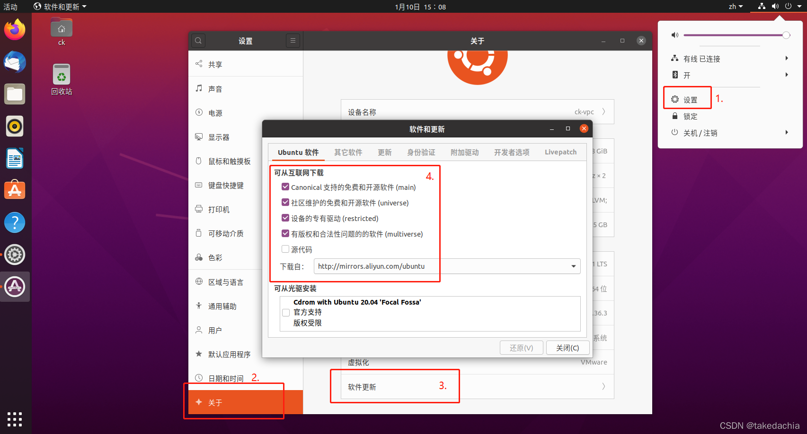点击系统界面的左下角可浏览软件列表，左边的公文包图标可打开软件中心管理安装软件，类似应用市场。

### 2 打开终端

类似Windows系统的命令提示符cmd。  
快捷键：Ctrl+Alt+T  
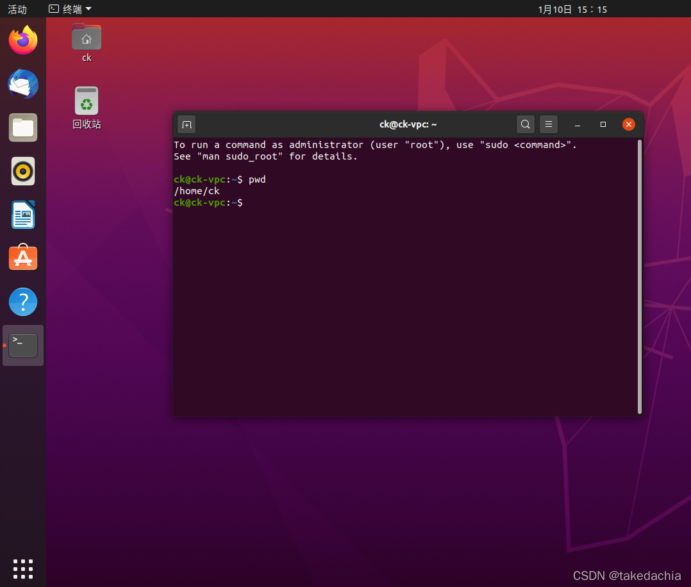

### 3 显示目前文件目录：`pwd`

见上图  
Ubuntu系统只有一个盘，当前用户的资料存储在 根目录/home/用户名 下。

### 4 进入指定目录：`cd`

进入子目录：`cd 目录名`  
进入上一级目录`cd ..`  
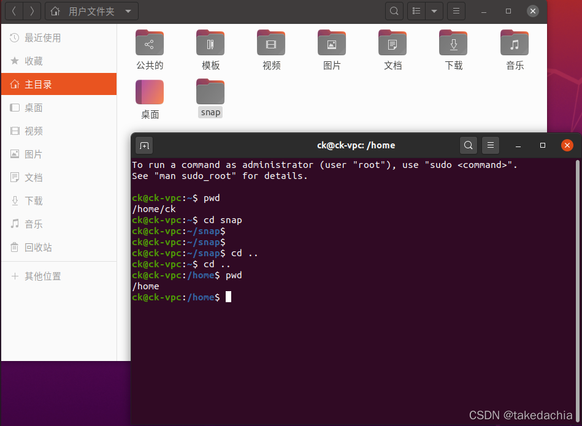

#### 当前目录下打开文件夹（图形界面）

`open .`

### 5 文件夹操作

创建新文件夹 `mkdir 文件夹名`  
查看当前目录下所有文件 `ls`  
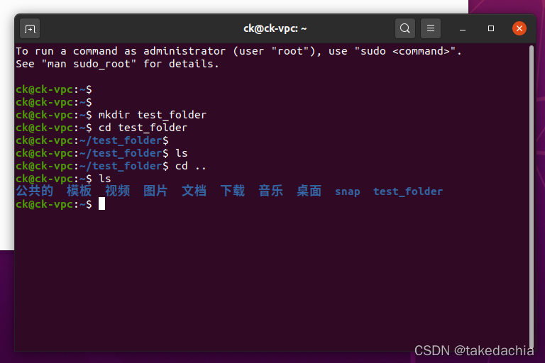


### 6 文件操作

创建新文件（类似创建空txt，打开可编辑）`touch 文件名`  
移动文件 `mv 文件名 /目标目录`。例：`mv test_file /home/ck`  
拷贝文件 `cp test_file 目标目录(/文件名)`。例：`cp test_file test_folder/test_file2`  
删除文件 `rm 文件名`  
删除文件夹 `rm -r 目录名`  
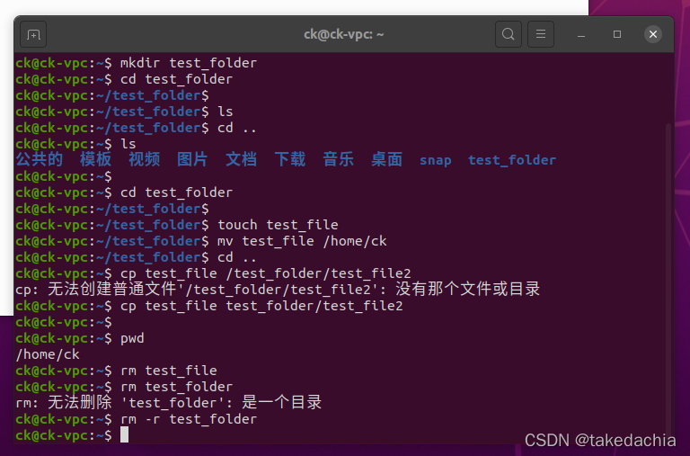

### 7 指令使用帮助：`指令名 --help`

例：`cd --help`

### 8 以超级用户权限执行一些操作 `sudo`

例：安装、更新软件，如更新当前系统软件列表：`sudo apt-get update`

### 9 查看进程并关闭进程

查看全部进程信息：

    ps -aux


根据关键字查看具体的某个进程：

    ps -aux | grep 进程关键字


杀死进程：

    sudo kill 进程号(PID)


接着将是ROS的安装教程~

图摘自：B站【古月居】古月·ROS入门21讲

# What is ROS


*   ROS：Robot Operating System
*   包括了四个part：通信机制、开发工具、应用功能、生态系统
*   这种模式旨在提高机器人研发中的软件复用率

### 2 节点(Node) 与 节点管理器(Node Master)

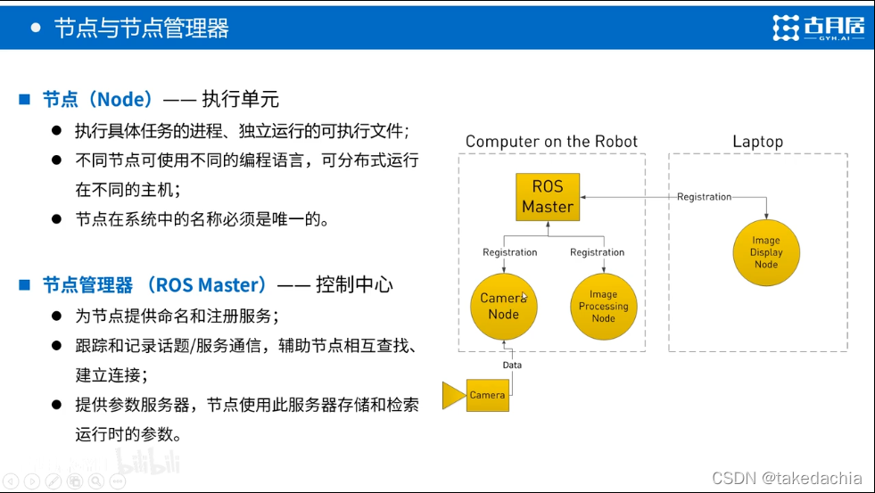

### 3 通信模式之一——Topic模式

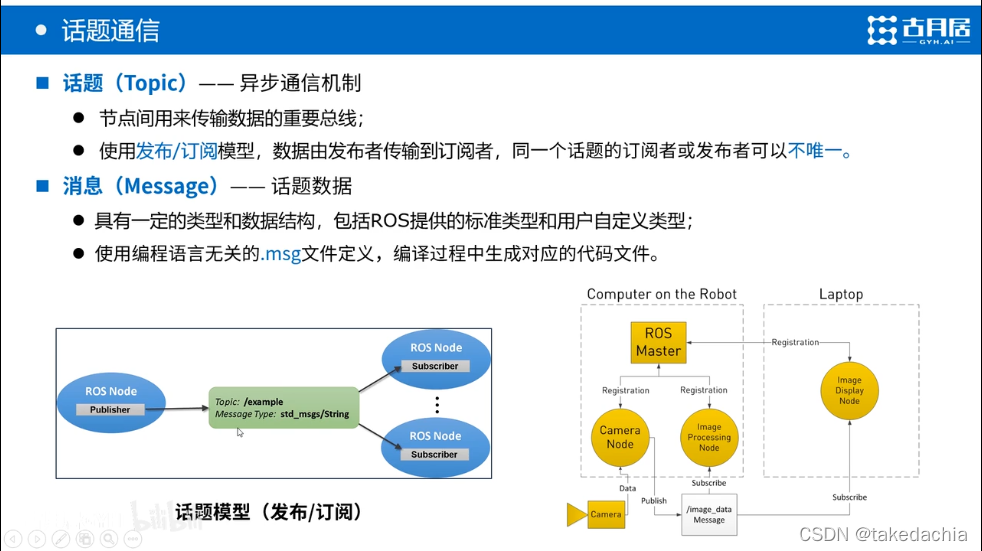

*   Message：定义数据的类型，具有一定的数据结构定义
*   单向的
*   数据的管道称为Topic（话题）
*   使用 发布&订阅 模型，右下图显示了Camera Node是发布者，图像处理节点和图像显示节点是订阅者。
*   话题的消息的接口使用 .msg 文件定义

### 4 通信模式之二——Service模式

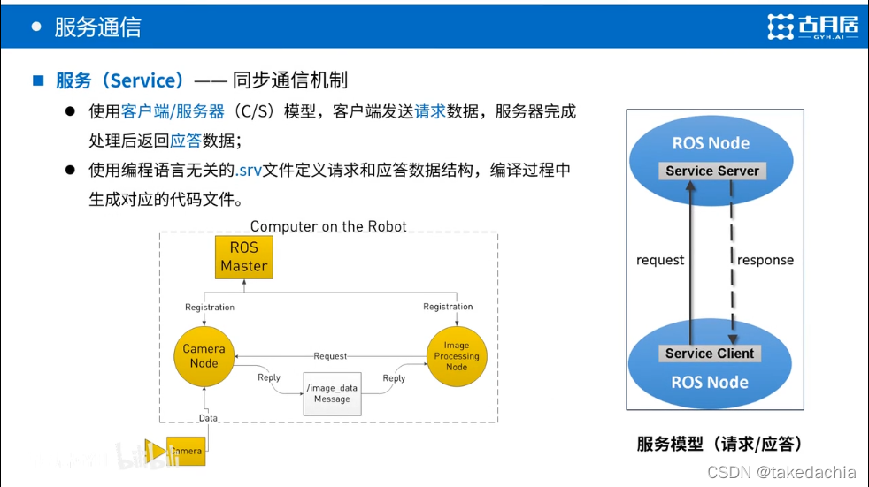

*   C/S模型
*   带有反馈的机制
*   双向的
*   如左下图，图像处理节点向Camera节点发出请求（比如上调图像分辨率），Camera节点上调分辨率后向图像处理节点发出反馈。
*   服务的数据内容可用 .srv 定义

### 5 两者对比

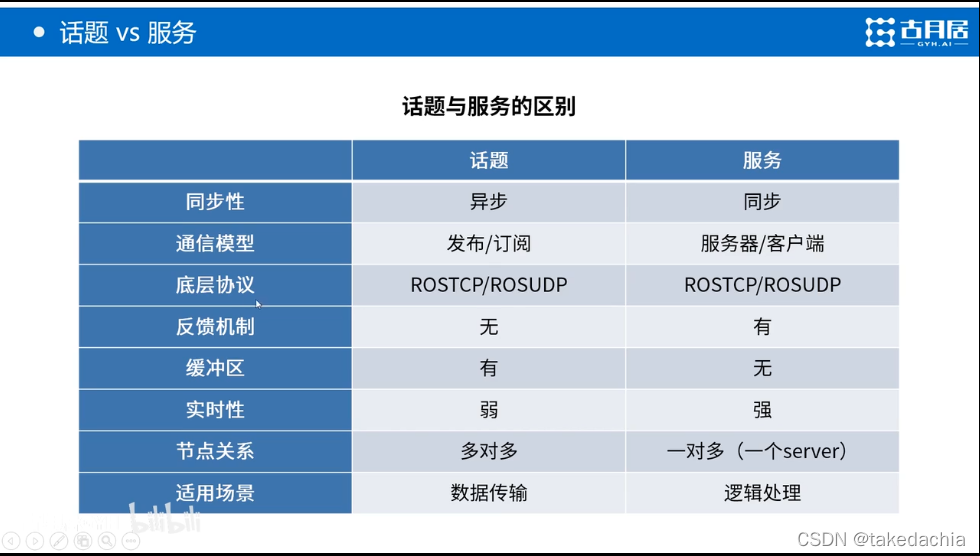

### 6 参数(Parameter)

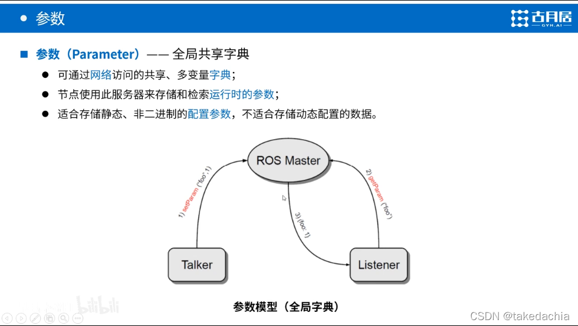

*   参数是一个“字典”
*   存储在ROS Master服务器，节点可以对参数存储、检索、更新（如图）
*   适合静态存储、非二进制

### 7 文件系统

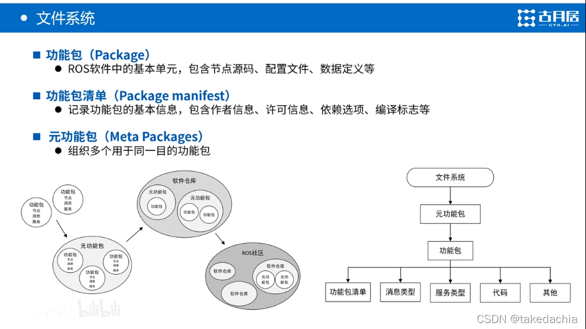

*   文件系统代表了代码的结构。

([fin](https://so.csdn.net/so/search?q=fin&spm=1001.2101.3001.7020))

## 打开小海龟程序  

终端，启动ROS Master：

    roscore


终端2，启动小海龟仿真器：  
（输入`rosrun turtlesim`，敲两下`Tab`健可查看该命令下有哪些功能）

    rosrun turtlesim turtlesim_node


终端3，启动海龟控制节点：

    rosrun turtlesim turtle_teleop_key


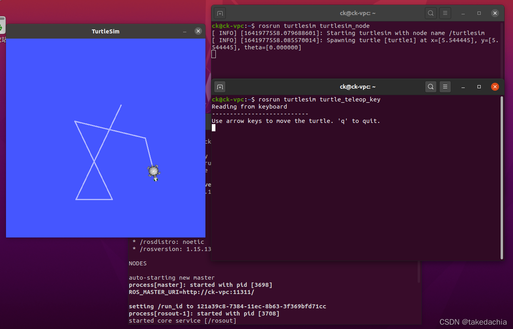

### 2 查看系统中的计算图：rqt\_graph

新建终端窗口：

    rqt_graph

可展示系统中运行的计算图：  
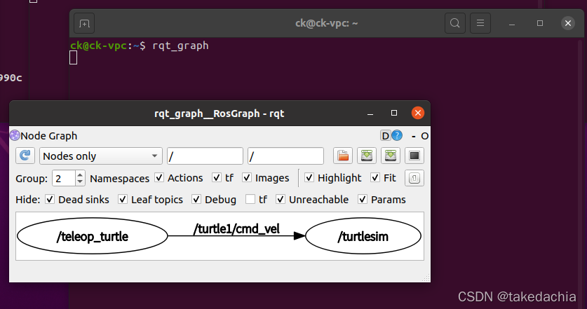可以清晰地了解系统节点间通信的部分信息。  
teleop\_turtle节点（键盘控制节点）通过cmd\_vel（topic）向turtlesim节点（海归仿真器节点)发出消息，使得小海龟移动。

### 3 rosnode

#### 显示节点列表：rosnode list

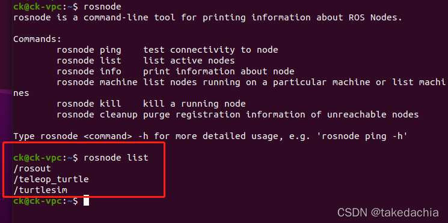可以看到有3个节点。

#### 查看节点信息：rosnode info

查看节点的具体信息：`rosnode info /节点名`  
我们查看海龟仿真器节点/turtlesim的信息：  
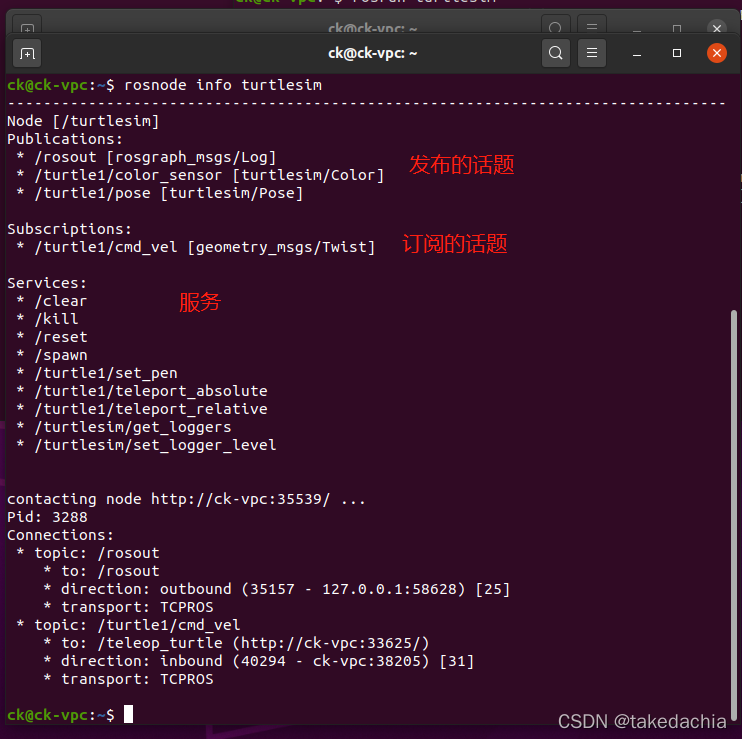  
可以看到海龟仿真器节点/turtlesim自己有一些发布和订阅，也有一些服务。

### 4 rostopic

#### 显示topic列表：rostopic list

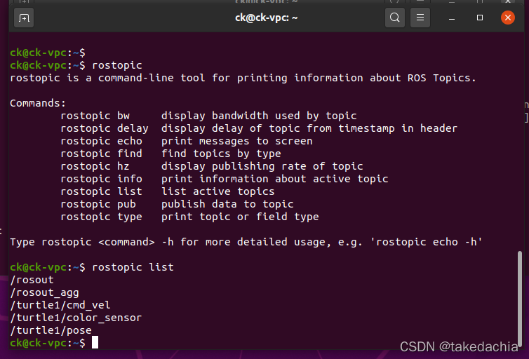

#### 手动发布数据给topic

我们来手动发布数据给topic来控制海龟移动，使用`rostopic pub`  
上图我们看到小海龟是通过/cmd\_vel这个topic进行发布信息而移动的，这次我们通过手动publish数据给这个topic来控制小海龟移动。  
格式：`rostopic pub (参数) 话题名 消息数据结构 “具体数据”`  
例，我们输入：（我们可以使用Tab键让我们自动填充数据，使用方向键←→移动到指定位置修改数据，比如我们把x的0.0改成了1.0）

    rostopic pub /turtle1/cmd_vel geometry_msgs/Twist "linear:
      x: 1.0
      y: 0.0
      z: 0.0
    angular:
      x: 0.0
      y: 0.0
      z: 0.0"

小海龟沿着正前方向移动了1单位，我们再使用参数`-r 5`移动5次，小海龟就撞上了南墙。  
Ctrl+C就可以终止。  
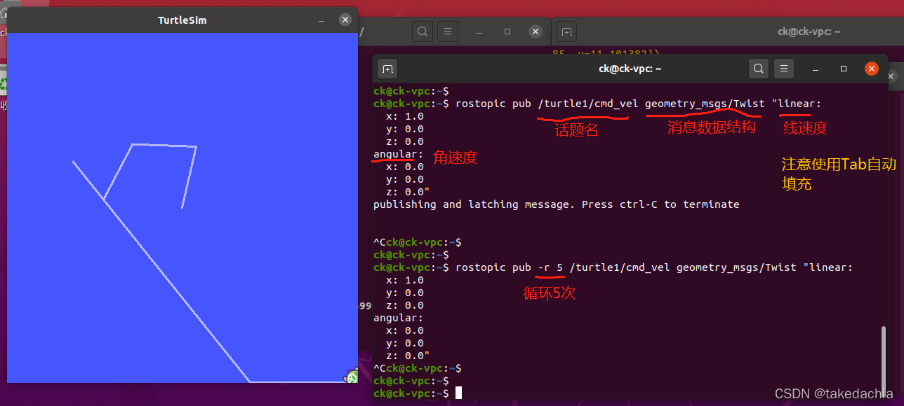

### 5 rosmsg

#### 查看消息数据结构

上例我们使用了**消息数据结构**定义了一个消息传给topic，我们可以查看有哪些消息数据结构。  
查看消息数据结构使用：rosmsg show …  
在输入过程中，我们可以勤使用Tab键查看或填充内容。  
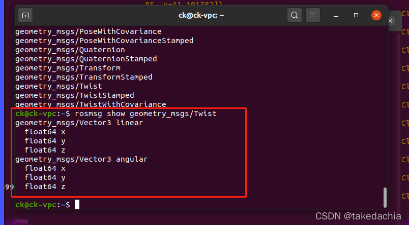我们可以看到geometry\_msgs/Twist数据结构的内容。

### 6 使用服务通信方式：rosservice

上例我们使用了向topic传msg来控制节点，这次我们试试第二种通信方式service。

#### 查看服务列表：rosservice list

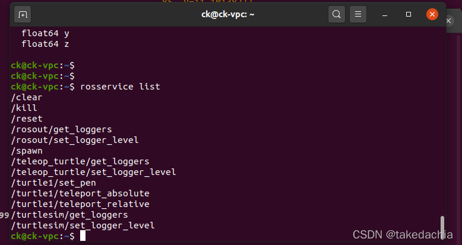

#### 手动通过服务来进行操作

这次我们通过人工产生服务（service）来诞生一只新海龟，使用rosservice call /spawn …  
在服务列表中，有个/spawn服务，可以产生一只新的海龟。  
格式：`rosservice call (参数) 服务名 “具体数据”`  
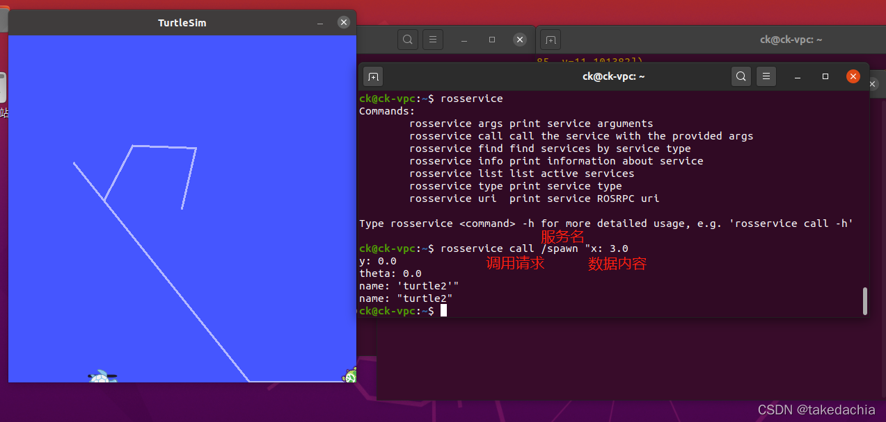  
这时我们再输入`rostopic list`，可以看到turtle2已经在topic里了。

### 7 话题记录和复现：rosbag

试想我们尝试让海龟以我们指定的路径移动了一回，我们想要把它 记录下来，拷贝到自己的实验室再复现出来，我们就可以使用话题记录功能。  
常用命令：`rosbag record -a -O 文件名`  
比如我们使用之前打开的键盘操作器让海龟移动一圈并记录下来：  
（1）打开新终端输入`rosbag record -a -O cmd_record`  
这样就开始记录了：  
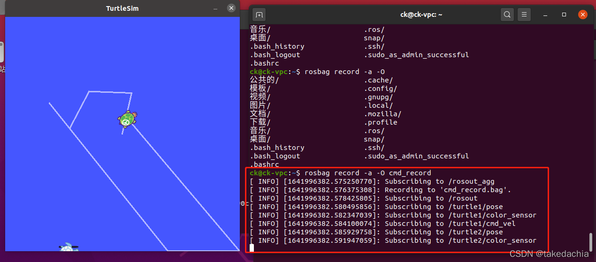（2）移动一下：  
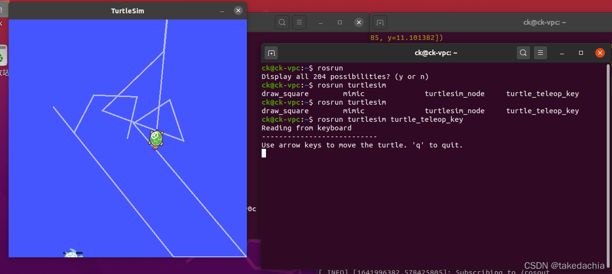到记录界面按Ctrl+C停止：  
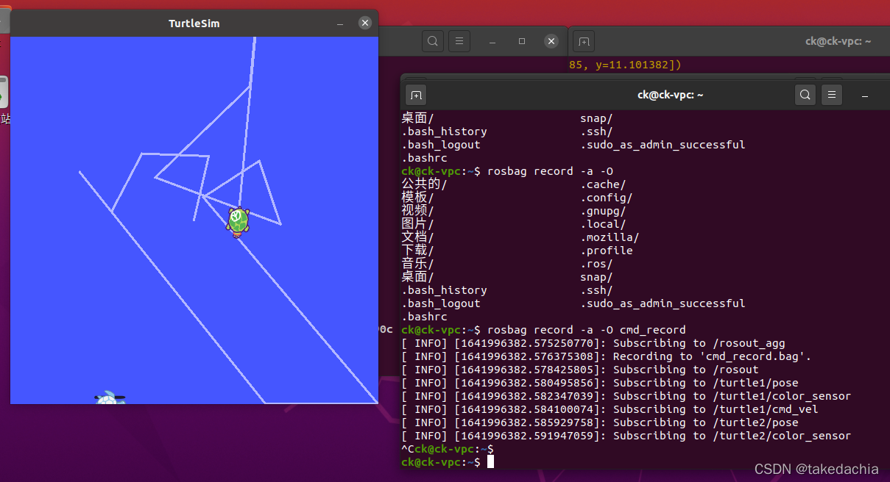文件就记录在了这里：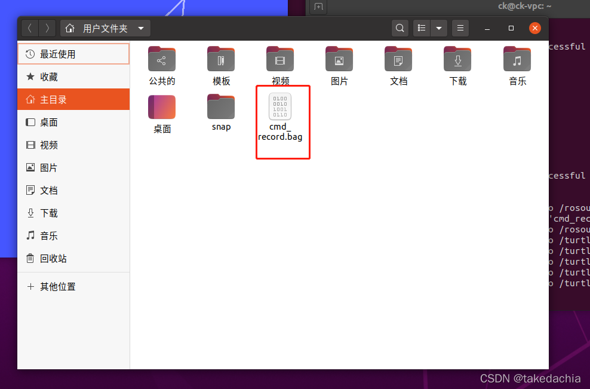  
（3）接下去关闭所有打开的ros节点  
重新开启roscore，开启海龟节点rosrun turtlesim turtlesim\_node  
这时我们输入 `rosbag play cmd_record`就可以复现之前的移动啦！  
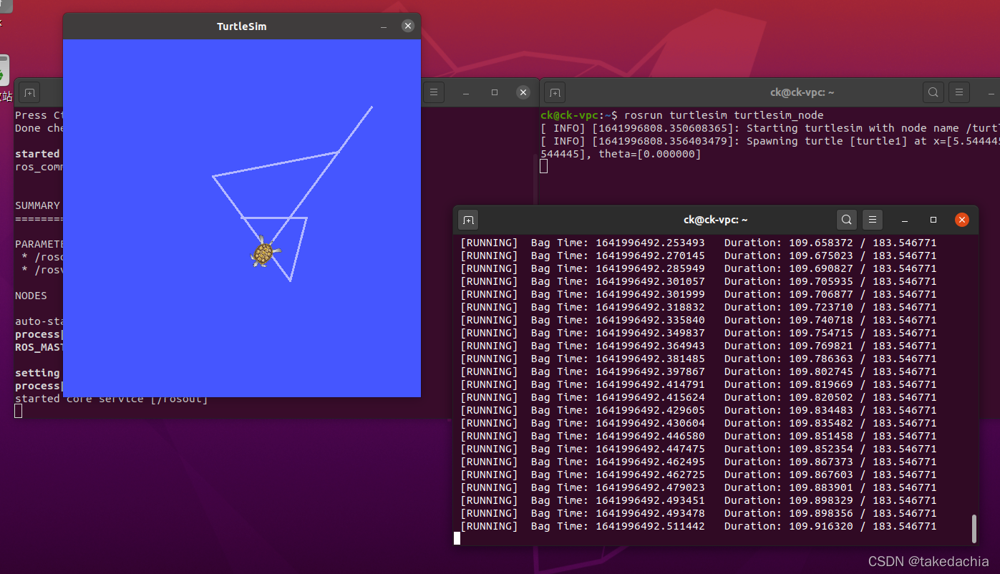

 ### 1 What is Workspace(工作空间)

**工作空间**（Workspace）：存放工程开发相关文件的文件夹。类似一个IDE（例如Pycharm）新建一个工程，就是一个工作空间。包含4个文件夹：

*   src：**代码空间**（Source Space）：放置功能包代码
*   build：**编译空间**（Build Space）：编译过程中产生的中间文件，不用过多关注
*   devel：**开发空间**（Development Space）：放置编译生成的可执行文件、库、脚本
*   install：**安装空间**（Install Space）：存放可执行文件，与上面有一定重复  
    例图：  
    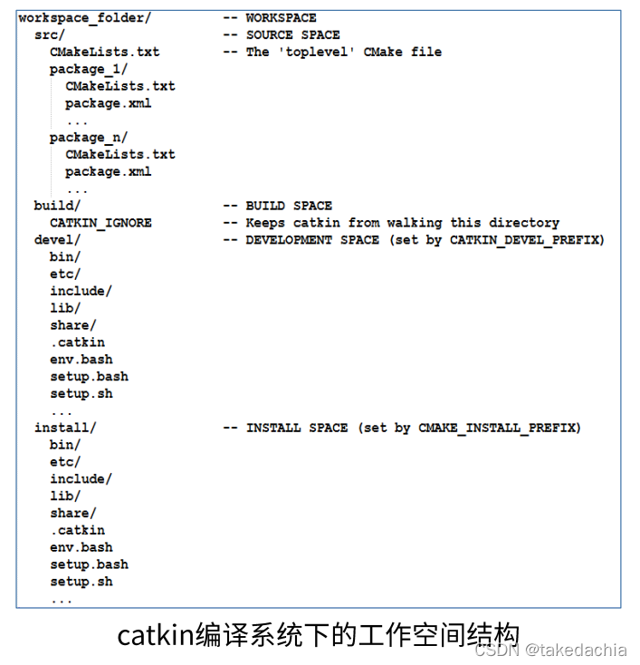

# 创建工作空间

#### 创建

    mkdir -p ~/catkin_ws/src
    cd ~/catkin_ws/src
    catkin_init_workspace

我们先创建一个src文件夹，然后进入该文件夹  
第3行`catkin_init_workspace`意为将当前文件夹变为工作空间，使其拥有工作空间的属性  
注：“~/”意为当前用户名目录；“-p”意为递归创建目录，即直接创建多级目录。  
src文件夹即代码空间，不能自行用别的名称代替  
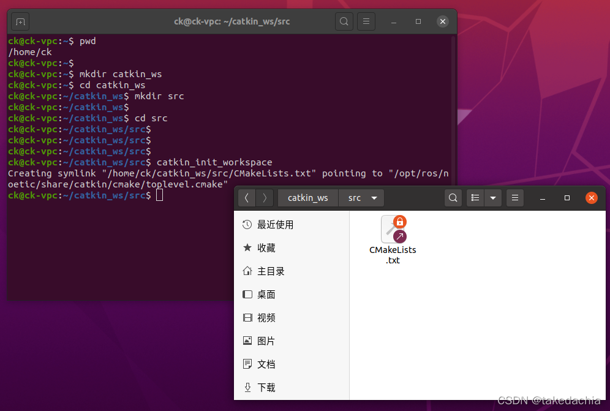可以看到创建了这么一个txt文件，说明创建工作空间成功。

#### 编译空代码的工作空间

要编译工作空间，先要回到工作空间的根目录。

    cd ~/catkin_ws
    catkin_make

第二行`catkin_make`为编译指令，将src里的源码都进行编译。  
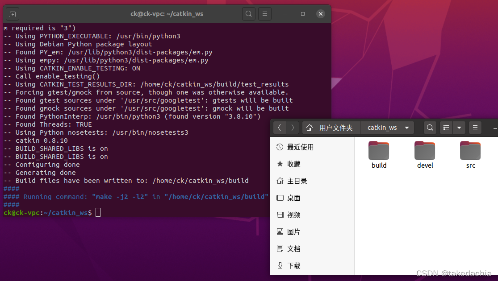可以看到生成了build和devel两个新文件夹，devel存放了编译完成的内容。  
这里没有生成install文件夹，要生成install文件夹，输入`catkin_make install`：  
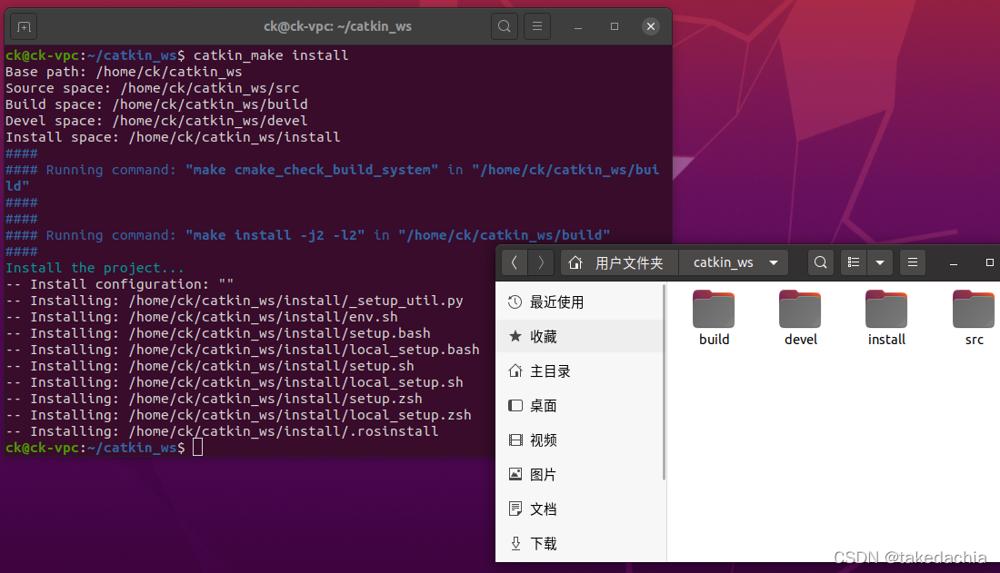install中生成了可执行文件。  
这样一个空的工作空间创建好了，并且空的代码空间（功能包)编译完成。

### 3 创建功能包

**功能包**是放置ROS源码的最小单元。  
上面我们创建了一个空的工作空间，src文件夹里面没写东西，现在我们创建一个自己的功能包。  
注意同一工作空间下，不允许存在同名功能包；不同工作空间下，允许存在同名功能包。

#### 创建

指令格式：`catkin_create_pkg <package_name> [depend1] [depend2] [depend3]`  
<package\_name>为包名  
\[depend\]为依赖，即指明编译的时候需要ROS中的其他功能包，如需要调用python、C++库，就要指明rospy、roscpp。  
我们创建功能包：

    cd ~/catkin_ws/src
    catkin_create_pkg test_pkg std_msgs rospy roscpp


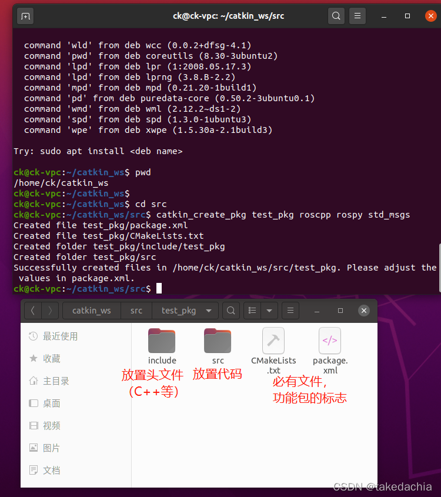  
创建成功，我们可以打开文件夹见到我们的目录结构(上图)。

#### 编译新的功能包

回到工作空间根目录，再编译一下。

    cd ~/catkin_ws
    catkin_make


### 4 设置和检查环境变量

#### 设置

编译完功能包后，为了运行，先设置环境变量，以便系统找到我们的工作空间和功能包。

    source ~/catkin_ws/devel/setup.bash


#### 检查

    echo $ROS_PACKAGE_PATH


echo为打开环境变量，通过 ROS\_PACKAGE\_PATH 查找所有ros功能包的路径。  
前面source了 devel/setup.bash ，现在就会包含这个路径：  


### 5 功能包中的两个重要文件

#### package.xml

使用xml语言描述功能包相关的信息：  
（后面的课会用到）  


#### CMakeLists.txt

描述功能包里的编译规则，使用CMake语法。  
（后面的课会越来越多的用到）  


 

基于B站ROS公开课：【古月居】古月·ROS入门21讲  
基于Ubuntu 20.04.1、Noetic版本  
修正错误，并详述Python版本部署  

#### 目录（本节基于P10）

*   *   [1 模型图](#1__10)
    *   [2 创建功能包](#2__20)
    *   [3 创建Publisher代码（以C++为例）](#3_PublisherC_28)
    *   [4 编译代码（以C++为例）](#4_C_46)
    *   *   [配置Publisher代码编译规则](#Publisher_48)
        *   [执行编译](#_61)
        *   [source 一下 setup.bash](#source__setupbash_68)
        *   [运行](#_72)
    *   [5 创建Publisher代码（以Python为例）](#5_PublisherPython_90)
    *   *   [查看内置Python版本](#Python_96)
        *   [创建Python代码](#Python_104)
    *   [6 编译代码（以Python为例）](#6_Python_122)
    *   *   [配置代码编译规则](#_124)
        *   [执行编译](#_130)
        *   [source 一下 setup.bash](#source__setupbash_137)
        *   [运行](#_141)

前面提到的通信模式之一的Topic模式，其使用“发布订阅”的方式来通信。  
我们之前是通过命令行或键盘操控的形式让海龟动起来的，这次我们直接编译一个程序来控制它。  
本节通过创建一个发布者Publisher来控制海龟。  
我们先看要实现的这个小程序的图。  
(部分图摘自：b站【古月居】古月·ROS入门21讲)

# 发布者Publisher的编程实现

图中，我们使用ROS Master管理节点。  
有两个主要节点：  
**Publisher**，名为Turtle Velocity（即海龟的速度）  
**Subscriber**，即海龟仿真器节点 /turtlesim  
Publisher(Turtle Velocity)，发布Message（即海龟的速度信息，以geometry\_msgs::Twist的数据结构，包括线速度和角速度），通过Topic（/turtle1/cmd\_vel）总线管道，将数据传输给Subscriber。Subscriber订阅得到的速度信息，来控制海龟发生运动。

“/turtle1/cmd\_vel”这个topic是海归仿真器节点/turtlesim下自带的topic，可直接拿来用。


### 2 创建功能包

我们之前已经创建了工作空间了，这次我们在src文件夹创建一个新的功能包learning topic

    cd ~/catkin_ws/src
    catkin_create_pkg learning_topic roscpp rospy std_msgs geometry_msgs turtlesim


### 3 创建Publisher代码（以C++为例）

**关于如何实现一个Publisher：**

*   初始化ROS节点
*   向ROS Master注册节点信息，包括发布的话题名和话题中的消息类型
*   创建消息数据
*   按照一定的频率循环发布消息

先以C++为例（后面会讲Python的情形），我们这次需要在src里创建C++的代码文件以输入代码。源码见下。  

**节点名不能重复**

（源码地址：https://github.com/guyuehome/ros\_21\_tutorials/blob/master/learning\_topic/src/velocity\_publisher.cpp）  
我用红字标上了代码讲解。  


```c++
#include<ros/ros.h>
#include<geometry_msgs/Twist.h>
using namespace std;

int main(int argc,char **argv){
    //ros节点初始化
     ros::init(argc,argv,"velocity_publisher");
     //创建节点句柄
     ros::NodeHandle n;
     //创建一个publisher,发布名为velocity_publisher
     ros::Publisher turtle_vel_pub = n.advertise<geometry_msgs::Twist>("/turtle1/cmd_vel",10);
     //设置循环的频率
     ros::Rate loop_rate(10);//ros::ok()
     
     int count = 0;

     while(ros::ok()){
        //初始化geometry_msgs::Twist类型的消息
         geometry_msgs::Twist vel_msg;
         vel_msg.linear.x = 0.5;
         vel_msg.angular.z = 0.2;

         //发布消息
        turtle_vel_pub.publish(vel_msg);
        ROS_INFO("Publish turtle velocity command[%0.2f m/s %0.2f rad/s]",vel_msg.linear.x,vel_msg.angular.z);


        loop_rate.sleep();
}
 return 0;
}
```

将这个cpp文件创建在src文件夹下：  


### VSC设置

#### 设置插入模式

vscode的文本编辑器继承了linux上vim的功能。用vscode打开源文件后，可能默认的模式是一般模式，这种模式下是不能输入字符的，对于用惯了windows的人来说是非常不习惯的。如何将默认的模式更改为插入模式呢。File-Preferences-Settings，搜索vim.startInInsertMode，在Start in Insert mode前面打上勾。

#### 设置包能够正确被读取

如图所示

找到ros的include文件
---------------

如图，我的ros的include文件位置是

    /opt/ros/noetic/include

路径大概都差不多，我的ros版本是noetic，所以其他版本的ros的路径可能是换成其他版本的名称  
记住这个路径  


左键点击小灯泡，再点击编辑“include”设置  


将你ros的include文件的路径填到包含路径中去，注意在路径最后加上/\*\*表示递归搜索。即

    /opt/ros/noetic/include/**


  
返回到你的cpp文件，就会发现问题解决。(至少我是解决了)  
  
编写一个publisher程序并检验  
  
点击init类并摁F12  
  
成功！

注意
--

不要让CMake config 你的工作环境，可能会失效（我点了config后，这个方法就失效了）

### 4 编译代码（以C++为例）

有了代码，接下来编译。

#### 配置Publisher代码编译规则

首先需要配置CMakeLists.txt中的编译规则：

*   设置需要编译的代码和生成的可执行文件
*   设置链接库

将下列代码拷贝至CMakeLists.txt中：

    add_executable(velocity_publisher src/velocity_publisher.cpp)
    target_link_libraries(velocity_publisher ${catkin_LIBRARIES})

拷贝到下图这个位置（代码的作用见图）：  


#### 执行编译

回到工作空间目录，执行编译.

    cd ~/catkin_ws
    catkin_make


#### source 一下 setup.bash

我们之后每次运行这个程序都需要source一下devel/setup.bash，我们不妨将  
`source devel/setup.bash`放入环境变量.bashrc中。  


#### 运行

打开终端，分别运行：

    roscore


    rosrun turtlesim turtlesim_node


    rosrun learning_topic velocity_publisher

  
海龟就按照我们之前代码中设定的线速度和角速度画圆啦！

我们编译好的程序是放在devel/lib目录下的：  


### 5 创建Publisher代码（以Python为例）

下面我们详述Python的实现方法。  
Python的步骤中，在“配置编译规则”和“编译并执行”这俩步骤有些不同，前面都一样。

#### 查看内置Python版本

Ubuntu20.04内置了Python3.8，可见 /usr/bin 目录下：  
我们在终端使用`python3`命令可调用python，比如查看版本号：

    python3 --version


#### 创建Python代码

python代码文件是放在功能包文件夹下的scripts目录下的，我们需要新建一个scripts文件夹。  
复述一下**实现Publisher的方法：**

*   初始化ROS节点
*   向ROS Master注册节点信息，包括发布的话题名和话题中的消息类型
*   创建消息数据
*   按照一定的频率循环发布消息

我们把我们的Python版的代码拷贝到目录下。  
（源码地址：https://github.com/guyuehome/ros\_21\_tutorials/blob/master/learning\_topic/scripts/velocity\_publisher.py）  
（注意：第31行 `rospy.loginfo("Publsh turtle velocity command[%0.2f m/s, %0.2f rad/s]",`原作者因为用Tab导致对齐失败，手动用4个空格对齐一下）  
我用红字标上了代码讲解。  


右击文件→属性，打开执行权限：  


### 6 编译代码（以Python为例）

有了代码，接下来编译。

#### 配置代码编译规则

在新的Noetic版本的ROS中，需要配置这一步，貌似之前的版本不需要配置。

我们配置一下CMakeLists.txt中的编译规则：  
将文件中的catkin\_install\_python这段取消注释，并将默认的my\_python\_script改成velocity\_publisher.py  


#### 执行编译

回到工作空间目录，执行编译.

    cd ~/catkin_ws
    catkin_make


#### source 一下 setup.bash

如前所述，需要将`source devel/setup.bash`放入环境变量.bashrc中(.bashrc在主目录中，是隐藏文件)。  
我们前面C++的时候这句话已经放进去了。

#### 运行

打开终端，分别运行：

    roscore


    rosrun turtlesim turtlesim_node


    rosrun learning_topic velocity_publisher.py

python直接执行功能包下的这个py文件就行了。  
小海龟一样跑起来啦~

本节通过创建一个订阅者Subscriber来控制海龟。  
我们先看要实现的这个小程序的图。  
(部分图摘自：b站【古月居】古月·ROS入门21讲)

# 订阅者**Subscriber**的编程实现

ROS Master管理两个主要节点：  
**Publisher**，海龟[仿真器](https://so.csdn.net/so/search?q=%E4%BB%BF%E7%9C%9F%E5%99%A8&spm=1001.2101.3001.7020)/turtlesim  
**Subscriber**，名为Pose Listener  
这次海龟仿真器turtlesim为Publisher，发布Message（传输的是动作信息，以数据结构 turtlesim::Pose发布），通过[Topic](https://so.csdn.net/so/search?q=Topic&spm=1001.2101.3001.7020)（/turtle1/pose）的管道，将数据传输给Subscriber。Subscriber订阅得到的数据，获得Pose信息。

“/turtle1/pose”这个topic是海归仿真器节点/turtlesim下自带的topic，直接拿来用。


### 2 创建功能包

我们之前已经创建了工作空间和功能包learning topic了。  
直接上代码。

### 3 创建Subscriber代码（C++）

**如何实现一个Subscriber：**

*   初始化ROS节点
*   订阅需要的话题
*   循环等待话题消息，接收到消息后进入回调函数
*   在回调函数中完成消息处理

（源码：https://github.com/guyuehome/ros\_21\_tutorials/blob/master/learning\_topic/src/pose\_subscriber.cpp）  
我用红字标上了代码讲解。  


```c++
/**
 * 该例程将订阅/turtle1/pose话题，消息类型turtlesim::Pose
 */
 
#include <ros/ros.h>
#include "turtlesim/Pose.h"

// 接收到订阅的消息后，会进入消息回调函数
void poseCallback(const turtlesim::Pose::ConstPtr& msg)
{
    // 将接收到的消息打印出来
    ROS_INFO("Turtle pose: x:%0.6f, y:%0.6f", msg->x, msg->y);
}

int main(int argc, char **argv)
{
    // 初始化ROS节点
    ros::init(argc, argv, "pose_subscriber");

    // 创建节点句柄
    ros::NodeHandle n;

    // 创建一个Subscriber，订阅名为/turtle1/pose的topic，注册回调函数poseCallback
    ros::Subscriber pose_sub = n.subscribe("/turtle1/pose", 10, poseCallback);

    // 循环等待回调函数
    ros::spin();

    return 0;
}
```


### 4 编译代码（C++）

有了代码，接下来编译。

#### 配置代码编译规则

配置CMakeLists.txt中的编译规则：

*   设置需要编译的代码和生成的可执行文件
*   设置链接库

将下列代码拷贝至CMakeLists.txt中：  
直接加到之前那两行下面即可

    add_executable(pose_subscriber src/pose_subscriber.cpp)
    target_link_libraries(pose_subscriber ${catkin_LIBRARIES})


#### 执行编译

回到工作空间目录，执行编译.

    cd ~/catkin_ws
    catkin_make


#### source 一下 setup.bash

将`source devel/setup.bash`放入环境变量.bashrc中，之前已完成。

#### 运行

打开终端，分别运行：

    roscore


    rosrun turtlesim turtlesim_node


    rosrun learning_topic pose_subscriber


这时海龟的位置就会一直被pose\_subscriber监听，现在因为海龟没动，所以x、y的坐标值是不会变的。  
我们让海龟动起来，再建立一个之前用过的键盘控制节点：

    rosrun turtlesim turtle_teleop_key


控制它移动，坐标就发生实时变化啦！  


### 5 Python实现

（源码：https://github.com/guyuehome/ros\_21\_tutorials/blob/master/learning\_topic/scripts/pose\_subscriber.py）

#### 创建Python代码

源码拷贝到scripts下。  
我用红字标上了代码讲解。  


右击文件→属性，打开执行权限。

#### 配置代码编译规则

配置一下CMakeLists.txt中的编译规则：  
之前已将文件中的catkin\_install\_python这段取消注释，并将默认的my\_python\_script改成了velocity\_publisher.py  
这次再加上一个关于pose\_subscriber.py的catkin\_install\_python方法：  


#### 编译代码

回到工作空间目录，执行编译.

    cd ~/catkin_ws
    catkin_make


#### source 一下 setup.bash

略过。

#### 运行

打开终端，分别运行：

    roscore


    rosrun turtlesim turtlesim_node


    rosrun learning_topic pose_subscriber.py


    rosrun turtlesim turtle_teleop_key


控制它移动，成功！  


### 试着查看一下系统当前的[计算图](https://so.csdn.net/so/search?q=%E8%AE%A1%E7%AE%97%E5%9B%BE&spm=1001.2101.3001.7020)

再打开一个终端，输入：

    rqt_graph


调到所有活动active节点/话题视图，可看到3个节点：  
键盘控制器节点/teleop\_turtle 通过 /turtle/cmd\_vel 传速度msg给海归仿真器节点/turtlesim，  
/turtlesim 通过 /turtle/pose 传位置msg给subscriber节点。  
/turtle/cmd\_vel 和 /turtle/pose 两个topic都在turtle1海龟下面，因为海龟自身会发布速度和位置的msg给这两个topic  


# 话题消息的定义与使用

之前两节使用了Topic模型，我们先使用了Twist类型（geometry\_msgs.msg库下的Twist类）的Message作为输入指令进行发布，接着使用了Pose类型（Turtlesim.msg库下的Pose类）的Message作为订阅消息进行接收。  
我们可以使用`rosmsg show ...`来查看这俩的数据结构，可以看出包含了哪些信息：  


以上的**Message**消息都是预定义好的，当我们需要自定义消息该怎么做呢？  
(部分图摘自：b站【古月居】古月·ROS入门21讲)

### 模型图

这节我们自定义一个消息类型“Person”，并完成发布订阅整个过程，Publisher进行发布个人信息，Subscriber来接收个人信息。Topic定义名为“person\_info”。  


### 自定义话题消息

#### 定义msg文件

我们通过自定义msg文件来自定义话题消息。  
我们定义msg文件名为：_Person.msg_

1.  在learning\_topic的功能包根目录下，新建文件夹 msg  
    并创建新文件 Person.msg，创建方法为使用`touch`命令在当前目录输入：

    touch Person.msg
    

注意Person的"P"要大写。

2.  我们把下面代码复制进Person.msg

    string name
    uint8 sex
    uint8 age
    
    uint8 unknown = 0
    uint8 male = 1
    uint8 female = 2

msg文件定义使用自己的一套语言规则。  
定义好msg数据接口后，就可以根据这个定义用C++或Python编译。

#### 在package.xml中添加功能包依赖

添加动态生成程序的功能包依赖。  
打开package.xml文件，将下面代码拷到文件指定位置：

    <build_depend>message_generation</build_depend>
    <exec_depend>message_runtime</exec_depend>


build\_depend为编译依赖，这里依赖的是一个会动态产生message的功能包  
exer\_depend为执行依赖，这里依赖的是一个动态runtime运行的功能包


#### 在CMakeLists.txt中添加编译选项

1.  因为在package.xml添加了功能包编译依赖，在CMakeList.txt里的find\_package中也要加上对应的部分；
2.  需要将定义的Person.msg作为消息接口，针对它做编译；
3.  需要指明编译这个消息接口需要哪些ROS已有的包；  
    有了这两个配置才可将定义的msg编译成不同的程序文件
4.  因为在package.xml添加了功能包执行依赖，在CMakeList.txt里的catkin\_package中也要加上对应的部分；

代码，复制到图示位置：

    find_package( ...... message_generation)
    
    add_message_files(FILES Person.msg)
    generate_messages(DEPENDENCIES std_msgs)
    
    catkin_package( ...... message_runtime)


#### 编译生成C++头文件或Python库

以上完成后，到工作空间根目录，编译：

    catkin_make


  
编译完成后，我们可以在 devel/include/learning\_topic/ 下找到这个C++的头文件：  
  
也可以在 devel/lib/python3/dist-packages/learning\_topic/msg 下找到Python的包：  
  
接下来我们就可以通过编写程序来调用生成的.h或.py了！

### 3 创建代码并编译运行（C++）

#### 创建代码

我们创建一个Publisher代码和一个Subscriber代码，通过程序调用生成的.h。  
(源码：https://github.com/guyuehome/ros\_21\_tutorials/tree/master/learning\_topic/src)  
我用红字标上了代码讲解。  
  

```c++
#include <ros/ros.h>
#include "learning_topic/Person.h"

int main(int argc, char **argv)
{
    // ROS节点初始化
    ros::init(argc, argv, "person_publisher");

    // 创建节点句柄
    ros::NodeHandle n;

    // 创建一个Publisher，发布名为/person_info的topic，消息类型为learning_topic::Person，队列长度10
    ros::Publisher person_info_pub = n.advertise<learning_topic::Person>("/person_info", 10);

    // 设置循环的频率
    ros::Rate loop_rate(1);

    int count = 0;
    while (ros::ok())
    {
        // 初始化learning_topic::Person类型的消息
    	learning_topic::Person person_msg;
		person_msg.name = "Tom";
		person_msg.age  = 18;
		person_msg.sex  = learning_topic::Person::male;

        // 发布消息
		person_info_pub.publish(person_msg);

       	ROS_INFO("Publish Person Info: name:%s  age:%d  sex:%d", 
				  person_msg.name.c_str(), person_msg.age, person_msg.sex);

        // 按照循环频率延时
        loop_rate.sleep();
    }

    return 0;
}

```


```c++
#include <ros/ros.h>
#include "learning_topic/Person.h"

// 接收到订阅的消息后，会进入消息回调函数
void personInfoCallback(const learning_topic::Person::ConstPtr& msg)
{
    // 将接收到的消息打印出来
    ROS_INFO("Subcribe Person Info: name:%s  age:%d  sex:%d", 
			 msg->name.c_str(), msg->age, msg->sex);
}

int main(int argc, char **argv)
{
    // 初始化ROS节点
    ros::init(argc, argv, "person_subscriber");

    // 创建节点句柄
    ros::NodeHandle n;

    // 创建一个Subscriber，订阅名为/person_info的topic，注册回调函数personInfoCallback
    ros::Subscriber person_info_sub = n.subscribe("/person_info", 10, personInfoCallback);

    // 循环等待回调函数
    ros::spin();

    return 0;
}

```

在代码中我们调用了自己编译好的头文件，并使用了定义的Person类和属性。

将代码拷贝到src文件夹下。

#### 编译

先配置CMakeLists.txt编译规则，复习一下规则：

*   设置需要编译的代码和生成的可执行文件；
*   设置链接库；
*   **添加依赖项**。

将下面代码拷贝到指定位置：

    add_executable(person_publisher src/person_publisher.cpp)
    target_link_libraries(person_publisher ${catkin_LIBRARIES})
    add_dependencies(person_publisher ${PROJECT_NAME}_generate_messages_cpp)
    
    add_executable(person_subscriber src/person_subscriber.cpp)
    target_link_libraries(person_subscriber ${catkin_LIBRARIES})
    add_dependencies(person_subscriber ${PROJECT_NAME}_generate_messages_cpp)


这里新增了一个添加依赖项，因为代码涉及到动态生成，我们需要将可执行文件与动态生成的程序产生依赖关系。  


然后编译：

    cd ~/catkin_ws
    catkin_make


#### 运行

默认已经source，接着运行。

    roscore


    rosrun learning_topic person_subscriber


    rosrun learning_topic person_publisher

可以看到运行成功，subscriber接收到了publisher的person信息：  
可以看到计算图：  
  
如果我们将roscore关掉，可以看到subscriber和publisher依然在接发。roscore代表了ROS Master，它帮助subscriber和publisher建立通信连接，连接建立后退出舞台也没什么问题了。  
但是关闭ROS Master就不能管理这个连接了。同时也无法看到rqt\_graph。  


### 4 创建代码并编译运行（Python）

#### 创建代码

我们创建一个Publisher代码和一个Subscriber代码，通过程序调用生成的.py。  
(源码：https://github.com/guyuehome/ros\_21\_tutorials/tree/master/learning\_topic/scripts)

作者的person\_publisher.py代码有两个问题：

1.  这里函数名“velocity\_publisher”取的有点问题，和之前小节的重名了。不过不影响运行。
2.  【重要】拷贝进去后会发现while循环里的rospy那行没和其他行对齐，若不更正会导致后面运行的时候报对齐错误。建议全部改成8个空格对齐。参考下图修正。


person\_subscriber.py无误  


在代码中我们调用了自己编译好的python库（编译指ROS将之前写好的Person.msg文件用我们的规则编译成python库），并使用了定义的Person类和属性。

将代码拷贝到src文件夹下。  
右击py文件→属性，打开执行权限。

#### 编译

配置CMakeLists.txt编译规则，注意和C++的区别：  
我们只要加上一个关于person\_publisher.py和person\_subscriber.py的catkin\_install\_python方法：  
下面代码写到指定位置：  


然后编译

    cd ~/catkin_ws
    catkin_make


#### 运行

默认已经source，接着运行。

    roscore


    rosrun learning_topic person_subscriber.py


    rosrun learning_topic person_publisher.py

同样可以运行成功，subscriber接收到了publisher的person信息！  
没看C++部分的同学可以看看上面C++部分运行中关于rqt\_graph计算图和关闭ROS Master对连接影响的描述。 