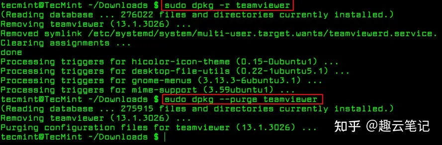
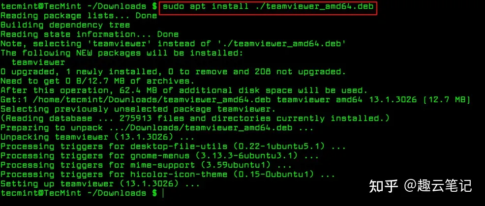
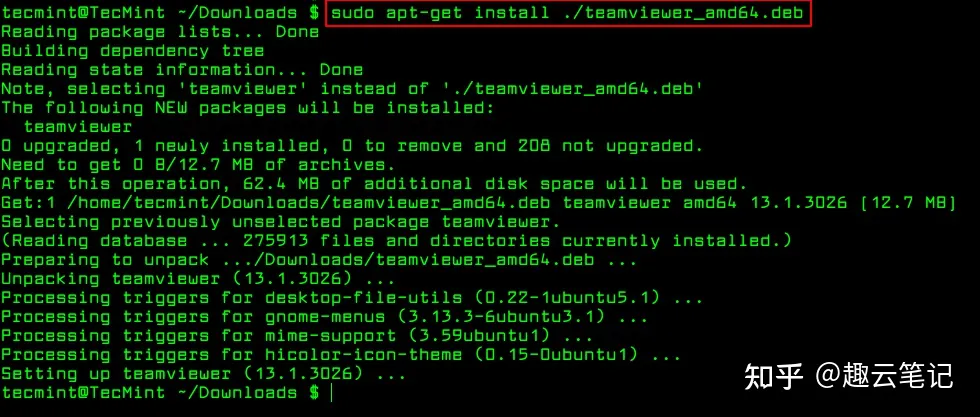

## apt-get 命令的使用：安装、更新、卸载软件包

（1）安装 软件包

```
apt-get install PackageName // 普通安装
apt-get install PackageName=VersionName // 安装指定包的指定版
apt-get --reinstall install PackageName // 重新安装
apt-get build-dep PackageName // 安装源码包所需要的编译环境
apt-get -f install // 修复依赖关系
apt-get source PackageName // 下载软件包的源码
# 例如安装一些工具：sudo apt-get install g++ gcc gdb make cmake vim
sudo dpkg -i teamviewer_amd64.deb //安装安装包
```

（2）卸载 软件包

```
apt-get remove PackageName // 删除软件包, 保留配置文件
apt-get --purge remove PackageName // 删除软件包, 同时删除配置文件
apt-get purge PackageName // 删除软件包, 同时删除配置文件
apt-get autoremove PackageName // 删除软件包, 同时删除为满足依赖而自动安装且不再使用的软件包
apt-get --purge autoremove PackageName // 删除软件包, 删除配置文件,删除不再使用的依赖包
apt-get clean &amp;&amp; apt-get autoclean // 清除 已下载的软件包 和 旧软件包

```

（3）更新 软件包

```
apt-get update // 更新安装源（Source）
apt-get upgrade // 更新已安装的软件包
apt-get dist-upgrade //更新已安装的软件包（识别并处理依赖关系的改变）

```

（4）查询 软件包

```
dpkg -l // 列出已安装的所有软件包
apt-cache search PackageName // 搜索软件包
apt-cache show PackageName // 获取软件包的相关信息, 如说明、大小、版本等
apt-cache depends PackageName // 查看该软件包需要哪些依赖
apt-cache rdepends PackageName // 查看该软件包被哪些包依
apt-get check // 检查是否有损坏的依赖

```

### 使用 dpkg 命令删除 Deb 包

要删除`.deb`包，请使用该`-r`选项，或者如果要删除其所有文件（包括配置文件），您可以使用`--purge`如下所示的选项清除它。

```text
$ sudo dpkg -r teamviewer [删除包]
$ sudo dpkg --purge teamviewer [删除包含配置文件的包]
```



### 2.使用apt命令安装.deb包

apt命令是一个高级的命令行工具，它提供了新软件包的安装、现有软件包的升级、软件包列表索引的更新，甚至可以升级整个**Ubuntu**或**Linux Mint**系统。

它还提供apt-get 和 apt-cache命令行工具，用于在**Debian**及其衍生产品（如**Ubuntu**和**Linux Mint**系统）上以更交互的方式管理包。

本质上，**apt-get**或**apt**不理解`.deb`文件，它们主要设计用于处理包名称（例如**teamviewer**、**apache2**、**mariadb**等），并且它们`.deb`从中指定的源检索和安装与包名称关联的档案**/etc/apt/sources.list**文件。

`.deb`使用**apt-get**或**apt**安装 Debian 包的唯一技巧是指定`./`包的本地相对路径或绝对路径（如果在当前目录中），否则它将尝试从远程源检索包并且操作将失败。

```text
$ sudo apt install ./teamviewer_amd64.deb
$ sudo apt-get install ./teamviewer_amd64.deb
```





### 使用 apt 命令删除 Deb 包

要删除`.deb`包，请使用该`remove`选项，或者如果要删除其所有文件（包括配置文件），您可以使用`purge`如图所示的选项清除它。

## find和grep搜索命令

### find根据文件名搜索

```
# find 搜索的路径 -name 要搜索的文件名
# find 搜索的路径 -name name.* 或 *.type
find ./Desktop/ORB_SLAM2/Examples/TimeMatch -name *.cpp
find ./Desktop/ORB_SLAM2/Examples/TimeMatch -name main.*

```

###  grep根据文件内容搜索

```
# grep "搜索的内容" 搜索的路径/文件 参数
grep "include" ./Desktop/ORB_SLAM2/Examples/TimeMatch/main.cpp
# 搜索目录
grep "include" ./Desktop/ORB_SLAM2/Examples/TimeMatch/ -r
# 显示行号
grep "include" ./Desktop/ORB_SLAM2/Examples/TimeMatch/ -nr

```

## Ubuntu常用命令

```
# Ctrl+Alt+T 打开新的终端
# Ctrl+shift+T 打开新的终端Tab
# Ctrl+shift+n 打开新的同目录的终端

clear # 清屏
clear --help # cmd --help:查看Linux命令的帮助，例如
sudo clear # 以管理员权限运行命令：sudo
history # 查看终端输入的所有历史命令

# 根目录：/，家目录：/home/zrad, ~
# cd ~ 回家，cd 打开文件夹
cd ~
cd Desktop
cd ..  # 返回上一级

pwd # 查看当前路径

# mkdir *** 创建文件夹
mkdir test_sh
cd /home/zard/test_sh
mkdir test test2
# 创建多级文件夹
mkdir -p test2/test3/test4

# 将文本写进tmp文件（覆盖）
echo "Ctrl+Alt+T 打开终端" &gt; tmp
# 将文本写进tmp文件（追加）
echo "Ctrl+shift+T分开终端" &gt;&gt; tmp

cd test
# touch ****.*** 创建文件（如果存在只会更新创建时间）
touch test1.txt
mkdir test

ls  # ls 查看当前目录下所有文件及文件夹
ls -l # ls -l 查看当前目录下所有文件及文件夹并显示详细信息（字节为单位）
ls -a  # ls -a 查看当前目录下所有文件及文件夹(包括隐藏的)
ls -lh # ls -lh 查看当前目录下所有文件及文件夹并显示详细信息(单位kMGT)
# ll==ls -laf
ll
ls -lah
# ls ***:罗列路径下的所有文件及文件夹
ls /home/zard/test_sh

# tree：显示当前文件树结构 sudo apt-get install tree
tree

echo "rm **.**:移除文件"
echo "rm -r ***:移除文件夹"
echo "rm -f *** -r:移除文件夹及其下的所有文件"

cd /home/zard/test_sh/test/
touch test2.txt
echo "mv **.**/*** ***:移动文件夹/文件至***"
mv /home/zard/test_sh/test2 /home/zard/test_sh/test/test
mv /home/zard/test_sh/test/test2.txt /home/zard/test_sh/test/test

echo "cp **.**/*** ***:复制----------------"
cp /home/zard/test_sh/test2 /home/zard/test_sh/test/test -r
cp /home/zard/test_sh/test/test1.txt /home/zard/test_sh/test/test

# 压缩/解压缩文件
mkdir testcom
touch testcom testcom2
cd testcom &amp;&amp; touch testcom testcom2
cd ..
tree
# c代表压缩，z代表使用gzip，v代表显示压缩日志，f代表指定压缩包名称，后面是要压缩的文件夹及文件
tar czvf all.tar.gz testcom testcom2 tmp
rm -f testcom testcom2 tmp -r
# x代表解压缩
tar xzvf all.tar.gz
# 解压缩到目录
mkdir all
tar xzvf all.tar.gz -C all
tree

# zip格式
# 安装压缩工具 sudo apt-get install zip uzip
zip -r all2 testcom testcom2 tmp
unzip all2
mkdir all3
unzip all2 -d all3

```


