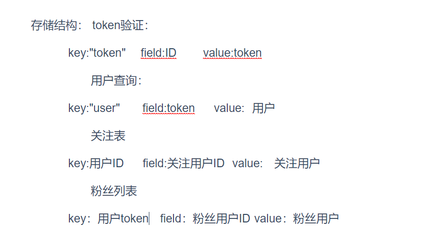
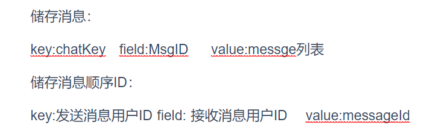

## 抖音demo项目解决视频无法播放或卡顿问题FFmpeg | 青训营

### 介绍

本人最近在写抖音demo视频流逻辑的时候遇到了以下问题：

1.使用localhost无法访问访问上传到public端口的视频

2.视频上传后，播放加载不出来，播放卡顿

### 首先第一个问题

由于代码运行的时候是给前端提供接口，视频链接的localhost就是指app端了，所以无法正确读取到，需要使用服务器本身的ip地址，打开CMD，输入ipconfig ，回车后，ipv4里就是服务器本机的地址了。

gin注册路由的时候开放静态资源目录，便可以在地址栏访问到相应的文件了：

```go
r := gin.Default()

r.Static("/static", "./public")
r.Static("/img", "./img")
```

分别在服务器ip ：端口/static/ 和 服务器ip ：端口/img/可以访问到public和ing下的文件

### 视频解码FFmpeg

由于视频格式有固定要求吗，一般在网页上播放的视频都是要求MP4，H264解码，ACC音频格式的，如果其他的解码方式或者不是MP4就会造成无法播放或解析慢无法卡顿的情况，所以我们需要使用FFmpeg对视频进行转码操作。

FFmpeg下载：

```cmd
https://ffmpeg.org/download.html#build-windows
```

选择对应的包下载，然后解压放到硬盘根目录，进入到bin目录复制路径注册到系统变量path中。

在go中用os包使用cmd命令对传入的视频进行转码操作，bin中的ffmpeg.exe是可以拿出来的，放到项目中通过相对位置调用。

下面的代码思路是将视频转码改名输出在同一个文件夹，然后删除转码前的文件再将转码后的文件重命名回来

publish.go

```go
// FFmpeg转码操作...
func transcodeVideo(finalName string) {
     //视频转码压缩
	cmd := exec.Command("ffmpeg", "-i", "public/"+finalName, "-c:v","libx264", "-crf" ,"23" ,"-preset" ,"medium", "-c:a" ,"aac", "-b:a", "128k" ,"public/"+"new"+finalName)
	err := cmd.Run() //运行
	if err != nil {
		fmt.Println(err)
	}
	os.Remove("public/"+finalName) //移除原文件
	err = os.Rename("public/"+"new"+finalName,"public/"+finalName) //重命名转码文件
	if err != nil {
        fmt.Println("Error renaming file:", err)
        return
    }
	
}
```

**需要注意的是，以上命令的相对位置以mian.go为准**

由于如果在上传的过程中直接将转码步骤放入上传过程的函数中会有可能因为转译的文件过大，时间久而导致返回错误信息，所以通过**异步操作**来传入的视频进行转码操作。

```go
	//视频转码压缩
	go transcodeVideo(finalName) //异步操作防止程序返回错误
```

### 视频截图生成封面

使用FFmpeg截取视频的第一秒第一帧的图片保存在img中，开放img静态目录。

```go
	// FFmpeg命令截图
	cmd := exec.Command("FFmpeg/ffmpeg.exe", "-i", "public/"+finalName, "-ss", "1", "-vframes", "1", "img/"+finalName+".jpg")
	err = cmd.Run() //运行
	if err != nil {
		fmt.Println(err)
	}
```

## 使用Redis优化关注和取消关注 | 青训营

Redis从内存中取数据，所以读取速度快，能让程序快速反应

```go
r.Use(func(c *gin.Context) {
		c.Set("rdb",rdb)
		c.Next()
	}) // 注册数据库连接中间件
```

### 思路

思路是将要传递的user结构体转换成字符串数据存储在redis里，需要使用的时候再取出来。

token验证和查询用户都可以使用Redis优化数据

使用Redis的存储思路如图：



**用用户ID可以访问用户的token进行验证，用户的token可以取出用户本体**

**关注列表用用户的ID作为key，被关注的用户ID作为field，value为关注用户的json数据**

**关注列表用用户的token作为key，粉丝用户ID作为field，value为粉丝用户的json数据**

user.go 在登录和注册的时候将用户数据注册进redis的哈希结构中，用 HSetNX（分布式锁）的方式存储，防止重复操作

```go
 //登录成功后，将token缓存到redis
	rdb := c.MustGet("rdb").(*redis.Client)
	idStr := strconv.FormatInt(user.Id, 10) //将用户id转成string型
	err = rdb.HSetNX(context.Background(),"token",idStr, user.Token).Err()//分布式锁，存储token验证
    if err != nil {
	panic(err)
    }
    //将user存入缓存
	NewUser,err := json.Marshal(user) //将user转成byte[]型字符串数据
	if err != nil {
		panic(err)
		}
	err=rdb.HSetNX(context.Background(),"user",user.Token,string(NewUser)).Err()//分布式锁,string(NewUser)将byte转成string型存入Redis
    if err != nil {
	panic(err)
    }
```

### 在relation.go中实现关注，取消关注操作

```go
// RelationAction 关注和取消关注操作
func RelationAction(c *gin.Context) {
    
	rdb := c.MustGet("rdb").(*redis.Client)

	token := c.Query("token")
	toUserId,err := strconv.ParseInt(c.Query("to_user_id"), 10, 64)
	if err != nil {
		panic(err)
		}
	action_type := c.Query("action_type")

	var user User
    //检验令牌
	CheckToken, err := rdb.HGet(context.Background(),"user", token).Result()
	if err != nil {
		panic(err)
		}
	err = json.Unmarshal([]byte(CheckToken),&user)
    if err != nil {
	panic(err)
    }
	//自己不能关注自己
	if toUserId == user.Id{
		c.JSON(http.StatusOK, Response{StatusCode: 1, StatusMsg: "You can't follow yourself"})
		}	

	if token == user.Token{
		//执行关注或取消关注操作
		to_user_id := strconv.FormatInt(toUserId, 10)
		var ToToken string 
		ToToken, err = rdb.HGet(context.Background(),"token", to_user_id).Result()//拿到对方用户token
		if err != nil {
			fmt.Println(toUserId)
			panic(err)
			}
			var ToUser User
		CheckToken, err = rdb.HGet(context.Background(),"user", ToToken).Result() //使用token查user
		if err != nil {
			panic(err)
			}
		err = json.Unmarshal([]byte(CheckToken),&ToUser) //得到对方用户数据
		if err != nil {
			panic(err)
			}
		//数据转换
		idStr := strconv.FormatInt(user.Id, 10)
		ToUser_Id:= strconv.FormatInt(ToUser.Id, 10)
		NewToUser,err := json.Marshal(ToUser) //json
		if err != nil {
				panic(err)
		} 
        switch action_type{
		case "1":    //加入关注列表,储存在redis中
			err = rdb.HSetNX(context.Background(),idStr, ToUser_Id, string(NewToUser)).Err()
			if err != nil {
			panic(err)
			 }   
	    case"2" :  //从关注列表中移除
		    err = rdb.HDel(context.Background(),idStr, ToUser_Id).Err()
			if err != nil {
				panic(err)
				 }
		}
		c.JSON(http.StatusOK, Response{StatusCode: 0})
	} else {
		c.JSON(http.StatusOK, Response{StatusCode: 1, StatusMsg: "User doesn't exist"})
	}
}

```

首先query传进来了token，to_user_id，action_type三个参数，其中token是关注者的token，所以从key"token"中取出token 进行对比，action_type是关注和取消关注操作，to_user_id是被关注者的ID，从key：“user”中拿出被关注用户的结构体。

关注和需要被关注的ID先进行对比，自己是不能关注自己的。

然后使用switch来判断是关注还是取消关注。

当是进行关注操作的时候，将被关注者存入到关注者的关注表中

然后用户关注列表和粉丝列表进行类似的取值操作就完成了

**而Redis实现朋友列表功能只需要返回关注和被关注列表就行了**

### 用户关注列表更新：

```go
//json字符串转成user结构体传入userlist
	if len(data) != 0{  
		for _, val := range data {
			var user User
			err := json.Unmarshal([]byte(val) , &user)
			if err != nil{
				panic(err)
			}
			userlist = append(userlist, user)
		  }
	} 
   
	c.JSON(http.StatusOK, UserListResponse{
		Response: Response{
			StatusCode: 0,
		},
		UserList: userlist,
	})

```

### 少用的一些方法

切片数组增添元素操作

```
userlist = append(userlist, user)
```


将整形转成string类型

```go
idStr := strconv.FormatInt(user.Id, 10)
```

将`user.Id`从整数转换为十进制表示的字符串。参数`10`表示使用十进制进行转换


传递空上下文context

```go
context.Background()
```


结构体转byte[]类型json,byte[]转string

```go
NewToUser,err := json.Marshal(ToUser) //结构体转json
Newstring := string(NewToUser) //byte[]转string
```


string转byte[]类型json,byte转结构体

```go
err := json.Unmarshal([]byte(val) , &user) //string类型的val转成[]byte，再转成结构体user
```

Mysql强类型查询

```
db.Where(User{Token: token}).Select("id").First(&id) 
```

如果表结构体中有自定义的类型记得要预加载，否则数据库不会读取，Preload("Author")，Author是自定义类型的变量名

```go
result := db.
		Where("upload_time < ?", latest_time).Preload("Author").// 投稿时间过滤
		Order("upload_time desc").             // 按照投稿时间倒序
		Limit(30).                             // 限制返回30条
		Find(&videos)
```

int转string

```go
User_ID := strconv.FormatInt(user.Id, 10)
```

string转int

```go
toUserId,err := strconv.ParseInt(to_user_id, 10, 64) //10进制，64字节
```

### Redis一些知识

Set是设置，Get是查询,GetSet设置之后查询旧的，NX分布式锁

string类型 key value

hash类型  key field value

### Redis实现聊天消息功能，储存思路如图：

因为下面的储存结构中key有ID存在，所以需要存储到新的数据库中，否则可能会与上面的数据产生冲突：




## Redis切换存储数据库

Redis一共有划分十六个编号的存储数据库，分别是0到15号。

命令行切换命令为：

```
 Select 1 
```

选择数据库第二个数据库，数据库编号为1

在go中可以使用do函数进行使用Redis命令来切换数据库：

```go
	_, err = rdb.Do(context.Background(), "Select", 0).Result() //切换到第一个数据库存储 
	if err != nil {
		panic(err)
	}
```

