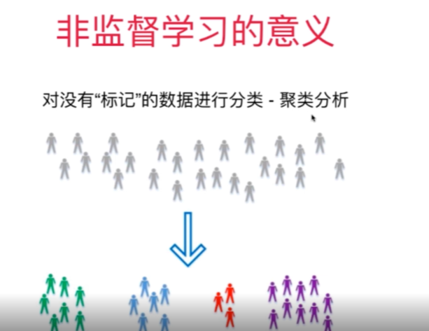

## 数据

- 数据整体叫**数据集**(data set)
- 每一行数据称为一个**样本**(sample)
- 除最后一列，每一列表达样本的一个
  **特征(feature)**

大写字母表示矩阵，小写字母表示向量

## 机器学习的主要任务

### 分类任务

## 回归任务

> 结果是一个连续数字的值，而非一个类别
>
> - 房屋价格
> - 市场分析
> - 学生成绩
> - 股票价格

- 有一些算法只能解决回归问题
- 有一些算法只能解决分类问题
- 有一些算法的思路既能解决回归问题，又能解决分类问题

## 监督学习

给机器的训练数据拥有“标记”或者“答案”

- 图像已经拥有了标定信息
- 银行已经积累了一定的客户信息和他们信用卡的信用情况
- 医院已经积累了一定的病人信息和他们最终确诊是否患病的情况市场积累了房屋的基本信息和最终成交的金额

## 非监督学习

给机器的训练数据没有任何“标记”或者“答案”

对数据进行降维处理
特征提取:信用卡的信用评级和人的胖瘦无关?
特征压缩:PCA

## 半监督学习

> 一部分数据有“标记”或者“答案”，另一部分数据没有
> 更常见:各种原因产生的标记缺失
> 通常都先使用无监督学习手段对数据做处理，之后使用监督学习手段做模型的训练和预测

## 增强学习

## 机器学习的其他分类

### 在线学习和批量学习 (离线学习)

- 批量学习 Batch Learning
- 在线学习 Online Learning

#### 批量学习(离线学习)

- 优点:简单
- 问题:如何适应环境变化?解决方案:定时重新批量学习
- 缺点: 每次重新批量学习，运算量巨大在某些环境变化非常快的情况下，甚至不可能的

#### 在线学习

- 优点:及时反映新的环境变化
- 问题:新的数据带来不好的变化?
- 解决方案:需要加强对数据进行监控
- 其他:也适用于数据量巨大，完全无法批量学习的环境

### 参数学习和非参数学习

#### 参数学习

#### 非参数学习

## 哲学思考

## 环境搭建

[2-6 课程使用环境搭建.mp4 | AList](http://10.147.17.105:5244/2023年前后端开发学习/Python3入门机器学习 经典算法与应用/第2章 机器学习基础/2-6 课程使用环境搭建.mp4)