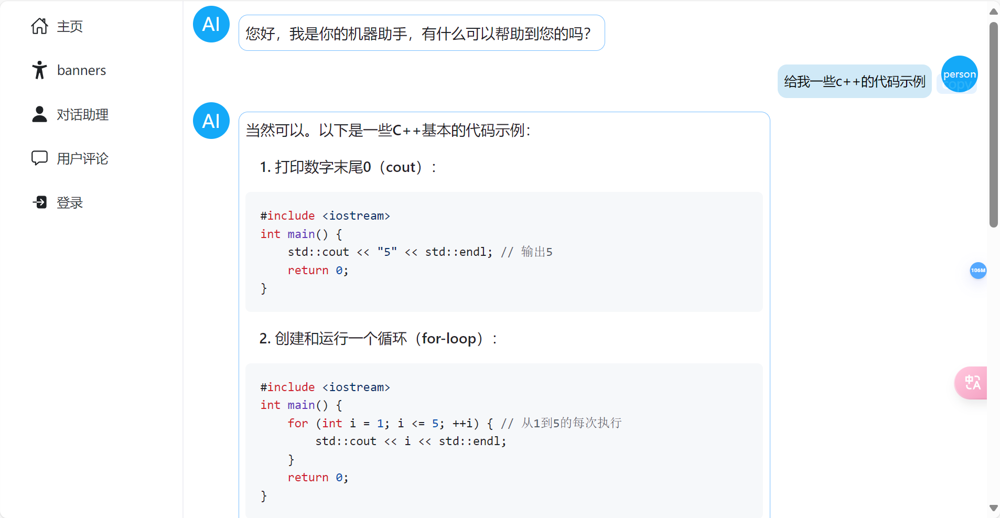
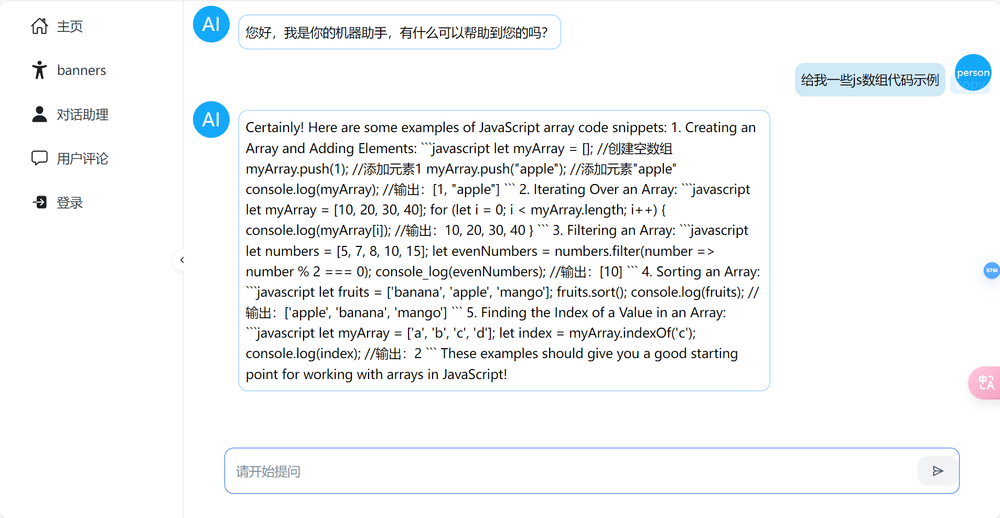

## vue3前端使用ollama搭建本地模型处理流并实时生成markdown

在实现本地ai模型对话网页中，流数据和markdown样式和实时显示问题折腾了挺久了，现在弄好之后赶紧，写了几篇文章分享思路给大家。

最终效果:



数据都是实时显示出来的，不是全部接收完才显示的。

### 安装部署ollama

[Ollama](https://ollama.com/)

因为一般部署服务都是在linux上部署的，windows系统也可以使用win11

Ollama安装：

```
curl -fsSL https://ollama.com/install.sh | sh
```

安装好之后，启动服务：

```
ollama serve
```

拉取开源镜像:

```
ollama pull phi3 #phi3就是要拉取的模型
```

直接在终端运行模型,就可以跟模型对话了：

```
ollama run phi3
```

### 使用langchain在前端项目中直接调用ollama

这个是ollama官方提到的langchainjs的用法

[ollama/docs/tutorials/fly-gpu.md 在 main ·奥拉玛/奥拉马 --- ollama/docs/tutorials/fly-gpu.md at main · ollama/ollama (github.com)](https://github.com/ollama/ollama/blob/main/docs/tutorials/langchainjs.md)

还有py中的用法

[ollama/docs/tutorials/langchainpy.md at main · ollama/ollama (github.com)](https://github.com/ollama/ollama/blob/main/docs/tutorials/langchainpy.md)

也可以直接调用api进行请求：

[ollama/docs/api.md at main · ollama/ollama (github.com)](https://github.com/ollama/ollama/blob/main/docs/api.md)

python apenai方式

[ollama/docs/openai.md at main · ollama/ollama (github.com)](https://github.com/ollama/ollama/blob/main/docs/openai.md)

现在主要是说langchainjs的用法:

```
npm install @langchain/community
```

使用：

```js
import { Ollama } from "@langchain/community/llms/ollama";

const ollama = new Ollama({
  baseUrl: "http://localhost:11434",
  model: "llama3",
});

const answer = await ollama.invoke(`why is the sky blue?`);

console.log(answer);
```

这样就能直接得到响应的回复数据了

需要注意的是不要把await写在vue组件script中，要写在funtion中，否则页面可能会出现一些加载问题。

但是这是一次性得到的数据不是流数据出来的，一般我们想要搭建人工智能助理的话，响应式的显示会让人更加舒服。

### langchain流处理

使用langchain的stream函数：

下面是示例：

```js
async function replayFnc(){
    const data = `
  你需要扮演一个智能ai对话助理，你需要用中文来回答用户向你提问的问题,以下就是你需要回答的问题:
  ${props.sendMessage}
  `
  // const replayMessage = md.render(await ollama.invoke(data));
  const response = await ollama.stream(data);//读取流
  chatArr[chatArr.length-1].loading = false ;

for await (const chunk of response){ //因为读下来的respone还是promise数据,所以还需要加await
     console.log(chunk); //此时拿到的chunk就是传输过来的一段段的字符或者字符串
    chatArr[chatArr.length-1] = chatArr[chatArr.length-1] + chunk;  //一点点传进列表中，就会动态显示在界面了
  }
}  
```

但是有一个问题，如果让ai模型写代码呢，这样的话，ai展示出来的markdown格式就直接显示源码在界面了：



### 解决显示markdown样式的解决办法

解决显示markdown样式的解决办法，参考我这篇文章:

[如何在前端vue3中处理markdown并使用样式和代码高亮-CSDN博客](https://blog.csdn.net/qq_74177889/article/details/139021973)

### 解决完样式问题之后，以markdown的样式输出流

解决显示markdown显示问题之后，又有一个问题了，使用了转换之后，就没法使用流了，那应该怎么办呢？

这个时候就需要在流输出的过程中一点点将文本转成markdown样式的html文本，但是一点点转的话，语言分隔就会有问题。

所以通过方法，我找到了一种处理的思路和实现：

> 1.首先创建一个记录传递过程中总文本的变量**(normalSaveCharContent)**，然后在循环中一点点把数据推进去，每推进去一点，就将这个变量转化成html文本传入到绑定的显示变量**(chatArr[chatArr.length-1].content)**中，解决一般性的markdown语义分割问题。
>
> 2.1. 解决代码区域的显示问题，通过判断当前循环的元素是否是" ‘’‘ "，是的话说明是进入了代码区域的输出,然后创建一个记录进入代码前的总文本的变量**(codeSaveCharContent)**和一个记录代码区域的文本变量**(codedata.value)**。
>
> 2.2. 然后在代码内部的时候,记录代码区域的文本变量首次传入代码的框架语义，让代码区域正常显示（‘’‘），跟记录进入代码前的总文本的变量合并解析覆盖到绑定的显示变量中显示，然后在代码内部的时候就一点点将代码写到代码区域内合并解析，最后做好信息记录，退出代码块。

具体实现:

```js
  const response = await ollama.stream(data);
//读取到数据之后，加载完毕
  chatArr[chatArr.length-1].loading = false ;
//判断是否进入了代码区域中
  const code = ref(false);
//记录代码内原始文本
  const codedata = ref(''); 
//记录进入code前
  let codeSaveCharContent = ''
  //记录一般情况
  let normalSaveCharContent = ''
  for await (const chunk of response){
    //处理code
    if(chunk === "```" || code.value){
      if (!code.value){
        //储存刚刚进入code的charArr内容
        codeSaveCharContent = chatArr[chatArr.length-1].content;
        //先围起来
        codedata.value = codedata.value + chunk;
        //先搞出代码框
        chatArr[chatArr.length-1].content = chatArr[chatArr.length-1].content + md.render(chunk + " " + chunk);
        code.value = true
        continue
      }else if(chunk === "```" && code.value){
        //处理结尾部分
        codedata.value = codedata.value + chunk;
        //记录到一般情况中
        normalSaveCharContent = normalSaveCharContent + codedata.value;
        //替换
        chatArr[chatArr.length-1].content = codeSaveCharContent + md.render(codedata.value);
        codedata.value = ''
        code.value = false;
        continue
      }else {
        //处理中间的过程
        codedata.value = codedata.value + chunk;
        //此时的内容 = 初始前+现在的围起来
        chatArr[chatArr.length-1].content = codeSaveCharContent +  md.render(codedata.value + "```");
        continue
      }
    }
    //正常情况下走一个字加一个字
    normalSaveCharContent = normalSaveCharContent + chunk;
    chatArr[chatArr.length-1].content = md.render(normalSaveCharContent);
  }
```

然后就能够正常像其他ai助手网页那样了，流式获取数据并markdown格式实时显示了。

