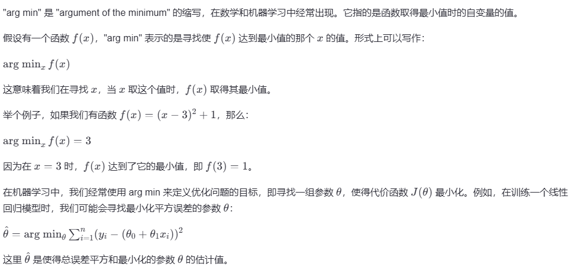
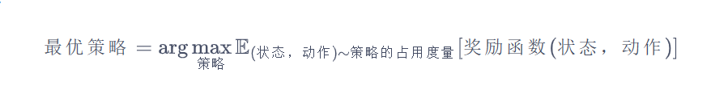

## 学习强化学习

在机器学习领域，有一类重要的任务和人生选择很相似，即序贯决策（sequential decision making）任务。决策和预测任务不同，决策往往会带来“后果”，因此决策者需要为未来负责，在未来的时间点做出进一步的决策。实现序贯决策的机器学习方法就是强化学习（reinforcement learning）。预测仅仅产生一个针对输入数据的信号，并期望它和未来可观测到的信号一致，这不会使未来情况发生任何改变。

### 概念

动作：**A** 为动作集合，a为一个动作

奖励：**R** 为奖励回报集合，r为一个奖励

懊悔：**R **懊悔定义为拉动当前拉杆的动作与最优拉杆的期望奖励差

期望奖励：**Q** 

操作次数: **T**

### 概念解释

期望奖励： 对于每一个动作 $a$，我们定义其期望奖励为 $Q(a)=\mathbb{E}_{r\sim\mathcal{R}(\cdot|a)}[r]$. 于是，至少存在一根拉杆，它的期望奖励不小于拉动其他任意一根拉杆，我们将该最优期望奖励表示为 $Q^*=\max_a Q(a)$。

懊悔：多臂老虎机中，为了更加直观、方便地观察拉动一根拉杆的期望奖励离最优拉杆期望奖励的差距，我们引入懊悔（regret）概念。懊悔定义为拉动当前拉杆的动作 $a$ 与最优拉杆的期望奖励差，即 $R(a)=Q^*-Q(a)$. 累积懊悔（cumulative regret）即操作 $T$ 次拉杆后累积的懊悔总量，对于一次完整的 $T$ 步决策 $\{a_1, a_2, \ldots, a_T\}$，累积懊悔为 $\sigma_R=\sum_{t=1}^TR(a_t)$. MAB 问题的目标为最大化累积奖励，等价于最小化累积懊悔。

### 估计期望奖励

为了知道拉动哪一根拉杆能获得更高的奖励，我们需要估计拉动这根拉杆的期望奖励。由于只拉动一次拉杆获得的奖励存在随机性，所以需要多次拉动一根拉杆，然后计算得到的多次奖励的期望。 算法流程如下所示：

 对于 $\forall a \in A$，初始化计数器 $N(a)=0$ 和期望奖励估值 $\hat{Q}(a)=0$ 

$$ \text{for } t=1 \rightarrow T \text{ do} $$ 

- 选取某根拉杆，该动作记为 $a_t$
- 得到奖励 $r_t$ 
- 更新计数器：$N(a_t)=N(a_t)+1$ 
- 更新期望奖励估值： $$ \hat{Q}(a_t) = \hat{Q}(a_t) + \frac{r_t - \hat{Q}(a_t)}{N(a_t)} $$ 
- $$ \text{end for} $$ 

其中，$\hat{Q}(a)$ 表示的是对于动作 $a$ 的期望奖励估值，而 $N(a)$ 是执行动作 $a$ 的次数。

`N` 代表的是一个计数器，用于记录某个特定动作（拉杆）被选择执行了多少次,具体来说，$N(a_t)$` 表示的是动作 $a_t$ 被执行的总次数。

"arg min" 是 "argument of the minimum" 的缩写，在数学和机器学习中经常出现。它指的是函数取得最小值时的自变量的值。

假设有一个函数$f(x)$，"arg min" 表示的是寻找使$f(x)$ 达到最小值的那个 $x$ 的值。形式上可以写作：$\text{arg min}_{x} \, f(x) $

这意味着我们在寻找 \( x \)，当 \( x \) 取这个值时，\( f(x) \) 取得其最小值。

举个例子，如果我们有函数 $f(x) = (x - 3)^2 + 1$，那么：

$ \text{arg min}_{x} \, f(x) = 3 $

因为在 \( x = 3 \) 时，$f(x)$ 达到了它的最小值，即 $ f(3) = 1 $。

在机器学习中，我们经常使用 $arg min $来定义优化问题的目标，即寻找一组参数 $\theta$，使得代价函数 $\theta$ 最小化。例如，在训练一个线性回归模型时，我们可能会寻找最小化平方误差的参数 $\theta $：

$\hat{\theta} = \text{arg min}_{\theta} \sum_{i=1}^{n} (y_i - (\theta_0 + \theta_1 x_i))^2 $

这里 $\hat{\theta} $是使得总误差平方和最小化的参数 \( \theta \) 的估计值。

这张图片展示了一个强化学习中的概念——最优策略。强化学习是一种机器学习方法，通过让智能体与环境互动以最大化累积奖励。在这个过程中，智能体会根据当前状态采取行动，并从环境中获得相应的奖励。

公式中的“最优策略”是指在给定状态下，能够最大化期望累计奖励的策略。这个公式可以用以下的方式来解读：

- 策略（π）：这是一种映射关系，将状态（s）映射到动作（a）。策略决定了智能体在特定状态下应采取的动作。
- 状态（s）：这是智能体在环境中所处的位置或条件。
- 动作（a）：智能体在给定状态下可以采取的不同行为。
- 奖励函数（R(s,a)）：这是对智能体在某个状态下采取某种动作后得到的奖励的评估。奖励通常是正值（表示好的结果）或负值（表示坏的结果）。
- 期望（E）：这是对随机变量取值的平均估计，考虑到策略π下所有可能的状态-动作对及其对应的奖励。
- 占用度量（d^π）：这是在策略π下的状态-动作空间的概率分布。它反映了在遵循策略π的情况下，智能体访问不同状态-动作对的可能性。

因此，“最优策略”的定义意味着我们需要找到一种策略π，使得在该策略下，智能体在所有可能的状态-动作对上的期望奖励最大。这可以通过迭代更新策略π来实现，直到达到收敛为止。收敛后的策略π被称为最优策略，因为它能够在所有可能的状态-动作组合中获得最大的预期奖励。

强化学习的目标就是在不断试错的过程中，通过调整策略π来逐步提高智能体的表现，最终找到最优策略。