# 通过PyTorch 手写数字识别 入门神经网络

## 数据集

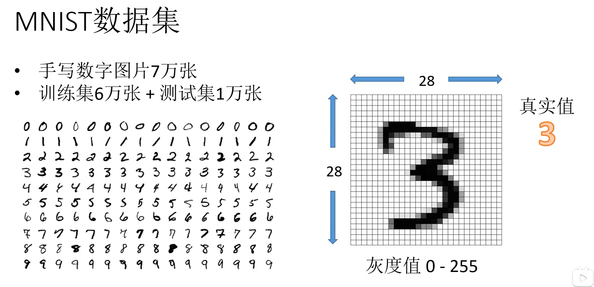

MNIST数据集中有手写数字图片7万张，划分训练集6万张，划分测试集1万张。

每张图片都会有一张标签，也就是代表着图片的真实值（真实含义）。

## 概念 计算机是如何读取图片的呢？

把照片当作一个数列矩阵给计算机读取，将照片特征从右到左拼接成一列输入到网络层。

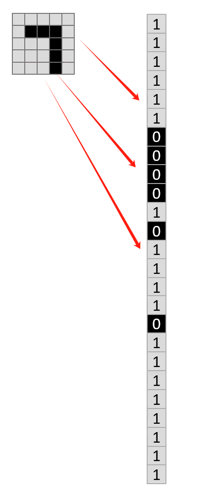

## 网络层

每一次的节点是由前一层计算得到的，a和b 分别代表系数(权重)和偏置项。

i表示前一层的节点序号，j表示当前节点的序号。

在机器学习和深度学习中，偏置项（Bias）是模型的一个重要组成部分。它是一个可学习的参数，通常用来调整模型的输出，使其能够更好地拟合训练数据。下面详细介绍偏置项的意义和作用。

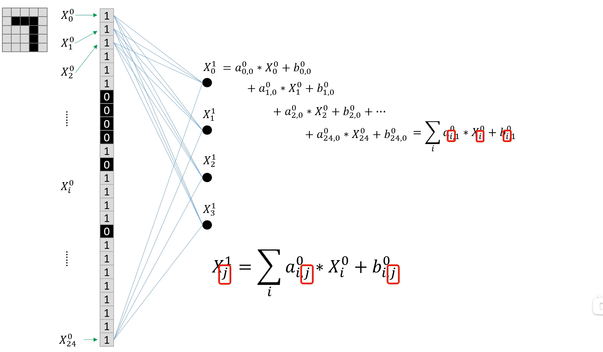

最后图像的信息通过网络的传播一直传播到最后一层，k代表的是网络的层数。最后一层就是输出层，而最后有10个节点代表的分别是10个数字的可能性结果，每个节点对应一种可能。

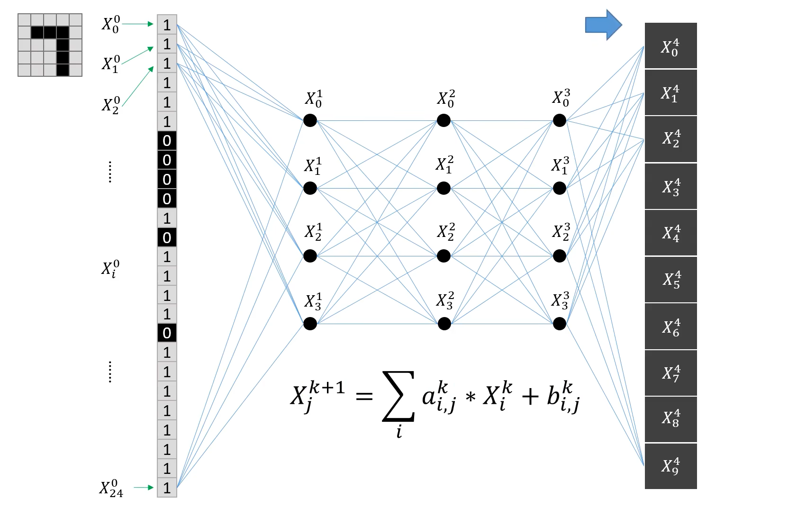

## 归一化处理

因为每个节点代表的应该是概率，而每个节点的数值都应该是0<p<1,且每层的总和应该为1。

所以我们需要对节点做归一化处理：

### Softmax归一化

**在多分类问题中，通常会使用softmax函数作为网络输出层的激活函数，softmax函数可以对输出值进行归一化操作，把所有输出值都转化为概率（0~1之间），所有概率值加起来等于1∶**

### 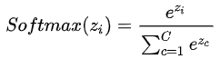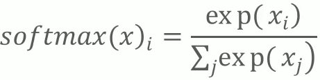

**例如：某个神经网络有3个输出值，为\[1,5,3\]。**

**在数学中有个数叫e（数学中一个常数，是一个无限不循环小数，且为超越数，其值约为2.718281828459045）**

**先计算出e^1（e的1次方），e^5，e^3和它们的和的数值来，e^1=2.718、e^5=148.413，e^3=20.086、e^1+e^5+e^3=171.217**

**那么1所对应的概率就是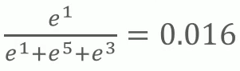**

**然后5的概率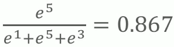**

**3的概率**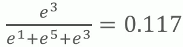

**0.016+0.867+0.117=1**

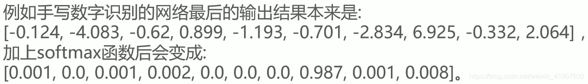

## 训练

现在我们的输出具有了概率这个概念，那么我们真正要使得我们的概率有意义，那么就需要进行"训练"！

我们一开始的概率分布是随机的，而我们这张图片代表是7，而理想状态下，这张图片是7的概率应该是百分百，而现实训练过程中与理想状态的差值便是损失loss。

所以为了减小损失，我们需要在训练过程中调整网络参数，也就是a和b，使得更接近与理想状态的预测判断概率。

调整网络参数的算法有很多，比如梯度下降算法，ADAM算法等等。从而神经网络问题就变成了一个最优化问题，在多次尝试下寻找到最优解。

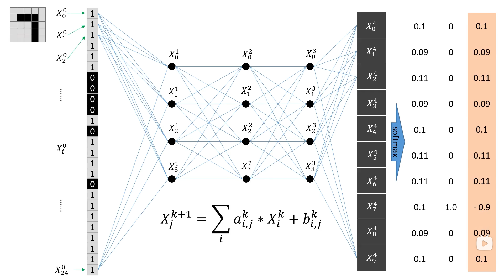

而这仅仅是一张图片，假如我们对于上万张图片进行训练，从而调整得到合适的网络参数，便能使得我们的神经网络具备预测的能力，因为一次只输入一张图片，我们的效率会很低的，所以我们会分批次，几张图片一起输入到网络，这个批次的概念叫做batchSize。

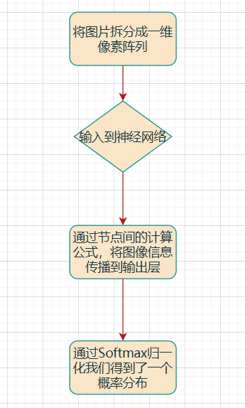

## 激活函数

如果没有激活函数，观察我们的节点计算，我们会发现我们节点中的计算都是线性的，但我们生活中很多问题都不是线性的，输入和输出之间存在着非线性，因为一个线性函数无论怎么调整都调整不出非线性函数的效果（模拟出非线性行为），所以我们会在每一次计算中都套一层激活函数，从而达到非线性计算。

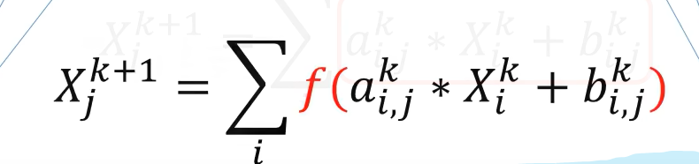

常见的激活函数如下:
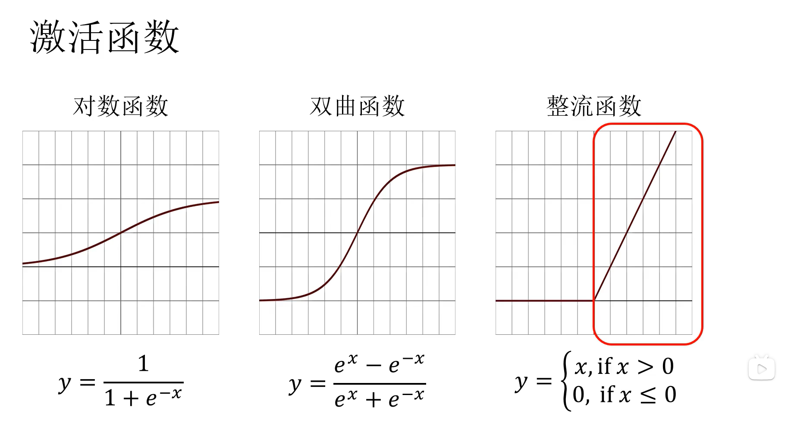

在这个手写数字识别中，我们采用整流函数，因为当x小于0的时候都归0，x大于0的时候才会有数值，也就相当于激活的效果。

## 项目实现

安装库： pip install numpy torch torchvision matplotlib

pytorch GPU的安装方法更详细可以参考这篇文章：[全网最详细的安装pytorch GPU方法，一次安装成功！！包括安装失败后的处理方法！-CSDN博客](https://blog.csdn.net/qlkaicx/article/details/134577555?spm=1001.2014.3001.5506)

首次运行会安装MNIST数据集。

```python
import torch
from torch.utils.data import DataLoader
from torchvision import transforms
from torchvision.datasets import MNIST
import matplotlib.pyplot as plt


class Net(torch.nn.Module):

    def __init__(self):
        super().__init__()
        # 输入为28*28的像素图片，中间三层都放了64个节点
        self.fc1 = torch.nn.Linear(28 * 28, 64)
        self.fc2 = torch.nn.Linear(64, 64)
        self.fc3 = torch.nn.Linear(64, 64)
        self.fc4 = torch.nn.Linear(64, 10)

    def forward(self, x):
        # fc1全连接线性计算，再套上激活函数relu
        x = torch.nn.functional.relu(self.fc1(x))
        x = torch.nn.functional.relu(self.fc2(x))
        x = torch.nn.functional.relu(self.fc3(x))
        # log_softmax softmax归一化再套上log让计算更稳定
        x = torch.nn.functional.log_softmax(self.fc4(x), dim=1)
        return x


def get_data_loader(is_train):
    # 进行数据转换，tensor就是一个多维数组(又叫张量) 定义数据转换类型
    to_tensor = transforms.Compose([transforms.ToTensor()])
    # 下载MNIST数据集,""代表当前目录,is_train用于指定是导入训练集还是测试集
    data_set = MNIST("", is_train, transform=to_tensor, download=True)
    # batch_size 表示一个批次包含15张图片 ,shuffle表示数据是否是随机打乱的
    return DataLoader(data_set, batch_size=15, shuffle=True)

# 用于评估神经网络的正确率
def evaluate(test_data, net):
    n_correct = 0
    n_total = 0
    with torch.no_grad():
        # 在测试集中按批次取出数据
        for (x, y) in test_data:
            # 计算神经网络的预测值 x代表图片, y代表真实结果(标签)
            outputs = net.forward(x.view(-1, 28 * 28))
            # 再与真实结果进行比较进行累加记录
            for i, output in enumerate(outputs):
                # argmax是找到一个数列中最大值的序号，也就是预测结果
                if torch.argmax(output) == y[i]:
                    n_correct += 1
                n_total += 1
    return n_correct / n_total


def main():
    # 导入训练集和测试集
    train_data = get_data_loader(is_train=True)
    test_data = get_data_loader(is_train=False)
    # 初始化神经网络
    net = Net()
    # 打印初始网络的正确率 一般是0.1,因为10种结果,猜对的概率是十分之一
    print("initial accuracy:", evaluate(test_data, net))

    optimizer = torch.optim.Adam(net.parameters(), lr=0.001)
    # epoch是训练轮次
    for epoch in range(2):
        # 这部分基本是通用写法
        for (x, y) in train_data:
            # 初始化
            net.zero_grad()
            # 正向传播
            output = net.forward(x.view(-1, 28 * 28))
            # 计算差值 nll_loss 是一个对数损失函数 是为了匹配前面的log_softmax的对数运算
            loss = torch.nn.functional.nll_loss(output, y)
            # 反向误差传播
            loss.backward()
            # 优化网络参数
            optimizer.step()
        # 每个epoch结束后打印一次正确率
        print("epoch", epoch, "accuracy:", evaluate(test_data, net))

    # 随机抽取三张图片验证模型性能
    for (n, (x, _)) in enumerate(test_data):
        if n > 3:
            break
        predict = torch.argmax(net.forward(x[0].view(-1, 28 * 28)))
        plt.figure(n)
        plt.imshow(x[0].view(28, 28))
        plt.title("prediction: " + str(int(predict)))
    plt.show()


if __name__ == "__main__":
    main()

```

正向传播传播算出当前的概率或值，反向传播将计算得到的损失告诉网络层，从而进行优化调整。

epoch代表的是训练轮次，比如六万张图片，训练了两次六万张图片，那么就是训练两个epoch。

最终结果：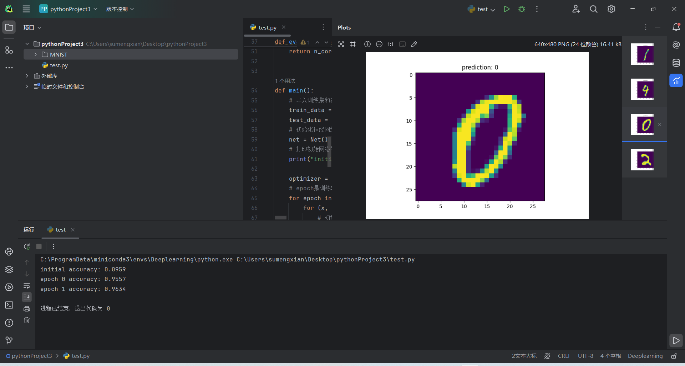

训练一次的时候正确率就从0.09达到了0.95，第二次就到了0.96，提升就相对少了。

## 概念和语法问题

#### 上下文管理器

`with torch.no_grad():` 是一个上下文管理器，它确保在其控制下的代码块内不会执行梯度计算。在 PyTorch 中，当我们构建计算图时，默认情况下会对每个操作进行跟踪，以便能够计算梯度。这对于训练模型是必要的，因为我们需要通过反向传播来更新权重。然而，在模型的评估阶段或者当我们只需要前向传递来得到输出而不需要更新模型参数时，保持梯度计算是不必要的，甚至会消耗额外的内存和计算资源。

使用 `torch.no_grad()` 的好处包括：

- **节省内存**：不需要存储中间变量的梯度信息。
- **提高性能**：省去了梯度计算的时间。

当你看到 `with torch.no_grad():`，这意味着在这段代码执行期间，所有涉及到自动梯度计算的操作都将被忽略，即创建的 Tensor 不会被加入到计算图中。这对于评估模型、生成模型输出以及任何不需要梯度计算的任务都是有用的。

示例代码：

```python
with torch.no_grad():
    # 在这里创建的所有 Tensor 和执行的所有操作都不会被记录在计算图中
    predictions = model(inputs)
```

在你的代码中，`torch.no_grad()` 被用在 `evaluate` 函数中，以确保在评估模型的准确率时不会进行不必要的梯度计算，从而提高效率并节约内存。这是因为评估阶段我们关心的是模型的性能而非更新模型参数。

全连接层（Fully Connected Layer，简称 FC 层）是神经网络中最基本的组件之一，也是最直观的一种层。在一个全连接层中，前一层的所有神经元（节点）都与后一层的所有神经元相连，也就是说，每一层的每一个神经元都会接受前一层所有神经元的输出作为输入。

#### **全连接层的工作原理**

在一个全连接层中，每个神经元的输出是由前一层所有神经元的输出经过加权求和后加上偏置项（bias），然后通过激活函数计算得出的。数学上，可以用以下公式来表示：

z=W⋅x+b*z*=*W*⋅*x*+*b*

其中：

- z*z* 是神经元的加权输入（未经过激活函数之前的值）。
- W*W* 是权重矩阵。
- x*x* 是输入向量。
- b*b* 是偏置项。

接着，z*z* 会通过一个激活函数（如 ReLU、Sigmoid、tanh 或者其他激活函数）来产生非线性映射：

h=f(z)*h*=*f*(*z*)

这里的 *h* 是最终的输出，*f* 是激活函数。

**应用场景**

全连接层通常用于处理一维的数据，例如从卷积层提取的特征向量或者是展平后的图像数据。在图像识别、自然语言处理等领域，全连接层常用于提取特征之后的分类任务。例如，在你的代码中，全连接层用于将输入图像（展平后的28x28像素，共784个元素）映射到一个较低维度的空间，最后输出类别概率分布。

#### **优化器**

`optimizer = torch.optim.Adam(net.parameters(), lr=0.001)` 这一行代码的作用是在 PyTorch 中创建一个优化器实例，用于更新神经网络的参数。让我们分解一下这条语句的含义：

**代码解析**

1. **`torch.optim.Adam`**：这是 PyTorch 提供的一种优化算法——Adam（Adaptive Moment Estimation）算法的实现。Adam 是一种自适应学习率优化方法，它结合了动量（Momentum）和 RMSProp 的优点，能够在训练过程中动态调整每个参数的学习率。
2. **`net.parameters()`**：这是神经网络模型 `net` 的所有可学习参数的迭代器。这些参数通常是模型中的权重和偏置项，它们是训练过程中需要更新的对象。
3. **`lr=0.001`**：这是学习率（Learning Rate）的设定值。学习率决定了参数更新的步长大小。较高的学习率会使参数更新更快，但也可能导致训练过程不稳定；较低的学习率则会使训练过程更稳定，但可能需要更多的时间来收敛。

**作用**

这句话的主要作用是创建一个 Adam 优化器，并指定要优化的参数集合以及学习率为 0.001。这个优化器将在训练过程中使用，具体来说：

- **初始化优化器**：创建一个 Adam 优化器实例，准备好对模型的参数进行优化。
- **参数绑定**：将模型的所有可学习参数传递给优化器，以便在训练过程中更新这些参数。
- **设置学习率**：确定了优化过程中每次参数更新的步长大小。


**参考：**

[10分钟入门神经网络 PyTorch 手写数字识别_哔哩哔哩_bilibili](https://www.bilibili.com/video/BV1GC4y15736/?buvid=XU6054468F30D24AB059AD0264C57A1C3E0BD&from_spmid=main.my-history.0.0&is_story_h5=false&mid=nK8f4Y42lKb2c4znVpH5hA%3D%3D&p=1&plat_id=116&share_from=ugc&share_medium=android&share_plat=android&share_session_id=614527fa-3dab-4854-8d0c-b7ece61bcb7d&share_source=WEIXIN&share_tag=s_i&spmid=united.player-video-detail.0.0&timestamp=1728355323&unique_k=0pf6qvo&up_id=302545359&vd_source=a0e678f0a699f40cb533e1a6673f35fa)

[pytorch tutorial: PyTorch 手写数字识别 教程代码 (gitee.com)](https://gitee.com/kongfanhe/pytorch-tutorial)

[秒懂Softmax归一化_矩阵列向量softmax归一化计算-CSDN博客](https://blog.csdn.net/weixin_41967600/article/details/113839165)